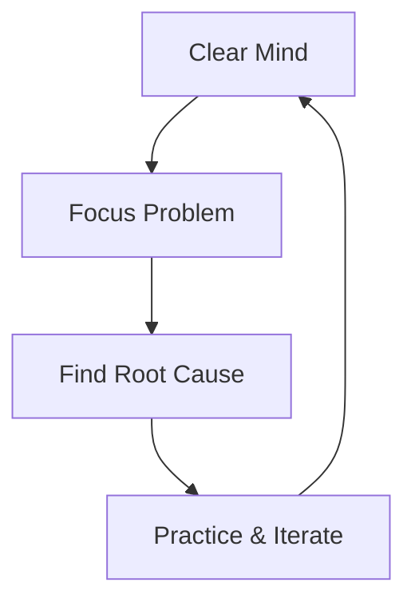

<div align="center">

# 📖 Mathematics for Machine Learning - Ragnor's Cheat Sheets

> A comprehensive collection of mathematical foundations for machine learning, based on "Mathematics for Machine Learning"

<p align="center">
  <a></a>
  <a></a>
  <a></a>
  <a></a>
</p>

<div align="center">
  <p align="center">
    <a href="#mindset">🧠 Clear Mind</a> •
    <a href="#content">🏃 Full Energy</a> •
    <a href="#practice">🏖 Inner Peace</a>
  </p>
</div>

</div>

## 🚀 Quick Start

### Prerequisites
- Node.js (v14 or higher)
- npm (v6 or higher)
- Hexo CLI (`npm install -g hexo-cli`)

### Installation
```bash
# Clone the repository
git clone https://github.com/RagnorLi/mathematics.git
cd mathematics

# Install dependencies
npm install
```

### Development
```bash
# Start development server
npm run dev
```
This will:
- Clean Hexo cache
- Start Hexo server on port 4567
- Watch and compile Tailwind CSS

### Build
```bash
# Build for production
npm run build
```
This will:
- Clean Hexo cache
- Remove db.json if exists
- Compile Tailwind CSS
- Generate static files
- Run Gulp tasks

### Available Scripts
- `npm run dev` - Start development environment
- `npm run build` - Build for production
- `npm run format` - Format code using Prettier

### Project Structure
```
.
├── themes/
│   └── coo/
│       └── source/
│           └── css/
│               ├── style.tailwindcss
│               └── style.css
├── package.json
└── _config.yml
```

## 📚 Contents

### 1. Linear Algebra
- Vector Spaces
- Linear Transformations
- Eigenvalues and Eigenvectors
- Matrix Decompositions

### 2. Analytic Geometry
- Vectors and Spaces
- Matrix Transformations
- Quadratic Forms

### 3. Probability and Statistics
- Probability Basics
- Random Variables
- Statistical Inference

### 4. Optimization
- Gradient Descent
- Convex Optimization
- Lagrange Multipliers

## 🎯 Learning Philosophy

<div align="center">



</div>

## 🔧 Technical Stack

- Hexo v5.4.2
- TailwindCSS
- PostCSS
- Gulp
- npm-run-all

## 🤝 Contributing

Contributions are welcome! Please feel free to:
1. Fork the repository
2. Create your feature branch (`git checkout -b feature/amazing-feature`)
3. Commit your changes (`git commit -m 'Add some amazing feature'`)
4. Push to the branch (`git push origin feature/amazing-feature`)
5. Open a Pull Request

## 📃 License

This project is licensed under the [MIT License](LICENSE) and is maintained by [Ragnor](https://github.com/RagnorLi).

<div align="center">

*Last updated: 2024-02-19 09:12:14 UTC*

</div>
