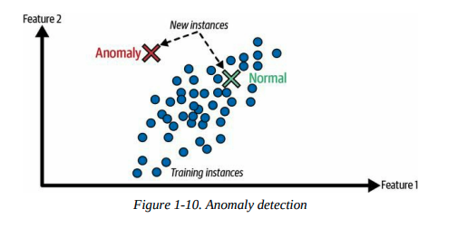
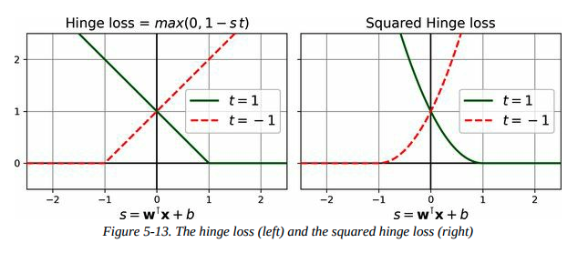

## Machine Learning Landscape

### 机器学习是什么？

**Machine learning** is the science (and art) of programming computers so they can learn from data.

- **General Definition:**

  > [Machine learning is the] field of study that gives computers the ability to learn without being explicitly programmed.  
  > — **Arthur Samuel, 1959**

- **Engineering-Oriented Definition:**

  > A computer program is said to learn from experience \(E\) with respect to some task \(T\) and some performance measure \(P\), if its performance on \(T\), as measured by \(P\), improves with experience \(E\).  
  > — **Tom Mitchell, 1997**

{.marker-round}

### 为什么要使用机器学习？

`4图一总`

#### 图示机器学习 vs 传统编程


#### 总结

- 针对现有解决方案需要大量微调或长规则列表的问题（机器学习模型通常可以简化代码，并且比传统方法表现更好）。
- 对于使用传统方法无法找到良好解决方案的复杂问题比如语音识别（最佳的机器学习技术可能可以找到解决方案）。
- 在不断变化的环境中（机器学习系统可以很容易地在新数据上重新训练，始终保持最新状态）。
- 获取关于复杂问题和大量数据的深入见解，即数据挖掘出的模式识别。

{.marker-round}

### 机器学习的现实应用

| ID  | 名称                                             | 介绍                                                                                                      | 所用到的机器学习                         |
|-----|--------------------------------------------------|-----------------------------------------------------------------------------------------------------------|------------------------------------------|
| 1   | Analyzing images of products on a production line to automatically classify them | 对生产线上的产品图像进行分析以自动分类                                                                 | 图像分类，通常使用 CNN 或 Transformers   |
| 2   | Detecting tumors in brain scans                  | 检测脑部扫描中的肿瘤                                                                                     | 语义图像分割，通常使用 CNN 或 Transformers|
| 3   | Automatically classifying news articles          | 自动分类新闻文章                                                                                         | NLP，使用 RNN、CNN 或 Transformers       |
| 4   | Automatically flagging offensive comments on discussion forums | 自动标记讨论论坛上的攻击性评论                                                                          | NLP，使用文本分类技术                     |
| 5   | Summarizing long documents automatically         | 自动总结长文档                                                                                           | NLP 的文本总结分支                        |
| 6   | Creating a chatbot or a personal assistant       | 创建聊天机器人或个人助理                                                                                 | 涉及 NLP 组件，包括 NLU 和问答模块        |
| 7   | Forecasting your company’s revenue next year, based on many performance metrics | 根据多个性能指标预测公司明年的收入                                                                       | 回归任务，使用线性回归、SVM、随机森林等   |
| 8   | Making your app react to voice commands          | 使应用程序对语音命令作出反应                                                                             | 语音识别，使用 RNN、CNN 或 Transformers   |
| 9   | Detecting credit card fraud                      | 检测信用卡欺诈                                                                                           | 异常检测，使用 Isolation Forests、GMM、自动编码器 |
| 10  | Segmenting clients based on their purchases so that you can design a different marketing strategy for each segment | 基于客户的购买行为进行客户分群，以设计不同的营销策略                                          | 聚类，使用 K-means、DBSCAN 等             |
| 11  | Representing a complex, high-dimensional dataset in a clear and insightful diagram | 将复杂的高维数据集以清晰和有见地的图形方式表示                                                          | 数据可视化，涉及降维技术                  |
| 12  | Recommending a product that a client may be interested in, based on past purchases | 基于过去的购买记录推荐客户可能感兴趣的产品                                                              | 推荐系统，使用神经网络                   |
| 13  | Building an intelligent bot for a game           | 为游戏构建智能机器人                                                                                     | 强化学习（RL）                             |

{.show-header .left-text}

### 机器学习的分类

-  **根据训练时的监督程度分类**：
  - 监督学习（Supervised Learning）
  - 无监督学习（Unsupervised Learning）
  - 半监督学习（Semi-supervised Learning）
  - 自监督学习（Self-supervised Learning）
  - 其他（Others）

-  **根据是否可以实时增量学习分类**：
  - 在线学习（Online Learning）
  - 批量学习（Batch Learning）

-  **根据工作原理分类**：
  - 基于实例的学习（Instance-based Learning）
  - 基于模型的学习（Model-based Learning）

{.marker-round}

这些标准不是互斥的，你可以根据需要将它们以任何方式组合。例如，最先进的垃圾邮件过滤器可能通过使用深度神经网络模型来实时学习，该模型由用户提供的垃圾邮件和正常邮件示例进行训练，这使得它成为一个在线的、基于模型的、有监督的学习系统。

{.marker-none}

### 有监督学习


- **定义**： 有监督学习是通过提供包含正确答案（称为标签）的训练集，让模型学习如何从输入数据预测输出。

- **主要任务**：
  - **分类**：模型从标记了类别的示例中学习如何对新数据进行分类，例如垃圾邮件过滤器。
  - **回归**：模型从标记了数值目标的示例中学习如何预测连续值，例如预测汽车价格。
  - 注意，回归模型也可以用于分类任务。

- **标签与目标**： 在回归任务中，标签通常称为目标（target），而在分类任务中更常称为标签（label）。

- **特征**： 输入数据的特征（features）是模型用来进行预测的属性或变量，通常也被称为预测变量（predictors）或属性（attributes）。

{.marker-round}

### 无监督学习

`Learning without a teacher!`

**定义**：
  - 无监督学习是指在没有标注数据的情况下，系统通过分析数据内部的结构和关系自行学习。

**主要任务**：
  - **聚类（Clustering）**：将相似的样本分组，例如根据博客访问者的行为将他们分成不同的群体。
  - **可视化（Visualization）**：通过将高维数据映射到二维或三维空间，帮助理解数据的分布和结构。
  - **降维（Dimensionality Reduction）**：通过减少特征数量来简化数据，同时尽量保留重要信息，常用于特征提取。
  - **异常检测（Anomaly Detection）**：识别异常数据点，例如检测信用卡欺诈或制造缺陷。
  - **关联规则学习（Association Rule Learning）**：发现数据中属性之间的关系，例如在销售记录中找到经常一起购买的商品组合。

{.marker-round}

### 自监督学习

- 1. **定义**： 自监督学习是一种机器学习方法，通过从未标注的数据集中生成标签，创建一个完全标注的数据集。生成标签后，使用常规的监督学习算法进行训练。

- 2. **过程**： 在自监督学习中，模型使用部分修改或遮掩的输入数据进行训练，目标是恢复或预测原始的未修改数据。例如，模型通过学习如何将遮挡的部分恢复成完整的图像来训练。通过这种方式，模型不需要人为的标签，而是使用原始图像的完整版本作为标签（目标）。训练过程中，模型学会如何填补遮挡的区域，从而提升对图像内容的理解。这种方法可以用于图像修复、去噪、图像生成等任务。

- 3. **与其他学习方式的关系**： 自监督学习与无监督学习不同，因为它在训练过程中使用生成的标签，因而更接近监督学习。无监督学习通常用于聚类、降维和异常检测，而自监督学习则主要应用于分类和回归任务。

- 4. **独立类别**： 虽然自监督学习有时被视为无监督学习的一部分，但由于其在训练过程中生成标签的特性，通常将其视为独立的学习类别更为合适。

{.marker-round}

### 强化学习


-  **定义**： 强化学习是一种独特的学习方法，其中学习系统（称为智能体）通过观察环境、选择和执行动作，并根据结果获取奖励或惩罚（负奖励）来学习最佳策略。

-  **学习过程**： 智能体在环境中执行动作，观察结果并根据获得的奖励或惩罚来调整其策略（称为政策）。这一过程不断重复，直到找到能够最大化长期奖励的最佳策略。

-  **关键概念**：
  - **智能体（Agent）**：负责在环境中采取行动的主体。
  - **环境（Environment）**：智能体所处的外部条件，智能体从中接收反馈。
  - **政策（Policy）**：定义智能体在特定情境下应该选择的行动策略。
  - **奖励（Reward）**：智能体执行动作后得到的反馈，可以是正向奖励（奖励）或负向奖励（惩罚）。

-  **学习过程的图解**： 通过一个简单的示意图解释强化学习的过程：智能体观察环境，选择动作，执行动作后获得奖励或惩罚，更新策略并重复该过程，直到找到最优策略。

{.marker-round}

### 批量学习

- **定义**： 批量学习（Batch Learning）是指系统无法进行增量学习，需要使用全部数据进行训练。这通常需要大量的时间和计算资源，并且一般在离线状态下完成（称为离线学习）。

- **特点**：
  - 系统一旦训练完成并投入使用，就不会再学习，只会应用它学到的内容。
  - 模型的性能可能会随着时间的推移而下降，因为世界在不断变化，而模型保持不变。这种现象被称为**模型腐化**（model rot）或**数据漂移**（data drift）。

-  **解决方案**： 需要定期用最新数据重新训练模型，频率取决于具体应用场景。例如，对于变化缓慢的任务，重新训练的频率可以较低，而对于快速变化的任务（如金融市场预测），则需要更频繁地重新训练。

- **挑战**：
  - 训练整个数据集可能需要数小时甚至数天的时间，且使用全部数据进行训练需要大量计算资源（CPU、内存、磁盘空间、网络等）。
  - 如果数据量巨大，甚至可能无法使用批量学习算法。
  - 对于需要在有限资源（如智能手机或火星探测器）上自主学习的系统，携带大量训练数据并进行长时间训练是不可行的。

- **自动化的可行性**： 尽管批量学习的流程涉及多个步骤（如训练、评估、部署），但这些步骤都是结构化的、可重复的，现代机器学习工具和框架（如TensorFlow、Scikit-learn等）提供了自动化这些步骤的支持。因此，整个训练、评估和部署过程可以相对容易地实现自动化，减少了人工干预的复杂性。

- **替代方案**： 针对需要更高反应速度的场景，可以考虑使用能够进行增量学习的算法，避免每次都从头开始重新训练模型。

{.marker-round}

### 在线学习

- **定义**： 在线学习是指系统通过增量地学习数据实例来逐步更新模型。每个学习步骤都是快速且低成本的，这使得系统可以在数据到达时实时学习和更新。

- **应用场景**：
  - **快速适应变化**：适用于需要迅速适应变化的系统，例如检测股市中的新模式。
  - **资源受限环境**：适用于计算资源有限的环境，例如移动设备上的模型训练。

- **增量学习与大数据处理**： 在线学习算法可以用于处理无法一次性装入内存的巨大数据集（称为“外存学习”）。算法会分批加载数据，逐步训练模型，直到处理完所有数据。

- **关键参数**：
  - **学习率（Learning Rate）**：决定系统适应变化数据的速度。高学习率使系统快速适应新数据，但也可能容易遗忘旧数据；低学习率则使系统对新数据的噪声更不敏感，但更新速度较慢。

- **挑战**：**数据质量**：如果系统接收到坏数据，性能可能会迅速下降。特别是在实时系统中，坏数据的影响更为显著。为了降低风险，需要密切监控系统的输入数据和性能表现，及时处理异常数据。

- **风险控制**： 为了应对坏数据带来的风险，可能需要在检测到性能下降时迅速关闭在线学习功能，并回退到之前的模型状态。此外，可以使用异常检测算法来监控输入数据的质量。

- **图解**：
  - 展示了在线学习的基本流程，即系统通过增量方式学习新数据，并持续更新模型，使其能够实时适应新数据的变化。
  - 展示了在线学习如何处理超大数据集的过程，通过将数据集分批加载到内存中逐步训练模型，从而实现对无法一次性装入内存的大数据集的学习。

{.marker-round}

### 基于实例的学习

- **定义**： 基于实例的学习是通过记住训练数据中的具体实例，并在预测新数据时通过比较相似性来进行分类或回归。这种方法主要依赖于计算新数据与已知实例之间的相似度。

- **相似度度量**： 系统通过一种相似性度量（如共同单词的数量）来判断新实例与已知实例的相似度。相似度越高，新实例越可能被归类为与相似实例相同的类别。

- **过程**：
  - 学习阶段：系统“记住”训练集中的所有实例。
  - 推理阶段：对于新的输入实例，系统计算它与所有已知实例的相似度，并根据相似度最高的实例的类别来进行分类。

- **图解**： 在图中，新的实例（图中的红色“X”）通过与训练实例比较，被分类为与其最相似的类别（三角形），因为它与多个三角形实例的相似度最高。

{.marker-round}

### 基于模型的学习

- **定义**: 基于模型的学习是一种通过构建模型来概括数据并进行预测的学习方式。

- **特点**:
  - **构建模型**: 从一组示例中概括出一个模型，该模型捕捉了数据中的某种模式或关系。
  - **预测能力**: 模型被训练后可以用来对新数据进行预测。例如，使用线性回归模型来预测某个国家的生活满意度与其人均GDP之间的关系。

- **典型流程**:
  1. **研究数据**: 例如，分析生活满意度和人均GDP的关系。
  2. **选择模型**: 选择合适的模型，如线性回归。
  3. **训练模型**: 使用训练数据来优化模型参数，使模型能够尽可能准确地拟合数据。
  4. **预测**: 使用训练好的模型对新数据进行预测。

- **图解**:
  -  显示了通过一个模型来区分新实例和训练实例的示意图。
  -  显示了通过GDP与生活满意度之间的关系来建立线性模型的步骤。这个模型最终能够用于预测其他国家的生活满意度。

- **总结**:
  - 你研究了数据。
  - 你选择了一个模型。
  - 你在训练数据上训练了模型。
  - 最终，你使用模型对新案例进行预测，希望模型能很好地泛化。

基于模型的学习通过构建和训练模型来捕捉数据中的模式，最终可以用这些模型进行有效的预测。这种学习方法广泛应用于各种机器学习项目中。

### 机器学习的挑战

`In short, since your main task is to select a model and train it on some data, the two things that can go wrong are “bad model” and “bad data”.`

| **ID** | **挑战**                       | **描述**                                                                                                                                                                      |
|--------|--------------------------------|-------------------------------------------------------------------------------------------------------------------------------------------------------------------------------|
| **1**  | **训练数据量不足**               | 机器学习需要大量数据才能正常工作。对于图像或语音识别等复杂问题，可能需要数百万个示例。                                                                                       |
| **2**  | **非代表性训练数据**             | 如果训练数据不能代表真实世界的数据，模型的表现将会很差。数据必须覆盖所有可能的场景。                                                                                       |
| **3**  | **数据质量差**                   | 含有大量噪音、错误或不一致的数据会导致模型表现不佳。数据清洗和预处理至关重要。                                                                                           |
| **4**  | **无关特征**                     | 不相关的特征可能会混淆模型，导致性能下降。特征选择或特征提取非常重要。                                                                                                     |
| **5**  | **训练数据过拟合**               | 当模型过于复杂时，它可能会学习训练数据中的噪音而不是实际模式，导致对新数据的泛化能力差。                                                                                   |
| **6**  | **训练数据欠拟合**               | 如果模型过于简单，它将无法捕捉数据中的潜在模式，导致在训练和新数据上的表现都很差。                                                                                       |

{.show-header .left-text}

### 训练数据量不足


- **定义**: 机器学习需要大量的数据来正常工作。即使是非常简单的问题通常也需要数千个例子，而对于复杂问题（如图像或语音识别），可能需要数百万个例子。

- **不合理的数据有效性**: 研究表明，给定足够的数据，简单的算法往往能表现得与复杂的算法一样好。这表明在开发算法和收集数据之间，我们应更多地考虑数据收集的重要性。

- **现实挑战**: 尽管大数据通常比算法更重要，但中小规模的数据集仍然非常普遍，而且获得额外的训练数据并不总是容易或便宜的。因此，不能轻易放弃对算法的优化。

{.marker-round}

### 非代表性数据

- **定义**：在机器学习中，为了使模型能够很好地泛化，训练数据必须能够代表你想要泛化的新情况。这对基于实例的学习和基于模型的学习同样重要。

- **图解**：
  - 
  - 训练模型时使用的国家集不包含GDP非常低或非常高的国家，导致模型无法准确预测这些国家的数据。
  - 当加入这些缺失的国家时，模型的表现和预测结果会显著改变，表明原有的简单线性模型无法很好地工作。

- **重要性**：使用非代表性的数据集训练的模型，尤其在预测非常贫穷或非常富有的国家时，可能会产生不准确的预测结果。

- **采样噪声**：即使样本量非常大，如果采样方法有缺陷，数据也可能是非代表性的。这种方法上的缺陷被称为采样偏差。

- **采样偏差的示例**：
  - **1936年美国总统选举**：Literary Digest 杂志进行的大规模调查由于采样方法偏向富裕人群，导致错误地预测了选举结果。
  - **YouTube音乐视频示例**：如果仅依赖于YouTube搜索结果来构建训练集，搜索引擎返回的视频可能偏向于流行的艺人，而不是代表整个"funk音乐"类别。

- **结论**：为了确保模型的准确性，必须谨慎选择和处理训练数据，以避免采样偏差和数据集的非代表性问题。

{.marker-round}

### 数据质量差

- **定义**：低质量的数据（如错误、异常值、噪声）会使系统难以检测到潜在模式，导致性能下降。
- **重要性**：清理训练数据非常重要，大多数数据科学家花费大量时间进行数据清理。
- **处理方法**：
  - 对于明显的异常值，可以选择删除或手动修正错误。
  - 对于缺少部分特征的实例，决定是否忽略该特征、忽略这些实例、填充缺失值，或训练包含和不包含该特征的两个模型。

{.marker-round}

### 无关特征

- **定义**：如果训练数据中包含太多不相关的特征，系统将难以学到有效的模式。
- **关键过程**：成功的机器学习项目依赖于良好的特征工程，包括以下步骤：
  - **特征选择**：从现有特征中选择最有用的特征进行训练。
  - **特征提取**：将现有特征组合成更有用的特征（例如，使用降维算法）。
  - **新特征创建**：通过收集新数据来生成新特征。

{.marker-round}

### 过拟合

过拟合（Overfitting）的要点如下：

- **定义**：过拟合是指模型在训练数据上表现良好，但在新数据上泛化能力差。这通常是因为模型过于复杂，捕捉到了训练数据中的噪音或无关模式。
- **图解**：
  - 这张图展示了一个高阶多项式模型在训练数据上的表现。虽然这个模型在训练数据（蓝色点）上表现得非常好，能够准确拟合所有数据点，但它很可能只是捕捉到了数据中的噪音，而不是反映真实的趋势，因此对新数据的泛化能力较差。
  - 这张图展示了三种模型的表现。虚线代表了在部分数据上训练的原始模型，实线表示在全部数据上训练的模型，而点线则是经过正则化处理后的模型。可以看到，正则化模型的斜率更小，尽管它在训练数据上的拟合效果稍差，但它对新数据的泛化能力更好。
- **解决方法**：
  - **简化模型**：选择更简单的模型，减少参数数量或约束模型。
  - **增加训练数据**：更多的数据可以帮助模型学习到更稳定和普适的模式。
  - **正则化**：通过加入正则化项（如L1或L2）来限制模型的复杂度，从而减少过拟合的风险。

{.marker-round}

### 欠拟合

- **定义**：欠拟合（Underfitting）是指模型过于简单，无法捕捉数据的潜在结构，导致在训练数据上的表现也不佳。

- **原因**：
  - 模型复杂度不足，无法准确表示数据中的复杂关系。

- **解决方法**：
  - 选择更强大的模型，增加模型参数。
  - 提供更好的特征（即通过特征工程增强输入数据）。
  - 减少对模型的约束（例如，降低正则化参数的值）。

{.marker-round}

### 机器学习BigPicture {.col-span-2}

| **ID** | **Topic**                                | **Summary**                                                                                                                                                                                                                      | **中文总结**                               |
|--------|------------------------------------------|----------------------------------------------------------------------------------------------------------------------------------------------------------------------------------------------------------------------------------|--------------------------------------------|
| 1      | **Purpose of Machine Learning**          | Machine learning is about making machines get better at some task by learning from data, instead of having to explicitly code rules.                                                                                              | 机器学习旨在通过从数据中学习，让机器在某些任务上表现得更好，而无需显式编写规则。|
| 2      | **Types of ML Systems**                  | There are many different types of ML systems: supervised or unsupervised, batch or online, instance-based or model-based.                                                                                                        | 机器学习系统有多种类型：监督学习或非监督学习，批量学习或在线学习，基于实例或基于模型。|
| 3      | **ML Project Process**                   | In an ML project, you gather data in a training set, and you feed the training set to a learning algorithm. If the algorithm is model-based, it tunes parameters to fit the model to the training set and generalizes to new cases.| 在机器学习项目中，收集数据形成训练集，并将其提供给学习算法。若算法是基于模型的，它会调整参数使模型适应训练集并泛化到新实例。|
| 4      | **Instance-based vs Model-based Algorithms** | If the algorithm is instance-based, it learns examples by heart and generalizes to new instances using a similarity measure.                                                                                                      | 如果算法是基于实例的，它会通过记住实例并使用相似性度量来泛化到新实例。|
| 5      | **Challenges in ML**                     | The system will not perform well if the training set is too small, non-representative, noisy, or polluted with irrelevant features. The model must balance complexity to avoid underfitting or overfitting.                      | 如果训练集太小、不具代表性、有噪声或包含无关特征，系统将表现不佳。模型必须在复杂性上进行平衡，以避免欠拟合或过拟合。|

{.show-header .left-text}

### 模型验证与泛化能力评估

- **模型泛化能力评估**：要评估模型对新数据的泛化能力，最直接的方法是将其部署在生产环境中，通过实际使用来观察模型的表现。
- **数据集划分**：一种更好的方法是将数据集划分为训练集（training set）和测试集（test set）。在训练集上训练模型，然后使用测试集评估模型的泛化误差（generalization error），即模型在未见过的数据上的错误率。
- **泛化误差的意义**：泛化误差可以帮助估计模型在新数据上的表现。如果训练误差低，但泛化误差高，说明模型发生了过拟合。
- **数据划分建议**：通常使用80%的数据用于训练，20%的数据用于测试，具体比例可以根据数据集的大小进行调整。

{.marker-round}

### 超参数调优与模型选择

- **问题概述**：超参数调优和模型选择是确保模型在新数据上表现良好的关键步骤。如果仅依靠测试集进行选择，可能会导致模型过拟合于测试集，从而在新数据上表现不佳。

- **常见问题**：
  - 多次在测试集上评估模型可能导致模型和超参数过拟合于该特定测试集，从而无法很好地泛化到新数据。

- **解决方案**：
  - **留出验证法**：从训练集中划分出一部分数据作为验证集（dev set），用来评估多个候选模型，并选择表现最佳的模型。
  - **交叉验证**：为了更准确地评估模型，可以使用交叉验证，将训练集分成多个小的验证集，每个模型在多个验证集上进行评估，最终选择表现最好的模型。

- **注意事项**：
  - 验证集过小可能导致评估不准确，可能错误地选择次优模型。
  - 验证集过大会导致剩余的训练集过小，从而影响模型的训练效果。

- **图解**
  图展示了使用保留验证（Holdout Validation）进行模型选择的流程：
  - **Training set（训练集）**：首先从训练集中训练多个模型。
  - **Dev set（开发集）**：接着在开发集（或验证集）上评估这些模型，选择表现最好的模型。
  - **Retrain the best model（重新训练最佳模型）**：将选择出的最佳模型在整个训练集上重新训练，包括原始的训练集和开发集。
  - **Test set（测试集）**：最后在测试集上评估最终模型，以得到模型在未见过的数据上的表现。
  这一流程帮助确保选择出的模型不仅在开发集上表现良好，而且在实际应用中也能有良好的泛化能力。

{.marker-round}

这个过程旨在通过合理划分数据集来避免模型在新数据上的性能下降，并确保最终模型在不同数据集上的表现都足够稳健。

{.marker-none}

### 数据不匹配

- **定义**：数据不匹配是指训练数据与实际使用中数据的差异，导致模型在实际应用中表现不佳。

- **关键问题**：当训练数据与实际生产环境中的数据不一致时，即使模型在训练集上表现良好，也可能在测试集上表现不佳。这种情况会使得我们无法判断模型在测试集上的表现差是由于训练集过拟合还是由于数据不匹配。

- **解决方案**：
  1. **创建train-dev集**：将部分训练数据保留作为train-dev集，在训练模型后，用train-dev集进行评估。如果模型在train-dev集上表现不佳，则说明模型过拟合。如果表现良好，则问题可能来自数据不匹配。
  2. **处理数据不匹配**：通过预处理训练数据，使其与实际应用中的数据更相似，以减少数据不匹配的影响。

- **图解**
  主要展示了如何处理数据不匹配的问题。它分为四个部分：
  - **Train（训练集）**：这部分数据来自网络，数量充足，但与实际使用的应用数据可能存在差异。
  - **Train-dev（训练-开发集）**：从训练集中保留一部分数据，专门用来评估模型是否在训练集上过拟合。如果模型在这个集上表现不好，说明模型可能过拟合。
  - **Dev（开发集）**：用来评估模型在接近实际使用环境的数据上的表现，从而检测数据不匹配的问题。
  - **Test（测试集）**：最终用于评估模型的实际表现。
  通过这一流程，可以确保模型不仅在训练集上表现良好，还能够在实际应用的数据上有效运行，从而应对数据不匹配的问题。

- **结论**：在开发机器学习模型时，确保训练数据和实际使用中的数据尽可能一致是非常重要的，特别是在生产环境中数据稀缺的情况下，数据不匹配可能对模型性能造成严重影响。

{.marker-round}

### exercise {.col-span-3}

| #   | Questions                                                                                                                                       | 中文翻译                                                                                               |
|-----|-------------------------------------------------------------------------------------------------------------------------------------------------|--------------------------------------------------------------------------------------------------------|
| 1   | How would you define machine learning?                                                                                                          | 你会如何定义机器学习？                                                                                   |
| 2   | Can you name four types of applications where it shines?                                                                                        | 你能举出四种机器学习表现出色的应用吗？                                                                   |
| 3   | What is a labeled training set?                                                                                                                 | 什么是带标签的训练集？                                                                                   |
| 4   | What are the two most common supervised tasks?                                                                                                  | 最常见的两种监督学习任务是什么？                                                                         |
| 5   | Can you name four common unsupervised tasks?                                                                                                    | 你能举出四种常见的无监督学习任务吗？                                                                     |
| 6   | What type of algorithm would you use to allow a robot to walk in various unknown terrains?                                                      | 你会使用哪种算法让机器人在各种未知地形上行走？                                                           |
| 7   | What type of algorithm would you use to segment your customers into multiple groups?                                                            | 你会使用哪种算法将你的客户分成多个群体？                                                                 |
| 8   | Would you frame the problem of spam detection as a supervised learning problem or an unsupervised learning problem?                             | 你会将垃圾邮件检测问题归类为监督学习问题还是无监督学习问题？                                               |
| 9   | What is an online learning system?                                                                                                              | 什么是在线学习系统？                                                                                     |
| 10  | What is out-of-core learning?                                                                                                                   | 什么是外存学习（Out-of-core learning）？                                                                  |
| 11  | What type of algorithm relies on a similarity measure to make predictions?                                                                      | 哪种算法依赖相似性度量进行预测？                                                                          |
| 12  | What is the difference between a model parameter and a model hyperparameter?                                                                    | 模型参数和模型超参数之间有什么区别？                                                                      |
| 13  | What do model-based algorithms search for? What is the most common strategy they use to succeed? How do they make predictions?                  | 基于模型的算法在寻找什么？它们最常用的成功策略是什么？它们如何进行预测？                                  |
| 14  | Can you name four of the main challenges in machine learning?                                                                                    | 你能说出机器学习中的四个主要挑战吗？                                                                      |
| 15  | If your model performs great on the training data but generalizes poorly to new instances, what is happening? Can you name three possible solutions? | 如果你的模型在训练数据上表现很好但在新实例上泛化性差，这是什么情况？你能举出三种可能的解决方案吗？            |
| 16  | What is a test set, and why would you want to use it?                                                                                           | 什么是测试集，为什么要使用它？                                                                            |
| 17  | What is the purpose of a validation set?                                                                                                        | 验证集的作用是什么？                                                                                      |
| 18  | What is the train-dev set, when do you need it, and how do you use it?                                                                          | 什么是训练-开发集（train-dev set），什么时候需要它，以及如何使用它？                                        |
| 19  | What can go wrong if you tune hyperparameters using the test set?                                                                               | 如果你使用测试集来调整超参数，可能会出什么问题？                                                          |


{.show-header .left-text}

## End-to-End Machine Learning Project

### Setup 数据采集

| 特征名称               | 描述                             |
|------------------------|----------------------------------|
| longitude              | 经度                             |
| latitude               | 纬度                             |
| housing_median_age     | 房屋中位年龄                     |
| total_rooms            | 房间总数                         |
| total_bedrooms         | 卧室总数                         |
| population             | 人口数量                         |
| households             | 家庭户数                         |
| median_income          | 中位收入                         |
| median_house_value     | 中位房屋价值                     |
| ocean_proximity        | 靠近海洋的距离                   |

{.show-header .left-text}


{.marker-none}

### Step-00 项目整体视角 {.col-span-2}

#### Step-01 问题框架化

- **明确业务目标**：首先要了解构建模型的最终业务目标是什么。模型的预测结果如何帮助企业决策，这决定了问题的定义、模型的选择、评估标准以及调整模型的力度。

- **当前解决方案**：询问现有解决方案的表现如何，以此作为参考来确定模型的性能要求，并指导问题的解决。现有解决方案可能依赖人工估算，这种方法耗时且不准确，因此公司需要一个模型来预测地区房价。

- **数据管道**：机器学习过程通常由多个异步运行的数据处理组件组成。这些组件串联起来处理数据，逐步生成模型的最终预测结果。每个组件独立工作，彼此通过数据存储交互。
  
  - **District Data**（区域数据）： 图的最左边是输入数据，即每个地区的相关数据，比如人口、收入、房价等。这些数据是整个流程的起点。

  - **District Pricing**（区域定价）： 中间的组件代表了一个机器学习模型或算法，它利用输入的区域数据来预测每个地区的房价（即中间的“District Pricing”框）。这个组件是整个管道的核心，负责生成模型的主要输出。

  - **Investment Analysis**（投资分析）： 区域房价预测完成后，预测结果会被输入到下一个组件，即投资分析系统。这个系统会根据预测的房价和其他输入信号来判断是否在某个地区投资。这一步是决定最终投资决策的关键。

  - **Investments**（投资）： 图的最右侧是最终的输出——投资决策。基于之前的分析，系统决定在某些地区进行投资。

  尽管这个管道图看起来非常简单甚至宏观，但它反映了一个非常普遍且重要的概念：将复杂的任务分解为简单的步骤，通过管道连接起来，从而形成一个整体系统。这种方法在数据科学、机器学习以及广泛的商业应用中都非常有用。

- **问题类型**：明确需要解决的问题是监督学习、无监督学习，还是强化学习任务，并确定是分类问题还是回归问题。波士顿房价预测问题是一个典型的多元回归问题。

- **学习类型**：对于当前问题，由于数据量适中且无需快速响应变化的实时数据，因此选择批量学习（Batch Learning）是合适的。如果数据量很大，可以考虑使用在线学习或MapReduce方法来分布式处理数据。

{.marker-timeline}

#### Step-02 选择模型性能度量指标

**选择的性能度量指标：** 均方根误差 (RMSE)

**选择原因：**

- **度量原理**：`KaTeX:RMSE` 衡量预测值与实际值之间的平方差的平均值的平方根，强调大误差。这对于房价预测中的大误差非常重要。
- **适用性**：房价数据通常具有正态分布特性，```KaTeX:RMSE``` 适合这种数据分布。
- **行业标准**：```KaTeX:RMSE``` 是回归问题中广泛使用的标准度量指标，尤其是在房价预测等领域。

**为什么不选择其他指标：**

- **MAE**：虽然对异常值不敏感，但在房价预测中需要对大误差给予更多的关注，```KaTeX:RMSE``` 在这方面表现更优。
- **R² 决定系数**：```KaTeX:R^2``` 表示模型的拟合程度，但可能在数据分布异常时误导，不如 ```KaTeX:RMSE``` 直观。

因此，在加利福尼亚房价预测项目中，```KaTeX:RMSE``` 是最合适的选择。

[性能度量指标选择表](/machine-learning.html#machine-learning-performance-measure) {.link-arrow}

#### Step-03 验证你的假设

`杜绝自己想象`

- **列出并验证假设**：列出并验证所有已经做出的假设，这可以帮助你在早期发现严重问题。
- **场景示例**：例如，假设你的系统输出的区域价格将被下游的机器学习系统使用，而你假设这些价格会被直接使用。然而，如果下游系统将价格转换为分类（如“便宜”、“中等”或“昂贵”），并使用这些类别而不是实际价格，那么你的假设可能就不成立。
- **任务类型错误**：如果仅需预测类别，那么问题应被设定为分类任务而非回归任务，避免在错误的任务类型上浪费时间。
- **与下游系统团队沟通**：在与下游系统团队沟通后，确认他们确实需要的是实际价格而非类别。这个步骤验证了你最初的假设是正确的。
- **开始编码**：当确认假设正确后，你可以放心地开始编写代码。

{.marker-timeline}

### Step-01 使用Google Colab


或者，本地clone [handson-ml3] (https://github.com/ageron/handson-ml3) 到本地

```shell script
$ jupyter notebook
```

### Step-02 编码环境检查


```python
print("Welcome to Machine Learning! ragnor.li")
```

```python
import sys
assert sys.version_info >= (3, 7)
```

```python
from packaging import version
import sklearn

assert version.parse(sklearn.__version__) >= version.parse("1.0.1")
```

### Step-03 数据集下载

```python
from pathlib import Path
import pandas as pd
import tarfile
import urllib.request

def load_housing_data():
    tarball_path = Path("datasets/housing.tgz")
    if not tarball_path.is_file():
        Path("datasets").mkdir(parents=True, exist_ok=True)
        url = "https://github.com/ageron/data/raw/main/housing.tgz"
        urllib.request.urlretrieve(url, tarball_path)
        with tarfile.open(tarball_path) as housing_tarball:
            housing_tarball.extractall(path="datasets")
    return pd.read_csv(Path("datasets/housing/housing.csv"))

housing = load_housing_data()
```

### Step-04 杀猪先瞅瞅心里有个底 {.col-span-3}


#### 整体特征瞅一眼

`housing.head()` 显示数据框的前五行。用于快速查看数据的前几行记录，了解数据的整体结构。`尤其要把数据实例的特征代表的实际业务含义研究清楚`

|index|longitude|latitude|housing\_median\_age|total\_rooms|total\_bedrooms|population|households|median\_income|median\_house\_value|ocean\_proximity|
|---|---|---|---|---|---|---|---|---|---|---|
|0|-122\.23|37\.88|41\.0|880\.0|129\.0|322\.0|126\.0|8\.3252|452600\.0|NEAR BAY|
|1|-122\.22|37\.86|21\.0|7099\.0|1106\.0|2401\.0|1138\.0|8\.3014|358500\.0|NEAR BAY|
|2|-122\.24|37\.85|52\.0|1467\.0|190\.0|496\.0|177\.0|7\.2574|352100\.0|NEAR BAY|
|3|-122\.25|37\.85|52\.0|1274\.0|235\.0|558\.0|219\.0|5\.6431|341300\.0|NEAR BAY|
|4|-122\.25|37\.85|52\.0|1627\.0|280\.0|565\.0|259\.0|3\.8462|342200\.0|NEAR BAY|

{.show-header .left-text}


#### 数据集中实例数据类型与缺失检查

`housing.info()` 显示数据框的基本信息，包括行数、列数、每列的非空值数量和数据类型。用于检查数据框的结构和识别缺失数据。

```text
<class 'pandas.core.frame.DataFrame'>
RangeIndex: 20640 entries, 0 to 20639
Data columns (total 10 columns):
 #   Column              Non-Null Count  Dtype  
---  ------              --------------  -----  
 0   longitude           20640 non-null  float64
 1   latitude            20640 non-null  float64
 2   housing_median_age  20640 non-null  float64
 3   total_rooms         20640 non-null  float64
 4   total_bedrooms      20433 non-null  float64
 5   population          20640 non-null  float64
 6   households          20640 non-null  float64
 7   median_income       20640 non-null  float64
 8   median_house_value  20640 non-null  float64
 9   ocean_proximity     20640 non-null  object 
dtypes: float64(9), object(1)
memory usage: 1.6+ MB
```

`检查结果如下：`

| 序号 | 要点                                                         |
|------|--------------------------------------------------------------|
| 1    | 数据集中共有 20,640 个实例（样本）。           |
| 2    | `total_bedrooms` 属性中有 207 个地区缺少值，需要处理。       |
| 3    | 除 `ocean_proximity` 属性外，所有其他属性都是数值型的。      |
| 4    | `ocean_proximity` 属性的数据类型是 `object`，即文本属性。    |
| 5    | `ocean_proximity` 列中的值是重复的，表明它可能是分类属性。   |
| 6    | 可以使用 `value_counts()` 方法来查找类别及其分布。           |

{.show-header .left-text}


#### 数据集中不同类别特征的分布情况

`housing["ocean_proximity"].value_counts()` 统计ocean_proximity列中每个类别的频次。用于了解数据集中不同类别的分布情况。

```text
<1H OCEAN     9136
INLAND        6551
NEAR OCEAN    2658
NEAR BAY      2290
ISLAND           5
Name: ocean_proximity, dtype: int64
```

#### 快速了解数值数据的分布和主要统计特征

`housing.describe()` 生成数据框数值列的汇总统计信息，包括计数、平均值、标准差、最小值、四分位数和最大值。用于快速了解数值数据的分布和主要统计特征。


|index|longitude|latitude|housing\_median\_age|total\_rooms|total\_bedrooms|population|households|median\_income|median\_house\_value|
|---|---|---|---|---|---|---|---|---|---|
|count|20640\.0|20640\.0|20640\.0|20640\.0|20433\.0|20640\.0|20640\.0|20640\.0|20640\.0|
|mean|-119\.56970445736432|35\.63186143410853|28\.639486434108527|2635\.7630813953488|537\.8705525375618|1425\.4767441860465|499\.5396802325581|3\.8706710029069766|206855\.81690891474|
|std|2\.0035317235025882|2\.1359523974571153|12\.58555761211165|2181\.615251582795|421\.3850700740322|1132\.462121765341|382\.32975283161073|1\.8998217179452688|115395\.61587441387|
|min|-124\.35|32\.54|1\.0|2\.0|1\.0|3\.0|1\.0|0\.4999|14999\.0|
|25%|-121\.8|33\.93|18\.0|1447\.75|296\.0|787\.0|280\.0|2\.5633999999999997|119600\.0|
|50%|-118\.49|34\.26|29\.0|2127\.0|435\.0|1166\.0|409\.0|3\.5347999999999997|179700\.0|
|75%|-118\.01|37\.71|37\.0|3148\.0|647\.0|1725\.0|605\.0|4\.74325|264725\.0|
|max|-114\.31|41\.95|52\.0|39320\.0|6445\.0|35682\.0|6082\.0|15\.0001|500001\.0|

{.show-header .left-text}

`分析结果如下`

| 要点                        | 解释                                                                                                                             |
|-----------------------------|----------------------------------------------------------------------------------------------------------------------------------|
| `housing.describe()`         | 提供数据集中每个数值属性的统计摘要，包括计数、平均值、最小值、最大值以及四分位数（25%、50%、75%）。                                                    |
| `count`                     | 统计数据集中每个属性的非空值数量。                                                                                                 |
| `mean`                      | 计算每个属性的平均值。                                                                                                             |
| `std`                       | 显示标准差，衡量数据的离散程度。                                                                                                   |
| `min` 和 `max`               | 分别表示数据集中每个属性的最小值和最大值。                                                                                          |
| `25%`, `50%`, `75%`          | 表示数据的四分位数：25%表示第一个四分位数（Q1），50%是中位数，75%表示第三个四分位数（Q3）。                                                   |
| 百分位（percentile）的意义      | 百分位数指的是在一组观察值中某个百分比以下的值。比如，25%的区的 `housing_median_age` 小于18，50%小于29，75%小于37。                                     |
| `hist()` 方法                | 可以为每个数值属性绘制直方图，显示每个属性值在不同范围内的实例数量。直方图是了解数据类型的快速方式。                                                   |
| 绘制直方图的选项               | 可以为单个属性绘制直方图，或者使用 `hist()` 方法为整个数据集中的所有数值属性同时绘制直方图。                                               |

{.show-header .left-text}

#### 可视化单特征的数据分布情况

- 对 housing 数据集中的几个特征绘制直方图，并将这些图保存为高分辨率的 PNG 文件

```python

# extra code – code to save the figures as high-res PNGs for the book

IMAGES_PATH = Path() / "images" / "end_to_end_project"
IMAGES_PATH.mkdir(parents=True, exist_ok=True)

def save_fig(fig_id, tight_layout=True, fig_extension="png", resolution=300):
    path = IMAGES_PATH / f"{fig_id}.{fig_extension}"
    if tight_layout:
        plt.tight_layout()
    plt.savefig(path, format=fig_extension, dpi=resolution)
    
    
    
import matplotlib.pyplot as plt

# extra code – the next 5 lines define the default font sizes
plt.rc('font', size=14)
plt.rc('axes', labelsize=14, titlesize=14)
plt.rc('legend', fontsize=14)
plt.rc('xtick', labelsize=10)
plt.rc('ytick', labelsize=10)

housing.hist(bins=50, figsize=(12, 8))
save_fig("attribute_histogram_plots")  # extra code
plt.show()

```


`图形中观察出来的秘密`

| ID  | 要点内容                       | 详细描述                                                                                                           | 如何分析得出                                                                 |
|-----|----------------------------|------------------------------------------------------------------------------------------------------------------|---------------------------------------------------------------------------|
| 1   | 中位数收入未以美元表示                | 中位数收入属性的值似乎并不代表美元，而是缩放后的数值范围，如15和0.5等，并不是实际的收入金额。                                     | 通过观察“median_income”的直方图，发现数值范围在0到15之间，这明显不是美元的典型表示范围。            |
| 2   | 房价上限影响模型预测                 | 房价和房龄的直方图显示，它们被封顶在某个特定的值，如500,000美元，这可能导致模型在预测时遇到限制。                                      | “median_house_value”和“housing_median_age”的直方图中，数据堆积在最大值处，这意味着数据被封顶。  |
| 3   | 属性具有不同的尺度                   | 数据集中不同属性的范围和分布差异较大，某些属性如“total_rooms”数值较大，而“median_income”数值较小。                               | 从每个属性的直方图观察到，各属性的数值范围差异明显，这意味着它们的尺度不同，可能需要缩放。                              |
| 4   | 直方图右偏，数据分布不对称             | 大多数属性的直方图显示出右偏分布，即大部分数据集中在左侧，而尾部拉长，这种分布可能会影响模型训练的效果。                                         | 通过观察直方图，可以看到许多属性的分布呈现右偏，特别是像“median_income”，这是数据分布不对称的特征。               |
| 5   | 在进一步分析数据前创建测试集            | 分析数据前需要创建一个测试集，以确保模型评估时有未见过的数据，这对于验证模型的泛化能力非常重要。                                               | 这是数据科学中的一个常见做法，目的是确保模型评估的公正性和可靠性。虽然不是从图表中直接得出，但这是一个关键的分析步骤。       |

{.show-header .left-text}

### Step-05 分割测试集 {.col-span-3}

#### 数据集划分

```python
import numpy as np

def shuffle_and_split_data(data, test_ratio):
    # 生成一个与数据集长度相同的随机排列的索引数组，确保数据的顺序被打乱，随机打乱后，训练集和测试集的分布更接近真实情况，这样训练出来的模型能够更好地适应新数据，从而提高模型的泛化能力。
    shuffled_indices = np.random.permutation(len(data))
    
    # 计算测试集的大小，test_ratio 确定测试集占总数据集的比例
    test_set_size = int(len(data) * test_ratio)
    
    # 根据打乱后的索引数组，选取前 test_set_size 个索引作为测试集的索引
    test_indices = shuffled_indices[:test_set_size]
    
    # 剩下的索引作为训练集的索引
    train_indices = shuffled_indices[test_set_size:]
    
    # 根据训练集和测试集的索引，分别返回训练集和测试集的数据
    return data.iloc[train_indices], data.iloc[test_indices]

```

You can then use this function like this:

```python
train_set, test_set = shuffle_and_split_data(housing, 0.2)
len(train_set)
len(test_set)
```

#### 稳定测试集创建与可靠模型评估

在机器学习项目中，测试集的主要目的是评估模型在未见过的数据上的表现，从而判断模型的泛化能力。如果你每次运行程序时生成的测试集不同，意味着测试集的数据每次都在变化，这会导致以下问题：

- **模型可能见过全部数据**：如果每次运行程序时，测试集的数据都不一样，随着多次运行，模型最终可能会见到整个数据集的所有数据。这样，测试集不再是真正意义上的“未见过”的数据，从而无法有效地评估模型的泛化能力。

- **无法比较模型的性能**：如果测试集每次都不同，那么模型在每次训练后的表现也会因为测试数据不同而有所变化。这使得你无法有效地比较模型在不同运行中的表现，因为测试集本身的差异就会导致性能评估的结果不一致。

- **不稳定的模型评估**：由于测试集的变化，你得到的模型性能评估结果每次都不一样，无法判断模型的实际能力。这种不稳定性会让你难以得出可靠的结论。

{.marker-round}

因此，为了保证测试集的稳定性和模型评估的可靠性，必须避免在每次运行程序时生成不同的测试集。解决方案包括：
- 在第一次运行程序时保存测试集，然后在后续运行中重新加载这个测试集。
- 使用随机数种子（`np.random.seed(42)`）确保打乱数据的顺序是可重复的。
- 使用更稳定的方法来划分训练集和测试集，比如基于数据实例的唯一标识符进行划分。

{.marker-round}


`要将代码逻辑串联成问题的形式，可以按照以下的顺序来构建：`

- **如何判断一个实例是否应该进入测试集？**
  - 使用 `is_id_in_test_set(identifier, test_ratio)` 函数，传入实例的标识符 (`identifier`) 和测试集比例 (`test_ratio`)，判断该实例是否应该进入测试集。判断的依据是根据实例标识符的哈希值，若其值小于 `test_ratio * 2**32`，则该实例属于测试集。

   ```python
   from zlib import crc32

   def is_id_in_test_set(identifier, test_ratio):
       return crc32(np.int64(identifier)) < test_ratio * 2**32
   ```

- **如何基于标识符将数据分为训练集和测试集？**
  - 使用 `split_data_with_id_hash(data, test_ratio, id_column)` 函数，通过对数据集中指定列的标识符进行哈希值判断，将数据集划分为训练集和测试集。

   ```python
   def split_data_with_id_hash(data, test_ratio, id_column):
       ids = data[id_column]
       in_test_set = ids.apply(lambda id_: is_id_in_test_set(id_, test_ratio))
       return data.loc[~in_test_set], data.loc[in_test_set]
   ```

- **如果数据集没有唯一标识符列，如何创建唯一标识符？**
  - 如果数据集中没有标识符列，可以使用行索引作为标识符。首先通过 `reset_index()` 方法添加一个索引列，然后使用该索引列来划分数据集。

   ```python
   housing_with_id = housing.reset_index()  # adds an `index` column
   train_set, test_set = split_data_with_id_hash(housing_with_id, 0.2, "index")
   ```

- **如何处理数据集在更新时行索引可能不稳定的问题？**
  - 为了避免行索引在数据集更新时的不稳定性，可以使用较为稳定的特征（如地理位置的经度和纬度）来生成唯一标识符。通过将经度和纬度组合，可以构造一个唯一标识符列。

   ```python
   housing_with_id["id"] = housing["longitude"] * 1000 + housing["latitude"]
   train_set, test_set = split_data_with_id_hash(housing_with_id, 0.2, "id")
   ```

- **Scikit-Learn 提供了多种将数据集分割成多个子集的函数**

  - 其中最简单的函数是 `train_test_split()`，它与之前定义的 `shuffle_and_split_data()` 函数功能类似。

  - **`train_test_split()` 函数的两个额外功能**：
    - **`random_state` 参数**：允许设置随机生成器的种子，以确保每次运行生成相同的随机分割。
    - **支持多数据集同步分割**：如果有多个行数相同的数据集（例如，特征和标签的 DataFrame），可以同时传递这些数据集，`train_test_split()` 会使用相同的索引将它们进行同步分割。
  
  ```python
  from sklearn.model_selection import train_test_split
  train_set, test_set = train_test_split(housing, test_size=0.2, random_state=42)
  ```
  - **代码示例**：使用 `train_test_split()` 将 `housing` 数据集分成训练集和测试集，测试集大小为数据集的20%（`test_size=0.2`），并通过设置 `random_state=42` 来确保分割的稳定性。

{.marker-timeline}


#### 分层抽样以确保数据集特征分布一致性

- **使用 Scikit-Learn 的 `train_test_split` 函数来划分数据集**

  - **目的**: 将数据集随机划分为训练集和测试集，同时确保划分的一致性。
  - **关键点**: 使用 `random_state=42` 来确保每次运行代码时，划分的结果一致，这样可以保证模型评估的可重复性。
     ```python
     from sklearn.model_selection import train_test_split
     train_set, test_set = train_test_split(housing, test_size=0.2, random_state=42)
     ```

- **理解纯随机采样的潜在偏差**

  - **问题**: 纯随机采样可能会导致数据集中某些重要特征的分布不均（例如，人口中的性别比例）。
  - **解决方案**: 使用分层抽样（Stratified Sampling）确保训练集和测试集中重要特征的分布与整个数据集一致。通过在划分数据集时考虑这些特征，可以避免偏差。
  - **示例**: 在性别比例为51.1%女性和48.9%男性的情况下，如果不使用分层抽样，测试集中的性别比例可能会与总体不符，导致结果偏差。

- **创建收入分类属性并绘制直方图**
  
  - **目的**: 将连续的收入数据分为多个类别，以便在数据划分时使用分层抽样。
  - **关键点**: 使用 `pd.cut` 将收入数据划分为五个类别，并通过绘制直方图观察每个类别的分布情况，确保这些类别在数据集中具有足够的代表性。
     ```python
     housing["income_cat"] = pd.cut(housing["median_income"],
                                    bins=[0., 1.5, 3.0, 4.5, 6., np.inf],
                                    labels=[1, 2, 3, 4, 5])
     ```

- **使用分层抽样划分数据集**

  - **目的**: 使用分层抽样确保训练集和测试集中重要特征（如收入）的比例与整个数据集一致。
  - **关键点**: 通过 `StratifiedShuffleSplit` 生成多次划分，并选择第一个划分作为训练集和测试集。分层抽样能够更好地保持数据集中重要特征的代表性。
     ```python
     from sklearn.model_selection import StratifiedShuffleSplit
     splitter = StratifiedShuffleSplit(n_splits=10, test_size=0.2, random_state=42)
     for train_index, test_index in splitter.split(housing, housing["income_cat"]):
         strat_train_set_n = housing.iloc[train_index]
         strat_test_set_n = housing.iloc[test_index]
     ```

- **验证分层抽样的效果**

  - **目的**: 确保分层抽样的效果达到预期，即测试集中的特征分布与整个数据集一致。
  - **关键点**: 通过计算测试集中每个收入类别的比例，验证分层抽样是否按照预期工作。比较使用分层抽样和随机抽样生成的测试集中的分布差异，确保分层抽样的有效性。
     ```python
     strat_test_set["income_cat"].value_counts() / len(strat_test_set)
     >>>
     3 0.350533
     2 0.318798
     4 0.176357
     5 0.114341
     1 0.039971
     Name: income_cat, dtype: float64
     ```
    - 类别 `3` 占比 `35.05%`
    - 类别 `2` 占比 `31.88%`
    - 类别 `4` 占比 `17.64%`
    - 类别 `5` 占比 `11.44%`
    - 类别 `1` 占比 `3.99%`
    
- **随机抽样 vs 分层抽象效果**

  - 创建分层抽样的测试集
  首先，你需要创建一个基于分层抽样的测试集，并计算各个类别在测试集中的分布情况。

  ```python
  from sklearn.model_selection import train_test_split
  
  # 创建收入类别的分类标签
  housing["income_cat"] = pd.cut(housing["median_income"],
                                 bins=[0., 1.5, 3.0, 4.5, 6., np.inf],
                                 labels=[1, 2, 3, 4, 5])
  
  # 使用分层抽样创建测试集
  strat_train_set, strat_test_set = train_test_split(housing, test_size=0.2, stratify=housing["income_cat"], random_state=42)
  
  # 计算分层抽样测试集的收入类别分布
  strat_test_proportions = strat_test_set["income_cat"].value_counts() / len(strat_test_set)
  ```

  - 创建随机抽样的测试集
  然后，你可以通过纯随机抽样创建另一个测试集，并计算其收入类别的分布情况。

  ```python
  # 使用随机抽样创建测试集
  random_train_set, random_test_set = train_test_split(housing, test_size=0.2, random_state=42)
  
  # 计算随机抽样测试集的收入类别分布
  random_test_proportions = random_test_set["income_cat"].value_counts() / len(random_test_set)
  ```

  - 比较测试集与总体数据集的分布
  你可以将分层抽样和随机抽样的结果与整个数据集的分布进行对比，生成图表或表格。

  ```python
  # 计算整个数据集的收入类别分布
  overall_proportions = housing["income_cat"].value_counts() / len(housing)
  
  # 创建对比表格
  comparison = pd.DataFrame({
      "Overall %": overall_proportions,
      "Stratified %": strat_test_proportions,
      "Random %": random_test_proportions,
  }).sort_index()
  
  # 计算误差
  comparison["Strat. Error %"] = 100 * (comparison["Stratified %"] - comparison["Overall %"]) / comparison["Overall %"]
  comparison["Rand. Error %"] = 100 * (comparison["Random %"] - comparison["Overall %"]) / comparison["Overall %"]
  
  # 输出结果
  print(comparison)
  ```

  - 图表展示
  生成对比图表：

  ```python
  comparison.plot(kind='bar', figsize=(10, 6))
  plt.show()
  ```
  

  - **Overall %**：整个数据集中各个收入类别的比例。这是“真实”分布，用于比较其他抽样方法的效果。
  - **Stratified %**：分层抽样后，测试集中各收入类别的比例。如果分层抽样效果好，这些比例应该与Overall %非常接近。
  - **Random %**：随机抽样后，测试集中各收入类别的比例。由于随机性，这些比例可能与Overall %有较大的偏差。
  - **Strat. Error %**：分层抽样后各收入类别比例与Overall %的偏差。偏差越小，分层抽样效果越好。
  - **Rand. Error %**：随机抽样后各收入类别比例与Overall %的偏差。通常偏差较大，说明随机抽样在保持特征分布一致性方面效果较差。


- **删除不再需要的 `income_cat` 列**

  - **目的**: 清理数据，删除不再需要的辅助列。
  - **关键点**: 删除 `income_cat` 列，确保后续分析和模型训练时的数据整洁。
     ```python
     for set_ in (strat_train_set, strat_test_set):
         set_.drop(["income_cat"], axis=1, inplace=True)
     ```

{.marker-timeline}

### Step-06 探索并可视化数据以获取洞见

我们进入到这一步后不再重点关注测试集，而训练集如果很大，你就要抽取一个缩小版的训练集，不大就copy一份做探索，记住`永远不要污染源数据`。

#### 1. 如何准备训练数据集以便进一步探索？

**问题：** 如何在不影响原始数据的情况下，准备训练数据集进行探索？

**解答：**
- 在进行数据探索和可视化之前，首先要确保训练集与测试集分开，并对训练集进行复制，以便进行各种数据变换而不影响原始数据。

```python
# 复制训练数据集
housing = strat_train_set.copy()
```

#### 2. 如何可视化地理数据？

`因为数据集是房价，而其中的经纬度就代表了地理位置，其实不用巧思就可以得出用经纬度绘制地图来可视化并探索数据是好的！`

**问题：** 如何创建一个地理散点图来可视化房屋数据的分布？

**解答：**
- 使用 `latitude` 和 `longitude` 来绘制房屋数据的地理分布，便于观察房屋的地理位置特征。

```python
# 绘制地理散点图
housing.plot(kind="scatter", x="longitude", y="latitude", grid=True)
plt.show()
```

**图解：**
- 此图展示了加利福尼亚的房屋数据，但无法明确显示密集区域。

#### 3. 如何增强地理数据的可视化效果以更好地识别密集区域？

`通过观察图，很明显的一个问题是 it's hard to see any particular pattern!`

**问题：** 如何调整可视化参数来突出显示数据点密集区域？

**解答：**
- 通过设置 `alpha` 参数，可以更清晰地看到数据点密集区域。

```python
# 调整 alpha 参数以增强可视化效果
housing.plot(kind="scatter", x="longitude", y="latitude", grid=True, alpha=0.2)
plt.show()
```

**图解：**
- 使用 `alpha=0.2` 之后，图中清楚地显示了数据点的密集区域，如湾区、洛杉矶及圣地亚哥周围。

#### 4. 如何结合人口密度和房价进行地理数据的可视化？

**问题：** 如何结合人口密度和房价绘制房屋价格的地理分布图？

**解答：**
- 使用不同颜色和圆圈大小来表示人口密度和房屋价格，可以更深入地分析地理位置对房价的影响。

```python
# 综合人口密度和房价的地理散点图
housing.plot(kind="scatter", x="longitude", y="latitude", grid=True,
             s=housing["population"]/100, label="population",
             c="median_house_value", cmap="jet", colorbar=True,
             legend=True, sharex=False, figsize=(10, 7))
plt.show()
```

**图解：**
- 图中使用颜色表示房价（从蓝色到红色），圆圈大小表示人口密度。可以观察到房价与海洋距离和人口密度的关系。

### Step-07 寻找数据特征之间的关联性


#### 1. 如何计算和查看数据集中的相关性？

**问题：** 如何计算和查看房价与其他特征之间的相关性？

**解答：**
- 可以使用 Pandas 的 `corr()` 方法来计算数据集中的标准相关系数（也称为皮尔森相关系数）。这有助于理解哪些特征与目标变量（如房价）有较强的相关性。

```python
# 计算相关系数矩阵
corr_matrix = housing.corr()

# 查看与房价的相关性并排序
corr_matrix["median_house_value"].sort_values(ascending=False)
```

```text
median_house_value    1.000000
median_income         0.688380
total_rooms           0.137455
housing_median_age    0.102175
households            0.071426
total_bedrooms        0.054635
population           -0.020153
longitude            -0.050859
latitude             -0.139584
Name: median_house_value, dtype: float6
```

**结果解读：**
- 中位收入与房价的相关性最高，为 0.688，表明收入越高，房价越高。房间总数、房龄等特征的相关性较弱。

#### 2. 如何可视化特征之间的相关性？

**问题：** 如何通过散点矩阵（scatter matrix）来可视化多个特征之间的相关性？

**解答：**
- 使用 Pandas 的 `scatter_matrix()` 方法可以绘制多特征的散点矩阵，帮助分析各个特征之间的关系。

```python
from pandas.plotting import scatter_matrix

# 选择感兴趣的特征
attributes = ["median_house_value", "median_income", "total_rooms", "housing_median_age"]

# 绘制散点矩阵
scatter_matrix(housing[attributes], figsize=(12, 8))
plt.show()
```

**图解：**
- 该图展示了多个特征之间的关系，例如中位收入与房价之间的强相关性。

#### 3. 如何进一步分析中位收入与房价的关系？

**问题：** 如何进一步深入分析中位收入与房价之间的关系？

**解答：**
- 为了更详细地分析，可以放大中位收入与房价的散点图。

```python
# 放大中位收入与房价的散点图
housing.plot(kind="scatter", x="median_income", y="median_house_value", alpha=0.1, grid=True)
plt.show()
```

**图解：**
- 图中显示了中位收入与房价的强相关性，并展示了房价的上限现象（约为 $500,000），以及其他可能影响模型的房价“横线”。

#### 4. 标准相关系数的局限性是什么？

**问题：** 标准相关系数的局限性有哪些？

**解答：**
- 标准相关系数只衡量线性相关性，对于非线性关系可能无法捕捉。例如，某些变量可能呈现明显的非线性关系，而相关系数为0，误导性地认为它们之间无关。

**图解：**
- 图中展示了不同数据集的标准相关系数，显示了线性和非线性关系的差异。注意某些非线性关系下，相关系数为零，但实际上变量之间有强相关性。

### Step-08 继续探索组合特征

#### 1. 如何通过组合特征来增强模型的表现？

**问题：** 如何通过组合现有的特征来创建新的、有潜力的特征以增强模型的预测能力？

**解答：**：在对数据进行机器学习建模之前，可以尝试创建一些新的特征组合。例如，仅仅知道一个区域的总房间数并不足够，因为这忽略了区域内有多少个家庭。更有用的指标可能是每户的房间数、卧室与房间的比例，以及每户的人口数。

```python
# 创建新的特征组合
housing["rooms_per_house"] = housing["total_rooms"] / housing["households"]
housing["bedrooms_ratio"] = housing["total_bedrooms"] / housing["total_rooms"]
housing["people_per_house"] = housing["population"] / housing["households"]
```

**目的：**：这些新特征旨在更准确地反映区域内住房条件，可能与房价有更强的相关性。

#### 2. 这些新特征与房价的相关性如何？

**问题：** 创建的新特征与房价的相关性如何？

**解答：**：在创建新特征之后，可以再次计算与房价的相关性，以查看这些新特征是否提供了更有价值的信息。

```python
# 计算相关系数矩阵并查看与房价的相关性
corr_matrix = housing.corr()
corr_matrix["median_house_value"].sort_values(ascending=False)
```

```text
median_house_value    1.000000
median_income         0.688380
rooms_per_house       0.143663
total_rooms           0.137455
housing_median_age    0.102175
households            0.071426
total_bedrooms        0.054635
population           -0.020153
people_per_house     -0.038224
longitude            -0.050859
latitude             -0.139584
bedrooms_ratio       -0.256397
Name: median_house_value, dtype: float64
```

**结果解读：**
- 新特征 `bedrooms_ratio` 与房价的相关性为 -0.256，这比 `total_rooms` 和 `total_bedrooms` 的相关性更强，表明这个特征在解释房价方面更有用。

#### 3. 这些新特征的意义是什么？

**问题：** 这些新特征有什么意义？

**解答：**：`bedrooms_ratio` 特征表明，卧室与房间数的比例越低，房价可能越高，可能是因为这些房屋具有更大的房间且更加昂贵。`rooms_per_house` 特征显示每户的房间数量，比总房间数更能反映房屋的大小和价值。

{.marker-none}

### Step-09 数据清洗

#### 1. 如何为机器学习算法准备数据？

**问题：** 为什么要将数据准备过程封装成函数，而不是手动进行？

**解答：**
- 封装数据准备过程有以下几个优点：
  1. 可以轻松地在任何数据集上重现这些转换。
  2. 可以逐步建立一个转换函数库，在未来的项目中复用。
  3. 可以在实时系统中使用这些函数来转换新数据，再将其传递给算法。
  4. 可以轻松尝试多种转换组合，找到最佳的转换方法。

**代码示例：**
```python
# 分离预测变量和标签
housing = strat_train_set.drop("median_house_value", axis=1)
housing_labels = strat_train_set["median_house_value"].copy()
```

#### 2. 如何清理数据中的缺失值？

**问题：** 如何处理数据集中缺失的特征值？

**解答：**
- 处理缺失值的三种常见方法：
  1. 删除对应的行。
  2. 删除包含缺失值的列。
  3. 用某个值（如0、平均值、中位数等）填补缺失值。

**代码示例：**
```python
# 方法1：删除对应的行
housing.dropna(subset=["total_bedrooms"], inplace=True)

# 方法2：删除包含缺失值的列
housing.drop("total_bedrooms", axis=1, inplace=True)

# 方法3：用中位数填补缺失值
median = housing["total_bedrooms"].median()
housing["total_bedrooms"].fillna(median, inplace=True)
```

**Scikit-Learn 实现：**
```python
from sklearn.impute import SimpleImputer

# 使用中位数策略填补缺失值
imputer = SimpleImputer(strategy="median")

# 选择数值属性
housing_num = housing.select_dtypes(include=[np.number])

# 拟合填补器并应用到训练数据
imputer.fit(housing_num)
X = imputer.transform(housing_num)

# 将 NumPy 数组转换回 Pandas DataFrame
housing_tr = pd.DataFrame(X, columns=housing_num.columns, index=housing_num.index)
```

#### 3. Scikit-Learn 的设计原则是什么？

**问题：** Scikit-Learn 的设计原则有哪些？

**解答：**
- Scikit-Learn 的设计具有一致性、简单性和可复用性。其核心设计原则包括：
  - **一致性**：所有对象都有一致的简单接口。
  - **估计器（Estimators）**：用于估计参数的对象，如 `SimpleImputer`。
  - **转换器（Transformers）**：用于数据转换的对象，通过 `fit_transform()` 方法实现。
  - **预测器（Predictors）**：用于预测的对象，通过 `predict()` 方法生成预测。
  - **检查（Inspection）**：所有超参数和学习到的参数都可以通过公共实例变量访问。
  - **类的非泛滥性**：数据集表示为 NumPy 数组或 SciPy 稀疏矩阵，而非自定义类。
  - **组合性**：重用已有模块，轻松创建管道。
  - **合理默认值**：为大多数参数提供合理的默认值，便于快速创建模型。

通过了解这些原则，可以更好地使用 Scikit-Learn 进行机器学习建模。

### Step-10 处理文本和分类属性

#### 1. 如何处理文本和分类属性？

**问题：** 如何将文本或分类属性转换为数值，以便用于机器学习模型？

**解答：**
- 当数据集中包含文本或分类属性时，通常需要将这些属性转换为数值，以便机器学习算法可以处理它们。Scikit-Learn 提供了 `OrdinalEncoder` 和 `OneHotEncoder` 来执行这种转换。

- 使用 `OrdinalEncoder` 进行编码

  **代码示例：**
  ```python
  from sklearn.preprocessing import OrdinalEncoder
  
  # 提取分类属性
  housing_cat = housing[["ocean_proximity"]]
  
  # 使用 OrdinalEncoder 进行编码
  ordinal_encoder = OrdinalEncoder()
  housing_cat_encoded = ordinal_encoder.fit_transform(housing_cat)
  ```

  **结果：** 这个编码过程将分类属性转换为数值，其中每个分类对应一个数字。比如 `"NEAR BAY"` 可能被编码为 `3`，`"INLAND"` 被编码为 `1`。

- 使用 `OneHotEncoder` 进行编码

  **问题：** 为什么使用 `OneHotEncoder` 可能更好？

  **解答：** ：`OrdinalEncoder` 将分类属性转换为有序的整数，可能会导致算法错误地认为这些值之间有某种顺序关系。`OneHotEncoder` 通过为每个类别创建一个独立的二进制特征，避免了这种问题。

  **代码示例：**
  ```python
  from sklearn.preprocessing import OneHotEncoder
  
  # 使用 OneHotEncoder 进行编码
  cat_encoder = OneHotEncoder()
  housing_cat_1hot = cat_encoder.fit_transform(housing_cat)
  ```

  **结果：**：`OneHotEncoder` 生成一个稀疏矩阵，其中每一行只有一个值为1，其余为0。这样可以避免误解类别之间的关系。

{.marker-round}

#### 2. 如何获取编码后的类别列表？

**问题：** 如何获取 `OneHotEncoder` 或 `OrdinalEncoder` 编码后的类别列表？

**解答：** ：Scikit-Learn 的编码器对象具有 `categories_` 属性，可以用来获取编码后的类别列表。

**代码示例：**
```python
# 获取编码后的类别列表
ordinal_encoder.categories_
cat_encoder.categories_
```

#### 3. 如何将稀疏矩阵转换为稠密矩阵？

**问题：** 如何将 `OneHotEncoder` 生成的稀疏矩阵转换为稠密矩阵？

**解答：** ：稀疏矩阵可以通过 `toarray()` 方法转换为稠密的 NumPy 数组。

**代码示例：**
```python
# 将稀疏矩阵转换为稠密矩阵
housing_cat_1hot_dense = housing_cat_1hot.toarray()
```

#### 3. Pandas 中的 `get_dummies()` 与 `OneHotEncoder` 有何不同？

**问题：** Pandas 的 `get_dummies()` 方法和 Scikit-Learn 的 `OneHotEncoder` 有何不同？

**解答：**：Pandas 的 `get_dummies()` 直接将分类变量转换为独热编码，但它无法记住训练时的类别。这意味着在处理新数据时可能会出现不同的列。而 `OneHotEncoder` 可以记住训练时的类别，确保在推理阶段数据格式一致。

**代码示例：**
```python
import pandas as pd

# 使用 Pandas 的 get_dummies 方法
df_test = pd.DataFrame({"ocean_proximity": ["INLAND", "NEAR BAY"]})
pd.get_dummies(df_test)
```

#### 4. 如何处理未知类别？

**问题：** 如果在推理阶段遇到训练阶段未出现的类别，如何处理？

**解答：**：`OneHotEncoder` 提供了 `handle_unknown` 参数，可以选择忽略未知类别或者在遇到未知类别时引发错误。

**代码示例：**
```python
# 处理未知类别
cat_encoder.handle_unknown = "ignore"
cat_encoder.transform(df_test_unknown)
```

#### 5. 如何将编码后的数据转换回 DataFrame？

**问题：** 如何将 `OneHotEncoder` 编码后的数据转换回 Pandas DataFrame？

**解答：**
- 可以使用编码器的 `get_feature_names_out()` 方法获取列名，并结合编码后的数组转换为 DataFrame。

**代码示例：**
```python
# 将编码后的数据转换回 DataFrame
df_output = pd.DataFrame(cat_encoder.transform(df_test_unknown),
                         columns=cat_encoder.get_feature_names_out(),
                         index=df_test_unknown.index)
```

{.marker-none}

### Step-11 特征缩放和转换

#### 1. 为什么要进行特征缩放和转换？

**问题：** 为什么在训练机器学习模型之前需要对数据进行特征缩放和转换？

**解答：**
- 大多数机器学习算法在输入数值属性具有非常不同的尺度时表现不佳。因此，需要对数据进行特征缩放，使所有属性在相似的范围内。常见的缩放方法有两种：**最小最大缩放**和**标准化**。

#### 2. 如何进行最小最大缩放？

**问题：** 如何使用 `MinMaxScaler` 进行最小最大缩放？

**解答：**
- 最小最大缩放将每个属性的值调整到0到1的范围内（或自定义范围）。这可以通过减去最小值并除以最大值和最小值之间的差值来实现。

**代码示例：**
```python
from sklearn.preprocessing import MinMaxScaler

min_max_scaler = MinMaxScaler(feature_range=(-1, 1))
housing_num_min_max_scaled = min_max_scaler.fit_transform(housing_num)
```

#### 3. 如何进行标准化？

**问题：** 如何使用 `StandardScaler` 进行标准化？

**解答：**
- 标准化通过减去均值并除以标准差，使属性具有零均值和单位标准差。这对于处理包含异常值的数据特别有用。

**代码示例：**
```python
from sklearn.preprocessing import StandardScaler

std_scaler = StandardScaler()
housing_num_std_scaled = std_scaler.fit_transform(housing_num)
```

#### 4. 如何处理具有重尾分布的特征？

**问题：** 如何处理具有重尾分布的特征，以便更好地进行缩放？

**解答：**
- 对于具有重尾分布的特征，可以先对其进行转换（如取对数），以缩小重尾并使分布更对称。

**代码示例：**
```python
import numpy as np

housing["population_log"] = np.log1p(housing["population"])
```

**图解**：
-  展示了如何通过对数变换使特征更接近高斯分布。在处理重尾分布时，通过如对数变换（logarithmic transformation）可以使分布更加对称，进而更适合缩放。

#### 5. 如何处理具有多峰分布的特征？

**问题：** 如何处理具有多峰分布的特征？

**解答：**
- 对于多峰分布的特征，可以考虑将其分箱（bucketizing），即将其划分为大致相等的桶，并用桶的索引替换每个特征值。

**代码示例：**
```python
housing["age_bucket"] = pd.cut(housing["housing_median_age"],
                               bins=[0, 20, 40, 60, 80],
                               labels=[1, 2, 3, 4])
```

#### 6. 如何创建基于 RBF 的新特征？

**问题：** 如何使用径向基函数（RBF）创建新特征？

**解答：**
- 可以使用 RBF 创建一个新特征，表示与某一固定点的相似度，这对于处理多峰分布的特征特别有用。

**代码示例：**
```python
from sklearn.metrics.pairwise import rbf_kernel

age_simil_35 = rbf_kernel(housing[["housing_median_age"]], [[35]], gamma=0.1)
```

**图解**：
-  展示了使用 RBF 核函数计算与特定年龄（例如35岁）的相似度。图中显示了随着年龄的增加，相似度如何变化。通过调整 `gamma` 参数，可以控制相似度的衰减速度。

#### 7. 如何对目标值进行缩放并使用反转？

**问题：** 如何对目标值进行缩放并使用反转缩放恢复原始值？

**解答：**
- 对于目标值（如房价）的缩放，可以使用 `StandardScaler` 并在预测后使用 `inverse_transform` 方法恢复原始值。

**代码示例：**
```python
from sklearn.preprocessing import StandardScaler

target_scaler = StandardScaler()
scaled_labels = target_scaler.fit_transform(housing_labels.to_frame())

# 训练模型
model = LinearRegression()
model.fit(housing[["median_income"]], scaled_labels)

# 预测并反转缩放
scaled_predictions = model.predict(some_new_data)
predictions = target_scaler.inverse_transform(scaled_predictions)
```

#### 8. 如何简化目标值的缩放过程？

**问题：** 如何简化目标值的缩放和预测过程？

**解答：**
- 使用 `TransformedTargetRegressor` 可以简化这个过程，它会自动缩放目标值并进行预测。

**代码示例：**
```python
from sklearn.compose import TransformedTargetRegressor
from sklearn.linear_model import LinearRegression

model = TransformedTargetRegressor(LinearRegression(), transformer=StandardScaler())
model.fit(housing[["median_income"]], housing_labels)
predictions = model.predict(some_new_data)
```

### Step-12 自定义化转换器

#### 1. 如何创建自定义的转换器（Custom Transformers）？

**问题：** 如何创建自定义的转换器以执行特定的特征转换？

**解答：**
- 虽然 Scikit-Learn 提供了许多有用的转换器，但有时需要编写自己的转换器来执行特定的任务，例如自定义转换、清理操作或组合特定的属性。

#### 2. 编写不需要训练的转换器

对于不需要训练的转换器，可以编写一个接受 NumPy 数组作为输入并输出转换后数组的函数。例如，之前讨论过的对重尾分布的特征进行对数转换，可以使用 `FunctionTransformer` 来实现：

**代码示例：**
```python
from sklearn.preprocessing import FunctionTransformer
import numpy as np

log_transformer = FunctionTransformer(np.log, inverse_func=np.exp)
log_pop = log_transformer.transform(housing[["population"]])
```

**说明：**
- 这里使用了 `FunctionTransformer`，其中 `inverse_func` 参数是可选的，可以指定一个反向转换函数（例如，用于在 `TransformedTargetRegressor` 中进行反向转换）。

#### 3. 创建带有超参数的转换器

你可以编写一个包含超参数的转换器。比如，创建一个计算与某个固定点相似性的转换器：

**代码示例：**
```python
from sklearn.metrics.pairwise import rbf_kernel

rbf_transformer = FunctionTransformer(rbf_kernel,
                                      kw_args=dict(Y=[[35.]], gamma=0.1))
age_simil_35 = rbf_transformer.transform(housing[["housing_median_age"]])
```

#### 4. 编写可训练的转换器

如果你希望转换器能够训练并学习一些参数，则需要编写一个自定义类。Scikit-Learn 依赖于鸭子类型，所以这个类不需要继承自特定的基类，但需要实现 `fit()`、`transform()` 和 `fit_transform()` 方法。

**代码示例：**
```python
from sklearn.base import BaseEstimator, TransformerMixin
from sklearn.utils.validation import check_array, check_is_fitted

class StandardScalerClone(BaseEstimator, TransformerMixin):
    def __init__(self, with_mean=True):
        self.with_mean = with_mean

    def fit(self, X, y=None):
        X = check_array(X)
        self.mean_ = X.mean(axis=0)
        self.scale_ = X.std(axis=0)
        self.n_features_in_ = X.shape[1]
        return self

    def transform(self, X):
        check_is_fitted(self)
        X = check_array(X)
        return (X - self.mean_) / self.scale_
```

**说明：**
- 这个自定义转换器模仿了 `StandardScaler` 的行为，可以通过 `fit()` 学习数据的均值和标准差，并在 `transform()` 中进行标准化。

#### 5、实例：使用 K-Means 进行聚类相似性转换

**问题：** 如何创建一个使用 K-Means 进行聚类并计算相似度的转换器？

**解答：**
- 你可以创建一个自定义转换器，使用 K-Means 算法找到数据集的聚类中心，然后使用 RBF 核函数计算每个样本到每个聚类中心的相似性。

**代码示例：**
```python
from sklearn.cluster import KMeans
from sklearn.base import BaseEstimator, TransformerMixin
from sklearn.metrics.pairwise import rbf_kernel

class ClusterSimilarity(BaseEstimator, TransformerMixin):
    def __init__(self, n_clusters=10, gamma=1.0, random_state=None):
        self.n_clusters = n_clusters
        self.gamma = gamma
        self.random_state = random_state

    def fit(self, X, y=None, sample_weight=None):
        self.kmeans_ = KMeans(n_clusters=self.n_clusters, random_state=self.random_state)
        self.kmeans_.fit(X, sample_weight=sample_weight)
        return self

    def transform(self, X):
        return rbf_kernel(X, self.kmeans_.cluster_centers_, gamma=self.gamma)

    def get_feature_names_out(self, names=None):
        return [f"Cluster {i} similarity" for i in range(self.n_clusters)]
```

**图解**： 展示了通过 K-Means 聚类找到的 10 个聚类中心，以及每个样本到最近聚类中心的相似性。图中不同颜色表示不同的相似性程度，聚类中心用黑色标识。

{.marker-none}

### Step-13 构建转换管道 {.col-span-2}

#### 1. 如何构建转换管道？

**问题：** 如何在 Scikit-Learn 中构建一个转换管道？

**解答：**
- 在处理数据时，可能需要多个转换步骤并按正确顺序执行。Scikit-Learn 提供了 `Pipeline` 类来帮助构建这样的转换序列。

#### 2.构建数值属性的转换管道

**代码示例：**
```python
from sklearn.pipeline import Pipeline
from sklearn.impute import SimpleImputer
from sklearn.preprocessing import StandardScaler

num_pipeline = Pipeline([
    ("impute", SimpleImputer(strategy="median")),
    ("standardize", StandardScaler()),
])
```

- 上述管道先填补缺失值，然后对数值特征进行标准化。

#### 3.使用 `make_pipeline()` 简化管道创建

**代码示例：**
```python
from sklearn.pipeline import make_pipeline

num_pipeline = make_pipeline(SimpleImputer(strategy="median"), StandardScaler())
```

- 使用 `make_pipeline()` 可以自动为每个转换器命名，这样代码会更加简洁。

#### 4.构建处理数值与分类数据的混合管道

**问题：** 如何在同一个管道中处理数值和分类数据？

**解答：**
- 可以使用 `ColumnTransformer` 类同时处理数值与分类数据。

**代码示例：**
```python
from sklearn.compose import ColumnTransformer
from sklearn.preprocessing import OneHotEncoder

num_attribs = ["longitude", "latitude", "housing_median_age", "total_rooms", "total_bedrooms", "population", "households", "median_income"]
cat_attribs = ["ocean_proximity"]

cat_pipeline = make_pipeline(
    SimpleImputer(strategy="most_frequent"),
    OneHotEncoder(handle_unknown="ignore"))

preprocessing = ColumnTransformer([
    ("num", num_pipeline, num_attribs),
    ("cat", cat_pipeline, cat_attribs),
])
```

#### 5.使用 `make_column_selector()` 简化列选择

**问题：** 如何自动选择数值或分类列并应用相应的管道？

**解答：**
- 可以使用 `make_column_selector()` 函数自动选择数值或分类列。

**代码示例：**
```python
from sklearn.compose import make_column_selector, make_column_transformer

preprocessing = make_column_transformer(
    (num_pipeline, make_column_selector(dtype_include=np.number)),
    (cat_pipeline, make_column_selector(dtype_include=object)),
)
```

#### 6.如何构建综合数据预处理管道？

**问题：** 如何构建一个可以处理所有数据预处理步骤的完整管道？

**解答：**你需要构建一个单一的管道，它将执行你在前面章节中实验过的所有转换步骤。

**该管道将执行以下步骤：**

- **数值特征的缺失值填补**： 对于数值特征，缺失值将使用中位数进行填补，因为大多数机器学习算法不期望有缺失值。

- **分类特征的缺失值填补**： 对于分类特征，缺失值将用最常见的类别来填补。

- **分类特征的独热编码**： 将分类特征进行独热编码（One-Hot Encoding），因为大多数机器学习算法只接受数值输入。

- **计算并添加比率特征**： 计算并添加几个比率特征，例如 `bedrooms_ratio`, `rooms_per_house`, `people_per_house`，这些比率特征可能会与目标变量（中位数房价）更好地相关，从而帮助机器学习模型。

- **添加聚类相似度特征**： 添加几个聚类相似度特征。这些特征可能比经纬度更有助于模型。

- **对长尾分布的特征进行对数变换**： 对具有长尾分布的特征进行对数变换，因为大多数机器学习模型更喜欢大致呈现均匀或高斯分布的特征。

- **标准化所有数值特征**： 对所有数值特征进行标准化，因为大多数机器学习算法在所有特征具有相似尺度时表现更好。

{.marker-round}

**代码示例：**
```python
def column_ratio(X):
    return X[:, [0]] / X[:, [1]]

def ratio_name(function_transformer, feature_names_in):
    return ["ratio"]  # 返回特征名

# 构建管道代码
def ratio_pipeline():
    return make_pipeline(
        SimpleImputer(strategy="median"),
        FunctionTransformer(column_ratio, feature_names_out=ratio_name),
        StandardScaler())

log_pipeline = make_pipeline(
    SimpleImputer(strategy="median"),
    FunctionTransformer(np.log, feature_names_out="one-to-one"),
    StandardScaler())

cluster_simil = ClusterSimilarity(n_clusters=10, gamma=1., random_state=42)
default_num_pipeline = make_pipeline(SimpleImputer(strategy="median"), StandardScaler())

preprocessing = ColumnTransformer([
    ("bedrooms", ratio_pipeline(), ["total_bedrooms", "total_rooms"]),
    ("rooms_per_house", ratio_pipeline(), ["total_rooms", "households"]),
    ("people_per_house", ratio_pipeline(), ["population", "households"]),
    ("log", log_pipeline(), ["total_bedrooms", "total_rooms", "population", "households", "median_income"]),
    ("geo", cluster_simil, ["latitude", "longitude"]),
    ("cat", cat_pipeline, make_column_selector(dtype_include=object)),
], remainder=default_num_pipeline)  # 剩余的列使用默认数值管道

housing_prepared = preprocessing.fit_transform(housing)
```

- 运行这个 `ColumnTransformer` 后，它会执行所有转换并输出一个包含24个特征的 NumPy 数组。

{.marker-none}

### Step-14 在训练集上训练和评估模型

#### 1. 如何选择和训练机器学习模型？

在你已经定义了问题、获取并探索了数据、创建了训练集并准备了预处理管道后，现在你可以选择并训练一个机器学习模型了。


#### 2. 如何在训练集上训练和评估模型？

```python
from sklearn.linear_model import LinearRegression

lin_reg = make_pipeline(preprocessing, LinearRegression())
lin_reg.fit(housing, housing_labels)
```

这段代码训练了一个基本的线性回归模型，并应用于整个训练集。

- **预测示例**：以下是使用训练好的模型进行预测，并将前五个预测结果与实际标签进行比较：

```python
housing_predictions = lin_reg.predict(housing)
housing_predictions[:5].round(-2)  # -2 表示四舍五入到最近的百位
# 输出: array([243700., 372400., 128800.,  94400., 323800.])

housing_labels.iloc[:5].values
# 输出: array([458300., 483800., 101700.,  96100., 361800.])
```

- **使用RMSE进行评估**：你可以计算均方根误差（RMSE）来评估模型的性能：

```python
from sklearn.metrics import mean_squared_error

lin_rmse = mean_squared_error(housing_labels, housing_predictions, squared=False)
lin_rmse
# 输出: 68687.89176589991
```

这个结果表明模型的预测平均误差大约为$68,628。

---

#### 3. 如果模型在训练数据上表现欠拟合（underfitting），该怎么办？

当模型出现欠拟合时，可能意味着特征没有提供足够的信息来做出良好的预测，或者模型本身的复杂度不足。你可以选择一个更强大的模型，例如决策树回归器（DecisionTreeRegressor）：

```python
from sklearn.tree import DecisionTreeRegressor

tree_reg = make_pipeline(preprocessing, DecisionTreeRegressor(random_state=42))
tree_reg.fit(housing, housing_labels)
```

训练后，可以在训练集上评估该模型：

```python
housing_predictions = tree_reg.predict(housing)
tree_rmse = mean_squared_error(housing_labels, housing_predictions, squared=False)
tree_rmse
# 输出: 0.0
```

这个结果（0.0的误差）通常意味着模型过拟合了训练数据，表现出不真实的完美拟合。


{.marker-none}

### Step-15 利用N折交叉验证改进评估

#### 1.如何更好地评估模型性能？

在机器学习中，评估模型性能是一个关键步骤。对于决策树模型，你可以通过拆分训练集和验证集来评估其性能。然而，Scikit-Learn 提供了更为有效的方法：**k-折交叉验证**。

```python
from sklearn.model_selection import cross_val_score

tree_rmses = -cross_val_score(tree_reg, housing, housing_labels,
                              scoring="neg_root_mean_squared_error", cv=10)
```

##### 代码解释：
- `cross_val_score` 方法会将训练集拆分为10个不重叠的子集（折），然后它会训练和评估决策树模型10次，每次使用一个不同的折进行评估，其余9个折进行训练。
- `scoring="neg_root_mean_squared_error"` 表示我们使用的是负的均方根误差（RMSE）作为评估标准。因为Scikit-Learn的评估函数期望越大越好，所以我们取反来得到正确的RMSE。

##### 结果：
通过这个方法，你可以得到模型的平均RMSE和标准差。这些信息有助于更好地理解模型的稳定性和表现。

#### 2.为什么交叉验证结果比单一验证集更可靠？

与使用单一验证集相比，交叉验证提供了更可靠的模型性能估计。通过10折交叉验证，你可以得到模型的稳定性（通过标准差来衡量），而不仅仅是一个单一的性能度量。

例如：

```python
>>> pd.Series(tree_rmses).describe()
```

**输出：**
```
count    10.000000
mean     66868.027288
std      2060.966425
min      63649.536493
25%      65338.078316
50%      66801.953094
75%      68229.934454
max      70094.778246
dtype: float64
```

通过这些统计数据，你可以看到模型的RMSE均值和标准差，这对评估模型的可靠性非常重要。

#### 3.如何使用随机森林进一步改进模型性能？

如果发现决策树模型表现不佳，可以尝试使用**随机森林模型**。随机森林通过训练多个决策树并对其预测结果取平均值来提高模型的准确性和鲁棒性。

```python
from sklearn.ensemble import RandomForestRegressor

forest_reg = make_pipeline(preprocessing,
                           RandomForestRegressor(random_state=42))
forest_rmses = -cross_val_score(forest_reg, housing, housing_labels,
                                scoring="neg_root_mean_squared_error", cv=10)
```

##### 结果：
```python
>>> pd.Series(forest_rmses).describe()
```

**输出：**
```
count    10.000000
mean     47019.561281
std      1033.957120
min      45458.112527
25%      46464.031184
50%      46967.596354
75%      47325.694987
max      49243.765795
dtype: float64
```

**分析：**
随机森林模型的RMSE均值显著低于决策树模型，表明其预测精度更高。然而，依然存在过拟合的风险（训练误差较低，但验证误差较高），可以通过简化模型、正则化或增加更多数据来缓解。

{.marker-none}

### Step-16 微调-通过网格搜索优化模型的超参数

网格搜索（Grid Search）是用于系统地搜索最佳超参数组合的一种方法。它通过遍历指定的超参数组合，并使用交叉验证评估每个组合的性能，最终找到表现最好的超参数集。

#### 1. 如何设置和执行网格搜索？

要使用Scikit-Learn的`GridSearchCV`类进行网格搜索，您需要定义一个包含超参数范围的字典，并将其传递给`GridSearchCV`。以下是一个使用随机森林回归器（`RandomForestRegressor`）的示例：

```python
from sklearn.model_selection import GridSearchCV

full_pipeline = Pipeline([
    ("preprocessing", preprocessing),
    ("random_forest", RandomForestRegressor(random_state=42)),
])

param_grid = [
    {'preprocessing__geo__n_clusters': [5, 8, 10],
     'random_forest__max_features': [4, 6, 8]},
    {'preprocessing__geo__n_clusters': [10, 15],
     'random_forest__max_features': [6, 8, 10]},
]

grid_search = GridSearchCV(full_pipeline, param_grid, cv=3,
                           scoring='neg_root_mean_squared_error')
grid_search.fit(housing, housing_labels)
```

**解释：**

- `param_grid`定义了超参数的搜索范围。比如`preprocessing__geo__n_clusters`代表的是嵌套在管道中的`geo`步骤的`n_clusters`超参数。
- 通过`cv=3`参数，`GridSearchCV`将执行三折交叉验证。

#### 2. 如何获取最佳超参数组合？

在执行完网格搜索后，您可以通过`best_params_`属性获取最佳的超参数组合：

```python
grid_search.best_params_
```

例如，结果可能显示为：

```python
{'preprocessing__geo__n_clusters': 15, 'random_forest__max_features': 6}
```

这意味着最优的组合是`n_clusters=15`和`max_features=6`。

#### 3. 如何获取所有的交叉验证结果？

所有的交叉验证结果都可以通过`cv_results_`属性获取。您可以将其转换为`DataFrame`格式以便更直观地查看：

```python
cv_res = pd.DataFrame(grid_search.cv_results_)
cv_res.sort_values(by="mean_test_score", ascending=False, inplace=True)
cv_res.head()
```

这将输出每个超参数组合的得分，并按照得分降序排列，以便您能够更方便地分析哪些组合效果最好。

#### 4. 提示与优化

- **提示：** 如果设置的`n_clusters`值接近或达到搜索范围的上限，可能意味着还可以进一步优化。在这种情况下，可以考虑扩大超参数搜索范围。

- **性能优化：** 由于网格搜索需要测试大量组合，时间和计算资源消耗较大。如果计算成本过高，可以通过减少搜索范围或使用随机搜索来进行优化。

#### 5. 总结

通过使用`GridSearchCV`，可以自动化并系统地搜索最佳超参数组合，这对于提高模型的性能非常有用。此过程不仅帮助您找到表现最好的模型配置，还能提供有关模型不同配置的详细评估信息。


{.marker-none}

### Step-17 微调-通过随机搜索优化模型的超参数

随机搜索（Randomized Search）是一种用于超参数优化的方法，通过在给定的超参数空间中随机采样一定数量的参数组合，从而找到最佳的模型配置。相比网格搜索，随机搜索在高维超参数空间中更加高效，尤其适用于某些超参数对模型性能影响较大的情况。

#### 1. 如何设置和执行随机搜索？

要使用Scikit-Learn的`RandomizedSearchCV`类进行随机搜索，您需要定义一个包含超参数分布的字典，并将其传递给`RandomizedSearchCV`。以下是一个使用随机森林回归器（`RandomForestRegressor`）的示例：

```python
from sklearn.model_selection import RandomizedSearchCV
from scipy.stats import randint

# 定义预处理和模型的完整管道
full_pipeline = Pipeline([
    ("preprocessing", preprocessing),
    ("random_forest", RandomForestRegressor(random_state=42)),
])

# 定义超参数分布
param_distributions = {
    'preprocessing__geo__n_clusters': randint(5, 20),
    'random_forest__max_features': randint(4, 11),
    'random_forest__n_estimators': randint(100, 1000),
    'random_forest__max_depth': randint(10, 50),
}

# 设置随机搜索
random_search = RandomizedSearchCV(
    full_pipeline, 
    param_distributions,
    n_iter=20, 
    cv=3,
    scoring='neg_root_mean_squared_error',
    random_state=42,
    n_jobs=-1
)

# 执行随机搜索
random_search.fit(housing, housing_labels)
```

##### 代码解释：

- **管道定义**：`full_pipeline` 包含预处理步骤和随机森林回归器。
- **参数分布**：`param_distributions` 使用`randint`定义了超参数的取值范围。
  - `preprocessing__geo__n_clusters`: 聚类数，从5到19。
  - `random_forest__max_features`: 最大特征数，从4到10。
  - `random_forest__n_estimators`: 树的数量，从100到999。
  - `random_forest__max_depth`: 树的最大深度，从10到49。
- **RandomizedSearchCV 参数**：
  - `n_iter=20`: 随机采样20组参数组合。
  - `cv=3`: 3折交叉验证。
  - `scoring='neg_root_mean_squared_error'`: 使用负RMSE作为评分指标。
  - `random_state=42`: 确保结果可复现。
  - `n_jobs=-1`: 使用所有可用的CPU核心并行计算。

#### 2. 如何获取最佳超参数组合？

完成随机搜索后，可以通过`best_params_`属性获取最佳的超参数组合：

```python
best_params = random_search.best_params_
print(best_params)
```

**示例输出：**
```
{
    'preprocessing__geo__n_clusters': 15,
    'random_forest__max_features': 6,
    'random_forest__n_estimators': 500,
    'random_forest__max_depth': 30
}
```

这表示最佳的超参数组合是：`n_clusters=15`，`max_features=6`，`n_estimators=500`，和`max_depth=30`。

#### 3. 如何查看所有随机搜索的结果？

所有的随机搜索结果都存储在`cv_results_`属性中。您可以将其转换为`DataFrame`格式，并按照得分进行排序：

```python
cv_res = pd.DataFrame(random_search.cv_results_)
cv_res = cv_res.sort_values(by="mean_test_score", ascending=False)
print(cv_res.head())
```

#### 4. 随机搜索的优势和优化提示

- **优势：**
  - **效率高**：在高维超参数空间中，比网格搜索更加高效。
  - **探索性强**：能够探索更多样化的参数组合，增加找到最佳参数的机会。

- **优化提示：**
  - **合理设定`n_iter`**：根据计算资源和时间限制，平衡探索范围和搜索深度。
  - **使用分布而非固定列表**：通过概率分布定义超参数的取值范围，提升搜索效率。
  - **并行化计算**：通过设置`n_jobs=-1`，利用多核CPU加速搜索过程。

#### 6. 示例结果分析

假设通过随机搜索得到的最佳模型的RMSE为46,500，而网格搜索得到的RMSE为47,000，说明随机搜索在本实例中表现略优。同时，通过查看`cv_results_`，可以分析哪些超参数对模型性能影响较大，从而进一步优化模型。

#### 7. 为什么选择随机搜索而不是网格搜索？

- **搜索空间效率**：随机搜索在高维空间中能够更有效地探索，而网格搜索在参数数量多时计算量激增。
- **时间成本**：随机搜索通常比网格搜索更快，特别是在参数空间较大时。
- **灵活性**：随机搜索可以适应不同类型的超参数分布，而网格搜索通常基于固定的参数列表。

#### 8. 总结

使用`RandomizedSearchCV`可以在较短时间内有效地搜索超参数空间，找到表现优秀的模型配置。与网格搜索相比，随机搜索在处理高维或广泛的超参数空间时更具优势，适合大规模机器学习模型的调优。

{.marker-none}

### Step-18 微调-通过集成方法优化模型的超参数

集成方法是通过组合多个表现良好的模型来进一步提高系统性能的一种技术。通常情况下，集成模型的表现要优于其中的单个模型，特别是在这些模型的错误类型各不相同时。这种方法在机器学习中非常常见，例如随机森林就是通过组合多个决策树模型来提高预测精度。

#### 1. 为什么选择集成方法？

- **多样性带来的优势**：当多个模型的预测错误类型不同，通过将它们的预测结果进行组合，可以减小整体的误差。
- **增强稳定性**：集成模型通常比单一模型更具稳定性和鲁棒性，减少了过拟合的风险。
- **更高的准确性**：集成方法往往能提升模型的准确性，尤其是当单个模型的表现各有千秋时。

#### 2. 如何实现简单的集成模型？

假设你已经训练了一个`k-最近邻`模型和一个`随机森林`模型，可以通过简单地将它们的预测结果进行平均来构建一个集成模型。代码示例如下：

```python
from sklearn.neighbors import KNeighborsRegressor
from sklearn.ensemble import RandomForestRegressor
from sklearn.metrics import mean_squared_error
import numpy as np

# 假设已经定义了数据预处理管道
# 训练k-最近邻模型
knn_reg = KNeighborsRegressor(n_neighbors=5)
knn_reg.fit(housing_prepared, housing_labels)

# 训练随机森林模型
forest_reg = RandomForestRegressor(n_estimators=500, random_state=42)
forest_reg.fit(housing_prepared, housing_labels)

# 获取两个模型的预测结果
knn_predictions = knn_reg.predict(housing_prepared)
forest_predictions = forest_reg.predict(housing_prepared)

# 简单平均法构建集成模型
ensemble_predictions = (knn_predictions + forest_predictions) / 2

# 计算集成模型的均方误差
ensemble_mse = mean_squared_error(housing_labels, ensemble_predictions)
ensemble_rmse = np.sqrt(ensemble_mse)
print("集成模型的RMSE:", ensemble_rmse)
```

##### 代码解释：

- **k-最近邻模型**：`KNeighborsRegressor` 被用于预测。
- **随机森林模型**：`RandomForestRegressor` 用于另一个独立的预测。
- **集成预测**：通过对两个模型的预测结果取平均值，生成集成模型的最终预测。
- **性能评估**：使用均方误差（MSE）和根均方误差（RMSE）评估集成模型的性能。

#### 3. 背景总结

集成方法的基本思想是将多个模型的预测结果结合起来，以期望综合多模型的优势，减少单一模型的缺点。特别是对于那些复杂度高、数据维度大的任务，集成模型可以显著提高预测的准确性。

- **常见的集成方法**：包括投票法（Voting）、平均法（Averaging）、和加权平均法（Weighted Averaging）。
- **集成方法的扩展**：进一步的集成方法，如`Boosting`和`Bagging`，将通过训练多个弱学习器，并结合它们的预测结果来生成一个更强的预测模型。

集成方法是一种强大的技术，尤其适合在复杂问题上提升模型的整体性能。通过合理的模型组合，你可以打造一个比单个模型更精确、稳定的预测系统。

{.marker-none}

### Step-19 分析最佳模型及其错误

在构建和优化机器学习模型的过程中，分析最佳模型的表现以及它们的错误类型可以提供重要的洞察。这一过程可以帮助你更好地理解模型，并采取措施提高其性能。

#### 1.如何查看模型中特征的重要性？

你可以使用例如`RandomForestRegressor`这样的模型来查看每个特征对最终预测结果的重要性。以下是获取特征重要性分数的代码示例：

```python
# 获取最佳模型的特征重要性
final_model = rnd_search.best_estimator_  # 包含预处理的模型
feature_importances = final_model["random_forest"].feature_importances_
feature_importances.round(2)
```

这将输出每个特征的重要性分数，分数越高表示该特征对模型预测的重要性越大。

#### 2.如何按重要性顺序排列特征？

要将特征按重要性顺序排列并与对应的特征名称对应，可以使用以下代码：

```python
# 将特征重要性排序并与特征名称对应
sorted(zip(feature_importances, final_model["preprocessing"].get_feature_names_out()), reverse=True)
```

这段代码将返回一个包含特征名称及其对应的重要性分数的排序列表。

#### 3.如何处理特征重要性较低的特征？

在分析特征重要性之后，你可能会发现某些特征对模型的贡献较低。此时，可以尝试删除这些不重要的特征，从而简化模型，提高其泛化能力。Scikit-Learn 提供了`SelectFromModel` 这个transformer 来自动选择和删除不重要的特征：

```python
from sklearn.feature_selection import SelectFromModel

# 自动删除不重要的特征
selector = SelectFromModel(final_model["random_forest"], prefit=True)
```

这个transformer 会根据特征的重要性自动选择和删除对模型贡献较小的特征。

#### 4.如何分析模型的具体错误类型？

除了分析特征重要性，还应仔细查看模型所犯的具体错误，尝试理解这些错误的原因并寻找改进方法。例如，可以考虑添加更多特征、清理异常值或删除无用的特征。

此外，还需要确保模型在不同类别的数据上表现良好。如果模型在某一类数据上表现不佳，可能需要针对这些数据进行专门的优化或数据增强，以避免模型在生产环境中产生有害的预测结果。


{.marker-none}

### Step-20 在测试集上评估模型性能 {.col-span-2}

#### 1. 如何在测试集上评估你的模型性能？

在模型调优之后，我们需要在测试集上评估模型，以验证其泛化性能。这一评估可以帮助我们了解模型在未见过的数据上的表现，确保模型不会过拟合或在新数据上表现不佳。

**步骤：**

1. **准备测试数据：** 首先，从测试集中分离出特征（X_test）和标签（y_test）。

2. **生成预测：** 使用最终的模型对测试集进行预测，生成预测值。

3. **计算误差：** 计算预测值和真实值之间的均方根误差（RMSE），这是评估模型性能的常用指标。

```python
# 分离特征和标签
X_test = strat_test_set.drop("median_house_value", axis=1)
y_test = strat_test_set["median_house_value"].copy()

# 生成预测值
final_predictions = final_model.predict(X_test)

# 计算RMSE
final_rmse = mean_squared_error(y_test, final_predictions, squared=False)
print(final_rmse)  # 输出模型在测试集上的RMSE
```

#### 2. 如何验证模型的泛化能力？

仅仅知道模型在测试集上的RMSE可能还不足以确定模型是否足够好。如果希望进一步验证模型的泛化能力，可以计算泛化误差的95%置信区间。这可以帮助你更好地理解模型在新数据上的表现是否可靠。

**步骤：**

1. **计算置信区间：** 使用`scipy.stats.t.interval()`来计算95%置信区间，确保模型预测的可靠性。

```python
from scipy import stats

confidence = 0.95
squared_errors = (final_predictions - y_test) ** 2
confidence_interval = np.sqrt(stats.t.interval(confidence, len(squared_errors) - 1,
                                               loc=squared_errors.mean(),
                                               scale=stats.sem(squared_errors)))
print(confidence_interval)  # 输出泛化误差的95%置信区间
```

**重要提示：** 如果你在训练过程中进行了大量的超参数调优，测试集的性能可能会略低于交叉验证的性能，因为模型可能对验证集的表现进行了过拟合。

{.marker-none}

### Step-21 上线、监控并维护模型

**问题**：如何将机器学习模型上线，并确保其持续有效？

上线一个机器学习模型需要几个关键步骤，包括准备生产环境、部署模型以及持续监控和维护。以下是具体的步骤和注意事项。

#### **1. 准备模型并上线**

要将模型部署到生产环境，最基本的方式是保存训练好的模型文件，并将其转移到生产环境中加载和使用。你可以使用`joblib`库来完成这一操作：

```python
import joblib

joblib.dump(final_model, "my_california_housing_model.pkl")
```

这样，模型被保存为一个`.pkl`文件，可以在需要时加载并使用它进行预测。

#### **2. 部署模型到生产环境**

将模型转移到生产环境后，你可以加载它并使用，例如在一个Web应用中提供预测服务：

```python
import joblib

# 导入模型依赖的自定义类和函数
[...]
# 加载模型
final_model_reloaded = joblib.load("my_california_housing_model.pkl")

# 使用新数据进行预测
new_data = [...]  # 需要预测的新数据
predictions = final_model_reloaded.predict(new_data)
```

你可以通过创建一个REST API服务，来让你的Web应用调用此服务以获取预测结果。这不仅能简化升级模型的过程，还能更好地处理负载均衡。

**图解**： 展示了一个通过Web服务部署和使用模型的基本架构。

#### **3. 监控模型的实时表现**

上线并不是结束，你还需要持续监控模型的表现，防止模型失效。例如，你可以通过监测模型所参与的推荐系统中的商品销售情况，来推断模型的表现。如果推荐商品的销售数量显著下降，可能是模型或数据管道出现了问题。

此外，你可能还需要进行人工分析。例如，训练一个图像分类模型来检测生产线上的产品缺陷时，可以定期让人类审核模型的分类结果，以确保模型表现未显著下降。

#### **4. 维护和更新模型**

- 定期收集并标注新数据，并重新训练模型。
- 编写脚本，自动微调超参数和训练模型，并在需要时自动更新。
- 保持输入数据的质量监控，检测并纠正任何数据漂移或异常。
- 定期备份所有模型和数据，以便在模型失效时能快速回滚。

{.marker-round}

### exercise {.col-span-3}

| ID  | Questions                                                                                                                                                                                                                                                                                                                                                         | 中文翻译                                                                                                          |
|-----|------------------------------------------------------------------------------------------------------------------------------------------------------------------------------------------------------------------------------------------------------------------------------------------------------------------------------------------------------------------|-------------------------------------------------------------------------------------------------------------------|
| 1   | Try a support vector machine regressor (`sklearn.svm.SVR`) with various hyperparameters, such as kernel="linear" (with various values for the C hyperparameter) or kernel="rbf" (with various values for the C and gamma hyperparameters). Note that support vector machines don’t scale well to large datasets, so you should probably train your model on just the first 5,000 instances of the training set and use only 3-fold cross-validation, or else it will take hours. Don’t worry about what the hyperparameters mean for now; we’ll discuss them in Chapter 5. How does the best SVR predictor perform? | 尝试使用支持向量机回归器 (`sklearn.svm.SVR`) 进行训练，使用不同的超参数，如kernel="linear"（不同的C超参数值）或kernel="rbf"（不同的C和gamma超参数值）。注意，支持向量机不适合处理大规模数据集，因此你应该仅在前5000个训练集实例上训练模型，并且只使用3折交叉验证，否则会耗时很长。目前不用担心这些超参数的含义，我们将在第5章讨论它们。最佳SVR预测器表现如何？ |
| 2   | Try replacing the `GridSearchCV` with a `RandomizedSearchCV`.                                                                                                                                                                                                                                                                                                    | 尝试将`GridSearchCV`替换为`RandomizedSearchCV`。                                                                   |
| 3   | Try adding a `SelectFromModel` transformer in the preparation pipeline to select only the most important attributes.                                                                                                                                                                                                                                             | 尝试在预处理管道中添加`SelectFromModel`转换器，以仅选择最重要的属性。                                                 |
| 4   | Try creating a custom transformer that trains a k-nearest neighbors regressor (`sklearn.neighbors.KNeighborsRegressor`) in its fit() method, and outputs the model’s predictions in its transform() method. Then add this feature to the preprocessing pipeline, using latitude and longitude as the inputs to this transformer. This will add a feature in the model that corresponds to the housing median price of the nearest districts. | 尝试创建一个自定义转换器，在其fit()方法中训练k近邻回归器 (`sklearn.neighbors.KNeighborsRegressor`)，并在其transform()方法中输出模型的预测结果。然后将此特性添加到预处理管道中，使用经纬度作为该转换器的输入。这将在模型中添加一个特征，该特征对应于最近区域的房价中位数。 |
| 5   | Automatically explore some preparation options using `GridSearchCV`.                                                                                                                                                                                                                                                                                            | 使用`GridSearchCV`自动探索一些预处理选项。                                                                           |
| 6   | Try to implement the `StandardScalerClone` class again from scratch, then add support for the `inverse_transform()` method: executing `scaler.inverse_transform(scaler.fit_transform(X))` should return an array very close to `X`. Then add support for feature names: set `feature_names_in_` in the fit() method if the input is a DataFrame. This attribute should be a NumPy array of column names. Lastly, implement the `get_feature_names_out()` method: it should have one optional input_features=None argument. If passed, the method should check that its length matches `n_features_in_`, and it should match `feature_names_in_` if it is defined; then input_features should be returned. If `input_features` is None, then the method should either return `feature_names_in_` if it is defined or `np.array(["x0", "x1", ...])` with length `n_features_in_` otherwise. | 尝试从头开始再次实现`StandardScalerClone`类，然后添加对`inverse_transform()`方法的支持：执行`scaler.inverse_transform(scaler.fit_transform(X))`应该返回一个非常接近`X`的数组。然后添加对特征名称的支持：如果输入是DataFrame，则在fit()方法中设置`feature_names_in_`。此属性应为列名的NumPy数组。最后，实现`get_feature_names_out()`方法：它应该有一个可选的`input_features=None`参数。如果传递了该参数，方法应检查其长度是否与`n_features_in_`匹配，并且如果定义了`feature_names_in_`，则应返回`input_features`。如果`input_features`为None，则方法应返回已定义的`feature_names_in_`，否则返回长度为`n_features_in_`的`np.array(["x0", "x1", ...])`。 |

{.show-header .left-text}

## Classification

### MNIST

#### 问题 1: 如何使用 Scikit-Learn 下载 MNIST 数据集？

代码：
```python
from sklearn.datasets import fetch_openml

mnist = fetch_openml('mnist_784', as_frame=False)
```

解析：
- 使用 `fetch_openml()` 函数从 OpenML 网站下载 MNIST 数据集。
- 参数 `as_frame=False` 表示将数据作为 NumPy 数组返回，而不是 Pandas DataFrame。


#### 问题 2: MNIST 数据集的格式是什么？

数据格式：
MNIST 数据集包含以下常见的字段：
- `DESCR`: 数据集的描述
- `data`: 输入数据，通常为 2D NumPy 数组（每个图像是 784 个特征）
- `target`: 标签，通常为 1D NumPy 数组

数据形状：
```python
X, y = mnist.data, mnist.target
X.shape  # 输出: (70000, 784)
y.shape  # 输出: (70000,)
```

解析：
- `X` 是输入数据，包含 70,000 张图像，每张图像有 784 个像素（28x28 的图片被展平为一维数组）。
- `y` 是标签，包含图像对应的数字标签（'0' 到 '9'）。


#### 问题 3: 如何显示 MNIST 数据集中的某个图像？

代码：
```python
import matplotlib.pyplot as plt

def plot_digit(image_data):
    image = image_data.reshape(28, 28)  # 将 784 个像素重新变成 28x28 格式
    plt.imshow(image, cmap="binary")  # 使用灰度显示
    plt.axis("off")

some_digit = X[0]  # 取出第一个图像
plot_digit(some_digit)
plt.show()
```

图解：
- 
- 代码通过 `plot_digit()` 函数将 784 维向量重新变为 28x28 的二维数组，并使用 Matplotlib 库中的 `imshow()` 函数显示图像。
- 使用 `cmap="binary"` 参数表示图片为黑白图，`0` 表示白色，`255` 表示黑色。

输出图像：
- 图像是一个数字“5”，表示 MNIST 数据集的第一个图像。


#### 问题 4: 如何划分 MNIST 数据集为训练集和测试集？

代码：
```python
X_train, X_test, y_train, y_test = X[:60000], X[60000:], y[:60000], y[60000:]
```

解析：
- 前 60,000 张图像和标签作为训练集，后 10,000 张图像和标签作为测试集。
- 数据集已经提前进行了随机打乱，这对于确保交叉验证中的每个分组都是一致的非常重要。

图解：
- 
- 这个图展示了从 MNIST 数据集中随机选取的一些数字图像，帮助了解这个数据集的复杂性。这些手写数字看起来不完全一致，因此对分类算法来说是一个有挑战性的任务。

### 训练一个二元分类器

#### 问题 5: 如何训练一个二元分类器来识别数字“5”？

代码：
```python
y_train_5 = (y_train == '5')  # True for all 5s, False for all other digits
y_test_5 = (y_test == '5')
```

解析：
- 我们将训练一个“5-检测器”，这是一个 **binary classifier** (二元分类器)，它用于区分两类数据：5 和非5。
- `y_train_5` 和 `y_test_5` 是目标向量，包含布尔值，标记是否是数字“5”。


#### 问题 6: 如何使用 Stochastic Gradient Descent (SGD) 训练二元分类器？

代码：
```python
from sklearn.linear_model import SGDClassifier

sgd_clf = SGDClassifier(random_state=42)
sgd_clf.fit(X_train, y_train_5)
```

解析：
- **SGDClassifier** 是一个基于随机梯度下降的分类器。它适合处理大型数据集，因为每次只处理一个训练实例，这也使得它适合在线学习。
- `sgd_clf.fit(X_train, y_train_5)` 使用训练集中的数据（输入为`X_train`，目标标签为`y_train_5`）来训练这个分类器。

---

#### 问题 7: 如何使用训练好的模型进行预测？

#### 代码：
```python
sgd_clf.predict([some_digit])
```

#### 预测结果：
- 代码使用已经训练好的模型 `sgd_clf` 来预测 `some_digit`（之前我们已经看到这是数字5的图像）。

输出：
```
array([ True])
```

解析：
- 预测结果为 `True`，意味着模型猜测这个图像是数字“5”。
- 在这个案例中，模型预测正确。

{.marker-none}

### 使用交叉验证评估模型的准确性

#### 问题 8: 如何使用交叉验证评估模型的准确性？

代码：
```python
from sklearn.model_selection import cross_val_score

cross_val_score(sgd_clf, X_train, y_train_5, cv=3, scoring="accuracy")
```

解析：
- 这里使用 `cross_val_score()` 函数进行 **k-fold cross-validation**（k折交叉验证），`cv=3` 表示将数据集分成三折。
- `scoring="accuracy"` 参数表示我们正在使用准确率作为评价标准。

输出：
```python
array([0.95035, 0.96035, 0.9604])
```

结论：
- 模型的平均准确率在 95% 以上，表面上看起来非常不错，但准确率可能会有误导性，尤其是在数据集存在偏斜时。


#### 问题 9: 如何通过 DummyClassifier 进行基线测试？

代码：
```python
from sklearn.dummy import DummyClassifier

dummy_clf = DummyClassifier()
dummy_clf.fit(X_train, y_train_5)
print(any(dummy_clf.predict(X_train)))  # 输出 False：表示没有检测到任何5
```

解析：
- **DummyClassifier** 是一个基线分类器，它只会预测最常见的类。在这个例子中，它预测所有的图片都不是5。

评估 DummyClassifier 的准确率：
```python
cross_val_score(dummy_clf, X_train, y_train_5, cv=3, scoring="accuracy")
```

输出：
```python
array([0.90965, 0.90965, 0.90965])
```

结论：
- DummyClassifier 的准确率超过90%，这主要是因为只有大约10%的图片是数字5，因此它总是预测“不是5”，从而得到较高的准确率。

#### 问题 10: 如何实现自定义交叉验证？

#### 代码：
```python
from sklearn.model_selection import StratifiedKFold
from sklearn.base import clone

skfolds = StratifiedKFold(n_splits=3)

for train_index, test_index in skfolds.split(X_train, y_train_5):
    clone_clf = clone(sgd_clf)
    X_train_folds = X_train[train_index]
    y_train_folds = y_train_5[train_index]
    X_test_fold = X_train[test_index]
    y_test_fold = y_train_5[test_index]

    clone_clf.fit(X_train_folds, y_train_folds)
    y_pred = clone_clf.predict(X_test_fold)
    n_correct = sum(y_pred == y_test_fold)
    print(n_correct / len(y_pred))
```

解析：
- 该代码手动实现了 **StratifiedKFold** （分层K折交叉验证），它确保每个折中每个类的比例与整个数据集相同。
- 使用 `clone()` 创建分类器的副本，避免对原模型进行修改。
- 在每次迭代中，模型会在 `train_folds` 上训练，并在 `test_fold` 上进行预测，然后计算预测的正确率。

输出：
```python
0.95035, 0.96035, 0.9604
```

{.marker-none}

### 混淆矩阵

#### 问题 11: 如何计算混淆矩阵（Confusion Matrix）？

代码：
```python
from sklearn.model_selection import cross_val_predict

y_train_pred = cross_val_predict(sgd_clf, X_train, y_train_5, cv=3)
```

解析：
- `cross_val_predict()` 类似于 `cross_val_score()`，但它返回的是每次验证的预测结果，而不是评估分数。这意味着对于训练集中的每个实例，模型生成的预测都是在没有看到该实例的数据的情况下做出的。
- 这样，我们就得到了用于计算混淆矩阵的预测结果。


#### 问题 12: 如何生成并解读混淆矩阵？

代码：
```python
from sklearn.metrics import confusion_matrix

cm = confusion_matrix(y_train_5, y_train_pred)
cm
```

输出：
```python
array([[53892,   687],
       [ 1891,  3530]])
```

解析：
- **混淆矩阵解释**：
  - 第 1 行表示非 5 的图像（负类）。53892 个图像被正确分类为非 5（真负类），687 个图像被错误分类为 5（假正类）。
  - 第 2 行表示数字 5 的图像（正类）。1891 个图像被错误分类为非 5（假负类），3530 个图像被正确分类为 5（真正类）。

图解：
- 
- 图中解释了混淆矩阵的各个部分，帮助理解预测结果的精确度。

#### 问题 13: 如何计算分类器的精度（Precision）和召回率（Recall）？

公式：
- 精度（Precision）公式：
  
  ```KaTeX
  \text{Precision} = \frac{TP}{TP + FP}
  ```
  
  - TP：真正类，FP：假正类

- 召回率（Recall）公式：
  ```KaTeX
  \text{Recall} = \frac{TP}{TP + FN}
  ```
  - TP：真正类，FN：假负类

解析：
- 精度表示所有正类预测中，实际为正类的比例。
- 召回率表示所有正类实例中，模型正确识别的比例。

#### 总结：
- 通过混淆矩阵，我们可以详细评估模型的分类能力，不仅仅依赖于准确率，还能通过精度和召回率分析模型在不同类别上的表现。

### 计算分类器的精度和召回率

#### 问题 14: 如何计算分类器的精度（Precision）和召回率（Recall）？

代码：
```python
from sklearn.metrics import precision_score, recall_score

precision_score(y_train_5, y_train_pred)  # 计算精度
recall_score(y_train_5, y_train_pred)     # 计算召回率
```

输出：
```python
# 精度：True Positive / (True Positive + False Positive)
0.8370879772350012
# 召回率：True Positive / (True Positive + False Negative)
0.6511713705958311
```

解析：
- **精度（Precision）**：当分类器预测某张图像为5时，它有 83.7% 的概率是正确的。
- **召回率（Recall）**：分类器只识别出 65.1% 的5。


#### 问题 15: 什么是 F1 分数，如何计算？

公式：
```KaTeX
F1 = 2 \times \frac{\text{precision} \times \text{recall}}{\text{precision} + \text{recall}}
```

- F1 分数是精度和召回率的调和平均值，目的是在两者之间找到一个平衡。

代码：
```python
from sklearn.metrics import f1_score

f1_score(y_train_5, y_train_pred)
```

输出：
```python
0.7325171197343846
```

解析：
- F1 分数是 0.73，这表明模型在精度和召回率之间取得了某种平衡。高 F1 分数要求精度和召回率都较高，任何一个较低都会降低 F1 分数。


#### 问题 16: 精度与召回率的权衡（Precision/Recall Trade-off）是什么？

解析：
- 精度和召回率往往呈反比。提升精度通常会导致召回率下降，反之亦然。这种权衡取决于应用场景：
  - **高精度，低召回率**：适用于只需要少数非常准确的预测。例如，筛选对儿童安全的视频时，可能需要更高的精度，避免错误分类不安全的视频。
  - **高召回率，低精度**：适用于需要尽可能多地检测目标的场景，例如商店的防盗监控，即便可能产生一些错误警报（低精度），但要确保所有小偷（正类）被识别出来。

结论：
- 无法同时最大化精度和召回率，这就是 **Precision/Recall Trade-off**。

### 精度和召回率的权衡

#### 问题 17: 如何理解精度与召回率的权衡（Precision/Recall Trade-off）？

解析：
- **SGDClassifier** 通过计算一个基于 **decision function** 的得分来做出分类决策。得分高于阈值时，该实例被归为正类，否则归为负类。
-  展示了几个数字按得分从低到高排列，并演示了如何通过调整决策阈值影响精度和召回率。随着阈值的提高，精度增加但召回率降低；反之，降低阈值则提高召回率但降低精度。


#### 问题 18: 如何使用 `decision_function()` 来计算决策分数？

代码：
```python
y_scores = sgd_clf.decision_function([some_digit])
y_scores
# 输出: array([2164.22030239])
```

解析：
- `decision_function()` 返回每个实例的决策分数。
- 对比 `predict()`，它返回的只是预测的二元结果（True/False），而 `decision_function()` 给出了分类决策的置信度。


#### 问题 19: 如何通过调整阈值来改变分类结果？

代码：
```python
threshold = 0
y_some_digit_pred = (y_scores > threshold)  # 阈值为0，分类结果为True

threshold = 3000
y_some_digit_pred = (y_scores > threshold)  # 阈值提高到3000，分类结果为False
```

解析：
- 当阈值为 0 时，分类器检测到图像为 5；但当阈值提高到 3000 时，分类器错过了这个 5。因此，调整阈值可以改变模型的精度和召回率。


#### 问题 20: 如何通过 `cross_val_predict` 获取所有实例的决策分数？

代码：
```python
y_scores = cross_val_predict(sgd_clf, X_train, y_train_5, cv=3, method="decision_function")
```

解析：
- 这段代码获取所有实例的决策分数，而不是直接返回分类结果，这样我们可以使用这些分数来计算不同阈值下的精度和召回率。


#### 问题 21: 如何绘制 Precision/Recall 曲线？

代码：
```python
from sklearn.metrics import precision_recall_curve

precisions, recalls, thresholds = precision_recall_curve(y_train_5, y_scores)

plt.plot(thresholds, precisions[:-1], "b--", label="Precision", linewidth=2)
plt.plot(thresholds, recalls[:-1], "g-", label="Recall", linewidth=2)
plt.vlines(3000, 0, 1.0, "k", "dotted", label="threshold")
plt.legend(loc="center left")
plt.xlabel("Threshold")
plt.grid(True)
plt.show()
```

图解：
- 
- 此图展示了不同阈值下的精度和召回率曲线。随着阈值增加，精度上升，召回率下降。黑色虚线标注了阈值为 3000 的位置。


#### 问题 22: 如何绘制 Precision/Recall 曲线的另一种视角？

代码：
```python
plt.plot(recalls, precisions, linewidth=2, label="Precision/Recall curve")
plt.show()
```

图解：
- 
- 精度随召回率的变化曲线展示了当召回率较低时精度较高，但随着召回率的上升，精度下降。


#### 问题 23: 如何选择目标精度并找到相应的阈值？

代码：
```python
idx_for_90_precision = (precisions >= 0.90).argmax()
threshold_for_90_precision = thresholds[idx_for_90_precision]

# 使用 90% 精度的阈值做预测
y_train_pred_90 = (y_scores >= threshold_for_90_precision)

# 检查该阈值下的精度和召回率
precision_score(y_train_5, y_train_pred_90)  # 输出: 0.9000345901072293
recall_score(y_train_5, y_train_pred_90)     # 输出: 0.4799852425751706
```

解析：
- 通过找到至少 90% 精度对应的阈值，生成高精度的分类器，但由于召回率较低（仅 48%），这表明高精度分类器可能会错过很多实际为 5 的图像。


#### 问题 24: 为什么在追求高精度时需要关注召回率？

解析：
- 当有人说 “我们要实现 99% 的精度” 时，实际上意味着模型在所有预测为正类的样本中，99% 是正确的。然而，**高精度并不意味着高召回率**，即模型可能只检测到极少一部分正类样本。
- **Tip** 中提醒我们要警惕这种情况：如果只关注精度，而忽视召回率，可能会错过很多实际为正类的样本（低召回率）。因此，追求高精度时，应该同时考虑召回率，确保模型不仅精确，而且能够覆盖足够多的正类样本。

例如，如果某个模型的召回率很低，即使它的精度达到了 99%，也意味着它可能会忽略很多重要的正类数据。这在许多应用中是不可接受的，比如在医学检测中，如果模型只正确识别出少数几个阳性病例，虽然精度很高，但未检测出的病人可能会错过及时治疗的机会。

### ROC曲线

#### 问题 25: 什么是 ROC 曲线，它有什么作用？

解析：
- **Receiver Operating Characteristic (ROC)** 曲线是用于评估二元分类器的一种常用工具。它与精度/召回率曲线类似，但不同的是，ROC 曲线绘制的是 **真正率 (True Positive Rate, TPR)** 对 **假正率 (False Positive Rate, FPR)** 的关系。
- TPR 是召回率（即正确分类为正类的比例），而 FPR 是错误分类为正类的负类比例。
- 展示了 ROC 曲线，x 轴表示 FPR，y 轴表示 TPR。理想的分类器应该靠近左上角。


#### 问题 26: 如何计算 ROC 曲线？

代码：
```python
from sklearn.metrics import roc_curve

fpr, tpr, thresholds = roc_curve(y_train_5, y_scores)
```

解析：
- `roc_curve()` 函数用于计算不同阈值下的 TPR 和 FPR。
- 我们可以使用这些值来绘制 ROC 曲线。


#### 问题 27: 如何绘制 ROC 曲线？

代码：
```python
plt.plot(fpr, tpr, linewidth=2, label="ROC curve")
plt.plot([0, 1], [0, 1], 'k--', label="Random classifier's ROC curve")
plt.xlabel("False Positive Rate (Fall-Out)")
plt.ylabel("True Positive Rate (Recall)")
plt.legend(loc="lower right")
plt.grid(True)
plt.show()
```

图解：
- 
- 蓝色曲线是我们的分类器，黑色虚线是随机分类器的 ROC 曲线（作为对比）。理想的曲线应该尽量远离这条虚线，靠近图的左上角。


#### 问题 28: 什么是 ROC AUC 分数？

解析：
- **ROC AUC (Area Under the Curve)** 是对 ROC 曲线下方面积的度量。AUC 值在 0.5 到 1 之间，1 表示完美的分类器，0.5 表示随机分类器。

代码：
```python
from sklearn.metrics import roc_auc_score

roc_auc_score(y_train_5, y_scores)
```

输出：
```python
0.9604938554008616
```

解析：
- ROC AUC 分数接近 1，说明分类器表现良好。


#### 问题 29: 什么时候使用 PR 曲线，什么时候使用 ROC 曲线？

提示：
- 当正类样本比较少时，应该使用 **PR 曲线**，因为在这种情况下，**假正率（FPR）** 的影响更大。而 **ROC 曲线** 更适合正负类样本比例均衡的情况。
- **Tip** 提醒我们，当正类样本稀少时，ROC 曲线可能会给出误导性结果。此时使用 PR 曲线可以更准确地评估模型的表现。


#### 问题 30: 如何比较不同分类器的 PR 曲线？

代码：
```python
from sklearn.ensemble import RandomForestClassifier

forest_clf = RandomForestClassifier(random_state=42)
y_probas_forest = cross_val_predict(forest_clf, X_train, y_train_5, cv=3, method="predict_proba")
y_scores_forest = y_probas_forest[:, 1]

precisions_forest, recalls_forest, thresholds_forest = precision_recall_curve(y_train_5, y_scores_forest)

# 绘制PR曲线
plt.plot(recalls_forest, precisions_forest, "b-", linewidth=2, label="Random Forest")
plt.plot(recalls, precisions, "g--", linewidth=2, label="SGD")
plt.xlabel("Recall")
plt.ylabel("Precision")
plt.legend(loc="lower left")
plt.grid(True)
plt.show()
```

图解：
- 
- 随机森林的 PR 曲线明显比 SGDClassifier 更接近右上角，说明它在精度和召回率的平衡上表现更好。


#### 问题 31: 如何计算随机森林的 F1 分数和 ROC AUC 分数？

代码：
```python
f1_score(y_train_5, y_probas_forest[:, 1] >= 0.5)
roc_auc_score(y_train_5, y_scores_forest)
```

输出：
```python
# F1 分数
0.9422275142688446
# ROC AUC 分数
0.9983436731328145
```

解析：
- 随机森林的 F1 分数为 0.94，ROC AUC 分数接近 1，表明其性能优越。

### 多分类

#### 问题 32: 什么是多分类（Multiclass Classification）？

解析：
- 与二元分类器不同，多分类器可以区分多个类别，而不仅仅是两个。许多 Scikit-Learn 的分类器（例如 LogisticRegression、RandomForestClassifier）可以直接处理多个类别。对于只能处理二元分类的算法（如 SGDClassifier 和 SVC），我们可以使用策略将它们扩展为多分类器。
- 两种常见的多分类策略：
  1. **OvR（One-versus-the-Rest）**：为每个类别训练一个分类器，预测每个类别与其他所有类别的区别。
  2. **OvO（One-versus-One）**：为每对类别训练一个分类器，预测两个类别之间的区别。这种方法需要训练 `KaTeX:N \times (N-1) / 2` 个分类器。


#### 问题 33: 如何使用 SVM 进行多分类任务？

代码：
```python
from sklearn.svm import SVC

svm_clf = SVC(random_state=42)
svm_clf.fit(X_train[:2000], y_train[:2000])
```

解析：
- 使用 **SVC** 进行多分类任务时，Scikit-Learn 自动选择 OvR 或 OvO 策略。在这里，Scikit-Learn 使用了 **OvO 策略**，训练了 45 个二元分类器。


#### 问题 34: 如何使用训练好的 SVM 分类器进行预测？

代码：
```python
svm_clf.predict([some_digit])
```

输出：
```python
array(['5'], dtype=object)
```

解析：
- 当我们对一个图像进行预测时，SVM 实际上做了 45 次预测（每一对类别），然后选择获胜次数最多的类别作为最终结果。


#### 问题 35: 如何获取每个类别的决策分数？

代码：
```python
some_digit_scores = svm_clf.decision_function([some_digit])
some_digit_scores.round(2)
```

输出：
```python
array([[ 3.79,  0.73,  6.06,  8.3, -0.29,  9.3,  1.75,  2.77,  7.21,  4.82]])
```

解析：
- `decision_function()` 返回每个类别的得分。每个类别的分数表示该类别在决策中的胜率，分数最高的类别就是最终预测结果（这里是类 5，得分为 9.3）。


#### 问题 36: 如何强制 Scikit-Learn 使用 OvR 或 OvO 策略？

代码：
```python
from sklearn.multiclass import OneVsRestClassifier

ovr_clf = OneVsRestClassifier(SVC(random_state=42))
ovr_clf.fit(X_train[:2000], y_train[:2000])
```

解析：
- 可以使用 **OneVsRestClassifier** 或 **OneVsOneClassifier** 来手动选择 OvR 或 OvO 策略。这里我们使用了 **OneVsRestClassifier**。


#### 问题 37: 使用 SGDClassifier 进行多分类任务的步骤是什么？

代码：
```python
sgd_clf = SGDClassifier(random_state=42)
sgd_clf.fit(X_train, y_train)
sgd_clf.predict([some_digit])
```

输出：
```python
array(['3'], dtype='<U1')
```

解析：
- 虽然我们在前面预测的是数字 5，但这里 SGDClassifier 预测的是 3。这次 Scikit-Learn 使用了 **OvR** 策略，训练了 10 个二元分类器。


#### 问题 38: 如何评估 SGDClassifier 的模型性能？

代码：
```python
cross_val_score(sgd_clf, X_train, y_train, cv=3, scoring="accuracy")
```

输出：
```python
array([0.87365, 0.85835, 0.8689])
```

解析：
- SGDClassifier 的准确率在 85.8% 左右。虽然这是一个不错的分数，但我们可以通过进一步调整数据来提高准确率。


#### 问题 39: 如何通过数据预处理提升模型准确性？

代码：
```python
from sklearn.preprocessing import StandardScaler

scaler = StandardScaler()
X_train_scaled = scaler.fit_transform(X_train.astype(float))
cross_val_score(sgd_clf, X_train_scaled, y_train, cv=3, scoring="accuracy")
```

输出：
```python
array([0.8983, 0.891 , 0.9018])
```

解析：
- 通过对输入数据进行标准化处理（即缩放到相同范围），我们将模型的准确率提高到了 89.1%。

### 模型误差分析

#### 问题 40: 如何使用混淆矩阵进行误差分析？

代码：
```python
from sklearn.metrics import ConfusionMatrixDisplay

y_train_pred = cross_val_predict(sgd_clf, X_train_scaled, y_train, cv=3)
ConfusionMatrixDisplay.from_predictions(y_train, y_train_pred)
plt.show()
```

解析：
- 使用 **ConfusionMatrixDisplay** 函数生成混淆矩阵，可以帮助我们了解分类器在各个类别上的表现。 左边展示了没有归一化的混淆矩阵。


#### 问题 41: 如何归一化混淆矩阵并显示百分比？

代码：
```python
ConfusionMatrixDisplay.from_predictions(y_train, y_train_pred, normalize='true', values_format=".0%")
plt.show()
```

图解：
-  右侧的图展示了归一化后的混淆矩阵，所有的值都表示为百分比。通过归一化，我们可以更清晰地看到分类器在每个类别上的准确率，例如，只有 82% 的数字 5 被正确分类。


#### 问题 42: 如何突出显示分类错误？

代码：
```python
sample_weight = (y_train_pred != y_train)
ConfusionMatrixDisplay.from_predictions(y_train, y_train_pred, sample_weight=sample_weight, normalize="true", values_format=".0%")
plt.show()
```

图解：
- 左图通过将正确预测的权重设为零，突出显示了分类器的错误。右图是按列归一化后的混淆矩阵，它展示了某些类别的误分类，例如，56% 的被误分类为 7 的图像实际是 9。


#### 问题 43: 如何通过分析错误来改进模型？

解析：
- 通过分析错误，我们可以获得分类器的性能瓶颈。例如，在 MNIST 数据集上，模型的主要错误是将 5 识别为 8。这可能是因为某些 5 看起来像 8，而分类器缺乏足够的能力来区分它们。我们可以通过为类似 8 的数字训练更多的 5 类图像来改善模型。


#### 问题 44: 如何分析具体类别的错误？

代码：
```python
cl_a, cl_b = '3', '5'
X_aa = X_train[(y_train == cl_a) & (y_train_pred == cl_a)]
X_ab = X_train[(y_train == cl_a) & (y_train_pred == cl_b)]
X_ba = X_train[(y_train == cl_b) & (y_train_pred == cl_a)]
X_bb = X_train[(y_train == cl_b) & (y_train_pred == cl_b)]

# 绘制 3 和 5 的分类结果
# 代码省略
```

图解：
-  展示了分类器在区分 3 和 5 时犯的错误。我们可以看到一些手写数字非常模糊，甚至连人类都难以正确分类。


#### 问题 45: 如何通过数据增强（Data Augmentation）来改进模型？

解析：
- 一种减少 3 和 5 混淆的方法是通过 **数据增强** 来改进模型。这包括通过略微偏移和旋转图像来扩展训练集，这将迫使模型学会处理图像的变异性，提高分类的稳健性。

### 多标签分类 {.col-span-2}

#### 问题 46: 什么是多标签分类（Multilabel Classification）？

解析：
- 在多标签分类中，每个实例可以被分配到多个类别，而不仅仅是一个类别。例如，在人脸识别系统中，可能会同时识别出多个人物。这种能够输出多个标签的分类系统被称为多标签分类系统。


#### 问题 47: 如何在多标签分类中使用 KNeighborsClassifier？

代码：
```python
import numpy as np
from sklearn.neighbors import KNeighborsClassifier

y_train_large = (y_train >= '7')
y_train_odd = (y_train.astype(int) % 2 == 1)
y_multilabel = np.c_[y_train_large, y_train_odd]

knn_clf = KNeighborsClassifier()
knn_clf.fit(X_train, y_multilabel)
```

解析：
- 这里我们创建了一个多标签分类器，它同时为每个数字图像生成两个标签：第一个标签表示数字是否大于等于 7，第二个标签表示数字是否为奇数。

预测：
```python
knn_clf.predict([some_digit])
```

输出：
```python
array([[False,  True]])
```

解析：
- 对于数字 5，第一个标签为 `False`（表示不大于等于 7），第二个标签为 `True`（表示为奇数）。


#### 问题 48: 如何评估多标签分类器的性能？

代码：
```python
y_train_knn_pred = cross_val_predict(knn_clf, X_train, y_multilabel, cv=3)
f1_score(y_multilabel, y_train_knn_pred, average="macro")
```

输出：
```python
0.976410265560605
```

解析：
- 我们使用 **F1 分数** 来评估多标签分类器的性能。这里，我们计算了每个标签的 F1 分数，然后取它们的平均值（macro 平均）。


#### 问题 49: 如何处理多标签分类中的标签依赖性？

解析：
- 有些分类器，如 SVC，不支持多标签分类。一个可能的解决方案是为每个标签训练一个模型，但这种方法可能难以捕捉标签之间的依赖关系。例如，一个大数字（7, 8, 9）更可能是奇数，但奇数分类器不会知道“大”标签预测的内容。
- 为了解决这个问题，模型可以被组织在一个链条中：当一个模型做出预测时，它会使用输入特征加上之前模型的所有预测结果。这称为 **Classifier Chain**。


#### 问题 50: 如何使用 Classifier Chain 处理多标签分类？

代码：
```python
from sklearn.multioutput import ClassifierChain
from sklearn.svm import SVC

chain_clf = ClassifierChain(SVC(), cv=3, random_state=42)
chain_clf.fit(X_train[:2000], y_multilabel[:2000])
```

解析：
- **ClassifierChain** 是 Scikit-Learn 中用于处理多标签分类的一种方法，它利用链式结构来捕捉标签之间的依赖关系。

预测：
```python
chain_clf.predict([some_digit])
```

输出：
```python
array([[0., 1.]])
```

解析：
- 对于数字 5，Classifier Chain 给出的预测为 `[0., 1.]`，即不大于等于 7 且为奇数。

### 多输出分类

#### 问题 51: 什么是多输出分类（Multioutput Classification）？

解析：
- 多输出-多分类（Multioutput-Multiclass）分类是多标签分类的扩展，其中每个标签都可以是多类（即每个标签可以有多个可能的值）。
- 例如，在这个例子中，我们构建一个系统来去除图像中的噪声。它的输入是一个带有噪声的数字图像，输出则是一个清晰的图像。


#### 问题 52: 如何构建训练集和测试集？

代码：
```python
np.random.seed(42)  # 为了使代码示例可复现
noise = np.random.randint(0, 100, (len(X_train), 784))
X_train_mod = X_train + noise
noise = np.random.randint(0, 100, (len(X_test), 784))
X_test_mod = X_test + noise
y_train_mod = X_train
y_test_mod = X_test
```

解析：
- 我们首先通过为 MNIST 图像添加噪声来创建训练集和测试集。目标图像是原始的无噪声图像，而输入是带有噪声的图像。


#### 问题 53: 如何训练分类器以清除图像中的噪声？

代码：
```python
knn_clf = KNeighborsClassifier()
knn_clf.fit(X_train_mod, y_train_mod)
clean_digit = knn_clf.predict([X_test_mod[0]])
plot_digit(clean_digit)
plt.show()
```

图解：
- 图名：**Figure 3-12** 和 **Figure 3-13** 显示了输入的带噪声图像和输出的清晰图像。KNeighborsClassifier 被训练来清除图像中的噪声。

---

#### 问题 54: 多输出分类与回归的关系是什么？

解析：
- 在这个例子中，预测像素强度更像是回归问题而不是分类问题。然而，多输出系统不仅限于分类任务；它们甚至可以输出每个实例的多个标签，包括类别标签和值标签。

### exercise {.col-span-3}

| ID  | Questions                                                                                                                                                                                                                                                                                                                                                                                                                                                                                                                                                                                                                                                                                                                                                                                                                                                                                                                                                                                | 中文翻译 |
|-----|------------------------------------------------------------------------------------------------------------------------------------------------------------------------------------------------------------------------------------------------------------------------------------------------------------------------------------------------------------------------------------------------------------------------------------------------------------------------------------------------------------------------------------------------------------------------------------------------------------------------------------------------------------------------------------------------------------------------------------------------------------------------------------------------------------------------------------------------------------------------------------------------------------------------------------------------------------------------------------------|----------|
| 1   | Try to build a classifier for the MNIST dataset that achieves over 97% accuracy on the test set. Hint: the KNeighborsClassifier works quite well for this task; you just need to find good hyperparameter values (try a grid search on the weights and n_neighbors hyperparameters).                                                                                                                                                                                                                                                                                                                                                                                                                                                                                                                                                                                                                                                                                                     | 尝试为 MNIST 数据集构建一个在测试集中达到 97% 以上准确率的分类器。提示：KNeighborsClassifier 对于此任务效果很好，你只需要找到合适的超参数值（可以尝试对权重和 n_neighbors 超参数进行网格搜索）。 |
| 2   | Write a function that can shift an MNIST image in any direction (left, right, up, or down) by one pixel. Then, for each image in the training set, create four shifted copies (one per direction) and add them to the training set. Finally, train your best model on this expanded training set and measure its accuracy on the test set. You should observe that your model performs even better now! This technique of artificially growing the training set is called data augmentation or training set expansion.                                                                                                                                                                                                                                                                                                                                                                                                                                                                   | 编写一个函数，可以将 MNIST 图像向任意方向（左、右、上或下）移动一个像素。然后，对于训练集中的每个图像，创建四个移动副本（每个方向一个），并将它们添加到训练集中。最后，在扩展后的训练集上训练你最好的模型，并在测试集上测量其准确率。你会发现你的模型表现得更好了！这种人为扩展训练集的技术被称为数据增强或训练集扩展。 |
| 3   | Tackle the Titanic dataset. A great place to start is on Kaggle. Alternatively, you can download the data from https://homl.info/titanic.tgz and unzip this tarball like you did for the housing data in Chapter 2. This will give you two CSV files, train.csv and test.csv, which you can load using pandas.read_csv(). The goal is to train a classifier that can predict the Survived column based on the other columns.                                                                                                                                                                                                                                                                                                                                                                                                                                                                                                                                                             | 处理泰坦尼克号数据集。一个很好的开始是从 Kaggle 上开始。或者，你可以从 https://homl.info/titanic.tgz 下载数据，并像处理第2章中的房屋数据一样解压此压缩包。这将为你提供两个 CSV 文件，train.csv 和 test.csv，你可以使用 pandas.read_csv() 加载它们。目标是训练一个分类器，能够根据其他列预测 Survived 列。 |
| 4   | Build a spam classifier (a more challenging exercise): <br>a. Download examples of spam and ham from Apache SpamAssassin’s public datasets. <br>b. Unzip the datasets and familiarize yourself with the data format. <br>c. Split the data into a training set and a test set. <br>d. Write a data preparation pipeline to convert each email into a feature vector. Your preparation pipeline should transform an email into a (sparse) vector that indicates the presence or absence of each possible word. For example, if all emails only ever contain four words, “Hello”, “how”, “are”, “you”, then the email “Hello you Hello Hello you” would be converted into a vector [1, 0, 0, 1] (meaning [“Hello” is present, “how” is absent, “are” is absent, “you” is present]), or [3, 0, 0, 2] if you prefer to count the number of occurrences of each word. <br>e. Finally, try out several classifiers and see if you can build a great spam classifier, with both high recall and high precision. | 构建一个垃圾邮件分类器（更具挑战性的练习）：<br>a. 从 Apache SpamAssassin 的公共数据集中下载垃圾邮件和非垃圾邮件的示例。<br>b. 解压数据集并熟悉数据格式。<br>c. 将数据分成训练集和测试集。<br>d. 编写一个数据准备管道，将每封电子邮件转换为特征向量。你的准备管道应将电子邮件转换为一个（稀疏的）向量，指示每个可能单词的存在或不存在。例如，如果所有电子邮件只包含四个单词，“Hello”、“how”、“are”、“you”，那么电子邮件“Hello you Hello Hello you”将转换为向量 [1, 0, 0, 1]（意思是 [“Hello” 存在，“how” 不存在，“are” 不存在，“you” 存在]），或者 [3, 0, 0, 2] 如果你更喜欢计数每个单词的出现次数。<br>e. 最后，尝试多种分类器，看看能否构建一个高召回率和高精度的垃圾邮件分类器。 |


{.show-header .left-text}

## Training Models

### 线性回归

#### 问题 1：什么是线性回归？

**答案：**
线性回归是一种预测模型，它通过输入特征的加权和来进行预测。最基本的模型如下：

```KaTeX
\hat{y} = \theta_0 + \theta_1 x_1 + \theta_2 x_2 + ... + \theta_n x_n
```

- `KaTeX: \hat{y}` 是预测的值。
- `KaTeX: n` 是特征的数量。
- `KaTeX: x_i` 是第 `KaTeX: i` 个特征的值。
- `KaTeX: \theta_j` 是第 `KaTeX: j` 个模型参数，包含 `KaTeX: \theta_0`（偏差项，bias term）以及特征权重 `KaTeX: \theta_1, \theta_2, \dots, \theta_n`。

#### 问题 2：如何使用向量形式简化线性回归模型？

**答案：**
我们可以使用向量的形式简化线性回归模型：

```KaTeX
\hat{y} = h_{\theta}(x) = \theta^T \cdot x
```

- `KaTeX: h_{\theta}(x)` 是假设函数，使用模型参数 `KaTeX: \theta`。
- `KaTeX: \theta` 是模型的参数向量，包含 `KaTeX: \theta_0`（偏差项）和权重 `KaTeX: \theta_1` 到 `KaTeX: \theta_n`。
- `KaTeX: x` 是实例的特征向量，包含 `KaTeX: x_0` 到 `KaTeX: x_n`，其中 `KaTeX: x_0` 恒为 1。
- `KaTeX: \theta \cdot x` 是向量的点积。

#### 问题 3：线性回归的模型如何训练？

**答案：**
训练线性回归模型意味着找到一组参数 `KaTeX: \theta`，使得模型最能拟合训练集。这通常通过最小化模型误差来实现。我们使用均方误差（MSE）作为模型性能的度量标准：

```KaTeX
MSE(\theta) = \frac{1}{m} \sum_{i=1}^{m} \left( \theta^T x^{(i)} - y^{(i)} \right)^2
```

其中：
- `KaTeX: m` 是训练集中的样本数。
- `KaTeX: x^{(i)}` 是第 `KaTeX: i` 个实例的特征向量。
- `KaTeX: y^{(i)}` 是该实例的实际目标值。

MSE 的目标是找到一组参数 `KaTeX: \theta` 使得 `KaTeX: MSE(\theta)` 最小。

#### ↓ 线性回归的核心公式

从`KaTeX:\hat{y} = \theta_0 + \theta_1 x_1 + \theta_2 x_2 + ... + \theta_n x_n`公式中我们看到，线性回归的核心公式通过特征值的加权和来表示。在代码中，可以用以下形式实现：

```python
import numpy as np

# 特征向量 x, 参数向量 theta
x = np.array([1, x1, x2, ..., xn])
theta = np.array([theta0, theta1, theta2, ..., thetan])

# 计算预测值
y_pred = np.dot(theta, x)
```

#### 注意事项：

在机器学习中，向量通常表示为**列向量**，这是二维数组中的单列。模型的向量 `KaTeX: \theta` 可以用行向量表示，在计算时需要进行转置。

### 正规方程

#### 问题 4：什么是正规方程？如何计算线性回归参数？

**答案：**
在线性回归中，**正规方程**提供了一种**闭式解**，可以直接计算使均方误差（MSE）最小的参数 `KaTeX: \theta`。该解不需要迭代求解，具体公式如下：

```KaTeX
\hat{\theta} = (X^T X)^{-1} X^T y
```

- `KaTeX: \hat{\theta}` 是最优的参数向量，使得损失函数最小化。
- `KaTeX: X` 是训练实例的特征矩阵。
- `KaTeX: y` 是目标值的向量，包含 `KaTeX: y^{(1)}` 到 `KaTeX: y^{(m)}`。

#### ↓代码示例

以下是生成线性数据并使用正规方程求解 `KaTeX: \hat{\theta}` 的代码示例：

```python
import numpy as np

# 生成线性数据
np.random.seed(42)
m = 100  # 实例数量
X = 2 * np.random.rand(m, 1)  # 特征矩阵
y = 4 + 3 * X + np.random.randn(m, 1)  # 目标值，带有一些噪声

# 正规方程
X_b = np.c_[np.ones((m, 1)), X]  # 添加x0 = 1到每个实例
theta_best = np.linalg.inv(X_b.T @ X_b) @ X_b.T @ y
```

该代码使用 NumPy 的 `np.linalg.inv()` 函数计算矩阵的逆，并通过矩阵乘法来获得 `KaTeX: \hat{\theta}`。

#### ↓图解：

  - 
  - 该图展示了通过公式 `y = 4 + 3x_1 + \text{Gaussian noise}` 生成的随机线性数据。

#### 问题 5：如何通过正规方程计算预测值？

**答案：**
你可以使用计算出的 `KaTeX: \hat{\theta}` 来进行预测，假设我们要预测 `X_new = [[0], [2]]` 的结果：

```python
X_new = np.array([[0], [2]])
X_new_b = np.c_[np.ones((2, 1)), X_new]  # 添加 x0 = 1
y_predict = X_new_b @ theta_best
```

- 计算得到的 `KaTeX: y` 值为 `KaTeX: \hat{y} = [4.215, 9.755]`，这是基于最优参数 `KaTeX: \theta` 的预测值。

#### ↓ 图解：

  - 
  - 该图展示了模型预测的线性回归拟合线与原始数据点的比较。

#### 问题 6：如何使用 Scikit-Learn 进行线性回归？

**答案：**
使用 Scikit-Learn 进行线性回归非常简单，可以通过以下代码完成：

```python
from sklearn.linear_model import LinearRegression

lin_reg = LinearRegression()
lin_reg.fit(X, y)
print(lin_reg.intercept_, lin_reg.coef_)  # 显示偏差项和特征权重

X_new = np.array([[0], [2]])
y_predict = lin_reg.predict(X_new)
```

#### 正规方程的优势和替代方案

Scikit-Learn 中的 `LinearRegression` 类使用了**最小二乘法**，这是正规方程的底层算法。若矩阵 `KaTeX: X^T X` 是可逆的，正规方程是一个计算有效的解决方案。然而，当 `m < n` 或特征存在冗余时，矩阵可能不可逆，此时可使用**广义逆矩阵**来计算。

```python
theta_best_svd, residuals, rank, s = np.linalg.lstsq(X_b, y, rcond=1e-6)
```

此代码使用 `np.linalg.lstsq()` 函数来解决上述问题。

### 正规方程的计算复杂度

#### 问题 7：正规方程的计算复杂度如何？

**答案：**
在正规方程中，我们需要计算矩阵 `KaTeX: X^T X` 的逆。这个矩阵是一个维度为 `KaTeX: (n + 1) \times (n + 1)` 的矩阵，其中 `KaTeX: n` 是特征数量。

计算逆矩阵的**计算复杂度**通常为 `KaTeX: O(n^2.4)` 到 `KaTeX: O(n^3)`，具体取决于实现方式。这意味着如果你将特征数量加倍，计算时间大约会增加到原来的 `KaTeX: 2^2.4 \approx 5.3` 倍到 `KaTeX: 2^3 = 8` 倍。

相比之下，使用 Scikit-Learn 的 `LinearRegression` 类基于奇异值分解（SVD）的方式，计算复杂度约为 `KaTeX: O(n^2)`。如果特征数量加倍，计算时间大约增加 4 倍。

#### ⚠️警告：

- **WARNING**：无论是正规方程还是 SVD 方法，当特征数量变得非常大（例如 `KaTeX: n = 100,000`）时，两者的速度都会非常慢。但两者的计算复杂度相对于训练实例的数量 `KaTeX: m` 是线性的，因此在内存可以处理的情况下，它们可以高效处理大规模训练集。

#### 问题 8：训练后的线性回归模型计算预测的速度如何？

**答案：**
一旦模型训练完成后，无论是使用正规方程还是其他方法，**预测速度非常快**。其计算复杂度在特征数量 `KaTeX: n` 和实例数量 `KaTeX: m` 方面是线性的。

也就是说，如果你要对两倍的实例数量或特征数量进行预测，所需的时间也大约增加一倍。

#### 结论：

对于特征数量较多或者数据量过大，无法全部装入内存的情况，我们需要采用不同的训练方法。just wait a moment。

{.marker-none}

### 梯度下降GD

#### 问题 9：什么是梯度下降？

**答案：**
梯度下降（**Gradient Descent**）是一种通用的优化算法，适用于解决广泛的问题。梯度下降的基本思想是通过不断调整参数，以最小化一个成本函数。

在梯度下降的过程中，我们从随机初始化的参数 `KaTeX: \theta` 开始，逐步向下移动到成本函数最小的点，这个过程会一直持续到算法收敛到一个最小值（参考 **Figure 4-3: In this depiction of gradient descent, the model parameters are initialized randomly and tweaked repeatedly to minimize the cost function**）。

#### 算法步骤：
1. 随机初始化参数 `KaTeX: \theta`（称为随机初始化）。
2. 在每一步中，根据成本函数相对于参数的梯度，向梯度方向移动。
3. 当梯度为零时，意味着到达了最小值。

#### 图解：
- 该图展示了梯度下降的过程，从随机初始值开始，通过多个学习步骤逐步下降到最小值。

#### 问题 10：学习率如何影响梯度下降？

**答案：**
梯度下降的一个关键参数是**学习率**（**learning rate**），它决定每一步的移动大小。如果学习率太小，算法需要很多次迭代才能收敛，耗时较长（参考 **Figure 4-4: Learning rate too small**）。相反，如果学习率过大，可能会导致算法跳过最优解，甚至可能使得算法发散（参考 **Figure 4-5: Learning rate too high**）。

#### 图解：
- **Figure 4-4**：当学习率太小时，梯度下降的步长非常小，需要很长时间才能到达最小值。
- **Figure 4-5**：当学习率过高时，算法可能会跳过最小值，导致发散，无法找到好的解。

#### 问题 11：梯度下降有哪些常见的陷阱？

**答案：**
并非所有的成本函数都像规则的碗状函数一样简单。可能存在局部最小值、台阶或凹陷等不规则情况，使得梯度下降收敛到最优解变得困难（参考 **Figure 4-6: Gradient descent pitfalls**）。

- 如果随机初始化算法从左侧开始，可能会陷入局部最小值。
- 如果初始化在右侧，需要很长时间才能穿越台阶到达全局最小值。

#### 图解：
- **Figure 4-6**：展示了梯度下降可能遇到的陷阱，算法可能会收敛到局部最小值，或者在平坦区域长时间停留。

#### 问题 12：特征缩放如何帮助梯度下降？

**答案：**
如果特征的值范围差别很大，梯度下降在优化时会沿着一个方向（值较大的特征）较快，而在另一个方向（值较小的特征）较慢（参考 **Figure 4-7: Gradient descent with (left) and without (right) feature scaling**）。通过特征缩放（**Feature Scaling**），所有特征的值可以被标准化到相似的范围，从而加速梯度下降的收敛。

#### 图解：
- **Figure 4-7**：展示了特征缩放对梯度下降的影响，左侧特征已缩放，算法快速到达最小值；右侧未缩放，算法耗时更长。


**警告：** 当使用梯度下降时，确保所有特征的尺度相似（例如使用 `Scikit-Learn` 的 `StandardScaler` 类），否则算法将会收敛得非常慢。

{.marker-none}GD

### 批量梯度下降BGD

#### 问题 13：什么是批量梯度下降（Batch Gradient Descent）？

**答案：**
批量梯度下降（**Batch Gradient Descent**）是一种优化算法，用于计算成本函数相对于每个模型参数 `KaTeX: \theta_j` 的梯度。在梯度下降中，我们需要计算出每个模型参数的梯度，即**偏导数**。

#### 偏导数公式（Partial Derivatives）：
```KaTeX
\frac{\partial}{\partial \theta_j} MSE(\theta) = \frac{2}{m} \sum_{i=1}^{m} \left( \theta^T x^{(i)} - y^{(i)} \right) x_j^{(i)}
```
此公式计算了均方误差（MSE）关于模型参数 `KaTeX: \theta_j` 的偏导数。`KaTeX: m` 是样本的数量，`KaTeX: x_j^{(i)}` 是第 `KaTeX: i` 个样本的第 `KaTeX: j` 个特征。

#### 梯度向量公式（Gradient Vector）：
```KaTeX
\nabla_\theta MSE(\theta) = \frac{2}{m} X^T (X \theta - y)
```
该公式使用矩阵运算一次性计算了所有参数的梯度。`KaTeX: X` 是特征矩阵，`KaTeX: y` 是目标值向量。

**注意：**
批量梯度下降需要在每次迭代时使用整个训练集 `KaTeX: X` 来计算梯度，因此它在处理非常大的数据集时会变得非常慢。这就是为什么它被称为“**批量**”梯度下降。

#### 图解：
- **Figure 4-8**：展示了不同学习率的梯度下降过程。左侧的学习率太低，导致收敛非常缓慢；中间的学习率较为理想，收敛速度较快；右侧的学习率过高，导致算法发散，未能找到好的解。

#### 问题 14：如何实现批量梯度下降？

以下代码展示了如何通过批量梯度下降实现线性回归的训练：

```python
eta = 0.1  # 学习率
n_epochs = 1000  # 迭代次数
m = len(X_b)  # 样本数量

np.random.seed(42)
theta = np.random.randn(2, 1)  # 随机初始化模型参数

for epoch in range(n_epochs):
    gradients = 2 / m * X_b.T @ (X_b @ theta - y)
    theta = theta - eta * gradients
```

- `KaTeX: \eta` 是学习率，决定每一步的移动大小。
- `KaTeX: n\_epochs` 是迭代次数，每次遍历训练集称为一个 epoch。
- 在每个 epoch 中，计算梯度并更新模型参数 `KaTeX: \theta`。

#### ⚠️警告：
批量梯度下降在处理非常大的数据集时效率较低，因为每次更新都需要使用整个训练集进行计算。然而，对于特征数较多的数据集，它仍然比正规方程或 SVD 分解更快。

#### 问题 15：什么是收敛速率？

**答案：**
收敛速率是指梯度下降算法收敛到最优解的速度。对于凸函数（如均方误差 MSE），批量梯度下降的收敛速率取决于学习率 `KaTeX: \eta` 和其他超参数。如果学习率设置得太小，收敛会非常缓慢；如果学习率过大，算法可能会发散。

在凸函数的情况下，批量梯度下降最终会收敛到全局最优解，但可能需要很多迭代。

{.marker-none}

### 随机梯度下降SGD

#### 问题 16：什么是随机梯度下降（Stochastic Gradient Descent, SGD）？

**答案：**
随机梯度下降（SGD）是梯度下降的一种变体，它与批量梯度下降的不同之处在于每次迭代中仅使用一个随机选择的训练实例，而不是整个训练集来计算梯度。这使得 SGD 比批量梯度下降更快，尤其是在处理大型数据集时（参考 **Figure 4-9: With stochastic gradient descent, each training step is much faster but also much more stochastic than when using batch gradient descent**）。

由于每次更新只基于一个样本，SGD 的梯度变化更加随机（即具有“随机性”），因此损失函数会在下降过程中上下波动，而不是像批量梯度下降那样平稳下降。不过，SGD 最终会接近最优解，但不会完全收敛，而是在最优解附近不断波动。

#### 图解：
- **Figure 4-9**：展示了 SGD 的迭代过程。由于其随机性，SGD 会在下降过程中产生更大的波动，但这也有助于算法跳出局部最小值，最终接近全局最优。

#### 问题 17：如何实现随机梯度下降？

以下代码展示了如何通过 SGD 实现线性回归的训练：

```python
n_epochs = 50
t0, t1 = 5, 50  # 学习率调度的超参数

def learning_schedule(t):
    return t0 / (t + t1)

np.random.seed(42)
theta = np.random.randn(2, 1)  # 随机初始化

for epoch in range(n_epochs):
    for i in range(m):  # m 是样本数量
        random_index = np.random.randint(m)
        xi = X_b[random_index:random_index+1]
        yi = y[random_index:random_index+1]
        gradients = 2 * xi.T @ (xi @ theta - yi)
        eta = learning_schedule(epoch * m + i)
        theta = theta - eta * gradients
```

在此代码中，`KaTeX: \eta` 是学习率，它随着迭代次数逐渐减小，以确保算法最终收敛到全局最小值。每次迭代时从训练集中随机选择一个样本进行梯度更新。

#### 图解：
- **Figure 4-10**：展示了 SGD 在前 20 步训练中的过程。可以看到其步伐较不规则，但最终收敛效果不错。

#### 问题 18：SGD 的收敛速度如何？

由于 SGD 每次只使用一个样本计算梯度，它的每一步计算都非常快，特别适合大规模数据集。然而，由于其随机性，损失函数会在最优点附近波动，不会完全收敛。这种波动可以通过逐步减小学习率来控制。这个过程类似于**模拟退火**，通过逐渐降低学习率，算法可以更好地跳出局部最优，并最终接近全局最优。

#### 图解：
- **Figure 4-10**：展示了 SGD 的训练过程。初期的梯度变化较大，但随着学习率的减小，梯度波动逐渐减小，最终收敛到一个较好的解。

#### 实现 SGD 的 Scikit-Learn 代码：

使用 `SGDRegressor` 类可以方便地在 Scikit-Learn 中实现随机梯度下降：

```python
from sklearn.linear_model import SGDRegressor

sgd_reg = SGDRegressor(max_iter=1000, tol=1e-5, penalty=None, eta0=0.01,
                       n_iter_no_change=100, random_state=42)
sgd_reg.fit(X, y.ravel())
```

该代码使用了默认的学习调度（与我们前面手动实现的不同），且未使用正则化（`penalty=None`）。在运行 1000 次迭代后，可以得到与正规方程法非常接近的解。

{.marker-none}

### 小批量梯度下降M-BGD {.col-span-2}

#### 问题 19：什么是 Mini-Batch 梯度下降？

**答案：**
Mini-Batch 梯度下降是一种介于批量梯度下降（Batch Gradient Descent）和随机梯度下降（Stochastic Gradient Descent）之间的变体。它每次计算梯度时，不是使用整个训练集（如批量梯度下降），也不是使用单个实例（如随机梯度下降），而是使用小批量的数据集（称为 mini-batch）。

Mini-Batch 梯度下降的主要优势在于它能够充分利用硬件优化（如 GPU 的矩阵运算优化），使得训练速度比纯粹的随机梯度下降更快，且相比批量梯度下降更不易陷入局部最小值。它通常比随机梯度下降更稳定，且不容易出现参数剧烈波动的情况。

#### 图解：
  - **Figure 4-11**：展示了三种梯度下降算法（批量、Mini-Batch 和随机）的参数路径。可以看到：
  - **批量梯度下降**：平滑地沿着路径逐渐逼近最小值，并最终停留在最优解。
  - **Mini-Batch 梯度下降**：路径相对较为稳定，靠近最优解，但不会完全收敛。
  - **随机梯度下降**：由于随机性，路径在最优解附近波动，最终不会稳定在一个点。

#### 表格对比：

以下是关于线性回归的不同算法的对比：

| Algorithm       | Large `m` | Out-of-core support | Large `n` | Hyperparams |
|-----------------|------------|---------------------|-----------|-------------|
| Normal equation | Fast       | No                  | Slow      | 0           |
| SVD             | Fast       | No                  | Slow      | 0           |
| Batch GD        | Slow       | No                  | Fast      | 2           |
| Stochastic GD   | Fast       | Yes                 | Fast      | ≥2          |
| Mini-batch GD   | Fast       | Yes                 | Fast      | ≥2          |

{.show-header .left-text}

- **Large `m`**：算法在处理大量训练实例时的表现。
- **Out-of-core support**：是否支持在数据集过大以至于无法放入内存时仍能执行训练。
- **Large `n`**：算法在处理大量特征时的表现。
- **Hyperparams**：该算法的超参数数量。

{.marker-round}

#### 结论：
- 无论使用哪种梯度下降算法，最终的模型都非常相似，且预测结果完全相同。
- Mini-Batch 梯度下降在处理大规模数据集时表现优异，尤其是结合硬件加速（如 GPU）时。

{.marker-none}

### 多项式回归

#### 问题 20：什么是多项式回归（Polynomial Regression）？

**答案：**
多项式回归是一种用于拟合非线性数据的回归模型。尽管它的名称是“多项式回归”，但实际上它仍然使用线性回归模型。不同之处在于我们将输入特征的多项式项（如二次、三次项等）添加为新的特征，模型仍然是线性的。

#### 生成非线性数据：

为了展示多项式回归，我们生成一些基于二次方程的数据，并添加一些噪声：

```python
np.random.seed(42)
m = 100
X = 6 * np.random.rand(m, 1) - 3
y = 0.5 * X**2 + X + 2 + np.random.randn(m, 1)
```

这里的数据基于二次方程 `KaTeX: y = 0.5x^2 + x + 2` 加上噪声。图 **Figure 4-12** 展示了这些生成的数据。

#### 问题 21：如何使用 Scikit-Learn 进行多项式回归？

为了将数据转换为多项式特征，我们可以使用 `PolynomialFeatures` 类来扩展我们的训练数据。以二次多项式为例，它会将原始特征的平方作为一个新特征添加到数据集中。

```python
from sklearn.preprocessing import PolynomialFeatures
poly_features = PolynomialFeatures(degree=2, include_bias=False)
X_poly = poly_features.fit_transform(X)
```

此代码将原始特征 `KaTeX: X` 扩展为二次项，`X_poly` 现在包含了原始特征以及其平方项。

接下来，我们可以使用扩展后的数据集 `X_poly` 进行线性回归训练：

```python
from sklearn.linear_model import LinearRegression
lin_reg = LinearRegression()
lin_reg.fit(X_poly, y)
```

#### 图解：
- **Figure 4-13**：展示了多项式回归模型对扩展后的训练集的拟合情况。红色线是模型的预测，蓝点是原始数据。

#### 结果：

回归模型最终预测的方程如下：

```KaTeX
\hat{y} = 0.56 x_1^2 + 0.93 x_1 + 1.78
```

这个结果接近我们生成数据时的真实方程：

```KaTeX
y = 0.5 x_1^2 + 1.0 x_1 + 2.0 + \text{Gaussian noise}
```

#### 警告：
**WARNING**：`PolynomialFeatures(degree=d)` 会将包含 `n` 个特征的数组转换为一个包含 `KaTeX:\frac{(n + d)!}{n! d!}` 个特征的数组。随着特征和多项式阶数的增加，特征的数量可能会迅速爆炸，带来计算负担（组合爆炸问题）。

{.marker-none}

### 模型学习曲线

#### 问题 22：什么是学习曲线（Learning Curves）？

**答案：**
学习曲线是模型的训练误差和验证误差随训练集大小变化的图表。通过查看学习曲线，可以帮助我们判断模型是否**欠拟合**或**过拟合**。

在高阶多项式回归中，模型往往会比普通线性回归模型更好地拟合训练数据，但也容易过拟合。例如，**Figure 4-14** 显示了一个 300 阶多项式模型相对于一阶线性模型和二阶多项式模型的拟合结果。

#### 图解：
- **Figure 4-14**：高阶多项式回归拟合结果展示了三种模型的表现（1阶、2阶和300阶多项式），其中 300 阶多项式由于过拟合，完全拟合了训练数据中的噪声。

#### ↓代码示例：生成学习曲线

我们可以使用 Scikit-Learn 的 `learning_curve` 函数来生成学习曲线。以下是生成线性回归模型的学习曲线的代码：

```python
from sklearn.model_selection import learning_curve

train_sizes, train_scores, valid_scores = learning_curve(
    LinearRegression(), X, y, train_sizes=np.linspace(0.01, 1.0, 40), cv=5,
    scoring="neg_root_mean_squared_error")

train_errors = -train_scores.mean(axis=1)
valid_errors = -valid_scores.mean(axis=1)

plt.plot(train_sizes, train_errors, "r-+", linewidth=2, label="train")
plt.plot(train_sizes, valid_errors, "b-", linewidth=3, label="valid")
plt.show()
```

该代码生成的学习曲线如下图所示：

- **Figure 4-15**：显示了线性回归模型的学习曲线。训练误差随着数据集增大而增加，验证误差则逐渐下降，但在某个点后稳定。

#### 学习曲线分析：

通过观察 **Figure 4-15**：
- 模型的训练误差起初较低（因为它能很好地拟合少量数据），但随着训练数据的增加，误差也随之增加。
- 验证误差起初很高，但随着数据的增加逐渐下降，直到达到一个稳定值。

这说明线性回归模型在此例中表现欠拟合，因为训练误差和验证误差都较高且接近。

#### 提示：
如果你的模型表现欠拟合，增加更多的训练数据可能无助于提高模型性能，你需要使用更复杂的模型或引入更多有效特征。

#### 问题 23：如何通过学习曲线判断模型的过拟合？

在观察高阶多项式（例如 10 阶多项式）的学习曲线时，可以明显看到模型过拟合的迹象：

```python
from sklearn.pipeline import make_pipeline
from sklearn.preprocessing import PolynomialFeatures
from sklearn.linear_model import LinearRegression

polynomial_regression = make_pipeline(
    PolynomialFeatures(degree=10, include_bias=False),
    LinearRegression())

train_sizes, train_scores, valid_scores = learning_curve(
    polynomial_regression, X, y, train_sizes=np.linspace(0.01, 1.0, 40), cv=5,
    scoring="neg_root_mean_squared_error")

plt.plot(train_sizes, train_errors, "r-+", linewidth=2, label="train")
plt.plot(train_sizes, valid_errors, "b-", linewidth=3, label="valid")
plt.show()
```

#### 图解：
- **Figure 4-16**：显示了10阶多项式模型的学习曲线。模型在训练数据上表现得非常好（训练误差很低），但在验证集上表现较差，表明模型过拟合。

#### 偏差-方差权衡（Bias/Variance Trade-Off）：

一个模型的泛化误差可以分为三个部分：
- **偏差（Bias）**：由于错误假设（如假设数据是线性的而实际上是二次的）导致的误差。高偏差的模型容易欠拟合。
- **方差（Variance）**：模型对训练数据的小变化过于敏感，导致在不同的数据集上表现不稳定。高方差的模型容易过拟合。
- **不可避免的误差（Irreducible error）**：由数据本身的噪声引入的误差。

{.marker-round}


#### 提示：
改善过拟合模型的一种方法是增加训练数据，直到验证误差接近训练误差。

{.marker-none}

### 岭回归

#### 问题 24：什么是岭回归（Ridge Regression）？

**答案：**
岭回归（**Ridge Regression**），也叫作**Tikhonov Regularization**，是线性回归的正则化版本。它通过在损失函数中添加一个正则化项（`KaTeX: \alpha \sum_{i=1}^{n} \theta_i^2`）来限制模型的权重，使得模型在拟合训练数据的同时保持模型参数较小，减少过拟合。

正则化项的作用是惩罚模型的复杂度，控制权重的大小。岭回归的目标是最小化带有正则化项的均方误差（MSE）。当正则化项系数 `KaTeX: \alpha = 0` 时，岭回归退化为普通的线性回归。当 `KaTeX: \alpha` 很大时，模型的所有权重趋近于零，模型变成一条接近于数据均值的平坦线。


#### 岭回归的成本函数：
```KaTeX
J(\theta) = MSE(\theta) + \alpha \sum_{i=1}^{n} \theta_i^2
```

这个公式在均方误差（MSE）基础上增加了权重的平方和，`KaTeX: \alpha` 是控制正则化强度的超参数。

#### 问题 25：如何通过闭式解实现岭回归？

与线性回归类似，岭回归也可以通过闭式解求解。方程如下：
```KaTeX
\theta = (X^T X + \alpha A)^{-1} X^T y
```

其中，`KaTeX: A` 是一个 `KaTeX: (n+1) \times (n+1)` 的单位矩阵，除了左上角（对应偏差项 `KaTeX: \theta_0`）是0。

#### 图解：
- **Figure 4-17**：展示了不同 `KaTeX: \alpha` 值下的岭回归模型。随着 `KaTeX: \alpha` 的增加，模型变得更加平滑，减少了方差但增加了偏差。

#### 代码示例：如何在 Scikit-Learn 中实现岭回归？

我们可以使用 Scikit-Learn 中的 `Ridge` 类实现岭回归。以下是一个简单的例子：

```python
from sklearn.linear_model import Ridge

ridge_reg = Ridge(alpha=0.1, solver="cholesky")
ridge_reg.fit(X, y)
ridge_reg.predict([[1.5]])
```

这个代码使用闭式解来计算岭回归的参数，并预测值为 `KaTeX: X=1.5` 时的输出。

#### 问题 26：如何使用随机梯度下降实现岭回归？

通过随机梯度下降（SGD），我们也可以实现岭回归：

```python
from sklearn.linear_model import SGDRegressor

sgd_reg = SGDRegressor(penalty="l2", alpha=0.1 / m, max_iter=1000, tol=None)
sgd_reg.fit(X, y.ravel())
sgd_reg.predict([[1.5]])
```

在这里，`penalty="l2"` 表示我们在损失函数中使用 `L2` 正则化项。

#### 提示：
- **Tip**：`RidgeCV` 类可以自动调整超参数 `KaTeX: \alpha`，并使用交叉验证来选择最优值，它比使用 `GridSearchCV` 更高效，且专门优化岭回归的计算。

{.marker-none}

### Lasso回归

#### 问题 27：什么是 Lasso 回归（Lasso Regression）？

**答案：**
Lasso 回归，即**最小绝对收缩和选择算子回归**（**Least absolute shrinkage and selection operator regression**），是一种线性回归的正则化版本。与岭回归类似，Lasso 回归通过在损失函数中添加正则化项来控制模型的复杂度。但是，Lasso 回归使用的是权重向量的 `KaTeX: \ell_1` 范数，而不是 `KaTeX: \ell_2` 范数。


#### Lasso 回归的成本函数：

```KaTeX
J(\theta) = MSE(\theta) + 2 \alpha \sum_{i=1}^{n} |\theta_i|
```

与岭回归相比，Lasso 回归使用 `KaTeX: \ell_1` 范数对权重进行惩罚。通过这种方式，Lasso 回归有选择性地使某些特征的权重变为零，从而自动执行特征选择，输出一个稀疏模型。

#### 图解：
- **Figure 4-18**：展示了不同 `KaTeX: \alpha` 值下的 Lasso 模型。随着 `KaTeX: \alpha` 的增加，模型的高阶多项式特征的权重逐渐减少并最终归零。

#### 特性：
Lasso 回归的一个重要特点是，它倾向于将最不重要特征的权重缩减为零，因此模型会自动进行特征选择。例如，在 **Figure 4-18** 右侧图中，`KaTeX: \alpha = 0.01` 时，高阶多项式特征的所有权重接近零，模型只保留了少数非零特征。

#### 问题 28：Lasso 回归的梯度下降过程是怎样的？

Lasso 回归的损失函数在 `KaTeX: \theta_i = 0` 时不可微分，但梯度下降仍然可以使用次梯度（**subgradient vector**）进行优化：

```KaTeX
g(\theta, J) = \nabla_\theta MSE(\theta) + 2 \alpha \text{sign}(\theta)
```

其中 `KaTeX: \text{sign}(\theta_i)` 表示 `KaTeX: \theta_i` 的符号函数，定义如下：
```KaTeX
\text{sign}(\theta_i) =
\begin{cases}
-1 & \text{if } \theta_i < 0 \\
0 & \text{if } \theta_i = 0 \\
1 & \text{if } \theta_i > 0
\end{cases}
```

#### 图解：
- **Figure 4-19**：展示了 Lasso 和 Ridge 回归的损失轮廓。Lasso 使用 `KaTeX: \ell_1` 范数，而 Ridge 使用 `KaTeX: \ell_2` 范数。可以看到，Lasso 回归更容易让参数完全降为零，从而实现特征选择。

#### 代码示例：如何在 Scikit-Learn 中实现 Lasso 回归？

我们可以使用 Scikit-Learn 中的 `Lasso` 类来实现 Lasso 回归：

```python
from sklearn.linear_model import Lasso

lasso_reg = Lasso(alpha=0.1)
lasso_reg.fit(X, y)
lasso_reg.predict([[1.5]])
```

此代码中，`alpha=0.1` 控制正则化强度。

#### 提示：
- **Tip**：你也可以使用 `SGDRegressor(penalty="l1", alpha=0.1)` 实现 Lasso 回归，通过随机梯度下降优化。

{.marker-none}

### 弹性网络回归

#### 问题 29：什么是弹性网络回归（Elastic Net Regression）？

**答案：**
弹性网回归（**Elastic Net Regression**）是介于岭回归（Ridge Regression）和Lasso回归之间的一种正则化线性回归。它的正则化项是岭回归和Lasso回归正则化项的加权和。你可以通过 `r` 来控制两者的比例：当 `KaTeX: r = 0` 时，弹性网回归等价于岭回归；当 `KaTeX: r = 1` 时，等价于Lasso回归。

#### 弹性网回归的成本函数：
```KaTeX
J(\theta) = MSE(\theta) + 2 \alpha r \sum_{i=1}^{n} |\theta_i| + (1 - r) \alpha \sum_{i=1}^{n} \theta_i^2
```

在这个公式中，正则化项是Lasso的 `KaTeX: \ell_1` 范数和岭回归的 `KaTeX: \ell_2` 范数的组合，`KaTeX: \alpha` 控制正则化的强度，而 `KaTeX: r` 控制Lasso和岭回归之间的混合比例。


#### 使用场景：
- 如果你怀疑只有少数特征有用，Lasso或弹性网回归是优选，因为它们倾向于将无用特征的权重减为零。
- 当特征数量大于训练实例数量，或特征强相关时，弹性网通常优于Lasso，因为Lasso在这种情况下表现可能较不稳定。

{.marker-round}

#### 代码示例：如何在 Scikit-Learn 中实现弹性网回归？

我们可以使用 Scikit-Learn 中的 `ElasticNet` 类来实现弹性网回归。以下是一个简单的示例：

```python
from sklearn.linear_model import ElasticNet

elastic_net = ElasticNet(alpha=0.1, l1_ratio=0.5)
elastic_net.fit(X, y)
elastic_net.predict([[1.5]])
```

其中，`l1_ratio` 对应于公式中的混合比例 `KaTeX: r`，`alpha` 控制正则化强度。

#### 结论：
弹性网回归结合了岭回归和Lasso回归的优点，当需要适度的特征选择并且存在共线性问题时，弹性网是一个不错的选择。

{.marker-none}

### 早停

#### 问题 29：早停（Early Stopping）是什么？

**早停法** 是一种迭代学习算法的正则化方式，例如梯度下降法。具体做法是在验证误差到达最小值时立即停止训练，这样可以防止模型开始过拟合。这种方法称为 **早停法（Early Stopping）**。图 **Figure 4-20** 展示了在一个复杂模型（高次多项式回归模型）的批量梯度下降中的早停训练过程：

- **训练集误差** 和 **验证集误差** 随着训练次数（epochs）增加而变化。
- 当验证集误差达到最小值时，训练应停止。此时的模型是最佳模型，继续训练可能导致模型过拟合。

#### 图解：

- **图 4-20** 解释了早停的效果：当验证误差最小时停止训练，避免了过拟合。


#### **公式与代码实现：**

为了实现早停法，需定期在验证集上评估模型，并在验证误差开始增大时停止训练。这里是一个早停的基本实现：

```python
from copy import deepcopy
from sklearn.metrics import mean_squared_error
from sklearn.preprocessing import StandardScaler
from sklearn.pipeline import make_pipeline

# 假设已将数据分割为训练集和验证集
X_train, y_train, X_valid, y_valid = [...], [...] # 数据集
preprocessing = make_pipeline(
    PolynomialFeatures(degree=90, include_bias=False),
    StandardScaler())

X_train_prep = preprocessing.fit_transform(X_train)
X_valid_prep = preprocessing.transform(X_valid)

sgd_reg = SGDRegressor(penalty=None, eta0=0.002, random_state=42)
n_epochs = 500
best_valid_rmse = float('inf')
best_model = None

for epoch in range(n_epochs):
    # 使用部分训练集拟合模型
    sgd_reg.partial_fit(X_train_prep, y_train)
    
    # 在验证集上进行预测
    y_valid_predict = sgd_reg.predict(X_valid_prep)
    
    # 计算验证集均方误差
    val_error = mean_squared_error(y_valid, y_valid_predict, squared=False)
    
    # 如果当前模型在验证集上的误差比之前的最佳模型小，保存模型
    if val_error < best_valid_rmse:
        best_valid_rmse = val_error
        best_model = deepcopy(sgd_reg)
```

**代码分析**：
- 该代码首先对输入特征进行多项式变换并标准化（适用于训练集和验证集）。
- `SGDRegressor` 模型没有使用正则化（penalty=None），且学习率为 0.002。
- 在每个 epoch 中，模型使用 `partial_fit()` 方法逐步进行增量学习，并在验证集上计算均方误差（RMSE）。
- 如果当前 epoch 产生的验证误差比之前更小，保存当前模型。
- 该实现通过使用 `deepcopy()` 来复制当前的最佳模型。

{.marker-round}

#### 提示（Tip）：

在使用早停法时，可以在验证误差达到最小值时停止训练并恢复到该时的模型。

### 概率估计

#### 问题30：如何通过逻辑回归估计分类概率？

逻辑回归模型计算输入特征的加权和（包括偏置项），然后输出结果的逻辑函数值（即 `logistic` 函数的值）。公式如下：

```KaTeX
\hat{p} = h_{\theta}(x) = \sigma(\theta^{\top}x)
```

其中，`KaTeX:\sigma(t)` 是 S 形的**逻辑函数**，输出在 0 到 1 之间的值。其数学形式如下：

```KaTeX
\sigma(t) = \frac{1}{1 + e^{-t}}
```

对应的图解如下：

  - 
  - 该图展示了 `KaTeX:\sigma(t)` 的 S 形曲线。横轴表示 `KaTeX:t`，纵轴表示 `KaTeX:\sigma(t)`。可以看到，当 `KaTeX:t` 接近正无穷时， `KaTeX:\sigma(t)` 接近 1；当 `KaTeX:t` 接近负无穷时， `KaTeX:\sigma(t)` 接近 0。


#### 问题31：如何通过逻辑回归模型进行分类预测？

一旦逻辑回归模型估计出概率 `KaTeX:\hat{p} = h_{\theta}(x)`，可以通过 50% 的概率阈值进行分类预测，判断实例 `KaTeX:x` 是否属于正类。决策规则如下：

```KaTeX
\hat{y} =
\begin{cases} 
0 & \text{if } \hat{p} < 0.5 \\
1 & \text{if } \hat{p} \geq 0.5 
\end{cases}
```

也就是说，当 `KaTeX:\hat{p}` 大于等于 0.5 时，预测为正类 (`KaTeX:1`)；当 `KaTeX:\hat{p}` 小于 0.5 时，预测为负类 (`KaTeX:0`)。


#### 问题32：什么是逻辑函数（logit function）？

**Logit** 是得分 `KaTeX:t` 的别称，其定义为逻辑函数的反函数，公式为：

```KaTeX
\text{logit}(p) = \log\left[\frac{p}{1-p}\right]
```

Logit 也被称为**对数几率（log-odds）**，它表示正类的估计概率与负类的估计概率的对数比率。

{.marker-none}

### 模型训练与损失函数

#### 问题33：如何定义逻辑回归的损失函数？

在逻辑回归中，训练的目标是找到参数向量 `KaTeX:\theta`，以便使模型对正类 (`KaTeX:y=1`) 的估计概率高，而对负类 (`KaTeX:y=0`) 的估计概率低。这个目标通过代价函数 `KaTeX:c(\theta)` 来捕捉，每个训练实例 `KaTeX:x` 的代价函数如下：

```KaTeX
c(\theta) =
\begin{cases}
-\log(\hat{p}) & \text{if } y = 1 \\
-\log(1 - \hat{p}) & \text{if } y = 0
\end{cases}
```

其中 `KaTeX:\hat{p}` 是模型对实例 `KaTeX:x` 的估计概率。这个代价函数的核心思想是，如果模型的估计与实际标签偏差较大，代价函数的值就会增大，以惩罚错误预测。


#### 问题34：逻辑回归的整体代价函数（Log Loss）是什么？

整个训练集上的代价函数是所有训练实例的代价函数的平均值。这个整体代价函数称为**对数损失（Log Loss）**，如下公式所示：

```KaTeX
J(\theta) = -\frac{1}{m} \sum_{i=1}^{m} \left[ y(i) \log(\hat{p}(i)) + (1 - y(i)) \log(1 - \hat{p}(i)) \right]
```

其中：
- `KaTeX:m` 表示训练集中的样本数量，
- `KaTeX:y(i)` 是第 `KaTeX:i` 个样本的标签，
- `KaTeX:\hat{p}(i)` 是模型对第 `KaTeX:i` 个样本的预测概率。


#### 问题35：如何通过梯度下降训练逻辑回归模型？

由于逻辑回归的代价函数是凸函数，因此可以通过梯度下降（或其他优化算法）找到全局最小值。代价函数相对于第 `KaTeX:j` 个模型参数 `KaTeX:\theta_j` 的偏导数为：

```KaTeX
\frac{\partial}{\partial \theta_j} J(\theta) = \frac{1}{m} \sum_{i=1}^{m} \left[ \sigma(\theta^{\top} x(i)) - y(i) \right] x_j(i)
```

在这里，`KaTeX:\sigma(\theta^{\top} x(i))` 是对第 `KaTeX:i` 个实例的预测值。这个公式类似于线性回归中的梯度公式，每次计算预测误差，并乘以第 `KaTeX:j` 个特征值 `KaTeX:x_j(i)`。

通过计算所有参数 `KaTeX:\theta` 的偏导数（称为梯度向量），可以将其用于批量梯度下降算法中：

```python
# 逻辑回归的梯度下降
for epoch in range(n_epochs):
    gradients = 1/m * X.T.dot(sigmoid(X.dot(theta)) - y)
    theta = theta - learning_rate * gradients
```

- 其中，`sigmoid()` 函数是逻辑函数 `KaTeX:\sigma(t)`。

对于**随机梯度下降**，每次处理一个实例；对于**小批量梯度下降**，每次处理一个小批量的实例。

{.marker-none}

### 模型决策边界

#### 问题36：如何使用鸢尾花数据集来进行逻辑回归分类？


**代码**：首先，我们从 `scikit-learn` 中加载 `iris` 数据集，并检查数据：

```python
from sklearn.datasets import load_iris
iris = load_iris(as_frame=True)
print(list(iris))  # 检查数据集中的内容

iris.data.head(3)  # 显示前三行
```

输出显示：

```
   sepal length (cm)  sepal width (cm)  petal length (cm)  petal width (cm)
0                5.1               3.5                1.4               0.2
1                4.9               3.0                1.4               0.2
2                4.7               3.2                1.3               0.2
```

我们要构建一个分类器，识别出花瓣宽度为特征时的 **Iris virginica**。


#### 问题37：如何训练逻辑回归模型？

**代码**：我们将数据集分为训练集和测试集，并训练逻辑回归模型：

```python
from sklearn.linear_model import LogisticRegression
from sklearn.model_selection import train_test_split

X = iris.data[["petal width (cm)"]].values
y = (iris.target == 2)  # 目标是 'virginica'

# 拆分数据
X_train, X_test, y_train, y_test = train_test_split(X, y, random_state=42)

# 训练模型
log_reg = LogisticRegression(random_state=42)
log_reg.fit(X_train, y_train)
```


#### 问题38：如何可视化模型的决策边界？

**代码**：我们可视化模型对不同花瓣宽度的概率估计及决策边界：

```python
import numpy as np
import matplotlib.pyplot as plt

# 生成新样本花瓣宽度
X_new = np.linspace(0, 3, 1000).reshape(-1, 1)
y_proba = log_reg.predict_proba(X_new)

# 绘制概率与决策边界
plt.plot(X_new, y_proba[:, 0], "b--", linewidth=2, label="Not Iris virginica proba")
plt.plot(X_new, y_proba[:, 1], "g-", linewidth=2, label="Iris virginica proba")

decision_boundary = X_new[y_proba[:, 1] >= 0.5][0]
plt.axvline(x=decision_boundary, color='k', linestyle=":", linewidth=2, label="Decision boundary")
plt.xlabel("Petal width (cm)")
plt.ylabel("Probability")
plt.legend()
plt.show()
```


**图解**：这个图展示了模型对花瓣宽度范围从 0 到 3 cm 的花的概率估计。随着花瓣宽度增加，**Iris virginica** 的概率增加，而非 **Iris virginica** 的概率减少。在约 `1.6 cm` 时，模型的决策边界为 50%，即花瓣宽度大于 `1.6 cm` 时模型将预测为 **Iris virginica**。


#### 问题39：如何通过逻辑回归模型进行预测？

通过如下代码，检查决策边界并进行预测：

```python
decision_boundary = log_reg.predict_proba([[1.7], [1.5]])
print(decision_boundary)
```

---

#### 问题40：如何可视化基于两个特征的决策边界？

我们也可以基于花瓣长度和花瓣宽度两个特征绘制决策边界：

**代码**：

```python
X = iris.data[["petal width (cm)", "petal length (cm)"]].values
y = (iris.target == 2)  # 目标是 'virginica'

log_reg.fit(X, y)

x0, x1 = np.meshgrid(
    np.linspace(2.9, 7, 500).reshape(-1, 1),
    np.linspace(0.8, 2.7, 200).reshape(-1, 1),
)

X_new = np.c_[x0.ravel(), x1.ravel()]
y_proba = log_reg.predict_proba(X_new)

zz = y_proba[:, 1].reshape(x0.shape)

plt.contour(x0, x1, zz, cmap=plt.cm.brg)
plt.xlabel("Petal length")
plt.ylabel("Petal width")
plt.show()
```

**图解**：这个图展示了模型基于花瓣长度和花瓣宽度的决策边界。图中展示了模型预测 **Iris virginica** 和非 **Iris virginica** 的概率，虚线表示 50% 的概率决策边界。

### Softmax回归

#### 问题41：什么是 Softmax 回归？它如何与逻辑回归不同？

Softmax 回归是一种多分类的扩展，适用于处理多类分类问题，而逻辑回归通常用于二分类问题。Softmax 回归为每个类别 `KaTeX: k` 计算一个得分 `KaTeX: s_k(x)`，然后通过 Softmax 函数将这些得分转化为每个类别的概率。

#### 问题42：Softmax 回归是如何计算每个类别的得分的？

每个类别 `KaTeX:k` 的得分计算方式与线性回归相似，使用以下公式：

```KaTeX
s_k(x) = (\theta^{(k)})^{\top} x
```

其中：
- `KaTeX: \theta^{(k)}` 是与类别 `KaTeX:k` 相关联的参数向量。

每个类别 `KaTeX:k` 都有自己独立的参数向量 `KaTeX: \theta^{(k)}`，这些向量通常作为矩阵 `KaTeX: \Theta` 的行存储。


#### 问题43：Softmax 函数如何将得分转化为概率？

Softmax 函数将每个类别的得分转化为概率，公式如下：

```KaTeX
\hat{p}^{(k)} = \sigma(s(x))_k = \frac{\exp(s_k(x))}{\sum_{j=1}^{K} \exp(s_j(x))}
```

其中：
- `KaTeX: K` 是类别的总数，
- `KaTeX: s(x)` 是包含所有类别得分的向量，
- `KaTeX: \sigma(s(x))_k` 是该实例属于类别 `KaTeX:k` 的概率估计。


#### 问题44：如何通过 Softmax 回归进行预测？

Softmax 回归通过预测最大概率的类别。也就是说，选择 `KaTeX: k` 使 `KaTeX: s_k(x)` 最大：

```KaTeX
\hat{y} = \arg\max_k \sigma(s(x))_k = \arg\max_k s_k(x)
```

这意味着 Softmax 回归会选择得分最高的类别作为预测结果。


#### 问题45：Softmax 回归的损失函数是什么？

Softmax 回归的损失函数是**交叉熵损失（Cross Entropy Loss）**，其定义为：

```KaTeX
J(\Theta) = -\frac{1}{m} \sum_{i=1}^{m} \sum_{k=1}^{K} y_k(i) \log(\hat{p}^{(k)}(i))
```

其中：
- `KaTeX: y_k(i)` 是第 `KaTeX:i` 个样本是否属于类别 `KaTeX:k` 的标签（1 或 0），
- `KaTeX: \hat{p}^{(k)}(i)` 是模型对第 `KaTeX:i` 个样本属于类别 `KaTeX:k` 的概率估计。

当类别数 `KaTeX: K = 2` 时，这个损失函数与逻辑回归中的对数损失相同。


#### 问题46：如何计算 Softmax 回归的梯度？

Softmax 回归的梯度向量（对于每个类别 `KaTeX:k`）的公式为：

```KaTeX
\nabla_{\theta^{(k)}} J(\Theta) = \frac{1}{m} \sum_{i=1}^{m} \left( \hat{p}^{(k)}(i) - y_k(i) \right) x(i)
```

可以使用梯度下降或其他优化算法，通过该梯度来优化参数矩阵 `KaTeX: \Theta`。


#### 问题47：如何使用 `scikit-learn` 实现 Softmax 回归？

我们可以使用 `scikit-learn` 中的 `LogisticRegression`，并设置 `multi_class='multinomial'` 以实现 Softmax 回归：

```python
from sklearn.linear_model import LogisticRegression
from sklearn.model_selection import train_test_split

# 加载鸢尾花数据集
X = iris.data[["petal length (cm)", "petal width (cm)"]].values
y = iris["target"]

# 划分训练集和测试集
X_train, X_test, y_train, y_test = train_test_split(X, y, random_state=42)

# 训练 Softmax 回归模型
softmax_reg = LogisticRegression(multi_class='multinomial', solver='lbfgs', C=30, random_state=42)
softmax_reg.fit(X_train, y_train)
```

通过训练的模型，我们可以进行预测：

```python
# 预测类别
softmax_reg.predict([[5, 2]])

# 预测每个类别的概率
softmax_reg.predict_proba([[5, 2]])
```

#### ↓图解

- 

  该图展示了 Softmax 回归的决策边界，以及每个类别的概率分布。图中的背景颜色代表每个类别的决策区域，曲线表示不同类别的概率分布，如 0.15、0.75 和 0.90 的边界线。注意，图中展示了 3 类鸢尾花数据集的不同分类结果。

{.marker-none}

### exercise {.col-span-3}

| ID  | Question  | 中文翻译  |
| --- | --------- | -------- |
| 1   | Which linear regression training algorithm can you use if you have a training set with millions of features? | 如果你的训练集有数百万个特征，您可以使用哪种线性回归训练算法？ |
| 2   | Suppose the features in your training set have very different scales. Which algorithms might suffer from this, and how? What can you do about it? | 假设你的训练集中的特征尺度非常不同。哪些算法可能会因此受到影响，如何解决这个问题？ |
| 3   | Can gradient descent get stuck in a local minimum when training a logistic regression model? | 在训练逻辑回归模型时，梯度下降会陷入局部最小值吗？ |
| 4   | Do all gradient descent algorithms lead to the same model, provided you let them run long enough? | 如果运行足够长的时间，所有的梯度下降算法都会收敛到相同的模型吗？ |
| 5   | Suppose you use batch gradient descent and you plot the validation error at every epoch. If you notice that the validation error consistently goes up, what is likely going on? How can you fix this? | 假设你使用批量梯度下降，并在每个周期绘制验证误差。如果你发现验证误差持续上升，可能是什么原因？如何解决？ |
| 6   | Is it a good idea to stop mini-batch gradient descent immediately when the validation error goes up? | 当验证误差上升时，立即停止小批量梯度下降是个好主意吗？ |
| 7   | Which gradient descent algorithm (among those we discussed) will reach the vicinity of the optimal solution the fastest? Which will actually converge? How can you make the others converge as well? | 在我们讨论的梯度下降算法中，哪一个能最快到达最优解的附近？哪一个最终会收敛？你如何使其他算法也收敛？ |
| 8   | Suppose you are using polynomial regression. You plot the learning curves and you notice that there is a large gap between the training error and the validation error. What is happening? What are three ways to solve this? | 假设你正在使用多项式回归。你绘制了学习曲线，并注意到训练误差和验证误差之间有很大的差距。发生了什么？有哪三种方法可以解决这个问题？ |
| 9   | Suppose you are using ridge regression and you notice that the training error and the validation error are almost equal and fairly high. Would you say that the model suffers from high bias or high variance? Should you increase the regularization hyperparameter alpha or reduce it? | 假设你使用的是岭回归，你注意到训练误差和验证误差几乎相等且都很高。你认为模型是高偏差还是高方差？你应该增加正则化超参数 α 还是减少它？ |
| 10  | Why would you want to use: (a) Ridge regression instead of plain linear regression? (b) Lasso instead of ridge regression? (c) Elastic net instead of lasso regression? | 你为什么想使用：（a）岭回归而不是普通的线性回归（即没有任何正则化）？（b）Lasso 而不是岭回归？（c）弹性网络而不是 Lasso 回归？ |
| 11  | Suppose you want to classify pictures as outdoor/indoor and daytime/nighttime. Should you implement two logistic regression classifiers or one softmax regression classifier? | 假设你想将图片分类为室外/室内和白天/夜间。你应该实现两个逻辑回归分类器还是一个 Softmax 回归分类器？ |
| 12  | Implement batch gradient descent with early stopping for softmax regression without using Scikit-Learn, only NumPy. Use it on a classification task such as the iris dataset. | 使用 NumPy 实现带有提前停止的 Softmax 回归的批量梯度下降，不使用 Scikit-Learn。将其用于分类任务，如鸢尾花数据集。 |


{.show-header .left-text}

## Support Vector Machine

### 线性SVM分类器

#### 问题1：什么是支持向量机（SVM）的基本思想？

SVM 的核心思想是通过找到能够最大化分类间距的线性决策边界来进行分类。SVM 尝试找到一个决策边界，使其不仅可以正确分类样本，还能最大化边界两侧样本点与边界的距离。这种策略称为**大间隔分类（large margin classification）**。

**图解**：
  - 
  - 该图展示了不同线性分类器的决策边界。左图中的虚线分类器未能正确分类，右图中的实线分类器是 SVM 模型找到的决策边界。实线不仅正确分类了数据集中的所有样本，还最大化了与最近样本点（称为支持向量）的距离。


#### 问题2：什么是支持向量？

支持向量是最靠近决策边界的样本点。这些点对模型的决策边界有着关键的影响，新增的样本点（只要不落在决策边界附近）不会影响分类结果。支持向量机的决策边界完全由这些点（支持向量）决定。

**图解**：
- 支持向量在 中被圈起来，这些点直接影响到最终的分类边界。


#### 问题3：SVM 对特征尺度的敏感性如何？

SVM 对特征的尺度非常敏感。如果不同特征的尺度差异较大，SVM 可能会偏向较大尺度的特征，从而导致模型的性能下降。因此，使用特征缩放（如标准化）是非常必要的。

**图解**：
  - 
  - 左图展示了未经缩放的特征数据，SVM 决策边界几乎水平，无法很好地分离样本。右图展示了经过标准化后的数据，SVM 生成了更合适的分类边界。

**解决方案**：
- 使用 `scikit-learn` 中的 `StandardScaler` 进行特征缩放。

```python
from sklearn.preprocessing import StandardScaler
from sklearn.svm import SVC
from sklearn.pipeline import Pipeline

# 使用 SVM 并结合特征缩放
svm_clf = Pipeline([
    ("scaler", StandardScaler()),
    ("linear_svc", SVC(kernel="linear", C=1))
])

svm_clf.fit(X_train, y_train)
```


#### 问题4：SVM 如何处理线性不可分数据？

对于线性不可分的数据，SVM 可以通过引入**软间隔**来允许某些样本违反间隔约束。超参数 `C` 控制软间隔的大小：
- 较大的 `C` 值会减少软间隔，严格限制误差，但可能导致过拟合。
- 较小的 `C` 值允许更多误差，但更具泛化性。

{.marker-round}

### 软间隔分类器


#### 问题1：什么是硬间隔分类？有哪些问题？

**硬间隔分类（Hard Margin Classification）** 是一种严格要求所有样本都在街道（即间隔）之外并位于正确一侧的分类方法。然而，硬间隔分类有两个主要问题：
1. **仅适用于线性可分的数据**，无法处理复杂的数据集。
2. **对异常值非常敏感**，异常值会严重影响决策边界。

**图解**：
  - 图展示了硬间隔分类对异常值的敏感性。左侧图中，由于有一个异常值，决策边界无法正常工作；右侧图中的决策边界已被异常值严重影响，可能无法很好地推广到新数据。


#### 问题2：什么是软间隔分类？

为了避免硬间隔分类的问题，SVM 引入了**软间隔分类（Soft Margin Classification）**。其目标是在尽量保持大间隔的同时，允许部分样本违背间隔约束（即**间隔违规**，指落在街道中间甚至错误的一侧的样本点）。

通过调整超参数 `C`，可以控制模型对违例样本的容忍度：
- 较小的 `C` 值：更多样本允许违例，间隔更大，防止过拟合，但可能欠拟合。
- 较大的 `C` 值：更少样本允许违例，模型会尽量减少错误，但可能过拟合。


#### 问题3：如何使用 `scikit-learn` 实现软间隔分类？

我们可以通过设置 `C` 值，使用 `LinearSVC` 实现软间隔分类。以下代码展示了如何通过 `Pipeline` 同时进行特征缩放和训练 SVM：

```python
from sklearn.datasets import load_iris
from sklearn.pipeline import make_pipeline
from sklearn.preprocessing import StandardScaler
from sklearn.svm import LinearSVC

# 加载鸢尾花数据集
iris = load_iris(as_frame=True)
X = iris.data[["petal length (cm)", "petal width (cm)"]].values
y = (iris.target == 2)  # 目标是 Iris virginica

# 使用管道进行标准化和 SVM 训练
svm_clf = make_pipeline(StandardScaler(), LinearSVC(C=1, random_state=42))
svm_clf.fit(X, y)
```

使用训练好的模型进行预测：

```python
X_new = [[5.5, 1.7], [5.0, 1.5]]
svm_clf.predict(X_new)
```

**图解**：
  - 图展示了不同 `C` 值下的决策边界。左图的 `C=1` 模型允许更多的间隔违规，而右图的 `C=100` 模型则更严格，减少了间隔违规。


#### 问题4：如何解释 SVM 模型的决策结果？

通过 SVM 模型的 `decision_function` 方法，可以获得每个样本点到决策边界的带符号距离：

```python
svm_clf.decision_function(X_new)
```

结果中的正值表示样本在决策边界的正确一侧，负值表示错误一侧。


#### 提示

如果你的 SVM 模型过拟合，你可以通过降低 `C` 来进行正则化。

{.marker-none}

### 非线性支持向量机

#### 问题1：如何使用 SVM 处理非线性数据集？

虽然线性 SVM 分类器高效且效果好，但很多数据集并非线性可分。在处理非线性数据集时，一种方法是通过添加更多特征来使其线性可分，例如多项式特征。

例如，在 **Figure 5-5** 中，左图仅包含一个特征 `KaTeX: x_1`，数据集不是线性可分的；而右图通过添加一个新的特征 `KaTeX: x_2 = (x_1)^2`，结果数据集变成了线性可分。


#### 问题2：如何通过 `scikit-learn` 实现多项式特征的 SVM 分类？

我们可以通过 `PolynomialFeatures` 生成多项式特征，接着使用标准化和 `LinearSVC` 来实现 SVM 分类。下面的代码展示了如何实现这一过程，并应用于经典的“月亮”数据集：

```python
from sklearn.datasets import make_moons
from sklearn.preprocessing import PolynomialFeatures
from sklearn.pipeline import make_pipeline
from sklearn.svm import LinearSVC
from sklearn.preprocessing import StandardScaler

# 生成非线性数据集
X, y = make_moons(n_samples=100, noise=0.15, random_state=42)

# 创建带有多项式特征的SVM分类器
polynomial_svm_clf = make_pipeline(
    PolynomialFeatures(degree=3),
    StandardScaler(),
    LinearSVC(C=10, max_iter=10000, random_state=42)
)

# 训练模型
polynomial_svm_clf.fit(X, y)
```


#### 问题3：如何可视化非线性 SVM 分类的决策边界？

使用上述模型进行训练后，可以可视化非线性决策边界。**Figure 5-6** 展示了 SVM 分类器使用多项式特征后的决策边界，该分类器可以很好地处理非线性数据。

**图解**：
  - 
  - 图中的数据点为月亮形状的分布，通过添加多项式特征，SVM 能够划分数据并生成非线性决策边界。

### 多项式核


#### 问题1：为什么使用多项式核而不是直接添加多项式特征？

虽然直接添加多项式特征可以帮助处理非线性数据，但这种方法可能导致特征数量迅速增长，尤其是当多项式阶数较高时。为了解决这个问题，SVM 可以使用一种数学技巧，称为**核技巧（kernel trick）**。核技巧可以在不实际添加高维特征的情况下，获得与添加高维多项式特征相同的效果。


#### 问题2：如何在 SVM 中使用多项式核？

通过在 `scikit-learn` 的 `SVC` 中指定 `kernel="poly"`，我们可以使用多项式核。以下代码展示了如何使用三阶多项式核在“月亮”数据集上训练 SVM：

```python
from sklearn.svm import SVC
from sklearn.preprocessing import StandardScaler
from sklearn.pipeline import make_pipeline

# 使用多项式核的SVM分类器
poly_kernel_svm_clf = make_pipeline(
    StandardScaler(),
    SVC(kernel="poly", degree=3, coef0=1, C=5)
)

# 训练模型
poly_kernel_svm_clf.fit(X, y)
```

**解释**：
- `degree=3`：表示使用三阶多项式核。
- `coef0`：控制模型如何受到高阶与低阶特征的影响。较大的 `coef0` 值增加高阶特征的影响。
- `C`：正则化参数，较小的 `C` 值允许更多的间隔违规。

{.marker-round}

#### 问题3：如何可视化不同多项式核的效果？

**图解**：
  - 左图使用三阶多项式核，右图使用十阶多项式核。较高阶的多项式核能够捕捉到更复杂的决策边界，但也可能导致过拟合。

通过调整 `degree` 和 `coef0`，可以控制 SVM 如何处理复杂的非线性数据。如果模型过拟合，可以减小 `degree`；如果模型欠拟合，可以增加 `degree`。


#### 提示
虽然超参数通常通过随机搜索等自动调整，但了解每个超参数的作用有助于缩小搜索范围。

{.marker-none}

### 相似度特征

#### 问题1：什么是相似度特征？如何在处理非线性问题时使用？

相似度特征是一种用于处理非线性问题的技巧。通过使用相似度函数来计算每个实例与某个特定“标记点”（landmark）的相似度，可以将特征空间转换为一个线性可分的空间。例如，可以使用高斯径向基函数（Gaussian RBF）来计算每个实例到标记点的相似度。


#### 问题2：如何定义相似度函数？

相似度函数可以通过高斯径向基函数定义：

```KaTeX
\phi(x) = \exp(-\gamma \times ||x - \text{landmark}||^2)
```

- `KaTeX: \gamma` 是一个控制相似度的超参数，值越大，相似度衰减得越快。
- `KaTeX: ||x - \text{landmark}||` 表示样本 `KaTeX: x` 与标记点的距离。

例如，在图中的示例中，假设有两个标记点 `KaTeX: x_1 = -2` 和 `KaTeX: x_2 = 1`，然后使用 `KaTeX: \gamma = 0.3` 来定义相似度函数。对于样本点 `KaTeX: x = -1`，可以计算出相似度特征 `KaTeX: x_2` 和 `KaTeX: x_3` 的值。


#### 问题3：如何通过相似度特征将非线性数据转换为线性可分？

通过计算相似度特征，我们可以将非线性可分的数据转换为线性可分。例如，在 **Figure 5-8** 中，左图展示了数据的原始分布，右图展示了通过计算相似度特征后数据的分布。新的数据集变得线性可分。

**图解**：
  - 
  - 左图展示了原始数据的分布，其中相似度特征 `KaTeX: \phi(x_1)` 和 `KaTeX: \phi(x_2)` 基于与标记点的距离计算得出。
  - 右图展示了通过计算相似度特征后，数据在新特征空间中的分布，现在数据线性可分。


#### 问题4：如何选择标记点？

选择标记点的最简单方法是在数据集中每个实例的位置创建一个标记点。这将会创建与数据集实例一样多的特征，确保转换后的训练集线性可分。然而，这种方法的缺点是，当训练集非常大时，特征的数量也会变得非常大，可能导致计算成本的急剧上升。

{.marker-none}

### 高斯径向基核函数

#### 问题 1：什么是高斯径向基核函数？为什么在非线性问题中有用？

**解答**：
高斯径向基核函数（Gaussian RBF Kernel）是一种常用的核函数，用于解决非线性分类问题。它通过将低维数据映射到高维空间，使得非线性问题在新的特征空间中变得线性可分。它使用的是核技巧（kernel trick），可以在不显式计算所有高维特征的情况下，获得类似于高维特征的效果。

**公式**：RBF 核的公式如下：
```KaTeX
\text{RBF}(x, \text{landmark}) = \exp\left(-\gamma \cdot \|x - \text{landmark}\|^2\right)
```
- `KaTeX: \gamma` 是一个超参数，控制相似度的衰减速度，值越大，样本对模型的影响范围越小。


#### 问题 2：如何使用 `scikit-learn` 实现带有 RBF 核函数的支持向量机？

**解答**：
你可以通过在 `SVC` 中指定 `kernel="rbf"` 来使用高斯核函数。以下是使用 `scikit-learn` 的代码示例：
```python
from sklearn.svm import SVC
from sklearn.preprocessing import StandardScaler
from sklearn.pipeline import make_pipeline

# 使用RBF核的SVM分类器
rbf_kernel_svm_clf = make_pipeline(
    StandardScaler(),
    SVC(kernel="rbf", gamma=5, C=0.001)
)

# 训练模型
rbf_kernel_svm_clf.fit(X, y)
```
该代码实现了使用高斯 RBF 核的支持向量机分类器，并且对特征进行了标准化处理。


#### 问题 3：`gamma` 和 `C` 这两个超参数如何影响 SVM 的分类效果？

**解答**：
- `gamma` 控制的是高斯函数的宽度，影响每个样本点对模型决策的作用范围。较大的 `gamma` 值会使得高斯曲线变得更窄，样本点的影响范围减小，模型的决策边界变得更复杂，可能会过拟合；而较小的 `gamma` 值会使影响范围更大，决策边界更加平滑，可能会欠拟合。

- `C` 控制的是模型对误分类样本的容忍度。较小的 `C` 值允许更多的误分类，从而提高模型的泛化能力；而较大的 `C` 值会强迫模型尽量减少分类错误，但可能会过拟合。

{.marker-round}

#### 问题 4：高斯 RBF 核在不同参数下的效果如何？

**解答**：
通过调整 `gamma` 和 `C`，可以看到模型的决策边界如何变化。**Figure 5-9** 展示了在不同参数设置下，高斯 RBF 核的效果：

- 左上角：`gamma=0.1, C=0.001`，模型的决策边界较为平滑，可能存在欠拟合。
- 右上角：`gamma=0.1, C=1000`，较高的 `C` 值让模型的决策边界更加复杂，可能会过拟合。
- 左下角：`gamma=5, C=0.001`，较大的 `gamma` 值使得模型在样本点附近变得更加敏感，决策边界复杂。
- 右下角：`gamma=5, C=1000`，此设置下模型极为复杂，可能会导致严重的过拟合。

{.marker-round}

该图展示了不同 `gamma` 和 `C` 值对分类边界的影响，图中显示了不同的模型表现如何变化。


#### 问题 5：如何选择合适的核函数？

**解答**：
选择核函数时的经验法则是先从线性核函数（`LinearSVC`）开始，如果数据集的非线性结构较为复杂，再尝试非线性核，如高斯 RBF 核。在处理特定类型的数据（如文本或序列数据）时，也可以考虑使用专门的核函数（如字符串核）。具体选择取决于数据集的结构和任务的需求。

**TIP**：对于许多数据集，RBF 核是默认的选择，它能够很好地处理大部分非线性问题。你可以先进行超参数搜索（如 `GridSearchCV`）来自动选择合适的参数。


#### 总结

高斯 RBF 核在处理非线性数据时非常有用，它通过 `gamma` 和 `C` 参数来控制模型的复杂度。通过合适的参数调节，能够有效避免过拟合和欠拟合。该核函数能够在大多数非线性问题上表现良好，是支持向量机中常用的选择之一。

{.marker-none}

### SVM类别与计算复杂度 {.col-span-2}

#### 问题1：在 `scikit-learn` 中有哪些支持向量机（SVM）的分类器？

**解答**：在 `scikit-learn` 中，主要有三类用于 SVM 的分类器：
- `KaTeX: \text{LinearSVC}`
- `KaTeX: \text{SVC}`
- `KaTeX: \text{SGDClassifier}`

{.marker-round}
这些分类器根据不同的场景和需求有不同的特点和计算复杂度。下文会详细介绍每种分类器的特点。


#### 问题2：`LinearSVC` 的计算复杂度是什么？它的主要应用场景是什么？

**解答**：`KaTeX: \text{LinearSVC}` 基于 `liblinear` 库实现，支持线性 SVM 分类器，它不支持核技巧（kernel trick），因此只能用于线性可分的问题。

- **计算复杂度**：`KaTeX: \text{LinearSVC}` 的训练时间复杂度大约为 `KaTeX: O(m \times n)`，其中 `KaTeX: m` 是训练样本的数量，`KaTeX: n` 是特征数量。
- **应用场景**：由于其计算复杂度较低，它非常适用于大规模线性分类问题。
- **超参数**：`KaTeX: \text{LinearSVC}` 中的容差超参数 `KaTeX: \epsilon` 可以通过 `tol` 来控制分类器的精度要求。如果需要更高的精度，算法可能需要更多的时间。

{.marker-round}

#### 问题3：`SVC` 类支持核技巧吗？它的计算复杂度如何？

**解答**：`KaTeX: \text{SVC}` 基于 `libsvm` 库实现，支持核技巧，因此可以处理非线性分类任务。然而，它的计算复杂度相对较高。

- **计算复杂度**：`KaTeX: \text{SVC}` 的时间复杂度介于 `KaTeX: O(m^2 \times n)` 到 `KaTeX: O(m^3 \times n)` 之间。对于大规模数据集来说，训练时间可能会变得非常长，特别是当 `KaTeX: m` 很大时。
- **应用场景**：`KaTeX: \text{SVC}` 非常适合中小型的非线性训练集，尤其在样本数量相对少但特征维度高的情况下。它能够很好地处理非线性问题。

{.marker-round}

#### 问题4：`SGDClassifier` 如何使用随机梯度下降来进行大规模分类？

**解答**：`KaTeX: \text{SGDClassifier}` 使用随机梯度下降（Stochastic Gradient Descent, SGD）进行训练，并且可以支持大规模线性分类。

- **计算复杂度**：其时间复杂度为 `KaTeX: O(m \times n)`，非常适合处理大规模数据集。
- **应用场景**：`KaTeX: \text{SGDClassifier}` 支持增量学习，因此特别适合处理无法完全加载进内存的大型数据集。通过逐步学习，它可以在每次仅加载一部分数据的情况下完成模型训练。

{.marker-round}

#### 问题5：`LinearSVC`、`SVC` 和 `SGDClassifier` 之间有哪些关键区别？

**解答**：
下表展示了 `scikit-learn` 中这三种支持向量机的关键对比：

| Class           | Time complexity       | Out-of-core support | Scaling required | Kernel trick |
| --------------- | --------------------- | ------------------- | ---------------- | ------------ |
| **LinearSVC**    | `KaTeX: O(m \times n)`        | No                  | Yes              | No           |
| **SVC**          | `KaTeX: O(m^2 \times n)` to `KaTeX: O(m^3 \times n)` | No | Yes | Yes |
| **SGDClassifier**| `KaTeX: O(m \times n)`        | Yes                 | Yes              | No           |

{.show-header .left-text}

**说明**：
- **Time complexity**（时间复杂度）：`KaTeX: \text{SVC}` 的复杂度显著高于 `KaTeX: \text{LinearSVC}` 和 `KaTeX: \text{SGDClassifier}`，因此在大规模数据集上 `KaTeX: \text{SVC}` 的训练速度较慢。
- **Out-of-core support**（支持增量学习）：`KaTeX: \text{SGDClassifier}` 支持增量学习，非常适合无法加载到内存的大型数据集。
- **Scaling required**（是否需要特征缩放）：所有的算法在应用之前都需要特征缩放。
- **Kernel trick**（支持核技巧）：只有 `KaTeX: \text{SVC}` 支持核技巧，因此可以处理非线性问题。

{.marker-round}

#### 总结：
`KaTeX: \text{LinearSVC}` 适用于大规模线性问题，而 `KaTeX: \text{SVC}` 支持非线性分类但计算复杂度较高。`KaTeX: \text{SGDClassifier}` 使用随机梯度下降，支持大规模数据的增量学习。选择合适的分类器应根据数据规模、是否需要处理非线性问题以及计算资源的限制来决定。

{.marker-none}

### SVM回归

#### 问题 1：SVM 回归与 SVM 分类的区别是什么？

**解答**：
在 **SVM 回归** 中，目标不是找到分隔两类数据的最大边界，而是找到一个**最大宽度的街道**，使得尽可能多的样本点**落在街道内**，同时限制超出街道的点的数量（即，**边界违规**）。

SVM 回归的主要区别在于：
- **分类任务**：SVM 尝试找到分隔类的最大边界。
- **回归任务**：SVM 尝试找到能包含尽量多样本的最大“街道”。

{.marker-round}
这个“街道”的宽度由超参数 `KaTeX: \epsilon` 控制。宽度越大，模型越容忍样本点在“街道”外的位置。


#### 问题 2：如何通过 SVM 实现线性回归？如何控制模型的边界宽度？

**解答**：
SVM 回归可以通过调节 `KaTeX: \epsilon` 来控制“街道”的宽度。`KaTeX: \epsilon` 的值越大，模型允许更多的样本点超出边界，而不会对这些样本点进行惩罚。

**图解**：
  - 
  - 左图：`KaTeX: \epsilon=0.5`，街道较窄，更多样本落在街道外。
  - 右图：`KaTeX: \epsilon=1.2`，街道较宽，更多样本被容忍在街道内。

{.marker-round}

你可以通过以下代码来实现线性 SVM 回归：

```python
from sklearn.svm import LinearSVR
from sklearn.pipeline import make_pipeline
from sklearn.preprocessing import StandardScaler

X, y = [...]  # 线性数据集
svm_reg = make_pipeline(StandardScaler(),
                        LinearSVR(epsilon=0.5, random_state=42))
svm_reg.fit(X, y)
```

**解释**：
- `LinearSVR` 用于线性回归。
- `epsilon=0.5` 控制“街道”的宽度。

{.marker-round}

#### 问题 3：如何通过 SVM 处理非线性回归问题？

**解答**：
要解决非线性回归问题，可以使用**核技巧**（kernel trick）将低维输入映射到高维空间。通过 `SVR` 类可以应用不同的核，例如多项式核或径向基核（RBF）。

**图解**：
  - 
  - 左图：`degree=2, C=0.01`，小的 `C` 值增加正则化，使得决策边界更平滑。
  - 右图：`degree=2, C=100`，大的 `C` 值使得模型对训练数据拟合得更紧密，减少了正则化。

以下代码展示了如何使用 `SVR` 类实现带多项式核的非线性回归：

```python
from sklearn.svm import SVR

X, y = [...]  # 非线性数据集
svm_poly_reg = make_pipeline(StandardScaler(),
                             SVR(kernel="poly", degree=2, C=0.01, epsilon=0.1))
svm_poly_reg.fit(X, y)
```

**解释**：
- `kernel="poly"` 表示使用多项式核。
- `degree=2` 指定使用二次多项式核。
- `C=0.01` 控制正则化的强度，值越小正则化越强。

{.marker-round}

#### 问题 4：`LinearSVR` 和 `SVR` 之间有什么区别？

**解答**：
- **`LinearSVR`**：用于线性回归，时间复杂度为 `KaTeX: O(m \times n)`，它适合处理大规模数据集，并且在数据集增大的时候依然能保持较好的性能。
- **`SVR`**：支持核技巧（例如多项式核或 RBF 核），可以处理非线性回归问题。由于核技巧的计算开销较大，`SVR` 在面对大规模数据集时会变得非常慢。

{.marker-round}

总结来说：
- 如果数据是线性的，选择 `LinearSVR`。
- 如果数据是非线性的，使用 `SVR` 并选择合适的核。

{.marker-round}

#### 总结：

- 在 SVM 回归中，通过调节 `KaTeX: \epsilon` 来控制“街道”的宽度。
- 线性回归使用 `LinearSVR`，而非线性回归可以通过 `SVR` 和核技巧来实现。
- 正则化参数 `KaTeX: C` 控制模型对训练数据的拟合程度，较小的 `KaTeX: C` 值增强正则化，较大的 `KaTeX: C` 值减弱正则化。

{.marker-round}

### 线性SVM分类器的内部机制

#### 问题 1：线性 SVM 如何进行预测？

**解答**：线性 SVM 分类器通过计算**决策函数**来预测新实例的类别。假设给定实例 `KaTeX: \mathbf{x}`，SVM 首先计算以下决策函数：

```KaTeX
\hat{y} = \mathbf{\theta}^\top \mathbf{x} = \theta_0 x_0 + \theta_1 x_1 + \cdots + \theta_n x_n
```

其中 `KaTeX: x_0` 是偏差特征（恒为 1），`KaTeX: \theta_0` 是偏差项。如果该值为正，预测结果为正类（`KaTeX: \hat{y} = 1`）；否则，预测结果为负类（`KaTeX: \hat{y} = 0`）。这与**逻辑回归**的原理类似。


#### 问题 2：SVM 如何训练以找到最优的权重向量 `KaTeX: \mathbf{w}` 和偏差项 `KaTeX: b`？

**解答**：
训练 SVM 的目标是找到一个权重向量 `KaTeX: \mathbf{w}` 和偏差项 `KaTeX: b`，使得分类的“街道”尽可能宽，且限制边界违例的数量。为了增大街道的宽度，我们需要使 `KaTeX: \mathbf{w}` 尽量小。

**图解**：
  - 
  - 左图：`KaTeX: w_1 = 1`，权重较大，街道较窄。
  - 右图：`KaTeX: w_1 = 0.5`，权重较小，街道较宽。


#### 问题 3：如何避免边界违例？硬边界 SVM 的目标函数如何表示？

**解答**：
为了避免边界违例，我们需要确保：
- 对于所有正类样本，决策函数的结果大于 1；
- 对于所有负类样本，决策函数的结果小于 -1。

可以将其表达为以下约束条件：

```KaTeX
t^{(i)} (\mathbf{w}^\top \mathbf{x}^{(i)} + b) \geq 1
```

其中 `KaTeX: t^{(i)}` 为样本 `i` 的类别（正类时 `KaTeX: t^{(i)} = 1`，负类时 `KaTeX: t^{(i)} = -1`）。

硬边界 SVM 的目标函数可以表示为一个**带约束的优化问题**。

```KaTeX
\min_{\mathbf{w}, b} \frac{1}{2} \mathbf{w}^\top \mathbf{w}
```

约束条件为：

```KaTeX
t^{(i)} (\mathbf{w}^\top \mathbf{x}^{(i)} + b) \geq 1 \quad \text{for} \quad i = 1, 2, \dots, m
```


#### 问题 4：什么是软边界 SVM？如何通过引入松弛变量解决边界违例？

**解答**：
在软边界 SVM 中，我们通过引入一个松弛变量 `KaTeX: \zeta^{(i)}`，使得样本点可以允许违例。`KaTeX: \zeta^{(i)} \geq 0` 表示第 `i` 个样本允许违例的程度。

软边界 SVM 的优化目标变为：

```KaTeX
\min_{\mathbf{w}, b, \zeta} \frac{1}{2} \mathbf{w}^\top \mathbf{w} + C \sum_{i=1}^{m} \zeta^{(i)}
```

约束条件为：

```KaTeX
t^{(i)} (\mathbf{w}^\top \mathbf{x}^{(i)} + b) \geq 1 - \zeta^{(i)} \quad \text{and} \quad \zeta^{(i)} \geq 0 \quad \text{for} \quad i = 1, 2, \dots, m
```


#### 问题 5：SVM 优化中什么是 hinge loss 和 squared hinge loss？

**解答**：
**Hinge Loss** 是常用于 SVM 的损失函数，用来衡量样本点与决策边界之间的距离。对于一个正类样本 `KaTeX: t = 1`，其 hinge loss 定义为：

```KaTeX
\text{Hinge loss} = \max(0, 1 - s t)
```

其中 `KaTeX: s = \mathbf{w}^\top \mathbf{x} + b` 为决策函数的输出。

**图解**：
  - 
  - 左图展示了标准 hinge loss。
  - 右图展示了 squared hinge loss，其对边界外的样本惩罚较大。

**Squared Hinge Loss** 的损失函数定义为：

```KaTeX
\text{Squared hinge loss} = \max(0, 1 - s t)^2
```

与标准 hinge loss 相比，**squared hinge loss** 更加敏感于异常值。


#### 总结：
- 线性 SVM 分类器通过计算决策函数 `KaTeX: \mathbf{w}^\top \mathbf{x} + b` 来预测类别。
- 训练 SVM 的目标是最大化边界的宽度，并最小化边界违例。
- 硬边界 SVM 通过严格的约束实现，而软边界 SVM 引入松弛变量来允许边界违例。
- Hinge loss 和 squared hinge loss 是常用于 SVM 优化的损失函数。

{.marker-round}

### SVM中使用对偶问题

#### 问题 1：什么是对偶问题？为什么在 SVM 中使用对偶问题？

**解答**：
在约束优化问题中，原始问题（**primal problem**）可以通过构造一个不同但密切相关的问题，称为**对偶问题**（**dual problem**）。对偶问题的解通常为原始问题的下界，在某些条件下，对偶问题的解与原始问题的解相同。幸运的是，SVM 的问题满足这些条件，因此可以选择解决原始问题或对偶问题，两者会得到相同的解。

SVM 的对偶形式更容易求解，尤其是当训练实例的数量少于特征数量时。此外，对偶问题允许我们使用**核技巧**（kernel trick），这在原始问题中是无法实现的。


#### 问题 2：SVM 的对偶问题如何表达？

**解答**：
线性 SVM 的对偶问题目标函数如下：

```KaTeX
\min_{\alpha} \frac{1}{2} \sum_{i=1}^{m} \sum_{j=1}^{m} \alpha(i) \alpha(j) t(i)t(j)\mathbf{x}(i)^\top \mathbf{x}(j) - \sum_{i=1}^{m} \alpha(i)
```

约束条件为：

```KaTeX
\alpha(i) \geq 0 \quad \text{for all} \quad i = 1, 2, \dots, m
```

并且：

```KaTeX
\sum_{i=1}^{m} \alpha(i)t(i) = 0
```

其中 `KaTeX: \alpha(i)` 是对偶变量。


#### 问题 3：从对偶解如何得到原始问题的解？

**解答**：
一旦找到能最小化上述对偶问题的向量 `KaTeX: \hat{\alpha}`（通常通过 QP 解算器实现），可以使用以下公式计算原始问题中的 `KaTeX: \hat{\mathbf{w}}` 和 `KaTeX: \hat{b}`：

```KaTeX
\hat{\mathbf{w}} = \sum_{i=1}^{m} \hat{\alpha}(i) t(i) \mathbf{x}(i)
```

`KaTeX: \hat{b}` 则由支持向量 `KaTeX: \mathbf{x}^{(i)}` 求得，满足 `KaTeX: \hat{\alpha}(i) > 0`。公式如下：

```KaTeX
\hat{b} = \frac{1}{n_s} \sum_{i=1}^{m} t(i) - \mathbf{w}^\top \mathbf{x}^{(i)}
```

其中 `KaTeX: n_s` 是支持向量的数量。


#### 问题 4：为什么对偶问题比原始问题更容易解决？

**解答**：
对偶问题在训练实例数量（`KaTeX: m`）小于特征数量（`KaTeX: n`）时更容易求解。此外，使用对偶问题还允许使用**核技巧**，这一点在原始问题中是无法实现的。


#### 总结：
- 对偶问题是 SVM 的另一种优化形式，在某些情况下比原始问题更容易求解。
- SVM 的对偶问题允许我们使用核技巧来处理更复杂的数据集。
- 通过求解对偶问题，我们可以从对偶解中推导出原始问题的解，包括权重向量 `KaTeX: \mathbf{w}` 和偏差 `KaTeX: b`。

{.marker-round}

### 核化SVM

#### 问题 1：什么是核化的 SVM？如何应用二次多项式映射？

**解答**：
在核化 SVM 中，我们通过**核技巧**避免了显式地进行映射操作。假设你要将一个二维训练集（如 moons 数据集）应用二次多项式映射，然后对变换后的训练集训练线性 SVM 分类器。映射函数 `KaTeX: \phi` 如下所示：

```KaTeX
\phi(\mathbf{x}) = \phi\left( \begin{bmatrix} x_1 \\ x_2 \end{bmatrix} \right) = \begin{bmatrix} x_1 \\ x_2 \\ x_1^2 \\ \sqrt{2} x_1 x_2 \\ x_2^2 \end{bmatrix}
```

可以看到，经过映射后，原始二维向量变成了三维向量。


#### 问题 2：如何计算映射后向量之间的点积？

**解答**：
对于两个二维向量 `KaTeX: \mathbf{a}` 和 `KaTeX: \mathbf{b}`，如果我们应用上述二次多项式映射 `KaTeX: \phi` 并计算映射后向量的点积，可以得到：

- 首先应用二次多项式映射 `KaTeX: \phi`，如下所示：

  ```KaTeX
  \phi(\mathbf{a}) = \begin{bmatrix} a_1 \\ a_2 \\ a_1^2 \\ \sqrt{2} a_1 a_2 \\ a_2^2 \end{bmatrix}, \quad \phi(\mathbf{b}) = \begin{bmatrix} b_1 \\ b_2 \\ b_1^2 \\ \sqrt{2} b_1 b_2 \\ b_2^2 \end{bmatrix}
  ```

- 然后计算映射后的点积 `KaTeX: \phi(\mathbf{a})^\top \phi(\mathbf{b})`：

  ```KaTeX
  \phi(\mathbf{a})^\top \phi(\mathbf{b}) = a_1 b_1 + a_2 b_2 + a_1^2 b_1^2 + 2 a_1 a_2 b_1 b_2 + a_2^2 b_2^2
  ```

- 将各项重新排列并归并，可以得到：

  ```KaTeX
  = (a_1 b_1 + a_2 b_2)^2
  ```

{.marker-timeline}

最终可以看到，映射后的点积等于原始向量点积的平方。这就是核技巧在二次多项式映射中的应用结果。 由此可见，映射后的点积等于原始向量点积的平方。这就是**核技巧**的关键点：通过核函数可以直接计算点积，而无需实际进行映射操作。


#### 问题 3：SVM 中常用的核函数有哪些？

**解答**：
不同的核函数适用于不同类型的数据。以下是一些常见的核函数：

```KaTeX
\text{Linear:} \quad K(\mathbf{a}, \mathbf{b}) = \mathbf{a}^\top \mathbf{b}
```

```KaTeX
\text{Polynomial:} \quad K(\mathbf{a}, \mathbf{b}) = (\gamma \mathbf{a}^\top \mathbf{b} + r)^d
```

```KaTeX
\text{Gaussian RBF:} \quad K(\mathbf{a}, \mathbf{b}) = \exp \left( -\gamma \|\mathbf{a} - \mathbf{b}\|^2 \right)
```

```KaTeX
\text{Sigmoid:} \quad K(\mathbf{a}, \mathbf{b}) = \tanh(\gamma \mathbf{a}^\top \mathbf{b} + r)
```


#### 问题 4：什么是 Mercer's 定理？它与核函数的关系是什么？

**解答**：
根据 Mercer's 定理，如果一个核函数 `KaTeX: K(\mathbf{a}, \mathbf{b})` 满足 Mercer's 条件，则存在一个映射 `KaTeX: \phi` 将 `KaTeX: \mathbf{a}` 和 `KaTeX: \mathbf{b}` 映射到另一个空间中（可能维度更高），使得：

```KaTeX
K(\mathbf{a}, \mathbf{b}) = \phi(\mathbf{a})^\top \phi(\mathbf{b})
```

这意味着我们可以使用核函数而无需知道具体的映射 `KaTeX: \phi`。


#### 问题 5：如何用核化的 SVM 进行预测？

**解答**：
当我们使用核技巧时，决策函数中的 `KaTeX: \mathbf{w}^\top \phi(\mathbf{x})` 项将变得很大甚至是无限维度，因此无法直接计算 `KaTeX: \hat{\mathbf{w}}`。幸运的是，可以将 `KaTeX: \hat{\mathbf{w}}` 的公式代入到决策函数中，从而得到只涉及输入向量点积的等式。

```KaTeX
\hat{y} = \mathbf{w}^\top \phi(\mathbf{x}^{(n)}) + \hat{b} = \sum_{i=1}^{m} \hat{\alpha}(i) t(i) K(\mathbf{x}^{(i)}, \mathbf{x}^{(n)}) + \hat{b}
```

这个公式表明预测只依赖于支持向量之间的核函数计算，而不需要显式地进行高维映射。


#### 问题 6：如何使用核技巧计算偏差项 `KaTeX: \hat{b}`？

**解答**：
偏差项 `KaTeX: \hat{b}` 的计算也可以通过核函数来实现。偏差项公式如下：

```KaTeX
\hat{b} = \frac{1}{n_s} \sum_{i=1}^{m} t(i) - \sum_{j=1}^{m} \hat{\alpha}(j) t(j) K(\mathbf{x}^{(j)}, \mathbf{x}^{(i)})
```

其中 `KaTeX: n_s` 是支持向量的数量。


#### 总结：
- **核化 SVM** 通过核函数计算高维空间中的点积，而无需显式进行映射。
- 常见的核函数包括线性核、多项式核、RBF 核和 Sigmoid 核。
- **Mercer's 定理** 允许我们在不知道映射 `KaTeX: \phi` 的情况下使用核函数。
- 核化 SVM 的预测和偏差项计算都依赖于核函数的计算，而不是显式的向量映射。

{.marker-round}

### exercise {.col-span-3}

| ID  | Question                                                                                                                       | 中文翻译                                                                                                      |
|-----|-------------------------------------------------------------------------------------------------------------------------------|---------------------------------------------------------------------------------------------------------------|
| 1   | What is the fundamental idea behind support vector machines?                                                                   | 支持向量机的基本思想是什么？                                                                                     |
| 2   | What is a support vector?                                                                                                      | 什么是支持向量？                                                                                               |
| 3   | Why is it important to scale the inputs when using SVMs?                                                                       | 为什么在使用 SVM 时需要对输入进行缩放？                                                                           |
| 4   | Can an SVM classifier output a confidence score when it classifies an instance? What about a probability?                      | SVM 分类器在分类实例时能输出置信度分数吗？概率呢？                                                                |
| 5   | How can you choose between LinearSVC, SVC, and SGDClassifier?                                                                  | 如何在 LinearSVC、SVC 和 SGDClassifier 之间进行选择？                                                             |
| 6   | Say you’ve trained an SVM classifier with an RBF kernel, but it seems to underfit the training set. Should you increase or decrease γ (gamma)? What about C? | 假设你训练了一个带有 RBF 核的 SVM 分类器，但它似乎欠拟合训练集。你应该增加还是减少 γ（gamma）？C 又如何？             |
| 7   | What does it mean for a model to be ε-insensitive?                                                                             | 模型对 ε 不敏感是什么意思？                                                                                       |
| 8   | What is the point of using the kernel trick?                                                                                   | 使用核技巧的意义是什么？                                                                                         |
| 9   | Train a LinearSVC on a linearly separable dataset. Then train an SVC and a SGDClassifier on the same dataset. See if you can get them to produce roughly the same model. | 在一个线性可分的数据集上训练 LinearSVC，然后在相同的数据集上训练 SVC 和 SGDClassifier。看看它们是否能生成大致相同的模型。 |
| 10  | Train an SVM classifier on the wine dataset, which you can load using sklearn.datasets.load_wine(). This dataset contains the chemical analyses of 178 wine samples produced by 3 different cultivators: the goal is to train a classification model capable of predicting the cultivator based on the wine’s chemical analysis. Since SVM classifiers are binary classifiers, you will need to use one-versus-all to classify all three classes. What accuracy can you reach? | 在 wine 数据集上训练 SVM 分类器，你可以使用 sklearn.datasets.load_wine() 加载数据集。该数据集包含由三种不同栽培者生产的178个葡萄酒样本的化学分析。目标是训练一个分类模型，能够根据葡萄酒的化学分析预测栽培者。由于 SVM 分类器是二元分类器，你需要使用一对多的方法来对三类进行分类。你能达到什么精度？ |
| 11  | Train and fine-tune an SVM regressor on the California housing dataset. You can use the original dataset rather than the tweaked version we used in Chapter 2, which you can load using sklearn.datasets.fetch_california_housing(). The targets represent hundreds of thousands of dollars. Since there are over 20,000 instances, SVMs can be slow, so for hyperparameter tuning you should use far fewer instances (e.g., 2,000) to test many more hyperparameter combinations. What is your best model’s RMSE? | 在加州住房数据集上训练和微调一个 SVM 回归器。你可以使用原始数据集，而不是我们在第2章中使用的调整版本。目标代表数十万美元。由于有超过2万个实例，SVM 可能会很慢，因此在超参数调整时你应该使用更少的实例（例如2000个）来测试更多的超参数组合。你最佳模型的RMSE是多少？ |


{.show-header .left-text}


## Machine Learning Project CheckList 

### CheckList Table {.col-span-3}

| ID  | English Steps                                        | 中文                       |
|-----|------------------------------------------------------|--------------------------|
| 1   | Frame the problem and look at the big picture.       | 确定问题并从整体上看待问题。           |
| 2   | Get the data.                                        | 获取数据。                    |
| 3   | Explore the data to gain insights.                   | 探索数据以获得洞察。               |
| 4   | Prepare the data to better expose the underlying data patterns to machine learning algorithms. | 准备数据，以便更好地揭示数据模式给机器学习算法。 |
| 5   | Explore many different models and shortlist the best ones. | 探索多种不同的模型，并挑选出最好的几个。     |
| 6   | Fine-tune your models and combine them into a great solution. | 微调模型，并将它们结合成一个出色的解决方案。   |
| 7   | Present your solution.                               | 展示你的解决方案。                |
| 8   | Launch, monitor, and maintain your system.           | 部署、监控并维护你的系统。            |

{.show-header .left-text}

## Machine learning Real-world Data 

### Data Source Table {.col-span-3}

| ID  | 分类                                    | 数据源                                      | 中文说明                           |
|-----|-----------------------------------------|---------------------------------------------|------------------------------------|
| 1   | **Popular open data repositories**      | [OpenML.org](https://www.openml.org)        | 一个开放机器学习数据集的平台       |
| 2   |                                         | [Kaggle.com](https://www.kaggle.com)        | 数据科学竞赛和数据集的平台         |
| 3   |                                         | [PapersWithCode.com](https://www.paperswithcode.com) | 提供机器学习论文及相关代码和数据集的平台 |
| 4   |                                         | [UC Irvine Machine Learning Repository](https://archive.ics.uci.edu/ml/index.php) | 加州大学尔湾分校的机器学习数据集库 |
| 5   |                                         | [Amazon’s AWS datasets](https://registry.opendata.aws) | 亚马逊AWS提供的开放数据集         |
| 6   |                                         | [TensorFlow datasets](https://www.tensorflow.org/datasets) | TensorFlow框架下的开放数据集      |
| 7   | **Meta portals**                        | [DataPortals.org](https://www.dataportals.org) | 列出开放数据集门户网站的汇总平台 |
| 8   |                                         | [OpenDataMonitor.eu](http://www.opendatamonitor.eu) | 监控和分析开放数据集的平台        |
| 9   | **Other pages listing data repositories** | [Wikipedia’s list of machine learning datasets](https://en.wikipedia.org/wiki/List_of_datasets_for_machine-learning_research) | 维基百科的机器学习数据集列表       |
| 10  |                                         | [Quora.com](https://www.quora.com)         | 知识问答平台，有时包含数据集资源   |
| 11  |                                         | [The datasets subreddit](https://www.reddit.com/r/datasets/) | Reddit上的数据集讨论和分享社区   |

{.show-header .left-text}

## Machine Learning Performance Measure

### 性能度量指标选择表 {.col-span-3}

| **序号** | **性能度量指标** | **适用场景** | **优点** | **缺点** | **数学定义** | **度量原理** |
| --- | --- | --- | --- | --- | --- | --- |
| 1 | **均方根误差 (RMSE)** | 回归问题 | 对大误差敏感，适用于正态分布的数据 | 对异常值非常敏感 | ```KaTeX:RMSE = \sqrt{\frac{1}{m} \sum_{i=1}^{m} \left[h(x^{(i)}) - y^{(i)}\right]^2}``` | 衡量预测值与实际值之间的平方差的平均值的平方根，强调大误差 |
| 2 | **平均绝对误差 (MAE)** | 回归问题 | 对异常值不敏感，更适用于含有异常值的数据 | 不如 ```KaTeX:RMSE``` 强调大误差 | ```KaTeX:MAE = \frac{1}{m} \sum_{i=1}^{m} \mid h(x^{(i)}) - y^{(i)}\mid``` | 计算预测值与实际值之间的绝对差的平均值，强调所有误差的平均水平 |
| 3 | **R² 决定系数** | 回归问题 | 易于理解，表示模型的解释能力 | 在数据异常分布时可能误导 | ```KaTeX:R^2 = 1 - \frac{\sum_{i=1}^{m} \left[y^{(i)} - \hat{y}^{(i)}\right]^2}{\sum_{i=1}^{m} \left[y^{(i)} - \bar{y}\right]^2}``` | 衡量模型解释方差的比例，表示模型对实际数据的拟合程度 |
| 4 | **对数损失 (Log Loss)** | 二分类问题 | 对模型概率输出的评估有效 | 对分类错误非常敏感 | ```KaTeX:Log Loss = -\frac{1}{m} \sum_{i=1}^{m} \left[y^{(i)}\log(\hat{y}^{(i)}) + (1-y^{(i)})\log(1-\hat{y}^{(i)})\right]``` | 衡量分类模型输出的概率分布与实际标签之间的差异 |
| 5 | **准确率 (Accuracy)** | 分类问题 | 简单直观，适用于类均衡数据 | 对类不平衡数据敏感 | ```KaTeX:Accuracy = \frac{TP + TN}{TP + TN + FP + FN}``` | 衡量预测正确的样本占总样本的比例 |
| 6 | **精确率 (Precision)** | 分类问题（尤其关注正类） | 适用于需要减少误报的场景 | 对正负类不均衡数据不敏感 | ```KaTeX:Precision = \frac{TP}{TP + FP}``` | 衡量预测为正的样本中实际为正的比例 |
| 7 | **召回率 (Recall)** | 分类问题（尤其关注正类） | 适用于减少漏报的场景 | 对负类不敏感，可能导致更多误报 | ```KaTeX:Recall = \frac{TP}{TP + FN}``` | 衡量实际为正的样本中被正确预测为正的比例 |
| 8 | **F1 Score** | 分类问题 | 结合了精确率和召回率的优点 | 对类别不均衡数据有效 | ```KaTeX:F1 = 2 \cdot \frac{Precision \cdot Recall}{Precision + Recall}``` | 综合精确率和召回率的调和平均，平衡两者的重要性 |


{.show-header .left-text}