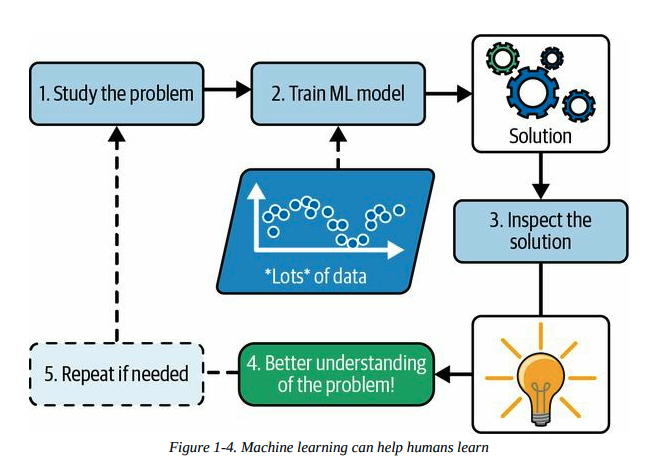
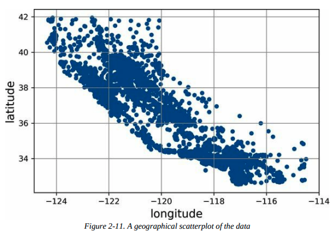
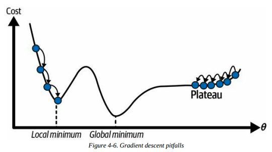
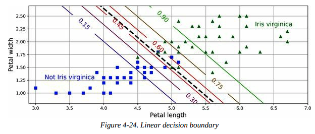
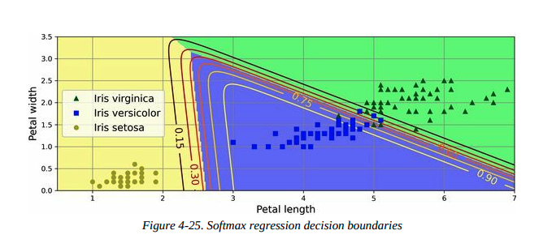
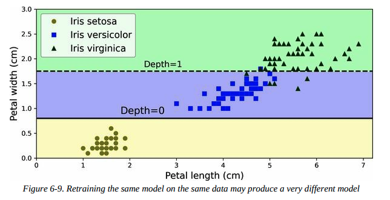
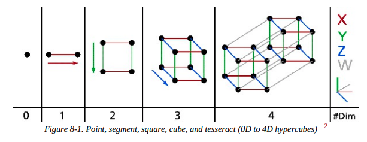
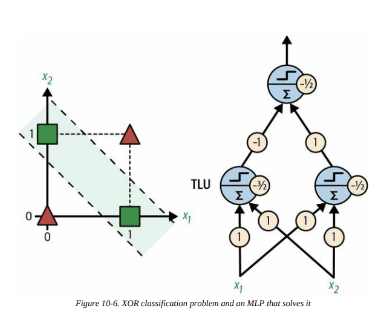

## Machine Learning Landscape

### 机器学习是什么？

**Machine learning** is the science (and art) of programming computers so they can learn from data.

- **General Definition:**

  > [Machine learning is the] field of study that gives computers the ability to learn without being explicitly programmed.  
  > — **Arthur Samuel, 1959**

- **Engineering-Oriented Definition:**

  > A computer program is said to learn from experience \(E\) with respect to some task \(T\) and some performance measure \(P\), if its performance on \(T\), as measured by \(P\), improves with experience \(E\).  
  > — **Tom Mitchell, 1997**

{.marker-round}

### 为什么要使用机器学习？

`4图一总`

#### 图示机器学习 vs 传统编程





#### 总结

- 针对现有解决方案需要大量微调或长规则列表的问题（机器学习模型通常可以简化代码，并且比传统方法表现更好）。
- 对于使用传统方法无法找到良好解决方案的复杂问题比如语音识别（最佳的机器学习技术可能可以找到解决方案）。
- 在不断变化的环境中（机器学习系统可以很容易地在新数据上重新训练，始终保持最新状态）。
- 获取关于复杂问题和大量数据的深入见解，即数据挖掘出的模式识别。

{.marker-round}

### 机器学习的现实应用

| ID  | 名称                                             | 介绍                                                                                                      | 所用到的机器学习                         |
|-----|--------------------------------------------------|-----------------------------------------------------------------------------------------------------------|------------------------------------------|
| 1   | Analyzing images of products on a production line to automatically classify them | 对生产线上的产品图像进行分析以自动分类                                                                 | 图像分类，通常使用 CNN 或 Transformers   |
| 2   | Detecting tumors in brain scans                  | 检测脑部扫描中的肿瘤                                                                                     | 语义图像分割，通常使用 CNN 或 Transformers|
| 3   | Automatically classifying news articles          | 自动分类新闻文章                                                                                         | NLP，使用 RNN、CNN 或 Transformers       |
| 4   | Automatically flagging offensive comments on discussion forums | 自动标记讨论论坛上的攻击性评论                                                                          | NLP，使用文本分类技术                     |
| 5   | Summarizing long documents automatically         | 自动总结长文档                                                                                           | NLP 的文本总结分支                        |
| 6   | Creating a chatbot or a personal assistant       | 创建聊天机器人或个人助理                                                                                 | 涉及 NLP 组件，包括 NLU 和问答模块        |
| 7   | Forecasting your company’s revenue next year, based on many performance metrics | 根据多个性能指标预测公司明年的收入                                                                       | 回归任务，使用线性回归、SVM、随机森林等   |
| 8   | Making your app react to voice commands          | 使应用程序对语音命令作出反应                                                                             | 语音识别，使用 RNN、CNN 或 Transformers   |
| 9   | Detecting credit card fraud                      | 检测信用卡欺诈                                                                                           | 异常检测，使用 Isolation Forests、GMM、自动编码器 |
| 10  | Segmenting clients based on their purchases so that you can design a different marketing strategy for each segment | 基于客户的购买行为进行客户分群，以设计不同的营销策略                                          | 聚类，使用 K-means、DBSCAN 等             |
| 11  | Representing a complex, high-dimensional dataset in a clear and insightful diagram | 将复杂的高维数据集以清晰和有见地的图形方式表示                                                          | 数据可视化，涉及降维技术                  |
| 12  | Recommending a product that a client may be interested in, based on past purchases | 基于过去的购买记录推荐客户可能感兴趣的产品                                                              | 推荐系统，使用神经网络                   |
| 13  | Building an intelligent bot for a game           | 为游戏构建智能机器人                                                                                     | 强化学习（RL）                             |

{.show-header .left-text}

### 机器学习的分类

-  **根据训练时的监督程度分类**：
- 监督学习（Supervised Learning）
- 无监督学习（Unsupervised Learning）
- 半监督学习（Semi-supervised Learning）
- 自监督学习（Self-supervised Learning）
- 其他（Others）

-  **根据是否可以实时增量学习分类**：
- 在线学习（Online Learning）
- 批量学习（Batch Learning）

-  **根据工作原理分类**：
- 基于实例的学习（Instance-based Learning）
- 基于模型的学习（Model-based Learning）

{.marker-round}

这些标准不是互斥的，你可以根据需要将它们以任何方式组合。例如，最先进的垃圾邮件过滤器可能通过使用深度神经网络模型来实时学习，该模型由用户提供的垃圾邮件和正常邮件示例进行训练，这使得它成为一个在线的、基于模型的、有监督的学习系统。

{.marker-none}

### 有监督学习


- **定义**： 有监督学习是通过提供包含正确答案（称为标签）的训练集，让模型学习如何从输入数据预测输出。

- **主要任务**：
  - **分类**：模型从标记了类别的示例中学习如何对新数据进行分类，例如垃圾邮件过滤器。
  - **回归**：模型从标记了数值目标的示例中学习如何预测连续值，例如预测汽车价格。
  - 注意，回归模型也可以用于分类任务。

- **标签与目标**： 在回归任务中，标签通常称为目标（target），而在分类任务中更常称为标签（label）。

- **特征**： 输入数据的特征（features）是模型用来进行预测的属性或变量，通常也被称为预测变量（predictors）或属性（attributes）。

{.marker-round}

### 无监督学习

`Learning without a teacher!`

**定义**：
- 无监督学习是指在没有标注数据的情况下，系统通过分析数据内部的结构和关系自行学习。

**主要任务**：
- **聚类（Clustering）**：将相似的样本分组，例如根据博客访问者的行为将他们分成不同的群体。
- **可视化（Visualization）**：通过将高维数据映射到二维或三维空间，帮助理解数据的分布和结构。
- **降维（Dimensionality Reduction）**：通过减少特征数量来简化数据，同时尽量保留重要信息，常用于特征提取。
- **异常检测（Anomaly Detection）**：识别异常数据点，例如检测信用卡欺诈或制造缺陷。
- **关联规则学习（Association Rule Learning）**：发现数据中属性之间的关系，例如在销售记录中找到经常一起购买的商品组合。

{.marker-round}

### 自监督学习

- 1. **定义**： 自监督学习是一种机器学习方法，通过从未标注的数据集中生成标签，创建一个完全标注的数据集。生成标签后，使用常规的监督学习算法进行训练。

- 2. **过程**： 在自监督学习中，模型使用部分修改或遮掩的输入数据进行训练，目标是恢复或预测原始的未修改数据。例如，模型通过学习如何将遮挡的部分恢复成完整的图像来训练。通过这种方式，模型不需要人为的标签，而是使用原始图像的完整版本作为标签（目标）。训练过程中，模型学会如何填补遮挡的区域，从而提升对图像内容的理解。这种方法可以用于图像修复、去噪、图像生成等任务。

- 3. **与其他学习方式的关系**： 自监督学习与无监督学习不同，因为它在训练过程中使用生成的标签，因而更接近监督学习。无监督学习通常用于聚类、降维和异常检测，而自监督学习则主要应用于分类和回归任务。

- 4. **独立类别**： 虽然自监督学习有时被视为无监督学习的一部分，但由于其在训练过程中生成标签的特性，通常将其视为独立的学习类别更为合适。

{.marker-round}

### 强化学习


-  **定义**： 强化学习是一种独特的学习方法，其中学习系统（称为智能体）通过观察环境、选择和执行动作，并根据结果获取奖励或惩罚（负奖励）来学习最佳策略。

-  **学习过程**： 智能体在环境中执行动作，观察结果并根据获得的奖励或惩罚来调整其策略（称为政策）。这一过程不断重复，直到找到能够最大化长期奖励的最佳策略。

-  **关键概念**：
- **智能体（Agent）**：负责在环境中采取行动的主体。
- **环境（Environment）**：智能体所处的外部条件，智能体从中接收反馈。
- **政策（Policy）**：定义智能体在特定情境下应该选择的行动策略。
- **奖励（Reward）**：智能体执行动作后得到的反馈，可以是正向奖励（奖励）或负向奖励（惩罚）。

-  **学习过程的图解**： 通过一个简单的示意图解释强化学习的过程：智能体观察环境，选择动作，执行动作后获得奖励或惩罚，更新策略并重复该过程，直到找到最优策略。

{.marker-round}

### 批量学习

- **定义**： 批量学习（Batch Learning）是指系统无法进行增量学习，需要使用全部数据进行训练。这通常需要大量的时间和计算资源，并且一般在离线状态下完成（称为离线学习）。

- **特点**：
  - 系统一旦训练完成并投入使用，就不会再学习，只会应用它学到的内容。
  - 模型的性能可能会随着时间的推移而下降，因为世界在不断变化，而模型保持不变。这种现象被称为**模型腐化**（model rot）或**数据漂移**（data drift）。

-  **解决方案**： 需要定期用最新数据重新训练模型，频率取决于具体应用场景。例如，对于变化缓慢的任务，重新训练的频率可以较低，而对于快速变化的任务（如金融市场预测），则需要更频繁地重新训练。

- **挑战**：
  - 训练整个数据集可能需要数小时甚至数天的时间，且使用全部数据进行训练需要大量计算资源（CPU、内存、磁盘空间、网络等）。
  - 如果数据量巨大，甚至可能无法使用批量学习算法。
  - 对于需要在有限资源（如智能手机或火星探测器）上自主学习的系统，携带大量训练数据并进行长时间训练是不可行的。

- **自动化的可行性**： 尽管批量学习的流程涉及多个步骤（如训练、评估、部署），但这些步骤都是结构化的、可重复的，现代机器学习工具和框架（如TensorFlow、Scikit-learn等）提供了自动化这些步骤的支持。因此，整个训练、评估和部署过程可以相对容易地实现自动化，减少了人工干预的复杂性。

- **替代方案**： 针对需要更高反应速度的场景，可以考虑使用能够进行增量学习的算法，避免每次都从头开始重新训练模型。

{.marker-round}

### 在线学习

- **定义**： 在线学习是指系统通过增量地学习数据实例来逐步更新模型。每个学习步骤都是快速且低成本的，这使得系统可以在数据到达时实时学习和更新。

- **应用场景**：
  - **快速适应变化**：适用于需要迅速适应变化的系统，例如检测股市中的新模式。
  - **资源受限环境**：适用于计算资源有限的环境，例如移动设备上的模型训练。

- **增量学习与大数据处理**： 在线学习算法可以用于处理无法一次性装入内存的巨大数据集（称为“外存学习”）。算法会分批加载数据，逐步训练模型，直到处理完所有数据。

- **关键参数**：
  - **学习率（Learning Rate）**：决定系统适应变化数据的速度。高学习率使系统快速适应新数据，但也可能容易遗忘旧数据；低学习率则使系统对新数据的噪声更不敏感，但更新速度较慢。

- **挑战**：**数据质量**：如果系统接收到坏数据，性能可能会迅速下降。特别是在实时系统中，坏数据的影响更为显著。为了降低风险，需要密切监控系统的输入数据和性能表现，及时处理异常数据。

- **风险控制**： 为了应对坏数据带来的风险，可能需要在检测到性能下降时迅速关闭在线学习功能，并回退到之前的模型状态。此外，可以使用异常检测算法来监控输入数据的质量。

- **图解**：
  - 展示了在线学习的基本流程，即系统通过增量方式学习新数据，并持续更新模型，使其能够实时适应新数据的变化。
  - 展示了在线学习如何处理超大数据集的过程，通过将数据集分批加载到内存中逐步训练模型，从而实现对无法一次性装入内存的大数据集的学习。

{.marker-round}

### 基于实例的学习

- **定义**： 基于实例的学习是通过记住训练数据中的具体实例，并在预测新数据时通过比较相似性来进行分类或回归。这种方法主要依赖于计算新数据与已知实例之间的相似度。

- **相似度度量**： 系统通过一种相似性度量（如共同单词的数量）来判断新实例与已知实例的相似度。相似度越高，新实例越可能被归类为与相似实例相同的类别。

- **过程**：
  - 学习阶段：系统“记住”训练集中的所有实例。
  - 推理阶段：对于新的输入实例，系统计算它与所有已知实例的相似度，并根据相似度最高的实例的类别来进行分类。

- **图解**： 在图中，新的实例（图中的红色“X”）通过与训练实例比较，被分类为与其最相似的类别（三角形），因为它与多个三角形实例的相似度最高。

{.marker-round}

### 基于模型的学习

- **定义**: 基于模型的学习是一种通过构建模型来概括数据并进行预测的学习方式。

- **特点**:
  - **构建模型**: 从一组示例中概括出一个模型，该模型捕捉了数据中的某种模式或关系。
  - **预测能力**: 模型被训练后可以用来对新数据进行预测。例如，使用线性回归模型来预测某个国家的生活满意度与其人均GDP之间的关系。

- **典型流程**:
  1. **研究数据**: 例如，分析生活满意度和人均GDP的关系。
  2. **选择模型**: 选择合适的模型，如线性回归。
  3. **训练模型**: 使用训练数据来优化模型参数，使模型能够尽可能准确地拟合数据。
  4. **预测**: 使用训练好的模型对新数据进行预测。

- **图解**:
  -  显示了通过一个模型来区分新实例和训练实例的示意图。
  -  显示了通过GDP与生活满意度之间的关系来建立线性模型的步骤。这个模型最终能够用于预测其他国家的生活满意度。

- **总结**:
  - 你研究了数据。
  - 你选择了一个模型。
  - 你在训练数据上训练了模型。
  - 最终，你使用模型对新案例进行预测，希望模型能很好地泛化。

基于模型的学习通过构建和训练模型来捕捉数据中的模式，最终可以用这些模型进行有效的预测。这种学习方法广泛应用于各种机器学习项目中。

### 机器学习的挑战

`In short, since your main task is to select a model and train it on some data, the two things that can go wrong are “bad model” and “bad data”.`

| **ID** | **挑战**                       | **描述**                                                                                                                                                                      |
|--------|--------------------------------|-------------------------------------------------------------------------------------------------------------------------------------------------------------------------------|
| **1**  | **训练数据量不足**               | 机器学习需要大量数据才能正常工作。对于图像或语音识别等复杂问题，可能需要数百万个示例。                                                                                       |
| **2**  | **非代表性训练数据**             | 如果训练数据不能代表真实世界的数据，模型的表现将会很差。数据必须覆盖所有可能的场景。                                                                                       |
| **3**  | **数据质量差**                   | 含有大量噪音、错误或不一致的数据会导致模型表现不佳。数据清洗和预处理至关重要。                                                                                           |
| **4**  | **无关特征**                     | 不相关的特征可能会混淆模型，导致性能下降。特征选择或特征提取非常重要。                                                                                                     |
| **5**  | **训练数据过拟合**               | 当模型过于复杂时，它可能会学习训练数据中的噪音而不是实际模式，导致对新数据的泛化能力差。                                                                                   |
| **6**  | **训练数据欠拟合**               | 如果模型过于简单，它将无法捕捉数据中的潜在模式，导致在训练和新数据上的表现都很差。                                                                                       |

{.show-header .left-text}

### 训练数据量不足


- **定义**: 机器学习需要大量的数据来正常工作。即使是非常简单的问题通常也需要数千个例子，而对于复杂问题（如图像或语音识别），可能需要数百万个例子。

- **不合理的数据有效性**: 研究表明，给定足够的数据，简单的算法往往能表现得与复杂的算法一样好。这表明在开发算法和收集数据之间，我们应更多地考虑数据收集的重要性。

- **现实挑战**: 尽管大数据通常比算法更重要，但中小规模的数据集仍然非常普遍，而且获得额外的训练数据并不总是容易或便宜的。因此，不能轻易放弃对算法的优化。

{.marker-round}

### 非代表性数据

- **定义**：在机器学习中，为了使模型能够很好地泛化，训练数据必须能够代表你想要泛化的新情况。这对基于实例的学习和基于模型的学习同样重要。

- **图解**：
  - 
  - 训练模型时使用的国家集不包含GDP非常低或非常高的国家，导致模型无法准确预测这些国家的数据。
  - 当加入这些缺失的国家时，模型的表现和预测结果会显著改变，表明原有的简单线性模型无法很好地工作。

- **重要性**：使用非代表性的数据集训练的模型，尤其在预测非常贫穷或非常富有的国家时，可能会产生不准确的预测结果。

- **采样噪声**：即使样本量非常大，如果采样方法有缺陷，数据也可能是非代表性的。这种方法上的缺陷被称为采样偏差。

- **采样偏差的示例**：
  - **1936年美国总统选举**：Literary Digest 杂志进行的大规模调查由于采样方法偏向富裕人群，导致错误地预测了选举结果。
  - **YouTube音乐视频示例**：如果仅依赖于YouTube搜索结果来构建训练集，搜索引擎返回的视频可能偏向于流行的艺人，而不是代表整个"funk音乐"类别。

- **结论**：为了确保模型的准确性，必须谨慎选择和处理训练数据，以避免采样偏差和数据集的非代表性问题。

{.marker-round}

### 数据质量差

- **定义**：低质量的数据（如错误、异常值、噪声）会使系统难以检测到潜在模式，导致性能下降。
- **重要性**：清理训练数据非常重要，大多数数据科学家花费大量时间进行数据清理。
- **处理方法**：
  - 对于明显的异常值，可以选择删除或手动修正错误。
  - 对于缺少部分特征的实例，决定是否忽略该特征、忽略这些实例、填充缺失值，或训练包含和不包含该特征的两个模型。

{.marker-round}

### 无关特征

- **定义**：如果训练数据中包含太多不相关的特征，系统将难以学到有效的模式。
- **关键过程**：成功的机器学习项目依赖于良好的特征工程，包括以下步骤：
  - **特征选择**：从现有特征中选择最有用的特征进行训练。
  - **特征提取**：将现有特征组合成更有用的特征（例如，使用降维算法）。
  - **新特征创建**：通过收集新数据来生成新特征。

{.marker-round}

### 过拟合

过拟合（Overfitting）的要点如下：

- **定义**：过拟合是指模型在训练数据上表现良好，但在新数据上泛化能力差。这通常是因为模型过于复杂，捕捉到了训练数据中的噪音或无关模式。
- **图解**：
  - 这张图展示了一个高阶多项式模型在训练数据上的表现。虽然这个模型在训练数据（蓝色点）上表现得非常好，能够准确拟合所有数据点，但它很可能只是捕捉到了数据中的噪音，而不是反映真实的趋势，因此对新数据的泛化能力较差。
  - 这张图展示了三种模型的表现。虚线代表了在部分数据上训练的原始模型，实线表示在全部数据上训练的模型，而点线则是经过正则化处理后的模型。可以看到，正则化模型的斜率更小，尽管它在训练数据上的拟合效果稍差，但它对新数据的泛化能力更好。
- **解决方法**：
  - **简化模型**：选择更简单的模型，减少参数数量或约束模型。
  - **增加训练数据**：更多的数据可以帮助模型学习到更稳定和普适的模式。
  - **正则化**：通过加入正则化项（如L1或L2）来限制模型的复杂度，从而减少过拟合的风险。

{.marker-round}

### 欠拟合

- **定义**：欠拟合（Underfitting）是指模型过于简单，无法捕捉数据的潜在结构，导致在训练数据上的表现也不佳。

- **原因**：
  - 模型复杂度不足，无法准确表示数据中的复杂关系。

- **解决方法**：
  - 选择更强大的模型，增加模型参数。
  - 提供更好的特征（即通过特征工程增强输入数据）。
  - 减少对模型的约束（例如，降低正则化参数的值）。

{.marker-round}

### 机器学习BigPicture {.col-span-2}

| **ID** | **Topic**                                | **Summary**                                                                                                                                                                                                                      | **中文总结**                               |
|--------|------------------------------------------|----------------------------------------------------------------------------------------------------------------------------------------------------------------------------------------------------------------------------------|--------------------------------------------|
| 1      | **Purpose of Machine Learning**          | Machine learning is about making machines get better at some task by learning from data, instead of having to explicitly code rules.                                                                                              | 机器学习旨在通过从数据中学习，让机器在某些任务上表现得更好，而无需显式编写规则。|
| 2      | **Types of ML Systems**                  | There are many different types of ML systems: supervised or unsupervised, batch or online, instance-based or model-based.                                                                                                        | 机器学习系统有多种类型：监督学习或非监督学习，批量学习或在线学习，基于实例或基于模型。|
| 3      | **ML Project Process**                   | In an ML project, you gather data in a training set, and you feed the training set to a learning algorithm. If the algorithm is model-based, it tunes parameters to fit the model to the training set and generalizes to new cases.| 在机器学习项目中，收集数据形成训练集，并将其提供给学习算法。若算法是基于模型的，它会调整参数使模型适应训练集并泛化到新实例。|
| 4      | **Instance-based vs Model-based Algorithms** | If the algorithm is instance-based, it learns examples by heart and generalizes to new instances using a similarity measure.                                                                                                      | 如果算法是基于实例的，它会通过记住实例并使用相似性度量来泛化到新实例。|
| 5      | **Challenges in ML**                     | The system will not perform well if the training set is too small, non-representative, noisy, or polluted with irrelevant features. The model must balance complexity to avoid underfitting or overfitting.                      | 如果训练集太小、不具代表性、有噪声或包含无关特征，系统将表现不佳。模型必须在复杂性上进行平衡，以避免欠拟合或过拟合。|

{.show-header .left-text}

### 模型验证与泛化能力评估

- **模型泛化能力评估**：要评估模型对新数据的泛化能力，最直接的方法是将其部署在生产环境中，通过实际使用来观察模型的表现。
- **数据集划分**：一种更好的方法是将数据集划分为训练集（training set）和测试集（test set）。在训练集上训练模型，然后使用测试集评估模型的泛化误差（generalization error），即模型在未见过的数据上的错误率。
- **泛化误差的意义**：泛化误差可以帮助估计模型在新数据上的表现。如果训练误差低，但泛化误差高，说明模型发生了过拟合。
- **数据划分建议**：通常使用80%的数据用于训练，20%的数据用于测试，具体比例可以根据数据集的大小进行调整。

{.marker-round}

### 超参数调优与模型选择

- **问题概述**：超参数调优和模型选择是确保模型在新数据上表现良好的关键步骤。如果仅依靠测试集进行选择，可能会导致模型过拟合于测试集，从而在新数据上表现不佳。

- **常见问题**：
  - 多次在测试集上评估模型可能导致模型和超参数过拟合于该特定测试集，从而无法很好地泛化到新数据。

- **解决方案**：
  - **留出验证法**：从训练集中划分出一部分数据作为验证集（dev set），用来评估多个候选模型，并选择表现最佳的模型。
  - **交叉验证**：为了更准确地评估模型，可以使用交叉验证，将训练集分成多个小的验证集，每个模型在多个验证集上进行评估，最终选择表现最好的模型。

- **注意事项**：
  - 验证集过小可能导致评估不准确，可能错误地选择次优模型。
  - 验证集过大会导致剩余的训练集过小，从而影响模型的训练效果。

- **图解**
  图展示了使用保留验证（Holdout Validation）进行模型选择的流程：
  - **Training set（训练集）**：首先从训练集中训练多个模型。
  - **Dev set（开发集）**：接着在开发集（或验证集）上评估这些模型，选择表现最好的模型。
  - **Retrain the best model（重新训练最佳模型）**：将选择出的最佳模型在整个训练集上重新训练，包括原始的训练集和开发集。
  - **Test set（测试集）**：最后在测试集上评估最终模型，以得到模型在未见过的数据上的表现。
    这一流程帮助确保选择出的模型不仅在开发集上表现良好，而且在实际应用中也能有良好的泛化能力。

{.marker-round}

这个过程旨在通过合理划分数据集来避免模型在新数据上的性能下降，并确保最终模型在不同数据集上的表现都足够稳健。

{.marker-none}

### 数据不匹配

- **定义**：数据不匹配是指训练数据与实际使用中数据的差异，导致模型在实际应用中表现不佳。

- **关键问题**：当训练数据与实际生产环境中的数据不一致时，即使模型在训练集上表现良好，也可能在测试集上表现不佳。这种情况会使得我们无法判断模型在测试集上的表现差是由于训练集过拟合还是由于数据不匹配。

- **解决方案**：
  1. **创建train-dev集**：将部分训练数据保留作为train-dev集，在训练模型后，用train-dev集进行评估。如果模型在train-dev集上表现不佳，则说明模型过拟合。如果表现良好，则问题可能来自数据不匹配。
  2. **处理数据不匹配**：通过预处理训练数据，使其与实际应用中的数据更相似，以减少数据不匹配的影响。

- **图解**
  主要展示了如何处理数据不匹配的问题。它分为四个部分：
  - **Train（训练集）**：这部分数据来自网络，数量充足，但与实际使用的应用数据可能存在差异。
  - **Train-dev（训练-开发集）**：从训练集中保留一部分数据，专门用来评估模型是否在训练集上过拟合。如果模型在这个集上表现不好，说明模型可能过拟合。
  - **Dev（开发集）**：用来评估模型在接近实际使用环境的数据上的表现，从而检测数据不匹配的问题。
  - **Test（测试集）**：最终用于评估模型的实际表现。
    通过这一流程，可以确保模型不仅在训练集上表现良好，还能够在实际应用的数据上有效运行，从而应对数据不匹配的问题。

- **结论**：在开发机器学习模型时，确保训练数据和实际使用中的数据尽可能一致是非常重要的，特别是在生产环境中数据稀缺的情况下，数据不匹配可能对模型性能造成严重影响。

{.marker-round}

### exercise {.col-span-3}

| #   | Questions                                                                                                                                       | 中文翻译                                                                                               |
|-----|-------------------------------------------------------------------------------------------------------------------------------------------------|--------------------------------------------------------------------------------------------------------|
| 1   | How would you define machine learning?                                                                                                          | 你会如何定义机器学习？                                                                                   |
| 2   | Can you name four types of applications where it shines?                                                                                        | 你能举出四种机器学习表现出色的应用吗？                                                                   |
| 3   | What is a labeled training set?                                                                                                                 | 什么是带标签的训练集？                                                                                   |
| 4   | What are the two most common supervised tasks?                                                                                                  | 最常见的两种监督学习任务是什么？                                                                         |
| 5   | Can you name four common unsupervised tasks?                                                                                                    | 你能举出四种常见的无监督学习任务吗？                                                                     |
| 6   | What type of algorithm would you use to allow a robot to walk in various unknown terrains?                                                      | 你会使用哪种算法让机器人在各种未知地形上行走？                                                           |
| 7   | What type of algorithm would you use to segment your customers into multiple groups?                                                            | 你会使用哪种算法将你的客户分成多个群体？                                                                 |
| 8   | Would you frame the problem of spam detection as a supervised learning problem or an unsupervised learning problem?                             | 你会将垃圾邮件检测问题归类为监督学习问题还是无监督学习问题？                                               |
| 9   | What is an online learning system?                                                                                                              | 什么是在线学习系统？                                                                                     |
| 10  | What is out-of-core learning?                                                                                                                   | 什么是外存学习（Out-of-core learning）？                                                                  |
| 11  | What type of algorithm relies on a similarity measure to make predictions?                                                                      | 哪种算法依赖相似性度量进行预测？                                                                          |
| 12  | What is the difference between a model parameter and a model hyperparameter?                                                                    | 模型参数和模型超参数之间有什么区别？                                                                      |
| 13  | What do model-based algorithms search for? What is the most common strategy they use to succeed? How do they make predictions?                  | 基于模型的算法在寻找什么？它们最常用的成功策略是什么？它们如何进行预测？                                  |
| 14  | Can you name four of the main challenges in machine learning?                                                                                    | 你能说出机器学习中的四个主要挑战吗？                                                                      |
| 15  | If your model performs great on the training data but generalizes poorly to new instances, what is happening? Can you name three possible solutions? | 如果你的模型在训练数据上表现很好但在新实例上泛化性差，这是什么情况？你能举出三种可能的解决方案吗？            |
| 16  | What is a test set, and why would you want to use it?                                                                                           | 什么是测试集，为什么要使用它？                                                                            |
| 17  | What is the purpose of a validation set?                                                                                                        | 验证集的作用是什么？                                                                                      |
| 18  | What is the train-dev set, when do you need it, and how do you use it?                                                                          | 什么是训练-开发集（train-dev set），什么时候需要它，以及如何使用它？                                        |
| 19  | What can go wrong if you tune hyperparameters using the test set?                                                                               | 如果你使用测试集来调整超参数，可能会出什么问题？                                                          |


{.show-header .left-text}

## End-to-End Machine Learning Project

### Setup 数据采集

| 特征名称               | 描述                             |
|------------------------|----------------------------------|
| longitude              | 经度                             |
| latitude               | 纬度                             |
| housing_median_age     | 房屋中位年龄                     |
| total_rooms            | 房间总数                         |
| total_bedrooms         | 卧室总数                         |
| population             | 人口数量                         |
| households             | 家庭户数                         |
| median_income          | 中位收入                         |
| median_house_value     | 中位房屋价值                     |
| ocean_proximity        | 靠近海洋的距离                   |

{.show-header .left-text}


{.marker-none}

### Step-00 项目整体视角 {.col-span-2}

#### Step-01 问题框架化

- **明确业务目标**：首先要了解构建模型的最终业务目标是什么。模型的预测结果如何帮助企业决策，这决定了问题的定义、模型的选择、评估标准以及调整模型的力度。

- **当前解决方案**：询问现有解决方案的表现如何，以此作为参考来确定模型的性能要求，并指导问题的解决。现有解决方案可能依赖人工估算，这种方法耗时且不准确，因此公司需要一个模型来预测地区房价。

- **数据管道**：机器学习过程通常由多个异步运行的数据处理组件组成。这些组件串联起来处理数据，逐步生成模型的最终预测结果。每个组件独立工作，彼此通过数据存储交互。
  
  - **District Data**（区域数据）： 图的最左边是输入数据，即每个地区的相关数据，比如人口、收入、房价等。这些数据是整个流程的起点。

  - **District Pricing**（区域定价）： 中间的组件代表了一个机器学习模型或算法，它利用输入的区域数据来预测每个地区的房价（即中间的“District Pricing”框）。这个组件是整个管道的核心，负责生成模型的主要输出。

  - **Investment Analysis**（投资分析）： 区域房价预测完成后，预测结果会被输入到下一个组件，即投资分析系统。这个系统会根据预测的房价和其他输入信号来判断是否在某个地区投资。这一步是决定最终投资决策的关键。

  - **Investments**（投资）： 图的最右侧是最终的输出——投资决策。基于之前的分析，系统决定在某些地区进行投资。

  尽管这个管道图看起来非常简单甚至宏观，但它反映了一个非常普遍且重要的概念：将复杂的任务分解为简单的步骤，通过管道连接起来，从而形成一个整体系统。这种方法在数据科学、机器学习以及广泛的商业应用中都非常有用。

- **问题类型**：明确需要解决的问题是监督学习、无监督学习，还是强化学习任务，并确定是分类问题还是回归问题。波士顿房价预测问题是一个典型的多元回归问题。

- **学习类型**：对于当前问题，由于数据量适中且无需快速响应变化的实时数据，因此选择批量学习（Batch Learning）是合适的。如果数据量很大，可以考虑使用在线学习或MapReduce方法来分布式处理数据。

{.marker-timeline}

#### Step-02 选择模型性能度量指标

**选择的性能度量指标：** 均方根误差 (RMSE)

**选择原因：**

- **度量原理**：`KaTeX:RMSE` 衡量预测值与实际值之间的平方差的平均值的平方根，强调大误差。这对于房价预测中的大误差非常重要。
- **适用性**：房价数据通常具有正态分布特性，```KaTeX:RMSE``` 适合这种数据分布。
- **行业标准**：```KaTeX:RMSE``` 是回归问题中广泛使用的标准度量指标，尤其是在房价预测等领域。

**为什么不选择其他指标：**

- **MAE**：虽然对异常值不敏感，但在房价预测中需要对大误差给予更多的关注，```KaTeX:RMSE``` 在这方面表现更优。
- **R² 决定系数**：```KaTeX:R^2``` 表示模型的拟合程度，但可能在数据分布异常时误导，不如 ```KaTeX:RMSE``` 直观。

因此，在加利福尼亚房价预测项目中，```KaTeX:RMSE``` 是最合适的选择。

[性能度量指标选择表](/machine-learning.html#machine-learning-performance-measure) {.link-arrow}

#### Step-03 验证你的假设

`杜绝自己想象`

- **列出并验证假设**：列出并验证所有已经做出的假设，这可以帮助你在早期发现严重问题。
- **场景示例**：例如，假设你的系统输出的区域价格将被下游的机器学习系统使用，而你假设这些价格会被直接使用。然而，如果下游系统将价格转换为分类（如“便宜”、“中等”或“昂贵”），并使用这些类别而不是实际价格，那么你的假设可能就不成立。
- **任务类型错误**：如果仅需预测类别，那么问题应被设定为分类任务而非回归任务，避免在错误的任务类型上浪费时间。
- **与下游系统团队沟通**：在与下游系统团队沟通后，确认他们确实需要的是实际价格而非类别。这个步骤验证了你最初的假设是正确的。
- **开始编码**：当确认假设正确后，你可以放心地开始编写代码。

{.marker-timeline}

### Step-01 使用Google Colab


或者，本地clone [handson-ml3] (https://github.com/ageron/handson-ml3) 到本地

```shell script
$ jupyter notebook
```

### Step-02 编码环境检查


```python
print("Welcome to Machine Learning! ragnor.li")
```

```python
import sys
assert sys.version_info >= (3, 7)
```

```python
from packaging import version
import sklearn

assert version.parse(sklearn.__version__) >= version.parse("1.0.1")
```

### Step-03 数据集下载

```python
from pathlib import Path
import pandas as pd
import tarfile
import urllib.request

def load_housing_data():
    tarball_path = Path("datasets/housing.tgz")
    if not tarball_path.is_file():
        Path("datasets").mkdir(parents=True, exist_ok=True)
        url = "https://github.com/ageron/data/raw/main/housing.tgz"
        urllib.request.urlretrieve(url, tarball_path)
        with tarfile.open(tarball_path) as housing_tarball:
            housing_tarball.extractall(path="datasets")
    return pd.read_csv(Path("datasets/housing/housing.csv"))

housing = load_housing_data()
```

### Step-04 杀猪先瞅瞅心里有个底 {.col-span-3}


#### 整体特征瞅一眼

`housing.head()` 显示数据框的前五行。用于快速查看数据的前几行记录，了解数据的整体结构。`尤其要把数据实例的特征代表的实际业务含义研究清楚`

|index|longitude|latitude|housing\_median\_age|total\_rooms|total\_bedrooms|population|households|median\_income|median\_house\_value|ocean\_proximity|
|---|---|---|---|---|---|---|---|---|---|---|
|0|-122\.23|37\.88|41\.0|880\.0|129\.0|322\.0|126\.0|8\.3252|452600\.0|NEAR BAY|
|1|-122\.22|37\.86|21\.0|7099\.0|1106\.0|2401\.0|1138\.0|8\.3014|358500\.0|NEAR BAY|
|2|-122\.24|37\.85|52\.0|1467\.0|190\.0|496\.0|177\.0|7\.2574|352100\.0|NEAR BAY|
|3|-122\.25|37\.85|52\.0|1274\.0|235\.0|558\.0|219\.0|5\.6431|341300\.0|NEAR BAY|
|4|-122\.25|37\.85|52\.0|1627\.0|280\.0|565\.0|259\.0|3\.8462|342200\.0|NEAR BAY|

{.show-header .left-text}


#### 数据集中实例数据类型与缺失检查

`housing.info()` 显示数据框的基本信息，包括行数、列数、每列的非空值数量和数据类型。用于检查数据框的结构和识别缺失数据。

```text
<class 'pandas.core.frame.DataFrame'>
RangeIndex: 20640 entries, 0 to 20639
Data columns (total 10 columns):
 #   Column              Non-Null Count  Dtype  
---  ------              --------------  -----  
 0   longitude           20640 non-null  float64
 1   latitude            20640 non-null  float64
 2   housing_median_age  20640 non-null  float64
 3   total_rooms         20640 non-null  float64
 4   total_bedrooms      20433 non-null  float64
 5   population          20640 non-null  float64
 6   households          20640 non-null  float64
 7   median_income       20640 non-null  float64
 8   median_house_value  20640 non-null  float64
 9   ocean_proximity     20640 non-null  object 
dtypes: float64(9), object(1)
memory usage: 1.6+ MB
```

`检查结果如下：`

| 序号 | 要点                                                         |
|------|--------------------------------------------------------------|
| 1    | 数据集中共有 20,640 个实例（样本）。           |
| 2    | `total_bedrooms` 属性中有 207 个地区缺少值，需要处理。       |
| 3    | 除 `ocean_proximity` 属性外，所有其他属性都是数值型的。      |
| 4    | `ocean_proximity` 属性的数据类型是 `object`，即文本属性。    |
| 5    | `ocean_proximity` 列中的值是重复的，表明它可能是分类属性。   |
| 6    | 可以使用 `value_counts()` 方法来查找类别及其分布。           |

{.show-header .left-text}


#### 数据集中不同类别特征的分布情况

`housing["ocean_proximity"].value_counts()` 统计ocean_proximity列中每个类别的频次。用于了解数据集中不同类别的分布情况。

```text
<1H OCEAN     9136
INLAND        6551
NEAR OCEAN    2658
NEAR BAY      2290
ISLAND           5
Name: ocean_proximity, dtype: int64
```

#### 快速了解数值数据的分布和主要统计特征

`housing.describe()` 生成数据框数值列的汇总统计信息，包括计数、平均值、标准差、最小值、四分位数和最大值。用于快速了解数值数据的分布和主要统计特征。


|index|longitude|latitude|housing\_median\_age|total\_rooms|total\_bedrooms|population|households|median\_income|median\_house\_value|
|---|---|---|---|---|---|---|---|---|---|
|count|20640\.0|20640\.0|20640\.0|20640\.0|20433\.0|20640\.0|20640\.0|20640\.0|20640\.0|
|mean|-119\.56970445736432|35\.63186143410853|28\.639486434108527|2635\.7630813953488|537\.8705525375618|1425\.4767441860465|499\.5396802325581|3\.8706710029069766|206855\.81690891474|
|std|2\.0035317235025882|2\.1359523974571153|12\.58555761211165|2181\.615251582795|421\.3850700740322|1132\.462121765341|382\.32975283161073|1\.8998217179452688|115395\.61587441387|
|min|-124\.35|32\.54|1\.0|2\.0|1\.0|3\.0|1\.0|0\.4999|14999\.0|
|25%|-121\.8|33\.93|18\.0|1447\.75|296\.0|787\.0|280\.0|2\.5633999999999997|119600\.0|
|50%|-118\.49|34\.26|29\.0|2127\.0|435\.0|1166\.0|409\.0|3\.5347999999999997|179700\.0|
|75%|-118\.01|37\.71|37\.0|3148\.0|647\.0|1725\.0|605\.0|4\.74325|264725\.0|
|max|-114\.31|41\.95|52\.0|39320\.0|6445\.0|35682\.0|6082\.0|15\.0001|500001\.0|

{.show-header .left-text}

`分析结果如下`

| 要点                        | 解释                                                                                                                             |
|-----------------------------|----------------------------------------------------------------------------------------------------------------------------------|
| `housing.describe()`         | 提供数据集中每个数值属性的统计摘要，包括计数、平均值、最小值、最大值以及四分位数（25%、50%、75%）。                                                    |
| `count`                     | 统计数据集中每个属性的非空值数量。                                                                                                 |
| `mean`                      | 计算每个属性的平均值。                                                                                                             |
| `std`                       | 显示标准差，衡量数据的离散程度。                                                                                                   |
| `min` 和 `max`               | 分别表示数据集中每个属性的最小值和最大值。                                                                                          |
| `25%`, `50%`, `75%`          | 表示数据的四分位数：25%表示第一个四分位数（Q1），50%是中位数，75%表示第三个四分位数（Q3）。                                                   |
| 百分位（percentile）的意义      | 百分位数指的是在一组观察值中某个百分比以下的值。比如，25%的区的 `housing_median_age` 小于18，50%小于29，75%小于37。                                     |
| `hist()` 方法                | 可以为每个数值属性绘制直方图，显示每个属性值在不同范围内的实例数量。直方图是了解数据类型的快速方式。                                                   |
| 绘制直方图的选项               | 可以为单个属性绘制直方图，或者使用 `hist()` 方法为整个数据集中的所有数值属性同时绘制直方图。                                               |

{.show-header .left-text}

#### 可视化单特征的数据分布情况

- 对 housing 数据集中的几个特征绘制直方图，并将这些图保存为高分辨率的 PNG 文件

```python

# extra code – code to save the figures as high-res PNGs for the book

IMAGES_PATH = Path() / "images" / "end_to_end_project"
IMAGES_PATH.mkdir(parents=True, exist_ok=True)

def save_fig(fig_id, tight_layout=True, fig_extension="png", resolution=300):
    path = IMAGES_PATH / f"{fig_id}.{fig_extension}"
    if tight_layout:
        plt.tight_layout()
    plt.savefig(path, format=fig_extension, dpi=resolution)
    
    
    
import matplotlib.pyplot as plt

# extra code – the next 5 lines define the default font sizes
plt.rc('font', size=14)
plt.rc('axes', labelsize=14, titlesize=14)
plt.rc('legend', fontsize=14)
plt.rc('xtick', labelsize=10)
plt.rc('ytick', labelsize=10)

housing.hist(bins=50, figsize=(12, 8))
save_fig("attribute_histogram_plots")  # extra code
plt.show()

```


`图形中观察出来的秘密`

| ID  | 要点内容                       | 详细描述                                                                                                           | 如何分析得出                                                                 |
|-----|----------------------------|------------------------------------------------------------------------------------------------------------------|---------------------------------------------------------------------------|
| 1   | 中位数收入未以美元表示                | 中位数收入属性的值似乎并不代表美元，而是缩放后的数值范围，如15和0.5等，并不是实际的收入金额。                                     | 通过观察“median_income”的直方图，发现数值范围在0到15之间，这明显不是美元的典型表示范围。            |
| 2   | 房价上限影响模型预测                 | 房价和房龄的直方图显示，它们被封顶在某个特定的值，如500,000美元，这可能导致模型在预测时遇到限制。                                      | “median_house_value”和“housing_median_age”的直方图中，数据堆积在最大值处，这意味着数据被封顶。  |
| 3   | 属性具有不同的尺度                   | 数据集中不同属性的范围和分布差异较大，某些属性如“total_rooms”数值较大，而“median_income”数值较小。                               | 从每个属性的直方图观察到，各属性的数值范围差异明显，这意味着它们的尺度不同，可能需要缩放。                              |
| 4   | 直方图右偏，数据分布不对称             | 大多数属性的直方图显示出右偏分布，即大部分数据集中在左侧，而尾部拉长，这种分布可能会影响模型训练的效果。                                         | 通过观察直方图，可以看到许多属性的分布呈现右偏，特别是像“median_income”，这是数据分布不对称的特征。               |
| 5   | 在进一步分析数据前创建测试集            | 分析数据前需要创建一个测试集，以确保模型评估时有未见过的数据，这对于验证模型的泛化能力非常重要。                                               | 这是数据科学中的一个常见做法，目的是确保模型评估的公正性和可靠性。虽然不是从图表中直接得出，但这是一个关键的分析步骤。       |

{.show-header .left-text}

### Step-05 分割测试集 {.col-span-3}

#### 数据集划分

```python
import numpy as np

def shuffle_and_split_data(data, test_ratio):
    # 生成一个与数据集长度相同的随机排列的索引数组，确保数据的顺序被打乱，随机打乱后，训练集和测试集的分布更接近真实情况，这样训练出来的模型能够更好地适应新数据，从而提高模型的泛化能力。
    shuffled_indices = np.random.permutation(len(data))
    
    # 计算测试集的大小，test_ratio 确定测试集占总数据集的比例
    test_set_size = int(len(data) * test_ratio)
    
    # 根据打乱后的索引数组，选取前 test_set_size 个索引作为测试集的索引
    test_indices = shuffled_indices[:test_set_size]
    
    # 剩下的索引作为训练集的索引
    train_indices = shuffled_indices[test_set_size:]
    
    # 根据训练集和测试集的索引，分别返回训练集和测试集的数据
    return data.iloc[train_indices], data.iloc[test_indices]

```

You can then use this function like this:

```python
train_set, test_set = shuffle_and_split_data(housing, 0.2)
len(train_set)
len(test_set)
```

#### 稳定测试集创建与可靠模型评估

在机器学习项目中，测试集的主要目的是评估模型在未见过的数据上的表现，从而判断模型的泛化能力。如果你每次运行程序时生成的测试集不同，意味着测试集的数据每次都在变化，这会导致以下问题：

- **模型可能见过全部数据**：如果每次运行程序时，测试集的数据都不一样，随着多次运行，模型最终可能会见到整个数据集的所有数据。这样，测试集不再是真正意义上的“未见过”的数据，从而无法有效地评估模型的泛化能力。

- **无法比较模型的性能**：如果测试集每次都不同，那么模型在每次训练后的表现也会因为测试数据不同而有所变化。这使得你无法有效地比较模型在不同运行中的表现，因为测试集本身的差异就会导致性能评估的结果不一致。

- **不稳定的模型评估**：由于测试集的变化，你得到的模型性能评估结果每次都不一样，无法判断模型的实际能力。这种不稳定性会让你难以得出可靠的结论。

{.marker-round}

因此，为了保证测试集的稳定性和模型评估的可靠性，必须避免在每次运行程序时生成不同的测试集。解决方案包括：
- 在第一次运行程序时保存测试集，然后在后续运行中重新加载这个测试集。
- 使用随机数种子（`np.random.seed(42)`）确保打乱数据的顺序是可重复的。
- 使用更稳定的方法来划分训练集和测试集，比如基于数据实例的唯一标识符进行划分。

{.marker-round}


`要将代码逻辑串联成问题的形式，可以按照以下的顺序来构建：`

- **如何判断一个实例是否应该进入测试集？**
  - 使用 `is_id_in_test_set(identifier, test_ratio)` 函数，传入实例的标识符 (`identifier`) 和测试集比例 (`test_ratio`)，判断该实例是否应该进入测试集。判断的依据是根据实例标识符的哈希值，若其值小于 `test_ratio * 2**32`，则该实例属于测试集。

   ```python
   from zlib import crc32

   def is_id_in_test_set(identifier, test_ratio):
       return crc32(np.int64(identifier)) < test_ratio * 2**32
   ```

- **如何基于标识符将数据分为训练集和测试集？**
  - 使用 `split_data_with_id_hash(data, test_ratio, id_column)` 函数，通过对数据集中指定列的标识符进行哈希值判断，将数据集划分为训练集和测试集。

   ```python
   def split_data_with_id_hash(data, test_ratio, id_column):
       ids = data[id_column]
       in_test_set = ids.apply(lambda id_: is_id_in_test_set(id_, test_ratio))
       return data.loc[~in_test_set], data.loc[in_test_set]
   ```

- **如果数据集没有唯一标识符列，如何创建唯一标识符？**
  - 如果数据集中没有标识符列，可以使用行索引作为标识符。首先通过 `reset_index()` 方法添加一个索引列，然后使用该索引列来划分数据集。

   ```python
   housing_with_id = housing.reset_index()  # adds an `index` column
   train_set, test_set = split_data_with_id_hash(housing_with_id, 0.2, "index")
   ```

- **如何处理数据集在更新时行索引可能不稳定的问题？**
  - 为了避免行索引在数据集更新时的不稳定性，可以使用较为稳定的特征（如地理位置的经度和纬度）来生成唯一标识符。通过将经度和纬度组合，可以构造一个唯一标识符列。

   ```python
   housing_with_id["id"] = housing["longitude"] * 1000 + housing["latitude"]
   train_set, test_set = split_data_with_id_hash(housing_with_id, 0.2, "id")
   ```

- **Scikit-Learn 提供了多种将数据集分割成多个子集的函数**

  - 其中最简单的函数是 `train_test_split()`，它与之前定义的 `shuffle_and_split_data()` 函数功能类似。

  - **`train_test_split()` 函数的两个额外功能**：
    - **`random_state` 参数**：允许设置随机生成器的种子，以确保每次运行生成相同的随机分割。
    - **支持多数据集同步分割**：如果有多个行数相同的数据集（例如，特征和标签的 DataFrame），可以同时传递这些数据集，`train_test_split()` 会使用相同的索引将它们进行同步分割。

  ```python
  from sklearn.model_selection import train_test_split
  train_set, test_set = train_test_split(housing, test_size=0.2, random_state=42)
  ```
  - **代码示例**：使用 `train_test_split()` 将 `housing` 数据集分成训练集和测试集，测试集大小为数据集的20%（`test_size=0.2`），并通过设置 `random_state=42` 来确保分割的稳定性。

{.marker-timeline}


#### 分层抽样以确保数据集特征分布一致性

- **使用 Scikit-Learn 的 `train_test_split` 函数来划分数据集**

  - **目的**: 将数据集随机划分为训练集和测试集，同时确保划分的一致性。
  - **关键点**: 使用 `random_state=42` 来确保每次运行代码时，划分的结果一致，这样可以保证模型评估的可重复性。
     ```python
     from sklearn.model_selection import train_test_split
     train_set, test_set = train_test_split(housing, test_size=0.2, random_state=42)
     ```

- **理解纯随机采样的潜在偏差**

  - **问题**: 纯随机采样可能会导致数据集中某些重要特征的分布不均（例如，人口中的性别比例）。
  - **解决方案**: 使用分层抽样（Stratified Sampling）确保训练集和测试集中重要特征的分布与整个数据集一致。通过在划分数据集时考虑这些特征，可以避免偏差。
  - **示例**: 在性别比例为51.1%女性和48.9%男性的情况下，如果不使用分层抽样，测试集中的性别比例可能会与总体不符，导致结果偏差。

- **创建收入分类属性并绘制直方图**
  
  - **目的**: 将连续的收入数据分为多个类别，以便在数据划分时使用分层抽样。
  - **关键点**: 使用 `pd.cut` 将收入数据划分为五个类别，并通过绘制直方图观察每个类别的分布情况，确保这些类别在数据集中具有足够的代表性。
     ```python
     housing["income_cat"] = pd.cut(housing["median_income"],
                                    bins=[0., 1.5, 3.0, 4.5, 6., np.inf],
                                    labels=[1, 2, 3, 4, 5])
     ```

- **使用分层抽样划分数据集**

  - **目的**: 使用分层抽样确保训练集和测试集中重要特征（如收入）的比例与整个数据集一致。
  - **关键点**: 通过 `StratifiedShuffleSplit` 生成多次划分，并选择第一个划分作为训练集和测试集。分层抽样能够更好地保持数据集中重要特征的代表性。
     ```python
     from sklearn.model_selection import StratifiedShuffleSplit
     splitter = StratifiedShuffleSplit(n_splits=10, test_size=0.2, random_state=42)
     for train_index, test_index in splitter.split(housing, housing["income_cat"]):
         strat_train_set_n = housing.iloc[train_index]
         strat_test_set_n = housing.iloc[test_index]
     ```

- **验证分层抽样的效果**

  - **目的**: 确保分层抽样的效果达到预期，即测试集中的特征分布与整个数据集一致。
  - **关键点**: 通过计算测试集中每个收入类别的比例，验证分层抽样是否按照预期工作。比较使用分层抽样和随机抽样生成的测试集中的分布差异，确保分层抽样的有效性。
     ```python
     strat_test_set["income_cat"].value_counts() / len(strat_test_set)
     >>>
     3 0.350533
     2 0.318798
     4 0.176357
     5 0.114341
     1 0.039971
     Name: income_cat, dtype: float64
     ```
    - 类别 `3` 占比 `35.05%`
    - 类别 `2` 占比 `31.88%`
    - 类别 `4` 占比 `17.64%`
    - 类别 `5` 占比 `11.44%`
    - 类别 `1` 占比 `3.99%`

- **随机抽样 vs 分层抽象效果**

  - 创建分层抽样的测试集
    首先，你需要创建一个基于分层抽样的测试集，并计算各个类别在测试集中的分布情况。

  ```python
  from sklearn.model_selection import train_test_split
  
  # 创建收入类别的分类标签
  housing["income_cat"] = pd.cut(housing["median_income"],
                                 bins=[0., 1.5, 3.0, 4.5, 6., np.inf],
                                 labels=[1, 2, 3, 4, 5])
  
  # 使用分层抽样创建测试集
  strat_train_set, strat_test_set = train_test_split(housing, test_size=0.2, stratify=housing["income_cat"], random_state=42)
  
  # 计算分层抽样测试集的收入类别分布
  strat_test_proportions = strat_test_set["income_cat"].value_counts() / len(strat_test_set)
  ```

  - 创建随机抽样的测试集
    然后，你可以通过纯随机抽样创建另一个测试集，并计算其收入类别的分布情况。

  ```python
  # 使用随机抽样创建测试集
  random_train_set, random_test_set = train_test_split(housing, test_size=0.2, random_state=42)
  
  # 计算随机抽样测试集的收入类别分布
  random_test_proportions = random_test_set["income_cat"].value_counts() / len(random_test_set)
  ```

  - 比较测试集与总体数据集的分布
    你可以将分层抽样和随机抽样的结果与整个数据集的分布进行对比，生成图表或表格。

  ```python
  # 计算整个数据集的收入类别分布
  overall_proportions = housing["income_cat"].value_counts() / len(housing)
  
  # 创建对比表格
  comparison = pd.DataFrame({
      "Overall %": overall_proportions,
      "Stratified %": strat_test_proportions,
      "Random %": random_test_proportions,
  }).sort_index()
  
  # 计算误差
  comparison["Strat. Error %"] = 100 * (comparison["Stratified %"] - comparison["Overall %"]) / comparison["Overall %"]
  comparison["Rand. Error %"] = 100 * (comparison["Random %"] - comparison["Overall %"]) / comparison["Overall %"]
  
  # 输出结果
  print(comparison)
  ```

  - 图表展示
    生成对比图表：

  ```python
  comparison.plot(kind='bar', figsize=(10, 6))
  plt.show()
  ```
  

  - **Overall %**：整个数据集中各个收入类别的比例。这是“真实”分布，用于比较其他抽样方法的效果。
  - **Stratified %**：分层抽样后，测试集中各收入类别的比例。如果分层抽样效果好，这些比例应该与Overall %非常接近。
  - **Random %**：随机抽样后，测试集中各收入类别的比例。由于随机性，这些比例可能与Overall %有较大的偏差。
  - **Strat. Error %**：分层抽样后各收入类别比例与Overall %的偏差。偏差越小，分层抽样效果越好。
  - **Rand. Error %**：随机抽样后各收入类别比例与Overall %的偏差。通常偏差较大，说明随机抽样在保持特征分布一致性方面效果较差。


- **删除不再需要的 `income_cat` 列**

  - **目的**: 清理数据，删除不再需要的辅助列。
  - **关键点**: 删除 `income_cat` 列，确保后续分析和模型训练时的数据整洁。
     ```python
     for set_ in (strat_train_set, strat_test_set):
         set_.drop(["income_cat"], axis=1, inplace=True)
     ```

{.marker-timeline}

### Step-06 探索并可视化数据以获取洞见

我们进入到这一步后不再重点关注测试集，而训练集如果很大，你就要抽取一个缩小版的训练集，不大就copy一份做探索，记住`永远不要污染源数据`。

#### 1. 如何准备训练数据集以便进一步探索？

**问题：** 如何在不影响原始数据的情况下，准备训练数据集进行探索？

**解答：**
- 在进行数据探索和可视化之前，首先要确保训练集与测试集分开，并对训练集进行复制，以便进行各种数据变换而不影响原始数据。

```python
# 复制训练数据集
housing = strat_train_set.copy()
```

#### 2. 如何可视化地理数据？

`因为数据集是房价，而其中的经纬度就代表了地理位置，其实不用巧思就可以得出用经纬度绘制地图来可视化并探索数据是好的！`

**问题：** 如何创建一个地理散点图来可视化房屋数据的分布？

**解答：**
- 使用 `latitude` 和 `longitude` 来绘制房屋数据的地理分布，便于观察房屋的地理位置特征。

```python
# 绘制地理散点图
housing.plot(kind="scatter", x="longitude", y="latitude", grid=True)
plt.show()
```

**图解：**
- 此图展示了加利福尼亚的房屋数据，但无法明确显示密集区域。

#### 3. 如何增强地理数据的可视化效果以更好地识别密集区域？

`通过观察图，很明显的一个问题是 it's hard to see any particular pattern!`

**问题：** 如何调整可视化参数来突出显示数据点密集区域？

**解答：**
- 通过设置 `alpha` 参数，可以更清晰地看到数据点密集区域。

```python
# 调整 alpha 参数以增强可视化效果
housing.plot(kind="scatter", x="longitude", y="latitude", grid=True, alpha=0.2)
plt.show()
```

**图解：**
- 使用 `alpha=0.2` 之后，图中清楚地显示了数据点的密集区域，如湾区、洛杉矶及圣地亚哥周围。

#### 4. 如何结合人口密度和房价进行地理数据的可视化？

**问题：** 如何结合人口密度和房价绘制房屋价格的地理分布图？

**解答：**
- 使用不同颜色和圆圈大小来表示人口密度和房屋价格，可以更深入地分析地理位置对房价的影响。

```python
# 综合人口密度和房价的地理散点图
housing.plot(kind="scatter", x="longitude", y="latitude", grid=True,
             s=housing["population"]/100, label="population",
             c="median_house_value", cmap="jet", colorbar=True,
             legend=True, sharex=False, figsize=(10, 7))
plt.show()
```

**图解：**
- 图中使用颜色表示房价（从蓝色到红色），圆圈大小表示人口密度。可以观察到房价与海洋距离和人口密度的关系。

### Step-07 寻找数据特征之间的关联性


#### 1. 如何计算和查看数据集中的相关性？

**问题：** 如何计算和查看房价与其他特征之间的相关性？

**解答：**
- 可以使用 Pandas 的 `corr()` 方法来计算数据集中的标准相关系数（也称为皮尔森相关系数）。这有助于理解哪些特征与目标变量（如房价）有较强的相关性。

```python
# 计算相关系数矩阵
corr_matrix = housing.corr()

# 查看与房价的相关性并排序
corr_matrix["median_house_value"].sort_values(ascending=False)
```

```text
median_house_value    1.000000
median_income         0.688380
total_rooms           0.137455
housing_median_age    0.102175
households            0.071426
total_bedrooms        0.054635
population           -0.020153
longitude            -0.050859
latitude             -0.139584
Name: median_house_value, dtype: float6
```

**结果解读：**
- 中位收入与房价的相关性最高，为 0.688，表明收入越高，房价越高。房间总数、房龄等特征的相关性较弱。

#### 2. 如何可视化特征之间的相关性？

**问题：** 如何通过散点矩阵（scatter matrix）来可视化多个特征之间的相关性？

**解答：**
- 使用 Pandas 的 `scatter_matrix()` 方法可以绘制多特征的散点矩阵，帮助分析各个特征之间的关系。

```python
from pandas.plotting import scatter_matrix

# 选择感兴趣的特征
attributes = ["median_house_value", "median_income", "total_rooms", "housing_median_age"]

# 绘制散点矩阵
scatter_matrix(housing[attributes], figsize=(12, 8))
plt.show()
```

**图解：**
- 该图展示了多个特征之间的关系，例如中位收入与房价之间的强相关性。

#### 3. 如何进一步分析中位收入与房价的关系？

**问题：** 如何进一步深入分析中位收入与房价之间的关系？

**解答：**
- 为了更详细地分析，可以放大中位收入与房价的散点图。

```python
# 放大中位收入与房价的散点图
housing.plot(kind="scatter", x="median_income", y="median_house_value", alpha=0.1, grid=True)
plt.show()
```

**图解：**
- 图中显示了中位收入与房价的强相关性，并展示了房价的上限现象（约为 $500,000），以及其他可能影响模型的房价“横线”。

#### 4. 标准相关系数的局限性是什么？

**问题：** 标准相关系数的局限性有哪些？

**解答：**
- 标准相关系数只衡量线性相关性，对于非线性关系可能无法捕捉。例如，某些变量可能呈现明显的非线性关系，而相关系数为0，误导性地认为它们之间无关。

**图解：**
- 图中展示了不同数据集的标准相关系数，显示了线性和非线性关系的差异。注意某些非线性关系下，相关系数为零，但实际上变量之间有强相关性。

### Step-08 继续探索组合特征

#### 1. 如何通过组合特征来增强模型的表现？

**问题：** 如何通过组合现有的特征来创建新的、有潜力的特征以增强模型的预测能力？

**解答：**：在对数据进行机器学习建模之前，可以尝试创建一些新的特征组合。例如，仅仅知道一个区域的总房间数并不足够，因为这忽略了区域内有多少个家庭。更有用的指标可能是每户的房间数、卧室与房间的比例，以及每户的人口数。

```python
# 创建新的特征组合
housing["rooms_per_house"] = housing["total_rooms"] / housing["households"]
housing["bedrooms_ratio"] = housing["total_bedrooms"] / housing["total_rooms"]
housing["people_per_house"] = housing["population"] / housing["households"]
```

**目的：**：这些新特征旨在更准确地反映区域内住房条件，可能与房价有更强的相关性。

#### 2. 这些新特征与房价的相关性如何？

**问题：** 创建的新特征与房价的相关性如何？

**解答：**：在创建新特征之后，可以再次计算与房价的相关性，以查看这些新特征是否提供了更有价值的信息。

```python
# 计算相关系数矩阵并查看与房价的相关性
corr_matrix = housing.corr()
corr_matrix["median_house_value"].sort_values(ascending=False)
```

```text
median_house_value    1.000000
median_income         0.688380
rooms_per_house       0.143663
total_rooms           0.137455
housing_median_age    0.102175
households            0.071426
total_bedrooms        0.054635
population           -0.020153
people_per_house     -0.038224
longitude            -0.050859
latitude             -0.139584
bedrooms_ratio       -0.256397
Name: median_house_value, dtype: float64
```

**结果解读：**
- 新特征 `bedrooms_ratio` 与房价的相关性为 -0.256，这比 `total_rooms` 和 `total_bedrooms` 的相关性更强，表明这个特征在解释房价方面更有用。

#### 3. 这些新特征的意义是什么？

**问题：** 这些新特征有什么意义？

**解答：**：`bedrooms_ratio` 特征表明，卧室与房间数的比例越低，房价可能越高，可能是因为这些房屋具有更大的房间且更加昂贵。`rooms_per_house` 特征显示每户的房间数量，比总房间数更能反映房屋的大小和价值。

{.marker-none}

### Step-09 数据清洗

#### 1. 如何为机器学习算法准备数据？

**问题：** 为什么要将数据准备过程封装成函数，而不是手动进行？

**解答：**
- 封装数据准备过程有以下几个优点：
  1. 可以轻松地在任何数据集上重现这些转换。
  2. 可以逐步建立一个转换函数库，在未来的项目中复用。
  3. 可以在实时系统中使用这些函数来转换新数据，再将其传递给算法。
  4. 可以轻松尝试多种转换组合，找到最佳的转换方法。

**代码示例：**
```python
# 分离预测变量和标签
housing = strat_train_set.drop("median_house_value", axis=1)
housing_labels = strat_train_set["median_house_value"].copy()
```

#### 2. 如何清理数据中的缺失值？

**问题：** 如何处理数据集中缺失的特征值？

**解答：**
- 处理缺失值的三种常见方法：
  1. 删除对应的行。
  2. 删除包含缺失值的列。
  3. 用某个值（如0、平均值、中位数等）填补缺失值。

**代码示例：**
```python
# 方法1：删除对应的行
housing.dropna(subset=["total_bedrooms"], inplace=True)

# 方法2：删除包含缺失值的列
housing.drop("total_bedrooms", axis=1, inplace=True)

# 方法3：用中位数填补缺失值
median = housing["total_bedrooms"].median()
housing["total_bedrooms"].fillna(median, inplace=True)
```

**Scikit-Learn 实现：**
```python
from sklearn.impute import SimpleImputer

# 使用中位数策略填补缺失值
imputer = SimpleImputer(strategy="median")

# 选择数值属性
housing_num = housing.select_dtypes(include=[np.number])

# 拟合填补器并应用到训练数据
imputer.fit(housing_num)
X = imputer.transform(housing_num)

# 将 NumPy 数组转换回 Pandas DataFrame
housing_tr = pd.DataFrame(X, columns=housing_num.columns, index=housing_num.index)
```

#### 3. Scikit-Learn 的设计原则是什么？

**问题：** Scikit-Learn 的设计原则有哪些？

**解答：**
- Scikit-Learn 的设计具有一致性、简单性和可复用性。其核心设计原则包括：
  - **一致性**：所有对象都有一致的简单接口。
  - **估计器（Estimators）**：用于估计参数的对象，如 `SimpleImputer`。
  - **转换器（Transformers）**：用于数据转换的对象，通过 `fit_transform()` 方法实现。
  - **预测器（Predictors）**：用于预测的对象，通过 `predict()` 方法生成预测。
  - **检查（Inspection）**：所有超参数和学习到的参数都可以通过公共实例变量访问。
  - **类的非泛滥性**：数据集表示为 NumPy 数组或 SciPy 稀疏矩阵，而非自定义类。
  - **组合性**：重用已有模块，轻松创建管道。
  - **合理默认值**：为大多数参数提供合理的默认值，便于快速创建模型。

通过了解这些原则，可以更好地使用 Scikit-Learn 进行机器学习建模。

### Step-10 处理文本和分类属性

#### 1. 如何处理文本和分类属性？

**问题：** 如何将文本或分类属性转换为数值，以便用于机器学习模型？

**解答：**
- 当数据集中包含文本或分类属性时，通常需要将这些属性转换为数值，以便机器学习算法可以处理它们。Scikit-Learn 提供了 `OrdinalEncoder` 和 `OneHotEncoder` 来执行这种转换。

- 使用 `OrdinalEncoder` 进行编码

  **代码示例：**
  ```python
  from sklearn.preprocessing import OrdinalEncoder
  
  # 提取分类属性
  housing_cat = housing[["ocean_proximity"]]
  
  # 使用 OrdinalEncoder 进行编码
  ordinal_encoder = OrdinalEncoder()
  housing_cat_encoded = ordinal_encoder.fit_transform(housing_cat)
  ```

  **结果：** 这个编码过程将分类属性转换为数值，其中每个分类对应一个数字。比如 `"NEAR BAY"` 可能被编码为 `3`，`"INLAND"` 被编码为 `1`。

- 使用 `OneHotEncoder` 进行编码

  **问题：** 为什么使用 `OneHotEncoder` 可能更好？

  **解答：** ：`OrdinalEncoder` 将分类属性转换为有序的整数，可能会导致算法错误地认为这些值之间有某种顺序关系。`OneHotEncoder` 通过为每个类别创建一个独立的二进制特征，避免了这种问题。

  **代码示例：**
  ```python
  from sklearn.preprocessing import OneHotEncoder
  
  # 使用 OneHotEncoder 进行编码
  cat_encoder = OneHotEncoder()
  housing_cat_1hot = cat_encoder.fit_transform(housing_cat)
  ```

  **结果：**：`OneHotEncoder` 生成一个稀疏矩阵，其中每一行只有一个值为1，其余为0。这样可以避免误解类别之间的关系。

{.marker-round}

#### 2. 如何获取编码后的类别列表？

**问题：** 如何获取 `OneHotEncoder` 或 `OrdinalEncoder` 编码后的类别列表？

**解答：** ：Scikit-Learn 的编码器对象具有 `categories_` 属性，可以用来获取编码后的类别列表。

**代码示例：**
```python
# 获取编码后的类别列表
ordinal_encoder.categories_
cat_encoder.categories_
```

#### 3. 如何将稀疏矩阵转换为稠密矩阵？

**问题：** 如何将 `OneHotEncoder` 生成的稀疏矩阵转换为稠密矩阵？

**解答：** ：稀疏矩阵可以通过 `toarray()` 方法转换为稠密的 NumPy 数组。

**代码示例：**
```python
# 将稀疏矩阵转换为稠密矩阵
housing_cat_1hot_dense = housing_cat_1hot.toarray()
```

#### 3. Pandas 中的 `get_dummies()` 与 `OneHotEncoder` 有何不同？

**问题：** Pandas 的 `get_dummies()` 方法和 Scikit-Learn 的 `OneHotEncoder` 有何不同？

**解答：**：Pandas 的 `get_dummies()` 直接将分类变量转换为独热编码，但它无法记住训练时的类别。这意味着在处理新数据时可能会出现不同的列。而 `OneHotEncoder` 可以记住训练时的类别，确保在推理阶段数据格式一致。

**代码示例：**
```python
import pandas as pd

# 使用 Pandas 的 get_dummies 方法
df_test = pd.DataFrame({"ocean_proximity": ["INLAND", "NEAR BAY"]})
pd.get_dummies(df_test)
```

#### 4. 如何处理未知类别？

**问题：** 如果在推理阶段遇到训练阶段未出现的类别，如何处理？

**解答：**：`OneHotEncoder` 提供了 `handle_unknown` 参数，可以选择忽略未知类别或者在遇到未知类别时引发错误。

**代码示例：**
```python
# 处理未知类别
cat_encoder.handle_unknown = "ignore"
cat_encoder.transform(df_test_unknown)
```

#### 5. 如何将编码后的数据转换回 DataFrame？

**问题：** 如何将 `OneHotEncoder` 编码后的数据转换回 Pandas DataFrame？

**解答：**
- 可以使用编码器的 `get_feature_names_out()` 方法获取列名，并结合编码后的数组转换为 DataFrame。

**代码示例：**
```python
# 将编码后的数据转换回 DataFrame
df_output = pd.DataFrame(cat_encoder.transform(df_test_unknown),
                         columns=cat_encoder.get_feature_names_out(),
                         index=df_test_unknown.index)
```

{.marker-none}

### Step-11 特征缩放和转换

#### 1. 为什么要进行特征缩放和转换？

**问题：** 为什么在训练机器学习模型之前需要对数据进行特征缩放和转换？

**解答：**
- 大多数机器学习算法在输入数值属性具有非常不同的尺度时表现不佳。因此，需要对数据进行特征缩放，使所有属性在相似的范围内。常见的缩放方法有两种：**最小最大缩放**和**标准化**。

#### 2. 如何进行最小最大缩放？

**问题：** 如何使用 `MinMaxScaler` 进行最小最大缩放？

**解答：**
- 最小最大缩放将每个属性的值调整到0到1的范围内（或自定义范围）。这可以通过减去最小值并除以最大值和最小值之间的差值来实现。

**代码示例：**
```python
from sklearn.preprocessing import MinMaxScaler

min_max_scaler = MinMaxScaler(feature_range=(-1, 1))
housing_num_min_max_scaled = min_max_scaler.fit_transform(housing_num)
```

#### 3. 如何进行标准化？

**问题：** 如何使用 `StandardScaler` 进行标准化？

**解答：**
- 标准化通过减去均值并除以标准差，使属性具有零均值和单位标准差。这对于处理包含异常值的数据特别有用。

**代码示例：**
```python
from sklearn.preprocessing import StandardScaler

std_scaler = StandardScaler()
housing_num_std_scaled = std_scaler.fit_transform(housing_num)
```

#### 4. 如何处理具有重尾分布的特征？

**问题：** 如何处理具有重尾分布的特征，以便更好地进行缩放？

**解答：**
- 对于具有重尾分布的特征，可以先对其进行转换（如取对数），以缩小重尾并使分布更对称。

**代码示例：**
```python
import numpy as np

housing["population_log"] = np.log1p(housing["population"])
```

**图解**：
-  展示了如何通过对数变换使特征更接近高斯分布。在处理重尾分布时，通过如对数变换（logarithmic transformation）可以使分布更加对称，进而更适合缩放。

#### 5. 如何处理具有多峰分布的特征？

**问题：** 如何处理具有多峰分布的特征？

**解答：**
- 对于多峰分布的特征，可以考虑将其分箱（bucketizing），即将其划分为大致相等的桶，并用桶的索引替换每个特征值。

**代码示例：**
```python
housing["age_bucket"] = pd.cut(housing["housing_median_age"],
                               bins=[0, 20, 40, 60, 80],
                               labels=[1, 2, 3, 4])
```

#### 6. 如何创建基于 RBF 的新特征？

**问题：** 如何使用径向基函数（RBF）创建新特征？

**解答：**
- 可以使用 RBF 创建一个新特征，表示与某一固定点的相似度，这对于处理多峰分布的特征特别有用。

**代码示例：**
```python
from sklearn.metrics.pairwise import rbf_kernel

age_simil_35 = rbf_kernel(housing[["housing_median_age"]], [[35]], gamma=0.1)
```

**图解**：
-  展示了使用 RBF 核函数计算与特定年龄（例如35岁）的相似度。图中显示了随着年龄的增加，相似度如何变化。通过调整 `gamma` 参数，可以控制相似度的衰减速度。

#### 7. 如何对目标值进行缩放并使用反转？

**问题：** 如何对目标值进行缩放并使用反转缩放恢复原始值？

**解答：**
- 对于目标值（如房价）的缩放，可以使用 `StandardScaler` 并在预测后使用 `inverse_transform` 方法恢复原始值。

**代码示例：**
```python
from sklearn.preprocessing import StandardScaler

target_scaler = StandardScaler()
scaled_labels = target_scaler.fit_transform(housing_labels.to_frame())

# 训练模型
model = LinearRegression()
model.fit(housing[["median_income"]], scaled_labels)

# 预测并反转缩放
scaled_predictions = model.predict(some_new_data)
predictions = target_scaler.inverse_transform(scaled_predictions)
```

#### 8. 如何简化目标值的缩放过程？

**问题：** 如何简化目标值的缩放和预测过程？

**解答：**
- 使用 `TransformedTargetRegressor` 可以简化这个过程，它会自动缩放目标值并进行预测。

**代码示例：**
```python
from sklearn.compose import TransformedTargetRegressor
from sklearn.linear_model import LinearRegression

model = TransformedTargetRegressor(LinearRegression(), transformer=StandardScaler())
model.fit(housing[["median_income"]], housing_labels)
predictions = model.predict(some_new_data)
```

### Step-12 自定义化转换器

#### 1. 如何创建自定义的转换器（Custom Transformers）？

**问题：** 如何创建自定义的转换器以执行特定的特征转换？

**解答：**
- 虽然 Scikit-Learn 提供了许多有用的转换器，但有时需要编写自己的转换器来执行特定的任务，例如自定义转换、清理操作或组合特定的属性。

#### 2. 编写不需要训练的转换器

对于不需要训练的转换器，可以编写一个接受 NumPy 数组作为输入并输出转换后数组的函数。例如，之前讨论过的对重尾分布的特征进行对数转换，可以使用 `FunctionTransformer` 来实现：

**代码示例：**
```python
from sklearn.preprocessing import FunctionTransformer
import numpy as np

log_transformer = FunctionTransformer(np.log, inverse_func=np.exp)
log_pop = log_transformer.transform(housing[["population"]])
```

**说明：**
- 这里使用了 `FunctionTransformer`，其中 `inverse_func` 参数是可选的，可以指定一个反向转换函数（例如，用于在 `TransformedTargetRegressor` 中进行反向转换）。

#### 3. 创建带有超参数的转换器

你可以编写一个包含超参数的转换器。比如，创建一个计算与某个固定点相似性的转换器：

**代码示例：**
```python
from sklearn.metrics.pairwise import rbf_kernel

rbf_transformer = FunctionTransformer(rbf_kernel,
                                      kw_args=dict(Y=[[35.]], gamma=0.1))
age_simil_35 = rbf_transformer.transform(housing[["housing_median_age"]])
```

#### 4. 编写可训练的转换器

如果你希望转换器能够训练并学习一些参数，则需要编写一个自定义类。Scikit-Learn 依赖于鸭子类型，所以这个类不需要继承自特定的基类，但需要实现 `fit()`、`transform()` 和 `fit_transform()` 方法。

**代码示例：**
```python
from sklearn.base import BaseEstimator, TransformerMixin
from sklearn.utils.validation import check_array, check_is_fitted

class StandardScalerClone(BaseEstimator, TransformerMixin):
    def __init__(self, with_mean=True):
        self.with_mean = with_mean

    def fit(self, X, y=None):
        X = check_array(X)
        self.mean_ = X.mean(axis=0)
        self.scale_ = X.std(axis=0)
        self.n_features_in_ = X.shape[1]
        return self

    def transform(self, X):
        check_is_fitted(self)
        X = check_array(X)
        return (X - self.mean_) / self.scale_
```

**说明：**
- 这个自定义转换器模仿了 `StandardScaler` 的行为，可以通过 `fit()` 学习数据的均值和标准差，并在 `transform()` 中进行标准化。

#### 5、实例：使用 K-Means 进行聚类相似性转换

**问题：** 如何创建一个使用 K-Means 进行聚类并计算相似度的转换器？

**解答：**
- 你可以创建一个自定义转换器，使用 K-Means 算法找到数据集的聚类中心，然后使用 RBF 核函数计算每个样本到每个聚类中心的相似性。

**代码示例：**
```python
from sklearn.cluster import KMeans
from sklearn.base import BaseEstimator, TransformerMixin
from sklearn.metrics.pairwise import rbf_kernel

class ClusterSimilarity(BaseEstimator, TransformerMixin):
    def __init__(self, n_clusters=10, gamma=1.0, random_state=None):
        self.n_clusters = n_clusters
        self.gamma = gamma
        self.random_state = random_state

    def fit(self, X, y=None, sample_weight=None):
        self.kmeans_ = KMeans(n_clusters=self.n_clusters, random_state=self.random_state)
        self.kmeans_.fit(X, sample_weight=sample_weight)
        return self

    def transform(self, X):
        return rbf_kernel(X, self.kmeans_.cluster_centers_, gamma=self.gamma)

    def get_feature_names_out(self, names=None):
        return [f"Cluster {i} similarity" for i in range(self.n_clusters)]
```

**图解**： 展示了通过 K-Means 聚类找到的 10 个聚类中心，以及每个样本到最近聚类中心的相似性。图中不同颜色表示不同的相似性程度，聚类中心用黑色标识。

{.marker-none}

### Step-13 构建转换管道 {.col-span-2}

#### 1. 如何构建转换管道？

**问题：** 如何在 Scikit-Learn 中构建一个转换管道？

**解答：**
- 在处理数据时，可能需要多个转换步骤并按正确顺序执行。Scikit-Learn 提供了 `Pipeline` 类来帮助构建这样的转换序列。

#### 2.构建数值属性的转换管道

**代码示例：**
```python
from sklearn.pipeline import Pipeline
from sklearn.impute import SimpleImputer
from sklearn.preprocessing import StandardScaler

num_pipeline = Pipeline([
    ("impute", SimpleImputer(strategy="median")),
    ("standardize", StandardScaler()),
])
```

- 上述管道先填补缺失值，然后对数值特征进行标准化。

#### 3.使用 `make_pipeline()` 简化管道创建

**代码示例：**
```python
from sklearn.pipeline import make_pipeline

num_pipeline = make_pipeline(SimpleImputer(strategy="median"), StandardScaler())
```

- 使用 `make_pipeline()` 可以自动为每个转换器命名，这样代码会更加简洁。

#### 4.构建处理数值与分类数据的混合管道

**问题：** 如何在同一个管道中处理数值和分类数据？

**解答：**
- 可以使用 `ColumnTransformer` 类同时处理数值与分类数据。

**代码示例：**
```python
from sklearn.compose import ColumnTransformer
from sklearn.preprocessing import OneHotEncoder

num_attribs = ["longitude", "latitude", "housing_median_age", "total_rooms", "total_bedrooms", "population", "households", "median_income"]
cat_attribs = ["ocean_proximity"]

cat_pipeline = make_pipeline(
    SimpleImputer(strategy="most_frequent"),
    OneHotEncoder(handle_unknown="ignore"))

preprocessing = ColumnTransformer([
    ("num", num_pipeline, num_attribs),
    ("cat", cat_pipeline, cat_attribs),
])
```

#### 5.使用 `make_column_selector()` 简化列选择

**问题：** 如何自动选择数值或分类列并应用相应的管道？

**解答：**
- 可以使用 `make_column_selector()` 函数自动选择数值或分类列。

**代码示例：**
```python
from sklearn.compose import make_column_selector, make_column_transformer

preprocessing = make_column_transformer(
    (num_pipeline, make_column_selector(dtype_include=np.number)),
    (cat_pipeline, make_column_selector(dtype_include=object)),
)
```

#### 6.如何构建综合数据预处理管道？

**问题：** 如何构建一个可以处理所有数据预处理步骤的完整管道？

**解答：**你需要构建一个单一的管道，它将执行你在前面章节中实验过的所有转换步骤。

**该管道将执行以下步骤：**

- **数值特征的缺失值填补**： 对于数值特征，缺失值将使用中位数进行填补，因为大多数机器学习算法不期望有缺失值。

- **分类特征的缺失值填补**： 对于分类特征，缺失值将用最常见的类别来填补。

- **分类特征的独热编码**： 将分类特征进行独热编码（One-Hot Encoding），因为大多数机器学习算法只接受数值输入。

- **计算并添加比率特征**： 计算并添加几个比率特征，例如 `bedrooms_ratio`, `rooms_per_house`, `people_per_house`，这些比率特征可能会与目标变量（中位数房价）更好地相关，从而帮助机器学习模型。

- **添加聚类相似度特征**： 添加几个聚类相似度特征。这些特征可能比经纬度更有助于模型。

- **对长尾分布的特征进行对数变换**： 对具有长尾分布的特征进行对数变换，因为大多数机器学习模型更喜欢大致呈现均匀或高斯分布的特征。

- **标准化所有数值特征**： 对所有数值特征进行标准化，因为大多数机器学习算法在所有特征具有相似尺度时表现更好。

{.marker-round}

**代码示例：**
```python
def column_ratio(X):
    return X[:, [0]] / X[:, [1]]

def ratio_name(function_transformer, feature_names_in):
    return ["ratio"]  # 返回特征名

# 构建管道代码
def ratio_pipeline():
    return make_pipeline(
        SimpleImputer(strategy="median"),
        FunctionTransformer(column_ratio, feature_names_out=ratio_name),
        StandardScaler())

log_pipeline = make_pipeline(
    SimpleImputer(strategy="median"),
    FunctionTransformer(np.log, feature_names_out="one-to-one"),
    StandardScaler())

cluster_simil = ClusterSimilarity(n_clusters=10, gamma=1., random_state=42)
default_num_pipeline = make_pipeline(SimpleImputer(strategy="median"), StandardScaler())

preprocessing = ColumnTransformer([
    ("bedrooms", ratio_pipeline(), ["total_bedrooms", "total_rooms"]),
    ("rooms_per_house", ratio_pipeline(), ["total_rooms", "households"]),
    ("people_per_house", ratio_pipeline(), ["population", "households"]),
    ("log", log_pipeline(), ["total_bedrooms", "total_rooms", "population", "households", "median_income"]),
    ("geo", cluster_simil, ["latitude", "longitude"]),
    ("cat", cat_pipeline, make_column_selector(dtype_include=object)),
], remainder=default_num_pipeline)  # 剩余的列使用默认数值管道

housing_prepared = preprocessing.fit_transform(housing)
```

- 运行这个 `ColumnTransformer` 后，它会执行所有转换并输出一个包含24个特征的 NumPy 数组。

{.marker-none}

### Step-14 在训练集上训练和评估模型

#### 1. 如何选择和训练机器学习模型？

在你已经定义了问题、获取并探索了数据、创建了训练集并准备了预处理管道后，现在你可以选择并训练一个机器学习模型了。


#### 2. 如何在训练集上训练和评估模型？

```python
from sklearn.linear_model import LinearRegression

lin_reg = make_pipeline(preprocessing, LinearRegression())
lin_reg.fit(housing, housing_labels)
```

这段代码训练了一个基本的线性回归模型，并应用于整个训练集。

- **预测示例**：以下是使用训练好的模型进行预测，并将前五个预测结果与实际标签进行比较：

```python
housing_predictions = lin_reg.predict(housing)
housing_predictions[:5].round(-2)  # -2 表示四舍五入到最近的百位
# 输出: array([243700., 372400., 128800.,  94400., 323800.])

housing_labels.iloc[:5].values
# 输出: array([458300., 483800., 101700.,  96100., 361800.])
```

- **使用RMSE进行评估**：你可以计算均方根误差（RMSE）来评估模型的性能：

```python
from sklearn.metrics import mean_squared_error

lin_rmse = mean_squared_error(housing_labels, housing_predictions, squared=False)
lin_rmse
# 输出: 68687.89176589991
```

这个结果表明模型的预测平均误差大约为$68,628。

---

#### 3. 如果模型在训练数据上表现欠拟合（underfitting），该怎么办？

当模型出现欠拟合时，可能意味着特征没有提供足够的信息来做出良好的预测，或者模型本身的复杂度不足。你可以选择一个更强大的模型，例如决策树回归器（DecisionTreeRegressor）：

```python
from sklearn.tree import DecisionTreeRegressor

tree_reg = make_pipeline(preprocessing, DecisionTreeRegressor(random_state=42))
tree_reg.fit(housing, housing_labels)
```

训练后，可以在训练集上评估该模型：

```python
housing_predictions = tree_reg.predict(housing)
tree_rmse = mean_squared_error(housing_labels, housing_predictions, squared=False)
tree_rmse
# 输出: 0.0
```

这个结果（0.0的误差）通常意味着模型过拟合了训练数据，表现出不真实的完美拟合。


{.marker-none}

### Step-15 利用N折交叉验证改进评估

#### 1.如何更好地评估模型性能？

在机器学习中，评估模型性能是一个关键步骤。对于决策树模型，你可以通过拆分训练集和验证集来评估其性能。然而，Scikit-Learn 提供了更为有效的方法：**k-折交叉验证**。

```python
from sklearn.model_selection import cross_val_score

tree_rmses = -cross_val_score(tree_reg, housing, housing_labels,
                              scoring="neg_root_mean_squared_error", cv=10)
```

##### 代码解释：
- `cross_val_score` 方法会将训练集拆分为10个不重叠的子集（折），然后它会训练和评估决策树模型10次，每次使用一个不同的折进行评估，其余9个折进行训练。
- `scoring="neg_root_mean_squared_error"` 表示我们使用的是负的均方根误差（RMSE）作为评估标准。因为Scikit-Learn的评估函数期望越大越好，所以我们取反来得到正确的RMSE。

##### 结果：
通过这个方法，你可以得到模型的平均RMSE和标准差。这些信息有助于更好地理解模型的稳定性和表现。

#### 2.为什么交叉验证结果比单一验证集更可靠？

与使用单一验证集相比，交叉验证提供了更可靠的模型性能估计。通过10折交叉验证，你可以得到模型的稳定性（通过标准差来衡量），而不仅仅是一个单一的性能度量。

例如：

```python
>>> pd.Series(tree_rmses).describe()
```

**输出：**
```
count    10.000000
mean     66868.027288
std      2060.966425
min      63649.536493
25%      65338.078316
50%      66801.953094
75%      68229.934454
max      70094.778246
dtype: float64
```

通过这些统计数据，你可以看到模型的RMSE均值和标准差，这对评估模型的可靠性非常重要。

#### 3.如何使用随机森林进一步改进模型性能？

如果发现决策树模型表现不佳，可以尝试使用**随机森林模型**。随机森林通过训练多个决策树并对其预测结果取平均值来提高模型的准确性和鲁棒性。

```python
from sklearn.ensemble import RandomForestRegressor

forest_reg = make_pipeline(preprocessing,
                           RandomForestRegressor(random_state=42))
forest_rmses = -cross_val_score(forest_reg, housing, housing_labels,
                                scoring="neg_root_mean_squared_error", cv=10)
```

##### 结果：
```python
>>> pd.Series(forest_rmses).describe()
```

**输出：**
```
count    10.000000
mean     47019.561281
std      1033.957120
min      45458.112527
25%      46464.031184
50%      46967.596354
75%      47325.694987
max      49243.765795
dtype: float64
```

**分析：**
随机森林模型的RMSE均值显著低于决策树模型，表明其预测精度更高。然而，依然存在过拟合的风险（训练误差较低，但验证误差较高），可以通过简化模型、正则化或增加更多数据来缓解。

{.marker-none}

### Step-16 微调-通过网格搜索优化模型的超参数

网格搜索（Grid Search）是用于系统地搜索最佳超参数组合的一种方法。它通过遍历指定的超参数组合，并使用交叉验证评估每个组合的性能，最终找到表现最好的超参数集。

#### 1. 如何设置和执行网格搜索？

要使用Scikit-Learn的`GridSearchCV`类进行网格搜索，您需要定义一个包含超参数范围的字典，并将其传递给`GridSearchCV`。以下是一个使用随机森林回归器（`RandomForestRegressor`）的示例：

```python
from sklearn.model_selection import GridSearchCV

full_pipeline = Pipeline([
    ("preprocessing", preprocessing),
    ("random_forest", RandomForestRegressor(random_state=42)),
])

param_grid = [
    {'preprocessing__geo__n_clusters': [5, 8, 10],
     'random_forest__max_features': [4, 6, 8]},
    {'preprocessing__geo__n_clusters': [10, 15],
     'random_forest__max_features': [6, 8, 10]},
]

grid_search = GridSearchCV(full_pipeline, param_grid, cv=3,
                           scoring='neg_root_mean_squared_error')
grid_search.fit(housing, housing_labels)
```

**解释：**

- `param_grid`定义了超参数的搜索范围。比如`preprocessing__geo__n_clusters`代表的是嵌套在管道中的`geo`步骤的`n_clusters`超参数。
- 通过`cv=3`参数，`GridSearchCV`将执行三折交叉验证。

#### 2. 如何获取最佳超参数组合？

在执行完网格搜索后，您可以通过`best_params_`属性获取最佳的超参数组合：

```python
grid_search.best_params_
```

例如，结果可能显示为：

```python
{'preprocessing__geo__n_clusters': 15, 'random_forest__max_features': 6}
```

这意味着最优的组合是`n_clusters=15`和`max_features=6`。

#### 3. 如何获取所有的交叉验证结果？

所有的交叉验证结果都可以通过`cv_results_`属性获取。您可以将其转换为`DataFrame`格式以便更直观地查看：

```python
cv_res = pd.DataFrame(grid_search.cv_results_)
cv_res.sort_values(by="mean_test_score", ascending=False, inplace=True)
cv_res.head()
```

这将输出每个超参数组合的得分，并按照得分降序排列，以便您能够更方便地分析哪些组合效果最好。

#### 4. 提示与优化

- **提示：** 如果设置的`n_clusters`值接近或达到搜索范围的上限，可能意味着还可以进一步优化。在这种情况下，可以考虑扩大超参数搜索范围。

- **性能优化：** 由于网格搜索需要测试大量组合，时间和计算资源消耗较大。如果计算成本过高，可以通过减少搜索范围或使用随机搜索来进行优化。

#### 5. 总结

通过使用`GridSearchCV`，可以自动化并系统地搜索最佳超参数组合，这对于提高模型的性能非常有用。此过程不仅帮助您找到表现最好的模型配置，还能提供有关模型不同配置的详细评估信息。


{.marker-none}

### Step-17 微调-通过随机搜索优化模型的超参数

随机搜索（Randomized Search）是一种用于超参数优化的方法，通过在给定的超参数空间中随机采样一定数量的参数组合，从而找到最佳的模型配置。相比网格搜索，随机搜索在高维超参数空间中更加高效，尤其适用于某些超参数对模型性能影响较大的情况。

#### 1. 如何设置和执行随机搜索？

要使用Scikit-Learn的`RandomizedSearchCV`类进行随机搜索，您需要定义一个包含超参数分布的字典，并将其传递给`RandomizedSearchCV`。以下是一个使用随机森林回归器（`RandomForestRegressor`）的示例：

```python
from sklearn.model_selection import RandomizedSearchCV
from scipy.stats import randint

# 定义预处理和模型的完整管道
full_pipeline = Pipeline([
    ("preprocessing", preprocessing),
    ("random_forest", RandomForestRegressor(random_state=42)),
])

# 定义超参数分布
param_distributions = {
    'preprocessing__geo__n_clusters': randint(5, 20),
    'random_forest__max_features': randint(4, 11),
    'random_forest__n_estimators': randint(100, 1000),
    'random_forest__max_depth': randint(10, 50),
}

# 设置随机搜索
random_search = RandomizedSearchCV(
    full_pipeline, 
    param_distributions,
    n_iter=20, 
    cv=3,
    scoring='neg_root_mean_squared_error',
    random_state=42,
    n_jobs=-1
)

# 执行随机搜索
random_search.fit(housing, housing_labels)
```

##### 代码解释：

- **管道定义**：`full_pipeline` 包含预处理步骤和随机森林回归器。
- **参数分布**：`param_distributions` 使用`randint`定义了超参数的取值范围。
  - `preprocessing__geo__n_clusters`: 聚类数，从5到19。
  - `random_forest__max_features`: 最大特征数，从4到10。
  - `random_forest__n_estimators`: 树的数量，从100到999。
  - `random_forest__max_depth`: 树的最大深度，从10到49。
- **RandomizedSearchCV 参数**：
  - `n_iter=20`: 随机采样20组参数组合。
  - `cv=3`: 3折交叉验证。
  - `scoring='neg_root_mean_squared_error'`: 使用负RMSE作为评分指标。
  - `random_state=42`: 确保结果可复现。
  - `n_jobs=-1`: 使用所有可用的CPU核心并行计算。

#### 2. 如何获取最佳超参数组合？

完成随机搜索后，可以通过`best_params_`属性获取最佳的超参数组合：

```python
best_params = random_search.best_params_
print(best_params)
```

**示例输出：**
```
{
    'preprocessing__geo__n_clusters': 15,
    'random_forest__max_features': 6,
    'random_forest__n_estimators': 500,
    'random_forest__max_depth': 30
}
```

这表示最佳的超参数组合是：`n_clusters=15`，`max_features=6`，`n_estimators=500`，和`max_depth=30`。

#### 3. 如何查看所有随机搜索的结果？

所有的随机搜索结果都存储在`cv_results_`属性中。您可以将其转换为`DataFrame`格式，并按照得分进行排序：

```python
cv_res = pd.DataFrame(random_search.cv_results_)
cv_res = cv_res.sort_values(by="mean_test_score", ascending=False)
print(cv_res.head())
```

#### 4. 随机搜索的优势和优化提示

- **优势：**
  - **效率高**：在高维超参数空间中，比网格搜索更加高效。
  - **探索性强**：能够探索更多样化的参数组合，增加找到最佳参数的机会。

- **优化提示：**
  - **合理设定`n_iter`**：根据计算资源和时间限制，平衡探索范围和搜索深度。
  - **使用分布而非固定列表**：通过概率分布定义超参数的取值范围，提升搜索效率。
  - **并行化计算**：通过设置`n_jobs=-1`，利用多核CPU加速搜索过程。

#### 6. 示例结果分析

假设通过随机搜索得到的最佳模型的RMSE为46,500，而网格搜索得到的RMSE为47,000，说明随机搜索在本实例中表现略优。同时，通过查看`cv_results_`，可以分析哪些超参数对模型性能影响较大，从而进一步优化模型。

#### 7. 为什么选择随机搜索而不是网格搜索？

- **搜索空间效率**：随机搜索在高维空间中能够更有效地探索，而网格搜索在参数数量多时计算量激增。
- **时间成本**：随机搜索通常比网格搜索更快，特别是在参数空间较大时。
- **灵活性**：随机搜索可以适应不同类型的超参数分布，而网格搜索通常基于固定的参数列表。

#### 8. 总结

使用`RandomizedSearchCV`可以在较短时间内有效地搜索超参数空间，找到表现优秀的模型配置。与网格搜索相比，随机搜索在处理高维或广泛的超参数空间时更具优势，适合大规模机器学习模型的调优。

{.marker-none}

### Step-18 微调-通过集成方法优化模型的超参数

集成方法是通过组合多个表现良好的模型来进一步提高系统性能的一种技术。通常情况下，集成模型的表现要优于其中的单个模型，特别是在这些模型的错误类型各不相同时。这种方法在机器学习中非常常见，例如随机森林就是通过组合多个决策树模型来提高预测精度。

#### 1. 为什么选择集成方法？

- **多样性带来的优势**：当多个模型的预测错误类型不同，通过将它们的预测结果进行组合，可以减小整体的误差。
- **增强稳定性**：集成模型通常比单一模型更具稳定性和鲁棒性，减少了过拟合的风险。
- **更高的准确性**：集成方法往往能提升模型的准确性，尤其是当单个模型的表现各有千秋时。

#### 2. 如何实现简单的集成模型？

假设你已经训练了一个`k-最近邻`模型和一个`随机森林`模型，可以通过简单地将它们的预测结果进行平均来构建一个集成模型。代码示例如下：

```python
from sklearn.neighbors import KNeighborsRegressor
from sklearn.ensemble import RandomForestRegressor
from sklearn.metrics import mean_squared_error
import numpy as np

# 假设已经定义了数据预处理管道
# 训练k-最近邻模型
knn_reg = KNeighborsRegressor(n_neighbors=5)
knn_reg.fit(housing_prepared, housing_labels)

# 训练随机森林模型
forest_reg = RandomForestRegressor(n_estimators=500, random_state=42)
forest_reg.fit(housing_prepared, housing_labels)

# 获取两个模型的预测结果
knn_predictions = knn_reg.predict(housing_prepared)
forest_predictions = forest_reg.predict(housing_prepared)

# 简单平均法构建集成模型
ensemble_predictions = (knn_predictions + forest_predictions) / 2

# 计算集成模型的均方误差
ensemble_mse = mean_squared_error(housing_labels, ensemble_predictions)
ensemble_rmse = np.sqrt(ensemble_mse)
print("集成模型的RMSE:", ensemble_rmse)
```

##### 代码解释：

- **k-最近邻模型**：`KNeighborsRegressor` 被用于预测。
- **随机森林模型**：`RandomForestRegressor` 用于另一个独立的预测。
- **集成预测**：通过对两个模型的预测结果取平均值，生成集成模型的最终预测。
- **性能评估**：使用均方误差（MSE）和根均方误差（RMSE）评估集成模型的性能。

#### 3. 背景总结

集成方法的基本思想是将多个模型的预测结果结合起来，以期望综合多模型的优势，减少单一模型的缺点。特别是对于那些复杂度高、数据维度大的任务，集成模型可以显著提高预测的准确性。

- **常见的集成方法**：包括投票法（Voting）、平均法（Averaging）、和加权平均法（Weighted Averaging）。
- **集成方法的扩展**：进一步的集成方法，如`Boosting`和`Bagging`，将通过训练多个弱学习器，并结合它们的预测结果来生成一个更强的预测模型。

集成方法是一种强大的技术，尤其适合在复杂问题上提升模型的整体性能。通过合理的模型组合，你可以打造一个比单个模型更精确、稳定的预测系统。

{.marker-none}

### Step-19 分析最佳模型及其错误

在构建和优化机器学习模型的过程中，分析最佳模型的表现以及它们的错误类型可以提供重要的洞察。这一过程可以帮助你更好地理解模型，并采取措施提高其性能。

#### 1.如何查看模型中特征的重要性？

你可以使用例如`RandomForestRegressor`这样的模型来查看每个特征对最终预测结果的重要性。以下是获取特征重要性分数的代码示例：

```python
# 获取最佳模型的特征重要性
final_model = rnd_search.best_estimator_  # 包含预处理的模型
feature_importances = final_model["random_forest"].feature_importances_
feature_importances.round(2)
```

这将输出每个特征的重要性分数，分数越高表示该特征对模型预测的重要性越大。

#### 2.如何按重要性顺序排列特征？

要将特征按重要性顺序排列并与对应的特征名称对应，可以使用以下代码：

```python
# 将特征重要性排序并与特征名称对应
sorted(zip(feature_importances, final_model["preprocessing"].get_feature_names_out()), reverse=True)
```

这段代码将返回一个包含特征名称及其对应的重要性分数的排序列表。

#### 3.如何处理特征重要性较低的特征？

在分析特征重要性之后，你可能会发现某些特征对模型的贡献较低。此时，可以尝试删除这些不重要的特征，从而简化模型，提高其泛化能力。Scikit-Learn 提供了`SelectFromModel` 这个transformer 来自动选择和删除不重要的特征：

```python
from sklearn.feature_selection import SelectFromModel

# 自动删除不重要的特征
selector = SelectFromModel(final_model["random_forest"], prefit=True)
```

这个transformer 会根据特征的重要性自动选择和删除对模型贡献较小的特征。

#### 4.如何分析模型的具体错误类型？

除了分析特征重要性，还应仔细查看模型所犯的具体错误，尝试理解这些错误的原因并寻找改进方法。例如，可以考虑添加更多特征、清理异常值或删除无用的特征。

此外，还需要确保模型在不同类别的数据上表现良好。如果模型在某一类数据上表现不佳，可能需要针对这些数据进行专门的优化或数据增强，以避免模型在生产环境中产生有害的预测结果。


{.marker-none}

### Step-20 在测试集上评估模型性能 {.col-span-2}

#### 1. 如何在测试集上评估你的模型性能？

在模型调优之后，我们需要在测试集上评估模型，以验证其泛化性能。这一评估可以帮助我们了解模型在未见过的数据上的表现，确保模型不会过拟合或在新数据上表现不佳。

**步骤：**

1. **准备测试数据：** 首先，从测试集中分离出特征（X_test）和标签（y_test）。

2. **生成预测：** 使用最终的模型对测试集进行预测，生成预测值。

3. **计算误差：** 计算预测值和真实值之间的均方根误差（RMSE），这是评估模型性能的常用指标。

```python
# 分离特征和标签
X_test = strat_test_set.drop("median_house_value", axis=1)
y_test = strat_test_set["median_house_value"].copy()

# 生成预测值
final_predictions = final_model.predict(X_test)

# 计算RMSE
final_rmse = mean_squared_error(y_test, final_predictions, squared=False)
print(final_rmse)  # 输出模型在测试集上的RMSE
```

#### 2. 如何验证模型的泛化能力？

仅仅知道模型在测试集上的RMSE可能还不足以确定模型是否足够好。如果希望进一步验证模型的泛化能力，可以计算泛化误差的95%置信区间。这可以帮助你更好地理解模型在新数据上的表现是否可靠。

**步骤：**

1. **计算置信区间：** 使用`scipy.stats.t.interval()`来计算95%置信区间，确保模型预测的可靠性。

```python
from scipy import stats

confidence = 0.95
squared_errors = (final_predictions - y_test) ** 2
confidence_interval = np.sqrt(stats.t.interval(confidence, len(squared_errors) - 1,
                                               loc=squared_errors.mean(),
                                               scale=stats.sem(squared_errors)))
print(confidence_interval)  # 输出泛化误差的95%置信区间
```

**重要提示：** 如果你在训练过程中进行了大量的超参数调优，测试集的性能可能会略低于交叉验证的性能，因为模型可能对验证集的表现进行了过拟合。

{.marker-none}

### Step-21 上线、监控并维护模型

**问题**：如何将机器学习模型上线，并确保其持续有效？

上线一个机器学习模型需要几个关键步骤，包括准备生产环境、部署模型以及持续监控和维护。以下是具体的步骤和注意事项。

#### **1. 准备模型并上线**

要将模型部署到生产环境，最基本的方式是保存训练好的模型文件，并将其转移到生产环境中加载和使用。你可以使用`joblib`库来完成这一操作：

```python
import joblib

joblib.dump(final_model, "my_california_housing_model.pkl")
```

这样，模型被保存为一个`.pkl`文件，可以在需要时加载并使用它进行预测。

#### **2. 部署模型到生产环境**

将模型转移到生产环境后，你可以加载它并使用，例如在一个Web应用中提供预测服务：

```python
import joblib

# 导入模型依赖的自定义类和函数
[...]
# 加载模型
final_model_reloaded = joblib.load("my_california_housing_model.pkl")

# 使用新数据进行预测
new_data = [...]  # 需要预测的新数据
predictions = final_model_reloaded.predict(new_data)
```

你可以通过创建一个REST API服务，来让你的Web应用调用此服务以获取预测结果。这不仅能简化升级模型的过程，还能更好地处理负载均衡。

**图解**： 展示了一个通过Web服务部署和使用模型的基本架构。

#### **3. 监控模型的实时表现**

上线并不是结束，你还需要持续监控模型的表现，防止模型失效。例如，你可以通过监测模型所参与的推荐系统中的商品销售情况，来推断模型的表现。如果推荐商品的销售数量显著下降，可能是模型或数据管道出现了问题。

此外，你可能还需要进行人工分析。例如，训练一个图像分类模型来检测生产线上的产品缺陷时，可以定期让人类审核模型的分类结果，以确保模型表现未显著下降。

#### **4. 维护和更新模型**

- 定期收集并标注新数据，并重新训练模型。
- 编写脚本，自动微调超参数和训练模型，并在需要时自动更新。
- 保持输入数据的质量监控，检测并纠正任何数据漂移或异常。
- 定期备份所有模型和数据，以便在模型失效时能快速回滚。

{.marker-round}

### exercise {.col-span-3}

| ID  | Questions                                                                                                                                                                                                                                                                                                                                                         | 中文翻译                                                                                                          |
|-----|------------------------------------------------------------------------------------------------------------------------------------------------------------------------------------------------------------------------------------------------------------------------------------------------------------------------------------------------------------------|-------------------------------------------------------------------------------------------------------------------|
| 1   | Try a support vector machine regressor (`sklearn.svm.SVR`) with various hyperparameters, such as kernel="linear" (with various values for the C hyperparameter) or kernel="rbf" (with various values for the C and gamma hyperparameters). Note that support vector machines don’t scale well to large datasets, so you should probably train your model on just the first 5,000 instances of the training set and use only 3-fold cross-validation, or else it will take hours. Don’t worry about what the hyperparameters mean for now; we’ll discuss them in Chapter 5. How does the best SVR predictor perform? | 尝试使用支持向量机回归器 (`sklearn.svm.SVR`) 进行训练，使用不同的超参数，如kernel="linear"（不同的C超参数值）或kernel="rbf"（不同的C和gamma超参数值）。注意，支持向量机不适合处理大规模数据集，因此你应该仅在前5000个训练集实例上训练模型，并且只使用3折交叉验证，否则会耗时很长。目前不用担心这些超参数的含义，我们将在第5章讨论它们。最佳SVR预测器表现如何？ |
| 2   | Try replacing the `GridSearchCV` with a `RandomizedSearchCV`.                                                                                                                                                                                                                                                                                                    | 尝试将`GridSearchCV`替换为`RandomizedSearchCV`。                                                                   |
| 3   | Try adding a `SelectFromModel` transformer in the preparation pipeline to select only the most important attributes.                                                                                                                                                                                                                                             | 尝试在预处理管道中添加`SelectFromModel`转换器，以仅选择最重要的属性。                                                 |
| 4   | Try creating a custom transformer that trains a k-nearest neighbors regressor (`sklearn.neighbors.KNeighborsRegressor`) in its fit() method, and outputs the model’s predictions in its transform() method. Then add this feature to the preprocessing pipeline, using latitude and longitude as the inputs to this transformer. This will add a feature in the model that corresponds to the housing median price of the nearest districts. | 尝试创建一个自定义转换器，在其fit()方法中训练k近邻回归器 (`sklearn.neighbors.KNeighborsRegressor`)，并在其transform()方法中输出模型的预测结果。然后将此特性添加到预处理管道中，使用经纬度作为该转换器的输入。这将在模型中添加一个特征，该特征对应于最近区域的房价中位数。 |
| 5   | Automatically explore some preparation options using `GridSearchCV`.                                                                                                                                                                                                                                                                                            | 使用`GridSearchCV`自动探索一些预处理选项。                                                                           |
| 6   | Try to implement the `StandardScalerClone` class again from scratch, then add support for the `inverse_transform()` method: executing `scaler.inverse_transform(scaler.fit_transform(X))` should return an array very close to `X`. Then add support for feature names: set `feature_names_in_` in the fit() method if the input is a DataFrame. This attribute should be a NumPy array of column names. Lastly, implement the `get_feature_names_out()` method: it should have one optional input_features=None argument. If passed, the method should check that its length matches `n_features_in_`, and it should match `feature_names_in_` if it is defined; then input_features should be returned. If `input_features` is None, then the method should either return `feature_names_in_` if it is defined or `np.array(["x0", "x1", ...])` with length `n_features_in_` otherwise. | 尝试从头开始再次实现`StandardScalerClone`类，然后添加对`inverse_transform()`方法的支持：执行`scaler.inverse_transform(scaler.fit_transform(X))`应该返回一个非常接近`X`的数组。然后添加对特征名称的支持：如果输入是DataFrame，则在fit()方法中设置`feature_names_in_`。此属性应为列名的NumPy数组。最后，实现`get_feature_names_out()`方法：它应该有一个可选的`input_features=None`参数。如果传递了该参数，方法应检查其长度是否与`n_features_in_`匹配，并且如果定义了`feature_names_in_`，则应返回`input_features`。如果`input_features`为None，则方法应返回已定义的`feature_names_in_`，否则返回长度为`n_features_in_`的`np.array(["x0", "x1", ...])`。 |

{.show-header .left-text}

## Classification

### MNIST

#### 问题 1: 如何使用 Scikit-Learn 下载 MNIST 数据集？

代码：
```python
from sklearn.datasets import fetch_openml

mnist = fetch_openml('mnist_784', as_frame=False)
```

解析：
- 使用 `fetch_openml()` 函数从 OpenML 网站下载 MNIST 数据集。
- 参数 `as_frame=False` 表示将数据作为 NumPy 数组返回，而不是 Pandas DataFrame。


#### 问题 2: MNIST 数据集的格式是什么？

数据格式：
MNIST 数据集包含以下常见的字段：
- `DESCR`: 数据集的描述
- `data`: 输入数据，通常为 2D NumPy 数组（每个图像是 784 个特征）
- `target`: 标签，通常为 1D NumPy 数组

数据形状：
```python
X, y = mnist.data, mnist.target
X.shape  # 输出: (70000, 784)
y.shape  # 输出: (70000,)
```

解析：
- `X` 是输入数据，包含 70,000 张图像，每张图像有 784 个像素（28x28 的图片被展平为一维数组）。
- `y` 是标签，包含图像对应的数字标签（'0' 到 '9'）。


#### 问题 3: 如何显示 MNIST 数据集中的某个图像？

代码：
```python
import matplotlib.pyplot as plt

def plot_digit(image_data):
    image = image_data.reshape(28, 28)  # 将 784 个像素重新变成 28x28 格式
    plt.imshow(image, cmap="binary")  # 使用灰度显示
    plt.axis("off")

some_digit = X[0]  # 取出第一个图像
plot_digit(some_digit)
plt.show()
```

图解：
- 
- 代码通过 `plot_digit()` 函数将 784 维向量重新变为 28x28 的二维数组，并使用 Matplotlib 库中的 `imshow()` 函数显示图像。
- 使用 `cmap="binary"` 参数表示图片为黑白图，`0` 表示白色，`255` 表示黑色。

输出图像：
- 图像是一个数字“5”，表示 MNIST 数据集的第一个图像。


#### 问题 4: 如何划分 MNIST 数据集为训练集和测试集？

代码：
```python
X_train, X_test, y_train, y_test = X[:60000], X[60000:], y[:60000], y[60000:]
```

解析：
- 前 60,000 张图像和标签作为训练集，后 10,000 张图像和标签作为测试集。
- 数据集已经提前进行了随机打乱，这对于确保交叉验证中的每个分组都是一致的非常重要。

图解：
- 
- 这个图展示了从 MNIST 数据集中随机选取的一些数字图像，帮助了解这个数据集的复杂性。这些手写数字看起来不完全一致，因此对分类算法来说是一个有挑战性的任务。

### 训练一个二元分类器

#### 问题 5: 如何训练一个二元分类器来识别数字“5”？

代码：
```python
y_train_5 = (y_train == '5')  # True for all 5s, False for all other digits
y_test_5 = (y_test == '5')
```

解析：
- 我们将训练一个“5-检测器”，这是一个 **binary classifier** (二元分类器)，它用于区分两类数据：5 和非5。
- `y_train_5` 和 `y_test_5` 是目标向量，包含布尔值，标记是否是数字“5”。


#### 问题 6: 如何使用 Stochastic Gradient Descent (SGD) 训练二元分类器？

代码：
```python
from sklearn.linear_model import SGDClassifier

sgd_clf = SGDClassifier(random_state=42)
sgd_clf.fit(X_train, y_train_5)
```

解析：
- **SGDClassifier** 是一个基于随机梯度下降的分类器。它适合处理大型数据集，因为每次只处理一个训练实例，这也使得它适合在线学习。
- `sgd_clf.fit(X_train, y_train_5)` 使用训练集中的数据（输入为`X_train`，目标标签为`y_train_5`）来训练这个分类器。

---

#### 问题 7: 如何使用训练好的模型进行预测？

#### 代码：
```python
sgd_clf.predict([some_digit])
```

#### 预测结果：
- 代码使用已经训练好的模型 `sgd_clf` 来预测 `some_digit`（之前我们已经看到这是数字5的图像）。

输出：
```
array([ True])
```

解析：
- 预测结果为 `True`，意味着模型猜测这个图像是数字“5”。
- 在这个案例中，模型预测正确。

{.marker-none}

### 使用交叉验证评估模型的准确性

#### 问题 8: 如何使用交叉验证评估模型的准确性？

代码：
```python
from sklearn.model_selection import cross_val_score

cross_val_score(sgd_clf, X_train, y_train_5, cv=3, scoring="accuracy")
```

解析：
- 这里使用 `cross_val_score()` 函数进行 **k-fold cross-validation**（k折交叉验证），`cv=3` 表示将数据集分成三折。
- `scoring="accuracy"` 参数表示我们正在使用准确率作为评价标准。

输出：
```python
array([0.95035, 0.96035, 0.9604])
```

结论：
- 模型的平均准确率在 95% 以上，表面上看起来非常不错，但准确率可能会有误导性，尤其是在数据集存在偏斜时。


#### 问题 9: 如何通过 DummyClassifier 进行基线测试？

代码：
```python
from sklearn.dummy import DummyClassifier

dummy_clf = DummyClassifier()
dummy_clf.fit(X_train, y_train_5)
print(any(dummy_clf.predict(X_train)))  # 输出 False：表示没有检测到任何5
```

解析：
- **DummyClassifier** 是一个基线分类器，它只会预测最常见的类。在这个例子中，它预测所有的图片都不是5。

评估 DummyClassifier 的准确率：
```python
cross_val_score(dummy_clf, X_train, y_train_5, cv=3, scoring="accuracy")
```

输出：
```python
array([0.90965, 0.90965, 0.90965])
```

结论：
- DummyClassifier 的准确率超过90%，这主要是因为只有大约10%的图片是数字5，因此它总是预测“不是5”，从而得到较高的准确率。

#### 问题 10: 如何实现自定义交叉验证？

#### 代码：
```python
from sklearn.model_selection import StratifiedKFold
from sklearn.base import clone

skfolds = StratifiedKFold(n_splits=3)

for train_index, test_index in skfolds.split(X_train, y_train_5):
    clone_clf = clone(sgd_clf)
    X_train_folds = X_train[train_index]
    y_train_folds = y_train_5[train_index]
    X_test_fold = X_train[test_index]
    y_test_fold = y_train_5[test_index]

    clone_clf.fit(X_train_folds, y_train_folds)
    y_pred = clone_clf.predict(X_test_fold)
    n_correct = sum(y_pred == y_test_fold)
    print(n_correct / len(y_pred))
```

解析：
- 该代码手动实现了 **StratifiedKFold** （分层K折交叉验证），它确保每个折中每个类的比例与整个数据集相同。
- 使用 `clone()` 创建分类器的副本，避免对原模型进行修改。
- 在每次迭代中，模型会在 `train_folds` 上训练，并在 `test_fold` 上进行预测，然后计算预测的正确率。

输出：
```python
0.95035, 0.96035, 0.9604
```

{.marker-none}

### 混淆矩阵

#### 问题 11: 如何计算混淆矩阵（Confusion Matrix）？

代码：
```python
from sklearn.model_selection import cross_val_predict

y_train_pred = cross_val_predict(sgd_clf, X_train, y_train_5, cv=3)
```

解析：
- `cross_val_predict()` 类似于 `cross_val_score()`，但它返回的是每次验证的预测结果，而不是评估分数。这意味着对于训练集中的每个实例，模型生成的预测都是在没有看到该实例的数据的情况下做出的。
- 这样，我们就得到了用于计算混淆矩阵的预测结果。


#### 问题 12: 如何生成并解读混淆矩阵？

代码：
```python
from sklearn.metrics import confusion_matrix

cm = confusion_matrix(y_train_5, y_train_pred)
cm
```

输出：
```python
array([[53892,   687],
       [ 1891,  3530]])
```

解析：
- **混淆矩阵解释**：
  - 第 1 行表示非 5 的图像（负类）。53892 个图像被正确分类为非 5（真负类），687 个图像被错误分类为 5（假正类）。
  - 第 2 行表示数字 5 的图像（正类）。1891 个图像被错误分类为非 5（假负类），3530 个图像被正确分类为 5（真正类）。

图解：
- 
- 图中解释了混淆矩阵的各个部分，帮助理解预测结果的精确度。

#### 问题 13: 如何计算分类器的精度（Precision）和召回率（Recall）？

公式：
- 精度（Precision）公式：

  ```KaTeX
  \text{Precision} = \frac{TP}{TP + FP}
  ```

  - TP：真正类，FP：假正类

- 召回率（Recall）公式：
  ```KaTeX
  \text{Recall} = \frac{TP}{TP + FN}
  ```
  - TP：真正类，FN：假负类

解析：
- 精度表示所有正类预测中，实际为正类的比例。
- 召回率表示所有正类实例中，模型正确识别的比例。

#### 总结：
- 通过混淆矩阵，我们可以详细评估模型的分类能力，不仅仅依赖于准确率，还能通过精度和召回率分析模型在不同类别上的表现。

### 计算分类器的精度和召回率

#### 问题 14: 如何计算分类器的精度（Precision）和召回率（Recall）？

代码：
```python
from sklearn.metrics import precision_score, recall_score

precision_score(y_train_5, y_train_pred)  # 计算精度
recall_score(y_train_5, y_train_pred)     # 计算召回率
```

输出：
```python
# 精度：True Positive / (True Positive + False Positive)
0.8370879772350012
# 召回率：True Positive / (True Positive + False Negative)
0.6511713705958311
```

解析：
- **精度（Precision）**：当分类器预测某张图像为5时，它有 83.7% 的概率是正确的。
- **召回率（Recall）**：分类器只识别出 65.1% 的5。


#### 问题 15: 什么是 F1 分数，如何计算？

公式：
```KaTeX
F1 = 2 \times \frac{\text{precision} \times \text{recall}}{\text{precision} + \text{recall}}
```

- F1 分数是精度和召回率的调和平均值，目的是在两者之间找到一个平衡。

代码：
```python
from sklearn.metrics import f1_score

f1_score(y_train_5, y_train_pred)
```

输出：
```python
0.7325171197343846
```

解析：
- F1 分数是 0.73，这表明模型在精度和召回率之间取得了某种平衡。高 F1 分数要求精度和召回率都较高，任何一个较低都会降低 F1 分数。


#### 问题 16: 精度与召回率的权衡（Precision/Recall Trade-off）是什么？

解析：
- 精度和召回率往往呈反比。提升精度通常会导致召回率下降，反之亦然。这种权衡取决于应用场景：
  - **高精度，低召回率**：适用于只需要少数非常准确的预测。例如，筛选对儿童安全的视频时，可能需要更高的精度，避免错误分类不安全的视频。
  - **高召回率，低精度**：适用于需要尽可能多地检测目标的场景，例如商店的防盗监控，即便可能产生一些错误警报（低精度），但要确保所有小偷（正类）被识别出来。

结论：
- 无法同时最大化精度和召回率，这就是 **Precision/Recall Trade-off**。

### 精度和召回率的权衡

#### 问题 17: 如何理解精度与召回率的权衡（Precision/Recall Trade-off）？

解析：
- **SGDClassifier** 通过计算一个基于 **decision function** 的得分来做出分类决策。得分高于阈值时，该实例被归为正类，否则归为负类。
-  展示了几个数字按得分从低到高排列，并演示了如何通过调整决策阈值影响精度和召回率。随着阈值的提高，精度增加但召回率降低；反之，降低阈值则提高召回率但降低精度。


#### 问题 18: 如何使用 `decision_function()` 来计算决策分数？

代码：
```python
y_scores = sgd_clf.decision_function([some_digit])
y_scores
# 输出: array([2164.22030239])
```

解析：
- `decision_function()` 返回每个实例的决策分数。
- 对比 `predict()`，它返回的只是预测的二元结果（True/False），而 `decision_function()` 给出了分类决策的置信度。


#### 问题 19: 如何通过调整阈值来改变分类结果？

代码：
```python
threshold = 0
y_some_digit_pred = (y_scores > threshold)  # 阈值为0，分类结果为True

threshold = 3000
y_some_digit_pred = (y_scores > threshold)  # 阈值提高到3000，分类结果为False
```

解析：
- 当阈值为 0 时，分类器检测到图像为 5；但当阈值提高到 3000 时，分类器错过了这个 5。因此，调整阈值可以改变模型的精度和召回率。


#### 问题 20: 如何通过 `cross_val_predict` 获取所有实例的决策分数？

代码：
```python
y_scores = cross_val_predict(sgd_clf, X_train, y_train_5, cv=3, method="decision_function")
```

解析：
- 这段代码获取所有实例的决策分数，而不是直接返回分类结果，这样我们可以使用这些分数来计算不同阈值下的精度和召回率。


#### 问题 21: 如何绘制 Precision/Recall 曲线？

代码：
```python
from sklearn.metrics import precision_recall_curve

precisions, recalls, thresholds = precision_recall_curve(y_train_5, y_scores)

plt.plot(thresholds, precisions[:-1], "b--", label="Precision", linewidth=2)
plt.plot(thresholds, recalls[:-1], "g-", label="Recall", linewidth=2)
plt.vlines(3000, 0, 1.0, "k", "dotted", label="threshold")
plt.legend(loc="center left")
plt.xlabel("Threshold")
plt.grid(True)
plt.show()
```

图解：
- 
- 此图展示了不同阈值下的精度和召回率曲线。随着阈值增加，精度上升，召回率下降。黑色虚线标注了阈值为 3000 的位置。


#### 问题 22: 如何绘制 Precision/Recall 曲线的另一种视角？

代码：
```python
plt.plot(recalls, precisions, linewidth=2, label="Precision/Recall curve")
plt.show()
```

图解：
- 
- 精度随召回率的变化曲线展示了当召回率较低时精度较高，但随着召回率的上升，精度下降。


#### 问题 23: 如何选择目标精度并找到相应的阈值？

代码：
```python
idx_for_90_precision = (precisions >= 0.90).argmax()
threshold_for_90_precision = thresholds[idx_for_90_precision]

# 使用 90% 精度的阈值做预测
y_train_pred_90 = (y_scores >= threshold_for_90_precision)

# 检查该阈值下的精度和召回率
precision_score(y_train_5, y_train_pred_90)  # 输出: 0.9000345901072293
recall_score(y_train_5, y_train_pred_90)     # 输出: 0.4799852425751706
```

解析：
- 通过找到至少 90% 精度对应的阈值，生成高精度的分类器，但由于召回率较低（仅 48%），这表明高精度分类器可能会错过很多实际为 5 的图像。


#### 问题 24: 为什么在追求高精度时需要关注召回率？

解析：
- 当有人说 “我们要实现 99% 的精度” 时，实际上意味着模型在所有预测为正类的样本中，99% 是正确的。然而，**高精度并不意味着高召回率**，即模型可能只检测到极少一部分正类样本。
- **Tip** 中提醒我们要警惕这种情况：如果只关注精度，而忽视召回率，可能会错过很多实际为正类的样本（低召回率）。因此，追求高精度时，应该同时考虑召回率，确保模型不仅精确，而且能够覆盖足够多的正类样本。

例如，如果某个模型的召回率很低，即使它的精度达到了 99%，也意味着它可能会忽略很多重要的正类数据。这在许多应用中是不可接受的，比如在医学检测中，如果模型只正确识别出少数几个阳性病例，虽然精度很高，但未检测出的病人可能会错过及时治疗的机会。

### ROC曲线

#### 问题 25: 什么是 ROC 曲线，它有什么作用？

解析：
- **Receiver Operating Characteristic (ROC)** 曲线是用于评估二元分类器的一种常用工具。它与精度/召回率曲线类似，但不同的是，ROC 曲线绘制的是 **真正率 (True Positive Rate, TPR)** 对 **假正率 (False Positive Rate, FPR)** 的关系。
- TPR 是召回率（即正确分类为正类的比例），而 FPR 是错误分类为正类的负类比例。
- 展示了 ROC 曲线，x 轴表示 FPR，y 轴表示 TPR。理想的分类器应该靠近左上角。


#### 问题 26: 如何计算 ROC 曲线？

代码：
```python
from sklearn.metrics import roc_curve

fpr, tpr, thresholds = roc_curve(y_train_5, y_scores)
```

解析：
- `roc_curve()` 函数用于计算不同阈值下的 TPR 和 FPR。
- 我们可以使用这些值来绘制 ROC 曲线。


#### 问题 27: 如何绘制 ROC 曲线？

代码：
```python
plt.plot(fpr, tpr, linewidth=2, label="ROC curve")
plt.plot([0, 1], [0, 1], 'k--', label="Random classifier's ROC curve")
plt.xlabel("False Positive Rate (Fall-Out)")
plt.ylabel("True Positive Rate (Recall)")
plt.legend(loc="lower right")
plt.grid(True)
plt.show()
```

图解：
- 
- 蓝色曲线是我们的分类器，黑色虚线是随机分类器的 ROC 曲线（作为对比）。理想的曲线应该尽量远离这条虚线，靠近图的左上角。


#### 问题 28: 什么是 ROC AUC 分数？

解析：
- **ROC AUC (Area Under the Curve)** 是对 ROC 曲线下方面积的度量。AUC 值在 0.5 到 1 之间，1 表示完美的分类器，0.5 表示随机分类器。

代码：
```python
from sklearn.metrics import roc_auc_score

roc_auc_score(y_train_5, y_scores)
```

输出：
```python
0.9604938554008616
```

解析：
- ROC AUC 分数接近 1，说明分类器表现良好。


#### 问题 29: 什么时候使用 PR 曲线，什么时候使用 ROC 曲线？

提示：
- 当正类样本比较少时，应该使用 **PR 曲线**，因为在这种情况下，**假正率（FPR）** 的影响更大。而 **ROC 曲线** 更适合正负类样本比例均衡的情况。
- **Tip** 提醒我们，当正类样本稀少时，ROC 曲线可能会给出误导性结果。此时使用 PR 曲线可以更准确地评估模型的表现。


#### 问题 30: 如何比较不同分类器的 PR 曲线？

代码：
```python
from sklearn.ensemble import RandomForestClassifier

forest_clf = RandomForestClassifier(random_state=42)
y_probas_forest = cross_val_predict(forest_clf, X_train, y_train_5, cv=3, method="predict_proba")
y_scores_forest = y_probas_forest[:, 1]

precisions_forest, recalls_forest, thresholds_forest = precision_recall_curve(y_train_5, y_scores_forest)

# 绘制PR曲线
plt.plot(recalls_forest, precisions_forest, "b-", linewidth=2, label="Random Forest")
plt.plot(recalls, precisions, "g--", linewidth=2, label="SGD")
plt.xlabel("Recall")
plt.ylabel("Precision")
plt.legend(loc="lower left")
plt.grid(True)
plt.show()
```

图解：
- 
- 随机森林的 PR 曲线明显比 SGDClassifier 更接近右上角，说明它在精度和召回率的平衡上表现更好。


#### 问题 31: 如何计算随机森林的 F1 分数和 ROC AUC 分数？

代码：
```python
f1_score(y_train_5, y_probas_forest[:, 1] >= 0.5)
roc_auc_score(y_train_5, y_scores_forest)
```

输出：
```python
# F1 分数
0.9422275142688446
# ROC AUC 分数
0.9983436731328145
```

解析：
- 随机森林的 F1 分数为 0.94，ROC AUC 分数接近 1，表明其性能优越。

### 多分类

#### 问题 32: 什么是多分类（Multiclass Classification）？

解析：
- 与二元分类器不同，多分类器可以区分多个类别，而不仅仅是两个。许多 Scikit-Learn 的分类器（例如 LogisticRegression、RandomForestClassifier）可以直接处理多个类别。对于只能处理二元分类的算法（如 SGDClassifier 和 SVC），我们可以使用策略将它们扩展为多分类器。
- 两种常见的多分类策略：
  1. **OvR（One-versus-the-Rest）**：为每个类别训练一个分类器，预测每个类别与其他所有类别的区别。
  2. **OvO（One-versus-One）**：为每对类别训练一个分类器，预测两个类别之间的区别。这种方法需要训练 `KaTeX:N \times (N-1) / 2` 个分类器。


#### 问题 33: 如何使用 SVM 进行多分类任务？

代码：
```python
from sklearn.svm import SVC

svm_clf = SVC(random_state=42)
svm_clf.fit(X_train[:2000], y_train[:2000])
```

解析：
- 使用 **SVC** 进行多分类任务时，Scikit-Learn 自动选择 OvR 或 OvO 策略。在这里，Scikit-Learn 使用了 **OvO 策略**，训练了 45 个二元分类器。


#### 问题 34: 如何使用训练好的 SVM 分类器进行预测？

代码：
```python
svm_clf.predict([some_digit])
```

输出：
```python
array(['5'], dtype=object)
```

解析：
- 当我们对一个图像进行预测时，SVM 实际上做了 45 次预测（每一对类别），然后选择获胜次数最多的类别作为最终结果。


#### 问题 35: 如何获取每个类别的决策分数？

代码：
```python
some_digit_scores = svm_clf.decision_function([some_digit])
some_digit_scores.round(2)
```

输出：
```python
array([[ 3.79,  0.73,  6.06,  8.3, -0.29,  9.3,  1.75,  2.77,  7.21,  4.82]])
```

解析：
- `decision_function()` 返回每个类别的得分。每个类别的分数表示该类别在决策中的胜率，分数最高的类别就是最终预测结果（这里是类 5，得分为 9.3）。


#### 问题 36: 如何强制 Scikit-Learn 使用 OvR 或 OvO 策略？

代码：
```python
from sklearn.multiclass import OneVsRestClassifier

ovr_clf = OneVsRestClassifier(SVC(random_state=42))
ovr_clf.fit(X_train[:2000], y_train[:2000])
```

解析：
- 可以使用 **OneVsRestClassifier** 或 **OneVsOneClassifier** 来手动选择 OvR 或 OvO 策略。这里我们使用了 **OneVsRestClassifier**。


#### 问题 37: 使用 SGDClassifier 进行多分类任务的步骤是什么？

代码：
```python
sgd_clf = SGDClassifier(random_state=42)
sgd_clf.fit(X_train, y_train)
sgd_clf.predict([some_digit])
```

输出：
```python
array(['3'], dtype='<U1')
```

解析：
- 虽然我们在前面预测的是数字 5，但这里 SGDClassifier 预测的是 3。这次 Scikit-Learn 使用了 **OvR** 策略，训练了 10 个二元分类器。


#### 问题 38: 如何评估 SGDClassifier 的模型性能？

代码：
```python
cross_val_score(sgd_clf, X_train, y_train, cv=3, scoring="accuracy")
```

输出：
```python
array([0.87365, 0.85835, 0.8689])
```

解析：
- SGDClassifier 的准确率在 85.8% 左右。虽然这是一个不错的分数，但我们可以通过进一步调整数据来提高准确率。


#### 问题 39: 如何通过数据预处理提升模型准确性？

代码：
```python
from sklearn.preprocessing import StandardScaler

scaler = StandardScaler()
X_train_scaled = scaler.fit_transform(X_train.astype(float))
cross_val_score(sgd_clf, X_train_scaled, y_train, cv=3, scoring="accuracy")
```

输出：
```python
array([0.8983, 0.891 , 0.9018])
```

解析：
- 通过对输入数据进行标准化处理（即缩放到相同范围），我们将模型的准确率提高到了 89.1%。

### 模型误差分析

#### 问题 40: 如何使用混淆矩阵进行误差分析？

代码：
```python
from sklearn.metrics import ConfusionMatrixDisplay

y_train_pred = cross_val_predict(sgd_clf, X_train_scaled, y_train, cv=3)
ConfusionMatrixDisplay.from_predictions(y_train, y_train_pred)
plt.show()
```

解析：
- 使用 **ConfusionMatrixDisplay** 函数生成混淆矩阵，可以帮助我们了解分类器在各个类别上的表现。 左边展示了没有归一化的混淆矩阵。


#### 问题 41: 如何归一化混淆矩阵并显示百分比？

代码：
```python
ConfusionMatrixDisplay.from_predictions(y_train, y_train_pred, normalize='true', values_format=".0%")
plt.show()
```

图解：
-  右侧的图展示了归一化后的混淆矩阵，所有的值都表示为百分比。通过归一化，我们可以更清晰地看到分类器在每个类别上的准确率，例如，只有 82% 的数字 5 被正确分类。


#### 问题 42: 如何突出显示分类错误？

代码：
```python
sample_weight = (y_train_pred != y_train)
ConfusionMatrixDisplay.from_predictions(y_train, y_train_pred, sample_weight=sample_weight, normalize="true", values_format=".0%")
plt.show()
```

图解：
- 左图通过将正确预测的权重设为零，突出显示了分类器的错误。右图是按列归一化后的混淆矩阵，它展示了某些类别的误分类，例如，56% 的被误分类为 7 的图像实际是 9。


#### 问题 43: 如何通过分析错误来改进模型？

解析：
- 通过分析错误，我们可以获得分类器的性能瓶颈。例如，在 MNIST 数据集上，模型的主要错误是将 5 识别为 8。这可能是因为某些 5 看起来像 8，而分类器缺乏足够的能力来区分它们。我们可以通过为类似 8 的数字训练更多的 5 类图像来改善模型。


#### 问题 44: 如何分析具体类别的错误？

代码：
```python
cl_a, cl_b = '3', '5'
X_aa = X_train[(y_train == cl_a) & (y_train_pred == cl_a)]
X_ab = X_train[(y_train == cl_a) & (y_train_pred == cl_b)]
X_ba = X_train[(y_train == cl_b) & (y_train_pred == cl_a)]
X_bb = X_train[(y_train == cl_b) & (y_train_pred == cl_b)]

# 绘制 3 和 5 的分类结果
# 代码省略
```

图解：
-  展示了分类器在区分 3 和 5 时犯的错误。我们可以看到一些手写数字非常模糊，甚至连人类都难以正确分类。


#### 问题 45: 如何通过数据增强（Data Augmentation）来改进模型？

解析：
- 一种减少 3 和 5 混淆的方法是通过 **数据增强** 来改进模型。这包括通过略微偏移和旋转图像来扩展训练集，这将迫使模型学会处理图像的变异性，提高分类的稳健性。

### 多标签分类 {.col-span-2}

#### 问题 46: 什么是多标签分类（Multilabel Classification）？

解析：
- 在多标签分类中，每个实例可以被分配到多个类别，而不仅仅是一个类别。例如，在人脸识别系统中，可能会同时识别出多个人物。这种能够输出多个标签的分类系统被称为多标签分类系统。


#### 问题 47: 如何在多标签分类中使用 KNeighborsClassifier？

代码：
```python
import numpy as np
from sklearn.neighbors import KNeighborsClassifier

y_train_large = (y_train >= '7')
y_train_odd = (y_train.astype(int) % 2 == 1)
y_multilabel = np.c_[y_train_large, y_train_odd]

knn_clf = KNeighborsClassifier()
knn_clf.fit(X_train, y_multilabel)
```

解析：
- 这里我们创建了一个多标签分类器，它同时为每个数字图像生成两个标签：第一个标签表示数字是否大于等于 7，第二个标签表示数字是否为奇数。

预测：
```python
knn_clf.predict([some_digit])
```

输出：
```python
array([[False,  True]])
```

解析：
- 对于数字 5，第一个标签为 `False`（表示不大于等于 7），第二个标签为 `True`（表示为奇数）。


#### 问题 48: 如何评估多标签分类器的性能？

代码：
```python
y_train_knn_pred = cross_val_predict(knn_clf, X_train, y_multilabel, cv=3)
f1_score(y_multilabel, y_train_knn_pred, average="macro")
```

输出：
```python
0.976410265560605
```

解析：
- 我们使用 **F1 分数** 来评估多标签分类器的性能。这里，我们计算了每个标签的 F1 分数，然后取它们的平均值（macro 平均）。


#### 问题 49: 如何处理多标签分类中的标签依赖性？

解析：
- 有些分类器，如 SVC，不支持多标签分类。一个可能的解决方案是为每个标签训练一个模型，但这种方法可能难以捕捉标签之间的依赖关系。例如，一个大数字（7, 8, 9）更可能是奇数，但奇数分类器不会知道“大”标签预测的内容。
- 为了解决这个问题，模型可以被组织在一个链条中：当一个模型做出预测时，它会使用输入特征加上之前模型的所有预测结果。这称为 **Classifier Chain**。


#### 问题 50: 如何使用 Classifier Chain 处理多标签分类？

代码：
```python
from sklearn.multioutput import ClassifierChain
from sklearn.svm import SVC

chain_clf = ClassifierChain(SVC(), cv=3, random_state=42)
chain_clf.fit(X_train[:2000], y_multilabel[:2000])
```

解析：
- **ClassifierChain** 是 Scikit-Learn 中用于处理多标签分类的一种方法，它利用链式结构来捕捉标签之间的依赖关系。

预测：
```python
chain_clf.predict([some_digit])
```

输出：
```python
array([[0., 1.]])
```

解析：
- 对于数字 5，Classifier Chain 给出的预测为 `[0., 1.]`，即不大于等于 7 且为奇数。

### 多输出分类

#### 问题 51: 什么是多输出分类（Multioutput Classification）？

解析：
- 多输出-多分类（Multioutput-Multiclass）分类是多标签分类的扩展，其中每个标签都可以是多类（即每个标签可以有多个可能的值）。
- 例如，在这个例子中，我们构建一个系统来去除图像中的噪声。它的输入是一个带有噪声的数字图像，输出则是一个清晰的图像。


#### 问题 52: 如何构建训练集和测试集？

代码：
```python
np.random.seed(42)  # 为了使代码示例可复现
noise = np.random.randint(0, 100, (len(X_train), 784))
X_train_mod = X_train + noise
noise = np.random.randint(0, 100, (len(X_test), 784))
X_test_mod = X_test + noise
y_train_mod = X_train
y_test_mod = X_test
```

解析：
- 我们首先通过为 MNIST 图像添加噪声来创建训练集和测试集。目标图像是原始的无噪声图像，而输入是带有噪声的图像。


#### 问题 53: 如何训练分类器以清除图像中的噪声？

代码：
```python
knn_clf = KNeighborsClassifier()
knn_clf.fit(X_train_mod, y_train_mod)
clean_digit = knn_clf.predict([X_test_mod[0]])
plot_digit(clean_digit)
plt.show()
```

图解：
- 图名：**Figure 3-12** 和 **Figure 3-13** 显示了输入的带噪声图像和输出的清晰图像。KNeighborsClassifier 被训练来清除图像中的噪声。

---

#### 问题 54: 多输出分类与回归的关系是什么？

解析：
- 在这个例子中，预测像素强度更像是回归问题而不是分类问题。然而，多输出系统不仅限于分类任务；它们甚至可以输出每个实例的多个标签，包括类别标签和值标签。

### exercise {.col-span-3}

| ID  | Questions                                                                                                                                                                                                                                                                                                                                                                                                                                                                                                                                                                                                                                                                                                                                                                                                                                                                                                                                                                                | 中文翻译 |
|-----|------------------------------------------------------------------------------------------------------------------------------------------------------------------------------------------------------------------------------------------------------------------------------------------------------------------------------------------------------------------------------------------------------------------------------------------------------------------------------------------------------------------------------------------------------------------------------------------------------------------------------------------------------------------------------------------------------------------------------------------------------------------------------------------------------------------------------------------------------------------------------------------------------------------------------------------------------------------------------------------|----------|
| 1   | Try to build a classifier for the MNIST dataset that achieves over 97% accuracy on the test set. Hint: the KNeighborsClassifier works quite well for this task; you just need to find good hyperparameter values (try a grid search on the weights and n_neighbors hyperparameters).                                                                                                                                                                                                                                                                                                                                                                                                                                                                                                                                                                                                                                                                                                     | 尝试为 MNIST 数据集构建一个在测试集中达到 97% 以上准确率的分类器。提示：KNeighborsClassifier 对于此任务效果很好，你只需要找到合适的超参数值（可以尝试对权重和 n_neighbors 超参数进行网格搜索）。 |
| 2   | Write a function that can shift an MNIST image in any direction (left, right, up, or down) by one pixel. Then, for each image in the training set, create four shifted copies (one per direction) and add them to the training set. Finally, train your best model on this expanded training set and measure its accuracy on the test set. You should observe that your model performs even better now! This technique of artificially growing the training set is called data augmentation or training set expansion.                                                                                                                                                                                                                                                                                                                                                                                                                                                                   | 编写一个函数，可以将 MNIST 图像向任意方向（左、右、上或下）移动一个像素。然后，对于训练集中的每个图像，创建四个移动副本（每个方向一个），并将它们添加到训练集中。最后，在扩展后的训练集上训练你最好的模型，并在测试集上测量其准确率。你会发现你的模型表现得更好了！这种人为扩展训练集的技术被称为数据增强或训练集扩展。 |
| 3   | Tackle the Titanic dataset. A great place to start is on Kaggle. Alternatively, you can download the data from https://homl.info/titanic.tgz and unzip this tarball like you did for the housing data in Chapter 2. This will give you two CSV files, train.csv and test.csv, which you can load using pandas.read_csv(). The goal is to train a classifier that can predict the Survived column based on the other columns.                                                                                                                                                                                                                                                                                                                                                                                                                                                                                                                                                             | 处理泰坦尼克号数据集。一个很好的开始是从 Kaggle 上开始。或者，你可以从 https://homl.info/titanic.tgz 下载数据，并像处理第2章中的房屋数据一样解压此压缩包。这将为你提供两个 CSV 文件，train.csv 和 test.csv，你可以使用 pandas.read_csv() 加载它们。目标是训练一个分类器，能够根据其他列预测 Survived 列。 |
| 4   | Build a spam classifier (a more challenging exercise): <br>a. Download examples of spam and ham from Apache SpamAssassin’s public datasets. <br>b. Unzip the datasets and familiarize yourself with the data format. <br>c. Split the data into a training set and a test set. <br>d. Write a data preparation pipeline to convert each email into a feature vector. Your preparation pipeline should transform an email into a (sparse) vector that indicates the presence or absence of each possible word. For example, if all emails only ever contain four words, “Hello”, “how”, “are”, “you”, then the email “Hello you Hello Hello you” would be converted into a vector [1, 0, 0, 1] (meaning [“Hello” is present, “how” is absent, “are” is absent, “you” is present]), or [3, 0, 0, 2] if you prefer to count the number of occurrences of each word. <br>e. Finally, try out several classifiers and see if you can build a great spam classifier, with both high recall and high precision. | 构建一个垃圾邮件分类器（更具挑战性的练习）：<br>a. 从 Apache SpamAssassin 的公共数据集中下载垃圾邮件和非垃圾邮件的示例。<br>b. 解压数据集并熟悉数据格式。<br>c. 将数据分成训练集和测试集。<br>d. 编写一个数据准备管道，将每封电子邮件转换为特征向量。你的准备管道应将电子邮件转换为一个（稀疏的）向量，指示每个可能单词的存在或不存在。例如，如果所有电子邮件只包含四个单词，“Hello”、“how”、“are”、“you”，那么电子邮件“Hello you Hello Hello you”将转换为向量 [1, 0, 0, 1]（意思是 [“Hello” 存在，“how” 不存在，“are” 不存在，“you” 存在]），或者 [3, 0, 0, 2] 如果你更喜欢计数每个单词的出现次数。<br>e. 最后，尝试多种分类器，看看能否构建一个高召回率和高精度的垃圾邮件分类器。 |


{.show-header .left-text}

## Training Models

### 线性回归

#### 问题 1：什么是线性回归？

**答案：**
线性回归是一种预测模型，它通过输入特征的加权和来进行预测。最基本的模型如下：

```KaTeX
\hat{y} = \theta_0 + \theta_1 x_1 + \theta_2 x_2 + ... + \theta_n x_n
```

- `KaTeX: \hat{y}` 是预测的值。
- `KaTeX: n` 是特征的数量。
- `KaTeX: x_i` 是第 `KaTeX: i` 个特征的值。
- `KaTeX: \theta_j` 是第 `KaTeX: j` 个模型参数，包含 `KaTeX: \theta_0`（偏差项，bias term）以及特征权重 `KaTeX: \theta_1, \theta_2, \dots, \theta_n`。

#### 问题 2：如何使用向量形式简化线性回归模型？

**答案：**
我们可以使用向量的形式简化线性回归模型：

```KaTeX
\hat{y} = h_{\theta}(x) = \theta^T \cdot x
```

- `KaTeX: h_{\theta}(x)` 是假设函数，使用模型参数 `KaTeX: \theta`。
- `KaTeX: \theta` 是模型的参数向量，包含 `KaTeX: \theta_0`（偏差项）和权重 `KaTeX: \theta_1` 到 `KaTeX: \theta_n`。
- `KaTeX: x` 是实例的特征向量，包含 `KaTeX: x_0` 到 `KaTeX: x_n`，其中 `KaTeX: x_0` 恒为 1。
- `KaTeX: \theta \cdot x` 是向量的点积。

#### 问题 3：线性回归的模型如何训练？

**答案：**
训练线性回归模型意味着找到一组参数 `KaTeX: \theta`，使得模型最能拟合训练集。这通常通过最小化模型误差来实现。我们使用均方误差（MSE）作为模型性能的度量标准：

```KaTeX
MSE(\theta) = \frac{1}{m} \sum_{i=1}^{m} \left( \theta^T x^{(i)} - y^{(i)} \right)^2
```

其中：
- `KaTeX: m` 是训练集中的样本数。
- `KaTeX: x^{(i)}` 是第 `KaTeX: i` 个实例的特征向量。
- `KaTeX: y^{(i)}` 是该实例的实际目标值。

MSE 的目标是找到一组参数 `KaTeX: \theta` 使得 `KaTeX: MSE(\theta)` 最小。

#### ↓ 线性回归的核心公式

从`KaTeX:\hat{y} = \theta_0 + \theta_1 x_1 + \theta_2 x_2 + ... + \theta_n x_n`公式中我们看到，线性回归的核心公式通过特征值的加权和来表示。在代码中，可以用以下形式实现：

```python
import numpy as np

# 特征向量 x, 参数向量 theta
x = np.array([1, x1, x2, ..., xn])
theta = np.array([theta0, theta1, theta2, ..., thetan])

# 计算预测值
y_pred = np.dot(theta, x)
```

#### 注意事项：

在机器学习中，向量通常表示为**列向量**，这是二维数组中的单列。模型的向量 `KaTeX: \theta` 可以用行向量表示，在计算时需要进行转置。

### 正规方程

#### 问题 4：什么是正规方程？如何计算线性回归参数？

**答案：**
在线性回归中，**正规方程**提供了一种**闭式解**，可以直接计算使均方误差（MSE）最小的参数 `KaTeX: \theta`。该解不需要迭代求解，具体公式如下：

```KaTeX
\hat{\theta} = (X^T X)^{-1} X^T y
```

- `KaTeX: \hat{\theta}` 是最优的参数向量，使得损失函数最小化。
- `KaTeX: X` 是训练实例的特征矩阵。
- `KaTeX: y` 是目标值的向量，包含 `KaTeX: y^{(1)}` 到 `KaTeX: y^{(m)}`。

#### ↓代码示例

以下是生成线性数据并使用正规方程求解 `KaTeX: \hat{\theta}` 的代码示例：

```python
import numpy as np

# 生成线性数据
np.random.seed(42)
m = 100  # 实例数量
X = 2 * np.random.rand(m, 1)  # 特征矩阵
y = 4 + 3 * X + np.random.randn(m, 1)  # 目标值，带有一些噪声

# 正规方程
X_b = np.c_[np.ones((m, 1)), X]  # 添加x0 = 1到每个实例
theta_best = np.linalg.inv(X_b.T @ X_b) @ X_b.T @ y
```

该代码使用 NumPy 的 `np.linalg.inv()` 函数计算矩阵的逆，并通过矩阵乘法来获得 `KaTeX: \hat{\theta}`。

#### ↓图解：

- 
- 该图展示了通过公式 `y = 4 + 3x_1 + \text{Gaussian noise}` 生成的随机线性数据。

#### 问题 5：如何通过正规方程计算预测值？

**答案：**
你可以使用计算出的 `KaTeX: \hat{\theta}` 来进行预测，假设我们要预测 `X_new = [[0], [2]]` 的结果：

```python
X_new = np.array([[0], [2]])
X_new_b = np.c_[np.ones((2, 1)), X_new]  # 添加 x0 = 1
y_predict = X_new_b @ theta_best
```

- 计算得到的 `KaTeX: y` 值为 `KaTeX: \hat{y} = [4.215, 9.755]`，这是基于最优参数 `KaTeX: \theta` 的预测值。

#### ↓ 图解：

- 
- 该图展示了模型预测的线性回归拟合线与原始数据点的比较。

#### 问题 6：如何使用 Scikit-Learn 进行线性回归？

**答案：**
使用 Scikit-Learn 进行线性回归非常简单，可以通过以下代码完成：

```python
from sklearn.linear_model import LinearRegression

lin_reg = LinearRegression()
lin_reg.fit(X, y)
print(lin_reg.intercept_, lin_reg.coef_)  # 显示偏差项和特征权重

X_new = np.array([[0], [2]])
y_predict = lin_reg.predict(X_new)
```

#### 正规方程的优势和替代方案

Scikit-Learn 中的 `LinearRegression` 类使用了**最小二乘法**，这是正规方程的底层算法。若矩阵 `KaTeX: X^T X` 是可逆的，正规方程是一个计算有效的解决方案。然而，当 `m < n` 或特征存在冗余时，矩阵可能不可逆，此时可使用**广义逆矩阵**来计算。

```python
theta_best_svd, residuals, rank, s = np.linalg.lstsq(X_b, y, rcond=1e-6)
```

此代码使用 `np.linalg.lstsq()` 函数来解决上述问题。

### 正规方程的计算复杂度

#### 问题 7：正规方程的计算复杂度如何？

**答案：**
在正规方程中，我们需要计算矩阵 `KaTeX: X^T X` 的逆。这个矩阵是一个维度为 `KaTeX: (n + 1) \times (n + 1)` 的矩阵，其中 `KaTeX: n` 是特征数量。

计算逆矩阵的**计算复杂度**通常为 `KaTeX: O(n^2.4)` 到 `KaTeX: O(n^3)`，具体取决于实现方式。这意味着如果你将特征数量加倍，计算时间大约会增加到原来的 `KaTeX: 2^2.4 \approx 5.3` 倍到 `KaTeX: 2^3 = 8` 倍。

相比之下，使用 Scikit-Learn 的 `LinearRegression` 类基于奇异值分解（SVD）的方式，计算复杂度约为 `KaTeX: O(n^2)`。如果特征数量加倍，计算时间大约增加 4 倍。

#### ⚠️警告：

- **WARNING**：无论是正规方程还是 SVD 方法，当特征数量变得非常大（例如 `KaTeX: n = 100,000`）时，两者的速度都会非常慢。但两者的计算复杂度相对于训练实例的数量 `KaTeX: m` 是线性的，因此在内存可以处理的情况下，它们可以高效处理大规模训练集。

#### 问题 8：训练后的线性回归模型计算预测的速度如何？

**答案：**
一旦模型训练完成后，无论是使用正规方程还是其他方法，**预测速度非常快**。其计算复杂度在特征数量 `KaTeX: n` 和实例数量 `KaTeX: m` 方面是线性的。

也就是说，如果你要对两倍的实例数量或特征数量进行预测，所需的时间也大约增加一倍。

#### 结论：

对于特征数量较多或者数据量过大，无法全部装入内存的情况，我们需要采用不同的训练方法。just wait a moment。

{.marker-none}

### 梯度下降GD

#### 问题 9：什么是梯度下降？

**答案：**
梯度下降（**Gradient Descent**）是一种通用的优化算法，适用于解决广泛的问题。梯度下降的基本思想是通过不断调整参数，以最小化一个成本函数。

在梯度下降的过程中，我们从随机初始化的参数 `KaTeX: \theta` 开始，逐步向下移动到成本函数最小的点，这个过程会一直持续到算法收敛到一个最小值（参考 **Figure 4-3: In this depiction of gradient descent, the model parameters are initialized randomly and tweaked repeatedly to minimize the cost function**）。

#### 算法步骤：
1. 随机初始化参数 `KaTeX: \theta`（称为随机初始化）。
2. 在每一步中，根据成本函数相对于参数的梯度，向梯度方向移动。
3. 当梯度为零时，意味着到达了最小值。

#### 图解：
- 该图展示了梯度下降的过程，从随机初始值开始，通过多个学习步骤逐步下降到最小值。

#### 问题 10：学习率如何影响梯度下降？

**答案：**
梯度下降的一个关键参数是**学习率**（**learning rate**），它决定每一步的移动大小。如果学习率太小，算法需要很多次迭代才能收敛，耗时较长（参考 **Figure 4-4: Learning rate too small**）。相反，如果学习率过大，可能会导致算法跳过最优解，甚至可能使得算法发散（参考 **Figure 4-5: Learning rate too high**）。

#### 图解：
- **Figure 4-4**：当学习率太小时，梯度下降的步长非常小，需要很长时间才能到达最小值。
- **Figure 4-5**：当学习率过高时，算法可能会跳过最小值，导致发散，无法找到好的解。

#### 问题 11：梯度下降有哪些常见的陷阱？

**答案：**
并非所有的成本函数都像规则的碗状函数一样简单。可能存在局部最小值、台阶或凹陷等不规则情况，使得梯度下降收敛到最优解变得困难（参考 **Figure 4-6: Gradient descent pitfalls**）。

- 如果随机初始化算法从左侧开始，可能会陷入局部最小值。
- 如果初始化在右侧，需要很长时间才能穿越台阶到达全局最小值。

#### 图解：
- **Figure 4-6**：展示了梯度下降可能遇到的陷阱，算法可能会收敛到局部最小值，或者在平坦区域长时间停留。

#### 问题 12：特征缩放如何帮助梯度下降？

**答案：**
如果特征的值范围差别很大，梯度下降在优化时会沿着一个方向（值较大的特征）较快，而在另一个方向（值较小的特征）较慢（参考 **Figure 4-7: Gradient descent with (left) and without (right) feature scaling**）。通过特征缩放（**Feature Scaling**），所有特征的值可以被标准化到相似的范围，从而加速梯度下降的收敛。

#### 图解：
- **Figure 4-7**：展示了特征缩放对梯度下降的影响，左侧特征已缩放，算法快速到达最小值；右侧未缩放，算法耗时更长。


**警告：** 当使用梯度下降时，确保所有特征的尺度相似（例如使用 `Scikit-Learn` 的 `StandardScaler` 类），否则算法将会收敛得非常慢。

{.marker-none}GD

### 批量梯度下降BGD

#### 问题 13：什么是批量梯度下降（Batch Gradient Descent）？

**答案：**
批量梯度下降（**Batch Gradient Descent**）是一种优化算法，用于计算成本函数相对于每个模型参数 `KaTeX: \theta_j` 的梯度。在梯度下降中，我们需要计算出每个模型参数的梯度，即**偏导数**。

#### 偏导数公式（Partial Derivatives）：
```KaTeX
\frac{\partial}{\partial \theta_j} MSE(\theta) = \frac{2}{m} \sum_{i=1}^{m} \left( \theta^T x^{(i)} - y^{(i)} \right) x_j^{(i)}
```
此公式计算了均方误差（MSE）关于模型参数 `KaTeX: \theta_j` 的偏导数。`KaTeX: m` 是样本的数量，`KaTeX: x_j^{(i)}` 是第 `KaTeX: i` 个样本的第 `KaTeX: j` 个特征。

#### 梯度向量公式（Gradient Vector）：
```KaTeX
\nabla_\theta MSE(\theta) = \frac{2}{m} X^T (X \theta - y)
```
该公式使用矩阵运算一次性计算了所有参数的梯度。`KaTeX: X` 是特征矩阵，`KaTeX: y` 是目标值向量。

**注意：**
批量梯度下降需要在每次迭代时使用整个训练集 `KaTeX: X` 来计算梯度，因此它在处理非常大的数据集时会变得非常慢。这就是为什么它被称为“**批量**”梯度下降。

#### 图解：
- **Figure 4-8**：展示了不同学习率的梯度下降过程。左侧的学习率太低，导致收敛非常缓慢；中间的学习率较为理想，收敛速度较快；右侧的学习率过高，导致算法发散，未能找到好的解。

#### 问题 14：如何实现批量梯度下降？

以下代码展示了如何通过批量梯度下降实现线性回归的训练：

```python
eta = 0.1  # 学习率
n_epochs = 1000  # 迭代次数
m = len(X_b)  # 样本数量

np.random.seed(42)
theta = np.random.randn(2, 1)  # 随机初始化模型参数

for epoch in range(n_epochs):
    gradients = 2 / m * X_b.T @ (X_b @ theta - y)
    theta = theta - eta * gradients
```

- `KaTeX: \eta` 是学习率，决定每一步的移动大小。
- `KaTeX: n\_epochs` 是迭代次数，每次遍历训练集称为一个 epoch。
- 在每个 epoch 中，计算梯度并更新模型参数 `KaTeX: \theta`。

#### ⚠️警告：
批量梯度下降在处理非常大的数据集时效率较低，因为每次更新都需要使用整个训练集进行计算。然而，对于特征数较多的数据集，它仍然比正规方程或 SVD 分解更快。

#### 问题 15：什么是收敛速率？

**答案：**
收敛速率是指梯度下降算法收敛到最优解的速度。对于凸函数（如均方误差 MSE），批量梯度下降的收敛速率取决于学习率 `KaTeX: \eta` 和其他超参数。如果学习率设置得太小，收敛会非常缓慢；如果学习率过大，算法可能会发散。

在凸函数的情况下，批量梯度下降最终会收敛到全局最优解，但可能需要很多迭代。

{.marker-none}

### 随机梯度下降SGD

#### 问题 16：什么是随机梯度下降（Stochastic Gradient Descent, SGD）？

**答案：**
随机梯度下降（SGD）是梯度下降的一种变体，它与批量梯度下降的不同之处在于每次迭代中仅使用一个随机选择的训练实例，而不是整个训练集来计算梯度。这使得 SGD 比批量梯度下降更快，尤其是在处理大型数据集时（参考 **Figure 4-9: With stochastic gradient descent, each training step is much faster but also much more stochastic than when using batch gradient descent**）。

由于每次更新只基于一个样本，SGD 的梯度变化更加随机（即具有“随机性”），因此损失函数会在下降过程中上下波动，而不是像批量梯度下降那样平稳下降。不过，SGD 最终会接近最优解，但不会完全收敛，而是在最优解附近不断波动。

#### 图解：
- **Figure 4-9**：展示了 SGD 的迭代过程。由于其随机性，SGD 会在下降过程中产生更大的波动，但这也有助于算法跳出局部最小值，最终接近全局最优。

#### 问题 17：如何实现随机梯度下降？

以下代码展示了如何通过 SGD 实现线性回归的训练：

```python
n_epochs = 50
t0, t1 = 5, 50  # 学习率调度的超参数

def learning_schedule(t):
    return t0 / (t + t1)

np.random.seed(42)
theta = np.random.randn(2, 1)  # 随机初始化

for epoch in range(n_epochs):
    for i in range(m):  # m 是样本数量
        random_index = np.random.randint(m)
        xi = X_b[random_index:random_index+1]
        yi = y[random_index:random_index+1]
        gradients = 2 * xi.T @ (xi @ theta - yi)
        eta = learning_schedule(epoch * m + i)
        theta = theta - eta * gradients
```

在此代码中，`KaTeX: \eta` 是学习率，它随着迭代次数逐渐减小，以确保算法最终收敛到全局最小值。每次迭代时从训练集中随机选择一个样本进行梯度更新。

#### 图解：
- **Figure 4-10**：展示了 SGD 在前 20 步训练中的过程。可以看到其步伐较不规则，但最终收敛效果不错。

#### 问题 18：SGD 的收敛速度如何？

由于 SGD 每次只使用一个样本计算梯度，它的每一步计算都非常快，特别适合大规模数据集。然而，由于其随机性，损失函数会在最优点附近波动，不会完全收敛。这种波动可以通过逐步减小学习率来控制。这个过程类似于**模拟退火**，通过逐渐降低学习率，算法可以更好地跳出局部最优，并最终接近全局最优。

#### 图解：
- **Figure 4-10**：展示了 SGD 的训练过程。初期的梯度变化较大，但随着学习率的减小，梯度波动逐渐减小，最终收敛到一个较好的解。

#### 实现 SGD 的 Scikit-Learn 代码：

使用 `SGDRegressor` 类可以方便地在 Scikit-Learn 中实现随机梯度下降：

```python
from sklearn.linear_model import SGDRegressor

sgd_reg = SGDRegressor(max_iter=1000, tol=1e-5, penalty=None, eta0=0.01,
                       n_iter_no_change=100, random_state=42)
sgd_reg.fit(X, y.ravel())
```

该代码使用了默认的学习调度（与我们前面手动实现的不同），且未使用正则化（`penalty=None`）。在运行 1000 次迭代后，可以得到与正规方程法非常接近的解。

{.marker-none}

### 小批量梯度下降M-BGD {.col-span-2}

#### 问题 19：什么是 Mini-Batch 梯度下降？

**答案：**
Mini-Batch 梯度下降是一种介于批量梯度下降（Batch Gradient Descent）和随机梯度下降（Stochastic Gradient Descent）之间的变体。它每次计算梯度时，不是使用整个训练集（如批量梯度下降），也不是使用单个实例（如随机梯度下降），而是使用小批量的数据集（称为 mini-batch）。

Mini-Batch 梯度下降的主要优势在于它能够充分利用硬件优化（如 GPU 的矩阵运算优化），使得训练速度比纯粹的随机梯度下降更快，且相比批量梯度下降更不易陷入局部最小值。它通常比随机梯度下降更稳定，且不容易出现参数剧烈波动的情况。

#### 图解：
- **Figure 4-11**：展示了三种梯度下降算法（批量、Mini-Batch 和随机）的参数路径。可以看到：
- **批量梯度下降**：平滑地沿着路径逐渐逼近最小值，并最终停留在最优解。
- **Mini-Batch 梯度下降**：路径相对较为稳定，靠近最优解，但不会完全收敛。
- **随机梯度下降**：由于随机性，路径在最优解附近波动，最终不会稳定在一个点。

#### 表格对比：

以下是关于线性回归的不同算法的对比：

| Algorithm       | Large `m` | Out-of-core support | Large `n` | Hyperparams |
|-----------------|------------|---------------------|-----------|-------------|
| Normal equation | Fast       | No                  | Slow      | 0           |
| SVD             | Fast       | No                  | Slow      | 0           |
| Batch GD        | Slow       | No                  | Fast      | 2           |
| Stochastic GD   | Fast       | Yes                 | Fast      | ≥2          |
| Mini-batch GD   | Fast       | Yes                 | Fast      | ≥2          |

{.show-header .left-text}

- **Large `m`**：算法在处理大量训练实例时的表现。
- **Out-of-core support**：是否支持在数据集过大以至于无法放入内存时仍能执行训练。
- **Large `n`**：算法在处理大量特征时的表现。
- **Hyperparams**：该算法的超参数数量。

{.marker-round}

#### 结论：
- 无论使用哪种梯度下降算法，最终的模型都非常相似，且预测结果完全相同。
- Mini-Batch 梯度下降在处理大规模数据集时表现优异，尤其是结合硬件加速（如 GPU）时。

{.marker-none}

### 多项式回归

#### 问题 20：什么是多项式回归（Polynomial Regression）？

**答案：**
多项式回归是一种用于拟合非线性数据的回归模型。尽管它的名称是“多项式回归”，但实际上它仍然使用线性回归模型。不同之处在于我们将输入特征的多项式项（如二次、三次项等）添加为新的特征，模型仍然是线性的。

#### 生成非线性数据：

为了展示多项式回归，我们生成一些基于二次方程的数据，并添加一些噪声：

```python
np.random.seed(42)
m = 100
X = 6 * np.random.rand(m, 1) - 3
y = 0.5 * X**2 + X + 2 + np.random.randn(m, 1)
```

这里的数据基于二次方程 `KaTeX: y = 0.5x^2 + x + 2` 加上噪声。图 **Figure 4-12** 展示了这些生成的数据。

#### 问题 21：如何使用 Scikit-Learn 进行多项式回归？

为了将数据转换为多项式特征，我们可以使用 `PolynomialFeatures` 类来扩展我们的训练数据。以二次多项式为例，它会将原始特征的平方作为一个新特征添加到数据集中。

```python
from sklearn.preprocessing import PolynomialFeatures
poly_features = PolynomialFeatures(degree=2, include_bias=False)
X_poly = poly_features.fit_transform(X)
```

此代码将原始特征 `KaTeX: X` 扩展为二次项，`X_poly` 现在包含了原始特征以及其平方项。

接下来，我们可以使用扩展后的数据集 `X_poly` 进行线性回归训练：

```python
from sklearn.linear_model import LinearRegression
lin_reg = LinearRegression()
lin_reg.fit(X_poly, y)
```

#### 图解：
- **Figure 4-13**：展示了多项式回归模型对扩展后的训练集的拟合情况。红色线是模型的预测，蓝点是原始数据。

#### 结果：

回归模型最终预测的方程如下：

```KaTeX
\hat{y} = 0.56 x_1^2 + 0.93 x_1 + 1.78
```

这个结果接近我们生成数据时的真实方程：

```KaTeX
y = 0.5 x_1^2 + 1.0 x_1 + 2.0 + \text{Gaussian noise}
```

#### 警告：
**WARNING**：`PolynomialFeatures(degree=d)` 会将包含 `n` 个特征的数组转换为一个包含 `KaTeX:\frac{(n + d)!}{n! d!}` 个特征的数组。随着特征和多项式阶数的增加，特征的数量可能会迅速爆炸，带来计算负担（组合爆炸问题）。

{.marker-none}

### 模型学习曲线

#### 问题 22：什么是学习曲线（Learning Curves）？

**答案：**
学习曲线是模型的训练误差和验证误差随训练集大小变化的图表。通过查看学习曲线，可以帮助我们判断模型是否**欠拟合**或**过拟合**。

在高阶多项式回归中，模型往往会比普通线性回归模型更好地拟合训练数据，但也容易过拟合。例如，**Figure 4-14** 显示了一个 300 阶多项式模型相对于一阶线性模型和二阶多项式模型的拟合结果。

#### 图解：
- **Figure 4-14**：高阶多项式回归拟合结果展示了三种模型的表现（1阶、2阶和300阶多项式），其中 300 阶多项式由于过拟合，完全拟合了训练数据中的噪声。

#### ↓代码示例：生成学习曲线

我们可以使用 Scikit-Learn 的 `learning_curve` 函数来生成学习曲线。以下是生成线性回归模型的学习曲线的代码：

```python
from sklearn.model_selection import learning_curve

train_sizes, train_scores, valid_scores = learning_curve(
    LinearRegression(), X, y, train_sizes=np.linspace(0.01, 1.0, 40), cv=5,
    scoring="neg_root_mean_squared_error")

train_errors = -train_scores.mean(axis=1)
valid_errors = -valid_scores.mean(axis=1)

plt.plot(train_sizes, train_errors, "r-+", linewidth=2, label="train")
plt.plot(train_sizes, valid_errors, "b-", linewidth=3, label="valid")
plt.show()
```

该代码生成的学习曲线如下图所示：

- **Figure 4-15**：显示了线性回归模型的学习曲线。训练误差随着数据集增大而增加，验证误差则逐渐下降，但在某个点后稳定。

#### 学习曲线分析：

通过观察 **Figure 4-15**：
- 模型的训练误差起初较低（因为它能很好地拟合少量数据），但随着训练数据的增加，误差也随之增加。
- 验证误差起初很高，但随着数据的增加逐渐下降，直到达到一个稳定值。

这说明线性回归模型在此例中表现欠拟合，因为训练误差和验证误差都较高且接近。

#### 提示：
如果你的模型表现欠拟合，增加更多的训练数据可能无助于提高模型性能，你需要使用更复杂的模型或引入更多有效特征。

#### 问题 23：如何通过学习曲线判断模型的过拟合？

在观察高阶多项式（例如 10 阶多项式）的学习曲线时，可以明显看到模型过拟合的迹象：

```python
from sklearn.pipeline import make_pipeline
from sklearn.preprocessing import PolynomialFeatures
from sklearn.linear_model import LinearRegression

polynomial_regression = make_pipeline(
    PolynomialFeatures(degree=10, include_bias=False),
    LinearRegression())

train_sizes, train_scores, valid_scores = learning_curve(
    polynomial_regression, X, y, train_sizes=np.linspace(0.01, 1.0, 40), cv=5,
    scoring="neg_root_mean_squared_error")

plt.plot(train_sizes, train_errors, "r-+", linewidth=2, label="train")
plt.plot(train_sizes, valid_errors, "b-", linewidth=3, label="valid")
plt.show()
```

#### 图解：
- **Figure 4-16**：显示了10阶多项式模型的学习曲线。模型在训练数据上表现得非常好（训练误差很低），但在验证集上表现较差，表明模型过拟合。

#### 偏差-方差权衡（Bias/Variance Trade-Off）：

一个模型的泛化误差可以分为三个部分：
- **偏差（Bias）**：由于错误假设（如假设数据是线性的而实际上是二次的）导致的误差。高偏差的模型容易欠拟合。
- **方差（Variance）**：模型对训练数据的小变化过于敏感，导致在不同的数据集上表现不稳定。高方差的模型容易过拟合。
- **不可避免的误差（Irreducible error）**：由数据本身的噪声引入的误差。

{.marker-round}


#### 提示：
改善过拟合模型的一种方法是增加训练数据，直到验证误差接近训练误差。

{.marker-none}

### 岭回归

#### 问题 24：什么是岭回归（Ridge Regression）？

**答案：**
岭回归（**Ridge Regression**），也叫作**Tikhonov Regularization**，是线性回归的正则化版本。它通过在损失函数中添加一个正则化项（`KaTeX: \alpha \sum_{i=1}^{n} \theta_i^2`）来限制模型的权重，使得模型在拟合训练数据的同时保持模型参数较小，减少过拟合。

正则化项的作用是惩罚模型的复杂度，控制权重的大小。岭回归的目标是最小化带有正则化项的均方误差（MSE）。当正则化项系数 `KaTeX: \alpha = 0` 时，岭回归退化为普通的线性回归。当 `KaTeX: \alpha` 很大时，模型的所有权重趋近于零，模型变成一条接近于数据均值的平坦线。


#### 岭回归的成本函数：
```KaTeX
J(\theta) = MSE(\theta) + \alpha \sum_{i=1}^{n} \theta_i^2
```

这个公式在均方误差（MSE）基础上增加了权重的平方和，`KaTeX: \alpha` 是控制正则化强度的超参数。

#### 问题 25：如何通过闭式解实现岭回归？

与线性回归类似，岭回归也可以通过闭式解求解。方程如下：
```KaTeX
\theta = (X^T X + \alpha A)^{-1} X^T y
```

其中，`KaTeX: A` 是一个 `KaTeX: (n+1) \times (n+1)` 的单位矩阵，除了左上角（对应偏差项 `KaTeX: \theta_0`）是0。

#### 图解：
- **Figure 4-17**：展示了不同 `KaTeX: \alpha` 值下的岭回归模型。随着 `KaTeX: \alpha` 的增加，模型变得更加平滑，减少了方差但增加了偏差。

#### 代码示例：如何在 Scikit-Learn 中实现岭回归？

我们可以使用 Scikit-Learn 中的 `Ridge` 类实现岭回归。以下是一个简单的例子：

```python
from sklearn.linear_model import Ridge

ridge_reg = Ridge(alpha=0.1, solver="cholesky")
ridge_reg.fit(X, y)
ridge_reg.predict([[1.5]])
```

这个代码使用闭式解来计算岭回归的参数，并预测值为 `KaTeX: X=1.5` 时的输出。

#### 问题 26：如何使用随机梯度下降实现岭回归？

通过随机梯度下降（SGD），我们也可以实现岭回归：

```python
from sklearn.linear_model import SGDRegressor

sgd_reg = SGDRegressor(penalty="l2", alpha=0.1 / m, max_iter=1000, tol=None)
sgd_reg.fit(X, y.ravel())
sgd_reg.predict([[1.5]])
```

在这里，`penalty="l2"` 表示我们在损失函数中使用 `L2` 正则化项。

#### 提示：
- **Tip**：`RidgeCV` 类可以自动调整超参数 `KaTeX: \alpha`，并使用交叉验证来选择最优值，它比使用 `GridSearchCV` 更高效，且专门优化岭回归的计算。

{.marker-none}

### Lasso回归

#### 问题 27：什么是 Lasso 回归（Lasso Regression）？

**答案：**
Lasso 回归，即**最小绝对收缩和选择算子回归**（**Least absolute shrinkage and selection operator regression**），是一种线性回归的正则化版本。与岭回归类似，Lasso 回归通过在损失函数中添加正则化项来控制模型的复杂度。但是，Lasso 回归使用的是权重向量的 `KaTeX: \ell_1` 范数，而不是 `KaTeX: \ell_2` 范数。


#### Lasso 回归的成本函数：

```KaTeX
J(\theta) = MSE(\theta) + 2 \alpha \sum_{i=1}^{n} |\theta_i|
```

与岭回归相比，Lasso 回归使用 `KaTeX: \ell_1` 范数对权重进行惩罚。通过这种方式，Lasso 回归有选择性地使某些特征的权重变为零，从而自动执行特征选择，输出一个稀疏模型。

#### 图解：
- **Figure 4-18**：展示了不同 `KaTeX: \alpha` 值下的 Lasso 模型。随着 `KaTeX: \alpha` 的增加，模型的高阶多项式特征的权重逐渐减少并最终归零。

#### 特性：
Lasso 回归的一个重要特点是，它倾向于将最不重要特征的权重缩减为零，因此模型会自动进行特征选择。例如，在 **Figure 4-18** 右侧图中，`KaTeX: \alpha = 0.01` 时，高阶多项式特征的所有权重接近零，模型只保留了少数非零特征。

#### 问题 28：Lasso 回归的梯度下降过程是怎样的？

Lasso 回归的损失函数在 `KaTeX: \theta_i = 0` 时不可微分，但梯度下降仍然可以使用次梯度（**subgradient vector**）进行优化：

```KaTeX
g(\theta, J) = \nabla_\theta MSE(\theta) + 2 \alpha \text{sign}(\theta)
```

其中 `KaTeX: \text{sign}(\theta_i)` 表示 `KaTeX: \theta_i` 的符号函数，定义如下：
```KaTeX
\text{sign}(\theta_i) =
\begin{cases}
-1 & \text{if } \theta_i < 0 \\
0 & \text{if } \theta_i = 0 \\
1 & \text{if } \theta_i > 0
\end{cases}
```

#### 图解：
- **Figure 4-19**：展示了 Lasso 和 Ridge 回归的损失轮廓。Lasso 使用 `KaTeX: \ell_1` 范数，而 Ridge 使用 `KaTeX: \ell_2` 范数。可以看到，Lasso 回归更容易让参数完全降为零，从而实现特征选择。

#### 代码示例：如何在 Scikit-Learn 中实现 Lasso 回归？

我们可以使用 Scikit-Learn 中的 `Lasso` 类来实现 Lasso 回归：

```python
from sklearn.linear_model import Lasso

lasso_reg = Lasso(alpha=0.1)
lasso_reg.fit(X, y)
lasso_reg.predict([[1.5]])
```

此代码中，`alpha=0.1` 控制正则化强度。

#### 提示：
- **Tip**：你也可以使用 `SGDRegressor(penalty="l1", alpha=0.1)` 实现 Lasso 回归，通过随机梯度下降优化。

{.marker-none}

### 弹性网络回归

#### 问题 29：什么是弹性网络回归（Elastic Net Regression）？

**答案：**
弹性网回归（**Elastic Net Regression**）是介于岭回归（Ridge Regression）和Lasso回归之间的一种正则化线性回归。它的正则化项是岭回归和Lasso回归正则化项的加权和。你可以通过 `r` 来控制两者的比例：当 `KaTeX: r = 0` 时，弹性网回归等价于岭回归；当 `KaTeX: r = 1` 时，等价于Lasso回归。

#### 弹性网回归的成本函数：
```KaTeX
J(\theta) = MSE(\theta) + 2 \alpha r \sum_{i=1}^{n} |\theta_i| + (1 - r) \alpha \sum_{i=1}^{n} \theta_i^2
```

在这个公式中，正则化项是Lasso的 `KaTeX: \ell_1` 范数和岭回归的 `KaTeX: \ell_2` 范数的组合，`KaTeX: \alpha` 控制正则化的强度，而 `KaTeX: r` 控制Lasso和岭回归之间的混合比例。


#### 使用场景：
- 如果你怀疑只有少数特征有用，Lasso或弹性网回归是优选，因为它们倾向于将无用特征的权重减为零。
- 当特征数量大于训练实例数量，或特征强相关时，弹性网通常优于Lasso，因为Lasso在这种情况下表现可能较不稳定。

{.marker-round}

#### 代码示例：如何在 Scikit-Learn 中实现弹性网回归？

我们可以使用 Scikit-Learn 中的 `ElasticNet` 类来实现弹性网回归。以下是一个简单的示例：

```python
from sklearn.linear_model import ElasticNet

elastic_net = ElasticNet(alpha=0.1, l1_ratio=0.5)
elastic_net.fit(X, y)
elastic_net.predict([[1.5]])
```

其中，`l1_ratio` 对应于公式中的混合比例 `KaTeX: r`，`alpha` 控制正则化强度。

#### 结论：
弹性网回归结合了岭回归和Lasso回归的优点，当需要适度的特征选择并且存在共线性问题时，弹性网是一个不错的选择。

{.marker-none}

### 早停

#### 问题 29：早停（Early Stopping）是什么？

**早停法** 是一种迭代学习算法的正则化方式，例如梯度下降法。具体做法是在验证误差到达最小值时立即停止训练，这样可以防止模型开始过拟合。这种方法称为 **早停法（Early Stopping）**。图 **Figure 4-20** 展示了在一个复杂模型（高次多项式回归模型）的批量梯度下降中的早停训练过程：

- **训练集误差** 和 **验证集误差** 随着训练次数（epochs）增加而变化。
- 当验证集误差达到最小值时，训练应停止。此时的模型是最佳模型，继续训练可能导致模型过拟合。

#### 图解：

- **图 4-20** 解释了早停的效果：当验证误差最小时停止训练，避免了过拟合。


#### **公式与代码实现：**

为了实现早停法，需定期在验证集上评估模型，并在验证误差开始增大时停止训练。这里是一个早停的基本实现：

```python
from copy import deepcopy
from sklearn.metrics import mean_squared_error
from sklearn.preprocessing import StandardScaler
from sklearn.pipeline import make_pipeline

# 假设已将数据分割为训练集和验证集
X_train, y_train, X_valid, y_valid = [...], [...] # 数据集
preprocessing = make_pipeline(
    PolynomialFeatures(degree=90, include_bias=False),
    StandardScaler())

X_train_prep = preprocessing.fit_transform(X_train)
X_valid_prep = preprocessing.transform(X_valid)

sgd_reg = SGDRegressor(penalty=None, eta0=0.002, random_state=42)
n_epochs = 500
best_valid_rmse = float('inf')
best_model = None

for epoch in range(n_epochs):
    # 使用部分训练集拟合模型
    sgd_reg.partial_fit(X_train_prep, y_train)
    
    # 在验证集上进行预测
    y_valid_predict = sgd_reg.predict(X_valid_prep)
    
    # 计算验证集均方误差
    val_error = mean_squared_error(y_valid, y_valid_predict, squared=False)
    
    # 如果当前模型在验证集上的误差比之前的最佳模型小，保存模型
    if val_error < best_valid_rmse:
        best_valid_rmse = val_error
        best_model = deepcopy(sgd_reg)
```

**代码分析**：
- 该代码首先对输入特征进行多项式变换并标准化（适用于训练集和验证集）。
- `SGDRegressor` 模型没有使用正则化（penalty=None），且学习率为 0.002。
- 在每个 epoch 中，模型使用 `partial_fit()` 方法逐步进行增量学习，并在验证集上计算均方误差（RMSE）。
- 如果当前 epoch 产生的验证误差比之前更小，保存当前模型。
- 该实现通过使用 `deepcopy()` 来复制当前的最佳模型。

{.marker-round}

#### 提示（Tip）：

在使用早停法时，可以在验证误差达到最小值时停止训练并恢复到该时的模型。

### 概率估计

#### 问题30：如何通过逻辑回归估计分类概率？

逻辑回归模型计算输入特征的加权和（包括偏置项），然后输出结果的逻辑函数值（即 `logistic` 函数的值）。公式如下：

```KaTeX
\hat{p} = h_{\theta}(x) = \sigma(\theta^{\top}x)
```

其中，`KaTeX:\sigma(t)` 是 S 形的**逻辑函数**，输出在 0 到 1 之间的值。其数学形式如下：

```KaTeX
\sigma(t) = \frac{1}{1 + e^{-t}}
```

对应的图解如下：

- 
- 该图展示了 `KaTeX:\sigma(t)` 的 S 形曲线。横轴表示 `KaTeX:t`，纵轴表示 `KaTeX:\sigma(t)`。可以看到，当 `KaTeX:t` 接近正无穷时， `KaTeX:\sigma(t)` 接近 1；当 `KaTeX:t` 接近负无穷时， `KaTeX:\sigma(t)` 接近 0。


#### 问题31：如何通过逻辑回归模型进行分类预测？

一旦逻辑回归模型估计出概率 `KaTeX:\hat{p} = h_{\theta}(x)`，可以通过 50% 的概率阈值进行分类预测，判断实例 `KaTeX:x` 是否属于正类。决策规则如下：

```KaTeX
\hat{y} =
\begin{cases} 
0 & \text{if } \hat{p} < 0.5 \\
1 & \text{if } \hat{p} \geq 0.5 
\end{cases}
```

也就是说，当 `KaTeX:\hat{p}` 大于等于 0.5 时，预测为正类 (`KaTeX:1`)；当 `KaTeX:\hat{p}` 小于 0.5 时，预测为负类 (`KaTeX:0`)。


#### 问题32：什么是逻辑函数（logit function）？

**Logit** 是得分 `KaTeX:t` 的别称，其定义为逻辑函数的反函数，公式为：

```KaTeX
\text{logit}(p) = \log\left[\frac{p}{1-p}\right]
```

Logit 也被称为**对数几率（log-odds）**，它表示正类的估计概率与负类的估计概率的对数比率。

{.marker-none}

### 模型训练与损失函数

#### 问题33：如何定义逻辑回归的损失函数？

在逻辑回归中，训练的目标是找到参数向量 `KaTeX:\theta`，以便使模型对正类 (`KaTeX:y=1`) 的估计概率高，而对负类 (`KaTeX:y=0`) 的估计概率低。这个目标通过代价函数 `KaTeX:c(\theta)` 来捕捉，每个训练实例 `KaTeX:x` 的代价函数如下：

```KaTeX
c(\theta) =
\begin{cases}
-\log(\hat{p}) & \text{if } y = 1 \\
-\log(1 - \hat{p}) & \text{if } y = 0
\end{cases}
```

其中 `KaTeX:\hat{p}` 是模型对实例 `KaTeX:x` 的估计概率。这个代价函数的核心思想是，如果模型的估计与实际标签偏差较大，代价函数的值就会增大，以惩罚错误预测。


#### 问题34：逻辑回归的整体代价函数（Log Loss）是什么？

整个训练集上的代价函数是所有训练实例的代价函数的平均值。这个整体代价函数称为**对数损失（Log Loss）**，如下公式所示：

```KaTeX
J(\theta) = -\frac{1}{m} \sum_{i=1}^{m} \left[ y(i) \log(\hat{p}(i)) + (1 - y(i)) \log(1 - \hat{p}(i)) \right]
```

其中：
- `KaTeX:m` 表示训练集中的样本数量，
- `KaTeX:y(i)` 是第 `KaTeX:i` 个样本的标签，
- `KaTeX:\hat{p}(i)` 是模型对第 `KaTeX:i` 个样本的预测概率。


#### 问题35：如何通过梯度下降训练逻辑回归模型？

由于逻辑回归的代价函数是凸函数，因此可以通过梯度下降（或其他优化算法）找到全局最小值。代价函数相对于第 `KaTeX:j` 个模型参数 `KaTeX:\theta_j` 的偏导数为：

```KaTeX
\frac{\partial}{\partial \theta_j} J(\theta) = \frac{1}{m} \sum_{i=1}^{m} \left[ \sigma(\theta^{\top} x(i)) - y(i) \right] x_j(i)
```

在这里，`KaTeX:\sigma(\theta^{\top} x(i))` 是对第 `KaTeX:i` 个实例的预测值。这个公式类似于线性回归中的梯度公式，每次计算预测误差，并乘以第 `KaTeX:j` 个特征值 `KaTeX:x_j(i)`。

通过计算所有参数 `KaTeX:\theta` 的偏导数（称为梯度向量），可以将其用于批量梯度下降算法中：

```python
# 逻辑回归的梯度下降
for epoch in range(n_epochs):
    gradients = 1/m * X.T.dot(sigmoid(X.dot(theta)) - y)
    theta = theta - learning_rate * gradients
```

- 其中，`sigmoid()` 函数是逻辑函数 `KaTeX:\sigma(t)`。

对于**随机梯度下降**，每次处理一个实例；对于**小批量梯度下降**，每次处理一个小批量的实例。

{.marker-none}

### 模型决策边界

#### 问题36：如何使用鸢尾花数据集来进行逻辑回归分类？


**代码**：首先，我们从 `scikit-learn` 中加载 `iris` 数据集，并检查数据：

```python
from sklearn.datasets import load_iris
iris = load_iris(as_frame=True)
print(list(iris))  # 检查数据集中的内容

iris.data.head(3)  # 显示前三行
```

输出显示：

```
   sepal length (cm)  sepal width (cm)  petal length (cm)  petal width (cm)
0                5.1               3.5                1.4               0.2
1                4.9               3.0                1.4               0.2
2                4.7               3.2                1.3               0.2
```

我们要构建一个分类器，识别出花瓣宽度为特征时的 **Iris virginica**。


#### 问题37：如何训练逻辑回归模型？

**代码**：我们将数据集分为训练集和测试集，并训练逻辑回归模型：

```python
from sklearn.linear_model import LogisticRegression
from sklearn.model_selection import train_test_split

X = iris.data[["petal width (cm)"]].values
y = (iris.target == 2)  # 目标是 'virginica'

# 拆分数据
X_train, X_test, y_train, y_test = train_test_split(X, y, random_state=42)

# 训练模型
log_reg = LogisticRegression(random_state=42)
log_reg.fit(X_train, y_train)
```


#### 问题38：如何可视化模型的决策边界？

**代码**：我们可视化模型对不同花瓣宽度的概率估计及决策边界：

```python
import numpy as np
import matplotlib.pyplot as plt

# 生成新样本花瓣宽度
X_new = np.linspace(0, 3, 1000).reshape(-1, 1)
y_proba = log_reg.predict_proba(X_new)

# 绘制概率与决策边界
plt.plot(X_new, y_proba[:, 0], "b--", linewidth=2, label="Not Iris virginica proba")
plt.plot(X_new, y_proba[:, 1], "g-", linewidth=2, label="Iris virginica proba")

decision_boundary = X_new[y_proba[:, 1] >= 0.5][0]
plt.axvline(x=decision_boundary, color='k', linestyle=":", linewidth=2, label="Decision boundary")
plt.xlabel("Petal width (cm)")
plt.ylabel("Probability")
plt.legend()
plt.show()
```


**图解**：这个图展示了模型对花瓣宽度范围从 0 到 3 cm 的花的概率估计。随着花瓣宽度增加，**Iris virginica** 的概率增加，而非 **Iris virginica** 的概率减少。在约 `1.6 cm` 时，模型的决策边界为 50%，即花瓣宽度大于 `1.6 cm` 时模型将预测为 **Iris virginica**。


#### 问题39：如何通过逻辑回归模型进行预测？

通过如下代码，检查决策边界并进行预测：

```python
decision_boundary = log_reg.predict_proba([[1.7], [1.5]])
print(decision_boundary)
```

---

#### 问题40：如何可视化基于两个特征的决策边界？

我们也可以基于花瓣长度和花瓣宽度两个特征绘制决策边界：

**代码**：

```python
X = iris.data[["petal width (cm)", "petal length (cm)"]].values
y = (iris.target == 2)  # 目标是 'virginica'

log_reg.fit(X, y)

x0, x1 = np.meshgrid(
    np.linspace(2.9, 7, 500).reshape(-1, 1),
    np.linspace(0.8, 2.7, 200).reshape(-1, 1),
)

X_new = np.c_[x0.ravel(), x1.ravel()]
y_proba = log_reg.predict_proba(X_new)

zz = y_proba[:, 1].reshape(x0.shape)

plt.contour(x0, x1, zz, cmap=plt.cm.brg)
plt.xlabel("Petal length")
plt.ylabel("Petal width")
plt.show()
```

**图解**：这个图展示了模型基于花瓣长度和花瓣宽度的决策边界。图中展示了模型预测 **Iris virginica** 和非 **Iris virginica** 的概率，虚线表示 50% 的概率决策边界。

### Softmax回归

#### 问题41：什么是 Softmax 回归？它如何与逻辑回归不同？

Softmax 回归是一种多分类的扩展，适用于处理多类分类问题，而逻辑回归通常用于二分类问题。Softmax 回归为每个类别 `KaTeX: k` 计算一个得分 `KaTeX: s_k(x)`，然后通过 Softmax 函数将这些得分转化为每个类别的概率。

#### 问题42：Softmax 回归是如何计算每个类别的得分的？

每个类别 `KaTeX:k` 的得分计算方式与线性回归相似，使用以下公式：

```KaTeX
s_k(x) = (\theta^{(k)})^{\top} x
```

其中：
- `KaTeX: \theta^{(k)}` 是与类别 `KaTeX:k` 相关联的参数向量。

每个类别 `KaTeX:k` 都有自己独立的参数向量 `KaTeX: \theta^{(k)}`，这些向量通常作为矩阵 `KaTeX: \Theta` 的行存储。


#### 问题43：Softmax 函数如何将得分转化为概率？

Softmax 函数将每个类别的得分转化为概率，公式如下：

```KaTeX
\hat{p}^{(k)} = \sigma(s(x))_k = \frac{\exp(s_k(x))}{\sum_{j=1}^{K} \exp(s_j(x))}
```

其中：
- `KaTeX: K` 是类别的总数，
- `KaTeX: s(x)` 是包含所有类别得分的向量，
- `KaTeX: \sigma(s(x))_k` 是该实例属于类别 `KaTeX:k` 的概率估计。


#### 问题44：如何通过 Softmax 回归进行预测？

Softmax 回归通过预测最大概率的类别。也就是说，选择 `KaTeX: k` 使 `KaTeX: s_k(x)` 最大：

```KaTeX
\hat{y} = \arg\max_k \sigma(s(x))_k = \arg\max_k s_k(x)
```

这意味着 Softmax 回归会选择得分最高的类别作为预测结果。


#### 问题45：Softmax 回归的损失函数是什么？

Softmax 回归的损失函数是**交叉熵损失（Cross Entropy Loss）**，其定义为：

```KaTeX
J(\Theta) = -\frac{1}{m} \sum_{i=1}^{m} \sum_{k=1}^{K} y_k(i) \log(\hat{p}^{(k)}(i))
```

其中：
- `KaTeX: y_k(i)` 是第 `KaTeX:i` 个样本是否属于类别 `KaTeX:k` 的标签（1 或 0），
- `KaTeX: \hat{p}^{(k)}(i)` 是模型对第 `KaTeX:i` 个样本属于类别 `KaTeX:k` 的概率估计。

当类别数 `KaTeX: K = 2` 时，这个损失函数与逻辑回归中的对数损失相同。


#### 问题46：如何计算 Softmax 回归的梯度？

Softmax 回归的梯度向量（对于每个类别 `KaTeX:k`）的公式为：

```KaTeX
\nabla_{\theta^{(k)}} J(\Theta) = \frac{1}{m} \sum_{i=1}^{m} \left( \hat{p}^{(k)}(i) - y_k(i) \right) x(i)
```

可以使用梯度下降或其他优化算法，通过该梯度来优化参数矩阵 `KaTeX: \Theta`。


#### 问题47：如何使用 `scikit-learn` 实现 Softmax 回归？

我们可以使用 `scikit-learn` 中的 `LogisticRegression`，并设置 `multi_class='multinomial'` 以实现 Softmax 回归：

```python
from sklearn.linear_model import LogisticRegression
from sklearn.model_selection import train_test_split

# 加载鸢尾花数据集
X = iris.data[["petal length (cm)", "petal width (cm)"]].values
y = iris["target"]

# 划分训练集和测试集
X_train, X_test, y_train, y_test = train_test_split(X, y, random_state=42)

# 训练 Softmax 回归模型
softmax_reg = LogisticRegression(multi_class='multinomial', solver='lbfgs', C=30, random_state=42)
softmax_reg.fit(X_train, y_train)
```

通过训练的模型，我们可以进行预测：

```python
# 预测类别
softmax_reg.predict([[5, 2]])

# 预测每个类别的概率
softmax_reg.predict_proba([[5, 2]])
```

#### ↓图解

- 

  该图展示了 Softmax 回归的决策边界，以及每个类别的概率分布。图中的背景颜色代表每个类别的决策区域，曲线表示不同类别的概率分布，如 0.15、0.75 和 0.90 的边界线。注意，图中展示了 3 类鸢尾花数据集的不同分类结果。

{.marker-none}

### exercise {.col-span-3}

| ID  | Question  | 中文翻译  |
| --- | --------- | -------- |
| 1   | Which linear regression training algorithm can you use if you have a training set with millions of features? | 如果你的训练集有数百万个特征，您可以使用哪种线性回归训练算法？ |
| 2   | Suppose the features in your training set have very different scales. Which algorithms might suffer from this, and how? What can you do about it? | 假设你的训练集中的特征尺度非常不同。哪些算法可能会因此受到影响，如何解决这个问题？ |
| 3   | Can gradient descent get stuck in a local minimum when training a logistic regression model? | 在训练逻辑回归模型时，梯度下降会陷入局部最小值吗？ |
| 4   | Do all gradient descent algorithms lead to the same model, provided you let them run long enough? | 如果运行足够长的时间，所有的梯度下降算法都会收敛到相同的模型吗？ |
| 5   | Suppose you use batch gradient descent and you plot the validation error at every epoch. If you notice that the validation error consistently goes up, what is likely going on? How can you fix this? | 假设你使用批量梯度下降，并在每个周期绘制验证误差。如果你发现验证误差持续上升，可能是什么原因？如何解决？ |
| 6   | Is it a good idea to stop mini-batch gradient descent immediately when the validation error goes up? | 当验证误差上升时，立即停止小批量梯度下降是个好主意吗？ |
| 7   | Which gradient descent algorithm (among those we discussed) will reach the vicinity of the optimal solution the fastest? Which will actually converge? How can you make the others converge as well? | 在我们讨论的梯度下降算法中，哪一个能最快到达最优解的附近？哪一个最终会收敛？你如何使其他算法也收敛？ |
| 8   | Suppose you are using polynomial regression. You plot the learning curves and you notice that there is a large gap between the training error and the validation error. What is happening? What are three ways to solve this? | 假设你正在使用多项式回归。你绘制了学习曲线，并注意到训练误差和验证误差之间有很大的差距。发生了什么？有哪三种方法可以解决这个问题？ |
| 9   | Suppose you are using ridge regression and you notice that the training error and the validation error are almost equal and fairly high. Would you say that the model suffers from high bias or high variance? Should you increase the regularization hyperparameter alpha or reduce it? | 假设你使用的是岭回归，你注意到训练误差和验证误差几乎相等且都很高。你认为模型是高偏差还是高方差？你应该增加正则化超参数 α 还是减少它？ |
| 10  | Why would you want to use: (a) Ridge regression instead of plain linear regression? (b) Lasso instead of ridge regression? (c) Elastic net instead of lasso regression? | 你为什么想使用：（a）岭回归而不是普通的线性回归（即没有任何正则化）？（b）Lasso 而不是岭回归？（c）弹性网络而不是 Lasso 回归？ |
| 11  | Suppose you want to classify pictures as outdoor/indoor and daytime/nighttime. Should you implement two logistic regression classifiers or one softmax regression classifier? | 假设你想将图片分类为室外/室内和白天/夜间。你应该实现两个逻辑回归分类器还是一个 Softmax 回归分类器？ |
| 12  | Implement batch gradient descent with early stopping for softmax regression without using Scikit-Learn, only NumPy. Use it on a classification task such as the iris dataset. | 使用 NumPy 实现带有提前停止的 Softmax 回归的批量梯度下降，不使用 Scikit-Learn。将其用于分类任务，如鸢尾花数据集。 |


{.show-header .left-text}

## Support Vector Machine

### 线性SVM分类器

#### 问题1：什么是支持向量机（SVM）的基本思想？

SVM 的核心思想是通过找到能够最大化分类间距的线性决策边界来进行分类。SVM 尝试找到一个决策边界，使其不仅可以正确分类样本，还能最大化边界两侧样本点与边界的距离。这种策略称为**大间隔分类（large margin classification）**。

**图解**：
- 
- 该图展示了不同线性分类器的决策边界。左图中的虚线分类器未能正确分类，右图中的实线分类器是 SVM 模型找到的决策边界。实线不仅正确分类了数据集中的所有样本，还最大化了与最近样本点（称为支持向量）的距离。


#### 问题2：什么是支持向量？

支持向量是最靠近决策边界的样本点。这些点对模型的决策边界有着关键的影响，新增的样本点（只要不落在决策边界附近）不会影响分类结果。支持向量机的决策边界完全由这些点（支持向量）决定。

**图解**：
- 支持向量在 中被圈起来，这些点直接影响到最终的分类边界。


#### 问题3：SVM 对特征尺度的敏感性如何？

SVM 对特征的尺度非常敏感。如果不同特征的尺度差异较大，SVM 可能会偏向较大尺度的特征，从而导致模型的性能下降。因此，使用特征缩放（如标准化）是非常必要的。

**图解**：
- 
- 左图展示了未经缩放的特征数据，SVM 决策边界几乎水平，无法很好地分离样本。右图展示了经过标准化后的数据，SVM 生成了更合适的分类边界。

**解决方案**：
- 使用 `scikit-learn` 中的 `StandardScaler` 进行特征缩放。

```python
from sklearn.preprocessing import StandardScaler
from sklearn.svm import SVC
from sklearn.pipeline import Pipeline

# 使用 SVM 并结合特征缩放
svm_clf = Pipeline([
    ("scaler", StandardScaler()),
    ("linear_svc", SVC(kernel="linear", C=1))
])

svm_clf.fit(X_train, y_train)
```


#### 问题4：SVM 如何处理线性不可分数据？

对于线性不可分的数据，SVM 可以通过引入**软间隔**来允许某些样本违反间隔约束。超参数 `C` 控制软间隔的大小：
- 较大的 `C` 值会减少软间隔，严格限制误差，但可能导致过拟合。
- 较小的 `C` 值允许更多误差，但更具泛化性。

{.marker-round}

### 软间隔分类器


#### 问题1：什么是硬间隔分类？有哪些问题？

**硬间隔分类（Hard Margin Classification）** 是一种严格要求所有样本都在街道（即间隔）之外并位于正确一侧的分类方法。然而，硬间隔分类有两个主要问题：
1. **仅适用于线性可分的数据**，无法处理复杂的数据集。
2. **对异常值非常敏感**，异常值会严重影响决策边界。

**图解**：
- 图展示了硬间隔分类对异常值的敏感性。左侧图中，由于有一个异常值，决策边界无法正常工作；右侧图中的决策边界已被异常值严重影响，可能无法很好地推广到新数据。


#### 问题2：什么是软间隔分类？

为了避免硬间隔分类的问题，SVM 引入了**软间隔分类（Soft Margin Classification）**。其目标是在尽量保持大间隔的同时，允许部分样本违背间隔约束（即**间隔违规**，指落在街道中间甚至错误的一侧的样本点）。

通过调整超参数 `C`，可以控制模型对违例样本的容忍度：
- 较小的 `C` 值：更多样本允许违例，间隔更大，防止过拟合，但可能欠拟合。
- 较大的 `C` 值：更少样本允许违例，模型会尽量减少错误，但可能过拟合。


#### 问题3：如何使用 `scikit-learn` 实现软间隔分类？

我们可以通过设置 `C` 值，使用 `LinearSVC` 实现软间隔分类。以下代码展示了如何通过 `Pipeline` 同时进行特征缩放和训练 SVM：

```python
from sklearn.datasets import load_iris
from sklearn.pipeline import make_pipeline
from sklearn.preprocessing import StandardScaler
from sklearn.svm import LinearSVC

# 加载鸢尾花数据集
iris = load_iris(as_frame=True)
X = iris.data[["petal length (cm)", "petal width (cm)"]].values
y = (iris.target == 2)  # 目标是 Iris virginica

# 使用管道进行标准化和 SVM 训练
svm_clf = make_pipeline(StandardScaler(), LinearSVC(C=1, random_state=42))
svm_clf.fit(X, y)
```

使用训练好的模型进行预测：

```python
X_new = [[5.5, 1.7], [5.0, 1.5]]
svm_clf.predict(X_new)
```

**图解**：
- 图展示了不同 `C` 值下的决策边界。左图的 `C=1` 模型允许更多的间隔违规，而右图的 `C=100` 模型则更严格，减少了间隔违规。


#### 问题4：如何解释 SVM 模型的决策结果？

通过 SVM 模型的 `decision_function` 方法，可以获得每个样本点到决策边界的带符号距离：

```python
svm_clf.decision_function(X_new)
```

结果中的正值表示样本在决策边界的正确一侧，负值表示错误一侧。


#### 提示

如果你的 SVM 模型过拟合，你可以通过降低 `C` 来进行正则化。

{.marker-none}

### 非线性支持向量机

#### 问题1：如何使用 SVM 处理非线性数据集？

虽然线性 SVM 分类器高效且效果好，但很多数据集并非线性可分。在处理非线性数据集时，一种方法是通过添加更多特征来使其线性可分，例如多项式特征。

例如，在 **Figure 5-5** 中，左图仅包含一个特征 `KaTeX: x_1`，数据集不是线性可分的；而右图通过添加一个新的特征 `KaTeX: x_2 = (x_1)^2`，结果数据集变成了线性可分。


#### 问题2：如何通过 `scikit-learn` 实现多项式特征的 SVM 分类？

我们可以通过 `PolynomialFeatures` 生成多项式特征，接着使用标准化和 `LinearSVC` 来实现 SVM 分类。下面的代码展示了如何实现这一过程，并应用于经典的“月亮”数据集：

```python
from sklearn.datasets import make_moons
from sklearn.preprocessing import PolynomialFeatures
from sklearn.pipeline import make_pipeline
from sklearn.svm import LinearSVC
from sklearn.preprocessing import StandardScaler

# 生成非线性数据集
X, y = make_moons(n_samples=100, noise=0.15, random_state=42)

# 创建带有多项式特征的SVM分类器
polynomial_svm_clf = make_pipeline(
    PolynomialFeatures(degree=3),
    StandardScaler(),
    LinearSVC(C=10, max_iter=10000, random_state=42)
)

# 训练模型
polynomial_svm_clf.fit(X, y)
```


#### 问题3：如何可视化非线性 SVM 分类的决策边界？

使用上述模型进行训练后，可以可视化非线性决策边界。**Figure 5-6** 展示了 SVM 分类器使用多项式特征后的决策边界，该分类器可以很好地处理非线性数据。

**图解**：
- 
- 图中的数据点为月亮形状的分布，通过添加多项式特征，SVM 能够划分数据并生成非线性决策边界。

### 多项式核


#### 问题1：为什么使用多项式核而不是直接添加多项式特征？

虽然直接添加多项式特征可以帮助处理非线性数据，但这种方法可能导致特征数量迅速增长，尤其是当多项式阶数较高时。为了解决这个问题，SVM 可以使用一种数学技巧，称为**核技巧（kernel trick）**。核技巧可以在不实际添加高维特征的情况下，获得与添加高维多项式特征相同的效果。


#### 问题2：如何在 SVM 中使用多项式核？

通过在 `scikit-learn` 的 `SVC` 中指定 `kernel="poly"`，我们可以使用多项式核。以下代码展示了如何使用三阶多项式核在“月亮”数据集上训练 SVM：

```python
from sklearn.svm import SVC
from sklearn.preprocessing import StandardScaler
from sklearn.pipeline import make_pipeline

# 使用多项式核的SVM分类器
poly_kernel_svm_clf = make_pipeline(
    StandardScaler(),
    SVC(kernel="poly", degree=3, coef0=1, C=5)
)

# 训练模型
poly_kernel_svm_clf.fit(X, y)
```

**解释**：
- `degree=3`：表示使用三阶多项式核。
- `coef0`：控制模型如何受到高阶与低阶特征的影响。较大的 `coef0` 值增加高阶特征的影响。
- `C`：正则化参数，较小的 `C` 值允许更多的间隔违规。

{.marker-round}

#### 问题3：如何可视化不同多项式核的效果？

**图解**：
- 左图使用三阶多项式核，右图使用十阶多项式核。较高阶的多项式核能够捕捉到更复杂的决策边界，但也可能导致过拟合。

通过调整 `degree` 和 `coef0`，可以控制 SVM 如何处理复杂的非线性数据。如果模型过拟合，可以减小 `degree`；如果模型欠拟合，可以增加 `degree`。


#### 提示
虽然超参数通常通过随机搜索等自动调整，但了解每个超参数的作用有助于缩小搜索范围。

{.marker-none}

### 相似度特征

#### 问题1：什么是相似度特征？如何在处理非线性问题时使用？

相似度特征是一种用于处理非线性问题的技巧。通过使用相似度函数来计算每个实例与某个特定“标记点”（landmark）的相似度，可以将特征空间转换为一个线性可分的空间。例如，可以使用高斯径向基函数（Gaussian RBF）来计算每个实例到标记点的相似度。


#### 问题2：如何定义相似度函数？

相似度函数可以通过高斯径向基函数定义：

```KaTeX
\phi(x) = \exp(-\gamma \times ||x - \text{landmark}||^2)
```

- `KaTeX: \gamma` 是一个控制相似度的超参数，值越大，相似度衰减得越快。
- `KaTeX: ||x - \text{landmark}||` 表示样本 `KaTeX: x` 与标记点的距离。

例如，在图中的示例中，假设有两个标记点 `KaTeX: x_1 = -2` 和 `KaTeX: x_2 = 1`，然后使用 `KaTeX: \gamma = 0.3` 来定义相似度函数。对于样本点 `KaTeX: x = -1`，可以计算出相似度特征 `KaTeX: x_2` 和 `KaTeX: x_3` 的值。


#### 问题3：如何通过相似度特征将非线性数据转换为线性可分？

通过计算相似度特征，我们可以将非线性可分的数据转换为线性可分。例如，在 **Figure 5-8** 中，左图展示了数据的原始分布，右图展示了通过计算相似度特征后数据的分布。新的数据集变得线性可分。

**图解**：
- 
- 左图展示了原始数据的分布，其中相似度特征 `KaTeX: \phi(x_1)` 和 `KaTeX: \phi(x_2)` 基于与标记点的距离计算得出。
- 右图展示了通过计算相似度特征后，数据在新特征空间中的分布，现在数据线性可分。


#### 问题4：如何选择标记点？

选择标记点的最简单方法是在数据集中每个实例的位置创建一个标记点。这将会创建与数据集实例一样多的特征，确保转换后的训练集线性可分。然而，这种方法的缺点是，当训练集非常大时，特征的数量也会变得非常大，可能导致计算成本的急剧上升。

{.marker-none}

### 高斯径向基核函数

#### 问题 1：什么是高斯径向基核函数？为什么在非线性问题中有用？

**解答**：
高斯径向基核函数（Gaussian RBF Kernel）是一种常用的核函数，用于解决非线性分类问题。它通过将低维数据映射到高维空间，使得非线性问题在新的特征空间中变得线性可分。它使用的是核技巧（kernel trick），可以在不显式计算所有高维特征的情况下，获得类似于高维特征的效果。

**公式**：RBF 核的公式如下：
```KaTeX
\text{RBF}(x, \text{landmark}) = \exp\left(-\gamma \cdot \|x - \text{landmark}\|^2\right)
```
- `KaTeX: \gamma` 是一个超参数，控制相似度的衰减速度，值越大，样本对模型的影响范围越小。


#### 问题 2：如何使用 `scikit-learn` 实现带有 RBF 核函数的支持向量机？

**解答**：
你可以通过在 `SVC` 中指定 `kernel="rbf"` 来使用高斯核函数。以下是使用 `scikit-learn` 的代码示例：
```python
from sklearn.svm import SVC
from sklearn.preprocessing import StandardScaler
from sklearn.pipeline import make_pipeline

# 使用RBF核的SVM分类器
rbf_kernel_svm_clf = make_pipeline(
    StandardScaler(),
    SVC(kernel="rbf", gamma=5, C=0.001)
)

# 训练模型
rbf_kernel_svm_clf.fit(X, y)
```
该代码实现了使用高斯 RBF 核的支持向量机分类器，并且对特征进行了标准化处理。


#### 问题 3：`gamma` 和 `C` 这两个超参数如何影响 SVM 的分类效果？

**解答**：
- `gamma` 控制的是高斯函数的宽度，影响每个样本点对模型决策的作用范围。较大的 `gamma` 值会使得高斯曲线变得更窄，样本点的影响范围减小，模型的决策边界变得更复杂，可能会过拟合；而较小的 `gamma` 值会使影响范围更大，决策边界更加平滑，可能会欠拟合。

- `C` 控制的是模型对误分类样本的容忍度。较小的 `C` 值允许更多的误分类，从而提高模型的泛化能力；而较大的 `C` 值会强迫模型尽量减少分类错误，但可能会过拟合。

{.marker-round}

#### 问题 4：高斯 RBF 核在不同参数下的效果如何？

**解答**：
通过调整 `gamma` 和 `C`，可以看到模型的决策边界如何变化。**Figure 5-9** 展示了在不同参数设置下，高斯 RBF 核的效果：

- 左上角：`gamma=0.1, C=0.001`，模型的决策边界较为平滑，可能存在欠拟合。
- 右上角：`gamma=0.1, C=1000`，较高的 `C` 值让模型的决策边界更加复杂，可能会过拟合。
- 左下角：`gamma=5, C=0.001`，较大的 `gamma` 值使得模型在样本点附近变得更加敏感，决策边界复杂。
- 右下角：`gamma=5, C=1000`，此设置下模型极为复杂，可能会导致严重的过拟合。

{.marker-round}

该图展示了不同 `gamma` 和 `C` 值对分类边界的影响，图中显示了不同的模型表现如何变化。


#### 问题 5：如何选择合适的核函数？

**解答**：
选择核函数时的经验法则是先从线性核函数（`LinearSVC`）开始，如果数据集的非线性结构较为复杂，再尝试非线性核，如高斯 RBF 核。在处理特定类型的数据（如文本或序列数据）时，也可以考虑使用专门的核函数（如字符串核）。具体选择取决于数据集的结构和任务的需求。

**TIP**：对于许多数据集，RBF 核是默认的选择，它能够很好地处理大部分非线性问题。你可以先进行超参数搜索（如 `GridSearchCV`）来自动选择合适的参数。


#### 总结

高斯 RBF 核在处理非线性数据时非常有用，它通过 `gamma` 和 `C` 参数来控制模型的复杂度。通过合适的参数调节，能够有效避免过拟合和欠拟合。该核函数能够在大多数非线性问题上表现良好，是支持向量机中常用的选择之一。

{.marker-none}

### SVM类别与计算复杂度 {.col-span-2}

#### 问题1：在 `scikit-learn` 中有哪些支持向量机（SVM）的分类器？

**解答**：在 `scikit-learn` 中，主要有三类用于 SVM 的分类器：
- `KaTeX: \text{LinearSVC}`
- `KaTeX: \text{SVC}`
- `KaTeX: \text{SGDClassifier}`

{.marker-round}
这些分类器根据不同的场景和需求有不同的特点和计算复杂度。下文会详细介绍每种分类器的特点。


#### 问题2：`LinearSVC` 的计算复杂度是什么？它的主要应用场景是什么？

**解答**：`KaTeX: \text{LinearSVC}` 基于 `liblinear` 库实现，支持线性 SVM 分类器，它不支持核技巧（kernel trick），因此只能用于线性可分的问题。

- **计算复杂度**：`KaTeX: \text{LinearSVC}` 的训练时间复杂度大约为 `KaTeX: O(m \times n)`，其中 `KaTeX: m` 是训练样本的数量，`KaTeX: n` 是特征数量。
- **应用场景**：由于其计算复杂度较低，它非常适用于大规模线性分类问题。
- **超参数**：`KaTeX: \text{LinearSVC}` 中的容差超参数 `KaTeX: \epsilon` 可以通过 `tol` 来控制分类器的精度要求。如果需要更高的精度，算法可能需要更多的时间。

{.marker-round}

#### 问题3：`SVC` 类支持核技巧吗？它的计算复杂度如何？

**解答**：`KaTeX: \text{SVC}` 基于 `libsvm` 库实现，支持核技巧，因此可以处理非线性分类任务。然而，它的计算复杂度相对较高。

- **计算复杂度**：`KaTeX: \text{SVC}` 的时间复杂度介于 `KaTeX: O(m^2 \times n)` 到 `KaTeX: O(m^3 \times n)` 之间。对于大规模数据集来说，训练时间可能会变得非常长，特别是当 `KaTeX: m` 很大时。
- **应用场景**：`KaTeX: \text{SVC}` 非常适合中小型的非线性训练集，尤其在样本数量相对少但特征维度高的情况下。它能够很好地处理非线性问题。

{.marker-round}

#### 问题4：`SGDClassifier` 如何使用随机梯度下降来进行大规模分类？

**解答**：`KaTeX: \text{SGDClassifier}` 使用随机梯度下降（Stochastic Gradient Descent, SGD）进行训练，并且可以支持大规模线性分类。

- **计算复杂度**：其时间复杂度为 `KaTeX: O(m \times n)`，非常适合处理大规模数据集。
- **应用场景**：`KaTeX: \text{SGDClassifier}` 支持增量学习，因此特别适合处理无法完全加载进内存的大型数据集。通过逐步学习，它可以在每次仅加载一部分数据的情况下完成模型训练。

{.marker-round}

#### 问题5：`LinearSVC`、`SVC` 和 `SGDClassifier` 之间有哪些关键区别？

**解答**：
下表展示了 `scikit-learn` 中这三种支持向量机的关键对比：

| Class           | Time complexity       | Out-of-core support | Scaling required | Kernel trick |
| --------------- | --------------------- | ------------------- | ---------------- | ------------ |
| **LinearSVC**    | `KaTeX: O(m \times n)`        | No                  | Yes              | No           |
| **SVC**          | `KaTeX: O(m^2 \times n)` to `KaTeX: O(m^3 \times n)` | No | Yes | Yes |
| **SGDClassifier**| `KaTeX: O(m \times n)`        | Yes                 | Yes              | No           |

{.show-header .left-text}

**说明**：
- **Time complexity**（时间复杂度）：`KaTeX: \text{SVC}` 的复杂度显著高于 `KaTeX: \text{LinearSVC}` 和 `KaTeX: \text{SGDClassifier}`，因此在大规模数据集上 `KaTeX: \text{SVC}` 的训练速度较慢。
- **Out-of-core support**（支持增量学习）：`KaTeX: \text{SGDClassifier}` 支持增量学习，非常适合无法加载到内存的大型数据集。
- **Scaling required**（是否需要特征缩放）：所有的算法在应用之前都需要特征缩放。
- **Kernel trick**（支持核技巧）：只有 `KaTeX: \text{SVC}` 支持核技巧，因此可以处理非线性问题。

{.marker-round}

#### 总结：
`KaTeX: \text{LinearSVC}` 适用于大规模线性问题，而 `KaTeX: \text{SVC}` 支持非线性分类但计算复杂度较高。`KaTeX: \text{SGDClassifier}` 使用随机梯度下降，支持大规模数据的增量学习。选择合适的分类器应根据数据规模、是否需要处理非线性问题以及计算资源的限制来决定。

{.marker-none}

### SVM回归

#### 问题 1：SVM 回归与 SVM 分类的区别是什么？

**解答**：
在 **SVM 回归** 中，目标不是找到分隔两类数据的最大边界，而是找到一个**最大宽度的街道**，使得尽可能多的样本点**落在街道内**，同时限制超出街道的点的数量（即，**边界违规**）。

SVM 回归的主要区别在于：
- **分类任务**：SVM 尝试找到分隔类的最大边界。
- **回归任务**：SVM 尝试找到能包含尽量多样本的最大“街道”。

{.marker-round}
这个“街道”的宽度由超参数 `KaTeX: \epsilon` 控制。宽度越大，模型越容忍样本点在“街道”外的位置。


#### 问题 2：如何通过 SVM 实现线性回归？如何控制模型的边界宽度？

**解答**：
SVM 回归可以通过调节 `KaTeX: \epsilon` 来控制“街道”的宽度。`KaTeX: \epsilon` 的值越大，模型允许更多的样本点超出边界，而不会对这些样本点进行惩罚。

**图解**：
- 
- 左图：`KaTeX: \epsilon=0.5`，街道较窄，更多样本落在街道外。
- 右图：`KaTeX: \epsilon=1.2`，街道较宽，更多样本被容忍在街道内。

{.marker-round}

你可以通过以下代码来实现线性 SVM 回归：

```python
from sklearn.svm import LinearSVR
from sklearn.pipeline import make_pipeline
from sklearn.preprocessing import StandardScaler

X, y = [...]  # 线性数据集
svm_reg = make_pipeline(StandardScaler(),
                        LinearSVR(epsilon=0.5, random_state=42))
svm_reg.fit(X, y)
```

**解释**：
- `LinearSVR` 用于线性回归。
- `epsilon=0.5` 控制“街道”的宽度。

{.marker-round}

#### 问题 3：如何通过 SVM 处理非线性回归问题？

**解答**：
要解决非线性回归问题，可以使用**核技巧**（kernel trick）将低维输入映射到高维空间。通过 `SVR` 类可以应用不同的核，例如多项式核或径向基核（RBF）。

**图解**：
- 
- 左图：`degree=2, C=0.01`，小的 `C` 值增加正则化，使得决策边界更平滑。
- 右图：`degree=2, C=100`，大的 `C` 值使得模型对训练数据拟合得更紧密，减少了正则化。

以下代码展示了如何使用 `SVR` 类实现带多项式核的非线性回归：

```python
from sklearn.svm import SVR

X, y = [...]  # 非线性数据集
svm_poly_reg = make_pipeline(StandardScaler(),
                             SVR(kernel="poly", degree=2, C=0.01, epsilon=0.1))
svm_poly_reg.fit(X, y)
```

**解释**：
- `kernel="poly"` 表示使用多项式核。
- `degree=2` 指定使用二次多项式核。
- `C=0.01` 控制正则化的强度，值越小正则化越强。

{.marker-round}

#### 问题 4：`LinearSVR` 和 `SVR` 之间有什么区别？

**解答**：
- **`LinearSVR`**：用于线性回归，时间复杂度为 `KaTeX: O(m \times n)`，它适合处理大规模数据集，并且在数据集增大的时候依然能保持较好的性能。
- **`SVR`**：支持核技巧（例如多项式核或 RBF 核），可以处理非线性回归问题。由于核技巧的计算开销较大，`SVR` 在面对大规模数据集时会变得非常慢。

{.marker-round}

总结来说：
- 如果数据是线性的，选择 `LinearSVR`。
- 如果数据是非线性的，使用 `SVR` 并选择合适的核。

{.marker-round}

#### 总结：

- 在 SVM 回归中，通过调节 `KaTeX: \epsilon` 来控制“街道”的宽度。
- 线性回归使用 `LinearSVR`，而非线性回归可以通过 `SVR` 和核技巧来实现。
- 正则化参数 `KaTeX: C` 控制模型对训练数据的拟合程度，较小的 `KaTeX: C` 值增强正则化，较大的 `KaTeX: C` 值减弱正则化。

{.marker-round}

### 线性SVM分类器的内部机制

#### 问题 1：线性 SVM 如何进行预测？

**解答**：线性 SVM 分类器通过计算**决策函数**来预测新实例的类别。假设给定实例 `KaTeX: \mathbf{x}`，SVM 首先计算以下决策函数：

```KaTeX
\hat{y} = \mathbf{\theta}^\top \mathbf{x} = \theta_0 x_0 + \theta_1 x_1 + \cdots + \theta_n x_n
```

其中 `KaTeX: x_0` 是偏差特征（恒为 1），`KaTeX: \theta_0` 是偏差项。如果该值为正，预测结果为正类（`KaTeX: \hat{y} = 1`）；否则，预测结果为负类（`KaTeX: \hat{y} = 0`）。这与**逻辑回归**的原理类似。


#### 问题 2：SVM 如何训练以找到最优的权重向量 `KaTeX: \mathbf{w}` 和偏差项 `KaTeX: b`？

**解答**：
训练 SVM 的目标是找到一个权重向量 `KaTeX: \mathbf{w}` 和偏差项 `KaTeX: b`，使得分类的“街道”尽可能宽，且限制边界违例的数量。为了增大街道的宽度，我们需要使 `KaTeX: \mathbf{w}` 尽量小。

**图解**：
- 
- 左图：`KaTeX: w_1 = 1`，权重较大，街道较窄。
- 右图：`KaTeX: w_1 = 0.5`，权重较小，街道较宽。


#### 问题 3：如何避免边界违例？硬边界 SVM 的目标函数如何表示？

**解答**：
为了避免边界违例，我们需要确保：
- 对于所有正类样本，决策函数的结果大于 1；
- 对于所有负类样本，决策函数的结果小于 -1。

可以将其表达为以下约束条件：

```KaTeX
t^{(i)} (\mathbf{w}^\top \mathbf{x}^{(i)} + b) \geq 1
```

其中 `KaTeX: t^{(i)}` 为样本 `i` 的类别（正类时 `KaTeX: t^{(i)} = 1`，负类时 `KaTeX: t^{(i)} = -1`）。

硬边界 SVM 的目标函数可以表示为一个**带约束的优化问题**。

```KaTeX
\min_{\mathbf{w}, b} \frac{1}{2} \mathbf{w}^\top \mathbf{w}
```

约束条件为：

```KaTeX
t^{(i)} (\mathbf{w}^\top \mathbf{x}^{(i)} + b) \geq 1 \quad \text{for} \quad i = 1, 2, \dots, m
```


#### 问题 4：什么是软边界 SVM？如何通过引入松弛变量解决边界违例？

**解答**：
在软边界 SVM 中，我们通过引入一个松弛变量 `KaTeX: \zeta^{(i)}`，使得样本点可以允许违例。`KaTeX: \zeta^{(i)} \geq 0` 表示第 `i` 个样本允许违例的程度。

软边界 SVM 的优化目标变为：

```KaTeX
\min_{\mathbf{w}, b, \zeta} \frac{1}{2} \mathbf{w}^\top \mathbf{w} + C \sum_{i=1}^{m} \zeta^{(i)}
```

约束条件为：

```KaTeX
t^{(i)} (\mathbf{w}^\top \mathbf{x}^{(i)} + b) \geq 1 - \zeta^{(i)} \quad \text{and} \quad \zeta^{(i)} \geq 0 \quad \text{for} \quad i = 1, 2, \dots, m
```


#### 问题 5：SVM 优化中什么是 hinge loss 和 squared hinge loss？

**解答**：
**Hinge Loss** 是常用于 SVM 的损失函数，用来衡量样本点与决策边界之间的距离。对于一个正类样本 `KaTeX: t = 1`，其 hinge loss 定义为：

```KaTeX
\text{Hinge loss} = \max(0, 1 - s t)
```

其中 `KaTeX: s = \mathbf{w}^\top \mathbf{x} + b` 为决策函数的输出。

**图解**：
- 
- 左图展示了标准 hinge loss。
- 右图展示了 squared hinge loss，其对边界外的样本惩罚较大。

**Squared Hinge Loss** 的损失函数定义为：

```KaTeX
\text{Squared hinge loss} = \max(0, 1 - s t)^2
```

与标准 hinge loss 相比，**squared hinge loss** 更加敏感于异常值。


#### 总结：
- 线性 SVM 分类器通过计算决策函数 `KaTeX: \mathbf{w}^\top \mathbf{x} + b` 来预测类别。
- 训练 SVM 的目标是最大化边界的宽度，并最小化边界违例。
- 硬边界 SVM 通过严格的约束实现，而软边界 SVM 引入松弛变量来允许边界违例。
- Hinge loss 和 squared hinge loss 是常用于 SVM 优化的损失函数。

{.marker-round}

### SVM中使用对偶问题

#### 问题 1：什么是对偶问题？为什么在 SVM 中使用对偶问题？

**解答**：
在约束优化问题中，原始问题（**primal problem**）可以通过构造一个不同但密切相关的问题，称为**对偶问题**（**dual problem**）。对偶问题的解通常为原始问题的下界，在某些条件下，对偶问题的解与原始问题的解相同。幸运的是，SVM 的问题满足这些条件，因此可以选择解决原始问题或对偶问题，两者会得到相同的解。

SVM 的对偶形式更容易求解，尤其是当训练实例的数量少于特征数量时。此外，对偶问题允许我们使用**核技巧**（kernel trick），这在原始问题中是无法实现的。


#### 问题 2：SVM 的对偶问题如何表达？

**解答**：
线性 SVM 的对偶问题目标函数如下：

```KaTeX
\min_{\alpha} \frac{1}{2} \sum_{i=1}^{m} \sum_{j=1}^{m} \alpha(i) \alpha(j) t(i)t(j)\mathbf{x}(i)^\top \mathbf{x}(j) - \sum_{i=1}^{m} \alpha(i)
```

约束条件为：

```KaTeX
\alpha(i) \geq 0 \quad \text{for all} \quad i = 1, 2, \dots, m
```

并且：

```KaTeX
\sum_{i=1}^{m} \alpha(i)t(i) = 0
```

其中 `KaTeX: \alpha(i)` 是对偶变量。


#### 问题 3：从对偶解如何得到原始问题的解？

**解答**：
一旦找到能最小化上述对偶问题的向量 `KaTeX: \hat{\alpha}`（通常通过 QP 解算器实现），可以使用以下公式计算原始问题中的 `KaTeX: \hat{\mathbf{w}}` 和 `KaTeX: \hat{b}`：

```KaTeX
\hat{\mathbf{w}} = \sum_{i=1}^{m} \hat{\alpha}(i) t(i) \mathbf{x}(i)
```

`KaTeX: \hat{b}` 则由支持向量 `KaTeX: \mathbf{x}^{(i)}` 求得，满足 `KaTeX: \hat{\alpha}(i) > 0`。公式如下：

```KaTeX
\hat{b} = \frac{1}{n_s} \sum_{i=1}^{m} t(i) - \mathbf{w}^\top \mathbf{x}^{(i)}
```

其中 `KaTeX: n_s` 是支持向量的数量。


#### 问题 4：为什么对偶问题比原始问题更容易解决？

**解答**：
对偶问题在训练实例数量（`KaTeX: m`）小于特征数量（`KaTeX: n`）时更容易求解。此外，使用对偶问题还允许使用**核技巧**，这一点在原始问题中是无法实现的。


#### 总结：
- 对偶问题是 SVM 的另一种优化形式，在某些情况下比原始问题更容易求解。
- SVM 的对偶问题允许我们使用核技巧来处理更复杂的数据集。
- 通过求解对偶问题，我们可以从对偶解中推导出原始问题的解，包括权重向量 `KaTeX: \mathbf{w}` 和偏差 `KaTeX: b`。

{.marker-round}

### 核化SVM

#### 问题 1：什么是核化的 SVM？如何应用二次多项式映射？

**解答**：
在核化 SVM 中，我们通过**核技巧**避免了显式地进行映射操作。假设你要将一个二维训练集（如 moons 数据集）应用二次多项式映射，然后对变换后的训练集训练线性 SVM 分类器。映射函数 `KaTeX: \phi` 如下所示：

```KaTeX
\phi(\mathbf{x}) = \phi\left( \begin{bmatrix} x_1 \\ x_2 \end{bmatrix} \right) = \begin{bmatrix} x_1 \\ x_2 \\ x_1^2 \\ \sqrt{2} x_1 x_2 \\ x_2^2 \end{bmatrix}
```

可以看到，经过映射后，原始二维向量变成了三维向量。


#### 问题 2：如何计算映射后向量之间的点积？

**解答**：
对于两个二维向量 `KaTeX: \mathbf{a}` 和 `KaTeX: \mathbf{b}`，如果我们应用上述二次多项式映射 `KaTeX: \phi` 并计算映射后向量的点积，可以得到：

- 首先应用二次多项式映射 `KaTeX: \phi`，如下所示：

  ```KaTeX
  \phi(\mathbf{a}) = \begin{bmatrix} a_1 \\ a_2 \\ a_1^2 \\ \sqrt{2} a_1 a_2 \\ a_2^2 \end{bmatrix}, \quad \phi(\mathbf{b}) = \begin{bmatrix} b_1 \\ b_2 \\ b_1^2 \\ \sqrt{2} b_1 b_2 \\ b_2^2 \end{bmatrix}
  ```

- 然后计算映射后的点积 `KaTeX: \phi(\mathbf{a})^\top \phi(\mathbf{b})`：

  ```KaTeX
  \phi(\mathbf{a})^\top \phi(\mathbf{b}) = a_1 b_1 + a_2 b_2 + a_1^2 b_1^2 + 2 a_1 a_2 b_1 b_2 + a_2^2 b_2^2
  ```

- 将各项重新排列并归并，可以得到：

  ```KaTeX
  = (a_1 b_1 + a_2 b_2)^2
  ```

{.marker-timeline}

最终可以看到，映射后的点积等于原始向量点积的平方。这就是核技巧在二次多项式映射中的应用结果。 由此可见，映射后的点积等于原始向量点积的平方。这就是**核技巧**的关键点：通过核函数可以直接计算点积，而无需实际进行映射操作。


#### 问题 3：SVM 中常用的核函数有哪些？

**解答**：
不同的核函数适用于不同类型的数据。以下是一些常见的核函数：

```KaTeX
\text{Linear:} \quad K(\mathbf{a}, \mathbf{b}) = \mathbf{a}^\top \mathbf{b}
```

```KaTeX
\text{Polynomial:} \quad K(\mathbf{a}, \mathbf{b}) = (\gamma \mathbf{a}^\top \mathbf{b} + r)^d
```

```KaTeX
\text{Gaussian RBF:} \quad K(\mathbf{a}, \mathbf{b}) = \exp \left( -\gamma \|\mathbf{a} - \mathbf{b}\|^2 \right)
```

```KaTeX
\text{Sigmoid:} \quad K(\mathbf{a}, \mathbf{b}) = \tanh(\gamma \mathbf{a}^\top \mathbf{b} + r)
```


#### 问题 4：什么是 Mercer's 定理？它与核函数的关系是什么？

**解答**：
根据 Mercer's 定理，如果一个核函数 `KaTeX: K(\mathbf{a}, \mathbf{b})` 满足 Mercer's 条件，则存在一个映射 `KaTeX: \phi` 将 `KaTeX: \mathbf{a}` 和 `KaTeX: \mathbf{b}` 映射到另一个空间中（可能维度更高），使得：

```KaTeX
K(\mathbf{a}, \mathbf{b}) = \phi(\mathbf{a})^\top \phi(\mathbf{b})
```

这意味着我们可以使用核函数而无需知道具体的映射 `KaTeX: \phi`。


#### 问题 5：如何用核化的 SVM 进行预测？

**解答**：
当我们使用核技巧时，决策函数中的 `KaTeX: \mathbf{w}^\top \phi(\mathbf{x})` 项将变得很大甚至是无限维度，因此无法直接计算 `KaTeX: \hat{\mathbf{w}}`。幸运的是，可以将 `KaTeX: \hat{\mathbf{w}}` 的公式代入到决策函数中，从而得到只涉及输入向量点积的等式。

```KaTeX
\hat{y} = \mathbf{w}^\top \phi(\mathbf{x}^{(n)}) + \hat{b} = \sum_{i=1}^{m} \hat{\alpha}(i) t(i) K(\mathbf{x}^{(i)}, \mathbf{x}^{(n)}) + \hat{b}
```

这个公式表明预测只依赖于支持向量之间的核函数计算，而不需要显式地进行高维映射。


#### 问题 6：如何使用核技巧计算偏差项 `KaTeX: \hat{b}`？

**解答**：
偏差项 `KaTeX: \hat{b}` 的计算也可以通过核函数来实现。偏差项公式如下：

```KaTeX
\hat{b} = \frac{1}{n_s} \sum_{i=1}^{m} t(i) - \sum_{j=1}^{m} \hat{\alpha}(j) t(j) K(\mathbf{x}^{(j)}, \mathbf{x}^{(i)})
```

其中 `KaTeX: n_s` 是支持向量的数量。


#### 总结：
- **核化 SVM** 通过核函数计算高维空间中的点积，而无需显式进行映射。
- 常见的核函数包括线性核、多项式核、RBF 核和 Sigmoid 核。
- **Mercer's 定理** 允许我们在不知道映射 `KaTeX: \phi` 的情况下使用核函数。
- 核化 SVM 的预测和偏差项计算都依赖于核函数的计算，而不是显式的向量映射。

{.marker-round}

### exercise {.col-span-3}

| ID  | Question                                                                                                                       | 中文翻译                                                                                                      |
|-----|-------------------------------------------------------------------------------------------------------------------------------|---------------------------------------------------------------------------------------------------------------|
| 1   | What is the fundamental idea behind support vector machines?                                                                   | 支持向量机的基本思想是什么？                                                                                     |
| 2   | What is a support vector?                                                                                                      | 什么是支持向量？                                                                                               |
| 3   | Why is it important to scale the inputs when using SVMs?                                                                       | 为什么在使用 SVM 时需要对输入进行缩放？                                                                           |
| 4   | Can an SVM classifier output a confidence score when it classifies an instance? What about a probability?                      | SVM 分类器在分类实例时能输出置信度分数吗？概率呢？                                                                |
| 5   | How can you choose between LinearSVC, SVC, and SGDClassifier?                                                                  | 如何在 LinearSVC、SVC 和 SGDClassifier 之间进行选择？                                                             |
| 6   | Say you’ve trained an SVM classifier with an RBF kernel, but it seems to underfit the training set. Should you increase or decrease γ (gamma)? What about C? | 假设你训练了一个带有 RBF 核的 SVM 分类器，但它似乎欠拟合训练集。你应该增加还是减少 γ（gamma）？C 又如何？             |
| 7   | What does it mean for a model to be ε-insensitive?                                                                             | 模型对 ε 不敏感是什么意思？                                                                                       |
| 8   | What is the point of using the kernel trick?                                                                                   | 使用核技巧的意义是什么？                                                                                         |
| 9   | Train a LinearSVC on a linearly separable dataset. Then train an SVC and a SGDClassifier on the same dataset. See if you can get them to produce roughly the same model. | 在一个线性可分的数据集上训练 LinearSVC，然后在相同的数据集上训练 SVC 和 SGDClassifier。看看它们是否能生成大致相同的模型。 |
| 10  | Train an SVM classifier on the wine dataset, which you can load using sklearn.datasets.load_wine(). This dataset contains the chemical analyses of 178 wine samples produced by 3 different cultivators: the goal is to train a classification model capable of predicting the cultivator based on the wine’s chemical analysis. Since SVM classifiers are binary classifiers, you will need to use one-versus-all to classify all three classes. What accuracy can you reach? | 在 wine 数据集上训练 SVM 分类器，你可以使用 sklearn.datasets.load_wine() 加载数据集。该数据集包含由三种不同栽培者生产的178个葡萄酒样本的化学分析。目标是训练一个分类模型，能够根据葡萄酒的化学分析预测栽培者。由于 SVM 分类器是二元分类器，你需要使用一对多的方法来对三类进行分类。你能达到什么精度？ |
| 11  | Train and fine-tune an SVM regressor on the California housing dataset. You can use the original dataset rather than the tweaked version we used in Chapter 2, which you can load using sklearn.datasets.fetch_california_housing(). The targets represent hundreds of thousands of dollars. Since there are over 20,000 instances, SVMs can be slow, so for hyperparameter tuning you should use far fewer instances (e.g., 2,000) to test many more hyperparameter combinations. What is your best model’s RMSE? | 在加州住房数据集上训练和微调一个 SVM 回归器。你可以使用原始数据集，而不是我们在第2章中使用的调整版本。目标代表数十万美元。由于有超过2万个实例，SVM 可能会很慢，因此在超参数调整时你应该使用更少的实例（例如2000个）来测试更多的超参数组合。你最佳模型的RMSE是多少？ |


{.show-header .left-text}

## Decision Trees

### Step-01 训练并可视化一棵决策树

#### 问题 1: 如何在 Iris 数据集上训练并可视化一个决策树？

解答：
- **加载数据集并训练决策树**：
  我们使用 `sklearn.datasets` 加载 Iris 数据集，并通过 `DecisionTreeClassifier` 来训练一个决策树。示例代码如下：

   ```python
   from sklearn.datasets import load_iris
   from sklearn.tree import DecisionTreeClassifier

   iris = load_iris(as_frame=True)
   X_iris = iris.data[["petal length (cm)", "petal width (cm)"]].values
   y_iris = iris.target

   tree_clf = DecisionTreeClassifier(max_depth=2, random_state=42)
   tree_clf.fit(X_iris, y_iris)
   ```

- **使用 `export_graphviz` 导出决策树**：
  可以通过 `export_graphviz` 函数导出一个图形定义文件，以便后续可视化：

   ```python
   from sklearn.tree import export_graphviz

   export_graphviz(
       tree_clf,
       out_file="iris_tree.dot",
       feature_names=["petal length (cm)", "petal width (cm)"],
       class_names=iris.target_names,
       rounded=True,
       filled=True
   )
   ```

- **使用 Graphviz 进行决策树可视化**：
  通过 `graphviz.Source.from_file()` 可以加载并显示 `.dot` 文件：

   ```python
   from graphviz import Source

   Source.from_file("iris_tree.dot")
   ```

{.marker-timeline}


#### 问题 2: 生成的决策树是如何解释的？

解答：

根据训练好的决策树的可视化输出，我们可以分析各个节点的信息，如图 **Figure 6-1** 所示：

- **根节点**（Root Node）：
  - 条件：`petal length (cm) <= 2.45`
  - 基尼指数：`gini = 0.667`
  - 样本数：`samples = 150`
  - 每个类别的样本数量：`value = [50, 50, 50]`
  - 最终分类：`class = setosa`

- **叶节点**（Leaf Node）：
  - `True` 分支：
    - 条件：`gini = 0.0`
    - 样本数：`samples = 50`
    - 每个类别的样本数量：`value = [50, 0, 0]`
    - 最终分类：`class = setosa`

- **内部节点**（Split Node）：
  - 条件：`petal width (cm) <= 1.75`
  - 基尼指数：`gini = 0.5`
  - 样本数：`samples = 100`
  - 每个类别的样本数量：`value = [0, 50, 50]`
  - 最终分类：`class = versicolor`

- **终止条件**：
  决策树会根据不同的特征值和基尼系数来递归地分割数据，直到满足预设的最大深度（如本例中的 `max_depth=2`），或者所有节点纯度达到最优（基尼系数为 0）。通过这个决策树的可视化图可以清晰地看到模型如何在每个分割节点做出决策。

{.marker-round}

### Step-02 做决策

#### 问题 3: 决策树是如何根据花瓣长度和宽度做出预测的？

解答：
- **从根节点开始判断**： 如果 `petal length (cm) <= 2.45`，则该花属于 **Iris setosa**，因为此时我们到了图 **Figure 6-1** 中的左叶节点，基尼指数为 0，样本全为 **Iris setosa**。

- **如果花瓣长度大于 2.45 cm**： 接下来我们进入右分支，进行下一步判断：如果 `petal width (cm) <= 1.75`，则该花被分类为 **Iris versicolor**，如 **Figure 6-1** 的深度 2 左节点所示。

- **如果花瓣宽度也大于 1.75 cm**： 则决策树会继续进入右分支，将该花分类为 **Iris virginica**，如 **Figure 6-1** 的深度 2 右节点所示。

通过这种递归判断，决策树可以逐步缩小预测的范围，直至找到最合适的分类。

#### 问题 4: 决策树如何计算基尼指数？

解答：
决策树使用基尼指数（Gini Impurity）来衡量每个节点的纯度，公式如下：

```KaTeX
G_i = 1 - \sum_{k=1}^{n} p_{i,k}^2
```

其中：
- `KaTeX:G_i` 是第 `KaTeX:i` 个节点的基尼指数；
- `KaTeX:p_{i,k}` 是节点中第 `KaTeX:k` 类的样本比例。

例如，在图 深度 2 左节点有 54 个样本，其中 49 个属于 **Iris versicolor**，5 个属于 **Iris virginica**。因此，该节点的基尼指数为：

```KaTeX
G = 1 - \left(\frac{49}{54}\right)^2 - \left(\frac{5}{54}\right)^2 \approx 0.168
```

#### 问题 5: 如何理解决策树的决策边界？

解答：
显示了决策树的决策边界：
- **深度 0**：根节点的决策边界在 `petal length = 2.45` cm，左侧区域全部分类为 **Iris setosa**。
- **深度 1**：右侧区域继续按照 `petal width = 1.75` cm 进行分割，形成两个新的区域，分别对应 **Iris versicolor** 和 **Iris virginica**。

这两条决策线将数据集的空间分割为不同的类别区域。每个节点的深度越大，模型的决策边界也越复杂。

{.marker-none}

### Step-03 估计所属类别的概率

#### 问题 6: 如何使用决策树估计实例属于某个类别的概率？

解答：
决策树不仅可以给出类别预测，还可以估计某个实例属于各个类别的概率。决策树通过以下步骤来估算类别概率：

- **遍历决策树找到对应的叶节点**：
  决策树首先会根据实例的特征遍历树，找到对应的叶节点。

- **计算类别的概率**：
  在找到叶节点之后，决策树会返回该节点中每个类别的样本比例作为概率。假设一个花的花瓣长度为 5 cm，花瓣宽度为 1.5 cm，经过模型预测，它落入深度 2 左节点，概率估计如下：

  - **Iris setosa** 的概率为 0%（0/54）。
  - **Iris versicolor** 的概率为 90.7%（49/54）。
  - **Iris virginica** 的概率为 9.3%（5/54）。

  预测结果为 **Iris versicolor**，因为它的概率最高。

- **代码验证**：
  通过 `tree_clf.predict_proba` 函数，可以获取预测的概率值：

   ```python
   tree_clf.predict_proba([[5, 1.5]]).round(3)
   # array([[0.   , 0.907, 0.093]])

   tree_clf.predict([[5, 1.5]])
   # array([1])
   ```

- **解释结果**：
  如代码结果所示，预测的类别为 **Iris versicolor**（类别标签为 1），这是因为它在对应叶节点中的样本比例最高（90.7%）。

- **决策边界的影响**：
  此外，无论实例落在 **Figure 6-2** 中底部右下角矩形区域的哪个位置，只要在该区域内，决策树估计的概率都是一样的。即使花瓣长度为 6 cm，花瓣宽度为 1.5 cm，模型也会做出相同的预测。

{.marker-timeline}

### Step-04 CART算法

#### 问题 7: 什么是 CART 训练算法，它如何工作？

解答：

- **CART（分类与回归树）算法**：
  - CART 算法用于训练决策树模型。它的核心思路是递归地将训练集分割为两个子集（左右子树），直到满足停止条件。
  - CART 算法首先在特征 `k` 上找到一个分割点 `KaTeX:t_k`，如花瓣长度是否小于等于 2.45 cm (`petal length ≤ 2.45 cm`)。

- **如何选择最佳分割点**：
  - CART 会通过搜索一对 `k` 和 `KaTeX:t_k`，找到能够生成最纯子集的组合。
  - 算法使用如下的成本函数（**Equation 6-2**）来衡量分割后的纯度，目标是最小化该函数：

   ```KaTeX
   J(k, t_k) = m_{left} \cdot G_{left} + m_{right} \cdot G_{right}
   ```

  - 其中：
    - `KaTeX:G_{left/right}` 是左右子集的基尼指数（或者其他纯度度量）。
    - `KaTeX:m_{left/right}` 是左右子集中样本的数量。

- **递归分割**：
  - 当 CART 找到最佳的分割点之后，它会递归地对每个子集进行相同的分割操作，继续寻找最佳的分割点，直到满足停止条件。

- **停止条件**：
  - 递归停止的条件可能有：
    - 达到最大深度（由超参数 `max_depth` 控制）。
    - 无法找到能够减少纯度的分割点。
    - 其他超参数如 `min_samples_split`（最小样本分割数）、`min_samples_leaf`（叶节点的最小样本数）、`min_weight_fraction_leaf` 和 `max_leaf_nodes` 也可以作为停止条件。

{.marker-timeline}

#### 问题 8: CART 算法有哪些局限性？

解答：
- **贪婪算法的特性**：
  - CART 是一个 **贪婪算法**，它在每一步都寻找当前最优的分割，而不考虑后续层次上的效果。这意味着它不会检查某个分割是否会导致将来层次的最优解。贪婪算法往往只能找到“合理的好”解，而非全局最优解。

- **复杂性问题**：
  - 由于找到最优决策树是一个 **NP 完全问题**，对于较大的数据集，找到全局最优解的时间复杂度非常高（O(exp(m))），在大部分情况下是不可行的。因此，训练决策树时只能追求“合理的好”解，而非真正的全局最优解。

{.marker-round}

### Step-05 决策树的计算复杂度分析

#### 问题 9: 决策树的计算复杂度是多少？

解答：

- **预测复杂度**：
  - 决策树通常是近似平衡的，预测时从根节点到叶节点的路径长度大约是 `KaTeX:O(\log_2(m))`，其中 `KaTeX:m` 是训练样本的数量。
  - 这里的 `KaTeX:\log_2(m)` 表示以 2 为底的对数，定义为 `KaTeX:\log(m) / \log(2)`。
  - 每个节点只需要检查一个特征的值，因此整个预测过程的复杂度是 `KaTeX:O(\log_2(m))`，与特征数量无关。

  这意味着，即使面对较大的训练集，决策树的预测速度依然非常快。

- **训练复杂度**：
  - 在训练过程中，算法需要比较每个节点上的所有特征（或部分特征，如果设置了 `KaTeX:max\_features` 参数），并将其应用于所有样本。
  - 对于每个节点，比较所有特征和样本的时间复杂度为 `KaTeX:O(n \times m \log_2(m))`，其中 `KaTeX:n` 是特征数量，`KaTeX:m` 是样本数量。

  因此，决策树的预测效率很高，但在训练时需要更多的计算资源，尤其是在大规模数据集上进行训练时。

{.marker-round}

### Step-06 决策树中选择Gini还是Entropy


#### 问题 10: 在决策树中应该使用基尼系数（Gini Impurity）还是熵（Entropy）作为纯度度量？

解答：

- **基尼系数和熵的选择**：
  - 默认情况下，`DecisionTreeClassifier` 类使用 **Gini impurity** 作为纯度度量。你也可以通过设置 `criterion` 参数为 `"entropy"` 来选择使用 **Entropy** 作为纯度度量。

- **熵的概念**：
  - 熵的概念最早来源于热力学，用来衡量分子系统的无序程度。当系统完全有序时，熵为 0。同样，熵也被引入到信息论中，用来衡量消息的不确定性。当消息内容完全相同且无变化时，熵为 0。
  - 在机器学习中，熵常用于作为纯度度量，集合中仅包含一个类别时，熵为 0。**Equation 6-3** 展示了熵的计算公式：

   ```KaTeX
   H_i = - \sum_{k=1}^{n} p_{i,k} \log_2 \left( p_{i,k} \right)
   ```

  - 其中：
    - `KaTeX:H_i` 是第 `i` 个节点的熵。
    - `KaTeX:p_{i,k}` 是第 `i` 个节点中第 `k` 类的样本比例。

- **熵的计算示例**：
  在 **Figure 6-1** 中，深度 2 左侧节点包含 49 个 **Iris versicolor** 样本和 5 个 **Iris virginica** 样本。其熵的计算为：

   ```KaTeX
   H = -\left(\frac{49}{54}\right) \log_2 \left(\frac{49}{54}\right) - \left(\frac{5}{54}\right) \log_2 \left(\frac{5}{54}\right) \approx 0.445
   ```

- **基尼系数 vs. 熵**：
  - **Gini impurity** 和 **Entropy** 的区别在于，基尼系数通常更快计算，因此是默认选择。在多数情况下，这两者的选择不会对决策树的效果造成太大影响，最终生成的树结构会比较相似。
  - 但是，当两者结果不同时，基尼系数倾向于将最常见的类别单独放入一个分支，而熵则会生成更加平衡的树结构。

{.marker-round}

### Step-07 决策树中的正则化超参数

#### 问题 11: 决策树中的正则化超参数有哪些？

解答：

- **非参数模型与参数模型**：
  - 决策树是一种**非参数模型**，它不对训练数据做太多假设。非参数模型的参数数量在训练前是未知的，模型的复杂性随着数据的变化而变化。如果没有正则化，决策树会过度拟合训练数据。
  - 相比之下，**参数模型**（如线性模型）有预设的参数数量，模型自由度有限，过拟合的风险较低，但也有可能欠拟合。

- **正则化的必要性**：
  - 为了防止决策树过度拟合，需要限制其训练时的自由度，这就是所谓的正则化。正则化超参数限制了决策树的复杂度。

- **常用正则化超参数**：
  - `KaTeX:max\_features`：每个节点用于分割的最大特征数量。
  - `KaTeX:max\_leaf\_nodes`：叶节点的最大数量。
  - `KaTeX:min\_samples\_split`：节点分裂所需的最小样本数。
  - `KaTeX:min\_samples\_leaf`：叶节点所需的最小样本数。
  - `KaTeX:min\_weight\_fraction\_leaf`：叶节点中样本的权重分数（针对加权样本）。

- **超参数的作用**：
  - 提高 `KaTeX:min\_*` 参数或降低 `KaTeX:max\_*` 参数可以有效地正则化模型，减少过拟合的风险。

{.marker-round}

#### 问题 12: 如何在 Moons 数据集上验证决策树的正则化效果？

解答：

- **Moons 数据集**：
  - 在 **Chapter 5** 中，我们引入了 Moons 数据集。这里我们分别训练了一个没有正则化的决策树和一个使用 `min_samples_leaf=5` 的正则化决策树。

- **训练代码**：
  下面的代码展示了如何训练两个决策树：

   ```python
   from sklearn.datasets import make_moons

   X_moons, y_moons = make_moons(n_samples=150, noise=0.2, random_state=42)

   tree_clf1 = DecisionTreeClassifier(random_state=42)
   tree_clf2 = DecisionTreeClassifier(min_samples_leaf=5, random_state=42)

   tree_clf1.fit(X_moons, y_moons)
   tree_clf2.fit(X_moons, y_moons)
   ```

- **决策边界对比**：
  - **Figure 6-3** 展示了两个决策树的决策边界：
  - 左边是未正则化的模型，明显存在过拟合现象。
  - 右边是正则化后的模型，其边界更加平滑，可能具有更好的泛化能力。

- **测试集上的验证**：
  我们通过不同的随机种子生成测试集，并验证两个模型的准确率：

   ```python
   X_moons_test, y_moons_test = make_moons(n_samples=1000, noise=0.2, random_state=43)
   
   tree_clf1.score(X_moons_test, y_moons_test)
   # 0.898

   tree_clf2.score(X_moons_test, y_moons_test)
   # 0.92
   ```

  结果表明，正则化后的模型在测试集上有更好的准确率，表明其泛化能力更强。

{.marker-timeline}

### Step-08 决策树用于回归任务

#### 问题 13: 决策树如何用于回归任务？

解答：

- **回归树模型的训练**：
  我们可以使用 `DecisionTreeRegressor` 类在一个带噪声的二次曲线数据集上训练回归树。下面的代码展示了如何生成数据并训练模型：

   ```python
   import numpy as np
   from sklearn.tree import DecisionTreeRegressor

   np.random.seed(42)
   X_quad = np.random.rand(200, 1) - 0.5  # 单个随机输入特征
   y_quad = X_quad ** 2 + 0.025 * np.random.randn(200, 1)

   tree_reg = DecisionTreeRegressor(max_depth=2, random_state=42)
   tree_reg.fit(X_quad, y_quad)
   ```

- **生成的回归树**：
  训练后的回归树如 **Figure 6-4** 所示，树的每个节点都不再预测类别，而是预测一个值。与分类树类似，回归树也通过逐步分割数据来作出预测。

- **如何预测新实例**：
  假设我们有一个新的实例 `x_1 = 0.2`，预测过程如下：
  - 首先检查根节点 `x_1 <= 0.197`，由于该条件不成立，算法进入右子节点。
  - 右子节点的条件是 `x_1 <= 0.772`，该条件成立，因此进入左子节点，该叶节点预测的值为 `0.111`。该值是节点内 110 个训练实例的平均值，平均平方误差（MSE）为 `0.015`。


{.marker-timeline}

#### 问题 14: 回归树的 CART 算法是如何工作的？

解答：

- **CART 回归算法**：
  回归树的 CART 算法与分类任务类似，但它的目标是最小化均方误差（MSE），而不是纯度度量（如基尼指数或熵）。**Equation 6-4** 展示了回归任务的 CART 成本函数：

   ```KaTeX
   J(k, t_k) = m_{left} \cdot MSE_{left} + m_{right} \cdot MSE_{right}
   ```

  其中：
  - `KaTeX:MSE_{left/right}` 是左右子节点的均方误差。
  - `KaTeX:m_{left/right}` 是左右子节点中的样本数量。

- **回归树的表现**：
  图 **Figure 6-5** 展示了两个不同深度的回归树模型的预测效果：
  - 当 `max_depth=2` 时，模型的预测较为粗糙，无法很好拟合曲线。
  - 当 `max_depth=3` 时，模型能够更好地捕捉到数据中的变化。

{.marker-timeline}

#### 问题 15: 回归树如何防止过拟合？

解答：

- **未正则化的回归树容易过拟合**：
  如图 **Figure 6-6** 所示，未正则化的回归树（左图）严重过拟合训练集，预测曲线过于复杂，无法很好地泛化到新的数据。

- **通过设置 `min_samples_leaf` 防止过拟合**：
  在设置了 `min_samples_leaf=10` 后，回归树模型（右图）变得更加平滑，减少了过拟合，能够更好地泛化到新的数据。

{.marker-timeline}

### Step-09 决策树对数据轴方向的敏感度

#### 问题 16: 决策树对数据轴方向敏感吗？

解答：

- **正交分割的局限性**：
  - 决策树的分割都是正交的（与坐标轴垂直），这使得它对数据的轴方向非常敏感。正因为如此，数据的旋转可能会对决策树的表现产生显著影响。
  - 如图 **Figure 6-7** 所示，左侧图中，决策树很容易分割线性可分的数据集。然而，当数据旋转 45° 后（右侧图），决策边界变得复杂且不规则，虽然决策树在训练集上拟合得很好，但可能无法很好地泛化到新数据。

- **旋转数据的影响**：
  - 尽管两个决策树都在训练集上表现良好，但右侧旋转后的模型边界看起来过于复杂，显示出过拟合的迹象。这表明旋转数据后，决策树的表现可能会变差。

{.marker-round}

#### 问题 17: 如何通过数据缩放和 PCA 降维来减少决策树对轴方向的敏感性？

解答：

- **缩放和 PCA**：
  - 通过数据缩放和主成分分析（PCA）变换，可以将数据旋转到一个新空间，减少特征之间的相关性，使得决策树更容易找到简单的分割边界。
  - 在 **Chapter 8** 会详细介绍 PCA，这里我们简单了解 PCA 是如何旋转数据的。

- **通过 PCA 改善决策边界**：
  下面的代码展示了如何使用 PCA 旋转数据并训练决策树：

   ```python
   from sklearn.decomposition import PCA
   from sklearn.pipeline import make_pipeline
   from sklearn.preprocessing import StandardScaler

   pca_pipeline = make_pipeline(StandardScaler(), PCA())
   X_iris_rotated = pca_pipeline.fit_transform(X_iris)
   tree_clf_pca = DecisionTreeClassifier(max_depth=2, random_state=42)
   tree_clf_pca.fit(X_iris_rotated, y_iris)
   ```

  结果如 **Figure 6-8** 所示，旋转后的数据使得决策树仅用一个特征 `KaTeX:z_1` 就能够很好地拟合数据。`KaTeX:z_1` 是花瓣长度和宽度的线性函数，表示 PCA 变换后的第一个主成分。

{.marker-timeline}

### Step-10 决策树模型的方差为何高

#### 问题 18: 为什么决策树模型的方差高？

解答：

- **高方差的表现**：
  - 决策树的主要问题之一是其**方差很高**。微小的超参数变化或者数据集的轻微变动，可能会产生完全不同的模型。
  - 决策树的训练过程是**随机的**，比如 Scikit-Learn 的训练算法会随机选择要在每个节点评估的特征集。因此，即便是在相同的数据集上重新训练模型，也可能会产生一个截然不同的决策树，正如 **Figure 6-9** 所示。
  - 与之前的 **Figure 6-2** 相比，重新训练后的决策树边界完全不同，表现出决策树模型对随机性和数据变化的敏感性。

- **随机性带来的影响**：
  - 除非设定 `KaTeX:random_state` 超参数固定随机种子，否则每次训练的决策树模型可能会大相径庭。正因为这个原因，决策树的方差较高，难以在小的超参数或数据变化下保持稳定。

{.marker-round}

#### 问题 19: 如何减少决策树的高方差？

解答：

- **集成方法**：
  - 幸运的是，通过**集成方法（Ensemble methods）**，可以显著减少决策树的方差。通过平均多个决策树的预测结果，方差会显著降低，从而提升模型的泛化能力。

- **随机森林（Random Forest）**：
  - 多个决策树的集成称为**随机森林（Random Forest）**，它是当前最强大的模型之一。随机森林通过训练多棵决策树并将它们的预测结果平均来降低方差，并提高预测的鲁棒性。

{.marker-round}

### exercise {.col-span-3}

| ID  | Question                                                                                                                                        | 中文翻译                                                                                                                                                     | 注意                            |
| --- | ---------------------------------------------------------------------------------------------------------------------------------------------- | ------------------------------------------------------------------------------------------------------------------------------------------------------------ | ------------------------------- |
| 1   | What is the approximate depth of a decision tree trained (without restrictions) on a training set with one million instances?                   | 在一个有一百万个实例的训练集上训练（不受限制的）决策树的近似深度是多少？                                                                                      |                                 |
| 2   | Is a node’s Gini impurity generally lower or higher than its parent’s? Is it generally lower/higher, or always lower/higher?                    | 节点的基尼不纯度通常比其父节点低还是高？它是通常低/高，还是总是低/高？                                                                                      |                                 |
| 3   | If a decision tree is overfitting the training set, is it a good idea to try decreasing max_depth?                                              | 如果决策树对训练集过拟合，尝试减少max_depth是一个好主意吗？                                                                                                  |                                 |
| 4   | If a decision tree is underfitting the training set, is it a good idea to try scaling the input features?                                        | 如果决策树对训练集欠拟合，尝试缩放输入特征是一个好主意吗？                                                                                                  |                                 |
| 5   | If it takes one hour to train a decision tree on a training set containing one million instances, roughly how much time will it take to train another decision tree on a training set containing ten million instances? Hint: consider the CART algorithm’s computational complexity. | 如果在一个包含一百万个实例的训练集上训练决策树需要一小时，训练集包含一千万个实例的另一个决策树大约需要多少时间？提示：考虑CART算法的计算复杂度。                     | 考虑CART算法的计算复杂度         |
| 6   | If it takes one hour to train a decision tree on a given training set, roughly how much time will it take if you double the number of features?  | 如果在给定的训练集上训练决策树需要一小时，增加一倍特征数量大约需要多少时间？                                                                                  |                                 |
| 7   | Train and fine-tune a decision tree for the moons dataset by following these steps:<br>a. Use make_moons(n_samples=10000, noise=0.4) to generate a moons dataset.<br>b. Use train_test_split() to split the dataset into a training set and a test set.<br>c. Use grid search with cross-validation (with the help of the GridSearchCV class) to find good hyperparameter values for a DecisionTreeClassifier. Hint: try various values for max_leaf_nodes.<br>d. Train it on the full training set using these hyperparameters, and measure your model’s performance on the test set. You should get roughly 85% to 87% accuracy. | 按以下步骤训练并微调moons数据集的决策树：<br>a. 使用make_moons(n_samples=10000, noise=0.4)生成moons数据集。<br>b. 使用train_test_split()将数据集拆分为训练集和测试集。<br>c. 使用网格搜索和交叉验证（借助GridSearchCV类）找到DecisionTreeClassifier的超参数值。提示：尝试各种max_leaf_nodes值。<br>d. 使用这些超参数在整个训练集上训练，并在测试集上衡量模型的性能。你应该得到大约85%到87%的准确率。 |                                 |
| 8   | Grow a forest by following these steps:<br>a. Continuing the previous exercise, generate 1,000 subsets of the training set, each containing 100 instances selected randomly. Hint: you can use Scikit-Learn’s ShuffleSplit class for this.<br>b. Train one decision tree on each subset, using the best hyperparameter values found in the previous exercise. Evaluate these 1,000 decision trees on the test set. Since they were trained on smaller sets, these decision trees will likely perform worse than the first decision tree, achieving only about 80% accuracy.<br>c. Now comes the magic. For each test set instance, generate the predictions of the 1,000 decision trees, and keep only the most frequent prediction (you can use SciPy’s mode() function for this). This approach gives you majority-vote predictions over the test set.<br>d. Evaluate these predictions on the test set: you should obtain a slightly higher accuracy than your first model (about 0.5 to 1.5% higher). Congratulations, you have trained a random forest classifier! | 按以下步骤生成森林：<br>a. 继续之前的练习，生成1000个训练集的子集，每个子集随机选择100个实例。提示：你可以使用Scikit-Learn的ShuffleSplit类。<br>b. 在每个子集上训练一棵决策树，使用之前找到的最佳超参数值。在测试集上评估这1000棵决策树。由于它们是在较小的数据集上训练的，因此这些决策树的表现可能比第一个决策树差，准确率约为80%。<br>c. 现在见证奇迹。对于测试集中的每个实例，生成1000棵决策树的预测，只保留最常见的预测（可以使用SciPy的mode()函数）。这种方法为测试集提供了多数投票预测。<br>d. 在测试集上评估这些预测：你的模型准确率将比第一个模型稍高（约高出0.5%到1.5%）。恭喜你，训练出了一棵随机森林分类器！ |                                 |


{.show-header .left-text}

## Ensemble Learning and Random Forests


### 投票分类器

#### 问题 1: 什么是投票分类器？

**解答**：

- **投票分类器的概念**：
  - 假设你训练了几个分类器，每个分类器的准确率约为 80%，例如逻辑回归分类器、SVM 分类器、随机森林分类器和 K-最近邻分类器等。通过**投票分类器（Voting Classifier）**可以汇总多个分类器的预测结果，从而创建一个更强的分类器。
  - 最简单的方法是使用**硬投票（Hard Voting）**：每个分类器对实例做出预测，获得最多票数的类别即为最终预测结果。

- **投票分类器如何工作？**
  - **Figure 7-1** 和 **Figure 7-2** 展示了多个多样化分类器如何组合成投票分类器。每个分类器对新实例进行预测，汇总之后通过多数票方式确定最终分类。
  - 即使分类器表现各异，只要它们的预测偏差不完全相同，投票分类器就能通过综合多个分类器的结果提升整体准确率。

- **投票分类器为什么有效？**
  - 投票分类器往往能超过每个单独分类器的表现，即便每个分类器只是一个弱学习器（表现略好于随机猜测）。只要集成中的弱学习器足够多且足够多样化，集成模型就能够表现为一个强学习器。
  - 通过抛硬币的类比（如 **Figure 7-3**），可以理解当多个分类器的表现稍有差异时，如何通过投票机制提高准确率。

{.marker-round}

#### 问题 2: 硬投票与软投票的区别是什么？

**解答**：

- **硬投票**：
  - 硬投票分类器只关注每个分类器的最终预测结果，选取获得最多票数的类别作为最终分类。

- **软投票**：
  - 软投票则结合每个分类器的**预测概率**，为置信度高的预测赋予更大的权重。相比硬投票，软投票通常表现更好，特别是在分类器能够提供概率预测时。

  以下是使用硬投票的代码实现：

   ```python
   from sklearn.datasets import make_moons
   from sklearn.ensemble import RandomForestClassifier, VotingClassifier
   from sklearn.linear_model import LogisticRegression
   from sklearn.model_selection import train_test_split
   from sklearn.svm import SVC

   # 生成 Moons 数据集
   X, y = make_moons(n_samples=500, noise=0.30, random_state=42)
   X_train, X_test, y_train, y_test = train_test_split(X, y, random_state=42)

   # 创建 Voting Classifier, 使用硬投票
   voting_clf = VotingClassifier(
       estimators=[
           ('lr', LogisticRegression(random_state=42)),
           ('rf', RandomForestClassifier(random_state=42)),
           ('svc', SVC(random_state=42))
       ],
       voting='hard'  # 硬投票
   )
   voting_clf.fit(X_train, y_train)

   # 输出各个分类器的准确率
   for name, clf in voting_clf.named_estimators_.items():
       print(name, clf.score(X_test, y_test))
   
   # 硬投票分类器的准确率
   print("Voting classifier (hard voting):", voting_clf.score(X_test, y_test))
   ```

  输出结果会显示每个分类器的准确率以及硬投票分类器的整体准确率：

   ```text
   lr 0.864
   rf 0.896
   svc 0.896
   Voting classifier (hard voting): 0.912
   ```

  可以看到，投票分类器的准确率超过了单个分类器的准确率。

- **使用软投票**：
  - 如果所有分类器都能够输出类概率（即有 `predict_proba()` 方法），我们可以将投票方式改为软投票，并让分类器根据最高的平均概率进行分类。以下是修改后的代码：

   ```python
   # 将 VotingClassifier 改为软投票
   voting_clf.voting = "soft"
   voting_clf.named_estimators["svc"].probability = True  # 确保 SVC 能输出类概率
   voting_clf.fit(X_train, y_train)

   # 使用软投票进行预测，并输出准确率
   print("Voting classifier (soft voting):", voting_clf.score(X_test, y_test))
   ```

  在本例中，使用软投票后，分类器的准确率达到了 92%：

   ```text
   Voting classifier (soft voting): 0.92
   ```

{.marker-round}

### Bagging&Pasting


#### 问题 3: 什么是 Bagging 和 Pasting，它们有什么区别？

**解答**：

- **Bagging 和 Pasting 的概念**：
  - **Bagging** 是指在**有放回**的情况下对训练集进行随机采样，然后在不同的随机子集上训练多个预测器。它的全称是**bootstrap aggregating**。
  - **Pasting** 则是在**无放回**的情况下对训练集进行随机采样，同样是在不同的随机子集上训练多个预测器。

- **两者的区别**：
  - Bagging 允许样本多次被采样到同一个训练子集中，而 Pasting 不允许样本重复出现在子集中。Bagging 由于有放回，允许同一个样本多次出现在同一模型的训练集中，Pasting 则每个样本只能被采样一次。

- **过程图解**：
  - **Figure 7-4** 展示了 Bagging 和 Pasting 的过程。每个分类器在一个随机子集上进行训练，之后通过集成的方式来汇总这些预测器的结果。

{.marker-round}

#### 问题 4: Bagging 和 Pasting 如何改善模型性能？

**解答**：

- **降低方差**：
  - 每个单独的预测器如果只是在原始训练集上训练，可能具有更高的偏差。然而，通过 Bagging 和 Pasting 结合多个模型的预测，可以有效地降低模型的方差。

- **集成预测**：
  - 集成方法中的聚合函数一般使用**统计模式（mode）**来进行分类（即硬投票分类器），或者使用均值来进行回归。聚合的结果既降低了偏差也降低了方差。
  - 整体效果是：虽然偏差与单个训练集上的预测器相似，但方差更低，使得集成模型比单个模型泛化能力更强。

- **并行化**：
  - Bagging 和 Pasting 非常适合并行化处理：如 **Figure 7-4** 所示，不同的预测器可以在不同的 CPU 核心或服务器上并行训练，同样地，预测过程也可以并行进行。这使得 Bagging 和 Pasting 具备良好的扩展性，是广受欢迎的集成方法之一。

{.marker-round}

### 在sklearn中使用Bagging和Pasting

#### 问题 5: 如何在Scikit-Learn中实现Bagging和Pasting？

**解答**：

- **Bagging 和 Pasting API**：
  - Scikit-Learn 提供了简单的 API 来实现 Bagging 和 Pasting。可以使用 `BaggingClassifier` 类来实现分类任务的 Bagging（或者使用 `BaggingRegressor` 来实现回归任务）。
  - 代码展示了如何使用 BaggingClassifier 训练一个包含 500 棵决策树的 Bagging 集成模型：

   ```python
   from sklearn.ensemble import BaggingClassifier
   from sklearn.tree import DecisionTreeClassifier

   bag_clf = BaggingClassifier(
       DecisionTreeClassifier(), n_estimators=500, 
       max_samples=100, n_jobs=-1, random_state=42
   )
   bag_clf.fit(X_train, y_train)
   ```

  这里的 `n_estimators` 参数表示集成中的决策树数量，`max_samples` 控制每棵树的训练样本数量。通过设置 `bootstrap=False`，可以实现 Pasting。

- **自动软投票**：
  - `BaggingClassifier` 会在基础分类器可以估计类概率的情况下，自动执行**软投票**而非硬投票。这意味着每棵决策树预测的概率会被平均，然后根据最高的平均概率来决定最终的分类。

{.marker-round}

#### 问题 6: Bagging 如何改进决策树的泛化能力？

**解答**：

- **Bagging 的优势**：
  - 与由500棵树组成的装袋集合(右).png)**Figure 7-5** 展示了单棵决策树和 500 棵决策树的 Bagging 集成模型在 Moons 数据集上的决策边界对比。可以看到，Bagging 的预测边界更加平滑，模型的方差明显降低。
  - 虽然 Bagging 集成的偏差与单棵决策树相近，但方差较小，这使得集成模型比单一决策树在测试集上表现得更好。

- **Bagging 与 Pasting 的对比**：
  - Bagging 比 Pasting 引入了更多的多样性，因为它允许相同的样本被多次采样到同一个训练集。虽然 Bagging 相比 Pasting 偏差略高，但更低的方差通常会带来更好的泛化性能。
  - Bagging 常常在多种场景下表现更优，因此通常更受欢迎。不过，如果有足够的时间和计算资源，也可以通过交叉验证来评估 Bagging 和 Pasting，以选择效果更好的方法。

{.marker-round}

### OOB评估

#### 问题 3: 什么是 Out-of-Bag (OOB) 评估？

**解答**：

- **OOB 的概念**：
  - 在 Bagging 中，某些训练样本会被多次采样，而其他样本可能根本不会被采样。默认情况下，BaggingClassifier 会对训练集进行有放回的采样（bootstrap=True）。数学上证明，对于每个预测器，平均只有大约 63% 的训练实例会被采样，而剩下的 37% 的实例则被称为**袋外样本（Out-of-Bag, OOB）**。

- **OOB 样本的作用**：
  - 由于这些 OOB 样本没有参与训练，可以将它们视为一个独立的验证集，用于评估 Bagging 集成模型的性能。这样我们就不需要再专门划分出一个验证集。每个分类器都可以使用 OOB 样本对其性能进行评估，并计算出整体的 OOB 评分。

{.marker-round}

#### 问题 4: 如何在 Scikit-Learn 中使用 OOB 评估？

**解答**：

- **启用 OOB 评估**：
  - 在 Scikit-Learn 中，可以通过设置 `oob_score=True` 来启用 OOB 评估。以下代码展示了如何实现 OOB 评估：

   ```python
   from sklearn.ensemble import BaggingClassifier
   from sklearn.tree import DecisionTreeClassifier

   bag_clf = BaggingClassifier(
       DecisionTreeClassifier(), n_estimators=500,
       oob_score=True, n_jobs=-1, random_state=42
   )
   bag_clf.fit(X_train, y_train)

   # 打印 OOB 评分
   print("OOB score:", bag_clf.oob_score_)
   ```

  在这个例子中，OOB 评估的准确率约为 89.6%。

- **验证 OOB 评估的准确性**：
  - 我们可以通过在测试集上评估模型来验证 OOB 评分的准确性，代码如下：

   ```python
   from sklearn.metrics import accuracy_score

   y_pred = bag_clf.predict(X_test)
   print("Test set accuracy:", accuracy_score(y_test, y_pred))
   ```

  在测试集上的准确率为 92%，比 OOB 评分稍高，OOB 评估略显保守，低于测试集上的表现约 2%。

- **OOB 决策函数**：
  - OOB 决策函数可以通过 `oob_decision_function_` 属性访问，它返回每个训练实例的类概率（假设基础分类器有 `predict_proba()` 方法）。例如，对于前 3 个训练实例，Bagging 集成模型返回的概率如下：

   ```python
   bag_clf.oob_decision_function_[:3]
   ```

  输出如下：

   ```text
   array([[0.32352941, 0.67647059],
          [0.3375    , 0.6625    ],
          [1.        , 0.        ]])
   ```

  这表示第一个实例有 67.6% 的概率属于正类，32.4% 的概率属于负类。

{.marker-round}

### Random Patches和Random Subspaces

#### 问题 5: 什么是随机补丁（Random Patches）和随机子空间（Random Subspaces）方法？

**解答**：

- **随机补丁和随机子空间**：
  - `BaggingClassifier` 类不仅支持对样本进行采样，还可以对**特征**进行采样。通过两个超参数控制特征采样：
    - `max_features`: 用来控制特征的采样数量。
    - `bootstrap_features`: 控制特征是否有放回地进行采样（类似于对样本的 `bootstrap` 参数）。

- **随机补丁方法**：
  - 随机补丁方法同时对**训练实例**和**特征**进行采样。这种方法非常适用于高维数据（如图像），因为它能够显著加快训练速度。

- **随机子空间方法**：
  - 在随机子空间方法中，所有训练实例都被保留（通过设置 `bootstrap=False` 和 `max_samples=1.0`），但对特征进行采样（通过设置 `bootstrap_features=True` 和/或将 `max_features` 设置为小于 1.0 的值）。

- **方法的效果**：
  - 特征采样引入了更多的预测器多样性，通常以**略高的偏差**换取**更低的方差**。这种方法尤其适合需要降低方差的场景，并且可以通过更多的随机性来提升泛化能力。

{.marker-round}

### 随机森林


#### 问题 6: 什么是随机森林（Random Forest）？

**解答**：

- **随机森林的概念**：
  - 随机森林是决策树的集成模型，通常使用 Bagging 方法进行训练（有时也使用 Pasting）。Bagging 的 `max_samples` 参数通常设置为训练集的大小。
  - 相比于手动使用 `BaggingClassifier` 和 `DecisionTreeClassifier` 来构建集成模型，Scikit-Learn 提供了更方便的 `RandomForestClassifier` 类来直接实现随机森林。

- **随机森林的实现**：
  - 以下代码展示了如何使用 `RandomForestClassifier` 训练一个包含 500 棵决策树的随机森林模型，每棵树最多有 16 个叶节点：

   ```python
   from sklearn.ensemble import RandomForestClassifier

   rnd_clf = RandomForestClassifier(n_estimators=500, max_leaf_nodes=16,
                                    n_jobs=-1, random_state=42)
   rnd_clf.fit(X_train, y_train)
   y_pred_rf = rnd_clf.predict(X_test)
   ```

- **随机森林与 Bagging 的关系**：
  - `RandomForestClassifier` 拥有 `DecisionTreeClassifier` 的所有超参数（用于控制树的生长方式），同时也拥有 `BaggingClassifier` 的所有超参数（用于控制集成的方式）。
  - 随机森林算法在生成树时引入了额外的随机性：它不会总是选择分裂节点时最优的特征，而是在一个随机选择的特征子集上进行选择。默认情况下，它在总特征数 `n` 中随机选择特征。这样可以增加树的多样性，降低方差，同时稍微增加偏差，从而提升整体模型的性能。

- **等效的 BaggingClassifier 实现**：
  - 下面的 `BaggingClassifier` 配置与上面的 `RandomForestClassifier` 是等效的：

   ```python
   bag_clf = BaggingClassifier(
       DecisionTreeClassifier(max_features="sqrt", max_leaf_nodes=16),
       n_estimators=500, n_jobs=-1, random_state=42
   )
   ```

  这里的 `max_features="sqrt"` 代表随机森林的特征随机选择策略。

{.marker-round}

### 极端随机树

#### 问题 7: 什么是 Extra-Trees（极端随机树）？

**解答**：

- **Extra-Trees 的概念**：
  - 在随机森林中，每个节点只会在一个随机特征子集上选择最优的分裂特征。可以通过为每个特征选择随机阈值，而不是像常规决策树那样搜索最佳分裂阈值，来使树的生成更加随机。为此，只需要在创建 `DecisionTreeClassifier` 时将 `splitter` 参数设置为 `"random"`。
  - 由这种**极端随机树（Extra-Trees）**组成的森林称为**Extra-Trees 集成模型**。这种方法进一步增加了随机性，通常以更高的偏差换取更低的方差。

- **Extra-Trees 与随机森林的区别**：
  - 与随机森林相比，Extra-Trees 在训练时更加快速，因为在每个节点不需要搜索最佳的分裂阈值。搜索最佳阈值是生成决策树中最耗时的部分之一。
  - Extra-Trees 的 API 与 `RandomForestClassifier` 几乎相同，不同的是 `ExtraTreesClassifier` 的 `bootstrap` 参数默认设置为 `False`。

- **Extra-Trees 的实现**：
  - 你可以使用 Scikit-Learn 的 `ExtraTreesClassifier` 来创建 Extra-Trees 分类器，示例如下：

   ```python
   from sklearn.ensemble import ExtraTreesClassifier

   ext_clf = ExtraTreesClassifier(n_estimators=500, max_leaf_nodes=16, random_state=42)
   ext_clf.fit(X_train, y_train)
   y_pred_ext = ext_clf.predict(X_test)
   ```

- **选择 RandomForest 还是 Extra-Trees**：
  - 难以预先判断 `RandomForestClassifier` 和 `ExtraTreesClassifier` 哪一个会表现得更好。通常情况下，最好的方法是使用交叉验证来对比这两种模型，并选择效果更好的。

{.marker-round}

### 使用RF评估特征重要性

#### 问题 8: 如何使用随机森林评估特征重要性？

**解答**：

- **特征重要性的概念**：
  - 随机森林的一个重要优势是它能够轻松衡量每个特征的重要性。Scikit-Learn 会通过观察使用某个特征的树节点在所有树中平均减少的纯度（impurity）来度量该特征的重要性。更精确地说，它是一个加权平均值，其中每个节点的权重等于与该节点关联的训练样本的数量。

- **自动计算特征重要性**：
  - Scikit-Learn 会自动为每个特征计算这个分数，并将所有特征的重要性总和缩放为 1。可以通过 `feature_importances_` 属性访问这个结果。
  - 下面的代码展示了如何使用 `RandomForestClassifier` 对 Iris 数据集进行训练并输出每个特征的重要性：

   ```python
   from sklearn.datasets import load_iris
   from sklearn.ensemble import RandomForestClassifier

   # 加载 Iris 数据集
   iris = load_iris(as_frame=True)

   # 训练随机森林模型
   rnd_clf = RandomForestClassifier(n_estimators=500, random_state=42)
   rnd_clf.fit(iris.data, iris.target)

   # 输出特征重要性
   for score, name in zip(rnd_clf.feature_importances_, iris.data.columns):
       print(round(score, 2), name)
   ```

  输出的特征重要性如下：

   ```text
   0.11 sepal length (cm)
   0.02 sepal width (cm)
   0.44 petal length (cm)
   0.42 petal width (cm)
   ```

  从结果中可以看出，花瓣长度（44%）和宽度（42%）是最重要的特征，而花萼长度（11%）和宽度（2%）的重要性相对较低。

- **特征重要性在 MNIST 数据集上的应用**：
  - 如果你在 MNIST 数据集上训练随机森林，并绘制每个像素的重要性，你会得到类似 **Figure 7-6** 的图像。.png)红色区域表示重要性较高的像素，而黄色和黑色区域则表示不重要的像素。

{.marker-round}

### AdaBoost

#### 问题 9: 什么是 AdaBoost？它如何工作？

**解答**：

- **AdaBoost 的概念**：
  - AdaBoost 是一种通过加权的方式改进每个预测器的顺序学习算法。具体来说，每个新预测器会重点关注前一个模型表现不好的训练实例（即被错误分类的实例），从而使模型在这些“难点”上逐渐变得更好。
  - AdaBoost 的工作方式如下：首先，训练一个基础分类器（例如决策树），并用它对训练集进行预测。然后，算法会增加那些被错误分类的实例的权重，并训练第二个分类器，重点关注这些权重更高的实例。该过程不断重复，直到训练出一系列预测器（如 **Figure 7-7** 所示）。

- **AdaBoost 的学习过程**：
  - AdaBoost 的学习是顺序进行的，后一个预测器基于前一个预测器的错误分类结果进行学习。最终，模型通过对这些预测器进行加权投票来做出分类决定。
  - **Figure 7-8** 展示了在 Moons 数据集上五个连续预测器的决策边界，左图使用学习率为 `KaTeX:1`，右图使用学习率为 `KaTeX:0.5`。

- **AdaBoost 的具体算法**：

  - 初始时，每个训练实例的权重 `KaTeX:w^{(i)}` 被设置为相等。然后，基于以下步骤进行学习：

  1. **计算加权错误率**：

   ```KaTeX
   r_j = \frac{\sum_{i=1}^{m} w^{(i)} \cdot \mathbb{1} \left( y^{(i)} \neq \hat{y}_j^{(i)} \right)}{\sum_{i=1}^{m} w^{(i)}}
   ```

  这里， `KaTeX:\hat{y}_j^{(i)}` 是第 `KaTeX:j` 个预测器对第 `KaTeX:i` 个样本的预测结果， `KaTeX:w^{(i)}` 是该样本的权重。

  2. **计算预测器的权重**：

   ```KaTeX
   \alpha_j = \eta \cdot \log \left( \frac{1 - r_j}{r_j} \right)
   ```

  其中， `KaTeX:\eta` 是学习率超参数（默认值为 `KaTeX:1`）。预测器越准确，权重 `KaTeX:\alpha_j` 越大。

  3. **更新实例权重**：

   ```KaTeX
   w^{(i)} \leftarrow w^{(i)} \cdot \exp \left( \alpha_j \cdot \mathbb{1} \left( y^{(i)} \neq \hat{y}_j^{(i)} \right) \right)
   ```

  错误分类的实例权重会被放大，正确分类的实例权重保持不变。

  4. **重复步骤**，直到达到指定的预测器数量或模型的性能足够好。

- **AdaBoost 的预测过程**：

  - AdaBoost 的最终预测是基于所有预测器的加权投票，计算方式如下：

   ```KaTeX
   \hat{y}(x) = \arg \max_k \sum_{j=1}^{N} \alpha_j \cdot \mathbb{1} \left( \hat{y}_j(x) = k \right)
   ```

  这里， `KaTeX:N` 是预测器的数量，`KaTeX:\alpha_j` 是第 `KaTeX:j` 个预测器的权重。

- **实现 AdaBoost 的代码示例**：
  - 使用 Scikit-Learn 中的 `AdaBoostClassifier` 实现 AdaBoost，示例如下：

   ```python
   from sklearn.ensemble import AdaBoostClassifier
   from sklearn.tree import DecisionTreeClassifier

   ada_clf = AdaBoostClassifier(
       DecisionTreeClassifier(max_depth=1), n_estimators=30,
       learning_rate=0.5, random_state=42
   )
   ada_clf.fit(X_train, y_train)
   ```

- **注意**：
  - 如果 AdaBoost 集成模型在训练集上表现过拟合，可以尝试减少预测器的数量或者对基础分类器进行更强的正则化。

{.marker-round}

### Gradient Boosting


#### 问题10. 什么是 Gradient Boosting，它如何工作？

**Gradient Boosting** 是一种提升（boosting）算法，与 **AdaBoost** 类似，但其主要区别在于：Gradient Boosting 不是在每次迭代中调整样本权重，而是通过拟合残差（residual errors）来改进模型的预测能力。其工作方式是逐步增加预测器，并让每个新模型修正前一个模型的误差。

#### 问题11. 如何使用 Gradient Boosting 进行回归分析？

我们可以使用决策树作为基预测器来进行回归。这个过程被称为 **Gradient Tree Boosting** 或 **Gradient Boosted Regression Trees (GBRT)**。

首先，生成一个带噪声的二次曲线数据集，并使用第一个 `DecisionTreeRegressor` 进行拟合：

```python
import numpy as np
from sklearn.tree import DecisionTreeRegressor

np.random.seed(42)
X = np.random.rand(100, 1) - 0.5
y = 3 * X[:, 0]**2 + 0.05 * np.random.randn(100)  # y = 3x² + Gaussian noise

tree_reg1 = DecisionTreeRegressor(max_depth=2, random_state=42)
tree_reg1.fit(X, y)
```

#### 问题12. 如何拟合 Gradient Boosting 的后续树？

**Step 1**: 使用第一个预测器的残差，拟合第二个 `DecisionTreeRegressor`：

```python
y2 = y - tree_reg1.predict(X)
tree_reg2 = DecisionTreeRegressor(max_depth=2, random_state=43)
tree_reg2.fit(X, y2)
```

**Step 2**: 使用第二个预测器的残差，拟合第三个 `DecisionTreeRegressor`：

```python
y3 = y2 - tree_reg2.predict(X)
tree_reg3 = DecisionTreeRegressor(max_depth=2, random_state=44)
tree_reg3.fit(X, y3)
```

#### 问题13. 如何结合多个树的预测结果？

在 GBRT 中，最终的预测是所有树预测值的累加和。我们可以通过对新数据点进行预测，来累加各个树的预测值：

```python
X_new = np.array([[-0.4], [0.0], [0.5]])
sum(tree.predict(X_new) for tree in (tree_reg1, tree_reg2, tree_reg3))
```

#### 问题14. 如何可视化每棵树的预测和集成预测的效果？

**Figure 7-9** 展示了每棵树在训练集上的预测效果，以及集成后的预测效果：
- 左图展示了训练集和每棵单树的预测。
- 右图展示了集成模型的预测，它是所有树预测值的累加。

随着树的增加，模型的预测逐渐改善。


#### 问题15. 如何使用 `GradientBoostingRegressor` 简化训练过程？

Scikit-Learn 提供了 `GradientBoostingRegressor` 类，可以更简便地训练 GBRT 模型。我们可以通过设置超参数（如 `max_depth` 和 `n_estimators`）来控制树的数量和每棵树的复杂度。

以下代码与之前手动训练的模型等效：

```python
from sklearn.ensemble import GradientBoostingRegressor

gbrt = GradientBoostingRegressor(max_depth=2, n_estimators=3, learning_rate=1.0, random_state=42)
gbrt.fit(X, y)
```

#### 问题16. 学习率和树的数量如何影响模型表现？

- `learning_rate` 参数控制每棵树对最终预测的贡献值。如果将其设置得较低（如 `0.05`），需要更多的树来达到相同的效果。
- **图解**： **Figure 7-10** 展示了不同学习率和树数量下的模型效果：
  - 左图：`learning_rate=1.0, n_estimators=3`，模型在训练集上表现不足。
  - 右图：`learning_rate=0.05, n_estimators=92`，模型在训练集上表现良好。


#### 问题17. 如何通过早停法确定最佳树的数量？

可以通过 `n_iter_no_change` 参数实现 **早停法（early stopping）**。如果模型在最后 10 棵树上没有显著进展，它将自动停止训练。

以下代码演示了如何使用 `GradientBoostingRegressor` 实现早停：

```python
gbrt_best = GradientBoostingRegressor(
    max_depth=2, learning_rate=0.05, n_estimators=500,
    n_iter_no_change=10, random_state=42
)
gbrt_best.fit(X, y)
```

模型自动选择了 92 棵树：
```python
gbrt_best.n_estimators_
# 输出：92
```

#### 问题18. `n_iter_no_change` 如何工作？

当设置 `n_iter_no_change` 时，`fit()` 方法会自动将训练集分割为一个较小的训练集和一个验证集。验证集的大小由 `validation_fraction` 控制，默认情况下为 10%。此外，`tol` 参数决定了验证集表现改进的最小值，默认值为 0.0001。

#### 问题19. 什么是 **stochastic gradient boosting（随机梯度提升）**？

`GradientBoostingRegressor` 还支持一个 `subsample` 超参数，用于指定每棵树使用的训练实例比例。若将 `subsample=0.25`，则每棵树只使用 25% 的训练实例，且这些实例是随机选择的。  
这种技术被称为 **stochastic gradient boosting**，它在一定程度上增加了模型的偏差（bias），但减少了方差（variance），并且加速了训练过程。

{.marker-none}

### Histogram-Based Gradient Boosting

#### 问题20. 什么是基于直方图的梯度提升（Histogram-Based Gradient Boosting, HGB）？

**Histogram-Based Gradient Boosting (HGB)** 是 Scikit-Learn 提供的一种优化的梯度提升算法，专门针对大型数据集。HGB 通过将输入特征分箱（binning），用整数替换特征值来简化训练过程。  
关键点：
- **分箱数量**由 `KaTeX:max_bins` 超参数控制，默认为 255，最大不超过 255。
- 分箱减少了需要评估的阈值数量，提升了训练速度。
- 分箱的计算复杂度为 `KaTeX:O(b \times m \times \log(m))` ，其中  `KaTeX:b`  是分箱数， `KaTeX:m`  是训练实例数。

尽管分箱可能导致精度下降，但它起到了正则化的作用，可以帮助减少过拟合或欠拟合。

#### 问题21. HGB 有哪些特点和优势？

Scikit-Learn 提供了两个 HGB 的实现：
- `HistGradientBoostingRegressor`
- `HistGradientBoostingClassifier`

与 `GradientBoostingRegressor` 和 `GradientBoostingClassifier` 相比，HGB 的主要区别包括：
- **自动早停**：如果样本数量超过 10,000，自动激活早停。
- **不支持子采样**（subsampling）。
- **n_estimators 被重命名为 max_iter**。
- 只有少数决策树超参数可以调整：`max_leaf_nodes`、`min_samples_leaf` 和 `max_depth`。

HGB 的另外两个特点是：支持 **类别特征** 和 **缺失值**。


#### 问题22. 如何在 HGB 中处理类别特征？

对于类别特征，特征值必须被编码为从 0 到 `max_bins` 之间的整数。可以使用 `OrdinalEncoder` 来实现这一转换。下面是如何为加州住房数据集（**Chapter 2** 中介绍的）构建完整流水线并进行训练的示例：

```python
from sklearn.pipeline import make_pipeline
from sklearn.compose import make_column_transformer
from sklearn.ensemble import HistGradientBoostingRegressor
from sklearn.preprocessing import OrdinalEncoder

hgb_reg = make_pipeline(
    make_column_transformer((OrdinalEncoder(), ["ocean_proximity"]),
                            remainder="passthrough"),
    HistGradientBoostingRegressor(categorical_features=[0], random_state=42)
)

hgb_reg.fit(housing, housing_labels)
```

#### 问题23. 这一流水线的优点是什么？

- 无需 **imputer**（填补缺失值的工具）、**scaler**（标准化工具）或 **one-hot encoder**，因此极为方便。
- 类别特征的列索引必须通过 `categorical_features` 参数指定，使用列索引或布尔数组。

在没有任何超参数调整的情况下，模型的均方根误差（RMSE）大约为 47,600。


#### 问题24. 有哪些其他梯度提升算法的实现？

有几种其他优化的梯度提升实现可用，尤其在 Python 机器学习生态系统中，这些库包括：
- **XGBoost**
- **CatBoost**
- **LightGBM**

这些库的 API 与 Scikit-Learn 非常相似，并提供了许多额外的功能，如 GPU 加速。它们都专门为梯度提升优化，值得进一步探索。

此外，**TensorFlow Random Forests** 库也提供了多种随机森林算法的优化实现，包括普通的随机森林、extra-trees、GBRT 等。

{.marker-none}

### Stacking Generalization

#### 25. 什么是 Stacking（堆叠）？

**Stacking**（堆叠泛化，stacked generalization）是一种集成方法，与简单的投票集成不同，Stacking 通过训练一个模型（称为 **blender** 或 **meta-learner**）来整合所有基预测器的预测结果。

**图解**： **Figure 7-11** 说明了一个 Stacking 模型如何在一个新实例上做出回归任务的预测。底层的三个预测器输出了不同的预测值（如 3.1、2.7、2.9），最终的 blender 使用这些预测值作为输入，做出最终的预测 3.0。


#### 26. 如何训练 blender（混合器）模型？

为了训练 blender，你需要首先生成一个训练集，称为 **blending training set**。我们可以对集成中的每个预测器使用 `cross_val_predict()` 来生成每个训练实例的**交叉验证预测**。

**图解**： **Figure 7-12** 展示了如何训练 blender：
- 通过对每个基预测器进行交叉验证生成交叉验证预测，这些预测作为 blender 的输入。
- Blending 训练集将包含每个预测器的一个输入特征。
- 一旦 blender 被训练好，基预测器会在完整训练集上再次训练。

```python
# 示例代码 - 训练blender
from sklearn.model_selection import cross_val_predict
from sklearn.ensemble import RandomForestRegressor
from sklearn.linear_model import LinearRegression

# 假设我们有多个基预测器
base_model1 = RandomForestRegressor(random_state=42)
base_model2 = RandomForestRegressor(random_state=43)
base_model3 = RandomForestRegressor(random_state=44)

# 用cross_val_predict生成预测器的预测，作为blender的输入
pred1 = cross_val_predict(base_model1, X_train, y_train, cv=5)
pred2 = cross_val_predict(base_model2, X_train, y_train, cv=5)
pred3 = cross_val_predict(base_model3, X_train, y_train, cv=5)

# 将预测作为blender的训练数据
blending_X_train = np.column_stack((pred1, pred2, pred3))
blender = LinearRegression()
blender.fit(blending_X_train, y_train)
```


#### 27. 如何实现多层堆叠模型？

你可以训练多个不同的 blender 模型（例如，一个使用线性回归，另一个使用随机森林回归），然后在它们之上添加另一个 blender，形成一个多层的堆叠模型。

**图解**：**Figure 7-13** 展示了一个多层堆叠的例子。在第二层上，有多个 blender 组合不同的基预测器的预测，然后在第三层上有一个 blender 整合前一层的所有预测并输出最终的预测。


#### 28. Scikit-Learn 中如何实现 Stacking？

Scikit-Learn 提供了两个类来实现堆叠集成：
- **StackingClassifier**
- **StackingRegressor**

以下是一个使用 `StackingClassifier` 的例子：

```python
from sklearn.ensemble import StackingClassifier
from sklearn.linear_model import LogisticRegression
from sklearn.ensemble import RandomForestClassifier
from sklearn.svm import SVC

stacking_clf = StackingClassifier(
    estimators=[
        ('lr', LogisticRegression(random_state=42)),
        ('rf', RandomForestClassifier(random_state=42)),
        ('svc', SVC(probability=True, random_state=42))
    ],
    final_estimator=RandomForestClassifier(random_state=43),
    cv=5  # cross-validation 的折数
)

stacking_clf.fit(X_train, y_train)
```

#### 29. 在 Stacking 中，如何处理预测器输出？

对于每个预测器，`StackingClassifier` 会调用 `predict_proba()` 方法，如果可用的话。如果不可用，它将回退到 `decision_function()` 或 `predict()`。如果没有提供 `final_estimator`，默认情况下，`StackingClassifier` 会使用 `LogisticRegression`，而 `StackingRegressor` 会使用 `RidgeCV`。


#### 30. Stacking 的实际效果如何？

在测试集上评估堆叠模型时，你会发现它的准确率可以达到 92.8%，略微高于使用软投票的投票分类器（92%）。虽然性能有所提升，但 Stacking 增加了训练时间和系统复杂性。

**总结**：
- 集成方法（如随机森林、AdaBoost、GBRT）功能强大且易于使用。
- 它们特别适合处理异构表格数据。
- 像投票分类器和堆叠分类器这样的集成方法，能进一步提升系统性能。

{.marker-round}

### exercise {.col-span-3}

| **ID** | **Question** | **中文翻译** |
|--------|--------------|--------------|
| 1      | If you have trained five different models on the exact same training data, and they all achieve 95% precision, is there any chance that you can combine these models to get better results? If so, how? If not, why? | 如果你在完全相同的训练数据上训练了五个不同的模型，并且它们都达到了95%的精度，是否有可能将这些模型组合在一起以获得更好的结果？如果可以，怎么做？如果不行，为什么？ |
| 2      | What is the difference between hard and soft voting classifiers? | 硬投票分类器和软投票分类器之间有什么区别？ |
| 3      | Is it possible to speed up training of a bagging ensemble by distributing it across multiple servers? What about pasting ensembles, boosting ensembles, random forests, or stacking ensembles? | 是否可以通过分布在多个服务器上来加速袋装集成的训练？粘贴集成、提升集成、随机森林或堆叠集成呢？ |
| 4      | What is the benefit of out-of-bag evaluation? | 包外评估有什么好处？ |
| 5      | What makes extra-trees ensembles more random than regular random forests? How can this extra randomness help? Are extra-trees classifiers slower or faster than regular random forests? | 为什么额外随机树集成比普通随机森林更随机？这种额外的随机性如何帮助？额外随机树分类器比普通随机森林更慢还是更快？ |
| 6      | If your AdaBoost ensemble underfits the training data, which hyperparameters should you tweak, and how? | 如果你的 AdaBoost 集成在训练数据上欠拟合，你应该调整哪些超参数，如何调整？ |
| 7      | If your gradient boosting ensemble overfits the training set, should you increase or decrease the learning rate? | 如果你的梯度提升集成在训练集上过拟合，你应该增加还是减少学习率？ |
| 8      | Load the MNIST dataset (introduced in Chapter 3), and split it into a training set, a validation set, and a test set (e.g., use 50,000 instances for training, 10,000 for validation, and 10,000 for testing). Then train various classifiers, such as a random forest classifier, an extra-trees classifier, and an SVM classifier. Next, try to combine them into an ensemble that outperforms each individual classifier on the validation set, using soft or hard voting. Once you have found one, try it on the test set. How much better does it perform compared to the individual classifiers? | 加载 MNIST 数据集（第 3 章介绍），并将其拆分为训练集、验证集和测试集（例如，使用 50,000 个实例进行训练，10,000 个用于验证，10,000 个用于测试）。然后训练各种分类器，例如随机森林分类器、额外树分类器和 SVM 分类器。接下来，尝试将它们组合成一个集成，使用软投票或硬投票在验证集上表现优于每个单个分类器。当你找到一个时，在测试集上尝试它。与单个分类器相比，它的表现如何？ |
| 9      | Run the individual classifiers from the previous exercise to make predictions on the validation set, and create a new training set with the resulting predictions: each training instance is a vector containing the set of predictions from all your classifiers for an image, and the target is the image’s class. Train a classifier on this new training set. Congratulations—you have just trained a blender, and together with the classifiers it forms a stacking ensemble! Now evaluate the ensemble on the test set. For each image in the test set, make predictions with all your classifiers, then feed the predictions to the blender to get the ensemble’s predictions. How does it compare to the voting classifier you trained earlier? Now try again using a StackingClassifier instead. Do you get better performance? If so, why? | 运行上一个练习中的单个分类器在验证集上进行预测，并使用生成的预测创建一个新的训练集：每个训练实例是一个包含所有分类器对图像预测值的向量，目标是图像的类别。使用这个新训练集训练分类器。恭喜——你刚刚训练了一个混合器，并与这些分类器一起组成了一个堆叠集成！现在在测试集上评估这个集成。对于测试集中的每个图像，使用所有分类器进行预测，然后将预测传递给混合器以获得集成的预测结果。与之前训练的投票分类器相比，它的表现如何？现在尝试使用 StackingClassifier 再试一次。你是否获得了更好的性能？如果是，为什么？ |


{.show-header .left-text}

## Dimensionality Reduction

### 维度灾难

#### 问题1：什么是维度灾难（Curse of Dimensionality）？

**维度灾难** 是指在高维空间中，许多直觉上容易理解的现象在高维时会表现出不同的行为。例如，在二维单位正方形（1x1的正方形）中，随机选择一个点，它距离边界小于0.001的概率只有大约0.4%。然而，在一个10,000维的单位超立方体中，这个概率大于99.999999%，即大多数点都会非常接近边界。

**图解**： **Figure 8-1** 显示了从 0 维到 4 维的超立方体，其中：
- 0D 是一个点，
- 1D 是一个线段，
- 2D 是一个正方形，
- 3D 是一个立方体，
- 4D 是一个超正方体。


#### 问题2：为什么高维空间中点之间的距离非常大？

在高维空间中，随机选取的两点之间的平均距离远大于低维空间。例如：
- 在二维单位正方形中，任意两点之间的平均距离约为 0.52。
- 在三维单位立方体中，这个距离约为 0.66。
- 但是，在一个 1,000,000 维的单位超立方体中，任意两点之间的平均距离高达 408.25！

这表明，尽管两点都在同一个单位超立方体中，但它们之间的距离仍然会非常大。


#### 问题3：高维空间中数据稀疏性的影响是什么？

随着维度的增加，训练实例之间的距离变得非常大，导致大多数训练实例彼此之间非常遥远。这意味着：
1. 新实例可能会远离任何一个训练实例，使得基于训练集的预测不再可靠。
2. 高维训练集越大，训练实例彼此之间的密度就越低，从而增加过拟合的风险。


#### 问题4：解决维度灾难的理论解决方案是什么？

理论上，解决维度灾难的一种方法是增加训练集的规模，以获得足够密度的训练实例。然而，在实际中，训练实例的数量随着维度的增加呈指数增长。  
例如，具有 100 个特征（例如 MNIST 问题中的特征数量要少得多）的数据集，所有特征的取值范围从 0 到 1。为了保证训练实例之间的平均距离小于 0.1，你需要的训练实例数量甚至比可观测宇宙中的原子数量还多！因此，实际上这是不可行的。

{.marker-none}

### 投影

#### 问题1：什么是投影（Projection）？

在实际问题中，训练实例并不是均匀分布在所有维度中的。许多特征几乎是常量，而另一些特征高度相关。因此，所有训练实例实际上位于一个较低维度的子空间中。也就是说，高维空间中的数据实际上只占据了一个较低维的区域。

**图解**：**Figure 8-2** 展示了一个 3 维数据集（红色和蓝色的小球），该数据集接近于一个 2 维子空间（灰色平面）。


#### 问题2：如何将高维数据集投影到低维空间？

通过将每个训练实例垂直投影到低维子空间上，可以得到降维后的数据集。  
**图解**：**Figure 8-3** 所示，将 3D 数据集投影到 2D 子空间后，得到的 2D 数据集的特征用新坐标系 `KaTeX:z_1` 和 `KaTeX:z_2` 表示。

这些坐标代表投影到平面上的点的坐标。

{.marker-none}

### 流形学习

#### 问题1：什么是流形学习（Manifold Learning）？

流形学习是一种维度降低的技术，当数据位于高维空间中的某个扭曲的低维子空间时，单纯通过投影不能有效降低维度。  
例如，**Figure 8-4** 中展示了著名的 **Swiss Roll** 数据集，这个数据集虽然存在于 3 维空间，但其实际形状是一个卷曲的二维流形。


#### 问题2：为什么简单的投影方法不适合 Swiss Roll 数据集？

简单的投影（例如丢弃 `KaTeX:x_3` 维度）会将 Swiss Roll 的不同层压在一起，使得数据层次之间的结构信息丢失。**Figure 8-5** 左侧展示了将 Swiss Roll 数据集投影到平面后的样子，而右侧展示了将其展开后的二维数据集。


#### 问题3：什么是流形假设（Manifold Assumption）？

**流形假设** 认为大多数真实世界的高维数据集实际上位于低维流形上。流形假设是流形学习的基础，旨在找到数据所在的低维流形并将其展开，以便进行更简单的处理。

例如，在 **MNIST** 数据集中，尽管每个手写数字图像的维度较高，但它们实际上位于一个低维的流形中，因为手写数字图像共享许多结构上的相似性。


#### 问题4：流形学习如何简化分类任务？

假设任务可以在流形的低维空间中完成，这将使任务变得更简单，例如分类或回归。当 Swiss Roll 数据集展开后，决策边界变得更加线性化。  
**图解**： **Figure 8-6** 展示了 Swiss Roll 数据集在未展开和展开之后的决策边界情况：
- 左侧图展示了在 3D 空间中的复杂决策边界。
- 右侧图展示了在 2D 展开的流形中的简单直线决策边界。


#### 问题5：流形假设是否总是成立？

流形假设并不总是适用。例如，**Figure 8-6** 的底部展示了一个边界位于  `KaTeX:x_1 = 5`  的决策边界，这在 3D 空间中是一条简单的垂直平面。但在展开后的流形中，这条边界变成了由四条独立线段组成的复杂形状。因此，维度降低并不总是简化问题。


#### 总结：

- 降维通常可以加快训练过程，但是否能得到更好的结果取决于数据集。
- 流形学习基于流形假设，这一假设认为数据位于高维空间中的低维流形上。

{.marker-none}

### PCA-保持方差


#### 问题1：如何选择正确的超平面进行投影以保持方差？

在将训练集投影到低维超平面之前，首先需要选择正确的超平面。例如，**Figure 8-7** 中展示了一个简单的二维数据集以及三条不同的轴（即 1D 超平面）。  
图右侧展示了投影到这些轴上的结果：
- 投影到实线上（top）的轴保持了最大方差。
- 投影到虚线上（middle）的轴保持了中等方差。
- 投影到点线上（bottom）的轴保持了最小方差。


#### 问题2：为什么要选择保持最大方差的轴？

选择保持最大方差的轴通常是合理的，因为它很可能丢失的信息最少。另一种解释是，保持最大方差的轴也是最小化原始数据集和其在该轴上的投影之间的均方距离的轴。

这就是主成分分析（**PCA**）的基本思想。

{.marker-none}

### PCA-主成分

#### 问题1：什么是主成分（Principal Components, PCs）？

**主成分** 是数据集中方差最大的方向，PCA（主成分分析）通过识别这些方向来降低数据维度。在 **Figure 8-7** 中，实线表示最大方差的方向，即第一主成分 \( C_1 \)。第二个轴（虚线）是与第一个轴正交的方向，表示第二主成分 \( C_2 \)，它是剩余方差最大的方向。

对于更高维度的数据集，PCA 还会找到第三个轴，正交于前两个轴，依此类推，直到找到与数据维度数相同的轴。


#### 问题2：如何理解 PCA 的第 \( i \) 个主成分？

第 \( i \) 个轴被称为数据的第 \( i \) 个主成分（Principal Component, PC）。  
例如：
- 在 **Figure 8-7** 中，第一个主成分 \( C_1 \) 对应于方差最大的方向。
- 第二个主成分 \( C_2 \) 与第一个主成分正交，代表剩余数据中最大方差的方向。

投影后，在 **Figure 8-3** 中，第一主成分对应于 \( z_1 \) 轴，第二主成分对应于 \( z_2 \) 轴。


#### 问题3：如何找到训练集的主成分？

幸运的是，我们可以使用矩阵分解技术 **SVD（奇异值分解）** 来求出训练集的主成分。SVD 将训练集矩阵 \( X \) 分解为三个矩阵 \( U \Sigma V^T \)，其中 \( V \) 包含定义所有主成分的单位向量。

**公式**：主成分矩阵可以表示为：

```KaTeX
V = \begin{bmatrix} c_1 & c_2 & \cdots & c_n \end{bmatrix}
```


#### 问题4：如何使用 Python 找到主成分？

可以使用 NumPy 中的 `svd()` 函数来计算主成分，以下代码展示了如何获得 3D 数据集的前两个主成分：

```python
import numpy as np

X = [...]  # 创建一个小型 3D 数据集
X_centered = X - X.mean(axis=0)

U, s, Vt = np.linalg.svd(X_centered)
c1 = Vt[0]  # 第一个主成分
c2 = Vt[1]  # 第二个主成分
```


#### 注意：

PCA 假设数据集围绕原点居中。Scikit-Learn 的 PCA 类会自动处理数据居中问题，但如果自己实现 PCA 或使用其他库，则需要手动居中数据。

{.marker-none}

### PCA-降维到d维


#### 问题1：如何将数据集降维到 d 维？

一旦识别出所有的主成分，就可以通过将数据投影到由前 d 个主成分定义的超平面上来减少数据集的维度。选择这个超平面可以保证投影尽可能多地保留数据集的方差。

例如，在 **Figure 8-2** 中，3D 数据集被投影到由前两个主成分定义的 2D 平面上，这样可以保留数据集中较大部分的方差。结果，2D 投影看起来与原始的 3D 数据集非常相似。


#### 问题2：如何通过矩阵乘法实现降维？

要将训练集投影到超平面并获得一个降维的数据集  `KaTeX:X_{d-proj}` （维度为 d），我们需要对训练集矩阵  `KaTeX:X`  与矩阵  `KaTeX:W_d`  进行矩阵乘法运算， `KaTeX:W_d`  是包含前 `KaTeX:d` 个主成分的列矩阵。

**公式**：投影训练集到 d 维空间可以表示为：

```KaTeX
X_{d-proj} = X \cdot W_d
```


#### 问题3：如何使用 Python 代码将数据集投影到二维平面？

以下代码展示了如何将训练集投影到由前两个主成分定义的平面上：

```python
W2 = Vt[:2].T  # 选择前两个主成分
X2D = X_centered @ W2  # 将训练集投影到二维平面
```

{.marker-none}

### PCA-使用sklearn

#### 问题1：如何使用 Scikit-Learn 实现 PCA？

Scikit-Learn 提供了一个基于 SVD 的 PCA 类来实现主成分分析（PCA），它会自动处理数据的居中操作。

以下代码展示了如何使用 Scikit-Learn 将数据集的维度降低到二维：

```python
from sklearn.decomposition import PCA

pca = PCA(n_components=2)
X2D = pca.fit_transform(X)  # 将数据集降维到二维
```

---

#### 问题2：PCA 拟合后，如何获取主成分矩阵？

在使用 PCA 类拟合数据集之后，`components_` 属性包含了 `KaTeX:W_d`  的转置，其中每一行对应于前 d 个主成分。

{.marker-none}

### PCA-解释方差比


#### 问题1：什么是解释方差比（Explained Variance Ratio）？

解释方差比是每个主成分的一个重要信息，它可以通过 `explained_variance_ratio_` 变量获得。这个比率表示数据集中方差的多少由各主成分解释。

例如，以下是 3D 数据集中前两个主成分的解释方差比：

```KaTeX
\text{pca.explained\_variance\_ratio\_} = \left[ 0.7578477, 0.15186921 \right]
```


#### 问题2：如何解读解释方差比？

从输出可以看出，大约 `KaTeX: 76\%` 的数据方差位于第一个主成分上，而约 `KaTeX: 15\%` 的数据方差位于第二个主成分上。这意味着仅剩约 `KaTeX: 9\%` 的方差在第三个主成分上，因此可以合理地假设第三个主成分携带的信息较少。

{.marker-none}

### PCA-选择正确的维数

#### 问题1：如何选择适当的降维维数？

与其随意选择降维后的维数，不如选择能够解释数据集中较大方差比例的维数。例如，通常选择解释 95% 方差的维数。以下代码加载并拆分了 MNIST 数据集，并执行 PCA，以确定保留 95% 方差所需的最小维数：

```python
from sklearn.datasets import fetch_openml
import numpy as np
from sklearn.decomposition import PCA

mnist = fetch_openml('mnist_784', as_frame=False)
X_train, y_train = mnist.data[:60_000], mnist.target[:60_000]
X_test, y_test = mnist.data[60_000:], mnist.target[60_000:]

pca = PCA()
pca.fit(X_train)
cumsum = np.cumsum(pca.explained_variance_ratio_)
d = np.argmax(cumsum >= 0.95) + 1  # d等于154
```

这段代码计算了 `KaTeX: d`，即保留 95% 方差所需的主成分数。


#### 问题2：如何直接通过 Scikit-Learn 的 PCA 类设定方差比来降维？

你可以将 `n_components` 设置为介于 0 和 1 之间的小数，表示希望保留的方差比例。例如，以下代码将数据降维到保留 95% 方差的维数：

```python
pca = PCA(n_components=0.95)
X_reduced = pca.fit_transform(X_train)
```

实际保留的主成分数量在训练过程中确定，并存储在 `n_components_` 属性中：

```KaTeX
\text{pca.n\_components\_} = 154
```


#### 问题3：如何通过绘制解释方差与维数的关系来选择维数？

另一种选择是绘制解释方差与维数的函数图（如 **Figure 8-8** 所示）。曲线中的“肘部”点显示了解释方差增长显著减慢的地方。在该例中，减少维数到 100 左右不会损失太多解释方差。

```KaTeX
\text{Figure 8-8: Explained variance as a function of the number of dimensions}
```


#### 问题4：如何将 PCA 与超参数调整结合使用？

如果你将降维作为分类等任务的预处理步骤，则可以将维数作为超参数，与其他超参数一起调优。以下代码展示了如何通过 PCA 降维并使用随机森林进行分类：

```python
from sklearn.ensemble import RandomForestClassifier
from sklearn.model_selection import RandomizedSearchCV
from sklearn.pipeline import make_pipeline

clf = make_pipeline(PCA(random_state=42), RandomForestClassifier(random_state=42))
param_distrib = {
    "pca__n_components": np.arange(10, 80),
    "randomforestclassifier__n_estimators": np.arange(50, 500)
}

rnd_search = RandomizedSearchCV(clf, param_distrib, n_iter=10, cv=3, random_state=42)
rnd_search.fit(X_train[:1000], y_train[:1000])
```

最优的超参数如下：

```python
>>> print(rnd_search.best_params_)
{'randomforestclassifier__n_estimators': 465, 'pca__n_components': 23}
```

{.marker-none}

### PCA-用于压缩

#### 问题1：如何使用 PCA 来进行数据压缩？

在降维之后，训练集占用的空间大大减少。例如，当对 MNIST 数据集应用 PCA 并保留 95% 的方差后，原本有 `KaTeX: 784` 个特征的数据集被减少到 `KaTeX: 154` 个特征。这样，数据集的大小减少到原始大小的 20% 以下，而只损失了 5% 的方差。

#### 问题2：如何使用逆变换将压缩数据恢复到原始维度？

通过应用 PCA 投影的逆变换，可以将压缩后的数据集恢复到原始维度。虽然不会完全恢复到原始数据（因为投影过程中丢失了部分信息，如保留了 95% 方差，因此丢失了 5%），但恢复后的数据会非常接近原始数据。

**逆变换的公式：**

```KaTeX
X_{\text{recovered}} = X_{d-\text{proj}} \cdot W_d^T
```

在代码中，可以使用 `inverse_transform()` 方法将降维后的 MNIST 数据集恢复到 784 维：

```python
X_recovered = pca.inverse_transform(X_reduced)
```

**图解**：**Figure 8-9** 显示了从原始训练集中的一些数字（左图）和经过压缩与解压后的对应数字（右图）。可以看到图像质量有轻微的损失，但数字大体上保持完好。

{.marker-none}

### 随机化PCA

#### 问题1：什么是随机化 PCA（Randomized PCA）？

当 `svd_solver` 超参数设置为 `"randomized"` 时，Scikit-Learn 使用一种称为 **随机化 PCA** 的随机算法，它能够快速找到前 `d` 个主成分的近似值。其计算复杂度为：

```KaTeX
O(m \cdot d^2) + O(d^3)
```

而完整的 SVD 方法的计算复杂度为：

```KaTeX
O(m \cdot n^2) + O(n^3)
```

因此，当 `KaTeX: d` 远小于 `KaTeX: n` 时，随机化 PCA 要比完整 SVD 快得多。

例如，以下代码展示了如何使用随机化 PCA：

```python
rnd_pca = PCA(n_components=154, svd_solver="randomized", random_state=42)
X_reduced = rnd_pca.fit_transform(X_train)
```


#### 问题2：默认情况下 Scikit-Learn 是如何选择 `svd_solver` 的？

默认情况下，`svd_solver` 超参数的值为 `"auto"`，Scikit-Learn 会自动选择算法：
- 如果 `KaTeX: \max(m, n) > 500` 且 `KaTeX: n_{\text{components}}` 是 `KaTeX: \min(m, n)` 的整数部分的 80% 以内，则使用随机化 PCA。
- 否则，Scikit-Learn 会使用完整 SVD。

因此，即使你移除了 `svd_solver="randomized"` 参数，Scikit-Learn 仍然可能选择随机化 PCA 来加速计算。

如果你希望 Scikit-Learn 使用完整的 SVD 来获得更精确的结果，可以将 `svd_solver` 设置为 `"full"`。

{.marker-none}

### 增量PCA

#### 问题1：什么是增量 PCA（Incremental PCA）？

传统 PCA 需要整个训练集加载到内存中才能运行，而 **增量 PCA（IPCA）** 允许你将训练集分成小批量数据，然后一次处理一个批次。这对于大型训练集或应用在线 PCA（随着新数据到达时进行训练）非常有用。

例如，以下代码将 MNIST 数据集拆分为 100 个小批次，并使用 Scikit-Learn 的 `IncrementalPCA` 类来将维度减少到 154：

```python
from sklearn.decomposition import IncrementalPCA
import numpy as np

n_batches = 100
inc_pca = IncrementalPCA(n_components=154)
for X_batch in np.array_split(X_train, n_batches):
    inc_pca.partial_fit(X_batch)

X_reduced = inc_pca.transform(X_train)
```

注意，这里每个批次调用的是 `partial_fit()` 方法，而不是 `fit()` 方法。


#### 问题2：如何使用 NumPy 的内存映射（memmap）类来减少内存占用？

NumPy 的 `memmap` 类允许你像操作内存中的数组一样操作存储在磁盘上的二进制文件，只在需要时加载数据到内存中。这非常适合大数据集。以下代码展示了如何将 MNIST 数据集保存为内存映射文件并加载它进行降维：

```python
filename = "my_mnist.mmap"
X_mmap = np.memmap(filename, dtype="float32", mode='write', shape=X_train.shape)
X_mmap[:] = X_train  # 将数据逐块保存

X_mmap.flush()  # 确保数据写入磁盘
```

然后可以将 `memmap` 文件像常规 NumPy 数组一样加载并用于 `IncrementalPCA`：

```python
X_mmap = np.memmap(filename, dtype="float32", mode='readonly').reshape(-1, 784)
batch_size = X_mmap.shape[0] // n_batches
inc_pca = IncrementalPCA(n_components=154, batch_size=batch_size)
inc_pca.fit(X_mmap)
```


#### 问题3：在什么情况下 PCA 可能过于缓慢？

对于非常高维的数据集，PCA 可能会过于缓慢。即使使用随机化 PCA，计算复杂度仍为：

```KaTeX
O(m \cdot d^2) + O(d^3)
```

因此，目标维数 `KaTeX: d` 不能太大。对于拥有成千上万特征（如图像）的数据集，训练速度可能非常慢。在这种情况下，可以考虑使用 **随机投影** 来替代 PCA。

{.marker-none}

### 随机投影

#### 问题1：什么是随机投影？

**随机投影** 是一种将数据投影到低维空间的算法，它使用随机线性投影。尽管听起来不太直观，但实际上这种随机投影能够很好地保持数据的距离特性。Johnson 和 Lindenstrauss 的引理证明了这一点：在随机投影之后，相似的实例仍然会保持相似，而差异很大的实例会继续保持较大差异。


#### 问题2：如何确定降维后的最小维度 `KaTeX: d`？

Johnson 和 Lindenstrauss 提出了一个计算公式，可以确定在给定误差 `KaTeX: \varepsilon` 下，距离不会变化超过指定阈值的最小维数 `KaTeX: d`。公式为：

```KaTeX
d \geq \frac{4 \log(m)}{\varepsilon^2 - \frac{1}{3}\varepsilon^3}
```

其中 `KaTeX: m` 是实例数量，`KaTeX: \varepsilon` 是误差。例如，假设你有 `KaTeX: m = 5000` 个实例，`KaTeX: n = 20000` 个特征，并且你希望实例之间的平方距离变化不超过 `KaTeX: 10\%`，则投影维数为 `KaTeX: d \geq 7300`。

Scikit-Learn 提供了 `johnson_lindenstrauss_min_dim()` 函数来实现此计算：

```python
from sklearn.random_projection import johnson_lindenstrauss_min_dim
m, eps = 5000, 0.1
d = johnson_lindenstrauss_min_dim(m, eps=eps)
print(d)  # 输出 7300
```


#### 问题3：如何实现随机投影？

我们可以通过生成一个随机矩阵 `KaTeX: P` 来进行随机投影，`KaTeX: P` 的形状为 `[d, n]`，其中每个元素从方差为 `KaTeX: 1/d` 的高斯分布中随机采样：

```python
import numpy as np
np.random.seed(42)
P = np.random.randn(d, n) / np.sqrt(d)

# 生成假数据集
X = np.random.randn(m, n)
X_reduced = X @ P.T
```

这就是随机投影的全部内容！简单且高效，无需训练，仅需生成随机矩阵的形状。Scikit-Learn 提供了 `GaussianRandomProjection` 类来实现这一操作：

```python
from sklearn.random_projection import GaussianRandomProjection
gaussian_rnd_proj = GaussianRandomProjection(eps=eps, random_state=42)
X_reduced = gaussian_rnd_proj.fit_transform(X)
```


#### 问题4：什么是稀疏随机投影？

Scikit-Learn 还提供了另一种称为 **稀疏随机投影（SparseRandomProjection）** 的变换器，它生成相同形状的随机矩阵，但其中的随机矩阵是稀疏的。这大大减少了内存占用，并加快了计算速度。稀疏矩阵的非零项比例由 `density` 参数控制，默认为 `KaTeX: 1/n`。

例如，在 `KaTeX: n = 20000` 的情况下，每个随机矩阵单元有约 1/141 的概率为非零项。


#### 问题5：如何执行随机投影的逆变换？

要执行逆变换，你需要计算随机矩阵的伪逆矩阵 `KaTeX: P^{-1}`，然后将降维数据乘以该伪逆矩阵的转置：

```python
from numpy.linalg import pinv
components_pinv = pinv(gaussian_rnd_proj.components_)
X_recovered = X_reduced @ components_pinv.T
```

需要注意，计算伪逆矩阵的计算复杂度为：

```KaTeX
O(dn^2) \text{ 如果 } d < n, \text{ 否则 } O(nd^2)
```

这意味着如果矩阵非常大，计算伪逆可能非常耗时。

{.marker-one}

### LLE局部线性嵌入

#### 问题1：什么是局部线性嵌入（LLE）？

局部线性嵌入（LLE）是一种**非线性降维技术**（NLDR），它属于流形学习技术，不依赖于投影（如 PCA 或随机投影）。LLE 通过首先测量每个训练实例与其最近邻的线性关系，然后寻找保留这些局部关系的低维表示。


#### 问题2：如何使用 LLE 展开瑞士卷数据集？

以下代码生成瑞士卷数据集并使用 Scikit-Learn 的 `LocallyLinearEmbedding` 类将其展开：

```python
from sklearn.datasets import make_swiss_roll
from sklearn.manifold import LocallyLinearEmbedding

X_swiss, t = make_swiss_roll(n_samples=1000, noise=0.2, random_state=42)
lle = LocallyLinearEmbedding(n_components=2, n_neighbors=10, random_state=42)
X_unrolled = lle.fit_transform(X_swiss)
```

如 **Figure 8-10** 所示，瑞士卷完全展开，实例之间的距离在局部范围内保持良好。然而在更大尺度上，距离没有完全保留：展开后的瑞士卷应为矩形，而这里是拉伸和扭曲的带状结构。尽管如此，LLE 在建模流形方面做得相当好。


#### 问题3：LLE 的第一个步骤是什么？

LLE 的第一个步骤是为每个训练实例 `KaTeX: x^{(i)}` 找到其 `KaTeX: k` 个最近邻，然后尝试将 `KaTeX: x^{(i)}` 作为这些邻居的线性函数进行重构。具体来说，它试图找到权重 `KaTeX: w_{i,j}`，使得 `KaTeX: x^{(i)}` 与其线性组合的平方距离尽可能小。公式如下：

```KaTeX
W^{\wedge} = \arg \min_W \sum_{i=1}^m \left( x^{(i)} - \sum_{j=1}^m w_{i,j} x^{(j)} \right)^2
```

其中 `KaTeX: w_{i,j} = 0` 如果 `KaTeX: x^{(j)}` 不是 `KaTeX: x^{(i)}` 的最近邻，且权重需要满足以下两个约束条件：

1. 对于每个实例，权重的和为 1：
   ```KaTeX
   \sum_{j=1}^{m} w_{i,j} = 1 \quad \text{for all } i
   ```

2. 如果 `KaTeX: x^{(j)}` 不是 `KaTeX: x^{(i)}` 的最近邻，则 `KaTeX: w_{i,j} = 0`。


#### 问题4：LLE 的第二个步骤是什么？

第二个步骤是将训练实例映射到 `KaTeX: d` 维空间（`KaTeX: d < n`），同时尽可能多地保留这些局部关系。具体来说，假设我们有一个表示实例在 `KaTeX: d` 维空间中图像的矩阵 `KaTeX: Z`，我们希望平方距离最小化：

```KaTeX
Z^{\wedge} = \arg \min_Z \sum_{i=1}^{m} \left( z^{(i)} - \sum_{j=1}^{m} w_{i,j} z^{(j)} \right)^2
```


#### 问题5：LLE 的计算复杂度是什么？

Scikit-Learn 的 LLE 实现具有以下计算复杂度：

- `KaTeX: O(m \cdot \log(m) \cdot \log(k))`：寻找最近邻
- `KaTeX: O(m \cdot k^3)`：优化权重
- `KaTeX: O(d \cdot m^2)`：构建低维表示

其中 `KaTeX: m` 是实例数量，`KaTeX: k` 是最近邻的数量，`KaTeX: d` 是降维后的维度。

{.marker-none}

### 其他降维技术

| 降维技术         | 描述                                                                                  | 优势                                                                                   | 适用场景                                          |
|------------------|---------------------------------------------------------------------------------------|----------------------------------------------------------------------------------------|--------------------------------------------------|
| **MDS**          | 多维尺度分析，减少维度时尽量保留实例之间的距离                                         | 对高维数据效果好                                                                       | 高维数据降维，不适用于低维数据                   |
| **Isomap**       | 通过连接最近邻节点创建图，保留测地距离                                                  | 保留实例间的测地距离，适合保留局部结构                                                 | 需要保留全局和局部距离的场景                     |
| **t-SNE**        | t-分布随机邻域嵌入，保持相似实例接近，不相似实例分开                                      | 非常适合高维数据的可视化，特别是用于展示数据中的簇                                      | 高维数据的聚类和可视化，MNIST等数据集            |
| **LDA**          | 线性判别分析，寻找最能区分类的轴并投影数据                                               | 在降维的同时区分类别，将不同类别分得尽量远                                            | 分类任务中的降维，LDA 单独使用或作为预处理步骤   |

{.show-header .left-text}


#### 不同降维技术在瑞士卷数据集上的效果如何？

在 **Figure 8-11** 中展示了 MDS、Isomap 和 t-SNE 在瑞士卷数据集上的效果：

- **MDS**：在展开瑞士卷的同时保留了其全局曲率。
- **Isomap**：完全去除了全局结构，保留了局部关系。
- **t-SNE**：展平瑞士卷并保留了一些曲率，但放大了簇，使得瑞士卷的形状被撕裂。

这些不同技术的效果是否好，取决于后续任务的需求。

{.marker-none}

### exercise {.col-span-3}

| ID  | Question                                                                                                     | 中文翻译                                                                                       |
|-----|--------------------------------------------------------------------------------------------------------------|------------------------------------------------------------------------------------------------|
| 1   | What are the main motivations for reducing a dataset’s dimensionality? What are the main drawbacks?           | 降低数据集维度的主要动机是什么？主要缺点是什么？                                                   |
| 2   | What is the curse of dimensionality?                                                                          | 什么是维度诅咒？                                                                                 |
| 3   | Once a dataset’s dimensionality has been reduced, is it possible to reverse the operation? If so, how? If not, why? | 当数据集的维度被降低后，是否可以逆转该操作？如果可以，怎么做？如果不能，为什么？                       |
| 4   | Can PCA be used to reduce the dimensionality of a highly nonlinear dataset?                                    | PCA 能否用于减少高度非线性数据集的维度？                                                            |
| 5   | Suppose you perform PCA on a 1,000-dimensional dataset, setting the explained variance ratio to 95%. How many dimensions will the resulting dataset have? | 假设你对一个1000维数据集执行PCA，并将可解释方差比设置为95%。结果数据集会有多少维度？                       |
| 6   | In what cases would you use regular PCA, incremental PCA, randomized PCA, or random projection?               | 在什么情况下你会使用常规PCA、增量PCA、随机PCA或随机投影？                                            |
| 7   | How can you evaluate the performance of a dimensionality reduction algorithm on your dataset?                 | 如何评估降维算法在你的数据集上的表现？                                                                |
| 8   | Does it make any sense to chain two different dimensionality reduction algorithms?                            | 链接两个不同的降维算法是否有意义？                                                                  |
| 9   | Load the MNIST dataset (introduced in Chapter 3) and split it into a training set and a test set (take the first 60,000 instances for training, and the remaining 10,000 for testing). Train a random forest classifier on the dataset and time how long it takes, then evaluate the resulting model on the test set. Next, use PCA to reduce the dataset’s dimensionality, with an explained variance ratio of 95%. Train a new random forest classifier on the reduced dataset and see how long it takes. Was training much faster? Next, evaluate the classifier on the test set. How does it compare to the previous classifier? Try again with an SGDClassifier. How much does PCA help now? | 加载MNIST数据集（在第3章介绍）并将其拆分为训练集和测试集（取前60,000个实例用于训练，其余10,000个用于测试）。在数据集上训练一个随机森林分类器，并记录所需时间，然后在测试集上评估结果模型。接下来，使用PCA将数据集的维度降低，可解释方差比设为95%。在降低维度的数据集上训练新的随机森林分类器，并查看所需时间。训练是否快了很多？接下来，在测试集上评估分类器。它与先前的分类器相比如何？再用SGDClassifier尝试一次。PCA现在有多大帮助？ |
| 10  | Use t-SNE to reduce the first 5,000 images of the MNIST dataset down to 2 dimensions and plot the result using Matplotlib. You can use a scatterplot using 10 different colors to represent each image’s target class. Alternatively, you can replace each dot in the scatterplot with the corresponding instance’s class (a digit from 0 to 9), or even plot scaled-down versions of the digit images themselves (if you plot all digits the visualization will be too cluttered, so you should either draw a random sample or plot an instance only if no other instance has already been plotted at a close distance). You should get a nice visualization with well-separated clusters of digits. Try using other dimensionality reduction algorithms, such as PCA, LLE, or MDS, and compare the resulting visualizations. | 使用t-SNE将MNIST数据集的前5000张图片降维到二维，并使用Matplotlib绘制结果。可以使用10种不同的颜色在散点图中表示每个图像的目标类。或者，可以用对应实例的类别（0到9之间的数字）替换散点图中的每个点，甚至可以绘制缩小版的数字图像（如果绘制所有数字，视觉效果会太过混乱，因此你应该绘制一个随机样本，或仅在没有其他实例已在相近距离处绘制时绘制一个实例）。你应该能得到一个分离良好的数字簇的可视化。尝试使用其他降维算法，例如PCA、LLE或MDS，并比较结果可视化效果。 |


{.show-header .left-text}

## Unsupervised Learning Techniques

### 无监督学习技术

#### 问题1：什么是无监督学习，它与监督学习有什么区别？

**解答**：
无监督学习的目标是在没有标签数据 `KaTeX:y` 的情况下，发现数据中的潜在模式和结构。与此相对，监督学习是基于已标记的数据来学习输入特征 `KaTeX:X` 与输出 `KaTeX:y` 之间的关系。

正如 Yann LeCun 所言：
> “如果智能是一块蛋糕，无监督学习是蛋糕，监督学习是蛋糕上的糖霜，而强化学习是糖霜上的樱桃。”

无监督学习在处理大量未标记的数据时有巨大潜力，尤其是在数据没有明确标签或手动标记数据成本高的情况下。

#### 问题2：无监督学习有哪些典型的应用场景？

**解答**：
无监督学习的常见应用场景包括：

1. **聚类（Clustering）**：将相似的数据实例分为同一组（簇）。这用于数据分析、客户细分、推荐系统、搜索引擎、图像分割等。
2. **异常检测（Anomaly detection）**：学习“正常”数据模式，然后检测异常数据。这在欺诈检测、制造缺陷检测、时间序列数据中的趋势发现等领域有广泛应用。
3. **密度估计（Density estimation）**：估计生成数据的概率密度函数 `KaTeX:p(x)`，特别用于检测低密度区域中的异常数据点。它还用于数据分析和可视化。

#### 问题3：无监督学习与密度估计有什么关系？

**解答**：
**密度估计** 是无监督学习的一个重要任务，目标是估计生成数据的概率密度函数 `KaTeX:p(x)`。通过这种方法，可以检测低密度区域中的异常值，这对于异常检测尤其有用。密度估计常用于可视化和数据分析。

```KaTeX
p(x) = \frac{1}{n} \sum_{i=1}^{n} K(x, x_i)
```
其中 `KaTeX:K` 是核函数，表示数据点的分布。

#### 问题4：聚类任务的目标是什么？

**解答**：
聚类任务的目标是将相似的实例分成同一组，称为簇（clusters）。在无监督学习中，聚类是一项非常常用的技术，尤其适合以下应用：

- 数据分析
- 客户细分
- 推荐系统
- 搜索引擎
- 图像分割
- 维度降低
- 半监督学习

#### 问题5：异常检测（Anomaly detection）与聚类有何不同？

**解答**：
异常检测与聚类的区别在于，异常检测的目标是识别数据集中与正常数据不同的异常数据点。正常数据称为 **inliers**，而异常数据称为 **outliers**。异常检测在以下领域中尤为重要：

- 欺诈检测
- 制造过程中的缺陷产品检测
- 时间序列中的新趋势识别
- 在模型训练前从数据集中移除异常值，以提升模型性能

#### 问题6：在无监督学习中，密度估计的主要作用是什么？

**解答**：
密度估计的任务是估计生成数据的概率密度函数 `KaTeX:PDF`。该方法对异常检测特别有用，因为位于低密度区域的数据点更有可能是异常值。此外，密度估计还用于数据可视化和分析。


{.marker-round}

### 聚类算法k-means和DBSCAN

#### 问题1：什么是聚类（Clustering）？它的应用场景有哪些？

**解答**：
聚类是将相似的实例分组为 **簇（clusters）** 的任务，目的是找出数据中相似实例的自然分布，而无需使用预定义的标签。与分类不同，聚类是一种无监督学习任务，因为在执行聚类时没有事先标注好的标签。

应用场景包括：
- **客户细分**：根据客户的购买行为或活动将其分为不同群体，以便更好地了解客户并进行定制营销。
- **数据分析**：在分析新数据集时，聚类有助于先将数据分组，进而分别分析每个簇。
- **降维**：通过聚类可以生成更少维度的特征表示，从而简化后续的数据处理。
- **特征工程**：将簇的亲和性作为额外的特征加入模型，可以提升模型性能（例如使用 `KaTeX:k`-means 算法）。
- **异常检测**：低亲和度的实例可能是异常点，如识别网站用户中的异常行为。

#### 问题2：如何理解图 **Figure 9-1**？

**解答**：
**Figure 9-1** 展示了左侧的分类任务与右侧的聚类任务对 **Iris 数据集** 的处理差异。
- **左图**：有标签分类任务，使用不同的标记代表不同的物种。常用的分类算法如逻辑回归、支持向量机（SVM）、随机森林等能很好地处理此类标记数据。
- **右图**：无标签数据。此时无法使用分类算法，需要通过聚类算法找到自然的簇。可以直观地看到，聚类算法能检测到左下角的簇，但右上角的簇实际上由两个子簇组成，而这些子簇不是通过目测轻易分辨的。

#### 问题3：`KaTeX:k`-means 和 DBSCAN 是什么类型的聚类算法？

**解答**：
- **`KaTeX:k`-means**：它是一种基于 **质心（centroid）** 的聚类算法，寻找数据集中聚集在质心附近的实例。它适用于簇形状为球形且簇内实例分布较为均匀的数据。
- **DBSCAN**：基于密度的聚类算法，适合处理任意形状的簇。它能够识别出密度较高区域中的簇，并能很好地处理噪声数据点。

#### 问题4：聚类在降维任务中有何作用？

**解答**：
聚类后，可以通过计算每个实例与各簇的亲和度 `KaTeX:\text{affinity}` 来减少特征维度。新的特征向量 `KaTeX:x` 可以用其对所有簇的亲和度表示。如果数据有 `KaTeX:k` 个簇，新的向量是 `KaTeX:k` 维的，通常比原始特征维度更低，但仍保留足够的聚类信息用于后续处理。

#### 问题5：如何使用聚类算法进行异常检测？

**解答**：
聚类算法可以通过检测与所有簇亲和度较低的实例来识别异常点。例如，若用户行为数据被聚类为几个簇，亲和度较低的用户可能表现出异常行为，如请求数异常大，可能是恶意攻击的迹象。

#### 问题6：`KaTeX:k`-means 如何在特征工程中使用？

**解答**：
在特征工程中，聚类的亲和度可以作为额外特征，加入到模型中提升性能。例如，使用 `KaTeX:k`-means 对加州住房数据集进行聚类后，将地理簇的亲和度作为额外的特征，有助于提升回归模型的预测性能。

{.marker-none}

### k-means

#### 问题1：什么是 `k-means` 算法？

**解答**：
`k-means` 是一种简单的聚类算法，目标是将数据点分成 `k` 个簇，并通过最小化数据点到各自簇质心的距离来优化聚类效果。每个簇由一个质心表示，质心是簇中所有点的均值。

算法的主要步骤是：
1. 随机选择 `k` 个质心。
2. 将每个数据点分配给最近的质心。
3. 更新质心为每个簇中所有点的均值。
4. 重复步骤 2 和 3，直到质心不再移动或达到最大迭代次数。

**Figure 9-2** 展示了无标签数据集的聚类效果，该数据集中有五个明显的簇，`k-means` 能够很好地将这些簇识别出来。

```python
from sklearn.cluster import KMeans
from sklearn.datasets import make_blobs

X, y = make_blobs(n_samples=300, centers=5, random_state=42)
k = 5
kmeans = KMeans(n_clusters=k, random_state=42)
y_pred = kmeans.fit_predict(X)
```


#### 问题2：`k-means` 算法如何初始化质心？为什么质心初始化很重要？

**解答**：
`k-means` 算法的结果依赖于质心的初始位置。如果初始化不佳，可能会导致局部最优解或次优解。为了改善这一问题，`k-means++` 算法通过选择距离较远的点作为初始质心，减少了次优解的可能性。

Scikit-learn 中的 `KMeans` 默认使用 `k-means++` 初始化方法。此外，还可以通过设置 `n_init` 参数来增加随机初始化的次数，以避免局部最优。

```python
kmeans = KMeans(n_clusters=5, init='k-means++', n_init=10, random_state=42)
kmeans.fit(X)
```

**Figure 9-4** 展示了 `k-means` 的工作流程：从随机初始化质心开始，经过几次迭代，算法最终收敛于稳定的质心。


#### 问题3：`k-means` 如何选择最优的簇数 `k`？

**解答**：
选择最佳的簇数 `k` 通常是一个关键问题。`k-means` 算法不会自动确定 `k`，因此需要评估不同的 `k` 值来找到最佳选择。

1. **肘部法（Elbow method）**：通过绘制簇数与惯性（Inertia）的关系图，当 `k` 增加时，惯性会逐渐下降，当下降幅度减小时，肘部点就是理想的 `k` 值。如 **Figure 9-8** 所示，肘部在 `k=4` 时出现，表示该点可能是最佳的簇数选择。

2. **轮廓系数（Silhouette score）**：轮廓系数衡量了每个点与其所属簇内点的紧密度和与最近簇点的分离度，值越高表示聚类效果越好。**Figure 9-9** 展示了不同 `k` 值下的轮廓系数，可以看到 `k=4` 和 `k=5` 时聚类效果较好。

```python
from sklearn.metrics import silhouette_score

sil_score = silhouette_score(X, kmeans.labels_)
print(f"Silhouette score for k=5: {sil_score}")
```


#### 问题4：如何通过 `Mini-Batch k-means` 加速聚类过程？

**解答**：
`Mini-Batch k-means` 是 `k-means` 的一种变体，它使用小批量数据更新质心，显著加速了算法的运行，尤其适合大规模数据集。它能够处理无法一次性加载到内存中的数据。

在 **Figure 9-6** 中，展示了 `Mini-Batch k-means` 与标准 `k-means` 在训练时间和惯性上的比较。尽管 `Mini-Batch k-means` 的惯性略高，但它大大加快了训练速度。

```python
from sklearn.cluster import MiniBatchKMeans

minibatch_kmeans = MiniBatchKMeans(n_clusters=5, random_state=42)
minibatch_kmeans.fit(X)
```


#### 问题5：`k-means` 算法是硬聚类，如何实现软聚类？

**解答**：
`k-means` 是一种硬聚类算法，即每个点只能属于一个簇。然而，有时更有用的是软聚类，即一个点可以属于多个簇，通过计算点到每个质心的距离来表示相似度。

在 Scikit-learn 中，可以通过 `transform()` 方法计算每个实例到各质心的距离，从而实现软聚类。这些距离可以作为相似度得分，用于进一步的分析。

```python
distances = kmeans.transform(X_new)
print(distances)
```

这些距离可以帮助我们了解每个点与每个簇的相似程度。


#### 问题6：`k-means++` 是如何改进质心初始化的？

**解答**：
`k-means++` 是对 `k-means` 算法的一个重要改进，它通过确保初始质心彼此之间尽可能远离来提高初始化效果，减少了局部最优解的可能性。  
其主要步骤如下：
1. 随机选择第一个质心。
2. 对每个点，计算其与已选质心的最短距离，按距离选择下一个质心，保证新质心远离已选择的质心。
3. 重复该过程直到选择了 `k` 个质心。

**Figure 9-5** 展示了不同初始化导致的次优解情况。


#### 问题7：如何通过 Silhouette 图进一步分析聚类质量？

**解答**：
`Silhouette Diagram` 是另一种可视化聚类质量的方法，它将每个点的轮廓系数按簇分组排序。宽度表示簇中点的数量，轮廓系数越大，簇的紧密度和分离度越好。

**Figure 9-10** 展示了不同 `k` 值下的 Silhouette Diagram。可以看到，`k=4` 时，某些簇的轮廓系数较大，`k=5` 时，簇的大小更均匀，这表明 `k=5` 是更好的选择。


#### 问题8：如何计算 `k-means` 模型的惯性？

**解答**：
惯性是衡量聚类紧密度的一个指标，计算数据点到其质心的总平方距离。较低的惯性值表示更紧密的簇。惯性虽然有助于衡量聚类质量，但不能作为选择最佳 `k` 的唯一指标，因为 `k` 越大，惯性总是会降低。

```python
print(f"Inertia for k=5: {kmeans.inertia_}")
```

惯性随簇数增加而下降，如 **Figure 9-8** 所示，肘部点可以帮助我们找到合理的 `k` 值。


{.marker-none}

### k-means的局限性

#### 问题1：`k-means` 的局限性有哪些？

**解答**：  
尽管 `k-means` 算法具有快速、可扩展等优势，但它也有一定的局限性，特别是在以下几种情况下表现不佳：

1. **簇的形状和大小不同**：`k-means` 假设簇是球形的，且簇大小相似。然而，当簇的形状是非球形、尺寸不同或密度不同，`k-means` 往往无法正确地识别簇。

2. **不同密度的簇**：`k-means` 无法处理密度差异较大的簇，因为它将距离作为唯一的划分标准。

3. **对簇的数量有要求**：需要事先指定簇的数量 `k`，如果 `k` 选择不当，可能会导致糟糕的聚类效果。

4. **局部最优解**：`k-means` 的结果依赖于初始质心的位置，因此需要多次运行以避免局部最优解。

**Figure 9-11** 展示了 `k-means` 处理不同尺寸和密度的椭圆形簇时的表现。在该示例中，`k-means` 无法很好地将数据划分为正确的簇。左图中间簇的一部分被错误地分配给右侧的簇，而右图中则进一步恶化，分割非常糟糕。

在这类椭圆形簇的情况下，使用 **高斯混合模型（Gaussian Mixture Models, GMM）** 通常能得到更好的结果。

#### 提示：运行 `k-means` 前要对特征进行标准化

在运行 `k-means` 之前，应对特征进行标准化（参见 **Chapter 2**）。如果特征未经过标准化处理，伸展或有不同尺度的簇可能导致 `k-means` 聚类性能下降。虽然标准化不能保证所有簇都是球形的，但通常能提高 `k-means` 的表现。

{.marker-none}

### k-means进行图像分割

#### 问题1：什么是图像分割（Image Segmentation）？

**解答**：  
图像分割的任务是将图像划分为多个片段（segments）。常见的图像分割形式包括：

1. **颜色分割（Color segmentation）**：根据像素颜色的相似性进行分割。此方法常用于卫星图像分析，来测量例如森林覆盖率等。
2. **语义分割（Semantic segmentation）**：根据像素所属的对象类型（例如行人）进行分割，所有属于同一类对象的像素被分配到同一个片段。
3. **实例分割（Instance segmentation）**：将属于同一物体的所有像素划分为同一个片段，每个实例（如多个行人）有不同的片段。

在语义或实例分割中，通常使用复杂的卷积神经网络架构（见 **Chapter 14**）。然而，本章节使用 **k-means** 聚类算法来实现更简单的颜色分割任务。


#### 问题2：如何使用 `k-means` 算法实现颜色分割？

**解答**：  
在颜色分割任务中，`k-means` 通过将图像的像素划分为几个颜色簇来简化图像的颜色表示。首先，我们将图像加载为 3D 数组（对应宽度、高度和 RGB 颜色通道）。然后，我们将该数组展平为一个长列表，其中每个像素的颜色表示为一个 RGB 值。最后，使用 `k-means` 将像素分配到不同的颜色簇。

```python
import numpy as np
from sklearn.cluster import KMeans
from PIL import Image

# 加载图像
image = np.array(Image.open('ladybug.png'))

# 重塑图像数据
X = image.reshape(-1, 3)

# 使用 k-means 聚类，聚类数量为 8
kmeans = KMeans(n_clusters=8, random_state=42).fit(X)

# 获取聚类结果并重塑为原始图像形状
segmented_img = kmeans.cluster_centers_[kmeans.labels_]
segmented_img = segmented_img.reshape(image.shape)
```

这段代码将图像的像素划分为 8 个颜色簇，最终输出的图像是一个简化的版本，每个像素被替换为其所属簇的颜色中心值。


#### 问题3：`k-means` 在颜色分割中如何影响图像质量？

**解答**：  
使用不同数量的颜色簇会影响分割结果。当簇数较少时，图像中的某些细节会被模糊掉。例如，在 **Figure 9-12** 中展示了使用 `k=2` 到 `k=10` 的不同簇数的分割效果：
- **k=10**：图像保持了更多细节，例如七星瓢虫的红色仍然可见。
- **k=2**：图像颜色被极度简化，只剩下两个颜色簇，导致细节丢失严重。

图中的七星瓢虫相对于图像的其他部分较小，且颜色不够鲜艳，因此即使使用较多的簇（如 `k=8`），`k-means` 也无法为它单独分配一个簇，而是将其颜色合并到背景中。

{.marker-none}

### 使用聚类进行半监督学习

#### 问题1：什么是半监督学习？`k-means` 如何用于半监督学习？

**解答**：
半监督学习是在有大量未标记数据和少量标记数据的情况下进行学习的一种方法。在这种情况下，聚类算法可以帮助我们更好地利用未标记数据。首先，我们可以使用聚类将未标记数据划分为不同的簇，然后手动对每个簇的代表性数据点进行标记，并将其作为训练集进行模型训练。

书中使用了类似 MNIST 的手写数字数据集，其中包含 1797 个 8x8 的灰度图像，表示数字 0 到 9。在这个例子中，假设只有 50 个实例有标签，其余的实例都是未标记的。首先，我们在这 50 个有标签的数据上训练一个逻辑回归模型，得到基准性能。

```python
from sklearn.datasets import load_digits
from sklearn.linear_model import LogisticRegression

# 加载数据集
X_digits, y_digits = load_digits(return_X_y=True)
X_train, y_train = X_digits[:1400], y_digits[:1400]
X_test, y_test = X_digits[1400:], y_digits[1400:]

# 训练逻辑回归模型
n_labeled = 50
log_reg = LogisticRegression(max_iter=10000)
log_reg.fit(X_train[:n_labeled], y_train[:n_labeled])

# 测试模型性能
log_reg.score(X_test, y_test)
```

初始模型准确率为 **74.8%**，这是我们在仅使用 50 个标记实例训练下的基准性能。


#### 问题2：如何利用 `k-means` 改进模型性能？

**解答**：
为了改进模型性能，我们可以将训练集划分为 50 个簇（即 `k=50`），并在每个簇中选择离质心最近的实例作为该簇的代表性实例。接下来，我们手动标记这些代表性实例，并再次训练逻辑回归模型。

```python
from sklearn.cluster import KMeans

# 使用 k-means 聚类将数据划分为 50 个簇
k = 50
kmeans = KMeans(n_clusters=k, random_state=42)
X_digits_dist = kmeans.fit_transform(X_train)

# 找到每个簇中离质心最近的实例
representative_digit_idx = np.argmin(X_digits_dist, axis=0)
X_representative_digits = X_train[representative_digit_idx]

# 手动标记代表性实例
y_representative_digits = np.array([...])  # 手动标记的数字
```

在标记了这 50 个代表性实例后，重新训练模型，模型准确率提升至 **84.9%**。这是一个显著的提升，因为每个簇的代表性实例比随机选择的实例更具代表性。


#### 问题3：什么是标签传播（Label Propagation），如何进一步提升性能？

**解答**：
标签传播是一种将标记实例的标签传播到同簇其他未标记实例的方法。我们将每个簇的标签分配给该簇中所有的实例，这样我们就能用更多的标记数据来训练模型。

```python
y_train_propagated = np.empty(len(X_train), dtype=np.int64)
for i in range(k):
    y_train_propagated[kmeans.labels_ == i] = y_representative_digits[i]

# 使用传播的标签重新训练模型
log_reg = LogisticRegression(max_iter=10000)
log_reg.fit(X_train, y_train_propagated)
log_reg.score(X_test, y_test)
```

通过这种方式，模型准确率进一步提升到 **89.4%**。通过这种方法，我们有效利用了未标记数据，并减少了手动标记的工作量。


#### 问题4：如何处理异常数据点？

**解答**：
为了进一步提高模型的性能，我们可以忽略那些离簇质心最远的 1% 的实例，这些点可能是异常点，去除这些点可以提高模型的稳健性。通过计算每个实例到其簇质心的距离，并删除离质心最远的 1% 的点。

```python
percentile_closest = 99
X_cluster_dist = X_digits_dist[np.arange(len(X_train)), kmeans.labels_]
for i in range(k):
    in_cluster = (kmeans.labels_ == i)
    cutoff_distance = np.percentile(X_cluster_dist[in_cluster], percentile_closest)
    X_cluster_dist[in_cluster & (X_cluster_dist > cutoff_distance)] = -1

partially_propagated = (X_cluster_dist != -1)
y_train_partially_propagated = y_train_propagated[partially_propagated]

# 使用部分传播的标签重新训练模型
log_reg.fit(X_train[partially_propagated], y_train_partially_propagated)
log_reg.score(X_test, y_test)
```

通过这一策略，模型准确率进一步提升到 **90.9%**。


#### 提示：如何自动化标签传播？

Scikit-learn 提供了两种自动化的标签传播方法，分别是 **LabelSpreading** 和 **LabelPropagation**。这两种方法通过计算实例之间的相似度矩阵，将标记标签传播给相似的未标记实例。

此外，Scikit-learn 还提供了 **SelfTrainingClassifier**，它可以基于已有的标签和未标记数据迭代地进行训练和标签传播。这些技术虽然不能完全代替手动标记，但有助于提升模型性能。


#### 问题5：如何使用主动学习（Active Learning）进一步提升模型性能？

**解答**：
在主动学习中，模型通过与人类专家互动，有选择地获取少量实例的标签来提升模型性能。以下是主动学习的工作流程：
1. 训练模型并用它预测未标记数据。
2. 选择模型不确定的实例（即预测概率最低的实例）请求专家标记。
3. 反复进行此过程，直到性能提升不再值得标记代价。

这种方法能最大化标记工作的效率，减少专家的工作量，同时提升模型性能。

### DBSCAN算法

#### 问题1：什么是 DBSCAN 算法？

**解答**：
DBSCAN（基于密度的噪声应用空间聚类，Density-Based Spatial Clustering of Applications with Noise）是一种基于密度的聚类算法，它将密度高的区域识别为簇，并将密度低的点视为异常点或噪声。它通过对样本的邻域进行密度评估，将靠近的密集点聚为簇。

**DBSCAN 的工作原理**：
- 对于每个实例，算法计算在指定距离范围（`ε`）内有多少个实例。
- 如果某个实例在其 `ε` 邻域内至少包含 `min_samples` 个实例，则该实例被认为是 **核心点（core instance）**，属于密集区域。
- 邻域中的所有实例与核心点被分配到同一个簇，形成一个序列的核心点。
- 任何未成为核心点且不在任何核心点邻域内的实例被视为 **异常点（anomaly）**。

DBSCAN 非常适合处理形状不规则的簇，特别是当簇被低密度区域分隔时。Scikit-learn 中的 `DBSCAN` 实现非常易于使用：

```python
from sklearn.cluster import DBSCAN
from sklearn.datasets import make_moons

# 生成包含噪声的双月形数据集
X, y = make_moons(n_samples=1000, noise=0.05)

# 使用 DBSCAN 进行聚类
dbscan = DBSCAN(eps=0.05, min_samples=5)
dbscan.fit(X)
```


#### 问题2：DBSCAN 如何识别异常点和核心点？

**解答**：
在 DBSCAN 中，所有实例都会被分配一个标签，如果某个实例的标签为 `-1`，则表示它是被算法视为噪声的异常点。核心点的索引存储在 `core_sample_indices_` 属性中，核心点的坐标存储在 `components_` 属性中。

```python
# 获取核心点的索引
core_sample_indices = dbscan.core_sample_indices_

# 获取核心点的坐标
core_samples = dbscan.components_
```

如 **Figure 9-14** 中所示，左图展示了使用 `eps=0.05` 和 `min_samples=5` 时的聚类结果，识别出了多个簇和异常点。右图则通过增大 `eps` 参数（`eps=0.2`），成功减少了异常点，并获得了更好的聚类效果。


#### 问题3：DBSCAN 为什么没有 `predict()` 方法？如何对新实例进行预测？

**解答**：
DBSCAN 没有 `predict()` 方法，因为它的聚类结果是基于密度的区域，没有预定义的簇模型，因此无法直接对新实例进行预测。不过，DBSCAN 提供了 `fit_predict()` 方法，它可以在数据集中进行拟合时直接返回簇标签。

在需要预测新数据的情况下，通常使用另一种分类器（例如 `KNeighborsClassifier`）来预测新实例的簇标签。以下是使用 `KNeighborsClassifier` 进行预测的示例代码：

```python
from sklearn.neighbors import KNeighborsClassifier

# 仅使用核心点进行训练
knn = KNeighborsClassifier(n_neighbors=50)
knn.fit(dbscan.components_, dbscan.labels_[dbscan.core_sample_indices_])

# 预测新实例的簇
X_new = np.array([[-0.5, 0], [0, 0.5], [1, -0.1], [2, 1]])
y_new = knn.predict(X_new)
```

如 **Figure 9-15** 所示，四个新实例被分配到对应的簇中。通过使用 `KNeighborsClassifier`，我们可以估算新实例所属的簇并为其分配标签。


#### 问题4：DBSCAN 有哪些优缺点？

**优点**：
1. DBSCAN 可以识别任意形状的簇，特别适合非球形簇。
2. 它对噪声和离群点有很好的鲁棒性，能有效处理密度较低的区域。
3. 它只需要两个超参数：`eps`（邻域距离）和 `min_samples`（簇内最少样本数）。

**缺点**：
1. 如果簇之间的密度差异较大，DBSCAN 表现不佳，难以正确划分簇。
2. 其计算复杂度为 `KaTeX:O(m^2 * n)`，对于大型数据集扩展性较差。

因此，在需要处理大规模数据时，DBSCAN 并不总是最优选择，可能需要借助其他算法如 **Hierarchical DBSCAN**（HDBSCAN）。

{.marker-none}

### 其他聚类算法 {.col-span-2}

| ID  | 问题   | 解答   |
| --- | ------ | ------ |
| 1   | 什么是凝聚层次聚类（Agglomerative Clustering）？  | 凝聚层次聚类是一种自底向上的层次聚类方法，首先将每个实例作为一个簇，逐步将最接近的簇合并，直到所有实例最终汇集成一个簇。其结果是一个层次结构，形成一个二叉树（称为 **聚类树**）。该方法能够捕捉到各种形状的簇结构，并生成一个灵活的信息丰富的聚类树。在不同的层次上，可以选择不同的簇数量，且可以与任何配对距离一起使用。尽管凝聚层次聚类可以扩展到大型数据集，如果没有提供 **连接性矩阵（connectivity matrix）**，它对大型数据集的表现可能不佳。|
| 2   | 什么是 BIRCH 聚类？  | BIRCH（平衡迭代减少与聚类，Balanced Iterative Reducing and Clustering using Hierarchies）是一种为处理大型数据集而设计的层次聚类算法。与批量 `k-means` 相比，BIRCH 更加高效，尤其是当特征数量较少（例如少于 20）时。BIRCH 在训练期间构建了一棵树结构，树中仅存储足够的信息，以便快速为每个新实例分配簇，而不需要存储所有实例。这使得它能够在处理大规模数据集时有效地使用内存。|
| 3   | 什么是均值漂移聚类（Mean-Shift Clustering）？  | 均值漂移聚类通过为每个实例放置一个圆（定义为 **带宽（bandwidth）**），然后计算圆内所有实例的均值。接下来，它将圆向均值移动，并重复该过程，直到所有圆都聚集到一个局部密度最大的位置。均值漂移的优点在于它不需要预定义簇的数量，可以自动识别任意形状的簇。然而，与 DBSCAN 不同，均值漂移在密度变化较大的簇中往往会将簇切割成多个部分。此外，均值漂移的计算复杂度较高，因此不适合处理大型数据集。|
| 4   | 什么是亲和传播（Affinity Propagation）？  | 亲和传播是一种通过实例之间的消息交换来进行聚类的算法，每个实例最终会选择另一个实例（或自身）作为 **代表实例（exemplar）**。所有选择相同代表实例的实例被划分为同一簇。亲和传播不需要预定义簇的数量，而是在训练过程中自动确定。然而，亲和传播的计算复杂度较高（`O(m^2)`），因此不适合处理大型数据集。|
| 5   | 什么是谱聚类（Spectral Clustering）？  | 谱聚类首先计算实例之间的相似矩阵，然后对其进行低维嵌入（例如通过特征向量分解），从而在低维空间中执行聚类（通常使用 `k-means`）。谱聚类能够捕捉复杂的簇结构，也常用于图切割（例如，识别社交网络中的朋友群体）。尽管谱聚类能处理复杂的簇结构，但在处理大规模数据时效果不佳，尤其是当簇的大小差异较大时。|

{.show-header .left-text}

### 高斯混合模型

#### 1. 什么是高斯混合模型（Gaussian Mixture Model，GMM）？

**高斯混合模型** (GMM) 是一种概率模型，它假设每个实例是从几个不同的高斯分布中生成的。这些分布的参数是未知的。所有从一个高斯分布生成的实例组成一个簇，该簇通常呈现椭圆形状。每个簇可以有不同的椭圆形状、大小、密度和方向，如 **Figure 9-11** 所示。尽管我们可以观察到某个实例，但无法知道该实例来自哪个高斯分布，或者这些分布的参数是什么。


#### 2. GMM 的生成过程是怎样的？

GMM 假设数据集 `KaTeX:X` 是通过以下的概率过程生成的：

- 对于每个实例，首先从 `KaTeX:k` 个簇中随机选取一个簇。选择第 `KaTeX:j` 个簇的概率是该簇的权重 `KaTeX:\phi^{(j)}`。实例选择的簇的索引记为 `KaTeX:z^{(i)}`。
- 如果第 `KaTeX:i` 个实例被分配到第 `KaTeX:j` 个簇（即 `KaTeX:z^{(i)} = j`），那么该实例的值 `KaTeX:x^{(i)}` 是从均值为 `KaTeX:\mu^{(j)}`、协方差矩阵为 `KaTeX:\Sigma^{(j)}` 的高斯分布中随机采样得到的。

公式如下：
```KaTeX
x^{(i)} \sim \mathcal{N}(\mu^{(j)}, \Sigma^{(j)})
```


#### 3. 如何使用 Scikit-Learn 训练 GMM？

使用 Scikit-Learn 的 `KaTeX:GaussianMixture` 类，可以很容易地估计簇的权重 `KaTeX:\phi`、均值 `KaTeX:\mu` 和协方差矩阵 `KaTeX:\Sigma`：

```python
from sklearn.mixture import GaussianMixture

gm = GaussianMixture(n_components=3, n_init=10)
gm.fit(X)
```


#### 4. 如何查看 GMM 模型的参数？

模型估计的参数包括簇的权重、均值和协方差矩阵：

```python
>>> gm.weights_
array([0.39025715, 0.40007391, 0.20966893])

>>> gm.means_
array([[ 0.05131611,  0.07521837],
       [-1.40763156,  1.42708225],
       [ 3.39893794,  1.05928897]])

>>> gm.covariances_
array([[[ 0.68799922,  0.79606357],
        [ 0.79606357,  1.21236106]],

       [[ 0.63479409,  0.72970799],
        [ 0.72970799,  1.1610351 ]],

       [[ 1.14833585, -0.03256179],
        [-0.03256179,  0.95490931]]])
```

该结果显示了三个簇的权重 `KaTeX:\phi`、均值 `KaTeX:\mu` 和协方差矩阵 `KaTeX:\Sigma`。


#### 5. GMM 的训练过程使用了什么算法？

GMM 的训练使用了 **期望最大化** (EM) 算法，该算法与 k-means 算法有许多相似之处。首先，它随机初始化簇的参数 `KaTeX:\mu` 和 `KaTeX:\Sigma`，然后重复以下两步直到收敛：
1. **期望步骤（E-step）**：根据当前簇的参数，估计每个实例属于每个簇的概率，即计算 **责任度**（responsibilities）。
2. **最大化步骤（M-step）**：更新簇的参数 `KaTeX:\mu` 和 `KaTeX:\Sigma`，使得这些参数最大化实例属于相应簇的概率。

不同于 k-means，EM 使用 **软聚类** 分配，这意味着实例可以部分属于多个簇。对于每个实例，EM 估计其属于每个簇的概率，这些概率称为 **责任度**。


#### 6. 如何检查模型是否收敛？

可以通过检查 `KaTeX:converged_` 属性和 `KaTeX:n_iter_` 属性来查看模型是否收敛以及收敛所需的迭代次数：

```python
>>> gm.converged_
True
>>> gm.n_iter_
4
```


#### 7. 如何使用 GMM 进行聚类？

可以通过 `KaTeX:predict()` 方法进行硬聚类，通过 `KaTeX:predict_proba()` 方法进行软聚类：

```python
>>> gm.predict(X)
array([0, 0, 1, ..., 2, 2, 2])

>>> gm.predict_proba(X).round(3)
array([[0.977, 0.   , 0.023],
       [0.983, 0.   , 0.016],
       [0.   , 1.   , 0.   ],
       ...,
       [0.   , 0.001, 0.999],
       [0.   , 0.001, 0.999]])
```


#### 8. 如何生成新实例？

GMM 是 **生成模型**，这意味着你可以使用模型生成新的实例。生成的实例按簇索引排序：

```python
>>> X_new, y_new = gm.sample(6)
>>> X_new
array([[-0.86944074, -0.32767626],
       [ 0.29836051,  0.28297011],
       [-2.80419273, -0.09047309],
       [ 3.98203732,  1.49951491],
       [ 3.81677148,  0.53095244],
       [ 2.84104923, -0.73858639]])

>>> y_new
array([0, 0, 1, 2, 2, 2])
```


#### 9. 如何估计模型的密度？

可以使用 `KaTeX:score_samples()` 方法计算给定位置的 **概率密度函数**（PDF）的对数值：

```python
>>> gm.score_samples(X).round(2)
array([-2.61, -3.57, -3.33, ..., -3.51, -4.4 , -3.81])
```

然后取指数可以得到实例位置的 PDF 值。**Figure 9-16** 显示了模型的簇均值 `KaTeX:\mu`、决策边界和密度等高线图。


#### 10. 如何限制 GMM 的协方差矩阵类型？

可以通过设置 `KaTeX:covariance_type` 超参数来限制协方差矩阵的形状：
- `"spherical"`：所有簇必须是球形。
- `"diag"`：簇可以是任何椭圆形状，但轴必须平行于坐标轴。
- `"tied"`：所有簇共享相同的椭圆形状、大小和方向。
- `"full"`（默认）：每个簇都有自己的椭圆形状、大小和方向。

和球形聚类(右)的高斯混合物.png)**Figure 9-17** 显示了协方差类型设置为 `"tied"` 和 `"spherical"` 时的解决方案。

---

#### 11. 如何设置协方差类型来避免参数过多？

为了减少算法学习的参数数量，你可以通过 **covariance_type** 设置为 `"spherical"`, `"diag"` 或 `"tied"` 来限制 GMM 的协方差矩阵类型。默认情况下，**covariance_type** 设置为 `"full"`，即簇的形状和大小没有任何限制。

### 使用高斯混合模型进行异常检测

#### 问题 1：如何使用高斯混合模型进行异常检测？

高斯混合模型（Gaussian Mixture Model, GMM）用于异常检测的原理是：位于低密度区域的实例可以视为异常。为了实现这个目标，需要定义密度阈值，使得某些实例（如2%的实例）被标记为异常。使用此模型时，常见的步骤是：

1. 估计每个样本的密度。
2. 选择一个密度的阈值，例如第2百分位的密度。
3. 将密度低于此阈值的样本标记为异常。

#### 示例代码：
```python
densities = gm.score_samples(X)
density_threshold = np.percentile(densities, 2)
anomalies = X[densities < density_threshold]
```

#### ↓图解
**Figure 9-18**展示了异常检测的结果，异常点被用星号标记出来。该图显示了在二维空间中的数据分布，使用高斯混合模型拟合后，我们可以观察到两个主要的高斯分布。在这些分布之外的低密度区域中，红色星号标记的点代表了被识别为异常的数据。


#### 问题 2：如何选择高斯混合模型中的簇数？

和k-means算法类似，高斯混合模型也要求你指定簇的数量。为了选择合适的簇数，可以使用如AIC（Akaike信息准则）或BIC（贝叶斯信息准则）来衡量模型的质量。通过最小化AIC或BIC，可以找到最合适的簇数。

#### 示例代码：
```python
from sklearn.mixture import GaussianMixture
gm = GaussianMixture(n_components=k)
gm.fit(X)

bic = gm.bic(X)
aic = gm.aic(X)
```

在模型拟合时，可以尝试不同的 `k` 值，然后比较BIC或AIC的值，选择值最小的模型。


#### 小贴士
高斯混合模型会尝试拟合所有数据，包括异常值。如果异常值太多，可能会影响模型对“正常”数据的判断。因此，如果出现这种情况，可以通过清理数据后重新拟合模型，或者使用鲁棒协方差估计方法来减少异常值对模型的影响，例如使用 `EllipticEnvelope` 类。


{.marker-none}

### 选择合适的簇数

#### 问题 1：如何为高斯混合模型选择合适的簇数？

与 k-means 不同，惯用的指标如**惯性**（inertia）或**轮廓系数**（silhouette score）无法在高斯混合模型中可靠地确定簇数，尤其当簇具有不同大小或形状时。为了选择合适的簇数，可以使用**贝叶斯信息准则**（Bayesian Information Criterion, BIC）或**赤池信息准则**（Akaike Information Criterion, AIC）。

这些准则通过最小化理论信息准则来找到最优模型。公式如下：

```KaTeX
\text{BIC} = \log(m) \cdot p - 2 \cdot \log(\hat{L})
```

```KaTeX
\text{AIC} = 2 \cdot p - 2 \cdot \log(\hat{L})
```

其中，
- `KaTeX:m` 是实例数
- `KaTeX:p` 是模型的参数个数
- `KaTeX:\hat{L}` 是模型**似然函数**（likelihood function）的最大化值


#### 图解

**Figure 9-20** 显示了不同簇数 `KaTeX:k` 的情况下，BIC 和 AIC 的变化情况。根据图中显示，当 `KaTeX:k=3` 时，BIC 和 AIC 都达到了最小值，因此这是最可能的最佳簇数选择。


#### 问题 2：什么是似然函数（likelihood function）？

**似然函数**与**概率**不同，虽然它们在日常语言中可能被混用，但在统计中有着不同的含义。

- **概率**：给定某个参数 `KaTeX:\theta`，表示某个结果 `KaTeX:x` 的可能性。
- **似然**：给定某个结果 `KaTeX:x`，表示该结果由特定参数 `KaTeX:\theta` 生成的可能性。

#### 图解

**Figure 9-19** 展示了1维高斯分布的模型以及它的衍生函数：

- 左上图：模型的参数函数 `KaTeX:f(x; \theta)`，作为 `KaTeX:x` 和 `KaTeX:\theta` 的函数。
- 右上图：似然函数 `KaTeX:L(\theta \mid x = 2.5)`。
- 左下图：在固定参数 `KaTeX:\theta = 1.3` 时生成的概率密度函数（PDF）。
- 右下图：对数似然函数。

从图中可以看出，**PDF** 是关于 `KaTeX:x` 的函数，而**似然函数**是关于 `KaTeX:\theta` 的函数。


#### 问题 3：如何通过最大似然估计（Maximum Likelihood Estimation, MLE）来估计模型的参数？

给定数据集 `KaTeX:X`，通常的任务是估计模型参数的最优值。这可以通过**最大化似然函数**来实现。例如，若观察到的单个实例 `KaTeX:x = 2.5`，则最大似然估计为 `KaTeX:\hat{\theta} = 1.5`。

最大似然估计公式为：

```KaTeX
\hat{\theta} = \underset{\theta}{\operatorname{argmax}} \ L(\theta \mid x)
```

#### 图解

**Figure 9-19** 右上角的图显示了 `KaTeX:x=2.5` 时，似然函数 `KaTeX:L(\theta \mid x = 2.5)`。我们通过最大化该函数找到参数 `KaTeX:\theta` 的估计值。

---

#### 问题 4：如何通过BIC和AIC计算模型的拟合度？

当估计了最优参数 `KaTeX:\hat{\theta}` 后，可以计算 BIC 和 AIC 来评估模型的拟合度。BIC 和 AIC 的公式如前所述，它们可以帮助我们确定模型的复杂性与数据拟合之间的平衡。

代码示例：
```python
gm.bic(X)
gm.aic(X)
```

输出结果：
```text
BIC: 8189.747000497186
AIC: 8102.521720382148
```

{.marker-none}

#### 问题 1：如何使用贝叶斯高斯混合模型自动选择簇数？

贝叶斯高斯混合模型（**Bayesian Gaussian Mixture Model, BGM**）可以自动选择合适的簇数。与手动搜索不同，BGM 能够为不必要的簇分配接近于零的权重。因此，只需要将 `KaTeX:n\_components` 设置为一个合理的较大值，算法会自动去除不必要的簇。

#### 示例代码：
```python
from sklearn.mixture import BayesianGaussianMixture
bgm = BayesianGaussianMixture(n_components=10, n_init=10, random_state=42)
bgm.fit(X)
bgm.weights_.round(2)
```

输出结果：
```text
array([0.4, 0.21, 0.4, 0. , 0. , 0. , 0. , 0. , 0. , 0. ])
```

在这个例子中，算法自动检测到只需要三个簇，结果与**Figure 9-16** 中的结果几乎一致。


#### 问题 2：贝叶斯高斯混合模型是否适合非椭圆形簇？

虽然高斯混合模型在处理椭圆形簇时表现良好，但当簇具有非常不同的形状时，效果会显著下降。为了说明这一点，可以将贝叶斯高斯混合模型应用于“Moons”数据集，它包含两个非椭圆形的簇。

#### 图解

**Figure 9-21** 显示了贝叶斯高斯混合模型拟合“Moons”数据集的结果：

- 左图：原始“Moons”数据集，显示了两个非椭圆形簇。
- 右图：使用高斯混合模型拟合的结果。由于高斯混合模型倾向于寻找椭圆形簇，模型找到了八个簇，而不是期望的两个簇。密度估计虽然不是很差，但无法正确分离两个弯曲的“月亮”形状。

通过这一结果可以看出，高斯混合模型在处理复杂形状时表现不佳。

{.marker-none}

###  其他用于异常检测和新颖性检测的算法 {.col-span-3}

#### 问题 1：Scikit-Learn 提供了哪些用于异常检测和新颖性检测的其他算法？

| **算法**                         | **用途**                                              | **描述**                                                                                                                                                                                                            |
|-----------------------------------|-------------------------------------------------------|--------------------------------------------------------------------------------------------------------------------------------------------------------------------------------------------------------------------|
| **Fast-MCD** (minimum covariance determinant) | 异常检测、数据清理                                   | 通过 EllipticEnvelope 类实现。假设数据集的正常实例是由单一高斯分布生成的，而异常点不属于该分布。该算法估计椭圆包络并忽略异常值，从而更好地识别异常点。                                                                                     |
| **Isolation Forest**              | 异常检测，特别是高维数据集                             | 构建随机森林，在每个节点随机选择一个特征和一个阈值。逐渐将数据集分割，直到所有实例相互隔离。异常点往往更快被隔离（通过较少的分割步骤）。                                                                                                    |
| **Local Outlier Factor (LOF)**    | 异常检测                                              | 通过比较一个实例的密度与其邻居的密度来识别异常。通常，异常点比其 k 近邻更加孤立。                                                                                                                                    |
| **One-Class SVM**                 | 新颖性检测                                              | 适用于单类别数据集。通过将实例映射到高维空间并与原点分离，找到包围正常实例的区域，任何落在该区域外的实例被视为异常。                                                                                               |
| **PCA 和其他降维技术**            | 异常检测                                              | 比较正常实例和异常实例的重构误差，通常异常实例的重构误差较大。这是一种简单且高效的异常检测方法。                                                                                                                       |

{.show-header .left-text}


#### 问题 2：如何使用 Fast-MCD 进行异常检测？

Fast-MCD（最小协方差决定因子）是通过 `EllipticEnvelope` 类实现的，特别适用于**异常检测**和数据清理。它假设正常的实例由单一高斯分布生成，而异常点不属于这个分布。该算法会估计椭圆包络并忽略大部分可能的异常点，从而更好地识别正常数据。


#### 问题 3：Isolation Forest 如何在高维数据集中进行异常检测？

Isolation Forest 是一种高效的**异常检测**算法，特别适用于高维数据集。该算法通过随机构建决策树，将数据集逐步分割，直到所有实例被隔离。通常，异常点在平均分割步骤中会更早被隔离出来，因此可以通过隔离步骤的数量来识别异常点。


#### 问题 4：如何通过 LOF 算法检测异常？

**LOF**（局部异常因子）算法通过将一个实例的密度与其邻居的密度进行比较来识别异常点。如果一个实例比其 `KaTeX:k` 最近邻更孤立，它很可能是异常点。


#### 问题 5：如何通过 One-Class SVM 进行新颖性检测？

One-Class SVM 更适合**新颖性检测**，特别是当只有单一类别数据时。该算法通过将数据映射到高维空间并与原点分离，找到包围正常实例的小区域。如果一个新实例不在该区域内，则被视为异常。适用于高维数据集，但不适合处理非常大的数据集。


#### 问题 6：如何使用 PCA 进行异常检测？

通过降维技术如 **PCA**，可以将正常实例和异常实例的重构误差进行对比。通常情况下，异常实例的重构误差会更大，因此可以通过此差异来检测异常。这个方法既简单又高效，适合用于许多应用场景。


{.marker-none}

### exercise {.col-span-3}

| ID  | Question                                                                                       | 中文翻译                                                                                              |
|-----|------------------------------------------------------------------------------------------------|-------------------------------------------------------------------------------------------------------|
| 1   | How would you define clustering? Can you name a few clustering algorithms?                       | 你如何定义聚类？你能列举几个聚类算法吗？                                                                |
| 2   | What are some of the main applications of clustering algorithms?                                 | 聚类算法的主要应用有哪些？                                                                               |
| 3   | Describe two techniques to select the right number of clusters when using k-means.               | 描述在使用 k-means 时选择正确簇数的两种技术。                                                            |
| 4   | What is label propagation? Why would you implement it, and how?                                  | 什么是标签传播？为什么以及如何实现它？                                                                  |
| 5   | Can you name two clustering algorithms that can scale to large datasets? And two that look for regions of high density? | 你能列举两个可以扩展到大数据集的聚类算法吗？以及两个寻找高密度区域的算法？                                   |
| 6   | Can you think of a use case where active learning would be useful? How would you implement it?   | 你能想到一个主动学习有用的用例吗？你会如何实现它？                                                        |
| 7   | What is the difference between anomaly detection and novelty detection?                           | 异常检测与新颖性检测有什么区别？                                                                         |
| 8   | What is a Gaussian mixture? What tasks can you use it for?                                       | 什么是高斯混合模型？你可以用它做哪些任务？                                                               |
| 9   | Can you name two techniques to find the right number of clusters when using a Gaussian mixture model? | 当使用高斯混合模型时，你能列举两种确定正确簇数的技术吗？                                                   |
| 10  | The classic Olivetti faces dataset contains 400 grayscale 64 × 64–pixel images of faces. Each image is flattened to a 1D vector of size 4,096. Forty different people were photographed (10 times each), and the usual task is to train a model that can predict which person is represented in each picture. Load the dataset using the sklearn.datasets.fetch_olivetti_faces() function, then split it into a training set, a validation set, and a test set (note that the dataset is already scaled between 0 and 1). Since the dataset is quite small, you will probably want to use stratified sampling to ensure that there are the same number of images per person in each set. Next, cluster the images using k-means, and ensure that you have a good number of clusters (using one of the techniques discussed in this chapter). Visualize the clusters: do you see similar faces in each cluster? | 经典的 Olivetti 人脸数据集包含 400 张 64 × 64 像素的灰度人脸图像。每张图像被展平为大小为 4,096 的 1D 向量。40 名不同的人被拍摄了（每人 10 次），通常的任务是训练一个模型来预测每张图片中的人物。使用 `sklearn.datasets.fetch_olivetti_faces()` 函数加载数据集，然后将其划分为训练集、验证集和测试集（注意，数据集已经缩放到 0 和 1 之间）。由于数据集较小，您可能需要使用分层采样来确保每个人在每个集合中的图像数量相同。接下来，使用 k-means 对图像进行聚类，并确保有一个合适的簇数（使用本章讨论的技术之一）。可视化这些簇：您是否在每个簇中看到了相似的人脸？ |
| 11  | Continuing with the Olivetti faces dataset, train a classifier to predict which person is represented in each picture, and evaluate it on the validation set. Next, use k-means as a dimensionality reduction tool, and train a classifier on the reduced set. Search for the number of clusters that allows the classifier to get the best performance: what performance can you reach? What if you append the features from the reduced set to the original features (again, searching for the best number of clusters)? | 继续使用 Olivetti 人脸数据集，训练一个分类器来预测每张图片代表哪个人，并在验证集上进行评估。接下来，使用 k-means 作为降维工具，并在简化后的数据集上训练分类器。寻找使分类器获得最佳性能的簇数：你能达到什么性能？如果将简化特征集中的特征附加到原始特征集上（再次搜索最佳簇数），会有什么结果？ |
| 12  | Train a Gaussian mixture model on the Olivetti faces dataset. To speed up the algorithm, you should probably reduce the dataset’s dimensionality (e.g., use PCA, preserving 99% of the variance). Use the model to generate some new faces (using the sample() method), and visualize them (if you used PCA, you will need to use its inverse_transform() method). Try to modify some images (e.g., rotate, flip, darken) and see if the model can detect the anomalies (i.e., compare the output of the score_samples() method for normal images and for anomalies). | 在 Olivetti 人脸数据集上训练一个高斯混合模型。为了加快算法速度，您可能应该减少数据集的维数（例如，使用 PCA，保留 99% 的方差）。使用模型生成一些新的人脸（使用 sample() 方法），并将它们可视化（如果使用了 PCA，您需要使用 inverse_transform() 方法）。尝试修改一些图像（例如旋转、翻转、变暗），看看模型是否能检测到异常（即，比较正常图像和异常图像的 score_samples() 方法的输出）。 |
| 13  | Some dimensionality reduction techniques can also be used for anomaly detection. For example, take the Olivetti faces dataset and reduce it with PCA, preserving 99% of the variance. Then compute the reconstruction error for each image. Next, take some of the modified images you built in the previous exercise and look at their reconstruction error: notice how much larger it is. If you plot a reconstructed image, you will see why: it tries to reconstruct a normal face. | 一些降维技术也可以用于异常检测。例如，采用 Olivetti 人脸数据集，并使用 PCA 将其降低，保留 99% 的方差。然后计算每个图像的重构误差。接下来，取一些您在前一练习中构建的修改过的图像，并查看它们的重构误差：注意它大了多少。如果你绘制一个重构的图像，你会明白原因：它试图重构一张正常的人脸。 |


{.show-header .left-text}

## Introduction to Artificial Neural Networks with Keras


### 人工神经网络

#### 问题1. 什么是人工神经网络（ANNs），它们的灵感来自哪里？
人工神经网络的灵感来自于生物神经网络，尽管它们逐渐在结构上与生物神经元有所不同。人工神经网络用于处理复杂的任务，例如图像分类、语音识别以及推荐系统等。

#### 问题2. 为什么人工神经网络（ANNs）是深度学习的核心？
ANNs 具备强大的扩展性、灵活性以及处理复杂任务的能力，使其成为深度学习的核心。它们可以用于广泛的任务，例如语音识别、图像分类、推荐系统等。

#### 问题3. Keras 的作用是什么？
Keras 是一个高层神经网络 API，提供了简单且直观的接口，可以用于构建、训练和评估神经网络。Keras 足够灵活，能够支持各种神经网络架构，适合大部分的应用场景。即使需要额外的灵活性，也可以通过其底层 API 编写自定义组件，或者直接使用 TensorFlow。

{.marker-none}

### 从生物神经元到人工神经元

#### 问题 4: 人工神经网络（ANNs）是何时出现的？它们是如何被发明的？

**回答**:  
人工神经网络的概念最早在1943年由神经生理学家 Warren McCulloch 和数学家 Walter Pitts 提出。他们的论文《A Logical Calculus of Ideas Immanent in Nervous Activity》提出了一个简化的计算模型，模拟了生物神经元如何在大脑中协同工作来执行复杂的计算。这是第一个人工神经网络架构的模型。之后，随着时间的推移，许多其他架构也被发明出来。

#### 问题 5: 为什么早期的人工神经网络没有取得显著进展？

**回答**:  
虽然早期的人工神经网络取得了一些成功，但在1960年代，研究人员发现其没有达到预期的效果，资金逐渐流向其他领域，导致ANN的研究进入了一个长期的“冬天”。直到1980年代，新的架构和更好的训练技术被发明出来，这重新点燃了对 ANN 的兴趣。尽管如此，进展仍然缓慢，到1990年代，其他强大的机器学习技术（如支持向量机，SVM）被发明，这些技术在理论基础和性能上似乎比 ANN 更强。因此，ANN 的研究再次被搁置。

#### 问题 6: 为什么在今天人工神经网络（ANNs）重新变得重要？

**回答**:  
如今，人工神经网络重新崛起，原因如下：
- **数据量的增加**：现在有大量的数据可用于训练神经网络，ANN 在处理大规模和复杂问题上经常优于其他机器学习技术。
- **计算能力的提升**：由于摩尔定律（过去50年中，集成电路中元件的数量大约每两年翻一番），计算能力大幅增加，使得在合理的时间内训练大型神经网络成为可能。游戏行业推动了 GPU 的大规模生产，云平台的普及也使得这种计算能力变得更加普遍。
- **训练算法的改进**：虽然这些改进相较于1990年代的算法变化不大，但这些微小的调整对性能产生了巨大影响。
- **理论限制的突破**：许多人曾担心神经网络会陷入局部最优解中，但实际情况表明，这在大多数情况下并不是问题，尤其是对于大型神经网络来说，局部最优解往往表现得和全局最优解一样好。
- **正向反馈循环**：神经网络已经进入了一个良性循环，越来越多的ANN产品取得成功，这吸引了更多的关注和资金，从而推动了更多的进步和更好的产品。

{.marker-round}

### 生物神经元

#### 问题 7: 生物神经元的结构是怎样的？

**回答**:  
生物神经元是大脑中的基本单元，其结构复杂且功能各异。我们可以从图 **Figure 10-1: A biological neuron** 来解析生物神经元的结构：

- **细胞体（Cell Body）**：细胞体是神经元的中心部分，包含细胞核（Nucleus）和其他基本细胞器，如线粒体（Mitochondrion）和内质网（Endoplasmic Reticulum），负责代谢活动。

- **树突（Dendrites）**：从细胞体上分出的许多树突延伸结构。树突的功能是接收来自其他神经元的信号。信号以化学形式通过突触传递到树突，然后被转化为电信号，传递到细胞体。

- **轴突（Axon）**：轴突是神经元上长长的延伸部分，负责将电信号从细胞体传输到其他神经元或效应器（例如肌肉）。轴突的长度可以是细胞体长度的几倍至数万倍，它是神经信号传递的主路径。

- **轴突终末（Telodendria）**：在轴突末端，分裂成多个分支，称为轴突终末。这些分支进一步延伸到突触。

- **突触（Synaptic Terminals）**：位于轴突终末的末端，突触是与其他神经元或效应器连接的点。当神经元发出电信号时，突触通过释放神经递质来传递信号。这些化学物质会影响与其连接的下一个神经元，激发或抑制新的信号传递。

- **动作电位（Action Potentials）**：电信号从神经元的细胞体传递到轴突，然后通过突触影响其他神经元。这个过程称为动作电位。神经元的动作电位通过轴突的传输速率、频率等参数共同决定了信息传递的效率。

{.marker-round}

**图解说明**：
在图 **Figure 10-1** 中，我们可以清楚地看到神经元的各个组成部分及其连接关系。树突负责接收信号，轴突将信号传送到远处的神经元。信号传递过程中，神经递质在突触间发挥作用，完成神经网络中的通信。

#### 问题 8: 生物神经元的网络是如何组织的？

**回答**:  
神经元并不是孤立的，它们通过复杂的网络彼此连接，形成强大的信息处理系统。我们可以通过图 **Figure 10-2: Multiple layers in a biological neural network (human cortex)** 来理解这些神经元如何组织成网络。

- **多层神经元网络**：图中展示了大脑皮层（cerebral cortex）中的多层神经元网络。神经元通常按层排列，信号从一层的神经元传递到下一层。通过这种层级结构，神经元能够高效处理大量的感知和决策信息。

- **复杂的连接**：每个神经元通常与成千上万个其他神经元相连，形成一个高度复杂的连接结构。通过这种互联，神经元能够执行高度复杂的计算任务，例如视觉处理、语言理解等。

- **并行处理**：就像蚂蚁群体通过简单的合作完成复杂任务一样，神经元网络通过个体神经元的简单行为实现了高效的并行计算。网络的整体行为远比单个神经元的行为复杂得多。

{.marker-round}

**图解说明**：
图 **Figure 10-2** 展示了大脑皮层中神经元的层级结构。我们可以看到，每层神经元通过轴突和树突相互连接，形成多层网络。这个结构使得大脑能够通过多层神经元之间的通信完成复杂的计算任务。多层神经元的排列方式，特别是在大脑皮层中的分布，展示了生物神经网络的高度复杂性和处理能力。


{.marker-none}

### 人工神经元


#### 问题 9: 什么是人工神经元，它如何执行逻辑运算？

**回答**:  
McCulloch 和 Pitts 提出了一个非常简单的生物神经元模型，这个模型后来被称为 **人工神经元（Artificial Neuron）**。它有一个或多个二进制输入（即开/关，0/1）和一个二进制输出。该人工神经元的输出在其输入中有足够数量的输入为活跃状态时才会被激活。即使在如此简化的模型下，也可以构建能够执行任意逻辑运算的人工神经网络。

**图解说明**：  
图 **KaTeX:Figure 10-3: ANNs performing simple logical computations** 展示了如何通过简单的人工神经网络来执行基本的逻辑运算。假设 **神经元在至少两个输入连接处激活时会被激活**，以下是图中的一些示例：

- **第一个网络（左侧）**：执行恒等函数。如果 **神经元 A 被激活**，则 **神经元 C 也被激活**（因为它接收到来自 **神经元 A** 的两个输入信号）；如果 **神经元 A** 关闭，那么 **神经元 C** 也会关闭。这个操作表示：

  ```KaTeX
  C = A
  ```

- **第二个网络**：执行逻辑与（AND）运算。只有当 **神经元 A** 和 **神经元 B** 都被激活时，**神经元 C** 才会被激活（单个输入信号不足以激活 **神经元 C**）。这个操作表示：

  ```KaTeX
  C = A \land B
  ```

- **第三个网络**：执行逻辑或（OR）运算。如果 **神经元 A** 或 **神经元 B**（或两者都）被激活，**神经元 C** 会被激活。这个操作表示：

  ```KaTeX
  C = A \lor B
  ```

- **第四个网络**：在假设一个输入连接可以抑制神经元的活动时（类似于生物神经元的情况），这个网络执行一个更复杂的逻辑运算：**神经元 C 仅在神经元 A 激活且神经元 B 关闭时才被激活**。如果 **神经元 A** 始终激活，那么你将得到逻辑非（NOT）运算：当 **神经元 B 关闭** 时，**神经元 C 激活**，反之亦然。这个操作表示：

  ```KaTeX
  C = A \land \lnot B
  ```

  通过这些示例可以看出，简单的 **人工神经元网络** 能够执行复杂的逻辑表达式。


{.marker-round}

### 感知机


#### 问题 10: 感知机（Perceptron）是什么？它是如何工作的？

**回答**:  
感知机是最简单的人工神经网络架构之一，由 Frank Rosenblatt 于 1957 年发明。它基于阈值逻辑单元（TLU），后者计算输入的加权和并通过一个阶跃函数来产生输出。

首先，计算输入的线性函数：

```KaTeX
z = w_1 x_1 + w_2 x_2 + \cdots + w_n x_n + b = \mathbf{w}^T \mathbf{x} + b
```

然后，应用一个阶跃函数来决定输出：

```KaTeX
h_{\mathbf{w},b} (\mathbf{x}) = step(z)
```

**图解说明**：  
图 **Figure 10-4: TLU: an artificial neuron that computes a weighted sum of its inputs** 展示了感知机的基本架构。它首先计算输入的加权和，再通过阶跃函数输出结果。图中 **KaTeX: x_1, x_2, x_3** 为输入，**KaTeX:w_1, w_2, w_3** 为输入权重，最终输出通过阶跃函数处理。


#### 问题 11: 感知机是如何用于线性分类的？

**回答**:  
感知机被用作线性二分类器。它计算输入的加权和，并应用阶跃函数。如果加权和超过某个阈值，则输出为正类；否则输出为负类。

感知机中的**阶跃函数**（step function）最常用的是 Heaviside 函数：

```KaTeX
heaviside(z) = 0 \text{ if } z < 0, \ 1 \text{ if } z \geq 0
```

**图解说明**：  
图 **Figure 10-5: Architecture of a perceptron with two inputs and three output neurons** 展示了一个感知机的架构，具有两个输入 `KaTeX:x_1` 和 `KaTeX:x_2`，以及三个输出神经元。每个输出神经元通过线性组合输入的权重和偏置来进行计算。这种架构使得感知机能够同时处理多个二分类任务（多标签分类）。


#### 问题 12: 感知机的训练规则是什么？如何根据误差更新权重？

**回答**:  
感知机的训练规则受 Hebb 规则启发，感知机会根据预测误差来更新权重。权重更新公式为：

```KaTeX
w_{i,j} (nextstep) = w_{i,j} + \eta \left( y_j - \hat{y}_j \right) x_i
```

在公式中：
- `KaTeX:w_{i,j}` 表示第 `KaTeX:i` 个输入和第 `KaTeX:j` 个神经元之间的连接权重。
- `KaTeX:x_i` 是当前训练样本的第 `KaTeX:i` 个输入值。
- `KaTeX:\hat{y}_j` 是第 `KaTeX:j` 个神经元的输出值。
- `KaTeX:y_j` 是期望输出（标签值）。
- `KaTeX:\eta` 是学习率。

{.marker-round}

#### 问题 13: 如何通过代码实现感知机模型的训练？

**回答**:  
以下是使用 Scikit-Learn 实现感知机训练的代码示例，基于 Iris 数据集。

```python
import numpy as np
from sklearn.datasets import load_iris
from sklearn.linear_model import Perceptron

# 加载 Iris 数据集
iris = load_iris(as_frame=True)
X = iris.data[["petal length (cm)", "petal width (cm)"]].values
y = (iris.target == 0).astype(int)  # 针对 Iris setosa 进行分类

# 初始化感知机
per_clf = Perceptron(random_state=42)
per_clf.fit(X, y)

# 使用训练好的模型进行预测
X_new = [[2, 0.5], [3, 1]]
y_pred = per_clf.predict(X_new)
print(y_pred)  # 输出预测结果
```

**解释**:  
在这段代码中，我们使用 Iris 数据集中的花瓣长度和花瓣宽度特征，训练一个简单的感知机模型来分类 `Iris setosa`。最后，我们使用训练好的感知机模型对两个新的样本进行预测。


#### 问题 14: 感知机的局限性是什么？

**回答**:  
感知机有以下局限：
- **线性可分性问题**：感知机只能处理线性可分问题，无法解决非线性问题，如 **XOR** 问题。
- **无法输出概率**：与逻辑回归不同，感知机无法输出类别的概率值，它只能给出确定的分类结果。

**图解说明**：  
图 **Figure 10-6: XOR classification problem and an MLP that solves it** 展示了感知机无法解决 XOR 问题的原因。左侧是 XOR 问题的可视化，感知机无法用一条直线将数据分开。右侧展示了通过多层感知机（MLP）解决该问题的方法。


#### 问题 15: 多层感知机（MLP）如何克服感知机的局限性？

**回答**:  
通过堆叠多个感知机，构建 **多层感知机（MLP）** 可以克服感知机的局限性。MLP 引入了隐藏层，使其能够学习复杂的非线性决策边界。例如，MLP 可以解决 XOR 问题。

**图解说明**：  
图 **Figure 10-6** 右侧展示了一个多层感知机架构，它能够通过多个神经元层学习 XOR 问题的非线性决策边界。通过引入隐藏层和非线性激活函数，MLP 成功解决了 XOR 问题。

{.marker-none}

### 多层感知机和反向传播


#### 问题 16: 什么是多层感知机（MLP）？它的架构是什么样的？

**回答**:  
多层感知机（MLP）是由一个输入层、一个或多个隐藏层和一个输出层组成的神经网络。在每一层中都有阈值逻辑单元（TLU）。输入层的信号经过隐藏层的处理后传递到输出层，最终产生输出。

- 输入层包含 `KaTeX:x_1, x_2` 这样的输入信号。
- 隐藏层负责进行非线性变换，通过组合输入层的加权信号进行计算。
- 输出层将隐藏层的输出映射到最终的输出值。

**图解说明**：  
图 **Figure 10-7展示了一个具有 2 个输入、1 个隐藏层和 3 个输出神经元的 MLP 架构。信号从输入层传递到隐藏层，再到输出层。信号在网络中只向一个方向流动（从输入到输出），因此这是一种前馈神经网络（FNN）。


#### 问题 17: 什么是深度神经网络（DNN）？

**回答**:  
当一个神经网络包含多层隐藏层时，它就被称为深度神经网络（DNN）。深度学习研究的正是这种含有多个隐藏层的神经网络架构。

**扩展**：  
研究者在 1960 年代开始探讨使用梯度下降训练神经网络的可能性，但由于当时计算能力的限制，成功有限。直到 1970 年，Seppo Linnainmaa 引入了自动微分算法（reverse-mode autodiff），可以有效地计算神经网络中所有参数的梯度。这种算法结合梯度下降，形成了我们今天所称的 **反向传播算法（backpropagation）**。

**图解说明**：  
图 **Figure 10-7** 展示了一个简单的深度神经网络架构，包含输入层、一个隐藏层和输出层。


#### 问题 18: 什么是反向传播（backpropagation）算法，它如何工作？

**回答**:  
反向传播是计算神经网络中每个参数的梯度的高效算法，它结合了自动微分和梯度下降来优化网络参数。反向传播通过前向传播和反向传播两步来完成参数的调整。

- **前向传播（Forward Pass）**：  
  在前向传播中，算法依次计算每一层的输出，直至输出层得到预测结果。

- **误差计算**：  
  通过损失函数计算网络输出与目标值之间的误差。

- **反向传播（Backward Pass）**：  
  从输出层开始，算法计算每个参数对误差的贡献，依次将梯度信息传播回每一层，并最终更新权重。

{.marker-round}

**图解说明**：  
在 **Figure 10-8** 中，可以看到不同激活函数（如 Heaviside、ReLU、Sigmoid、Tanh）的表现。反向传播算法利用这些激活函数的导数来进行参数更新。


#### 问题 19: 反向传播算法如何应用于深度神经网络的训练？

**回答**:  
反向传播在深度神经网络中用于优化所有连接权重和偏置项。每次执行反向传播时，都会调整神经网络的所有参数，使得模型误差逐步减少，直至网络收敛到最优解。

反向传播的具体步骤包括：
- 对每个批次的数据执行前向传播，计算输出。
- 通过损失函数计算误差。
- 使用反向传播算法，逐层计算梯度，并通过链式法则调整每一层的权重和偏置项。

**图解说明**：  
图 **Figure 10-8** 展示了不同激活函数的形状及其导数，这些函数在反向传播中用于调整网络权重。


#### 问题 20: 为什么需要使用非线性激活函数？

**回答**:  
如果神经网络的每一层都只执行线性变换，则无论堆叠多少层，整个网络仍然是一个线性模型，无法解决复杂问题。因此，在每一层之间引入非线性激活函数（如 Sigmoid、Tanh、ReLU）使网络能够拟合复杂的非线性决策边界。

常见的非线性激活函数有：
- **Sigmoid 函数**：
   ```KaTeX
   \sigma(z) = \frac{1}{1 + e^{-z}}
   ```

- **Tanh 函数**：
   ```KaTeX
   \text{tanh}(z) = 2\sigma(2z) - 1
   ```

- **ReLU 函数**：
   ```KaTeX
   \text{ReLU}(z) = \max(0, z)
   ```

{.marker-round}

**图解说明**：  
图 **Figure 10-8: Activation functions (left) and their derivatives (right)** 展示了常用激活函数及其导数。激活函数的非线性特性使得神经网络能够处理复杂的非线性任务。


{.marker-none}

### MLP用于回归任务


#### 问题 21: 多层感知机（MLP）如何用于回归任务？

**回答**:  
MLP 不仅可以用于分类任务，也可以用于回归任务。当你希望预测单个值（例如房价）时，只需要一个输出神经元，它的输出是预测的值。对于多元回归（即一次预测多个值），每个预测维度都需要一个输出神经元。

例如，当你想定位图像中的物体中心时，需要预测二维坐标，因此你需要两个输出神经元。如果你还想预测物体的边界框，则还需要两个输出神经元来预测物体的宽度和高度，共计四个输出神经元。

**代码示例**：  
以下是使用 Scikit-Learn 实现回归 MLP 的代码，使用的是 **California housing dataset**：

```python
from sklearn.datasets import fetch_california_housing
from sklearn.metrics import mean_squared_error
from sklearn.model_selection import train_test_split
from sklearn.neural_network import MLPRegressor
from sklearn.pipeline import make_pipeline
from sklearn.preprocessing import StandardScaler

# 加载加州房价数据集
housing = fetch_california_housing()

# 分割训练集和测试集
X_train_full, X_test, y_train_full, y_test = train_test_split(
    housing.data, housing.target, random_state=42)
X_train, X_valid, y_train, y_valid = train_test_split(
    X_train_full, y_train_full, random_state=42)

# 构建 MLP 回归模型
mlp_reg = MLPRegressor(hidden_layer_sizes=[50, 50, 50], random_state=42)
pipeline = make_pipeline(StandardScaler(), mlp_reg)
pipeline.fit(X_train, y_train)

# 进行预测并计算误差
y_pred = pipeline.predict(X_valid)
rmse = mean_squared_error(y_valid, y_pred, squared=False)
rmse  # 约为 0.505
```

**解释**:  
这段代码从加州房价数据集中加载数据，并将其分割为训练集、验证集和测试集。随后，MLPRegressor 模型被定义为包含三层、每层 50 个神经元的 MLP，并且对输入数据进行标准化处理。训练完成后，代码计算验证集上的均方根误差（RMSE）。


#### 问题 22: 回归 MLP 的典型架构是什么？

**回答**:  
MLP 在回归任务中的典型架构如下：
- **隐藏层数**：取决于问题的复杂度，通常为 1 到 5 层。
- **每个隐藏层的神经元数**：取决于问题的规模，通常为 10 到 100。
- **输出神经元数**：每个预测维度一个输出神经元。
- **激活函数**：隐藏层通常使用 ReLU 激活函数。
- **输出层激活函数**：可以没有激活函数，或者使用 ReLU、softplus（如果输出为正值）、sigmoid 或 tanh（如果输出有界）。
- **损失函数**：通常使用均方误差（MSE），但如果有离群点，可以使用 Huber 损失函数。

{.marker-round}

**表格说明**：  
总结了回归 MLP 的典型架构：

| Hyperparameter     | Typical value                                                                 |
|--------------------|-------------------------------------------------------------------------------|
| # hidden layers    | Depends on the problem, but typically 1 to 5                                  |
| # neurons per layer| Depends on the problem, but typically 10 to 100                               |
| # output neurons   | 1 per prediction dimension                                                    |
| Hidden activation  | ReLU                                                                          |
| Output activation  | None, or ReLU/softplus (for positive outputs) or sigmoid/tanh (for bounded outputs) |
| Loss function      | MSE, or Huber if outliers are present                                         |

{.show-header .left-text}

#### 问题 23: 如何选择回归 MLP 的激活函数和损失函数？

**回答**:  
在回归 MLP 中，选择合适的激活函数和损失函数是关键。
- 如果你希望输出总是为正，则可以在输出层使用 ReLU 或 softplus 激活函数。
- 如果你需要输出在特定范围内（例如 0 到 1 或 -1 到 1），可以使用 sigmoid 或 tanh 激活函数。
- 默认情况下，MLPRegressor 不支持在输出层使用激活函数。

对于损失函数，通常使用均方误差（MSE）。但是，如果训练集包含离群点，使用 Huber 损失函数会更好，因为它对离群点不那么敏感。


#### 问题 24: 如何计算回归 MLP 的预测误差？

**回答**:  
回归 MLP 的预测误差可以通过计算均方误差（MSE）或均方根误差（RMSE）来评估。均方根误差的计算公式为：

```KaTeX
\text{RMSE} = \sqrt{\frac{1}{n} \sum_{i=1}^{n} (y_i - \hat{y}_i)^2}
```

其中：
- `KaTeX:y_i` 是第 `KaTeX:i` 个样本的真实值。
- `KaTeX:\hat{y}_i` 是第 `KaTeX:i` 个样本的预测值。
- `KaTeX:n` 是样本总数。

在代码示例中，`mean_squared_error` 函数被用来计算验证集上的均方根误差。

{.marker-none}

### MLP用于分类任务

#### 问题 25: 如何使用 MLP 进行二分类任务？

**回答**:  
在二分类任务中，你只需要一个输出神经元，并且该神经元使用 **sigmoid 激活函数**。输出将是介于 0 和 1 之间的数字，表示正类的概率，负类的概率则等于 `1 - 输出值`。

- **示例**：一个电子邮件分类器，判断邮件是否是垃圾邮件。输出的概率为某封邮件是垃圾邮件的概率。

**图解说明**：  
图 **Figure 10-9** 展示了一个具有 ReLU 激活函数的隐藏层和 softmax 激活函数的输出层的 MLP。该网络用于分类任务，输出为多个类的概率分布。


#### 问题 26: MLP 如何处理多标签二分类任务？

**回答**:  
MLP 还可以轻松处理多标签二分类任务。你可以为每个正类分配一个输出神经元，并使用 **sigmoid 激活函数** 来输出该正类的概率。

- **示例**：在电子邮件分类任务中，一个网络同时预测邮件是否是垃圾邮件，以及邮件是否紧急。这时需要两个输出神经元，一个预测垃圾邮件的概率，另一个预测紧急邮件的概率。

多标签二分类允许模型输出任意的标签组合。例如，模型可以预测邮件既是紧急邮件，又不是垃圾邮件。


#### 问题 27: MLP 如何处理多分类任务？

**回答**:  
在多分类任务中（如 MNIST 手写数字识别，类别为 0-9），需要为每个类别分配一个输出神经元。整个输出层使用 **softmax 激活函数**，确保所有类别的概率之和为 1。

**图解说明**：  
图 **Figure 10-9** 展示了一个用于多分类任务的 MLP。输出层使用 softmax 激活函数，将输入分配到多个类别上。


#### 问题 28: MLP 的分类任务中使用什么损失函数？

**回答**:  
由于分类任务涉及到概率预测，分类 MLP 通常使用 **交叉熵损失函数（cross-entropy loss）**。对于多类分类问题，交叉熵损失函数确保模型学会最大化目标类别的概率。

交叉熵损失函数的公式为：

```KaTeX
\text{Cross-entropy loss} = -\sum_{i=1}^{C} y_i \log(p_i)
```

其中：
- `KaTeX:y_i` 是真实类别的标签（one-hot 编码）。
- `KaTeX:p_i` 是模型为该类别输出的概率。
- `KaTeX:C` 是类别总数。


#### 问题 29: 如何使用 Scikit-Learn 实现分类 MLP？

**回答**:  
Scikit-Learn 提供了 **MLPClassifier** 类，类似于 MLPRegressor，但它最小化交叉熵损失（而不是均方误差）。下面是一个简单的例子，基于 Iris 数据集：

```python
from sklearn.datasets import load_iris
from sklearn.model_selection import train_test_split
from sklearn.neural_network import MLPClassifier
from sklearn.preprocessing import StandardScaler
from sklearn.pipeline import make_pipeline

# 加载 Iris 数据集
iris = load_iris()
X_train, X_test, y_train, y_test = train_test_split(
    iris.data, iris.target, random_state=42)

# 构建 MLP 分类模型
mlp_clf = MLPClassifier(hidden_layer_sizes=(10,), max_iter=1000, random_state=42)
pipeline = make_pipeline(StandardScaler(), mlp_clf)
pipeline.fit(X_train, y_train)

# 进行预测
y_pred = pipeline.predict(X_test)
```

**解释**：  
在此代码中，MLPClassifier 被定义为包含 1 个隐藏层，每层 10 个神经元的网络。我们对输入数据进行了标准化处理，然后训练并预测分类任务。


#### 问题 30: 分类 MLP 的典型架构是什么样的？

**回答**:  
以下是分类 MLP 的典型架构：

| Hyperparameter          | Binary classification | Multilabel binary classification | Multiclass classification |
|-------------------------|-----------------------|----------------------------------|---------------------------|
| **# hidden layers**      | 1-5 层，取决于任务复杂度 | 1-5 层，取决于任务复杂度 | 1-5 层，取决于任务复杂度 |
| **# output neurons**     | 1                      | 每个标签一个输出神经元          | 每个类别一个输出神经元     |
| **Output layer activation** | Sigmoid               | Sigmoid                          | Softmax                   |
| **Loss function**        | Cross-entropy          | Cross-entropy                    | Cross-entropy             |

{.show-header .left-text}

### 用Keras实现MLPs


#### 问题 31: 什么是 Keras，它如何帮助实现 MLP？

**回答**:  
Keras 是 TensorFlow 的高级深度学习 API，允许用户构建、训练、评估和执行各种神经网络。Keras 由 François Chollet 开发，最早作为研究项目的一部分发布。它因为其易用性、灵活性和美观的设计迅速流行起来。

Keras 早期支持多种后端，包括 TensorFlow、Theano 和 Microsoft Cognitive Toolkit（CNTK），但自 TensorFlow 2.4 版本起，Keras 完全集成于 TensorFlow，并且不再支持其他后端。

安装 TensorFlow 时会自动安装 Keras，并且两者紧密集成在一起。如今，Keras 是深度学习中常用的 API，除了 TensorFlow 外，其他常见的深度学习库还包括 Facebook 的 **PyTorch** 和 Google 的 **JAX**。


#### 问题 32: 如何使用 Keras 实现 MLP？

**回答**:  
使用 Keras 实现 MLP 非常方便。Keras 提供了一系列模块和方法，允许用户通过少量代码快速构建复杂的神经网络。在接下来的部分中，作者将详细介绍如何使用 Keras 实现图像分类任务中的 MLP。


#### 问题 33: 如何安装 Keras 和 TensorFlow？

**回答**:  
TensorFlow 会自动安装 Keras。如果你使用的是 Colab，Keras 和 TensorFlow 已预先安装好。如果你想在本地机器上安装它们，可以参考以下安装指引：  
[https://homl.info/install](https://homl.info/install)

{.marker-round}

### 使用Keras Sequential API构建Fashion MNIST分类模型 {.col-span-2}


#### 1. 使用 Keras 加载数据集 (Using Keras to Load the Dataset)

**问题 1：如何使用 Keras 加载 Fashion MNIST 数据集？**

**解答：**

首先，我们需要加载 Fashion MNIST 数据集。这个数据集与 MNIST 格式相同（每张图片大小为 `KaTeX:28 \times 28` 像素，灰度图像），但图片内容是时尚物品，而不是手写数字。加载数据的代码如下：

```python
import tensorflow as tf

fashion_mnist = tf.keras.datasets.fashion_mnist.load_data()
(X_train_full, y_train_full), (X_test, y_test) = fashion_mnist
```

**问题 2：如何划分训练集和验证集？**

**解答：**

Keras 加载的数据集已经划分为训练集和测试集。我们将训练集的最后 5000 张图像用于验证：

```python
X_train, y_train = X_train_full[:-5000], y_train_full[:-5000]
X_valid, y_valid = X_train_full[-5000:], y_train_full[-5000:]
```

接下来，我们查看训练集的形状与数据类型：

```python
>>> X_train.shape
(55000, 28, 28)
>>> X_train.dtype
dtype('uint8')
```

**问题 3：如何对数据进行归一化处理？**

**解答：**

为了简化处理，通常将像素值缩放到 \(0\) 到 \(1\) 的范围内，通过将每个像素值除以 255 来实现：

```python
X_train, X_valid, X_test = X_train / 255.0, X_valid / 255.0, X_test / 255.0
```

这将像素值从整数转换为浮点数，范围从 0 到 1。

**问题 4：Fashion MNIST 数据集的类标签是什么？**

**解答：**

对于 Fashion MNIST，我们需要一份类名列表来了解处理的是哪些物品：

```python
class_names = [
    "T-shirt/top", "Trouser", "Pullover", "Dress", "Coat",
    "Sandal", "Shirt", "Sneaker", "Bag", "Ankle boot"
]
```

**图解：Fashion MNIST 数据集样本展示**

> **Figure 10-10: Samples from Fashion MNIST**

图 10-10 显示了 Fashion MNIST 中的一些样本图像，它们的类别名如上所列。


#### 2. 使用 Sequential API 创建模型 (Creating the Model Using the Sequential API)

**问题 5：如何使用 Keras 的 Sequential API 创建一个神经网络模型？**

**解答：**

我们将创建一个简单的多层感知机（MLP），包含两个隐藏层。每个隐藏层使用 ReLU 激活函数，输出层使用 Softmax 激活函数，因为我们有 10 个类别。

```python
tf.random.set_seed(42)
model = tf.keras.Sequential([
    tf.keras.layers.Flatten(input_shape=[28, 28]),
    tf.keras.layers.Dense(300, activation="relu"),
    tf.keras.layers.Dense(100, activation="relu"),
    tf.keras.layers.Dense(10, activation="softmax")
])
```

**问题 6：每一层的功能是什么？**

**解答：**

- **Flatten 层**: 将每个 `KaTeX:28 \times 28` 像素的图像转换为长度为 784 的一维数组。
- **第一个 Dense 层**: 这是一个全连接层，包含 300 个神经元，使用 ReLU 激活函数。
- **第二个 Dense 层**: 另一个全连接层，包含 100 个神经元，也使用 ReLU 激活函数。
- **输出层**: 包含 10 个神经元，每个对应一个类别，使用 Softmax 激活函数进行多分类任务。

> **TIP**: 激活函数 "relu" 是 `tf.keras.activations.relu` 的简写。

**问题 7：如何查看模型的结构和参数数量？**

**解答：**

可以通过 `model.summary()` 方法来查看模型的各层名称、输出形状和参数数量。

```python
>>> model.summary()
Model: "sequential"
_______________________________________________________________
 Layer (type)                Output Shape              Param #
===============================================================
 flatten (Flatten)           (None, 784)               0
 dense (Dense)               (None, 300)               235500
 dense_1 (Dense)             (None, 100)               30100
 dense_2 (Dense)             (None, 10)                1010
===============================================================
Total params: 266,610
Trainable params: 266,610
Non-trainable params: 0
_______________________________________________________________
```

每一层的参数数量计算公式为：

```KaTeX
\text{参数数量} = \text{输入神经元数量} \times \text{输出神经元数量} + \text{偏置数量}
```


例如，第一个 Dense 层有 `KaTeX:784 \times 300 + 300 = 235,500` 个参数。


#### 3. 编译模型 (Compiling the Model)

**问题 8：如何编译神经网络模型？**

**解答：**

在 Keras 中，模型编译时必须指定损失函数、优化器和评估指标。在此处，我们使用的损失函数是 `sparse_categorical_crossentropy`，优化器是 `sgd`，评估指标是 `accuracy`：

```python
model.compile(loss="sparse_categorical_crossentropy",
              optimizer="sgd",
              metrics=["accuracy"])
```

> **NOTE**: 使用 `sparse_categorical_crossentropy` 是因为我们的标签是整数而不是 one-hot 向量。如果标签是 one-hot 编码的，可以使用 `categorical_crossentropy`。


#### 4. 训练和评估模型 (Training and Evaluating the Model)

**问题 9：如何训练神经网络模型？**

**解答：**

我们使用训练集和验证集来训练模型，设置训练轮数为 30 个 epochs：

```python
history = model.fit(X_train, y_train, epochs=30, validation_data=(X_valid, y_valid))
```

> **TIP**: 如果不使用 `validation_data` 参数，你可以使用 `validation_split=0.1` 将 10% 的训练集数据作为验证集。

**图解：训练的日志输出**

```plaintext
Epoch 1/30
1719/1719 [==============================] - 2s 989us/step - loss: 0.7220 - sparse_categorical_accuracy: 0.7649 - val_loss: 0.4959 - val_sparse_categorical_accuracy: 0.8332
Epoch 2/30
1719/1719 [==============================] - 2s 964us/step - loss: 0.4825 - sparse_categorical_accuracy: 0.8332 - val_loss: 0.4567 - val_sparse_categorical_accuracy: 0.8384
...
Epoch 30/30
1719/1719 [==============================] - 2s 963us/step - loss: 0.2235 - sparse_categorical_accuracy: 0.9200 - val_loss: 0.3056 - val_sparse_categorical_accuracy: 0.8894
```

训练集的准确率达到了 92.00%，验证集的准确率为 88.94%。

**问题 10：如何绘制训练和验证的学习曲线？**

**解答：**

通过 `fit()` 方法返回的 `history` 对象，我们可以方便地获取每个 epoch 的损失和准确率记录。使用 Pandas 和 Matplotlib 可以绘制这些曲线：

```python
import pandas as pd
import matplotlib.pyplot as plt

pd.DataFrame(history.history).plot(figsize=(8, 5), xlim=[0, 29], ylim=[0, 1], grid=True)
plt.xlabel("Epoch")
plt.show()
```

此代码将生成一张显示训练损失、验证损失、训练准确率和验证准确率的曲线图，如 **图 10-11** 所示。

> **Figure 10-11: Learning Curves**

**图解说明：**

- **训练准确率（sparse_categorical_accuracy）** 随着 epoch 增加而稳步提升。
- **验证准确率（val_sparse_categorical_accuracy）** 在训练初期与训练准确率较为接近，但之后略有偏差，显示出轻微的过拟合迹象。
- **训练损失** 随训练时间逐渐减小，而 **验证损失** 在最初阶段也下降，但到了一定阶段后趋于平稳。

**问题 11：为什么训练集性能好于验证集？**

**解答：**

这是过拟合的常见现象。随着训练的进行，模型在训练集上表现得越来越好，但在验证集上的表现却变得更差。训练误差是在每个 epoch 期间通过运行平均计算的，而验证误差是在每个 epoch 结束时计算的。

为了解决过拟合问题，可以尝试以下方法：

- 降低学习率
- 更换优化器
- 调整模型的超参数（例如层数、每层神经元数）
- 尝试其他正则化方法


#### 5. 使用模型进行预测 (Using the Model to Make Predictions)

**问题 12：如何使用训练好的模型对新样本进行预测？**

**解答：**

模型训练好后，可以使用 `predict()` 方法对新的实例进行预测。以下是使用测试集的前三个样本进行预测的代码：

```python
X_new = X_test[:3]
y_proba = model.predict(X_new)
y_proba.round(2)
```

输出如下：

```plaintext
array([[0.  , 0.  , 0.  , 0.01, 0.  , 0.02, 0.  , 0.  , 0.  , 0.97],
       [0.  , 0.  , 0.99, 0.  , 0.01, 0.  , 0.  , 0.  , 0.  , 0.  ],
       [0.  , 1.  , 0.  , 0.  , 0.  , 0.  , 0.  , 0.  , 0.  , 0.  ]],
      dtype=float32)
```

**问题 13：如何获取每个样本的预测类别？**

**解答：**

可以使用 `argmax()` 方法来获取每个样本的最大概率值所对应的类别：

```python
import numpy as np

y_pred = np.argmax(y_proba, axis=-1)
y_pred
```

预测结果：

```plaintext
array([9, 2, 1])
```

这些值分别对应类别名 `"Ankle boot"`, `"Pullover"` 和 `"Trouser"`。我们可以进一步将预测结果映射到实际的类名：

```python
np.array(class_names)[y_pred]
```

输出：

```plaintext
array(['Ankle boot', 'Pullover', 'Trouser'], dtype='<U11')
```

**图解：预测结果展示**

> **Figure 10-12: Correctly Classified Fashion MNIST Images**

图 10-12 展示了模型对测试集前三个样本的正确分类结果，分别为 `"Ankle boot"`, `"Pullover"` 和 `"Trouser"`。


#### 6. 在测试集上评估模型 (Evaluating the Model on the Test Set)

**问题 14：如何在测试集上评估模型的泛化性能？**

**解答：**

在训练结束后，使用 `evaluate()` 方法在测试集上评估模型的表现：

```python
model.evaluate(X_test, y_test)
```

示例输出：

```plaintext
313/313 [==============================] - 0s 626us/step
- loss: 0.3243 - sparse_categorical_accuracy: 0.8864
```

模型在测试集上的准确率为 88.64%。

**问题 15：为什么测试集上的性能通常比验证集略差？**

**解答：**

因为我们在验证集上进行了超参数调整，而非在测试集上，因此测试集上的性能通常会略低于验证集。这种现象是正常的，测试集的作用是评估模型的泛化能力，而不是用于调优。


#### 7. 处理模型过拟合和调优 (Dealing with Overfitting and Tuning the Model)

**问题 16：模型训练过程中为什么会发生过拟合？**

**解答：**

过拟合发生在模型对训练数据表现得非常好，而对验证集或测试集表现不佳时。这通常意味着模型在训练过程中学习了训练数据中的噪音或细节，而这些特征并不能推广到新的数据。

**问题 17：如何应对过拟合？**

**解答：**

应对过拟合的方法有很多，包括：

- **降低学习率**：可以通过优化器中的学习率参数来调整训练速度。使用较低的学习率可能会让模型在泛化能力上有所提升。
- **尝试不同的优化器**：例如使用 `Adam` 优化器代替 `SGD`，可以自动调整学习率。
- **调整模型结构**：如减少隐藏层的数量，或减少每层的神经元数量。
- **正则化**：引入正则化手段，例如 L2 正则化或 Dropout 技术，以防止模型对训练数据过拟合。

如果模型在验证集上的性能足够好，可以在测试集上评估模型的最终性能。


#### 8. 使用模型进行预测 (Using the Model to Make Predictions)

**问题 18：如何对新样本进行预测？**

**解答：**

模型训练好后，可以使用 `predict()` 方法对新的实例进行预测。以下是使用测试集的前三个样本进行预测的代码：

```python
X_new = X_test[:3]
y_proba = model.predict(X_new)
y_proba.round(2)
```

输出如下：

```plaintext
array([[0.  , 0.  , 0.  , 0.01, 0.  , 0.02, 0.  , 0.  , 0.  , 0.97],
       [0.  , 0.  , 0.99, 0.  , 0.01, 0.  , 0.  , 0.  , 0.  , 0.  ],
       [0.  , 1.  , 0.  , 0.  , 0.  , 0.  , 0.  , 0.  , 0.  , 0.  ]],
      dtype=float32)
```

**问题 19：如何获取每个样本的预测类别？**

**解答：**

可以使用 `argmax()` 方法来获取每个样本的最大概率值所对应的类别：

```python
import numpy as np

y_pred = np.argmax(y_proba, axis=-1)
y_pred
```

预测结果：

```plaintext
array([9, 2, 1])
```

这些值分别对应类别名 `"Ankle boot"`, `"Pullover"` 和 `"Trouser"`。我们可以进一步将预测结果映射到实际的类名：

```python
np.array(class_names)[y_pred]
```

输出：

```plaintext
array(['Ankle boot', 'Pullover', 'Trouser'], dtype='<U11')
```

**图解：预测结果展示**

> **Figure 10-12: Correctly Classified Fashion MNIST Images**

图 10-12 展示了模型对测试集前三个样本的正确分类结果，分别为 `"Ankle boot"`, `"Pullover"` 和 `"Trouser"`。

---

#### 9. 调整权重 (Handling Class Imbalance)

**问题 20：如何处理不平衡数据集中的类别权重？**

**解答：**

如果训练集中的某些类别样本数量不均衡，可以通过设置 `class_weight` 参数，在训练时赋予较少类别更多的权重。通过增加这些类别的权重，模型会更关注这些类别，防止模型偏向于样本较多的类别。

如果希望根据实例权重进行训练，可以通过设置 `sample_weight` 参数。两者可以结合使用，Keras 会自动计算每个实例的损失函数时的权重。

```python
from sklearn.utils import class_weight

class_weights = class_weight.compute_class_weight(
    class_weight='balanced',
    classes=np.unique(y_train),
    y=y_train
)

model.fit(X_train, y_train, epochs=30, validation_data=(X_valid, y_valid), class_weight=class_weights)
```

{.marker-none}

### 使用Keras Sequential API构建回归MLP


#### 问题 1：如何使用 Keras 构建回归 MLP？

我们将使用 Keras 的 Sequential API 构建一个用于回归任务的多层感知机（MLP）。该模型将用于预测加利福尼亚房屋价格，包含 3 个隐藏层，每层有 50 个神经元。输出层为单一神经元，用于输出一个连续值。

首先，设置随机种子以确保结果可复现：

```python
tf.random.set_seed(42)
```

构建模型的代码如下：

```python
norm_layer = tf.keras.layers.Normalization(input_shape=X_train.shape[1:])
model = tf.keras.Sequential([
    norm_layer,
    tf.keras.layers.Dense(50, activation="relu"),
    tf.keras.layers.Dense(50, activation="relu"),
    tf.keras.layers.Dense(50, activation="relu"),
    tf.keras.layers.Dense(1)  # 输出层：一个神经元用于回归
])
```

#### 问题 2：如何对输入数据进行归一化处理？

在回归任务中，数据通常具有较大范围的值，因此需要标准化输入数据。Keras 提供了 `Normalization` 层，它通过学习训练数据的均值和标准差来标准化输入。为了标准化数据，我们使用以下代码：

```python
norm_layer.adapt(X_train)
```

> **NOTE**: `Normalization` 层的 `adapt()` 方法通过训练数据计算均值和标准差，而这些统计量在模型训练过程中不会更新，因此它们被列为非可训练参数。

#### 问题 3：如何编译回归模型？

在回归任务中，我们的目标是最小化预测值与实际值之间的误差。使用 `mean_squared_error` 作为损失函数，`Adam` 优化器来更新权重，评估指标选择 `RootMeanSquaredError`（RMSE）。

```python
optimizer = tf.keras.optimizers.Adam(learning_rate=1e-3)
model.compile(loss="mse", optimizer=optimizer, metrics=["RootMeanSquaredError"])
```

- **损失函数**: `mean_squared_error`，用于最小化模型预测值与真实值之间的平方误差。
- **优化器**: `Adam`，一种改进的梯度下降算法。
- **评估指标**: `RootMeanSquaredError`，用于衡量预测的准确性。

#### 问题 4：如何训练回归 MLP？

在完成模型的构建与编译后，可以使用 `fit()` 方法对模型进行训练。训练过程中，我们可以将部分数据用于验证，以观察模型在训练集和验证集上的表现。

```python
history = model.fit(X_train, y_train, epochs=20,
                    validation_data=(X_valid, y_valid))
```

在 20 个 epoch 的训练过程中，模型会输出每个 epoch 的训练损失和 RMSE 指标。

#### 问题 5：如何在测试集上评估模型的性能？

训练完成后，可以使用 `evaluate()` 方法在测试集上评估模型的表现。这将返回测试集上的均方误差（MSE）和均方根误差（RMSE）：

```python
mse_test, rmse_test = model.evaluate(X_test, y_test)
```

输出结果可能类似如下：

```plaintext
mse_test: 0.224
rmse_test: 0.474
```

这表明模型在测试集上的平均平方误差和均方根误差。

#### 问题 6：如何使用训练好的模型对新数据进行预测？

一旦模型训练完成，可以使用 `predict()` 方法对新数据进行预测。以下是对测试集前三个样本进行预测的代码：

```python
X_new = X_test[:3]  # 假设我们有新的数据点
y_pred = model.predict(X_new)
```

输出将会是模型对新样本的预测值，例如：

```plaintext
array([[1.23],
       [2.45],
       [1.78]])
```

这些值表示模型对新数据的预测，适用于回归任务，例如房价预测等。


{.marker-none}

### 使用Keras Functional API 构建复杂模型


#### 问题 1：如何使用 Keras Functional API 构建复杂模型？

在构建复杂的神经网络时，我们可以使用 Keras 的 Functional API。我们将构建一个 **Wide & Deep** 神经网络，它结合了宽路径（输入直接连接到输出）和深路径（多层网络的输出连接到输出层）。这种架构可以同时学习深层模式和简单规则。

下图（Figure 10-13）展示了 **Wide & Deep** 神经网络的架构：


构建该网络的代码如下：

```python
normalization_layer = tf.keras.layers.Normalization()
hidden_layer1 = tf.keras.layers.Dense(30, activation="relu")
hidden_layer2 = tf.keras.layers.Dense(30, activation="relu")
concat_layer = tf.keras.layers.Concatenate()
output_layer = tf.keras.layers.Dense(1)

input_ = tf.keras.layers.Input(shape=X_train.shape[1:])
normalized = normalization_layer(input_)
hidden1 = hidden_layer1(normalized)
hidden2 = hidden_layer2(hidden1)
concat = concat_layer([normalized, hidden2])
output = output_layer(concat)

model = tf.keras.Model(inputs=[input_], outputs=[output])
```

#### 问题 2：如何解释 Keras Functional API 的工作原理？

在这个例子中，我们使用 Functional API 来处理神经网络的各个层。代码的第一部分是创建各个层，然后通过传递数据从输入流向输出构建模型。我们逐行解析：

- 我们首先创建 5 个层：一个归一化层、两个有 30 个神经元的全连接层、一个连接层（`Concatenate`），以及一个输出层（没有激活函数）。
- 创建 `Input` 对象并传入输入层。`Input` 对象用于定义输入数据的形状，并作为网络中其他层的输入。
- 然后将输入传递给归一化层、全连接层，并最终连接到输出层。

#### 问题 3：如何实现多个输入的处理？

如果我们想要通过不同的路径处理不同的输入特征，可以创建多个输入层并分别处理它们。例如，假设我们要将部分特征通过宽路径（features 0-4）传递，另一部分特征通过深路径（features 2-7）传递。


代码如下：

```python
input_wide = tf.keras.layers.Input(shape=[5])  # features 0 to 4
input_deep = tf.keras.layers.Input(shape=[6])  # features 2 to 7

norm_layer_wide = tf.keras.layers.Normalization()
norm_layer_deep = tf.keras.layers.Normalization()

norm_wide = norm_layer_wide(input_wide)
norm_deep = norm_layer_deep(input_deep)

hidden1 = tf.keras.layers.Dense(30, activation="relu")(norm_deep)
hidden2 = tf.keras.layers.Dense(30, activation="relu")(hidden1)

concat = tf.keras.layers.Concatenate()([norm_wide, hidden2])
output = tf.keras.layers.Dense(1)(concat)

model = tf.keras.Model(inputs=[input_wide, input_deep], outputs=[output])
```

#### 问题 4：如何训练和评估具有多个输入的模型？

当我们调用 `fit()` 方法时，需要同时传入多个输入数据，具体代码如下：

```python
optimizer = tf.keras.optimizers.Adam(learning_rate=1e-3)
model.compile(loss="mse", optimizer=optimizer, metrics=["RootMeanSquaredError"])

X_train_wide, X_train_deep = X_train[:, :5], X_train[:, 2:]
X_valid_wide, X_valid_deep = X_valid[:, :5], X_valid[:, 2:]
X_test_wide, X_test_deep = X_test[:, :5], X_test[:, 2:]
X_new_wide, X_new_deep = X_test_wide[:3], X_test_deep[:3]

norm_layer_wide.adapt(X_train_wide)
norm_layer_deep.adapt(X_train_deep)

history = model.fit((X_train_wide, X_train_deep), y_train, epochs=20,
                    validation_data=((X_valid_wide, X_valid_deep), y_valid))
mse_test = model.evaluate((X_test_wide, X_test_deep), y_test)
y_pred = model.predict((X_new_wide, X_new_deep))
```

#### 问题 5：如何处理多个输出？

在某些任务中，模型可能需要输出多个结果，例如既要进行分类又要进行回归。我们可以为模型添加一个辅助输出，用于正则化主任务的学习。下图（Figure 10-15）展示了多输出模型的架构：


代码如下：

```python
output = tf.keras.layers.Dense(1)(concat)
aux_output = tf.keras.layers.Dense(1)(hidden2)

model = tf.keras.Model(inputs=[input_wide, input_deep], outputs=[output, aux_output])
```

#### 问题 6：如何编译和训练具有多个输出的模型？

每个输出都需要对应的损失函数。为了更关注主输出，我们为主输出设置较大的损失权重。代码如下：

```python
optimizer = tf.keras.optimizers.Adam(learning_rate=1e-3)
model.compile(loss=["mse", "mse"], loss_weights=[0.9, 0.1], optimizer=optimizer, metrics=["RootMeanSquaredError"])

history = model.fit(
    (X_train_wide, X_train_deep), (y_train, y_train), epochs=20,
    validation_data=((X_valid_wide, X_valid_deep), (y_valid, y_valid))
)
```

#### 问题 7：如何评估和预测多输出模型的结果？

在评估和预测时，Keras 返回每个输出的损失及指标。以下是评估和预测的代码：

```python
eval_results = model.evaluate((X_test_wide, X_test_deep), (y_test, y_test))
y_pred_main, y_pred_aux = model.predict((X_new_wide, X_new_deep))

# 如果需要将输出转为字典
y_pred_tuple = model.predict((X_new_wide, X_new_deep))
y_pred = dict(zip(model.output_names, y_pred_tuple))
```

{.marker-none}

### 使用Keras Subclassing API构建动态模型


#### 问题 1：Subclassing API 与 Sequential API 和 Functional API 有何不同？

Subclassing API 更加灵活，它允许你在模型中使用动态行为，例如循环、条件分支或不同形状的输入。相比之下，Sequential API 和 Functional API 是声明式的，定义好模型结构后再进行训练数据的传递。Subclassing API 更适合处理非静态的模型结构，例如需要动态调整的模型。


#### 问题 2：如何使用 Subclassing API 构建一个 Wide & Deep 模型？

通过继承 `tf.keras.Model` 类并创建 `__init__()` 构造函数，我们可以定义模型所需的所有层。之后，重写 `call()` 方法以指定数据流经各层的路径。以下是代码示例：

```python
class WideAndDeepModel(tf.keras.Model):
    def __init__(self, units=30, activation="relu", **kwargs):
        super().__init__(**kwargs)
        self.norm_layer_wide = tf.keras.layers.Normalization()
        self.norm_layer_deep = tf.keras.layers.Normalization()
        self.hidden1 = tf.keras.layers.Dense(units, activation=activation)
        self.hidden2 = tf.keras.layers.Dense(units, activation=activation)
        self.main_output = tf.keras.layers.Dense(1)
        self.aux_output = tf.keras.layers.Dense(1)

    def call(self, inputs):
        input_wide, input_deep = inputs
        norm_wide = self.norm_layer_wide(input_wide)
        norm_deep = self.norm_layer_deep(input_deep)
        hidden1 = self.hidden1(norm_deep)
        hidden2 = self.hidden2(hidden1)
        concat = tf.keras.layers.concatenate([norm_wide, hidden2])
        output = self.main_output(concat)
        aux_output = self.aux_output(hidden2)
        return output, aux_output
```

图示说明 Wide & Deep 模型如何通过 `concat` 层合并 "wide" 和 "deep" 的特征输入，最终输出主输出和辅助输出：


#### 问题 3：如何初始化和编译 Wide & Deep 模型？

你可以像编译其他模型一样初始化 Wide & Deep 模型，并为其提供输入、输出及其连接关系：

```python
model = WideAndDeepModel(30, activation="relu", name="my_cool_model")
```

编译模型时，定义损失函数、优化器和其他评估指标：

```python
optimizer = tf.keras.optimizers.Adam(learning_rate=1e-3)
model.compile(loss=["mse", "mse"], 
              loss_weights=[0.9, 0.1], 
              optimizer=optimizer, 
              metrics=["RootMeanSquaredError"])
```

在编译模型时，为主输出和辅助输出指定不同的损失权重。例如，主输出的损失权重为 `0.9`，辅助输出的损失权重为 `0.1`，以便主输出的损失对最终的结果有更大的影响。


#### 问题 4：如何训练并评估 Subclassing 模型？

你可以使用与其他 Keras 模型相同的方式进行训练和评估，只不过需要同时提供多组输入数据，并在训练过程中提供主输出和辅助输出的标签。例如：

```python
history = model.fit((X_train_wide, X_train_deep), (y_train, y_train), epochs=20,
                    validation_data=((X_valid_wide, X_valid_deep), (y_valid, y_valid)))
```

评估模型时，我们可以获得各输出的损失以及总损失：

```python
eval_results = model.evaluate((X_test_wide, X_test_deep), (y_test, y_test))
```

这时，Keras 会返回包括加权损失、主输出和辅助输出损失的字典：

```python
eval_results = model.evaluate((X_test_wide, X_test_deep), (y_test, y_test))
weighted_sum_of_losses, main_loss, aux_loss, main_rmse, aux_rmse = eval_results
```


#### 问题 5：如何保存使用 Subclassing API 构建的模型？

Subclassing API 模型的保存方式与其他 Keras 模型相同。你可以使用 `save()` 方法保存整个模型，包括结构、权重和优化器状态。

```python
model.save("my_model")
```

要加载保存的模型，只需调用 `tf.keras.models.load_model()`：

```python
loaded_model = tf.keras.models.load_model("my_model")
```

这时，加载的模型会与原模型保持一致，具备相同的功能和权重。

{.marker-none}

### 保存和加载一个Keras模型

#### 问题 1：如何保存 Keras 模型？

通过 `model.save()` 方法可以非常简单地保存 Keras 模型。例如：

```python
model.save("my_keras_model", save_format="tf")
```

这里的 `save_format="tf"` 指定了模型的保存格式为 TensorFlow 的 `SavedModel` 格式。该格式会生成一个包含多个文件和子目录的文件夹，包括模型的架构、变量（如连接权重、偏置、归一化统计信息、优化器的状态等）、元数据文件等，便于在生产中使用。

#### 问题 2：如何加载已保存的模型？

加载模型同样非常简单，可以使用 `load_model()` 方法：

```python
model = tf.keras.models.load_model("my_keras_model")
```

该方法会重新加载模型，所有的权重和优化器的状态也会恢复，因此模型可以继续训练。

#### 问题 3：如何只保存和加载模型的权重？

如果只想保存模型的参数（如连接权重、偏置、归一化统计信息等），而不保存整个模型的架构和优化器状态，可以使用 `save_weights()` 方法：

```python
model.save_weights("my_weights")
```

类似地，加载权重可以使用 `load_weights()` 方法：

```python
model.load_weights("my_weights")
```

保存权重的方式比保存整个模型占用的磁盘空间更小，且速度更快，因此适合在训练过程中保存检查点（checkpoints）。

#### 问题 4：如何在训练过程中自动保存检查点？

为了防止训练过程中电脑崩溃，通常会使用回调函数 `callbacks` 来定期保存检查点。训练 Keras 模型时，可以通过 `fit()` 方法传递回调参数：

```python
callbacks = [tf.keras.callbacks.ModelCheckpoint("my_keras_model", save_best_only=True)]
history = model.fit(X_train, y_train, epochs=30, callbacks=callbacks)
```

这里使用 `ModelCheckpoint` 回调函数，每个 epoch 结束后保存模型。如果 `save_best_only=True`，则只在当前模型的性能比之前最好的模型表现更好时，才保存该模型。

{.marker-none}

### ModelCheckpoint回调函数

#### 问题 1：如何使用 ModelCheckpoint 回调函数保存模型的检查点？

在训练过程中，如何通过 `ModelCheckpoint` 回调函数保存模型的检查点？

当使用 `fit()` 方法时，可以通过 `callbacks` 参数指定回调函数的列表。回调函数将会在训练的不同阶段被调用。例如，`ModelCheckpoint` 回调函数用于定期保存模型的检查点，通常在每个 epoch 结束时保存。以下是一个代码示例：

```python
checkpoint_cb = tf.keras.callbacks.ModelCheckpoint("my_checkpoints", save_weights_only=True)
history = model.fit([...], callbacks=[checkpoint_cb])
```

#### 问题 2：如何在验证集上保存最佳模型？

如何通过 `ModelCheckpoint` 保存最佳模型，并确保仅当验证集表现最佳时才保存模型？

如果在训练过程中使用验证集，可以通过设置 `save_best_only=True` 来确保仅当模型在验证集上的表现达到最佳时才保存模型。这样可以避免训练时间过长或过拟合训练集。代码示例如下：

```python
checkpoint_cb = tf.keras.callbacks.ModelCheckpoint("my_checkpoints", save_best_only=True)
history = model.fit([...], callbacks=[checkpoint_cb])
```

#### 问题 3：如何通过 EarlyStopping 回调函数提前停止训练？

通过什么机制可以提前停止训练，从而避免浪费时间和资源？

`EarlyStopping` 回调函数可以通过监控验证集的性能来中断训练。如果在若干个 epoch 后验证集上的性能没有提升（由 `patience` 参数决定），`EarlyStopping` 会停止训练并回滚到训练过程中性能最好的模型。代码示例如下：

```python
early_stopping_cb = tf.keras.callbacks.EarlyStopping(patience=10, restore_best_weights=True)
history = model.fit([...], callbacks=[checkpoint_cb, early_stopping_cb])
```

#### 问题 4：如何编写自定义回调函数来监控训练过程中的某些指标？

如何创建自定义回调函数，以监控训练过程中特定的指标并输出这些信息？

你可以编写自定义的回调函数来监控训练过程中某些特定的指标。例如，以下代码展示了如何编写一个自定义回调函数，用于在每个 epoch 结束时输出验证损失与训练损失的比率，从而帮助检测潜在的过拟合问题：

```python
class PrintValTrainRatioCallback(tf.keras.callbacks.Callback):
    def on_epoch_end(self, epoch, logs):
        ratio = logs["val_loss"] / logs["loss"]
        print(f"Epoch={epoch}, val/train={ratio:2f}")
```

使用该自定义回调函数：

```python
history = model.fit([...], callbacks=[checkpoint_cb, early_stopping_cb, PrintValTrainRatioCallback()])
```

###  使用TensorBoard进行可视化模型训练过程


#### 问题 1：TensorBoard 是什么？我们为什么需要它？

TensorBoard 是一个交互式的可视化工具，主要用于监控模型训练期间的学习曲线、查看计算图、分析训练过程中的统计信息，以及对比多个实验结果。它可以帮助你在训练过程中检测问题，比如过拟合、欠拟合、梯度爆炸或消失等常见现象。


#### 问题 2：如何使用 TensorBoard 记录训练日志？

为了使用 TensorBoard 记录训练过程中的日志，首先需要定义一个保存日志文件的目录，并使用 `get_run_logdir()` 函数为每次运行生成一个独特的日志目录。

```python
from pathlib import Path
from time import strftime

def get_run_logdir(root_logdir="my_logs"):
    return Path(root_logdir) / strftime("run_%Y_%m_%d_%H_%M_%S")

run_logdir = get_run_logdir()
```


#### 问题 3：如何在 Keras 模型中添加 TensorBoard 回调？

为了在模型训练过程中使用 TensorBoard，Keras 提供了一个简单的回调函数 `TensorBoard()`，它会在每个 epoch 结束后记录模型的训练和验证损失等数据。我们可以将其传递给 `model.fit()` 函数中的 `callbacks` 参数来实现。

```python
tensorboard_cb = tf.keras.callbacks.TensorBoard(run_logdir, profile_batch=(100, 200))
history = model.fit([...], callbacks=[tensorboard_cb])
```

> **解释 Figure 10-16**：
>
> Figure 10-16 展示了在 TensorBoard 中查看学习曲线的过程。你可以在 TensorBoard 的 SCALARS 选项卡中选择不同的实验运行日志（如图中所示的 `run_2022_08_01_17_25_59` 和 `run_2022_08_01_17_31_12`），并点击 `epoch_loss` 标量，来对比不同实验中训练和验证损失的变化趋势。
>
> 在这个图中，红色线条代表原始的学习曲线，蓝色线条是平滑处理后的学习曲线，帮助我们更清楚地看到损失随 epoch 的下降趋势。
>
> 


#### 问题 4：如何启动并使用 TensorBoard 查看训练日志？

在完成日志记录后，我们可以通过 TensorBoard 启动器来查看模型的训练数据。在 Jupyter Notebook 或 Colab 中，可以通过以下命令直接启动 TensorBoard：

```python
%load_ext tensorboard
%tensorboard --logdir=./my_logs
```

TensorBoard 会监听指定的日志目录，并通过其用户界面展示训练过程中记录的损失、准确率等信息。


#### 问题 5：TensorBoard 中不同的可视化标签有什么作用？

在 TensorBoard 界面中，你可以通过不同的标签查看模型的详细信息：

- **SCALARS**：展示训练和验证的损失曲线，以及其他标量数据。
- **GRAPHS**：展示整个计算图，帮助你分析模型的结构。
- **PROJECTOR**：将高维数据（如模型的权重）投射到 3D 空间，帮助你可视化复杂的数据模式。
- **PROFILE**：记录和分析模型的性能瓶颈，帮助优化训练过程。

例如，在 **SCALARS** 标签下，你可以选择不同的运行日志并查看损失曲线。点击 `epoch_loss` 标量，即可查看每个 epoch 结束时的损失值。


#### 问题 6：如何在 TensorBoard 中自定义记录和分析数据？

通过 TensorFlow 提供的 `tf.summary` API，我们可以记录自定义的标量、直方图、图像等数据，并将其可视化。这可以帮助我们监控模型训练过程中的其他指标或数据模式。

例如，以下代码通过 `tf.summary.scalar` 记录自定义的标量数据：

```python
test_logdir = get_run_logdir()
writer = tf.summary.create_file_writer(str(test_logdir))

with writer.as_default():
    for step in range(1, 1000 + 1):
        tf.summary.scalar("my_scalar", np.sin(step / 10), step=step)
```


#### 问题 7：如何在 TensorBoard 中共享你的实验结果？

TensorBoard 提供了一个非常便捷的功能，可以让你通过 TensorBoard.dev 在线分享你的实验结果。你可以通过以下命令将日志文件上传到 TensorBoard.dev 并生成永久链接：

```bash
!tensorboard dev upload --logdir ./my_logs
```

这样你可以与他人共享模型的训练曲线、计算图等分析结果。


{marker-none}

### 微调神经网络中的超参数

#### 问题 1：神经网络的超参数如何优化？

**解答**：

神经网络的灵活性使其拥有众多超参数需要调整。即使是一个简单的多层感知机（MLP），你也可以调整以下超参数：
- 层数 (`n_hidden`)
- 每层神经元的数量 (`n_neurons`)
- 激活函数的类型
- 权重初始化策略
- 优化器类型
- 学习率 (`learning_rate`)
- 批次大小等

如何知道哪种超参数组合最适合任务呢？

#### 代码：使用 Keras Tuner 来优化超参数

你可以使用 **Keras Tuner** 这一库，它提供了多种调优策略，支持自定义并且与 **TensorBoard** 有很好的集成。以下是使用 Keras Tuner 调优 Fashion MNIST 图像分类的超参数代码。

```python
import keras_tuner as kt

def build_model(hp):
    n_hidden = hp.Int("n_hidden", min_value=0, max_value=8, default=2)
    n_neurons = hp.Int("n_neurons", min_value=16, max_value=256)
    learning_rate = hp.Float("learning_rate", min_value=1e-4, max_value=1e-2, sampling="log")
    optimizer = hp.Choice("optimizer", values=["sgd", "adam"])

    if optimizer == "sgd":
        optimizer = tf.keras.optimizers.SGD(learning_rate=learning_rate)
    else:
        optimizer = tf.keras.optimizers.Adam(learning_rate=learning_rate)

    model = tf.keras.Sequential()
    model.add(tf.keras.layers.Flatten())
    for _ in range(n_hidden):
        model.add(tf.keras.layers.Dense(n_neurons, activation="relu"))
    model.add(tf.keras.layers.Dense(10, activation="softmax"))
    model.compile(loss="sparse_categorical_crossentropy", optimizer=optimizer, metrics=["accuracy"])
    return model
```


#### 问题 2：如何利用 Keras Tuner 进行随机搜索优化神经网络的超参数？

**解答**：

你可以使用 **kt.RandomSearch** 对神经网络超参数进行随机搜索。以下是如何调用 tuner 的 `search()` 方法的示例：

#### 代码：进行随机搜索的实现

```python
random_search_tuner = kt.RandomSearch(
    build_model, 
    objective="val_accuracy", 
    max_trials=5, 
    overwrite=True, 
    directory="my_fashion_mnist", 
    project_name="my_rnd_search", 
    seed=42
)

random_search_tuner.search(X_train, y_train, epochs=10, validation_data=(X_valid, y_valid))
```

这个过程会为不同的超参数组合训练模型，并选择验证精度最高的模型。

#### 图：在运行完搜索后，可以使用以下命令查看最佳模型：

```python
top3_models = random_search_tuner.get_best_models(num_models=3)
best_model = top3_models[0]

# 查看最佳超参数值
top3_params = random_search_tuner.get_best_hyperparameters(num_trials=3)
best_params = top3_params[0].values
```

结果显示：
```
{'n_hidden': 5, 'n_neurons': 70, 'learning_rate': 0.00041268008232824807, 'optimizer': 'adam'}
```


#### 问题 3：什么是 HalvingRandomSearchCV？

**解答**：

`kt.Hyperband` 调优器实现了类似 HalvingRandomSearchCV 的过程，它首先训练许多不同的模型（只训练少量 epoch），然后根据表现逐渐淘汰表现较差的模型。每次迭代后，表现较好的模型会继续训练，直到只剩下最优模型。

```python
hyperband_tuner = kt.Hyperband(
    MyClassificationHyperModel(), 
    objective="val_accuracy", 
    seed=42, 
    max_epochs=10, 
    factor=3, 
    hyperband_iterations=2, 
    overwrite=True, 
    directory="my_fashion_mnist", 
    project_name="hyperband"
)

hyperband_tuner.search(X_train, y_train, epochs=10, validation_data=(X_valid, y_valid))
```

#### 代码解析：
在 `Hyperband` 调优器中，最大 epoch 数控制模型训练的最大步数，factor 决定淘汰的比例（即 1/factor 比例的模型继续训练）。这个过程会重复多次，直到剩下一个模型。

---

#### 问题 4：如何通过 TensorBoard 监控超参数搜索过程？

**解答**：

你可以使用 **TensorBoard** 回调来监控超参数搜索过程。通过以下代码设置回调：

```python
root_logdir = Path(hyperband_tuner.project_dir) / "tensorboard"
tensorboard_cb = tf.keras.callbacks.TensorBoard(root_logdir)
early_stopping_cb = tf.keras.callbacks.EarlyStopping(patience=2)

hyperband_tuner.search(X_train, y_train, epochs=10, validation_data=(X_valid, y_valid), callbacks=[early_stopping_cb, tensorboard_cb])
```

使用 **TensorBoard**，你可以在 **HPARAMS** 标签中查看每次尝试的超参数组合及其对应的指标，帮助理解每个超参数对模型性能的影响。

你说得对，我们还没有完全完成这个主题的提取。根据提供的图片，整个“**Fine-Tuning Neural Network Hyperparameters**”部分仍然有一些关键的内容需要提取和总结。我们将继续提炼后续的内容，以问题驱动的方式，并解析剩下的代码和方法。


#### 问题 5：如何通过 Keras Tuner 实现贝叶斯优化（Bayesian Optimization）？

**解答**：

贝叶斯优化是另一种高级的超参数优化策略，Keras Tuner 也支持这种方法。贝叶斯优化通过拟合一个高斯过程（Gaussian Process）来逐渐学习超参数空间中最有前途的区域，并逐步缩小搜索范围，从而提高模型性能。

#### 代码：通过贝叶斯优化调优超参数

```python
bayesian_opt_tuner = kt.BayesianOptimization(
    MyClassificationHyperModel(), 
    objective="val_accuracy", 
    seed=42, 
    max_trials=10, 
    alpha=1e-4, 
    beta=2.6, 
    overwrite=True, 
    directory="my_fashion_mnist", 
    project_name="bayesian_opt"
)

bayesian_opt_tuner.search(X_train, y_train, epochs=10, validation_data=(X_valid, y_valid))
```

**参数解析**：
- `alpha` 表示期望在试验中的噪声水平，默认值为 `10^{-4}`。
- `beta` 决定算法的探索程度，默认值为 2.6。增大这个值可以让算法更多地探索未知的超参数空间，而减小它则让算法更多地利用已经发现的良好区域。

贝叶斯优化通过拟合一个高斯过程来估计性能最优的超参数组合。


#### 问题 6：如何控制训练过程中的 EarlyStopping 和 TensorBoard 回调？

**解答**：

`EarlyStopping` 回调用于在验证性能没有提升时自动停止训练，以避免过拟合。`TensorBoard` 回调用于可视化超参数搜索过程和模型训练指标。使用这些回调有助于更好地监控模型的性能。

#### 代码：设置 EarlyStopping 和 TensorBoard 回调

```python
root_logdir = Path(hyperband_tuner.project_dir) / "tensorboard"
tensorboard_cb = tf.keras.callbacks.TensorBoard(root_logdir)
early_stopping_cb = tf.keras.callbacks.EarlyStopping(patience=2)

hyperband_tuner.search(X_train, y_train, epochs=10, validation_data=(X_valid, y_valid), callbacks=[early_stopping_cb, tensorboard_cb])
```

- **EarlyStopping**：`patience=2` 表示如果模型在连续 2 个 epoch 中验证性能没有提升，训练将会自动停止。
- **TensorBoard**：日志文件存储在 `root_logdir` 目录下，供 TensorBoard 可视化使用。

通过使用这些回调，可以更高效地监控超参数调优过程和训练进度。


#### 问题 7：如何根据超参数调优的结果继续微调模型？

**解答**：

在获得最优的超参数组合后，可以使用这些最佳参数对整个训练集进行训练，并在测试集上进行评估，确保模型性能达到最佳。

#### 代码：使用最佳模型继续训练

```python
best_model.fit(X_train_full, y_train_full, epochs=10)
test_loss, test_accuracy = best_model.evaluate(X_test, y_test)
```

这段代码使用先前调优获得的最佳模型对完整的训练集进行训练，并评估测试集的性能，最后可以将模型部署到生产环境中。


#### 问题 8：如何优化数据预处理的超参数？

**解答**：

有时除了优化模型本身，还可以通过优化数据预处理的超参数来提升模型性能。例如，可以通过调节是否标准化数据或调整批次大小等数据预处理步骤。

在 Keras Tuner 中，除了模型结构的超参数，还可以通过 `HyperModel` 子类化来调整数据预处理步骤。

#### 代码：通过子类化 `kt.HyperModel` 来调优数据预处理

```python
class MyClassificationHyperModel(kt.HyperModel):
    def build(self, hp):
        return build_model(hp)
    
    def fit(self, hp, model, X, y, **kwargs):
        if hp.Boolean("normalize"):
            norm_layer = tf.keras.layers.Normalization()
            X = norm_layer(X)
        return model.fit(X, y, **kwargs)
```

在这个例子中，`normalize` 是一个超参数，用于控制是否对输入数据进行标准化。

##### 代码：运行 Hyperband 调优器

```python
hyperband_tuner = kt.Hyperband(
    MyClassificationHyperModel(), 
    objective="val_accuracy", 
    seed=42, 
    max_epochs=10, 
    factor=3, 
    hyperband_iterations=2, 
    overwrite=True, 
    directory="my_fashion_mnist", 
    project_name="hyperband"
)
```

通过这种方式，既可以调优模型的结构超参数，也可以调优数据预处理的超参数。


#### 问题 9：如何利用 TensorBoard 分析超参数调优过程？

**解答**：

在超参数调优过程中，**TensorBoard** 是一个非常有用的工具，它能够帮助你实时查看模型的表现和超参数的影响。使用 `TensorBoard` 可以直观地查看超参数的效果。

1. **查看 HPARAMS 标签**：这个标签包含了尝试过的所有超参数组合以及相应的性能指标。你可以通过点击这些超参数组合来查看对应的学习曲线。
2. **分析超参数间的相互作用**：通过使用平行坐标视图或散点图，你可以深入分析各超参数对模型性能的影响，帮助你理解超参数之间的关系。

#### 代码：运行 TensorBoard 回调

```python
tensorboard_cb = tf.keras.callbacks.TensorBoard(root_logdir)

hyperband_tuner.search(X_train, y_train, epochs=10, validation_data=(X_valid, y_valid), callbacks=[tensorboard_cb])
```

通过 TensorBoard，你可以在 HPARAMS 标签中查看所有的超参数组合及其对应的验证集精度，并在图表中分析超参数对模型性能的影响。


#### 问题 10：如何通过进化算法优化神经网络超参数？

**解答**：

除了随机搜索、贝叶斯优化等方法，还可以使用进化算法（Evolutionary Algorithms）来优化神经网络超参数。进化算法通过选择、变异和交叉等操作不断改进超参数组合，使模型性能逐步提高。

例如，Google 的 AutoML 服务和 Uber 的 Deep Neuroevolution 都使用了进化算法来优化神经网络的超参数和架构。

Keras Tuner 还支持进化算法，你可以参考类似的实现，并结合进化算法来优化模型超参数。


{.marker-none}

### 神经网络中的隐藏层数量

#### 问题 1：为什么深层网络比浅层网络更高效？

**解答**：

深层神经网络在处理复杂问题时，通常比浅层网络具有更高的**参数效率**。深层网络可以使用更少的神经元来处理复杂函数，并且在相同的训练数据下能够达到更好的性能。

- 一个单隐藏层的多层感知机（MLP）通过增加神经元数量可以拟合复杂函数。
- 但是深层网络可以通过更少的神经元来表示复杂函数，从而提高效率。

#### 类比说明：

假设你需要在绘图软件中画一片森林，但不允许复制粘贴，那么你需要每棵树一笔一笔地画，效率非常低。如果允许你复制粘贴树的部分结构，效率会显著提高。这个过程类似于深层网络逐步构建复杂结构的过程：

- **低层隐藏层**：学习低级结构（例如线条的方向和形状）。
- **中间层隐藏层**：组合低级结构，形成中级结构（例如方形、圆形）。
- **高层隐藏层**：将中级结构组合成高级结构（例如人脸）。

这种逐层构建的特性使深层网络在处理复杂问题时更高效。


#### 问题 2：深层神经网络如何加快收敛速度并增强泛化能力？

**解答**：

深层神经网络不仅能够更快地收敛到一个较好的解，还能够提升泛化能力。它们可以自动识别并利用数据的层次化结构。例如，已经训练过的网络可以识别人脸的特征，之后可以轻松微调来识别类似的结构（例如发型），这就是**迁移学习**（transfer learning）。

当训练一个新任务（如发型识别）时，低级特征（例如线条、边缘）的学习可以复用，而只需要学习高级特征。这样可以加速训练并减少所需的数据量。


#### 问题 3：使用多少隐藏层合适？

**解答**：

根据经验，对于许多问题，使用一层或两层隐藏层的神经网络就能很好地解决问题。例如：
- **一层隐藏层**：在 MNIST 数据集上能达到超过 97% 的准确率，只需几百个神经元。
- **两层隐藏层**：在 MNIST 数据集上能达到超过 98% 的准确率，且训练时间与一层模型相似。

对于更复杂的问题，可以逐渐增加隐藏层数量，直到模型开始出现过拟合为止。非常复杂的任务，如大型图像分类或语音识别，通常需要**数十层**甚至上百层的神经网络来实现良好效果。训练这些深度模型需要大量的数据。

对于这些复杂任务，常常通过使用预训练网络来避免从零开始训练，使用迁移学习的策略可以加速训练过程并减少所需的数据量。


#### 问题 4：如何防止过拟合？

**解答**：

随着隐藏层数量的增加，模型可能会在训练数据上表现很好，但在验证集或测试集上出现过拟合现象。为防止过拟合，可以采取以下措施：

- **增加训练数据**：更多的训练数据通常能够有效防止过拟合。
- **使用正则化**：例如 L2 正则化或 Dropout 技术能够减缓过拟合的出现。
- **控制模型复杂度**：减少隐藏层的数量或者减少每层的神经元数量，使得模型更加简洁，能够有效减少过拟合风险。

对于特别复杂的任务，使用**迁移学习**来利用预训练的模型是一种常见的策略。预训练的模型已经学习了有用的特征，在新任务上进行微调只需少量数据即可获得良好效果。


#### 总结

- 深层网络在处理复杂问题时更高效，因为它们能够逐层构建复杂结构，具有更高的**参数效率**。
- 深层神经网络能够加速收敛，并且提高泛化能力，特别是在使用**迁移学习**时。
- 对于简单的任务，一到两层隐藏层可能已经足够，但对于更复杂的任务，需要逐步增加隐藏层的数量，直到开始出现过拟合现象。
- **过拟合**可以通过增加数据、正则化技术、控制模型复杂度以及迁移学习等手段来缓解。

{.marker-round}

### 隐藏层中神经元数量的选择对网络性能的影响

#### 问题 1：输入层和输出层的神经元数量如何确定？

**解答**：

输入层和输出层的神经元数量是由任务的输入和输出类型决定的。例如：
- **MNIST 数据集**的任务有 28 × 28 = 784 个输入（像素），以及 10 个输出（类别），因此输入层需要 784 个神经元，输出层需要 10 个神经元。


#### 问题 2：如何选择隐藏层中的神经元数量？

**解答**：

隐藏层中的神经元数量不如输入层和输出层那样明确规定，存在一些经验法则：

- **传统金字塔结构**：过去常常使用金字塔结构，随着层次的增加，隐藏层的神经元数量逐层递减。例如，MNIST 数据集的一个典型网络可能有 3 层隐藏层，分别为 300、200 和 100 个神经元。这种结构的假设是低级特征可以组合成更少的高级特征。

- **均匀的神经元数量**：但是，这种逐层递减的结构在近年来已经被放弃。研究表明，在大多数情况下，隐藏层中使用相同数量的神经元效果会更好，而且也只需要调整一个超参数，而不是每层都要调节神经元数量。

- **变通方法**：在某些情况下，第一个隐藏层的神经元数量可以比其他层稍大。这有助于网络更好地提取输入数据的复杂特征。

{.marker-round}

#### 问题 3：如何避免隐藏层中的“瓶颈”问题？

**解答**：

为了避免网络中的“**瓶颈层**”，需要确保每一层中有足够的神经元以保持信息传递。如果某一层神经元过少，可能会导致信息丢失，从而影响模型的性能。

- 比如，一个只有两个神经元的隐藏层只能输出二维数据。如果输入的是三维数据，那么部分信息将永远丢失，无论网络多么强大，也无法恢复丢失的信息。


#### 问题 4：如何增加隐藏层的神经元数量并避免过拟合？

**解答**：

可以通过逐步增加隐藏层的神经元数量，直到网络开始过拟合为止。这是通过实验逐步调整神经元数量的常见方法。另一种方法是构建一个稍大的网络，稍微多加几层和神经元，然后使用**早停法**（early stopping）或其他正则化技术来防止过拟合。

#### “**Stretch Pants**” 方案：

Vincent Vanhoucke（Google 的科学家）提出了一种**“伸缩裤”方案**，建议在神经元数量上留有余量。与其精准调整到每层的最佳神经元数目，不如像穿稍大一号的裤子那样，构建一个稍大的网络。训练过程中，模型会自动找到合适的大小，避免出现瓶颈问题，同时可以通过正则化避免过拟合。


#### 问题 5：增加神经元数量的策略是什么？

**解答**：

正如增加隐藏层数量一样，增加每个隐藏层中的神经元数量也应该逐步进行，直到网络性能开始下降（即出现过拟合）。通常情况下，如果神经元数量过多，网络会记住训练数据，导致模型的泛化能力下降。可以采取以下策略来平衡：

- **早停法**：如果发现模型在验证集上的性能不再提升，停止训练。
- **正则化**：通过 L2 正则化或 Dropout 防止网络过度拟合。

无论神经元的数量如何，避免某一层的神经元数量过少以防止信息丢失是至关重要的。


#### 总结

- **输入层和输出层**的神经元数量是由输入数据和任务的输出需求决定的（例如 MNIST 数据集需要 784 个输入神经元和 10 个输出神经元）。
- **隐藏层**中的神经元数量可以通过实验逐步增加，直到模型过拟合。过去常用的金字塔结构已被均匀分布神经元数量的做法取代。
- 为了防止瓶颈层的出现，每一层应该有足够的神经元，避免信息在传递过程中丢失。
- 通过 **“Stretch Pants”** 方案，可以构建一个稍大的网络，然后通过早停法或正则化等技术防止过拟合。

{.marker-round}

### 学习率、批次大小和其他超参数的选择策略

#### 问题 1：如何选择合适的学习率？

**解答**：

学习率可能是神经网络中最重要的超参数。通常，最优学习率大约是最大学习率的一半（即大于此学习率时训练将会发散）。我们可以通过以下步骤找到合适的学习率：

1. **逐步递增学习率**：首先，使用非常低的学习率（例如 `KaTeX:10^{-5}`），然后逐渐将其增加到较大的值（例如 10）。具体可以按如下公式递增：
   ```KaTeX
   \text{learning rate} = 10^{(x/500)} \quad \text{其中} \, x \, \text{是迭代次数}
   ```
   这样可以从 \(10^{-5}\) 逐步递增至 10，在 500 次迭代中完成。

2. **绘制损失随学习率的变化图**：通过观察学习率的变化对损失的影响，可以发现当学习率过大时，损失会开始上升。通常最优学习率比损失开始上升的学习率要小 10 倍左右。

#### 提示：
我们将在 **Chapter 11** 更深入探讨学习率优化的技巧。


#### 问题 2：如何选择合适的优化器？

**解答**：

选择比普通的 mini-batch 梯度下降（SGD）更优的优化器也非常重要。不同的优化器对学习率和收敛速度有不同的影响。


#### 问题 3：如何确定批次大小（Batch Size）？

**解答**：

批次大小对模型的性能和训练时间有显著的影响。使用较大的批次大小（能适应 GPU 内存的最大批次）通常会使训练更快，因为硬件加速器（如 GPU）可以更高效地处理它们。

- **大批次大小的利与弊**：
  - **优点**：使用较大的批次大小可以增加硬件利用率。
  - **缺点**：较大的批次大小可能导致训练不稳定，尤其是在训练开始时，并且模型可能无法像小批次大小那样泛化得好。

- **最佳批次大小的选择**：
  - **较小的批次大小**：例如 2 到 32 之间的批次大小，在许多情况下表现更好，并且需要较少的训练时间。这一建议来源于 2018 年的研究【21】。
  - **较大的批次大小**：研究【22】【23】表明，通过采用渐进增大学习率等技巧（例如学习率热启动），可以成功使用较大的批次大小（如 8192）而不损失泛化能力。


#### 问题 4：如何选择激活函数？

**解答**：

在大多数情况下，ReLU 是隐藏层的默认激活函数，适合大多数任务。然而，输出层的激活函数取决于具体的任务：
- 分类任务通常使用 **softmax** 或 **sigmoid** 作为输出层激活函数。
- 回归任务可能使用 **线性激活函数**。


#### 问题 5：训练迭代次数是否需要调整？

**解答**：

大多数情况下，训练的迭代次数并不需要手动调整。通常，我们使用 **early stopping** 来确定训练何时停止，而不必过度关心具体的迭代次数。

#### 提示：
最优的学习率取决于其他超参数，尤其是批次大小。因此，如果你修改了其他超参数，也应该调整学习率。


#### 总结

- **学习率** 是最关键的超参数之一。通过逐步增加学习率并绘制损失曲线，可以找到最优学习率。通常，最优学习率是损失开始上升时学习率的 1/10。
- **批次大小** 的选择取决于硬件的限制和任务的需要。较大的批次大小可以加快训练，但可能导致训练不稳定或泛化性能下降；较小的批次大小往往表现得更稳定。
- **优化器** 和 **激活函数** 的选择同样重要。
- **训练迭代次数** 通常通过 **early stopping** 来动态确定，而不是提前设定固定的次数。

{.marker-round}

### exercise {.col-span-3}

| ID  | Question                                                                                                                   | 中文翻译                                                                                   |
|-----|-----------------------------------------------------------------------------------------------------------------------------|--------------------------------------------------------------------------------------------|
| 1   | a. The patterns learned by a neural net. What patterns do the neurons in each layer learn as you train the default network?<br> b. Activation functions. Replace the tanh activation function with ReLU. How does it affect the network’s performance?<br> c. The risk of local minima. Modify the network to one hidden layer with three neurons. Does the network get stuck in a local minimum?<br> d. What happens when neural nets are too small? Remove one neuron to keep just two in a hidden layer. How does it affect the network?<br> e. What happens when neural nets are large enough? Set the number of neurons to eight. Does the network avoid getting stuck in a local minimum?<br> f. The risk of vanishing gradients. Change the network to four hidden layers with eight neurons each. How does it affect training time and performance?<br> g. Take an hour to play with parameters in TensorFlow Playground to gain an intuitive understanding of neural networks.         | a. 神经网络学习的模式。在训练默认网络时，每层的神经元学习了哪些模式？<br> b. 激活函数。将 tanh 激活函数替换为 ReLU。这对网络性能有什么影响？<br> c. 局部极小值的风险。将网络修改为一个隐藏层并包含三个神经元。网络是否会陷入局部极小值？<br> d. 神经网络太小时会发生什么？从隐藏层中移除一个神经元，仅保留两个。这对网络有何影响？<br> e. 神经网络足够大时会发生什么？将神经元数量设置为 8。网络是否避免陷入局部极小值？<br> f. 梯度消失的风险。将网络改为四个隐藏层，每层有八个神经元。这对训练时间和性能有何影响？<br> g. 花一个小时在 TensorFlow Playground 中调整参数，直观地理解神经网络的工作原理。                    |
| 2   | Draw an ANN using artificial neurons that computes A⊕B (where ⊕ represents XOR operation).                                   | 使用人工神经元绘制一个 ANN 来计算 A⊕B（其中 ⊕ 表示 XOR 运算）。                              |
| 3   | Why is it generally preferable to use a logistic regression classifier rather than a perceptron? How can you tweak a perceptron to make it equivalent to a logistic regression classifier? | 为什么通常更倾向于使用逻辑回归分类器而不是感知器？如何调整感知器使其等同于逻辑回归分类器？      |
| 4   | Why was the sigmoid activation function a key ingredient in training the first MLPs?                                        | 为什么 sigmoid 激活函数在训练第一个 MLP 时是关键成分？                                        |
| 5   | Name three popular activation functions. Can you draw them?                                                                 | 列出三种常见的激活函数。你能画出它们吗？                                                     |
| 6   | a. What is the shape of the input matrix X in a given MLP with 10 inputs, 50 hidden neurons, and 3 output neurons?<br> b. What are the shapes of the hidden layer’s weight matrix Wh and bias vector bh?<br> c. What are the shapes of the output layer’s weight matrix Wo and bias vector bo?<br> d. What is the shape of the network’s output matrix Y?<br> e. Write the equation that computes the network’s output Y as a function of X, Wh, bh, Wo, and bo. | a. 在具有 10 个输入、50 个隐藏神经元和 3 个输出神经元的 MLP 中，输入矩阵 X 的形状是什么？<br> b. 隐藏层的权重矩阵 Wh 和偏置向量 bh 的形状是什么？<br> c. 输出层的权重矩阵 Wo 和偏置向量 bo 的形状是什么？<br> d. 网络的输出矩阵 Y 的形状是什么？<br> e. 写出计算网络输出 Y 的公式，作为 X、Wh、bh、Wo 和 bo 的函数。 |
| 7   | How many neurons do you need in the output layer to classify spam or ham? What activation function should be used?          | 要将邮件分类为垃圾邮件或非垃圾邮件，输出层需要多少个神经元？应使用什么激活函数？               |
| 8   | What is backpropagation and how does it work? What is the difference between backpropagation and reverse-mode autodiff?      | 什么是反向传播？它是如何工作的？反向传播与反向自动微分有什么区别？                            |
| 9   | List all the hyperparameters you can tweak in an MLP. How could you adjust them to avoid overfitting?                      | 列出可以在 MLP 中调整的所有超参数。你可以如何调整这些超参数以避免过拟合？                      |
| 10  | Train a deep MLP on the MNIST dataset and manually tune the hyperparameters to achieve over 98% accuracy.                  | 在 MNIST 数据集上训练深度 MLP，并手动调整超参数以实现超过 98% 的准确率。                         |


{.show-header .left-text}

## Training Deep Neural Networks


### 训练DNN的挑战

#### 问题 1：训练深度神经网络有哪些主要挑战？

- **解答**：
  训练深度神经网络（DNN）相比于浅层网络具有更高的复杂性，主要挑战包括：
  - **梯度消失或爆炸**：当梯度在反向传播过程中变得越来越小或越来越大时，深层的网络难以更新权重，导致模型训练困难。
  - **数据不足**：大型网络需要大量的训练数据，然而在很多情况下数据不足，或者标注这些数据的成本很高。
  - **训练速度慢**：由于网络层数较多，参数量巨大，训练过程可能非常缓慢。
  - **过拟合风险高**：当模型参数量巨大时，如果训练数据不足或者数据质量不高，容易发生过拟合问题。

#### 问题 2：如何解决梯度消失或爆炸问题？

- **解答**：
  在后续章节，书中将介绍几种解决梯度消失或爆炸问题的技术：
  - 使用合适的激活函数，如ReLU（Rectified Linear Unit），来避免梯度消失问题。
  - 通过批量归一化（Batch Normalization）来加速训练并减轻梯度消失或爆炸的现象。
  - 改进权重初始化方法，确保初始梯度不会过小或过大。

#### 问题 3：如何处理训练数据不足的问题？

- **解答**：
  书中提到可以通过迁移学习（Transfer Learning）和无监督预训练（Unsupervised Pretraining）来应对数据不足的问题：
  - **迁移学习**：从预训练的模型中迁移知识，将在大规模数据上训练好的模型应用到新任务上，即使新任务的数据量较少，也能有效提高模型表现。
  - **无监督预训练**：通过无监督学习方法在未标注数据上训练模型，然后再在少量标注数据上进行微调。

#### 问题 4：如何加快深度神经网络的训练过程？

- **解答**：
  使用更高效的优化算法可以显著加快深度神经网络的训练。后续章节将讨论几种常用的优化器，包括：
  - **Adam** 和 **RMSProp** 等优化算法，这些优化器通过自适应学习率加速梯度下降过程。
  - 另外，通过并行化训练或使用专门的硬件（如GPU/TPU）可以进一步提升训练速度。

#### 问题 5：如何解决深度神经网络中的过拟合问题？

- **解答**：
  书中将介绍几种常用的正则化技术来防止模型过拟合：
  - **L2正则化**：通过在损失函数中加入权重的平方惩罚项，避免模型过拟合。
  - **Dropout**：在每次训练迭代时随机忽略一部分神经元，防止模型过度依赖某些特定的路径，从而提升模型的泛化能力。
  - **数据增强**：通过对训练数据进行旋转、缩放、裁剪等操作，生成新的训练样本，从而增强模型的泛化性能。

{.marker-round}

### 梯度消失跟梯度爆炸

#### 问题 1：什么是梯度消失和梯度爆炸问题？

- **解答**：
  梯度消失和梯度爆炸是深度神经网络中常见的两个问题，它们会导致网络难以有效训练。

  - **梯度消失（Vanishing Gradients）**：在反向传播过程中，随着梯度从输出层向输入层传播，梯度值会逐渐变小，导致较低层的权重几乎没有更新，模型无法有效学习。
  - **梯度爆炸（Exploding Gradients）**：在某些情况下，梯度值会随着传播逐层增大，导致网络权重更新时产生极大的值，最终使得训练过程发散。

#### 问题 2：梯度消失和爆炸问题的来源是什么？

- **解答**：
  梯度消失和爆炸的主要来源是：
  1. **激活函数**：例如Sigmoid或Tanh函数会导致梯度消失问题。当输入变得过大或过小时，激活函数的导数变得非常小，导致梯度几乎无法传递。
  2. **权重初始化不当**：如果网络权重初始化不合理，可能会导致梯度在传播过程中不断衰减或增大。

#### 问题 3：Sigmoid函数如何导致梯度消失问题？

- **解答**：
  在Sigmoid激活函数中，当输入值变得非常大（正或负）时，函数的输出会接近于0或1，而导数接近于0。这意味着在反向传播时，梯度几乎为0，导致下层网络几乎无法更新其权重。

  Sigmoid函数的表达式为：
  ```KaTeX
  \sigma(z) = \frac{1}{1 + e^{-z}}
  ```
  从图中（Figure 11-1）可以看出，当输入较大时（接近于-4或4），函数的输出趋于饱和（Saturating），而在接近于0的部分，函数呈现出线性区域。

  - 图示解释：
    - **Saturating 区域**：导数接近于0，梯度消失。
    - **Linear 区域**：导数值较大，梯度传递较好。

  （参考图名：**Figure 11-1: Sigmoid activation function saturation**）

#### 问题 4：如何缓解梯度消失和爆炸问题？

- **解答**：
  解决梯度消失和爆炸问题的方法包括：
  - **使用ReLU激活函数**：ReLU函数在大部分输入区间具有常数梯度，不会导致梯度消失问题。
  - **权重初始化技术**：可以使用更合理的权重初始化方法，如Xavier初始化或He初始化，确保在训练初期梯度值不会过大或过小。
  - **批量归一化（Batch Normalization）**：通过归一化每层的输入，使得每一层的输入保持在合理的范围内，防止梯度爆炸或消失。

{.marker-none}

###  Glorot&He初始化


#### 问题 1：什么是Glorot初始化？

- **解答**：
  Glorot初始化（也称为Xavier初始化）是Glorot和Bengio在2010年提出的一种初始化策略，旨在解决梯度消失和梯度爆炸问题。他们指出信号在前向传播和反向传播时，应该在每一层都能保持适当的大小，即输入和输出的方差应该相等，这样才能防止信号衰减或爆炸。

  Glorot初始化的公式如下：

  ```KaTeX
  \sigma^2 = \frac{1}{fan_{avg}}
  ```

  其中，`KaTeX:fan_{avg}` 是输入节点和输出节点的平均值，计算公式为：

  ```KaTeX
  fan_{avg} = \frac{fan_{in} + fan_{out}}{2}
  ```

  该方法使用均值为0的正态分布或均匀分布对权重进行初始化。

  - 如果使用均匀分布，权重取值范围为：`[-r, +r]`，其中 `r` 计算为：

  ```KaTeX
  r = 3 \sigma^2
  ```

  （参考 **Equation 11-1**: Glorot initialization）

#### 问题 2：什么是He初始化？

- **解答**：
  He初始化由Kaiming He等人提出，专为ReLU及其变体（如Leaky ReLU、ELU等）设计。He初始化确保信号在前向和反向传播中不会被放大或缩小。

  对于He初始化，权重的方差为：

  ```KaTeX
  \sigma^2 = \frac{2}{fan_{in}}
  ```

  He初始化通常使用正态分布，均值为0，方差为上述公式给定的值。

#### 问题 3：如何选择合适的权重初始化方法？

- **解答**：
  Glorot和He初始化策略的选择取决于你所使用的激活函数。下表给出了不同激活函数对应的初始化参数：

  **Table 11-1: Initialization parameters for each type of activation function**

| Initialization | Activation functions           | `KaTeX:\sigma^2` (Normal) |
|----------------|--------------------------------|---------------------------|
| Glorot         | None, tanh, sigmoid, softmax   | `KaTeX:1 / fan_{avg}`     |
| He             | ReLU, Leaky ReLU, ELU, GELU, Swish, Mish | `KaTeX:2 / fan_{in}`      |
| LeCun          | SELU                           | `KaTeX:1 / fan_{in} `     |

{.show-header .left-text}

如表所示，不同的初始化策略适用于不同的激活函数。Glorot初始化适合于Sigmoid和Tanh等函数，而He初始化适合于ReLU及其变体，LeCun初始化则主要用于SELU。

#### 问题 4：如何在Keras中使用Glorot和He初始化？

- **解答**：
  Keras默认使用Glorot初始化，若需要使用He初始化，可以通过以下代码设置 `kernel_initializer` 参数：

  ```python
  import tensorflow as tf
  dense = tf.keras.layers.Dense(50, activation="relu", kernel_initializer="he_normal")
  ```

  也可以使用VarianceScaling初始化器来自定义初始化策略。例如，使用基于 `fan_{avg}` 的He初始化，可以使用如下代码：

  ```python
  he_avg_init = tf.keras.initializers.VarianceScaling(scale=2., mode='fan_avg', distribution='uniform')
  dense = tf.keras.layers.Dense(50, activation="sigmoid", kernel_initializer=he_avg_init)
  ```

{.marker-none}

### 更好的激活函数

#### 问题 1：为什么ReLU是更好的激活函数选择？

- **解答**：
  Glorot和Bengio在2010年的论文中提出，不稳定梯度问题部分源于选择了不合适的激活函数。与Sigmoid相比，ReLU激活函数更适合深度神经网络，原因包括：
  - ReLU不会像Sigmoid那样在大输入值时饱和，从而避免梯度消失问题。
  - ReLU计算非常快，适合深层网络的训练。

  然而，ReLU也存在**dying ReLUs**问题：在训练过程中，一些神经元会“死亡”，即这些神经元输出恒为0，这种现象尤其在学习率过大时容易发生。

#### 问题 2：如何解决dying ReLUs问题？

- **解答**：
  Leaky ReLU是ReLU的一个变体，用于解决dying ReLUs问题。Leaky ReLU定义如下：

  ```KaTeX
  LeakyReLU_{\alpha}(z) = \max(\alpha z, z)
  ```

  其中，`KaTeX:\alpha` 是一个超参数，用来控制负值区域的斜率。通过让负值部分有一个小斜率（例如 `KaTeX:\alpha = 0.2`），避免神经元彻底“死亡”。

  - **Figure 11-2** 显示了Leaky ReLU的曲线，其中可以看到负数部分仍有一个“漏出”值。

#### 问题 3：除了Leaky ReLU，还有哪些ReLU的变体？

- **解答**：
  除了Leaky ReLU外，还有其他的ReLU变体，包括：
  - **RReLU（Randomized Leaky ReLU）**：在训练过程中，`KaTeX:\alpha` 是随机选择的，但在测试时固定为某个均值。
  - **PReLU（Parametric Leaky ReLU）**：`KaTeX:\alpha` 是一个可学习的参数，而不是超参数，训练过程中通过反向传播优化。

#### 问题 4：ELU和SELU激活函数是什么？

- **解答**：
  ELU（Exponential Linear Unit）是另一个ReLU的变体，定义如下：

  ```KaTeX
  ELU_{\alpha}(z) = \alpha (e^{z} - 1) \text{ if } z < 0, \text{ else } z
  ```

  ELU的特性包括：
  - 对于负值输入，ELU接近于零，从而帮助解决梯度消失问题。
  - 当  `KaTeX:\alpha = 1`  时，ELU在零附近是光滑的，这有助于加速梯度下降。

  SELU（Scaled Exponential Linear Unit）是ELU的缩放版本，其定义类似于ELU，但带有一个额外的缩放因子，主要用于使得神经网络具有自归一化（self-normalizing）特性。**Figure 11-3** 显示了ELU和SELU的函数曲线。

#### 问题 5：如何在Keras中使用Leaky ReLU、PReLU、ELU和SELU？

- **解答**：
  在Keras中，可以直接使用这些激活函数。例如，使用Leaky ReLU的代码如下：

  ```python
  leaky_relu = tf.keras.layers.LeakyReLU(alpha=0.2)
  dense = tf.keras.layers.Dense(50, activation=leaky_relu, kernel_initializer="he_normal")
  ```

  对于ELU和SELU，可以如下使用：

  ```python
  dense_elu = tf.keras.layers.Dense(50, activation="elu")
  dense_selu = tf.keras.layers.Dense(50, activation="selu", kernel_initializer="lecun_normal")
  ```

#### 问题 6：什么是GELU、Swish和Mish激活函数？

- **解答**：
  GELU（Gaussian Error Linear Unit）是一种平滑的ReLU变体，其定义为：

  ```KaTeX
  GELU(z) = z \Phi(z)
  ```

  其中 `KaTeX:\Phi(z)` 是标准高斯分布的累积分布函数（CDF）。

  - **Figure 11-4** 显示了GELU、Swish和Mish的函数曲线。Swish函数被定义为：

  ```KaTeX
  Swish(z) = z \sigma(\beta z)
  ```

  Mish函数被定义为：

  ```KaTeX
  Mish(z) = z \tanh(\log(1 + e^z))
  ```

  GELU、Swish和Mish都比传统的ReLU激活函数表现更好，尤其在处理复杂任务时。

{.marker-none}

### 批量正则化BN

Batch Normalization（BN）由Sergey Ioffe和Christian Szegedy在2015年提出，目的是解决深度神经网络中的梯度消失和梯度爆炸问题。BN通过对每一层的输入进行归一化，并应用缩放和偏移，能够加速模型训练并提升性能。

#### 问题 1：为什么需要Batch Normalization？

- **解答**：
  即使使用了He初始化和ReLU激活函数，深度神经网络中仍可能出现梯度消失和梯度爆炸问题。随着网络深度的增加，层间输入的分布会发生变化，使得训练变得不稳定。Batch Normalization通过对每一层的输入进行标准化，确保每一层的输入均值为0，标准差为1，从而使训练更为稳定。此外，BN还允许使用更大的学习率，从而加速收敛。

#### 问题 2：Batch Normalization是如何工作的？

- **解答**：
  BN的核心思想是在每个mini-batch中计算输入的均值和标准差，对输入进行归一化后，再进行缩放和偏移操作。具体步骤如下：

  **1. 计算mini-batch均值**：
  ```KaTeX
  \mu_B = \frac{1}{m_B} \sum_{i=1}^{m_B} x^{(i)}
  ```
  其中，`KaTeX:\mu_B` 是mini-batch中每个特征的均值。

  **2. 计算mini-batch标准差**：
  ```KaTeX
  \sigma_B^2 = \frac{1}{m_B} \sum_{i=1}^{m_B} \left( x^{(i)} - \mu_B \right)^2
  ```

  **3. 对输入进行归一化**：
  ```KaTeX
  \hat{x}^{(i)} = \frac{x^{(i)} - \mu_B}{\sqrt{\sigma_B^2 + \epsilon}}
  ```
  其中，`KaTeX:\epsilon` 是一个小常数，用于防止除以零。

  **4. 应用缩放和偏移**：
  ```KaTeX
  z^{(i)} = \gamma \hat{x}^{(i)} + \beta
  ```
  - `KaTeX:\gamma` 是缩放参数，用来恢复网络的表达能力。
  - `KaTeX:\beta` 是偏移参数，用来保证网络具有足够的灵活性。

#### 问题 3：Batch Normalization在训练和测试中的行为有何不同？

- **解答**：
  - **训练时**：BN会基于当前mini-batch的均值和标准差进行归一化操作。因此，在训练时，BN依赖于mini-batch的统计数据。
  - **测试时**：由于测试时通常输入是单个样本或批量较小，BN不能再依赖mini-batch的统计数据。此时，BN使用训练过程中累积的均值和标准差（通过移动平均的方式计算）来进行归一化，确保推理阶段的稳定性。

#### 问题 4：Batch Normalization有哪些优点？

- **解答**：
  - **加速训练**：BN减少了梯度消失和梯度爆炸的现象，使得网络训练更加稳定，从而可以使用更大的学习率，加快训练速度。
  - **减少对权重初始化的依赖**：由于BN会动态地调整输入，网络对权重初始化不再敏感。
  - **正则化效果**：BN有一定的正则化作用，因为每个mini-batch都引入了随机噪声，类似于Dropout的效果，从而减少了过拟合的风险。

#### 问题 5：Batch Normalization的不足之处是什么？

- **解答**：
  - **计算开销增加**：BN需要在每个mini-batch中计算均值和标准差，并引入额外的缩放和偏移参数，这会增加训练和推理阶段的计算开销。
  - **对mini-batch大小的敏感性**：BN的效果依赖于mini-batch的大小。如果mini-batch过小，统计数据的波动会增加，导致模型性能不稳定。

#### 问题 6：如何在Keras中使用Batch Normalization？

- **解答**：
  在Keras中，可以通过在模型中添加`BatchNormalization`层来使用BN。通常将BN层放在激活函数之前或之后使用。以下是一个示例代码：

  ```python
  model = tf.keras.Sequential([
      tf.keras.layers.Flatten(input_shape=[28, 28]),
      tf.keras.layers.BatchNormalization(),
      tf.keras.layers.Dense(300, activation="relu", kernel_initializer="he_normal"),
      tf.keras.layers.BatchNormalization(),
      tf.keras.layers.Dense(100, activation="relu", kernel_initializer="he_normal"),
      tf.keras.layers.BatchNormalization(),
      tf.keras.layers.Dense(10, activation="softmax")
  ])
  ```

#### 问题 7：Batch Normalization的算法和参数解析

- **解答**：
  在每个BN层中，会为每个输入特征增加4个参数：`KaTeX:\gamma`（缩放参数）、`KaTeX:\beta`（偏移参数）、`KaTeX:\mu`（移动平均的均值）和`KaTeX:\sigma`（移动平均的标准差）。

  例如，假设模型的输入层有784个输入特征：
  - 对于该层，BN会增加`KaTeX: 4 \times 784 = 3136`个参数。

  模型的具体参数量总结如下：

  ```plaintext
  Layer (type)                Output Shape              Param #
  =================================================================
  flatten (Flatten)           (None, 784)               0
  batch_normalization (BatchNo (None, 784)              3136
  dense (Dense)               (None, 300)               235500
  batch_normalization_1 (Batch (None, 300)              1200
  dense_1 (Dense)             (None, 100)               30100
  batch_normalization_2 (Batch (None, 100)              400
  dense_2 (Dense)             (None, 10)                1010
  =================================================================
  Total params: 271,346
  Trainable params: 268,978
  Non-trainable params: 2,368
  ```

  其中`KaTeX: 2,368`个非训练参数是均值和标准差的移动平均，不通过反向传播更新。

#### 问题 8：如何调整BN的超参数？

- **解答**：
  Batch Normalization的主要超参数包括：
  - **Momentum**：决定均值和标准差的移动平均的更新速率，通常接近1，例如0.9、0.99或0.999。
  - **Axis**：决定归一化的轴，默认情况下为-1，即最后一个轴。

  在训练过程中，BN层会随着每个batch更新均值和标准差。Keras会自动使用移动平均来保存这些统计数据，确保在推理阶段使用稳定的统计信息。

#### 问题 9：如何优化BN在推理时的性能？

- **解答**：
  在推理阶段，BN的额外计算会带来一些开销。这些开销可以通过在训练后将BN层与前一层的权重合并来优化。具体做法是将BN的缩放参数`KaTeX:\gamma`和偏移参数`KaTeX:\beta`直接与前一层的权重和偏差相结合，形成新的权重`KaTeX:W'`和偏差`KaTeX:b'`。

  优化公式如下：

  ```KaTeX
  W' = \frac{\gamma W}{\sigma}
  ```

  ```KaTeX
  b' = \frac{\gamma (b - \mu)}{\sigma} + \beta
  ```

  这种优化可以显著减少推理阶段的计算开销。

{.marker-none}

### 梯度裁剪Gradient Clipping

#### 问题 1：什么是梯度裁剪（Gradient Clipping）？

- **解答**：
  梯度裁剪（Gradient Clipping）是一种缓解梯度爆炸问题的技术。在反向传播过程中，若梯度值变得过大，可能会导致权重更新不稳定，甚至训练发散。梯度裁剪通过将梯度限制在一个预设的阈值之内，确保梯度不会超过该阈值，从而防止梯度爆炸。

#### 问题 2：梯度裁剪在什么情况下使用？

- **解答**：
  梯度裁剪通常在处理**递归神经网络（RNN）**时使用，因为RNN容易遭遇梯度爆炸问题。在某些情况下，Batch Normalization可能并不适合使用，而梯度裁剪是一种简单且有效的替代方案。

#### 问题 3：如何在Keras中实现梯度裁剪？

- **解答**：
  在Keras中，梯度裁剪的实现非常简单。只需在创建优化器时设置`clipvalue`或`clipnorm`参数。例如：

  - **按值裁剪**：将梯度的每个分量限制在`[-1.0, 1.0]`的范围内。
    ```python
    optimizer = tf.keras.optimizers.SGD(clipvalue=1.0)
    model.compile(optimizer=optimizer)
    ```

  - **按范数裁剪**：将整个梯度的`L2`范数限制在给定的阈值内，例如1.0。
    ```python
    optimizer = tf.keras.optimizers.SGD(clipnorm=1.0)
    model.compile(optimizer=optimizer)
    ```

#### 问题 4：梯度裁剪的效果是什么？

- **解答**：
  - **按值裁剪**：会将梯度向量的每个分量限制在某个范围内，例如`[-1.0, 1.0]`。这意味着所有梯度分量的绝对值都不会超过该阈值。但这种方式可能会改变梯度向量的方向。

    **举例**：
    如果原始梯度向量为`[0.9, 100.0]`，经过按值裁剪后，它将变为`[0.9, 1.0]`，这改变了梯度向量的方向。

  - **按范数裁剪**：这种方法会将整个梯度向量的`L2`范数限制在一个阈值内（例如1.0）。与按值裁剪不同，按范数裁剪不会改变梯度向量的方向，只是缩放它的长度。

    **举例**：
    如果梯度向量为`[0.9, 100.0]`，在`clipnorm=1.0`的情况下，经过裁剪后它会变为`[0.00899964, 0.9999595]`，其方向保持不变，但长度被缩小。

#### 问题 5：如何选择合适的梯度裁剪策略？

- **解答**：
  梯度裁剪的阈值是一个可调的超参数，选择合适的值需要根据具体任务进行实验调整。如果梯度爆炸问题非常严重，可以尝试更严格的裁剪策略（例如较小的阈值）。此外，按值裁剪和按范数裁剪的效果有所不同，应该分别进行测试，选择在验证集上表现最佳的方法。

#### 问题 6：如何监控梯度大小？

- **解答**：
  在使用梯度裁剪时，可以通过工具如**TensorBoard**监控梯度的大小。如果在训练过程中发现梯度爆炸，可以尝试启用梯度裁剪并调整裁剪的阈值。此外，通过可视化梯度的变化，可以帮助理解模型的训练动态，并优化梯度裁剪的使用。

{.marker-none}

### 重用预训练层


#### 问题 1：为什么要重用预训练层？

- **解答**：
  从零开始训练一个非常大的深度神经网络（DNN）往往是不太现实的，因为这需要大量的数据和计算资源。相反，如果能够找到一个已经解决了类似问题的预训练神经网络，可以大大减少训练时间，并降低所需的训练数据量。这种方法被称为**迁移学习（transfer learning）**。

  - **迁移学习的优势**：
    1. 大幅减少训练时间。
    2. 降低对大量标记数据的需求。

#### 问题 2：如何重用预训练的层？

- **解答**：
  设想你有一个DNN，它被训练来对100种类别（如动物、植物、车辆等）进行分类，现在你想要训练一个DNN来专门分类某些特定类型的车辆。这些任务非常相似，因此你可以尝试重用原网络的大部分层，只需替换掉一些较高层的神经元即可，如下图所示（**Figure 11-5**）：

  - **图解**：在图中，可以看到如何从一个已经训练好的任务A的神经网络中重用较低层的隐藏层（如Hidden 1和Hidden 2）到新任务B中。这些层的权重会被冻结，防止在训练过程中被修改。同时，较高层的权重（如Hidden 3和Hidden 4）保持可训练的状态，以便适应新任务。

#### 问题 3：如何确定哪些层可以重用？

- **解答**：
  - **输出层**：通常应替换，因为它与新任务的输出类别不一致（例如，原任务可能有100个类别，而新任务可能只有10个类别）。
  - **较高层隐藏层**：这些层的高层特征对原任务更有用，而对新任务可能不太相关。因此，最好重新训练这些层，或者删除它们。
  - **较低层隐藏层**：低层特征通常对各种任务都有用（例如边缘、纹理等低级视觉特征），因此更适合重用。

  **TIP**：任务越相似，重用的层数就越多。对于非常相似的任务，可以尝试保留所有隐藏层，只替换输出层。

#### 问题 4：如何冻结和解冻预训练层？

- **解答**：
  1. **初始冻结所有重用层**：首先，将所有重用的层设置为不可训练（即权重保持固定）。然后，训练模型并观察其表现。
  2. **逐渐解冻部分高层**：如果表现不佳，尝试解冻顶部隐藏层的1-2层，让反向传播算法对其进行微调，看看性能是否改善。重用的层越多，所需的训练数据越少。
  3. **调整学习率**：当你解冻重用的层时，降低学习率可以避免破坏这些已经调整得较好的权重。

  **TIP**：如果你有足够的训练数据，可以尝试替换掉顶部的隐藏层，甚至添加更多的新隐藏层。

#### 问题 5：重用预训练层的最佳策略是什么？

- **解答**：
  - 如果你有大量的训练数据，可以更多地解冻高层隐藏层，甚至替换掉它们。
  - 如果训练数据较少，可以冻结较低层，并且只解冻或重新训练较少的高层隐藏层。
  - 可以不断试验不同的冻结和解冻策略，直到找到最适合的层数。

{.marker-none}

### 使用Keras进行迁移学习

#### 问题 1：如何使用Keras进行迁移学习？

- **解答**：
  在迁移学习中，我们会重用一个预训练模型的部分层，尤其是低层的特征提取器。这些层通常对各种任务都有用，而高层的特征往往与特定任务紧密相关，因此通常需要替换高层或输出层。

  举例说明：假设你有一个Fashion MNIST数据集，它包含除凉鞋和衬衫外的所有类目。你训练了一个Keras模型`model_A`，它在分类任务上达到了90%以上的准确率。现在，你有一个任务，想要基于这个模型，训练一个二分类器，用来区分T恤和凉鞋。

  你可以直接重用`model_A`的所有层，除了输出层。以下代码展示了如何在Keras中实现这一操作：

  ```python
  model_A = tf.keras.models.load_model("my_model_A")
  model_B_on_A = tf.keras.Sequential(model_A.layers[:-1])  # Reuse all layers except the last one
  model_B_on_A.add(tf.keras.layers.Dense(1, activation="sigmoid"))  # Add new output layer
  ```

  **注意**：`model_A`和`model_B_on_A`现在共享了一些层。这意味着训练`model_B_on_A`时，`model_A`的共享层也会被更新。如果不希望出现这种情况，需要先克隆`model_A`，再使用其权重。

#### 问题 2：如何克隆预训练模型并使用其权重？

- **解答**：
  如果希望在迁移学习中避免修改原始模型的权重，可以通过`clone_model()`函数克隆模型架构，并手动复制权重：

  ```python
  model_A_clone = tf.keras.models.clone_model(model_A)
  model_A_clone.set_weights(model_A.get_weights())
  ```

  **Warning**：`clone_model()`只克隆模型的架构，而不会复制权重，必须使用`set_weights()`手动设置权重。

#### 问题 3：迁移学习过程中如何处理随机初始化的输出层？

- **解答**：
  新添加的输出层由于权重是随机初始化的，可能会在训练初期产生较大的误差梯度，从而破坏共享的层。为避免这种情况，可以先冻结所有重用的层，训练几个epoch让新层学习合理的权重。可以通过以下方式冻结层并编译模型：

  ```python
  for layer in model_B_on_A.layers[:-1]:
      layer.trainable = False

  optimizer = tf.keras.optimizers.SGD(learning_rate=0.001)
  model_B_on_A.compile(loss="binary_crossentropy", optimizer=optimizer, metrics=["accuracy"])
  ```

  **注意**：每次在冻结或解冻层后，都需要重新编译模型。

#### 问题 4：如何解冻层并继续训练模型？

- **解答**：
  在训练了几个epoch后，可以解冻部分或所有重用的层，并通过重新编译模型后继续训练。这是为了微调模型的共享层，以适应新任务。为了防止损坏重用层的权重，建议降低学习率。代码如下：

  ```python
  for layer in model_B_on_A.layers[:-1]:
      layer.trainable = True

  optimizer = tf.keras.optimizers.SGD(learning_rate=0.001)
  model_B_on_A.compile(loss="binary_crossentropy", optimizer=optimizer, metrics=["accuracy"])

  history = model_B_on_A.fit(X_train_B, y_train_B, epochs=16, validation_data=(X_valid_B, y_valid_B))
  ```

#### 问题 5：迁移学习的最终效果如何？

- **解答**：
  在这个示例中，模型`B_on_A`通过迁移学习，最终测试准确率从91.85%提升到了93.85%，误差率减少了接近25%。

  ```plaintext
  >>> model_B_on_A.evaluate(X_test_B, y_test_B)
  [0.2546142041683197, 0.938499871253967]
  ```

#### 问题 6：迁移学习的局限性是什么？

- **解答**：
  虽然迁移学习在某些任务中效果显著，但它并不总是有效。特别是在小型稠密网络中，迁移学习的效果并不明显，因为这些网络通常学到的是特定任务的模式，难以在其他任务中复用。相反，迁移学习更适合深度卷积神经网络（CNN），因为这些网络倾向于学习更加通用的特征，尤其是在低层。

{.marker-none}

### 无监督预训练器


#### 问题 1：在缺少标注数据时，该如何训练复杂的深度神经网络？

- **解答**：
  当你面临复杂任务且标注数据有限时，可以使用无监督预训练（unsupervised pretraining）来解决这个问题。无监督学习通过未标注的数据进行训练，然后通过少量的标注数据进行微调。具体方法可以使用**自编码器（autoencoder）**或**生成对抗网络（GAN）**，它们是常用的无监督学习方法。

  **Figure 11-6**展示了无监督预训练的过程：
  - 左侧部分，模型通过未标注数据进行无监督训练。
  - 右侧部分，使用少量标注数据对模型进行微调，以适应特定任务。

#### 问题 2：如何利用无监督预训练进行迁移学习？

- **解答**：
  你可以通过自编码器或GAN的较低层（例如GAN的判别器部分），将其训练为无监督模型，并通过未标注数据来初始化这些层的权重。然后你可以在这些基础上构建新的网络，在高层添加输出层并使用少量的标注数据进行监督学习，来微调整个网络。这个流程如下：
  1. 使用未标注的数据，训练自编码器或GAN。
  2. 冻结低层权重，添加新的输出层。
  3. 使用有标注的数据，微调整个模型。

#### 问题 3：无监督预训练的历史和发展？

- **解答**：
  无监督预训练是深度学习复兴的关键因素之一。2006年，Geoffrey Hinton及其团队首次提出了这种技术，最初的预训练方法通常使用受限玻尔兹曼机（RBM）进行逐层无监督预训练（称为“greedy layer-wise pretraining”）。在那个时期，训练深度神经网络非常困难，特别是梯度消失问题。通过逐层无监督预训练，可以有效解决这些问题。

  - **早期方法**：训练单层的RBM，然后冻结该层，再在其上训练另一层，以此类推。
  - **现今方法**：使用自编码器或GAN替代RBM，并且通常在一轮训练中完成全部无监督模型的训练，而不再需要逐层预训练。

#### 问题 4：什么是贪心逐层预训练（greedy layer-wise pretraining）？

- **解答**：
  在深度学习早期，由于难以训练深度网络，人们会使用贪心逐层预训练的方法。该方法的流程如下：
  - 训练单层的无监督模型（例如RBM）。
  - 冻结该层，添加新的层并再次训练（只训练新层）。
  - 重复上述步骤，直到网络深度足够。

  这种方法当时非常有效，直到梯度消失问题逐步得到解决，如今，较少使用贪心逐层预训练，而是使用更先进的自编码器或GAN一次性训练整个模型。

#### 问题 5：无监督预训练的现状如何？

- **解答**：
  如今，无监督预训练依然是一种有效的技术，尤其是在标注数据稀缺的情况下。当没有类似任务的预训练模型可以重用时，且有大量未标注数据时，无监督预训练是一种良好的选择。相比于早期的RBM，现在更多使用自编码器或GAN进行无监督预训练。自编码器可以从未标注数据中提取有用的特征，而GAN的判别器部分也可以用来提取低层特征。

{.marker-none}

### 辅助任务上的预训练

#### 问题 1：什么是“辅助任务上的预训练”？

- **解答**：
  当标注数据不足时，辅助任务上的预训练（pretraining on an auxiliary task）是一种常见的解决方案。你可以先在一个辅助任务上训练第一个神经网络，这个任务应该可以方便地获取或生成标注数据。训练好第一个神经网络后，你可以重用其低层的特征检测器，将这些特征用于你的实际任务。

  **关键点**：
  - 第一个神经网络会学习低层的特征检测器，这些特征在第二个神经网络中仍然是有用的。
  - 这种方法有效减少了对实际任务的标注数据需求。

#### 问题 2：如何在图像识别中应用辅助任务上的预训练？

- **解答**：
  假设你想要构建一个面部识别系统，但你仅有少量的图片，无法直接训练出一个高质量的分类器。一个实际的做法是：
  - 你可以从网上收集大量随机人的图片，训练一个网络来检测图像中是否存在相同的两个人。这种网络会学到良好的面部特征检测器。
  - 然后，重用这些低层特征检测器，可以训练一个面部识别分类器，即使你只有少量的标注数据。

#### 问题 3：如何在自然语言处理（NLP）中应用辅助任务上的预训练？

- **解答**：
  在自然语言处理任务中，可以通过下载大量的文本语料库，并自动生成标注数据。一个经典的例子是**掩码语言模型（masked language model）**：
  - 你可以随机屏蔽掉一些词汇，训练一个模型来预测被屏蔽的词汇。例如，在句子“What ___ you saying?”中，模型应该预测出“are”或“were”。
  - 当模型在这种任务上取得良好表现后，它已经学习了很多关于语言的特征。你可以将这个模型用于你的实际任务，并使用少量标注数据进行微调。

  这种自动生成标注数据并进行训练的方法称为**自监督学习（self-supervised learning）**。

#### NOTE：
**自监督学习（Self-supervised learning）** 是指从数据本身自动生成标签，然后在生成的“标注”数据集上使用监督学习技术进行训练。

### 加速神经网络训练


#### 问题 1：如何加速深度神经网络的训练？

- **解答**：
  训练非常大的深度神经网络可能会非常缓慢。在之前的章节中，我们已经讨论了四种加速训练的方法：
  - 应用一个良好的**权重初始化策略**。
  - 使用一个**有效的激活函数**。
  - 使用**批量归一化**（Batch Normalization）。
  - 重用部分预训练网络的层，例如从辅助任务或无监督学习模型中提取的层。

  除了这些方法，另一个巨大的加速来源是使用比常规**梯度下降优化器**更快的优化器。在这一节中，我们将介绍一些最流行的优化算法，包括：
  - **动量优化器（Momentum Optimizer）**
  - **Nesterov 加速梯度（Nesterov Accelerated Gradient）**
  - **AdaGrad**
  - **RMSProp**
  - **Adam 及其变种**

这些优化器大多是通过对梯度下降进行改进来加速收敛，并且在处理复杂的神经网络时表现良好。在接下来的部分中，我们将详细讨论每种优化器的原理和实现方法。

{.marker-none}

### 动量优化Momentum

#### 问题 1：什么是动量优化（Momentum Optimization）？

- **解答**：
  动量优化的核心思想是通过使用“动量”概念来加速梯度下降。可以将动量优化想象为一个球在光滑的斜坡上滚动。起初，球滚动得很慢，但随着时间推移，它逐渐加速，直到达到终端速度。动量优化通过记住之前的梯度，使梯度下降不仅依赖当前的梯度更新，还考虑之前的梯度，这样可以加速收敛速度，尤其是在缓慢变化的情况下。

#### 问题 2：动量优化与普通梯度下降有何不同？

- **解答**：
  - 在普通的梯度下降中，每次迭代中参数的更新只取决于当前的梯度，它忽略了之前的更新历史。因此，当局部梯度较小时，更新的步长会非常小，导致训练非常缓慢。
  - 动量优化则通过引入一个“动量向量”来记住之前的更新历史，在每次迭代时，它会将当前的梯度与之前的动量向量相加，从而使更新过程更加平滑和快速。

#### 问题 3：动量优化的数学表达是什么？

- **解答**：
  动量优化的数学公式如下：

  ```KaTeX
  \begin{aligned}
  1. & \quad \mathbf{m} \leftarrow \beta \mathbf{m} - \eta \nabla_{\mathbf{\theta}} J(\mathbf{\theta}) \\
  2. & \quad \mathbf{\theta} \leftarrow \mathbf{\theta} + \mathbf{m}
  \end{aligned}
  ```

  其中：
  - `KaTeX:\mathbf{m}` 表示动量向量。
  - `KaTeX:\mathbf{\theta}` 是网络的权重。
  - `KaTeX:\nabla_{\mathbf{\theta}} J(\mathbf{\theta})` 是当前的梯度。
  - `KaTeX:\eta` 是学习率。
  - `KaTeX:\beta` 是动量超参数，常用值为0.9。

  第一步通过引入动量向量`KaTeX:\mathbf{m}`，累积之前的梯度，第二步使用累积的动量更新权重。

#### 问题 4：动量优化为什么更快？

- **解答**：
  动量优化可以让训练加速，尤其是当代价函数的形状像一个细长的碗（例如输入具有不同的尺度时）。普通梯度下降会在陡峭的方向上快速下降，但在较平缓的方向上更新缓慢，导致训练花费很长时间。而动量优化可以加速在平缓方向上的更新，使模型更快地到达最优点。

  **图解**：普通梯度下降像是滚动到山谷底部的过程中速度很慢，而动量优化则像是滚下山谷时速度越来越快。

#### 问题 5：动量优化的实现？

- **解答**：
  在Keras中实现动量优化非常简单，只需在SGD优化器中设置动量超参数，如下：

  ```python
  optimizer = tf.keras.optimizers.SGD(learning_rate=0.001, momentum=0.9)
  ```

  通过这个设置，动量优化可以显著加快训练过程，并且动量值为0.9通常是一个合理的选择。

#### 问题 6：动量优化的一个可能问题是什么？

- **解答**：
  动量优化的一个潜在问题是由于动量的存在，优化器可能会在接近最优点时出现**过冲现象**（overshooting），即超出目标值，然后返回，并可能反复振荡。尽管如此，动量优化依然通常比普通梯度下降要快很多。


{.marker-none}

### Nesterov动量优化

#### 问题 1：什么是 Nesterov Accelerated Gradient (NAG)？

- **解答**：
  Nesterov Accelerated Gradient (NAG)，也称为 **Nesterov 动量优化**，是动量优化的一种变体。由 **Yurii Nesterov** 在 1983 年提出，NAG 通常比常规动量优化更快。NAG 的核心思想是提前沿动量方向计算梯度，而不是在当前位置计算梯度。通过这种方法，可以获得更精确的梯度更新，从而加速收敛。

  NAG 的梯度更新公式如下：

  ```KaTeX
  \begin{aligned}
  1. & \quad \mathbf{m} \leftarrow \beta \mathbf{m} - \eta \nabla_{\mathbf{\theta}} J(\mathbf{\theta} + \beta \mathbf{m}) \\
  2. & \quad \mathbf{\theta} \leftarrow \mathbf{\theta} + \mathbf{m}
  \end{aligned}
  ```

  在这个算法中：
  - `KaTeX:\mathbf{m}` 是动量向量。
  - `KaTeX:\mathbf{\theta}` 是模型权重。
  - `KaTeX:\nabla_{\mathbf{\theta}} J(\mathbf{\theta} + \beta \mathbf{m})` 是在 `KaTeX:\mathbf{\theta} + \beta \mathbf{m}` 位置计算的梯度。
  - `KaTeX:\eta` 是学习率。
  - `KaTeX:\beta` 是动量系数，通常取值为 0.9。

#### 问题 2：NAG 与普通动量优化有何不同？

- **解答**：
  - **普通动量优化**：在当前位置 `KaTeX:\mathbf{\theta}` 计算梯度并更新权重。
  - **NAG**：在提前一步的位置 `KaTeX:\mathbf{\theta} + \beta \mathbf{m}` 计算梯度，从而更加准确地更新权重。

  通过在动量方向上提前一步，NAG 可以更精确地调整参数，避免局部震荡，加快收敛速度。

  **图解**：如 **Figure 11-7** 所示，NAG 的更新最终更接近最优点（optimum），且随着时间推移，这种提前计算带来的微小改进会累积，最终使得 NAG 比普通动量优化更快。

#### 问题 3：如何在 Keras 中实现 NAG？

- **解答**：
  在 Keras 中实现 NAG 非常简单，只需要在 SGD 优化器中设置 `nesterov=True`，如下所示：

  ```python
  optimizer = tf.keras.optimizers.SGD(learning_rate=0.001, momentum=0.9, nesterov=True)
  ```

  通过这个设置，Keras 会自动使用 NAG 进行梯度优化。NAG 能有效减少优化过程中的振荡现象，从而加快模型的收敛速度。

{.marker-none}

### AdaGrad算法

#### 问题 1：什么是 AdaGrad 算法？如何运作？

- **解答**：
  AdaGrad 是一种自适应学习率优化算法。它通过缩放每个参数对应的梯度来调节学习率，尤其是对陡峭维度的梯度进行更大的缩减，以加快朝着全局最优点的收敛速度。其核心思想是对每个参数的梯度平方进行累积，从而使得学习率在较陡峭的维度上迅速下降，保持在较平缓的维度上稳定更新。

  AdaGrad 的更新公式如下：

  ```KaTeX
  \begin{aligned}
  1. & \quad \mathbf{s} \leftarrow \mathbf{s} + \nabla_{\mathbf{\theta}} J(\mathbf{\theta}) \circ \nabla_{\mathbf{\theta}} J(\mathbf{\theta}) \\
  2. & \quad \mathbf{\theta} \leftarrow \mathbf{\theta} - \frac{\eta}{\sqrt{\mathbf{s}} + \epsilon} \circ \nabla_{\mathbf{\theta}} J(\mathbf{\theta})
  \end{aligned}
  ```

  - `KaTeX:\mathbf{s}`：累积梯度平方的向量。
  - `KaTeX:\nabla_{\mathbf{\theta}} J(\mathbf{\theta})`：关于参数 `KaTeX:\mathbf{\theta}` 的损失函数 `KaTeX:J(\mathbf{\theta})` 的梯度。
  - `KaTeX:\eta`：学习率。
  - `KaTeX:\epsilon`：平滑项，防止分母为 0，通常设为 `KaTeX:10^{-10}`。
  - `KaTeX:\circ`：表示逐元素操作。

  该算法的第一步通过累积各个梯度的平方来形成向量 `KaTeX:\mathbf{s}`，第二步使用 `KaTeX:\mathbf{s}` 的平方根对学习率进行调整，避免了学习率过大或过小的现象。

#### 问题 2：AdaGrad 与梯度下降的区别是什么？

- **解答**：
  - **梯度下降**：每个维度使用相同的学习率 `KaTeX:\eta`，这可能导致在陡峭维度上进展缓慢，平坦维度上更新不稳定。
  - **AdaGrad**：通过对每个维度累积梯度平方，使得学习率在梯度较陡峭的维度上迅速衰减，而在平坦维度上保持相对较高的学习率，从而更容易指向全局最优点。

  如 **Figure 11-8** 所示，AdaGrad 相较于传统梯度下降，可以更早地校正其方向，使其朝向全局最优点。

#### 问题 3：AdaGrad 的优缺点是什么？

- **优点**：
  - **自适应学习率**：AdaGrad 自动调节每个参数的学习率，使得其在不同的维度上表现出自适应性，尤其适合稀疏梯度问题。
  - **较少的学习率调优**：相较于普通梯度下降，AdaGrad 对学习率的敏感度较低，减少了调参的复杂性。

- **缺点**：
  - **学习率衰减过快**：AdaGrad 在处理深度神经网络时，学习率衰减得太快，导致优化器在到达全局最优点之前就停滞不前。

#### 问题 4：Keras 中如何实现 AdaGrad？

- **解答**：
  Keras 提供了现成的 AdaGrad 优化器，可以直接使用：

  ```python
  optimizer = tf.keras.optimizers.Adagrad(learning_rate=0.01)
  ```

{.marker-none}

### RMSProp

#### 问题 1：RMSProp 如何改进 AdaGrad？

- **解答**：
  AdaGrad 有一个主要的缺点，即它倾向于随着时间的推移，使学习率逐渐变得非常小，导致优化器在到达全局最优点之前停止更新。RMSProp 通过仅累积最近迭代的梯度来解决这一问题，而不是从训练开始累积所有梯度。它通过在第一步使用指数衰减来实现这一点，从而对梯度更新进行加权平均。这避免了学习率快速下降的问题。

  RMSProp 算法的更新步骤如下：

  ```KaTeX
  \begin{aligned}
  1. & \quad \mathbf{s} \leftarrow \rho \mathbf{s} + (1 - \rho) \nabla_{\mathbf{\theta}} J(\mathbf{\theta}) \circ \nabla_{\mathbf{\theta}} J(\mathbf{\theta}) \\
  2. & \quad \mathbf{\theta} \leftarrow \mathbf{\theta} - \frac{\eta}{\sqrt{\mathbf{s}} + \epsilon} \circ \nabla_{\mathbf{\theta}} J(\mathbf{\theta})
  \end{aligned}
  ```

  其中：
  - `KaTeX:\rho` 是衰减率，典型值为 0.9。
  - `KaTeX:\mathbf{s}` 是梯度平方的累积和。
  - `KaTeX:\nabla_{\mathbf{\theta}} J(\mathbf{\theta})` 是参数 `KaTeX:\mathbf{\theta}` 对于损失函数 `KaTeX:J(\mathbf{\theta})` 的梯度。
  - `KaTeX:\eta` 是学习率。
  - `KaTeX:\epsilon` 是平滑项，通常设为 `KaTeX:10^{-10}`，防止分母为 0。

#### 问题 2：RMSProp 如何选择衰减率 `KaTeX:\rho`？

- **解答**：
  典型的衰减率 `KaTeX:\rho` 值为 0.9。虽然 `KaTeX:\rho` 是一个超参数，但其默认值在大多数情况下都表现良好，因此不需要特别调整。`KaTeX:\rho` 控制了梯度的指数加权移动平均的更新速率，值越接近 1，历史梯度的影响越大；值越接近 0，最近的梯度影响越大。

#### 问题 3：RMSProp 与 Keras 中的实现

- **解答**：
  Keras 中的 RMSProp 优化器可以通过以下代码直接使用：

  ```python
  optimizer = tf.keras.optimizers.RMSprop(learning_rate=0.001, rho=0.9)
  ```

#### 问题 4：RMSProp 的适用场景是什么？

- **解答**：
  RMSProp 在大多数深度学习任务中表现良好，尤其是在处理神经网络训练的复杂问题时。它解决了 AdaGrad 中学习率衰减过快的问题，因此几乎总是比 AdaGrad 表现更好。实际上，在 Adam 优化器出现之前，RMSProp 是许多研究人员的首选优化算法。

{.marker-none}

### Adam


#### 问题 1: Adam 是什么？它如何工作的？

Adam 是 `KaTeX:\text{自适应动量估计 (adaptive moment estimation)}` 的缩写，它结合了 `KaTeX:\text{动量优化 (Momentum Optimization)}` 和 `KaTeX:\text{RMSProp}` 的思想。像动量优化一样，Adam 追踪过去梯度的指数衰减平均值，同时像 RMSProp 一样，它还追踪梯度平方的指数衰减平均值。这些值用来估计梯度的均值和方差，均值通常称为 `KaTeX:\text{第一矩 (first moment)}`，方差称为 `KaTeX:\text{第二矩 (second moment)}`。

#### 问题 2: Adam 的核心公式是什么？

```KaTeX
\begin{aligned}
1. \ & \mathbf{m} \leftarrow \beta_1 \mathbf{m} + (1 - \beta_1) \nabla_\theta J(\theta) \\
2. \ & \mathbf{s} \leftarrow \beta_2 \mathbf{s} + (1 - \beta_2) \nabla_\theta J(\theta) \odot \nabla_\theta J(\theta) \\
3. \ & \hat{\mathbf{m}} \leftarrow \mathbf{m} / (1 - \beta_1^t) \\
4. \ & \hat{\mathbf{s}} \leftarrow \mathbf{s} / (1 - \beta_2^t) \\
5. \ & \theta \leftarrow \theta - \eta \frac{\hat{\mathbf{m}}}{\sqrt{\hat{\mathbf{s}}} + \epsilon}
\end{aligned}
```

- `KaTeX:\mathbf{m}`：梯度的一阶矩估计（梯度均值）。
- `KaTeX:\mathbf{s}`：梯度的二阶矩估计（梯度方差）。
- `KaTeX:\beta_1` 和 `KaTeX:\beta_2`：控制一阶矩和二阶矩衰减率的超参数，通常 `KaTeX:\beta_1 = 0.9`，`KaTeX:\beta_2 = 0.999`。
- `KaTeX:\epsilon`：防止除零的一个小常数，通常取 `KaTeX:10^{-7}`。

#### 问题 3: 为什么 Adam 比其他优化器更受欢迎？

Adam 综合了动量优化和 RMSProp 的优点：
- **自适应学习率**：可以为每个参数动态调整学习率，使得训练过程更加高效且稳定。
- **较少的超参数调整**：通常可以直接使用默认的超参数（如 `KaTeX:\eta = 0.001`, `KaTeX:\beta_1 = 0.9`, `KaTeX:\beta_2 = 0.999`），适用于大多数任务。
- **快速收敛**：相比标准梯度下降算法，Adam 可以更快地收敛到全局最优。

#### 问题 4: Adam 优化器的 Keras 实现如何？

在 Keras 中可以很方便地使用 Adam 优化器，下面是 Adam 的默认实现：

```python
optimizer = tf.keras.optimizers.Adam(learning_rate=0.001, beta_1=0.9, beta_2=0.999)
```

这样，Adam 的默认超参数配置就可以直接应用到你的模型中。

{.marker-round}

### AdaMax

#### 问题 1: AdaMax 是什么？它如何工作的？

AdaMax 是 Adam 的一种变体。与 Adam 不同的是，Adam 使用 `KaTeX:\ell_2` 范数（平方和的平方根）来缩放梯度更新，而 AdaMax 使用 `KaTeX:\ell_{\infty}` 范数（绝对值最大值）。换句话说，AdaMax 将 Adam 中的 `KaTeX:s` 更新规则中的 `KaTeX:\ell_2` 范数替换为 `KaTeX:\ell_{\infty}` 范数，具体表现为以下公式的变化。

#### 问题 2: AdaMax 的核心公式是什么？

在 Adam 的 `KaTeX:\mathbf{s}` 更新步骤中，Adam 使用的是梯度的 `KaTeX:\ell_2` 范数来进行参数更新，而 AdaMax 将这一部分替换为 `KaTeX:\ell_{\infty}` 范数。具体公式如下：

```KaTeX
\mathbf{s} \leftarrow \max(\beta_2 \mathbf{s}, |\nabla_\theta J(\theta)|)
```

这里，`KaTeX:\mathbf{s}` 是梯度平方的时间衰减值的最大值。

#### 问题 3: AdaMax 相比 Adam 的优势是什么？

- **稳定性**：由于 AdaMax 使用 `KaTeX:\ell_{\infty}` 范数，它在某些数据集上表现得更加稳定，特别是在梯度变化较大的情况下。
- **适用性**：尽管 AdaMax 在某些场景下更加稳定，但通常情况下 Adam 的表现更好。AdaMax 是一种在 Adam 出现问题时可以尝试的替代优化器。

#### 问题 4: AdaMax 的 Keras 实现如何？

与 Adam 类似，Keras 也支持 AdaMax 优化器，以下是 AdaMax 的实现代码：

```python
optimizer = tf.keras.optimizers.Adamax(learning_rate=0.001, beta_1=0.9, beta_2=0.999)
```

通过这段代码，你可以直接在 Keras 模型中使用 AdaMax 优化器。

{.marker-none}

### Nadam

#### 问题 1: Nadam 是什么？

Nadam 是结合了 Adam 优化器和 Nesterov 加速梯度（Nesterov trick）的优化算法。相比 Adam，Nadam 通常能够稍微更快地收敛。这种改进在许多任务上都表现优越，但在某些情况下会被 RMSProp 超过。

#### 问题 2: Nadam 的核心思想是什么？

Nadam 优化器将 Adam 中的动量部分替换为 Nesterov 动量。这意味着它不仅使用动量更新权重，还提前一步估计梯度的位置，从而获得更快的收敛速度。

#### 问题 3: Nadam 的优势是什么？

- **更快的收敛速度**：由于结合了 Nesterov 动量，Nadam 在某些任务上表现出比 Adam 更快的收敛速度。
- **稳健性**：与 Adam 类似，Nadam 适用于各种神经网络任务，并且相较于 RMSProp 在某些任务上表现优越。

#### 问题 4: Nadam 在 Keras 中如何使用？

Keras 直接支持 Nadam 优化器，你可以通过以下代码进行实现：

```python
optimizer = tf.keras.optimizers.Nadam(learning_rate=0.001, beta_1=0.9, beta_2=0.999)
```

{.marker-none}

### AdamW {.col-span-2}


#### 问题1: 什么是 AdamW 优化器？

AdamW 是 Adam 优化器的一种变体，它结合了一种称为**权重衰减**（weight decay）的正则化技术。权重衰减通过在每次训练迭代中乘以衰减因子（如 0.99）来减少模型权重的大小。

- **权重衰减的作用**：帮助模型保持较小的权重值。它和 \( L_2 \) 正则化有相似之处（在第四章提到），而 \( L_2 \) 正则化旨在保持权重较小。通过 SGD 优化器时，可以证明 \( L_2 \) 正则化等同于权重衰减。然而，当使用 Adam 或其变体时，\( L_2 \) 正则化和权重衰减并不等同，结合 Adam 与 \( L_2 \) 正则化的模型通常不如 SGD 产生的模型泛化能力强。AdamW 通过将 Adam 与权重衰减适当地结合来修复这一问题。

#### 问题2: Adam 与权重衰减结合的主要问题是什么？

当 Adam 优化器与 \( L_2 \) 正则化结合使用时，模型往往泛化能力较差。这是因为它们在实际使用中并不等价，AdamW 通过适当的方式结合 Adam 和权重衰减，修复了这一问题。

#### 问题3: 使用 AdamW 在 Keras 中的实现方法是什么？

在 Keras 中，使用 Nadam、AdaMax 或 AdamW 时，可以将 `tf.keras.optimizers.Adam` 替换为：

```python
tf.keras.optimizers.Nadam
tf.keras.optimizers.Adamax
tf.keras.optimizers.experimental.AdamW
```

对于 AdamW，您可能需要调整 `weight_decay` 超参数。

#### 问题4: 为什么优化算法通常只依赖于一阶导数（雅可比矩阵）？

大部分优化技术都依赖于**一阶导数**（即雅可比矩阵），而不是更高阶的导数。优化算法也有一些基于**二阶导数**（Hessians，雅可比矩阵的偏导数）的技术，但由于计算二阶导数非常耗费内存，且对于神经网络来说速度较慢，因此通常不适用。

#### 问题5: 如何训练稀疏模型？

大多数优化算法生成的是**稠密模型**，即大多数参数都是非零的。然而，如果你需要一个运行速度极快的模型，或者需要减少模型占用的内存，可以考虑训练一个**稀疏模型**。

- **实现稀疏模型的方式**：
  1. 训练模型后将权重较小的参数设为零，但这种方法通常不会产生非常稀疏的模型，并且可能降低模型的性能。
  2. 更好的选择是使用**\( L_1 \) 正则化**，因为它会尽可能多地将权重压缩为零。这个技巧在后续章节会更详细地讨论（如“套索回归”）。

#### 问题6: 关于优化器的比较（表格）

表格11-2总结了我们讨论的所有优化器（* 是差的，** 是平均的，*** 是好的）。

| Class                        | Convergence speed | Convergence quality   |
|------------------------------|-------------------|-----------------------|
| SGD                           | *                 | ***                   |
| SGD(momentum=...)             | **                | ***                   |
| SGD(momentum=..., nesterov=True) | **             | ***                   |
| Adagrad                       | ***               | * (stops too early)    |
| RMSprop                       | ***               | ** or ***             |
| Adam                          | ***               | ** or ***             |
| AdaMax                        | ***               | ** or ***             |
| Nadam                         | ***               | ** or ***             |
| AdamW                         | ***               | ** or ***             |

{.show-header .left-text}

### 学习率调度Learning Rate Scheduling


#### 问题1: 学习率调度（Learning Rate Scheduling）的重要性是什么？

找到一个合适的学习率非常重要。如果学习率设得过高，训练可能会发散；如果设得太低，训练虽然最终会收敛到最优解，但过程非常缓慢。如果设得稍微高一点，模型一开始可能会快速进展，但最后可能会在最优值附近波动，无法真正收敛。

- **学习率过高的结果**：模型发散，见 Figure 11-9。
- **学习率过低的结果**：训练速度缓慢。
- **合适的学习率**：快速收敛且稳定。

_图：Figure 11-9 学习曲线与不同学习率的关系_

#### 问题2: 什么是学习率调度？

学习率调度（Learning Rate Scheduling）是一种逐步调整学习率的方法。相比于恒定学习率，使用学习率调度可以更快地达到好的结果。常见的学习率调度策略包括：

1. **Power Scheduling**

   设置学习率为迭代次数 \( t \) 的函数：

   ```KaTeX
   \eta(t) = \frac{\eta_0}{(1 + t/s)^c}
   ```

   其中，`KaTeX: \eta_0` 是初始学习率，`KaTeX: c` 是一个超参数（通常设置为 1），`KaTeX: s` 是步长超参数。

2. **Exponential Scheduling**

   学习率按指数递减，公式为：

   ```KaTeX
   \eta(t) = \eta_0 \cdot 0.1^{t/s}
   ```

   每经过 `KaTeX: s` 步，学习率减少 10 倍。

3. **Piecewise Constant Scheduling**

   使用一个恒定的学习率训练若干个周期，然后减少学习率。比如：

- `KaTeX: \eta_0 = 0.1` 训练 5 个周期
- 然后 `KaTeX: \eta_1 = 0.001` 再训练 50 个周期

4. **Performance Scheduling**

   根据验证误差进行调度，每隔 `KaTeX: N` 步测量一次验证误差，当误差不再下降时，减少学习率。

#### 问题3: 什么是 1cycle 调度？

1cycle 调度是一种新颖的学习率调度方法，它在训练的前半部分线性增加学习率，达到最大值后在后半部分线性减少。与其他调度不同，1cycle 调度在训练的最后几个周期中会大幅降低学习率，确保模型能充分收敛。

1cycle 调度的公式为：

- **前半部分**：学习率从初始值 `KaTeX: \eta_0` 线性增长到最大值 `KaTeX: \eta_1`
- **后半部分**：学习率从 `KaTeX: \eta_1` 线性递减回 `KaTeX: \eta_0`

此外，还结合了动量调度，动量在训练的前半部分逐渐降低，后半部分又逐渐提高。

#### 问题4: 如何在 Keras 中实现学习率调度？

在 Keras 中，可以通过设置衰减超参数来实现 power scheduling：

```python
optimizer = tf.keras.optimizers.SGD(learning_rate=0.01, decay=1e-4)
```

为了实现指数调度或分段调度，可以自定义一个调度函数，并在 `fit()` 方法中传入回调。例如，实现指数调度的代码如下：

```python
def exponential_decay_fn(epoch):
    return 0.01 * 0.1 ** (epoch / 20)

lr_scheduler = tf.keras.callbacks.LearningRateScheduler(exponential_decay_fn)
history = model.fit(X_train, y_train, [...], callbacks=[lr_scheduler])
```

此外，Keras 还支持使用 `tf.keras.optimizers.schedules` 中的内置调度类：

```python
scheduled_learning_rate = tf.keras.optimizers.schedules.ExponentialDecay(
    initial_learning_rate=0.01, decay_steps=10000, decay_rate=0.9)
optimizer = tf.keras.optimizers.SGD(learning_rate=scheduled_learning_rate)
```

#### 问题5: 什么是 Performance Scheduling？如何在 Keras 中实现？

Performance Scheduling 是一种根据验证误差自动调整学习率的方法。当验证误差不再下降时，减少学习率。例如，使用 `ReduceLROnPlateau` 回调可以在验证损失不再改善时减少学习率：

```python
lr_scheduler = tf.keras.callbacks.ReduceLROnPlateau(factor=0.5, patience=5)
history = model.fit(X_train, y_train, [...], callbacks=[lr_scheduler])
```

#### 结论

学习率调度是加速训练和提高模型性能的重要工具，常见的调度方法有 power scheduling、exponential scheduling、piecewise constant scheduling、performance scheduling 以及 1cycle 调度。不同的调度方法适用于不同的场景，在 Keras 中可以通过回调函数方便地实现这些调度策略。

{.marker-none}

### 使用正则化避免过拟合

#### 问题1: 什么是过拟合，为什么需要正则化来避免过拟合？

在深度神经网络中，由于模型参数过多，可能会过度拟合训练数据，导致模型无法泛化到新的数据集。正如文中引用的 John von Neumann 的名言所说：

> With four parameters I can fit an elephant and with five I can make him wiggle his trunk.

这说明随着参数的增加，模型的表达能力也会增强，但同时它更容易过度拟合训练集。因此，需要正则化技术来控制模型的自由度，避免过拟合。

#### 问题2: 已经应用的正则化方法有哪些？

在第十章中提到了一种最有效的正则化技术：**早停法**（early stopping）。此外，**批量归一化**（batch normalization）虽然主要设计目的是解决梯度不稳定的问题，但它也能够起到良好的正则化作用。

#### 问题3: 常见的正则化方法有哪些？

在神经网络中，常用的正则化技术包括：

- `KaTeX: \ell_1` 和 `KaTeX: \ell_2` 正则化
- Dropout
- Max-norm 正则化

这些技术可以有效减少模型的自由度，防止模型过拟合训练集，同时提升模型在测试集上的表现。

{.marker-none}

### L1和L2正则化


#### 问题1: 如何在 Keras 中应用 `KaTeX:\ell_2` 正则化？

在神经网络中，`KaTeX: \ell_2` 正则化可以用来限制连接权重的大小，从而避免过拟合。下面是如何在 Keras 的某一层中使用 `KaTeX: \ell_2` 正则化，正则化因子设置为 0.01 的代码示例：

```python
layer = tf.keras.layers.Dense(100, activation="relu",
    kernel_initializer="he_normal",
    kernel_regularizer=tf.keras.regularizers.l2(0.01))
```

#### 问题2: 如何在 Keras 中应用 `KaTeX:\ell_1` 正则化或同时应用 `KaTeX:\ell_1` 和 `KaTeX:\ell_2` 正则化？

如果你想使用 `KaTeX: \ell_1` 正则化，可以使用 `tf.keras.regularizers.l1()`，而如果想同时应用 `KaTeX: \ell_1` 和 `KaTeX: \ell_2` 正则化，可以使用 `tf.keras.regularizers.l1_l2()`，并分别指定这两种正则化的系数。例如：

```python
kernel_regularizer=tf.keras.regularizers.l1_l2(l1=0.01, l2=0.01)
```

#### 问题3: 如何避免在 Keras 中重复代码以应用相同的正则化器？

在构建神经网络时，通常你会对所有层应用相同的正则化器、激活函数和初始化器。为了避免重复代码，可以使用 Python 的 `functools.partial()` 来简化代码编写：

```python
from functools import partial

RegularizedDense = partial(tf.keras.layers.Dense,
    activation="relu",
    kernel_initializer="he_normal",
    kernel_regularizer=tf.keras.regularizers.l2(0.01))

model = tf.keras.Sequential([
    tf.keras.layers.Flatten(input_shape=[28, 28]),
    RegularizedDense(100),
    RegularizedDense(100),
    RegularizedDense(10, activation="softmax")
])
```

#### 警告

正如前面所提到的，`KaTeX: \ell_2` 正则化在使用 SGD、动量优化（momentum optimization）和 Nesterov 动量优化时是合适的，但在使用 Adam 及其变体时，`KaTeX: \ell_2` 正则化与权重衰减的效果并不等同。如果你想使用带有权重衰减的 Adam 优化器，则不应使用 `KaTeX: \ell_2` 正则化，而是使用 AdamW。

{.marker-none}

### Dropout


#### 问题1: 什么是 Dropout？

Dropout 是一种用于神经网络的常见正则化技术。它在每次训练时随机忽略（“drop out”）一部分神经元，并且在某些最先进的神经网络中，它可以将模型的准确率提升 1% 到 2%。例如，如果模型已经达到 95% 的准确率，那么再提升 2% 准确率实际上会使错误率减少 40%（从 5% 错误率下降到大约 3%）。

#### 问题2: Dropout 的基本原理是什么？

Dropout 的原理是在每次训练步骤中，所有的神经元（包括输入神经元，但排除输出层神经元）都有一个被“丢弃”（即暂时忽略）的概率 `KaTeX: p`。这个概率被称为**dropout rate**，通常介于 10% 到 50% 之间：

- 对于循环神经网络，`KaTeX: p` 约为 20% 到 30%（参见 Chapter 15）。
- 对于卷积神经网络，`KaTeX: p` 约为 40% 到 50%（参见 Chapter 14）。

训练后，神经元不再被丢弃（见 Figure 11-10）。

_图：Figure 11-10. Dropout 正则化示意图_

#### 问题3: 为什么 Dropout 有效？

尽管看起来像是一种破坏性的技术，但它有效地防止了神经元的**协同适应**（co-adaptation），使得神经元无法依赖少数输入神经元，并迫使它们更加独立且更具弹性。最终，这会产生一个对输入变化更不敏感的网络，并且这个网络的泛化能力更强。

另一个理解 Dropout 有效性的方式是：每次训练时都会生成一个唯一的神经网络。对于每个神经元，有两种状态：要么存在，要么被丢弃。因此，总共有 `KaTeX: 2^N` 种可能的网络（其中 `KaTeX: N` 是可以被丢弃的神经元总数）。

#### 问题4: 如何在 Keras 中实现 Dropout？

你可以使用 `tf.keras.layers.Dropout` 来实现 Dropout。在训练期间，它会随机丢弃输入（将它们置为 0），并将剩余的输入除以保留概率 `KaTeX: (1 - p)`。以下代码展示了如何在每个全连接层前应用 Dropout，dropout rate 设为 0.2：

```python
model = tf.keras.Sequential([
    tf.keras.layers.Flatten(input_shape=[28, 28]),
    tf.keras.layers.Dropout(rate=0.2),
    tf.keras.layers.Dense(100, activation="relu", kernel_initializer="he_normal"),
    tf.keras.layers.Dropout(rate=0.2),
    tf.keras.layers.Dense(100, activation="relu", kernel_initializer="he_normal"),
    tf.keras.layers.Dropout(rate=0.2),
    tf.keras.layers.Dense(10, activation="softmax")
])
```

#### 警告

由于 Dropout 只在训练期间激活，比较训练损失和验证损失可能会产生误导。例如，一个模型可能会过拟合训练集，但由于 Dropout 的作用，它的训练和验证损失相似。因此，在评估模型时，务必在没有 Dropout 的情况下进行评估（即在训练后）。

#### 提示

如果你需要正则化基于 SELU 激活函数的**自归一化网络**，可以使用 `alpha dropout`。它是一种变体，能够保留输入的均值和标准差，而标准 Dropout 会破坏自归一化特性。

### Monte Carlo (MC) Dropout {.col-span-2}


#### 问题1: 什么是 Monte Carlo (MC) Dropout？

MC Dropout 是 2016 年由 Yarin Gal 和 Zoubin Ghahramani 提出的一种增强型 Dropout 技术。该技术为使用 Dropout 的神经网络提供了两大关键优势：

- **优势1**：该论文建立了 Dropout 网络（即包含 Dropout 层的神经网络）与贝叶斯推理（Bayesian Inference）之间的联系，从而为 Dropout 提供了数学上的解释。

- **优势2**：引入了一种称为 MC Dropout 的技术，能够在不重新训练或修改模型的情况下提升任何训练过的 Dropout 模型的性能。它还提供了模型不确定性的更好衡量方式，并且仅需几行代码即可实现。

#### 问题2: 如何在 Keras 中实现 Monte Carlo Dropout？

MC Dropout 通过在推理时保持 Dropout 激活来提升模型性能。以下代码展示了如何在不重新训练模型的情况下使用 MC Dropout：

```python
import numpy as np

y_probas = np.stack([model(X_test, training=True)
                     for sample in range(100)])
y_proba = y_probas.mean(axis=0)
```

- `KaTeX: model(X)` 与 `model.predict(X)` 类似，但它返回的是一个 tensor 而不是 NumPy 数组，并且它支持 `training` 参数。设置 `training=True` 确保 Dropout 层保持激活状态，使得每次预测都稍微有所不同。通过进行 100 次预测，并取平均值以获得更可靠的估计。

#### 问题3: 使用 MC Dropout 进行推断的效果如何？

为了说明 MC Dropout 的效果，以下是 Fashion MNIST 数据集中第一张图片在 Dropout 关闭时的预测结果：

```python
>>> model.predict(X_test[:1]).round(3)
array([[0. , 0. , 0. , 0. , 0.024, 0. , 0.132, 0. , 0.844]],
dtype=float32)
```

模型对类 9（ankle boot）的预测非常有信心，预测概率为 84.4%。使用 MC Dropout 的预测结果如下：

```python
>>> y_proba[0].round(3)
array([0. , 0. , 0. , 0. , 0.067, 0. , 0.209, 0.001, 0.723],
dtype=float32)
```

尽管模型仍然倾向于类别 9，但它的置信度下降到了 72.3%，并且类别 5（sandal）和 7（sneaker）的估计概率有所增加，这符合这些类别的相关性。

#### 问题4: MC Dropout 如何提升模型预测的可靠性？

MC Dropout 通过降低模型过于自信但可能错误的风险来提高预测的可靠性。这对于某些风险敏感系统（如医疗或金融系统）尤为重要，因为它提供了模型不确定性度量的更好估计。

此外，MC Dropout 还可以查看预测概率的标准差，帮助进一步评估模型预测的稳定性：

```python
>>> y_std = y_probas.std(axis=0)
>>> y_std[0].round(3)
array([0. , 0. , 0. , 0.001, 0.096, 0. , 0.162, 0.001, 0.183],
dtype=float32)
```

例如，类 9 的标准差为 0.183，与预测概率 0.723 相比，显示了模型在这个类上的一定不确定性。如果这是一个风险敏感系统，这种结果需要被特别注意。

#### 问题5: 如何通过 Keras 自定义 MC Dropout 类？

如果模型包含其他在推理时行为特殊的层（如批量归一化层），那么不应强制 Dropout 保持激活，而是需要通过自定义层实现 MC Dropout。可以通过子类化 `tf.keras.layers.Dropout` 并覆盖 `call()` 方法：

```python
class MCDropout(tf.keras.layers.Dropout):
    def call(self, inputs, training=False):
        return super().call(inputs, training=True)
```

#### 结论

MC Dropout 是一种有效的技术，它通过在推理时保持 Dropout 激活来增强 Dropout 模型的性能，提供更好的不确定性估计。此外，MC Dropout 在训练期间与普通 Dropout 一样作为正则化器使用。

{.marker-none}

###  Max-Norm正则化


#### 问题1: 什么是 Max-Norm 正则化？

Max-Norm 正则化是一种用于神经网络的正则化技术。它通过约束每个神经元的权重向量的 `KaTeX: \ell_2` 范数，使其小于等于某个值 `KaTeX: r`，从而避免权重过大。具体来说，它约束输入连接的权重 `KaTeX: w` 满足：

```KaTeX
\| w \|_2 \leq r
```

其中，`KaTeX: r` 是 max-norm 超参数，`KaTeX: \| \cdot \|_2` 是 `\ell_2` 范数。

#### 问题2: Max-Norm 正则化是如何实现的？

与其他正则化技术不同，Max-Norm 正则化并不会为总体损失函数添加额外的正则化项。它通过在每次训练步骤之后计算 `KaTeX: \| w \|_2` 并在必要时对 `KaTeX: w` 进行重新缩放来实现约束：

```KaTeX
w \leftarrow w \frac{r}{\| w \|_2}
```

减小 `KaTeX: r` 会增加正则化的强度，从而帮助减少过拟合。Max-Norm 正则化还能帮助缓解梯度不稳定的问题，特别是在不使用批量归一化的情况下。

#### 问题3: 如何在 Keras 中实现 Max-Norm 正则化？

在 Keras 中，可以通过设置每一层的 `kernel_constraint` 参数来实现 Max-Norm 正则化。下面是代码示例：

```python
dense = tf.keras.layers.Dense(
    100, activation="relu", kernel_initializer="he_normal",
    kernel_constraint=tf.keras.constraints.max_norm(1.))
```

- `KaTeX: max\_norm()` 函数会在每次训练迭代后被调用，并传递该层的权重。当权重超出限制时，权重会被缩放，并替换原始权重。

#### 问题4: Max-Norm 函数的 `axis` 参数如何使用？

`KaTeX: max\_norm()` 函数有一个 `axis` 参数，默认值为 0。通常，全连接层的权重形状为 `[number of inputs, number of neurons]`，因此使用 `axis=0` 意味着 Max-Norm 约束会独立应用于每个神经元的权重向量。

- 如果你想在卷积层中使用 Max-Norm（参见 Chapter 14），则需要适当地设置 `axis` 参数。例如，通常卷积层的 `axis=[0, 1, 2]`。

{.marker-none}

### 总结和练习指导 {.col-span-3}

#### 问题1: 对于深度神经网络，推荐的默认配置是什么？

在本章中，推荐的默认深度神经网络（DNN）配置如下，参考表 **Table 11-3**：

| Hyperparameter       | Default value                                 |
|----------------------|------------------------------------------------|
| Kernel initializer   | He initialization                             |
| Activation function  | ReLU if shallow; Swish if deep                |
| Normalization        | None if shallow; batch norm if deep           |
| Regularization       | Early stopping; weight decay if needed        |
| Optimizer            | Nesterov accelerated gradients or AdamW       |
| Learning rate schedule | Performance scheduling or 1cycle            |

{.show-header .left-text}

该配置在大多数情况下效果良好，不需要过多的超参数调优。然而，这些建议并不是硬性规则，具体应用时应根据任务进行调整。

#### 问题2: 对于自归一化网络（Self-Normalizing Net），推荐的默认配置是什么？

如果网络是简单的全连接层堆叠，并且它可以自归一化，推荐使用 **Table 11-4** 的配置：

| Hyperparameter       | Default value                      |
|----------------------|-------------------------------------|
| Kernel initializer   | LeCun initialization               |
| Activation function  | SELU                               |
| Normalization        | None (self-normalization)          |
| Regularization       | Alpha dropout if needed            |
| Optimizer            | Nesterov accelerated gradients     |
| Learning rate schedule | Performance scheduling or 1cycle |

{.show-header .left-text}

#### 问题3: 如何处理特定情况下的例外？

虽然之前的准则适用于大多数情况，但以下场景下有一些例外情况：

- **需要稀疏模型时**：可以使用 `KaTeX: \ell_1` 正则化（并在训练后去除较小的权重）。如果需要更稀疏的模型，可以使用 TensorFlow Model Optimization Toolkit。该工具包提供的修剪方法会破坏自归一化，因此在这种情况下，应该使用默认配置。

- **低延迟模型时**：如果需要一个低延迟的模型（即快速进行预测），可以减少网络层数，使用快速激活函数（如 ReLU 或 leaky ReLU），并在训练后将批量归一化层折叠到前一层。此时稀疏模型也有帮助，可能还需要将浮点精度从 32 位减少到 16 位或 8 位。

- **构建风险敏感型应用时**：如果应用对风险敏感，可以使用 MC Dropout 来提升性能，并获得更可靠的概率估计和不确定性评估。

#### 问题4: 有哪些其他实用建议？

- **归一化输入特征**：不要忘记对输入特征进行归一化处理。
- **重用预训练网络**：如果存在一个预训练的神经网络解决了相似问题，应该尽可能重用它。对于无标签数据，可以使用无监督的预训练；对于有大量标签数据的类似任务，也可以在辅助任务上进行预训练。

这些建议能够帮助你训练非常深的神经网络，合理使用 Keras API，避免过多的复杂性。未来，某些情况下你可能需要更多的控制，例如自定义损失函数或调整训练算法，这时可以使用 TensorFlow 的底层 API。

{.marker-none}

### exercise {.col-span-3}

| ID  | Question                                                                                                                                                                                                                                                                           | 中文翻译                                                                                  |
| --- | ----------------------------------------------------------------------------------------------------------------------------------------------------------------------------------------------------------------------------------------------------------------------------------- | ---------------------------------------------------------------------------------------- |
| 1   | What is the problem that Glorot initialization and He initialization aim to fix?                                                                                                                                                                                                    | Glorot初始化和He初始化旨在解决什么问题？                                                  |
| 2   | Is it OK to initialize all the weights to the same value as long as that value is selected randomly using He initialization?                                                                                                                                                        | 在使用He初始化时，是否可以将所有权重初始化为相同的值，只要该值是随机选择的？              |
| 3   | Is it OK to initialize the bias terms to 0?                                                                                                                                                                                                                                         | 将偏置项初始化为0可以吗？                                                                |
| 4   | In which cases would you want to use each of the activation functions we discussed in this chapter?                                                                                                                                                                                 | 在哪些情况下你会使用本章讨论的每个激活函数？                                              |
| 5   | What may happen if you set the momentum hyperparameter too close to 1 (e.g., 0.99999) when using an SGD optimizer?                                                                                                                                                                  | 如果在使用SGD优化器时将动量超参数设置得过于接近1（例如0.99999），会发生什么？            |
| 6   | Name three ways you can produce a sparse model.                                                                                                                                                                                                                                     | 列举三种可以生成稀疏模型的方法。                                                          |
| 7   | Does dropout slow down training? Does it slow down inference (i.e., making predictions on new instances)? What about MC dropout?                                                                                                                                                    | Dropout会减慢训练速度吗？它会减慢推理（即对新实例进行预测）吗？MC dropout呢？             |
| 8   | Practice training a deep neural network on the CIFAR10 image dataset:<br>a. Build a DNN with 20 hidden layers of 100 neurons each (that’s too many, but it’s the point of this exercise). Use He initialization and the Swish activation function.<br>b. Using Nadam optimization and early stopping, train the network on the CIFAR10 dataset. You can load it with `tf.keras.datasets.cifar10.load_data()`. The dataset is composed of 60,000 32×32-pixel color images (50,000 for training, 10,000 for testing) with 10 classes, so you’ll need a softmax output layer with 10 neurons. Remember to search for the right learning rate each time you change the model’s architecture or hyperparameters.<br>c. Now try adding batch normalization and compare the learning curves: is it converging faster than before? Does it produce a better model? How does it affect training speed?<br>d. Try replacing batch normalization with SELU, and make the necessary adjustments to ensure the network self-normalizes (i.e., standardize the input features, use LeCun normal initialization, make sure the DNN contains only a sequence of dense layers, etc.).<br>e. Try regularizing the model with alpha dropout. Then, without retraining your model, see if you can achieve better accuracy using MC dropout.<br>f. Retrain your model using 1cycle scheduling and see if it improves training speed and model accuracy. | 在CIFAR10图像数据集上练习训练深度神经网络：<br>a. 构建一个具有20个隐藏层、每层100个神经元的DNN（这是太多了，但这是本练习的重点）。使用He初始化和Swish激活函数。<br>b. 使用Nadam优化和早期停止，在CIFAR10数据集上训练网络。你可以使用`tf.keras.datasets.cifar10.load_data()`加载数据集。该数据集由60,000张32×32像素的彩色图像组成（50,000用于训练，10,000用于测试），包含10个类别，因此你需要一个具有10个神经元的softmax输出层。记住在每次更改模型的架构或超参数时搜索正确的学习率。<br>c. 现在尝试添加批量归一化并比较学习曲线：它收敛得比以前快吗？它产生了更好的模型吗？它对训练速度有什么影响？<br>d. 尝试用SELU替换批量归一化，并进行必要的调整以确保网络自归一化（即标准化输入特征，使用LeCun正态初始化，确保DNN仅包含一系列密集层等）。<br>e. 尝试使用alpha dropout对模型进行正则化。然后，在不重新训练模型的情况下，看看使用MC dropout是否可以获得更好的准确性。<br>f. 使用1cycle调度重新训练模型，看看它是否提高了训练速度和模型准确性。 |

{.show-header .left-text}

## Custom Models and Training with TensorFlow

### TensorFlow整体认知

#### 问题1: TensorFlow 是如何帮助解决大规模机器学习任务的？

TensorFlow 作为一个强大的数值计算库，特别适合大规模机器学习任务。它的广泛应用包括图像分类、自然语言处理、推荐系统和时间序列预测等领域。由 Google Brain 团队开发并开源，它已经成为业界最广泛使用的深度学习框架之一。

TensorFlow 的关键在于它能够支持从 CPU、GPU 到 TPU 的硬件加速，并通过分布式计算提升计算效率。**Figure 12-2** 中展示了 TensorFlow 的架构，表明 TensorFlow 支持从高层 API（如 Keras）到低层 API（如 `tf.data`）的多层次开发：

_图：Figure 12-2 TensorFlow 的架构_

在这个架构中，你的 Python 代码占据了核心位置，高层 API 简化了开发，而低层 API 提供了细粒度的控制能力。


#### 问题2: TensorFlow 的核心功能有哪些？

TensorFlow 的设计让它非常适合处理大规模计算，它具备了多个核心功能，包括：

- **NumPy 式的核心**，但支持 GPU 加速，从而在处理大量数据时显著提高性能。
- **分布式计算支持**，允许你在多个设备上运行计算，提升任务的并行处理能力。
- **即时编译（JIT 编译器）**，通过提取计算图并优化计算步骤来提高计算效率，自动并行化独立操作。
- **自动微分**，通过 `tf.GradientTape` 实现自动求导，方便处理复杂的神经网络。

TensorFlow 提供了强大的灵活性，如 **Figure 12-1** 所示，它拥有多个模块化 API，可用于构建、优化、部署机器学习模型：

_图：Figure 12-1 TensorFlow 的 Python API_


#### 问题3: 什么是计算图，它如何在 TensorFlow 中优化计算？

TensorFlow 中的 **计算图（computation graph）** 是所有计算步骤的结构化表示，它帮助系统自动优化计算过程。TensorFlow 通过提取 Python 函数中的计算图，将它们进行优化，例如修剪未使用的节点，自动并行化独立的操作。这不仅提升了速度，还减少了内存占用。

例如，你可以在 Linux 环境中训练模型，导出计算图，然后在 Android 设备上运行它。计算图的这种便携性是 TensorFlow 在生产环境中非常有用的特性。


#### 问题4: TensorFlow 的底层实现是如何工作的？

在 TensorFlow 的底层，每个操作（op）是通过高效的 C++ 实现的，称为 **kernels**。这些 kernels 针对不同的硬件设备（如 CPU、GPU、TPU）进行了优化。

- **GPU 支持**：TensorFlow 能够通过分解计算，将任务并行运行在多个 GPU 上，从而大大加速计算速度。
- **TPU 支持**：TPU 是 Google 为深度学习任务专门设计的硬件，比 GPU 更快。

通过 **Figure 12-2** 的架构图可以看出，TensorFlow 的底层实现由多个编程语言支持，包括 C++、Python 和 Java。这使得 TensorFlow 能够跨多个平台进行高效的本地或分布式计算。


#### 问题5: TensorFlow 的 API 是如何组织的？

TensorFlow 的 API 结构分为高层和低层 API，帮助用户根据不同需求灵活使用。高层 API（如 `tf.keras` 和 `tf.data`）简化了常见的机器学习任务，而低层 API（如 `tf.nn` 和 `tf.GradientTape`）则为用户提供了更细粒度的控制，用于处理更复杂或定制化的需求。

_图：Figure 12-1_ 清晰展示了这些 API 的分层组织，涵盖从高层模型开发到底层数学操作的方方面面，帮助用户根据项目需求选择合适的 API 层次。


#### 问题6: TensorFlow 的生态系统提供了哪些工具来加速机器学习开发？

TensorFlow 拥有一个庞大的生态系统，提供了从研究到生产的多种工具：

- **TensorBoard**：用于可视化模型训练过程，帮助监控和调试模型的性能（见 Chapter 10）。
- **TensorFlow Extended (TFX)**：专为生产环境设计，帮助构建可扩展的 TensorFlow 工作流，包含数据验证、模型分析等功能。
- **TensorFlow Hub**：提供了大量预训练模型，用户可以轻松下载并进行迁移学习。

这些工具大大减少了开发者从头开始构建模型的工作量，同时确保了模型能够无缝地从研究阶段过渡到生产阶段。


#### 问题7: 如何充分利用 TensorFlow 的社区和资源？

TensorFlow 拥有一个庞大且活跃的开发者社区，用户可以通过以下方式获取帮助或参与贡献：

- **StackOverflow**：通过问题标记 `tensorflow` 和 `python` 获取技术支持。
- **GitHub**：提交问题或功能请求，并浏览开源项目。
- **TensorFlow Forum**：参与社区讨论，获取最新资讯。

此外，开发者可以通过 [Papers with Code](https://paperswithcode.com) 获取预训练模型和现有代码，这样能够大大加速开发进度并减少重复工作。

### 张量和操作

#### 问题1: 如何在 TensorFlow 中创建张量？

在 TensorFlow 中，可以通过 `tf.constant()` 函数创建张量。例如，下面的代码创建了一个 2 行 3 列的浮点数矩阵：

```python
>>> import tensorflow as tf
>>> t = tf.constant([[1., 2., 3.], [4., 5., 6.]])  # 矩阵
>>> t
<tf.Tensor: shape=(2, 3), dtype=float32, numpy=
array([[1., 2., 3.],
       [4., 5., 6.]], dtype=float32)>
```

张量（`tf.Tensor`）类似于 NumPy 数组，它包含形状和数据类型（dtype）。你可以像这样获取张量的形状和数据类型：

```python
>>> t.shape
TensorShape([2, 3])
>>> t.dtype
tf.float32
```


#### 问题2: TensorFlow 中的张量索引与 NumPy 中的索引有何相似之处？

TensorFlow 中的张量索引方式与 NumPy 类似。你可以像这样对张量进行切片和索引操作：

```python
>>> t[:, :-1]  # 取所有行，去掉最后一列
<tf.Tensor: shape=(2, 2), dtype=float32, numpy=
array([[2., 3.],
       [5., 6.]], dtype=float32)>
       
>>> t[..., 1, tf.newaxis]  # 在索引的维度上添加新维度
<tf.Tensor: shape=(2, 1), dtype=float32, numpy=
array([[2.],
       [5.]], dtype=float32)>
```

这样可以灵活地处理张量的维度，方便进行更复杂的运算。


#### 问题3: TensorFlow 支持哪些常见的张量操作？

在 TensorFlow 中，支持所有常见的张量操作。例如，你可以直接对张量进行加法、矩阵乘法等运算：

```python
>>> t + 10  # 张量的加法
<tf.Tensor: shape=(2, 3), dtype=float32, numpy=
array([[11., 12., 13.],
       [14., 15., 16.]], dtype=float32)>

>>> tf.square(t)  # 张量的平方操作
<tf.Tensor: shape=(2, 3), dtype=float32, numpy=
array([[ 1.,  4.,  9.],
       [16., 25., 36.]], dtype=float32)>

>>> t @ tf.transpose(t)  # 矩阵乘法
<tf.Tensor: shape=(2, 2), dtype=float32, numpy=
array([[ 14.,  32.],
       [ 32.,  77.]], dtype=float32)>
```

以上操作展示了张量的基本加法、矩阵平方和矩阵乘法。在 Python 3.5 中，`@` 符号用来表示矩阵乘法，等效于 `tf.matmul()` 函数。


#### 问题4: TensorFlow 中函数的别名如何帮助简化开发？

许多 TensorFlow 的函数和类都有别名。例如，`tf.add()` 和 `tf.math.add()` 是相同的函数。这样，TensorFlow 能够在保持简洁的同时，确保不同模块间的组织性。你可以在不同上下文中使用更短或更具体的函数名，以适应开发需求。


#### 问题5: 张量是否可以存储标量值？

是的，张量不仅可以存储多维数组，还可以存储标量值。在这种情况下，张量的形状是空的：

```python
>>> tf.constant(42)
<tf.Tensor: shape=(), dtype=int32, numpy=42>
```

这对于标量计算非常有用。


#### 问题6: TensorFlow 的低级 API 如何与 Keras API 结合使用？

虽然 Keras API 通常用于高级任务，但 TensorFlow 低级 API 依旧可以用于实现自定义操作。`tf.keras.backend` 中的许多功能原本用于兼容多后端（例如 Theano 和 TensorFlow），但如今 Keras 与 TensorFlow 绑定，你可以直接使用 TensorFlow 低级 API，如 `tf.square()` 来代替 Keras 中的 `K.square()`。


#### 问题7: TensorFlow 与 NumPy 在函数命名上的区别有哪些？

TensorFlow 的许多函数名与 NumPy 类似，但也有不同之处。例如：

- **NumPy 函数**：`np.mean()`、`np.sum()`、`np.log()` 等。
- **TensorFlow 等效函数**：`tf.reduce_mean()`、`tf.reduce_sum()`、`tf.math.log()` 等。

这些名字的不同通常有其背后的原因。例如，在 TensorFlow 中，`tf.transpose()` 函数会创建一个新张量，并复制转置后的数据，而在 NumPy 中，`np.T` 只是引用了相同数据的转置视图。

此外，TensorFlow 的 `tf.reduce_sum()` 名字之所以如此，是因为其底层实现使用了一种 reduce 算法，在 GPU 计算中，不保证元素相加的顺序。这会导致 32 位浮点数的精度稍有变化。相较而言，`tf.reduce_mean()` 是确定性的。


#### 总结：

在 TensorFlow 中，张量和操作是基本组成部分。TensorFlow 提供了与 NumPy 类似的张量操作，同时支持更复杂的矩阵运算和自动微分。我们还探讨了张量的形状、索引、运算等内容，并讨论了 TensorFlow 和 NumPy 的命名差异。这些工具使得 TensorFlow 能够灵活处理各种机器学习任务。

{.marker-none}

### 张量和NumPy

#### 问题1: TensorFlow 与 NumPy 如何相互操作？

TensorFlow 与 NumPy 可以很好地互操作。你可以从 NumPy 数组创建 TensorFlow 张量，反之亦然。同时，你还可以对 NumPy 数组应用 TensorFlow 操作，或对 TensorFlow 张量应用 NumPy 操作。下面是一个简单的示例：

```python
>>> import numpy as np
>>> a = np.array([2., 4., 5.])  # 创建一个 NumPy 数组
>>> tf.constant(a)  # 将 NumPy 数组转化为 TensorFlow 张量
<tf.Tensor: id=111, shape=(3,), dtype=float64, numpy=array([2., 4., 5.])>
```

通过 `tf.constant()`，你可以将 NumPy 数组 `a` 转换为 TensorFlow 张量 `t`，此时它的 `dtype` 为 `float64`，形状为 `(3,)`。

你也可以通过 `.numpy()` 方法将 TensorFlow 张量转换为 NumPy 数组：

```python
>>> t.numpy()  # 或者 np.array(t)
array([2., 4., 5.], dtype=float32)
```

这样，张量 `t` 被成功转换为 NumPy 数组，并且数据类型也进行了转换。


#### 问题2: 可以将 TensorFlow 的操作应用到 NumPy 数组上吗？

是的，TensorFlow 操作可以直接应用到 NumPy 数组上。例如，使用 TensorFlow 的 `tf.square()` 函数可以对 NumPy 数组进行操作：

```python
>>> tf.square(a)  # 对 NumPy 数组进行 TensorFlow 操作
<tf.Tensor: id=116, shape=(3,), dtype=float64, numpy=array([ 4., 16., 25.])>
```

这个示例展示了如何将 TensorFlow 操作直接应用于 NumPy 数组，计算出数组中每个元素的平方。


#### 问题3: NumPy 的操作可以作用于 TensorFlow 张量吗？

同样，NumPy 的操作也可以作用于 TensorFlow 张量。例如，使用 `np.square()` 可以对 TensorFlow 张量进行操作：

```python
>>> np.square(t)  # 对 TensorFlow 张量进行 NumPy 操作
array([ 1.,  4.,  9., 16., 25., 36.], dtype=float32)
```

通过这种方式，NumPy 操作可以直接作用于 TensorFlow 张量，这使得两者的操作具有高度的互操作性。


#### 问题4: 使用 NumPy 与 TensorFlow 时需要注意什么？

需要注意的是，NumPy 默认使用 64 位精度 (`float64`)，而 TensorFlow 默认使用 32 位精度 (`float32`)。这是因为 32 位浮点数通常已经足够用于神经网络计算，并且使用 32 位精度可以提升运行速度、减少内存占用。

如果你从 NumPy 数组创建 TensorFlow 张量，通常建议显式地设置数据类型为 `float32`：

```python
# 显式设置 dtype 为 float32
tf.constant(np.array([2., 4., 5.]), dtype=tf.float32)
```

**注意**：
```
NumPy 默认使用 64 位精度，而 TensorFlow 使用 32 位精度。为了提升性能和减少内存占用，通常在从 NumPy 数组创建 TensorFlow 张量时，建议显式地设置 `dtype=tf.float32`。
```

---

总结：

- TensorFlow 与 NumPy 之间具有高度的互操作性，TensorFlow 可以轻松处理 NumPy 数组，反之亦然。
- 你可以将 TensorFlow 操作应用于 NumPy 数组，也可以将 NumPy 操作应用于 TensorFlow 张量。
- 在进行数据转换时，注意 NumPy 使用的是 64 位浮点数，而 TensorFlow 默认使用 32 位浮点数，建议在创建 TensorFlow 张量时显式指定 `dtype=tf.float32`。

{.marker-round}

### 类型转换


#### 问题1: TensorFlow 为什么不自动进行类型转换？

在 TensorFlow 中，类型转换会显著影响性能，如果转换是自动完成的，可能会导致性能下降而用户无法察觉。为了避免这个问题，TensorFlow 不会自动执行任何类型转换，而是在尝试对不兼容类型的张量执行操作时直接抛出异常。例如，不能将浮点数张量与整数张量相加，甚至不能将 32 位浮点数与 64 位浮点数相加。来看下面的例子：

```python
>>> tf.constant(2.) + tf.constant(40)
[...] InvalidArgumentError: [...] expected to be a float tensor [...]
```

在这里，尝试将一个浮点数（`2.0`）与一个整数（`40`）相加，系统抛出了一个 `InvalidArgumentError` 错误，提示这是由于不兼容类型导致的。

再来看另一个例子：

```python
>>> tf.constant(2.) + tf.constant(40., dtype=tf.float64)
[...] InvalidArgumentError: [...] expected to be a float tensor [...]
```

在这个例子中，虽然两个都是浮点数，但一个是 32 位的（默认），另一个是 64 位的，依然导致了错误。


#### 问题2: 如何在 TensorFlow 中进行显式类型转换？

虽然自动类型转换可能会导致性能问题，但你可以使用 `tf.cast()` 函数进行显式的类型转换。当你确实需要进行类型转换时，这个函数是非常有用的。例如，将一个 64 位浮点数转换为 32 位浮点数：

```python
>>> t2 = tf.constant(40., dtype=tf.float64)
>>> tf.constant(2.0) + tf.cast(t2, tf.float32)
<tf.Tensor: id=136, shape=(), dtype=float32, numpy=42.0>
```

在这个例子中，`t2` 是一个 64 位的浮点数张量，而 `2.0` 是一个 32 位的浮点数。通过使用 `tf.cast()` 函数，将 `t2` 转换为 32 位浮点数后，才能执行加法操作。


#### 问题3: 为什么显式的类型转换是好的实践？

显式类型转换可以提高代码的可读性和性能。通过手动进行类型转换，开发者能够完全控制张量的类型，避免无意间的性能损失。在需要转换类型时，`tf.cast()` 提供了显式控制，而不是让系统自动处理不兼容的类型。


#### 总结：

- **不进行自动类型转换**：TensorFlow 不会自动进行类型转换，以避免性能问题。
- **类型不兼容时抛出错误**：当你尝试对不同类型的张量进行操作时，系统会抛出错误。
- **显式类型转换**：使用 `tf.cast()` 可以安全、显式地进行类型转换，从而避免兼容性问题。

{.marker-round}

### 变量


#### 问题1: 什么是 `tf.Variable`，为什么需要它？

在 TensorFlow 中， `tf.Tensor` 是不可变的，也就是说一旦创建，我们无法修改它们的值。这意味着我们不能使用常规的张量来实现神经网络中的权重，因为这些权重需要通过反向传播进行调整。同时，一些其他参数（如动量优化器跟踪的过去梯度）也需要随时间更新。

为了满足这一需求，TensorFlow 提供了 `tf.Variable`，它与 `tf.Tensor` 类似，但可以修改值。例如：

```python
>>> v = tf.Variable([[1., 2., 3.], [4., 5., 6.]])
>>> v
<tf.Variable 'Variable:0' shape=(2, 3) dtype=float32, numpy=
array([[1., 2., 3.],
       [4., 5., 6.]], dtype=float32)>
```

这个例子创建了一个 2 行 3 列的 `tf.Variable`。它可以在之后的训练中进行更新。


#### 问题2: `tf.Variable` 如何修改值？

`tf.Variable` 提供了几种方法来修改值，包括 `assign()`、`assign_add()` 和 `assign_sub()`，这些方法可以用于直接更改变量的值。例如：

```python
v.assign(2 * v)  # 将 v 的值乘以 2
v[0, 1].assign(42)  # 将 v 的第一个元素更新为 42
v[:, 1].assign([42., 43.])  # 将第二列的值分别更新为 42 和 43
```

这些方法允许我们对 `tf.Variable` 进行逐元素或整体修改。`scatter_update()` 和 `scatter_nd_update()` 方法则允许你基于索引位置来进行选择性更新：

```python
v.scatter_nd_update(indices=[[0, 0], [1, 2]], updates=[100., 200.])
# v 现在的值是:
# [[100.,  2.,  3.],
#  [ 4.,  5., 200.]]
```

这些操作提供了灵活的修改方式，允许我们以任意方式操作张量的元素。


#### 问题3: `tf.Variable` 是否可以像普通列表或数组一样直接赋值？

不可以，直接对 `tf.Variable` 进行赋值会导致错误。你必须使用前面提到的 `assign()` 等方法来修改值。例如：

```python
>>> v[1] = [7., 8., 9.]  # 错误
[...] TypeError: 'ResourceVariable' object does not support item assignment
```

这是因为 `tf.Variable` 的值是资源（Resource）类型，必须通过专门的方法进行操作。


#### 问题4: 在实践中如何使用 `tf.Variable`？

在实际开发中，你很少需要手动创建 `tf.Variable`。通常，使用 Keras 等高层 API 时，权重和偏差会自动创建和管理。Keras 提供了一个 `add_weight()` 方法来为你创建变量，例如神经网络的权重参数。

此外，在大多数情况下，模型的参数会通过优化器自动更新，因此你几乎不需要手动更新变量。


#### 总结：

- **不可变的 `tf.Tensor` 与可变的 `tf.Variable`**：`tf.Variable` 用于存储和更新模型参数，如神经网络的权重。
- **修改 `tf.Variable` 的值**：可以使用 `assign()`、`assign_add()` 等方法来修改变量的值，不能直接赋值。
- **实践中的自动管理**：在使用 Keras 时，通常不需要手动创建变量，优化器会自动处理参数的更新。

{.marker-round}

### 其他数据结构

#### 问题1: 什么是稀疏张量 (Sparse Tensors)？

**稀疏张量 (`tf.SparseTensor`)** 是用于高效表示大部分元素为零的张量。它的优点是存储这些零元素的方式非常高效，避免了冗余的存储和计算操作。稀疏张量适用于需要处理大规模稀疏数据集的场景，比如文本数据或图像中的背景区域。

TensorFlow 提供了 `tf.sparse` 包来处理稀疏张量的操作。


#### 问题2: 什么是张量数组 (Tensor Arrays)？

**张量数组 (`tf.TensorArray`)** 是张量的列表。默认情况下，它们的长度是固定的，但也可以设置为可扩展的。所有存储在张量数组中的张量必须具有相同的形状和数据类型。

张量数组的常见用途是动态构建计算图或者在循环（如 RNN）中存储中间的计算结果。


#### 问题3: 什么是分裂张量 (Ragged Tensors)？

**分裂张量 (`tf.RaggedTensor`)** 用来表示具有不同大小的张量列表。虽然这些张量具有相同的维数和数据类型，但在某些维度上，它们的大小是变化的。带有这种可变尺寸的维度称为 **分裂维度**（Ragged Dimensions）。

例如，一个批次的序列数据，其中每个样本的长度不同，就可以使用分裂张量来表示。


#### 问题4: 如何处理字符串张量 (String Tensors)？

**字符串张量 (`tf.string`)** 是用于存储字符串的张量。这些字符串通常表示为字节串，而不是 Unicode 字符串。例如，如果你创建一个 Python 字符串 `"café"`，它会自动编码为 UTF-8 格式：

```python
# 示例
>>> tf.constant("café")
<tf.Tensor: shape=(), dtype=string, numpy=b'caf\xc3\xa9'>
```

此外，还可以使用 `tf.int32` 类型的张量来表示 Unicode 字符串，每个字符通过其 Unicode 码点进行编码。通过 `tf.strings` 包，可以执行很多字符串操作，包括从字节串和 Unicode 之间进行转换。


#### 问题5: 如何在 TensorFlow 中表示集合 (Sets)？

在 TensorFlow 中，集合可以用常规张量（或者稀疏张量）表示。例如，张量 `tf.constant([[1, 2], [3, 4]])` 表示两个集合 `{1, 2}` 和 `{3, 4}`。

TensorFlow 提供了 `tf.sets` 包来处理集合操作，例如并集、交集、差集等。


#### 问题6: 什么是队列 (Queues)？

**队列** 是一种用于跨多个步骤存储张量的结构。TensorFlow 提供了几种队列类型，包括：
- **FIFO 队列 (FIFOQueue)**: 先进先出队列。
- **PriorityQueue**: 优先级队列，可以根据优先级进行排序。
- **RandomShuffleQueue**: 随机混洗队列。
- **PaddingFIFOQueue**: 可以对不同形状的元素进行填充的 FIFO 队列。

这些队列类都存在于 `tf.queue` 包中，用于在多步骤模型中存储和处理张量数据。


#### 总结：

- TensorFlow 支持多种数据结构，包括稀疏张量、张量数组、分裂张量和字符串张量。
- 这些结构为处理大规模、动态或复杂的数据提供了灵活性。
- 你可以利用 `tf.sets` 和 `tf.queue` 进行集合和队列操作。

{.marker-round}

### 自定义损失函数


#### 问题1: 如何选择合适的损失函数来处理带有噪声的数据集？

当你在训练回归模型时，如果数据集中包含了一些噪声点（即离群点），那么选择合适的损失函数非常重要。如果你使用 **均方误差**（`MSE`），模型可能会过度惩罚较大的误差，从而导致模型不够精确。而如果你选择 **绝对误差**（`MAE`），它不会过度惩罚离群点，但可能会导致训练过程收敛得比较慢。

在这种情况下，你可以考虑使用 **Huber 损失函数**。它结合了 MSE 和 MAE 的优点：对小误差进行平方处理，而对大误差采用线性处理。这个损失函数在 Keras 中已经内置（即 `tf.keras.losses.Huber` 类），但你也可以自定义实现它。


#### 问题2: 如何在 TensorFlow 中实现自定义的 Huber 损失函数？

你可以通过创建一个函数来实现自定义的 Huber 损失函数。这个函数将模型的预测值和实际标签作为输入，并使用 TensorFlow 操作来计算每个样本的损失值。下面是一个自定义 Huber 损失函数的实现示例：

```python
def huber_fn(y_true, y_pred):
    error = y_true - y_pred
    is_small_error = tf.abs(error) < 1
    squared_loss = tf.square(error) / 2
    linear_loss = tf.abs(error) - 0.5
    return tf.where(is_small_error, squared_loss, linear_loss)
```

在这个函数中，首先计算了误差 `error`，然后判断误差是否小于 1。对于小误差，使用平方损失；对于大误差，使用线性损失。`tf.where` 函数根据条件选择是使用平方损失还是线性损失。


#### 问题3: 如何在训练模型时使用自定义损失函数？

要使用自定义的损失函数，你只需在编译模型时将其传递给 `loss` 参数。以 Nadam 优化器为例：

```python
model.compile(loss=huber_fn, optimizer="nadam")
model.fit(X_train, y_train, [...])
```

每次训练过程中，Keras 会调用 `huber_fn()` 函数来计算损失，然后通过反向传播算法计算损失的梯度，并执行梯度下降步骤（在本例中使用 Nadam 优化器）。整个过程中，它会记录每个 epoch 的总损失，并展示平均损失。


#### 问题4: 自定义损失函数的向量化实现有什么好处？

为了提高性能，应该尽量使用向量化实现。例如，上述的 Huber 损失函数实现就是向量化的，它直接处理整个张量，而不是逐个样本进行计算。这种方法能够充分利用 TensorFlow 的计算图优化特性，从而加速计算。

---

#### 总结：

- **Huber 损失函数** 适合用于处理含有噪声数据集的回归任务。
- 自定义的损失函数可以在 TensorFlow 中轻松实现，只需定义一个函数并在模型编译时传递给 `loss` 参数即可。
- **向量化实现** 提高了性能，能够充分利用 TensorFlow 的图优化功能。

{.marker-round}

### 保存和加载包含本地组件的模型


#### 问题1: 如何保存和加载包含自定义组件的模型？

在训练包含自定义组件（例如自定义损失函数、激活函数等）的模型时，保存和加载模型时需要特别注意。特别是当你保存模型时，Keras 需要了解如何映射自定义函数和对象。

为了实现这一点，我们可以使用 `custom_objects` 参数，将自定义函数映射到实际的实现。例如，如果我们有一个自定义的 Huber 损失函数 `huber_fn`，我们可以通过以下方式加载包含该损失函数的模型：

```python
model = tf.keras.models.load_model("my_model_with_a_custom_loss", custom_objects={"huber_fn": huber_fn})
```

#### 问题2: 如何在保存和加载模型时使用自定义损失函数的配置参数？

如果你希望在加载模型时提供一些可配置参数，例如调整 Huber 损失函数的阈值，你可以通过创建一个生成损失函数的工厂函数来实现：

```python
def create_huber(threshold=1.0):
    def huber_fn(y_true, y_pred):
        error = y_true - y_pred
        is_small_error = tf.abs(error) < threshold
        squared_loss = tf.square(error) / 2
        linear_loss  = threshold * (tf.abs(error) - threshold / 2)
        return tf.where(is_small_error, squared_loss, linear_loss)
    return huber_fn

model.compile(loss=create_huber(2.0), optimizer="nadam")
```

当你保存模型后，加载时需要通过 `custom_objects` 提供自定义函数的映射，同时确保参数被正确传递：

```python
model = tf.keras.models.load_model("my_model_with_a_custom_loss_threshold_2", custom_objects={"huber_fn": create_huber(2.0)})
```

#### 问题3: 如何将自定义损失函数实现为一个类，并确保在保存时可以记录和恢复配置？

你可以通过继承 `tf.keras.losses.Loss` 类来实现可配置的自定义损失函数，并使用 `get_config()` 方法来记录和恢复超参数。

例如，以下是 Huber 损失函数的类实现：

```python
class HuberLoss(tf.keras.losses.Loss):
    def __init__(self, threshold=1.0, **kwargs):
        self.threshold = threshold
        super().__init__(**kwargs)

    def call(self, y_true, y_pred):
        error = y_true - y_pred
        is_small_error = tf.abs(error) < self.threshold
        squared_loss = tf.square(error) / 2
        linear_loss  = self.threshold * (tf.abs(error) - self.threshold / 2)
        return tf.where(is_small_error, squared_loss, linear_loss)

    def get_config(self):
        base_config = super().get_config()
        return {**base_config, "threshold": self.threshold}
```

在编译模型时使用这个自定义损失函数：

```python
model.compile(loss=HuberLoss(2.), optimizer="nadam")
```

保存并加载模型时，需要映射类名称到具体的类：

```python
model = tf.keras.models.load_model("my_model_with_a_custom_loss_class", custom_objects={"HuberLoss": HuberLoss})
```

当你保存模型时，Keras 会调用 `get_config()` 方法，保存配置到 `SavedModel` 格式中。当加载模型时，Keras 会调用 `from_config()` 方法，使用保存的配置来创建损失函数实例。

{.marker-none}

### 自定义激活函数、初始化方法、正则化器、权重约束条件


#### 问题1：如何自定义激活函数？

激活函数是神经网络中非常重要的一环，常见的激活函数包括 ReLU、sigmoid、tanh 等。如果我们想要实现自定义激活函数，可以通过定义一个函数来实现。以下是一个自定义 `softplus` 激活函数的例子，它相当于 `tf.keras.activations.softplus`：

```python
def my_softplus(z):
    return tf.math.log(1.0 + tf.exp(z))
```

这个自定义激活函数将被应用于模型中的某一层。

#### 问题2：如何自定义初始化方法？

初始化方法在神经网络的训练中起着至关重要的作用，它决定了权重矩阵的初始值。常见的初始化方法有 `glorot_normal`，也被称为 Xavier 初始化。以下是自定义 `Glorot` 初始化器的例子：

```python
def my_glorot_initializer(shape, dtype=tf.float32):
    stddev = tf.sqrt(2. / (shape[0] + shape[1]))
    return tf.random.normal(shape, stddev=stddev, dtype=dtype)
```

这个函数将根据输入和输出的大小，按照给定标准差生成一个正态分布的随机值。

#### 问题3：如何自定义正则化器？

在训练神经网络时，我们可能会使用正则化器来避免过拟合。常见的正则化器包括 `l1` 和 `l2` 正则化。以下是自定义 `l1` 正则化器的例子：

```python
def my_l1_regularizer(weights):
    return tf.reduce_sum(tf.abs(0.01 * weights))
```

这个自定义的 `l1` 正则化器将对权重施加一个正则化项。

#### 问题4：如何自定义权重约束条件？

约束条件在神经网络训练时限制权重的取值范围。例如，我们可以自定义一个约束，确保权重为正值。以下是自定义正权重约束条件的例子：

```python
def my_positive_weights(weights):
    return tf.where(weights < 0., tf.zeros_like(weights), weights)
```

这个自定义约束条件将确保权重矩阵中的所有权重都为非负数。

#### 问题5：如何将自定义的功能应用于模型的层？

一旦定义好自定义的激活函数、初始化方法、正则化器和约束条件，我们可以将它们应用到 Keras 的某一层中。以下是一个完整的示例：

```python
layer = tf.keras.layers.Dense(1, 
                              activation=my_softplus,
                              kernel_initializer=my_glorot_initializer,
                              kernel_regularizer=my_l1_regularizer,
                              kernel_constraint=my_positive_weights)
```

在这个例子中，自定义的激活函数、初始化方法、正则化器和权重约束都被应用到了这一层。

#### 问题6：如何自定义一个带有超参数的正则化器？

有时我们可能需要自定义带有超参数的正则化器。Keras 允许我们通过子类化 `tf.keras.regularizers.Regularizer` 来实现这一点。以下是一个自定义带有因子 `factor` 的 `l1` 正则化器的例子：

```python
class MyL1Regularizer(tf.keras.regularizers.Regularizer):
    def __init__(self, factor):
        self.factor = factor

    def __call__(self, weights):
        return tf.reduce_sum(tf.abs(self.factor * weights))

    def get_config(self):
        return {"factor": self.factor}
```

在这个例子中，我们定义了一个自定义的 `l1` 正则化器，支持通过因子 `factor` 调整正则化强度。我们还实现了 `get_config()` 方法，确保在保存模型时能够保存 `factor` 参数。

{.marker-none}

### 自定义度量指标

#### 问题 1：如何定义自定义的度量指标？

#### 解释

损失（loss）和度量（metric）概念上并不完全相同：损失用于通过梯度下降**训练**模型，度量用于**评估**模型。因此，损失必须是可微的（至少在计算点可微），度量不一定需要可微。因此，定义一个自定义度量指标的方式与定义自定义损失函数非常相似。

#### 示例代码

以下代码定义了一个自定义的 `Huber` 度量，用于评估模型的训练效果：

```python
model.compile(loss="mse", optimizer="nadam", metrics=[create_huber(2.0)])
```

#### 问题 2：如何创建并使用 Keras 度量类来创建自定义度量？

#### 解释

在 Keras 中，你可以通过定义一个类来创建自定义的流式度量。流式度量（streaming metric）是指通过多批次（batches）的积累来计算度量，例如 Precision（精度）就是这样的度量。

#### 示例代码

```python
precision = tf.keras.metrics.Precision()
precision([0, 1, 1], [0, 0, 1])  # 第一次批次，精度为50%
precision([0, 1, 1], [0, 1, 0])  # 第二次批次，精度为100%
result = precision.result()       # 总体精度
```

#### 结果输出

```katex
\text{result()} = 0.5
```

#### 问题 3：如何实现自定义的流式度量？

#### 解释

如果你需要一个完全自定义的流式度量，可以继承 `tf.keras.metrics.Metric` 类，并通过以下三个步骤实现：
1. 初始化你需要的变量。
2. 更新状态：每批次计算度量。
3. 返回度量结果。

#### 示例代码

```python
class HuberMetric(tf.keras.metrics.Metric):
    def __init__(self, threshold=1.0, **kwargs):
        super().__init__(**kwargs)
        self.threshold = threshold
        self.total = self.add_weight("total", initializer="zeros")
        self.count = self.add_weight("count", initializer="zeros")

    def update_state(self, y_true, y_pred, sample_weight=None):
        sample_metrics = huber_fn(y_true, y_pred)
        self.total.assign_add(tf.reduce_sum(sample_metrics))
        self.count.assign_add(tf.cast(tf.size(y_true), tf.float32))

    def result(self):
        return self.total / self.count

    def get_config(self):
        base_config = super().get_config()
        return {**base_config, "threshold": self.threshold}
```

#### 说明
- `update_state`: 计算每个批次的度量并更新状态。
- `result`: 返回当前度量的结果。
- `get_config`: 保存超参数（如 `threshold`），确保模型可以序列化和反序列化。

{.marker-none}

### 自定义Layer层


#### 问题1：如何自定义一个没有权重的层？
在 TensorFlow 中，我们可以通过 `tf.keras.layers.Lambda` 创建一个自定义层，它不会涉及到权重的更新。比如，以下代码定义了一个自定义层，将指数函数应用于输入值：

```python
exponential_layer = tf.keras.layers.Lambda(lambda x: tf.exp(x))
```

此自定义层可以像其他任何层一样使用，无论是通过顺序 API、功能 API，还是子类化 API。比如，它可以作为激活函数使用，或者作为输出层应用在回归模型中。

#### 问题2：如何构建自定义的有状态层？
要构建有状态的自定义层（即带有权重的层），需要子类化 `tf.keras.layers.Layer`。下面是一个简化版的 Dense 层实现，涉及到权重 `kernel` 和 `bias` 的初始化及应用：

```python
class MyDense(tf.keras.layers.Layer):
    def __init__(self, units, activation=None, **kwargs):
        super().__init__(**kwargs)
        self.units = units
        self.activation = tf.keras.activations.get(activation)
    
    def build(self, batch_input_shape):
        self.kernel = self.add_weight(
            name="kernel", shape=[batch_input_shape[-1], self.units],
            initializer="glorot_normal")
        self.bias = self.add_weight(
            name="bias", shape=[self.units], initializer="zeros")
    
    def call(self, X):
        return self.activation(X @ self.kernel + self.bias)
    
    def get_config(self):
        base_config = super().get_config()
        return {**base_config, "units": self.units,
                "activation": tf.keras.activations.serialize(self.activation)}
```

#### 问题3：如何在自定义层中处理多个输入和输出？
自定义层也可以处理多个输入和输出。比如，以下自定义层接受两个输入并返回三个输出：

```python
class MyMultiLayer(tf.keras.layers.Layer):
    def call(self, X):
        X1, X2 = X
        return X1 + X2, X1 * X2, X1 / X2
```

该层可以通过功能 API 或子类化 API 使用，但不能通过顺序 API（因为顺序 API 只接受一个输入和一个输出）。

#### 问题4：如何处理训练与测试期间不同的行为？
在某些情况下，自定义层在训练和测试期间会有不同的行为，比如在训练时加入正则化噪声，但在测试时不加入。可以通过向 `call` 方法添加 `training` 参数并根据它来判断不同的行为。以下是一个示例：

```python
class MyGaussianNoise(tf.keras.layers.Layer):
    def __init__(self, stddev, **kwargs):
        super().__init__(**kwargs)
        self.stddev = stddev
    
    def call(self, X, training=False):
        if training:
            noise = tf.random.normal(tf.shape(X), stddev=self.stddev)
            return X + noise
        else:
            return X
```

通过这样的设计，我们可以在训练时加入高斯噪声，而在测试时保留原始数据。

{.marker-none}

### 自定义模型

#### 问题 1：如何在 Keras 中创建自定义模型，包括跳跃连接（skip connection）？

为了解决这个问题，我们可以使用 **Keras 的 subclassing API**，通过创建 `ResidualBlock` 这样的自定义层，并将其与其他层组合形成一个具有跳跃连接的网络模型。

#### 图解分析

图 **Figure 12-3** 展示了一个包含自定义 `ResidualBlock` 层的模型。模型中使用了两个主要组件：
1. **Dense 层**：普通的全连接层，用于输入和输出处理。
2. **Residual Block**：包含跳跃连接的残差块，主要由两个 Dense 层和一个元素加操作组成。

模型流程如下：
- 输入首先通过一个 Dense 层。
- 然后通过一个 `ResidualBlock`，其中输出会加上输入形成跳跃连接。
- `ResidualBlock` 结构重复了三次。
- 接着是第二个残差块，最后通过一个 Dense 层输出结果。

#### 问题 2：如何实现带有残差块的自定义模型？

为了实现这个模型，首先要定义一个 `ResidualBlock` 层，如下所示：

```python
class ResidualBlock(tf.keras.layers.Layer):
    def __init__(self, n_layers, n_neurons, **kwargs):
        super().__init__(**kwargs)
        self.hidden = [tf.keras.layers.Dense(n_neurons, activation="relu",
                                             kernel_initializer="he_normal")
                       for _ in range(n_layers)]
        
    def call(self, inputs):
        Z = inputs
        for layer in self.hidden:
            Z = layer(Z)
        return inputs + Z
```

**解释：**
- `ResidualBlock` 包含多个 Dense 层，每个 Dense 层使用 ReLU 激活函数和 `he_normal` 初始化器。
- `call` 方法中实现了残差连接，输入 `inputs` 会加到 `Z` 的输出上，实现跳跃连接。

#### 问题 3：如何定义自定义的 Keras 模型？

接下来，我们通过 subclassing API 来定义整个模型：

```python
class ResidualRegressor(tf.keras.Model):
    def __init__(self, output_dim, **kwargs):
        super().__init__(**kwargs)
        self.hidden1 = tf.keras.layers.Dense(30, activation="relu",
                                             kernel_initializer="he_normal")
        self.block1 = ResidualBlock(2, 30)
        self.block2 = ResidualBlock(2, 30)
        self.out = tf.keras.layers.Dense(output_dim)
    
    def call(self, inputs):
        Z = self.hidden1(inputs)
        for _ in range(1 + 3):
            Z = self.block1(Z)
        Z = self.block2(Z)
        return self.out(Z)
```

**解释：**
- `ResidualRegressor` 类是自定义的模型，包含 1 个普通 Dense 层、2 个 `ResidualBlock`，以及 1 个用于输出的 Dense 层。
- 在 `call` 方法中，首先通过 `hidden1` 层处理输入，然后通过第一个 `ResidualBlock` 经过 3 次残差连接，最后通过第二个 `ResidualBlock`，并输出结果。

#### 问题 4：如何保存和加载自定义模型？

与普通模型一样，自定义模型也可以保存和加载，但需要在自定义层和模型中实现 `get_config()` 方法，以便保存模型结构。例如：

```python
def get_config(self):
    config = super().get_config().copy()
    config.update({
        'n_layers': self.n_layers,
        'n_neurons': self.n_neurons,
    })
    return config
```

通过上述步骤，我们可以将模型保存并在需要时加载。模型也可以通过 `save_weights()` 和 `load_weights()` 方法来保存和加载权重。

#### 问题 5：为什么不将所有层都定义为模型？

虽然所有层都可以作为模型使用，但在构建模型时，通常我们会将需要训练的对象（如层和层的组合）与整个模型区分开来。通常，层应继承 `Layer` 类，而模型应继承 `Model` 类。 通过以上步骤，我们能够灵活定义自定义模型和层，并通过 Keras 的 `subclassing API` 实现残差连接以及模型的保存和加载。

{.marker-none}

### 基于模型内部的状态定义自定义损失函数和指标

#### 问题 1：如何基于模型内部的状态（如隐藏层的激活）定义自定义损失函数和指标？

在某些情况下，您可能希望基于模型内部的状态（例如隐藏层的权重或激活）定义自定义损失函数，而不是仅基于标签和预测值。这通常用于正则化目的，或监控模型的某些内部部分。

**例子：**
假设我们有一个包含五个隐藏层和一个输出层的回归模型。为了更好地训练该模型，我们可以在顶部的隐藏层上添加辅助输出，称为**重构损失（reconstruction loss）**。这个损失衡量的是输入和重构输出之间的均方误差。

#### 自定义模型代码：

```python
class ReconstructingRegressor(tf.keras.Model):
    def __init__(self, output_dim, **kwargs):
        super().__init__(**kwargs)
        self.hidden = [tf.keras.layers.Dense(30, activation="relu",
                                             kernel_initializer="he_normal")
                       for _ in range(5)]
        self.out = tf.keras.layers.Dense(output_dim)
        self.reconstruction_mean = tf.keras.metrics.Mean(name="reconstruction_error")
    
    def build(self, batch_input_shape):
        n_inputs = batch_input_shape[-1]
        self.reconstruct = tf.keras.layers.Dense(n_inputs)
        super().build(batch_input_shape)
    
    def call(self, inputs, training=False):
        Z = inputs
        for layer in self.hidden:
            Z = layer(Z)
        reconstruction = self.reconstruct(Z)
        recon_loss = tf.reduce_mean(tf.square(reconstruction - inputs))
        self.add_loss(0.05 * recon_loss)
        if training:
            result = self.reconstruction_mean(recon_loss)
            self.add_metric(result)
        return self.out(Z)
```

#### 问题 2：如何解释这个自定义模型？

#### 构造器（`__init__` 方法）：
- 该模型首先通过五个 Dense 隐藏层处理输入，并使用 `Mean` 指标跟踪重构误差。
- 然后创建了一个 `Dense` 输出层，并通过 `reconstruction_mean` 指标度量重构误差。

#### `build` 方法：
- `build` 方法动态创建一个额外的 Dense 层，该层用于重构输入。这一步必须在 `build()` 中执行，因为输入单元的数量在调用 `build()` 方法之前是未知的。

#### `call` 方法：
- `call` 方法将输入通过五个隐藏层处理后，通过重构层生成重构输出。
- 接着计算输入与重构输出之间的**均方误差**，并将其作为**重构损失**加入模型的损失列表中。
- 重构损失被缩放至原损失的 5%（通过乘以 0.05），以确保不会主导主要损失。
- 在训练模式下，重构误差被更新为 `reconstruction_mean` 指标，并通过 `add_metric` 添加到模型中，使其可以在训练期间显示。

#### 问题 3：如何在训练期间同时优化主损失和重构损失？

在训练期间，模型会同时优化主损失（主要是输出层的损失）和辅助损失（重构损失）。通过 `add_loss()` 方法，我们可以将重构损失纳入优化过程中。以下是训练期间输出的示例：

```
Epoch 1/5
363/363 [========] - 1s 820us/step - loss: 0.7640 - reconstruction_error: 1.2728
Epoch 2/5
363/363 [========] - 0s 809us/step - loss: 0.4584 - reconstruction_error: 0.6340
```

可以看到，随着训练进行，主损失和重构损失都会逐渐降低。这表明模型不仅学习了主任务（回归），还通过重构损失保留了输入信息。

#### 进一步说明：
- 自定义损失可以通过 `add_loss()` 方法添加到模型的总损失中。
- `add_metric()` 方法用于在训练期间跟踪和显示指标（如重构误差）。
- 通过自定义损失函数，模型可以强制其隐藏层保留与输入相关的额外信息，从而改善泛化性能。

{.marker-round}

### 使用TensorFlow自动计算梯度 {.col-span-2}

#### 问题 1：如何使用 TensorFlow 自动计算梯度（Autodiff）？

在深度学习中，我们通常需要计算函数（例如，损失函数）相对于模型参数的导数（梯度）。虽然在简单情况下我们可以通过手动计算导数，但当函数变得复杂（例如神经网络）时，这个过程变得不可行。为了解决这个问题，TensorFlow 提供了自动微分（Autodiff）工具。

#### 简单示例：
首先，我们来看一个简单的函数：

```python
def f(w1, w2):
    return 3 * w1 ** 2 + 2 * w1 * w2
```

#### 使用数值方法计算梯度：
我们可以通过有限差分方法近似梯度：

```python
w1, w2 = 5, 3
eps = 1e-6
# 计算 w1 的导数
(f(w1 + eps, w2) - f(w1, w2)) / eps
# 计算 w2 的导数
(f(w1, w2 + eps) - f(w1, w2)) / eps
```

这将输出近似的导数，分别为 `36` 和 `10`。然而这种方法需要多次调用函数，在大型神经网络中效率低下。

#### 问题 2：如何使用 TensorFlow 的 `GradientTape` 进行自动微分？

TensorFlow 提供了 `tf.GradientTape` 来自动计算梯度，它只需在一次前向传播后反向传播所有变量。以下是如何使用 `GradientTape` 计算梯度的代码：

```python
w1 = tf.Variable(5.)
w2 = tf.Variable(3.)
with tf.GradientTape() as tape:
    z = f(w1, w2)
gradients = tape.gradient(z, [w1, w2])
```

输出：
```
[<tf.Tensor: shape=(), dtype=float32, numpy=36.0>, <tf.Tensor: shape=(), dtype=float32, numpy=10.0>]
```

可以看到结果是非常精确的。这种方法只需一次反向传播，效率很高，适用于大型神经网络。

#### `GradientTape` 的工作原理：
- `GradientTape` 会记录作用在变量上的所有操作。
- 通过 `tape.gradient()`，我们可以获取损失函数关于这些变量的梯度。

#### 问题 3：如何管理 `GradientTape` 的生命周期？

`GradientTape` 在调用 `gradient()` 方法后会自动释放资源。如果想多次调用 `gradient()`，需要将 `tape` 设置为**持久的**：

```python
with tf.GradientTape(persistent=True) as tape:
    z = f(w1, w2)
dz_dw1 = tape.gradient(z, w1)  # returns 36.0
dz_dw2 = tape.gradient(z, w2)  # returns 10.0
del tape  # 删除持久的 tape
```

#### 问题 4：如何在 TensorFlow 中控制哪些操作被记录？

默认情况下，`GradientTape` 只记录涉及 `Variable` 类型的操作。如果要对常量计算梯度，需要明确告诉 `tape` 记录这些操作：

```python
c1, c2 = tf.constant(5.), tf.constant(3.)
with tf.GradientTape() as tape:
    tape.watch([c1, c2])
    z = f(c1, c2)
gradients = tape.gradient(z, [c1, c2])  # 返回 [tensor(36.), tensor(10.)]
```

#### 问题 5：如何避免梯度反向传播（停止梯度）？

有时你可能希望在某些网络层阻止梯度的反向传播，这时可以使用 `tf.stop_gradient()`：

```python
def f(w1, w2):
    return 3 * w1 ** 2 + tf.stop_gradient(2 * w1 * w2)
```

此时，`tf.stop_gradient()` 会在前向传播时起作用，但在反向传播时不会传播该部分的梯度。

#### 问题 6：如何解决数值不稳定问题？

在计算梯度时，可能会遇到数值不稳定的问题。例如，计算非常小的数值（如 `x = 10^-50`）的平方根，其梯度可能会产生 `inf`：

```python
x = tf.Variable(1e-50)
with tf.GradientTape() as tape:
    z = tf.sqrt(x)
tape.gradient(z, [x])  # 返回 inf
```

解决方案是为数值加上一个小值，例如 `1e-6`，避免这种数值问题。

#### 问题 7：如何实现数值稳定的自定义函数？

在某些情况下，自定义函数可能会因为数值问题而导致计算不稳定。例如，Softplus 函数的实现：

```python
def my_softplus(z):
    return tf.math.log(1 + tf.exp(z))
```

对于大值 `z`，上面的实现可能会产生无穷大。可以使用数值稳定的改写形式：

```python
def my_softplus(z):
    return tf.math.log(1 + tf.exp(-tf.abs(z))) + tf.maximum(z, 0)
```

#### 问题 8：如何定义自定义梯度？

如果你想为某些操作定义自定义梯度，可以使用 `@tf.custom_gradient` 装饰器。例如，稳定的 Softplus 函数及其自定义梯度：

```python
@tf.custom_gradient
def my_softplus(z):
    def my_softplus_gradients(grads):
        return grads * (1 - 1 / (1 + tf.exp(z)))  # 返回数值稳定的梯度
    result = tf.math.log(1 + tf.exp(-tf.abs(z))) + tf.maximum(z, 0)
    return result, my_softplus_gradients
```

当计算梯度时，TensorFlow 会调用自定义的梯度函数，确保数值稳定性。

#### 总结：
通过 `GradientTape`，你可以轻松计算任意函数的梯度，即使涉及复杂的神经网络和自定义操作。结合数值稳定性技巧和自定义梯度，你能够避免常见的数值问题并实现复杂的模型优化。

{.marker-none}

### 自定义训练循环 {.col-span-2}

#### 问题 1：什么是自定义训练循环？在什么情况下需要它？

在某些情况下，Keras 的 `fit()` 方法可能不够灵活，尤其当你需要：
- 使用多个优化器（例如，**Wide & Deep** 模型中不同路径使用不同优化器）。
- 需要精确控制每个训练步骤的操作（例如，自定义损失或梯度剪裁）。

自定义训练循环可以让你完全控制模型的训练过程，但代价是代码会变长，并且更容易出错。

#### 问题 2：如何构建简单的自定义训练循环？

首先，我们可以构建一个简单的模型，这里不需要编译模型，因为我们会手动处理训练过程：

```python
l2_reg = tf.keras.regularizers.l2(0.05)
model = tf.keras.models.Sequential([
    tf.keras.layers.Dense(30, activation="relu", kernel_initializer="he_normal",
                          kernel_regularizer=l2_reg),
    tf.keras.layers.Dense(1, kernel_regularizer=l2_reg)
])
```

#### 随机批次生成函数：
接下来，我们定义一个小函数来随机生成训练数据的批次：

```python
def random_batch(X, y, batch_size=32):
    idx = np.random.randint(len(X), size=batch_size)
    return X[idx], y[idx]
```

#### 问题 3：如何显示训练状态？

我们可以定义一个函数来显示训练状态，包括当前步骤、总步骤数、损失和指标：

```python
def print_status_bar(step, total, loss, metrics=None):
    metrics = " - ".join([f"{m.name}: {m.result():.4f}"
                          for m in [loss] + (metrics or [])])
    end = "" if step < total else "\n"
    print(f"\r{step}/{total} - " + metrics, end=end)
```

#### 问题 4：如何实现完整的自定义训练循环？

1. 定义超参数、优化器、损失函数和度量标准：
```python
n_epochs = 5
batch_size = 32
n_steps = len(X_train) // batch_size
optimizer = tf.keras.optimizers.SGD(learning_rate=0.01)
loss_fn = tf.keras.losses.mean_squared_error
mean_loss = tf.keras.metrics.Mean(name="mean_loss")
metrics = [tf.keras.metrics.MeanAbsoluteError()]
```

2. 构建自定义训练循环：
```python
for epoch in range(1, n_epochs + 1):
    print(f"Epoch {epoch}/{n_epochs}")
    for step in range(1, n_steps + 1):
        X_batch, y_batch = random_batch(X_train_scaled, y_train)
        with tf.GradientTape() as tape:
            y_pred = model(X_batch, training=True)
            main_loss = tf.reduce_mean(loss_fn(y_batch, y_pred))
            loss = tf.add_n([main_loss] + model.losses)  # 加上正则化损失
        gradients = tape.gradient(loss, model.trainable_variables)
        optimizer.apply_gradients(zip(gradients, model.trainable_variables))
        mean_loss(loss)
        for metric in metrics:
            metric(y_batch, y_pred)
        print_status_bar(step, n_steps, mean_loss, metrics)
    for metric in [mean_loss] + metrics:
        metric.reset_states()
```

- **双循环**：外层循环遍历 epochs，内层循环处理每个 epoch 中的批次数据。
- **随机批次采样**：每次迭代时，从训练集随机采样一小批数据。
- **计算损失**：使用 `GradientTape` 来捕获前向传播中的操作，并计算预测值和损失（包括正则化损失）。
- **计算梯度并应用**：通过 `tape.gradient()` 计算损失关于模型所有可训练参数的梯度，然后使用优化器更新模型参数。
- **更新指标**：在每个步骤中，我们会更新并显示均值损失和其他度量指标。
- **重置状态**：在每个 epoch 结束时，我们重置度量标准的状态，准备下一轮训练。


#### 问题 5：如何在自定义训练循环中使用梯度剪裁和其他技巧？

在优化器应用梯度之前，你可以对梯度进行变换。例如，可以使用梯度剪裁防止梯度爆炸：

```python
gradients = tape.gradient(loss, model.trainable_variables)
clipped_gradients = [tf.clip_by_value(grad, -1.0, 1.0) for grad in gradients]
optimizer.apply_gradients(zip(clipped_gradients, model.trainable_variables))
```

#### 警告：
**训练模式标志**：在自定义模型中，调用模型时必须显式传递 `training=True` 参数，确保模型在训练和推理时表现一致。特别是涉及 `BatchNormalization` 或 `Dropout` 时，行为会根据这个标志而改变。

#### 总结：
自定义训练循环为我们提供了完全的控制权，使得我们能够实现更复杂的训练策略。通过适当的函数和模块化设计，我们可以在自定义循环中实现优化器更新、损失计算、梯度处理和状态更新等步骤。

### TensorFlow 中的函数和计算图

#### 问题 1：什么是 TensorFlow 中的函数和计算图？

在 **TensorFlow 1.x** 中，计算图是不可避免的，用户需要显式地构建和管理这些图。然而，在 **TensorFlow 2.x** 中，虽然计算图依然存在，但它们变得更加透明，并且更容易使用。使用 `tf.function()`，可以将一个 Python 函数转换为 TensorFlow 的计算图函数。

#### 示例：将 Python 函数转换为 TensorFlow 函数

我们可以通过一个简单的函数来演示：

```python
def cube(x):
    return x ** 3
```

你可以像调用普通 Python 函数一样调用它：

```python
cube(2)  # 输出 8
cube(tf.constant(2.0))  # 输出 <tf.Tensor: shape=(), dtype=float32, numpy=8.0>
```

接着，我们使用 `tf.function()` 将这个函数转换为 TensorFlow 函数：

```python
tf_cube = tf.function(cube)
```

现在你可以像调用普通函数一样使用 `tf_cube`：

```python
tf_cube(2)  # 输出 <tf.Tensor: shape=(), dtype=int32, numpy=8>
tf_cube(tf.constant(2.0))  # 输出 <tf.Tensor: shape=(), dtype=float32, numpy=8.0>
```

**解释：** `tf.function()` 分析了 `cube` 函数中的操作，并生成了等效的计算图。在 TensorFlow 函数中，计算的所有结果都会是 `Tensor`。

#### 问题 2：如何使用 `tf.function` 装饰器？

更常见的做法是使用 `@tf.function` 装饰器，将一个函数转换为 TensorFlow 函数：

```python
@tf.function
def tf_cube(x):
    return x ** 3
```

调用方法与之前相同：

```python
tf_cube(2)  # 输出 <tf.Tensor: shape=(), dtype=int32, numpy=8>
```

如果需要使用原始的 Python 函数，可以通过其 `python_function` 属性访问：

```python
tf_cube.python_function(2)  # 输出 8
```

#### 问题 3：`tf.function` 是如何优化计算图的？

TensorFlow 优化了计算图，例如移除未使用的节点，简化表达式（例如 `1 + 2` 被替换为 `3`），并且能够高效执行计算图中的操作。当图形准备好后，TensorFlow 会按照适当的顺序执行操作，并尽可能并行化。

##### 使用 XLA 加速：
通过设置 `jit_compile=True`，TensorFlow 可以使用 **加速线性代数（XLA）** 编译内核，从而进一步加速操作。例如：

```python
@tf.function(jit_compile=True)
def my_function(x, y, z):
    return tf.reduce_sum(x * y + z)
```

这样 TensorFlow 会将整个计算编译为一个内核，大大提高运行速度，并减少内存使用。

#### 问题 4：如何处理 TensorFlow 函数的多态性？

默认情况下，TensorFlow 函数为每个唯一的输入张量类型和形状生成一个新图，并缓存它们以便后续调用。例如：

```python
tf_cube(tf.constant(10))  # 为 int32 张量生成图
tf_cube(tf.constant(20))  # 重用相同图
tf_cube(tf.constant([10, 20]))  # 为 int32 张量列表生成新图
```

**注意：** 这种多态性仅适用于张量参数。如果你使用普通 Python 值作为输入，TensorFlow 会为每个唯一的数值生成一个新图，这会占用大量内存。因此，建议将 Python 值用于少量独特的超参数，而不是频繁变化的输入。

#### 重要提示：
- **控制 Keras 转换：** 可以通过设置 `dynamic=True` 或 `run_eagerly=True` 来控制 Keras 是否将 Python 函数转换为 TensorFlow 函数。

#### 警告：
如果多次使用不同的 Python 数值调用 `tf.function`，会生成多个计算图，导致内存占用过高。这时，你需要删除 TensorFlow 函数以释放内存。

#### 总结：
- `tf.function()` 提供了一种简单且高效的方式将 Python 函数转换为 TensorFlow 的计算图。
- 通过 `jit_compile=True` 可以进一步优化计算效率。
- 需要小心管理函数的多态性，避免过多的计算图生成导致内存问题。

{.marker-round}

### AutoGraph and Tracing

#### 问题 1：什么是 AutoGraph？如何将 Python 控制流转换为 TensorFlow 控制流？

**AutoGraph** 是 TensorFlow 的一部分，用于分析 Python 函数的源代码，并将其中的控制流（如 `for` 循环、`while` 循环、`if` 语句等）转换为等效的 TensorFlow 操作。这是因为 Python 本身没有为这些控制流语句提供魔术方法（如 `__add__()`、`__mul__()`），而 TensorFlow 需要将这些操作转换为相应的计算图操作（如 `tf.while_loop()` 或 `tf.cond()`）。

AutoGraph 的工作流程如下：
1. **分析 Python 源代码**：AutoGraph 会检查所有控制流语句，并将它们替换为 TensorFlow 操作。
2. **生成升级后的函数**：输出一个新版本的函数，所有的控制流语句都被替换为 TensorFlow 的计算图操作。

例如，以下 Python 函数计算从 1 到 `n` 的平方和：

```python
@tf.function
def sum_squares(n):
    s = 0
    for i in tf.range(n + 1):
        s += i ** 2
    return s
```

#### AutoGraph 生成的函数

通过 AutoGraph，生成的函数如下图所示（见图 **Figure 12-4**）：

- `for` 循环被替换为 TensorFlow 的 `tf.while_loop()` 操作。
- AutoGraph 会根据原始 Python 函数生成一个等效的 TensorFlow 计算图函数（如 `tf__sum_squares()`），并将 `for` 循环转换为 TensorFlow 中的 `for_stmt()` 函数，后者会构建适当的 `tf.while_loop()` 操作。

#### 图解分析

**Figure 12-4** 描绘了 AutoGraph 和 Tracing 的过程：
1. **AutoGraph**：分析源代码并生成升级后的函数 `tf__sum_squares()`，该函数用 TensorFlow 操作替换了控制流语句。
2. **Tracing**：TensorFlow 会对该升级后的函数进行跟踪（Tracing），并生成一个计算图。计算图中的节点表示操作，箭头表示张量的流动。

#### 问题 2：AutoGraph 是如何与 TensorFlow 计算图交互的？

当 AutoGraph 生成的函数被调用时，它不会立即执行 Python 控制流。相反，它会被传入**符号张量**（symbolic tensor），即一个没有实际值、只有名称、数据类型和形状的张量。

例如，调用 `sum_squares(tf.constant(10))` 时：
- `tf__sum_squares()` 被调用时，传入的 `n` 是一个符号张量，类型为 `int32`，形状为 `[]`（标量）。
- 该函数将在 **图模式**（graph mode）下运行，TensorFlow 将为每个操作添加节点，代表操作及其输出张量。

在 **图模式** 下，操作不会立即执行，它们仅构建计算图。在计算图中，节点代表操作，边表示张量。

#### 问题 3：如何查看 AutoGraph 生成的代码？

你可以使用 `tf.autograph.to_code()` 查看 AutoGraph 生成的函数的源代码。这对调试可能非常有用：

```python
tf.autograph.to_code(sum_squares.python_function)
```

#### 总结

- **AutoGraph** 通过将 Python 的控制流语句转换为 TensorFlow 操作，允许我们在 TensorFlow 中使用 `for`、`while` 和 `if` 语句。
- AutoGraph 会生成一个等效的 TensorFlow 函数，并与计算图模式结合工作，使用符号张量执行。
- **Tracing** 过程负责构建计算图，包含节点（操作）和边（张量），这些节点和边将在实际运行时执行。

AutoGraph 和 Tracing 为 TensorFlow 提供了强大的自动化功能，使得我们可以在保持 Python 风格编程的同时，构建高效的计算图。

{.marker-none}

### 将Python函数转换为TensorFlow函数 {.col-span-2}

#### TensorFlow 函数转换规则总结

| **ID** | **规则**                             | **说明**                                                                                                        | **建议**                                                                                                        | **实例**                                                                                                        |
|--------|--------------------------------------|-----------------------------------------------------------------------------------------------------------------|-----------------------------------------------------------------------------------------------------------------|-----------------------------------------------------------------------------------------------------------------|
| 1      | **使用 TensorFlow 操作替代外部库**   | 外部库（如 NumPy）只在**追踪阶段**运行，无法成为计算图的一部分。                                                | 使用 `tf.reduce_sum()` 替代 `np.sum()` 等外部库函数，确保操作在图中执行。                                       | **错误示范**： `return np.random.rand()` 只会在追踪时生成随机数。<br>**正确示范**： 使用 `tf.random.uniform()` 保证每次调用生成新的随机数。|
| 2      | **避免依赖非 TensorFlow 副作用**     | 日志、计数器等副作用只在追踪时发生，不会在每次函数调用时执行。                                                   | 尽量避免在 `@tf.function` 中使用非 TensorFlow 副作用操作。                                                    | **错误示范**： 在 `@tf.function` 中调用 `print()` 记录日志。<br>**正确示范**： 使用 `tf.summary` 来记录信息以确保在图中执行。|
| 3      | **创建 `tf.Variable` 的时机**        | 变量必须在函数第一次调用时创建，否则可能会抛出异常。                                                            | 在函数外（如 `build()` 方法中）管理变量的创建，确保在第一次调用时初始化。                                       | **错误示范**： 在 `@tf.function` 中多次创建 `tf.Variable`。<br>**正确示范**： 在 `build()` 方法中初始化变量，函数调用时重用变量。|
| 4      | **循环和控制流捕获**                 | TensorFlow 只能捕获基于张量或 `tf.data.Dataset` 的循环和控制流。                                                  | 使用 `tf.range()` 替代 `range()`，确保循环和控制流成为图的一部分。                                             | **错误示范**： `for i in range(10)` 不会被捕获到图中。<br>**正确示范**： `for i in tf.range(10)` 确保循环在计算图中运行。|
| 5      | **向量化操作优先**                   | 循环中的逐元素操作效率低，无法充分利用硬件并行能力。                                                             | 避免使用循环，改用向量化操作来处理张量，提高性能。                                                             | **错误示范**： 使用 `for` 循环计算元素相加。<br>**正确示范**： 使用 `tf.add(x, y)` 实现向量化相加，减少循环操作。|
| 6      | **源代码的可访问性**                 | 如果源代码不可用（例如 `.pyc` 文件或在 Python shell 里定义），图生成可能失败或受限。                              | 确保源代码可用，避免使用交互模式或仅部署 `.pyc` 文件。                                                        | **错误示范**： 在 Python 交互模式中定义 `@tf.function` 函数。<br>**正确示范**： 在 .py 文件中定义函数，确保图的可生成性。|
| 7      | **减少不必要的图生成**               | 每次使用不同的 Python 值时会生成新的图，可能导致内存占用过高。                                                   | 尽量使用张量作为输入，避免使用频繁变化的 Python 值，减少图生成次数。                                           | **错误示范**： 每次调用 `tf.function` 时传入不同的 Python 值。<br>**正确示范**： 使用 `tf.constant()` 传入静态张量值。|
| 8      | **`tf.py_function` 使用慎重**         | 封装任意 Python 代码会阻碍图优化，并降低图的可移植性。                                                           | 仅在必要时使用 `tf.py_function`，否则会影响性能和移植性。                                                     | **错误示范**： 频繁使用 `tf.py_function()` 包装日志打印操作。<br>**正确示范**： 仅在不可避免时使用 `tf.py_function()` 进行 Python 调用。|

{.show-header .left-text}

#### 性能优化提示

| **ID** | **优化建议**                        | **说明**                                                                                                          | **实例**                                                                                                         |
|--------|-------------------------------------|-------------------------------------------------------------------------------------------------------------------|------------------------------------------------------------------------------------------------------------------|
| 9      | **避免过多的追踪**                  | 通过使用张量而非 Python 值，可以减少不必要的追踪和图生成，优化内存使用。                                          | **错误示范**： 多次传入不同的 Python 数字，导致生成多个计算图。<br>**正确示范**： 使用 `tf.constant(10)` 保持图的重复使用。 |
| 10     | **优先使用向量化操作**              | 直接对整个张量进行运算，充分利用硬件并行，避免逐元素的循环操作。                                                 | **错误示范**： 在 `for` 循环中执行逐元素矩阵乘法。<br>**正确示范**： 使用 `tf.matmul()` 实现向量化矩阵乘法。 |
| 11     | **合理管理 `tf.Variable` 创建时机**  | 确保变量在第一次调用时就初始化，以避免后续多次创建变量带来的异常。                                                | **错误示范**： 在每次调用 `call()` 时创建新的变量。<br>**正确示范**： 在 `build()` 中定义并初始化所有变量。|

{.show-header .left-text}

### exercise {.col-span-3}

| ID  | Question                                                                                                                                                                                                                                                                                                                                                                           | 中文翻译                                                                                              |
| --- | ----------------------------------------------------------------------------------------------------------------------------------------------------------------------------------------------------------------------------------------------------------------------------------------------------------------------------------------------------------------------------------- | ---------------------------------------------------------------------------------------------------- |
| 1   | How would you describe TensorFlow in a short sentence? What are its main features? Can you name other popular deep learning libraries?                                                                                                                                                                                                                                              | 如何用简短的句子描述TensorFlow？它的主要功能是什么？你能说出其他流行的深度学习库吗？                     |
| 2   | Is TensorFlow a drop-in replacement for NumPy? What are the main differences between the two?                                                                                                                                                                                                                                                                                      | TensorFlow是NumPy的直接替代品吗？两者之间的主要区别是什么？                                           |
| 3   | Do you get the same result with tf.range(10) and tf.constant(np.arange(10))?                                                                                                                                                                                                                                                                                                        | tf.range(10)和tf.constant(np.arange(10))的结果是否相同？                                              |
| 4   | Can you name six other data structures available in TensorFlow, beyond regular tensors?                                                                                                                                                                                                                                                                                            | 除了常规张量，TensorFlow中还有哪些其他六种数据结构？                                                 |
| 5   | You can define a custom loss function by writing a function or by subclassing the `tf.keras.losses.Loss` class. When would you use each option?                                                                                                                                                                                                                                     | 你可以通过编写函数或子类化 `tf.keras.losses.Loss` 类来定义自定义损失函数。什么时候使用每个选项？       |
| 6   | Similarly, you can define a custom metric in a function or as a subclass of `tf.keras.metrics.Metric`. When would you use each option?                                                                                                                                                                                                                                              | 同样地，你可以通过函数或子类化 `tf.keras.metrics.Metric` 来定义自定义度量。什么时候使用每个选项？      |
| 7   | When should you create a custom layer versus a custom model?                                                                                                                                                                                                                                                                                                                       | 何时应该创建自定义层而不是自定义模型？                                                               |
| 8   | What are some use cases that require writing your own custom training loop?                                                                                                                                                                                                                                                                                                         | 哪些情况下需要编写自己的自定义训练循环？                                                              |
| 9   | Can custom Keras components contain arbitrary Python code, or must they be convertible to TF functions?                                                                                                                                                                                                                                                                            | 自定义Keras组件可以包含任意Python代码吗？还是它们必须能转换为TF函数？                                 |
| 10  | What are the main rules to respect if you want a function to be convertible to a TF function?                                                                                                                                                                                                                                                                                      | 如果你希望一个函数可以转换为TF函数，应该遵守哪些主要规则？                                            |
| 11  | When would you need to create a dynamic Keras model? How do you do that? Why not make all your models dynamic?                                                                                                                                                                                                                                                                      | 何时需要创建动态Keras模型？你如何做到这一点？为什么不让所有模型都是动态的？                           |
| 12  | Implement a custom layer that performs layer normalization (we will use this type of layer in Chapter 15): <br>a. The `build()` method should define two trainable weights α and β, both of shape `input_shape[-1:]` and data type `tf.float32`. α should be initialized with 1s, and β with 0s. <br>b. The `call()` method should compute the mean μ and standard deviation σ of each instance’s features. For this, you can use `tf.nn.moments(inputs, axes=-1, keepdims=True)`, which returns the mean μ and the variance σ² of all instances (compute the square root of the variance to get the standard deviation). Then the function should compute and return α ⊗ (X − μ)/(σ + ε) + β, where ⊗ represents elementwise multiplication (*) and ε is a smoothing term (a small constant to avoid division by zero, e.g., 0.001). <br>c. Ensure that your custom layer produces the same (or very nearly the same) output as the `tf.keras.layers.LayerNormalization` layer. | 实现一个执行层归一化的自定义层（我们将在第15章中使用这种类型的层）：<br>a. `build()`方法应该定义两个可训练权重α和β，它们的形状为`input_shape[-1:]`，数据类型为`tf.float32`。α应该初始化为1，β初始化为0。<br>b. `call()`方法应计算每个实例特征的均值μ和标准差σ。为此，你可以使用`tf.nn.moments(inputs, axes=-1, keepdims=True)`，它返回所有实例的均值μ和方差σ²（计算方差的平方根以获得标准差）。然后该函数应计算并返回α⊗(X − μ)/(σ + ε) + β，其中⊗表示元素乘法(*)，ε是一个平滑项（一个小常数以避免除以零，例如0.001）。<br>c. 确保你的自定义层产生与`tf.keras.layers.LayerNormalization`层相同（或非常接近）的输出。 |
| 13  | Train a model using a custom training loop to tackle the Fashion MNIST dataset (see Chapter 10): <br>a. Display the epoch, iteration, mean training loss, and mean accuracy over each epoch (updated at each iteration), as well as the validation loss and accuracy at the end of each epoch. <br>b. Try using a different optimizer with a different learning rate for the upper layers and the lower layers. | 使用自定义训练循环训练模型以解决Fashion MNIST数据集（见第10章）：<br>a. 显示每个epoch的epoch编号、迭代次数、平均训练损失和平均准确率（在每次迭代时更新），以及每个epoch结束时的验证损失和准确率。<br>b. 尝试对上层和下层使用具有不同学习率的不同优化器。 |

{.show-header .left-text}

## Loading and Preprocessing Data with TensorFlow

### tf.data API

#### 问题1：`tf.data.Dataset`的核心概念是什么？如何通过`from_tensor_slices()`方法创建一个数据集？

`tf.data.Dataset` 是 `TensorFlow` 中用于表示一系列数据项的核心数据结构。它提供了一种从磁盘逐步读取数据并将其转化为可用于模型训练和评估的数据集的方式。

#### 代码示例：

```python
import tensorflow as tf

X = tf.range(10)  # 创建一个范围为0到9的tensor
dataset = tf.data.Dataset.from_tensor_slices(X)
print(dataset)
```

#### 输出：
```
<TensorSliceDataset shapes: (), types: tf.int32>
```

#### 解释：
`from_tensor_slices()` 函数接受一个张量，并创建一个 `tf.data.Dataset`，其元素为沿第一个维度的张量切片。对于上面的代码，数据集包含 10 个元素：tensor 0, 1, 2, ..., 9。如果我们使用 `tf.data.Dataset.range(10)` 创建同样的结果，区别仅在于 `range` 的数据类型将是 `tf.int64` 而不是 `tf.int32`。

#### 问题2：如何遍历 `tf.data.Dataset` 中的元素？

你可以简单地遍历数据集中的每一项，通过 `for` 循环来访问。

#### 代码示例：

```python
for item in dataset:
    print(item)
```

#### 输出：
```
tf.Tensor(0, shape=(), dtype=int32)
tf.Tensor(1, shape=(), dtype=int32)
[...]
tf.Tensor(9, shape=(), dtype=int32)
```

#### 解释：
该代码通过迭代输出了数据集中每个张量的值。这些值为 0 到 9 的整数，每个项的类型为 `tf.Tensor`。

#### 问题3：`tf.data.Dataset`是否支持索引或切片？

根据作者的提示，**`tf.data API` 是一个流式 API**，可以非常高效地迭代数据集的每个项，但不支持直接的索引或切片操作。

#### 注意（来自原书中的NOTE）：
`tf.data API` 是一个流式 API：它可以非常高效地遍历数据集中的项，但不支持索引或切片操作。

#### 问题4：如何处理包含元组、字典等复杂结构的`tf.data.Dataset`？

`tf.data.Dataset` 支持更加复杂的数据结构，包括元组、字典或嵌套的结构。在切片时，它会保持元组/字典结构，但只会切片张量元素。

#### 代码示例：

```python
X_nested = {"a": ([1, 2, 3], [4, 5, 6]), "b": [7, 8, 9]}
dataset = tf.data.Dataset.from_tensor_slices(X_nested)

for item in dataset:
    print(item)
```

#### 输出：
```
{'a': (<tf.Tensor: [...]=1>, <tf.Tensor: [...]=4>), 'b': <tf.Tensor: [...]=7>}
{'a': (<tf.Tensor: [...]=2>, <tf.Tensor: [...]=5>), 'b': <tf.Tensor: [...]=8>}
{'a': (<tf.Tensor: [...]=3>, <tf.Tensor: [...]=6>), 'b': <tf.Tensor: [...]=9>}
```

#### 解释：
`X_nested` 是一个包含两个键 "a" 和 "b" 的字典，"a" 对应的是两个列表的张量，"b" 对应一个张量。`from_tensor_slices()` 切片操作会将结构中的张量逐一切片并保持其嵌套的结构。

{.marker-none}

### 链式转换

#### 问题1：如何在`tf.data.Dataset`中使用链式转换 (Chaining Transformations)？

在 `tf.data.Dataset` 中，你可以通过调用其转换方法来对数据集进行各种转换操作。每个方法都会返回一个新的数据集，因此你可以通过链式调用这些方法。

#### 代码示例：

```python
dataset = tf.data.Dataset.from_tensor_slices(tf.range(10))
dataset = dataset.repeat(3).batch(7)

for item in dataset:
    print(item)
```

#### 输出：
```
tf.Tensor([0 1 2 3 4 5 6], shape=(7,), dtype=int32)
tf.Tensor([7 8 9 0 1 2 3], shape=(7,), dtype=int32)
tf.Tensor([4 5 6 7 8 9 0], shape=(7,), dtype=int32)
tf.Tensor([1 2 3 4 5 6], shape=(7,), dtype=int32)
tf.Tensor([8 9], shape=(2,), dtype=int32)
```

#### 解释：
1. 首先，调用 `repeat()` 方法，将数据集中的项重复三次。
2. 然后，使用 `batch()` 方法将这些项分成批次。此处，每个批次包含 7 个项。

从上面的输出可以看到：
- 每个批次有 7 个元素，最后一个批次只剩下 2 个元素，因为数据已耗尽。

#### 图解：

**Figure 13-1**: Chaining dataset transformations
- 图解展示了从 `tf.data.Dataset` 中的张量切片，经过 `repeat` 和 `batch` 操作后，如何将数据集划分为批次的过程。

#### 问题2：`repeat()` 和 `batch()` 函数的作用是什么？

- `repeat()`：重复数据集中的项。当不传递参数时，数据集会无限循环。
- `batch()`：将数据集中的元素按批次分组。在本例中，元素被分成了 7 个一组。

你也可以通过设置 `drop_remainder=True` 来确保所有批次具有相同大小，否则最后一个批次可能比前面的小。

#### 问题3：如何使用 `map()` 方法对数据集进行预处理？

`map()` 方法可用于对数据集中的每个元素进行转换，比如数据预处理操作。

#### 代码示例：

```python
dataset = dataset.map(lambda x: x * 2)  # x 是一个批次
for item in dataset:
    print(item)
```

#### 输出：
```
tf.Tensor([ 0  2  4  6  8 10 12], shape=(7,), dtype=int32)
tf.Tensor([14 16 18  0  2  4  6], shape=(7,), dtype=int32)
[...]
```

#### 解释：
- `map()` 接受一个函数，并将其应用到数据集的每一项。在这个例子中，所有张量的值都被乘以 2。
- 可以通过 `num_parallel_calls` 参数来控制同时运行的线程数，以加速数据处理。

#### 问题4：如何通过`filter()`方法过滤数据？

`filter()` 方法允许根据条件过滤数据集中的元素。

#### 代码示例：

```python
dataset = dataset.filter(lambda x: tf.reduce_sum(x) > 50)
for item in dataset:
    print(item)
```

#### 输出：
```
tf.Tensor([14 16 18  0  2  4  6], shape=(7,), dtype=int32)
tf.Tensor([ 8 10 12 14 16 18  0], shape=(7,), dtype=int32)
```

#### 解释：
- `filter()` 函数基于提供的条件过滤掉数据集中的项。在本例中，只有那些批次的和大于 50 的元素会被保留。

#### 问题5：如何查看数据集中的前几个元素？

使用 `take()` 方法可以查看数据集中的前 n 个元素。

#### 代码示例：

```python
for item in dataset.take(2):
    print(item)
```

#### 输出：
```
tf.Tensor([14 16 18  0  2  4  6], shape=(7,), dtype=int32)
tf.Tensor([ 8 10 12 14 16 18  0], shape=(7,), dtype=int32)
```

#### 解释：
- `take()` 方法返回数据集中的前 n 项，方便快速查看和调试数据。

#### 总结：
- 通过链式调用 `repeat()`、`batch()`、`map()`、`filter()` 等方法，能够灵活地对数据集进行转换和预处理。
- 这些方法不会修改原数据集，而是返回新的数据集。

{.marker-round}

### 打乱数据集

#### 问题1：如何使用 `shuffle()` 方法打乱数据集？

在训练集的样本是独立同分布（IID）时，梯度下降法效果最佳。为了实现这一点，通常需要对样本进行打乱（shuffle）。`tf.data.Dataset` 提供了 `shuffle()` 方法，允许我们在训练过程中打乱数据集。

#### 代码示例：

```python
dataset = tf.data.Dataset.range(10).repeat(2)
dataset = dataset.shuffle(buffer_size=4, seed=42).batch(7)

for item in dataset:
    print(item)
```

#### 输出：
```
tf.Tensor([3 0 1 6 2 5 7], shape=(7,), dtype=int64)
tf.Tensor([8 4 1 9 4 2 3], shape=(7,), dtype=int64)
tf.Tensor([7 5 0 8 9 6], shape=(6,), dtype=int64)
```

#### 解释：
- `shuffle()` 方法的 `buffer_size` 参数指定了用于打乱数据集的缓冲区大小。这里设置为 4，这意味着数据集的前 4 项会先被读取并打乱。
- 设置 `seed=42` 保证每次运行代码时数据集打乱的顺序相同。
- 数据集重复两次，然后分成批次，每个批次包含 7 个元素。

#### 问题2：如何调整 `repeat()` 与 `shuffle()` 的行为？

`repeat()` 函数通常与 `shuffle()` 结合使用。调用 `repeat()` 后，如果在 `shuffle()` 之前调用，它会导致每个 epoch 生成一个新的顺序。如果你想确保每个 epoch 中的顺序一致，可以使用 `reshuffle_each_iteration=False`。

#### 提示（TIP）：
- 默认情况下，当你在打乱的数据集上调用 `repeat()` 时，每次迭代将生成一个新的顺序。如果你想保持相同的顺序（例如用于测试或调试），可以设置 `reshuffle_each_iteration=False` 来固定顺序。

#### 代码示例：

```python
dataset = dataset.shuffle(buffer_size=4, reshuffle_each_iteration=False).batch(7)
```

#### 解释：
- 这将确保在每个迭代中，数据集的打乱顺序保持一致。

#### 问题3：如何有效打乱大型数据集？

当数据集过大无法完全放入内存时，`shuffle()` 的缓冲区可能相对较小，导致打乱效果不佳。一种常见的做法是提前对源数据进行打乱，比如在 Linux 上可以使用 `shuf` 命令对文本文件进行打乱。

#### 进一步优化打乱过程的建议：
1. **提前打乱源数据**：在开始训练之前，可以对源数据进行打乱。这可以显著提高打乱效果。
2. **分割数据集文件**：将源数据拆分成多个文件，然后在训练期间以随机顺序读取多个文件。这避免了来自同一文件的样本在训练时过于接近。

这些技巧可以更有效地打乱数据集，减少模型在训练过程中的偏差。

#### 总结：
- `shuffle()` 方法通过指定的缓冲区大小来打乱数据集。合适的缓冲区大小是提高打乱效果的关键，但也不应超出内存限制。
- 当数据集无法完全加载到内存时，可以通过对源数据进行打乱，或通过多文件随机读取的方式，来进一步增强数据集的随机性。

{.marker-round}

### 从多个文件中交错读取数据

#### 问题1：如何从多个文件中交错读取数据？

使用 `tf.data.Dataset` 的 `interleave()` 方法可以从多个文件中交错读取数据。例如，如果我们有加州住房数据集，并将其拆分为多个 CSV 文件，可以通过此方法从每个文件中读取并交错它们的行。

#### 数据示例：
```plaintext
MedInc,HouseAge,AveRooms,AveBedrms,Popul,...,MedianHouseValue
3.5214,15.0,3.050,1.107,1447.0,1.606,37.63,-122.43,1.442
5.3275,5.0,6.490,0.991,3464.0,3.443,33.69,-117.39,1.687
3.1,29.0,4.752,1.592,1382.0,2.251,38.44,-122.98,1.621
```

#### 假设文件路径列表：

```python
train_filepaths = ['datasets/housing/my_train_00.csv', 'datasets/housing/my_train_01.csv', ...]
```

#### 创建数据集以包含这些文件路径：

```python
filepath_dataset = tf.data.Dataset.list_files(train_filepaths, seed=42)
```

`list_files()` 函数返回一个数据集，默认会打乱文件顺序。你可以通过设置 `shuffle=False` 来禁用打乱。

#### 问题2：如何使用 `interleave()` 方法交错读取多个文件中的行？

`interleave()` 方法可以同时从多个文件中读取数据，并交错它们的行。

#### 代码示例：

```python
n_readers = 5
dataset = filepath_dataset.interleave(
    lambda filepath: tf.data.TextLineDataset(filepath).skip(1),
    cycle_length=n_readers
)
```

#### 解释：
- `interleave()` 方法从 `filepath_dataset` 中获取 5 个文件路径，并为每个文件路径调用 `TextLineDataset`（通过 `lambda` 函数），跳过文件的第一行（文件的表头）。
- 它会依次从这 5 个文件中逐行读取并交错，直到所有文件都读取完毕。

#### 问题3：`interleave()` 是如何工作的？

`interleave()` 方法会从给定数量的文件（`cycle_length`）中逐行交错读取数据。具体地，它会从第一个文件读取一行，接着从第二个文件读取一行，依此类推，直到所有文件读取完毕。默认情况下，`interleave()` 不会并行工作，而是逐行顺序读取。

#### 提升并行度：
如果你希望并行读取文件，可以使用 `num_parallel_calls` 参数。你还可以设置 `tf.data.AUTOTUNE`，让 TensorFlow 动态选择线程数。

#### 代码示例：

```python
dataset = filepath_dataset.interleave(
    lambda filepath: tf.data.TextLineDataset(filepath).skip(1),
    cycle_length=n_readers,
    num_parallel_calls=tf.data.AUTOTUNE
)
```

这会自动选择合适的并行度，基于可用的 CPU 资源。

#### 问题4：查看数据集中的前几行数据？

可以使用 `take()` 方法查看数据集的前几行。

#### 代码示例：

```python
for line in dataset.take(5):
    print(line)
```

#### 输出：

```
tf.Tensor(b'4.5909,16.0,[...],33.63,-117.71,2.418', shape=(), dtype=string)
tf.Tensor(b'2.4792,24.0,[...],34.18,-118.38,2.0', shape=(), dtype=string)
tf.Tensor(b'4.2708,45.0,[...],37.48,-122.19,2.67', shape=(), dtype=string)
tf.Tensor(b'2.1856,41.0,[...],32.76,-117.12,1.205', shape=(), dtype=string)
tf.Tensor(b'4.1812,52.0,[...],33.73,-118.31,3.215', shape=(), dtype=string)
```

这些是五个 CSV 文件的前五行（忽略表头行），以随机顺序交错读取。

#### 额外提示：

- 你还可以直接将文件路径列表传递给 `TextLineDataset` 构造函数。它会顺序读取每个文件，但不会交错读取行。也不会跳过文件的表头行，且默认不并行处理。

#### 代码示例：

```python
dataset = tf.data.TextLineDataset(train_filepaths)
```

#### 总结：
- `interleave()` 方法允许你交错读取多个文件的行。
- 默认情况下，`interleave()` 是顺序处理的，但可以通过设置 `num_parallel_calls` 来实现并行处理，提升数据读取效率。

{.marker-none}

### 数据预处理

#### 问题1：如何对数据进行预处理？

当我们有一个数据集，其中每个样本作为一个包含字节字符串的张量返回时，必须对其进行一些预处理操作，比如解析字符串并对数据进行缩放。可以通过自定义函数来实现这些预处理。

#### 代码示例：

```python
X_mean, X_std = [...]  # 训练集中的每个特征的均值和标准差
n_inputs = 8

def parse_csv_line(line):
    defs = [0.] * n_inputs + [tf.constant([], dtype=tf.float32)]
    fields = tf.io.decode_csv(line, record_defaults=defs)
    return tf.stack(fields[:-1]), tf.stack(fields[-1:])

def preprocess(line):
    x, y = parse_csv_line(line)
    return (x - X_mean) / X_std, y
```

#### 解释：
1. **`parse_csv_line()` 函数**：解析一行 CSV 数据。使用 `tf.io.decode_csv()` 来解析字符串，并将每个字段转换为张量。通过 `record_defaults` 参数定义每列的默认值：我们为每个输入特征提供 `0.` 作为默认值，最后一列（目标值）使用空的 `tf.float32` 张量，因为我们不希望有默认值。

2. **`preprocess()` 函数**：调用 `parse_csv_line()` 来解析数据，并通过减去特征的均值并除以标准差来对输入特征进行标准化。返回缩放后的输入特征和目标值。

#### 问题2：如何使用 `tf.io.decode_csv()` 函数解析 CSV 数据？

`tf.io.decode_csv()` 函数解析 CSV 文件的每一行并将其转换为张量列表。这个函数需要两个参数：
- **第一参数**：要解析的 CSV 行（即字符串）。
- **第二参数**：每列的默认值及其类型（通过 `record_defaults` 参数指定）。这个列表告诉 TensorFlow 每列的默认值以及数据类型。

#### 解析后的输出：

- `tf.io.decode_csv()` 会返回标量张量列表，我们使用 `tf.stack()` 将它们堆叠为 1D 张量。
- 对于目标列（即最后一列），我们使用 `tf.stack()` 使其成为 1D 张量，以便返回两个值：特征张量和目标值张量。

#### 问题3：如何测试预处理函数？

我们可以通过调用 `preprocess()` 函数来测试该预处理功能，并查看输出是否正确。

#### 代码示例：

```python
preprocess(b'4.2083,44.0,5.3232,0.9171,846.0,2.3370,37.47,-122.2,2.782')
```

#### 输出：
```
(<tf.Tensor: shape=(8,), dtype=float32, numpy=
 array([ 0.16579159,  1.216324 , -0.05204564, -0.39215982, -0.5277444 ,
        -0.2633488 ,  0.8543046 , -1.3072058 ], dtype=float32)>,
 <tf.Tensor: shape=(1,), dtype=float32, numpy=array([2.782], dtype=float32)>)
```

#### 解析输出：
- **特征张量**：由 8 个元素组成的张量，经过了均值减法和标准化处理。
- **目标值张量**：表示目标值（最后一列），未进行标准化，直接作为输出。

#### 总结：
- 通过 `parse_csv_line()` 函数解析 CSV 行，并将字段转换为张量。
- 使用 `preprocess()` 函数对输入特征进行标准化，返回处理后的特征和目标值。

{.marker-round}

### 将所有内容组合在一起处理多个CSV文件

#### 问题1：如何将所有内容组合在一起处理多个 CSV 文件？

我们可以创建一个辅助函数，将前面讨论的所有步骤组合在一起，生成一个能够高效加载多个 CSV 文件的数据集。该数据集会自动对数据进行预处理、打乱顺序、并分批处理，最后还能预取数据以提高性能。

#### 代码示例：

```python
def csv_reader_dataset(filepaths, n_readers=5, n_read_threads=None,
                       n_parse_threads=5, shuffle_buffer_size=10_000, seed=42,
                       batch_size=32):
    dataset = tf.data.Dataset.list_files(filepaths, seed=seed)
    dataset = dataset.interleave(
        lambda filepath: tf.data.TextLineDataset(filepath).skip(1),
        cycle_length=n_readers, num_parallel_calls=n_read_threads
    )
    dataset = dataset.map(preprocess, num_parallel_calls=n_parse_threads)
    dataset = dataset.shuffle(shuffle_buffer_size, seed=seed)
    return dataset.batch(batch_size).prefetch(1)
```

#### 解释：
- **`list_files()`**：首先列出所有 CSV 文件的路径。
- **`interleave()`**：交错读取多个文件中的行，跳过每个文件的表头行。使用 `n_readers` 同时读取多个文件，并通过 `num_parallel_calls` 参数来并行化读取操作。
- **`map()`**：将 `preprocess()` 函数应用于数据集中的每个样本，进行数据解析和标准化。`num_parse_threads` 用于并行处理多个样本。
- **`shuffle()`**：打乱数据集，缓冲区大小为 `10,000`。为了结果可重复，使用了随机种子 `seed`。
- **`batch()`**：将数据分批处理，每个批次包含 `32` 个样本。
- **`prefetch()`**：通过预取数据提高性能。`prefetch(1)` 表示在当前批次处理时预取下一个批次。

{.marker-timeline}

#### 图解：

**Figure 13-2**: Loading and preprocessing data from multiple CSV files
- **第一步：list_files()**：列出所有 CSV 文件路径。
- **第二步：interleave()**：同时从多个文件读取数据，并交错其行。
- **第三步：map()**：调用 `preprocess()` 函数处理数据。
- **第四步：shuffle()**：打乱数据顺序。
- **第五步：batch()**：将数据分成批次。
- **第六步：prefetch()**：预取下一批次数据以提高处理效率。

{.marker-timeline}

#### 问题2：为什么最后一行使用 `prefetch()` 方法？

`prefetch()` 方法用于提升性能。它允许模型在处理当前批次时预取下一个批次的数据，避免因为数据加载而导致的计算停滞。通过 `prefetch(1)`，我们确保每次都有一个批次的数据提前加载，最大限度减少数据处理瓶颈。

#### 总结：
- 此辅助函数能够高效处理多个 CSV 文件的数据集，包括交错读取、预处理、打乱、分批和预取等操作。
- 通过这些步骤，模型可以更加高效地读取和处理数据，特别是当数据集较大时。

{.marker-round}

### Prefetching函数

#### 问题1：`prefetch()` 函数的作用是什么？

通过在自定义的 `csv_reader_dataset()` 函数的末尾调用 `prefetch(1)`，我们创建了一个数据集，它会尽最大努力始终保持一个批次提前准备好。这意味着，当训练算法在处理一个批次时，数据集已经并行准备好下一个批次（例如，从磁盘读取数据并进行预处理）。这可以显著提高性能。

#### 代码示例：

```python
def csv_reader_dataset(...):
    # 前面的数据加载、预处理、打乱和批次化代码
    return dataset.batch(batch_size).prefetch(1)
```

#### 解释：
- **并行加载**：当 GPU 在处理一个批次时，CPU 可以并行准备下一个批次数据。
- **性能提升**：在处理当前批次时准备下一个批次，最大化利用计算资源。

#### 图解：

**Figure 13-3**: Prefetching 数据时，CPU 和 GPU 可以并行工作
- **Without prefetching（无预取）**：在没有预取的情况下，GPU 在等待 CPU 准备数据时会闲置，导致计算资源浪费。
- **With prefetching（有预取）**：通过预取，GPU 在处理一个批次时，CPU 已经准备好了下一个批次，使得计算过程更加高效。
- **With prefetching + multithreaded loading and preprocessing（多线程加载与预处理）**：进一步通过多线程并行处理数据的加载和预处理任务，提升整体效率。

#### 问题2：如何多线程进行加载与预处理？

通过在 `interleave()` 和 `map()` 中设置 `num_parallel_calls` 参数，可以实现多线程并行数据加载和预处理。这种方式可以利用多个 CPU 核心，并尽量缩短准备批次数据的时间。

#### 代码示例：

```python
dataset = dataset.interleave(
    lambda filepath: tf.data.TextLineDataset(filepath).skip(1),
    cycle_length=n_readers, num_parallel_calls=tf.data.AUTOTUNE
)
dataset = dataset.map(preprocess, num_parallel_calls=tf.data.AUTOTUNE)
```

#### 解释：
- `num_parallel_calls=tf.data.AUTOTUNE`：TensorFlow 会动态选择适当的线程数量，最大化利用 CPU 核心。

#### 问题3：如何进一步优化小型数据集的性能？

如果数据集足够小，可以使用 `cache()` 方法将数据集缓存到内存中。这样可以显著加快训练速度，因为每个样本只需要读取和预处理一次，而不需要在每个 epoch 中重复读取。

#### 代码示例：

```python
dataset = dataset.cache()
```

#### 解释：
- **缓存数据**：将整个数据集缓存到内存中，从而避免在每个 epoch 中重新读取数据。通常在数据加载和预处理后、打乱之前进行缓存。

#### 提示（TIP）：
如果你打算购买 GPU，除了 GPU 的计算能力外，其内存带宽（`memory bandwidth`）同样重要。内存带宽表示 GPU 每秒可以从内存读取或写入的数据量。高带宽的 GPU 可以更快地处理大批量数据，尤其是在大型计算任务中，例如计算机视觉或自然语言处理模型。

#### 总结：
- 通过调用 `prefetch(1)`，可以显著提升训练效率，因为它可以并行处理数据加载和训练步骤。
- 使用 `num_parallel_calls` 参数可以并行化数据加载和预处理，进一步提升性能。
- 对于较小的数据集，可以使用 `cache()` 将数据集缓存到内存，进一步提升性能。

{.marker-round}

### 使用Keras加载数据集

#### 问题1：如何将 `tf.data.Dataset` 与 Keras 模型一起使用？

我们可以将之前定义的 `csv_reader_dataset()` 函数用于生成训练集、验证集和测试集。然后直接将这些数据集传递给 Keras 模型的 `fit()`、`evaluate()` 和 `predict()` 方法。

#### 代码示例：

```python
train_set = csv_reader_dataset(train_filepaths)
valid_set = csv_reader_dataset(valid_filepaths)
test_set = csv_reader_dataset(test_filepaths)

model = tf.keras.Sequential([...])
model.compile(loss="mse", optimizer="sgd")
model.fit(train_set, validation_data=valid_set, epochs=5)
```

#### 解释：
- **训练集、验证集、测试集**：分别使用 `csv_reader_dataset()` 函数加载不同的数据集。
- **`model.fit()`**：通过直接将数据集传递给 `fit()` 方法，可以重复训练数据集一次（即每个 epoch），并在每个 epoch 使用不同的随机顺序进行训练。
- **`validation_data`**：验证集同样可以作为 `fit()` 方法的参数，自动进行验证评估。

#### 问题2：如何使用 `evaluate()` 和 `predict()` 方法？

与 `fit()` 方法类似，`evaluate()` 和 `predict()` 也可以接受数据集作为输入。

#### 代码示例：

```python
test_mse = model.evaluate(test_set)
new_set = test_set.take(3)  # 假设我们有 3 个新样本
y_pred = model.predict(new_set)
```

#### 解释：
- **`evaluate()`**：计算测试集上的均方误差。
- **`predict()`**：预测新的数据集，`new_set` 可以是从测试集中取出的子集。

#### 问题3：如何自定义训练循环？

如果你希望自定义训练循环，可以直接遍历训练集中的数据，手动执行梯度下降步骤。通过 TensorFlow 的 `tf.function`，可以将整个训练过程封装成可优化的图操作，从而加快训练速度。

#### 代码示例：

```python
for epoch in range(n_epochs):
    for X_batch, y_batch in train_set:
        # 在每个批次上执行一次梯度下降步骤
        [...]
```

#### 问题4：如何使用 `tf.function` 加速训练？

可以通过创建一个 `tf.function` 函数，将整个 epoch 的训练过程加速。

#### 代码示例：

```python
@tf.function
def train_one_epoch(model, optimizer, loss_fn, train_set):
    for X_batch, y_batch in train_set:
        with tf.GradientTape() as tape:
            y_pred = model(X_batch)
            main_loss = tf.reduce_mean(loss_fn(y_batch, y_pred))
            loss = tf.add_n([main_loss] + model.losses)
        gradients = tape.gradient(loss, model.trainable_variables)
        optimizer.apply_gradients(zip(gradients, model.trainable_variables))

optimizer = tf.keras.optimizers.SGD(learning_rate=0.01)
loss_fn = tf.keras.losses.mean_squared_error

for epoch in range(n_epochs):
    print(f"\rEpoch {epoch + 1}/{n_epochs}", end="")
    train_one_epoch(model, optimizer, loss_fn, train_set)
```

#### 解释：
- **`tf.function`**：将训练循环转换为图操作，提升性能。
- **梯度计算**：使用 `tf.GradientTape()` 计算梯度并应用于优化器。

#### 图解：

**Figure 13-3**: Using prefetching and multithreaded loading with Keras
- 此图展示了如何通过多线程预处理和预取机制，在 GPU 处理一个批次时，CPU 已经准备好下一个批次，从而提升性能。

#### 提示（TIP）：
- 如果你使用 CSV 文件并且它们满足你的需求，就不必使用 TFRecords。正如一句老话所说：“如果没坏，就别修！”。TFRecords 主要在数据加载和解析成为训练瓶颈时使用。

{.marker-none}

### TFRecord格式

#### 问题1：什么是 TFRecord 格式？

TFRecord 是 TensorFlow 用于存储大量数据并高效读取的首选格式。它是一个简单的二进制格式，包含一系列大小不一的二进制记录。每个记录由四部分组成：
- **长度**：表示数据的长度。
- **CRC 校验和（长度）**：用于检查长度是否被破坏。
- **实际数据**：记录的具体内容。
- **CRC 校验和（数据）**：用于检查数据是否被破坏。

{.marker-round}

#### 如何创建一个 TFRecord 文件？

使用 `tf.io.TFRecordWriter` 类可以轻松创建 TFRecord 文件。

#### 代码示例：

```python
with tf.io.TFRecordWriter("my_data.tfrecord") as f:
    f.write(b'This is the first record')
    f.write(b'And this is the second record')
```

#### 解释：
- 使用 `TFRecordWriter` 将两条记录写入到一个名为 `my_data.tfrecord` 的文件中。
- 每个记录以二进制形式写入。

#### 问题2：如何读取 TFRecord 文件？

可以使用 `tf.data.TFRecordDataset` 类来读取一个或多个 TFRecord 文件。

#### 代码示例：

```python
filepaths = ["my_data.tfrecord"]
dataset = tf.data.TFRecordDataset(filepaths)

for item in dataset:
    print(item)
```

#### 输出：

```
tf.Tensor(b'This is the first record', shape=(), dtype=string)
tf.Tensor(b'And this is the second record', shape=(), dtype=string)
```

#### 解释：
- **`TFRecordDataset`**：用于读取 TFRecord 文件，返回的是一个包含每条记录的 `tf.Tensor` 数据集。

#### 提示（TIP）：

默认情况下，`TFRecordDataset` 一次只会读取一个文件。如果想并行读取多个文件并交错它们的记录，可以传递文件路径列表并设置 `num_parallel_reads` 参数为大于 1 的数值。例如：

```python
dataset = tf.data.TFRecordDataset(filepaths, num_parallel_reads=5)
```

- 通过这种方式，你可以并行读取多个文件，也可以像读取多个 CSV 文件一样，使用 `list_files()` 和 `interleave()` 来处理 TFRecord 文件。

#### 总结：
- **TFRecord 格式**：用于高效存储和读取大量数据的二进制格式。
- **写入数据**：使用 `tf.io.TFRecordWriter` 写入二进制记录。
- **读取数据**：使用 `tf.data.TFRecordDataset` 读取文件，可以并行处理多个文件并交错它们的记录。

{.marker-round}

### 创建压缩的TFRecord格式

#### 问题1：如何创建压缩的 TFRecord 文件？

有时候压缩 TFRecord 文件是很有用的，特别是在通过网络连接加载数据时。可以通过在 `TFRecordWriter` 中设置 `options` 参数来创建压缩的 TFRecord 文件。

#### 代码示例：

```python
options = tf.io.TFRecordOptions(compression_type="GZIP")
with tf.io.TFRecordWriter("my_compressed.tfrecord", options=options) as f:
    f.write(b'Compress, compress, compress!')
```

#### 解释：
- **`TFRecordOptions`**：通过设置 `compression_type="GZIP"`，你可以选择将 TFRecord 文件压缩。
- **`TFRecordWriter`**：使用指定的 `options` 写入压缩的 TFRecord 文件。

#### 问题2：如何读取压缩的 TFRecord 文件？

读取压缩的 TFRecord 文件时，你需要指定压缩类型。

#### 代码示例：

```python
dataset = tf.data.TFRecordDataset(["my_compressed.tfrecord"],
                                  compression_type="GZIP")
```

#### 解释：
- **`compression_type="GZIP"`**：指定文件的压缩类型，以便正确解压缩并读取数据。

#### 总结：
- 通过 `TFRecordOptions` 和 `TFRecordWriter` 可以轻松创建压缩的 TFRecord 文件。
- 在读取时，使用 `compression_type` 指定文件的压缩方式以确保数据能够正确解压和读取。

{.marker-round}

### Protocol Buffers

#### 问题1：什么是 Protocol Buffers（protobuf）？

Protocol Buffers（又称 protobuf）是一种由 Google 开发的便携、可扩展、高效的二进制格式。它常用于 gRPC（Google 的远程过程调用系统）中，是存储和传输二进制数据的强大工具。

#### Protobuf 的定义示例：
```plaintext
syntax = "proto3";
message Person {
    string name = 1;
    int32 id = 2;
    repeated string email = 3;
}
```

#### 解释：
- **`proto3`**：指定使用 Protocol Buffers 的第 3 版语法。
- **`Person`**：一个消息类型，包含 `name`（字符串）、`id`（32 位整数）和 `email`（可重复的字符串数组）字段。
- 每个字段都有唯一的数字标识符（例如 `1`, `2`, `3`），用于二进制表示中。

#### 问题2：如何在 Python 中使用 protobuf？

要使用 protobuf，需要首先定义 `.proto` 文件并使用 `protoc`（protobuf 编译器）生成 Python 类。你可以通过这些自动生成的类来访问和操作 protobuf 数据。

#### 代码示例：

```python
from person_pb2 import Person  # 导入生成的类

# 创建 Person 对象
person = Person(name="Al", id=123, email=["a@b.com"])

# 显示 Person 对象
print(person)

# 读取字段
print(person.name)
```

#### 输出：
```plaintext
name: "Al"
id: 123
email: "a@b.com"
```

#### 问题3：如何序列化和反序列化 protobuf 对象？

序列化是将对象转换为二进制格式的过程，反序列化是将二进制格式还原为对象的过程。

#### 代码示例：

```python
# 序列化 Person 对象为字节串
serialized = person.SerializeToString()
print(serialized)

# 反序列化字节串为新的 Person 对象
person2 = Person()
person2.ParseFromString(serialized)
print(person2 == person)  # True
```

#### 输出：
```plaintext
b'\n\x02Al\x10{...'
True
```

#### 解释：
- **`SerializeToString()`**：将 `person` 对象序列化为二进制格式，便于存储或网络传输。
- **`ParseFromString()`**：将二进制数据解析为一个新的 `Person` 对象。

#### 问题4：如何将 protobuf 与 TensorFlow 一起使用？

你可以将序列化的 protobuf 对象存储在 TFRecord 文件中，然后通过 TensorFlow 的数据管道读取。不过，`ParseFromString()` 不是 TensorFlow 操作，无法直接在数据管道中使用。你可以使用 `tf.io.decode_proto()` 函数，它可以解析任意 protobuf 对象，前提是你给出了 protobuf 定义。

#### 代码示例：

```python
# 使用 tf.io.decode_proto 来解析 protobuf 对象
fields = tf.io.decode_proto(...)
```

#### 总结：
- Protocol Buffers 是一种高效的二进制数据格式，广泛用于数据存储和传输。
- 你可以使用 `protoc` 编译器生成 protobuf 访问类，并在 Python 中序列化、反序列化这些对象。
- 在 TensorFlow 中，`tf.io.decode_proto()` 可以解析 protobuf 对象，并在数据管道中使用。

{.marker-round}

### TensorFlow Protobufs

#### 问题1：什么是 TensorFlow 中的 Protobuf 格式？

在 TFRecord 文件中通常使用的主要 protobuf 是 `Example`，它表示数据集中一个实例。`Example` 包含一个特征列表，其中每个特征可以是字节串、浮点数或整数的列表。

#### `Example` Protobuf 定义（来自 TensorFlow 源代码）：

```proto
syntax = "proto3";

message BytesList {
    repeated bytes value = 1;
}

message FloatList {
    repeated float value = 1 [packed = true];
}

message Int64List {
    repeated int64 value = 1 [packed = true];
}

message Feature {
    oneof kind {
        BytesList bytes_list = 1;
        FloatList float_list = 2;
        Int64List int64_list = 3;
    }
}

message Features {
    map<string, Feature> feature = 1;
}

message Example {
    Features features = 1;
}
```

#### 解释：
- **BytesList**、**FloatList** 和 **Int64List**：这些消息类型分别包含字节、浮点数和整数的列表。
- **Feature**：一个特征，可以包含字节列表、浮点列表或整数列表之一。
- **Features**：包含一个字典，其中每个特征名称对应一个 `Feature` 对象。
- **Example**：包含 `Features` 对象，表示数据集中的一个样本。

#### 问题2：如何创建一个 `tf.train.Example` 对象？

`tf.train.Example` 对象用于表示一个数据样本，并可以将其序列化为 TFRecord 格式。

#### 代码示例：

```python
from tensorflow.train import BytesList, FloatList, Int64List
from tensorflow.train import Feature, Features, Example

person_example = Example(
    features=Features(
        feature={
            "name": Feature(bytes_list=BytesList(value=[b"Alice"])),
            "id": Feature(int64_list=Int64List(value=[123])),
            "emails": Feature(bytes_list=BytesList(value=[b"a@b.com", b"c@d.com"]))
        }
    )
)
```

#### 解释：
- **`Feature(bytes_list=...)`**：用于创建 `BytesList` 类型的特征。
- **`Feature(int64_list=...)`**：用于创建 `Int64List` 类型的特征。
- `person_example` 表示了一个名为 "Alice"，ID 为 123，电子邮件为 "a@b.com" 和 "c@d.com" 的对象。

#### 问题3：如何将 `Example` 对象序列化为 TFRecord 文件？

可以将 `Example` protobuf 对象序列化为字节串，并写入到 TFRecord 文件中。

#### 代码示例：

```python
with tf.io.TFRecordWriter("my_contacts.tfrecord") as f:
    for _ in range(5):
        f.write(person_example.SerializeToString())
```

#### 解释：
- **`SerializeToString()`**：将 `Example` 对象序列化为二进制格式，便于存储或传输。
- **`TFRecordWriter`**：将序列化的 `Example` 对象写入到 TFRecord 文件中，示例中重复写入 5 次。

#### 提示（NOTE）：
虽然 `Example` 对象包含的内容完全可以放在 `Features` 对象中，但 `Example` 提供了扩展性，可以在将来添加更多字段而不影响兼容性。

#### 总结：
- **`Example` protobuf**：是 TensorFlow 中最常用的 protobuf 格式，用于表示一个数据样本。
- 你可以使用 `Feature` 来表示字节、浮点数或整数列表，并将其嵌入到 `Example` 对象中。
- 可以将 `Example` 序列化为二进制数据，并存储到 TFRecord 文件中。

{.marker-round}

### 加载和解析Example protobuf对象

#### 问题1：如何加载和解析 `Example` protobuf 对象？

要加载序列化的 `Example` protobuf，可以使用 `tf.data.TFRecordDataset`，并通过 `tf.io.parse_single_example()` 来解析每个 `Example`。解析时需要提供两个参数：
1. 一个包含序列化数据的字符串张量。
2. 每个特征的描述。

#### 代码示例：

```python
feature_description = {
    "name": tf.io.FixedLenFeature([], tf.string, default_value=""),
    "id": tf.io.FixedLenFeature([], tf.int64, default_value=0),
    "emails": tf.io.VarLenFeature(tf.string),
}

def parse(serialized_example):
    return tf.io.parse_single_example(serialized_example, feature_description)

dataset = tf.data.TFRecordDataset(["my_contacts.tfrecord"]).map(parse)

for parsed_example in dataset:
    print(parsed_example)
```

#### 解释：
- **`FixedLenFeature`**：用于固定长度的特征，例如 `name` 和 `id`，表示解析后是标量张量。
- **`VarLenFeature`**：用于可变长度的特征，例如 `emails`，表示解析后为稀疏张量。

#### 问题2：如何访问稀疏张量的值？

对于可变长度的特征（如 `emails`），解析后得到的稀疏张量可以使用 `tf.sparse.to_dense()` 转换为密集张量，也可以直接访问其 `.values`。

#### 代码示例：

```python
tf.sparse.to_dense(parsed_example["emails"], default_value="")
parsed_example["emails"].values
```

#### 输出：

```
<tf.Tensor: shape=(2,), dtype=string, numpy=array([b'a@b.com', b'c@d.com'], dtype=object)>
```

#### 问题3：如何批量解析 `Example` protobuf？

你可以使用 `tf.io.parse_example()` 批量解析多个 `Example`。

#### 代码示例：

```python
def parse(serialized_examples):
    return tf.io.parse_example(serialized_examples, feature_description)

dataset = tf.data.TFRecordDataset(["my_contacts.tfrecord"]).batch(2).map(parse)

for parsed_examples in dataset:
    print(parsed_examples)
```

#### 解释：
- **`parse_example()`**：一次解析多个 `Example`，非常适合批处理数据。

#### 问题4：如何在 `BytesList` 中存储和读取二进制数据？

`BytesList` 可以包含任意二进制数据。例如，图片可以使用 `tf.io.encode_jpeg()` 编码并存储在 `BytesList` 中，之后可以使用 `tf.io.decode_jpeg()` 解析。

#### 代码示例：

```python
# 将张量序列化为 BytesList
tf.io.serialize_tensor(tensor)
```

这对于存储 TensorFlow 张量或图像数据非常有用。

#### 总结：
- 使用 `tf.io.parse_single_example()` 可以解析单个 `Example` protobuf，而 `tf.io.parse_example()` 可以批量解析。
- 对于可变长度特征，解析得到的稀疏张量可以通过 `tf.sparse.to_dense()` 或 `.values` 来访问。
- `BytesList` 可以存储二进制数据，例如图片或 TensorFlow 张量，通过适当的编码和解码函数读取这些数据。

{.marker-round}

### 使用SequenceExample Protobuf处理列表的列表

#### 问题1：什么是 `SequenceExample` protobuf？

`SequenceExample` protobuf 旨在处理列表的列表，它包含两个部分：
1. **Context**：表示上下文数据，使用 `Features` 对象存储。
2. **FeatureLists**：包含一个或多个 `FeatureList` 对象，每个 `FeatureList` 都是特征对象的列表。

#### `SequenceExample` 的定义：
```proto
message FeatureList {
    repeated Feature feature = 1;
}

message FeatureLists {
    map<string, FeatureList> feature_list = 1;
}

message SequenceExample {
    Features context = 1;
    FeatureLists feature_lists = 2;
}
```

#### 解释：
- **`Features`**：存储上下文信息，通常是与序列相关的全局信息。
- **`FeatureList`**：存储具体的序列数据，列表中的每个元素可能表示序列中的一个句子或一条评论（如单词标识符列表）。

#### 问题2：如何构建和解析 `SequenceExample`？

`SequenceExample` 的构建和解析类似于 `Example`。你可以使用 `tf.io.parse_single_sequence_example()` 解析单个 `SequenceExample`，或使用 `tf.io.parse_sequence_example()` 批量解析。

#### 代码示例：

```python
parsed_context, parsed_feature_lists = tf.io.parse_single_sequence_example(
    serialized_sequence_example, context_feature_descriptions, sequence_feature_descriptions
)

# 将稀疏张量转换为RaggedTensor
parsed_content = tf.RaggedTensor.from_sparse(parsed_feature_lists["content"])
```

#### 解释：
- **`parse_single_sequence_example()`**：解析单个 `SequenceExample`，返回一个包含上下文特征和特征列表的元组。
- **`RaggedTensor.from_sparse()`**：将稀疏张量转换为 `RaggedTensor`，适用于处理不同长度的序列。

#### 问题3：如何使用 `SequenceExample` 处理列表的列表？

`SequenceExample` 通常用于处理嵌套数据结构，例如文档的列表，每个文档包含句子的列表。`FeatureList` 用于存储这些嵌套的列表。

#### 代码示例（假设处理的是单词标识符列表）：

```python
sequence_feature_descriptions = {
    "content": tf.io.VarLenFeature(tf.string),
}

context_feature_descriptions = {
    "document_length": tf.io.FixedLenFeature([], tf.int64),
}

parsed_context, parsed_feature_lists = tf.io.parse_single_sequence_example(
    serialized_sequence_example, context_feature_descriptions, sequence_feature_descriptions
)

# 将 "content" 转换为 RaggedTensor
parsed_content = tf.RaggedTensor.from_sparse(parsed_feature_lists["content"])
```

#### 解释：
- **`VarLenFeature`**：可变长度特征，适用于嵌套数据（如单词序列）。
- **`FixedLenFeature`**：固定长度特征，适用于上下文信息（如文档长度）。

#### 总结：
- **`SequenceExample`** 是处理嵌套列表数据（如序列）的 protobuf 格式，包含上下文数据和序列数据。
- 可以使用 `tf.io.parse_single_sequence_example()` 或 `tf.io.parse_sequence_example()` 解析，返回上下文特征和序列特征。
- 对于变长序列，可以使用 `tf.RaggedTensor.from_sparse()` 将稀疏张量转换为 `RaggedTensor`，方便处理。

{.marker-round}

### Keras预处理层

#### 问题1：如何在神经网络中使用 Keras 预处理层？

在神经网络中准备数据通常需要对数值特征进行归一化、对类别特征和文本进行编码、裁剪和调整图像大小等。Keras 提供了多种选择来完成这些预处理任务：

- **提前预处理**：
    - 在准备训练数据文件时可以提前完成预处理。这可以通过 NumPy、Pandas 或 Scikit-Learn 等工具来实现。
    - 需要确保生产环境中的模型使用与训练时相同的预处理步骤，以确保生产模型接收到的数据与训练时保持一致。

- **实时预处理**：
    - 可以在数据加载时使用 `tf.data` 实现实时预处理。通过将预处理函数应用于数据集的每个元素，可以在训练时动态处理数据。
    - 此方法也要求在生产环境中应用相同的预处理步骤。

- **模型内部预处理层**：
    - 最后一种方法是将预处理层直接包含在模型中，使其在训练期间对输入数据进行实时预处理，并在生产中使用相同的预处理层。
    - 本章其余部分将专注于这种方法。

{.marker-round}

#### 问题2：Keras 提供哪些预处理层？

Keras 提供了许多可以直接包含在模型中的预处理层，这些层可以应用于：
- **数值特征**：例如标准化和归一化。
- **类别特征**：例如类别编码。
- **图像**：例如裁剪、缩放。
- **文本**：例如分词、嵌入。

{.marker-round}

#### 总结：
- Keras 预处理层提供了将数据预处理与模型训练结合起来的便利方式，确保训练和生产环境的一致性。
- 可以提前预处理数据，也可以使用 Keras 提供的预处理层实时预处理。

{.marker-round}

### The Normalization Layer

#### 问题1：如何使用 Keras 的 Normalization 层进行标准化？

Keras 提供了 `Normalization` 层来对输入特征进行标准化。可以通过以下两种方式使用：
1. **提前计算均值和方差**：然后手动将这些值传递给 Normalization 层。
2. **使用 `adapt()` 方法**：传递训练集给 `adapt()` 方法，让 Keras 自动计算均值和方差。

#### 代码示例：

```python
norm_layer = tf.keras.layers.Normalization()
model = tf.keras.models.Sequential([
    norm_layer,
    tf.keras.layers.Dense(1)
])

model.compile(loss="mse", optimizer=tf.keras.optimizers.SGD(learning_rate=2e-3))
norm_layer.adapt(X_train)  # 计算每个特征的均值和方差
model.fit(X_train, y_train, validation_data=(X_valid, y_valid), epochs=5)
```

#### 解释：
- **`Normalization` 层**：用来标准化输入数据。
- **`adapt()` 方法**：用于自动计算均值和方差，模型训练前调用。

#### 问题2：如何优化训练速度？

直接在模型中包含 `Normalization` 层会在每个 epoch 执行标准化预处理，从而可能稍微减慢训练速度。可以通过提前标准化整个训练集，之后再训练模型（不使用 Normalization 层），来提高训练速度。

#### 代码示例：

```python
norm_layer = tf.keras.layers.Normalization()
norm_layer.adapt(X_train)

X_train_scaled = norm_layer(X_train)
X_valid_scaled = norm_layer(X_valid)

model = tf.keras.models.Sequential([tf.keras.layers.Dense(1)])
model.compile(loss="mse", optimizer=tf.keras.optimizers.SGD(learning_rate=2e-3))
model.fit(X_train_scaled, y_train, validation_data=(X_valid_scaled, y_valid), epochs=5)
```

#### 解释：
- **提前标准化数据**：在训练开始前对数据进行标准化，从而提高训练速度。

#### 问题3：如何在生产环境中使用标准化？

要在生产环境中预处理输入数据，仍然需要使用 `Normalization` 层。为此，可以将之前训练好的 `Normalization` 层和模型组合在一起，形成最终的模型。

#### 代码示例：

```python
final_model = tf.keras.Sequential([norm_layer, model])
X_new = X_test[:3]  # 新的数据实例（未标准化）
y_pred = final_model(X_new)  # 模型自动预处理并进行预测
```

#### 解释：
- **最终模型**：将 `Normalization` 层和训练好的模型组合起来，这样在生产中数据预处理和预测都可以自动完成。

#### 图解：

**Figure 13-4**: Including preprocessing layers inside a model
- 此图展示了在模型中包含预处理层的过程，从原始数据开始，经过训练，最后在生产环境中应用。

**Figure 13-5**: Preprocessing the data once before training, then deploying preprocessing layers inside the final model
- 此图展示了如何在训练前只对数据预处理一次，并将标准化层包含在最终模型中，以便在生产中处理新数据。

#### 问题4：如何使用自定义标准化层？

如果需要更多的功能，Keras 还允许你自定义预处理层。下面的示例展示了如何创建一个自定义标准化层。

#### 代码示例：

```python
class MyNormalization(tf.keras.layers.Layer):
    def adapt(self, X):
        self.mean_ = np.mean(X, axis=0, keepdims=True)
        self.std_ = np.std(X, axis=0, keepdims=True)

    def call(self, inputs):
        eps = tf.keras.backend.epsilon()  # 小的平滑项
        return (inputs - self.mean_) / (self.std_ + eps)
```

#### 解释：
- **自定义标准化层**：该层在 `adapt()` 方法中计算均值和方差，并在 `call()` 方法中执行标准化操作。

#### 总结：
- Keras 提供了 `Normalization` 层，能够自动计算并标准化输入数据。
- 你可以通过提前对数据进行标准化来加速训练过程，或者在模型中包含标准化层以确保生产中的数据处理一致性。
- Keras 也支持自定义预处理层，允许你根据特定需求实现复杂的预处理逻辑。

{.marker-round}

### The Discretization Layer

#### 问题1：Keras 的 Discretization Layer 是什么？

`Discretization` 层的目的是将数值特征转换为类别特征，通过将数值范围（称为 bins）映射到类别。这对于多峰分布的特征或与目标有高度非线性关系的特征特别有用。

#### 问题2：如何使用 Discretization 层？

可以通过定义 bin 边界来手动控制类别划分，或者使用 `adapt()` 方法自动根据百分位数确定 bin 的边界。

##### 代码示例：

- **手动提供 bin 边界：**

  ```python
  age = tf.constant([[10.], [93.], [5.7], [18.], [37.], [5.5]])
  discretize_layer = tf.keras.layers.Discretization(bin_boundaries=[18., 50.])
  age_categories = discretize_layer(age)
  
  print(age_categories)
  ```

  **输出**：

  ```
  <tf.Tensor: shape=(6, 1), dtype=int64, numpy=array([[0],[2],[1],[2],[1],[0]])>
  ```

  **解释**：这个例子将 `age` 数值特征划分为三个类别：小于 18 岁（类别 0），18 到 50 岁之间（类别 1），以及 50 岁及以上（类别 2）。

- **自动确定 bin 边界：**

  ```python
  discretize_layer = tf.keras.layers.Discretization(num_bins=3)
  discretize_layer.adapt(age)
  age_categories = discretize_layer(age)
  
  print(age_categories)
  ```
  
  **输出**：

  ```
  <tf.Tensor: shape=(6, 1), dtype=int64, numpy=array([[1],[2],[1],[2],[1],[0]])>
  ```

  **解释**：通过 `adapt()` 方法，`Discretization` 层根据数据的百分位数自动确定 bin 边界。

#### 问题3：如何处理类别标识符？

类别标识符（如上例中的 `age_categories`）一般不应直接传递给神经网络，因为其数值无法有意义地比较。通常，需要对这些类别标识符进行编码，例如使用 **one-hot encoding**。

#### 总结：
- Keras 的 `Discretization` 层用于将数值特征转换为离散的类别特征。
- 可以手动指定 bin 边界，或者通过 `adapt()` 方法自动确定边界。
- 类别标识符应通过适当的编码方式进行处理，而不是直接传递给模型。

{.marker-round}

### The CategoryEncoding Layer

#### 问题1：什么是 Keras 的 CategoryEncoding 层？

`CategoryEncoding` 层用于对整数类别特征进行编码。它可以执行 **one-hot encoding**（独热编码）或 **multi-hot encoding**（多热编码），具体取决于输入的类别特征数量。

#### 代码示例：

```python
# 使用独热编码将 age_categories 编码为 one-hot 向量
onehot_layer = tf.keras.layers.CategoryEncoding(num_tokens=3)
age_categories = [[0], [1], [2], [1], [1], [0]]
encoded_age = onehot_layer(age_categories)

print(encoded_age)
```

**输出**：

```
<tf.Tensor: shape=(6, 3), dtype=float32, numpy=
array([[1., 0., 0.],
       [0., 1., 0.],
       [0., 0., 1.],
       [0., 1., 0.],
       [0., 1., 0.],
       [1., 0., 0.]], dtype=float32)>
```

- **解释**：`CategoryEncoding` 将每个整数类别转换为 one-hot 向量。对于 3 个类别，编码结果是一个 3 维向量。

#### 问题2：如何处理多类别特征？

如果对同一输入特征存在多个类别，`CategoryEncoding` 层会默认执行 **multi-hot encoding**。这意味着输出张量中每个类别出现的位置将标记为 1。

#### 代码示例：

```python
two_age_categories = np.array([[1, 0], [2, 2], [2, 0]])
encoded_age = onehot_layer(two_age_categories)

print(encoded_age)
```

**输出**：

```
<tf.Tensor: shape=(3, 3), dtype=float32, numpy=
array([[1., 1., 0.],
       [0., 0., 1.],
       [1., 0., 1.]], dtype=float32)>
```

- **解释**：多热编码输出包含每个类别的出现次数。对于 `[[1, 0], [2, 2], [2, 0]]`，每行的输出是相应类别的多热编码。

#### 问题3：如何进行类别出现次数的编码？

如果你想知道每个类别的出现次数，可以使用 `output_mode="count"`。这将输出类别的出现频率。

#### 代码示例：

```python
onehot_layer = tf.keras.layers.CategoryEncoding(num_tokens=3, output_mode="count")
encoded_age = onehot_layer(two_age_categories)

print(encoded_age)
```

**输出**：

```
<tf.Tensor: shape=(3, 3), dtype=float32, numpy=
array([[1., 1., 0.],
       [0., 0., 2.],
       [1., 0., 1.]], dtype=float32)>
```

- **解释**：对于输入 `[1, 0]`，类别 `1` 和 `0` 各出现一次，因此输出是 `[1., 1., 0.]`。对于输入 `[2, 2]`，类别 `2` 出现了两次，因此输出是 `[0., 0., 2.]`。

#### 问题4：如何对不同类别特征分别进行编码？

当你有多个不同的类别特征时，可以通过调整类别标识符，使得它们不重叠，进而避免混淆。可以通过增加类别的编号范围来实现这一点。

#### 代码示例：

```python
onehot_layer = tf.keras.layers.CategoryEncoding(num_tokens=3 + 3)
adjusted_age_categories = two_age_categories + [0, 3]  # 增加编号范围
encoded_age = onehot_layer(adjusted_age_categories)

print(encoded_age)
```

**输出**：

```
<tf.Tensor: shape=(3, 6), dtype=float32, numpy=
array([[1., 0., 0., 0., 1., 0.],
       [0., 0., 1., 0., 0., 1.],
       [1., 0., 0., 1., 0., 0.]], dtype=float32)>
```

- **解释**：前 3 列对应第一个类别特征，后 3 列对应第二个类别特征。通过这种方式，模型可以区分多个类别特征。

#### 总结：
- `CategoryEncoding` 层用于将整数类别特征转换为 one-hot 或 multi-hot 向量。
- 可以使用 `output_mode="count"` 来编码类别的出现次数。
- 对于多个类别特征，可以通过调整类别编号范围来避免混淆，并分别对其进行编码。

{.marker-round}

### The StringLookup Layer

#### 问题1：什么是 Keras 的 StringLookup 层？

`StringLookup` 层用于将字符串类别特征映射到整数标签。通过使用 `adapt()` 方法，它会自动学习并存储每个类别对应的整数映射关系，之后可以将输入的字符串转换为整数。

#### 代码示例：

```python
cities = ["Auckland", "Paris", "Paris", "San Francisco"]
str_lookup_layer = tf.keras.layers.StringLookup()
str_lookup_layer.adapt(cities)

encoded_cities = str_lookup_layer(["Paris", "Auckland", "Auckland", "Montreal"])
print(encoded_cities)
```

**输出**：

```
<tf.Tensor: shape=(4, 1), dtype=int64, numpy=array([[1], [3], [3], [0]])>
```

- **解释**：在此示例中，`StringLookup` 层将 "Paris" 编码为 `1`，"Auckland" 编码为 `3`，"Montreal" 是未知类别，被编码为 `0`。

#### 问题2：如何进行独热编码（One-hot encoding）？

可以通过将 `output_mode` 参数设置为 `"one_hot"`，来将字符串类别直接编码为 one-hot 向量，而不是整数。

#### 代码示例：

```python
str_lookup_layer = tf.keras.layers.StringLookup(output_mode="one_hot")
str_lookup_layer.adapt(cities)

one_hot_encoded = str_lookup_layer(["Paris", "Auckland", "Auckland", "Montreal"])
print(one_hot_encoded)
```

**输出**：

```
<tf.Tensor: shape=(4, 4), dtype=float32, numpy=
array([[0., 1., 0., 0.],
       [0., 0., 0., 1.],
       [0., 0., 0., 1.],
       [1., 0., 0., 0.]], dtype=float32)>
```

- **解释**：此示例展示了如何将类别编码为 one-hot 向量。

#### 问题3：如何处理 OOV（Out-of-vocabulary）类别？

对于未见过的类别，默认情况下 `StringLookup` 会将它们映射到 `0`。可以通过 `num_oov_indices` 参数指定多个 OOV 桶（buckets），将未见过的类别分布到不同的桶中，减少哈希冲突的风险。

#### 代码示例：

```python
str_lookup_layer = tf.keras.layers.StringLookup(num_oov_indices=5)
str_lookup_layer.adapt(cities)

oov_encoded = str_lookup_layer(["Paris", "Auckland", "Foo", "Bar", "Baz"])
print(oov_encoded)
```

**输出**：

```
<tf.Tensor: shape=(5, 1), dtype=int64, numpy=array([[5], [7], [4], [3], [4]])>
```

- **解释**：对于未见过的类别 "Foo"、"Bar"、"Baz"，它们分别被映射到 OOV 桶，其中 `"Foo"` 和 `"Baz"` 被映射到相同的桶（`4`），这种情况称为 **哈希冲突**。

#### 问题4：如何避免哈希冲突？

通过增加 `num_oov_indices` 的值，可以减少哈希冲突的风险。然而，过多的 OOV 桶会增加模型的复杂度和内存使用，因此需要权衡这一值。

#### 总结：
- `StringLookup` 层用于将字符串类别映射为整数标签，支持 one-hot 编码。
- 默认情况下，未见过的类别被映射到 `0`，可以通过设置多个 OOV 桶来减少哈希冲突。
- 调整 `num_oov_indices` 可以减少冲突风险，但需要权衡内存和计算成本。

{.marker-round}

### The Hashing Layer

#### 问题1：什么是 Keras 的 Hashing 层？

Keras 的 `Hashing` 层通过计算类别的哈希值，并对哈希值进行模运算，来将类别映射到固定数量的桶（或 "bins"）。这种映射是伪随机的，并且在不同平台和运行之间保持一致性。

#### 代码示例：

```python
hashing_layer = tf.keras.layers.Hashing(num_bins=10)
hashed_categories = hashing_layer([["Paris"], ["Tokyo"], ["Auckland"], ["Montreal"]])
print(hashed_categories)
```

**输出**：

```
<tf.Tensor: shape=(4, 1), dtype=int64, numpy=array([[0], [1], [9], [1]])>
```

- **解释**：在此示例中，"Paris" 被映射到 `0`，"Tokyo" 和 "Montreal" 都被映射到 `1`，这是哈希冲突的结果。

#### 问题2：Hashing 层的优点和缺点是什么？

#### 优点：
- **无需适应数据集**：与 `StringLookup` 不同，`Hashing` 层不需要通过 `adapt()` 来学习数据集中的类别，因此可以直接用于处理大型数据集（尤其是当数据集太大而无法全部加载到内存中时）。
- **稳定性**：在不同的运行和平台上，类别的哈希值是一致的，只要桶的数量不变。

#### 缺点：
- **哈希冲突**：由于哈希运算的局限性，不同类别可能会被映射到相同的桶，导致模型无法区分它们。比如 "Tokyo" 和 "Montreal" 在上面的例子中都被映射到同一个桶 `1`，这就是所谓的 **哈希冲突**。

#### 问题3：什么时候使用 Hashing 层？

- `Hashing` 层特别适合处理超大型数据集，尤其是在数据集无法完全加载到内存中时。
- 但如果你对类别区分要求较高，并且数据集可以适应，那么通常更推荐使用 `StringLookup` 层，避免哈希冲突带来的问题。

#### 总结：
- `Hashing` 层用于将类别特征伪随机映射到固定数量的桶，优点是不需要适应数据集，适合大规模数据处理。
- 其缺点是可能会出现 **哈希冲突**，即不同类别被映射到相同的桶，这会导致模型无法区分这些类别。

{.marker-round}

### 使用Embedding对分类特征进行编码

#### 问题1: 什么是嵌入 (Embedding)，如何用于分类特征的编码？

嵌入 (Embedding) 是一种将高维数据（如类别或词汇表中的词）表示为稠密向量的方法。与 `One-hot` 编码相比，嵌入使用较小的稠密向量表示类别，例如：使用 100 维度，而非稀疏的 50,000 维向量。

#### 代码示例:
```python
import tensorflow as tf
tf.random.set_seed(42)

embedding_layer = tf.keras.layers.Embedding(input_dim=5, output_dim=2)
embedding_layer(np.array([2, 4, 2]))
```
此代码生成了类别的嵌入，`input_dim` 指的是类别总数，`output_dim` 是嵌入向量的维度。

#### 图解:
- 图名: Figure 13-6. Embeddings will gradually improve during training

在图中，显示了不同类别如 "Inland"、"Near Bay"、"Near Ocean" 等初始嵌入位置，这些嵌入向量将在训练期间逐步调整，使相似类别靠近，远离不相似的类别。


#### 问题2: 词嵌入 (Word Embeddings) 是如何运作的？

词嵌入是用于自然语言处理中的一种常见嵌入方法，通过将词映射到稠密的向量空间表示，使模型能够处理语义相似的词。预训练的词嵌入如 `Word2Vec` 或 `GloVe` 通常被广泛复用。

#### 关键点:
- 词嵌入使得相似词（例如同义词）在向量空间中距离较近。
- 嵌入向量可以通过向量运算来捕捉概念，比如 `KaTeX: \text{King - Man + Woman \approx Queen}`。

#### 图解:
- 图名: Figure 13-7. Word embeddings of similar words tend to be close

图中展示了 `KaTeX: \text{"King"}`, `KaTeX: \text{"Man"}`, `KaTeX: \text{"Woman"}`, `KaTeX: \text{"Queen"}` 的向量关系，显示了嵌入如何捕捉语义信息，展示了性别概念的向量化。


#### 问题3: Keras 如何使用嵌入层处理分类特征？

Keras 提供了 `Embedding` 层，可以将类别ID映射到嵌入矩阵中的稠密向量。嵌入矩阵的每一行对应一个类别。

#### 代码示例:
```python
import tensorflow as tf
tf.random.set_seed(42)

ocean_prox = ["<1H OCEAN", "INLAND", "NEAR OCEAN", "NEAR BAY", "ISLAND"]
str_lookup_layer = tf.keras.layers.StringLookup()
str_lookup_layer.adapt(ocean_prox)
lookup_and_embed = tf.keras.Sequential([
    str_lookup_layer,
    tf.keras.layers.Embedding(input_dim=str_lookup_layer.vocabulary_size(), output_dim=2)
])

lookup_and_embed(np.array([["<1H OCEAN"], ["ISLAND"], ["<1H OCEAN"]]))
```
这个代码将分类文本特征转换为嵌入向量，并展示如何通过 `StringLookup` 层处理字符串类别。

#### 小提示：
嵌入的维度一般在 `KaTeX: \text{10 到 300}` 之间，需要根据具体任务、词汇表大小及训练集规模进行调整。


#### 问题4: 如何在模型中整合数值特征和嵌入特征？

在处理数据时，模型通常需要同时接收数值特征和嵌入特征。可以通过 `concatenate()` 函数将数值输入与嵌入输入结合，并将其传递给一个神经网络。

#### 代码示例:
```python
# 假设已加载数据
X_train_num, X_train_cat, y_train = [...], [...]
X_valid_num, X_valid_cat, y_valid = [...]

num_input = tf.keras.layers.Input(shape=[8], name="num")
cat_input = tf.keras.layers.Input(shape=[], dtype=tf.string, name="cat")
cat_embeddings = lookup_and_embed(cat_input)
encoded_inputs = tf.keras.layers.concatenate([num_input, cat_embeddings])

outputs = tf.keras.layers.Dense(1)(encoded_inputs)
model = tf.keras.models.Model(inputs=[num_input, cat_input], outputs=[outputs])
model.compile(loss="mse", optimizer="sgd")

history = model.fit([X_train_num, X_train_cat], y_train, epochs=5, validation_data=([X_valid_num, X_valid_cat], y_valid))
```
该代码展示了如何构建并训练一个同时接收数值和嵌入特征的 Keras 模型。


#### 公式示例:

当我们讨论如何使用嵌入时，嵌入向量通常是随机初始化的，并通过梯度下降算法进行训练，数学上可以表示为：

`KaTeX: \mathbf{e}_i \in \mathbb{R}^d`

其中 `KaTeX: \mathbf{e}_i` 是类别 `KaTeX: i` 的嵌入向量，`KaTeX: d` 是嵌入维度。

{.marker-none}

### 文本预处理

#### 问题1: 如何使用 Keras 的 `TextVectorization` 层进行文本预处理？

Keras 提供了 `TextVectorization` 层，用于基本的文本预处理。类似于 `StringLookup` 层，你可以通过 `adapt()` 方法将其应用于训练数据并学习词汇表。

#### 代码示例:
```python
train_data = ["To be", "((to be)", "That's the question", "Be, be, be."]
text_vec_layer = tf.keras.layers.TextVectorization()
text_vec_layer.adapt(train_data)
text_vec_layer(["Be good!", "Question: be or be?"])
```

#### 解释:
在上面的例子中，短句 "Be good!" 被编码为 `[2, 1, 0, 0]`，而 "Question: be or be?" 则被编码为 `[6, 2, 1, 2]`。在进行编码时：
- 文本首先被转换为小写并移除标点符号。
- 每个词根据词汇表进行编码，其中未知词被编码为 `1`。
- 如果句子较短，则用 `0` 填充。

#### 提示:
`TextVectorization` 层有很多选项，例如，你可以通过 `standardize=None` 来保留大小写与标点符号，或者设置 `output_sequence_length` 来保证所有输出序列的长度一致。


#### 问题2: 如何在 `TextVectorization` 层中使用 `TF-IDF` 编码？

`TF-IDF`（Term-Frequency × Inverse-Document-Frequency）是一种文本表示方式，用来减少常见词的权重（如“the”、“to”），而增强稀有词的权重。

#### 代码示例:
```python
text_vec_layer = tf.keras.layers.TextVectorization(output_mode="tf_idf")
text_vec_layer.adapt(train_data)
text_vec_layer(["Be good!", "Question: be or be?"])
```

#### 解释:
此代码输出如下:
```plaintext
[[0.96725637, 0.6931472, 0., 0., 0., 0., 1.0986123],
 [0.96725637, 1.3862944, 0., 0., 0., 0., 1.0986123]]
```
在此示例中：
- `KaTeX: d = 4` 表示训练数据中有 4 句句子。
- `KaTeX: f = 3` 表示单词 "be" 出现了 3 次。
- `TF-IDF` 的公式为:
  ```KaTeX
  \text{TF-IDF}(w) = \log(1 + d / (f + 1))
  ```
  对于单词 "be"，其 `TF-IDF` 为:
  ```KaTeX
  \log(1 + 4 / (3 + 1)) = 1.3862944
  ```

#### 提示:
`TF-IDF` 适用于许多自然语言处理任务，但它的局限性在于无法处理同音异义词或捕捉词汇之间的语义关系。


#### 问题3: 如何通过 `TensorFlow Text` 库进行更高级的文本预处理？

`TensorFlow Text` 库提供了更多高级的文本预处理功能。例如，它包括一些子词 (subword) 分词器，能够将文本分割为比单词更小的 token，使模型能够捕捉词汇之间的语义关系。

#### 关键点:
- 使用 `TensorFlow Text` 可以让模型更容易识别相似的词，如 "evolution" 和 "evolutionary" 之间的关系。

{.marker-round}

### 使用预训练语言模型组件进行文本编码

#### 问题1: 如何使用预训练语言模型组件进行文本编码？

通过 `TensorFlow Hub` 库，您可以轻松地重用预训练的模型组件，通常称为 **modules**。这些模块包含预处理代码和预训练权重，可以直接用于模型中，无需重新训练。最常用的模块之一是句子编码器 (sentence encoder)，它将字符串输入编码为固定长度的向量。

#### 代码示例:
```python
import tensorflow_hub as hub

hub_layer = hub.KerasLayer("https://tfhub.dev/google/nnlm-en-dim50/2")
sentence_embeddings = hub_layer(tf.constant(["To be", "Not to be"]))
sentence_embeddings.numpy().round(2)
```

#### 输出:
```plaintext
array([[ 0.25,  0.28,  0.01,  0.1 , [...],  0.05,  0.31],
       [-0.2 ,  0.2 , -0.08,  0.02, [...], -0.04,  0.15]], dtype=float32)
```

#### 解释:
此代码使用了 `TensorFlow Hub` 中的一个句子编码器模块 `nnlm-en-dim50`，该模块将句子 "To be" 和 "Not to be" 编码为50维的向量。内部流程是先将输入字符串分割成单词，并为每个单词找到相应的词嵌入向量，然后计算这些词嵌入的平均值，作为最终的句子表示。


#### 问题2: 为什么选择预训练模型，而不是训练自己的模型？

使用预训练的语言模型可以显著提高自然语言处理任务的性能，尤其是在处理大量文本数据时。这些模型已经在大规模语料库（如 `Google News` 7B 数据）上训练好，并包含大量的预训练权重，能够捕捉复杂的语义关系。

#### 关键点:
- 预训练的语言模型省去了训练时间和资源，可以直接用于实际项目中。
- 这些模型通常训练在巨大的数据集上，能捕捉丰富的上下文信息。
- 可以从 `TensorFlow Hub` 或 `Hugging Face Hub` 下载合适的模型组件。


#### 问题3: 如何使用 Hugging Face 的 `Transformers` 库来加载预训练的模型？

除了 `TensorFlow Hub`，你还可以使用 Hugging Face 的 `Transformers` 库，这个开源项目提供了丰富的预训练语言模型（如 BERT、GPT 系列等）。Hugging Face Hub 现已扩展到不仅包含语言模型，还支持图像模型等。

{.marker-none}

### Keras中的图像预处理层

#### 问题1: Keras 中的图像预处理层有哪些功能？

Keras 提供了多个图像预处理层，用于调整图像大小、重新缩放像素值和裁剪图像。这些操作可以帮助将输入图像转化为适合神经网络处理的格式。

#### 主要图像预处理层包括：

- **`tf.keras.layers.Resizing`**：调整输入图像的大小到指定的宽度和高度。  
  例如，`Resizing(height=100, width=200)` 会将图像调整到 100×200 的尺寸，可能会导致图像变形。如果设置 `crop_to_aspect_ratio=True`，则会裁剪图像以保持目标的宽高比，避免变形。

- **`tf.keras.layers.Rescaling`**：重新缩放像素值。  
  例如，`Rescaling(scale=2/255, offset=-1)` 将像素值从 `0→255` 缩放到 `-1→1` 的范围。

- **`tf.keras.layers.CenterCrop`**：裁剪图像，只保留中心区域的图像部分。  
  例如，`CenterCrop(height=100, width=100)` 会从图像中心裁剪出 100×100 的图像。

#### 代码示例:
```python
from sklearn.datasets import load_sample_images

images = load_sample_images()["images"]
crop_image_layer = tf.keras.layers.CenterCrop(height=100, width=100)
cropped_images = crop_image_layer(images)
```

这个示例使用了 `CenterCrop` 层对两个示例图像进行裁剪。


#### 问题2: Keras 如何进行图像数据增强？

Keras 提供了多种图像数据增强层，用于在训练期间对输入图像随机应用变换操作，以增加训练集的多样性，进而提高模型的泛化能力。这些增强层包括：

- `RandomCrop`：随机裁剪图像。
- `RandomFlip`：随机翻转图像。
- `RandomTranslation`：随机平移图像。
- `RandomRotation`：随机旋转图像。
- `RandomZoom`：随机缩放图像。
- `RandomHeight` 和 `RandomWidth`：随机调整图像的高度或宽度。
- `RandomContrast`：随机调整图像的对比度。

这些层仅在训练期间生效，并且会随机对图像进行变换。

#### 提示:
数据增强可以模拟图像变形或变化，增加模型的鲁棒性。经过增强的图像会更接近真实的、未处理过的图像。


#### 备注:

- Keras 的预处理层实际上是基于 TensorFlow 底层 API 构建的，例如，`Rescaling` 使用 `tf.image` 包中的操作。  
  如果 Keras 的预处理层不能满足需求，可以直接使用 TensorFlow 的底层 API。

{.marker-none}

### TFDS项目

#### 问题1: TensorFlow Datasets (TFDS) 项目是什么？

TensorFlow Datasets (TFDS) 项目使得加载常用的数据集变得非常容易，数据集范围从小型的 MNIST、Fashion MNIST 到大型数据集如 ImageNet（需要较大的磁盘空间）。这些数据集可以是图像、文本、音频、视频等多种类型，且可以用于不同的机器学习任务。

#### 代码示例：
```python
import tensorflow_datasets as tfds

datasets = tfds.load(name="mnist")
mnist_train, mnist_test = datasets["train"], datasets["test"]
```

这个代码展示了如何通过 `tfds.load()` 函数下载并加载 MNIST 数据集，返回一个字典，字典包含训练集和测试集。


#### 问题2: 如何对下载的 TFDS 数据集进行数据增强或其他变换？

加载数据集后，您可以通过典型的机器学习数据处理操作如打乱（shuffle）、分批（batching）以及预取（prefetching）来准备数据集。

#### 代码示例：
```python
for batch in mnist_train.shuffle(10_000, seed=42).batch(32).prefetch(1):
    images = batch["image"]
    labels = batch["label"]
    # 在这里处理图像和标签
```


#### 问题3: 如何将数据集转换为 Keras 所期望的格式？

Keras 期望数据集中的每一项是一个包含特征和标签的元组。可以使用 `map()` 函数将数据集转换为 Keras 的期望格式。

#### 代码示例：
```python
mnist_train = mnist_train.shuffle(buffer_size=10_000, seed=42).batch(32)
mnist_train = mnist_train.map(lambda items: (items["image"], items["label"]))
mnist_train = mnist_train.prefetch(1)
```

这样数据就转换成了 Keras 模型能够接受的格式。


#### 问题4: 如何使用 `split` 参数分割数据集？

TFDS 提供了一个方便的参数 `split` 来将数据集分割为不同的部分（训练集、验证集、测试集）。例如，可以使用 `split=["train[:90%]", "train[90%:]", "test"]` 来获得训练集的前 90%、后 10% 作为验证集，以及测试集。

#### 代码示例：
```python
train_set, valid_set, test_set = tfds.load(
    name="mnist",
    split=["train[:90%]", "train[90%:]", "test"],
    as_supervised=True
)
```

#### 训练 Keras 模型的完整示例：
```python
train_set = train_set.shuffle(buffer_size=10_000, seed=42).batch(32).prefetch(1)
valid_set = valid_set.batch(32).cache()
test_set = test_set.batch(32).cache()

tf.random.set_seed(42)
model = tf.keras.Sequential([
    tf.keras.layers.Flatten(input_shape=(28, 28)),
    tf.keras.layers.Dense(10, activation="softmax")
])
model.compile(loss="sparse_categorical_crossentropy", optimizer="nadam", metrics=["accuracy"])
history = model.fit(train_set, validation_data=valid_set, epochs=5)
test_loss, test_accuracy = model.evaluate(test_set)
```

这个完整的示例展示了如何使用 TFDS 加载、处理数据集并训练 Keras 模型。

{.marker-none}

### exercise {.col-span-3}

| ID  | Question                                                                                                                                                                                                                                                                                                                                                                  | 中文翻译                                                                                              |
| --- | -------------------------------------------------------------------------------------------------------------------------------------------------------------------------------------------------------------------------------------------------------------------------------------------------------------------------------------------------------------------------- | ---------------------------------------------------------------------------------------------------- |
| 1   | Why would you want to use the tf.data API?                                                                                                                                                                                                                                                                                                                                | 为什么你想要使用tf.data API？                                                                         |
| 2   | What are the benefits of splitting a large dataset into multiple files?                                                                                                                                                                                                                                                                                                   | 将大型数据集拆分为多个文件有什么好处？                                                                |
| 3   | During training, how can you tell that your input pipeline is the bottleneck? What can you do to fix it?                                                                                                                                                                                                                                                                   | 在训练期间，如何判断你的输入管道是瓶颈？你能做些什么来修复它？                                        |
| 4   | Can you save any binary data to a TFRecord file, or only serialized protocol buffers?                                                                                                                                                                                                                                                                                     | 你可以将任何二进制数据保存到TFRecord文件中，还是只能保存序列化的协议缓冲区？                          |
| 5   | Why would you go through the hassle of converting all your data to the Example protobuf format? Why not use your own protobuf definition?                                                                                                                                                                                                                                 | 为什么你要费力地将所有数据转换为Example protobuf格式？为什么不用你自己的protobuf定义？                  |
| 6   | When using TFRecords, when would you want to activate compression? Why not do it systematically?                                                                                                                                                                                                                                                                          | 使用TFRecords时，什么时候需要激活压缩？为什么不系统地进行？                                           |
| 7   | Data can be preprocessed directly when writing the data files, or within the tf.data pipeline, or in preprocessing layers within your model. Can you list a few pros and cons of each option?                                                                                                                                                                               | 可以在写数据文件时直接预处理数据，或在tf.data管道中，或在模型中的预处理层中。你能列出每个选项的一些优缺点吗？|
| 8   | Name a few common ways you can encode categorical integer features. What about text?                                                                                                                                                                                                                                                                                      | 列举几种常见的编码分类整数特征的方法。文本呢？                                                        |
| 9   | Load the Fashion MNIST dataset (introduced in Chapter 10); split it into a training set, a validation set, and a test set; shuffle the training set; and save each dataset to multiple TFRecord files. Each record should be a serialized Example protobuf with two features: the serialized image (use tf.io.serialize_tensor() to serialize each image), and the label. Then use tf.data to create an efficient dataset for each set. Finally, use a Keras model to train these datasets, including a preprocessing layer to standardize each input feature. Try to make the input pipeline as efficient as possible, using TensorBoard to visualize profiling data.  | 加载Fashion MNIST数据集（第10章介绍的）；将其分为训练集、验证集和测试集；打乱训练集；并将每个数据集保存为多个TFRecord文件。每条记录应该是一个包含两个特征的序列化Example protobuf：序列化图像（使用tf.io.serialize_tensor()来序列化每张图像），和标签。然后使用tf.data为每个集合创建高效的数据集。最后，使用Keras模型来训练这些数据集，包括一个预处理层来标准化每个输入特征。尽量使输入管道尽可能高效，使用TensorBoard可视化分析数据。  |
| 10  | In this exercise you will download a dataset, split it, create a tf.data.Dataset to load it and preprocess it efficiently, then build and train a binary classification model containing an Embedding layer:<br>a. Download the Large Movie Review Dataset, which contains 50,000 movie reviews from the Internet Movie Database (IMDb). The data is organized in two directories, train and test, each containing a pos subdirectory with 12,500 positive reviews and a neg subdirectory with 12,500 negative reviews. Each review is stored in a separate text file. There are other files and folders (including preprocessed bag-of-words versions), but we will ignore them in this exercise. <br>b. Split the test set into a validation set (15,000) and a test set (10,000). <br>c. Use tf.data to create an efficient dataset for each set. <br>d. Create a binary classification model, using a TextVectorization layer to preprocess each review. <br>e. Add an Embedding layer and compute the mean embedding for each review, multiplied by the square root of the number of words each review (see Chapter 16). This rescaled mean embedding can then be passed to the rest of your model. <br>f. Train the model and see what accuracy you get. Try to optimize your pipelines to make training as fast as possible. <br>g. Use TFDS to load the same dataset more easily: tfds.load("imdb_reviews").  | 在这个练习中，你将下载一个数据集，将其拆分，创建一个tf.data.Dataset来加载并高效地预处理它，然后构建并训练一个包含嵌入层的二分类模型：<br>a. 下载大电影评论数据集（Large Movie Review Dataset），该数据集包含来自IMDb的50,000条影评。数据集分为两个目录，train和test，每个目录包含一个pos子目录，内有12,500条正面评论，以及一个neg子目录，内有12,500条负面评论。每条评论都存储在一个单独的文本文件中。还有其他文件和文件夹（包括预处理的bag-of-words版本），但在此练习中我们将忽略它们。<br>b. 将测试集拆分为一个验证集（15,000条）和一个测试集（10,000条）。<br>c. 使用tf.data为每个集合创建高效的数据集。<br>d. 创建一个二分类模型，使用TextVectorization层对每个评论进行预处理。<br>e. 添加一个嵌入层，并计算每条评论的均值嵌入，乘以该评论单词数量的平方根（参见第16章）。然后可以将这个重新缩放的均值嵌入传递给模型的其余部分。<br>f. 训练模型，看看你得到的准确率。尝试优化你的管道，以使训练尽可能快。<br>g. 使用TFDS更轻松地加载相同的数据集：tfds.load("imdb_reviews")。 |


{.show-header .left-text}


## Machine Learning Project CheckList 

### CheckList Table {.col-span-3}

| ID  | English Steps                                        | 中文                       |
|-----|------------------------------------------------------|--------------------------|
| 1   | Frame the problem and look at the big picture.       | 确定问题并从整体上看待问题。           |
| 2   | Get the data.                                        | 获取数据。                    |
| 3   | Explore the data to gain insights.                   | 探索数据以获得洞察。               |
| 4   | Prepare the data to better expose the underlying data patterns to machine learning algorithms. | 准备数据，以便更好地揭示数据模式给机器学习算法。 |
| 5   | Explore many different models and shortlist the best ones. | 探索多种不同的模型，并挑选出最好的几个。     |
| 6   | Fine-tune your models and combine them into a great solution. | 微调模型，并将它们结合成一个出色的解决方案。   |
| 7   | Present your solution.                               | 展示你的解决方案。                |
| 8   | Launch, monitor, and maintain your system.           | 部署、监控并维护你的系统。            |

{.show-header .left-text}

## Machine learning Real-world Data 

### Data Source Table {.col-span-3}

| ID  | 分类                                    | 数据源                                      | 中文说明                           |
|-----|-----------------------------------------|---------------------------------------------|------------------------------------|
| 1   | **Popular open data repositories**      | [OpenML.org](https://www.openml.org)        | 一个开放机器学习数据集的平台       |
| 2   |                                         | [Kaggle.com](https://www.kaggle.com)        | 数据科学竞赛和数据集的平台         |
| 3   |                                         | [PapersWithCode.com](https://www.paperswithcode.com) | 提供机器学习论文及相关代码和数据集的平台 |
| 4   |                                         | [UC Irvine Machine Learning Repository](https://archive.ics.uci.edu/ml/index.php) | 加州大学尔湾分校的机器学习数据集库 |
| 5   |                                         | [Amazon’s AWS datasets](https://registry.opendata.aws) | 亚马逊AWS提供的开放数据集         |
| 6   |                                         | [TensorFlow datasets](https://www.tensorflow.org/datasets) | TensorFlow框架下的开放数据集      |
| 7   | **Meta portals**                        | [DataPortals.org](https://www.dataportals.org) | 列出开放数据集门户网站的汇总平台 |
| 8   |                                         | [OpenDataMonitor.eu](http://www.opendatamonitor.eu) | 监控和分析开放数据集的平台        |
| 9   | **Other pages listing data repositories** | [Wikipedia’s list of machine learning datasets](https://en.wikipedia.org/wiki/List_of_datasets_for_machine-learning_research) | 维基百科的机器学习数据集列表       |
| 10  |                                         | [Quora.com](https://www.quora.com)         | 知识问答平台，有时包含数据集资源   |
| 11  |                                         | [The datasets subreddit](https://www.reddit.com/r/datasets/) | Reddit上的数据集讨论和分享社区   |

{.show-header .left-text}

## Machine Learning Performance Measure

### 性能度量指标选择表 {.col-span-3}

| **序号** | **性能度量指标** | **适用场景** | **优点** | **缺点** | **数学定义** | **度量原理** |
| --- | --- | --- | --- | --- | --- | --- |
| 1 | **均方根误差 (RMSE)** | 回归问题 | 对大误差敏感，适用于正态分布的数据 | 对异常值非常敏感 | ```KaTeX:RMSE = \sqrt{\frac{1}{m} \sum_{i=1}^{m} \left[h(x^{(i)}) - y^{(i)}\right]^2}``` | 衡量预测值与实际值之间的平方差的平均值的平方根，强调大误差 |
| 2 | **平均绝对误差 (MAE)** | 回归问题 | 对异常值不敏感，更适用于含有异常值的数据 | 不如 ```KaTeX:RMSE``` 强调大误差 | ```KaTeX:MAE = \frac{1}{m} \sum_{i=1}^{m} \mid h(x^{(i)}) - y^{(i)}\mid``` | 计算预测值与实际值之间的绝对差的平均值，强调所有误差的平均水平 |
| 3 | **R² 决定系数** | 回归问题 | 易于理解，表示模型的解释能力 | 在数据异常分布时可能误导 | ```KaTeX:R^2 = 1 - \frac{\sum_{i=1}^{m} \left[y^{(i)} - \hat{y}^{(i)}\right]^2}{\sum_{i=1}^{m} \left[y^{(i)} - \bar{y}\right]^2}``` | 衡量模型解释方差的比例，表示模型对实际数据的拟合程度 |
| 4 | **对数损失 (Log Loss)** | 二分类问题 | 对模型概率输出的评估有效 | 对分类错误非常敏感 | ```KaTeX:Log Loss = -\frac{1}{m} \sum_{i=1}^{m} \left[y^{(i)}\log(\hat{y}^{(i)}) + (1-y^{(i)})\log(1-\hat{y}^{(i)})\right]``` | 衡量分类模型输出的概率分布与实际标签之间的差异 |
| 5 | **准确率 (Accuracy)** | 分类问题 | 简单直观，适用于类均衡数据 | 对类不平衡数据敏感 | ```KaTeX:Accuracy = \frac{TP + TN}{TP + TN + FP + FN}``` | 衡量预测正确的样本占总样本的比例 |
| 6 | **精确率 (Precision)** | 分类问题（尤其关注正类） | 适用于需要减少误报的场景 | 对正负类不均衡数据不敏感 | ```KaTeX:Precision = \frac{TP}{TP + FP}``` | 衡量预测为正的样本中实际为正的比例 |
| 7 | **召回率 (Recall)** | 分类问题（尤其关注正类） | 适用于减少漏报的场景 | 对负类不敏感，可能导致更多误报 | ```KaTeX:Recall = \frac{TP}{TP + FN}``` | 衡量实际为正的样本中被正确预测为正的比例 |
| 8 | **F1 Score** | 分类问题 | 结合了精确率和召回率的优点 | 对类别不均衡数据有效 | ```KaTeX:F1 = 2 \cdot \frac{Precision \cdot Recall}{Precision + Recall}``` | 综合精确率和召回率的调和平均，平衡两者的重要性 |


{.show-header .left-text}