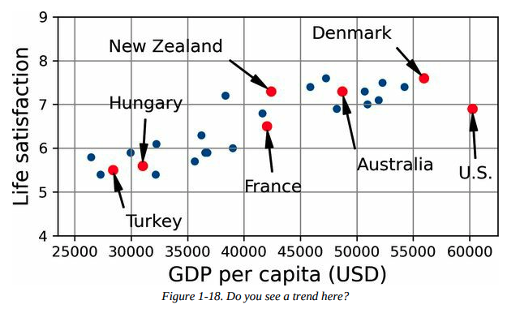
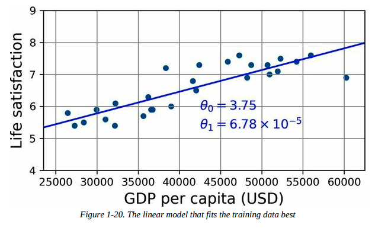

## Machine Learning Landscape

### 机器学习是什么？

**Machine learning** is the science (and art) of programming computers so they can learn from data.

- **General Definition:**

  > [Machine learning is the] field of study that gives computers the ability to learn without being explicitly programmed.  
  > — **Arthur Samuel, 1959**

- **Engineering-Oriented Definition:**

  > A computer program is said to learn from experience \(E\) with respect to some task \(T\) and some performance measure \(P\), if its performance on \(T\), as measured by \(P\), improves with experience \(E\).  
  > — **Tom Mitchell, 1997**

{.marker-round}

### 为什么要使用机器学习？

`4图一总`

#### 图示机器学习 vs 传统编程


#### 总结

- 针对现有解决方案需要大量微调或长规则列表的问题（机器学习模型通常可以简化代码，并且比传统方法表现更好）。
- 对于使用传统方法无法找到良好解决方案的复杂问题比如语音识别（最佳的机器学习技术可能可以找到解决方案）。
- 在不断变化的环境中（机器学习系统可以很容易地在新数据上重新训练，始终保持最新状态）。
- 获取关于复杂问题和大量数据的深入见解，即数据挖掘出的模式识别。

{.marker-round}

### 机器学习的现实应用

| ID  | 名称                                             | 介绍                                                                                                      | 所用到的机器学习                         |
|-----|--------------------------------------------------|-----------------------------------------------------------------------------------------------------------|------------------------------------------|
| 1   | Analyzing images of products on a production line to automatically classify them | 对生产线上的产品图像进行分析以自动分类                                                                 | 图像分类，通常使用 CNN 或 Transformers   |
| 2   | Detecting tumors in brain scans                  | 检测脑部扫描中的肿瘤                                                                                     | 语义图像分割，通常使用 CNN 或 Transformers|
| 3   | Automatically classifying news articles          | 自动分类新闻文章                                                                                         | NLP，使用 RNN、CNN 或 Transformers       |
| 4   | Automatically flagging offensive comments on discussion forums | 自动标记讨论论坛上的攻击性评论                                                                          | NLP，使用文本分类技术                     |
| 5   | Summarizing long documents automatically         | 自动总结长文档                                                                                           | NLP 的文本总结分支                        |
| 6   | Creating a chatbot or a personal assistant       | 创建聊天机器人或个人助理                                                                                 | 涉及 NLP 组件，包括 NLU 和问答模块        |
| 7   | Forecasting your company’s revenue next year, based on many performance metrics | 根据多个性能指标预测公司明年的收入                                                                       | 回归任务，使用线性回归、SVM、随机森林等   |
| 8   | Making your app react to voice commands          | 使应用程序对语音命令作出反应                                                                             | 语音识别，使用 RNN、CNN 或 Transformers   |
| 9   | Detecting credit card fraud                      | 检测信用卡欺诈                                                                                           | 异常检测，使用 Isolation Forests、GMM、自动编码器 |
| 10  | Segmenting clients based on their purchases so that you can design a different marketing strategy for each segment | 基于客户的购买行为进行客户分群，以设计不同的营销策略                                          | 聚类，使用 K-means、DBSCAN 等             |
| 11  | Representing a complex, high-dimensional dataset in a clear and insightful diagram | 将复杂的高维数据集以清晰和有见地的图形方式表示                                                          | 数据可视化，涉及降维技术                  |
| 12  | Recommending a product that a client may be interested in, based on past purchases | 基于过去的购买记录推荐客户可能感兴趣的产品                                                              | 推荐系统，使用神经网络                   |
| 13  | Building an intelligent bot for a game           | 为游戏构建智能机器人                                                                                     | 强化学习（RL）                             |

{.show-header .left-text}

### 机器学习的分类

-  **根据训练时的监督程度分类**：
  - 监督学习（Supervised Learning）
  - 无监督学习（Unsupervised Learning）
  - 半监督学习（Semi-supervised Learning）
  - 自监督学习（Self-supervised Learning）
  - 其他（Others）

-  **根据是否可以实时增量学习分类**：
  - 在线学习（Online Learning）
  - 批量学习（Batch Learning）

-  **根据工作原理分类**：
  - 基于实例的学习（Instance-based Learning）
  - 基于模型的学习（Model-based Learning）

{.marker-round}

这些标准不是互斥的，你可以根据需要将它们以任何方式组合。例如，最先进的垃圾邮件过滤器可能通过使用深度神经网络模型来实时学习，该模型由用户提供的垃圾邮件和正常邮件示例进行训练，这使得它成为一个在线的、基于模型的、有监督的学习系统。

{.marker-none}

### 有监督学习


- **定义**： 有监督学习是通过提供包含正确答案（称为标签）的训练集，让模型学习如何从输入数据预测输出。

- **主要任务**：
  - **分类**：模型从标记了类别的示例中学习如何对新数据进行分类，例如垃圾邮件过滤器。
  - **回归**：模型从标记了数值目标的示例中学习如何预测连续值，例如预测汽车价格。
  - 注意，回归模型也可以用于分类任务。

- **标签与目标**： 在回归任务中，标签通常称为目标（target），而在分类任务中更常称为标签（label）。

- **特征**： 输入数据的特征（features）是模型用来进行预测的属性或变量，通常也被称为预测变量（predictors）或属性（attributes）。

{.marker-round}

### 无监督学习

`Learning without a teacher!`

**定义**：
  - 无监督学习是指在没有标注数据的情况下，系统通过分析数据内部的结构和关系自行学习。

**主要任务**：
  - **聚类（Clustering）**：将相似的样本分组，例如根据博客访问者的行为将他们分成不同的群体。
  - **可视化（Visualization）**：通过将高维数据映射到二维或三维空间，帮助理解数据的分布和结构。
  - **降维（Dimensionality Reduction）**：通过减少特征数量来简化数据，同时尽量保留重要信息，常用于特征提取。
  - **异常检测（Anomaly Detection）**：识别异常数据点，例如检测信用卡欺诈或制造缺陷。
  - **关联规则学习（Association Rule Learning）**：发现数据中属性之间的关系，例如在销售记录中找到经常一起购买的商品组合。

{.marker-round}

### 自监督学习

- 1. **定义**： 自监督学习是一种机器学习方法，通过从未标注的数据集中生成标签，创建一个完全标注的数据集。生成标签后，使用常规的监督学习算法进行训练。

- 2. **过程**： 在自监督学习中，模型使用部分修改或遮掩的输入数据进行训练，目标是恢复或预测原始的未修改数据。例如，模型通过学习如何将遮挡的部分恢复成完整的图像来训练。通过这种方式，模型不需要人为的标签，而是使用原始图像的完整版本作为标签（目标）。训练过程中，模型学会如何填补遮挡的区域，从而提升对图像内容的理解。这种方法可以用于图像修复、去噪、图像生成等任务。

- 3. **与其他学习方式的关系**： 自监督学习与无监督学习不同，因为它在训练过程中使用生成的标签，因而更接近监督学习。无监督学习通常用于聚类、降维和异常检测，而自监督学习则主要应用于分类和回归任务。

- 4. **独立类别**： 虽然自监督学习有时被视为无监督学习的一部分，但由于其在训练过程中生成标签的特性，通常将其视为独立的学习类别更为合适。

{.marker-round}

### 强化学习


-  **定义**： 强化学习是一种独特的学习方法，其中学习系统（称为智能体）通过观察环境、选择和执行动作，并根据结果获取奖励或惩罚（负奖励）来学习最佳策略。

-  **学习过程**： 智能体在环境中执行动作，观察结果并根据获得的奖励或惩罚来调整其策略（称为政策）。这一过程不断重复，直到找到能够最大化长期奖励的最佳策略。

-  **关键概念**：
  - **智能体（Agent）**：负责在环境中采取行动的主体。
  - **环境（Environment）**：智能体所处的外部条件，智能体从中接收反馈。
  - **政策（Policy）**：定义智能体在特定情境下应该选择的行动策略。
  - **奖励（Reward）**：智能体执行动作后得到的反馈，可以是正向奖励（奖励）或负向奖励（惩罚）。

-  **学习过程的图解**： 通过一个简单的示意图解释强化学习的过程：智能体观察环境，选择动作，执行动作后获得奖励或惩罚，更新策略并重复该过程，直到找到最优策略。

{.marker-round}

### 批量学习

- **定义**： 批量学习（Batch Learning）是指系统无法进行增量学习，需要使用全部数据进行训练。这通常需要大量的时间和计算资源，并且一般在离线状态下完成（称为离线学习）。

- **特点**：
  - 系统一旦训练完成并投入使用，就不会再学习，只会应用它学到的内容。
  - 模型的性能可能会随着时间的推移而下降，因为世界在不断变化，而模型保持不变。这种现象被称为**模型腐化**（model rot）或**数据漂移**（data drift）。

-  **解决方案**： 需要定期用最新数据重新训练模型，频率取决于具体应用场景。例如，对于变化缓慢的任务，重新训练的频率可以较低，而对于快速变化的任务（如金融市场预测），则需要更频繁地重新训练。

- **挑战**：
  - 训练整个数据集可能需要数小时甚至数天的时间，且使用全部数据进行训练需要大量计算资源（CPU、内存、磁盘空间、网络等）。
  - 如果数据量巨大，甚至可能无法使用批量学习算法。
  - 对于需要在有限资源（如智能手机或火星探测器）上自主学习的系统，携带大量训练数据并进行长时间训练是不可行的。

- **自动化的可行性**： 尽管批量学习的流程涉及多个步骤（如训练、评估、部署），但这些步骤都是结构化的、可重复的，现代机器学习工具和框架（如TensorFlow、Scikit-learn等）提供了自动化这些步骤的支持。因此，整个训练、评估和部署过程可以相对容易地实现自动化，减少了人工干预的复杂性。

- **替代方案**： 针对需要更高反应速度的场景，可以考虑使用能够进行增量学习的算法，避免每次都从头开始重新训练模型。

{.marker-round}

### 在线学习

- **定义**： 在线学习是指系统通过增量地学习数据实例来逐步更新模型。每个学习步骤都是快速且低成本的，这使得系统可以在数据到达时实时学习和更新。

- **应用场景**：
  - **快速适应变化**：适用于需要迅速适应变化的系统，例如检测股市中的新模式。
  - **资源受限环境**：适用于计算资源有限的环境，例如移动设备上的模型训练。

- **增量学习与大数据处理**： 在线学习算法可以用于处理无法一次性装入内存的巨大数据集（称为“外存学习”）。算法会分批加载数据，逐步训练模型，直到处理完所有数据。

- **关键参数**：
  - **学习率（Learning Rate）**：决定系统适应变化数据的速度。高学习率使系统快速适应新数据，但也可能容易遗忘旧数据；低学习率则使系统对新数据的噪声更不敏感，但更新速度较慢。

- **挑战**：**数据质量**：如果系统接收到坏数据，性能可能会迅速下降。特别是在实时系统中，坏数据的影响更为显著。为了降低风险，需要密切监控系统的输入数据和性能表现，及时处理异常数据。

- **风险控制**： 为了应对坏数据带来的风险，可能需要在检测到性能下降时迅速关闭在线学习功能，并回退到之前的模型状态。此外，可以使用异常检测算法来监控输入数据的质量。

- **图解**：
  - 展示了在线学习的基本流程，即系统通过增量方式学习新数据，并持续更新模型，使其能够实时适应新数据的变化。
  - 展示了在线学习如何处理超大数据集的过程，通过将数据集分批加载到内存中逐步训练模型，从而实现对无法一次性装入内存的大数据集的学习。

{.marker-round}

### 基于实例的学习

- **定义**： 基于实例的学习是通过记住训练数据中的具体实例，并在预测新数据时通过比较相似性来进行分类或回归。这种方法主要依赖于计算新数据与已知实例之间的相似度。

- **相似度度量**： 系统通过一种相似性度量（如共同单词的数量）来判断新实例与已知实例的相似度。相似度越高，新实例越可能被归类为与相似实例相同的类别。

- **过程**：
  - 学习阶段：系统“记住”训练集中的所有实例。
  - 推理阶段：对于新的输入实例，系统计算它与所有已知实例的相似度，并根据相似度最高的实例的类别来进行分类。

- **图解**： 在图中，新的实例（图中的红色“X”）通过与训练实例比较，被分类为与其最相似的类别（三角形），因为它与多个三角形实例的相似度最高。

{.marker-round}

### 基于模型的学习

- **定义**: 基于模型的学习是一种通过构建模型来概括数据并进行预测的学习方式。

- **特点**:
  - **构建模型**: 从一组示例中概括出一个模型，该模型捕捉了数据中的某种模式或关系。
  - **预测能力**: 模型被训练后可以用来对新数据进行预测。例如，使用线性回归模型来预测某个国家的生活满意度与其人均GDP之间的关系。

- **典型流程**:
  1. **研究数据**: 例如，分析生活满意度和人均GDP的关系。
  2. **选择模型**: 选择合适的模型，如线性回归。
  3. **训练模型**: 使用训练数据来优化模型参数，使模型能够尽可能准确地拟合数据。
  4. **预测**: 使用训练好的模型对新数据进行预测。

- **图解**:
  -  显示了通过一个模型来区分新实例和训练实例的示意图。
  -  显示了通过GDP与生活满意度之间的关系来建立线性模型的步骤。这个模型最终能够用于预测其他国家的生活满意度。

- **总结**:
  - 你研究了数据。
  - 你选择了一个模型。
  - 你在训练数据上训练了模型。
  - 最终，你使用模型对新案例进行预测，希望模型能很好地泛化。

基于模型的学习通过构建和训练模型来捕捉数据中的模式，最终可以用这些模型进行有效的预测。这种学习方法广泛应用于各种机器学习项目中。

### 机器学习的挑战

`In short, since your main task is to select a model and train it on some data, the two things that can go wrong are “bad model” and “bad data”.`

| **ID** | **挑战**                       | **描述**                                                                                                                                                                      |
|--------|--------------------------------|-------------------------------------------------------------------------------------------------------------------------------------------------------------------------------|
| **1**  | **训练数据量不足**               | 机器学习需要大量数据才能正常工作。对于图像或语音识别等复杂问题，可能需要数百万个示例。                                                                                       |
| **2**  | **非代表性训练数据**             | 如果训练数据不能代表真实世界的数据，模型的表现将会很差。数据必须覆盖所有可能的场景。                                                                                       |
| **3**  | **数据质量差**                   | 含有大量噪音、错误或不一致的数据会导致模型表现不佳。数据清洗和预处理至关重要。                                                                                           |
| **4**  | **无关特征**                     | 不相关的特征可能会混淆模型，导致性能下降。特征选择或特征提取非常重要。                                                                                                     |
| **5**  | **训练数据过拟合**               | 当模型过于复杂时，它可能会学习训练数据中的噪音而不是实际模式，导致对新数据的泛化能力差。                                                                                   |
| **6**  | **训练数据欠拟合**               | 如果模型过于简单，它将无法捕捉数据中的潜在模式，导致在训练和新数据上的表现都很差。                                                                                       |

{.show-header .left-text}

### 训练数据量不足


- **定义**: 机器学习需要大量的数据来正常工作。即使是非常简单的问题通常也需要数千个例子，而对于复杂问题（如图像或语音识别），可能需要数百万个例子。

- **不合理的数据有效性**: 研究表明，给定足够的数据，简单的算法往往能表现得与复杂的算法一样好。这表明在开发算法和收集数据之间，我们应更多地考虑数据收集的重要性。

- **现实挑战**: 尽管大数据通常比算法更重要，但中小规模的数据集仍然非常普遍，而且获得额外的训练数据并不总是容易或便宜的。因此，不能轻易放弃对算法的优化。

{.marker-round}

### 非代表性数据

- **定义**：在机器学习中，为了使模型能够很好地泛化，训练数据必须能够代表你想要泛化的新情况。这对基于实例的学习和基于模型的学习同样重要。

- **图解**：
  - 
  - 训练模型时使用的国家集不包含GDP非常低或非常高的国家，导致模型无法准确预测这些国家的数据。
  - 当加入这些缺失的国家时，模型的表现和预测结果会显著改变，表明原有的简单线性模型无法很好地工作。

- **重要性**：使用非代表性的数据集训练的模型，尤其在预测非常贫穷或非常富有的国家时，可能会产生不准确的预测结果。

- **采样噪声**：即使样本量非常大，如果采样方法有缺陷，数据也可能是非代表性的。这种方法上的缺陷被称为采样偏差。

- **采样偏差的示例**：
  - **1936年美国总统选举**：Literary Digest 杂志进行的大规模调查由于采样方法偏向富裕人群，导致错误地预测了选举结果。
  - **YouTube音乐视频示例**：如果仅依赖于YouTube搜索结果来构建训练集，搜索引擎返回的视频可能偏向于流行的艺人，而不是代表整个"funk音乐"类别。

- **结论**：为了确保模型的准确性，必须谨慎选择和处理训练数据，以避免采样偏差和数据集的非代表性问题。

{.marker-round}

### 数据质量差

- **定义**：低质量的数据（如错误、异常值、噪声）会使系统难以检测到潜在模式，导致性能下降。
- **重要性**：清理训练数据非常重要，大多数数据科学家花费大量时间进行数据清理。
- **处理方法**：
  - 对于明显的异常值，可以选择删除或手动修正错误。
  - 对于缺少部分特征的实例，决定是否忽略该特征、忽略这些实例、填充缺失值，或训练包含和不包含该特征的两个模型。

{.marker-round}

### 无关特征

- **定义**：如果训练数据中包含太多不相关的特征，系统将难以学到有效的模式。
- **关键过程**：成功的机器学习项目依赖于良好的特征工程，包括以下步骤：
  - **特征选择**：从现有特征中选择最有用的特征进行训练。
  - **特征提取**：将现有特征组合成更有用的特征（例如，使用降维算法）。
  - **新特征创建**：通过收集新数据来生成新特征。

{.marker-round}

### 过拟合

过拟合（Overfitting）的要点如下：

- **定义**：过拟合是指模型在训练数据上表现良好，但在新数据上泛化能力差。这通常是因为模型过于复杂，捕捉到了训练数据中的噪音或无关模式。
- **图解**：
  - 这张图展示了一个高阶多项式模型在训练数据上的表现。虽然这个模型在训练数据（蓝色点）上表现得非常好，能够准确拟合所有数据点，但它很可能只是捕捉到了数据中的噪音，而不是反映真实的趋势，因此对新数据的泛化能力较差。
  - 这张图展示了三种模型的表现。虚线代表了在部分数据上训练的原始模型，实线表示在全部数据上训练的模型，而点线则是经过正则化处理后的模型。可以看到，正则化模型的斜率更小，尽管它在训练数据上的拟合效果稍差，但它对新数据的泛化能力更好。
- **解决方法**：
  - **简化模型**：选择更简单的模型，减少参数数量或约束模型。
  - **增加训练数据**：更多的数据可以帮助模型学习到更稳定和普适的模式。
  - **正则化**：通过加入正则化项（如L1或L2）来限制模型的复杂度，从而减少过拟合的风险。

{.marker-round}

### 欠拟合

- **定义**：欠拟合（Underfitting）是指模型过于简单，无法捕捉数据的潜在结构，导致在训练数据上的表现也不佳。

- **原因**：
  - 模型复杂度不足，无法准确表示数据中的复杂关系。

- **解决方法**：
  - 选择更强大的模型，增加模型参数。
  - 提供更好的特征（即通过特征工程增强输入数据）。
  - 减少对模型的约束（例如，降低正则化参数的值）。

{.marker-round}

### 机器学习BigPicture {.col-span-2}

| **ID** | **Topic**                                | **Summary**                                                                                                                                                                                                                      | **中文总结**                               |
|--------|------------------------------------------|----------------------------------------------------------------------------------------------------------------------------------------------------------------------------------------------------------------------------------|--------------------------------------------|
| 1      | **Purpose of Machine Learning**          | Machine learning is about making machines get better at some task by learning from data, instead of having to explicitly code rules.                                                                                              | 机器学习旨在通过从数据中学习，让机器在某些任务上表现得更好，而无需显式编写规则。|
| 2      | **Types of ML Systems**                  | There are many different types of ML systems: supervised or unsupervised, batch or online, instance-based or model-based.                                                                                                        | 机器学习系统有多种类型：监督学习或非监督学习，批量学习或在线学习，基于实例或基于模型。|
| 3      | **ML Project Process**                   | In an ML project, you gather data in a training set, and you feed the training set to a learning algorithm. If the algorithm is model-based, it tunes parameters to fit the model to the training set and generalizes to new cases.| 在机器学习项目中，收集数据形成训练集，并将其提供给学习算法。若算法是基于模型的，它会调整参数使模型适应训练集并泛化到新实例。|
| 4      | **Instance-based vs Model-based Algorithms** | If the algorithm is instance-based, it learns examples by heart and generalizes to new instances using a similarity measure.                                                                                                      | 如果算法是基于实例的，它会通过记住实例并使用相似性度量来泛化到新实例。|
| 5      | **Challenges in ML**                     | The system will not perform well if the training set is too small, non-representative, noisy, or polluted with irrelevant features. The model must balance complexity to avoid underfitting or overfitting.                      | 如果训练集太小、不具代表性、有噪声或包含无关特征，系统将表现不佳。模型必须在复杂性上进行平衡，以避免欠拟合或过拟合。|

{.show-header .left-text}

### 模型验证与泛化能力评估

- **模型泛化能力评估**：要评估模型对新数据的泛化能力，最直接的方法是将其部署在生产环境中，通过实际使用来观察模型的表现。
- **数据集划分**：一种更好的方法是将数据集划分为训练集（training set）和测试集（test set）。在训练集上训练模型，然后使用测试集评估模型的泛化误差（generalization error），即模型在未见过的数据上的错误率。
- **泛化误差的意义**：泛化误差可以帮助估计模型在新数据上的表现。如果训练误差低，但泛化误差高，说明模型发生了过拟合。
- **数据划分建议**：通常使用80%的数据用于训练，20%的数据用于测试，具体比例可以根据数据集的大小进行调整。

{.marker-round}

### 超参数调优与模型选择

- **问题概述**：超参数调优和模型选择是确保模型在新数据上表现良好的关键步骤。如果仅依靠测试集进行选择，可能会导致模型过拟合于测试集，从而在新数据上表现不佳。

- **常见问题**：
  - 多次在测试集上评估模型可能导致模型和超参数过拟合于该特定测试集，从而无法很好地泛化到新数据。

- **解决方案**：
  - **留出验证法**：从训练集中划分出一部分数据作为验证集（dev set），用来评估多个候选模型，并选择表现最佳的模型。
  - **交叉验证**：为了更准确地评估模型，可以使用交叉验证，将训练集分成多个小的验证集，每个模型在多个验证集上进行评估，最终选择表现最好的模型。

- **注意事项**：
  - 验证集过小可能导致评估不准确，可能错误地选择次优模型。
  - 验证集过大会导致剩余的训练集过小，从而影响模型的训练效果。

- **图解**
  图展示了使用保留验证（Holdout Validation）进行模型选择的流程：
  - **Training set（训练集）**：首先从训练集中训练多个模型。
  - **Dev set（开发集）**：接着在开发集（或验证集）上评估这些模型，选择表现最好的模型。
  - **Retrain the best model（重新训练最佳模型）**：将选择出的最佳模型在整个训练集上重新训练，包括原始的训练集和开发集。
  - **Test set（测试集）**：最后在测试集上评估最终模型，以得到模型在未见过的数据上的表现。
  这一流程帮助确保选择出的模型不仅在开发集上表现良好，而且在实际应用中也能有良好的泛化能力。

{.marker-round}

这个过程旨在通过合理划分数据集来避免模型在新数据上的性能下降，并确保最终模型在不同数据集上的表现都足够稳健。

{.marker-none}

### 数据不匹配

- **定义**：数据不匹配是指训练数据与实际使用中数据的差异，导致模型在实际应用中表现不佳。

- **关键问题**：当训练数据与实际生产环境中的数据不一致时，即使模型在训练集上表现良好，也可能在测试集上表现不佳。这种情况会使得我们无法判断模型在测试集上的表现差是由于训练集过拟合还是由于数据不匹配。

- **解决方案**：
  1. **创建train-dev集**：将部分训练数据保留作为train-dev集，在训练模型后，用train-dev集进行评估。如果模型在train-dev集上表现不佳，则说明模型过拟合。如果表现良好，则问题可能来自数据不匹配。
  2. **处理数据不匹配**：通过预处理训练数据，使其与实际应用中的数据更相似，以减少数据不匹配的影响。

- **图解**
  主要展示了如何处理数据不匹配的问题。它分为四个部分：
  - **Train（训练集）**：这部分数据来自网络，数量充足，但与实际使用的应用数据可能存在差异。
  - **Train-dev（训练-开发集）**：从训练集中保留一部分数据，专门用来评估模型是否在训练集上过拟合。如果模型在这个集上表现不好，说明模型可能过拟合。
  - **Dev（开发集）**：用来评估模型在接近实际使用环境的数据上的表现，从而检测数据不匹配的问题。
  - **Test（测试集）**：最终用于评估模型的实际表现。
  通过这一流程，可以确保模型不仅在训练集上表现良好，还能够在实际应用的数据上有效运行，从而应对数据不匹配的问题。

- **结论**：在开发机器学习模型时，确保训练数据和实际使用中的数据尽可能一致是非常重要的，特别是在生产环境中数据稀缺的情况下，数据不匹配可能对模型性能造成严重影响。

{.marker-round}

### exercise {.col-span-3}

| #   | Questions                                                                                                                                       | 中文翻译                                                                                               |
|-----|-------------------------------------------------------------------------------------------------------------------------------------------------|--------------------------------------------------------------------------------------------------------|
| 1   | How would you define machine learning?                                                                                                          | 你会如何定义机器学习？                                                                                   |
| 2   | Can you name four types of applications where it shines?                                                                                        | 你能举出四种机器学习表现出色的应用吗？                                                                   |
| 3   | What is a labeled training set?                                                                                                                 | 什么是带标签的训练集？                                                                                   |
| 4   | What are the two most common supervised tasks?                                                                                                  | 最常见的两种监督学习任务是什么？                                                                         |
| 5   | Can you name four common unsupervised tasks?                                                                                                    | 你能举出四种常见的无监督学习任务吗？                                                                     |
| 6   | What type of algorithm would you use to allow a robot to walk in various unknown terrains?                                                      | 你会使用哪种算法让机器人在各种未知地形上行走？                                                           |
| 7   | What type of algorithm would you use to segment your customers into multiple groups?                                                            | 你会使用哪种算法将你的客户分成多个群体？                                                                 |
| 8   | Would you frame the problem of spam detection as a supervised learning problem or an unsupervised learning problem?                             | 你会将垃圾邮件检测问题归类为监督学习问题还是无监督学习问题？                                               |
| 9   | What is an online learning system?                                                                                                              | 什么是在线学习系统？                                                                                     |
| 10  | What is out-of-core learning?                                                                                                                   | 什么是外存学习（Out-of-core learning）？                                                                  |
| 11  | What type of algorithm relies on a similarity measure to make predictions?                                                                      | 哪种算法依赖相似性度量进行预测？                                                                          |
| 12  | What is the difference between a model parameter and a model hyperparameter?                                                                    | 模型参数和模型超参数之间有什么区别？                                                                      |
| 13  | What do model-based algorithms search for? What is the most common strategy they use to succeed? How do they make predictions?                  | 基于模型的算法在寻找什么？它们最常用的成功策略是什么？它们如何进行预测？                                  |
| 14  | Can you name four of the main challenges in machine learning?                                                                                    | 你能说出机器学习中的四个主要挑战吗？                                                                      |
| 15  | If your model performs great on the training data but generalizes poorly to new instances, what is happening? Can you name three possible solutions? | 如果你的模型在训练数据上表现很好但在新实例上泛化性差，这是什么情况？你能举出三种可能的解决方案吗？            |
| 16  | What is a test set, and why would you want to use it?                                                                                           | 什么是测试集，为什么要使用它？                                                                            |
| 17  | What is the purpose of a validation set?                                                                                                        | 验证集的作用是什么？                                                                                      |
| 18  | What is the train-dev set, when do you need it, and how do you use it?                                                                          | 什么是训练-开发集（train-dev set），什么时候需要它，以及如何使用它？                                        |
| 19  | What can go wrong if you tune hyperparameters using the test set?                                                                               | 如果你使用测试集来调整超参数，可能会出什么问题？                                                          |


{.show-header .left-text}


## End-to-End Machine Learning Project

### 使用真实数据

| 特征名称               | 描述                             |
|------------------------|----------------------------------|
| longitude              | 经度                             |
| latitude               | 纬度                             |
| housing_median_age     | 房屋中位年龄                     |
| total_rooms            | 房间总数                         |
| total_bedrooms         | 卧室总数                         |
| population             | 人口数量                         |
| households             | 家庭户数                         |
| median_income          | 中位收入                         |
| median_house_value     | 中位房屋价值                     |
| ocean_proximity        | 靠近海洋的距离                   |

{.show-header .left-text}


{.marker-none}

### 项目整体视角 {.col-span-2}

#### Step-01 问题框架化

- **明确业务目标**：首先要了解构建模型的最终业务目标是什么。模型的预测结果如何帮助企业决策，这决定了问题的定义、模型的选择、评估标准以及调整模型的力度。

- **当前解决方案**：询问现有解决方案的表现如何，以此作为参考来确定模型的性能要求，并指导问题的解决。现有解决方案可能依赖人工估算，这种方法耗时且不准确，因此公司需要一个模型来预测地区房价。

- **数据管道**：机器学习过程通常由多个异步运行的数据处理组件组成。这些组件串联起来处理数据，逐步生成模型的最终预测结果。每个组件独立工作，彼此通过数据存储交互。
  
  - **District Data**（区域数据）： 图的最左边是输入数据，即每个地区的相关数据，比如人口、收入、房价等。这些数据是整个流程的起点。

  - **District Pricing**（区域定价）： 中间的组件代表了一个机器学习模型或算法，它利用输入的区域数据来预测每个地区的房价（即中间的“District Pricing”框）。这个组件是整个管道的核心，负责生成模型的主要输出。

  - **Investment Analysis**（投资分析）： 区域房价预测完成后，预测结果会被输入到下一个组件，即投资分析系统。这个系统会根据预测的房价和其他输入信号来判断是否在某个地区投资。这一步是决定最终投资决策的关键。

  - **Investments**（投资）： 图的最右侧是最终的输出——投资决策。基于之前的分析，系统决定在某些地区进行投资。

  尽管这个管道图看起来非常简单甚至宏观，但它反映了一个非常普遍且重要的概念：将复杂的任务分解为简单的步骤，通过管道连接起来，从而形成一个整体系统。这种方法在数据科学、机器学习以及广泛的商业应用中都非常有用。

- **问题类型**：明确需要解决的问题是监督学习、无监督学习，还是强化学习任务，并确定是分类问题还是回归问题。波士顿房价预测问题是一个典型的多元回归问题。

- **学习类型**：对于当前问题，由于数据量适中且无需快速响应变化的实时数据，因此选择批量学习（Batch Learning）是合适的。如果数据量很大，可以考虑使用在线学习或MapReduce方法来分布式处理数据。

{.marker-timeline}

#### Step-02 选择模型性能度量指标

**选择的性能度量指标：** 均方根误差 (RMSE)

**选择原因：**

- **度量原理**：`KaTeX:RMSE` 衡量预测值与实际值之间的平方差的平均值的平方根，强调大误差。这对于房价预测中的大误差非常重要。
- **适用性**：房价数据通常具有正态分布特性，```KaTeX:RMSE``` 适合这种数据分布。
- **行业标准**：```KaTeX:RMSE``` 是回归问题中广泛使用的标准度量指标，尤其是在房价预测等领域。

**为什么不选择其他指标：**

- **MAE**：虽然对异常值不敏感，但在房价预测中需要对大误差给予更多的关注，```KaTeX:RMSE``` 在这方面表现更优。
- **R² 决定系数**：```KaTeX:R^2``` 表示模型的拟合程度，但可能在数据分布异常时误导，不如 ```KaTeX:RMSE``` 直观。

因此，在加利福尼亚房价预测项目中，```KaTeX:RMSE``` 是最合适的选择。

[性能度量指标选择表](/machine-learning.html#machine-learning-performance-measure) {.link-arrow}

#### Step-03 验证你的假设

`杜绝自己想象`

- **列出并验证假设**：列出并验证所有已经做出的假设，这可以帮助你在早期发现严重问题。
- **场景示例**：例如，假设你的系统输出的区域价格将被下游的机器学习系统使用，而你假设这些价格会被直接使用。然而，如果下游系统将价格转换为分类（如“便宜”、“中等”或“昂贵”），并使用这些类别而不是实际价格，那么你的假设可能就不成立。
- **任务类型错误**：如果仅需预测类别，那么问题应被设定为分类任务而非回归任务，避免在错误的任务类型上浪费时间。
- **与下游系统团队沟通**：在与下游系统团队沟通后，确认他们确实需要的是实际价格而非类别。这个步骤验证了你最初的假设是正确的。
- **开始编码**：当确认假设正确后，你可以放心地开始编写代码。

{.marker-timeline}

### Step-01 使用Google Colab


或者，本地clone [handson-ml3] (https://github.com/ageron/handson-ml3) 到本地

```shell script
$ jupyter notebook
```

### Step-02 编码环境检查


```python
print("Welcome to Machine Learning! ragnor.li")
```

```python
import sys
assert sys.version_info >= (3, 7)
```

```python
from packaging import version
import sklearn

assert version.parse(sklearn.__version__) >= version.parse("1.0.1")
```

### Step-03 数据集下载

```python
from pathlib import Path
import pandas as pd
import tarfile
import urllib.request

def load_housing_data():
    tarball_path = Path("datasets/housing.tgz")
    if not tarball_path.is_file():
        Path("datasets").mkdir(parents=True, exist_ok=True)
        url = "https://github.com/ageron/data/raw/main/housing.tgz"
        urllib.request.urlretrieve(url, tarball_path)
        with tarfile.open(tarball_path) as housing_tarball:
            housing_tarball.extractall(path="datasets")
    return pd.read_csv(Path("datasets/housing/housing.csv"))

housing = load_housing_data()
```

### Step-04 杀猪先瞅瞅心里有个底 {.col-span-3}


#### 整体特征瞅一眼

`housing.head()` 显示数据框的前五行。用于快速查看数据的前几行记录，了解数据的整体结构。`尤其要把数据实例的特征代表的实际业务含义研究清楚`

|index|longitude|latitude|housing\_median\_age|total\_rooms|total\_bedrooms|population|households|median\_income|median\_house\_value|ocean\_proximity|
|---|---|---|---|---|---|---|---|---|---|---|
|0|-122\.23|37\.88|41\.0|880\.0|129\.0|322\.0|126\.0|8\.3252|452600\.0|NEAR BAY|
|1|-122\.22|37\.86|21\.0|7099\.0|1106\.0|2401\.0|1138\.0|8\.3014|358500\.0|NEAR BAY|
|2|-122\.24|37\.85|52\.0|1467\.0|190\.0|496\.0|177\.0|7\.2574|352100\.0|NEAR BAY|
|3|-122\.25|37\.85|52\.0|1274\.0|235\.0|558\.0|219\.0|5\.6431|341300\.0|NEAR BAY|
|4|-122\.25|37\.85|52\.0|1627\.0|280\.0|565\.0|259\.0|3\.8462|342200\.0|NEAR BAY|

{.show-header .left-text}


#### 数据集中实例数据类型与缺失检查

`housing.info()` 显示数据框的基本信息，包括行数、列数、每列的非空值数量和数据类型。用于检查数据框的结构和识别缺失数据。

```text
<class 'pandas.core.frame.DataFrame'>
RangeIndex: 20640 entries, 0 to 20639
Data columns (total 10 columns):
 #   Column              Non-Null Count  Dtype  
---  ------              --------------  -----  
 0   longitude           20640 non-null  float64
 1   latitude            20640 non-null  float64
 2   housing_median_age  20640 non-null  float64
 3   total_rooms         20640 non-null  float64
 4   total_bedrooms      20433 non-null  float64
 5   population          20640 non-null  float64
 6   households          20640 non-null  float64
 7   median_income       20640 non-null  float64
 8   median_house_value  20640 non-null  float64
 9   ocean_proximity     20640 non-null  object 
dtypes: float64(9), object(1)
memory usage: 1.6+ MB
```

`检查结果如下：`

| 序号 | 要点                                                         |
|------|--------------------------------------------------------------|
| 1    | 数据集中共有 20,640 个实例（样本）。           |
| 2    | `total_bedrooms` 属性中有 207 个地区缺少值，需要处理。       |
| 3    | 除 `ocean_proximity` 属性外，所有其他属性都是数值型的。      |
| 4    | `ocean_proximity` 属性的数据类型是 `object`，即文本属性。    |
| 5    | `ocean_proximity` 列中的值是重复的，表明它可能是分类属性。   |
| 6    | 可以使用 `value_counts()` 方法来查找类别及其分布。           |

{.show-header .left-text}


#### 数据集中不同类别特征的分布情况

`housing["ocean_proximity"].value_counts()` 统计ocean_proximity列中每个类别的频次。用于了解数据集中不同类别的分布情况。

```text
<1H OCEAN     9136
INLAND        6551
NEAR OCEAN    2658
NEAR BAY      2290
ISLAND           5
Name: ocean_proximity, dtype: int64
```

#### 快速了解数值数据的分布和主要统计特征

`housing.describe()` 生成数据框数值列的汇总统计信息，包括计数、平均值、标准差、最小值、四分位数和最大值。用于快速了解数值数据的分布和主要统计特征。


|index|longitude|latitude|housing\_median\_age|total\_rooms|total\_bedrooms|population|households|median\_income|median\_house\_value|
|---|---|---|---|---|---|---|---|---|---|
|count|20640\.0|20640\.0|20640\.0|20640\.0|20433\.0|20640\.0|20640\.0|20640\.0|20640\.0|
|mean|-119\.56970445736432|35\.63186143410853|28\.639486434108527|2635\.7630813953488|537\.8705525375618|1425\.4767441860465|499\.5396802325581|3\.8706710029069766|206855\.81690891474|
|std|2\.0035317235025882|2\.1359523974571153|12\.58555761211165|2181\.615251582795|421\.3850700740322|1132\.462121765341|382\.32975283161073|1\.8998217179452688|115395\.61587441387|
|min|-124\.35|32\.54|1\.0|2\.0|1\.0|3\.0|1\.0|0\.4999|14999\.0|
|25%|-121\.8|33\.93|18\.0|1447\.75|296\.0|787\.0|280\.0|2\.5633999999999997|119600\.0|
|50%|-118\.49|34\.26|29\.0|2127\.0|435\.0|1166\.0|409\.0|3\.5347999999999997|179700\.0|
|75%|-118\.01|37\.71|37\.0|3148\.0|647\.0|1725\.0|605\.0|4\.74325|264725\.0|
|max|-114\.31|41\.95|52\.0|39320\.0|6445\.0|35682\.0|6082\.0|15\.0001|500001\.0|

{.show-header .left-text}

`分析结果如下`

| 要点                        | 解释                                                                                                                             |
|-----------------------------|----------------------------------------------------------------------------------------------------------------------------------|
| `housing.describe()`         | 提供数据集中每个数值属性的统计摘要，包括计数、平均值、最小值、最大值以及四分位数（25%、50%、75%）。                                                    |
| `count`                     | 统计数据集中每个属性的非空值数量。                                                                                                 |
| `mean`                      | 计算每个属性的平均值。                                                                                                             |
| `std`                       | 显示标准差，衡量数据的离散程度。                                                                                                   |
| `min` 和 `max`               | 分别表示数据集中每个属性的最小值和最大值。                                                                                          |
| `25%`, `50%`, `75%`          | 表示数据的四分位数：25%表示第一个四分位数（Q1），50%是中位数，75%表示第三个四分位数（Q3）。                                                   |
| 百分位（percentile）的意义      | 百分位数指的是在一组观察值中某个百分比以下的值。比如，25%的区的 `housing_median_age` 小于18，50%小于29，75%小于37。                                     |
| `hist()` 方法                | 可以为每个数值属性绘制直方图，显示每个属性值在不同范围内的实例数量。直方图是了解数据类型的快速方式。                                                   |
| 绘制直方图的选项               | 可以为单个属性绘制直方图，或者使用 `hist()` 方法为整个数据集中的所有数值属性同时绘制直方图。                                               |

{.show-header .left-text}

#### 可视化单特征的数据分布情况

- 对 housing 数据集中的几个特征绘制直方图，并将这些图保存为高分辨率的 PNG 文件

```python

# extra code – code to save the figures as high-res PNGs for the book

IMAGES_PATH = Path() / "images" / "end_to_end_project"
IMAGES_PATH.mkdir(parents=True, exist_ok=True)

def save_fig(fig_id, tight_layout=True, fig_extension="png", resolution=300):
    path = IMAGES_PATH / f"{fig_id}.{fig_extension}"
    if tight_layout:
        plt.tight_layout()
    plt.savefig(path, format=fig_extension, dpi=resolution)
    
    
    
import matplotlib.pyplot as plt

# extra code – the next 5 lines define the default font sizes
plt.rc('font', size=14)
plt.rc('axes', labelsize=14, titlesize=14)
plt.rc('legend', fontsize=14)
plt.rc('xtick', labelsize=10)
plt.rc('ytick', labelsize=10)

housing.hist(bins=50, figsize=(12, 8))
save_fig("attribute_histogram_plots")  # extra code
plt.show()

```


`图形中观察出来的秘密`

| ID  | 要点内容                       | 详细描述                                                                                                           | 如何分析得出                                                                 |
|-----|----------------------------|------------------------------------------------------------------------------------------------------------------|---------------------------------------------------------------------------|
| 1   | 中位数收入未以美元表示                | 中位数收入属性的值似乎并不代表美元，而是缩放后的数值范围，如15和0.5等，并不是实际的收入金额。                                     | 通过观察“median_income”的直方图，发现数值范围在0到15之间，这明显不是美元的典型表示范围。            |
| 2   | 房价上限影响模型预测                 | 房价和房龄的直方图显示，它们被封顶在某个特定的值，如500,000美元，这可能导致模型在预测时遇到限制。                                      | “median_house_value”和“housing_median_age”的直方图中，数据堆积在最大值处，这意味着数据被封顶。  |
| 3   | 属性具有不同的尺度                   | 数据集中不同属性的范围和分布差异较大，某些属性如“total_rooms”数值较大，而“median_income”数值较小。                               | 从每个属性的直方图观察到，各属性的数值范围差异明显，这意味着它们的尺度不同，可能需要缩放。                              |
| 4   | 直方图右偏，数据分布不对称             | 大多数属性的直方图显示出右偏分布，即大部分数据集中在左侧，而尾部拉长，这种分布可能会影响模型训练的效果。                                         | 通过观察直方图，可以看到许多属性的分布呈现右偏，特别是像“median_income”，这是数据分布不对称的特征。               |
| 5   | 在进一步分析数据前创建测试集            | 分析数据前需要创建一个测试集，以确保模型评估时有未见过的数据，这对于验证模型的泛化能力非常重要。                                               | 这是数据科学中的一个常见做法，目的是确保模型评估的公正性和可靠性。虽然不是从图表中直接得出，但这是一个关键的分析步骤。       |

{.show-header .left-text}

### Step-05 分割测试集 {.col-span-3}

#### 数据集划分

```python
import numpy as np

def shuffle_and_split_data(data, test_ratio):
    # 生成一个与数据集长度相同的随机排列的索引数组，确保数据的顺序被打乱，随机打乱后，训练集和测试集的分布更接近真实情况，这样训练出来的模型能够更好地适应新数据，从而提高模型的泛化能力。
    shuffled_indices = np.random.permutation(len(data))
    
    # 计算测试集的大小，test_ratio 确定测试集占总数据集的比例
    test_set_size = int(len(data) * test_ratio)
    
    # 根据打乱后的索引数组，选取前 test_set_size 个索引作为测试集的索引
    test_indices = shuffled_indices[:test_set_size]
    
    # 剩下的索引作为训练集的索引
    train_indices = shuffled_indices[test_set_size:]
    
    # 根据训练集和测试集的索引，分别返回训练集和测试集的数据
    return data.iloc[train_indices], data.iloc[test_indices]

```

You can then use this function like this:

```python
train_set, test_set = shuffle_and_split_data(housing, 0.2)
len(train_set)
len(test_set)
```

#### 稳定测试集创建与可靠模型评估

在机器学习项目中，测试集的主要目的是评估模型在未见过的数据上的表现，从而判断模型的泛化能力。如果你每次运行程序时生成的测试集不同，意味着测试集的数据每次都在变化，这会导致以下问题：

- **模型可能见过全部数据**：如果每次运行程序时，测试集的数据都不一样，随着多次运行，模型最终可能会见到整个数据集的所有数据。这样，测试集不再是真正意义上的“未见过”的数据，从而无法有效地评估模型的泛化能力。

- **无法比较模型的性能**：如果测试集每次都不同，那么模型在每次训练后的表现也会因为测试数据不同而有所变化。这使得你无法有效地比较模型在不同运行中的表现，因为测试集本身的差异就会导致性能评估的结果不一致。

- **不稳定的模型评估**：由于测试集的变化，你得到的模型性能评估结果每次都不一样，无法判断模型的实际能力。这种不稳定性会让你难以得出可靠的结论。

{.marker-round}

因此，为了保证测试集的稳定性和模型评估的可靠性，必须避免在每次运行程序时生成不同的测试集。解决方案包括：
- 在第一次运行程序时保存测试集，然后在后续运行中重新加载这个测试集。
- 使用随机数种子（`np.random.seed(42)`）确保打乱数据的顺序是可重复的。
- 使用更稳定的方法来划分训练集和测试集，比如基于数据实例的唯一标识符进行划分。

{.marker-round}


`要将代码逻辑串联成问题的形式，可以按照以下的顺序来构建：`

- **如何判断一个实例是否应该进入测试集？**
  - 使用 `is_id_in_test_set(identifier, test_ratio)` 函数，传入实例的标识符 (`identifier`) 和测试集比例 (`test_ratio`)，判断该实例是否应该进入测试集。判断的依据是根据实例标识符的哈希值，若其值小于 `test_ratio * 2**32`，则该实例属于测试集。

   ```python
   from zlib import crc32

   def is_id_in_test_set(identifier, test_ratio):
       return crc32(np.int64(identifier)) < test_ratio * 2**32
   ```

- **如何基于标识符将数据分为训练集和测试集？**
  - 使用 `split_data_with_id_hash(data, test_ratio, id_column)` 函数，通过对数据集中指定列的标识符进行哈希值判断，将数据集划分为训练集和测试集。

   ```python
   def split_data_with_id_hash(data, test_ratio, id_column):
       ids = data[id_column]
       in_test_set = ids.apply(lambda id_: is_id_in_test_set(id_, test_ratio))
       return data.loc[~in_test_set], data.loc[in_test_set]
   ```

- **如果数据集没有唯一标识符列，如何创建唯一标识符？**
  - 如果数据集中没有标识符列，可以使用行索引作为标识符。首先通过 `reset_index()` 方法添加一个索引列，然后使用该索引列来划分数据集。

   ```python
   housing_with_id = housing.reset_index()  # adds an `index` column
   train_set, test_set = split_data_with_id_hash(housing_with_id, 0.2, "index")
   ```

- **如何处理数据集在更新时行索引可能不稳定的问题？**
  - 为了避免行索引在数据集更新时的不稳定性，可以使用较为稳定的特征（如地理位置的经度和纬度）来生成唯一标识符。通过将经度和纬度组合，可以构造一个唯一标识符列。

   ```python
   housing_with_id["id"] = housing["longitude"] * 1000 + housing["latitude"]
   train_set, test_set = split_data_with_id_hash(housing_with_id, 0.2, "id")
   ```

- **Scikit-Learn 提供了多种将数据集分割成多个子集的函数**

  - 其中最简单的函数是 `train_test_split()`，它与之前定义的 `shuffle_and_split_data()` 函数功能类似。

  - **`train_test_split()` 函数的两个额外功能**：
    - **`random_state` 参数**：允许设置随机生成器的种子，以确保每次运行生成相同的随机分割。
    - **支持多数据集同步分割**：如果有多个行数相同的数据集（例如，特征和标签的 DataFrame），可以同时传递这些数据集，`train_test_split()` 会使用相同的索引将它们进行同步分割。
  
  ```python
  from sklearn.model_selection import train_test_split
  train_set, test_set = train_test_split(housing, test_size=0.2, random_state=42)
  ```
  - **代码示例**：使用 `train_test_split()` 将 `housing` 数据集分成训练集和测试集，测试集大小为数据集的20%（`test_size=0.2`），并通过设置 `random_state=42` 来确保分割的稳定性。

{.marker-timeline}


#### 分层抽样以确保数据集特征分布一致性

- **使用 Scikit-Learn 的 `train_test_split` 函数来划分数据集**

  - **目的**: 将数据集随机划分为训练集和测试集，同时确保划分的一致性。
  - **关键点**: 使用 `random_state=42` 来确保每次运行代码时，划分的结果一致，这样可以保证模型评估的可重复性。
     ```python
     from sklearn.model_selection import train_test_split
     train_set, test_set = train_test_split(housing, test_size=0.2, random_state=42)
     ```

- **理解纯随机采样的潜在偏差**

  - **问题**: 纯随机采样可能会导致数据集中某些重要特征的分布不均（例如，人口中的性别比例）。
  - **解决方案**: 使用分层抽样（Stratified Sampling）确保训练集和测试集中重要特征的分布与整个数据集一致。通过在划分数据集时考虑这些特征，可以避免偏差。
  - **示例**: 在性别比例为51.1%女性和48.9%男性的情况下，如果不使用分层抽样，测试集中的性别比例可能会与总体不符，导致结果偏差。

- **创建收入分类属性并绘制直方图**
  
  - **目的**: 将连续的收入数据分为多个类别，以便在数据划分时使用分层抽样。
  - **关键点**: 使用 `pd.cut` 将收入数据划分为五个类别，并通过绘制直方图观察每个类别的分布情况，确保这些类别在数据集中具有足够的代表性。
     ```python
     housing["income_cat"] = pd.cut(housing["median_income"],
                                    bins=[0., 1.5, 3.0, 4.5, 6., np.inf],
                                    labels=[1, 2, 3, 4, 5])
     ```

- **使用分层抽样划分数据集**

  - **目的**: 使用分层抽样确保训练集和测试集中重要特征（如收入）的比例与整个数据集一致。
  - **关键点**: 通过 `StratifiedShuffleSplit` 生成多次划分，并选择第一个划分作为训练集和测试集。分层抽样能够更好地保持数据集中重要特征的代表性。
     ```python
     from sklearn.model_selection import StratifiedShuffleSplit
     splitter = StratifiedShuffleSplit(n_splits=10, test_size=0.2, random_state=42)
     for train_index, test_index in splitter.split(housing, housing["income_cat"]):
         strat_train_set_n = housing.iloc[train_index]
         strat_test_set_n = housing.iloc[test_index]
     ```

- **验证分层抽样的效果**

  - **目的**: 确保分层抽样的效果达到预期，即测试集中的特征分布与整个数据集一致。
  - **关键点**: 通过计算测试集中每个收入类别的比例，验证分层抽样是否按照预期工作。比较使用分层抽样和随机抽样生成的测试集中的分布差异，确保分层抽样的有效性。
     ```python
     strat_test_set["income_cat"].value_counts() / len(strat_test_set)
     >>>
     3 0.350533
     2 0.318798
     4 0.176357
     5 0.114341
     1 0.039971
     Name: income_cat, dtype: float64
     ```
    - 类别 `3` 占比 `35.05%`
    - 类别 `2` 占比 `31.88%`
    - 类别 `4` 占比 `17.64%`
    - 类别 `5` 占比 `11.44%`
    - 类别 `1` 占比 `3.99%`
    
- **随机抽样 vs 分层抽象效果**

  - 创建分层抽样的测试集
  首先，你需要创建一个基于分层抽样的测试集，并计算各个类别在测试集中的分布情况。

  ```python
  from sklearn.model_selection import train_test_split
  
  # 创建收入类别的分类标签
  housing["income_cat"] = pd.cut(housing["median_income"],
                                 bins=[0., 1.5, 3.0, 4.5, 6., np.inf],
                                 labels=[1, 2, 3, 4, 5])
  
  # 使用分层抽样创建测试集
  strat_train_set, strat_test_set = train_test_split(housing, test_size=0.2, stratify=housing["income_cat"], random_state=42)
  
  # 计算分层抽样测试集的收入类别分布
  strat_test_proportions = strat_test_set["income_cat"].value_counts() / len(strat_test_set)
  ```

  - 创建随机抽样的测试集
  然后，你可以通过纯随机抽样创建另一个测试集，并计算其收入类别的分布情况。

  ```python
  # 使用随机抽样创建测试集
  random_train_set, random_test_set = train_test_split(housing, test_size=0.2, random_state=42)
  
  # 计算随机抽样测试集的收入类别分布
  random_test_proportions = random_test_set["income_cat"].value_counts() / len(random_test_set)
  ```

  - 比较测试集与总体数据集的分布
  你可以将分层抽样和随机抽样的结果与整个数据集的分布进行对比，生成图表或表格。

  ```python
  # 计算整个数据集的收入类别分布
  overall_proportions = housing["income_cat"].value_counts() / len(housing)
  
  # 创建对比表格
  comparison = pd.DataFrame({
      "Overall %": overall_proportions,
      "Stratified %": strat_test_proportions,
      "Random %": random_test_proportions,
  }).sort_index()
  
  # 计算误差
  comparison["Strat. Error %"] = 100 * (comparison["Stratified %"] - comparison["Overall %"]) / comparison["Overall %"]
  comparison["Rand. Error %"] = 100 * (comparison["Random %"] - comparison["Overall %"]) / comparison["Overall %"]
  
  # 输出结果
  print(comparison)
  ```

  - 图表展示
  生成对比图表：

  ```python
  comparison.plot(kind='bar', figsize=(10, 6))
  plt.show()
  ```
  

  - **Overall %**：整个数据集中各个收入类别的比例。这是“真实”分布，用于比较其他抽样方法的效果。
  - **Stratified %**：分层抽样后，测试集中各收入类别的比例。如果分层抽样效果好，这些比例应该与Overall %非常接近。
  - **Random %**：随机抽样后，测试集中各收入类别的比例。由于随机性，这些比例可能与Overall %有较大的偏差。
  - **Strat. Error %**：分层抽样后各收入类别比例与Overall %的偏差。偏差越小，分层抽样效果越好。
  - **Rand. Error %**：随机抽样后各收入类别比例与Overall %的偏差。通常偏差较大，说明随机抽样在保持特征分布一致性方面效果较差。


- **删除不再需要的 `income_cat` 列**

  - **目的**: 清理数据，删除不再需要的辅助列。
  - **关键点**: 删除 `income_cat` 列，确保后续分析和模型训练时的数据整洁。
     ```python
     for set_ in (strat_train_set, strat_test_set):
         set_.drop(["income_cat"], axis=1, inplace=True)
     ```

{.marker-timeline}


## Machine Learning Project CheckList 

### CheckList Table {.col-span-3}

| ID  | English Steps                                        | 中文                       |
|-----|------------------------------------------------------|--------------------------|
| 1   | Frame the problem and look at the big picture.       | 确定问题并从整体上看待问题。           |
| 2   | Get the data.                                        | 获取数据。                    |
| 3   | Explore the data to gain insights.                   | 探索数据以获得洞察。               |
| 4   | Prepare the data to better expose the underlying data patterns to machine learning algorithms. | 准备数据，以便更好地揭示数据模式给机器学习算法。 |
| 5   | Explore many different models and shortlist the best ones. | 探索多种不同的模型，并挑选出最好的几个。     |
| 6   | Fine-tune your models and combine them into a great solution. | 微调模型，并将它们结合成一个出色的解决方案。   |
| 7   | Present your solution.                               | 展示你的解决方案。                |
| 8   | Launch, monitor, and maintain your system.           | 部署、监控并维护你的系统。            |

{.show-header .left-text}

## Machine learning Real-world Data 

### Data Source Table {.col-span-3}

| ID  | 分类                                    | 数据源                                      | 中文说明                           |
|-----|-----------------------------------------|---------------------------------------------|------------------------------------|
| 1   | **Popular open data repositories**      | [OpenML.org](https://www.openml.org)        | 一个开放机器学习数据集的平台       |
| 2   |                                         | [Kaggle.com](https://www.kaggle.com)        | 数据科学竞赛和数据集的平台         |
| 3   |                                         | [PapersWithCode.com](https://www.paperswithcode.com) | 提供机器学习论文及相关代码和数据集的平台 |
| 4   |                                         | [UC Irvine Machine Learning Repository](https://archive.ics.uci.edu/ml/index.php) | 加州大学尔湾分校的机器学习数据集库 |
| 5   |                                         | [Amazon’s AWS datasets](https://registry.opendata.aws) | 亚马逊AWS提供的开放数据集         |
| 6   |                                         | [TensorFlow datasets](https://www.tensorflow.org/datasets) | TensorFlow框架下的开放数据集      |
| 7   | **Meta portals**                        | [DataPortals.org](https://www.dataportals.org) | 列出开放数据集门户网站的汇总平台 |
| 8   |                                         | [OpenDataMonitor.eu](http://www.opendatamonitor.eu) | 监控和分析开放数据集的平台        |
| 9   | **Other pages listing data repositories** | [Wikipedia’s list of machine learning datasets](https://en.wikipedia.org/wiki/List_of_datasets_for_machine-learning_research) | 维基百科的机器学习数据集列表       |
| 10  |                                         | [Quora.com](https://www.quora.com)         | 知识问答平台，有时包含数据集资源   |
| 11  |                                         | [The datasets subreddit](https://www.reddit.com/r/datasets/) | Reddit上的数据集讨论和分享社区   |

{.show-header .left-text}

## Machine Learning Performance Measure

### 性能度量指标选择表 {.col-span-3}

| **序号** | **性能度量指标** | **适用场景** | **优点** | **缺点** | **数学定义** | **度量原理** |
| --- | --- | --- | --- | --- | --- | --- |
| 1 | **均方根误差 (RMSE)** | 回归问题 | 对大误差敏感，适用于正态分布的数据 | 对异常值非常敏感 | ```KaTeX:RMSE = \sqrt{\frac{1}{m} \sum_{i=1}^{m} \left[h(x^{(i)}) - y^{(i)}\right]^2}``` | 衡量预测值与实际值之间的平方差的平均值的平方根，强调大误差 |
| 2 | **平均绝对误差 (MAE)** | 回归问题 | 对异常值不敏感，更适用于含有异常值的数据 | 不如 ```KaTeX:RMSE``` 强调大误差 | ```KaTeX:MAE = \frac{1}{m} \sum_{i=1}^{m} \mid h(x^{(i)}) - y^{(i)}\mid``` | 计算预测值与实际值之间的绝对差的平均值，强调所有误差的平均水平 |
| 3 | **R² 决定系数** | 回归问题 | 易于理解，表示模型的解释能力 | 在数据异常分布时可能误导 | ```KaTeX:R^2 = 1 - \frac{\sum_{i=1}^{m} \left[y^{(i)} - \hat{y}^{(i)}\right]^2}{\sum_{i=1}^{m} \left[y^{(i)} - \bar{y}\right]^2}``` | 衡量模型解释方差的比例，表示模型对实际数据的拟合程度 |
| 4 | **对数损失 (Log Loss)** | 二分类问题 | 对模型概率输出的评估有效 | 对分类错误非常敏感 | ```KaTeX:Log Loss = -\frac{1}{m} \sum_{i=1}^{m} \left[y^{(i)}\log(\hat{y}^{(i)}) + (1-y^{(i)})\log(1-\hat{y}^{(i)})\right]``` | 衡量分类模型输出的概率分布与实际标签之间的差异 |
| 5 | **准确率 (Accuracy)** | 分类问题 | 简单直观，适用于类均衡数据 | 对类不平衡数据敏感 | ```KaTeX:Accuracy = \frac{TP + TN}{TP + TN + FP + FN}``` | 衡量预测正确的样本占总样本的比例 |
| 6 | **精确率 (Precision)** | 分类问题（尤其关注正类） | 适用于需要减少误报的场景 | 对正负类不均衡数据不敏感 | ```KaTeX:Precision = \frac{TP}{TP + FP}``` | 衡量预测为正的样本中实际为正的比例 |
| 7 | **召回率 (Recall)** | 分类问题（尤其关注正类） | 适用于减少漏报的场景 | 对负类不敏感，可能导致更多误报 | ```KaTeX:Recall = \frac{TP}{TP + FN}``` | 衡量实际为正的样本中被正确预测为正的比例 |
| 8 | **F1 Score** | 分类问题 | 结合了精确率和召回率的优点 | 对类别不均衡数据有效 | ```KaTeX:F1 = 2 \cdot \frac{Precision \cdot Recall}{Precision + Recall}``` | 综合精确率和召回率的调和平均，平衡两者的重要性 |


{.show-header .left-text}