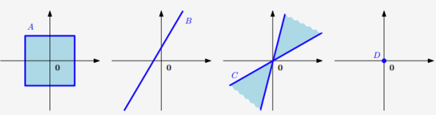
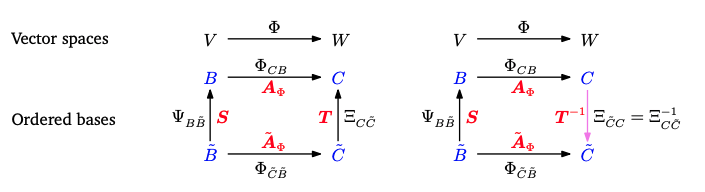

## 线性代数

### 总述 {.col-span-3 .row-span-3}

在形式化一些直观概念时，常见的方法是构造一组对象(符号)和一些操作这些对象的规则。这就是所谓的`代数(algebra)`。
而线性来源于线性函数 : `需要满足齐次性 和 可加性。`任一条件不满足则为非线性。

```KaTeX
\text{齐次性：} {\color{blue} f(ax) = a f(x)}   \\
\text{可加性：} {\color{blue} f(x+y) = f(x) + f(y)} 
```


### 线性方程组 {.col-span-2}

- 现实问题往往可以转化为线性方程组的形式去建模求解

  ```KaTeX
  \begin{aligned}
  a_{11} x_1 + \cdots + a_{1n} x_n &= b_1 \\
  \vdots & \\
  a_{m1} x_1 + \cdots + a_{mn} x_n &= b_m
  \end{aligned}
  ```

- 而线性方程组的求解可转化为矩阵的形式`KaTeX:Ax + b = f(x)`

  ```KaTeX
  \begin{bmatrix}
  a_{11} \\
  \vdots \\
  a_{m1}
  \end{bmatrix}x_1 +
  \begin{bmatrix}
  a_{12} \\
  \vdots \\
  a_{m2}
  \end{bmatrix}x_2 + \cdots +
  \begin{bmatrix}
  a_{1n} \\
  \vdots \\
  a_{mn}
  \end{bmatrix}x_n =
  \begin{bmatrix}
  b_1 \\
  \vdots \\
  b_m
  \end{bmatrix}
  
  \iff
  \underbrace{
  \begin{bmatrix}
  a_{11} & \cdots & a_{1n} \\
  \vdots & \ddots & \vdots \\
  a_{m1} & \cdots & a_{mn}
  \end{bmatrix}
  \begin{bmatrix}
  x_1 \\
  \vdots \\
  x_n
  \end{bmatrix}
  }_{x_1缩放第一列，x_n缩放第n列}  
  =
  \begin{bmatrix}
  b_1 \\
  \vdots \\
  b_m
  \end{bmatrix}
  ```

{.marker-timeline}

### 矩阵的定义

矩阵是域 `KaTeX:F`(比如实数域`KaTeX:\mathbb{R^n}`) 上的  `KaTeX:m \times n`  元素的有序集合，排列成  m  行和 n  列的矩形阵列。
符号表示为  `KaTeX:A = [a_{ij}]` ，其中 `KaTeX:a_{ij}` 表示矩阵中第  i  行第  j 列的元素。

  ```KaTeX
  \mathbf{A} =
  \begin{bmatrix}
  a_{11} & a_{12} & \cdots & a_{1n} \\
  a_{21} & a_{22} & \cdots & a_{2n} \\
  \vdots & \vdots & \ddots & \vdots \\
  a_{m1} & a_{m2} & \cdots & a_{mn}
  \end{bmatrix},
  \quad a_{ij} \in \mathbb{R}
  ```

### 方阵(行数=列数)

  ```KaTeX
  \mathbf{B} =
  \begin{bmatrix}
  b_{11} & b_{12} & \cdots & b_{1n} \\
  b_{21} & b_{22} & \cdots & b_{2n} \\
  \vdots & \vdots & \ddots & \vdots \\
  b_{n1} & b_{n2} & \cdots & b_{nn}
  \end{bmatrix}
  ```

### 零矩阵(所有元素都为0)

  ```KaTeX
  \mathbf{0} =
  \begin{bmatrix}
  0 & 0 & \cdots & 0 \\
  0 & 0 & \cdots & 0 \\
  \vdots & \vdots & \ddots & \vdots \\
  0 & 0 & \cdots & 0
  \end{bmatrix}
  ```

### 单位矩阵(主对角线上所有元素为1其他位置元素全为0的方阵)

```KaTeX
I_n := \begin{bmatrix}
1 & 0 & \cdots & 0 & \cdots & 0 \\
0 & 1 & \cdots & 0 & \cdots & 0 \\
\vdots & \vdots & \ddots & \vdots & \ddots & \vdots \\
0 & 0 & \cdots & 1 & 0 & \cdots \\
\vdots & \vdots & \ddots & \vdots & \ddots & \vdots \\
0 & 0 & \cdots & 0 & \cdots & 1
\end{bmatrix} \in \mathbb{R}^{n \times n}
```

### 对称矩阵(沿主对角线对称的方阵)

若对于矩阵 `KaTeX:\mathbf{A} \in \mathbb{R}^{n \times n}` 有 `KaTeX:\mathbf{A} = \mathbf{A}^\top` ，则称它是对称的 (symmetric)。

```KaTeX
\mathbf{A} = \begin{bmatrix}
\cancel{a_{11}} & {\color{blue} a_{12}} & {\color{green} a_{13}} \\
{\color{blue} a_{21}} & \cancel{a_{22}} & {\color{purple} a_{23}} \\
{\color{green} a_{31}} & {\color{purple} a_{32}} & \cancel{a_{33}}
\end{bmatrix}
\quad \text{其中} \quad {\color{blue} a_{12}} = {\color{blue} a_{21}}, \ {\color{green} a_{13}} = {\color{green} a_{31}}, \ {\color{purple} a_{23}} = {\color{purple} a_{32}}
```

### 分块矩阵(总分) {.col-span-2}

#### 怎么分？

- 矩阵 `KaTeX:\mathbf{A}` 按行分块：

  `KaTeX:\boldsymbol{A} =\left[\begin{array}{ccc}
  a_{11} & a_{12} & \cdots & a_{1n} \\
  \hdashline
  a_{21} & a_{22} & \cdots & a_{2n} \\
  \hdashline
  \vdots & \vdots & \ddots & \vdots \\
  \hdashline
  a_{m1} & a_{m2} & \cdots & a_{mn}
  \end{array}\right] =\left[\begin{array}{c}
  \boldsymbol{\alpha}_1 \\
  \hdashline
  \boldsymbol{\alpha}_2 \\
  \hdashline
  \vdots \\
  \hdashline
  \boldsymbol{\alpha}_m
  \end{array}\right]
  `

  其中

  `KaTeX:\alpha_i = [a_{i1}, a_{i2}, \cdots, a_{in}], \quad i = 1, 2, \cdots, m`

- 矩阵 `KaTeX:\mathbf{A}` 按列分块：

  `KaTeX:\boldsymbol{A} =
  \left[\begin{array}{c:c:c}
  a_{11} & a_{12} & \cdots & a_{1n} \\
  a_{21} & a_{22} & \cdots & a_{2n} \\
  \vdots & \vdots & \ddots & \vdots \\
  a_{m1} & a_{m2} & \cdots & a_{mn}
  \end{array}\right]
  = \left[\begin{array}{c:c:c}
  \alpha_1 & \alpha_2 & \cdots & \alpha_n
  \end{array}\right]`

  其中

  `KaTeX:\alpha_j = [a_{1j}, a_{2j}, \cdots, a_{mj}]^T, \quad j = 1, 2, \cdots, n`

- 矩阵 `KaTeX:\mathbf{A}` 混合分块：

  `KaTeX:\boldsymbol{A}=\left[\begin{array}{cc:ccc}
  a_{11} & a_{12} & 0 & 0 & 0 \\
  a_{21} & a_{22} & 0 & 0 & 0 \\
  \hdashline a_{31} & a_{32} & a_{33} & a_{34} & a_{35} \\
  a_{41} & a_{42} & a_{43} & a_{44} & a_{45}
  \end{array}\right]=\left[\begin{array}{cc}
  \boldsymbol{A}_{1} & \boldsymbol{O} \\
  \boldsymbol{A}_{3} & \boldsymbol{A}_{4}
  \end{array}\right]`

{.marker-round}

#### 分完有什么用？

- 加法运算：
  `KaTeX:\begin{bmatrix} \mathbf{A}_1 & \mathbf{A}_2 \\ \mathbf{A}_3 & \mathbf{A}_4 \end{bmatrix} + \begin{bmatrix} \mathbf{B}_1 & \mathbf{B}_2 \\ \mathbf{B}_3 & \mathbf{B}_4 \end{bmatrix} = \begin{bmatrix} \mathbf{A}_1 + \mathbf{B}_1 & \mathbf{A}_2 + \mathbf{B}_2 \\ \mathbf{A}_3 + \mathbf{B}_3 & \mathbf{A}_4 + \mathbf{B}_4 \end{bmatrix}`

- 乘法运算：
  `KaTeX:\begin{bmatrix} \mathbf{A}_1 & \mathbf{A}_2 \\ \mathbf{A}_3 & \mathbf{A}_4 \end{bmatrix} \begin{bmatrix} \mathbf{B}_1 & \mathbf{B}_2 \\ \mathbf{B}_3 & \mathbf{B}_4 \end{bmatrix} = \begin{bmatrix} \mathbf{A}_1\mathbf{B}_1 + \mathbf{A}_2\mathbf{B}_3 & \mathbf{A}_1\mathbf{B}_2 + \mathbf{A}_2\mathbf{B}_4 \\ \mathbf{A}_3\mathbf{B}_1 + \mathbf{A}_4\mathbf{B}_3 & \mathbf{A}_3\mathbf{B}_2 + \mathbf{A}_4\mathbf{B}_4 \end{bmatrix}`

- 转置运算：
  `KaTeX:\begin{bmatrix} \mathbf{A}_1 & \mathbf{A}_2 \\ \mathbf{A}_3 & \mathbf{A}_4 \end{bmatrix}^\top = \begin{bmatrix} \mathbf{A}_1^\top & \mathbf{A}_3^\top \\ \mathbf{A}_2^\top & \mathbf{A}_4^\top \end{bmatrix}`

- 幂运算：
  `KaTeX:\begin{bmatrix} \mathbf{A}_1 & \mathbf{O} \\ \mathbf{O} & \mathbf{A}_4 \end{bmatrix}^n = \begin{bmatrix} \mathbf{A}_1^n & \mathbf{O} \\ \mathbf{O} & \mathbf{A}_4^n \end{bmatrix}`

- 逆运算：
  `KaTeX:\begin{bmatrix} \mathbf{A}_1 & \mathbf{O} \\ \mathbf{O} & \mathbf{A}_4 \end{bmatrix}^{-1} = \begin{bmatrix} \mathbf{A}_1^{-1} & \mathbf{O} \\ \mathbf{O} & \mathbf{A}_4^{-1} \end{bmatrix}`

- 逆运算（不同分块位置）：
  `KaTeX:\begin{bmatrix} \mathbf{O} & \mathbf{A}_2 \\ \mathbf{A}_3 & \mathbf{O} \end{bmatrix}^{-1} = \begin{bmatrix} \mathbf{O} & \mathbf{A}_2^{-1} \\ \mathbf{A}_3^{-1} & \mathbf{O} \end{bmatrix}`

{.marker-round}

### 增广矩阵

增广矩阵是将线性方程组的系数矩阵与常数项矩阵组合在一起形成的一个矩阵

原线性方程组

  ```KaTeX
  -2x_1 + 4x_2 - 2x_3 - x_4 + 4x_5 = -3 \\
  4x_1 - 8x_2 + 3x_3 + x_4 + x_5 = 2 \\
  x_1 + 2x_2 + x_3 + x_4 = 0 \\
  x_1 + 2x_2 + x_3 + 4x_5 = a
  ```

增广矩阵 (augmented matrix) 形式为 `KaTeX:[A \mid b]`:

  ```KaTeX
  \begin{pmatrix}
  -2 & 4 & -2 & -1 & 4 & \vert & -3 \\
  4 & -8 & 3 & 1 & 1 & \vert & 2 \\
  1 & 2 & 1 & 1 & 0 & \vert & 0 \\
  1 & 2 & 0 & 3 & 4 & \vert & a
  \end{pmatrix}
  ```

增广矩阵的主要意义在于它使我们能够使用**初等行变换**来系统地简化方程组。这些变换包括：

- **交换两行**：这相当于交换两个方程的位置。
- **某一行乘以一个非零常数**：这相当于改变方程的比例。
- **将一行加到另一行上**：这可以消去变量，从而简化方程。

[初等变换](/mathematics.html#初等变换) {.link-arrow}

### reshape {.col-span-2}

为一列（垂直展开）

  ```KaTeX
  \mathbf{A} \in \mathbb{R}^{4 \times 2} 
  \quad \xrightarrow{\text{re-shape to column}} \quad 
  \mathbf{a} \in \mathbb{R}^8
  
  \\
  
  \mathbf{A} =
  \begin{bmatrix}
  {\color{orange} a_{11}} & {\color{blue} a_{12}} \\
  {\color{orange} a_{21}} & {\color{blue} a_{22}} \\
  {\color{orange} a_{31}} & {\color{blue} a_{32}} \\
  {\color{orange} a_{41}} & {\color{blue} a_{42}}
  \end{bmatrix}
  \quad \rightarrow \quad
  \mathbf{a} =
  \begin{bmatrix}
  {\color{orange} a_{11}} \\
  {\color{orange} a_{21}} \\
  {\color{orange} a_{31}} \\
  {\color{orange} a_{41}} \\
  {\color{blue} a_{12}} \\
  {\color{blue} a_{22}} \\
  {\color{blue} a_{32}} \\
  {\color{blue} a_{42}}
  \end{bmatrix}
  ```

为一行（水平展开）

  ```KaTeX
  \mathbf{A} \in \mathbb{R}^{4 \times 2} 
  \quad \xrightarrow{\text{re-shape to row}} \quad 
  \mathbf{a}_{\text{row}} \in \mathbb{R}^8
  
  \\
  
  \mathbf{A} =
  \begin{bmatrix}
  {\color{orange} a_{11}} & {\color{blue} a_{12}} \\
  {\color{orange} a_{21}} & {\color{blue} a_{22}} \\
  {\color{orange} a_{31}} & {\color{blue} a_{32}} \\
  {\color{orange} a_{41}} & {\color{blue} a_{42}}
  \end{bmatrix}
  \quad \rightarrow \quad
  \mathbf{a}_{\text{row}} =
  \begin{bmatrix}
  {\color{orange} a_{11}} & {\color{orange} a_{21}} & {\color{orange} a_{31}} & {\color{orange} a_{41}} & 
  {\color{blue} a_{12}} & {\color{blue} a_{22}} & {\color{blue} a_{32}} & {\color{blue} a_{42}}
  \end{bmatrix}
  ```

### 矩阵的加法

矩阵 `KaTeX:\mathbf{A} \in \mathbb{R}^{m \times n}, \mathbf{B} \in \mathbb{R}^{m \times n}` 相加定义为其对应元素相加，即：

```KaTeX
\mathbf{A} + \mathbf{B} := 
\begin{bmatrix}
a_{11} + b_{11} & \cdots & a_{1n} + b_{1n} \\
\vdots & \ddots & \vdots \\
a_{m1} + b_{m1} & \cdots & a_{mn} + b_{mn}
\end{bmatrix}
\in \mathbb{R}^{m \times n}
```

### 矩阵的乘法 {.col-span-2}

对于矩阵 `KaTeX:\mathbf{A} \in \mathbb{R}^{m \times n}, \mathbf{B} \in \mathbb{R}^{n \times k}` 相乘：`KaTeX:\mathbf{C} = \mathbf{AB} \in \mathbb{R}^{m \times k}` ，计算如下：

```KaTeX
\mathbf{C} = \mathbf{AB} = 

\underbrace{
\begin{bmatrix}
{\color{orange} a_{11}} & {\color{orange} a_{12}} & \cdots & {\color{orange} a_{1n}} \\
a_{21} & a_{22} & \cdots & a_{2n} \\
\vdots & \vdots & \ddots & \vdots \\
a_{m1} & a_{m2} & \cdots & a_{mn}
\end{bmatrix}

\times 

\begin{bmatrix}
{\color{blue} b_{11}} & b_{12} & \cdots & b_{1k} \\
{\color{blue} b_{21}} & b_{22} & \cdots & b_{2k} \\
\vdots & \vdots & \ddots & \vdots \\
{\color{blue} b_{n1}} & b_{n2} & \cdots & b_{nk}
\end{bmatrix}
}_{{\color{Green} 左列 = 右行} } 


\\
= 

\begin{bmatrix}
{\color{orange} a_{11}}{\color{blue} b_{11}} + {\color{orange} a_{12}}{\color{blue} b_{21}} + \cdots + {\color{orange} a_{1n}}{\color{blue} b_{n1}} & {\color{orange} a_{11}}b_{12} + {\color{orange} a_{12}}b_{22} + \cdots + {\color{orange} a_{1n}}b_{n2} & \cdots & {\color{orange} a_{11}}b_{1k} + {\color{orange} a_{12}}b_{2k} + \cdots + {\color{orange} a_{1n}}b_{nk} \\
a_{21}{\color{blue} b_{11}} + a_{22}{\color{blue} b_{21}} + \cdots + a_{2n}{\color{blue} b_{n1}} & a_{21}b_{12} + a_{22}b_{22} + \cdots + a_{2n}b_{n2} & \cdots & a_{21}b_{1k} + a_{22}b_{2k} + \cdots + a_{2n}b_{nk} \\
\vdots & \vdots & \ddots & \vdots \\
a_{m1}{\color{blue} b_{11}} + a_{m2}{\color{blue} b_{21}} + \cdots + a_{mn}{\color{blue} b_{n1}} & a_{m1}b_{12} + a_{m2}b_{22} + \cdots + a_{mn}b_{n2} & \cdots & a_{m1}b_{1k} + a_{m2}b_{2k} + \cdots + a_{mn}b_{nk}
\end{bmatrix}
```

矩阵的乘法不可交换顺序即`KaTeX:AB \ne BA`


### 矩阵的逆 {.col-span-2}

#### 定义

考虑一个方阵 `KaTeX:\mathbf{A} \in \mathbb{R}^{n \times n}`，使得矩阵 `KaTeX:\mathbf{B} \in \mathbb{R}^{n \times n}`：

`KaTeX:\mathbf{AB} = \mathbf{BA} = \mathbf{I}_n`， 则 `KaTeX:\mathbf{B}` 称为 `KaTeX:\mathbf{A}` 的逆 (Inverse)，表示为：`KaTeX:\mathbf{A}^{-1}`

不过，不是所有矩阵 `KaTeX:\mathbf{A}` 都有逆 `KaTeX:\mathbf{A}^{-1}`。如果矩阵的逆存在，则称它为正则/可逆/非奇异 (regular/invertible/nonsingular)，否则称为奇异/不可逆 (singular/noninvertible)。当矩阵逆存在时，这个逆是唯一的。

#### 求矩阵的逆

考虑一个矩阵：
`KaTeX:\mathbf{A} := \begin{bmatrix} a_{11} & a_{12} \\ a_{21} & a_{22} \end{bmatrix} \in \mathbb{R}^{2 \times 2}`
将它与 `KaTeX:\mathbf{A}'` 相乘
`KaTeX:\underbrace{\mathbf{A}' := \begin{bmatrix} a_{22} & -a_{12} \\ -a_{21} & a_{11} \end{bmatrix}}_{{\color{Red} \text{it's a trick, haha}} }`

我们得到：
`KaTeX:\mathbf{AA}' = \begin{bmatrix} a_{11}a_{22} - a_{12}a_{21} & 0 \\ 0 & a_{11}a_{22} - a_{12}a_{21} \end{bmatrix} = (a_{11}a_{22} - a_{12}a_{21})\mathbf{I}`

因此，当且仅当 `KaTeX:a_{11}a_{22} - a_{12}a_{21} \neq 0`时
`KaTeX:\mathbf{A}^{-1} = \frac{1}{a_{11}a_{22} - a_{12}a_{21}} \begin{bmatrix} a_{22} & -a_{12} \\ -a_{21} & a_{11} \end{bmatrix}`

#### 行列式determine

`KaTeX:a_{11}a_{22} - a_{12}a_{21}` 是 2x2 矩阵的行列式 (determinant)。我们一般可以用行列式来检验矩阵是否可逆。

#### 逆的重要性质

  ```KaTeX
  \mathbf{A}\mathbf{A}^{-1} = \mathbf{I} = \mathbf{A}^{-1}\mathbf{A} \\ 
  (\mathbf{AB})^{-1} = \mathbf{B}^{-1}\mathbf{A}^{-1} \\ 
  (\mathbf{A} + \mathbf{B})^{-1} \neq \mathbf{A}^{-1} + \mathbf{B}^{-1}
  ```

### 矩阵的转置(`KaTeX:m \times n ==> n \times m`)

#### 定义

对于矩阵 `KaTeX:\mathbf{A} \in \mathbb{R}^{m \times n}`，若矩阵 `KaTeX:\mathbf{B} \in \mathbb{R}^{n \times m}` 满足 `KaTeX:b_{ij} = a_{ji}`，则 `KaTeX:\mathbf{B}` 称为 `KaTeX:\mathbf{A}` 的转置 (Transpose)，记作 `KaTeX:\mathbf{B} = \mathbf{A}^\top`

`KaTeX:\mathbf{A} = \begin{bmatrix} {\color{red}a_{11}} & {\color{blue}a_{12}} & \cdots & {\color{green}a_{1n}} \\ {\color{blue}a_{21}} & {\color{red}a_{22}} & \cdots & {\color{green}a_{2n}} \\ \vdots & \vdots & \ddots & \vdots \\ {\color{green}a_{m1}} & {\color{green}a_{m2}} & \cdots & {\color{red}a_{mn}} \end{bmatrix}`，则

`KaTeX:\mathbf{A}^\top = \begin{bmatrix} {\color{red}a_{11}} & {\color{blue}a_{21}} & \cdots & {\color{green}a_{m1}} \\ {\color{blue}a_{12}} & {\color{red}a_{22}} & \cdots & {\color{green}a_{m2}} \\ \vdots & \vdots & \ddots & \vdots \\ {\color{green}a_{1n}} & {\color{green}a_{2n}} & \cdots & {\color{red}a_{mn}} \end{bmatrix}`

#### 性质

  ```KaTeX
  (\mathbf{A}^\top)^\top = \mathbf{A} \\ 
  (\mathbf{A} + \mathbf{B})^\top = \mathbf{A}^\top + \mathbf{B}^\top \\
  (\mathbf{AB})^\top = \mathbf{B}^\top\mathbf{A}^\top \\
  ```

### 矩阵的迹

#### 定义（Trace）

对于一个 `KaTeX: n \times n` 的方阵 `KaTeX: A`，其迹 `KaTeX: \text{tr}(A)` 定义为矩阵 `KaTeX: A` 的对角线元素之和。即：

```KaTeX
\text{tr}(A) = \sum_{i=1}^{n} a_{ii}
```

其中，`KaTeX: a_{ii}` 表示矩阵 `KaTeX: A` 的第 `KaTeX: i` 行第 `KaTeX: i` 列上的元素。迹只定义在方阵上，是一个标量。

#### 意义

矩阵的迹（`KaTeX: \text{tr}(A)`）不仅是对角线元素之和，更重要的是它反映了线性变换在矩阵表示下的**特征值的代数和**。从几何和代数的角度看，迹可以理解为一个线性变换在空间中拉伸或压缩的总量之和，即它是所有特征值的总和。

具体来说：

- 在矩阵 `KaTeX: A` 的特征值 `KaTeX: \lambda_1, \lambda_2, \dots, \lambda_n` 是 `KaTeX: A` 的固有扩展因子，每个特征值对应着线性变换作用在相应特征向量上的拉伸比例。
- 矩阵的迹 `KaTeX: \text{tr}(A)` 等于这些特征值的总和：`KaTeX: \text{tr}(A) = \lambda_1 + \lambda_2 + \dots + \lambda_n`。

因此，矩阵的迹不仅仅是简单的对角线元素之和，还反映了矩阵作为线性变换时对整个空间的“净效应”，即所有拉伸与压缩的代数和。

虽然迹等于所有特征值之和，但**矩阵的对角线元素**本身并不一定是特征值。对角线元素是矩阵的一部分，而特征值是矩阵的固有属性（通过解特征方程 `KaTeX: \text{det}(A - \lambda I) = 0` 得到）。特征值的求法与矩阵的对角线元素无关。

例如，对于一般矩阵（非对角矩阵），特征值和对角线元素可能完全不同。即便如此，迹作为对角线元素的和，仍等于所有特征值的和。这是因为迹是与矩阵的特征值密切相关的一个不变量。

`注意区分：`

- **矩阵的迹**：它的定义是对角线元素之和。
- **特征值的代数和**：特征值的和也等于矩阵的迹。
- **对角线元素不等于特征值**：虽然迹和特征值和相等，但对角线元素和特征值之间没有直接关系。

### 矩阵与标量相乘(对每个元素缩放)

#### 定义

假设我们有一个标量  `KaTeX:k`  和一个矩阵  `KaTeX:\mathbf{A}` ：

  ```KaTeX
  k\mathbf{A} = \begin{bmatrix} 
  k \cdot a_{11} & k \cdot a_{12} & \cdots & k \cdot a_{1n} \\ 
  k \cdot a_{21} & k \cdot a_{22} & \cdots & k \cdot a_{2n} \\ 
  \vdots & \vdots & \ddots & \vdots \\ 
  k \cdot a_{m1} & k \cdot a_{m2} & \cdots & k \cdot a_{mn} 
  \end{bmatrix}
  ```

#### 性质

- **结合律（Associativity）：**
  `KaTeX:(\lambda \psi) \mathbf{C} = \lambda (\psi \mathbf{C})`

  **解释**：标量相乘顺序不影响与矩阵相乘的结果。

- **标量与矩阵乘积的结合律：**
  `KaTeX:\lambda (\mathbf{B}\mathbf{C}) = (\lambda \mathbf{B})\mathbf{C} = \mathbf{B}(\lambda \mathbf{C})`

  **解释**：标量可以在矩阵乘法中的任意位置作用，结果不变。

- **转置的性质：**
  `KaTeX:(\lambda \mathbf{C})^\top = \lambda \mathbf{C}^\top`

  **解释**：标量与矩阵的乘积的转置等于矩阵的转置乘以标量。

- **分配律（Distributivity）：**
  `KaTeX:(\lambda + \psi)\mathbf{C} = \lambda\mathbf{C} + \psi\mathbf{C}`

  `KaTeX:\lambda(\mathbf{B} + \mathbf{C}) = \lambda\mathbf{B} + \lambda\mathbf{C}`

  **解释**：标量与矩阵的相加运算可以分配，结果一致。

{.marker-round}

### 矩阵的性质 {.col-span-2}

- 结合律 (Associativity)

  ```KaTeX
  \forall A \in \mathbb{R}^{m \times n}, B \in \mathbb{R}^{n \times p}, C \in \mathbb{R}^{p \times q} {\color{Red}:} (AB)C = A(BC)
  ```

- 分配律 (Distributivity)

  ```KaTeX
  \forall A, B \in \mathbb{R}^{m \times n}, C, D \in \mathbb{R}^{n \times p} {\color{Red}:} (A + B)C = AC + BC ; A(C + D) = AC + AD
  ```

- 与单位矩阵乘法

  ```KaTeX
  对于m \neq n, \ I_m \neq I_n , \forall A \in \mathbb{R}^{m \times n} {\color{Red}:} I_m A = A I_n = A
  ```

- 方阵的幂

  ```KaTeX
  \left(A^k\right)^l = A^{kl}, \ A^k A^l = A^{k+l}
  ```

- 注意：

  ```KaTeX
  (AB)^k = (AB)(AB)\cdots(AB) {\color{Red}\neq} A^k B^k
  \\
  (A + B)^2 = A^2 + AB + BA + B^2 {\color{Red}\neq} A^2 + 2AB + B^2
  \\
  (A + B)(A - B) = A^2 - AB + BA - B^2 {\color{Red}\neq} A^2 - 2AB + B^2
  ```

  {.marker-round}

### 线性方程组的求解 {.col-span-3}

#### 求解过程

```KaTeX
\begin{aligned}
&\text{线性方程组的一般求解包括以下三个步骤：} \\
&\textbf{(1)} \quad \text{找到 } \mathbf{Ax} = \mathbf{b} \text{ 的特解。} \\
&\textbf{(2)} \quad \text{找到 } \mathbf{Ax} = \mathbf{0} \text{ 的所有解。} \\
&\textbf{(3)} \quad \text{结合步骤 (1) 和 (2) 中的解得到通解。} \\
&\textbf{注意：} \quad \text{通解和特解都不是唯一的。}
\end{aligned}
```

#### 实例

- 线性方程组

  ```KaTeX
  \begin{pmatrix}
  1 & 0 & 8 & -4 \\
  0 & 1 & 2 & 12
  \end{pmatrix}
  \begin{pmatrix}
  x_1 \\
  x_2 \\
  x_3 \\
  x_4
  \end{pmatrix}
  =
  \begin{pmatrix}
  42 \\
  8
  \end{pmatrix}
  ```

  即：

  ```KaTeX
  \begin{aligned}
  x_1 + 8x_3 - 4x_4 &= 42 \\
  x_2 + 2x_3 + 12x_4 &= 8
  \end{aligned}
  ```


- 求特解
  我们首先求解这个线性方程组的一个特解。通过直接赋值 `KaTeX:x_3 = 0` 和 `KaTeX:x_4 = 0` ，我们可以得到：

  ```KaTeX
  x_1 = 42, \quad x_2 = 8, \quad x_3 = 0, \quad x_4 = 0
  ```

  因此，方程组的一个特解为：

  ```KaTeX
  \mathbf{x}_p = \begin{pmatrix} 42 \\ 8 \\ 0 \\ 0 \end{pmatrix}
  ```

- 求通解
  接下来，我们求齐次方程组 `KaTeX:Ax = 0` 的解。齐次方程组对应的方程为：

  ```KaTeX
  \begin{aligned}
  x_1 + 8x_3 - 4x_4 &= 0 \\
  x_2 + 2x_3 + 12x_4 &= 0
  \end{aligned}
  ```

  这些方程表示自由变量 `KaTeX:x_3` 和 `KaTeX:x_4` 的变化会导致一系列可能的解。为了构造通解，我们考虑两个独立的自由变量 `KaTeX:x_3` 和 `KaTeX:x_4`：

  ```KaTeX
  x_1 + 8x_3 - 4x_4 = 0 \quad \Rightarrow \quad x_1 = -8x_3 + 4x_4 \\
  x_2 + 2x_3 + 12x_4 = 0 \quad \Rightarrow \quad x_2 = -2x_3 - 12x_4 
  ```

  因此，齐次解的所有可能形式为：

  ```KaTeX
  (x_1, x_2, x_3, x_4) = (-8x_3 + 4x_4, -2x_3 - 12x_4, x_3, x_4) 
  ```

  将解写成线性组合的形式：

  ```KaTeX
  \begin{aligned}
  (x_1, x_2, x_3, x_4) &= x_3 \cdot (-8, -2, 1, 0) + x_4 \cdot (4, -12, 0, 1) \\
  &= \lambda_1 \cdot (-8, -2, 1, 0) + \lambda_2 \cdot (4, -12, 0, 1)
  \end{aligned} 
  ```

  这里我们用 `KaTeX:\lambda_1 = x_3` 和 `KaTeX:\lambda_2 = x_4` 表示自由变量，这样所有的齐次解就可以通过这两个自由变量的线性组合来表示。

  因此，齐次方程的通解为：

  ```KaTeX
  \mathbf{x}_h = \lambda_1 \begin{pmatrix} -8 \\ -2 \\ 1 \\ 0 \end{pmatrix} + \lambda_2 \begin{pmatrix} 4 \\ -12 \\ 0 \\ 1 \end{pmatrix}, \quad \lambda_1, \lambda_2 \in \mathbb{R}
  ```

- 总结

  方程组的通解是特解与齐次方程解的线性组合：

  ```KaTeX
  \mathbf{x} = \mathbf{x}_p + \mathbf{x}_h = \begin{pmatrix} 42 \\ 8 \\ 0 \\ 0 \end{pmatrix} + \lambda_1 \begin{pmatrix} -8 \\ -2 \\ 1 \\ 0 \end{pmatrix} + \lambda_2 \begin{pmatrix} 4 \\ -12 \\ 0 \\ 1 \end{pmatrix}
  ```

  这表示了所有满足原方程组的解。

{.marker-timeline}

### 初等变换

求解线性方程组的关键是初等变换 (elementary transformations)，它能在解集保持不变的前提下，将方程组变换为更简单的形式：

  ```KaTeX
  (1) 两个方程（表示方程组的矩阵的行）的交换 \\
  (2) 方程 (行) 乘一个常数 \lambda \in \mathbb{R} \setminus \{0\} \\
  (3) 两个等式 (行) 的相加 \\
  \textbf{备注}： (1)、(2)、(3) 可以组合。 
  ```

[增广矩阵](/mathematics.html#增广矩阵) {.link-arrow}

### 高斯消元法

`高斯消元法（Guassian elimination）`是一种通过初等变换将线性方程组转化为行最简阶梯型的算法。

我嘞个豆，醍醐灌顶，记得单位矩阵是个纯初始化的容器，如果说矩阵就是保存了变换信息，那单位矩阵变换的信息量 = 0 就是白纸。而我们扩为增广矩阵后是个整体，左边`KaTeX:A`变为`I`意味着什么，意味着进行了`KaTeX:A^{-1}`, 而`KaTeX:A^{-1}`被完整的保存在了右侧原单位矩阵`KaTeX:I`中，秒！

#### 高斯消元法求逆矩阵实例

- **用高斯消元法求逆矩阵**

  求

  ```KaTeX
  A = \begin{bmatrix}
  1 & 0 & 2 & 0 \\
  1 & 1 & 0 & 0 \\
  1 & 2 & 0 & 1 \\
  1 & 1 & 1 & 1
  \end{bmatrix}
  ```

  的逆。

- 写出增广矩阵

  ```KaTeX
  \left[\begin{array}{cccc|cccc}
  1 & 0 & 2 & 0 & 1 & 0 & 0 & 0 \\
  1 & 1 & 0 & 0 & 0 & 1 & 0 & 0 \\
  1 & 2 & 0 & 1 & 0 & 0 & 1 & 0 \\
  1 & 1 & 1 & 1 & 0 & 0 & 0 & 1
  \end{array}\right]
  ```

- 利用高斯消元法将其化为行最简阶梯型

  ```KaTeX
  \left[\begin{array}{cccc|cccc}
  1 & 0 & 0 & 0 & -1 & 2 & -2 & 2 \\
  0 & 1 & 0 & 0 & 1 & -1 & 2 & 0 \\
  0 & 0 & 1 & 0 & -1 & 1 & -1 & -1 \\
  0 & 0 & 0 & 1 & -1 & 0 & -1 & 2
  \end{array}\right]
  ```

- 所需的逆矩阵就在其右侧给出了

  ```KaTeX
  A^{-1} = \begin{bmatrix}
  -1 & 2 & -2 & 2 \\
  1 & -1 & 2 & 0 \\
  -1 & 1 & -1 & -1 \\
  -1 & 0 & -1 & 2
  \end{bmatrix}
  ```

  可以通过执行乘法 `KaTeX:AA^{-1}` 是否等于 `KaTeX:I_4` 来检验。`确定矩阵的逆矩阵相当于求解线性方程组!`

#### Tips

高斯消元法在计算行列式、检查向量集是否线性独立、计算矩阵的逆，计算矩阵的秩，和确
定向量空间的基时起着重要作用。高斯消元法是一种直观而有建设性的方法来解决一个含成
千上万变量的线性方程组。然而，对于具有数百万个变量的方程组，这是不切实际的，因为
所需的运算量是按联立方程组的数量的立方增长的。


{.marker-timeline}

### 行阶梯型矩阵

#### 定义

一个矩阵为行阶梯型 (row-echelon form) 矩阵需满足：

- 所有只包含零的行都位于矩阵的底部；相应地，所有至少包含一个非零元素的行都位于只包含零的行的顶部。
- 只看非零行，从左边开始的第一个非零数字（也称为主元或前导系数）总是严格地位于它上面的行主元的右边。

#### 从增广矩阵经初等变换到行阶梯型

- 线性方程组为：

  ```KaTeX
  \begin{aligned}
  -2x_1 &+ 4x_2 - 2x_3 - x_4 + 4x_5 &= -3 \\
  4x_1 &- 8x_2 + 3x_3 - 3x_4 + x_5 &= 2 \\
  x_1 &- 2x_2 + x_3 - x_4 + x_5 &= 0 \\
  x_1 &- 2x_2 - 3x_4 + 4x_5 &= a
  \end{aligned}
  ```

- 转换为增广矩阵后，进行初等行变换：

  ```KaTeX
  \left[\begin{array}{rrrrr|r}
  -2 & 4 & -2 & -1 & 4 & -3 \\
  4 & -8 & 3 & -3 & 1 & 2 \\
  1 & -2 & 1 & -1 & 1 & 0 \\
  1 & -2 & 0 & -3 & 4 & a
  \end{array}\right] \begin{array}{l}
  \text{Swap with } R_{3} 
  \\ \\
  \text{Swap with } R_{1}
  \\ \\
  \end{array}
  ```

- 交换第一行 \( R_1 \) 和第三行 \( R_3 \) 得到：

  ```KaTeX
  \left[\begin{array}{rrrrr|r}
  1 & -2 & 1 & -1 & 1 & 0 \\
  4 & -8 & 3 & -3 & 1 & 2 \\
  -2 & 4 & -2 & -1 & 4 & -3 \\
  1 & -2 & 0 & -3 & 4 & a
  \end{array}\right] \begin{array}{l}
  \\
  -4 R_{1} \\
  +2 R_{1} \\
  -R_{1}
  \end{array}
  ```

- 继续以行阶梯式为目的的初等变换应用：

  ```KaTeX
  \left[\begin{array}{rrrrr|r}
  1 & -2 & 1 & -1 & 1 & 0 \\
  0 & 0 & -1 & 1 & -3 & 2 \\
  0 & 0 & 0 & -3 & 6 & -3 \\
  0 & 0 & -1 & -2 & 3 & a
  \end{array}\right]
  ```

  ```KaTeX
  \left[\begin{array}{rrrrr|r}
  1 & -2 & 1 & -1 & 1 & 0 \\
  0 & 0 & -1 & 1 & -3 & 2 \\
  0 & 0 & 0 & -3 & 6 & -3 \\
  0 & 0 & -1 & -2 & 3 & a
  \end{array}\right]
  \begin{array}{l}
  \\\\\\
  -R_{2} - R_{3}
  \end{array}
  ```

  ```KaTeX
  \left[\begin{array}{rrrrr|r}
  1 & -2 & 1 & -1 & 1 & 0 \\
  0 & 0 & -1 & 1 & -3 & 2 \\
  0 & 0 & 0 & -3 & 6 & -3 \\
  0 & 0 & 0 & 0 & 0 & a + 1
  \end{array}\right]
  \begin{array}{l}
  \cdot (-1) \\
  \cdot \left(-\frac{1}{3}\right)
  \end{array}
  ```

  ```KaTeX
  \left[\begin{array}{rrrrr|r}
  1 & -2 & 1 & -1 & 1 & 0 \\
  0 & 0 & 1 & -1 & 3 & -2 \\
  0 & 0 & 0 & 1 & -2 & 1 \\
  0 & 0 & 0 & 0 & 0 & a+1
  \end{array}\right]
  ```

  这个（增广）矩阵现在变成了一种简便的形式——行阶梯形形式（row-echelon form，REF）。

- 将这个紧凑的表示法还原为显式表示法:

  ```KaTeX
  \begin{aligned}
  x_1 &- 2x_2 &+ x_3 &- x_4 &+ x_5 &= 0 \\
  & &x_3 &- x_4 &+ 2x_5 &= a-4 \\
  & & &-x_4 &+ 2x_5 &= -1 \\
  & & & &0 &= a + 1
  \end{aligned}
  ```

  仅当 \( a = -1 \) 时方程组才有解。一个特解为：

  ```KaTeX
  x = \begin{pmatrix} x_1 \\ x_2 \\ x_3 \\ x_4 \\ x_5 \end{pmatrix} = \begin{pmatrix} 2 \\ 1 \\ 1 \\ 0 \\ 1 \end{pmatrix}
  ```

  通解：

  ```KaTeX
  x = \begin{pmatrix} x_1 \\ x_2 \\ x_3 \\ x_4 \\ x_5 \end{pmatrix} = \begin{pmatrix} 2 \\ 1 \\ 1 \\ 0 \\ 1 \end{pmatrix} + \lambda_1 \begin{pmatrix} 1 \\ 0 \\ 2 \\ 1 \\ 0 \end{pmatrix} + \lambda_2 \begin{pmatrix} 0 \\ 1 \\ 1 \\ 0 \\ 1 \end{pmatrix}, \quad \lambda_1, \lambda_2 \in \mathbb{R}
  ```

{.marker-timeline}

### 基本变量与自由变量

行阶梯型的主元对应的变量称为基本变量（**basic variables**），其他变量称为自由变量（**free variables**）。

  ```KaTeX
  \begin{aligned}
  x_1 &- 2x_2 &+ x_3 &- x_4 &+ x_5 &= 0 \\
  & &x_3 &- x_4 &+ 3x_5 &= -2 \\
  & & &-x_4 &+ 2x_5 &= 1 \\
  & & & &0 &= a+1
  \end{aligned}
  ```

`KaTeX:x_1, x_3, x_4` 为基本变量，`KaTeX:x_2, x_5` 为自由变量。

{.marker-none}

### 行最简阶梯型 {.col-span-2}

一个方程组为行最简阶梯型（**Reduced Row Echelon Form**，也称为 **row-reduced echelon form** 或 **row canonical form**）需要满足：

- 它是行阶梯型
- 每个主元都为1
- 主元是其所在列中唯一的非零项

---

有以下行最简阶梯型矩阵(粗体为主元)：

```KaTeX
A = \begin{bmatrix}
1 & 3 & 0 & 0 & 3 \\
0 & 0 & \mathbf{1} & 0 & 9 \\
0 & 0 & 0 & \mathbf{1} & -4
\end{bmatrix}
```

求 `KaTeX:Ax = 0` 的解的关键是非主元列。我们需要将其表示为主元列的（线性）组合。而行最简阶梯型使这一点相对简单。我们用在左边的主元列的倍数来表示非主元列。

- 为了得到`0`，第二列就是 3 乘以 column 1 - column 2 其余column为 0

- 第五列就是 3 乘以 column 1 + 9 乘以 column 3 - 4 乘以 column 4 - column 5即可 其余column为 0

因此，`KaTeX:Ax = 0`，`KaTeX:x \in \mathbb{R}^5` 的所有解都由下式给出：

```KaTeX
\left\{
x \in \mathbb{R}^5 : x = \lambda_1 \begin{pmatrix} 3 \\ -1 \\ 0 \\ 0 \\ 0 \end{pmatrix} + \lambda_2 \begin{pmatrix} 3 \\ 0 \\ 9 \\ -4 \\ -1 \end{pmatrix}, \quad \lambda_1, \lambda_2 \in \mathbb{R}
\right\}
```

注意下面的解也是等价的，因为在解线性方程组时，通解的形式可以有不同的表现形式，只要它们的线性组合关系保持不变。你提到的情况中，两个向量相差一个整体的符号，即整个解向量乘以 -1，这不会改变解的本质，因为它们仍然是在相同的线性空间中。

```KaTeX
\left\{
x \in \mathbb{R}^5 : x = \lambda_1 \begin{pmatrix} -3 \\ 1 \\ 0 \\ 0 \\ 0 \end{pmatrix} + \lambda_2 \begin{pmatrix} -3 \\ 0 \\ -9 \\ 4 \\ 1 \end{pmatrix}, \quad \lambda_1, \lambda_2 \in \mathbb{R}
\right\}
```


### Minus-1 Trick

“Minus-1 Trick” 通过人为地在矩阵对角线上添加“-1”，将没有主元的列也考虑进去，从而补全矩阵，使其成为一个方阵。在这种情况下，原本自由变量的部分就可以显式地表示为其他变量的线性组合，进而可以更加简洁地描述整个解空间。这种方法可以有效地处理线性方程组求解中涉及的自由变量，简化计算步骤，并明确解的形式。

比如对于行最简阶梯型中的例子[行最简阶梯型](/mathematics.html#行最简阶梯型)，这里使用Minus-1 Trick，解可以直接读出来，所以叫Trick，不用也行

最简阶梯型(REF)矩阵：

```KaTeX
A = \begin{bmatrix}
1 & 3 & 0 & 0 & 3 \\
0 & 0 & 1 & 0 & 9 \\
0 & 0 & 0 & 1 & -4
\end{bmatrix}
```

现在通过在对角线上插入的主元缺失的地方添加`KaTeX:[0 \ \cdots \ 0 \ -1 \ 0 \ \cdots \ 0]`形式的行，将这个矩阵扩展为一个5×5的矩阵

```KaTeX
\tilde{A} = \begin{bmatrix}
1 & 3 & 0 & 0 & 3 \\
\textcolor{blue}{0} & \textcolor{blue}{-1} & \textcolor{blue}{0} & \textcolor{blue}{0} & \textcolor{blue}{0} \\
0 & 0 & 1 & 0 & 9 \\
0 & 0 & 0 & 1 & -4 \\
\textcolor{blue}{0} & \textcolor{blue}{0} & \textcolor{blue}{0} & \textcolor{blue}{0} & \textcolor{blue}{-1}
\end{bmatrix}
```

我们可以通过取`KaTeX:\tilde{A}`向包含对角线-1的向量，立即得到 `KaTeX:Ax = 0` 的解：

```KaTeX
\left\{
x \in \mathbb{R}^5 : x = \lambda_1 \begin{pmatrix} 3 \\ -1 \\ 0 \\ 0 \\ 0 \end{pmatrix} + \lambda_2 \begin{pmatrix} 3 \\ 0 \\ 9 \\ -4 \\ -1 \end{pmatrix}, \quad \lambda_1, \lambda_2 \in \mathbb{R}
\right\}
```

[行最简阶梯型](/mathematics.html#行最简阶梯型) {.link-arrow}

### 伪逆矩阵(Moore-Penrose pseudo-inverse)

伪逆矩阵 `KaTeX:A^+` 的主要应用是在求解线性方程组 `KaTeX:Ax = b` 中，当 `KaTeX:A` 不可逆或是非方阵时，伪逆矩阵可以用于求解最小二乘解，即误差最小的解。

如果我们可以确定逆矩阵 `KaTeX:A^{-1}`，那么 `KaTeX:Ax = b` 的解就表示为 `KaTeX:x = A^{-1}b`。然而，只有当 `KaTeX:A` 是一个方阵并且可逆时，这种方法才可行，但通常情况并非如此。不过，在适当的假设下（即 `KaTeX:A` 需要有线性独立的列），我们可以使用以下变换：

```KaTeX
Ax = b \implies A^T Ax = A^T b \implies x = (A^T A)^{-1} A^T b
```

即使用 **Moore-Penrose 伪逆**（Moore-Penrose pseudo-inverse） `KaTeX:(A^T A)^{-1} A^T` 来确定 `KaTeX:Ax = b` 的 Moore-Penrose 伪逆解 `KaTeX:(A^T A)^{-1} A^T b`，这也对应于最小范数最小二乘法的解。

这种方法的缺点是需要对矩阵的积 `KaTeX:A^T A` 的逆进行大量计算。此外，由于数值稳定性的原因，通常不建议计算逆或伪逆。后面我们继续研究求解线性方程组的其他方法。

{.marker-none}

### 群

它包含一组元素和一个定义在这些元素上的操作，该操作可以保持集合的某些结构完整。

考虑一个集合`KaTeX:G`和一个定义在`KaTeX:G`上的运算 `KaTeX:\otimes: G \times G \rightarrow G`。如果下列条件成立，则`KaTeX:G` := (`KaTeX:G`, `KaTeX:\otimes`) 称为群（**group**）：

- **在 `KaTeX:\otimes` 运算下的封闭性（Closure）：**

  ```KaTeX
  \forall x, y \in G, x \otimes y \in G
  ```

  （解释：对于集合`KaTeX:G`中的任意两个元素 `KaTeX: x ` 和 `KaTeX: y `，其通过运算 `KaTeX:\otimes` 得到的结果仍然在集合`KaTeX:G`内。）

- **结合律（Associativity）：**

  ```KaTeX
  \forall x, y, z \in G: (x \otimes y) \otimes z = x \otimes (y \otimes z)
  ```

  （解释：集合`KaTeX:G`中的任意三个元素 `KaTeX: x `, `KaTeX: y `, `KaTeX: z `，在进行运算时，无论运算顺序如何，结果是相同的。）

- **单位元（Neutral element）：**

  ```KaTeX
  \exists e \in G \, \text{使得} \, \forall x \in G: e \otimes x = x \otimes e = x
  ```

  （解释：在集合`KaTeX:G`中存在一个特殊的元素 `KaTeX: e `，称为单位元，使得 `KaTeX: e ` 与集合中的任何元素 `KaTeX: x ` 进行运算，结果仍为 `KaTeX: x ` 自身。）

- **逆元（Inverse element）：**

  ```KaTeX
  \forall x \in G \, \exists y \in G \, \text{使得} \, x \otimes y = e \, \text{且} \, y \otimes x = e
  ```

  （解释：对于集合`KaTeX:G`中的任意元素 `KaTeX: x `，都存在一个元素 `KaTeX: y `，称为 `KaTeX: x ` 的逆元，使得 `KaTeX: x ` 与 `KaTeX: y ` 通过运算 `KaTeX:\otimes` 后的结果是单位元 `KaTeX: e `。通常用 `KaTeX: x^{-1} ` 来表示 `KaTeX: x ` 的逆元。）

{.marker-round}


#### 一般线性群

如果一个群不仅满足群的基本性质，还由所有 `KaTeX:n \times n` 的**可逆矩阵**组成，那么这个群就是一个一般线性群。

`KaTeX:GL(n, F)` 表示一个 `KaTeX:n \times n` 的可逆矩阵群，运算为矩阵乘法。

  ```KaTeX
  A \in GL(n, F) \implies \text{det}(A) \neq 0
  ```

**解释**：这个表达式表示，对于集合 `KaTeX:GL(n, F)` 中的任意矩阵 `KaTeX:A`，该矩阵必须是可逆的，也就是说它的行列式 `KaTeX:\text{det}(A)` 不等于零。


#### 阿贝尔群

如果一个群不仅满足群的基本性质，还满足交换律，那么这个群就是一个阿贝尔群。阿贝尔群在很多数学问题中起到了基础性作用，因为交换律使得这些群的运算更加简单和对称。

  ```KaTeX
  \forall x, y \in G: x \otimes y = y \otimes x
  ```

**解释**：这个表达式表示，对于集合 `KaTeX:G` 中的任意两个元素 `KaTeX:x` 和 `KaTeX:y`，运算 `KaTeX:\otimes` 满足交换律，即 `KaTeX:x \otimes y` 等于 `KaTeX:y \otimes x`。这意味着无论你先计算 `KaTeX:x` 再计算 `KaTeX:y`，还是先计算 `KaTeX:y` 再计算 `KaTeX:x`，结果都是一样的。

### 向量空间

**向量空间（Vector Space）** 是由一个集合 `KaTeX:V` 和两个运算（向量加法和标量乘法）组成的数学结构，满足以下条件：

- **向量加法（Vector Addition）**：向量空间中的两个向量可以相加，结果仍然在该向量空间内。

  ```KaTeX
  +: V \times V \rightarrow V
  ```

  - **封闭性**：对于任意的 `KaTeX:x, y \in V`，`KaTeX:x + y \in V`。
  - **交换律**：`KaTeX:x + y = y + x`。
  - **结合律**：`KaTeX:(x + y) + z = x + (y + z)`。
  - **存在零向量**：存在一个零向量 `KaTeX:0 \in V`，使得 `KaTeX:x + 0 = x`。
  - **存在加法逆元**：对于每个 `KaTeX:x \in V`，存在一个逆向量 `KaTeX:-x \in V`，使得 `KaTeX:x + (-x) = 0`。

- **标量乘法（Scalar Multiplication）**：向量空间中的每个向量都可以与一个标量相乘，结果仍然在该向量空间内。

  ```KaTeX
  \cdot: \mathbb{R} \times V \rightarrow V
  ```

  - **封闭性**：对于任意的 `KaTeX:a \in \mathbb{R}` 和 `KaTeX:x \in V`，`KaTeX:a \cdot x \in V`。
  - **分配律**（对标量与向量的分配律）：`KaTeX:a \cdot (x + y) = a \cdot x + a \cdot y`。
  - **分配律**（对标量的分配律）：`KaTeX:(a + b) \cdot x = a \cdot x + b \cdot x`。
  - **结合律**（标量与标量的结合律）：`KaTeX:(ab) \cdot x = a \cdot (b \cdot x)`。
  - **标量乘法的单位元**：对于任意 `KaTeX:x \in V`，`KaTeX:1 \cdot x = x`。

{.marker-round}

### 向量子空间

向量子空间可以简单理解为一个向量空间的“子集”，这个子集必须满足与整个向量空间相同的规则和运算性质。只要满足加法和标量乘法的封闭性，并且包含零向量，这个子集就是一个向量子空间。


**向量子空间（Subspace）** 是一个在向量空间内的集合，这个集合本身也满足向量空间的所有性质。换句话说，如果 `KaTeX:V` 是一个向量空间，那么它的子集 `KaTeX:U` 是 `KaTeX:V` 的一个向量子空间，当且仅当：

- **封闭性**：
  - **加法封闭性**：对于任意 `KaTeX:u, v \in U`，`KaTeX:u + v \in U`。
  - **标量乘法封闭性**：对于任意标量 `KaTeX:\lambda \in \mathbb{R}` 和任意向量 `KaTeX:u \in U`，`KaTeX:\lambda u \in U`。

- **包含零向量**：`KaTeX:U` 必须包含零向量 `KaTeX:0 \in V`，即 `KaTeX:0 \in U`。

即`包含0向量 + 不能比父强`。

不是所有的 `KaTeX:\mathbb{R}^2` 子集都是子空间。`KaTeX:A` 和 `KaTeX:C` 违背了封闭性；`KaTeX:B` 不包含 `KaTeX:0`。只有 `KaTeX:D` 是子空间。

{.marker-none}

### 向量线性相关

一组线性相关的向量意味着这些向量中至少有一个向量可以由其他向量通过线性组合得到。
[向量线性组合](/mathematics.html#向量线性组合) {.link-arrow}

### 向量线性无关(线性独立)

一组线性无关的向量是由没有冗余的向量组成的，也就是说，如果我们把这些向量中的任何一个去掉，我们就会失去一些东西。

#### 实例

考虑一组线性无关向量 `KaTeX:b_1, b_2, b_3, b_4 \in \mathbb{R}^n`，有：

```KaTeX
\begin{aligned}
x_1 &= b_1 - 2b_2 + b_3 - b_4 \\
x_2 &= -4b_1 - 2b_2 + 3b_3 + 4b_4 \\
x_3 &= 2b_1 + 3b_2 - b_3 - 3b_4 \\
x_4 &= 17b_1 - 10b_2 + 11b_3 + b_4
\end{aligned}

```

向量 `KaTeX:x_1, \ldots, x_4 \in \mathbb{R}^n` 是否线性无关呢？为了回答这个问题，我们来看以下向量是否线性无关。

线性方程组对应的矩阵为：

```KaTeX
A = \begin{bmatrix}
1 & -4 & 2 & 17 \\
-2 & -2 & 3 & -10 \\
1 & 0 & -1 & 11 \\
-1 & 4 & -3 & 1
\end{bmatrix}
```

对应的最简阶梯型矩阵为：

```KaTeX
\begin{bmatrix}
1 & 0 & 0 & -7 \\
0 & 1 & 0 & -15 \\
0 & 0 & 1 & -18 \\
0 & 0 & 0 & 0
\end{bmatrix}
```

可以看到对应的线性方程组是有非平凡解的：最后一列不是主元列，`KaTeX:x_4 = -7x_1 - 15x_2 - 18x_3`，因此，`KaTeX:x_1, \ldots, x_4` 是线性相关的，`KaTeX:x_4` 可以表示为 `KaTeX:x_1, \ldots, x_3` 的线性组合。

### 向量线性组合

考虑向量空间 `KaTeX:V` 和有限个向量 `KaTeX:x_1, \ldots, x_k \in V`。那么，每一个以下形式的向量 `KaTeX:v \in V`：

```KaTeX
v = \lambda_1 x_1 + \cdots + \lambda_k x_k = \sum_{i=1}^{k} \lambda_i x_i \in V
```

称为向量 `KaTeX:x_1, \ldots, x_k` 的线性组合（**linear combination**），其中 `KaTeX:\lambda_1, \ldots, \lambda_k \in \mathbb{R}`。

{.marker-none}

### 生成集(Generating Set)

**定义**：考虑一个向量空间 `KaTeX:V = (V, +, \cdot)` 和一个向量集 `KaTeX:A = \{x_1, \dots, x_k\} \subseteq V`。如果向量空间 `KaTeX:V` 中的每个向量 `KaTeX:v \in V` 都可以表示为 `KaTeX:x_1, \dots, x_k` 的线性组合，那么 `KaTeX:A` 称为 `KaTeX:V` 的生成集（**generating set**）。

- **简洁理解**：生成集是能够通过线性组合生成整个向量空间中所有向量的一个集合。

### 生成空间(Span)

**定义**：向量集 `KaTeX:A = \{x_1, \dots, x_k\}` 中的向量的所有线性组合形成的集合称为 `KaTeX:A` 的生成空间（**span**）。记作 `KaTeX:V = \text{span}(A)` 或 `KaTeX:V = \text{span}\{x_1, \dots, x_k\}`。

- **简洁理解**：生成空间是由一个生成集通过线性组合生成的所有向量组成的空间。换句话说，生成空间是包含了所有可以由生成集中的向量通过线性组合得到的向量的集合。

### 基(Basis) {.col-span-2}

#### 定义

考虑向量空间 `KaTeX:V = (V, +, \cdot)` 以及 `KaTeX:A \subseteq V`。如果没有更小的集合 `KaTeX:\tilde{A} \subseteq A` 可以生成 `KaTeX:V`，则称 `KaTeX:V` 的生成集 `KaTeX:A` 为最小生成集（**minimal**）。`KaTeX:V` `的每一个线性独立的生成集都是最小生成集，称为` `KaTeX:V` `的基（**basis**）。`向量空间 可以有许多基，即没有唯一基。
然而，所有的基都由相同数量的元素，即基向量（ basis vectors） 组成。

设 `KaTeX:V = (V, +, \cdot)` 为向量空间，`KaTeX:B \subseteq V, B \neq \emptyset`。那么，以下描述是等价的：

- `KaTeX:B` 是 `KaTeX:V` 的基。
- `KaTeX:B` 是最小生成集。
- `KaTeX:B` 是 `KaTeX:V` 中向量的一个最大线性无关集，也就是说，在这个向量集中删除任何其他向量都会使它线性相关。
- 每个向量 `KaTeX:x \in V` 都是 `KaTeX:B` 中向量的线性组合，且每个线性组合都是唯一的，即

```KaTeX
x = \sum_{i=1}^{k} \lambda_i b_i = \sum_{i=1}^{k} \psi_i b_i
```

其中 `KaTeX:\lambda_i, \psi_i \in \mathbb{R}, b_i \in B`，且 `KaTeX:\lambda_i = \psi_i, i = 1, \ldots, k`。

#### 基的确定


子空间 `KaTeX:U = \text{span}\{x_1, \dots, x_m\} \subseteq \mathbb{R}^n` 的基可通过执行以下步骤确定：

- 把生成向量写成矩阵 `KaTeX:A` 的列。
- 确定 `KaTeX:A` 的行阶梯型。
- 与主元列对应的生成向量就是 `KaTeX:U` 的基。

---

向量子空间 `KaTeX:U \subseteq \mathbb{R}^5` 由以下向量张成：

```KaTeX
x_1 = \begin{bmatrix} 1 \\ 2 \\ -1 \\ -1 \\ -1 \end{bmatrix}, \quad
x_2 = \begin{bmatrix} 2 \\ -1 \\ 1 \\ 2 \\ -2 \end{bmatrix}, \quad
x_3 = \begin{bmatrix} 3 \\ -4 \\ 3 \\ 5 \\ -3 \end{bmatrix}, \quad
x_4 = \begin{bmatrix} -1 \\ 8 \\ -5 \\ -6 \\ 1 \end{bmatrix} \in \mathbb{R}^5
```

我们关注 `KaTeX:x_1, \dots, x_4` 中哪几个是 `KaTeX:U` 的基。因此，我们需要判断 `KaTeX:x_1, \dots, x_4` 是否线性独立。因此，我们需要解一个矩阵齐次方程组：

```KaTeX
\sum_{i=1}^{4} \lambda_i x_i = 0
```

对应矩阵为：

```KaTeX
[x_1, x_2, x_3, x_4] = \begin{bmatrix}
1 & 2 & 3 & -1 \\
2 & -1 & -4 & 8 \\
-1 & 1 & 3 & -5 \\
-1 & 2 & 5 & -6 \\
-1 & -2 & -3 & 1
\end{bmatrix}
```

利用线性方程组的基本变换规则，得到了行阶梯型矩阵：

```KaTeX
\begin{bmatrix}
1 & 2 & 3 & -1 \\
2 & -1 & -4 & 8 \\
-1 & 1 & 3 & -5 \\
-1 & 2 & 5 & -6 \\
-1 & -2 & -3 & 1
\end{bmatrix}
\quad \sim \quad \begin{bmatrix}
1 & 2 & 3 & -1 \\
0 & 1 & 2 & -2 \\
0 & 0 & 0 & 1 \\
0 & 0 & 0 & 0 \\
0 & 0 & 0 & 0
\end{bmatrix}
```

由于主元列对应的那组向量是线性独立的，因此我们从行阶梯型可以看出 `KaTeX:x_1, x_2, x_4` 是线性独立的（因为线性方程组 `KaTeX:\lambda_1 x_1 + \lambda_2 x_2 + \lambda_4 x_4 = 0` 只能用 `KaTeX:\lambda_1 = \lambda_2 = \lambda_4 = 0` 来解）。因此，`KaTeX:\{x_1, x_2, x_4\}` 是 `KaTeX:U` 的基。

### 维数(Dim)

向量空间的维数可以看作是这个向量空间中独立方向的个数。是该向量空间中基的向量的数量。换句话说，维数是向量空间中最大线性无关向量组（即基）的元素个数。

{.marker-none}

### 秩(Rank)

矩阵 `KaTeX:A \in \mathbb{R}^{m \times n}` 的线性独立列的个数等于线性独立行的个数，这个数称为 `KaTeX:A` 的秩（**Rank**），用 `KaTeX:\text{rk}(A)` 表示。

**备注：**

矩阵的秩有一些重要的性质：

- **行秩等于列秩**：
  - **性质**：`KaTeX:\text{rk}(A) = \text{rk}(A^T)`
  - **解释**：对于任何矩阵 `KaTeX:A`，行秩（行向量的最大线性无关数目）等于列秩（列向量的最大线性无关数目）。这是因为矩阵的转置操作不会改变向量的线性相关性。

- **秩与列空间的关系**：
  - **性质**：`KaTeX:\text{rk}(A) = \text{dim}(\text{Im}(A))`
  - **解释**：矩阵 `KaTeX:A` 的秩等于其列空间的维数。列空间（`KaTeX:\text{Im}(A)`）是由矩阵 `KaTeX:A` 的所有列向量生成的向量空间。矩阵的秩实际上就是这个列空间的维数，即该空间的最大线性无关向量的数量。

- **秩与行空间的关系**：
  - **性质**：`KaTeX:\text{rk}(A) = \text{dim}(U)`
  - **解释**：矩阵 `KaTeX:A` 的秩等于其行空间的维数。行空间是由矩阵 `KaTeX:A` 的所有行向量生成的向量空间。通过对 `KaTeX:A^T` 施加高斯消元法，我们可以确定这个维数。

- **线性映射的秩**：
  - **性质**：`KaTeX:\text{rk}(A) = \text{dim}(\text{Im}(T))`
  - **解释**：对于任何线性映射 `KaTeX:T: \mathbb{R}^n \rightarrow \mathbb{R}^m`，它可以表示为一个矩阵 `KaTeX:A`。映射的秩等于其像空间（`KaTeX:\text{Im}(T)`）的维数。换句话说，秩表示线性映射的“输出”中线性无关向量的数量。

- **矩阵乘积的秩**：
  - **性质**：`KaTeX:\text{rk}(AB) \leq \text{min}(\text{rk}(A), \text{rk}(B))`
  - **解释**：对于两个矩阵 `KaTeX:A \in \mathbb{R}^{m \times n}` 和 `KaTeX:B \in \mathbb{R}^{n \times p}`，它们的乘积 `KaTeX:AB` 的秩不会超过 `KaTeX:A` 和 `KaTeX:B` 的秩中的较小者。这是因为 `KaTeX:AB` 的线性无关性受限于 `KaTeX:A` 和 `KaTeX:B` 的线性无关性。

- **核维数与秩的关系（秩-零化度定理）**：
  - **性质**：对于矩阵 `KaTeX:A \in \mathbb{R}^{m \times n}`，解 `KaTeX:Ax = 0` 的空间维数为 `KaTeX:n - \text{rk}(A)`
  - **解释**：这是秩-零化度定理（Rank-Nullity Theorem）的直接结果。核的维数（即零空间的维数）加上秩等于矩阵的列数 `KaTeX:n`。核维数表示有多少自由变量，而秩表示有多少主元。

- **满秩与秩亏**：
  - **性质**：如果矩阵 `KaTeX:A \in \mathbb{R}^{m \times n}` 的秩等于其行数或列数的较小值，即 `KaTeX:\text{rk}(A) = \text{min}(m, n)`，则称 `KaTeX:A` 为满秩矩阵（**full rank**）。否则，称其为秩亏（**rank deficient**）。
  - **解释**：满秩意味着矩阵的行或列都是线性无关的，矩阵在尽可能多的方向上有最大线性无关性。秩亏意味着存在线性相关性，行或列中存在冗余。

{.marker-round}

### 线性映射

#### 定义

考虑两个实数向量空间 `KaTeX:V` 和 `KaTeX:W`。对于 `KaTeX:V` 中的任意向量 `KaTeX:x, y` 和标量 `KaTeX:\lambda \in \mathbb{R}`，映射 `KaTeX:\Phi: V \rightarrow W` 被称为**线性映射**（**Linear Mapping**），如果它满足以下两个条件：

- **加法封闭性**：
  - `KaTeX:\Phi(x + y) = \Phi(x) + \Phi(y)`
  - 解释：映射 `KaTeX:\Phi` 对向量的加法运算保持不变，即 `KaTeX:\Phi` 在两个向量的和上的作用等于它分别在每个向量上的作用的和。

- **标量乘法封闭性**：
  - `KaTeX:\Phi(\lambda x) = \lambda \Phi(x)`
  - 解释：映射 `KaTeX:\Phi` 对向量的标量乘法运算保持不变，即 `KaTeX:\Phi` 在标量乘以向量上的作用等于标量乘以 `KaTeX:\Phi` 在该向量上的作用。

满足以上两个条件的映射 `KaTeX:\Phi: V \rightarrow W` 被称为**线性映射**（**Linear Mapping**），也称为**向量空间同态**（**vector space homomorphism**）或**线性变换**（**linear transformation**）。
{.marker-round}

#### 向量线性变换的例子


我们考虑 `KaTeX:\mathbb{R}^2` 中的一组向量的三个线性变换及其变换矩阵：

```KaTeX
A_1 = \begin{pmatrix} \cos\left(\frac{\pi}{4}\right) & -\sin\left(\frac{\pi}{4}\right) \\ \sin\left(\frac{\pi}{4}\right) & \cos\left(\frac{\pi}{4}\right) \end{pmatrix}, \quad A_2 = \begin{pmatrix} 2 & 0 \\ 0 & 1 \end{pmatrix}, \quad A_3 = \frac{1}{2} \begin{pmatrix} 3 & -1 \\ -3 & -1 \end{pmatrix}
```

图（a）显示了 `KaTeX:\mathbb{R}^2` 中的400个向量，每个向量对应 `KaTeX:(x_1, x_2)` 坐标的一个点，向量排列成正方形。
当我们使用矩阵 `KaTeX:A_1` 对这些向量进行线性变换时，我们得到了（b）中的旋转的正方形。
如果我们应用 `KaTeX:A_2` 表示的线性映射，我们得到（c）中的矩形，其中每个 `KaTeX:x_1` 坐标被拉伸2倍。
图（d）显示了对原始图形使用 `KaTeX:A_3` 线性变换后的图形，`KaTeX:A_3` 是反射、旋转和拉伸的组合。

{.marker-none}

### 集合的单射、满射、双射

考虑映射 `KaTeX:\Phi: V \rightarrow W`，其中 `KaTeX:V` 和 `KaTeX:W` 是任意集合。那么 `KaTeX:\Phi` 可以是以下几种类型之一：

- **单射（Injective）**：
  - **定义**：如果对于任意 `KaTeX:x, y \in V`，只要 `KaTeX:\Phi(x) = \Phi(y)`，就必然有 `KaTeX:x = y`，那么 `KaTeX:\Phi` 称为单射。
  - **含义**：不同的输入有不同的输出，每个输出最多对应一个输入。

- **满射（Surjective）**：
  - **定义**：如果 `KaTeX:\Phi(V) = W`，即对于 `KaTeX:W` 中的每一个元素 `KaTeX:w`，都存在 `KaTeX:V` 中的元素 `KaTeX:x` 使得 `KaTeX:\Phi(x) = w`，那么 `KaTeX:\Phi` 称为满射。
  - **含义**：每个输出至少对应一个输入，`KaTeX:W` 中的所有元素都有映射。

- **双射（Bijective）**：
  - **定义**：如果 `KaTeX:\Phi` 既是单射又是满射，那么 `KaTeX:\Phi` 称为双射。
  - **含义**：每个输出有且只有一个对应的输入，映射是双向的。

{.marker-round}

### 线性映射的特殊情况：同态、同构、自同态、自同构 {.col-span-2}

- **同态（Homomorphism）**

  **定义**：`KaTeX:\Phi: V \rightarrow W` 为线性映射。

  **解释**：同态是两个向量空间之间的线性映射，保持了加法和标量乘法运算的结构。

  **矩阵例子**：考虑 `KaTeX:\Phi: \mathbb{R}^2 \rightarrow \mathbb{R}^2` 的线性映射，矩阵为：

  ```KaTeX
  \Phi(x) = \begin{pmatrix} 1 & 2 \\ 0 & 1 \end{pmatrix} \begin{pmatrix} x_1 \\ x_2 \end{pmatrix} = \begin{pmatrix} x_1 + 2x_2 \\ x_2 \end{pmatrix}
  ```

  **重点**：保持了向量加法和标量乘法的线性结构。

- **同构（Isomorphism）**

  **定义**：`KaTeX:\Phi: V \rightarrow W` 为线性双射。

  **解释**：同构是一种特殊的同态，它不仅是线性映射，而且是双射（既是单射又是满射）。同构表示两个向量空间在结构上是完全等价的，只是基不同。

  **矩阵例子**：考虑 `KaTeX:\Phi: \mathbb{R}^2 \rightarrow \mathbb{R}^2` 的线性同构，矩阵为：

  ```KaTeX
  \Phi(x) = \begin{pmatrix} 2 & 1 \\ 1 & 1 \end{pmatrix} \begin{pmatrix} x_1 \\ x_2 \end{pmatrix} = \begin{pmatrix} 2x_1 + x_2 \\ x_1 + x_2 \end{pmatrix}
  ```

  **重点**：该矩阵是满秩的（秩=2），所以它是双射，保持了向量空间的结构且具有逆映射。

- **自同态（Endomorphism）**

  **定义**：`KaTeX:\Phi: V \rightarrow V` 为线性映射。

  **解释**：自同态是一个向量空间到其自身的线性映射。

  **矩阵例子**：考虑 `KaTeX:\Phi: \mathbb{R}^2 \rightarrow \mathbb{R}^2` 的线性映射，矩阵为：

  ```KaTeX
  \Phi(x) = \begin{pmatrix} 1 & 0 \\ 0 & 0 \end{pmatrix} \begin{pmatrix} x_1 \\ x_2 \end{pmatrix} = \begin{pmatrix} x_1 \\ 0 \end{pmatrix}
  ```

  **重点**：这个映射将 `KaTeX:\mathbb{R}^2` 压缩到 `KaTeX:\mathbb{R}^1`，说明它是一个自同态，但不是同构。

- **自同构（Automorphism）**

  **定义**：`KaTeX:\Phi: V \rightarrow V` 为线性双射。

  **解释**：自同构是一个向量空间到自身的线性双射，意味着向量空间在经过自同构映射后保持其结构不变。

  **矩阵例子**：考虑 `KaTeX:\Phi: \mathbb{R}^2 \rightarrow \mathbb{R}^2` 的线性双射，矩阵为：

  ```KaTeX
  \Phi(x) = \begin{pmatrix} 2 & 0 \\ 0 & 3 \end{pmatrix} \begin{pmatrix} x_1 \\ x_2 \end{pmatrix} = \begin{pmatrix} 2x_1 \\ 3x_2 \end{pmatrix}
  ```

  **重点**：该矩阵是双射且映射到自身，这说明它是自同构，且有唯一的逆矩阵。

- **恒等映射（Identity Mapping）**

  **定义**：`KaTeX:\text{id}_V: V \rightarrow V`，定义为 `KaTeX:\text{id}_V(x) = x`。

  **解释**：恒等映射是一个将每个元素映射到其自身的映射，是最简单的自同构。

  **矩阵例子**：恒等映射的矩阵表示为单位矩阵：

  ```KaTeX
  \text{id}(x) = \begin{pmatrix} 1 & 0 \\ 0 & 1 \end{pmatrix} \begin{pmatrix} x_1 \\ x_2 \end{pmatrix} = \begin{pmatrix} x_1 \\ x_2 \end{pmatrix}
  ```

  {.marker-round}

### 变换矩阵

**变换矩阵的作用**：变换矩阵 `KaTeX:A_\Phi` 可以用于将 `KaTeX:V` 中任何向量在基 `KaTeX:B` 下的表示转换为 `KaTeX:W` 中该向量在基 `KaTeX:C` 下的表示。


考虑向量空间 `KaTeX:V` 和 `KaTeX:W` 以及它们各自的基：

- `KaTeX:V` 的基 `KaTeX:B = \{b_1, b_2, \dots, b_n\}`
- `KaTeX:W` 的基 `KaTeX:C = \{c_1, c_2, \dots, c_m\}`

我们考察一个线性映射 `KaTeX:\Phi: V \rightarrow W`，它将 `KaTeX:V` 中的基向量 `KaTeX:b_j` 映射为 `KaTeX:W` 中基向量的线性组合：

```KaTeX
\Phi(b_1) = \alpha_{11}c_1 + \alpha_{21}c_2 + \cdots + \alpha_{m1}c_m = \sum_{i=1}^{m} \alpha_{i1} c_i \\ 
\Phi(b_2) = \alpha_{12}c_1 + \alpha_{22}c_2 + \cdots + \alpha_{m2}c_m = \sum_{i=1}^{m} \alpha_{i2} c_i \\
\vdots \\
\Phi(b_n) = \alpha_{1n}c_1 + \alpha_{2n}c_2 + \cdots + \alpha_{mn}c_m = \sum_{i=1}^{m} \alpha_{in} c_i
```

其中，`KaTeX:\alpha_{ij}` 是 `KaTeX:\Phi(b_j)` 在 `KaTeX:C` 基下的坐标，即 `KaTeX:\Phi(b_j)` 被表示为 `KaTeX:C` 基向量的线性组合。

这些系数 `KaTeX:\alpha_{ij}` 可以排列成一个 `KaTeX:m \times n` 的矩阵 `KaTeX:A_\Phi`：

```KaTeX
A_\Phi = \begin{pmatrix} \alpha_{11} & \alpha_{12} & \cdots & \alpha_{1n} \\ \alpha_{21} & \alpha_{22} & \cdots & \alpha_{2n} \\ \vdots & \vdots & \ddots & \vdots \\ \alpha_{m1} & \alpha_{m2} & \cdots & \alpha_{mn} \end{pmatrix}
```

在这个矩阵中，`KaTeX:A_\Phi(i, j) = \alpha_{ij}`，表示基向量 `KaTeX:b_j` 在映射 `KaTeX:\Phi` 下的像在 `KaTeX:C` 基下的第 `KaTeX:i` 个坐标。

我们称这个矩阵 `KaTeX:A_\Phi` 为**变换矩阵**，它描述了线性映射 `KaTeX:\Phi` 在基 `KaTeX:B` 和 `KaTeX:C` 下的表现。

{.marker-none}

### 基变换 {.col-span-2}

#### 基变换的几何解释



- `KaTeX:A_\Phi` 为关于基 `KaTeX:B, C` 的线性映射 `KaTeX:\Phi_{CB}: V \rightarrow W` 的变换矩阵。
- `KaTeX:\tilde{A}_\Phi` 为关于基 `KaTeX:\tilde{B}, \tilde{C}` 的线性映射 `KaTeX:\Phi_{\tilde{C}\tilde{B}}: V \rightarrow W` 的变换矩阵。
- `KaTeX:S` 是线性映射 `KaTeX:\Psi_{BB}: V \rightarrow V`（自同构）的变换矩阵，它用 `KaTeX:B` 表示 `KaTeX:\tilde{B}`。通常，`KaTeX:\Psi = \text{id}_V` 是 `KaTeX:V` 中的恒等映射。
- `KaTeX:T` 是线性映射 `KaTeX:\Xi_{\tilde{C}C}: W \rightarrow W`（自同构）的变换矩阵，它用 `KaTeX:C` 表示 `KaTeX:\tilde{C}`。通常，`KaTeX:\Xi = \text{id}_W` 是 `KaTeX:W` 中的恒等映射。

如果我们用基的形式表示变换，那么有：

```KaTeX
A_\Phi: B \rightarrow C, \quad \tilde{A}_\Phi: \tilde{B} \rightarrow \tilde{C}, \quad S: \tilde{B} \rightarrow B, \quad T: \tilde{C} \rightarrow C \quad \text{和} \quad T^{-1}: C \rightarrow \tilde{C} \quad \text{以及}
```

```KaTeX
\tilde{B} \rightarrow \tilde{C} = \tilde{B} \rightarrow \textcolor{blue}{B} \rightarrow \textcolor{red}{C} \rightarrow \tilde{C}
```

```KaTeX
\tilde{A}_\Phi = T^{-1} \textcolor{red}{A_\Phi} \textcolor{blue}{S}
```

注意，上式的执行顺序是从右向左的，因为线性代数中矩阵与向量的乘法是从右边的向量开始计算的，即：

```KaTeX
\mathbf{x} \mapsto S\mathbf{x} \mapsto A_\Phi(S\mathbf{x}) \mapsto T^{-1}\left(A_\Phi(S\mathbf{x})\right) = \tilde{A}_\Phi \mathbf{x}
```

#### 定义

对于线性映射 `KaTeX:\Phi: V \rightarrow W`，`KaTeX:V` 的有序基

```KaTeX
B = (b_1, \dots, b_n), \quad \tilde{B} = (\tilde{b}_1, \dots, \tilde{b}_n)
```

和 `KaTeX:W` 的有序基：

```KaTeX
C = (c_1, \dots, c_m), \quad \tilde{C} = (\tilde{c}_1, \dots, \tilde{c}_m)
```

以及 `KaTeX:A_\Phi \in \mathbb{R}^{m \times n}` 是关于 `KaTeX:B` 和 `KaTeX:C` 的映射 `KaTeX:\Phi: V \rightarrow W` 的变换矩阵。`KaTeX:\tilde{A}_\Phi \in \mathbb{R}^{m \times n}` 是关于 `KaTeX:\tilde{B}` 和 `KaTeX:\tilde{C}` 相应的变换矩阵，它由以下公式给出：

```KaTeX
\tilde{A}_\Phi = T^{-1} A_\Phi S
```

其中，`KaTeX:S \in \mathbb{R}^{n \times n}` 为 `KaTeX:\text{id}_V` 的变换矩阵，它将相对于 `KaTeX:\tilde{B}` 的坐标映射到 `KaTeX:B`。而 `KaTeX:T \in \mathbb{R}^{m \times m}` 为 `KaTeX:\text{id}_W` 的变换矩阵，它将相对于 `KaTeX:\tilde{C}` 的坐标映射到 `KaTeX:C`。

#### 证明

把 `KaTeX:V` 的新基 `KaTeX:\tilde{B}` 的向量写成 `KaTeX:B` 的基向量的线性组合：

```KaTeX
\tilde{b}_j = s_{1j}b_1 + \cdots + s_{nj}b_n = \sum_{i=1}^{n}s_{ij}b_i, \quad j = 1, \dots, n 
```

类似地，把 `KaTeX:W` 的新基 `KaTeX:\tilde{C}` 的向量写成 `KaTeX:C` 的基向量的线性组合：

```KaTeX
\tilde{c}_k = t_{1k}c_1 + \cdots + t_{mk}c_m = \sum_{l=1}^{m}t_{lk}c_l, \quad k = 1, \dots, m 
```

我们定义 `KaTeX:S = ((s_{ij})) \in \mathbb{R}^{n \times n}` 为将相对于 `KaTeX:\tilde{B}` 的坐标映射到 `KaTeX:B` 的变换矩阵。而 `KaTeX:T = ((t_{lk})) \in \mathbb{R}^{m \times m}` 为将相对于 `KaTeX:\tilde{C}` 的坐标映射到 `KaTeX:C` 的变换矩阵。

特别地，`KaTeX:S` 的第 `KaTeX:j` 列 `KaTeX:\tilde{b}_j` 相对于 `KaTeX:B` 的坐标而 `KaTeX:T` 的第 `KaTeX:k` 列 `KaTeX:\tilde{c}_k` 相对于 `KaTeX:C` 的坐标表示。注意 `KaTeX:S` 和 `KaTeX:T` 都是正则的（可逆的）。

**我们从两个角度看**`KaTeX:\Phi(\tilde{b}_j)` 不要迷这是把`KaTeX:\tilde{B}` 中的向量都应用 `KaTeX:\Phi` 到了 `KaTeX:\tilde{C}`

第一，通过映射 `KaTeX:\Phi`，对于 `KaTeX:j = 1, \dots, n`，我们可以得到：

```KaTeX
\Phi(\tilde{b}_j) = \sum_{k=1}^{m} \underbrace{\tilde{a}_{kj} \textcolor{blue}{\tilde{c}_k}}_{\in W} = \sum_{k=1}^{m} \tilde{a}_{kj} \sum_{l=1}^{m} \textcolor{blue}{t_{lk}c_l} = \sum_{l=1}^{m} \left(\sum_{k=1}^{m} t_{lk} \tilde{a}_{kj}\right) c_l
```

第二，利用了 `KaTeX:\tilde{C}` 的线性，把 `KaTeX:\tilde{b}_j \in V` 表示为 `KaTeX:b_j \in V` 的线性组合时，可以得到：

```KaTeX
\Phi({\color{blue} \tilde{b}_j} ) {=} \Phi\left(\textcolor{blue}{\sum_{i=1}^{n}  s_{ij}b_i}\right) = \sum_{i=1}^{n} s_{ij} {\color{Red} \Phi(b_i)}  = \sum_{i=1}^{n} s_{ij} \left( \textcolor{red}{\sum_{l=1}^{m} a_{li}c_l}\right) = \sum_{l=1}^{m} \left(\sum_{i=1}^{n} a_{li} s_{ij}\right) c_l, \quad j = 1, \dots, n 
```

比较两式子，得出对于所有 `KaTeX:j = 1, \dots, n` 和 `KaTeX:l = 1, \dots, m`，有：

```KaTeX
\sum_{i=1}^{n} a_{li} s_{ij} = \sum_{k=1}^{m} t_{lk} \tilde{a}_{kj}
```

所以:

```KaTeX
T \tilde{A}_\Phi = A_\Phi S \in \mathbb{R}^{m \times n}
```

最后得出:

```KaTeX
\tilde{A}_\Phi = T^{-1} A_\Phi S
```

这个公式最精彩之处在于你看图：`KaTeX:{\color{Red} \tilde{B} \longrightarrow \tilde{C}}  等价于 {\color{Red} \tilde{B} \longrightarrow B \longrightarrow C \longrightarrow \tilde{C}}`

#### 两个角度的精彩解析


第一个角度：

在第一个公式中，我们从 **将 `KaTeX:\tilde{b}_j` 直接映射到新基 `KaTeX:\tilde{C}`** 的角度来处理问题。

- **首先**：我们通过 `KaTeX:\Phi` 将向量 `KaTeX:\tilde{b}_j` 映射为 `KaTeX:W` 空间中的向量 `KaTeX:\tilde{c}_k` 的线性组合。
- **然后**：通过新基 `KaTeX:\tilde{C}` 的基变换矩阵 `KaTeX:T`，将这个线性组合转换到旧基 `KaTeX:C` 下的表示。

因此，第一个角度是 **直接在新基 `KaTeX:\tilde{C}` 下进行映射**，然后通过基变换矩阵转换到旧基 `KaTeX:C`。

第二个角度：

在第二个公式中，我们从 **通过旧基 `KaTeX:B` 下的向量表示** 来处理线性变换的角度来看问题。

- **首先**：我们将 `KaTeX:\tilde{b}_j` 表示为基 `KaTeX:B` 下的向量的线性组合。
- **然后**：将这个线性组合通过映射 `KaTeX:\Phi` 映射到 `KaTeX:C` 基中的线性组合。

这个角度实际上是在旧基 `KaTeX:B` 下完成所有线性代数运算，并且直接在旧基 `KaTeX:C` 中给出结果。

总结：

- **第一个角度**：从新基 `KaTeX:\tilde{C}` 出发，通过基变换矩阵 `KaTeX:T` 转换到旧基 `KaTeX:C`。
- **第二个角度**：从旧基 `KaTeX:B` 出发，先做线性组合，再通过映射 `KaTeX:\Phi` 转换到旧基 `KaTeX:C`。

#### 基变换的应用场景

- 利用基变换的概念来寻找一个基，使得自同态的**变换矩阵**有一个特别简单的（对角）形式。
- 利用基变换研究一个数据压缩问题，即找到一个基并在这个基上投影数据从而压缩数据，同时最小化压缩损失。

{.marker-round}

### 核、像向量子空间 {.col-span-2}

#### 几何示意图


#### 核（Kernel / Null Space）

对于一个线性映射 `KaTeX:\Phi: V \rightarrow W`，**核**是被映射到 `KaTeX:W` 中零向量 `KaTeX:0_W` 的所有 `KaTeX:V` 中向量的集合。用数学语言表示为：

```KaTeX
\text{ker}(\Phi) = \Phi^{-1}(0_W) = \{v \in V : \Phi(v) = 0_W\}
```

**直观理解**：核是所有被映射到零的向量的集合。这意味着这些向量在映射后都“消失”了。体现了映射在何处“失败”了，这些向量都被压缩到一个点（零向量）。

#### 像（Image / Range）

**像**（Image / Range）是 `KaTeX:W` 中所有通过线性映射 `KaTeX:\Phi` 从 `KaTeX:V` 中的向量映射得到的结果的集合。用数学语言表示为：

```KaTeX
\text{Im}(\Phi) = \Phi(V) = \{w \in W : \exists v \in V, \Phi(v) = w\}
```

- **直观理解**：像是 `KaTeX:W` 中通过 `KaTeX:\Phi` 从 `KaTeX:V` 映射得到的所有向量的集合。代表了映射的“效果”所在。

#### 性质

- 性质 1：像（`KaTeX:Im(\Phi)`）是矩阵 `KaTeX:A` 的列空间

  **为什么？**  
  线性映射 `KaTeX:\Phi` 是通过矩阵 `KaTeX:A` 作用在向量 `KaTeX:x` 上的。在数学上，这意味着 `KaTeX:\Phi(x) = Ax`。矩阵 `KaTeX:A` 的每一列向量 `KaTeX:a_i` 是线性映射的基石。任何输入向量 `KaTeX:x` 都可以表示为这些列向量的线性组合，因此所有可能的输出（即像）也就由这些列向量的线性组合构成，这就是 `KaTeX:Im(\Phi)` 的内容。

  **图中的体现：**  
  图中的 `KaTeX:Im(\Phi)` 是 `KaTeX:W` 的一个子集，表示通过 `KaTeX:A` 的列向量组合可以覆盖的所有 `KaTeX:W` 中的点。

- 性质 2：像空间是 `KaTeX:W` 的子空间

  **为什么？**  
  因为 `KaTeX:Im(\Phi)` 是通过 `KaTeX:A` 的列向量线性组合得到的，所以它本质上是 `KaTeX:W` 中的一个子集。所有 `KaTeX:W` 中的向量，若可以通过 `KaTeX:A` 的列向量组合得到，就属于 `KaTeX:Im(\Phi)`。这意味着 `KaTeX:Im(\Phi)` 是 `KaTeX:W` 的子空间，它拥有 `KaTeX:W` 的所有属性，同时又是 `KaTeX:W` 的一个部分。

  **图中的体现：**  
  图中的 `KaTeX:Im(\Phi)` 显示为 `KaTeX:W` 中的一个部分，清晰表明它是 `KaTeX:W` 的子空间。

- 性质 3：秩等于像的维数

  **为什么？**  
  秩（`KaTeX:rk(A)`）是指 `KaTeX:A` 的列向量中有多少是线性独立的。这些线性独立的向量决定了 `KaTeX:Im(\Phi)` 的维数。维数越大，表示 `KaTeX:Im(\Phi)` 能覆盖 `KaTeX:W` 中的更多方向。换句话说，秩反映了线性映射的“效率”，即它能独立映射多少个方向。

  **图中的体现：**  
  虽然图中没有直接显示秩的概念，但我们可以理解 `KaTeX:Im(\Phi)` 的维数决定了映射可以覆盖 `KaTeX:W` 中多少个独立的方向。

- 性质 4：核空间是 `KaTeX:V` 的子空间

  **为什么？**  
  核空间 `KaTeX:ker(\Phi)` 是所有被映射为 `KaTeX:W` 中零向量 `KaTeX:0_W` 的 `KaTeX:V` 中向量的集合。因为这些向量都被映射为同一个点（即零向量），它们本身形成了 `KaTeX:V` 中的一个子空间。核空间揭示了哪些向量在映射中失去了信息，不能在 `KaTeX:W` 中独立存在。

  **图中的体现：**  
  图中显示了核空间 `KaTeX:ker(\Phi)` 是 `KaTeX:V` 的一个部分，这个部分的向量都被映射为 `KaTeX:0_W`。

- 性质 5：核空间与列空间的独立性

  **为什么？**  
  核空间 `KaTeX:ker(\Phi)` 中的向量表示线性映射中无法区分的部分，这些向量都映射为零。在映射中，核空间和像空间描述了不同的方面：核空间表示哪些向量在映射后消失，而像空间表示哪些向量是映射后的结果。核空间的维数加上像空间的维数等于定义域 `KaTeX:V` 的维数（即 Rank-Nullity 定理）。

  **图中的体现：**  
  核空间和像空间分别在图中显示，显示了它们在 `KaTeX:V` 和 `KaTeX:W` 中各自独立的角色。

- 性质 6：核空间决定了像空间的结构

  **为什么？**  
  核空间中的向量表示了映射中哪些向量无法通过 `KaTeX:\Phi` 映射为非零向量。换句话说，这些向量不能贡献新的独立方向到像空间中。因此，核空间越大，像空间的维数（秩）就越小。核空间和像空间之间存在一个平衡，决定了线性映射的整体结构。

  **图中的体现：**  
  图中显示了核空间和像空间的关系，说明了哪些向量在映射中“失效”，哪些向量构成了映射的实际结果。

- **总结**
  每个性质都是线性映射 `KaTeX:\Phi` 的核心特征，决定了向量在映射中的行为。通过理解核空间和像空间，我们可以更好地掌握线性代数中矩阵和向量的关系，以及它们在空间中的变换和投影。

{.marker-round}

### 秩-零化定理

#### 定理 (Rank-Nullity Theorem)

对于向量空间 `KaTeX:V`、`KaTeX:W` 和线性映射 `KaTeX:\Phi: V \rightarrow W`，总有：

```KaTeX
\text{dim}(\text{ker}(\Phi)) + \text{dim}(\text{Im}(\Phi)) = \text{dim}(V)
```

**解释：**  
这个定理表明，`KaTeX:V` 的维数可以被分为两部分：一部分是映射 `KaTeX:\Phi` 的核空间 `KaTeX:\text{ker}(\Phi)` 的维数，另一部分是映射的像空间 `KaTeX:\text{Im}(\Phi)` 的维数。换句话说，定义域 `KaTeX:V` 中的每一个向量，要么被映射到像空间 `KaTeX:\text{Im}(\Phi)` 中，要么被“压缩”到核空间 `KaTeX:\text{ker}(\Phi)` 中。这个公式揭示了向量空间的整体结构与线性映射之间的基本关系。

#### 结论

- 结论 1：非平凡核空间
  如果 `KaTeX:\text{dim}(\text{Im}(\Phi)) < \text{dim}(V)`，那么`KaTeX:\text{ker}(\Phi)`是非平凡的，即包含 `KaTeX:0_V` 以外的向量，且

```KaTeX
\text{dim}(\text{ker}(\Phi)) \geq 1
```

**解释：**  
如果像空间的维数 `KaTeX:\text{dim}(\text{Im}(\Phi))` 小于 `KaTeX:V` 的维数 `KaTeX:\text{dim}(V)`，这意味着并不是所有的 `KaTeX:V` 中的向量都被有效地映射到 `KaTeX:W` 中，而是有一些向量被映射到了 `KaTeX:W` 中的零向量（这就是核空间 `KaTeX:\text{ker}(\Phi)` 的向量）。因此，核空间不可能只是零向量，而是包含了至少一个非零向量。

- 结论 2：线性方程组的解
  如果

```KaTeX
\text{dim}(\text{Im}(\Phi)) < \text{dim}(V)
```

则线性方程组

```KaTeX
A_\Phi x = 0
```

有无穷多个解。

**解释：**  
如果像空间的维数小于定义域 `KaTeX:V` 的维数，这意味着映射 `KaTeX:\Phi` 的某些输入向量被映射到相同的输出向量（在极端情况下是零向量）。这种情况下，相应的线性方程 `KaTeX:A_\Phi x = 0` 将会有无穷多个解，因为多个不同的 `KaTeX:x` 向量可以映射到同一个 `KaTeX:0` 结果，这意味着有无限的自由度。

- 结论 3：单射、满射、双射的等价性
  如果`KaTeX:\text{dim}(\text{Im}(\Phi)) = \text{dim}(V)`
  则以下三个说法等价：
- `KaTeX:\Phi` 是单射；
- `KaTeX:\Phi` 是满射；
- `KaTeX:\Phi` 是双射（因为`KaTeX:\text{Im}(\Phi) \subseteq W`

**解释：**  
当像空间的维数等于定义域 `KaTeX:V` 的维数时，这意味着映射 `KaTeX:\Phi` 是满秩的，映射覆盖了 `KaTeX:W` 中的所有维度。此时，`KaTeX:\Phi` 既是单射（每个 `KaTeX:V` 中的向量有唯一的 `KaTeX:W` 中映射），也是满射（`KaTeX:W` 中的每个向量都有前驱），因此 `KaTeX:\Phi` 是双射（即同时满足单射和满射）。这表明 `KaTeX:\Phi` 是一个完美的“匹配”映射，没有任何信息丢失。

{.marker-none}

### 仿射空间

**仿射空间：** 类似于“没有原点”的向量空间。

**仿射空间 (Affine Space)定义：**
仿射空间是向量空间的推广。在一个仿射空间中，没有固定的原点，但我们仍然可以谈论点之间的差异（这称为向量）。

- **形式化定义：** 一个仿射空间由一个向量空间 `KaTeX:V` 和一个集合 `KaTeX:A` 组成，`KaTeX:A` 中的每个元素都可以通过向量 `KaTeX:v \in V` 平移获得。集合 `KaTeX:A` 是仿射空间的点集，而 `KaTeX:V` 是它的方向向量空间。

  也就是说，如果 `KaTeX:A` 是一个仿射空间，那么对于任意两个点 `KaTeX:p, q \in A`，存在一个唯一的向量 `KaTeX:v \in V` 使得 `KaTeX:p + v = q`。

- **直观解释：** 仿射空间可以看作是“没有原点的向量空间”，即我们不能在仿射空间中定义绝对的位置，但可以定义点之间的相对位置（即向量）。一个典型的例子是平面中的平移。

### 仿射子空间

**仿射子空间：** 仿射空间的一个子集，保持仿射结构。

**仿射子空间 (Affine Subspace)定义：**
仿射子空间是仿射空间的一个子集，同时它本身也是一个仿射空间。

- **形式化定义：** 如果 `KaTeX:A` 是仿射空间 `KaTeX:V` 的一个子集，并且存在一个向量子空间 `KaTeX:U \subseteq V`，使得 `KaTeX:A` 中的任意两个点 `KaTeX:p, q` 满足 `KaTeX:q - p \in U`，那么 `KaTeX:A` 就是 `KaTeX:V` 的一个仿射子空间。

- **直观解释：** 仿射子空间可以看作是在仿射空间中“局部”生成的空间。例如，在三维空间中的一条直线或一个平面就是三维空间的仿射子空间。

### 仿射映射

**仿射映射：** 一种将仿射空间映射到另一个仿射空间的映射，它可以看作是一个线性映射加上一个平移。

**仿射映射 (Affine Map)定义：**
仿射映射是仿射空间之间的一类特殊映射，它将一个仿射空间映射到另一个仿射空间，且这种映射保留了“平移”的性质。

- **形式化定义：** 如果 `KaTeX:A` 和 `KaTeX:B` 是仿射空间，那么一个映射 `KaTeX:\Phi: A \rightarrow B` 被称为仿射映射，当且仅当存在一个线性映射 `KaTeX:T: V \rightarrow W` 和一个向量 `KaTeX:b \in B` 使得：

  ```KaTeX
  \Phi(p) = T(p) + b
  ```

  对于所有的 `KaTeX:p \in A`。

- **直观解释：** 仿射映射类似于线性映射，但是允许一个附加的平移向量。例如，平面上的平移、缩放、旋转等线性变换，结合一个平移向量，就是仿射映射。

---

---

---

## 解析几何

### 总述 {.col-span-2}


解析几何的本质就是给数以形！你看线性代数的本质不就是研究向量跟矩阵吗？向量表示空间中的点或方向，而矩阵用于描述向量之间的关系、实现空间中的线性变换，并表示线性系统。即**线性代数的核心在于利用矩阵对向量及其相互关系进行分析和操作**

| **父概念**               | **子概念**                   | **原因**                                                     | **作用**                                                     |
| ------------------------ | ---------------------------- | ------------------------------------------------------------ | ------------------------------------------------------------ |
| **范数 (Norms)**         |                              | 需要度量向量的长度。                                         | 提供向量的长度度量，定义了向量的“大小”。                     |
| **内积 (Inner Product)** | **点积**                     | 需要度量两个向量之间的相似性。                               | 用于衡量两个向量在同一方向上的相似性，结果为标量。           |
|                          | **一般内积**                 | 一般内积起源于对点积的扩展，目的是应用于更广泛的场景，如函数空间和其他无限维空间。在这些空间中，传统的点积不再适用，因此需要定义更一般的内积形式。 | 在无限维空间中，一般内积用于度量函数的相似性，衡量它们之间的相关性。通过赋予不同分量不同的权重，它还可以在计算中突出某些分量的相对重要性，使其在更复杂的数学分析和应用中起到关键作用。 |
|                          | **对称正定矩阵**             | 为了确保内积在几何上具有实际意义（例如，内积为零意味着两个向量正交），我们需要保证内积的正定性，即内积结果总是非负，并且只有在向量为零时内积才为零。 | 确保内积运算在几何空间中产生符合直观理解的结果，尤其是在定义距离、角度和其他几何性质时，保证空间结构的稳定性和一致性。 |
| **长度与距离**           |                              | 需要在向量之间定义距离。                                     | 通过范数计算两个向量之间的距离，反映它们之间的差异。         |
| **角度与正交**           | **角度**                     | 需要理解向量之间的相对方向。                                 | 通过内积计算向量之间的角度，确定它们的方向关系。             |
|                          | **正交**                     | 需要描述向量之间的独立性。                                   | 当两个向量正交时，表示它们完全独立，内积为零。               |
| **标准正交基**           |                              | 需要简化向量表示和计算。                                     | 通过正交且单位长度的基向量，简化向量在空间中的表示。         |
| **正交补**               |                              | 需要描述与给定子空间不重叠的部分。                           | 表示与子空间正交的向量集合，用于分析空间的“余量”。           |
| **函数的内积**           |                              | 需要度量函数之间的相似性。                                   | 在函数空间中通过内积衡量函数的相似性和相关性。               |
| **正交投影**             | **一维子空间(线)上的投影**   | 需要找到向量在特定方向上的分量。                             | 将向量投影到某一方向，提取其在该方向上的成分。               |
|                          | **一般子空间上的投影**       | 需要在更高维的子空间中找到向量的分量。                       | 将向量投影到子空间中，找出其在该子空间中的成分。             |
|                          | **Gram-Schmidt 正交化**      | 需要构造正交基。                                             | 将一组向量正交化，使其成为正交基，简化空间表示。             |
|                          | **仿射子空间上的投影**       | 需要在仿射空间内投影向量。                                   | 在仿射空间中找到向量的投影，常用于数据逼近。                 |
| **旋转**                 | **二维欧氏向量空间中的旋转** | 需要描述二维平面内的旋转。                                   | 通过旋转矩阵，在二维平面内改变向量方向。                     |
|                          | **三维欧氏向量空间中的旋转** | 需要描述三维空间内的旋转。                                   | 通过旋转矩阵，在三维空间中描述旋转。                         |
|                          | **n 维欧氏向量空间中的旋转** | 需要扩展旋转到更高维的空间。                                 | 在 n 维空间内定义旋转，用于描述多维空间中的变换。            |
|                          | **旋转的性质**               | 需要了解旋转保持向量的性质。                                 | 保持向量的长度不变，只改变其方向。                           |

{.show-header .left-text}

### 范数(Norm)

#### 范数的本质

**定义**
范数是向量空间 `KaTeX:V` 中的一个函数，用于指定每个向量 `KaTeX:x` 的长度： `KaTeX:\|\cdot\| : V \rightarrow \mathbb{R}`使得:`KaTeX:x \mapsto \|x\|`

**性质**
对于任何 `KaTeX:x, y \in V` 及任意标量 `KaTeX:\alpha \in \mathbb{R}`，范数满足以下条件：

- **绝对一次齐次性 (Absolutely Homogeneous)**:

  ```KaTeX
  \|\alpha x\| = |\alpha|\|x\|
  ```

- **三角不等式 (Triangle Inequality)**:

  ```KaTeX
  \|x + y\| \leq \|x\| + \|y\|
  ```

- **正定性 (Positive Definiteness)**:

  ```KaTeX
  \|x\| \geq 0 \quad \text{and} \quad \|x\| = 0 \iff x = 0
  ```


#### L1 曼哈顿范数

- **定义 曼哈顿范数 (Manhattan Norm)**

对于 `KaTeX:x \in \mathbb{R}^n`，`KaTeX:x` 的曼哈顿范数定义为：

```KaTeX
\|x\|_1 := \sum_{i=1}^{n} |x_i|
```

其中 `KaTeX:| \cdot |` 表示绝对值。曼哈顿范数也称为 `KaTeX:\ell_1` 范数。

- **实例**

给定向量 `KaTeX:x = \begin{pmatrix} 3 \\ -1 \\ 2 \end{pmatrix}`，计算其曼哈顿范数：

```KaTeX
\|x\|_1 = |3| + |-1| + |2| = 3 + 1 + 2 = 6
```


#### L2 欧几里得范数


- 定义 欧几里得范数 (Euclidean Norm)

对于 `KaTeX:x \in \mathbb{R}^n`，`KaTeX:x` 的欧几里得范数定义为：

```KaTeX
\|x\|_2 := \sqrt{\sum_{i=1}^{n} x_i^2} = \sqrt{x^T x}
```

欧几里得范数计算的是 `KaTeX:x` 与原点的欧几里得距离 (`KaTeX:Euclidean \ distance`)。

- 实例

给定向量 `KaTeX:x = \begin{pmatrix} 3 \\ -1 \\ 2 \end{pmatrix}`，计算其欧几里得范数：

```KaTeX
\|x\|_2 = \sqrt{3^2 + (-1)^2 + 2^2} = \sqrt{9 + 1 + 4} = \sqrt{14}
```

### 内积诱导的范数

#### ↓ 定义

在一个带有内积的向量空间 `KaTeX: (V, \langle \cdot, \cdot \rangle)` 中，**内积诱导的范数**是一种通过内积定义的特殊范数。其定义为：

```KaTeX
\|\mathbf{x}\| = \sqrt{\langle \mathbf{x}, \mathbf{x} \rangle}
```

#### ↓ 与普通范数本质区别

- **附加条件**：
  内积诱导范数要求向量空间中必须定义有一个内积 `KaTeX: \langle \cdot, \cdot \rangle`，这是区别于一般范数的唯一额外要求。

#### ↓ 核心特点

- **直接关联内积**：
  内积诱导的范数直接通过向量与自身的内积来定义范数的值，因此，它不仅衡量向量的长度，还体现了内积所蕴含的几何结构。

{.marker-none}

### 内积 vs 外积  vs 点积  vs 叉积 {.col-span-2}

| **运算**                        | **定义**                                                     | **几何解释**                                                 | **本质**                                                     |
| ------------------------------- | ------------------------------------------------------------ | ------------------------------------------------------------ | ------------------------------------------------------------ |
| **内积 (Inner Product)**        | 内积是一个二元运算，将两个向量映射到一个标量，满足对称性、线性性和正定性。<br><br>形式化定义：<br>`KaTeX:\mathbf{u} \cdot \mathbf{v} = \begin{pmatrix} u_1 & u_2 & \cdots & u_n \end{pmatrix} \begin{pmatrix} v_1 \\ v_2 \\ \vdots \\ v_n \end{pmatrix} = u_1 v_1 + u_2 v_2 + \cdots + u_n v_n` | 内积度量了两个向量之间的夹角和长度关系。<br>在几何上，内积可以表示为两个向量的投影长度的乘积。 | **内积用于度量两个向量之间的方向和相似性。内积的正值越大，表示两个向量在同一方向上越相似；内积为零表示两个向量正交（完全不相似）；内积为负值表示两个向量在相反方向上相似。** |
| **外积 (Outer Product)**        | 外积是一个二元运算，将两个向量映射到一个矩阵。<br>形成的矩阵是一个秩为1的矩阵。<br><br>形式化定义：<br>若 `KaTeX:\mathbf{u}` 是 `KaTeX:m` 维向量，`KaTeX:\mathbf{v}` 是 `KaTeX:n` 维向量，则外积为：<br>`KaTeX:\mathbf{u} \otimes \mathbf{v} = \begin{pmatrix} u_1 \\ u_2 \\ \vdots \\ u_m \end{pmatrix} \begin{pmatrix} v_1 & v_2 & \cdots & v_n \end{pmatrix} = \begin{pmatrix} u_1 v_1 & u_1 v_2 & \cdots & u_1 v_n \\ u_2 v_1 & u_2 v_2 & \cdots & u_2 v_n \\ \vdots & \vdots & \ddots & \vdots \\ u_m v_1 & u_m v_2 & \cdots & u_m v_n \end{pmatrix}` | 外积描述了向量之间的张量积，结果是一个矩阵，代表着向量的“扩展”或“展开”。 | 外积常用于构建矩阵，帮助分析向量之间的相互关系。             |
| **点积 (Dot Product)**          | 点积是内积的另一种称呼，通常在欧几里得空间中使用。<br>它将两个向量映射到一个标量。<br><br>形式化定义：<br>在三维空间中：<br>`KaTeX:\mathbf{u} \cdot \mathbf{v} = \begin{pmatrix} u_1 & u_2 & u_3 \end{pmatrix} \begin{pmatrix} v_1 \\ v_2 \\ v_3 \end{pmatrix} = u_1 v_1 + u_2 v_2 + u_3 v_3` | 点积的结果是两个向量在同一直线上投影长度的乘积。<br>它用于计算向量的相似性，特别是方向上的相似性。 | 点积用于判断两个向量的方向是否一致。<br>点积为正表示同向，为负表示反向。 |
| **叉积 (Cross Product)**        | 叉积是一种专门用于三维空间的运算，将两个向量映射到一个新的向量。<br>这个新向量垂直于原来两个向量组成的平面。<br><br>形式化定义：<br>`KaTeX:\mathbf{u} \times \mathbf{v} = \begin{vmatrix} \mathbf{i} & \mathbf{j} & \mathbf{k} \\ u_1 & u_2 & u_3 \\ v_1 & v_2 & v_3 \end{vmatrix} = \begin{pmatrix} u_2 v_3 - u_3 v_2 \\ u_3 v_1 - u_1 v_3 \\ u_1 v_2 - u_2 v_1 \end{pmatrix}` | 叉积产生一个与两个原始向量垂直的向量，长度等于两个向量的面积。<br>它在三维空间中用于描述方向的变化。 | 叉积用于计算力矩或描述两个向量之间的旋转关系。               |
| **哈达玛积 (Hadamard Product)** | 哈达玛积是元素级的矩阵乘法，两个相同维度的矩阵对应元素相乘。<br><br>形式化定义：<br>`KaTeX:(\mathbf{A} \circ \mathbf{B})_{ij} = a_{ij} \cdot b_{ij}`， 其中 `KaTeX:\mathbf{A}` 和 `KaTeX:\mathbf{B}` 是相同维度的矩阵。<br>`KaTeX:\mathbf{A} \circ \mathbf{B} = \begin{pmatrix} a_{11} \cdot b_{11} & a_{12} \cdot b_{12} & \cdots & a_{1n} \cdot b_{1n} \\ a_{21} \cdot b_{21} & a_{22} \cdot b_{22} & \cdots & a_{2n} \cdot b_{2n} \\ \vdots & \vdots & \ddots & \vdots \\ a_{m1} \cdot b_{m1} & a_{m2} \cdot b_{m2} & \cdots & a_{mn} \cdot b_{mn} \end{pmatrix}` | 哈达玛积用于在相同维度的矩阵间执行逐元素操作，结果仍为一个矩阵。<br>几何解释较少，多用于数据计算和分析中。 | 哈达玛积用于逐元素操作，常用于神经网络中的元素级别相乘。     |

{.show-header .left-text}

### 点积

- 定义 标量积/点积 (Scalar Product/Dot Product)

在 `KaTeX:\mathbb{R}^n` 中，点积定义为：

```KaTeX
x^T y = \sum_{i=1}^{n} x_i y_i
```

给定两个向量 `KaTeX: \mathbf{x} = [x_1, x_2, \dots, x_n]^{\top}` 和 `KaTeX: \mathbf{y} = [y_1, y_2, \dots, y_n]^{\top}`，它们的点积（内积）为：

```KaTeX
\langle \mathbf{x}, \mathbf{y} \rangle = x_1 y_1 + x_2 y_2 + \dots + x_n y_n = \sum_{i=1}^{n} x_i y_i
```

- 实例

给定向量 `KaTeX:x = \begin{pmatrix} 3 \\ -1 \\ 2 \end{pmatrix}` 和 `KaTeX:y = \begin{pmatrix} 2 \\ 4 \\ -1 \end{pmatrix}`，计算它们的点积：

```KaTeX
x^T y = 3 \times 2 + (-1) \times 4 + 2 \times (-1) = 6 - 4 - 2 = 0
```

### 外积

#### 定义

**外积**（Outer Product）是线性代数中的一种运算，用于生成高维张量。给定两个向量 `KaTeX:\mathbf{a} \in \mathbb{R}^m` 和 `KaTeX:\mathbf{b} \in \mathbb{R}^n`，它们的外积 `KaTeX:\mathbf{a} \otimes \mathbf{b}` 生成一个 `KaTeX:m \times n` 的矩阵，矩阵的每个元素是 `KaTeX:\mathbf{a}` 的一个元素乘以 `KaTeX:\mathbf{b}` 的一个元素：

```KaTeX
[\mathbf{a} \otimes \mathbf{b}]_{i,j} = a_i \cdot b_j
```

在更高阶情况下，外积可以用于生成高阶张量。

#### 计算实例 1


假设向量 `KaTeX:\mathbf{\delta} = [\delta_1, \delta_2, \delta_3, \delta_4] \in \mathbb{R}^4`，其外积 `KaTeX:\mathbf{\delta} \otimes \mathbf{\delta}` 将生成一个 `KaTeX:4 \times 4` 的矩阵。

#### 计算步骤：

- 外积 `KaTeX:\mathbf{\delta}^2 = \mathbf{\delta} \otimes \mathbf{\delta}` 的结果是一个矩阵，其中每个元素 `KaTeX:\delta_{i,j}` 由 `KaTeX:\delta[i] \cdot \delta[j]` 生成。

举例：

```KaTeX
\mathbf{\delta} = \begin{bmatrix}
\delta_1 \\
\delta_2 \\
\delta_3 \\
\delta_4
\end{bmatrix}
```

计算外积矩阵：

```KaTeX
\mathbf{\delta}^2 = \mathbf{\delta} \otimes \mathbf{\delta} = \begin{bmatrix}
\delta_1 \cdot \delta_1 & \delta_1 \cdot \delta_2 & \delta_1 \cdot \delta_3 & \delta_1 \cdot \delta_4 \\
\delta_2 \cdot \delta_1 & \delta_2 \cdot \delta_2 & \delta_2 \cdot \delta_3 & \delta_2 \cdot \delta_4 \\
\delta_3 \cdot \delta_1 & \delta_3 \cdot \delta_2 & \delta_3 \cdot \delta_3 & \delta_3 \cdot \delta_4 \\
\delta_4 \cdot \delta_1 & \delta_4 \cdot \delta_2 & \delta_4 \cdot \delta_3 & \delta_4 \cdot \delta_4
\end{bmatrix}
```

这个矩阵是一个 `KaTeX:4 \times 4` 的矩阵。

#### 计算实例 2


现在考虑更高阶的情况，假设向量 `KaTeX:\mathbf{\delta} \in \mathbb{R}^4`，我们计算 `KaTeX:\mathbf{\delta}^3 = \mathbf{\delta} \otimes \mathbf{\delta} \otimes \mathbf{\delta}`，其结果是一个三阶张量。

#### 计算步骤：

- 外积 `KaTeX:\mathbf{\delta}^3 = \mathbf{\delta} \otimes \mathbf{\delta} \otimes \mathbf{\delta}` 生成一个 `KaTeX:4 \times 4 \times 4` 的三维矩阵（即三阶张量）。

举例：

```KaTeX
\mathbf{\delta} = \begin{bmatrix}
\delta_1 \\
\delta_2 \\
\delta_3 \\
\delta_4
\end{bmatrix}
```

计算三阶张量：

```KaTeX
\mathbf{\delta}^3[i, j, k] = \delta[i] \cdot \delta[j] \cdot \delta[k]
```

这个结果将生成一个具有 `KaTeX:4 \times 4 \times 4` 个元素的三阶张量，每个元素由 `KaTeX:\delta` 各个分量的乘积构成。

#### 总结

外积是一种将低阶向量扩展为高阶张量的运算。在第一幅图中，外积生成了一个 `KaTeX:4 \times 4` 的矩阵；在第二幅图中，外积生成了一个 `KaTeX:4 \times 4 \times 4` 的三阶张量。这种操作在处理多变量函数的高阶导数和张量计算时非常重要。

### 一般内积

一般内积（general inner product）是内积的广义形式

#### 定义：

给定一个向量空间 `KaTeX:V`，内积是一个双线性映射 `KaTeX:\Omega: V \times V \rightarrow \mathbb{R}`，满足以下条件：

- **对称性**：内积在两个向量 `KaTeX:x` 和 `KaTeX:y` 之间的交换是对称的，即 `KaTeX:\Omega(x, y) = \Omega(y, x)`。这意味着顺序不会影响内积的值。

- **线性性**：对于两个向量 `KaTeX:x` 和 `KaTeX:y` 以及任意标量 `KaTeX:\lambda` 和 `KaTeX:\psi`，内积的线性性意味着：
  - `KaTeX:\Omega(\lambda x + \psi y, z)` 等于 `KaTeX:\lambda\Omega(x, z) + \psi\Omega(y, z)`。

- **正定性**：内积 `KaTeX:\Omega(x, x)` 是非负的，并且当且仅当 `KaTeX:x = 0` 时，内积等于零。这确保了向量的长度为零当且仅当该向量是零向量。

#### ↓ 计算实例：

一般内积的扩展可以赋予不同分量不同的“权重”，这意味着在内积的计算中，我们可以调整每个分量在内积中的贡献大小。这在某些情况下非常有用，比如在特定场景下某些变量比其他变量更重要时。

假设有两个向量 `KaTeX:x = [x_1, x_2]` 和 `KaTeX:y = [y_1, y_2]`，我们定义一个加权内积：`KaTeX:\Omega(x, y) = 3x_1y_1 + 2x_2y_2`

在这个定义中，第一个分量 `KaTeX:x_1` 和 `KaTeX:y_1` 的权重是 `3`，第二个分量 `KaTeX:x_2` 和 `KaTeX:y_2` 的权重是 `2`。这表示第一个分量在内积中的贡献比第二个分量大。

如果 `KaTeX:x = [1, 4]` 和 `KaTeX:y = [2, 3]`，则内积计算为：

```KaTeX
\Omega(x, y) = 3(1)(2) + 2(4)(3) = 6 + 24 = 30
```

这个计算表明，向量的第一个分量对内积的贡献是 `6`（加权），而第二个分量对内积的贡献是 `24`（加权）。通过调整权重，我们能够控制不同分量在计算内积时的相对重要性。

[双线性映射](/mathematics.html#双线性映射) {.link-arrow}

### 双线性映射

#### 定义

**双线性映射**（Bilinear Mapping）是一个函数 `KaTeX:\Omega: V \times V \rightarrow \mathbb{R}`，它对其两个参数分别是线性的。具体而言，若 `KaTeX:\Omega` 是双线性映射，则对任意的 `KaTeX:\lambda, \mu \in \mathbb{R}` 和任意的向量 `KaTeX:\mathbf{x}, \mathbf{y}, \mathbf{z} \in V`，我们有：

1. `KaTeX:\Omega(\lambda \mathbf{x} + \mu \mathbf{y}, \mathbf{z}) = \lambda \Omega(\mathbf{x}, \mathbf{z}) + \mu \Omega(\mathbf{y}, \mathbf{z})` （在第一个参数上线性）

2. `KaTeX:\Omega(\mathbf{z}, \lambda \mathbf{x} + \mu \mathbf{y}) = \lambda \Omega(\mathbf{z}, \mathbf{x}) + \mu \Omega(\mathbf{z}, \mathbf{y})` （在第二个参数上线性）

这种映射不仅保持线性的性质，还适用于更广泛的空间和函数，使得内积能够用于复杂的分析和几何结构中。

#### ↓ 计算实例

- 设 `KaTeX:V = \mathbb{R}^2`，定义一个双线性映射 `KaTeX:\Omega: V \times V \rightarrow \mathbb{R}` 为：

  ```KaTeX
  \Omega(\mathbf{x}, \mathbf{y}) = x_1 y_1 + 2x_2 y_2
  ```

  其中，`KaTeX:\mathbf{x} = \begin{pmatrix} x_1 \\ x_2 \end{pmatrix}` 和 `KaTeX:\mathbf{y} = \begin{pmatrix} y_1 \\ y_2 \end{pmatrix}`。

- 检查第一个参数上线性：
  我们计算 `KaTeX:\Omega(\lambda \mathbf{x} + \mu \mathbf{y}, \mathbf{z})`，其中 `KaTeX:\mathbf{z} = \begin{pmatrix} z_1 \\ z_2 \end{pmatrix}`：

  ```KaTeX
  \Omega(\lambda \mathbf{x} + \mu \mathbf{y}, \mathbf{z}) = \Omega\left(\begin{pmatrix} \lambda x_1 + \mu y_1 \\ \lambda x_2 + \mu y_2 \end{pmatrix}, \begin{pmatrix} z_1 \\ z_2 \end{pmatrix}\right) 
  = (\lambda x_1 + \mu y_1)z_1 + 2(\lambda x_2 + \mu y_2)z_2
  = \lambda (x_1 z_1 + 2x_2 z_2) + \mu (y_1 z_1 + 2y_2 z_2)
  = \lambda \Omega(\mathbf{x}, \mathbf{z}) + \mu \Omega(\mathbf{y}, \mathbf{z})
  ```

  这验证了第一个参数上的线性。

- 检查第二个参数上线性：
  我们计算 `KaTeX:\Omega(\mathbf{z}, \lambda \mathbf{x} + \mu \mathbf{y})`：

  ```KaTeX
  \Omega(\mathbf{z}, \lambda \mathbf{x} + \mu \mathbf{y}) = \Omega\left(\begin{pmatrix} z_1 \\ z_2 \end{pmatrix}, \begin{pmatrix} \lambda x_1 + \mu y_1 \\ \lambda x_2 + \mu y_2 \end{pmatrix}\right) 
  = z_1(\lambda x_1 + \mu y_1) + 2z_2(\lambda x_2 + \mu y_2)
  = \lambda (z_1 x_1 + 2z_2 x_2) + \mu (z_1 y_1 + 2z_2 y_2)
  = \lambda \Omega(\mathbf{z}, \mathbf{x}) + \mu \Omega(\mathbf{z}, \mathbf{y})
  ```

  这验证了第二个参数上的线性。

- 结论：
  通过以上计算，我们展示了双线性映射的两个关键性质：在第一个参数和第二个参数上分别是线性的。这些性质使得双线性映射在很多线性代数和解析几何的问题中都能广泛应用。

{.marker-round}

### 对称正定矩阵 {.col-span-2}

#### ↓ 定义

```KaTeX
\forall x \in V \setminus \{0\} : x^T A x > 0
```

满足上述条件的矩阵 `KaTeX:A`  被称为对称正定矩阵（symmetric, positive definite），也可以简称为正定矩阵（positive definite）。如果条件放宽为：

```KaTeX
\forall x \in V \setminus \{0\} : x^T A x \geq 0
```

那么矩阵  `KaTeX:A`  被称为对称半正定矩阵（symmetric, positive semidefinite）。

#### ↓ 定义来源

对称正定矩阵在机器学习中起着重要的作用，它们是通过内积定义的。在矩阵分解中将涉及到对称正定矩阵。对称半正定矩阵的思想也是机器学习中核技巧的关键。

考虑一个`KaTeX: n`维向量空间`KaTeX: V`和内积，`KaTeX: \langle \cdot, \cdot \rangle : V \times V \rightarrow \mathbb{R}` 以及`KaTeX: V`的有序基 `KaTeX: B = (b_1, \dots, b_n)`。对于`KaTeX: \lambda_i`属于实数，任何向量`KaTeX: \mathbf{x}, \mathbf{y}` 属于`KaTeX: V`都可以写成基向量的线性组合 `KaTeX: \mathbf{x} = \sum_{i=1}^{n}\psi_i \mathbf{b}_i, \mathbf{y} = \sum_{j=1}^{n}\lambda_j \mathbf{b}_j`。由于内积的双线性，对于所有`KaTeX: \mathbf{x}, \mathbf{y} \in V`，有：

```KaTeX
\langle \mathbf{x}, \mathbf{y} \rangle = \left\langle \sum_{i=1}^{n}\psi_i \mathbf{b}_i, \sum_{j=1}^{n}\lambda_j \mathbf{b}_j \right\rangle = \sum_{i=1}^{n}\sum_{j=1}^{n}\psi_i  \langle \mathbf{b}_i, \mathbf{b}_j \rangle \lambda_j = \underbrace{\hat{\mathbf{x}}^{T} A \hat{\mathbf{y}}}_{{\color{Red} 这里的\hat{\mathbf{x}}^{T}、\hat{\mathbf{y}}头上的hat是为了表示他们是以基\mathbf{b}_i的形式展开的} } 
```

以下`KaTeX: n = 2`为例，

```KaTeX
\begin{array}{l}
\left\langle\sum_{i=1}^{2} \psi_{i} \boldsymbol{b}_{i}, \sum_{j=1}^{2} \lambda_{j} \boldsymbol{b}_{j}\right\rangle=\left\langle\psi_{1} \boldsymbol{b}_{1}+\psi_{2} \boldsymbol{b}_{2}, \lambda_{1} \boldsymbol{b}_{1}+\lambda_{2} \boldsymbol{b}_{2}\right\rangle=\psi_{1}\left(\boldsymbol{b}_{1}, \lambda_{1} \boldsymbol{b}_{1}+\lambda_{2} \boldsymbol{b}_{1}\right\rangle+\psi_{2}\left\langle\boldsymbol{b}_{2}, \lambda_{1} \boldsymbol{b}_{1}+\lambda_{2} \boldsymbol{b}_{1}\right\rangle \\
=\psi_{1}\left[\lambda_{1}\left\langle\boldsymbol{b}_{1}, \boldsymbol{b}_{1}\right\rangle+\lambda_{2}\left\langle\boldsymbol{b}_{1}, \boldsymbol{b}_{2}\right\rangle\right]+\psi_{2}\left[\lambda_{1}\left\langle\boldsymbol{b}_{2}, \boldsymbol{b}_{1}\right\rangle+\lambda_{2}\left\langle\boldsymbol{b}_{2}, \boldsymbol{b}_{2}\right\rangle\right] \\
=\left[\psi_{1}, \psi_{2}\right]\left[\begin{array}{l}
\lambda_{1}\left\langle\boldsymbol{b}_{1}, \boldsymbol{b}_{1}\right\rangle+\lambda_{2}\left\langle\boldsymbol{b}_{1}, \boldsymbol{b}_{2}\right\rangle \\
\lambda_{1}\left\langle\boldsymbol{b}_{2}, \boldsymbol{b}_{1}\right\rangle+\lambda_{2}\left\langle\boldsymbol{b}_{2}, \boldsymbol{b}_{2}\right\rangle
\end{array}\right] \\
=\left[\psi_{1}, \psi_{2}\right]\left[\begin{array}{l}
\left\langle\boldsymbol{b}_{1}, \boldsymbol{b}_{1}\right\rangle+\left\langle\boldsymbol{b}_{1}, \boldsymbol{b}_{2}\right\rangle \\
\left\langle\boldsymbol{b}_{2}, \boldsymbol{b}_{1}\right\rangle+\left\langle\boldsymbol{b}_{2}, \boldsymbol{b}_{2}\right\rangle
\end{array}\right]\left[\begin{array}{l}
\lambda_{1} \\
\lambda_{2}
\end{array}\right] \\
\end{array}
```

其中`KaTeX: A_{ij} := \langle \mathbf{b}_i, \mathbf{b}_j \rangle` , `KaTeX:\hat{\mathbf{x}}、\hat{\mathbf{y}}`为 `KaTeX: \mathbf{x}` 和`KaTeX: \mathbf{y}` 相对于基 `KaTeX: B` 的坐标。这意味着 `KaTeX:\langle \cdot , \cdot \rangle` 是由 `KaTeX: A` 唯一确定的。由于内积是对称的，所以 `KaTeX: A` 也是对称的。此外，内积的正定性意味着

```KaTeX
\forall \mathbf{x} \in V \backslash \{0\} : \mathbf{x}^{\top}A\mathbf{x} > 0
```

[一般内积](/mathematics.html#一般内积) {.link-arrow}

### 对称正定矩阵的几何意义 {.row-span-1 .col-span-2}

#### 1. **从对称正定矩阵到二次型函数**

给定一个对称正定矩阵 `KaTeX:A`，我们可以定义一个二次型函数： `KaTeX:f(\mathbf{x}) = \mathbf{x}^\top A \mathbf{x}`

- **`KaTeX:A` 是对称正定矩阵**：这意味着对于任意非零向量 `KaTeX:\mathbf{x}`，`KaTeX:f(\mathbf{x}) > 0`，即该函数始终为正。
- **二次型的几何解释**：二次型函数 `KaTeX:f(\mathbf{x})` 可以被看作是在向量 `KaTeX:\mathbf{x}` 方向上的某种“能量”或“距离”的平方。

#### 2. **从二次型到椭球体**

椭球体是在满足特定条件下的二次型函数的几何表示。对于一个三维空间中的向量 `KaTeX:\mathbf{x} = [x_1, x_2, x_3]^\top`，椭球体可以由以下方程定义：

```KaTeX
\mathbf{x}^\top A \mathbf{x} = 1 
```

这意味着，在矩阵 `KaTeX:A` 的作用下，所有向量 `KaTeX:\mathbf{x}` 的二次型值为 `1` 的点集形成了一个椭球体。

- **椭球体的主轴方向**：由 `KaTeX:A` 的特征向量确定。
- **椭球体的轴长**：由 `KaTeX:A` 的特征值决定。具体来说，椭球体在特征向量方向上的半径为 `KaTeX:1/\sqrt{\lambda_i}`，其中 `KaTeX:\lambda_i` 是对应的特征值。

#### 3. **具体步骤示例**

现在，结合代码展示如何从对称正定矩阵计算二次型函数，再到其对应的椭球体。

```python
import numpy as np
import matplotlib.pyplot as plt
from mpl_toolkits.mplot3d import Axes3D

# 给定对称正定矩阵 A
A = np.array([[3, 1, 0],
              [1, 2, 0],
              [0, 0, 1]])

# 计算特征值和特征向量
eigvals, eigvecs = np.linalg.eig(A)

# 椭球体方程对应的主轴方向和长度
for i in range(3):
    axis_length = 1 / np.sqrt(eigvals[i])
    direction = eigvecs[:, i]
    print(f"Axis {i+1}: Length = {axis_length:.2f}, Direction = {direction}")

# 通过图形化展示
fig = plt.figure(figsize=(10, 8))
ax = fig.add_subplot(111, projection='3d')

# 生成椭球体数据并绘制
plot_ellipsoid(A, ax, color='c', alpha=0.3)
for i in range(3):
    start = np.array([0, 0, 0])
    end = eigvecs[:, i] * np.sqrt(1 / eigvals[i])
    ax.plot([start[0], end[0]], [start[1], end[1]], [start[2], end[2]], color='r', linewidth=2)
    ax.text(end[0], end[1], end[2], f'λ_{i+1}: {eigvals[i]:.2f}', color='k', fontsize=12)

ax.set_title("Ellipsoid Corresponding to Matrix A", fontsize=14)
ax.set_xlabel('X axis')
ax.set_ylabel('Y axis')
ax.set_zlabel('Z axis')

plt.show()
```


#### 4. **对比非正定矩阵**

对于非正定矩阵，二次型函数可能不总是正的，这将导致不同的几何形状，例如鞍形曲面，而不是椭球体。这可以通过特征值为负的情况展示。


```python
import numpy as np
import matplotlib.pyplot as plt
from mpl_toolkits.mplot3d import Axes3D

# 定义一个函数，用于绘制椭球
def plot_ellipsoid(A, ax, color='b', alpha=0.3):
    # 生成球体的数据点
    u = np.linspace(0, 2 * np.pi, 100)
    v = np.linspace(0, np.pi, 100)
    x = np.outer(np.cos(u), np.sin(v))
    y = np.outer(np.sin(u), np.sin(v))
    z = np.outer(np.ones_like(u), np.cos(v))
    
    # 变换球体数据点到椭球
    for i in range(len(x)):
        for j in range(len(x)):
            [x[i, j], y[i, j], z[i, j]] = np.dot(np.linalg.cholesky(A), [x[i, j], y[i, j], z[i, j]])
    
    # 绘制椭球
    ax.plot_surface(x, y, z, color=color, rstride=4, cstride=4, alpha=alpha)
    
    # 绘制椭球的主轴
    eigvals, eigvecs = np.linalg.eig(A)
    for i in range(3):
        start = np.array([0, 0, 0])
        end = eigvecs[:, i] * np.sqrt(1 / eigvals[i])
        ax.plot([start[0], end[0]], [start[1], end[1]], [start[2], end[2]], color='r', linewidth=2)

    # 设置绘图范围
    max_radius = np.sqrt(np.max(np.linalg.eigvals(A)))
    ax.set_xlim([-max_radius, max_radius])
    ax.set_ylim([-max_radius, max_radius])
    ax.set_zlim([-max_radius, max_radius])

# 定义一个函数，用于绘制非正定矩阵对应的鞍形曲面
def plot_non_positive_definite(A, ax, color='b', alpha=0.3):
    # 生成网格数据
    x = np.linspace(-1, 1, 100)
    y = np.linspace(-1, 1, 100)
    X, Y = np.meshgrid(x, y)
    Z = np.zeros_like(X)

    # 计算Z值
    for i in range(len(X)):
        for j in range(len(X)):
            vec = np.array([X[i, j], Y[i, j], 1])
            Z[i, j] = np.dot(vec.T, np.dot(A, vec))

    # 绘制曲面
    ax.plot_surface(X, Y, Z, color=color, alpha=alpha)
    
    # 设置绘图范围
    ax.set_xlim([-1, 1])
    ax.set_ylim([-1, 1])
    ax.set_zlim([np.min(Z), np.max(Z)])

# 定义正定矩阵和非正定矩阵
A_pos_def = np.array([[3, 1, 0],
                      [1, 2, 0],
                      [0, 0, 1]])

A_non_pos_def = np.array([[1, 2, 0],
                          [2, 1, 0],
                          [0, 0, -1]])

# 计算正定矩阵的特征值和特征向量
eigvals_pos, eigvecs_pos = np.linalg.eig(A_pos_def)

# 计算非正定矩阵的特征值和特征向量
eigvals_non_pos, eigvecs_non_pos = np.linalg.eig(A_non_pos_def)

# 绘制正定矩阵和非正定矩阵的对比图，并在图中绘制特征向量和坐标
fig = plt.figure(figsize=(16, 8))

# 正定矩阵对应的椭球体
ax1 = fig.add_subplot(121, projection='3d')
plot_ellipsoid(A_pos_def, ax1, color='c', alpha=0.3)
for i in range(3):
    start = np.array([0, 0, 0])
    end = eigvecs_pos[:, i]
    ax1.quiver(start[0], start[1], start[2], end[0], end[1], end[2], color='g', linewidth=2)
    ax1.text(end[0], end[1], end[2], f'v_{i+1}: {end.round(2)}', color='g', fontsize=12)
    end_scaled = eigvecs_pos[:, i] * np.sqrt(1 / eigvals_pos[i])
    ax1.plot([start[0], end_scaled[0]], [start[1], end_scaled[1]], [start[2], end_scaled[2]], color='r', linewidth=2)
    ax1.text(end_scaled[0], end_scaled[1], end_scaled[2], f'λ_{i+1}: {eigvals_pos[i]:.2f}', color='k', fontsize=12)

ax1.set_title("Positive Definite Matrix: Ellipsoid with Eigenvectors", fontsize=14)
ax1.set_xlabel('X axis')
ax1.set_ylabel('Y axis')
ax1.set_zlabel('Z axis')

# 非正定矩阵对应的几何形状，并标注特征值和特征向量
ax2 = fig.add_subplot(122, projection='3d')
plot_non_positive_definite(A_non_pos_def, ax2, color='m')
for i in range(3):
    start = np.array([0, 0, 0])
    end = eigvecs_non_pos[:, i]
    ax2.quiver(start[0], start[1], start[2], end[0], end[1], end[2], color='g', linewidth=2)
    ax2.text(end[0], end[1], end[2], f'v_{i+1}: {end.round(2)}', color='g', fontsize=12)
    end_scaled = eigvecs_non_pos[:, i] * np.sqrt(abs(1 / eigvals_non_pos[i])) if eigvals_non_pos[i] != 0 else np.array([0, 0, 0])
    ax2.plot([start[0], end_scaled[0]], [start[1], end_scaled[1]], [start[2], end_scaled[2]], color='r', linewidth=2)
    ax2.text(end_scaled[0], end_scaled[1], end_scaled[2], f'λ_{i+1}: {eigvals_non_pos[i]:.2f}', color='k', fontsize=12)

ax2.set_title("Non-Positive Definite Matrix: Saddle Surface with Eigenvectors", fontsize=14)
ax2.set_xlabel('X axis')
ax2.set_ylabel('Y axis')
ax2.set_zlabel('Z axis')

plt.suptitle("Comparison: Positive Definite Ellipsoid vs Non-Positive Definite Saddle with Eigenvectors", fontsize=16)
plt.show()

```

现在的图示中，非正定矩阵对应的鞍形曲面上也标识了特征值和特征向量，类似于正定矩阵对应的椭球体。这样你可以更清晰地对比正定矩阵和非正定矩阵在几何上的表现：

1. **正定矩阵的椭球体（左图）**

- **轴线标识**：每条红色线段表示一个主轴的方向和长度，长度由特征值决定。椭球体的所有轴线都对应正特征值，因此都是有限的长度。

  2. **非正定矩阵的鞍形曲面（右图）**

- **轴线标识**：同样用红色线段标识了主轴方向，但由于特征值中有负值，所以这些方向上的曲面表现出不同的特性。你可以看到鞍形曲面上有些方向是凹陷的，这对应了负特征值。


#### 总结

- **对称正定矩阵**通过二次型函数 `KaTeX:\mathbf{x}^\top A \mathbf{x}` 定义了一个椭球体，特征值和特征向量决定了椭球体的主轴方向和长度。
- **正定性**确保了二次型函数始终为正，从而在几何上形成一个稳定的、封闭的椭球体。

### 柯西-施瓦兹不等式

#### ↓ 内积与范数的关系

- 内积与范数密切相关，因为任何内积都自然地引出范数：

```KaTeX
\|\mathbf{x}\| := \sqrt{\langle \mathbf{x}, \mathbf{x} \rangle}
```

这使得我们可以用内积来计算向量的长度。然而，并不是每一个范数都是由内积引起的。曼哈顿范数就是没有相应内积的一种范数。在下面，我们将集中讨论由内积导出的范数，并介绍一些几何概念，如长度、距离和角度。

#### ↓ 柯西-施瓦兹不等式定义

对于一个内积向量空间 `KaTeX: (V, \langle \cdot , \cdot \rangle)`，其引出的范数 `KaTeX: \|\cdot\|` 满足柯西-施瓦兹不等式（Cauchy-Schwarz Inequality）：

```KaTeX
|\langle \mathbf{x}, \mathbf{y} \rangle| \leq \|\mathbf{x}\| \|\mathbf{y}\|
```

这个不等式表明，对于任意两个向量 `KaTeX:\mathbf{x}` 和 `KaTeX:\mathbf{y}`，它们的内积的绝对值总是小于或等于它们范数的乘积。换句话说，内积的绝对值被两个向量的长度（范数）的乘积所约束。

{.marker-none}

### 度量两个向量之间的距离 {.row-span-1 .col-span-2}

#### ↓ 定义：向量之间的距离度量

在内积空间 `KaTeX: (V, \langle \cdot, \cdot \rangle)` 中，对于任意两个向量 `KaTeX: \mathbf{x}, \mathbf{y} \in V`，定义它们之间的距离为：

```KaTeX
d(\mathbf{x}, \mathbf{y}) := \|\mathbf{x} - \mathbf{y}\| = \sqrt{\langle \mathbf{x} - \mathbf{y}, \mathbf{x} - \mathbf{y} \rangle}
```

这个定义称为向量 `KaTeX:\mathbf{x}` 和 `KaTeX:\mathbf{y}` 之间的距离 (`distance`)。在使用欧氏内积的情况下，这个距离被称为欧几里得距离 (`Euclidean distance`)。

#### ↓ 度量 (`metric`) 的性质

一个函数 `KaTeX: d: V \times V \rightarrow \mathbb{R}` 称为度量，如果它满足以下条件：

- **非负性**：对任意 `KaTeX: \mathbf{x}, \mathbf{y} \in V`，`KaTeX: d(\mathbf{x}, \mathbf{y}) \geq 0`，且 `KaTeX: d(\mathbf{x}, \mathbf{y}) = 0` 当且仅当 `KaTeX: \mathbf{x} = \mathbf{y}`。
- **对称性**：对任意 `KaTeX: \mathbf{x}, \mathbf{y} \in V`，`KaTeX: d(\mathbf{x}, \mathbf{y}) = d(\mathbf{y}, \mathbf{x})`。
- **三角不等式**：对任意 `KaTeX: \mathbf{x}, \mathbf{y}, \mathbf{z} \in V`，`KaTeX: d(\mathbf{x}, \mathbf{y}) \leq d(\mathbf{x}, \mathbf{z}) + d(\mathbf{z}, \mathbf{y})`。
  {.marker-round}

#### ↓ 计算实例：向量的欧几里得距离

考虑二维向量 `KaTeX: \mathbf{x} = (1, 2)` 和 `KaTeX: \mathbf{y} = (4, 6)`。

它们之间的欧几里得距离计算如下：

```KaTeX
d(\mathbf{x}, \mathbf{y}) = \|\mathbf{x} - \mathbf{y}\| = \sqrt{(1 - 4)^2 + (2 - 6)^2} = \sqrt{(-3)^2 + (-4)^2} = \sqrt{9 + 16} = \sqrt{25} = 5
```

因此，向量 `KaTeX: \mathbf{x}` 和 `KaTeX: \mathbf{y}` 之间的距离为 5。

#### ↓ 实例

- 欧几里得距离和内积的关系

  - ① 用范数定义距离

  首先，我们通过范数来定义两个向量之间的距离。具体来说，两个向量 `KaTeX:\mathbf{x}` 和 `KaTeX:\mathbf{y}` 之间的距离定义为它们差的范数：

  ```KaTeX
  d(\mathbf{x}, \mathbf{y}) = \|\mathbf{x} - \mathbf{y}\|
  ```

  这意味着，距离实际上是通过计算向量 `KaTeX:\mathbf{x} - \mathbf{y}` 的长度（即范数）来衡量 `KaTeX:\mathbf{x}` 和 `KaTeX:\mathbf{y}` 之间的“远近”。

  - ② 用内积定义范数

  在带有内积的向量空间中，范数可以通过内积来定义。对于任意向量 `KaTeX:\mathbf{z}`，其范数定义为：

  ```KaTeX
  \|\mathbf{z}\| = \sqrt{\langle \mathbf{z}, \mathbf{z} \rangle}
  ```

  这里，`KaTeX: \langle \mathbf{z}, \mathbf{z} \rangle` 是向量 `KaTeX:\mathbf{z}` 与自身的内积，这个内积的平方根给出了向量的长度，即范数。因此，内积在这种情况下成为了计算范数的工具。

  - ③ 结合两者得出距离与内积的关系

  通过前两步，我们可以将距离与内积联系起来。因为距离是通过范数定义的，而范数又是通过内积定义的，所以两个向量之间的距离可以表示为：

  ```KaTeX
  d(\mathbf{x}, \mathbf{y}) = \sqrt{\langle \mathbf{x} - \mathbf{y}, \mathbf{x} - \mathbf{y} \rangle}
  ```

  这表明，在带有内积的空间中，距离的计算最终依赖于内积。换句话说，距离不仅仅是一个几何概念，它还与向量之间的“相似度”或“相关性”密切相关，这是由内积反映的。

{.marker-round}


- 实例中的具体计算

  考虑二维向量 `KaTeX: \mathbf{x} = (1, 2)` 和 `KaTeX: \mathbf{y} = (4, 6)`，他们之间的L2距离计算如下：首先计算向量 `KaTeX: \mathbf{x} - \mathbf{y}`：

  ```KaTeX
  \mathbf{x} - \mathbf{y} = (1 - 4, 2 - 6) = (-3, -4)
  ```

  接下来，计算内积 `KaTeX: \langle \mathbf{x} - \mathbf{y}, \mathbf{x} - \mathbf{y} \rangle`。在欧几里得空间中，两个向量 `KaTeX: \mathbf{a} = (a_1, a_2)` 和 `KaTeX: \mathbf{b} = (b_1, b_2)` 的内积定义为：

  ```KaTeX
  \langle \mathbf{a}, \mathbf{b} \rangle = a_1b_1 + a_2b_2
  ```

  对于我们的实例，向量 `KaTeX: \mathbf{z} = \mathbf{x} - \mathbf{y} = (-3, -4)`，因此内积计算为：

  ```KaTeX
  \langle \mathbf{z}, \mathbf{z} \rangle = (-3) \times (-3) + (-4) \times (-4) = 9 + 16 = 25
  ```

  然后，距离 `KaTeX: d(\mathbf{x}, \mathbf{y})` 就是内积的平方根：

  ```KaTeX
  d(\mathbf{x}, \mathbf{y}) = \sqrt{\langle \mathbf{z}, \mathbf{z} \rangle} = \sqrt{25} = 5
  ```

- 总结

  在这个实例中，我们看到向量之间的欧几里得距离 `KaTeX: d(\mathbf{x}, \mathbf{y})` 实际上就是向量差 `KaTeX: \mathbf{x} - \mathbf{y}` 的内积的平方根。因此，欧几里得距离和内积是密切相关的：距离的计算依赖于内积来衡量两个向量之间的“相似性”或“差异”，并最终通过内积的平方根给出距离的度量。


{.marker-timeline}

### 度量两个向量之间的角度

内积不仅可以用来定义向量的长度和两个向量之间的距离，还能用来计算两个向量之间的角度，这是向量空间中非常重要的几何概念。


#### 1. **角度的定义来源**

利用 **Cauchy-Schwarz 不等式** 可以得到如下结论：

```KaTeX
-1 \leq \frac{\langle \mathbf{x}, \mathbf{y} \rangle}{\|\mathbf{x}\| \|\mathbf{y}\|} \leq 1
```

这表明内积在两个向量 `KaTeX: \mathbf{x}` 和 `KaTeX: \mathbf{y}` 之间的比值始终在 `KaTeX: -1` 到 `KaTeX: 1` 之间。这为我们定义两个向量 `KaTeX: \mathbf{x}` 和 `KaTeX: \mathbf{y}` 之间的角度 `KaTeX: \omega` 提供了基础。

#### 2. **角度的定义**

存在唯一的角度 `KaTeX: \omega \in [0, \pi]`，使得：

```KaTeX
\cos \omega = \frac{\langle \mathbf{x}, \mathbf{y} \rangle}{\|\mathbf{x}\| \|\mathbf{y}\|}
```

这就是两个向量之间的夹角 `KaTeX: \omega` 的定义。通过这个公式，我们可以直接利用向量的内积和范数来计算它们之间的角度。

#### 3. **几何解释**

该公式定义了 `KaTeX: \omega`，即 `KaTeX: \mathbf{x}` 和 `KaTeX: \mathbf{y}` 之间的角度，这个角度反映了两个向量在空间中相对于彼此的方向关系。当 `KaTeX: \cos \omega` 接近 `KaTeX: 1` 时，两个向量接近同向；当 `KaTeX: \cos \omega` 接近 `KaTeX: -1` 时，两个向量接近反向；当 `KaTeX: \cos \omega` 为 `KaTeX: 0` 时，两个向量互相垂直。

[柯西-施瓦兹不等式](/mathematics.html#柯西-施瓦兹不等式) {.link-arrow}

#### 4. **计算实例**

给定向量 `KaTeX: \mathbf{x} = [1, 1]^{\top}` 和 `KaTeX: \mathbf{y} = [1, 2]^{\top}`，我们通过内积来计算它们之间的角度。

利用角度的定义公式：

```KaTeX
\cos \omega = \frac{\langle \mathbf{x}, \mathbf{y} \rangle}{\sqrt{\langle \mathbf{x}, \mathbf{x} \rangle} \sqrt{\langle \mathbf{y}, \mathbf{y} \rangle}}
```

我们有：

```KaTeX
\langle \mathbf{x}, \mathbf{y} \rangle = \mathbf{x}^{\top} \mathbf{y} = [1, 1] \cdot [1, 2] = 1 \times 1 + 1 \times 2 = 3
```

```KaTeX
\langle \mathbf{x}, \mathbf{x} \rangle = \mathbf{x}^{\top} \mathbf{x} = [1, 1] \cdot [1, 1] = 1 \times 1 + 1 \times 1 = 2
```

```KaTeX
\langle \mathbf{y}, \mathbf{y} \rangle = \mathbf{y}^{\top} \mathbf{y} = [1, 2] \cdot [1, 2] = 1 \times 1 + 2 \times 2 = 5
```

因此，角度的余弦值为：

```KaTeX
\cos \omega = \frac{3}{\sqrt{2} \times \sqrt{5}} = \frac{3}{\sqrt{10}}
```

最后，计算出两个向量之间的角度 `KaTeX: \omega` 为：

```KaTeX
\omega \approx \arccos \left( \frac{3}{\sqrt{10}} \right) \approx 0.32 \text{ rad} \approx 18^\circ
```

这个结果表明向量 `KaTeX: \mathbf{x}` 和 `KaTeX: \mathbf{y}` 之间的夹角大约是 18 度。


### 正交向量

#### 定义


两个向量 `KaTeX: \mathbf{x}` 和 `KaTeX: \mathbf{y}` 是**正交**（`orthogonal`）的，当且仅当它们的内积为零，即 `KaTeX: \langle \mathbf{x}, \mathbf{y} \rangle = 0`。用符号表示为 `KaTeX: \mathbf{x} \perp \mathbf{y}`。

- 如果向量 `KaTeX: \mathbf{x}` 和 `KaTeX: \mathbf{y}` 是单位向量（即 `KaTeX: \|\mathbf{x}\| = 1` 且 `KaTeX: \|\mathbf{y}\| = 1`），并且它们正交，则称它们为**标准正交**（`orthonormal`）的。

#### 正交性与内积的关系


- 1. 使用点积（标准内积）作为内积

对于两个向量 `KaTeX: \mathbf{x} = [x_1, x_2]` 和 `KaTeX: \mathbf{y} = [y_1, y_2]`，它们的点积定义为：

```KaTeX
\langle \mathbf{x}, \mathbf{y} \rangle = x_1y_1 + x_2y_2
```

对于 `KaTeX: \mathbf{x} = [1, 1]` 和 `KaTeX: \mathbf{y} = [-1, 1]`，它们的点积计算为：

```KaTeX
\langle \mathbf{x}, \mathbf{y} \rangle = (1)(-1) + (1)(1) = -1 + 1 = 0 \\
\|\mathbf{x}\| = \sqrt{1^2 + 1^2} = \sqrt{2} \\
\|\mathbf{y}\| = \sqrt{(-1)^2 + 1^2} = \sqrt{2} \\
\cos \omega = \frac{\langle \mathbf{x}, \mathbf{y} \rangle}{\|\mathbf{x}\| \|\mathbf{y}\|} = \frac{0}{\sqrt{2} \times \sqrt{2}} = 0 \\
\omega = \arccos(0) = \frac{\pi}{2} \text{ rad} = 90^\circ
```


- 2. 选择不同的内积

现在我们来看一种不同的内积定义，通过一个矩阵来定义内积。这种方式允许我们根据具体应用选择不同的几何结构。

选择如下矩阵 `KaTeX: A` 来定义内积：

```KaTeX
A = \begin{bmatrix} 2 & 0 \\ 0 & 1 \end{bmatrix}
```

那么，对于向量 `KaTeX: \mathbf{x} = [x_1, x_2]` 和 `KaTeX: \mathbf{y} = [y_1, y_2]`，它们的内积定义为：

```KaTeX
\langle \mathbf{x}, \mathbf{y} \rangle_A = \mathbf{x}^{\top} A \mathbf{y} = \begin{bmatrix} x_1 & x_2 \end{bmatrix} \begin{bmatrix} 2 & 0 \\ 0 & 1 \end{bmatrix} \begin{bmatrix} y_1 \\ y_2 \end{bmatrix}
```

展开后具体计算为：

```KaTeX
\langle \mathbf{x}, \mathbf{y} \rangle_A = 2x_1y_1 + x_2y_2
```

对于 `KaTeX: \mathbf{x} = [1, 1]` 和 `KaTeX: \mathbf{y} = [-1, 1]`，它们的这个内积计算为：

```KaTeX
\langle \mathbf{x}, \mathbf{y} \rangle_A = \mathbf{x}^{\top} A \mathbf{y} = \begin{bmatrix} 1 & 1 \end{bmatrix} \begin{bmatrix} 2 & 0 \\ 0 & 1 \end{bmatrix} \begin{bmatrix} -1 \\ 1 \end{bmatrix} \\
= \begin{bmatrix} 1 \times 2 + 1 \times 0 & 1 \times 0 + 1 \times 1 \end{bmatrix} \begin{bmatrix} -1 \\ 1 \end{bmatrix} = \begin{bmatrix} 2 & 1 \end{bmatrix} \begin{bmatrix} -1 \\ 1 \end{bmatrix} = 2 \times (-1) + 1 \times 1 = -2 + 1 = -1 \\
\cos \omega = \frac{\langle \mathbf{x}, \mathbf{y} \rangle_A}{\|\mathbf{x}\| \|\mathbf{y}\|} = \frac{-1}{\sqrt{2} \times \sqrt{2}} = \frac{-1}{2} \\
\omega = \arccos\left(-\frac{1}{2}\right) \approx 2.09 \text{ rad} \approx 120^\circ
```

{.marker-round}

### 正交矩阵 {.col-span-2}

#### 1. 定义

一个方阵 `KaTeX: A \in \mathbb{R}^{n \times n}` 是**正交矩阵**，当且仅当它的列是标准正交的，即：

```KaTeX
A^{\top}A = I = AA^{\top}
```

其中 `KaTeX: I` 是单位矩阵。

#### 2. 性质

- **逆矩阵**：正交矩阵的逆矩阵是它的转置矩阵，即：

  ```KaTeX
  A^{-1} = A^{\top}
  ```

- **保持向量的长度不变**：对于任意向量 `KaTeX: \mathbf{x}`，正交矩阵 `KaTeX: A` 作用在向量上不会改变向量的长度：

  ```KaTeX
  \|A\mathbf{x}\| = \|\mathbf{x}\|
  ```

  证明过程：

  ```KaTeX
  \|A\mathbf{x}\|^2 = (A\mathbf{x})^{\top}(A\mathbf{x}) = \mathbf{x}^{\top}A^{\top}A\mathbf{x} = \mathbf{x}^{\top}I\mathbf{x} = \|\mathbf{x}\|^2
  ```

- **保持向量间的角度不变**：正交矩阵 `KaTeX: A` 在两个向量上作用后，向量间的角度保持不变：

  对于任意两个向量 `KaTeX: \mathbf{x}` 和 `KaTeX: \mathbf{y}`，使用内积定义角度 `KaTeX: \omega`，我们有：

  ```KaTeX
  \begin{aligned}
  \cos \omega = \frac{(A\mathbf{x})^{\top} (A\mathbf{y})}{\|A\mathbf{x}\| \|A\mathbf{y}\|}
  &= \frac{(A\mathbf{x})^{\top} (A\mathbf{y})}{\sqrt{(A\mathbf{x})^{\top}(A\mathbf{x})} \sqrt{(A\mathbf{y})^{\top}(A\mathbf{y})}} \\
  &= \frac{(\mathbf{x}^{\top} A^{\top}) (A \mathbf{y})}{\sqrt{(\mathbf{x}^{\top} A^{\top}) (A \mathbf{x})} \sqrt{(\mathbf{y}^{\top} A^{\top}) (A \mathbf{y})}} \\
  &= \frac{\mathbf{x}^{\top} A^{\top} A \mathbf{y}}{\sqrt{\mathbf{x}^{\top} A^{\top} A \mathbf{x}} \sqrt{\mathbf{y}^{\top} A^{\top} A \mathbf{y}}} \\
  &= \frac{\mathbf{x}^{\top} I \mathbf{y}}{\sqrt{\mathbf{x}^{\top} I \mathbf{x}} \sqrt{\mathbf{y}^{\top} I \mathbf{y}}} \\
  &= \frac{\mathbf{x}^{\top} \mathbf{y}}{\sqrt{\mathbf{x}^{\top} \mathbf{x}} \sqrt{\mathbf{y}^{\top} \mathbf{y}}} \\
  &= \frac{\mathbf{x}^{\top} \mathbf{y}}{\|\mathbf{x}\| \|\mathbf{y}\|}
  \end{aligned}
  ```

  这意味着，正交矩阵作用前后，向量间的夹角不变。

#### 3. 计算实例

考虑矩阵：

```KaTeX
A = \begin{bmatrix} 0 & 1 \\ 1 & 0 \end{bmatrix}
```

我们来验证它是否为正交矩阵，并验证相关性质。

**步骤1：验证正交性**

计算 `KaTeX: A^{\top}A`：

```KaTeX
A^{\top}A = \begin{bmatrix} 0 & 1 \\ 1 & 0 \end{bmatrix} \begin{bmatrix} 0 & 1 \\ 1 & 0 \end{bmatrix} = \begin{bmatrix} 1 & 0 \\ 0 & 1 \end{bmatrix} = I
```

因此，`KaTeX: A` 是正交矩阵。

**步骤2：验证向量长度不变**

取向量 `KaTeX: \mathbf{x} = \begin{bmatrix} 2 \\ 3 \end{bmatrix}`，计算 `KaTeX: A\mathbf{x}` 和 `KaTeX: \|A\mathbf{x}\|`：

```KaTeX
A\mathbf{x} = \begin{bmatrix} 0 & 1 \\ 1 & 0 \end{bmatrix} \begin{bmatrix} 2 \\ 3 \end{bmatrix} = \begin{bmatrix} 3 \\ 2 \end{bmatrix}
```

计算范数：

```KaTeX
\|\mathbf{x}\| = \sqrt{2^2 + 3^2} = \sqrt{13}
```

```KaTeX
\|A\mathbf{x}\| = \sqrt{3^2 + 2^2} = \sqrt{13}
```

范数相等，验证了向量长度不变。

**步骤3：验证向量间角度不变**

取向量 `KaTeX: \mathbf{y} = \begin{bmatrix} 1 \\ 1 \end{bmatrix}`，计算角度余弦值：

初始内积：

```KaTeX
\langle \mathbf{x}, \mathbf{y} \rangle = 2 \times 1 + 3 \times 1 = 5
```

作用矩阵后：

```KaTeX
A\mathbf{x} = \begin{bmatrix} 3 \\ 2 \end{bmatrix}, \quad A\mathbf{y} = \begin{bmatrix} 1 \\ 1 \end{bmatrix}
```

```KaTeX
\langle A\mathbf{x}, A\mathbf{y} \rangle = 3 \times 1 + 2 \times 1 = 5
```

初始角度和作用后的角度一致，验证了角度不变。

### 标准正交基

#### 定义

在一个 n 维向量空间 `KaTeX: V` 中，设有一个基 `KaTeX: \{ \mathbf{b}_1, \mathbf{b}_2, \dots, \mathbf{b}_n \}`，如果对于任意的 `KaTeX: i, j = 1, \dots, n`，有：

- 1. **正交性**：

 ```KaTeX
 \langle \mathbf{b}_i, \mathbf{b}_j \rangle = 0 \quad \text{当 } i \neq j
 ```

表示不同基向量之间的内积为零。

- 2. **单位向量**：

 ```KaTeX
 \langle \mathbf{b}_i, \mathbf{b}_i \rangle = 1
 ```

表示每个基向量的内积等于 1，即每个基向量都是单位向量。

满足以上两个条件的基 `KaTeX: \{ \mathbf{b}_1, \mathbf{b}_2, \dots, \mathbf{b}_n \}` 称为**标准正交基**（Orthonormal Basis, ONB）。

- 如果只满足第一条件，则这个基称为**正交基**（Orthogonal Basis）。
- 标准正交基的所有基向量都是单位向量，并且彼此正交。

#### 例子

在欧几里得空间 `KaTeX: \mathbb{R}^n` 中，标准基是标准正交基。比如在 `KaTeX: \mathbb{R}^2` 中，基向量：

```KaTeX
\mathbf{b}_1 = \frac{1}{\sqrt{2}} \begin{bmatrix} 1 \\ 1 \end{bmatrix}, \quad \mathbf{b}_2 = \frac{1}{\sqrt{2}} \begin{bmatrix} 1 \\ -1 \end{bmatrix}
```

形成一个标准正交基，因为：

- 内积 `KaTeX: \langle \mathbf{b}_1, \mathbf{b}_2 \rangle = 0`，它们是正交的。
- `KaTeX: \|\mathbf{b}_1\| = 1`，`KaTeX: \|\mathbf{b}_2\| = 1`，它们是单位向量。

这个定义表明，在向量空间中，标准正交基是一个既具有正交性又具有单位长度的向量集合。

### 正交补

#### 定义

给定一个向量空间 `KaTeX: V` 和它的子空间 `KaTeX: U \subseteq V`，`U` 的**正交补**（orthogonal complement）`KaTeX: U^{\perp}` 是 `KaTeX: V` 中与 `U` 的每一个向量都正交的向量组成的子空间。

- `KaTeX: U^{\perp}` 的维数为 `KaTeX: (D - M)`，其中 `KaTeX: D` 是空间 `KaTeX: V` 的维数，`KaTeX: M` 是子空间 `KaTeX: U` 的维数。

- 正交补空间 `KaTeX: U^{\perp}` 满足：

  ```KaTeX
  U \cap U^{\perp} = \{0\}
  ```

- `KaTeX: U` 和 `KaTeX: U^{\perp}` 的和为整个空间 `KaTeX: V`：

  ```KaTeX
  U \oplus U^{\perp} = V
  ```

#### 向量的分解

任意向量 `KaTeX: \mathbf{x} \in V` 可以唯一地分解为两个部分：

```KaTeX
\mathbf{x} = \sum_{m} \lambda_m \mathbf{b}_m + \sum_{j} \psi_j \mathbf{b}_j^{\perp}
```

- 第一部分 `KaTeX: \sum_{m} \lambda_m \mathbf{b}_m` 是 `KaTeX: U` 中的分量，`KaTeX: \mathbf{b}_m` 是 `KaTeX: U` 的基。

- 第二部分 `KaTeX: \sum_{j} \psi_j \mathbf{b}_j^{\perp}` 是 `KaTeX: U^{\perp}` 中的分量，`KaTeX: \mathbf{b}_j^{\perp}` 是 `KaTeX: U^{\perp}` 的基。

#### 正交补的几何意义

正交补空间 `KaTeX: U^{\perp}` 通常可以用来描述三维空间中某个平面 `KaTeX: U` 的法向量（normal vector）。法向量在 `KaTeX: U^{\perp}` 中，其方向垂直于平面 `KaTeX: U` 中的所有向量。

- 在三维空间中，法向量是正交补 `KaTeX: U^{\perp}` 中的一个向量，并且与平面 `KaTeX: U` 中的所有向量正交。即**“正交补是与给定子空间正交的所有向量组成的子空间，法向量是三维空间中正交补的具体表现。”**

#### 总结

正交补 `KaTeX: U^{\perp}` 是一个包含所有与子空间 `KaTeX: U` 中向量正交的向量的空间，它和 `KaTeX: U` 共同构成了整个向量空间 `KaTeX: V`。

{.marker-round}

### 函数的内积

#### 定义

在函数空间中，两个函数 `KaTeX: u(x)` 和 `KaTeX: v(x)` 的内积定义为：

```KaTeX
\langle u, v \rangle := \int_a^b u(x)v(x) \, dx
```

其中，`KaTeX: [a, b]` 是积分的上下限。这个定义是内积的一个推广，它适用于函数空间，可以用来度量函数之间的相关性。

#### 计算实例

假设函数 `KaTeX: u(x) = \sin(x)` 和 `KaTeX: v(x) = \cos(x)`，我们计算它们在区间 `KaTeX: [-\pi, \pi]` 上的内积：

```KaTeX
\langle \sin(x), \cos(x) \rangle = \int_{-\pi}^{\pi} \sin(x)\cos(x) \, dx
```

根据三角函数的性质：

```KaTeX
\sin(x)\cos(x) = \frac{1}{2}[\sin(2x)]
```

所以积分变为：

```KaTeX
\langle \sin(x), \cos(x) \rangle = \frac{1}{2} \int_{-\pi}^{\pi} \sin(2x) \, dx
```

因为 `KaTeX: \sin(2x)` 是奇函数，其在对称区间 `KaTeX: [-\pi, \pi]` 上的积分为 0：

```KaTeX
\langle \sin(x), \cos(x) \rangle = 0
```

因此，`KaTeX: \sin(x)` 和 `KaTeX: \cos(x)` 在这个区间上是正交的。`几何空间中的正交是垂直，即夹角90°；而在函数空间中，“正交”意味着两个函数在某个区间上的内积为零。`


绿色部分和红色部分的面积基本相等，这意味着它们的积分相互抵消，最终得到内积为零的结果。

曲线 `KaTeX:u(x)v(x)` 与 x 轴之间的面积是如何展示函数内积的几何意义的。通过填充面积，可以直观地理解为什么这两个函数在 `KaTeX:[-\pi, \pi]` 区间上的内积为零。

### 正交投影意义


- 高维数据往往具有这样的特性：少数维度包含了大部分信息，而大多数 其他维度并不是描述数据关键属性所必需的。
- 当我们压缩或可视化高维数据时，我们会丢失信息。为了最大限度地减少这种压缩损失，我们最好在数据中找到信息量最大的维度。
- 数据可以表示为向量，我们可以将原始的高维数据投影到一个低维特征空间中，并在这个低维空间中进一步分析数据集并提取相关模式( pattern)。
- PCA主成分分析、DAE深度自编码器等算法就利用了降维思想。

{.marker-round}

### 投影到一维(线) {.col-span-2}

#### 定义

投影是一个线性映射 `KaTeX: \pi: V \to U`，将向量空间 `KaTeX: V` 中的任意向量映射到子空间 `KaTeX: U` 上，并满足幂等性，即 `KaTeX: \pi^2 = \pi`，表示再次应用投影不会改变结果。

#### 投影求解3要素


- `1. 投影点的坐标` `KaTeX: \lambda`

  **① 定义**  
  投影点的坐标 `KaTeX: \lambda` 表示向量 `KaTeX: \mathbf{x}` 在基向量 `KaTeX: \mathbf{b}` 方向上的投影长度。

  **② 几何解释**  
  在子空间 `KaTeX: U` 中，`KaTeX: \lambda` 是 `KaTeX: \mathbf{x}` 在 `KaTeX: \mathbf{b}` 方向上的投影长度，表示 `KaTeX: \mathbf{x}` 在该方向上的分量。

  **③ 公式推导**

  1. **正交条件**：首先我们利用正交条件 `KaTeX: \langle \mathbf{x} - \pi_U(\mathbf{x}), \mathbf{b} \rangle = 0` 来求解 `KaTeX: \lambda`：

     ```KaTeX
     \langle \mathbf{x} - \pi_U(\mathbf{x}), \mathbf{b} \rangle = 0 \iff \langle \mathbf{x} - \lambda \mathbf{b}, \mathbf{b} \rangle = 0
     ```

  2. **内积的双线性**：利用内积的双线性性质，我们可以得到：

     ```KaTeX
     \langle \mathbf{x}, \mathbf{b} \rangle - \lambda \langle \mathbf{b}, \mathbf{b} \rangle = 0 \iff \lambda = \frac{\langle \mathbf{x}, \mathbf{b} \rangle}{\langle \mathbf{b}, \mathbf{b} \rangle} = \frac{\mathbf{b}^\top \mathbf{x}}{\|\mathbf{b}\|^2}
     ```

- `2. 投影点` `KaTeX: \pi_U(\mathbf{x})`

  **① 定义**  
  投影点 `KaTeX: \pi_U(\mathbf{x})` 是向量 `KaTeX: \mathbf{x}` 在子空间 `KaTeX: U` 上的投影，表示 `KaTeX: \mathbf{x}` 在 `KaTeX: U` 内的位置。

  **② 几何解释**  
  `KaTeX: \pi_U(\mathbf{x})` 是 `KaTeX: \mathbf{x}` 在 `KaTeX: \mathbf{b}` 方向上的具体位置。这个点是 `KaTeX: \mathbf{x}` 在子空间 `KaTeX: U` 上的“影子”。

  **③ 公式推导**

  1. **利用 `KaTeX: \lambda` 计算投影点**：
     通过 `KaTeX: \pi_U(\mathbf{x}) = \lambda \mathbf{b}`，结合之前求得的 `KaTeX: \lambda`，我们可以得到：

     ```KaTeX
     \pi_U(\mathbf{x}) = \lambda \mathbf{b} = \frac{\langle \mathbf{x}, \mathbf{b} \rangle}{\langle \mathbf{b}, \mathbf{b} \rangle} \mathbf{b} = \frac{\mathbf{b}^\top \mathbf{x}}{\|\mathbf{b}\|^2} \mathbf{b}
     ```

  2. **计算投影点的长度**：
     利用内积的性质，可以进一步计算投影点的长度：

     ```KaTeX
     \|\pi_U(\mathbf{x})\| = \|\lambda \mathbf{b}\| = |\lambda| \|\mathbf{b}\|
     ```

  3. **化简与余弦公式的应用**：
     根据公式 (3.42)，结合余弦公式 (3.25)，可以进一步化简 `KaTeX: \|\pi_U(\mathbf{x})\|`：

     ```KaTeX
     \|\pi_U(\mathbf{x})\| = \left|\frac{\mathbf{b}^\top \mathbf{x}}{\|\mathbf{b}\|^2}\right| \|\mathbf{b}\| = |\cos \omega| \|\mathbf{x}\|
     ```

     其中，`KaTeX: \cos \omega = \frac{\mathbf{b}^\top \mathbf{x}}{\|\mathbf{b}\| \|\mathbf{x}\|}`。

     这个公式表明，向量 `KaTeX: \mathbf{x}` 在 `KaTeX: \mathbf{b}` 方向上的投影长度 `KaTeX: \|\pi_U(\mathbf{x})\|` 等于 `KaTeX: \mathbf{x}` 的长度乘以 `KaTeX: \cos \omega`，即它与 `KaTeX: \mathbf{b}` 之间夹角的余弦值。


- `3. 投影矩阵` `KaTeX: P_\pi`

  **① 定义**  
  投影矩阵 `KaTeX: P_\pi` 是一个线性变换矩阵，它将任意向量 `KaTeX: \mathbf{x}` 投影到子空间 `KaTeX: U` 上。

  **② 几何解释**  
  `KaTeX: P_\pi` 描述了将 `KaTeX: \mathbf{x}` 映射到子空间 `KaTeX: U` 的过程。通过 `KaTeX: P_\pi`，向量 `KaTeX: \mathbf{x}` 被映射为子空间 `KaTeX: U` 内的向量 `KaTeX: \pi_U(\mathbf{x})`。

  **③ 公式推导**

  **利用线性映射的性质**：我们知道投影是线性映射，因此存在一个投影矩阵 `KaTeX: P_\pi`，使得：

  ```KaTeX
  \pi_U(\mathbf{x}) = P_\pi \mathbf{x}
  ```

  而

  ```KaTeX
  \pi_U(\mathbf{x}) = \underbrace{\lambda \mathbf{b} = \mathbf{b} \lambda}_{{\color{Red} \lambda 是一个标量,标量乘法的交换性} }  = \mathbf{b} \frac{\mathbf{b}^\top \mathbf{x}}{\|\mathbf{b}\|^2} = \frac{\mathbf{b} \mathbf{b}^\top}{\|\mathbf{b}\|^2} \mathbf{x}
  ```

  因此，投影矩阵 `KaTeX: P_\pi` 可以表示为：

  ```KaTeX
  P_\pi = \frac{\mathbf{b} \mathbf{b}^\top}{\|\mathbf{b}\|^2}
  ```

- `4. 总结`

  **投影点的坐标**：通过正交条件求解得出 `KaTeX: \lambda`，表示 `KaTeX: \mathbf{x}` 在 `KaTeX: \mathbf{b}` 方向上的投影长度。

  **投影点**：利用 `KaTeX: \lambda` 结合基向量 `KaTeX: \mathbf{b}` 计算投影点 `KaTeX: \pi_U(\mathbf{x})`。

  **投影矩阵**：通过线性映射的性质，构建投影矩阵 `KaTeX: P_\pi`，将任意向量 `KaTeX: \mathbf{x}` 投影到子空间 `KaTeX: U`。

{.marker-round}

#### 计算实例

求出投影到 `KaTeX:\mathbf{b} = [1 \ 2 \ 2]^\top` 所张成的过原点的直线上 的投影矩阵 `KaTeX:P_\pi` 。`KaTeX:\mathbf{b}` 是一维子空间（通过原点的直线）的方向和基。 由(3.46)，我们可以得到：

```KaTeX
P_\pi = \frac{\mathbf{b}\mathbf{b}^\top}{\mathbf{b}^\top\mathbf{b}} = \frac{1}{9} 
\begin{bmatrix} 
1 \\ 2 \\ 2 
\end{bmatrix} 
\begin{bmatrix} 
1 & 2 & 2 
\end{bmatrix} 
= \frac{1}{9} 
\begin{bmatrix} 
1 & 2 & 2 \\ 
2 & 4 & 4 \\ 
2 & 4 & 4 
\end{bmatrix}
```

现在让我们选择一个特定的 `KaTeX:\mathbf{x}` ，看看它是否位于 `KaTeX:\mathbf{b}` 所张成的子空间中。对于 `KaTeX:\mathbf{x} = [1 \ 1 \ 1]^\top` ，投影是

```KaTeX
\pi_\mathbf{U}(\mathbf{x}) = P_\pi \mathbf{x} = \frac{1}{9} 
\begin{bmatrix} 
1 & 2 & 2 \\ 
2 & 4 & 4 \\ 
2 & 4 & 4 
\end{bmatrix}
\begin{bmatrix} 
1 \\ 1 \\ 1 
\end{bmatrix}
= \frac{1}{9} 
\begin{bmatrix} 
5 \\ 10 \\ 10 
\end{bmatrix} 
= \begin{bmatrix} 
\frac{5}{9} \\ \frac{10}{9} \\ \frac{10}{9} 
\end{bmatrix} 
\in \text{span}(\mathbf{b})
```

注意，`KaTeX:P_\pi` 应用到 `KaTeX:\pi_\mathbf{U}(\mathbf{x})` 不会改变任何东西，即 `KaTeX:P_\pi \pi_\mathbf{U}(\mathbf{x}) = \pi_\mathbf{U}(\mathbf{x})` 。 这是意料之中的，因为根据 ↑ 定义。 我们知道对于任何 `KaTeX:\mathbf{x}` ， 投影矩阵 `KaTeX:P_\pi` 满足 `KaTeX:P_\pi^2 \mathbf{x} = P_\pi \mathbf{x}` 。

### 投影到多维 {.col-span-2}

#### 示意图


`KaTeX:\mathbf{x} \in \mathbb{R}^3` 在 `KaTeX:U` 上的投影 `KaTeX:\pi_U(\mathbf{x})` 可以表示为 `KaTeX:\mathbf{b}_1, \mathbf{b}_2` 的线性组合，位移向量 `KaTeX:\mathbf{x} - \pi_U(\mathbf{x})` 与 `KaTeX:\mathbf{b}_1` 和 `KaTeX:\mathbf{b}_2` 正交。

在下面，我们研究向量 `KaTeX:\mathbf{x} \in \mathbb{R}^n` 到低维子空间 `KaTeX:U \subset \mathbb{R}^n` 的正交投影，其中 `KaTeX:\text{dim}(U) = m \geq 1`。

#### 投影三要素

假设 `KaTeX:(\mathbf{b}_1, \dots, \mathbf{b}_m)` 是 `KaTeX:U` 的有序基。`KaTeX:U` 上的任何投影 `KaTeX:\pi_U(\mathbf{x})` 必然是 `KaTeX:U` 的元素。因此，它们可以表示为 `KaTeX:\mathbf{b}_1, \dots, \mathbf{b}_m` 的线性组合：

```KaTeX
\pi_U(\mathbf{x}) = \sum_{i=1}^m \lambda_i \mathbf{b}_i
```

与一维的情形一样，我们要用三步来求投影 `KaTeX:\pi_U(\mathbf{x})` 和投影矩阵 `KaTeX:P_{\pi}`：

- `1. 求投影的坐标` `KaTeX:\lambda_1, \dots, \lambda_m`（`相对于` `KaTeX:U` `的基），使线性组合`

  ```KaTeX
  \pi_U(\mathbf{x}) = \sum_{i=1}^m \lambda_i \mathbf{b}_i = B \lambda
  ```

  其中

  ```KaTeX
  B = [\mathbf{b}_1, \dots, \mathbf{b}_m] \in \mathbb{R}^{n \times m}, \quad \lambda = [\lambda_1, \dots, \lambda_m]^\top \in \mathbb{R}^m
  ```

  离 `KaTeX:\mathbf{x}` 最近。与一维情形一样，“最近”表示“最小距离”，这意味着连接 `KaTeX:\pi_U(\mathbf{x}) \in U` 和 `KaTeX:\mathbf{x} \in \mathbb{R}^n` 的向量必须与 `KaTeX:U` 的所有基向量正交。因此，我们得到m个条件（假设内积为点积）：

  ```KaTeX
  \langle \mathbf{b}_1, \mathbf{x} - \pi_U(\mathbf{x}) \rangle = \mathbf{b}_1^\top (\mathbf{x} - \pi_U(\mathbf{x})) = 0 \\
  \quad \quad \quad \quad \quad \quad \quad \vdots \\
  \langle \mathbf{b}_m, \mathbf{x} - \pi_U(\mathbf{x}) \rangle = \mathbf{b}_m^\top (\mathbf{x} - \pi_U(\mathbf{x})) = 0
  ```

  再由 `KaTeX:\pi_U(\mathbf{x}) = B\lambda`，得到：

  ```KaTeX
  \mathbf{b}_1^\top (\mathbf{x} - B\lambda) = 0 \\
  \quad \quad \quad  \vdots \\
  \mathbf{b}_m^\top (\mathbf{x} - B\lambda) = 0
  ```

  从而得到一个齐次线性方程组：

  ```KaTeX
  \begin{bmatrix} 
  \mathbf{b}_1^\top \\ 
  \vdots \\ 
  \mathbf{b}_m^\top 
  \end{bmatrix} (\mathbf{x} - B\lambda) = 0 \Longleftrightarrow B^\top (\mathbf{x} - B\lambda) = 0
  ```

  即

  ```KaTeX
  B^\top B\lambda = B^\top \mathbf{x}
  ```

  最后一个表达式叫做正规方程（`KaTeX:normal\ equation`）。因为 `KaTeX:\mathbf{b}_1, \dots, \mathbf{b}_m` 是 `KaTeX:U` 的基，它们是线性独立的。因此，`KaTeX:B^\top B \in \mathbb{R}^{m \times m}` 是正则的，是可逆的。这使得我们能够求解得到系数/坐标：

  ```KaTeX
  \lambda = (B^\top B)^{-1}B^\top \mathbf{x} \quad \text{(3.57)}
  ```

  矩阵 `KaTeX:(B^\top B)^{-1}B^\top` 称为 `KaTeX:B` 的伪逆（`KaTeX:pseudo-inverse`），适用于非方阵的 `KaTeX:B`。仅需 `KaTeX:B^\top B` 是正定的，也就是说 `KaTeX:B` 是满秩的。在实际应用中（如线性回归），我们经常在 `KaTeX:B^\top B` 中加入一个“抖动项” `KaTeX:\epsilon I`，以保证数值稳定性和正定性增加。


- `2. 求投影` `KaTeX:\pi_U(\mathbf{x}) \in U`，`我们已经推断出` `KaTeX:\pi_U(\mathbf{x}) = B\lambda`，`则由（3.57）的结果，得到：`

  ```KaTeX
  \pi_U(\mathbf{x}) = B(B^\top B)^{-1}B^\top \mathbf{x} \quad \text{(3.58)}
  ```

- `3. 求投影矩阵` `KaTeX:P_\pi``。根据（3.58），我们可以立即看到，求解` `KaTeX:P_\pi \mathbf{x} = \pi_U(\mathbf{x})` `的投影矩阵是：`

  ```KaTeX
  P_\pi = B(B^\top B)^{-1} B^\top
  ```

  {.marker-timeline}

#### 计算实例

对于子空间 `KaTeX:U = \text{span}\left\{ \begin{bmatrix} 1 \\ 1 \\ 1 \end{bmatrix}, \begin{bmatrix} 0 \\ 1 \\ 2 \end{bmatrix} \right\} \subset \mathbb{R}^3` 和 `KaTeX:\mathbf{x} = \begin{bmatrix} 6 \\ 0 \\ 0 \end{bmatrix} \in \mathbb{R}^3`，求 `KaTeX:\mathbf{x}` 相对于子空间 `KaTeX:U` 的坐标 `KaTeX:\lambda`、投影点 `KaTeX:\pi_U(\mathbf{x})` 和投影矩阵 `KaTeX:P_\pi`。

投影点 `KaTeX:\pi_U(\mathbf{x})` 和投影矩阵 `KaTeX:P_\pi`。

- 首先，我们看到 `KaTeX:U` 的生成集是一个基（线性无关），将 `KaTeX:U` 的基向量写入矩阵可以得到：

  ```KaTeX
  B = \begin{bmatrix} 1 & 0 \\ 1 & 1 \\ 1 & 2 \end{bmatrix}
  ```

- 第二，我们计算矩阵 `KaTeX:B^\top B` 和 `KaTeX:B^\top \mathbf{x}`：

  ```KaTeX
  B^\top B = \begin{bmatrix} 1 & 1 & 1 \\ 0 & 1 & 2 \end{bmatrix} \begin{bmatrix} 1 & 0 \\ 1 & 1 \\ 1 & 2 \end{bmatrix} = \begin{bmatrix} 3 & 3 \\ 3 & 5 \end{bmatrix}, \quad B^\top \mathbf{x} = \begin{bmatrix} 1 & 1 & 1 \\ 0 & 1 & 2 \end{bmatrix} \begin{bmatrix} 6 \\ 0 \\ 0 \end{bmatrix} = \begin{bmatrix} 6 \\ 0 \end{bmatrix}
  ```

- 第三，我们通过正规方程 `KaTeX:B^\top B\lambda = B^\top \mathbf{x}` 求解 `KaTeX:\lambda`：

  ```KaTeX
  \begin{bmatrix} 3 & 3 \\ 3 & 5 \end{bmatrix} \begin{bmatrix} \lambda_1 \\ \lambda_2 \end{bmatrix} = \begin{bmatrix} 6 \\ 0 \end{bmatrix} \Longleftrightarrow \lambda = \begin{bmatrix} 5 \\ -3 \end{bmatrix}
  ```

- 第四，`KaTeX:\mathbf{x}` 向 `KaTeX:U` 的投影 `KaTeX:\pi_U(\mathbf{x})`，即列空间向 `KaTeX:U` 的投影，可以通过直接计算得到：

  ```KaTeX
  \pi_U(\mathbf{x}) = B\lambda = \begin{bmatrix} 1 & 0 \\ 1 & 1 \\ 1 & 2 \end{bmatrix} \begin{bmatrix} 5 \\ -3 \end{bmatrix} = \begin{bmatrix} 5 \\ 2 \\ -1 \end{bmatrix}
  ```

  相应的投影误差 (projection error)，也称为重构误差 (reconstruction error)，是原始向量与其在 `KaTeX:U` 上的投影之差的范数，定义为：

  ```KaTeX
  \|\mathbf{x} - \pi_U(\mathbf{x})\| = \left\| \begin{bmatrix} 6 \\ 0 \\ 0 \end{bmatrix} - \begin{bmatrix} 5 \\ 2 \\ -1 \end{bmatrix} \right\| = \sqrt{6} \quad \text{(3.63)}
  ```

- 第五，对于任意向量 `KaTeX:\mathbf{x} \in \mathbb{R}^3`，投影矩阵为：

  ```KaTeX
  P_\pi = B(B^\top B)^{-1} B^\top = \frac{1}{6} \begin{bmatrix} 5 & 2 & -1 \\ 2 & 2 & 2 \\ -1 & 2 & 5 \end{bmatrix}
  ```

  - 为了验证结果，我们可以：

  (a) 检查位移向量 `KaTeX:\pi_U(\mathbf{x}) - \mathbf{x}` 是否与 `KaTeX:U` 的所有基向量正交；

  (b) 验证 `KaTeX:P_\pi = P_\pi^2`。

{.marker-round}

#### 备注

- **备注1：**
  投影到一般子空间有一维这个特例：如果 `KaTeX:\text{dim}(U) = 1`，则 `KaTeX:B^\top B \in \mathbb{R}` 是标量，我们可以将一般子空间的投影矩阵 `KaTeX:P_\pi = B(B^\top B)^{-1}B^\top` 重写为 `KaTeX:P_\pi = \frac{BB^\top}{B^\top B}`。这正是一维子空间的投影矩阵。


**备注2：**
投影 `KaTeX:\pi_U(\mathbf{a})` 虽然位于 `KaTeX:m` 维子空间 `KaTeX:U \subset \mathbb{R}^n` 中，但仍然是 `KaTeX:\mathbb{R}^n` 中的向量。然而，为了表示投影向量，我们需要关于 `KaTeX:U` 的基向量 `KaTeX:\mathbf{b}_1, \dots, \mathbf{b}_m` 的 `KaTeX:m` 维标 `KaTeX:\lambda_1, \dots, \lambda_m`。


**备注3：**
在具有一般内积的向量空间中，计算用内积定义的角和距离在计算时必须注意内积的类型。

通过投影，我们可以以近似解的形式解决线性方程组 `KaTeX:A\mathbf{x} = \mathbf{b}`。线性方程组的解，意味着 `KaTeX:\mathbf{x}` 在 `KaTeX:A` 的某个方向上投影后，可以形成与 `KaTeX:\mathbf{b}` 相同的向量。如果线性方程组没有确切的解，投影可以找到近似解（approximate solution）。投影产生的向量是 `KaTeX:\mathbf{b}` 在 `KaTeX:A` 的列空间中的投影向量， 即计算 `KaTeX:A` 的列所形成的子空间 `KaTeX:U` 中的正交投影。这将构成一个最小二乘解（least-squares solution）（假设点积为内积）。使用重建误差(3.63)是一种推荐主成分分析中可行的方法。


**备注4：**
我们已经得到了向量在基向量 `KaTeX:\{\mathbf{b}_1, \dots, \mathbf{b}_k\}` 的投影。如果这个基是标准正交基（orthonormal basis, ONB），即有 `KaTeX:B^\top B = I`，那么坐标可以简化为 `KaTeX:\lambda = B^\top x`，投影方程也简化为`KaTeX:\pi_U(\mathbf{x}) = BB^\top \mathbf{x}`这意味着我们不需要计算逆，这节省了计算时间。

### Gram-Schmidt正交化

#### 1. 定义

**Gram-Schmidt 正交化**是一种方法，用于将一组线性无关的向量转换为一组正交（或正交归一）的向量，且新向量组与原向量组生成相同的子空间。换句话说，给定一组向量 `KaTeX:\mathbf{b}_1, \mathbf{b}_2, \dots, \mathbf{b}_n`，Gram-Schmidt 方法可以生成一组正交基 `KaTeX:\mathbf{u}_1, \mathbf{u}_2, \dots, \mathbf{u}_n`，满足 `KaTeX:\text{span}\{\mathbf{u}_1, \mathbf{u}_2, \dots, \mathbf{u}_n\} = \text{span}\{\mathbf{b}_1, \mathbf{b}_2, \dots, \mathbf{b}_n\}`。

#### 2. 结合图示的步骤解释


图示展示了从非正交基到正交基的转换过程。我们以两个向量 `KaTeX:\mathbf{b}_1` 和 `KaTeX:\mathbf{b}_2` 为例，来说明 Gram-Schmidt 正交化的步骤：

- **图 (a) 原始非正交基 `KaTeX:(\mathbf{b}_1, \mathbf{b}_2)`：**
  在第一幅图中，`KaTeX:\mathbf{b}_1` 和 `KaTeX:\mathbf{b}_2` 是一组非正交的向量。

- **图 (b) 生成第一个正交向量 `KaTeX:\mathbf{u}_1` 和投影 `KaTeX:\pi_{\text{span}\{\mathbf{u}_1\}}(\mathbf{b}_2)`：**
  将 `KaTeX:\mathbf{b}_1` 定为第一个正交向量，即 `KaTeX:\mathbf{u}_1 = \mathbf{b}_1`。
  然后，计算 `KaTeX:\mathbf{b}_2` 在 `KaTeX:\mathbf{u}_1` 上的投影 `KaTeX:\pi_{\text{span}\{\mathbf{u}_1\}}(\mathbf{b}_2)`，如图中橙色虚线所示。

- **图 (c) 生成第二个正交向量 `KaTeX:\mathbf{u}_2`：**
  将 `KaTeX:\mathbf{b}_2` 减去它在 `KaTeX:\mathbf{u}_1` 上的投影，得到第二个正交向量 `KaTeX:\mathbf{u}_2`：

  ```KaTeX
  \mathbf{u}_2 = \mathbf{b}_2 - \pi_{\text{span}\{\mathbf{u}_1\}}(\mathbf{b}_2)
  ```

  最终，得到的 `KaTeX:\mathbf{u}_1` 和 `KaTeX:\mathbf{u}_2` 是一组正交基。

`核心就是拆解了``KaTeX:\mathbf{u}_2``这个向量，你细品！`

{.marker-round}

#### 3. 计算实例

假设我们有如下两个向量：

```KaTeX
\mathbf{b}_1 = \begin{bmatrix} 1 \\ 1 \end{bmatrix}, \quad \mathbf{b}_2 = \begin{bmatrix} 1 \\ 0 \end{bmatrix}
```

**步骤 1**: 选择 `KaTeX:\mathbf{u}_1` 为 `KaTeX:\mathbf{b}_1`：

```KaTeX
\mathbf{u}_1 = \mathbf{b}_1 = \begin{bmatrix} 1 \\ 1 \end{bmatrix}
```

**步骤 2**: 计算 `KaTeX:\mathbf{b}_2` 在 `KaTeX:\mathbf{u}_1` 上的投影：

```KaTeX
\pi_{\mathbf{u}_1}(\mathbf{b}_2) = \frac{\mathbf{b}_2^\top \mathbf{u}_1}{\mathbf{u}_1^\top \mathbf{u}_1} \mathbf{u}_1 = \frac{(1)(1) + (0)(1)}{(1)^2 + (1)^2} \begin{bmatrix} 1 \\ 1 \end{bmatrix} = \frac{1}{2} \begin{bmatrix} 1 \\ 1 \end{bmatrix} = \begin{bmatrix} \frac{1}{2} \\ \frac{1}{2} \end{bmatrix}
```

**步骤 3**: 计算正交向量 `KaTeX:\mathbf{u}_2`：

```KaTeX
\mathbf{u}_2 = \mathbf{b}_2 - \pi_{\mathbf{u}_1}(\mathbf{b}_2) = \begin{bmatrix} 1 \\ 0 \end{bmatrix} - \begin{bmatrix} \frac{1}{2} \\ \frac{1}{2} \end{bmatrix} = \begin{bmatrix} \frac{1}{2} \\ -\frac{1}{2} \end{bmatrix}
```

**结果**: 我们得到了两个正交向量 `KaTeX:\mathbf{u}_1 = \begin{bmatrix} 1 \\ 1 \end{bmatrix}` 和 `KaTeX:\mathbf{u}_2 = \begin{bmatrix} \frac{1}{2} \\ -\frac{1}{2} \end{bmatrix}`。

最终的 `KaTeX:\mathbf{u}_1` 和 `KaTeX:\mathbf{u}_2` 就是原始向量组的正交基。

{.marker-round}

### 投影到仿射子空间


#### 1. 定义

**仿射子空间的投影**是指将一个点 `KaTeX:\mathbf{x}` 投影到一个仿射子空间 `KaTeX:L` 上的过程。这个仿射子空间 `KaTeX:L` 是通过平移一个向量子空间 `KaTeX:U` 而形成的，即 `KaTeX:L = U + \mathbf{x}_0`。仿射投影的计算可以分为以下步骤进行简化：

#### 2. 步骤解释

- **图 (a): 设置 (Setting)**
  - 设定了问题的初始条件。我们有一个点 `KaTeX:\mathbf{x}` 和一个仿射子空间 `KaTeX:L`。仿射子空间 `KaTeX:L` 是由基向量 `KaTeX:\mathbf{b}_1` 和 `KaTeX:\mathbf{b}_2` 生成的，并通过一个点 `KaTeX:\mathbf{x}_0` 平移。
  - 目标是将 `KaTeX:\mathbf{x}` 投影到仿射子空间 `KaTeX:L` 上，得到投影点 `KaTeX:\pi_L(\mathbf{x})`。

- **图 (b): 将问题简化为向量子空间的投影**
  - 为了简化问题，将点 `KaTeX:\mathbf{x}` 平移，使得问题变为将 `KaTeX:\mathbf{x} - \mathbf{x}_0` 投影到通过原点的向量子空间 `KaTeX:U = L - \mathbf{x}_0` 上。
  - 计算 `KaTeX:\mathbf{x} - \mathbf{x}_0`，然后将其投影到子空间 `KaTeX:U` 上，得到投影点 `KaTeX:\pi_U(\mathbf{x} - \mathbf{x}_0)`。

- **图 (c): 添加支持点得到仿射投影**
  - 在计算得到 `KaTeX:\pi_U(\mathbf{x} - \mathbf{x}_0)` 后，再将 `KaTeX:\mathbf{x}_0` 加回到投影结果中，以得到最终的仿射投影 `KaTeX:\pi_L(\mathbf{x})`。


#### 3. 计算实例

假设我们有如下的初始条件：

- `KaTeX:\mathbf{x} = \begin{bmatrix} 3 \\ 2 \\ 4 \end{bmatrix}`
- 子空间 `KaTeX:L` 的基点 `KaTeX:\mathbf{x}_0 = \begin{bmatrix} 1 \\ 0 \\ 2 \end{bmatrix}`
- 子空间 `KaTeX:L` 由以下基向量生成：
  - `KaTeX:\mathbf{b}_1 = \begin{bmatrix} 1 \\ 1 \\ 0 \end{bmatrix}`
  - `KaTeX:\mathbf{b}_2 = \begin{bmatrix} 0 \\ 1 \\ 1 \end{bmatrix}`

**步骤 1**: 计算 `KaTeX:\mathbf{x} - \mathbf{x}_0`

首先，我们需要将 `KaTeX:\mathbf{x}` 平移到经过原点的子空间 `KaTeX:U`，即计算 `KaTeX:\mathbf{x} - \mathbf{x}_0`：

```KaTeX
\mathbf{x} - \mathbf{x}_0 = \begin{bmatrix} 3 \\ 2 \\ 4 \end{bmatrix} - \begin{bmatrix} 1 \\ 0 \\ 2 \end{bmatrix} = \begin{bmatrix} 2 \\ 2 \\ 2 \end{bmatrix}
```

**步骤 2**: 计算 `KaTeX:\mathbf{x} - \mathbf{x}_0` 在 `KaTeX:U` 上的投影 `KaTeX:\pi_U(\mathbf{x} - \mathbf{x}_0)`

接下来，我们需要将 `KaTeX:\mathbf{x} - \mathbf{x}_0` 投影到子空间 `KaTeX:U` 上。假设 `KaTeX:U` 是由 `KaTeX:\mathbf{b}_1` 和 `KaTeX:\mathbf{b}_2` 生成的子空间，那么 `KaTeX:\mathbf{b}_1` 和 `KaTeX:\mathbf{b}_2` 可以用于计算投影。

具体步骤如下：

`1. `计算 `KaTeX:B` 矩阵：

   ```KaTeX
   B = \begin{bmatrix} \mathbf{b}_1 & \mathbf{b}_2 \end{bmatrix} = \begin{bmatrix} 1 & 0 \\ 1 & 1 \\ 0 & 1 \end{bmatrix}
   ```

`2. `计算 `KaTeX:B^\top B` 以及 `KaTeX:B^\top (\mathbf{x} - \mathbf{x}_0)`：

   ```KaTeX
   B^\top B = \begin{bmatrix} 1 & 1 & 0 \\ 0 & 1 & 1 \end{bmatrix} \begin{bmatrix} 1 & 0 \\ 1 & 1 \\ 0 & 1 \end{bmatrix} = \begin{bmatrix} 2 & 1 \\ 1 & 2 \end{bmatrix}
   ```

   ```KaTeX
   B^\top (\mathbf{x} - \mathbf{x}_0) = \begin{bmatrix} 1 & 1 & 0 \\ 0 & 1 & 1 \end{bmatrix} \begin{bmatrix} 2 \\ 2 \\ 2 \end{bmatrix} = \begin{bmatrix} 4 \\ 4 \end{bmatrix}
   ```

`3. `求解 `KaTeX:\lambda`：

   ```KaTeX
   \lambda = (B^\top B)^{-1} B^\top (\mathbf{x} - \mathbf{x}_0) = \begin{bmatrix} 2 & 1 \\ 1 & 2 \end{bmatrix}^{-1} \begin{bmatrix} 4 \\ 4 \end{bmatrix} = \begin{bmatrix} 1 \\ 1 \end{bmatrix}
   ```

`4. `计算投影 `KaTeX:\pi_U(\mathbf{x} - \mathbf{x}_0)`：

   ```KaTeX
   \pi_U(\mathbf{x} - \mathbf{x}_0) = B\lambda = \begin{bmatrix} 1 & 0 \\ 1 & 1 \\ 0 & 1 \end{bmatrix} \begin{bmatrix} 1 \\ 1 \end{bmatrix} = \begin{bmatrix} 1 \\ 2 \\ 1 \end{bmatrix}
   ```

**步骤 3**: 将 `KaTeX:\mathbf{x}_0` 加回投影结果，得到最终的仿射投影 `KaTeX:\pi_L(\mathbf{x})`

最后，将 `KaTeX:\mathbf{x}_0` 加回投影结果，得到最终的仿射投影：

```KaTeX
\pi_L(\mathbf{x}) = \pi_U(\mathbf{x} - \mathbf{x}_0) + \mathbf{x}_0 = \begin{bmatrix} 1 \\ 2 \\ 1 \end{bmatrix} + \begin{bmatrix} 1 \\ 0 \\ 2 \end{bmatrix} = \begin{bmatrix} 2 \\ 2 \\ 3 \end{bmatrix}
```

以上展示了如何从初始条件出发，逐步计算出 `KaTeX:\mathbf{x}` 在仿射子空间 `KaTeX:L` 上的投影 `KaTeX:\pi_L(\mathbf{x})`。

### 旋转

#### 旋转的定义

**旋转 (Rotation)** 是一种保持向量长度不变的线性变换，它会改变向量的方向，但不会改变向量的模长。在二维欧氏空间中，旋转是围绕原点 (或其他固定点) 将整个平面按一个固定角度 `KaTeX:\theta` 进行旋转的操作。

**旋转矩阵** `KaTeX:R` 用来表示这种变换。在二维空间中，旋转矩阵通常表示为：

```KaTeX
R = \begin{bmatrix} \cos\theta & -\sin\theta \\ \sin\theta & \cos\theta \end{bmatrix}
```

#### 关键点：

`1. `**中心点**: 旋转总是围绕某个固定点进行的，通常情况下，这个点是原点 `KaTeX:(0, 0)`。

`2. `**旋转角度**: 旋转角度 `KaTeX:\theta` 可以是正角度（逆时针方向）或负角度（顺时针方向）。

`3. `**性质**:

- **长度不变**: 旋转不会改变向量的长度，即对于任意向量 `KaTeX:\mathbf{x}`，有 `KaTeX:\|R\mathbf{x}\| = \|\mathbf{x}\|`。
- **角度不变**: 旋转保持两个向量之间的夹角不变。

`4. `**作用**:

- 对于二维空间中的一个向量 `KaTeX:\mathbf{x} = \begin{bmatrix} x_1 \\ x_2 \end{bmatrix}`，旋转矩阵 `KaTeX:R` 将其变换为一个新向量 `KaTeX:\mathbf{x}' = R\mathbf{x}`，使得 `KaTeX:\mathbf{x}'` 相对于原点旋转了 `KaTeX:\theta` 角度。


---

### 旋转与sin\cos的关系

当我们在二维平面上围绕原点旋转一个向量时，`KaTeX:\sin\theta` 和 `KaTeX:\cos\theta` 实际上来自于旋转的几何性质。为了理解这一点，首先需要回顾一下三角函数和极坐标系的基础。

#### 1. **三角函数的几何解释**

在单位圆中（半径为1的圆），假设我们有一个角度 `KaTeX:\theta`，它是从x轴正方向逆时针旋转到某个点的角度。这个点在单位圆上的坐标可以表示为：

```KaTeX
(\cos\theta, \sin\theta)
```

- `KaTeX:\cos\theta` 是这个点在 x 轴上的投影长度。
- `KaTeX:\sin\theta` 是这个点在 y 轴上的投影长度。

所以，在二维空间中，当我们旋转一个向量时，其新位置的坐标是由 `KaTeX:\cos\theta` 和 `KaTeX:\sin\theta` 这两个分量决定的。


#### 2. **旋转矩阵作用于向量的动画演示**


```python
import matplotlib

matplotlib.use('MacOSX')
import numpy as np
import matplotlib.pyplot as plt
plt.rcParams['font.sans-serif'] = ['SimHei']

import numpy as np
import matplotlib.pyplot as plt
import matplotlib.animation as animation


# 定义绘图函数来展示旋转矩阵的作用
def plot_rotation(theta_angle, ax):
    # 绘制单位圆
    theta = np.linspace(0, 2 * np.pi, 100)
    x = np.cos(theta)
    y = np.sin(theta)
    ax.plot(x, y, label='Unit Circle', color='lightgray')

    # 初始向量 v = [x, y] = [1, 0]
    v = np.array([1, 0])
    ax.quiver(0, 0, v[0], v[1], angles='xy', scale_units='xy', scale=1, color='blue', label=r'Initial $\mathbf{v}$')

    # 旋转矩阵 R(theta)
    R_theta = np.array([[np.cos(theta_angle), -np.sin(theta_angle)],
                        [np.sin(theta_angle), np.cos(theta_angle)]])

    # 旋转后的向量 v'
    v_rotated = R_theta @ v
    ax.quiver(0, 0, v_rotated[0], v_rotated[1], angles='xy', scale_units='xy', scale=1, color='red',
              label=r'Rotated $\mathbf{v}(\theta)$')

    # 绘制 cos(theta) 和 sin(theta) 对应的分量
    ax.plot([0, v_rotated[0]], [0, 0], 'g--', linewidth=2, label=r'$\cos(\theta)$')
    ax.plot([v_rotated[0], v_rotated[0]], [0, v_rotated[1]], 'b--', linewidth=2, label=r'$\sin(\theta)$')

    # 标注 (cos(theta), sin(theta))
    ax.scatter([v_rotated[0]], [v_rotated[1]], color='red')
    ax.text(v_rotated[0] + 0.05, v_rotated[1], r'$(\cos(\theta), \sin(\theta))$', fontsize=12,
            verticalalignment='bottom')

    # 标注旋转角度和数值
    ax.text(0.5, -1.3, f'Rotation Angle: {np.degrees(theta_angle):.1f}°', fontsize=12, color='black')
    ax.text(0.5, -1.5, f'Rotated Vector: ({v_rotated[0]:.2f}, {v_rotated[1]:.2f})', fontsize=12, color='black')

    # 设置图形属性
    ax.set_aspect('equal')
    ax.axhline(0, color='black', linewidth=0.5)
    ax.axvline(0, color='black', linewidth=0.5)
    ax.set_xlim(-1.5, 1.5)
    ax.set_ylim(-1.5, 1.5)

    # 设置图例
    if theta_angle == 0:  # 初始时显示图例，避免动画过程中重复显示
        ax.legend(loc='upper right')


# 动画更新函数
def update(theta_angle):
    ax.clear()
    plot_rotation(theta_angle, ax)


# 创建图形，显示动画
fig, ax = plt.subplots(figsize=(6, 6))
ani = animation.FuncAnimation(fig, update, frames=np.linspace(0, np.pi / 2, 180), interval=50)

# 显示动画
plt.show()
```

在这个旋转动画中，旋转矩阵实际上在每一帧的更新过程中被用来将初始向量旋转一个角度，从而得到旋转后的向量。旋转矩阵 `KaTeX:R(\theta)` 是这个动画的核心，因为它决定了向量在二维平面内如何根据角度 `KaTeX:\theta` 进行旋转。

`旋转矩阵的定义和作用`

旋转矩阵 `KaTeX:R(\theta)` 在二维空间中的标准形式是：

```KaTeX
R(\theta) = \begin{bmatrix} \cos\theta & -\sin\theta \\ \sin\theta & \cos\theta \end{bmatrix}
```

- **`KaTeX:\cos\theta`** 和 **`KaTeX:\sin\theta`**：这两个三角函数值控制了向量旋转后的新坐标。
  - **矩阵的结构**：`KaTeX:\cos\theta` 和 `KaTeX:\sin\theta` 的正负号及排列决定了向量的旋转方向和旋转后的坐标。

`旋转矩阵在动画中的作用`

1. **计算旋转后的向量**：

- 在代码中，每次更新 `theta_angle`（旋转角度）时，我们使用旋转矩阵 `KaTeX:R(\theta)` 来计算向量旋转后的新位置。

- 具体而言，代码中的这行执行了旋转操作：

  ```python
  v_rotated = R_theta @ v
  ```

  这里的 `R_theta` 就是旋转矩阵 `KaTeX:R(\theta)`，`v` 是初始向量 `[1, 0]`。通过矩阵乘法，我们得到了旋转后的新向量 `v_rotated`。

2. **动态显示旋转效果**：

- 每次 `theta_angle` 变化时（从 `0` 到 `90` 度的连续变化），旋转矩阵 `R(\theta)` 都被更新为当前角度的对应矩阵。
- 旋转矩阵根据 `theta_angle` 不断变化，将初始向量旋转到新的位置，并将这一变化绘制在动画中，从而展示出旋转过程。

3. **在图中显示 `KaTeX:\cos(\theta)` 和 `KaTeX:\sin(\theta)` 的分量**：

- 通过绘制旋转后的向量 `v_rotated` 在 x 轴和 y 轴上的投影，动画还展示了 `KaTeX:\cos(\theta)` 和 `KaTeX:\sin(\theta)` 是如何决定旋转后向量的坐标的。

`总结`

**旋转矩阵 `KaTeX:R(\theta)` 在动画中的作用是将初始向量旋转指定的角度 `KaTeX:\theta`，并输出旋转后的向量 `KaTeX:\mathbf{v}(\theta)`**。这个过程通过不断更新旋转矩阵和计算旋转后的向量位置来实现动态的旋转效果，使得观众可以直观地看到向量如何在二维平面内随角度变化而旋转。


#### 3. **向量的旋转**

现在，假设我们有一个向量 `KaTeX:\mathbf{v} = \begin{bmatrix} x \\ y \end{bmatrix}`，它位于二维平面上。我们想将这个向量绕原点旋转一个角度 `KaTeX:\theta`，得到一个新的向量 `KaTeX:\mathbf{v}'`。

旋转后的向量 `KaTeX:\mathbf{v}'` 的坐标由以下公式给出：

```KaTeX
\mathbf{v}' = \begin{bmatrix} x' \\ y' \end{bmatrix} = \begin{bmatrix} \cos\theta & -\sin\theta \\ \sin\theta & \cos\theta \end{bmatrix} \begin{bmatrix} x \\ y \end{bmatrix}
```

这里，旋转矩阵 `KaTeX:R(\theta)` 由以下方式构造：

```KaTeX
R(\theta) = \begin{bmatrix} \cos\theta & -\sin\theta \\ \sin\theta & \cos\theta \end{bmatrix}
```

#### 3. **旋转矩阵的作用**

旋转矩阵 `KaTeX:R(\theta)` 通过以下方式将向量 `KaTeX:\mathbf{v}` 旋转一个角度 `KaTeX:\theta`：

- **X轴部分**:
  - `KaTeX:x' = x \cdot \cos\theta - y \cdot \sin\theta`
  - 这意味着，旋转后的 x 轴坐标 `KaTeX:x'` 是原来 x 轴坐标的 `KaTeX:\cos\theta` 倍加上原来 y 轴坐标的 `KaTeX:-\sin\theta` 倍。

- **Y轴部分**:
  - `KaTeX:y' = x \cdot \sin\theta + y \cdot \cos\theta`
  - 这意味着，旋转后的 y 轴坐标 `KaTeX:y'` 是原来 x 轴坐标的 `KaTeX:\sin\theta` 倍加上原来 y 轴坐标的 `KaTeX:\cos\theta` 倍。

#### 4. **结论**

`KaTeX:\sin\theta` 和 `KaTeX:\cos\theta` 是旋转过程中所产生的新坐标分量的比例因子，它们分别对应旋转过程中向量在 y 轴和 x 轴上的投影。这些三角函数直接从单位圆和向量旋转的几何特性中得出。


通过这个过程，可以看到 `KaTeX:\sin\theta` 和 `KaTeX:\cos\theta` 是如何直接与向量旋转相关联的，它们实际上决定了旋转后向量的坐标变化。

### R²中的旋转

`绕点`


- **考虑二维空间 `KaTeX:\mathbb{R}^2` 的标准基向量**：

  ```KaTeX
  \mathbf{e}_1 = \begin{bmatrix} 1 \\ 0 \end{bmatrix}, \quad \mathbf{e}_2 = \begin{bmatrix} 0 \\ 1 \end{bmatrix}
  ```

- **将基向量旋转 `KaTeX:\theta` 角后，新基向量为**：

  ```KaTeX
  \Phi(\mathbf{e}_1) = \begin{bmatrix} \cos\theta \\ \sin\theta \end{bmatrix}, \quad \Phi(\mathbf{e}_2) = \begin{bmatrix} -\sin\theta \\ \cos\theta \end{bmatrix}
  ```

- **将新基向量组合成旋转矩阵 `KaTeX:R(\theta)`**：

  ```KaTeX
  R(\theta) = \begin{bmatrix} \cos\theta & -\sin\theta \\ \sin\theta & \cos\theta \end{bmatrix}
  ```

{.marker-timeline}

### R³中的旋转

`绕线`


#### 1. 绕 `KaTeX:\mathbf{e}_3` 轴旋转的矩阵 `KaTeX:R_{\mathbf{e}_3}(\theta)`

- **考虑三维空间 `KaTeX:\mathbb{R}^3` 的标准基向量**：

  ```KaTeX
  \mathbf{e}_1 = \begin{bmatrix} 1 \\ 0 \\ 0 \end{bmatrix}, \quad \mathbf{e}_2 = \begin{bmatrix} 0 \\ 1 \\ 0 \end{bmatrix}, \quad \mathbf{e}_3 = \begin{bmatrix} 0 \\ 0 \\ 1 \end{bmatrix}
  ```

- **将基向量绕 `KaTeX:\mathbf{e}_3` 轴旋转 `KaTeX:\theta` 角后，新基向量为**：

  ```KaTeX
  \Phi(\mathbf{e}_1) = \begin{bmatrix} \cos\theta \\ \sin\theta \\ 0 \end{bmatrix}, \quad \Phi(\mathbf{e}_2) = \begin{bmatrix} -\sin\theta \\ \cos\theta \\ 0 \end{bmatrix}, \quad \Phi(\mathbf{e}_3) = \begin{bmatrix} 0 \\ 0 \\ 1 \end{bmatrix}
  ```

- **将新基向量组合成旋转矩阵 `KaTeX:R_{\mathbf{e}_3}(\theta)`**：

  ```KaTeX
  R_{\mathbf{e}_3}(\theta) = \begin{bmatrix} \cos\theta & -\sin\theta & 0 \\ \sin\theta & \cos\theta & 0 \\ 0 & 0 & 1 \end{bmatrix}
  ```

{.marker-timeline}

#### 2. 绕 `KaTeX:\mathbf{e}_2` 轴旋转的矩阵 `KaTeX:R_{\mathbf{e}_2}(\theta)`

- **考虑三维空间 `KaTeX:\mathbb{R}^3` 的标准基向量**：

  ```KaTeX
  \mathbf{e}_1 = \begin{bmatrix} 1 \\ 0 \\ 0 \end{bmatrix}, \quad \mathbf{e}_2 = \begin{bmatrix} 0 \\ 1 \\ 0 \end{bmatrix}, \quad \mathbf{e}_3 = \begin{bmatrix} 0 \\ 0 \\ 1 \end{bmatrix}
  ```

- **将基向量绕 `KaTeX:\mathbf{e}_2` 轴旋转 `KaTeX:\theta` 角后，新基向量为**：

  ```KaTeX
  \Phi(\mathbf{e}_1) = \begin{bmatrix} \cos\theta \\ 0 \\ -\sin\theta \end{bmatrix}, \quad \Phi(\mathbf{e}_2) = \begin{bmatrix} 0 \\ 1 \\ 0 \end{bmatrix}, \quad \Phi(\mathbf{e}_3) = \begin{bmatrix} \sin\theta \\ 0 \\ \cos\theta \end{bmatrix}
  ```

- **将新基向量组合成旋转矩阵 `KaTeX:R_{\mathbf{e}_2}(\theta)`**：

  ```KaTeX
  R_{\mathbf{e}_2}(\theta) = \begin{bmatrix} \cos\theta & 0 & \sin\theta \\ 0 & 1 & 0 \\ -\sin\theta & 0 & \cos\theta \end{bmatrix}
  ```

{.marker-timeline}

#### 3. 绕 `KaTeX:\mathbf{e}_1` 轴旋转的矩阵 `KaTeX:R_{\mathbf{e}_1}(\theta)`

- **考虑三维空间 `KaTeX:\mathbb{R}^3` 的标准基向量**：

  ```KaTeX
  \mathbf{e}_1 = \begin{bmatrix} 1 \\ 0 \\ 0 \end{bmatrix}, \quad \mathbf{e}_2 = \begin{bmatrix} 0 \\ 1 \\ 0 \end{bmatrix}, \quad \mathbf{e}_3 = \begin{bmatrix} 0 \\ 0 \\ 1 \end{bmatrix}
  ```

- **将基向量绕 `KaTeX:\mathbf{e}_1` 轴旋转 `KaTeX:\theta` 角后，新基向量为**：

  ```KaTeX
  \Phi(\mathbf{e}_1) = \begin{bmatrix} 1 \\ 0 \\ 0 \end{bmatrix}, \quad \Phi(\mathbf{e}_2) = \begin{bmatrix} 0 \\ \cos\theta \\ \sin\theta \end{bmatrix}, \quad \Phi(\mathbf{e}_3) = \begin{bmatrix} 0 \\ -\sin\theta \\ \cos\theta \end{bmatrix}
  ```

- **将新基向量组合成旋转矩阵 `KaTeX:R_{\mathbf{e}_1}(\theta)`**：

  ```KaTeX
  R_{\mathbf{e}_1}(\theta) = \begin{bmatrix} 1 & 0 & 0 \\ 0 & \cos\theta & -\sin\theta \\ 0 & \sin\theta & \cos\theta \end{bmatrix}
  ```

{.marker-timeline}

### Rⁿ中的旋转

`绕面`


#### 绕 `KaTeX:\mathbf{e}_i` 和 `KaTeX:\mathbf{e}_j` 平面旋转的矩阵 `KaTeX:R_{i,j}(\theta)`

- **考虑 `KaTeX:\mathbb{R}^n` 空间的标准基向量**：

  ```KaTeX
  \mathbf{e}_1 = \begin{bmatrix} 1 \\ 0 \\ \vdots \\ 0 \end{bmatrix}, \quad \mathbf{e}_2 = \begin{bmatrix} 0 \\ 1 \\ \vdots \\ 0 \end{bmatrix}, \quad \dots, \quad \mathbf{e}_n = \begin{bmatrix} 0 \\ 0 \\ \vdots \\ 1 \end{bmatrix}
  ```

- **将基向量 `KaTeX:\mathbf{e}_i` 和 `KaTeX:\mathbf{e}_j` 绕 `KaTeX:\theta` 角度旋转后的新基向量为**：

  ```KaTeX
  \Phi(\mathbf{e}_i) = \begin{bmatrix} 0 \\ \vdots \\ \cos\theta \\ \vdots \\ \sin\theta \\ \vdots \\ 0 \end{bmatrix}, \quad \Phi(\mathbf{e}_j) = \begin{bmatrix} 0 \\ \vdots \\ -\sin\theta \\ \vdots \\ \cos\theta \\ \vdots \\ 0 \end{bmatrix}
  ```

  其中，`KaTeX:\mathbf{e}_i` 和 `KaTeX:\mathbf{e}_j` 表示旋转所在的两个坐标轴的位置。其余基向量 `KaTeX:\mathbf{e}_k`（`KaTeX:k \neq i, j`）保持不变。

- **将新基向量组合成旋转矩阵 `KaTeX:R_{i,j}(\theta)`**：

  在 `KaTeX:\mathbb{R}^n` 中，绕 `KaTeX:\mathbf{e}_i` 和 `KaTeX:\mathbf{e}_j` 轴旋转的旋转矩阵 `KaTeX:R_{i,j}(\theta)` 可以表示为：

   ```KaTeX
   R_{i,j}(\theta) = I_n + \begin{bmatrix} 
   \ddots & & & & & \\
   & \cos\theta & \dots & -\sin\theta & & \\
   & \vdots & \ddots & \vdots & & \\
   & \sin\theta & \dots & \cos\theta & & \\
   & & & & \ddots & \\
   \end{bmatrix}
   ```

  其中，`KaTeX:I_n` 表示 `KaTeX:n \times n` 的单位矩阵。在旋转矩阵 `KaTeX:R_{i,j}(\theta)` 中，只有 `KaTeX:\mathbf{e}_i` 和 `KaTeX:\mathbf{e}_j` 的部分会进行旋转，其他部分仍然保持单位矩阵形式。

{.marker-timeline}


---

## 矩阵分解

### 总述 {.col-span-2}


`如何概括矩阵？如何分解矩阵？如何利用矩阵分解用于矩阵近似？`

{.marker-none}

### 行列式

`行列式本质上反映了矩阵对应的线性变换对单位体积元素在任意维度空间中的拉伸压缩比例。`

#### 定义

行列式（`KaTeX: \text{Determinant}`）的准确定义如下：

对于一个 `KaTeX: n \times n` 的方阵 `KaTeX: A`：

```KaTeX
A = \begin{pmatrix}
a_{11} & a_{12} & \cdots & a_{1n} \\
a_{21} & a_{22} & \cdots & a_{2n} \\
\vdots & \vdots & \ddots & \vdots \\
a_{n1} & a_{n2} & \cdots & a_{nn} \\
\end{pmatrix}
```

其行列式定义为：

```KaTeX
\text{det}(A) = \sum_{\sigma \in S_n} (\text{sgn}(\sigma) \cdot a_{1\sigma(1)} \cdot a_{2\sigma(2)} \cdots a_{n\sigma(n)})
```

这里，`KaTeX: S_n` 表示 `KaTeX: n` 阶排列的全体集合，`KaTeX: \sigma` 是 `KaTeX: S_n` 中的一个排列，`KaTeX: \text{sgn}(\sigma)` 是排列 `KaTeX: \sigma` 的符号函数，表示排列 `KaTeX: \sigma` 是奇排列（取值为 `KaTeX: -1`）还是偶排列（取值为 `KaTeX: +1`）。

#### 特殊情况：

- 对于 `KaTeX: 2 \times 2` 矩阵：

```KaTeX
A = \begin{pmatrix}
a_{11} & a_{12} \\
a_{21} & a_{22}
\end{pmatrix}
```

行列式的值为：

```KaTeX
\text{det}(A) = a_{11}a_{22} - a_{12}a_{21}
```

- 对于 `KaTeX: 3 \times 3` 矩阵：

```KaTeX
A = \begin{pmatrix}
a_{11} & a_{12} & a_{13} \\
a_{21} & a_{22} & a_{23} \\
a_{31} & a_{32} & a_{33}
\end{pmatrix}
```

行列式的值为：

```KaTeX
\text{det}(A) = a_{11}(a_{22}a_{33} - a_{23}a_{32}) - a_{12}(a_{21}a_{33} - a_{23}a_{31}) + a_{13}(a_{21}a_{32} - a_{22}a_{31})
```

#### 行列式的几何解释：


在几何上，`KaTeX: 2 \times 2` 和 `KaTeX: 3 \times 3` 矩阵的行列式可以理解为向量所张成的平行四边形或平行六面体的体积。具体来说：

- 对于 `KaTeX: 2 \times 2` 矩阵 `KaTeX: A`，行列式 `KaTeX: \text{det}(A)` 的绝对值表示由 `KaTeX: A` 的两列向量张成的平行四边形的面积。符号（正或负）表示该平行四边形是顺时针还是逆时针方向的。
- 对于 `KaTeX: 3 \times 3` 矩阵 `KaTeX: A`，行列式 `KaTeX: \text{det}(A)` 的绝对值表示由 `KaTeX: A` 的三列向量张成的平行六面体的体积。符号表示三维空间中的定向。

因此，行列式不仅可以用于判断矩阵是否可逆，还在几何上具有实际的面积和体积的物理意义。

### 行列式的7个特性 {.col-span-2}

| ID   | 特性描述                                                     | 公式                                                         | 解释                                                         |
| ---- | ------------------------------------------------------------ | ------------------------------------------------------------ | ------------------------------------------------------------ |
| 1    | 矩阵相乘的行列式是相应行列式的乘积。                         | `KaTeX: \text{det}(AB) = \text{det}(A) \cdot \text{det}(B)`  | 因为矩阵相乘相当于线性变换的复合操作，面积或体积的变化比例是连续变化的。 |
| 2    | 矩阵转置不改变行列式的值。                                   | `KaTeX: \text{det}(A) = \text{det}(A^T)`                     | 转置操作仅交换行和列，不改变几何变换的体积或面积。           |
| 3    | 如果矩阵 `KaTeX: A` 是可逆的，则其行列式的逆为 `KaTeX: \frac{1}{\text{det}(A)}`。 | `KaTeX: \text{det}(A^{-1}) = \frac{1}{\text{det}(A)}`        | 可逆矩阵的逆变换等于原变换的逆操作，因此行列式取倒数。       |
| 4    | 相似矩阵具有相同的行列式。                                   | `KaTeX: \text{det}(P^{-1}AP) = \text{det}(A)`                | 相似变换本质上是基底变换，不改变原矩阵所对应的体积或面积。   |
| 5    | 将一列/行的倍数添加到另一列/行不会更改行列式。               | `KaTeX: \text{det}(A)`                                       | 因为这相当于在几何上做剪切变换，不改变体积或面积。           |
| 6    | 用标量 `KaTeX: \lambda` 乘矩阵 `KaTeX: A` 的某一行/列，将会缩放行列式。 特别地： `KaTeX: \text{det}(\lambda A) = \lambda^n \cdot \text{det}(A)` | `KaTeX: \text{det}(\lambda A) = \lambda \cdot \text{det}(A)` | 对矩阵的某一行/列乘以标量相当于拉伸或压缩空间，改变体积或面积比例。 |
| 7    | 交换两行/列将改变行列式的符号。                              | `KaTeX: \text{det}(A') = -\text{det}(A)`                     | 交换行或列会改变基的定向，因此行列式符号反转。               |


利用最后三个特性，我们可以使用高斯消去法通过将 `KaTeX: \text{det}(A)` 转换为行阶梯型来简化计算 `KaTeX: \text{det}(A)`。使用高斯消去法直到我们得到上三角矩阵，其对角线以下的元素为零。而三角矩阵的行列式是对角线元素的乘积。

{.show-header .left-text}

### 行列式检验矩阵可逆性

`矩阵可逆性的基本原理在任意维度都是一致的：矩阵的行列式不为零时，矩阵可逆。

`对于 `KaTeX: 2 \times 2` 的矩阵 `KaTeX: A`，如果它可逆，则 `KaTeX: A^{-1}` 的表达式为：

```KaTeX
A^{-1} = \frac{1}{\underbrace{a_{11}a_{22} - a_{12}a_{21}}_{\text{det}(A)}} \begin{pmatrix} a_{22} & -a_{12} \\ -a_{21} & a_{11} \end{pmatrix}
```

其中，`KaTeX: \text{det}(A)` 是行列式，表示为：

```KaTeX
\text{det}(A) = a_{11}a_{22} - a_{12}a_{21}
```

矩阵 `KaTeX: A` 可逆当且仅当 `KaTeX: \text{det}(A) \neq 0`。

{.marker-none}

### 方阵行列式非0=矩阵满秩

对于一个 `KaTeX: n \times n` 的方阵，行列式非零和矩阵满秩等价的原因是：

- **行列式非零**：意味着矩阵的行或列是线性无关的，因此矩阵具有 `n` 个线性无关的行（或列）。
- **满秩**：表示矩阵的秩是 `n`，即矩阵的所有行或列都是线性无关的。

因为线性无关的行或列数量达到 `n`（满秩）时，行列式必然非零，反之，行列式非零时行或列必然线性无关（满秩），所以这两个条件是等价的。

{.marker-none}

### 拉普拉斯展开

`拉普拉斯展开本质上是通过递归地将高阶行列式分解为低阶行列式的加权和来计算行列式的方法。`

#### 定义

- **沿列展开**：

  ```KaTeX
  \text{det}(A) = \sum_{k=1}^{n}(-1)^{k+j}a_{kj} \text{det}(A_{k,j})
  ```

- **沿行展开**：

  ```KaTeX
  \text{det}(A) = \sum_{k=1}^{n}(-1)^{k+j}a_{jk} \text{det}(A_{j,k})
  ```

  这里，`KaTeX: A_{k,j}` 是 `KaTeX: A` 去掉第 `KaTeX: k` 行和第 `KaTeX: j` 列后得到的子矩阵。

{.marker-round}

#### 计算实例

- 给定矩阵 `KaTeX: A`：

  ```KaTeX
  A = \begin{pmatrix} 1 & 2 & 3 \\ 3 & 1 & 2 \\ 0 & 0 & 1 \end{pmatrix}
  ```

- 使用拉普拉斯展开法沿第一行展开计算其行列式：

  ```KaTeX
  \begin{vmatrix} 1 & 2 & 3 \\ 3 & 1 & 2 \\ 0 & 0 & 1 \end{vmatrix} 
  = (-1)^{1+1} \cdot 1 \cdot \begin{vmatrix} 1 & 2 \\ 0 & 1 \end{vmatrix} 
  + (-1)^{1+2} \cdot 2 \cdot \begin{vmatrix} 3 & 2 \\ 0 & 1 \end{vmatrix} 
  + (-1)^{1+3} \cdot 3 \cdot \begin{vmatrix} 3 & 1 \\ 0 & 0 \end{vmatrix}
  ```

- 符号和系数的具体计算如下：

  ```KaTeX
  (-1)^{1+1} = 1 \quad \text{and} \quad (-1)^{1+2} = -1 \quad \text{and} \quad (-1)^{1+3} = 1
  ```

- 因此，行列式的展开式为：

  ```KaTeX
  = 1 \cdot 1 \cdot \begin{vmatrix} 1 & 2 \\ 0 & 1 \end{vmatrix} 
  - 1 \cdot 2 \cdot \begin{vmatrix} 3 & 2 \\ 0 & 1 \end{vmatrix} 
  + 1 \cdot 3 \cdot \begin{vmatrix} 3 & 1 \\ 0 & 0 \end{vmatrix}
  ```

- 计算每个 `KaTeX: 2 \times 2` 矩阵的行列式：

  ```KaTeX
  \begin{vmatrix} 1 & 2 \\ 0 & 1 \end{vmatrix} = 1 \times 1 - 2 \times 0 = 1
  ```

  ```KaTeX
  \begin{vmatrix} 3 & 2 \\ 0 & 1 \end{vmatrix} = 3 \times 1 - 2 \times 0 = 3
  ```

  ```KaTeX
  \begin{vmatrix} 3 & 1 \\ 0 & 0 \end{vmatrix} = 3 \times 0 - 1 \times 0 = 0
  ```

- 代入后得出最终行列式的值：

  ```KaTeX
  \text{det}(A) = 1 \cdot 1 - 2 \cdot 3 + 3 \cdot 0 = 1 - 6 + 0 = -5
  ```

  {.marker-timeline}

### 特征多项式

`特征多项式本质上是反映矩阵特征值的多项式，其根即为矩阵的特征值，揭示了矩阵在不同特征向量方向上的拉伸或缩放因子。`

#### 定义

对于一个 `KaTeX: n \times n` 的方阵 `KaTeX: A \in \mathbb{R}^{n \times n}`，其特征多项式 `KaTeX: p_A(\lambda)` 定义为：

```KaTeX
p_A(\lambda) := \text{det}(A - \lambda I) = c_0 + c_1 \lambda + c_2 \lambda^2 + \cdots + c_{n-1} \lambda^{n-1} + (-1)^n \lambda^n
```

其中：

- `KaTeX: \lambda \in \mathbb{R}` 是特征值参数。
- `KaTeX: I` 是 `KaTeX: n \times n` 的单位矩阵。
- `KaTeX: c_0, \dots, c_{n-1} \in \mathbb{R}` 是多项式的系数。

特别地：

- `KaTeX: c_0 = \text{det}(A)`，即常数项是矩阵 `KaTeX: A` 的行列式。
- `KaTeX: c_{n-1} = (-1)^{n-1} \text{tr}(A)`，即 `KaTeX: \lambda^{n-1}` 项的系数与矩阵 `KaTeX: A` 的迹有关。

#### 计算实例

设 `KaTeX: A` 为以下 `KaTeX: 2 \times 2` 矩阵：

```KaTeX
A = \begin{pmatrix} 2 & 1 \\ 1 & 3 \end{pmatrix}
```

计算其特征多项式 `KaTeX: p_A(\lambda)`：

- 首先，构造矩阵 `KaTeX: A - \lambda I`：

```KaTeX
A - \lambda I = \begin{pmatrix} 2-\lambda & 1 \\ 1 & 3-\lambda \end{pmatrix}
```

- 计算 `KaTeX: \text{det}(A - \lambda I)`：

```KaTeX
\text{det}(A - \lambda I) = (2-\lambda)(3-\lambda) - 1 \cdot 1 = \lambda^2 - 5\lambda + 5
```

因此，矩阵 `KaTeX: A` 的特征多项式为：

```KaTeX
p_A(\lambda) = \lambda^2 - 5\lambda + 5
```

### 特征向量和特征值

`线性映射` `KaTeX: A` `作用于整个空间时，通常会改变向量的长度和方向。但是特征向量不改变方向，而特征值描述了沿这些方向的伸缩比例。`


#### 特征值和特征向量的定义

设 `KaTeX: A \in \mathbb{R}^{n \times n}` 为一个方阵。

- **特征值**：`KaTeX: \lambda \in \mathbb{R}` 称为矩阵 `KaTeX: A` 的特征值，如果存在非零向量 `KaTeX: \mathbf{x} \in \mathbb{R}^n \setminus \{0\}`，使得 `KaTeX: A\mathbf{x} = \lambda\mathbf{x}`。

- **特征向量**：`KaTeX: \mathbf{x} \in \mathbb{R}^n \setminus \{0\}` 称为矩阵 `KaTeX: A` 对应于特征值 `KaTeX: \lambda` 的特征向量，如果它满足方程 `KaTeX: A\mathbf{x} = \lambda\mathbf{x}`。

#### 特征方程

上述方程 `KaTeX: A\mathbf{x} = \lambda\mathbf{x}` 称为特征方程（`KaTeX: \text{eigenvalue equation}`），其中 `KaTeX: \lambda` 是特征值，`KaTeX: \mathbf{x}` 是对应的特征向量。

#### 等价条件

| ID   | 等价条件                                                     | 解释 (Why)                                                   |
| ---- | ------------------------------------------------------------ | ------------------------------------------------------------ |
| 1    | `KaTeX: \lambda` 是 `KaTeX: A \in \mathbb{R}^{n \times n}` 的特征值。 | 特征值的定义，表示存在非零向量 `KaTeX: \mathbf{x}`，使得 `KaTeX: A\mathbf{x} = \lambda\mathbf{x}`。 |
| 2    | 存在 `KaTeX: \mathbf{x} \in \mathbb{R}^n \setminus \{0\}`，使得 `KaTeX: A\mathbf{x} = \lambda\mathbf{x}`，或等价地，`KaTeX: (A - \lambda I_n)\mathbf{x} = 0` 有非平凡解，即 `KaTeX: \mathbf{x} \neq 0`。 | 如果 `KaTeX: (A - \lambda I_n)\mathbf{x} = 0` 有非零解，说明 `KaTeX: \mathbf{x}` 是特征向量，`KaTeX: \lambda` 是对应的特征值，因为 `KaTeX: A - \lambda I_n` 使 `KaTeX: \mathbf{x}` 的变换结果为零。 |
| 3    | `KaTeX: \text{rk}(A - \lambda I_n) < n`                      | 如果 `KaTeX: \text{rk}(A - \lambda I_n) < n`，矩阵行或列线性相关，当矩阵的行或列是线性相关的，这意味着有些方程是重复的或依赖的，这种情况使得方程组有自由度，必然会有不为零的向量满足方程 `KaTeX: (A - \lambda I_n)\mathbf{x} = 0`。 |
| 4    | `KaTeX: \text{det}(A - \lambda I_n) = 0`                     | 行列式为零表示矩阵无法唯一映射所有输入向量到输出向量，这种情况下，至少有一个非零向量 `KaTeX: \mathbf{x}` 可以被映射到零向量，从而使方程 `KaTeX: (A - \lambda I_n)\mathbf{x} = 0` 有非零解。 |

`缺少独立约束→导致系统无法唯一确定所有变量为零的解。这时，系统的解空间变得更大，包含了零解和其他非零解。由于解空间是一个线性空间（至少是一个直线、平面或更高维空间），其中零点只是这个空间中的一个特殊点，空间中必然存在其他点（即非零解）。`

{.show-header .left-text}

### 共线性和共向性


#### 定义

- **共向性 (codirected)**：指向同一方向的两个向量称为共向的。
- **共线性 (collinear)**：如果两个向量指向相同或相反的方向，则它们是共线的。

#### 备注：（特征向量的非唯一性）

- 如果 `KaTeX: \omega` 是矩阵 `KaTeX: A` 对应特征值 `KaTeX: \lambda` 的特征向量，那么对于任意 `KaTeX: c \in \mathbb{R} \setminus \{0\}`，`KaTeX: c\omega` 也是 `KaTeX: A` 的特征向量，且对应于相同的特征值。因为：

  ```KaTeX
  A(c\omega) = cA\omega = c\lambda\omega = \lambda(c\omega)
  ```

  因此，与 `KaTeX: \omega` 共线的所有向量也是 `KaTeX: A` 的特征向量。

### 特征值与特征多项式跟的等价性

#### 定理

`KaTeX: \lambda \in \mathbb{R}` 为 `KaTeX: A \in \mathbb{R}^{n \times n}` 的特征值，当且仅当 `KaTeX: \lambda` 是 `KaTeX: A` 的特征方程 `KaTeX: p_A(\lambda)` 的根。


#### Why

- 1. **特征多项式的定义**
     特征多项式 `KaTeX: p_A(\lambda)` 定义为：

```KaTeX
p_A(\lambda) = \text{det}(A - \lambda I)
```

这里，`KaTeX: I` 是单位矩阵，`KaTeX: \lambda` 是标量，`KaTeX: A` 是矩阵。

- 2. **特征值的定义**
     `KaTeX: \lambda` 是 `KaTeX: A` 的特征值，当且仅当存在非零向量 `KaTeX: \mathbf{x}` 使得：

```KaTeX
A\mathbf{x} = \lambda\mathbf{x}
```

这可以重写为：

```KaTeX
(A - \lambda I)\mathbf{x} = 0
```

这意味着矩阵 `KaTeX: A - \lambda I` 作用于向量 `KaTeX: \mathbf{x}` 时，结果是零向量。这表示矩阵 `KaTeX: A - \lambda I` 使某些向量被映射到零向量。

- 3. **为什么特征值是特征多项式的根**
     根据线性代数理论，`KaTeX: (A - \lambda I)\mathbf{x} = 0` 这个方程有非零解 `KaTeX: \mathbf{x}`，当且仅当矩阵 `KaTeX: A - \lambda I` 是**不可逆的**。

不可逆的充要条件是**行列式为零**，即：

```KaTeX
\text{det}(A - \lambda I) = 0
```

这实际上是特征多项式 `KaTeX: p_A(\lambda)`，因此：

- 如果 `KaTeX: \lambda` 是特征多项式的根，则 `KaTeX: \text{det}(A - \lambda I) = 0`，说明矩阵 `KaTeX: A - \lambda I` 不可逆，从而存在非零解 `KaTeX: \mathbf{x}` 使 `KaTeX: A\mathbf{x} = \lambda \mathbf{x}`。因此，`KaTeX: \lambda` 是特征值。

- 反过来，如果 `KaTeX: \lambda` 是特征值，则 `KaTeX: \text{det}(A - \lambda I) = 0`，说明 `KaTeX: \lambda` 是特征多项式 `KaTeX: p_A(\lambda)` 的根。

- 结论
  这个定理的核心是：**特征多项式的根对应矩阵的特征值**，因为特征值是使矩阵 `KaTeX: A - \lambda I` 不可逆的那些 `KaTeX: \lambda`，而不可逆性的标志就是行列式为零。这就是为什么特征值与特征多项式的根是等价的。

{.marker-round}

### 特征值的代数重数

#### 定理

设方阵 `KaTeX: A` 有一个特征值 `KaTeX: \lambda_i`。`KaTeX: \lambda_i` 的**代数重数**（`KaTeX: \text{algebraic multiplicity}`）是指根 `KaTeX: \lambda_i` 在特征多项式中出现的次数。

#### 计算实例

考虑矩阵 `KaTeX: A` 为：

```KaTeX
A = \begin{pmatrix} 4 & 1 & 0 \\ 0 & 4 & 0 \\ 0 & 0 & 2 \end{pmatrix}
```

- **计算特征多项式**：

  - 特征多项式 `KaTeX: p_A(\lambda)` 为 `KaTeX: \text{det}(A - \lambda I)`：

    ```KaTeX
    p_A(\lambda) = \text{det} \begin{pmatrix} 4-\lambda & 1 & 0 \\ 0 & 4-\lambda & 0 \\ 0 & 0 & 2-\lambda \end{pmatrix}
    = (4-\lambda)^2(2-\lambda)
    ```

- **确定代数重数**：

  - 特征值 `KaTeX: \lambda_1 = 4` 在特征多项式 `KaTeX: p_A(\lambda)` 中出现两次，因此 `KaTeX: \lambda_1` 的代数重数为 2。
  - 特征值 `KaTeX: \lambda_2 = 2` 在特征多项式中出现一次，因此 `KaTeX: \lambda_2` 的代数重数为 1。

{.marker-round}
因此，在这个例子中，矩阵 `KaTeX: A` 的特征值 `KaTeX: 4` 的代数重数是 2，而特征值 `KaTeX: 2` 的代数重数是 1。

### 特征值的几何重数

#### 定理 4.11 几何重数

设 `KaTeX: \lambda_i` 是方阵 `KaTeX: A` 的特征值，则 `KaTeX: \lambda_i` 的**几何重数**（`KaTeX: \text{geometric multiplicity}`）是与 `KaTeX: \lambda_i` 对应的线性无关特征向量的个数。换句话说，它是由 `KaTeX: \lambda_i` 对应的特征向量所张成的特征空间的维数。

#### 计算实例

考虑矩阵 `KaTeX: A` 为：

```KaTeX
A = \begin{pmatrix} 2 & 1 \\ 0 & 2 \end{pmatrix}
```

- **确定特征值**：

  - 矩阵 `KaTeX: A` 的特征值 `KaTeX: \lambda_1 = 2`，代数重数为 2。

- **计算特征空间**：

  - 对于特征值 `KaTeX: \lambda_1 = 2`，解方程 `KaTeX: (A - 2I)\mathbf{x} = 0`，得到特征空间 `KaTeX: E_2` 为 `KaTeX: \text{span}\{\begin{pmatrix} 1 \\ 0 \end{pmatrix}\}`。

- **确定几何重数**：

  - 由于特征空间 `KaTeX: E_2` 是一维的（只有一个线性无关的特征向量），因此特征值 `KaTeX: \lambda_1 = 2` 的几何重数为 1。

{.marker-round}

特征值 `KaTeX: 2` 的代数重数为 2，但几何重数为 1。

### 特征空间和特征谱

#### 定理

对于 `KaTeX: A \in \mathbb{R}^{n \times n}`，`KaTeX: A` 对应于特征值 `KaTeX: \lambda` 的特征向量集合张成 `KaTeX: \mathbb{R}^n` 的子空间，这个子空间称为 `KaTeX: A` 关于 `KaTeX: \lambda` 的**特征空间**（`KaTeX: \text{eigenspace}`），记为 `KaTeX: E_{\lambda}`。`KaTeX: A` 的特征值构成的集合称为 `KaTeX: A` 的**特征谱**（`KaTeX: \text{eigenspectrum}`），或简称为 `KaTeX: A` 的谱。

#### 计算实例

考虑矩阵 `KaTeX: A` 为：

```KaTeX
A = \begin{pmatrix} 4 & 0 & 0 \\ 0 & 2 & 0 \\ 0 & 0 & 2 \end{pmatrix}
```

- **确定特征值**：

  - 特征多项式 `KaTeX: p_A(\lambda)` 为：

    ```KaTeX
    p_A(\lambda) = (4-\lambda)(2-\lambda)^2
    ```

  - 特征值 `KaTeX: \lambda_1 = 4` 和 `KaTeX: \lambda_2 = 2`。

- **计算特征空间**：

  - 对于特征值 `KaTeX: \lambda_1 = 4`，解方程 `KaTeX: (A - 4I)\mathbf{x} = 0`，得到特征空间 `KaTeX: E_4` 为 `KaTeX: \text{span}\{\begin{pmatrix} 1 \\ 0 \\ 0 \end{pmatrix}\}`。
  - 对于特征值 `KaTeX: \lambda_2 = 2`，解方程 `KaTeX: (A - 2I)\mathbf{x} = 0`，得到特征空间 `KaTeX: E_2` 为 `KaTeX: \text{span}\{\begin{pmatrix} 0 \\ 1 \\ 0 \end{pmatrix}, \begin{pmatrix} 0 \\ 0 \\ 1 \end{pmatrix}\}`。

- **特征谱**：

  - 特征空间 `KaTeX: E_4` 对应于特征值 `KaTeX: \lambda_1 = 4`，而特征空间 `KaTeX: E_2` 对应于特征值 `KaTeX: \lambda_2 = 2`。矩阵 `KaTeX: A` 的特征谱为 `KaTeX: \{4, 2\}`。

{.marker-round}

### 图解行列式、特征向量和特征值

五种线性映射及其相关交换矩阵 `KaTeX: A_i \in \mathbb{R}^{2 \times 2}` 的概述。它们将 400 个彩色编码点 `KaTeX: \mathbf{x} \in \mathbb{R}^2` （左列）投影到目标点 `KaTeX: A_i \mathbf{x}` （右列）上。中心列表示`KaTeX:{\color{blue} 第一特征向量} `，由其相关特征值 `KaTeX: \lambda_1` 拉伸；`KaTeX:{\color{red} 第二特征向量} `由其特征值 `KaTeX: \lambda_2` 拉伸。每行描述相对于标准基的五个交换矩阵 `KaTeX: A_i` 中的一个的效果。

#### 非等比例拉伸与压缩变换


**`KaTeX: A_1 = \begin{pmatrix} \frac{1}{2} & 0 \\ 0 & 2 \end{pmatrix}`**

两个特征向量的方向与 `KaTeX: \mathbb{R}^2` 中的标准基向量相同，即在两个主轴上。纵轴延长 2 倍（特征值 `KaTeX: \lambda_1 = 2`），横轴压缩 `KaTeX: \frac{1}{2}` 倍（特征值 `KaTeX: \lambda_2 = \frac{1}{2}`）。该映射不会改变原图形面积（`KaTeX: \text{det}(A_1) = 1 = 2 \cdot \frac{1}{2}`）。


#### 剪切映射


**`KaTeX: A_2 = \begin{pmatrix} 1 & \frac{1}{2} \\ 0 & 1 \end{pmatrix}`**

对应于**剪切映射**（`KaTeX: \text{shearing mapping}`），即，如果点位于垂直轴的正半轴，则沿水平轴向右剪切点，反之亦然。这个映射不改变原图形的面积（`KaTeX: \text{det}(A_2) = 1`）。特征值重复 `KaTeX: \lambda_1 = 1 = \lambda_2`，且特征向量共线（此处的绘制强调的是两个相反方向）。这表示映射仅沿一个方向（水平轴）起作用。


#### 旋转变换


**`KaTeX: A_3 = \begin{pmatrix} \cos\left(\frac{\pi}{6}\right) & -\sin\left(\frac{\pi}{6}\right) \\ \sin\left(\frac{\pi}{6}\right) & \cos\left(\frac{\pi}{6}\right) \end{pmatrix} = \frac{1}{2} \begin{pmatrix} \sqrt{3} & -1 \\ 1 & \sqrt{3} \end{pmatrix}`**

矩阵 `KaTeX: A_3` 将原图形的点逆时针旋转 `KaTeX: \frac{\pi}{6}` 弧度（30°），并且只有复数的特征值。这反映出映射是**旋转**（因此，没有绘制特征向量）。旋转必须保持体积不变，所以行列式是1。更多信息请回看解析几何。


#### 投影变换


**`KaTeX: A_4 = \begin{pmatrix} 1 & -1 \\ -1 & 1 \end{pmatrix}`**

表示将二维域折叠到一维的标准基映射。由于有一个特征值为 `KaTeX: 0`，与 `KaTeX: \lambda_1 = 0` 对应的（蓝色）特征向量方向上的空间收缩为 `KaTeX: 0`，而与蓝色正交的（红色）特征向量将空间拉伸 `KaTeX: \lambda_2 = 2` 倍。因此，图像的面积为 `KaTeX: 0`。


#### 剪切-拉伸混合变换


**`KaTeX: A_5 = \begin{pmatrix} 1 & \frac{1}{2} \\ \frac{1}{2} & 1 \end{pmatrix}`**

是一种剪切和拉伸映射，它将空间缩放 75%，因为 `KaTeX: |\text{det}(A_5)| = \frac{3}{4}`。它将空间沿 `KaTeX: \lambda_2` 的（红色）特征向量方向拉伸 1.5 倍，并沿与红色正交的（蓝色）特征向量方向压缩 0.5 倍。

### 特征向量的线性独立性定理

#### 定理

一个矩阵 `KaTeX: A \in \mathbb{R}^{n \times n}` 的 `KaTeX: n` 个特征向量 `KaTeX: \mathbf{x}_1, \dots, \mathbf{x}_n` 对应 `KaTeX: n` 个不同的特征值 `KaTeX: \lambda_1, \dots, \lambda_n`，则它们是线性独立的。

#### 为什么（Why）：

这是因为对应不同特征值的特征向量 `KaTeX: \mathbf{x}_i` 必须满足 `KaTeX: (A - \lambda_i I)\mathbf{x}_i = 0`，其中 `KaTeX: \mathbf{x}_i` 不可能是其他特征向量的线性组合，否则会导致矛盾。因此，特征向量 `KaTeX: \mathbf{x}_1, \dots, \mathbf{x}_n` 是线性独立的。这个定理指明，具有 `KaTeX: n` 个不同特征值的矩阵的特征向量构成 `KaTeX: \mathbb{R}^n` 的基。

{.marker-none}

### 亏损矩阵定理

#### 定理

如果一个方阵 `KaTeX: A \in \mathbb{R}^{n \times n}` 具有少于 `KaTeX: n` 个线性无关的特征向量，则它是**亏损的**（`KaTeX: \text{defective}`）。

#### 为什么（Why）：

亏损矩阵 `KaTeX: A` 不一定需要 `KaTeX: n` 个不同的特征值，但需要特征向量构成 `KaTeX: \mathbb{R}^n` 的基。如果特征向量的数量不足以形成基（即线性无关的特征向量少于 `KaTeX: n`），则矩阵是亏损的。这通常发生在特征值的代数重数大于其几何重数的情况下，导致特征空间的维数小于 `KaTeX: n`。

备注：亏损矩阵不能有 `KaTeX: n` 个不同的特征值，因为不同的特征值具有线性独立的特征向量。

[特征向量的线性独立性定理](/mathematics.html#特征向量的线性独立性定理) {.link-arrow}

{.marker-none}

### Gram矩阵定理

#### 定理

给定一个矩阵 `KaTeX: A \in \mathbb{R}^{m \times n}`，我们总能通过

```KaTeX
S := A^\top A
```

得到一个对称的半正定矩阵 `KaTeX: S \in \mathbb{R}^{n \times n}`。

#### 备注：

如果 `KaTeX: \text{rk}(A) = n`，那么 `KaTeX: S := A^\top A` 是对称、正定的。

理解Gram/正定性定理成立的原因对我们应用对称矩阵很有帮助：对称矩阵要求 `KaTeX: S = S^\top`，由 `KaTeX: S := A^\top A` 我们得到 `KaTeX: S = A^\top A = A^\top \left(A^\top\right)^\top = \left(A^\top A\right)^\top = S^\top`。而且，半正定矩阵要求 `KaTeX: x^\top Sx \geq 0`，由 `KaTeX: S := A^\top A` 我们得到

```KaTeX
x^\top Sx = x^\top A^\top A x = \left(x^\top A^\top\right)\left(A x\right) = \left(Ax\right)^\top \left(Ax\right) \geq 0,
```

因为点积计算的是平方和。

### 谱定理

`谱定理（Spectral Theorem）是线性代数和函数分析中的一个基本工具，它将一个矩阵分解为特征向量和特征值的形式，从而提供了一种简化矩阵分析和计算的方式。`

#### 定理

如果 `KaTeX: A \in \mathbb{R}^{n \times n}` 是对称的，则存在 `KaTeX: A` 的特征向量组成的正交矩阵 `KaTeX: P`，使得 `KaTeX: A` 可以被对角化为 `KaTeX: A = PDP^\top`，其中 `KaTeX: D` 是对角矩阵，`KaTeX: P` 是正交矩阵，并且每个特征值都是实数。

#### 计算实例

考虑矩阵

```KaTeX
A = \begin{pmatrix} 3 & 2 & 2 \\ 2 & 3 & 2 \\ 2 & 2 & 3 \end{pmatrix}
```

- **特征多项式**：

  计算 `KaTeX: A` 的特征多项式为：

  ```KaTeX
  p_A(\lambda) = (\lambda - 1)^2(\lambda - 7)
  ```

  可以看到 `KaTeX: \lambda_1 = 1` 和 `KaTeX: \lambda_2 = 7`，其中 `KaTeX: \lambda_1` 有重根。

- **特征向量**：

  对应于特征值 `KaTeX: \lambda_1 = 1` 的特征空间 `KaTeX: E_1` 是：

  ```KaTeX
  E_1 = \text{span}\left\{\begin{pmatrix} 1 \\ -1 \\ 0 \end{pmatrix}, \begin{pmatrix} 1 \\ 1 \\ -2 \end{pmatrix}\right\}
  ```

  对应于特征值 `KaTeX: \lambda_2 = 7` 的特征空间 `KaTeX: E_2` 是：

  ```KaTeX
  E_2 = \text{span}\left\{\begin{pmatrix} 1 \\ 1 \\ 1 \end{pmatrix}\right\}
  ```

- **正交化**：

  由于特征空间 `KaTeX: E_1` 中的特征向量 `KaTeX: \mathbf{e}_1` 和 `KaTeX: \mathbf{e}_2` 不正交，我们需要通过 `KaTeX: \text{Gram-Schmidt}` 正交化来生成正交基：

  ```KaTeX
  \mathbf{e}_1 = \begin{pmatrix} 1 \\ -1 \\ 0 \end{pmatrix}, \quad \mathbf{e}_2 = \begin{pmatrix} 1 \\ 1 \\ -2 \end{pmatrix}, \quad \mathbf{e}_3 = \begin{pmatrix} 1 \\ 1 \\ 1 \end{pmatrix}
  ```

  最终结果为：

  ```KaTeX
  \mathbf{v}_1 = \begin{pmatrix} 1 \\ -1 \\ 0 \end{pmatrix}, \quad \mathbf{v}_2 = \begin{pmatrix} 1 \\ 1 \\ -2 \end{pmatrix}, \quad \mathbf{v}_3 = \begin{pmatrix} 1 \\ 1 \\ 1 \end{pmatrix}
  ```

  这些正交化后的向量 `KaTeX: \mathbf{v}_1, \mathbf{v}_2, \mathbf{v}_3` 构成矩阵 `KaTeX: P` 的列向量，从而对称矩阵 `KaTeX: A` 可以被对角化为 `KaTeX: A = PDP^\top`，其中 `KaTeX: D` 是由特征值构成的对角矩阵。

- **最终式**

  ```KaTeX
  A = \begin{pmatrix} 1 & 1 & 1 \\ -1 & 1 & 1 \\ 0 & -2 & 1 \end{pmatrix} 
  \begin{pmatrix} 1 & 0 & 0 \\ 0 & 1 & 0 \\ 0 & 0 & 7 \end{pmatrix} 
  \begin{pmatrix} 1 & -1 & 0 \\ 1 & 1 & -2 \\ 1 & 1 & 1 \end{pmatrix}
  ```

{.marker-timeline}

### 行列式等于特征值之积定理

#### 定理

矩阵 `KaTeX: A \in \mathbb{R}^{n \times n}` 的行列式为其特征值的积：

```KaTeX
\text{det}(A) = \prod_{i=1}^{n} \lambda_i
```

其中 `KaTeX: \lambda_i \in \mathbb{C}`（可重复）为 `KaTeX: A` 的特征值。

#### 为什么（Why）：

- **对角化**：

  - 如果矩阵 `KaTeX: A` 可以被对角化为 `KaTeX: A = P D P^{-1}`，其中 `KaTeX: D` 是对角矩阵，`KaTeX: P` 是可逆矩阵。
  - 对角矩阵 `KaTeX: D` 的对角元素就是矩阵 `KaTeX: A` 的特征值 `KaTeX: \lambda_1, \lambda_2, \dots, \lambda_n`。

- **行列式的性质**：

  - 行列式的一个关键性质是：**相似矩阵有相同的行列式**。也就是说，对于相似矩阵 `KaTeX: A` 和 `KaTeX: D`，有 `KaTeX: \text{det}(A) = \text{det}(D)`。

- **对角矩阵的行列式**：

  - 对角矩阵 `KaTeX: D` 的行列式等于它对角线上所有元素的乘积，即：

    ```KaTeX
    \text{det}(D) = \lambda_1 \lambda_2 \dots \lambda_n
    ```

- **最终结论**：

  - 因此，由于 `KaTeX: A` 和 `KaTeX: D` 的行列式相等，并且 `KaTeX: D` 的行列式是特征值的乘积，所以：

    ```KaTeX
    \text{det}(A) = \prod_{i=1}^{n} \lambda_i
    ```

[相似矩阵](/mathematics.html#相似矩阵) {.link-arrow}

{.marker-round}

### 相似矩阵

#### 定义

两个 `KaTeX: n \times n` 的方阵 `KaTeX: A` 和 `KaTeX: B` 被称为**相似矩阵**，如果存在一个可逆矩阵 `KaTeX: P`，使得：

```KaTeX
B = P^{-1}AP
```

在这种情况下，我们说矩阵 `KaTeX: A` 和 `KaTeX: B` 是相似的。

#### 计算实例

假设我们有矩阵 `KaTeX: A`：

```KaTeX
A = \begin{pmatrix} 4 & 1 \\ 2 & 3 \end{pmatrix}
```

以及矩阵 `KaTeX: P`：

```KaTeX
P = \begin{pmatrix} 1 & 1 \\ 1 & -1 \end{pmatrix}
```

我们希望找到与 `KaTeX: A` 相似的矩阵 `KaTeX: B`。

- **计算 `KaTeX: P^{-1}`**（矩阵 `KaTeX: P` 的逆）：

  ```KaTeX
  P^{-1} = \frac{1}{(-1)(1) - (1)(1)} \begin{pmatrix} -1 & -1 \\ -1 & 1 \end{pmatrix} = \frac{1}{-2} \begin{pmatrix} -1 & -1 \\ -1 & 1 \end{pmatrix} = \begin{pmatrix} \frac{1}{2} & \frac{1}{2} \\ \frac{1}{2} & -\frac{1}{2} \end{pmatrix}
  ```

- **计算 `KaTeX: B = P^{-1}AP`**：

  ```KaTeX
  B = \begin{pmatrix} \frac{1}{2} & \frac{1}{2} \\ \frac{1}{2} & -\frac{1}{2} \end{pmatrix} 
      \begin{pmatrix} 4 & 1 \\ 2 & 3 \end{pmatrix} 
      \begin{pmatrix} 1 & 1 \\ 1 & -1 \end{pmatrix}
  ```

  逐步计算：

  - 首先计算 `KaTeX: P^{-1}A`：

    ```KaTeX
    P^{-1}A = \begin{pmatrix} \frac{1}{2} & \frac{1}{2} \\ \frac{1}{2} & -\frac{1}{2} \end{pmatrix} 
                \begin{pmatrix} 4 & 1 \\ 2 & 3 \end{pmatrix} 
             = \begin{pmatrix} \frac{1}{2}(4) + \frac{1}{2}(2) & \frac{1}{2}(1) + \frac{1}{2}(3) \\ \frac{1}{2}(4) - \frac{1}{2}(2) & \frac{1}{2}(1) - \frac{1}{2}(3) \end{pmatrix} 
             = \begin{pmatrix} 3 & 2 \\ 1 & -1 \end{pmatrix}
    ```

  - 接着计算 `KaTeX: (P^{-1}A)P`：

    ```KaTeX
    B = \begin{pmatrix} 3 & 2 \\ 1 & -1 \end{pmatrix} 
        \begin{pmatrix} 1 & 1 \\ 1 & -1 \end{pmatrix} 
      = \begin{pmatrix} 3(1) + 2(1) & 3(1) + 2(-1) \\ 1(1) + (-1)(1) & 1(1) + (-1)(-1) \end{pmatrix} 
      = \begin{pmatrix} 5 & 1 \\ 0 & 2 \end{pmatrix}
    ```

- 最终，矩阵 `KaTeX: B` 为：

  ```KaTeX
  B = \begin{pmatrix} 5 & 1 \\ 0 & 2 \end{pmatrix}
  ```

  因此，矩阵 `KaTeX: B` 是矩阵 `KaTeX: A` 的相似矩阵。

{.marker-round}

### 矩阵的迹等价于特征值之和

#### 定理

矩阵 `KaTeX: A \in \mathbb{R}^{n \times n}` 的迹为其特征值的和：

```KaTeX
\text{tr}(A) = \sum_{i=1}^{n} \lambda_i
```

其中 `KaTeX: \lambda_i \in \mathbb{C}`（可重复）为 `KaTeX: A` 的特征值。

#### Why


在图中，矩阵 `KaTeX: A` 将原来的单位正方形变换成一个新的平行四边形。这个变换的总拉伸效果（包括沿 `KaTeX: \mathbf{v}_1` 和 `KaTeX: \mathbf{v}_2` 方向的拉伸）由特征值 `KaTeX: \lambda_1` 和 `KaTeX: \lambda_2` 决定。迹 `KaTeX: \text{tr}(A)` 反映了这种总拉伸效果在标准基向量方向上的投影之和，而特征值之和 `KaTeX: \lambda_1 + \lambda_2` 反映了同样的总拉伸效果在特征基方向上的投影之和。由于无论在哪个基下，矩阵的总拉伸效果是相同的，所以 `KaTeX: \text{tr}(A)` 与 `KaTeX: \lambda_1 + \lambda_2` 相等。

`一句话总结： `图中变换后的平行四边形的总拉伸量在标准基下由迹 `KaTeX: \text{tr}(A)` 给出，在特征基下由特征值之和 `KaTeX: \lambda_1 + \lambda_2` 给出，这两者本质上是描述同一件事，因此它们相等。

{.marker-none}

### Cholesky分解

`Cholesky分解本质上是将对称正定矩阵拆解成唯一的下三角矩阵及其转置的乘积，从而揭示了矩阵的内在结构。`

#### 定义：Cholesky分解

对于对称正定矩阵 `KaTeX: A`，可以分解为：

```KaTeX
A = LL^\top
```

其中 `KaTeX: L` 是具有正对角元素的下三角矩阵，称为 `KaTeX: A` 的 **Cholesky 因子**（Cholesky factor），且是唯一的。


#### 计算实例

考虑一个对称正定矩阵 `KaTeX: A \in \mathbb{R}^{3 \times 3}`：

```KaTeX
A = \begin{pmatrix} a_{11} & a_{12} & a_{13} \\ a_{12} & a_{22} & a_{23} \\ a_{13} & a_{23} & a_{33} \end{pmatrix}
```

通过 Cholesky 分解，我们要找到：

```KaTeX
A = LL^\top = \begin{pmatrix} l_{11} & 0 & 0 \\ l_{21} & l_{22} & 0 \\ l_{31} & l_{32} & l_{33} \end{pmatrix} \begin{pmatrix} l_{11} & l_{21} & l_{31} \\ 0 & l_{22} & l_{32} \\ 0 & 0 & l_{33} \end{pmatrix}
```

- **计算对角线元素**：

  - 对角线元素 `KaTeX: l_{11}, l_{22}, l_{33}` 可以通过以下公式计算：

    ```KaTeX
    l_{11} = \sqrt{a_{11}} \\
    l_{22} = \sqrt{a_{22} - l_{21}^2} \\
    l_{33} = \sqrt{a_{33} - l_{31}^2 - l_{32}^2}
    ```

- **计算非对角线元素**：

  - 其他非对角线元素 `KaTeX: l_{21}, l_{31}, l_{32}` 通过以下公式计算：

    ```KaTeX
    l_{21} = \frac{a_{12}}{l_{11}} \\
    l_{31} = \frac{a_{13}}{l_{11}} \\
    l_{32} = \frac{a_{23} - l_{31} l_{21}}{l_{22}}
    ```

{.marker-round}

通过这一步步的计算，我们可以得到矩阵 `KaTeX: A` 的 Cholesky 因子 `KaTeX: L`，并验证 `KaTeX: A = LL^\top`。


#### 数值实例

假设我们有一个对称正定矩阵 `KaTeX: A`：

```KaTeX
A = \begin{pmatrix} 4 & 12 & -16 \\ 12 & 37 & -43 \\ -16 & -43 & 98 \end{pmatrix}
```

我们希望将矩阵 `KaTeX: A` 分解为 `KaTeX: A = LL^\top`，其中 `KaTeX: L` 是下三角矩阵。

- 步骤 1：计算 `KaTeX: L` 的对角线元素

  首先计算 `KaTeX: l_{11}`：

  ```KaTeX
  l_{11} = \sqrt{a_{11}} = \sqrt{4} = 2
  ```

  然后计算 `KaTeX: l_{21}`：

  ```KaTeX
  l_{21} = \frac{a_{12}}{l_{11}} = \frac{12}{2} = 6
  ```

  接下来计算 `KaTeX: l_{22}`：

  ```KaTeX
  l_{22} = \sqrt{a_{22} - l_{21}^2} = \sqrt{37 - 6^2} = \sqrt{1} = 1
  ```

  最后计算 `KaTeX: l_{33}`：

  ```KaTeX
  l_{31} = \frac{a_{13}}{l_{11}} = \frac{-16}{2} = -8 \\
  l_{32} = \frac{a_{23} - l_{31} l_{21}}{l_{22}} = \frac{-43 - (-8)(6)}{1} = \frac{5}{1} = -5 \\
  l_{33} = \sqrt{a_{33} - l_{31}^2 - l_{32}^2} = \sqrt{98 - (-8)^2 - (-5)^2} = \sqrt{9} = 3
  ```

- 步骤 2：构造下三角矩阵 `KaTeX: L`

  将计算得到的元素放入下三角矩阵 `KaTeX: L`：

  ```KaTeX
  L = \begin{pmatrix} 2 & 0 & 0 \\ 6 & 1 & 0 \\ -8 & -5 & 3 \end{pmatrix}
  ```

- 步骤 3：验证 `KaTeX: A = LL^\top`

  我们来计算 `KaTeX: LL^\top` 以验证结果：

  ```KaTeX
  LL^\top = \begin{pmatrix} 2 & 0 & 0 \\ 6 & 1 & 0 \\ -8 & -5 & 3 \end{pmatrix} \begin{pmatrix} 2 & 6 & -8 \\ 0 & 1 & -5 \\ 0 & 0 & 3 \end{pmatrix}
  ```

  进行矩阵乘法：

  ```KaTeX
  LL^\top = \begin{pmatrix} 4 & 12 & -16 \\ 12 & 37 & -43 \\ -16 & -43 & 98 \end{pmatrix}
  ```

  与原矩阵 `KaTeX: A` 一致，因此分解正确。

{.marker-round}

### 对角矩阵

#### 定义：对角矩阵 (Diagonal Matrix)

对角矩阵是所有非对角元素的值为零的矩阵，即它们的形式为：

```KaTeX
D = \begin{pmatrix} c_1 & 0 & \dots & 0 \\ 0 & c_2 & \dots & 0 \\ \vdots & \vdots & \ddots & \vdots \\ 0 & 0 & \dots & c_n \end{pmatrix}
```

它们允许快速进行行列式、特征值等计算。其行列式是对角线元素的乘积，矩阵 `KaTeX: D` 由每个对角线元素的标量表示。如果所有对角线元素都不为零，则 `KaTeX: D` 是对角线元素的积。


#### 计算实例

假设我们有一个对角矩阵 `KaTeX: D`：

```KaTeX
D = \begin{pmatrix} 2 & 0 & 0 \\ 0 & 3 & 0 \\ 0 & 0 & 5 \end{pmatrix}
```

- 1. **行列式计算**
     对于对角矩阵，行列式等于其对角线元素的乘积。
     **计算行列式**：

```KaTeX
\text{det}(D) = 2 \times 3 \times 5 = 30
```

- 2. **矩阵的幂**
     对于对角矩阵 `KaTeX: D`，矩阵的幂 `KaTeX: D^k` 是通过将每个对角线元素分别求幂得到的。

  - **计算 `KaTeX: D^2`**：

    ```KaTeX
    D^2 = \begin{pmatrix} 2^2 & 0 & 0 \\ 0 & 3^2 & 0 \\ 0 & 0 & 5^2 \end{pmatrix} = \begin{pmatrix} 4 & 0 & 0 \\ 0 & 9 & 0 \\ 0 & 25 \end{pmatrix}
    ```

  - **计算 `KaTeX: D^3`**：

    ```KaTeX
    D^3 = \begin{pmatrix} 2^3 & 0 & 0 \\ 0 & 3^3 & 0 \\ 0 & 0 & 5^3 \end{pmatrix} = \begin{pmatrix} 8 & 0 & 0 \\ 0 & 27 & 0 \\ 0 & 0 & 125 \end{pmatrix}
    ```

- 3. **矩阵的逆**
     对角矩阵 `KaTeX: D` 的逆矩阵 `KaTeX: D^{-1}` 也是一个对角矩阵，其中对角线元素是原对角线元素的倒数（前提是所有对角元素非零）。

  - **计算 `KaTeX: D^{-1}`**：

    ```KaTeX
    D^{-1} = \begin{pmatrix} \frac{1}{2} & 0 & 0 \\ 0 & \frac{1}{3} & 0 \\ 0 & 0 & \frac{1}{5} \end{pmatrix} = \begin{pmatrix} 0.5 & 0 & 0 \\ 0 & 0.333 & 0 \\ 0 & 0 & 0.2 \end{pmatrix}
    ```

#### 总结

- **行列式**：对角矩阵 `KaTeX: D` 的行列式是其对角线元素的乘积。
- **幂**：对角矩阵的幂次可以直接通过对角元素的幂次来计算。
- **逆矩阵**：对角矩阵的逆矩阵也是对角矩阵，其对角线元素是原对角线元素的倒数。

这些性质使得对角矩阵的运算比一般矩阵要简单得多，计算效率也更高。

### 可对角化矩阵

#### 定义

矩阵 `KaTeX: A \in \mathbb{R}^{n \times n}` 如果相似于对角矩阵，则称它是可对角化的，即存在可逆矩阵 `KaTeX: P \in \mathbb{R}^{n \times n}`，使得 `KaTeX: D = P^{-1}AP`。

#### 结论推导

- 1. **定义与假设**

  - **假设**：我们有一个 `KaTeX: n \times n` 的矩阵 `KaTeX: A`，并且我们知道 `KaTeX: A` 可以对角化，也就是说，存在一个可逆矩阵 `KaTeX: P` 和一个对角矩阵 `KaTeX: D`，使得 `KaTeX: A = PDP^{-1}`。
  - **目标**：我们要证明 `KaTeX: AP = PD`，并理解它的几何含义。

- 2. **矩阵 `KaTeX: P` 的定义**

  - 定义 `KaTeX: P` 是由 `KaTeX: A` 的特征向量 `KaTeX: \mathbf{p}_1, \mathbf{p}_2, \dots, \mathbf{p}_n` 作为列向量组成的矩阵：

    ```KaTeX
    P = [\mathbf{p}_1, \mathbf{p}_2, \dots, \mathbf{p}_n]
    ```

  - 矩阵 `KaTeX: D` 是对角矩阵，其对角元素是 `KaTeX: A` 的特征值 `KaTeX: \lambda_1, \lambda_2, \dots, \lambda_n`：

    ```KaTeX
    D = \begin{pmatrix} \lambda_1 & 0 & \dots & 0 \\ 0 & \lambda_2 & \dots & 0 \\ \vdots & \vdots & \ddots & \vdots \\ 0 & 0 & \dots & \lambda_n \end{pmatrix}
    ```

- 3. **展开等式 `KaTeX: AP = PD`**

  - 根据矩阵乘法的性质，我们可以展开 `KaTeX: AP`：

    ```KaTeX
    AP = A[\mathbf{p}_1, \mathbf{p}_2, \dots, \mathbf{p}_n] = [A\mathbf{p}_1, A\mathbf{p}_2, \dots, A\mathbf{p}_n]
    ```

    这里，`KaTeX: A\mathbf{p}_i` 表示矩阵 `KaTeX: A` 作用在特征向量 `KaTeX: \mathbf{p}_i` 上。

  - 同样地，展开 `KaTeX: PD`：

    ```KaTeX
    PD = [\mathbf{p}_1, \mathbf{p}_2, \dots, \mathbf{p}_n] \begin{pmatrix} \lambda_1 & 0 & \dots & 0 \\ 0 & \lambda_2 & \dots & 0 \\ \vdots & \vdots & \ddots & \vdots \\ 0 & 0 & \dots & \lambda_n \end{pmatrix}
    ```

    通过矩阵乘法，我们得到：

    ```KaTeX
    PD = [\lambda_1 \mathbf{p}_1, \lambda_2 \mathbf{p}_2, \dots, \lambda_n \mathbf{p}_n]
    ```

- 4. **等式 `KaTeX: AP = PD` 的几何意义**

  - 我们要求 `KaTeX: AP = PD`，意味着每个特征向量 `KaTeX: \mathbf{p}_i` 满足：

    ```KaTeX
    A\mathbf{p}_i = \lambda_i \mathbf{p}_i
    ```

    这表明 `KaTeX: \mathbf{p}_i` 是 `KaTeX: A` 的特征向量，而 `KaTeX: \lambda_i` 是对应的特征值。

- 5. **总结**

  - 由于 `KaTeX: P` 的列向量是 `KaTeX: A` 的特征向量，`KaTeX: PD` 的列向量是 `KaTeX: A` 作用于这些特征向量的结果。
  - 因此，如果 `KaTeX: A` 可对角化，那么 `KaTeX: P` 的列向量 `KaTeX: \mathbf{p}_1, \mathbf{p}_2, \dots, \mathbf{p}_n` 必须是 `KaTeX: A` 的线性独立的特征向量，`KaTeX: D` 的对角线元素 `KaTeX: \lambda_1, \lambda_2, \dots, \lambda_n` 是对应的特征值。

通过这一推导过程，我们看到了对角化的本质：`找到一个基于特征向量的基`（`KaTeX: P`），`使得矩阵` `KaTeX: A` `可以简化为对角矩阵` `KaTeX: D` `的形式，从而揭示了矩阵` `KaTeX: A` `的结构和特性。`

[方阵行列式非0-矩阵满秩](/mathematics.html#方阵行列式非0-矩阵满秩) {.link-arrow}

### 特征分解

#### 定义

#### 定理 特征分解 (Eigendecomposition)

方阵 `KaTeX: A \in \mathbb{R}^{n \times n}` 可以被分解为：

```KaTeX
A = PDP^{-1}
```

其中 `KaTeX: P \in \mathbb{R}^{n \times n}`，`KaTeX: D` 为对角矩阵且对角元素为 `KaTeX: A` 的特征值，当且仅当 `KaTeX: A` 的特征向量形成 `KaTeX: \mathbb{R}^n` 的基。


#### 图解特征分解


图形通过几何方式展示了特征分解（Eigendecomposition）和对角化（Diagonalization）背后的直观概念。

- **左上角：标准基 `KaTeX: e_1` 和 `KaTeX: e_2`**
  - 这个部分显示了标准基向量 `KaTeX: e_1` 和 `KaTeX: e_2` 在作用了矩阵 `KaTeX: A` 之后变换到新的向量 `KaTeX: Ae_1` 和 `KaTeX: Ae_2`。`KaTeX: A` 作用在标准基向量 `KaTeX: e_1` 和 `KaTeX: e_2` 上，把它们变成了 `KaTeX: Ae_1` 和 `KaTeX: Ae_2`。这种变化直观地展示了矩阵 `KaTeX: A` 对基向量施加的变换，它们的结果可能偏离了原来的标准基方向（`KaTeX: e_1` 和 `KaTeX: e_2`），体现了 `KaTeX: A` 变换的效果。

- **左下角：基向量的变化 `KaTeX: P^{-1}`**
  - `KaTeX: P^{-1}` 是一个基变换矩阵，它将标准基 `KaTeX: e_1, e_2` 转换为特征基 `KaTeX: p_1, p_2`。在这个基下，矩阵 `KaTeX: A` 变成了对角矩阵 `KaTeX: D`。这意味着在特征基下，变换 `KaTeX: A` 的效果只表现为沿特征向量方向的拉伸或压缩，而不再涉及旋转。

- **右下角：对角矩阵 `KaTeX: D` 进行缩放**
  - 对角矩阵 `KaTeX: D` 的作用是沿着特征基 `KaTeX: p_1, p_2` 的方向进行缩放。特征值 `KaTeX: \lambda_1` 和 `KaTeX: \lambda_2` 决定了沿 `KaTeX: p_1` 和 `KaTeX: p_2` 的拉伸或压缩程度。这个过程把原本标准基向量所在的圆形变换为椭圆。

- **右上角：还原回标准基的逆变换 `KaTeX: P`**
  - 最后一步，`KaTeX: P` 矩阵将之前的特征基 `KaTeX: p_1, p_2` 逆变换回标准基 `KaTeX: e_1, e_2`。这一步逆转了最初的基变换，并展示了特征分解的完整过程如何在标准基下表现出来。


- **总体过程**：图中的流程显示了特征分解如何通过一系列的基变换（`KaTeX: P^{-1}` 和 `KaTeX: P`）将矩阵 `KaTeX: A` 转化为更简单的对角矩阵 `KaTeX: D`。在这个过程中，矩阵 `KaTeX: A` 被分解为基变换、缩放、再基变换的三步操作。最终的效果是将 `KaTeX: A` 的作用拆解为几个相对简单的步骤来理解。

- **几何直觉**：这个图帮助我们理解特征分解的几何意义：通过找到矩阵 `KaTeX: A` 的特征基，`KaTeX: A` 的复杂变换可以简化为沿特征向量方向的缩放，从而揭示矩阵的内在结构。

{.marker-round}


#### 计算实例

我们来计算矩阵 `KaTeX: A = \frac{1}{2} \begin{pmatrix} 5 & -2 \\ -2 & 5 \end{pmatrix}` 的特征分解。

#### **Step 1：计算特征值和特征向量**

- **特征方程**：

  ```KaTeX
  \text{det}(A - \lambda I) = \text{det}\left(\frac{1}{2} \begin{pmatrix} 5 & -2 \\ -2 & 5 \end{pmatrix} - \lambda \begin{pmatrix} 1 & 0 \\ 0 & 1 \end{pmatrix}\right)
  ```

  计算得到特征方程：

  ```KaTeX
  \left(\frac{5}{2} - \lambda\right)^2 - 1 = 0
  ```

- **解方程**：

  ```KaTeX
  \lambda_1 = \frac{7}{2}, \quad \lambda_2 = \frac{3}{2}
  ```

- **计算对应的特征向量**：

  ```KaTeX
  \mathbf{p}_1 = \frac{1}{\sqrt{2}} \begin{pmatrix} 1 \\ 1 \end{pmatrix}, \quad \mathbf{p}_2 = \frac{1}{\sqrt{2}} \begin{pmatrix} 1 \\ -1 \end{pmatrix}
  ```

#### **Step 2：检查是否存在正交基**

- 检查特征向量 `KaTeX: p_1` 和 `KaTeX: p_2` 是否可以形成 `KaTeX: \mathbb{R}^2` 的正交基。

通过计算特征向量之间的内积并验证其是否为零，我们可以判断这些特征向量是否正交。如果特征向量正交，那么它们可以构成一个正交基，使得矩阵 `KaTeX: A` 可对角化。
具体步骤：

- **特征向量**：

  ```KaTeX
  \mathbf{p}_1 = \frac{1}{\sqrt{2}} \begin{pmatrix} 1 \\ 1 \end{pmatrix}, \quad \mathbf{p}_2 = \frac{1}{\sqrt{2}} \begin{pmatrix} 1 \\ -1 \end{pmatrix}
  ```

- **计算内积**：
  检查 `KaTeX: \mathbf{p}_1` 和 `KaTeX: \mathbf{p}_2` 是否正交，我们需要计算它们的内积：

  ```KaTeX
  \mathbf{p}_1 \cdot \mathbf{p}_2 = \frac{1}{\sqrt{2}} \begin{pmatrix} 1 & 1 \end{pmatrix} \cdot \frac{1}{\sqrt{2}} \begin{pmatrix} 1 \\ -1 \end{pmatrix} = \frac{1}{\sqrt{2}} \times \frac{1}{\sqrt{2}} (1 \times 1 + 1 \times -1) = \frac{1}{2} \times (1 - 1) = 0
  ```

- **结论**：
  由于 `KaTeX: \mathbf{p}_1 \cdot \mathbf{p}_2 = 0`，说明 `KaTeX: \mathbf{p}_1` 和 `KaTeX: \mathbf{p}_2` 是正交的。因此，`KaTeX: \mathbf{p}_1` 和 `KaTeX: \mathbf{p}_2` 可以构成 `KaTeX: \mathbb{R}^2` 的正交基，从而矩阵 `KaTeX: A` 可对角化。


#### **Step 3：构造矩阵 `KaTeX: P` 使 `KaTeX: A` 对角化**

- 构造 `KaTeX: P` 矩阵：

  ```KaTeX
  P = [\mathbf{p}_1, \mathbf{p}_2] = \frac{1}{\sqrt{2}} \begin{pmatrix} 1 & 1 \\ 1 & -1 \end{pmatrix}
  ```

- 验证 `KaTeX: A` 的对角化：

  ```KaTeX
  P^{-1}AP = D = \begin{pmatrix} \frac{7}{2} & 0 \\ 0 & \frac{3}{2} \end{pmatrix}
  ```

#### **Step 4：推导性质**

- 对角矩阵 `KaTeX: D` 的幂计算可以被高效进行：

  ```KaTeX
  A^k = (PDP^{-1})^k = PD^kP^{-1}
  ```

- 假设特征分解 `KaTeX: A = PDP^{-1}` 存在，则：

  ```KaTeX
  \text{det}(A) = \text{det}(PDP^{-1}) = \text{det}(P)\text{det}(D)\text{det}(P^{-1}) = \text{det}(D) = \prod_{i} d_{ii}
  ```

这允许我们高效地计算 `KaTeX: A` 的行列式。

### 奇异值分解 {.col-span-2}

#### 奇异值分解定理 (SVD Theorem)


对于任意矩阵 `KaTeX: A \in \mathbb{R}^{m \times n}`，奇异值分解（SVD）可以将其分解为三个矩阵的乘积形式：

```KaTeX
A = U \Sigma V^T
```

其中：

- `KaTeX: U \in \mathbb{R}^{m \times m}` 是一个列正交矩阵，列向量为左奇异向量 `KaTeX: u_i`。
- `KaTeX: \Sigma \in \mathbb{R}^{m \times n}` 是一个对角矩阵，对角线元素 `KaTeX: \sigma_i` 为奇异值，其他元素为零。
- `KaTeX: V \in \mathbb{R}^{n \times n}` 也是一个列正交矩阵，列向量为右奇异向量 `KaTeX: v_i`。

#### 矩阵 `KaTeX: \Sigma` 的结构：

- 如果 `KaTeX: m \geq n`，`KaTeX: \Sigma` 为 `KaTeX: m \times n` 的对角矩阵，其结构为：

  ```KaTeX
  \Sigma = \begin{pmatrix}
  \sigma_1 & 0 & \cdots & 0 \\
  0 & \sigma_2 & \cdots & 0 \\
  \vdots & \vdots & \ddots & \vdots \\
  0 & 0 & \cdots & \sigma_n \\
  0 & 0 & \cdots & 0 \\
  \vdots & \vdots & \cdots & \vdots \\
  0 & 0 & \cdots & 0
  \end{pmatrix}
  ```

- 如果 `KaTeX: m < n`，`KaTeX: \Sigma` 仍然是一个对角矩阵，具有以下结构：

  ```KaTeX
  \Sigma = \begin{pmatrix}
  \sigma_1 & 0 & \cdots & 0 \\
  0 & \sigma_2 & \cdots & 0 \\
  \vdots & \vdots & \ddots & \vdots \\
  0 & 0 & \cdots & \sigma_m
  \end{pmatrix}
  ```

#### 关键点：

- 奇异值分解适用于任意形状的矩阵 `KaTeX: A`，并且 `KaTeX: \Sigma` 矩阵的形式依赖于 `KaTeX: m` 和 `KaTeX: n` 的大小关系。
- 奇异值 `KaTeX: \sigma_i` 是 `KaTeX: A` 的特征值的平方根（对于正定矩阵）。
- 奇异值分解揭示了矩阵 `KaTeX: A` 在不同方向上的缩放和旋转效果，通过矩阵 `KaTeX: U` 和 `KaTeX: V` 体现，`KaTeX: \Sigma` 显示缩放强度。

通过奇异值分解，矩阵 `KaTeX: A` 的复杂变换被分解为三个简单的操作：一个旋转 (`KaTeX: V^T`)，一个缩放 (`KaTeX: \Sigma`)，再加上一个旋转 (`KaTeX: U`)。这使得SVD在数据分析、图像处理等多个领域中被广泛应用。

#### 图解


这个图解展示了奇异值分解（SVD）在几何上的直观理解，通过一系列的变换，将一个二维向量空间中的向量变换为另一个二维空间中的向量。具体解释如下：

**图的四个部分：**

- **左上角 (原始空间 `KaTeX: \mathbb{R}^2` 中的基 `KaTeX: v_1` 和 `KaTeX: v_2`)**：
  - 图中 `KaTeX: v_1` 和 `KaTeX: v_2` 是矩阵 `KaTeX: A` 的右奇异向量，表示的是 `KaTeX: A` 在右奇异空间（即 `KaTeX: \mathbb{R}^2`）中的正交基。
  - 这一部分展示的是矩阵 `KaTeX: A` 在作用之前的向量空间的状态。

- **右上角 (矩阵 `KaTeX: A` 的作用)**：
  - 当矩阵 `KaTeX: A` 作用于 `KaTeX: v_1` 和 `KaTeX: v_2` 后，它们被映射为新的向量 `KaTeX: \sigma_1 u_1` 和 `KaTeX: \sigma_2 u_2`。
  - 这里的 `KaTeX: u_1` 和 `KaTeX: u_2` 是矩阵 `KaTeX: A` 的左奇异向量，表示的是 `KaTeX: A` 在左奇异空间（即 `KaTeX: \mathbb{R}^2`）中的正交基。
  - 该部分展示了 `KaTeX: A` 如何将原来的圆形区域变换为一个椭圆，体现了矩阵 `KaTeX: A` 的缩放和旋转效果。

- **左下角 (`KaTeX: V^T` 变换)**：
  - 这一部分展示的是将标准基向量 `KaTeX: e_1` 和 `KaTeX: e_2` 通过矩阵 `KaTeX: V^T` 变换为 `KaTeX: v_1` 和 `KaTeX: v_2`。
  - `KaTeX: V^T` 代表的是一个基变换矩阵，将标准基转变为右奇异向量的基。

- **右下角 (`KaTeX: \Sigma` 和 `KaTeX: U` 的变换)**：
  - 在 `KaTeX: \Sigma` 作用下，`KaTeX: e_1` 和 `KaTeX: e_2` 被分别缩放为 `KaTeX: \sigma_1 e_1` 和 `KaTeX: \sigma_2 e_2`，从而将原来的圆形区域变换为椭圆。
  - 随后，`KaTeX: U` 矩阵对该椭圆进行进一步的旋转，将其变换为最终的方向。

- 整体理解：
  - **SVD 分解的三步变换**：这个图展示了 SVD 的三个关键步骤：
    1. **`KaTeX: V^T` 基变换**：首先，`KaTeX: V^T` 将标准基 `KaTeX: e_1, e_2` 转换为右奇异向量基 `KaTeX: v_1, v_2`。
    2. **`KaTeX: \Sigma` 缩放**：然后，对角矩阵 `KaTeX: \Sigma` 进行缩放，将 `KaTeX: v_1, v_2` 分别缩放为 `KaTeX: \sigma_1 u_1` 和 `KaTeX: \sigma_2 u_2`。
    3. **`KaTeX: U` 旋转**：最后，通过 `KaTeX: U` 矩阵将结果进一步旋转，形成最终的变换效果。

- **几何解释**：通过这三个步骤，矩阵 `KaTeX: A` 被解构为一个对原始空间的基变换、一个缩放变换和一个最终的旋转变换。这使得复杂的线性变换 `KaTeX: A` 可以通过简单的几何操作来解释。

{.marker-round}


#### 计算实例

给定矩阵：

```KaTeX
A = \begin{bmatrix}
1 & 0 & 1 \\
-2 & 1 & 0
\end{bmatrix}
```


我们需要计算右奇异向量  `KaTeX:v_j` 、奇异值  `KaTeX:\sigma_k`  和左奇异向量  `KaTeX:u_i` 。

#### Step 1: 右奇异向量作为 \( A^T A \) 的特征基向量

首先，我们计算：

```KaTeX
A^T A = \begin{bmatrix}
1 & -2 \\
0 & 1 \\
1 & 0
\end{bmatrix}
\begin{bmatrix}
1 & 0 & 1 \\
-2 & 1 & 0
\end{bmatrix} =
\begin{bmatrix}
5 & -2 & 1 \\
-2 & 1 & 0 \\
1 & 0 & 1
\end{bmatrix}

```


我们通过  `KaTeX:A^T A`  的特征值分解计算奇异值和右奇异向量  `KaTeX:v_j` ，如下所示：

```KaTeX
A^T A =
\begin{bmatrix}
\frac{5}{\sqrt{30}} & 0 & \frac{-1}{\sqrt{6}} \\
\frac{-2}{\sqrt{30}} & \frac{1}{\sqrt{5}} & \frac{-2}{\sqrt{6}} \\
\frac{1}{\sqrt{30}} & \frac{2}{\sqrt{5}} & \frac{1}{\sqrt{6}}
\end{bmatrix}
\begin{bmatrix}
6 & 0 & 0 \\
0 & 1 & 0 \\
0 & 0 & 0
\end{bmatrix}
\begin{bmatrix}
\frac{5}{\sqrt{30}} & \frac{-2}{\sqrt{30}} & \frac{1}{\sqrt{30}} \\
0 & \frac{1}{\sqrt{5}} & \frac{2}{\sqrt{5}} \\
\frac{-1}{\sqrt{6}} & \frac{-2}{\sqrt{6}} & \frac{1}{\sqrt{6}}
\end{bmatrix} = PDP^T
```

我们得到作为  `KaTeX:P`  列向量的右奇异向量，这样：

```KaTeX
V = P =
\begin{bmatrix}
\frac{5}{\sqrt{30}} & 0 & \frac{-1}{\sqrt{6}} \\
\frac{-2}{\sqrt{30}} & \frac{1}{\sqrt{5}} & \frac{-2}{\sqrt{6}} \\
\frac{1}{\sqrt{30}} & \frac{2}{\sqrt{5}} & \frac{1}{\sqrt{6}}
\end{bmatrix}
```


#### Step 2: 奇异值矩阵

由于奇异值  `KaTeX:\sigma_i`  是  `KaTeX:A^T A`  的特征值的平方根，我们可以直接从  `KaTeX:D`  得到它们。由于  `KaTeX:\text{rank}(A) = 2` ，只有两个非零奇异值： `KaTeX:\sigma_1 = \sqrt{6}`  和  `KaTeX:\sigma_2 = 1` 。奇异值矩阵的尺寸必须与  `KaTeX:A`  相同，我们得到：

```KaTeX
\Sigma = \begin{bmatrix}
\sqrt{6} & 0 & 0 \\
0 & 1 & 0
\end{bmatrix}
```


#### Step 3: 左奇异向量作为右奇异向量的归一化映像

我们通过计算右奇异向量在 `KaTeX:A`  变换下的映像，并将其除以相应的奇异值进行归一化，得到左奇异向量。我们获得：


```KaTeX
u_1 = \frac{1}{\sigma_1} Av_1 = \frac{1}{\sqrt{6}}
\begin{bmatrix}
1 & 0 & 1 \\
-2 & 1 & 0
\end{bmatrix}
\begin{bmatrix}
\frac{5}{\sqrt{30}} \\
\frac{-2}{\sqrt{30}} \\
\frac{1}{\sqrt{30}}
\end{bmatrix} = \begin{bmatrix}
\frac{1}{\sqrt{5}} \\
\frac{-2}{\sqrt{5}}
\end{bmatrix}
```


```KaTeX
u_2 = \frac{1}{\sigma_2} Av_2 = \frac{1}{1}
\begin{bmatrix}
1 & 0 & 1 \\
-2 & 1 & 0
\end{bmatrix}
\begin{bmatrix}
0 \\
\frac{1}{\sqrt{5}} \\
\frac{2}{\sqrt{5}}
\end{bmatrix} = \begin{bmatrix}
\frac{2}{\sqrt{5}} \\
\frac{1}{\sqrt{5}}
\end{bmatrix}
```

最终得到左奇异向量矩阵  `KaTeX:U`  为：

```KaTeX
U = [u_1, u_2] = \frac{1}{\sqrt{5}}
\begin{bmatrix}
1 & 2 \\
-2 & 1
\end{bmatrix}
```

这个完整的计算实例结合了数值计算和对应的几何解释，展现了奇异值分解 (SVD) 的完整过程。

### SVD把二维向量映射到三维


给定矩阵 `KaTeX: A` 是：

```KaTeX
\begin{bmatrix} 
1 & -0.8 \\ 
0 & 1 \\ 
1 & 0 
\end{bmatrix}
```

其 SVD 分解为：

```KaTeX
A = U \Sigma V^T = \begin{bmatrix} 
-0.79 & 0 & -0.62 \\ 
0.38 & -0.78 & -0.49 \\ 
-0.48 & -0.62 & 0.62 
\end{bmatrix}
\begin{bmatrix} 
1.62 & 0 \\ 
0 & 1.0 \\ 
0 & 0 
\end{bmatrix}
\begin{bmatrix} 
-0.78 & 0.62 \\ 
-0.62 & -0.78 
\end{bmatrix}
```

#### 2. 几何过程表示中的矩阵分配

SVD 分解的每一步几何操作可以解释为：

- **左下角图（`KaTeX: V^T` 的作用）**：

  - **矩阵**： `KaTeX: V^T`

    ```KaTeX
    \begin{bmatrix} 
    -0.78 & 0.62 \\ 
    -0.62 & -0.78 
    \end{bmatrix}
    ```

  - **几何意义**： 这个矩阵将二维的标准基 `KaTeX: e_1` 和 `KaTeX: e_2` 旋转到新的基方向 `KaTeX: v_1` 和 `KaTeX: v_2`。在几何上，这是一个旋转操作，它将原始的方形网格旋转成平行四边形的形状，但保持在二维平面内。

- **右下角图（`KaTeX: \Sigma` 的作用）**：

  - **矩阵**： `KaTeX: \Sigma`

    ```KaTeX
    \begin{bmatrix} 
    1.62 & 0 \\ 
    0 & 1.0 \\ 
    0 & 0 
    \end{bmatrix}
    ```

  - **几何意义**： 这个对角矩阵负责缩放操作。`KaTeX: \Sigma` 对 `KaTeX: v_1` 和 `KaTeX: v_2` 方向的向量进行了缩放：沿 `KaTeX: v_1` 方向拉伸 `1.62` 倍，沿 `KaTeX: v_2` 方向保持不变（1.0 倍）。在几何上，这个操作使得原本的平行四边形被拉伸，并嵌入到三维空间的一个平面中（图中展现为从二维到三维的变换）。

- **右上角图（`KaTeX: U` 的作用）**：

  - **矩阵**： `KaTeX: U`

    ```KaTeX
    \begin{bmatrix} 
    -0.79 & 0 & -0.62 \\ 
    0.38 & -0.78 & -0.49 \\ 
    -0.48 & -0.62 & 0.62 
    \end{bmatrix}
    ```

  - **几何意义**： `KaTeX: U` 矩阵再次执行旋转，将缩放后的平面在三维空间中旋转到最终的方向。这一步显示的是最终数据在 `KaTeX: \mathbb{R}^3` 空间中的位置和方向。

#### 3. 数值矩阵 + 几何过程表示总结

结合具体数值矩阵和几何过程表示，SVD 分解将矩阵 `KaTeX: A` 的作用分解为三部分：

- **`KaTeX: V^T`**：旋转操作，将原始基向量旋转到新的基方向；
- **`KaTeX: \Sigma`**：缩放操作，按照奇异值缩放数据并将其嵌入到更高维度的空间；
- **`KaTeX: U`**：最终的旋转操作，将缩放后的数据旋转到最终的方向。

### SVD的构建过程 {.col-span-2}

如何从一个矩阵  `KaTeX:A`  开始，通过一系列数学操作（如计算特征值、特征向量、构造奇异值矩阵等）最终得到矩阵  `KaTeX:A` 的奇异值分解。


#### 计算过程

接下来我们将讨论SVD存在的原因，并详细说明如何计算它。一般矩阵的奇异值分解与方阵的特征值分解有一些相似之处。

**备注**:
对称正定(SPD)矩阵的特征分解：

```KaTeX
S = S^T = PDP^T
```

与相应的SVD做对比：

```KaTeX
S = U \Sigma V^T
```

如果我们令：

```KaTeX
U = P, \quad V = D = \Sigma
```

我们看到SPD矩阵的奇异值分解就是特征分解。

---

对`KaTeX:A \in R^{m \times n}`的奇异值分解意味着我们可以将`KaTeX:A`表示为两个正交基向量集`KaTeX:U = (u_1, \ldots, u_m)`和`KaTeX:V = (v_1, \ldots, v_n)`。根据这些有序向量，我们将构造矩阵`KaTeX:U`和`KaTeX:V`。

**Step 1:**
让我们从构造右奇异向量开始。谱定理告诉我们对称矩阵的特征向量组形成一个标准正交基(ONB)，这也意味着它可以对角化。此外，（Gram矩阵定理）我们可以从任意矩形矩阵`KaTeX:A \in R^{m \times n}`构建对称的半正定矩阵`KaTeX:A^T A \in R^{n \times n}`。因此，我们总是可以对角化`KaTeX:A^T A`：

```KaTeX
A^T A = PDP^T = P \begin{bmatrix} \lambda_1 & \cdots & 0 \\ \vdots & \ddots & \vdots \\ 0 & \cdots & \lambda_n \end{bmatrix} P^T \quad \text{(a)}
```

其中`KaTeX:P`是正交矩阵，由正交特征基组成。`KaTeX:\lambda_i \geq 0`为`KaTeX:A^T A`的特征值。假设A的SVD存在，则：

```KaTeX
A^T A = (U \Sigma V^T) (U \Sigma V^T)^T = V \Sigma^T U^T U \Sigma V^T
```

其中`KaTeX:U, V`为正交矩阵。因此，由`KaTeX:U^T U = I`，我们得到：

```KaTeX
A^T A = V \Sigma^T \Sigma V^T = V \begin{bmatrix} \sigma_1^2 & 0 & 0 \\ 0 & \ddots & 0 \\ 0 & 0 & \sigma_n^2 \end{bmatrix} V^T \quad \text{(b)}
```

对比`KaTeX:(a)`和`KaTeX:(b)`两个公式，我们得到：

```KaTeX
V^T = P^T, \quad \sigma_i^2 = \lambda_i \quad \text{(c)}
```

因此，组成`KaTeX:P`的`KaTeX:A^T A`的特征向量是`KaTeX:A`的右奇异向量`KaTeX:V`。`KaTeX:A^T A`的特征值是`KaTeX:\Sigma`中奇异值的平方。

为了得到左奇异向量，我们遵循类似的过程。我们首先计算对称矩阵`KaTeX:AA^T \in R^{m \times m}`（不再是原来的`KaTeX:A \in R^{m \times n}`）的奇异值分解：

```KaTeX
AA^T = (U \Sigma V^T)(U \Sigma V^T)^T = U \Sigma V^T V \Sigma^T U^T 
= U \Sigma \Sigma^T U^T 
= U \begin{bmatrix} \sigma_1^2 & 0 & 0 \\ 0 & \ddots & 0 \\ 0 & 0 & \sigma_m^2 \end{bmatrix} U^T \quad \text{(d)}
```

谱定理告诉我们，`KaTeX:AA^T = SDS^T`可以对角化，我们可以找到`KaTeX:AA^T`的特征向量的标准正交基`KaTeX:S`。这些特征向量形成的基就是左奇异向量`KaTeX:U`，在奇异值分解的矩阵`KaTeX:U`中形成一个正交基。

由于`KaTeX:AA^T`和`KaTeX:A^T A`具有相同的非零特征值（矩阵与其转置矩阵具有相同的特征值，但不一定具有相同的特征向量。），两种情况下的奇异值分解中`KaTeX:\Sigma`矩阵的非零项是相同的。


**Step 2:** 最后，我们将所有各个部分联系起来。我们在V中有一个右奇异向量的正交基。为了完成奇异值分解的构造，我们还需要左奇异向量是标准正交的。我们通过右奇异向量`KaTeX:Av_i`的像的归一化这这一事实（在3.4节中已经证明这一点）。对于`KaTeX:i \leq r`，我们要求`KaTeX:Av_i`和`KaTeX:Av_j`之间的内积必须为0。即对于任意两个正交向量`KaTeX:v_i, v_j`，若`KaTeX:i \neq j`，以下成立：

```KaTeX
(Av_i)^T(Av_j) = v_i^T(A^T A)v_j = v_i^T (\lambda_j v_j) = \lambda_j v_i^T v_j = 0
```

即对于`KaTeX:m \geq r`，`KaTeX:Av_1, \ldots, Av_r`是`KaTeX:R^m`的维子空间的基成立。


**Step 3:** 为了完成奇异值分解的构建，我们还需要左奇异向量是标准正交的。我们对右奇异向量`KaTeX:Av_i`的像进行单位化，得到：

```KaTeX
u_i := \frac{Av_i}{\|Av_i\|} = \frac{1}{\sqrt{\lambda_i}}Av_i = \frac{1}{\sigma_i}Av_i
```

其中，最后一个等式由`KaTeX:(c)`和`KaTeX:(d)`求得。

因此，`KaTeX:A^T A`的特征向量，即右奇异向量，以及它们在`KaTeX:A`变换下的像归一化得到的左奇异向量，分别形成两个标准正交基，它们通过奇异值矩阵`KaTeX:\Sigma`联系了起来。

最后，构建SVD需要将向量`KaTeX:v_i`作为列组合成`KaTeX:V`，将`KaTeX:u_i`作为列组合成`KaTeX:U`，得到：

```KaTeX
AV = U \Sigma
```

式中，`KaTeX:\Sigma`的尺寸与`KaTeX:A`相同，`KaTeX:1, \ldots, r`行构成对角线结构。右乘`KaTeX:V^T`产生了`KaTeX:A = U \Sigma V^T`，这就是`KaTeX:A`的奇异值分解。


#### 诞生思想

- 1. **理解矩阵的线性变换本质**
     首先，假设你知道矩阵表示线性变换的概念。你想研究如何简化描述这种变换。你已经知道，对于对称矩阵，特征值分解（Eigendecomposition）可以将其对角化：

```KaTeX
A = Q \Lambda Q^\top
```

其中 `KaTeX:Q` 是一个正交矩阵，`KaTeX:\Lambda` 是一个对角矩阵。这意味着你可以通过旋转（由 `KaTeX:Q` 实现）和缩放（由 `KaTeX:\Lambda` 实现）来简化矩阵的作用。

- 2. **推广到非对称矩阵**
     你意识到，特征值分解只适用于方阵，且要求矩阵是对称的。但现实中你遇到的矩阵不一定是对称的，甚至可能是长方形的（非方阵）。你希望找到一种方法，使得即使对于非对称或非方矩阵，也能找到类似特征值分解的方式。

- 3. **考虑矩阵的两侧分解**
     对于非对称矩阵，你可能尝试从两侧进行分解，即寻找两个不同的正交矩阵 `KaTeX:U` 和 `KaTeX:V`，使得：

```KaTeX
A = U \Sigma V^\top
```

在这里，你希望通过 `KaTeX:U` 和 `KaTeX:V` 实现从两个方向上的旋转，而通过 `KaTeX:\Sigma` 实现缩放。这个想法来源于你想推广对称矩阵的特征值分解到更一般的情况。

- 4. **引入对角化的思想**
     你知道，对角化是简化矩阵作用的重要工具。因此，你想通过某种方式使得 `KaTeX:\Sigma` 成为对角矩阵。由于 `KaTeX:\Sigma` 是非方矩阵，你意识到可以通过计算 `KaTeX:A^\top A` 和 `KaTeX:AA^\top` 来帮助对角化。

  - `KaTeX:A^\top A` 是一个对称矩阵，你可以对它进行特征值分解，得到特征值和特征向量。
  - 同理，`KaTeX:AA^\top` 也是对称矩阵，也可以进行特征值分解。

通过这两个对称矩阵的分解，你可以找到 `KaTeX:U` 和 `KaTeX:V`，并且你发现 `KaTeX:\Sigma` 的奇异值就是 `KaTeX:A^\top A` 或 `KaTeX:AA^\top` 的特征值的平方根。

- 5. **验证这种分解的通用性**
     你进行了一系列验证，发现无论是方阵、非对称矩阵，还是长方形矩阵，这种分解形式都能成功将矩阵表示为三个矩阵的乘积。而且这种形式能够揭示矩阵的核心性质，比如秩、奇异值等。

- 6. **总结发现**
     最终，你发现这种分解形式不仅普遍适用，而且极大地简化了对矩阵的分析和操作。你意识到这就是一种普适的分解方法，可以应用于各种矩阵，从而得到了我们今天所称的奇异值分解（SVD）。

  - 关键点
    在这个探索过程中，关键在于：
  - 认识到对角化的重要性。
  - 推广对称矩阵的特征值分解。
  - 通过考虑 `KaTeX:A^\top A` 和 `KaTeX:AA^\top` 的性质来引入正交矩阵 `KaTeX:U` 和 `KaTeX:V`。
  - 发现 `KaTeX:\Sigma` 中的奇异值可以捕捉矩阵的核心特性。

{.marker-round}

### 矩阵特征分解 vs 奇异值分解

`特征值分解主要揭示矩阵的固有特性，通常仅适用于方阵，并可能产生复杂的复数结果；而奇异值分解则通过正交基将任意形状的矩阵分解为旋转和缩放，更具数值稳定性和广泛适用性，且结果总是实数。`


**当处理对称方阵且关注其固有特性时使用特征值分解；当需要分解任意形状的矩阵，特别是在数据压缩、降维等情况下，使用SVD。**

| **ID** | **特征值分解**                                               | **奇异值分解**                                               | **数值实例说明**                                             |
| ------ | ------------------------------------------------------------ | ------------------------------------------------------------ | ------------------------------------------------------------ |
| 1      | 仅适用于方阵 `KaTeX:{A \in \mathbb{R}^{n \times n}}`，特征值分解要求矩阵是方阵，且必须能找到特征向量。 | 适用于任意形状的矩阵 `KaTeX:{A \in \mathbb{R}^{m \times n}}`，总能找到奇异值和奇异向量。 | 例如，`KaTeX:{A = \begin{bmatrix} 1 & 2 & 3 \\ 4 & 5 & 6 \end{bmatrix}}` 是 `KaTeX:2 \times 3` 的矩阵，不能进行特征值分解，但可以进行 SVD，因为 SVD 不要求矩阵是方阵。 |
| 2      | 特征向量可能不正交，且特征值可能是复数，导致矩阵变换难以解释。 | SVD 的奇异向量总是正交的，奇异值总是非负实数，结果易于理解和计算。 | 例如，对于矩阵 `KaTeX:{A = \begin{bmatrix} 4 & 1 \\ 2 & 3 \end{bmatrix}}`，特征值分解可能产生非正交的向量，而 SVD 得到的 `KaTeX:{U}` 和 `KaTeX:{V}` 是正交矩阵，结果更易解释。 |
| 3      | 特征值分解不能完全描述非对称矩阵的所有特性，可能无法捕捉矩阵的旋转和缩放。 | SVD 可以将任意矩阵分解为旋转、缩放和再次旋转，提供了矩阵的完整几何解释。 | 例如，矩阵 `KaTeX:{A = \begin{bmatrix} 1 & 0 \\ 0 & 4 \end{bmatrix}}` 的特征值分解仅反映了缩放作用，而 SVD 的 `KaTeX:{U \Sigma V^\top}` 分解展示了矩阵的旋转与缩放的组合效果。 |
| 4      | 特征值分解通常用于对称方阵的对角化，非对称矩阵可能无特征值分解。 | SVD 适用于任意矩阵，包括非对称矩阵，且结果总是存在。         | 例如，`KaTeX:{A = \begin{bmatrix} 1 & 2 \\ 3 & 4 \end{bmatrix}}` 是非对称矩阵，无法进行特征值分解，但可以通过 SVD 得到 `KaTeX:{U \Sigma V^\top}`。 |
| 5      | 特征值分解不保证矩阵的正交性，结果可能难以解释，尤其是当特征值是复数时。 | SVD 的结果总是正交的，并且奇异值总是非负实数，便于理解和解释。 | 例如，`KaTeX:{A = \begin{bmatrix} 0 & -1 \\ 1 & 0 \end{bmatrix}}` 的特征值分解可能产生复数特征值，SVD 保证了奇异值为非负实数，易于解释。 |
| 6      | 特征值分解在数值上可能不稳定，尤其当矩阵的特征值接近时。     | SVD 能稳定处理数值接近的情况，避免计算误差。                 | 例如，`KaTeX:{A = \begin{bmatrix} 1 & 0.01 \\ 0.01 & 1 \end{bmatrix}}` 的特征值分解可能产生数值误差，而 SVD 将矩阵分解为 `KaTeX:{\Sigma = \begin{bmatrix} 1.01 & 0 \\ 0 & 0.99 \end{bmatrix}}`，保留细微差异，避免误差。 |
| 7      | 对称矩阵的特征值分解与奇异值分解结果相同，但仅适用于这种情况。 | 对称矩阵的 SVD 和特征值分解是等价的，这种情况简单且一致。    | 例如，`KaTeX:{A = \begin{bmatrix} 2 & 1 \\ 1 & 2 \end{bmatrix}}` 是对称矩阵，其特征值分解和 SVD 分解的结果完全相同。 |
| 8      | 特征值分解结果可能不正交，并且特征值可能是复数，使得解释复杂。 | SVD 的结果总是正交的，并且奇异值总是非负实数，方便直接解释。 | 例如，`KaTeX:{A = \begin{bmatrix} 0 & -1 \\ 1 & 0 \end{bmatrix}}` 的特征值分解会产生复数特征值，但 SVD 保证奇异值为非负实数，结果易于理解。 |
| 9      | 特征值分解无法忽略矩阵中的小元素，这些小元素可能影响结果。   | SVD 可以忽略较小的奇异值，从而减少不重要信息对结果的影响。   | 例如，`KaTeX:{A = \begin{bmatrix} 1 & 0 \\ 0 & 0.001 \end{bmatrix}}` 在 SVD 中将 `KaTeX:{0.001}` 作为较小的奇异值，可以忽略，从而简化结果。 |
| 10     | 特征值分解不允许忽略特征值，因为这会影响矩阵的完整重构。     | SVD 允许忽略较小的奇异值，从而简化计算并进行近似。           | 例如，`KaTeX:{A = \begin{bmatrix} 10 & 0 \\ 0 & 0.1 \end{bmatrix}}` 的 SVD 可以忽略 `KaTeX:{0.1}`，进行近似计算，而特征值分解无法实现这一点。 |


{.show-header .left-text}

### 矩阵逼近

#### 定义：

矩阵逼近是将一个矩阵通过奇异值分解的方式表示为多个简单矩阵的组合，以达到最小化重构误差的效果。通过选取前若干个奇异值及其对应的奇异向量，可以构造出逼近原矩阵的低秩矩阵。

#### 方法步骤：

- **奇异值分解**：

  - 首先，对矩阵 `KaTeX:{A \in \mathbb{R}^{m \times n}}` 进行奇异值分解，得到 `KaTeX:{A = U \Sigma V^T}`，其中 `KaTeX:{U}` 和 `KaTeX:{V}` 是正交矩阵，`KaTeX:{\Sigma}` 是对角矩阵，其对角线上的元素为奇异值。

- **构造低秩矩阵**：

  - 使用前 `r` 个奇异值及其对应的奇异向量构造低秩矩阵 `KaTeX:{A_i}`，其中每个 `KaTeX:{A_i}` 由对应的左奇异向量 `KaTeX:{u_i}` 和右奇异向量 `KaTeX:{v_i^T}` 的外积乘以对应的奇异值 `KaTeX:{\sigma_i}` 构成，即 `KaTeX:{A_i = \sigma_i u_i v_i^T}`。

- **矩阵逼近**：

  - 将选取的前 `r` 个奇异值及其对应的矩阵 `KaTeX:{A_i}` 进行加权求和，即可得到一个逼近原矩阵 `KaTeX:{A}` 的低秩矩阵 `KaTeX:{A_r}`，公式为：

    ```KaTeX
    A_r = \sum_{i=1}^r \sigma_i u_i v_i^T
    ```

- **计算结果**：

  - 通过上述步骤构造出的 `KaTeX:{A_r}` 即为原矩阵 `KaTeX:{A}` 的低秩逼近矩阵，其重构误差最小化。


#### **计算实例**：

- 假设有矩阵 `KaTeX:{A}` 如下：

  ```KaTeX
  A = \begin{bmatrix} 3 & 2 & 2 \\ 2 & 3 & -2 \end{bmatrix}
  ```

- 进行奇异值分解得到：

  ```KaTeX
  U = \begin{bmatrix} 0.8 & 0.6 \\ 0.6 & -0.8 \end{bmatrix}, \quad
  \Sigma = \begin{bmatrix} 5 & 0 & 0 \\ 0 & 3 & 0 \end{bmatrix}, \quad
  V^T = \begin{bmatrix} 0.707 & 0.707 & 0 \\ 0 & 0 & 1 \\ 0.707 & -0.707 & 0 \end{bmatrix}
  ```

- 选择前两个奇异值构造低秩矩阵 `KaTeX:{A_r}`，通过 `KaTeX:{A_r = \sigma_1 u_1 v_1^T + \sigma_2 u_2 v_2^T}` 得到：

  ```KaTeX
  A_r = 5 \begin{bmatrix} 0.8 \\ 0.6 \end{bmatrix} \begin{bmatrix} 0.707 & 0.707 & 0 \end{bmatrix} +
  3 \begin{bmatrix} 0.6 \\ -0.8 \end{bmatrix} \begin{bmatrix} 0 & 0 & 1 \end{bmatrix}
  ```

  计算后得到：

  ```KaTeX
  A_r = \begin{bmatrix} 3.535 & 3.535 & 0 \\ 2.121 & 2.121 & 0 \end{bmatrix} + \begin{bmatrix} 1.8 & 0 & 3 \\ -2.4 & 0 & -4 \end{bmatrix} = \begin{bmatrix} 5.335 & 3.535 & 3 \\ -0.279 & 2.121 & -4 \end{bmatrix}
  ```

- 构造出的 `KaTeX:{A_r}` 即为原矩阵 `KaTeX:{A}` 的低秩逼近矩阵，其重构误差最小化。

通过上述方法，可以通过较少的矩阵近似重构原始矩阵，实现数据压缩或降维等目的。

### 重构误差

#### 计算重构误差

重构误差通常可以通过以下几种方式计算：

1. **Frobenius 范数**：  
   Frobenius 范数是矩阵元素平方和的平方根。重构误差可以表示为原始矩阵和重构矩阵之间差异的 Frobenius 范数：

   ```KaTeX
   \text{Error} = \| A - A_r \|_F = \sqrt{\sum_{i,j} (A_{ij} - (A_r)_{ij})^2}
   ```

2. **谱范数（2-范数）**：  
   2-范数是矩阵的最大奇异值。重构误差也可以表示为原始矩阵和重构矩阵之间差异的 2-范数：

   ```KaTeX
   \text{Error} = \| A - A_r \|_2 = \text{最大奇异值}(A - A_r)
   ```

#### Frobenius实例计算重构误差


我们以 Frobenius 范数为例来计算重构误差：

- Step-1 假设原始矩阵 `KaTeX:{A}` 为：

  ```KaTeX
  A = \begin{bmatrix} 3 & 2 & 2 \\ 2 & 3 & -2 \end{bmatrix}
  ```

- Steo-2 重构矩阵 `KaTeX:{A_r}` 通过前两个奇异值构造得到：

  ```KaTeX
  A_r = \begin{bmatrix} 5.335 & 3.535 & 3 \\ -0.279 & 2.121 & -4 \end{bmatrix}
  ```

- Step-3 计算两者的差值矩阵 `KaTeX:{E = A - A_r}`：

  ```KaTeX
  E = \begin{bmatrix} 3 & 2 & 2 \\ 2 & 3 & -2 \end{bmatrix} - \begin{bmatrix} 5.335 & 3.535 & 3 \\ -0.279 & 2.121 & -4 \end{bmatrix} = \begin{bmatrix} -2.335 & -1.535 & -1 \\ 2.279 & 0.879 & 2 \end{bmatrix}
  ```

- Step-4 然后计算 Frobenius 范数：

  ```KaTeX
  \| E \|_F = \sqrt{(-2.335)^2 + (-1.535)^2 + (-1)^2 + (2.279)^2 + 0.879^2 + 2^2} \approx \sqrt{5.453 + 2.356 + 1 + 5.192 + 0.773 + 4} = \sqrt{18.774} \approx 4.33
  ```

{.marker-timeline}

#### 谱范数实例计算重构误差


我们以一个简单的 `KaTeX:2 \times 2` 矩阵为例来计算谱范数，这样可以更加清楚地展示每一步计算。

- Step 1: 矩阵 `KaTeX:A` 和重构矩阵 `KaTeX:A_r`

  假设我们有一个矩阵 `KaTeX:A` 和一个重构矩阵 `KaTeX:A_r`：

  ```KaTeX
  A = \begin{bmatrix} 4 & 1 \\ 2 & 3 \end{bmatrix}, \quad A_r = \begin{bmatrix} 3.5 & 1.2 \\ 2.1 & 2.9 \end{bmatrix}
  ```

- Step 2: 计算差异矩阵 `KaTeX:E`

  首先计算差异矩阵 `KaTeX:E = A - A_r`：

  ```KaTeX
  E = \begin{bmatrix} 4 & 1 \\ 2 & 3 \end{bmatrix} - \begin{bmatrix} 3.5 & 1.2 \\ 2.1 & 2.9 \end{bmatrix} = \begin{bmatrix} 0.5 & -0.2 \\ -0.1 & 0.1 \end{bmatrix}
  ```

- Step 3: 计算差异矩阵 `KaTeX:E` 的协方差矩阵

  接下来，我们计算差异矩阵 `KaTeX:E` 的协方差矩阵 `KaTeX:{E^T E}`：

  ```KaTeX
  E^T E = \begin{bmatrix} 0.5 & -0.1 \\ -0.2 & 0.1 \end{bmatrix} \times \begin{bmatrix} 0.5 & -0.2 \\ -0.1 & 0.1 \end{bmatrix}
  ```

  计算结果为：

  ```KaTeX
  E^T E = \begin{bmatrix} 0.26 & -0.12 \\ -0.12 & 0.05 \end{bmatrix}
  ```

- Step 4: 计算 `KaTeX:{E^T E}` 的特征值

  计算特征值的步骤如下：

  我们解如下特征方程 `KaTeX:{\det(E^TE - \lambda I) = 0}`：

  ```KaTeX
  \det\left(\begin{bmatrix} 0.26 & -0.12 \\ -0.12 & 0.05 \end{bmatrix} - \lambda \begin{bmatrix} 1 & 0 \\ 0 & 1 \end{bmatrix}\right) = 0
  ```

  展开后得到特征方程：

  ```KaTeX
  (\lambda - 0.26)(\lambda - 0.05) + 0.0144 = 0
  ```

  解此方程，求得两个特征值 `KaTeX:{\lambda_1}` 和 `KaTeX:{\lambda_2}`。

  假设我们得到 `KaTeX:{\lambda_1 = 0.3}` 和 `KaTeX:{\lambda_2 = 0.01}`。

- Step 5: 求出 `KaTeX:E` 的奇异值

  奇异值 `KaTeX:{\sigma_i}` 是 `KaTeX:{\sqrt{\lambda_i}}`：

  ```KaTeX
  \sigma_1 = \sqrt{0.3}, \quad \sigma_2 = \sqrt{0.01}
  ```

  求得：

  ```KaTeX
  \sigma_1 = 0.5477, \quad \sigma_2 = 0.1
  ```

- Step 6: 选择最大的奇异值

  谱范数 `KaTeX:{\| E \|_2}` 即为最大的奇异值：

  ```KaTeX
  \| E \|_2 = 0.5477
  ```

- 结果

  因此，矩阵 `KaTeX:E` 的谱范数为 `0.5477`。这个值反映了矩阵 `KaTeX:A` 和 `KaTeX:A_r` 之间的最大差异。

{.marker-timeline}

### SVD-矩阵逼近


- 主题：**单个奇异值矩阵的图像表示**。
  - 内容：展示了原始图像 `KaTeX:A` 和前几个奇异值对应的矩阵 `KaTeX:A_1, A_2, A_3, A_4, A_5`。每个 `KaTeX:A_i` 是由对应的奇异值和左右奇异向量的外积构成的矩阵。这些矩阵依次添加，每增加一个矩阵，图像细节逐渐丰富。
  - 重点：图像的不同层次结构由不同奇异值的矩阵表示，奇异值的大小决定了每个矩阵在重构图像时的重要性。


假设我们有一个非常小的图像矩阵，通过SVD分解和重构的过程来近似原始图像。

- 简化的数值实例

  **原始图像矩阵**：

  ```KaTeX
  A = \begin{bmatrix}
  3 & 2 & 2 \\
  2 & 3 & -2
  \end{bmatrix}
  ```

- Step 1: 计算SVD

  我们首先对这个矩阵进行SVD分解：

  ```KaTeX
  A = U \Sigma V^T
  ```

  通过计算得到：

  ```KaTeX
  U = \begin{bmatrix}
  0.8 & -0.6 \\
  0.6 & 0.8
  \end{bmatrix},
  \quad
  \Sigma = \begin{bmatrix}
  5 & 0 & 0 \\
  0 & 3 & 0
  \end{bmatrix},
  \quad
  V^T = \begin{bmatrix}
  0.6 & 0.8 & 0 \\
  0.8 & -0.6 & 0 \\
  0 & 0 & 1
  \end{bmatrix}
  ```

- Step 2: 使用奇异值分解的近似

  我们可以通过逐步增加奇异值来近似原始矩阵 `KaTeX:{A}`。

  **使用第一个奇异值重构矩阵 `KaTeX:{A_1}`**：

  ```KaTeX
  A_1 = \sigma_1 u_1 v_1^T = 5 \times \begin{bmatrix}
  0.8 \\
  0.6
  \end{bmatrix}
  \times
  \begin{bmatrix}
  0.6 & 0.8 & 0
  \end{bmatrix}
  =
  \begin{bmatrix}
  2.4 & 3.2 & 0 \\
  1.8 & 2.4 & 0
  \end{bmatrix}
  ```

  **使用前两个奇异值重构矩阵 `KaTeX:{A_2}`**：

  ```KaTeX
  A_2 = \sigma_1 u_1 v_1^T + \sigma_2 u_2 v_2^T
  =
  5 \times \begin{bmatrix}
  0.8 \\
  0.6
  \end{bmatrix}
  \times
  \begin{bmatrix}
  0.6 & 0.8 & 0
  \end{bmatrix}
  +
  3 \times \begin{bmatrix}
  -0.6 \\
  0.8
  \end{bmatrix}
  \times
  \begin{bmatrix}
  0.8 & -0.6 & 0
  \end{bmatrix}
  =
  \begin{bmatrix}
  3 & 2 & 0 \\
  2 & 3 & 0
  \end{bmatrix}
  ```

  在这个简化的实例中，通过SVD分解，我们可以看到如何逐步增加奇异值及其对应的奇异向量来重构原始矩阵。对于较大尺寸的图像，原理是相同的，只是维度更高，矩阵的计算会更复杂。

- 解释与图像的对应

  - **原始矩阵** `KaTeX:{A}`：代表了完整的图像数据。
  - **重构矩阵** `KaTeX:{A_1}`：仅使用最大的奇异值重构的矩阵，类似于图像中保留主要特征而丢失部分细节。
  - **重构矩阵** `KaTeX:{A_2}`：使用了前两个奇异值，类似于在图像中增加了更多细节，逐渐接近原始图像。

  可以直观地理解图像中的奇异值分解过程是如何工作的。每增加一个奇异值，我们就更接近于原始图像，同时可以看到如何通过低秩近似来保留图像的主要特征。

{.marker-timeline}

### SVD-矩阵的低秩近似


- 主题：**低秩近似重构图像**。
- 内容：展示了通过前 `KaTeX:k` 个奇异值及其对应的左右奇异向量重构的低秩近似图像 `KaTeX:\hat{A}(k)`，其中 `KaTeX:k` 分别为 1 到 5。随着 `KaTeX:k` 值的增加，重构的图像质量逐渐提高。
- 重点：通过保留较大的奇异值和忽略较小的奇异值，可以得到较好的图像近似，这是一种数据压缩和降维的应用。

图片展示了一个矩阵 `KaTeX:A` 的不同秩的近似（即 `KaTeX:{\tilde{A}_k}`），如下所示：

- **原始矩阵 `KaTeX:A`**：这是完整的矩阵或图像。
- **秩1近似 `KaTeX:{\tilde{A}_1}`**：只使用了最大的奇异值和对应的奇异向量来构建逼近矩阵，得到的结果是对原始矩阵的粗略近似。
- **秩2近似 `KaTeX:{\tilde{A}_2}`**：使用了前两个最大的奇异值和对应的奇异向量，得到的逼近结果更接近原始矩阵。
- **依次类推，直到秩为5的近似 `KaTeX:{\tilde{A}_5}`**：使用了前五个最大的奇异值进行逼近，得到了一个更高精度的近似。


- 假设我们有一个 4x4 矩阵 `KaTeX:A`：

  ```KaTeX
  A = \begin{pmatrix}
  5 & 3 & 2 & 1 \\
  4 & 2 & 1 & 0 \\
  3 & 1 & 1 & 2 \\
  2 & 0 & 2 & 5
  \end{pmatrix}
  ```

- 通过 SVD 分解 `KaTeX:A`，我们可以得到：

  ```KaTeX
  A = U \Sigma V^T
  ```

  假设分解后得到：

  ```KaTeX
  U = \begin{pmatrix}
  -0.70 & -0.48 & -0.51 & 0.07 \\
  -0.50 & -0.33 & 0.18 & 0.80 \\
  -0.36 & 0.47 & -0.54 & -0.61 \\
  -0.38 & 0.68 & 0.64 & -0.01
  \end{pmatrix}
  ```

  ```KaTeX
  \Sigma = \begin{pmatrix}
  8.6 & 0 & 0 & 0 \\
  0 & 3.2 & 0 & 0 \\
  0 & 0 & 1.5 & 0 \\
  0 & 0 & 0 & 0.5
  \end{pmatrix}
  ```

  ```KaTeX
  V^T = \begin{pmatrix}
  -0.60 & -0.38 & -0.50 & -0.47 \\
  -0.53 & -0.10 & 0.61 & 0.58 \\
  -0.51 & 0.50 & -0.58 & 0.31 \\
  -0.27 & 0.77 & 0.08 & -0.57
  \end{pmatrix}
  ```

- 秩1近似

  使用最大的奇异值（`KaTeX:{\sigma_1 = 8.6}`）和对应的向量：

  ```KaTeX
  \tilde{A}_1 = 8.6 \times \begin{pmatrix}
  -0.70 \\
  -0.50 \\
  -0.36 \\
  -0.38
  \end{pmatrix}
  \begin{pmatrix}
  -0.60 & -0.38 & -0.50 & -0.47
  \end{pmatrix}
  ```

  计算得：

  ```KaTeX
  \tilde{A}_1 = \begin{pmatrix}
  3.6 & 2.4 & 3.0 & 2.8 \\
  2.5 & 1.7 & 2.1 & 1.9 \\
  1.8 & 1.2 & 1.5 & 1.4 \\
  1.8 & 1.2 & 1.5 & 1.4
  \end{pmatrix}
  ```

- 秩2近似

  使用前两个奇异值：

  ```KaTeX
  \tilde{A}_2 = 8.6 \times \begin{pmatrix}
  -0.70 \\
  -0.50 \\
  -0.36 \\
  -0.38
  \end{pmatrix}
  \begin{pmatrix}
  -0.60 & -0.38 & -0.50 & -0.47
  \end{pmatrix}
  + 3.2 \times \begin{pmatrix}
  -0.48 \\
  -0.33 \\
  0.47 \\
  0.68
  \end{pmatrix}
  \begin{pmatrix}
  -0.53 & -0.10 & 0.61 & 0.58
  \end{pmatrix}
  ```

  计算得：

  ```KaTeX
  \tilde{A}_2 = \begin{pmatrix}
  4.5 & 2.5 & 2.8 & 1.9 \\
  4.0 & 1.8 & 1.5 & 0.8 \\
  3.2 & 1.0 & 1.0 & 1.5 \\
  2.7 & 0.5 & 0.8 & 4.0
  \end{pmatrix}
  ```

- 依此类推，增加秩来获得更好的近似。

  通过这个例子，你可以看到随着秩的增加，矩阵 `KaTeX:{\tilde{A}_k}` 逐渐逼近原始矩阵 `KaTeX:{A}`，而这也对应着图中逐渐清晰的图像。

{.marker-timeline}

### Eckart-Young 定理

#### Eckart-Young 定理解释

Eckart-Young 定理告诉我们，对于一个矩阵 `KaTeX:{A}`，其最佳的低秩近似（无论使用何种范数度量）是通过该矩阵的奇异值分解（SVD）得到的。如果我们希望使用秩为 `KaTeX:{k}` 的矩阵 `KaTeX:{\hat{A}(k)}` 来逼近原矩阵 `KaTeX:{A}`，则这个逼近矩阵 `KaTeX:{\hat{A}(k)}` 应该由 `KaTeX:{A}` 的前 `KaTeX:{k}` 个奇异值和对应的奇异向量构成。

公式上表达为：

```KaTeX
\hat{A}(k) = \sum_{i=1}^{k} \sigma_i u_i v_i^\top
```

其中：

- `KaTeX:{\sigma_i}` 是矩阵 `KaTeX:{A}` 的第 `KaTeX:{i}` 个奇异值。
- `KaTeX:{u_i}` 和 `KaTeX:{v_i}` 分别是对应的左奇异向量和右奇异向量。

#### 计算实例


我们假设有一个矩阵 `KaTeX:{A}`，并对其进行奇异值分解 (SVD)，得到以下数值结果：

```KaTeX
A = \begin{bmatrix}
4 & 0 & 0 & 0 \\
3 & 2 & 0 & 0 \\
0 & 1 & 1 & 0 \\
0 & 0 & 0 & 1 \\
\end{bmatrix}
```

- 1. 计算矩阵 `KaTeX:{A}` 的 SVD

首先，我们对矩阵 `KaTeX:{A}` 进行奇异值分解，得到以下结果：

```KaTeX
A = U \Sigma V^\top
```

其中：

```KaTeX
U = \begin{bmatrix}
0.8 & -0.4 & 0.4 & 0.2 \\
0.6 & 0.6 & -0.2 & -0.4 \\
0 & 0.8 & 0.6 & 0 \\
0 & 0 & 0 & 1 \\
\end{bmatrix}, \quad
\Sigma = \begin{bmatrix}
6 & 0 & 0 & 0 \\
0 & 5 & 0 & 0 \\
0 & 0 & 3 & 0 \\
0 & 0 & 0 & 1 \\
\end{bmatrix}, \quad
V = \begin{bmatrix}
0.8 & -0.6 & 0 \\
0.6 & 0.8 & 0 \\
0 & 0 & 1 \\
\end{bmatrix}
```

- 2. 构建低秩逼近矩阵 `KaTeX:{\hat{A}(2)}`

我们仅使用前两个奇异值 `KaTeX:{\sigma_1 = 6}` 和 `KaTeX:{\sigma_2 = 5}` 来构建秩为 2 的最佳逼近矩阵 `KaTeX:{\hat{A}(2)}`。

根据公式：

```KaTeX
\hat{A}(2) = \sigma_1 u_1 v_1^\top + \sigma_2 u_2 v_2^\top
```

我们进行以下计算：

- `KaTeX:{\sigma_1 u_1 v_1^\top}` 的计算：

  ```KaTeX
  \sigma_1 = 6
  ```

  ```KaTeX
  u_1 = \begin{bmatrix}
  0.8 \\
  0.6 \\
  0 \\
  0 \\
  \end{bmatrix}
  ```

  ```KaTeX
  v_1^\top = \begin{bmatrix}
  0.8 & 0.6 & 0
  \end{bmatrix}
  ```

  ```KaTeX
  \sigma_1 u_1 v_1^\top = 6 \cdot \begin{bmatrix}
  0.8 \\
  0.6 \\
  0 \\
  0 \\
  \end{bmatrix} \cdot \begin{bmatrix}
  0.8 & 0.6 & 0
  \end{bmatrix} 
  = \begin{bmatrix}
  3.84 & 2.88 & 0 \\
  2.88 & 2.16 & 0 \\
  0 & 0 & 0 \\
  0 & 0 & 0 \\
  \end{bmatrix}
  ```

- `KaTeX:{\sigma_2 u_2 v_2^\top}` 的计算：

  ```KaTeX
  \sigma_2 = 5
  ```

  ```KaTeX
  u_2 = \begin{bmatrix}
  -0.4 \\
  0.6 \\
  0.8 \\
  0 \\
  \end{bmatrix}
  ```

  ```KaTeX
  v_2^\top = \begin{bmatrix}
  -0.6 & 0.8 & 0
  \end{bmatrix}
  ```

  ```KaTeX
  \sigma_2 u_2 v_2^\top = 5 \cdot \begin{bmatrix}
  -0.4 \\
  0.6 \\
  0.8 \\
  0 \\
  \end{bmatrix} \cdot \begin{bmatrix}
  -0.6 & 0.8 & 0
  \end{bmatrix} 
  = \begin{bmatrix}
  1.2 & -1.6 & 0 \\
  -1.8 & 2.4 & 0 \\
  -2.4 & 3.2 & 0 \\
  0 & 0 & 0 \\
  \end{bmatrix}
  ```

- 将以上两部分相加，得到：

  ```KaTeX
  \hat{A}(2) = \begin{bmatrix}
  3.84 & 2.88 & 0 \\
  2.88 & 2.16 & 0 \\
  0 & 0 & 0 \\
  0 & 0 & 0 \\
  \end{bmatrix}
  +
  \begin{bmatrix}
  1.2 & -1.6 & 0 \\
  -1.8 & 2.4 & 0 \\
  -2.4 & 3.2 & 0 \\
  0 & 0 & 0 \\
  \end{bmatrix}
  = \begin{bmatrix}
  5.04 & 1.28 & 0 \\
  1.08 & 4.56 & 0 \\
  -2.4 & 3.2 & 0 \\
  0 & 0 & 0 \\
  \end{bmatrix}
  ```

- 3. 误差计算

根据 Eckart-Young 定理，秩为 2 的逼近矩阵 `KaTeX:{\hat{A}(2)}` 与原始矩阵 `KaTeX:{A}` 之间的误差是下一个奇异值 `KaTeX:{\sigma_3 = 3}`。

计算：

```KaTeX
\|A - \hat{A}(2)\| = \sigma_3 = 3
```

当然你也可以直接计算`KaTeX:\|A - \hat{A}(2)\|_2 = \sqrt{\text{最大特征值}\left((A - \hat{A}(2))^T (A - \hat{A}(2))\right)}` 来验证定理的准确性！

- 4. 谱范数计算

最后，计算原矩阵 `KaTeX:{A}` 的谱范数：

```KaTeX
\text{谱范数} = \sigma_1 = 6
```

{.marker-timeline}

#### 最后的结论

- **误差**：低秩近似 `KaTeX:{\hat{A}(2)}` 与原始矩阵 `KaTeX:{A}` 之间的误差是 `KaTeX:{3}`（即下一个奇异值）。
- **谱范数**：原矩阵 `KaTeX:{A}` 的谱范数是 `KaTeX:{6}`（即最大的奇异值）。

{.marker-round}

### 矩阵的谱系分类


{.marker-none}

## 向量微积分

### 总述


**向量微积分在机器学习中主要用于理解多维空间中函数的变化和最优解的计算。**

{.marker-none}

### 差商

#### 定义

```KaTeX
\frac{\delta y}{\delta x} = \frac{f(x + \delta x) - f(x)}{\delta x}
```

差商表示的是计算函数 `KaTeX:f` 在图形上通过两个点的割线的斜率。

#### 图解


函数 `KaTeX:f` 在 `KaTeX:x_0` 和 `KaTeX:x_0 + \delta x` 之间的平均斜率（`KaTeX:average\ incline`）是 `KaTeX:f(x_0)` 和 `KaTeX:f(x_0 + \delta x)` 割线（蓝色）的斜率，由 `KaTeX:\frac{\delta y}{\delta x}` 给出。

如果我们假设 `KaTeX:f` 是线性函数，差商也可以被认为是 `KaTeX:f` 在 `KaTeX:x` 和 `KaTeX:x + \delta x` 之间的平均斜率（`KaTeX:average\ slope`）。在极限 `KaTeX:\delta x \rightarrow 0` 下，如果 `KaTeX:f` 是可微的，则得到 `KaTeX:f` 在 `KaTeX:x` 的正切（`KaTeX:tangent`）。正切就是 `KaTeX:f` 关于 `KaTeX:x` 的导数。

#### 注意

差商和导数的定义本质上是关于两个点之间的平均变化率，而这个变化率可以是正的、负的，甚至是零。因此，如果函数的走向是向下的，那差商的值就是负的。

{.marker-none}

### 导数

#### 定义

```KaTeX
\frac{df}{dx} := \lim_{h \to 0} \frac{f(x + h) - f(x)}{h}
```

这表示函数 `KaTeX:f` 在 `KaTeX:x` 处的导数被定义为差商在 `KaTeX:h` 趋近于 0 时的极限。


#### 注意

导数的方向指示函数 `KaTeX:f` 在该点沿 `KaTeX:x` 轴最陡峭的变化趋势，即正导数指向函数值增加的方向，负导数指向函数值减少的方向。

{.marker-none}

### 多项式的导数公式推导

我们想要计算 `KaTeX:f(x) = x^n`，`KaTeX:n \in \mathbb{N}` 的导数。我们可能已经知道答案是 `KaTeX:nx^{n-1}`，但我们希望通过使用导数定义的极限形式来推导这一结果。

利用导数的定义，我们得到：

```KaTeX
\frac{df}{dx} = \lim_{h \to 0} \frac{\textcolor{blue}{f(x + h)} - \textcolor{red}{f(x)}}{h}
```

代入 `KaTeX:f(x) = x^n`：

```KaTeX
= \lim_{h \to 0} \frac{\textcolor{blue}{(x + h)^n} - \textcolor{red}{x^n}}{h}
```

应用二项式定理展开 `KaTeX:(x + h)^n`：

```KaTeX
= \lim_{h \to 0} \frac{\sum_{i=0}^{n} \textcolor{blue}{\binom{n}{i} x^{n-i} h^i} - \textcolor{red}{x^n}}{h}.
```

我们看到 `KaTeX:x^n = \binom{n}{0}x^n h^0`。从 `KaTeX:i=1` 开始求和，`KaTeX:x^n` 项抵消，得到：

```KaTeX
\frac{df}{dx} = \lim_{h \to 0} \frac{\sum_{i=1}^{n} \binom{n}{i} x^{n-i} h^i}{h}
```

继续简化：

```KaTeX
= \lim_{h \to 0} \sum_{i=1}^{n} \binom{n}{i} x^{n-i} h^{i-1}
```

将 `KaTeX:i=1` 的项单独列出，并考虑 `KaTeX:h^{i-1} \to 0` 当 `KaTeX:h \to 0` 时，对于所有 `KaTeX:i \geq 2`：

```KaTeX
= \lim_{h \to 0} \binom{n}{1} x^{n-1} h^0 + \lim_{h \to 0} \sum_{i=2}^{n} \binom{n}{i} x^{n-i} h^{i-1}
```

因为 `KaTeX:h^{i-1} \to 0` 当 `KaTeX:h \to 0` 对于所有 `KaTeX:i \geq 2`：

```KaTeX
\frac{df}{dx} = \binom{n}{1} x^{n-1} = n x^{n-1}.
```

这里用到了组合数的性质 `KaTeX:\binom{n}{1} = n`。


[二项式定理](/mathematics.html#二项式定理) {.link-arrow}

[组合数](/mathematics.html#组合数) {.link-arrow}

### 二项式定理

`二项式定理的本质是在任意整数次幂下，将一个二项式的展开表示为各项的加权和，其中每项的权重由组合数确定。`

#### **定义：**

二项式定理（Binomial Theorem）描述了当一个二项式（由两个项相加组成的多项式）被提升到任意正整数次幂时，其展开形式。对于任意整数 `KaTeX:n \geq 0`，二项式 `KaTeX:(a + b)^n` 的展开式为：

```KaTeX
(a + b)^n = \sum_{k=0}^{n} \binom{n}{k} a^{n-k} b^k
```

其中：

- `KaTeX:\binom{n}{k}` 是二项式系数，表示从 `KaTeX:n` 个元素中选取 `KaTeX:k` 个元素的组合数，定义为 `KaTeX:\binom{n}{k} = \frac{n!}{k!(n-k)!}`。
- `KaTeX:a` 和 `KaTeX:b` 是任意实数或变量。

#### *计算实例：**

我们以 `KaTeX:(x + y)^3` 为例，来应用二项式定理：

- 使用二项式定理展开 `KaTeX:(x + y)^3`：

  ```KaTeX
  (x + y)^3 = \sum_{k=0}^{3} \binom{3}{k} x^{3-k} y^k
  ```

- 计算每一项的二项式系数：

  - 当 `KaTeX:k = 0` 时：`KaTeX:\binom{3}{0} = \frac{6}{1 \times 6} = \frac{6}{6} = 1`，所以 `KaTeX:x^3 y^0 = x^3`。
  - 当 `KaTeX:k = 1` 时：`KaTeX:\binom{3}{1} = \frac{3!}{1!(3 - 1)!} = \frac{3!}{1! \cdot 2!} = \frac{6}{1 \times 2} = 3`，所以 `KaTeX:3x^2 y`。
  - 当 `KaTeX:k = 2` 时：`KaTeX:\binom{3}{2} = \frac{3!}{2!(3 - 2)!} = \frac{3!}{2! \cdot 1!} = \frac{6}{2 \times 1} = 3`，所以 `KaTeX:3xy^2`。
  - 当 `KaTeX:k = 3` 时：`KaTeX:\binom{3}{3} = \frac{3!}{3!(3 - 3)!} = \frac{3!}{3! \cdot 0!} = \frac{6}{6 \times 1} = 1`，所以 `KaTeX:y^3`。

- 将所有项相加，得到最终展开式：

  ```KaTeX
  (x + y)^3 = x^3 + 3x^2 y + 3xy^2 + y^3
  ```

{.marker-timeline}

### 组合数

`组合数的本质是在给定元素集中，无视顺序地选取一定数量元素的方式数。`

#### **定义：**

组合数 `KaTeX:\binom{n}{k}` 表示从 `KaTeX:n` 个元素中选取 `KaTeX:k` 个元素的不同方式数。其定义公式为：

```KaTeX
\binom{n}{k} = \frac{n!}{k!(n-k)!}
```

其中：

- `KaTeX:n!` 表示 `KaTeX:n` 的阶乘，即从 `KaTeX:1` 到 `KaTeX:n` 的所有正整数的乘积。
- `KaTeX:k!` 和 `KaTeX:(n-k)!` 分别表示 `KaTeX:k` 和 `KaTeX:(n-k)` 的阶乘。

组合数有以下重要性质：

- **对称性**：

  ```KaTeX
  \binom{n}{k} = \binom{n}{n-k}
  ```

  这意味着从 `KaTeX:n` 个元素中选取 `KaTeX:k` 个元素的方式数，等同于选取剩余 `KaTeX:(n-k)` 个元素的方式数。

- **递推关系**（帕斯卡恒等式）：

  ```KaTeX
  \binom{n}{k} = \binom{n-1}{k-1} + \binom{n-1}{k}
  ```

  这表示在从 `KaTeX:n` 个元素中选取 `KaTeX:k` 个元素时，可以分两种情况处理：选取或不选取某个特定元素。

- **边界条件**：

  ```KaTeX
  \binom{n}{0} = \binom{n}{n} = 1
  ```

  从 `KaTeX:n` 个元素中选取 `KaTeX:0` 或 `KaTeX:n` 个元素的方式数只有一种。

{.marker-round}


#### **计算实例：**

我们以 `KaTeX:\binom{5}{2}` 为例，展示如何计算组合数。

- 根据定义公式计算 `KaTeX:\binom{5}{2}`：

  ```KaTeX
  \binom{5}{2} = \frac{5!}{2!(5-2)!} = \frac{5 \times 4 \times 3 \times 2 \times 1}{(2 \times 1) \times (3 \times 2 \times 1)} = \frac{120}{12} = 10
  ```

  所以，`KaTeX:\binom{5}{2} = 10`，表示从5个元素中选取2个元素的不同方式共有10种。

- 验证组合数的对称性：

  根据对称性性质，`KaTeX:\binom{5}{2} = \binom{5}{3}`。我们计算 `KaTeX:\binom{5}{3}`：

  ```KaTeX
  \binom{5}{3} = \frac{5!}{3!(5-3)!} = \frac{120}{(3 \times 2 \times 1) \times (2 \times 1)} = \frac{120}{12} = 10
  ```

  同样，`KaTeX:\binom{5}{3} = 10`，验证了组合数的对称性。

- 验证帕斯卡恒等式：

  我们验证 `KaTeX:\binom{5}{2} = \binom{4}{1} + \binom{4}{2}`：

  计算 `KaTeX:\binom{4}{1}` 和 `KaTeX:\binom{4}{2}`：

  ```KaTeX
  \binom{4}{1} = \frac{4!}{1!(4-1)!} = \frac{24}{6} = 4
  ```

  ```KaTeX
  \binom{4}{2} = \frac{4!}{2!(4-2)!} = \frac{24}{4} = 6
  ```

  因此，`KaTeX:\binom{5}{2} = 4 + 6 = 10`，验证了帕斯卡恒等式。

{.marker-timeline}

### 泰勒多项式

`泰勒多项式的本质是通过多项式的形式近似描述一个函数在某一点附近的局部行为，将函数表示为其导数信息的累积。`

#### 定义

对于一个函数 `KaTeX:f: \mathbb{R} \rightarrow \mathbb{R}`，`KaTeX:f` 在点 `KaTeX:x_0` 处的 `KaTeX:n` 次泰勒多项式（Taylor polynomial）定义为：

```KaTeX
T_n(x) := \sum_{k=0}^{n} \frac{f^{(k)}(x_0)}{k!} (x - x_0)^k
```

其中：

- `KaTeX:f^{(k)}(x_0)` 是函数 `KaTeX:f` 在 `KaTeX:x_0` 处的第 `KaTeX:k` 阶导数（假设它存在）。
- `KaTeX:\frac{f^{(k)}(x_0)}{k!}` 是泰勒多项式中的系数。


#### 计算实例

已知多项式：

```KaTeX
f(x) = x^4
```

求在 `KaTeX:x_0 = 1` 的泰勒多项式 `KaTeX:T_6(x)`。我们首先计算系数 `KaTeX:f^{(k)}(1)`，`KaTeX:k = 0, \dots, 6`：

```KaTeX
f(1) = 1 \\
f'(1) = 4 \\
f''(1) = 12 \\
f^{(3)}(1) = 24 \\
f^{(4)}(1) = 24 \\
f^{(5)}(1) = 0 \\
f^{(6)}(1) = 0
```

因此，期望的泰勒多项式是

```KaTeX
T_6(x) = \sum_{k=0}^{6} \frac{f^{(k)}(x_0)}{k!} (x - x_0)^k = 1 + 4(x - 1) + 6(x - 1)^2 + 4(x - 1)^3 + (x - 1)^4 + 0
```

展开并重新排列：

```KaTeX
T_6(x) = (1 - 4 + 6 - 4 + 1) + x(4 - 12 + 12 - 4) \\
        + x^2(6 - 12 + 6) + x^3(-4 + 4) + x^4 \\
        = x^4 = f(x)
```

我们得到了原函数的精确表示。

### 泰勒级数

`泰勒级数的本质是将一个函数表示为其各阶导数在某点的无穷累积，从而精确捕捉函数在该点附近的全部行为。`

#### 定义

对于一个平滑的函数 `KaTeX:f \in C^\infty`，`KaTeX:f: \mathbb{R} \rightarrow \mathbb{R}`（`KaTeX:f \in C^\infty` 表示连续且可微无穷多次），`KaTeX:f` 在 `KaTeX:x_0` 的泰勒级数（Taylor series）定义为：

```KaTeX
T_\infty(x) = \sum_{k=0}^{\infty} \frac{f^{(k)}(x_0)}{k!} (x - x_0)^k
```

当 `KaTeX:x_0 = 0` 时，我们得到麦克劳林级数（Maclaurin series）——泰勒级数的特殊实例。如果 `KaTeX:f(x) = T_\infty(x)`，那么 `KaTeX:f` 称为解析的（analytic）。

**备注：**
一般来说，`KaTeX:n` 次泰勒多项式是其多项式函数的近似值。它在 `KaTeX:x_0` 附近与 `KaTeX:f` 相似。然而，`KaTeX:n` 次泰勒多项式用来逼近 `KaTeX:f` 的 `KaTeX:n` 次多项式已经足够精确了，因为当 `KaTeX:f` 的导数 `KaTeX:f^{(i)}` 中 `KaTeX:i > n` 时，`KaTeX:f^{(i)}` 可能为 0。


#### **计算实例**

考虑函数

```KaTeX
f(x) = \sin(x) + \cos(x) \in C^\infty
```

我们要求 `KaTeX:x_0 = 0` 时的泰勒级数展开式，这是 `KaTeX:f` 的麦克劳林级数展开式。我们得到以下导数：

```KaTeX
f(0) = \sin(0) + \cos(0) = 1 \\
f'(0) = \cos(0) - \sin(0) = 1 \\
f''(0) = -\sin(0) - \cos(0) = -1 \\
f^{(3)}(0) = -\cos(0) + \sin(0) = -1 \\
f^{(4)}(0) = \sin(0) + \cos(0) = 1
```

我们可以在这里看到一个模式：泰勒级数中的系数只有 1（因为 `KaTeX:\sin(0) = 0`），每个系数在切换到另一个之前出现两次。此外，`KaTeX:f^{(k+4)}(0) = f^{(k)}(0)`。

因此，在 `KaTeX:x_0 = 0` 处的整个泰勒级数展开为：

```KaTeX
T_\infty(x) = \sum_{k=0}^{\infty} \frac{f^{(k)}(x_0)}{k!} (x - x_0)^k
           = 1 + x - \frac{1}{2!} x^2 - \frac{1}{3!} x^3 + \frac{1}{4!} x^4 + \frac{1}{5!} x^5 - \cdots
           = \cos(x) + \sin(x)
```

其中我们使用了幂级数展开：

```KaTeX
\cos(x) = \sum_{k=0}^{\infty} \frac{(-1)^k}{(2k)!} x^{2k} \\
\sin(x) = \sum_{k=0}^{\infty} \frac{(-1)^k}{(2k+1)!} x^{2k+1}
```


#### **几何图解解读**

图中 `KaTeX:n = 0, 1, 5, 10` 时对应的泰勒多项式 `KaTeX:T_n` 以及 `KaTeX:f`。

原函数 `KaTeX:f(x) = \sin(x) + \cos(x)`（黑色，实心）在 `KaTeX:x_0 = 0` 附近用泰勒多项式（虚线）逼近。高阶泰勒多项式能更好地逼近函数 `KaTeX:f`。`KaTeX:T_{10}` 在 `KaTeX:[-4, 4]` 中已经与 `KaTeX:f` 很相似了。

**备注：**  
泰勒级数是幂级数的特例，幂级数表达式为：

```KaTeX
f(x) = \sum_{k=0}^{\infty} a_k (x - c)^k
```

其中 `KaTeX:a_k` 为系数，`KaTeX:c` 为常数。`泰勒级数是幂级数在系数由函数在某一点的各阶导数值确定时的特例。`

[幂级数](/mathematics.html#幂级数) {.link-arrow}

### 幂级数

`幂级数的本质是将一个函数表示为围绕某点的无穷多幂次项的线性组合，从而精确描述函数在该点附近的行为。`

#### **定义：**

幂级数（Power Series）是以 `KaTeX:x` 为变量的无穷级数，形式为：

```KaTeX
\sum_{k=0}^{\infty} a_k (x - c)^k
```

其中：

- `KaTeX:a_k` 是幂级数的系数。
- `KaTeX:c` 是幂级数的中心（即级数展开的中心点）。
- `KaTeX:x` 是变量。

幂级数在 `KaTeX:x` 取某些值时会收敛于某个函数，因此在该函数的定义域内，幂级数是该函数的表示形式。当 `KaTeX:c = 0` 时，幂级数化为以下形式：

```KaTeX
\sum_{k=0}^{\infty} a_k x^k
```

这称为关于 `KaTeX:x` 的幂级数。

#### **计算实例：**

**例子：求 `KaTeX:f(x) = \frac{1}{1-x}` 的幂级数展开式**

- **函数的形式：**

  已知 `KaTeX:f(x) = \frac{1}{1-x}` 是一个非常经典的函数，它可以展开为幂级数形式。我们希望找到 `KaTeX:f(x)` 在 `KaTeX:c = 0` 附近的幂级数展开式。

- **公式展开：**

  我们可以利用几何级数的公式：

  ```KaTeX
  \frac{1}{1 - x} = \sum_{k=0}^{\infty} x^k
  ```

  该公式成立的条件是 `KaTeX:|x| < 1`，即幂级数在 `KaTeX:x` 的绝对值小于 1 时收敛。

- **最终结果：**

  因此，`KaTeX:f(x) = \frac{1}{1-x}` 的幂级数展开式为：

  ```KaTeX
  \frac{1}{1 - x} = 1 + x + x^2 + x^3 + \cdots = \sum_{k=0}^{\infty} x^k
  ```

  该级数在 `KaTeX:|x| < 1` 时收敛。

{.marker-timeline}

#### **扩展例子：求 `KaTeX:\ln(1+x)` 的幂级数展开式**

- **函数的导数：**

  考虑函数 `KaTeX:f(x) = \ln(1 + x)`。我们可以通过泰勒级数来求解它的幂级数展开式。首先，我们需要计算 `KaTeX:f(x)` 在 `KaTeX:c = 0` 处的各阶导数：

  ```KaTeX
  f(x) = \ln(1 + x) \\
  f'(x) = \frac{1}{1+x} \\
  f''(x) = -\frac{1}{(1+x)^2} \\
  f^{(3)}(x) = \frac{2}{(1+x)^3}
  ```

  在 `KaTeX:x = 0` 处，我们有：

  ```KaTeX
  f(0) = \ln(1 + 0) = 0 \\
  f'(0) = \frac{1}{1+0} = 1 \\
  f''(0) = -\frac{1}{(1+0)^2} = -1 \\
  f^{(3)}(0) = \frac{2}{(1+0)^3} = 2
  ```

- **构造幂级数：**

  将这些结果代入泰勒级数公式：

  ```KaTeX
  \ln(1 + x) = \sum_{k=1}^{\infty} \frac{(-1)^{k+1}}{k} x^k
  ```

- **最终结果：**

  所以，`KaTeX:\ln(1 + x)` 的幂级数展开式为：

  ```KaTeX
  \ln(1 + x) = x - \frac{x^2}{2} + \frac{x^3}{3} - \frac{x^4}{4} + \cdots
  ```

  这个级数在 `KaTeX:|x| \leq 1` 时收敛（但当 `KaTeX:x = -1` 时，只在`KaTeX:|x| = 1` 条件下收敛）。

{.marker-timeline}

### 单变量函数的基本微分法则 {.col-span-3}

**单变量函数**： 只有一个自变量 `KaTeX:x` （例如 `KaTeX:f(x)` 中的 `KaTeX:x`）。

| ID   | 法则名称 | 公式                                                         | 计算实例                                                     |
| ---- | -------- | ------------------------------------------------------------ | ------------------------------------------------------------ |
| 1    | 乘积法则 | ```KaTeX:(f(x)g(x))' = f'(x)g(x) + f(x)g'(x)```              | 设 ```KaTeX:f(x) = x^2```，```KaTeX:g(x) = e^x``` ，则 ```KaTeX:(x^2 e^x)' = 2x e^x + x^2 e^x``` |
| 2    | 除法法则 | ```KaTeX:\left(\frac{f(x)}{g(x)}\right)' = \frac{f'(x)g(x) - f(x)g'(x)}{(g(x))^2}``` | 设 ```KaTeX:f(x) = x^2```，```KaTeX:g(x) = e^x``` ，则 ```KaTeX:\left(\frac{x^2}{e^x}\right)' = \frac{2x e^x - x^2 e^x}{e^{2x}} = \frac{x(2 - x)}{e^x}``` |
| 3    | 加法法则 | ```KaTeX:(f(x) + g(x))' = f'(x) + g'(x)```                   | 设 ```KaTeX:f(x) = \sin(x)```， ```KaTeX:g(x) = x^3```，则 ```KaTeX:(\sin(x) + x^3)' = \cos(x) + 3x^2``` |
| 4    | 链式法则 | ```KaTeX:(g(f(x)))' = (g \circ f)'(x) = g'(f(x))f'(x)``` ,```KaTeX: g \circ f``` 表示函数复合：```KaTeX: x \mapsto f(x) \mapsto g(f(x))``` | 设 ```KaTeX:f(x) = \ln(x)```， ```KaTeX:g(x) = \cos(x)```，则 ```KaTeX:(\cos(\ln(x)))' = -\sin(\ln(x)) \cdot \frac{1}{x}``` |


{.show-header .left-text}

### 偏导数

##### 定义

对于一个函数 `KaTeX:f(x_1, x_2, \dots, x_n)`，其自变量是 `KaTeX:\mathbf{x} = (x_1, x_2, \dots, x_n)` ，函数值为 `KaTeX:f(\mathbf{x})`。偏导数是用来描述在保持其它变量不变的情况下，一个变量变化时函数值的变化率。具体来说，函数 `KaTeX:f` 对于第 `KaTeX:i` 个变量 `KaTeX:x_i` 的偏导数定义为：

```KaTeX
\frac{\partial f}{\partial x_i} = \lim_{h \to 0} \frac{f(x_1, \dots, x_i+h, \dots, x_n) - f(x_1, x_2, \dots, x_n)}{h}
```

这个表达式表示当 `KaTeX:x_i` 增加一个非常小的量 `KaTeX:h` 时，函数值的变化率。


#### 计算实例

假设有一个函数 `KaTeX:f(x, y) = x^2y + y^3`，现在我们来计算它对 `KaTeX:x` 和 `KaTeX:y` 的偏导数。

- **对 `KaTeX:x` 的偏导数** `KaTeX:\frac{\partial f}{\partial x}`：

  保持 `KaTeX:y` 不变，求关于 `KaTeX:x` 的偏导数：

  ```KaTeX
  \frac{\partial f}{\partial x} = \frac{\partial}{\partial x} (x^2y + y^3)
  ```

  其中 `KaTeX:y^3` 是常数项，其对 `KaTeX:x` 的偏导数为 0。所以我们只需对 `KaTeX:x^2y` 求导：

  ```KaTeX
  \frac{\partial f}{\partial x} = 2xy
  ```

- **对 `KaTeX:y` 的偏导数** `KaTeX:\frac{\partial f}{\partial y}`：

  保持 `KaTeX:x` 不变，求关于 `KaTeX:y` 的偏导数：

  ```KaTeX
  \frac{\partial f}{\partial y} = \frac{\partial}{\partial y} (x^2y + y^3)
  ```

  现在分别对 `KaTeX:x^2y` 和 `KaTeX:y^3` 求导：

  ```KaTeX
  \frac{\partial f}{\partial y} = x^2 + 3y^2
  ```

- 因此，函数 `KaTeX:f(x, y) = x^2y + y^3` 的偏导数分别为：

  - 对 `KaTeX:x` 的偏导数 `KaTeX:\frac{\partial f}{\partial x} = 2xy`
  - 对 `KaTeX:y` 的偏导数 `KaTeX:\frac{\partial f}{\partial y} = x^2 + 3y^2`

  这些偏导数描述了在 `KaTeX:x` 或 `KaTeX:y` 分别变化时，函数值的变化率。

{.marker-round}

### 偏导数的链式法则

#### 定义

对于一个函数 `KaTeX:f(x, y) = (x + 2y^3)^2`，我们可以通过链式法则求其偏导数。具体来说，偏导数的链式法则可以描述为：

```KaTeX
\frac{\partial f(x, y)}{\partial x} = 2 \left(x + 2y^3\right) \frac{\partial}{\partial x} \left(x + 2y^3\right)
```

```KaTeX
\frac{\partial f(x, y)}{\partial y} = 2 \left(x + 2y^3\right) \frac{\partial}{\partial y} \left(x + 2y^3\right)
```

#### 将梯度向量定义为行向量的原因

通常情况下，向量被表示为列向量。然而，我们将梯度向量定义为行向量是有原因的：

- **一致性**：
  当我们将梯度向量推广到多维函数 `KaTeX:f: \mathbb{R}^n \rightarrow \mathbb{R}^m` 时，梯度会变成一个矩阵（称为雅可比矩阵 `KaTeX:\mathbf{J}`）。为了保持表示的一致性，梯度向量被定义为行向量，使得在多维情形下可以自然地形成这个矩阵。

- **便于应用链式法则**：
  在进行多变量链式法则计算时，如果梯度向量是行向量，后续的矩阵乘法更直观。具体来说，行向量与列向量相乘能够直接得到结果，无需进行额外的转置操作，这使得计算过程更简便和一致。

{.marker-none}


#### 计算实例

- **对于 `KaTeX:x` 的偏导数：**

  ```KaTeX
  \frac{\partial f(x, y)}{\partial x} = 2 \left(x + 2y^3\right) \cdot 1 = 2 \left(x + 2y^3\right)
  ```

- **对于 `KaTeX:y` 的偏导数：**

  ```KaTeX
  \frac{\partial f(x, y)}{\partial y} = 2 \left(x + 2y^3\right) \cdot 6y^2 = 12 \left(x + 2y^3\right) y^2
  ```


{.marker-round}

### 梯度

#### 梯度的定义

对于一个标量函数 `KaTeX:f(x_1, x_2)`，其梯度 `KaTeX:\nabla f` 是一个向量，其分量是该函数对每个变量的偏导数。数学表达为：

```KaTeX
\nabla f = \left[\frac{\partial f}{\partial x_1}, \frac{\partial f}{\partial x_2}, \dots, \frac{\partial f}{\partial x_n}\right]
```

梯度向量表示函数在各个方向上的变化率，其方向指向函数值增长最快的方向。

#### 计算实例

假设有一个函数 `KaTeX:f(x_1, x_2) = x_1^2x_2 + x_1x_2^3`，现在我们来计算其梯度。

- **计算偏导数**：

  - 对 `KaTeX:x_1` 的偏导数：

   ```KaTeX
   \frac{\partial f(x_1, x_2)}{\partial x_1} = 2x_1x_2 + x_2^3
   ```

  - 对 `KaTeX:x_2` 的偏导数：

   ```KaTeX
   \frac{\partial f(x_1, x_2)}{\partial x_2} = x_1^2 + 3x_1x_2^2
   ```

- **形成梯度向量**：

  梯度向量 `KaTeX:\nabla f` 可以表示为：

  ```KaTeX
  \nabla f = \left[\frac{\partial f(x_1, x_2)}{\partial x_1}, \frac{\partial f(x_1, x_2)}{\partial x_2}\right] = \left[2x_1x_2 + x_2^3, x_1^2 + 3x_1x_2^2\right]
  ```

  这个梯度向量 `KaTeX:\nabla f` 属于 `KaTeX:\mathbb{R}^{1 \times 2}`，它描述了函数 `KaTeX:f(x_1, x_2)` 在 `KaTeX:(x_1, x_2)` 点处的变化趋势。

{.marker-round}

### 多变量函数的基本微分法则 {.col-span-3}

**多变量函数**： 有多个自变量 `KaTeX:x_1, x_2, \dots`（例如 `KaTeX:f(x_1, x_2)` 中的 `KaTeX:x_1` 和 `KaTeX:x_2`）。

| ID   | 法则名称 | 公式                                                         | 计算实例                                                     |
| ---- | -------- | ------------------------------------------------------------ | ------------------------------------------------------------ |
| 1    | 乘积法则 | `KaTeX:\frac{\partial}{\partial x_i} (f(x)g(x)) = \frac{\partial f}{\partial x_i} g(x) + f(x) \frac{\partial g}{\partial x_i}` | 设 `KaTeX:f(x_1, x_2) = x_1^2 x_2`，`KaTeX:g(x_1, x_2) = e^{x_2}` ，则 `KaTeX:\frac{\partial}{\partial x_1} (x_1^2 x_2 e^{x_2}) = 2x_1 x_2 e^{x_2}` |
| 2    | 加法法则 | `KaTeX:\frac{\partial}{\partial x_i} (f(x) + g(x)) = \frac{\partial f}{\partial x_i} + \frac{\partial g}{\partial x_i}` | 设 `KaTeX:f(x_1, x_2) = \sin(x_1 x_2)`， `KaTeX:g(x_1, x_2) = x_1^3`，则 `KaTeX:\frac{\partial}{\partial x_1} (\sin(x_1 x_2) + x_1^3) = x_2 \cos(x_1 x_2) + 3x_1^2` |
| 3    | 链式法则 | `KaTeX:\frac{df}{dt} = \frac{\partial f}{\partial x_1} \frac{\partial x_1}{\partial t} + \frac{\partial f}{\partial x_2} \frac{\partial x_2}{\partial t}` | 设 `KaTeX:f(x_1, x_2) = x_1^2 + x_2`，且`KaTeX:x_1 = \sin(t)`， `KaTeX:x_2 = \cos(t)` ，则 `KaTeX:\frac{df}{dt} = 2\sin(t)\cos(t) - \sin(t)` |
| 4    | 除法法则 | `KaTeX:\frac{\partial}{\partial x_i} \left(\frac{f(x)}{g(x)}\right) = \frac{\frac{\partial f}{\partial x_i} g(x) - f(x) \frac{\partial g}{\partial x_i}}{g(x)^2}` | 设 `KaTeX:f(x_1, x_2) = x_1^2`，`KaTeX:g(x_1, x_2) = e^{x_2}` ，则 `KaTeX:\frac{\partial}{\partial x_1} \left(\frac{x_1^2}{e^{x_2}}\right) = \frac{2x_1 e^{x_2} - x_1^2 \cdot 0}{e^{2x_2}} = \frac{2x_1}{e^{x_2}}` |


{.show-header .left-text}

### 多变量函数链式法则及其矩阵应用


#### 1. 链式法则的矩阵形式

在多变量函数中，当函数的自变量本身也是其他变量的函数时，链式法则可以用矩阵形式表示。这种矩阵形式不仅有助于系统化计算，还能简化处理高维度函数时的复杂性。

**公式**:

```KaTeX
\frac{df}{dt} = \left[\frac{\partial f}{\partial x_1} \ \frac{\partial f}{\partial x_2}\right] \begin{bmatrix} \frac{\partial x_1}{\partial t} \\ \frac{\partial x_2}{\partial t} \end{bmatrix} = \frac{\partial f}{\partial x_1} \frac{\partial x_1}{\partial t} + \frac{\partial f}{\partial x_2} \frac{\partial x_2}{\partial t}
```

通过这个矩阵乘法的公式，可以看到，计算过程被简化为计算部分导数和相应的变量变化率之间的乘积和。


#### 2. 链式法则的应用示例

考虑函数  `KaTeX:f(x_1, x_2) = x_1^2 + 2x_2` ，其中  `KaTeX:x_1 = \sin t` ， `KaTeX:x_2 = \cos t` 。要求  `KaTeX:f`  对  `KaTeX:t`  的导数。

**计算过程**:

```KaTeX
\frac{df}{dt} = \frac{\partial f}{\partial x_1} \frac{\partial x_1}{\partial t} + \frac{\partial f}{\partial x_2} \frac{\partial x_2}{\partial t}
```

计算各部分导数:

```KaTeX
\frac{\partial f}{\partial x_1} = 2x_1 = 2\sin t
```

```KaTeX
\frac{\partial f}{\partial x_2} = 2
```

```KaTeX
\frac{\partial x_1}{\partial t} = \cos t
```

```KaTeX
\frac{\partial x_2}{\partial t} = -\sin t
```

代入得:

```KaTeX
\frac{df}{dt} = 2 \sin t \cos t - 2 \sin t = 2 \sin t (\cos t - 1)
```

通过这个具体的例子，可以直观地看到如何使用链式法则计算复合函数的导数。


#### 3. 梯度矩阵与链式法则的关系

**梯度矩阵**（也称为雅可比矩阵）提供了一种更为高效和系统化的方法来处理多变量函数的导数计算。通过将导数计算表示为矩阵运算，链式法则在多变量计算中变得更加直观，特别是对于处理多个变量和复杂函数的情况。

**梯度矩阵公式**:

```KaTeX
\frac{df}{dt} = \frac{\partial f}{\partial (x_1, x_2)} \cdot \frac{\partial (x_1, x_2)}{\partial t}
```

这里的梯度矩阵是：

```KaTeX
\frac{\partial f}{\partial (x_1, x_2)} = \left[\frac{\partial f}{\partial x_1} \ \frac{\partial f}{\partial x_2}\right]
```

而雅可比矩阵是：

```KaTeX
\frac{\partial (x_1, x_2)}{\partial t} = \begin{bmatrix} \frac{\partial x_1}{\partial t} \\ \frac{\partial x_2}{\partial t} \end{bmatrix}
```

通过将这两个矩阵相乘，我们得到：

```KaTeX
\frac{df}{dt} = \left[\frac{\partial f}{\partial x_1} \ \frac{\partial f}{\partial x_2}\right] \begin{bmatrix} \frac{\partial x_1}{\partial t} \\ \frac{\partial x_2}{\partial t} \end{bmatrix} = \frac{\partial f}{\partial x_1} \frac{\partial x_1}{\partial t} + \frac{\partial f}{\partial x_2} \frac{\partial x_2}{\partial t}
```

**高效性和直观性**：

- **高效性**：在处理多个自变量时，使用梯度矩阵可以将各个变量的导数计算合并为一次矩阵运算，从而减少手动计算的步骤，特别是在处理高维数据时尤为显著。
- **直观性**：梯度矩阵和雅可比矩阵的结合使得导数的计算可以通过矩阵的形式统一表示，这种统一性让我们更容易理解和应用链式法则，尤其是在需要处理复合函数的复杂导数时。

通过梯度矩阵来计算复合函数的导数，不仅简化了过程，而且使链式法则的应用更具系统性和逻辑性，适合处理更为复杂的多变量函数。

### 雅可比矩阵（Jacobian Matrix）

`雅可比矩阵本质上是描述多变量向量值函数在某一点处的线性近似，表示函数各分量对各自变量的变化率，从而提供函数在该点附近的局部几何特性。`

#### 定义

雅可比矩阵（```KaTeX:Jacobian \, Matrix```）是一个矩阵，它由一个多变量向量值函数的所有一阶偏导数组成。对于一个从 ```KaTeX:\mathbb{R}^n``` 到 ```KaTeX:\mathbb{R}^m``` 的向量值函数 ```KaTeX:\mathbf{F}(\mathbf{x})```，其雅可比矩阵是一个 ```KaTeX:m \times n``` 的矩阵，表示函数各个分量函数对各个自变量的偏导数。

**形式化定义**：

设 ```KaTeX:\mathbf{F}(\mathbf{x}) = [f_1(\mathbf{x}), f_2(\mathbf{x}), \ldots, f_m(\mathbf{x})]^T``` 是从 ```KaTeX:\mathbb{R}^n``` 到 ```KaTeX:\mathbb{R}^m``` 的一个向量值函数，```KaTeX:\mathbf{x} = [x_1, x_2, \ldots, x_n]^T``` 是 ```KaTeX:n``` 个自变量的向量。那么，雅可比矩阵 ```KaTeX:J(\mathbf{F})``` 的定义如下：

```KaTeX
J(\mathbf{F}) = \begin{bmatrix}
\frac{\partial f_1}{\partial x_1} & \frac{\partial f_1}{\partial x_2} & \cdots & \frac{\partial f_1}{\partial x_n} \\
\frac{\partial f_2}{\partial x_1} & \frac{\partial f_2}{\partial x_2} & \cdots & \frac{\partial f_2}{\partial x_n} \\
\vdots & \vdots & \ddots & \vdots \\
\frac{\partial f_m}{\partial x_1} & \frac{\partial f_m}{\partial x_2} & \cdots & \frac{\partial f_m}{\partial x_n}
\end{bmatrix}
```

这里，矩阵中的每个元素 ```KaTeX:\frac{\partial f_i}{\partial x_j}``` 表示函数 ```KaTeX:f_i``` 对自变量 ```KaTeX:x_j``` 的偏导数。

#### 计算实例


考虑一个从 ```KaTeX:\mathbb{R}^2``` 到 ```KaTeX:\mathbb{R}^2``` 的向量值函数：

```KaTeX
\mathbf{F}(x, y) = \begin{bmatrix}
f_1(x, y) \\
f_2(x, y)
\end{bmatrix}
= \begin{bmatrix}
x^2 + y^2 \\
xy
\end{bmatrix}
```

我们要求函数 ```KaTeX:\mathbf{F}(x, y)``` 的雅可比矩阵。

**计算步骤**：

1. 首先，确定 ```KaTeX:f_1(x, y)``` 和 ```KaTeX:f_2(x, y)``` 的偏导数：

- 对 ```KaTeX:f_1(x, y) = x^2 + y^2``` 进行偏导数计算：
  ```KaTeX:\frac{\partial f_1}{\partial x} = 2x```, ```KaTeX:\frac{\partial f_1}{\partial y} = 2y```
- 对 ```KaTeX:f_2(x, y) = xy``` 进行偏导数计算：
  ```KaTeX:\frac{\partial f_2}{\partial x} = y```, ```KaTeX:\frac{\partial f_2}{\partial y} = x```

2. 将这些偏导数填入雅可比矩阵的相应位置：

```KaTeX
J(\mathbf{F}) = \begin{bmatrix}
\frac{\partial f_1}{\partial x} & \frac{\partial f_1}{\partial y} \\
\frac{\partial f_2}{\partial x} & \frac{\partial f_2}{\partial y}
\end{bmatrix}
= \begin{bmatrix}
2x & 2y \\
y & x
\end{bmatrix}
```

**解释**：

这个雅可比矩阵 ```KaTeX:J(\mathbf{F})``` 描述了函数 ```KaTeX:\mathbf{F}(x, y)``` 在 ```KaTeX:(x, y)``` 处的局部线性近似。它为函数在不同方向上的变化率提供了信息，是进行多变量微分、非线性变换分析的重要工具。

{.marker-none}

### 向量值函数


`向量值函数是指输出为一个向量的函数，而不是一个标量`。也就是说，向量值函数将一个或多个自变量（通常是标量或向量）映射到一个向量空间中的一个向量。

假设我们有一个从 ```KaTeX:\mathbb{R}^2``` 映射到 ```KaTeX:\mathbb{R}^2``` 的向量值函数 ```KaTeX:\mathbf{F}(x, y)```，其定义如下：

```KaTeX
\mathbf{F}(x, y) = \begin{bmatrix} x^2 - y \\ x + y^2 \end{bmatrix}
```

在这个例子中：

- 输入是二维向量 ```KaTeX:(x, y)```，表示在平面上的一点。
- 输出是另一个二维向量 ```KaTeX:\mathbf{F}(x, y)```，它的两个分量分别是 ```KaTeX:f_1(x, y) = x^2 - y``` 和 ```KaTeX:f_2(x, y) = x + y^2```。

这个向量值函数描述了一个二维向量场，其中每个点 ```KaTeX:(x, y)``` 都对应一个向量 ```KaTeX:(x^2 - y, x + y^2)```，在向量值函数中，虽然输入和输出看起来都是坐标点（如从 `KaTeX:(1, 2)` 输出到 `KaTeX:(3, 7)`），但关键在于**输出不是单纯的点，而是表示一个向量**。

因此，向量值函数不只是把一个点映射到另一个点，而是为每个输入点生成一个从原点出发的向量。这个向量描述了输出空间中的某种性质，比如在物理中，它可能代表速度、力、或者其他带有方向和大小的物理量。


{.marker-none}

### 向量值函数的梯度

`**向量值函数的梯度**就是**雅可比矩阵**`

#### 定义

对于一个从 ```KaTeX:\mathbb{R}^n``` 映射到 ```KaTeX:\mathbb{R}^m``` 的向量值函数 ```KaTeX:\mathbf{f}(\mathbf{x})```，其梯度是一个 ```KaTeX:m \times n``` 的矩阵。这个矩阵中的每个元素是函数各个分量函数对各个自变量的偏导数。这个矩阵也被称为雅可比矩阵。

**形式化定义**：

设向量值函数 ```KaTeX:\mathbf{f}(\mathbf{x})``` 的分量函数为 ```KaTeX:f_1(\mathbf{x}), f_2(\mathbf{x}), \dots, f_m(\mathbf{x})```，那么函数 ```KaTeX:\mathbf{f}(\mathbf{x})``` 对变量 ```KaTeX:\mathbf{x} = [x_1, x_2, \dots, x_n]^T``` 的梯度矩阵表示为：

```KaTeX
\frac{d\mathbf{f}(\mathbf{x})}{d\mathbf{x}} = \begin{bmatrix}
\frac{\partial f_1}{\partial x_1} & \frac{\partial f_1}{\partial x_2} & \cdots & \frac{\partial f_1}{\partial x_n} \\
\frac{\partial f_2}{\partial x_1} & \frac{\partial f_2}{\partial x_2} & \cdots & \frac{\partial f_2}{\partial x_n} \\
\vdots & \vdots & \ddots & \vdots \\
\frac{\partial f_m}{\partial x_1} & \frac{\partial f_m}{\partial x_2} & \cdots & \frac{\partial f_m}{\partial x_n}
\end{bmatrix} \in \mathbb{R}^{m \times n}
```

这里，```KaTeX:\frac{\partial f_i}{\partial x_j}``` 表示第 ```KaTeX:i``` 个分量函数 ```KaTeX:f_i``` 对第 ```KaTeX:j``` 个自变量 ```KaTeX:x_j``` 的偏导数。这个梯度矩阵表示了函数在不同方向上的变化率。

#### 2. 梯度的计算实例


考虑一个从 ```KaTeX:\mathbb{R}^2``` 到 ```KaTeX:\mathbb{R}^3``` 的向量值函数 ```KaTeX:\mathbf{f}(x, y)```，其定义如下：

```KaTeX
\mathbf{f}(x, y) = \begin{bmatrix}
f_1(x, y) \\
f_2(x, y) \\
f_3(x, y)
\end{bmatrix}
= \begin{bmatrix}
x^2 + y \\
\sin(x) + y^2 \\
xy
\end{bmatrix}
```

我们要求函数 ```KaTeX:\mathbf{f}(x, y)``` 的梯度矩阵。

**计算步骤**：

1. 首先，确定每个分量函数对自变量 ```KaTeX:x``` 和 ```KaTeX:y``` 的偏导数：

- 对第一个分量函数 ```KaTeX:f_1(x, y) = x^2 + y```：
  ```KaTeX:\frac{\partial f_1}{\partial x} = 2x```, ```KaTeX:\frac{\partial f_1}{\partial y} = 1```
- 对第二个分量函数 ```KaTeX:f_2(x, y) = \sin(x) + y^2```：
  ```KaTeX:\frac{\partial f_2}{\partial x} = \cos(x)```, ```KaTeX:\frac{\partial f_2}{\partial y} = 2y```
- 对第三个分量函数 ```KaTeX:f_3(x, y) = xy```：
  ```KaTeX:\frac{\partial f_3}{\partial x} = y```, ```KaTeX:\frac{\partial f_3}{\partial y} = x```

2. 将这些偏导数填入梯度矩阵：

```KaTeX
\frac{d\mathbf{f}(x, y)}{d\mathbf{x}} = \begin{bmatrix}
\frac{\partial f_1}{\partial x} & \frac{\partial f_1}{\partial y} \\
\frac{\partial f_2}{\partial x} & \frac{\partial f_2}{\partial y} \\
\frac{\partial f_3}{\partial x} & \frac{\partial f_3}{\partial y}
\end{bmatrix}
= \begin{bmatrix}
2x & 1 \\
\cos(x) & 2y \\
y & x
\end{bmatrix}
```

**解释**：

这个梯度矩阵表示了向量值函数 ```KaTeX:\mathbf{f}(x, y)``` 在点 ```KaTeX:(x, y)``` 处的变化率。矩阵的每一行对应函数的一个分量 ```KaTeX:f_i```，每一列对应自变量 ```KaTeX:x_j```。因此，这个矩阵告诉我们每个分量函数在各个方向（```KaTeX:x``` 和 ```KaTeX:y```）上的变化率。

### 张量 {.col-span-2}

| ID   | 张量阶数 | 定义                                 | 实例 Demo                                                    | 示例维度      |
| ---- | -------- | ------------------------------------ | ------------------------------------------------------------ | ------------- |
| 1    | 0 阶张量 | 标量：单一的数值                     | ```KaTeX:5```                                                | 无维度        |
| 2    | 1 阶张量 | 向量：一维数组                       | ```KaTeX:\begin{bmatrix} 1 \\ 2 \\ 3 \end{bmatrix}```        | 3 维向量      |
| 3    | 2 阶张量 | 矩阵：二维数组                       | ```KaTeX:\begin{bmatrix} 1 & 2 \\ 3 & 4 \end{bmatrix}```     | 2x2 矩阵      |
| 4    | 3 阶张量 | 三维张量：由多个矩阵组成的立方体     | ```KaTeX:\left[ \begin{bmatrix} 1 & 2 \\ 3 & 4 \end{bmatrix}, \begin{bmatrix} 5 & 6 \\ 7 & 8 \end{bmatrix} \right]``` | 2x2x2 张量    |
| 5    | 4 阶张量 | 四维张量：多帧视频数据               | ```KaTeX:\left[ \left[ \begin{bmatrix} 1 & 2 \\ 3 & 4 \end{bmatrix}, \begin{bmatrix} 5 & 6 \\ 7 & 8 \end{bmatrix} \right], \left[ \begin{bmatrix} 9 & 10 \\ 11 & 12 \end{bmatrix}, \begin{bmatrix} 13 & 14 \\ 15 & 16 \end{bmatrix} \right] \right]``` | 2x2x2x2 张量  |
| 6    | N 阶张量 | N维张量：更高阶的数组，扩展到N个维度 | ```KaTeX:\text{N维张量的一般表示如} \, \left[\left[ \cdots \left[\begin{bmatrix} a_{11} & \cdots & a_{1n} \\ \vdots & \ddots & \vdots \\ a_{m1} & \cdots & a_{mn} \end{bmatrix}\right]\cdots\right]\right]``` | N个维度的数组 |

{.show-header .left-text}

### 矩阵对向量的梯度 {.col-span-2}

`描述矩阵中的每个元素如何随着输入向量的不同分量而变化的速率。`

#### 定义


矩阵关于向量的梯度是一个张量，它表示一个矩阵函数对其输入向量的变化率。具体来说，设有一个矩阵函数 ```KaTeX:\mathbf{A}(\mathbf{x})```，其中 ```KaTeX:\mathbf{A}``` 是一个依赖于向量 ```KaTeX:\mathbf{x} \in \mathbb{R}^n``` 的矩阵。矩阵 ```KaTeX:\mathbf{A}``` 关于向量 ```KaTeX:\mathbf{x}``` 的梯度是一个三阶张量，记作 ```KaTeX:\nabla_{\mathbf{x}} \mathbf{A}``` 或 ```KaTeX:\frac{\partial \mathbf{A}}{\partial \mathbf{x}}```。

**形式化表达**：

假设矩阵 ```KaTeX:\mathbf{A}(\mathbf{x})``` 的维度为 ```KaTeX:m \times p```，而向量 ```KaTeX:\mathbf{x}``` 的维度为 ```KaTeX:n```，那么梯度张量 ```KaTeX:\nabla_{\mathbf{x}} \mathbf{A}``` 是一个 ```KaTeX:m \times p \times n``` 的三阶张量，其中：

```KaTeX
\left(\nabla_{\mathbf{x}} \mathbf{A}\right)_{ijk} = \frac{\partial A_{ij}}{\partial x_k}
```

- ```KaTeX:A_{ij}``` 是矩阵 ```KaTeX:\mathbf{A}(\mathbf{x})``` 中第 ```KaTeX:i``` 行第 ```KaTeX:j``` 列的元素。
- ```KaTeX:x_k``` 是向量 ```KaTeX:\mathbf{x}``` 中的第 ```KaTeX:k``` 个分量。

**解释**：

- 这个梯度张量的每一个元素 ```KaTeX:\frac{\partial A_{ij}}{\partial x_k}``` 表示矩阵 ```KaTeX:\mathbf{A}(\mathbf{x})``` 中的第 ```KaTeX:i``` 行第 ```KaTeX:j``` 列的元素相对于向量 ```KaTeX:\mathbf{x}``` 中第 ```KaTeX:k``` 个分量的变化率。
- 张量的三个维度分别对应矩阵的行、列，以及向量的分量。


#### 图解-方法1

`直接对矩阵的每个元素分别对向量中的各分量求偏导数，然后将这些偏导矩阵组合成一个三阶张量。`


- 数值设定

  假设我们有以下具体的矩阵和向量：

  - 矩阵 ```KaTeX:\mathbf{A}``` 为：

    ```KaTeX
    \mathbf{A}(\mathbf{x}) = \begin{bmatrix}
    x_1 + 2x_2 \quad & 3x_1 + 4x_3 \\
    5x_1 + 6x_2 \quad & 7x_1 + 8x_3 \\
    9x_1 + 10x_2 \quad & 11x_1 + 12x_3 \\
    13x_1 + 14x_2 \quad & 15x_1 + 16x_3
    \end{bmatrix}
    ```

  - 向量 ```KaTeX:\mathbf{x}``` 为：

    ```KaTeX
    \mathbf{x} = \begin{bmatrix}
    x_1 \\
    x_2 \\
    x_3
    \end{bmatrix}
    ```

- 步骤 1：计算每个偏导数矩阵

  我们分别计算矩阵 ```KaTeX:\mathbf{A}``` 关于 ```KaTeX:x_1```、```KaTeX:x_2``` 和 ```KaTeX:x_3``` 的偏导数。

  1. **对 ```KaTeX:x_1``` 求偏导数**：

  - 我们看矩阵 ```KaTeX:\mathbf{A}(\mathbf{x})``` 中每个元素关于 ```KaTeX:x_1``` 的偏导数：

    ```KaTeX
    \frac{\partial \mathbf{A}}{\partial x_1} = \begin{bmatrix}
    1 & 3 \\
    5 & 7 \\
    9 & 11 \\
    13 & 15
    \end{bmatrix}
    ```

  - 计算说明：

    - ```KaTeX:\frac{\partial (x_1 + 2x_2)}{\partial x_1} = 1```
    - ```KaTeX:\frac{\partial (3x_1 + 4x_3)}{\partial x_1} = 3```
    - 其他元素按此类推。

  2. **对 ```KaTeX:x_2``` 求偏导数**：

  - 计算矩阵 ```KaTeX:\mathbf{A}(\mathbf{x})``` 中每个元素关于 ```KaTeX:x_2``` 的偏导数：

    ```KaTeX
    \frac{\partial \mathbf{A}}{\partial x_2} = \begin{bmatrix}
    2 & 0 \\
    6 & 0 \\
    10 & 0 \\
    14 & 0
    \end{bmatrix}
    ```

  - 计算说明：

    - ```KaTeX:\frac{\partial (x_1 + 2x_2)}{\partial x_2} = 2```
    - ```KaTeX:\frac{\partial (3x_1 + 4x_3)}{\partial x_2} = 0```
    - 其他元素按此类推。

  3. **对 ```KaTeX:x_3``` 求偏导数**：

  - 计算矩阵 ```KaTeX:\mathbf{A}(\mathbf{x})``` 中每个元素关于 ```KaTeX:x_3``` 的偏导数：

    ```KaTeX
    \frac{\partial \mathbf{A}}{\partial x_3} = \begin{bmatrix}
    0 & 4 \\
    0 & 8 \\
    0 & 12 \\
    0 & 16
    \end{bmatrix}
    ```

  - 计算说明：

    - ```KaTeX:\frac{\partial (x_1 + 2x_2)}{\partial x_3} = 0```
    - ```KaTeX:\frac{\partial (3x_1 + 4x_3)}{\partial x_3} = 4```
    - 其他元素按此类推。

- 步骤 2：将各个偏导数矩阵拼接成三阶张量

  我们将上面得到的三个偏导矩阵组合在一起，形成一个 ```KaTeX:4 \times 2 \times 3``` 的三阶张量。

  ```KaTeX
  \frac{\partial \mathbf{A}}{\partial \mathbf{x}} = \begin{bmatrix}
  \begin{bmatrix}
  1 & 3 \\
  5 & 7 \\
  9 & 11 \\
  13 & 15
  \end{bmatrix},
  \begin{bmatrix}
  2 & 0 \\
  6 & 0 \\
  10 & 0 \\
  14 & 0
  \end{bmatrix},
  \begin{bmatrix}
  0 & 4 \\
  0 & 8 \\
  0 & 12 \\
  0 & 16
  \end{bmatrix}
  \end{bmatrix}
  ```

- 结果解释：
  这个三阶张量的第一个维度是行，第二个维度是列，第三个维度对应于不同的偏导矩阵（对应 ```KaTeX:x_1```, ```KaTeX:x_2```, ```KaTeX:x_3```）。

  这个张量直观地表示了矩阵 ```KaTeX:\mathbf{A}(\mathbf{x})``` 对向量 ```KaTeX:\mathbf{x}``` 的每个分量 ```KaTeX:x_1```, ```KaTeX:x_2```, ```KaTeX:x_3``` 的变化率。通过将这些偏导数拼接在一起，我们得到了一个描述整体变化情况的三阶张量。

{.marker-round}

#### 图解-方法2

`先将矩阵展平为向量，对展平后的向量对原向量的各分量求梯度，得到的结果再重排成原矩阵形状的三阶张量。`


如何对矩阵 ```KaTeX:\mathbf{A}``` 进行重排、求梯度并再转换回张量形式。

- 具体数值设定

  矩阵 ```KaTeX:\mathbf{A}``` 为：

  ```KaTeX
  \mathbf{A}(\mathbf{x}) = \begin{bmatrix}
  x_1 + 2x_2 \quad & 3x_1 + 4x_3 \\
  5x_1 + 6x_2 \quad & 7x_1 + 8x_3 \\
  9x_1 + 10x_2 \quad & 11x_1 + 12x_3 \\
  13x_1 + 14x_2 \quad & 15x_1 + 16x_3
  \end{bmatrix}
  ```

  向量 ```KaTeX:\mathbf{x}``` 为：

  ```KaTeX
  \mathbf{x} = \begin{bmatrix}
  x_1 \\
  x_2 \\
  x_3
  \end{bmatrix}
  ```

- 步骤 1：重排（Flatten）矩阵

  首先，我们将矩阵 ```KaTeX:\mathbf{A}(\mathbf{x})``` 展平为一个向量 ```KaTeX:\tilde{\mathbf{A}}```。这个向量将所有元素按行展开为一个8维向量：

  ```KaTeX
  \tilde{\mathbf{A}} = \begin{bmatrix}
  A_{11} \\
  A_{12} \\
  A_{21} \\
  A_{22} \\
  A_{31} \\
  A_{32} \\
  A_{41} \\
  A_{42}
  \end{bmatrix}
  = \begin{bmatrix}
  x_1 + 2x_2 \\
  3x_1 + 4x_3 \\
  5x_1 + 6x_2 \\
  7x_1 + 8x_3 \\
  9x_1 + 10x_2 \\
  11x_1 + 12x_3 \\
  13x_1 + 14x_2 \\
  15x_1 + 16x_3
  \end{bmatrix}
  ```

- 步骤 2：对重排后的向量求梯度

  我们现在对展平后的向量 ```KaTeX:\tilde{\mathbf{A}}``` 关于向量 ```KaTeX:\mathbf{x}``` 求梯度。结果是一个 ```KaTeX:8 \times 3``` 的矩阵：

  1. **对 ```KaTeX:x_1``` 求梯度**：

     ```KaTeX
     \frac{\partial \tilde{\mathbf{A}}}{\partial x_1} = \begin{bmatrix}
     1 \\
     3 \\
     5 \\
     7 \\
     9 \\
     11 \\
     13 \\
     15
     \end{bmatrix}
     ```

  2. **对 ```KaTeX:x_2``` 求梯度**：

     ```KaTeX
     \frac{\partial \tilde{\mathbf{A}}}{\partial x_2} = \begin{bmatrix}
     2 \\
     0 \\
     6 \\
     0 \\
     10 \\
     0 \\
     14 \\
     0
     \end{bmatrix}
     ```

  3. **对 ```KaTeX:x_3``` 求梯度**：

     ```KaTeX
     \frac{\partial \tilde{\mathbf{A}}}{\partial x_3} = \begin{bmatrix}
     0 \\
     4 \\
     0 \\
     8 \\
     0 \\
     12 \\
     0 \\
     16
     \end{bmatrix}
     ```

- 步骤 3：将梯度矩阵重新形状化回张量

  我们现在将这个 ```KaTeX:8 \times 3``` 的矩阵梯度重排回一个三阶张量，维度为 ```KaTeX:4 \times 2 \times 3```：

  ```KaTeX
  \frac{\partial \mathbf{A}}{\partial \mathbf{x}} = \begin{bmatrix}
  \begin{bmatrix}
  1 & 3 \\
  5 & 7 \\
  9 & 11 \\
  13 & 15
  \end{bmatrix},
  \begin{bmatrix}
  2 & 0 \\
  6 & 0 \\
  10 & 0 \\
  14 & 0
  \end{bmatrix},
  \begin{bmatrix}
  0 & 4 \\
  0 & 8 \\
  0 & 12 \\
  0 & 16
  \end{bmatrix}
  \end{bmatrix}
  ```

- 结果解释：
  第一个矩阵表示关于 ```KaTeX:x_1``` 的偏导数。
  第二个矩阵表示关于 ```KaTeX:x_2``` 的偏导数。
  第三个矩阵表示关于 ```KaTeX:x_3``` 的偏导数。

  这个三阶张量表示了矩阵 ```KaTeX:\mathbf{A}``` 在各个方向上的变化率，直观地展示了矩阵函数对向量变量的敏感性。这种方法通过将矩阵展平为向量，再对向量求梯度，最后重排成张量，简化了求解过程并便于理解复杂的梯度计算。

{.maker-round}

### 矩阵对矩阵的梯度

`描述输出矩阵的每个元素如何随着输入矩阵的各个元素变化的速率。`

#### 定义

矩阵对矩阵的梯度是一个四阶张量，表示一个矩阵函数对其输入矩阵的变化率。具体来说，设有一个矩阵函数 ```KaTeX:\mathbf{A}(\mathbf{B})```，其中 ```KaTeX:\mathbf{A}``` 和 ```KaTeX:\mathbf{B}``` 都是矩阵。矩阵 ```KaTeX:\mathbf{A}``` 关于矩阵 ```KaTeX:\mathbf{B}``` 的梯度，记作 ```KaTeX:\nabla_{\mathbf{B}} \mathbf{A}``` 或 ```KaTeX:\frac{\partial \mathbf{A}}{\partial \mathbf{B}}```，是一个四阶张量。

**形式化表达**：

假设矩阵 ```KaTeX:\mathbf{A}(\mathbf{B})``` 的维度为 ```KaTeX:m \times p```，输入矩阵 ```KaTeX:\mathbf{B}``` 的维度为 ```KaTeX:n \times q```，那么梯度张量 ```KaTeX:\nabla_{\mathbf{B}} \mathbf{A}``` 是一个四阶张量，维度为 ```KaTeX:m \times p \times n \times q```，其中：

```KaTeX
\left(\nabla_{\mathbf{B}} \mathbf{A}\right)_{ijkl} = \frac{\partial A_{ij}}{\partial B_{kl}}
```

- ```KaTeX:A_{ij}``` 是矩阵 ```KaTeX:\mathbf{A}(\mathbf{B})``` 中第 ```KaTeX:i``` 行第 ```KaTeX:j``` 列的元素。
- ```KaTeX:B_{kl}``` 是矩阵 ```KaTeX:\mathbf{B}``` 中第 ```KaTeX:k``` 行第 ```KaTeX:l``` 列的元素。

**解释**：

- 这个梯度张量的每一个元素 ```KaTeX:\frac{\partial A_{ij}}{\partial B_{kl}}``` 表示矩阵 ```KaTeX:\mathbf{A}(\mathbf{B})``` 中的第 ```KaTeX:i``` 行第 ```KaTeX:j``` 列的元素相对于矩阵 ```KaTeX:\mathbf{B}``` 中第 ```KaTeX:k``` 行第 ```KaTeX:l``` 列的元素的变化率。
- 张量的四个维度分别对应于输出矩阵 ```KaTeX:\mathbf{A}``` 的行和列，输入矩阵 ```KaTeX:\mathbf{B}``` 的行和列。


#### 计算实例

我们将计算一个矩阵函数 ```KaTeX:\mathbf{C} = \mathbf{A} \mathbf{B}```，其中 ```KaTeX:\mathbf{A}``` 和 ```KaTeX:\mathbf{B}``` 都是矩阵，求 ```KaTeX:\mathbf{C}``` 对矩阵 ```KaTeX:\mathbf{A}``` 的梯度。

- 矩阵设定

  设定两个具体的矩阵 ```KaTeX:\mathbf{A}``` 和 ```KaTeX:\mathbf{B}```：

  矩阵 ```KaTeX:\mathbf{A}``` 为一个 ```KaTeX:2 \times 2``` 的矩阵：

  ```KaTeX
  \mathbf{A} = \begin{bmatrix}
  a_{11} & a_{12} \\
  a_{21} & a_{22}
  \end{bmatrix}
  ```

  矩阵 ```KaTeX:\mathbf{B}``` 为一个 ```KaTeX:2 \times 2``` 的矩阵：

  ```KaTeX
  \mathbf{B} = \begin{bmatrix}
  b_{11} & b_{12} \\
  b_{21} & b_{22}
  \end{bmatrix}
  ```

- 矩阵乘积

  首先，我们计算矩阵 ```KaTeX:\mathbf{C} = \mathbf{A} \mathbf{B}```：

  ```KaTeX
  \mathbf{C} = \mathbf{A} \mathbf{B} = \begin{bmatrix}
  a_{11} & a_{12} \\
  a_{21} & a_{22}
  \end{bmatrix}
  \begin{bmatrix}
  b_{11} & b_{12} \\
  b_{21} & b_{22}
  \end{bmatrix}
  = \begin{bmatrix}
  a_{11}b_{11} + a_{12}b_{21} & a_{11}b_{12} + a_{12}b_{22} \\
  a_{21}b_{11} + a_{22}b_{21} & a_{21}b_{12} + a_{22}b_{22}
  \end{bmatrix}
  ```

- 计算梯度

  我们现在要求矩阵 ```KaTeX:\mathbf{C}``` 对矩阵 ```KaTeX:\mathbf{A}``` 的梯度 ```KaTeX:\frac{\partial \mathbf{C}}{\partial \mathbf{A}}```。

  **注意**：```KaTeX:\mathbf{C}``` 是一个 ```KaTeX:2 \times 2``` 的矩阵，```KaTeX:\mathbf{A}``` 也是一个 ```KaTeX:2 \times 2``` 的矩阵，因此梯度 ```KaTeX:\frac{\partial \mathbf{C}}{\partial \mathbf{A}}``` 将是一个 ```KaTeX:2 \times 2 \times 2 \times 2``` 的四阶张量。

  1. **求 ```KaTeX:C_{11}``` 对 ```KaTeX:A_{ij}``` 的偏导数**：

  ```KaTeX
  \frac{\partial C_{11}}{\partial A_{11}} = b_{11}, \quad \frac{\partial C_{11}}{\partial A_{12}} = b_{21}
  ```

  ```KaTeX
  \frac{\partial C_{11}}{\partial A_{21}} = 0, \quad \frac{\partial C_{11}}{\partial A_{22}} = 0
  ```

  2. **求 ```KaTeX:C_{12}``` 对 ```KaTeX:A_{ij}``` 的偏导数**：

   ```KaTeX
   \frac{\partial C_{12}}{\partial A_{11}} = b_{12}, \quad \frac{\partial C_{12}}{\partial A_{12}} = b_{22}
   ```

   ```KaTeX
   \frac{\partial C_{12}}{\partial A_{21}} = 0, \quad \frac{\partial C_{12}}{\partial A_{22}} = 0
   ```

  3. **求 ```KaTeX:C_{21}``` 对 ```KaTeX:A_{ij}``` 的偏导数**：

   ```KaTeX
   \frac{\partial C_{21}}{\partial A_{11}} = 0, \quad \frac{\partial C_{21}}{\partial A_{12}} = 0
   ```

   ```KaTeX
   \frac{\partial C_{21}}{\partial A_{21}} = b_{11}, \quad \frac{\partial C_{21}}{\partial A_{22}} = b_{21}
   ```

  4. **求 ```KaTeX:C_{22}``` 对 ```KaTeX:A_{ij}``` 的偏导数**：

   ```KaTeX
   \frac{\partial C_{22}}{\partial A_{11}} = 0, \quad \frac{\partial C_{22}}{\partial A_{12}} = 0
   ```

   ```KaTeX
   \frac{\partial C_{22}}{\partial A_{21}} = b_{12}, \quad \frac{\partial C_{22}}{\partial A_{22}} = b_{22}
   ```

- 梯度张量

  将这些偏导数组织成梯度张量 ```KaTeX:\frac{\partial \mathbf{C}}{\partial \mathbf{A}}```，其维度为 ```KaTeX:2 \times 2 \times 2 \times 2```：

  ```KaTeX
  \left[\frac{\partial \mathbf{C}}{\partial \mathbf{A}} =
  \begin{bmatrix}
  \begin{bmatrix}
  b_{11} & b_{12} \\
  0 & 0
  \end{bmatrix}, &
  \begin{bmatrix}
  b_{21} & b_{22} \\
  0 & 0
  \end{bmatrix}
  \end{bmatrix},
  \begin{bmatrix}
  \begin{bmatrix}
  0 & 0 \\
  b_{11} & b_{12}
  \end{bmatrix}, &
  \begin{bmatrix}
  0 & 0 \\
  b_{21} & b_{22}
  \end{bmatrix}
  \end{bmatrix}
  \right]
  ```

- 解释：

  - 梯度张量的四个维度分别对应于 ```KaTeX:\mathbf{C}``` 和 ```KaTeX:\mathbf{A}``` 的行和列索引。
  - 这个四阶张量描述了矩阵 ```KaTeX:\mathbf{C}``` 如何随着矩阵 ```KaTeX:\mathbf{A}``` 中每个元素的变化而变化。

{.marker-round}

### 梯度计算中的有用恒等式 {.col-span-3}

| ID   | 名称                     | 等式公式                                                     | 参数说明                                                     | 解释                                                         |
| ---- | ------------------------ | ------------------------------------------------------------ | ------------------------------------------------------------ | ------------------------------------------------------------ |
| 1    | 梯度转置                 | ```KaTeX:\frac{\partial}{\partial \mathbf{X}} f(\mathbf{X}) = \left( \frac{\partial f(\mathbf{X})}{\partial \mathbf{X}}  \right)^{\top}``` | ```KaTeX:\mathbf{X}``` 是矩阵变量。<br>```KaTeX:f(\mathbf{X})``` 是关于 ```KaTeX:\mathbf{X}``` 的标量函数。<br>```KaTeX:\frac{\partial f(\mathbf{X})}{\partial \mathbf{X}}``` 是矩阵的梯度。<br>```KaTeX:(\cdot)^{\top}``` 表示转置运算。 | 梯度的转置性质，适用于标量函数对矩阵求导的结果。             |
| 2    | 跟踪运算梯度             | ```KaTeX:\frac{\partial}{\partial \mathbf{X}} \text{tr}(f(\mathbf{X})) = \text{tr}\left( \frac{\partial f(\mathbf{X})}{\partial \mathbf{X}} \right)``` | ```KaTeX:\mathbf{X}``` 是矩阵变量。<br>```KaTeX:f(\mathbf{X})``` 是关于 ```KaTeX:\mathbf{X}``` 的矩阵值函数。<br>```KaTeX:\text{tr}``` 表示迹运算（即矩阵主对角线元素之和）。<br>```KaTeX:\frac{\partial f(\mathbf{X})}{\partial \mathbf{X}}``` 是矩阵的梯度。 | 对矩阵的迹函数（trace）求导时，梯度等于导数的迹。            |
| 3    | 行列式梯度               | ```KaTeX:\frac{\partial}{\partial \mathbf{X}} \det(f(\mathbf{X})) = \det(f(\mathbf{X})) \text{tr}\left(f(\mathbf{X})^{-1} \frac{\partial f(\mathbf{X})}{\partial \mathbf{X}}\right)``` | ```KaTeX:\mathbf{X}``` 是矩阵变量。<br>```KaTeX:f(\mathbf{X})``` 是关于 ```KaTeX:\mathbf{X}``` 的矩阵值函数。<br>```KaTeX:\det``` 表示行列式。<br>```KaTeX:f(\mathbf{X})^{-1}``` 表示矩阵 ```KaTeX:f(\mathbf{X})``` 的逆。<br>```KaTeX:\frac{\partial f(\mathbf{X})}{\partial \mathbf{X}}``` 是矩阵的梯度。 | 行列式对矩阵求导，结果与原行列式和矩阵逆的迹相关。           |
| 4    | 向量-矩阵-向量乘积的梯度 | ```KaTeX:\frac{\partial \mathbf{a}^{\top} \mathbf{X}^{-1} \mathbf{b}}{\partial \mathbf{X}} = -(\mathbf{X}^{-1})^{\top} \mathbf{a} \mathbf{b}^{\top} (\mathbf{X}^{-1})^{\top}``` | ```KaTeX:\mathbf{a}, \mathbf{b}``` 是列向量。<br>```KaTeX:\mathbf{X}``` 是矩阵变量。<br>```KaTeX:\mathbf{X}^{-1}``` 表示矩阵 ```KaTeX:\mathbf{X}``` 的逆。<br>```KaTeX:(\cdot)^{\top}``` 表示转置运算。 | 计算向量-矩阵-向量形式的梯度，涉及矩阵的逆。                 |
| 5    | 向量的线性梯度           | ```KaTeX:\frac{\partial \mathbf{x}^{\top} \mathbf{a}}{\partial \mathbf{x}} = \mathbf{a}^{\top}``` | ```KaTeX:\mathbf{x}``` 是列向量变量。<br>```KaTeX:\mathbf{a}``` 是常量列向量。<br>```KaTeX:\mathbf{x}^{\top}``` 是向量 ```KaTeX:\mathbf{x}``` 的转置。 | 向量对线性表达式求导的结果是常量向量。                       |
| 6    | 向量内积的梯度           | ```KaTeX:\frac{\partial \mathbf{a}^{\top} \mathbf{x}}{\partial \mathbf{x}} = \mathbf{a}^{\top}``` | ```KaTeX:\mathbf{a}``` 是常量列向量。<br>```KaTeX:\mathbf{x}``` 是列向量变量。<br>```KaTeX:\mathbf{a}^{\top}``` 是向量 ```KaTeX:\mathbf{a}``` 的转置。 | 向量对自身的内积求导，结果是常量向量。                       |
| 7    | 向量-矩阵乘积的梯度      | ```KaTeX:\frac{\partial \mathbf{a}^{\top} \mathbf{X} \mathbf{b}}{\partial \mathbf{X}} = \mathbf{a} \mathbf{b}^{\top}``` | ```KaTeX:\mathbf{a}, \mathbf{b}``` 是列向量。<br>```KaTeX:\mathbf{X}``` 是矩阵变量。<br>```KaTeX:\mathbf{b}^{\top}``` 是向量 ```KaTeX:\mathbf{b}``` 的转置。 | 计算向量-矩阵-向量的乘积对矩阵的梯度。                       |
| 8    | 向量-对称矩阵乘积的梯度  | ```KaTeX:\frac{\partial \mathbf{x}^{\top} \mathbf{B} \mathbf{x}}{\partial \mathbf{x}} = \mathbf{x}^{\top}(\mathbf{B} + \mathbf{B}^{\top})``` | ```KaTeX:\mathbf{x}``` 是列向量。<br>```KaTeX:\mathbf{B}``` 是对称矩阵。<br>```KaTeX:\mathbf{B}^{\top}``` 是矩阵 ```KaTeX:\mathbf{B}``` 的转置（但由于 ```KaTeX:\mathbf{B}``` 是对称的，因此等于 ```KaTeX:\mathbf{B}```）。 | 计算向量对称矩阵乘积的梯度，结果是对称矩阵。                 |
| 9    | 二次型对称矩阵的梯度     | ```KaTeX:\frac{\partial}{\partial \mathbf{s}} (\mathbf{x} - \mathbf{A}\mathbf{s})^{\top} \mathbf{W}(\mathbf{x} - \mathbf{A}\mathbf{s}) = -2(\mathbf{x} - \mathbf{A}\mathbf{s})^{\top} \mathbf{W} \mathbf{A}``` | ```KaTeX:\mathbf{x}, \mathbf{s}``` 是列向量。<br>```KaTeX:\mathbf{A}, \mathbf{W}``` 是矩阵，```KaTeX:\mathbf{W}``` 是对称矩阵。<br>```KaTeX:(\mathbf{x} - \mathbf{A}\mathbf{s})^{\top}``` 是向量差的转置。 | 计算二次型对称矩阵的梯度，结果是与矩阵的二次形式相关的表达式。 |


{.show-header .left-text}

### 深度网络中的梯度 {.col-span-2}

#### 模型公式解析

在深度学习的多层神经网络中，模型可以表示为一系列嵌套函数的组合。网络的前向传播函数 `KaTeX: y = f(x)` 可以表达为：

```KaTeX
y = (f_K \circ f_{K-1} \circ \cdots \circ f_1)(x) = f_K(f_{K-1}(\cdots(f_1(x))\cdots))
```

其中，`KaTeX: f_i` 是第 `KaTeX: i` 层的函数，通常表示为：

```KaTeX
f_i(x) = \sigma_i(A_i x + b_i)
```

- `KaTeX: A_i` 是第 `KaTeX: i` 层的权重矩阵。
- `KaTeX: b_i` 是第 `KaTeX: i` 层的偏置向量。
- `KaTeX: \sigma_i` 是激活函数，可以是 sigmoid、tanh 或 ReLU 等。

每一层 `KaTeX: f_i` 将前一层的输出作为输入，最终在第 `KaTeX: K` 层输出预测值 `KaTeX: f_K(x)`。网络的目标是最小化损失函数 `KaTeX: L(\theta)`，其中 `KaTeX: \theta = \{A_0, b_0, A_1, b_1, \dots, A_{K-1}, b_{K-1}\}` 是所有参数的集合。损失函数通常定义为输出与目标值之间的均方误差：

```KaTeX
L(\theta) = \| y - f_K(\theta, x) \|^2
```


#### 前向传播过程


在前向传播过程中，数据从输入层开始，逐层向前传递，直到最终得到输出层的结果。具体来看，这个过程对应图中的内容如下：

- **输入层 `KaTeX: x`**：
  - 你可以理解为模型接收到的一些输入数据，例如一张图片的像素数据、文本的特征向量等。
  - 输入层的输出就是输入数据本身，即 `KaTeX: x`。

- **第一层计算 `KaTeX: f_1`**：
  - 输入数据 `KaTeX: x` 经过第一层的权重矩阵 `KaTeX: A_0` 和偏置 `KaTeX: b_0` 的线性变换，再经过激活函数 `KaTeX: \sigma` 进行非线性变换。
  - 这一层的输出是 `KaTeX: f_1(x) = \sigma(A_0 x + b_0)`。

- **中间层 `KaTeX: f_2, \dots, f_{K-1}`**：
  - 每一层都执行类似的操作，将前一层的输出作为输入进行变换。
  - 例如，第二层的输出是 `KaTeX: f_2 = \sigma(A_1 f_1 + b_1)`，依次类推，直到最后一层。

- **最终输出 `KaTeX: f_K`**：
  - 最后一层 `KaTeX: f_K` 的输出就是整个模型的预测值 `KaTeX: y`，它由 `KaTeX: f_{K-1}` 经过线性变换和激活函数后生成。
  - 例如，`KaTeX: y = f_K(f_{K-1})`。

- **损失函数 `KaTeX: L`**：
  - 通过损失函数 `KaTeX: L(y, y_{\text{true}})`，将模型预测值 `KaTeX: y` 与真实标签 `KaTeX: y_{\text{true}}` 进行比较，得到一个误差值。


#### 梯度计算（反向传播）

梯度的计算过程通过反向传播算法实现，公式如下所示：

```KaTeX
\begin{aligned}
\frac{\partial L}{\partial \boldsymbol{\theta}_{K-1}} & =\frac{\partial L}{\partial \boldsymbol{f}_{K}} {\color{blue} \frac{\partial \boldsymbol{f}_{K}}{\partial \boldsymbol{\theta}_{K-1}}}  \\
\frac{\partial L}{\partial \boldsymbol{\theta}_{K-2}} & =\frac{\partial L}{\partial \boldsymbol{f}_{K}} {\color{Orange} \frac{\partial \boldsymbol{f}_{K}}{\partial \boldsymbol{f}_{K-1}}}  {\color{blue} \frac{\partial \boldsymbol{f}_{K-1}}{\partial \boldsymbol{\theta}_{K-2}}}  \\
\frac{\partial L}{\partial \boldsymbol{\theta}_{K-3}} & =\frac{\partial L}{\partial \boldsymbol{f}_{K}} {\color{Orange} \frac{\partial \boldsymbol{f}_{K}}{\partial \boldsymbol{f}_{K-1}}}  {\color{Orange} \frac{\partial \boldsymbol{f}_{K-1}}{\partial \boldsymbol{f}_{K-2}}}  {\color{blue} \frac{\partial \boldsymbol{f}_{K-2}}{\partial \boldsymbol{\theta}_{K-3}} } \\
\frac{\partial L}{\partial \boldsymbol{\theta}_{i}} & =\frac{\partial L}{\partial \boldsymbol{f}_{K}} {\color{Orange} \frac{\partial \boldsymbol{f}_{K}}{\partial \boldsymbol{f}_{K-1}}}  {\color{Orange} \cdots}  {\color{Orange} \frac{\partial \boldsymbol{f}_{i+2}}{\partial \boldsymbol{f}_{i+1}}}  {\color{blue} \frac{\partial \boldsymbol{f}_{i+1}}{\partial \boldsymbol{\theta}_{i}}} 
\end{aligned}
```

其中：

- 橙色部分表示当前层的输出对前一层输入的导数 `KaTeX: \frac{\partial f_i}{\partial f_{i-1}}`。
- 蓝色部分表示当前层的输出对当前层参数的导数 `KaTeX: \frac{\partial f_i}{\partial \theta_j}`。

这种递推关系允许我们通过链式法则逐层计算每一层的梯度，进而更新网络的参数。

#### 反向传播过程


反向传播是在前向传播之后，用于计算每一层的参数对损失函数的影响，并根据这个影响更新参数。它的过程与前向传播是相反的，从输出层开始向前回传梯度。

- **计算损失函数的梯度 `KaTeX: \frac{\partial L}{\partial f_K}`**：
  - 在输出层，我们首先计算损失函数对输出 `KaTeX: f_K` 的偏导数，这反映了输出层对损失的直接影响。

- **逐层向前传递梯度**：
  - 然后，根据链式法则，我们将梯度从输出层 `KaTeX: f_K` 逐层向前传递。
  - 对于每一层 `KaTeX: f_{i}`，我们计算它对前一层输出的偏导数，并将其与后面一层的梯度相乘，得到该层的梯度。
  - 例如，对于倒数第二层 `KaTeX: f_{K-1}`，梯度为 `KaTeX: \frac{\partial L}{\partial f_{K-1}} = \frac{\partial L}{\partial f_K} \cdot \frac{\partial f_K}{\partial f_{K-1}}`。

- **更新参数 `KaTeX: A_i` 和 `KaTeX: b_i`**：
  - 根据计算出的梯度，利用优化算法（如梯度下降法）来更新每一层的参数，使得损失函数值逐渐减小。

### 计算图

`计算图的本质是用图形结构表示函数的计算过程，每个节点代表操作或变量，边表示数据流，从而直观地跟踪和组织复杂计算中的各步骤。`

#### 定义

**计算图**是一种用于表示数学计算过程的有向无环图（DAG），其中：

- **节点（Node）**：表示变量或操作（如加法、乘法、激活函数等）。
- **边（Edge）**：表示数据的流动，即节点之间的依赖关系。一个节点的输出可以成为另一个节点的输入。

计算图的主要作用是直观地表示复杂计算中的依赖关系，并通过图结构组织这些计算，便于进行自动微分和梯度计算。

{.marker-none}

### 自动微分 {.col-span-2}

`自动微分的本质是通过链式法则自动计算复杂函数的导数，从而高效、精确地获取每个变量的梯度。`

#### 自动微分过程解析

考虑如下函数：

```KaTeX
f(x) = \sqrt{x^2 + \exp(x^2)} + \cos(x^2 + \exp(x^2))
```

#### 通过中间变量优化计算

为了在计算机上实现该函数 `KaTeX: f(x)`，可以通过引入中间变量来节省计算成本：

- **中间变量定义**：

  - `KaTeX: a = x^2`
  - `KaTeX: b = \exp(a)`
  - `KaTeX: c = a + b`
  - `KaTeX: d = \sqrt{c}`
  - `KaTeX: e = \cos(c)`
  - `KaTeX: f = d + e`

- **计算图的构建**：

  

  `为什么通过引入中间变量会比直接实现函数所需的操作更少？因为避免了重复计算相同的子表达式`


- **计算机中的计算图**

  包含中间变量的方程组可以看作是一个计算图，这是一种广泛用于实现神经网络软件库的表示。通过调用定义的初等函数导数，我们可以直接计算中间变量对其相应输入的导数。我们得到以下结果：


  ```KaTeX
  \frac{\partial a}{\partial x} = 2x
  ```

  ```KaTeX
  \frac{\partial b}{\partial a} = \exp(a)
  ```

  ```KaTeX
  \frac{\partial c}{\partial a} = 1 = \frac{\partial c}{\partial b}
  ```

  ```KaTeX
  \frac{\partial d}{\partial c} = \frac{1}{2\sqrt{c}}
  ```

  ```KaTeX
  \frac{\partial e}{\partial c} = -\sin(c)
  ```

  ```KaTeX
  \frac{\partial f}{\partial d} = 1 = \frac{\partial f}{\partial e}
  ```

- **查看计算图**

  通过查看计算图，我们可以从输出向后计算`KaTeX:\frac{\partial f}{\partial x}`

  ```KaTeX
  \frac{\partial f}{\partial c} = \frac{\partial f}{\partial d} \cdot \frac{\partial d}{\partial c} + \frac{\partial f}{\partial e} \cdot \frac{\partial e}{\partial c}
  ```

  ```KaTeX
  \frac{\partial f}{\partial b} = \frac{\partial f}{\partial c} \cdot \frac{\partial c}{\partial b}
  ```

  ```KaTeX
  \frac{\partial f}{\partial a} = \frac{\partial f}{\partial b} \cdot \frac{\partial b}{\partial a} + \frac{\partial f}{\partial c} \cdot \frac{\partial c}{\partial a}
  ```

  ```KaTeX
  \frac{\partial f}{\partial x} = \frac{\partial f}{\partial a} \cdot \frac{\partial a}{\partial x}
  ```

- **应用链式法则计算 `KaTeX:\frac{\partial f}{\partial x}`**

通过链式法则，我们得到以下导数：

```KaTeX
\frac{\partial f}{\partial c} = \frac{\partial d}{\partial c} + \frac{\partial e}{\partial c} = 1 \cdot \frac{1}{2\sqrt{c}} + 1 \cdot (- \sin(c))
```

```KaTeX
\frac{\partial f}{\partial b} = \frac{\partial f}{\partial c} \cdot \frac{\partial c}{\partial b} = \frac{\partial f}{\partial c} \cdot 1
```

```KaTeX
\frac{\partial f}{\partial a} = \frac{\partial f}{\partial b} \cdot \frac{\partial b}{\partial a} + \frac{\partial f}{\partial c} \cdot \frac{\partial c}{\partial a} = \frac{\partial f}{\partial b} \cdot \exp(a) + \frac{\partial f}{\partial c} \cdot 1
```

```KaTeX
\frac{\partial f}{\partial x} = \frac{\partial f}{\partial a} \cdot \frac{\partial a}{\partial x} = \frac{\partial f}{\partial a} \cdot 2x
```

**注意**：每个导数的计算步骤与其对应的函数表达式相似，因此计算导数所需的操作与计算函数本身的操作具有相似的复杂度。这是计算导数时需要考虑的重要因素。

{.marker-timeline}

#### 特别说明

**计算导数所需的计算与函数本身的计算具有相似的复杂度**，意思是说：

- 在进行导数计算时，我们需要重新进行许多与函数计算相似的操作。例如，在计算导数时，我们仍然需要对相同的表达式（如 `KaTeX:x^2` 或 `KaTeX:\exp(x^2)`）求导。
- 因此，计算导数的过程和直接计算函数值的过程在复杂性上是相似的。这意味着，如果一个函数的计算非常复杂，那么它的导数计算通常也不会简单。

这个概念在实际应用中很重要，因为它提醒我们在优化或训练模型时，计算梯度的开销往往与计算函数本身的开销相当。

### 高阶导数

**高阶导数**是指对函数的导数再求导，进而得到的导数。例如，第一次求导数得到的是一阶导数，再次对一阶导数求导，就得到二阶导数。这个过程可以继续进行，得到三阶、四阶等更高阶的导数。

对于多变量函数，**高阶偏导数**指的是对函数的某个变量或多个变量连续多次求偏导数。例如：

- **一阶导数**：函数 `KaTeX:f(x)` 对 `KaTeX:x` 的导数，记为 `KaTeX:\frac{\partial f}{\partial x}` 或 `KaTeX:f'(x)`。
- **二阶导数**：对一阶导数 `KaTeX:\frac{\partial f}{\partial x}` 再次对 `KaTeX:x` 求导，记为 `KaTeX:\frac{\partial^2 f}{\partial x^2}`或 `KaTeX:f''(x)`。
- **混合偏导数**：对多变量函数 `KaTeX:f(x, y)`，先对 `KaTeX:y` 求偏导数，再对 `KaTeX:x` 求偏导数，记为 `KaTeX:\frac{\partial^2 f}{\partial x \partial y}`。

在具体应用中，**高阶导数**在优化问题、近似理论以及物理中的微分方程中有广泛应用，尤其是在二阶优化方法中，例如牛顿法中使用的二阶导数信息。

{.marker-none}

### Hessian矩阵 {.col-span-2}

#### 定义

**Hessian矩阵**是由一个多变量函数的所有二阶偏导数组成的方阵。它用于描述一个函数在某点附近的曲率性质，特别是在优化问题中，Hessian矩阵对于确定函数的局部极值（最小值或最大值）具有重要意义。

对于一个二元函数 `KaTeX:f(x, y)`，如果 `KaTeX:f(x, y)` 是两次（连续）可微函数，那么其对应的 Hessian 矩阵 `KaTeX:H` 定义为：

```KaTeX
H = \begin{bmatrix}
\frac{\partial^2 f}{\partial x^2} & \frac{\partial^2 f}{\partial x \partial y} \\
\frac{\partial^2 f}{\partial y \partial x} & \frac{\partial^2 f}{\partial y^2}
\end{bmatrix}
```

其中，`KaTeX:H` 是一个对称矩阵，因为对于可微函数，混合偏导数 `KaTeX:\frac{\partial^2 f}{\partial x \partial y}` 和 `KaTeX:\frac{\partial^2 f}{\partial y \partial x}` 是相等的。

#### 计算实例

假设我们有一个函数：

```KaTeX
f(x, y) = x^2 + xy + y^2
```

我们将计算它的 Hessian 矩阵。

- **首先，计算各个二阶偏导数**：

  - `KaTeX:\frac{\partial^2 f}{\partial x^2}` 表示对 `KaTeX:x` 求两次偏导：

    ```KaTeX
    \frac{\partial f}{\partial x} = 2x + y
    ```

    再对 `KaTeX:x` 求导：

    ```KaTeX
    \frac{\partial^2 f}{\partial x^2} = 2
    ```

  - `KaTeX:\frac{\partial^2 f}{\partial y^2}` 表示对 `KaTeX:y` 求两次偏导：

    ```KaTeX
    \frac{\partial f}{\partial y} = x + 2y
    ```

    再对 `KaTeX:y` 求导：

    ```KaTeX
    \frac{\partial^2 f}{\partial y^2} = 2
    ```

  - `KaTeX:\frac{\partial^2 f}{\partial x \partial y}` 表示先对 `KaTeX:x` 再对 `KaTeX:y` 求导：

    对 `KaTeX:\frac{\partial f}{\partial x} = 2x + y` 先对 `KaTeX:y` 求导：

    ```KaTeX
    \frac{\partial^2 f}{\partial x \partial y} = 1
    ```

  - 由于 Hessian 矩阵是对称的，我们有：

    ```KaTeX
    \frac{\partial^2 f}{\partial y \partial x} = \frac{\partial^2 f}{\partial x \partial y} = 1
    ```

- **将这些结果放入 Hessian 矩阵中**：

  ```KaTeX
  H = \begin{bmatrix}
  2 & 1 \\
  1 & 2
  \end{bmatrix}
  ```

  {.marker-round}

#### 总结

Hessian矩阵用于描述多变量函数在某一点的二阶导数信息，通过计算并组织这些二阶偏导数，我们可以了解函数在该点附近的曲率，这对于优化和分析极值非常有用。

### 函数的线性近似

函数的梯度 `KaTeX:\nabla f` 经常用于 `KaTeX:x_0` 附近的局部线性性近似：

```KaTeX
f(x) \approx f(x_0) + (\nabla_x f)(x_0) \cdot (x - x_0)
```

这里 `KaTeX:(\nabla_x f)(x_0)` 为 `KaTeX:f` 相对于 `KaTeX:x` 的梯度并在 `KaTeX:x_0` 处代入计算。


图中是函数的线性近似。使用一阶泰勒级数展开将原始函数 `KaTeX:f` 在 `KaTeX:x_0 = -2` 处线性化。

展示了输入 `KaTeX:x_0` 处函数 `KaTeX:f` 的线性近似。原始函数被一条直线近似。这个近似值是局部精确的，即离 `KaTeX:x_0` 越近，近似值就越精确。方程是在 `KaTeX:x_0` 处的多变量泰勒级数展开的特例，这里我们只考虑前两项。我们将在下面讨论更一般的情况，这将达到更好的近似。

{.marker-none}

### 泰勒级数

`泰勒级数的本质是通过无穷级数累加一个函数在特定点的各阶导数，精确表示该函数在该点附近的行为。`

#### 泰勒级数的定义

**泰勒级数**是一个函数在某个点 `KaTeX:x_0` 处的无穷级数展开，用来近似该函数在该点附近的行为。对于一个多变量函数 `KaTeX:f(x)`，泰勒级数在 `KaTeX:x_0` 处的展开形式为：

```KaTeX
f(x) = \sum_{k=0}^{\infty} \frac{D_x^k f(x_0)}{k!} \delta^k
```

其中：

- `KaTeX:D_x^k f(x_0)` 表示 `KaTeX:f` 对 `KaTeX:x` 的第 `KaTeX:k` 阶导数，并在 `KaTeX:x_0` 处求值。
- `KaTeX:\delta = x - x_0` 是偏差向量，表示 `KaTeX:x` 相对于 `KaTeX:x_0` 的偏移量。
- `KaTeX:k!` 表示 `KaTeX:k` 的阶乘。

泰勒级数通过累加各阶导数的信息，可以逼近函数 `KaTeX:f(x)` 在 `KaTeX:x_0` 附近的值。

#### 计算实例

考虑一个单变量函数 `KaTeX:f(x) = e^x` 在 `KaTeX:x_0 = 0` 处的泰勒级数展开。

- **函数及其导数**：

  - 函数 `KaTeX:f(x) = e^x` 的一阶导数 `KaTeX:f'(x) = e^x`。
  - 函数 `KaTeX:f(x) = e^x` 的二阶导数 `KaTeX:f''(x) = e^x`。
  - 继续下去，`KaTeX:f(x)` 的任意阶导数都是 `KaTeX:e^x`。

- **在 `KaTeX:x_0 = 0` 处的值**：

  - `KaTeX:f(0) = e^0 = 1`。
  - `KaTeX:f'(0) = e^0 = 1`。
  - `KaTeX:f''(0) = e^0 = 1`。
  - 所有高阶导数在 `KaTeX:x_0 = 0` 处的值都是 `KaTeX:1`。

- **泰勒级数展开**：

  根据泰勒级数公式：

  ```KaTeX
  f(x) = \sum_{k=0}^{\infty} \frac{f^{(k)}(0)}{k!} x^k
  ```

  代入 `KaTeX:f^{(k)}(0) = 1`，得到：

  ```KaTeX
  f(x) = \sum_{k=0}^{\infty} \frac{x^k}{k!}
  ```

  这个级数实际就是 `KaTeX:e^x` 的幂级数展开，因此，泰勒级数在 `KaTeX:x_0 = 0` 处的展开给出了 `KaTeX:f(x) = e^x` 的准确表示。

{.marker-timeline}

#### 总结

泰勒级数是用无穷级数来近似函数的一种方式，通过累加函数在特定点的各阶导数的信息，可以有效地逼近函数在该点附近的值。通过这个实例可以看到，泰勒级数不仅能够近似函数，还能在某些情况下精确表示函数（如 `KaTeX:e^x`）。

{.marker-none}

### 泰勒多项式 {.col-span-2}

`泰勒展开式的本质是通过有限项的多项式累加一个函数在特定点的各阶导数，用于近似该函数在该点附近的行为。泰勒级数是泰勒展开式的无穷项极限形式。`

#### 定义

泰勒多项式是泰勒级数的有限项展开，用于近似一个函数在某个点 `KaTeX:x_0` 附近的行为。对于一个多变量函数 `KaTeX:f(x)`，在 `KaTeX:x_0` 处的 `KaTeX:n` 次泰勒多项式 `KaTeX:T_n(x)` 的定义为：

```KaTeX
T_n(x) = \sum_{k=0}^{n} \frac{D_x^k f(x_0)}{k!} \delta^k
```

其中：

- **函数 `KaTeX:f(x)`**:这是我们希望近似的目标函数，它是一个从 `KaTeX:\mathbb{R}^D` 映射到 `KaTeX:\mathbb{R}` 的多变量函数。

- **点 `KaTeX:x_0`**:这是展开泰勒多项式的基点，即我们希望在这个点附近来近似函数 `KaTeX:f(x)`。

- **差分向量 `KaTeX:\delta`**:- 定义为 `KaTeX:\delta = x - x_0`，表示当前点 `KaTeX:x` 与基点 `KaTeX:x_0` 之间的偏移。这个偏移量用于确定当前点相对于基点的相对位置。

- **第 `KaTeX:k` 阶导数 `KaTeX:D_x^k f(x_0)`**:这是函数 `KaTeX:f(x)` 在点 `KaTeX:x_0` 处的第 `KaTeX:k` 阶导数。对于多变量函数，`KaTeX:D_x^k f(x_0)` 表示 `KaTeX:f(x)` 对各个变量的所有可能组合的 `KaTeX:k` 阶偏导数的集合，通常以张量的形式表示。
  例如，`KaTeX:k=1` 时，`KaTeX:D_x^1 f(x_0)` 是一个梯度向量；`KaTeX:k=2` 时，`KaTeX:D_x^2 f(x_0)` 是一个 Hessian 矩阵。

- **阶乘 `KaTeX:k!`**:`KaTeX:k!` 是 `KaTeX:k` 的阶乘，表示从 `1` 到 `k` 的所有整数的乘积，用于规范化第 `KaTeX:k` 阶导数的贡献，以确保每个阶数的项有正确的权重。
  例如，`KaTeX:k=2` 时，`KaTeX:2! = 2 \times 1 = 2`。

- **乘积项 `KaTeX:\delta^k`**:`KaTeX:\delta^k` 表示差分向量 `KaTeX:\delta` 的 `KaTeX:k` 次张量乘积。这意味着我们对向量 `KaTeX:\delta` 进行 `KaTeX:k` 次外积，生成一个 `KaTeX:k` 阶的张量。这个张量用于和 `KaTeX:D_x^k f(x_0)` 相乘。

{.marker-round}

#### 计算实例

我们以 `KaTeX:k=0`、`KaTeX:k=1` 和 `KaTeX:k=2` 为例，计算对应的泰勒多项式。

- **`KaTeX:k=0`**：
  - 对应 `KaTeX:0` 阶导数，即 `KaTeX:f(x)` 在 `KaTeX:x_0` 处的值：
  - `KaTeX:T_0(x) = D_x^0 f(x_0) \delta^0 = f(x_0)`。

- **`KaTeX:k=1`**：
  - 包含 `KaTeX:1` 阶导数，导数表示为 `KaTeX:\nabla_x f(x_0)`，并乘以 `KaTeX:\delta`：
  - `KaTeX:T_1(x) = f(x_0) + \nabla_x f(x_0) \cdot \delta`。

- **`KaTeX:k=2`**：
  - 包含 `KaTeX:2` 阶导数，涉及到 Hessian 矩阵 `KaTeX:H(x_0)`：
  - `KaTeX:T_2(x) = f(x_0) + \nabla_x f(x_0) \cdot \delta + \frac{1}{2} \delta^T H(x_0) \delta`。

{.marker-timeline}

#### 总结

泰勒多项式提供了一种通过有限项导数信息来近似多变量函数的方式。通过这些展开，可以近似函数在 `KaTeX:x_0` 附近的值，并通过更高阶的多项式项来提高近似精度。

### 双变量函数泰勒级数展开 {.col-span-3}

#### 定义

**双变量函数的泰勒级数展开**是一种将一个双变量函数 `KaTeX:f(x, y)` 在某个点 `KaTeX:(x_0, y_0)` 处表示为无穷级数的方法。该级数展开可以表示为：

```KaTeX
f(x, y) = \sum_{k=0}^{\infty} \sum_{i+j=k} \frac{1}{i!j!} \frac{\partial^{i+j} f(x_0, y_0)}{\partial x^i \partial y^j} (x - x_0)^i (y - y_0)^j
```

其中：

- `KaTeX:\frac{\partial^{i+j} f(x_0, y_0)}{\partial x^i \partial y^j}` 表示 `KaTeX:f(x, y)` 在点 `KaTeX:(x_0, y_0)` 处对 `KaTeX:x` 求 `KaTeX:i` 次导数，对 `KaTeX:y` 求 `KaTeX:j` 次导数。
- `KaTeX:(x - x_0)^i (y - y_0)^j` 是偏差向量在 `KaTeX:x` 和 `KaTeX:y` 方向上的幂次乘积。
- `KaTeX:i` 和 `KaTeX:j` 是非负整数，并且 `KaTeX:i+j=k` 表示第 `KaTeX:k` 阶项。

这个展开式涵盖了所有可能的偏导数，并将函数在某点附近的行为表示为一个无穷级数。


#### 计算实例

考虑函数 `KaTeX:f(x, y) = x^2 + 2xy + y^3`，我们要计算其在点 `KaTeX:(x_0, y_0) = (1, 2)` 处的泰勒级数展开式。

#### 步骤 1：计算函数值和一阶偏导数

1. **函数值**：

   ```KaTeX
   f(1, 2) = 1^2 + 2(1)(2) + 2^3 = 13
   ```

2. **一阶偏导数**：

   ```KaTeX
   \frac{\partial f}{\partial x} = 2x + 2y \quad \Rightarrow \quad \frac{\partial f}{\partial x}(1, 2) = 2(1) + 2(2) = 6
   ```

   ```KaTeX
   \frac{\partial f}{\partial y} = 2x + 3y^2 \quad \Rightarrow \quad \frac{\partial f}{\partial y}(1, 2) = 2(1) + 3(2)^2 = 14
   ```

#### 步骤 1.1：构造一阶泰勒展开式

将上述结果代入一阶展开式中：

```KaTeX
T_1(x, y) = f(1, 2) + \nabla_{x,y} f(1, 2) \cdot \begin{bmatrix} x - 1 \\ y - 2 \end{bmatrix} = 13 + 6(x - 1) + 14(y - 2)
```

#### 步骤 2：计算二阶偏导数和 Hessian 矩阵

1. **二阶偏导数**：

   ```KaTeX
   \frac{\partial^2 f}{\partial x^2} = 2, \quad \frac{\partial^2 f}{\partial y^2} = 6y, \quad \frac{\partial^2 f}{\partial x \partial y} = 2
   ```

2. **Hessian 矩阵**：

   在点 `KaTeX:(1, 2)` 处，Hessian 矩阵 `KaTeX:H(1, 2)` 为：

   ```KaTeX
   H(1, 2) = \begin{bmatrix}
   2 & 2 \\
   2 & 12
   \end{bmatrix}
   ```

#### 步骤 2.2：构造二阶泰勒展开式

将二阶偏导数结果代入二阶展开式中：

```KaTeX
T_2(x, y) = T_1(x, y) + \frac{1}{2} \delta^T H(1, 2) \delta = 13 + 6(x - 1) + 14(y - 2) + \frac{1}{2} \begin{bmatrix} x-1 & y-2 \end{bmatrix} \begin{bmatrix} 2 & 2 \\ 2 & 12 \end{bmatrix} \begin{bmatrix} x-1 \\ y-2 \end{bmatrix}
```

#### 步骤 3：计算三阶偏导数并构造三阶泰勒展开式

1. **三阶偏导数**：

   ```KaTeX
   \frac{\partial^3 f}{\partial y^3} = 6
   ```

2. **三阶泰勒展开项**：

   ```KaTeX
   T_3(x, y) = \frac{1}{6} \frac{\partial^3 f}{\partial y^3}(1, 2) (y-2)^3 = \frac{6}{6} (y-2)^3 = (y-2)^3
   ```

#### 完整的泰勒级数展开式

综合一阶、二阶和三阶展开项，得到完整的泰勒展开式：

```KaTeX
f(x, y) = 13 + 6(x - 1) + 14(y - 2) + \frac{1}{2} \begin{bmatrix} x-1 & y-2 \end{bmatrix} \begin{bmatrix} 2 & 2 \\ 2 & 12 \end{bmatrix} \begin{bmatrix} x-1 \\ y-2 \end{bmatrix} + (y-2)^3
```

这个公式表示了 `KaTeX:f(x, y)` 在 `KaTeX:(1, 2)` 处的三阶泰勒级数展开，近似描述了函数在该点附近的行为。

## 概率与分布

### 总述 {.col-span-2}

`概率与分布的本质在于定量描述随机现象的不确定性，通过数值表达事件发生的可能性和结果的规律性模式。`


---

### 样本空间

#### 定义

样本空间(`KaTeX:sample\ space`)是实验的所有可能结果的集合，通常用`KaTeX:\Omega`表示。例如，连续两次抛硬币的样本空间为`KaTeX:\{hh,\ tt,\ ht,\ th\}`，其中`KaTeX:h`表示正面“`KaTeX:heads`”，`KaTeX:t`表示反面“`KaTeX:tails`”。

#### 实例

- **实例**: 抛掷一颗标准的六面骰子。
- **解释**: `样本空间是骰子可能落在的所有面`，表示为`KaTeX:\Omega = \{1, 2, 3, 4, 5, 6\}`，其中每个数字代表骰子的一种可能结果。

### 事件空间

#### 定义

事件空间(`KaTeX:event\ space`)是实验潜在结果的空间。如果在实验结束时我们能观察到特定结果`KaTeX:\omega \in \Omega`是否在样本空间`KaTeX:\Omega`的子集`KaTeX:A`中，则称子集`KaTeX:A`在事件空间`KaTeX:A`中。事件空间`KaTeX:A`是由`KaTeX:\Omega`的子集组成的，对于离散概率分布，`KaTeX:A`通常是`KaTeX:\Omega`的幂集。

#### 实例

- **实例**: 从抛掷一颗骰子的结果中，考虑得到偶数的情况。
- **解释**: `事件空间是样本空间中的某些子集`。在这个例子中，事件空间可以是`KaTeX:A = \{2, 4, 6\}`，因为这些是抛掷骰子时得到偶数的所有可能结果。

### 概率

#### 定义

对于每个事件`KaTeX:A \in A`，我们用一个数字`KaTeX:P(A)`与它相关联，该数字度量事件发生的概率或置信度。`KaTeX:P(A)`称为`KaTeX:A`的概率(`KaTeX:probability`)。

#### 实例

- **实例**: 计算抛掷骰子时得到偶数的概率。
- **解释**: `概率度量事件发生的可能性`。在这个例子中，得到偶数的概率`KaTeX:P(A)`等于可能出现的偶数结果的数量除以总的可能结果数量，即`KaTeX:P(A) = \frac{3}{6} = 0.5`，因此，抛掷骰子时得到偶数的概率是50%。

### 概率论

`概率论是逻辑推理的延伸`

**概率论的本质**在于通过数学工具量化和分析不确定性，描述和预测随机现象的行为和结果。

- **研究的问题**：概率论研究的是在随机事件或现象中，如何量化和描述这些事件发生的可能性，即概率，以及不同随机事件之间的关系和相互影响。

- **解决的问题**：概率论解决了在不确定条件下如何评估和预测事件发生的可能性的问题，帮助我们理解和建模随机现象的规律性，从而在复杂的、不确定的环境中做出合理的推断和决策。

{.marker-round}

### 统计学

**统计学的本质**在于通过数据分析和建模，理解和处理现实世界中的不确定性。

- **研究的问题**：统计学关注的是如何从有限的样本数据中推断整体的特征和规律，具体而言，它研究如何在存在随机性和噪声的情况下，提取出有意义的信息和模式。

- **解决的问题**：统计学的目的是通过构建和应用数学模型，对数据进行分析和推断，从而解决如何有效预测未来、做出科学决策以及评估这些决策在不确定环境下的可靠性的问题。它帮助我们在面对不确定性时，基于数据做出最优判断和选择。

{.marker-round}

### 离散概率

#### 定义

**离散概率**是指在离散样本空间中，每个可能的结果都有一个对应的概率值，这些概率值的总和为1。离散概率分布可以用来描述离散随机变量的分布情况。对于一个离散随机变量`KaTeX:X`，如果它能够取有限或可数无限多个值`KaTeX:x_1, x_2, x_3, \ldots`，则`KaTeX:X`的概率分布由以下公式给出：

```KaTeX
P(X = x_i) = p_i
```

其中，`KaTeX:p_i`是`KaTeX:X`取值`KaTeX:x_i`的概率，并满足：

```KaTeX
\sum_{i} p_i = 1
```

#### 计算实例

**实例**: 掷一颗公平的六面骰子，求每个面朝上的概率，以及骰子点数为偶数的概率。

- **步骤 1**: 定义随机变量 `KaTeX:X` 表示掷骰子的结果，样本空间为 `KaTeX:\Omega = \{1, 2, 3, 4, 5, 6\}`。

- **步骤 2**: 由于骰子是公平的，每个面朝上的概率相同，因此我们有：

  ```KaTeX
  P(X = 1) = P(X = 2) = P(X = 3) = P(X = 4) = P(X = 5) = P(X = 6) = \frac{1}{6}
  ```

- **步骤 3**: 计算骰子点数为偶数的概率。偶数结果包括 `KaTeX:2, 4, 6`，因此：

  ```KaTeX
  P(\text{偶数}) = P(X = 2) + P(X = 4) + P(X = 6) = \frac{1}{6} + \frac{1}{6} + \frac{1}{6} = \frac{3}{6} = \frac{1}{2}
  ```

#### 结论

在这个实例中，每个面朝上的概率都是 `KaTeX:\frac{1}{6}`，而骰子点数为偶数的概率是 `KaTeX:\frac{1}{2}`。这展示了如何使用离散概率计算单个事件以及多个事件的联合概率。

### 连续概率

#### 定义

**连续概率**是指当随机变量可以取无限多个值时（例如在某个区间内的任意实数），使用概率密度函数（PDF, `KaTeX:f(x)`）来描述其概率分布。对于连续随机变量`KaTeX:X`，我们无法直接求得它取某个特定值的概率（因为该概率为0），而是通过求它落在某个区间内的概率来进行描述。

如果`KaTeX:X`是一个连续随机变量，并且`KaTeX:f(x)`是它的概率密度函数，那么在区间`KaTeX:[a, b]`内`KaTeX:X`的概率可以表示为：

```KaTeX
P(a \leq X \leq b) = \int_{a}^{b} f(x)\, dx
```

概率密度函数`KaTeX:f(x)`需要满足以下条件：

1. `KaTeX:f(x) \geq 0` 对于所有`KaTeX:x`。
2. `KaTeX:\int_{-\infty}^{\infty} f(x)\, dx = 1`。

#### 计算实例

**实例**: 假设随机变量`KaTeX:X`服从区间`KaTeX:[0, 1]`上的均匀分布，求`KaTeX:X`在区间`KaTeX:[0.2, 0.5]`内取值的概率。

- **步骤 1**: 定义`KaTeX:X`的概率密度函数。对于均匀分布，`KaTeX:f(x)`在区间`KaTeX:[0, 1]`内为常数，且满足条件`KaTeX:\int_{0}^{1} f(x)\, dx = 1`。因此：

  ```KaTeX
  f(x) = 1, \quad \text{for } 0 \leq x \leq 1
  ```

- **步骤 2**: 计算`KaTeX:X`在区间`KaTeX:[0.2, 0.5]`内的概率：

  ```KaTeX
  P(0.2 \leq X \leq 0.5) = \int_{0.2}^{0.5} f(x)\, dx = \int_{0.2}^{0.5} 1\, dx
  ```

- **步骤 3**: 进行积分计算：

  ```KaTeX
  P(0.2 \leq X \leq 0.5) = \int_{0.2}^{0.5} 1\, dx = [x]_{0.2}^{0.5} = 0.5 - 0.2 = 0.3
  ```

{.marker-timeline}

#### 结论

在这个实例中，随机变量`KaTeX:X`在区间`KaTeX:[0.2, 0.5]`内取值的概率为`KaTeX:0.3`。这展示了如何使用概率密度函数来计算连续随机变量在某个区间内取值的概率。

{.marker-none}

### 概率密度函数PDF

#### 定义

**概率密度函数**（Probability Density Function, PDF）是用来`描述连续型随机变量在各个取值点上的概率分布的函数`。PDF的值本身并不代表直接的概率，而是用来计算随机变量落在某个区间内的概率。

对于一个连续随机变量`KaTeX:X`，如果`KaTeX:f(x)`是它的概率密度函数，那么：

1. `KaTeX:f(x) \geq 0` 对于所有`KaTeX:x`。

2. 在任何区间`KaTeX:[a, b]`内`KaTeX:X`的概率可以表示为：

   ```KaTeX
   P(a \leq X \leq b) = \int_{a}^{b} f(x)\, dx
   ```

3. `KaTeX:f(x)`在整个实数范围内的积分为1：

   ```KaTeX
   \int_{-\infty}^{\infty} f(x)\, dx = 1
   ```

#### 计算实例

**实例**: 假设随机变量`KaTeX:X`服从标准正态分布，即`KaTeX:X \sim N(0, 1)`，求`KaTeX:X`在区间`KaTeX:[-1, 1]`内取值的概率。

- **步骤 1**: 定义标准正态分布的概率密度函数。标准正态分布的PDF为：

  ```KaTeX
  f(x) = \frac{1}{\sqrt{2\pi}} e^{-\frac{1}{2}x^2}
  ```

- **步骤 2**: 计算`KaTeX:X`在区间`KaTeX:[-1, 1]`内取值的概率：

  ```KaTeX
  P(-1 \leq X \leq 1) = \int_{-1}^{1} \frac{1}{\sqrt{2\pi}} e^{-\frac{1}{2}x^2}\, dx
  ```

- **步骤 3**: 进行积分计算。

  这个积分无法通过简单的解析方法计算，因此通常使用数值积分或查找标准正态分布表。根据标准正态分布表或使用数值积分，可以得出：

  ```KaTeX
  P(-1 \leq X \leq 1) \approx 0.6827
  ```

  也就是说，标准正态分布中，随机变量`KaTeX:X`落在区间`KaTeX:[-1, 1]`内的概率大约为68.27%。

{.marker-timeline}

#### 结论

概率密度函数`KaTeX:f(x)`描述了连续随机变量的概率分布。通过对PDF进行积分，可以求得随机变量在特定区间内的概率。在这个实例中，我们展示了如何使用标准正态分布的PDF来计算随机变量在区间`KaTeX:[-1, 1]`内的概率。

{.marker-none}

### 累计分布函数CDF

#### 定义

**累计分布函数**（Cumulative Distribution Function, CDF）是用来`描述随机变量``KaTeX:X``在小于或等于某个值``KaTeX:x``时的概率`。CDF是概率密度函数（PDF）的积分，特别适用于描述任意类型的随机变量（包括离散和连续随机变量）的分布。

对于一个随机变量`KaTeX:X`，它的累计分布函数`KaTeX:F(x)`定义为：

```KaTeX
F(x) = P(X \leq x) = \int_{-\infty}^{x} f(t)\, dt
```

其中，`KaTeX:f(t)`是随机变量`KaTeX:X`的概率密度函数（对于连续随机变量）或概率质量函数（对于离散随机变量）。

#### 计算实例

**实例**: 假设随机变量`KaTeX:X`服从标准正态分布，即`KaTeX:X \sim N(0, 1)`，求`KaTeX:X`小于或等于1的概率，也就是`KaTeX:F(1)`。

- **步骤 1**: 标准正态分布的概率密度函数为：

  ```KaTeX
  f(x) = \frac{1}{\sqrt{2\pi}} e^{-\frac{1}{2}x^2}
  ```

- **步骤 2**: 根据累计分布函数的定义，计算`KaTeX:X`小于或等于`KaTeX:1`的概率：

  ```KaTeX
  F(1) = P(X \leq 1) = \int_{-\infty}^{1} \frac{1}{\sqrt{2\pi}} e^{-\frac{1}{2}t^2}\, dt
  ```

- **步骤 3**: 进行积分计算。

  这个积分也是标准正态分布中一个常见的数值积分问题，通常通过查找标准正态分布表或使用计算工具来求得。根据标准正态分布表或数值计算，得到：

  ```KaTeX
  F(1) \approx 0.8413
  ```

  这意味着，随机变量`KaTeX:X`在标准正态分布中，取值小于或等于`KaTeX:1`的概率大约为84.13%。

{.marker-timeline}

#### 结论

累计分布函数`KaTeX:F(x)`描述了随机变量`KaTeX:X`取值小于或等于`KaTeX:x`时的累积概率，是概率分布的完整描述。通过计算CDF，我们可以确定随机变量在某个值之前的总概率。在这个实例中，我们展示了如何使用标准正态分布的CDF来计算`KaTeX:X`小于或等于`KaTeX:1`的概率。

{.marker-none}

### 离散分布vs连续分布


| **属性**          | **概率密度函数（PDF）**                                      | **累计分布函数（CDF）**                                      |
| ----------------- | ------------------------------------------------------------ | ------------------------------------------------------------ |
| **定义**          | 描述随机变量在某一特定取值上的概率密度。                     | 描述随机变量小于或等于某一特定值时的累积概率。               |
| **适用范围**      | 连续分布（例如右图中的连续分布）                             | 离散分布和连续分布均适用（例如左图中的离散分布和右图中的连续分布）。 |
| **图像特点**      | 对于连续分布，图像为一条曲线，如右图所示。离散分布则为单个点的高度，如左图。 | 图像通常为一条单调非减的曲线，表示累积概率的增加。           |
| **值的解释**      | PDF的值并不表示具体概率，而是概率密度。                      | CDF的值表示随机变量落在某个特定值或之前的累积概率。          |
| **积分/求和关系** | 在连续分布中，PDF的积分得到CDF。对于离散分布，求和得到CDF。  | CDF是PDF的积分结果，表示累积的概率值。                       |
| **典型表示**      | `KaTeX:f(x)`                                                 | `KaTeX:F(x) = P(X \leq x)`                                   |
| **计算示例**      | `KaTeX:f(x) = \frac{1}{\sqrt{2\pi}} e^{-\frac{1}{2}x^2}`     | `KaTeX:F(x) = \int_{-\infty}^{x} f(t)\, dt`                  |
| **具体概率计算**  | 不能直接使用PDF值计算概率，需通过积分确定区间内的概率。      | 可以直接使用CDF值计算小于等于特定值的概率。                  |

{.show-header .left-text}

### 求和法则


#### 求和法则（边缘化法则）的定义

**求和法则**（也称为边缘化法则，Marginalization Rule）是在概率论中用于计算一个随机变量的边缘概率的规则。它的基本思想是通过对其他随机变量的联合概率分布进行求和（对于离散变量）或积分（对于连续变量），来消除这些变量的影响，从而得到目标变量的边缘分布。

- **离散情况**：如果`KaTeX:X`和`KaTeX:Y`是两个离散随机变量，它们的联合概率分布为`KaTeX:p(x, y)`，那么`KaTeX:X`的边缘概率分布`KaTeX:p(x)`可以通过对`KaTeX:Y`的所有可能取值求和得到：

  ```KaTeX
  p(x) = \sum_{y} p(x, y)
  ```

- **连续情况**：如果`KaTeX:X`和`KaTeX:Y`是两个连续随机变量，它们的联合概率分布为`KaTeX:p(x, y)`，那么`KaTeX:X`的边缘概率分布`KaTeX:p(x)`可以通过对`KaTeX:Y`进行积分得到：

  ```KaTeX
  p(x) = \int p(x, y)\, dy
  ```

#### 计算实例

- **实例**: 假设我们有两个随机变量`KaTeX:X`和`KaTeX:Y`，它们的联合概率分布为：

  ```KaTeX
  p(x, y) = \begin{cases} 
      0.1 & \text{if } (x, y) = (0, 0) \\
      0.2 & \text{if } (x, y) = (0, 1) \\
      0.1 & \text{if } (x, y) = (1, 0) \\
      0.6 & \text{if } (x, y) = (1, 1)
  \end{cases}
  ```

  你想要计算`KaTeX:X`的边缘概率分布`KaTeX:p(x)`。

- 步骤 1：对`KaTeX:Y`进行求和（离散情况）

  - 对于`KaTeX:x = 0`，`KaTeX:p(x = 0)`为：

    ```KaTeX
    p(x = 0) = p(0, 0) + p(0, 1) = 0.1 + 0.2 = 0.3
    ```

  - 对于`KaTeX:x = 1`，`KaTeX:p(x = 1)`为：

    ```KaTeX
    p(x = 1) = p(1, 0) + p(1, 1) = 0.1 + 0.6 = 0.7
    ```

    {.marker-round}

#### 结论

- `KaTeX:X`的边缘概率分布为：

  ```KaTeX
  p(x) = \begin{cases}
      0.3 & \text{if } x = 0 \\
      0.7 & \text{if } x = 1
  \end{cases}
  ```

实例展示了如何通过求和法则（边缘化法则）从联合概率分布中求得某一变量的边缘概率。在这个例子中，我们通过对联合分布中另一个变量`KaTeX:Y`进行求和，得到了`KaTeX:X`的边缘概率分布`KaTeX:p(x)`。这种方法在多维概率分布的处理和分析中非常重要，尤其是当我们只关注某个特定变量的分布时。


#### 备注

在概率建模中，计算上的难点通常来自求和法则的应用。当我们需要处理很多变量或者那些有大量可能取值的离散变量时，求和法则涉及的通常是非常复杂的高维求和或积分。由于这些计算的复杂性，目前没有已知的高效算法能够在合理的时间内精确完成这些高维计算。这使得在实际应用中，计算这些高维求和或积分变得非常困难，甚至不可行。因此，研究如何有效近似这些计算成为了一个重要的方向。

**关键点**：

- **求和法则的应用**：在处理多维概率分布时，我们经常需要进行复杂的求和或积分操作。
- **高维计算的困难**：当涉及很多变量或状态时，这些操作的计算量会急剧增加。
- **缺乏高效算法**：目前没有能在合理时间内精确计算这些复杂求和或积分的高效算法，因此我们常常依赖近似方法来解决这些问题。

### 乘法法则

#### 乘法法则（Product Rule）的定义

**乘法法则**（Product Rule）是在概率论中用于将两个随机变量的联合分布分解为一个条件分布与一个边缘分布的乘积。它的基本公式如下：

```KaTeX
p(x, y) = p(y \mid x) \cdot p(x)
```

这里：

- `KaTeX:p(x, y)` 是随机变量 `KaTeX:X` 和 `KaTeX:Y` 的联合分布。
- `KaTeX:p(y \mid x)` 是在给定 `KaTeX:X = x` 的条件下 `KaTeX:Y` 的条件分布。
- `KaTeX:p(x)` 是随机变量 `KaTeX:X` 的边缘分布。

这个法则表明，联合分布可以通过边缘分布与条件分布的乘积来计算。

#### 计算实例

**实例**: 假设我们有两个随机变量`KaTeX:X`和`KaTeX:Y`，表示一个人在早晨出门时带伞与下雨的情况：

- `KaTeX:X` 表示“早晨出门时带伞”的事件，`KaTeX:X = 1` 表示带伞，`KaTeX:X = 0` 表示不带伞。
- `KaTeX:Y` 表示“当天是否下雨”，`KaTeX:Y = 1` 表示下雨，`KaTeX:Y = 0` 表示不下雨。

假设已知以下概率：

- `KaTeX:p(X = 1) = 0.3`（带伞的概率）。
- `KaTeX:p(Y = 1 \mid X = 1) = 0.9`（带伞时下雨的概率）。
- `KaTeX:p(Y = 1 \mid X = 0) = 0.2`（不带伞时下雨的概率）。

现在我们要计算带伞且下雨的联合概率`KaTeX:p(X = 1, Y = 1)`。

- 步骤 1：使用乘法法则

  根据乘法法则，我们有：

  ```KaTeX
  p(X = 1, Y = 1) = p(Y = 1 \mid X = 1) \cdot p(X = 1)
  ```

- 步骤 2：代入已知值进行计算

  代入已知的概率值：

  ```KaTeX
  p(X = 1, Y = 1) = 0.9 \times 0.3 = 0.27
  ```

  因此，带伞且下雨的联合概率为`KaTeX:0.27`。

#### 结论

通过乘法法则，我们能够将两个事件的联合概率表示为一个事件的边缘概率与另一个事件在第一个事件条件下的条件概率的乘积。这在处理复杂的概率问题时非常有用，尤其是在有多个相关变量时，可以方便地将联合概率分解为更简单的计算。

{.marker-none}

### 贝叶斯定理

`贝叶斯定理说明了如何在得到新的数据后，更新对事件发生的信念（概率）。`

#### 定义

**贝叶斯定理**是概率论中的一个重要公式，用于计算在给定观测数据`KaTeX:y`的情况下，某个事件`KaTeX:x`发生的后验概率。贝叶斯定理表达了先验概率（在没有观测数据前的估计）和后验概率（在考虑观测数据后的修正估计）之间的关系。

贝叶斯定理的数学表达式为：

```KaTeX
p(x \mid y) = \frac{p(y \mid x) p(x)}{p(y)}
```

其中：

- `KaTeX:p(x \mid y)`：给定`KaTeX:y`之后`KaTeX:x`的后验概率。
- `KaTeX:p(y \mid x)`：在`KaTeX:x`已知的情况下，`KaTeX:y`发生的似然（概率）。
- `KaTeX:p(x)`：`KaTeX:x`的先验概率，即在没有`KaTeX:y`时我们对`KaTeX:x`的初始信念。
- `KaTeX:p(y)`：`KaTeX:y`的边际似然，是一个归一化常数，用来确保后验概率总和为1。


#### 实例：网站流量分析中的广告点击率


**背景**：你是一名数据分析师，正在分析一个网站广告的点击率。你最初认为广告的点击率`KaTeX:\theta`约为`KaTeX:5\%`，并且这个估计有一定的不确定性。为了改进对`KaTeX:\theta`的估计，你进行了新一轮的广告展示，并收集了新的数据。

#### 步骤 1：定义假设与数据

- **先验分布**：你最初认为广告点击率`KaTeX:\theta`服从一个均值为`KaTeX:0.05`，标准差为`KaTeX:0.01`的正态分布：

  ```KaTeX
  p(\theta) = \mathcal{N}(0.05, 0.01^2)
  ```

- **新数据**：在新一轮广告展示中，你进行了100次广告展示，观察到其中有10次点击。你希望通过贝叶斯定理更新对点击率`KaTeX:\theta`的估计。

#### 步骤 2：使用贝叶斯定理更新点击率的估计

贝叶斯定理的公式为：

```KaTeX
p(\theta \mid \text{data}) \propto p(\text{data} \mid \theta) \times p(\theta)
```

- **似然函数**：假设观察到的点击次数`KaTeX:x`（即10次）是一个服从均值为`KaTeX:\theta`的高斯分布的随机变量。因为广告展示是100次，我们可以假设似然函数为：

  ```KaTeX
  p(\text{data} \mid \theta) = \mathcal{N}(x \mid 100\theta, \sigma^2)
  ```

  这里，我们假设测量误差的标准差`KaTeX:\sigma`为`KaTeX:3`。

- **先验分布**：前面已知：

  ```KaTeX
  p(\theta) = \mathcal{N}(0.05, 0.01^2)
  ```

- **后验分布**：结合先验分布与似然函数，更新后的后验分布仍然是正态分布，其均值和方差可以通过贝叶斯更新公式计算。后验均值`KaTeX:\mu_{\text{posterior}}`和后验方差`KaTeX:\sigma_{\text{posterior}}^2`可以如下更新：

  ```KaTeX
  \mu_{\text{posterior}} = \frac{\sigma^2_{\text{prior}} \cdot \mu_{\text{likelihood}} + \sigma^2_{\text{likelihood}} \cdot \mu_{\text{prior}}}{\sigma^2_{\text{prior}} + \sigma^2_{\text{likelihood}}}
  ```

  ```KaTeX
  \sigma^2_{\text{posterior}} = \frac{\sigma^2_{\text{prior}} \cdot \sigma^2_{\text{likelihood}}}{\sigma^2_{\text{prior}} + \sigma^2_{\text{likelihood}}}
  ```

- **计算更新后的参数**：

  - 先验均值`KaTeX:\mu_{\text{prior}} = 0.05`，先验方差`KaTeX:\sigma^2_{\text{prior}} = 0.01^2`。
  - 似然函数的均值`KaTeX:\mu_{\text{likelihood}} = \frac{10}{100} = 0.1`，方差`KaTeX:\sigma^2_{\text{likelihood}} = \frac{\sigma^2}{100} = \frac{9}{100} = 0.09`。

  代入公式计算：

  ```KaTeX
  \mu_{\text{posterior}} = \frac{0.01^2 \cdot 0.1 + 0.09 \cdot 0.05}{0.01^2 + 0.09} = \frac{0.00001 \cdot 0.1 + 0.09 \cdot 0.05}{0.0001 + 0.09}
  ```

  ```KaTeX
  \sigma^2_{\text{posterior}} = \frac{0.01^2 \cdot 0.09}{0.01^2 + 0.09}
  ```

  最终计算得到的后验均值大约为`KaTeX:0.053`，后验方差显著小于先验方差。

#### 步骤 3：分析与结论

- **先验信念**：最初，你认为广告点击率大约为`KaTeX:5\%`。
- **新证据**：新的数据显示点击率可能比`KaTeX:5\%`稍高，为`KaTeX:10\%`。
- **更新后的信念**：通过贝叶斯定理结合新证据，你更新了点击率的估计，新的后验均值为`KaTeX:5.3\%`左右，并且新的方差减少，表示你对点击率的信心有所提高。

#### 总结

通过这个实例，我们展示了贝叶斯定理如何利用新的数据来更新对广告点击率的估计。这一过程体现了贝叶斯定理最核心的意义——**通过新证据的引入，逐步更新和强化对某一假设的信心**。

### 期望

`期望的本质是随机变量在多次实验中的平均结果或加权平均值，反映了随机变量取值的中心趋势。`


#### 定义

**期望值**（Expected Value）是用于描述随机变量平均值的重要概念，表示在无限次重复试验中，随机变量的取值的平均结果。

- **连续随机变量的期望值**：如果`KaTeX:X`是一个连续随机变量，且概率密度函数为`KaTeX:p(x)`，则`KaTeX:X`的期望值定义为：

  ```KaTeX
  \mathbb{E}_X[g(X)] = \int_{\mathcal{X}} g(x) p(x) \, dx
  ```

- **离散随机变量的期望值**：如果`KaTeX:X`是一个离散随机变量，且概率质量函数为`KaTeX:p(x)`，则`KaTeX:X`的期望值定义为：

  ```KaTeX
  \mathbb{E}_X[g(X)] = \sum_{x \in \mathcal{X}} g(x) p(x)
  ```

- **多元随机变量的期望值**：
  如果我们有一个由`KaTeX:d`个随机变量组成的向量`KaTeX:\mathbf{X} = [X_1, X_2, \dots, X_D]^\top`，其期望值可以逐个计算向量中每个元素的期望值，构成一个向量：

  ```KaTeX
  \mathbb{E}_{\mathbf{X}}[g(\mathbf{X})] = \begin{bmatrix}
      \mathbb{E}_{X_1}[g(x_1)] \\
      \vdots \\
      \mathbb{E}_{X_D}[g(x_D)]
  \end{bmatrix} \in \mathbb{R}^D
  ```

{.marker-round}

#### 计算实例

**离散实例**：假设我们有一个离散随机变量`KaTeX:X`，它表示抛掷一枚不公平硬币的结果。硬币正面朝上的概率为`KaTeX:0.7`，反面朝上的概率为`KaTeX:0.3`。设`KaTeX:X = 1`表示正面朝上，`KaTeX:X = 0`表示反面朝上。我们希望计算`KaTeX:X`的期望值。

- **步骤 1**：定义概率质量函数

  ```KaTeX
  p(X = 1) = 0.7 \\
  p(X = 0) = 0.3
  ```

- **步骤 2**：计算期望值

  ```KaTeX
  \mathbb{E}[X] = 1 \cdot 0.7 + 0 \cdot 0.3 = 0.7
  ```

  **结果**：期望值`KaTeX:\mathbb{E}[X]`为`KaTeX:0.7`。

{.marker-round}

**连续实例**：假设我们有一个连续随机变量`KaTeX:Y`，其概率密度函数为`KaTeX:p(y) = 2y`，定义在区间`KaTeX:[0, 1]`上。我们希望计算`KaTeX:Y`的期望值。

- **步骤 1**：定义概率密度函数

  ```KaTeX
  p(y) = 2y \quad \text{for } y \in [0, 1]
  ```

- **步骤 2**：计算期望值

  ```KaTeX
  \mathbb{E}[Y] = \int_{0}^{1} y \cdot 2y \, dy = \int_{0}^{1} 2y^2 \, dy = \left[ \frac{2y^3}{3} \right]_{0}^{1} = \frac{2}{3}
  ```

  **结果**：期望值`KaTeX:\mathbb{E}[Y]`为`KaTeX:\frac{2}{3}`。

{.marker-round}

#### 总结

期望值是描述随机变量平均行为的一个重要工具，通过对离散随机变量的取值进行加权求和或对连续随机变量的取值进行加权积分来计算。无论是离散还是连续的随机变量，期望值都能提供有价值的关于随机现象的平均趋势的信息。

{.marker-none}

### 均值

`均值通常指的是具体数据集的平均值，是一个实际计算的结果。`虽然均值和期望在某些情境下可以相等（例如均值是期望的估计量），但它们概念上是不同的。均值描述的是样本的中心位置，而期望描述的是一个随机过程的长期平均结果。因此，均值用于样本数据分析，而期望用于理论概率分析。


#### 均值的定义

多元随机变量`KaTeX:\mathbf{x} \in \mathbb{R}^D`的均值（Mean），其计算公式取决于`KaTeX:X`是连续型随机变量还是离散型随机变量。

- **连续型随机变量**：如果`KaTeX:X`是一个连续型随机变量，那么其均值`KaTeX:\mathbb{E}_X[x_d]`定义为：

  ```KaTeX
  \mathbb{E}_X[x_d] = \int_{\mathcal{X}} x_d p(x_d) \, dx_d
  ```

  这里，`KaTeX:p(x_d)`是`KaTeX:x_d`的概率密度函数。

- **离散型随机变量**：如果`KaTeX:X`是一个离散型随机变量，那么其均值`KaTeX:\mathbb{E}_X[x_d]`定义为：

  ```KaTeX
  \mathbb{E}_X[x_d] = \sum_{x_d \in \mathcal{X}} x_d p(x_d = x_i)
  ```

  这里，`KaTeX:p(x_d = x_i)`是`KaTeX:x_d`取值为`KaTeX:x_i`的概率质量函数。

#### 计算实例

**实例 1**：假设我们有一个二维随机变量`KaTeX:\mathbf{x} = (x_1, x_2)`，其中`KaTeX:x_1`和`KaTeX:x_2`是连续型随机变量，且它们的联合概率密度函数为：

```KaTeX
p(x_1, x_2) = 4x_1x_2 \quad \text{for } 0 \leq x_1 \leq 1, \, 0 \leq x_2 \leq 1
```

我们希望计算`KaTeX:\mathbf{x}`的均值`KaTeX:\mathbb{E}[\mathbf{x}]`。

- **步骤 1**：计算`KaTeX:x_1`的均值`KaTeX:\mathbb{E}[x_1]`：

  ```KaTeX
  \mathbb{E}[x_1] = \int_{0}^{1} x_1 \left(\int_{0}^{1} 4x_1x_2 \, dx_2\right) dx_1
  ```

  首先计算内部积分：

  ```KaTeX
  \int_{0}^{1} 4x_1x_2 \, dx_2 = 4x_1 \left[\frac{x_2^2}{2}\right]_{0}^{1} = 2x_1
  ```

  然后计算外部积分：

  ```KaTeX
  \mathbb{E}[x_1] = \int_{0}^{1} 2x_1^2 \, dx_1 = \left[\frac{2x_1^3}{3}\right]_{0}^{1} = \frac{2}{3}
  ```

- **步骤 2**：计算`KaTeX:x_2`的均值`KaTeX:\mathbb{E}[x_2]`，类似的计算过程得到：

  ```KaTeX
  \mathbb{E}[x_2] = \frac{2}{3}
  ```

  **结果**：因此，二维随机变量`KaTeX:\mathbf{x}`的均值向量为：

  ```KaTeX
  \mathbb{E}[\mathbf{x}] = \begin{bmatrix} \frac{2}{3} \\ \frac{2}{3} \end{bmatrix}
  ```

{.marker-round}

**实例 2**：假设我们有一个离散型随机变量`KaTeX:X`，它可以取值`KaTeX:\{1, 2, 3\}`，且其概率质量函数为：

```KaTeX
p(X = 1) = 0.2, \quad p(X = 2) = 0.5, \quad p(X = 3) = 0.3
```

我们希望计算`KaTeX:X`的均值。

- **步骤 1**：计算均值`KaTeX:\mathbb{E}[X]`：

  ```KaTeX
  \mathbb{E}[X] = 1 \times 0.2 + 2 \times 0.5 + 3 \times 0.3 = 2.1
  ```

  **结果**：离散随机变量`KaTeX:X`的均值为`KaTeX:2.1`。

{.marker-round}

#### 总结

均值是一个描述随机变量中心趋势的重要统计量，可以通过对连续随机变量进行积分或对离散随机变量进行求和来计算。对于多维随机变量，均值向量中的每个分量可以分别计算，并组合成整体均值向量。这些实例展示了如何在实际计算中应用均值的定义。

{.marker-none}

### 均值vs众数vs中位数


#### 分布函数的描述

图下方给出了一个二维高斯混合模型的分布函数，具体如下：

```KaTeX
p(x) = 0.4 \cdot \mathcal{N}\left( \mathbf{x} \mid \begin{bmatrix} 1.0 \\ 2.0 \end{bmatrix}, \begin{bmatrix} 1.0 & 0.1 \\ 0.1 & 1.0 \end{bmatrix} \right) + 0.6 \cdot \mathcal{N}\left( \mathbf{x} \mid \begin{bmatrix} 8.4 \\ 2.0 \end{bmatrix}, \begin{bmatrix} 1.7 & 0.3 \\ 0.3 & 2.0 \end{bmatrix} \right)
```

这个分布函数是两个二维正态分布的加权混合模型：

- **第一个分布**：
  - **均值向量**：`KaTeX:\mathbf{\mu}_1 = \begin{bmatrix} 1.0 \\ 2.0 \end{bmatrix}`
  - **协方差矩阵**：`KaTeX:\mathbf{\Sigma}_1 = \begin{bmatrix} 1.0 & 0.1 \\ 0.1 & 1.0 \end{bmatrix}`
  - **权重**：0.4

- **第二个分布**：
  - **均值向量**：`KaTeX:\mathbf{\mu}_2 = \begin{bmatrix} 8.4 \\ 2.0 \end{bmatrix}`
  - **协方差矩阵**：`KaTeX:\mathbf{\Sigma}_2 = \begin{bmatrix} 1.7 & 0.3 \\ 0.3 & 2.0 \end{bmatrix}`
  - **权重**：0.6

{.marker-round}

#### 图像解析

- **均值（Mean）**：

  - 该混合模型的均值是由两个成分均值根据其权重计算得出的。计算混合分布的均值`KaTeX:\mathbb{E}[\mathbf{x}]`如下：

    ```KaTeX
    \mathbb{E}[\mathbf{x}] = 0.4 \cdot \begin{bmatrix} 1.0 \\ 2.0 \end{bmatrix} + 0.6 \cdot \begin{bmatrix} 8.4 \\ 2.0 \end{bmatrix} = \begin{bmatrix} 5.64 \\ 2.0 \end{bmatrix}
    ```

  - 在图中，紫色圆点标示了这个混合分布的均值位置。它靠近第二个成分的均值`KaTeX:[8.4, 2.0]^T`，因为第二个成分的权重较大（0.6）。

- **众数（Modes）**：

  - 众数是指分布的最高密度点。由于这个分布是双峰分布，所以存在两个众数，分别位于两个正态分布成分的均值附近。
  - 第一个众数位于`KaTeX:\mathbf{\mu}_1 = [1.0, 2.0]^T`，第二个众数位于`KaTeX:\mathbf{\mu}_2 = [8.4, 2.0]^T`。
  - 图中，黑色星形标示了这两个众数的位置。

- **中位数（Median）**：

  - 中位数是将数据分成两部分的位置。对于多维数据，确切计算中位数比较复杂，图中用红色方块表示了中位数的近似位置。这个位置取决于整体数据分布形状，并不一定与众数或均值重合。
  - 在这个双峰分布中，中位数可能位于两个众数之间的某个位置。

- **概率分布**：

  - 图中的等高线表示不同概率密度水平的分布，显示了两个正态成分的混合如何形成两个主要的高密度区域。
  - 两个主要的高密度区域对应于两个众数，分别位于`KaTeX:\mathbf{\mu}_1`和`KaTeX:\mathbf{\mu}_2`。

{.marker-round}

#### 结论

图中展示了如何在二维高斯混合模型中，根据给定的分布函数，确定均值、众数和中位数的位置。均值反映了数据的加权中心，而众数表示最可能出现的值，中位数则位于数据的中间位置。这些统计量在多峰分布下的位置往往不同，反映了数据分布的复杂性。

### 协方差

#### 协方差的定义

**协方差**（Covariance）是用于衡量两个随机变量之间关系的统计量。它反映了两个变量如何同时变化，具体地，协方差表示两个随机变量的偏离各自均值的乘积的期望值。

- **单元协方差**：对于两个随机变量`KaTeX:X`和`KaTeX:Y`，它们的协方差`KaTeX:\text{Cov}[X, Y]`定义为：

  ```KaTeX
  \text{Cov}[X, Y] = \mathbb{E}[(X - \mathbb{E}[X])(Y - \mathbb{E}[Y])]
  ```

  这也可以表达为：

  ```KaTeX
  \text{Cov}[X, Y] = \mathbb{E}[XY] - \mathbb{E}[X]\mathbb{E}[Y]
  ```

  其中，`KaTeX:\mathbb{E}[X]`和`KaTeX:\mathbb{E}[Y]`分别是`KaTeX:X`和`KaTeX:Y`的期望值。

- **方差**：当`KaTeX:X`和`KaTeX:Y`是相同的变量时，协方差`KaTeX:\text{Cov}[X, X]`即为`KaTeX:X`的方差（Variance），表示`KaTeX:X`与自身的协方差。方差反映了一个变量的离散程度。

  ```KaTeX
  \text{Var}[X] = \text{Cov}[X, X] = \mathbb{E}[X^2] - (\mathbb{E}[X])^2
  ```

#### 计算实例

**实例 1：计算协方差**

假设我们有两个随机变量`KaTeX:X`和`KaTeX:Y`，它们的取值分别为`KaTeX:\{1, 2, 3\}`和`KaTeX:\{4, 5, 6\}`，并且它们的联合概率分布如下：

- `KaTeX:P(X=1, Y=4) = 0.1`
- `KaTeX:P(X=2, Y=5) = 0.5`
- `KaTeX:P(X=3, Y=6) = 0.4`

我们希望计算这两个随机变量之间的协方差。

- **步骤 1**：计算`KaTeX:X`和`KaTeX:Y`的期望值：

  ```KaTeX
  \mathbb{E}[X] = 1 \times 0.1 + 2 \times 0.5 + 3 \times 0.4 = 2.3
  ```

  ```KaTeX
  \mathbb{E}[Y] = 4 \times 0.1 + 5 \times 0.5 + 6 \times 0.4 = 5.3
  ```

- **步骤 2**：计算`KaTeX:XY`的期望值：

  ```KaTeX
  \mathbb{E}[XY] = 1 \times 4 \times 0.1 + 2 \times 5 \times 0.5 + 3 \times 6 \times 0.4 = 12.2
  ```

- **步骤 3**：使用协方差公式计算`KaTeX:\text{Cov}[X, Y]`：

  ```KaTeX
  \text{Cov}[X, Y] = \mathbb{E}[XY] - \mathbb{E}[X]\mathbb{E}[Y] = 12.2 - (2.3 \times 5.3) = 12.2 - 12.19 = 0.01
  ```

  **结果**：`KaTeX:X`和`KaTeX:Y`之间的协方差为`KaTeX:0.01`，表示这两个变量之间有非常微弱的正相关性。

{.marker-round}

**实例 2：计算方差**

假设我们仅考虑`KaTeX:X`，它的取值为`KaTeX:\{1, 2, 3\}`，概率分布与之前相同。我们计算`KaTeX:X`的方差。

- **步骤 1**：计算`KaTeX:X^2`的期望值：

  ```KaTeX
  \mathbb{E}[X^2] = 1^2 \times 0.1 + 2^2 \times 0.5 + 3^2 \times 0.4 = 5.4
  ```

- **步骤 2**：使用方差公式计算`KaTeX:\text{Var}[X]`：

  ```KaTeX
  \text{Var}[X] = \mathbb{E}[X^2] - (\mathbb{E}[X])^2 = 5.4 - (2.3)^2 = 5.4 - 5.29 = 0.11
  ```

  **结果**：`KaTeX:X`的方差为`KaTeX:0.11`，表示`KaTeX:X`的值相对于其均值`KaTeX:2.3`有一定的离散程度。

{.marker-round}

#### 总结

协方差衡量了两个随机变量之间的线性关系，其符号表示变量之间是正相关、负相关，还是不相关。方差则是协方差的特例，衡量了单个变量的离散程度。通过实例计算，我们看到如何使用这些定义来量化变量之间的关系及其离散程度。

{.marker-none}

### 多元协方差

#### 定义

**多元协方差**（Multivariate Covariance）是用于衡量两个多元随机变量之间关系的统计量。它是单元协方差在多维情况下的扩展，用来描述两个多维向量之间各分量的协方差关系。

对于两个多元随机变量`KaTeX:\mathbf{X} \in \mathbb{R}^D`和`KaTeX:\mathbf{Y} \in \mathbb{R}^E`，它们的协方差矩阵`KaTeX:\text{Cov}[\mathbf{X}, \mathbf{Y}]`定义为：

```KaTeX
\text{Cov}[\mathbf{X}, \mathbf{Y}] = \mathbb{E}[\mathbf{X}\mathbf{Y}^\top] - \mathbb{E}[\mathbf{X}]\mathbb{E}[\mathbf{Y}]^\top
```

其中：

- `KaTeX:\mathbb{E}[\mathbf{X}]`和`KaTeX:\mathbb{E}[\mathbf{Y}]`分别是`KaTeX:\mathbf{X}`和`KaTeX:\mathbf{Y}`的均值向量。
- `KaTeX:\text{Cov}[\mathbf{X}, \mathbf{Y}]` 是一个`KaTeX:D \times E`维的矩阵，每个元素表示`KaTeX:X_i`和`KaTeX:Y_j`之间的协方差。

#### 计算实例

**实例**：假设我们有两个二维随机变量`KaTeX:\mathbf{X} = [X_1, X_2]^\top`和`KaTeX:\mathbf{Y} = [Y_1, Y_2]^\top`，其联合分布如下表所示：

| `KaTeX:X_1` | `KaTeX:X_2` | `KaTeX:Y_1` | `KaTeX:Y_2` | 概率`KaTeX:P(\mathbf{X}, \mathbf{Y})` |
| :---------: | :---------: | :---------: | :---------: | :-----------------------------------: |
|      1      |      2      |      3      |      4      |                  0.2                  |
|      1      |      2      |      5      |      6      |                  0.3                  |
|      7      |      8      |      3      |      4      |                  0.1                  |
|      7      |      8      |      5      |      6      |                  0.4                  |

我们要计算`KaTeX:\mathbf{X}`和`KaTeX:\mathbf{Y}`之间的协方差矩阵`KaTeX:\text{Cov}[\mathbf{X}, \mathbf{Y}]`。

- 步骤 1：计算`KaTeX:\mathbf{X}`和`KaTeX:\mathbf{Y}`的均值向量

  - `KaTeX:\mathbb{E}[\mathbf{X}]`：

    ```KaTeX
    \mathbb{E}[X_1] = 1 \times 0.2 + 1 \times 0.3 + 7 \times 0.1 + 7 \times 0.4 = 5.2
    ```

    ```KaTeX
    \mathbb{E}[X_2] = 2 \times 0.2 + 2 \times 0.3 + 8 \times 0.1 + 8 \times 0.4 = 6.2
    ```

    所以，`KaTeX:\mathbb{E}[\mathbf{X}] = \begin{bmatrix} 5.2 \\ 6.2 \end{bmatrix}`。

  - `KaTeX:\mathbb{E}[\mathbf{Y}]`：

    ```KaTeX
    \mathbb{E}[Y_1] = 3 \times 0.2 + 5 \times 0.3 + 3 \times 0.1 + 5 \times 0.4 = 4.2
    ```

    ```KaTeX
    \mathbb{E}[Y_2] = 4 \times 0.2 + 6 \times 0.3 + 4 \times 0.1 + 6 \times 0.4 = 5.2
    ```

    所以，`KaTeX:\mathbb{E}[\mathbf{Y}] = \begin{bmatrix} 4.2 \\ 5.2 \end{bmatrix}`。

- 步骤 2：计算`KaTeX:\mathbf{X}\mathbf{Y}^\top`的期望值

  计算`KaTeX:\mathbb{E}[\mathbf{X}\mathbf{Y}^\top]`：

  ```KaTeX
  \mathbb{E}[\mathbf{X}\mathbf{Y}^\top] = \sum P(\mathbf{X}, \mathbf{Y}) \cdot \mathbf{X}\mathbf{Y}^\top
  ```

  计算出每个元素的贡献，并将它们相加得到：

  ```KaTeX
  \mathbb{E}[\mathbf{X}\mathbf{Y}^\top] = 0.2 \cdot \begin{bmatrix} 3 & 4 \\ 6 & 8 \end{bmatrix} + 0.3 \cdot \begin{bmatrix} 5 & 6 \\ 10 & 12 \end{bmatrix} + 0.1 \cdot \begin{bmatrix} 21 & 28 \\ 24 & 32 \end{bmatrix} + 0.4 \cdot \begin{bmatrix} 35 & 42 \\ 40 & 48 \end{bmatrix}
  ```

  经过计算得到：

  ```KaTeX
  \mathbb{E}[\mathbf{X}\mathbf{Y}^\top] = \begin{bmatrix} 21.8 & 26.2 \\ 25.4 & 30.4 \end{bmatrix}
  ```

- 步骤 3：计算协方差矩阵`KaTeX:\text{Cov}[\mathbf{X}, \mathbf{Y}]`

  代入公式：

  ```KaTeX
  \text{Cov}[\mathbf{X}, \mathbf{Y}] = \mathbb{E}[\mathbf{X}\mathbf{Y}^\top] - \mathbb{E}[\mathbf{X}]\mathbb{E}[\mathbf{Y}]^\top
  ```

  计算`KaTeX:\mathbb{E}[\mathbf{X}]\mathbb{E}[\mathbf{Y}]^\top`：

  ```KaTeX
  \mathbb{E}[\mathbf{X}]\mathbb{E}[\mathbf{Y}]^\top = \begin{bmatrix} 5.2 \\ 6.2 \end{bmatrix} \cdot \begin{bmatrix} 4.2 & 5.2 \end{bmatrix} = \begin{bmatrix} 21.84 & 27.04 \\ 26.04 & 32.24 \end{bmatrix}
  ```

  计算协方差矩阵：

  ```KaTeX
  \text{Cov}[\mathbf{X}, \mathbf{Y}] = \begin{bmatrix} 21.8 & 26.2 \\ 25.4 & 30.4 \end{bmatrix} - \begin{bmatrix} 21.84 & 27.04 \\ 26.04 & 32.24 \end{bmatrix} = \begin{bmatrix} -0.04 & -0.84 \\ -0.64 & -1.84 \end{bmatrix}
  ```

{.marker-timeline}

#### 结果

协方差矩阵`KaTeX:\text{Cov}[\mathbf{X}, \mathbf{Y}]`表示多维随机变量`KaTeX:\mathbf{X}`和`KaTeX:\mathbf{Y}`之间的线性关系。矩阵中的每个元素反映了对应维度之间的协方差。这个协方差矩阵显示了`KaTeX:X_1`与`KaTeX:Y_1`之间存在微弱的负相关性（`KaTeX:-0.04`），`KaTeX:X_2`与`KaTeX:Y_2`之间存在更明显的负相关性（`KaTeX:-1.84`）。

#### 总结

多元协方差矩阵提供了对多维随机变量之间相互关系的全面描述，是统计学中分析多维数据的关键工具。通过计算协方差矩阵，我们可以了解不同维度之间的相关性，以及这些变量如何共同变化。

### 方差

#### 方差的定义（多元）

**方差**（Variance）是衡量随机变量离散程度的统计量，表示数据与均值之间的平方偏差的期望值。对于多元随机变量`KaTeX:\mathbf{X} \in \mathbb{R}^D`，其方差是由协方差矩阵（Covariance Matrix）表示的。

对于一个均值向量为`KaTeX:\boldsymbol{\mu} \in \mathbb{R}^D`的多元随机变量`KaTeX:\mathbf{X} \in \mathbb{R}^D`，其方差矩阵定义为：

```KaTeX
\mathbf{V_X[x]} = \text{Cov}[\mathbf{x}, \mathbf{x}] = \mathbb{E}[(\mathbf{X} - \boldsymbol{\mu})(\mathbf{X} - \boldsymbol{\mu})^\top] = \mathbb{E}[\mathbf{X}\mathbf{X}^\top] - \mathbb{E}[\mathbf{X}]\mathbb{E}[\mathbf{X}]^\top
```

方差矩阵`KaTeX:\mathbf{V_X[x]}`是一个`KaTeX:D \times D`维的矩阵，每个元素表示对应维度之间的协方差关系：

```KaTeX
\mathbf{V_X[x]} = \begin{bmatrix}
\text{Cov}[X_1, X_1] & \text{Cov}[X_1, X_2] & \cdots & \text{Cov}[X_1, X_D] \\
\text{Cov}[X_2, X_1] & \text{Cov}[X_2, X_2] & \cdots & \text{Cov}[X_2, X_D] \\
\vdots & \vdots & \ddots & \vdots \\
\text{Cov}[X_D, X_1] & \text{Cov}[X_D, X_2] & \cdots & \text{Cov}[X_D, X_D]
\end{bmatrix}
```

其中：

- `KaTeX:\text{Cov}[X_i, X_j]`表示`KaTeX:X_i`和`KaTeX:X_j`之间的协方差。
- `KaTeX:\text{Cov}[X_i, X_i]`表示`KaTeX:X_i`的方差。

#### 计算实例

**实例**：假设我们有一个三维随机变量`KaTeX:\mathbf{X} = [X_1, X_2, X_3]^\top`，其均值向量为`KaTeX:\boldsymbol{\mu} = [1, 2, 3]^\top`，并且`KaTeX:\mathbf{X}`的协方差矩阵定义如下：

```KaTeX
\mathbf{V_X[x]} = \begin{bmatrix}
  2 & 0.5 & 1 \\
  0.5 & 3 & 1.5 \\
  1 & 1.5 & 4
\end{bmatrix}
```

我们希望理解这个方差矩阵的含义，并计算`KaTeX:X_1`和`KaTeX:X_2`的协方差。

- 步骤 1：解释方差矩阵

  - **对角元素**：矩阵`KaTeX:\mathbf{V_X[x]}`的对角线上的元素表示各个维度的方差：
    - `KaTeX:\text{Var}[X_1] = 2`，表示`KaTeX:X_1`的方差。
    - `KaTeX:\text{Var}[X_2] = 3`，表示`KaTeX:X_2`的方差。
    - `KaTeX:\text{Var}[X_3] = 4`，表示`KaTeX:X_3`的方差。

  - **非对角元素**：矩阵中非对角线上的元素表示不同维度之间的协方差：
    - `KaTeX:\text{Cov}[X_1, X_2] = 0.5`，表示`KaTeX:X_1`和`KaTeX:X_2`之间的协方差。
    - `KaTeX:\text{Cov}[X_1, X_3] = 1`，表示`KaTeX:X_1`和`KaTeX:X_3`之间的协方差。
    - `KaTeX:\text{Cov}[X_2, X_3] = 1.5`，表示`KaTeX:X_2`和`KaTeX:X_3`之间的协方差。

- 步骤 2：计算协方差

  协方差`KaTeX:\text{Cov}[X_1, X_2]`已经在矩阵中给出，为`KaTeX:0.5`。这表示在这个三维随机变量中，`KaTeX:X_1`和`KaTeX:X_2`之间存在一定的正相关性，但不强烈。

{.marker-timeline}

#### 总结

方差矩阵（或协方差矩阵）是描述多维随机变量各个维度之间相互关系的一个关键工具。通过理解方差矩阵中的对角元素和非对角元素，我们能够全面了解多维数据的分布特性以及各维度之间的相关性。

{.marker-none}

### 相关

#### 定义

**相关**（Correlation）是衡量两个随机变量之间线性关系的统计量，表示一个变量的变化如何与另一个变量的变化相关联。相关系数`KaTeX:\text{corr}[X, Y]`取值范围在`KaTeX:[-1, 1]`之间，正相关表示两个变量同向变化，负相关表示反向变化，0表示没有线性关系。

相关系数的定义为：

```KaTeX
\text{corr}[X, Y] = \frac{\text{Cov}[X, Y]}{\sqrt{\text{Var}[X] \cdot \text{Var}[Y]}}
```

其中：

- `KaTeX:\text{Cov}[X, Y]`是`KaTeX:X`和`KaTeX:Y`之间的协方差。
- `KaTeX:\text{Var}[X]`和`KaTeX:\text{Var}[Y]`分别是`KaTeX:X`和`KaTeX:Y`的方差。

#### 计算实例

**实例**：假设我们有两个随机变量`KaTeX:X`和`KaTeX:Y`，它们的取值分别为`KaTeX:\{1, 2, 3\}`和`KaTeX:\{4, 5, 6\}`，并且它们的联合概率分布如下：

- `KaTeX:P(X=1, Y=4) = 0.1`
- `KaTeX:P(X=2, Y=5) = 0.5`
- `KaTeX:P(X=3, Y=6) = 0.4`

我们希望计算这两个随机变量之间的相关系数。

- 步骤 1：计算`KaTeX:X`和`KaTeX:Y`的期望值与方差

  - 期望值：

    ```KaTeX
    \mathbb{E}[X] = 1 \times 0.1 + 2 \times 0.5 + 3 \times 0.4 = 2.3
    ```

    ```KaTeX
    \mathbb{E}[Y] = 4 \times 0.1 + 5 \times 0.5 + 6 \times 0.4 = 5.3
    ```

  - 方差：

    ```KaTeX
    \text{Var}[X] = \mathbb{E}[X^2] - (\mathbb{E}[X])^2 = 5.4 - (2.3)^2 = 0.11
    ```

    ```KaTeX
    \text{Var}[Y] = \mathbb{E}[Y^2] - (\mathbb{E}[Y])^2 = 29.4 - (5.3)^2 = 0.11
    ```

- 步骤 2：计算协方差`KaTeX:\text{Cov}[X, Y]`

  协方差已在之前计算过，为：

  ```KaTeX
  \text{Cov}[X, Y] = 12.2 - (2.3 \times 5.3) = 0.01
  ```

- 步骤 3：计算相关系数

  代入相关系数的公式：

  ```KaTeX
  \text{corr}[X, Y] = \frac{0.01}{\sqrt{0.11 \times 0.11}} = 0.01 / 0.11 = 0.09
  ```

  **结果**：`KaTeX:X`和`KaTeX:Y`之间的相关系数为`KaTeX:0.09`，表示它们之间存在微弱的正相关关系。

{.marker-timeline}

#### 图解


图6.5显示了两个二维数据集的相关性示例：

1. **(a) 负相关（Negatively Correlated）**：

- 左图展示了两个变量`KaTeX:X`和`KaTeX:Y`之间的负相关关系。数据点大致沿着从左上到右下的方向分布，这表明当`KaTeX:X`增加时，`KaTeX:Y`通常会减少。相关系数`KaTeX:\text{corr}[X, Y]`为负值。

2. **(b) 正相关（Positively Correlated）**：

- 右图展示了两个变量`KaTeX:X`和`KaTeX:Y`之间的正相关关系。数据点大致沿着从左下到右上的方向分布，这表明当`KaTeX:X`增加时，`KaTeX:Y`也会增加。相关系数`KaTeX:\text{corr}[X, Y]`为正值。

这些图解示意了相关系数如何反映两个变量之间的线性关系，以及通过观察数据点的分布形态，如何判断它们是正相关、负相关还是无相关。

### 经验均值和协方差

#### 经验均值和协方差的定义

**经验均值**（Empirical Mean）和**经验协方差**（Empirical Covariance）是基于数据样本的统计量，用于估计总体的均值和协方差。它们分别描述了样本数据的中心趋势和变量之间的线性关系。经验均值和经验协方差能够估计总体统计量的前提是：**样本具有代表性并且足够大**，否则估计可能会偏差。

#### 经验均值

经验均值`KaTeX:\bar{\mathbf{x}}`是每个变量的观测值的算术平均值，定义为：

```KaTeX
\bar{\mathbf{x}} = \frac{1}{N} \sum_{n=1}^{N} \mathbf{x}_n
```

其中：

- `KaTeX:N`是样本数量。
- `KaTeX:\mathbf{x}_n`是第`KaTeX:n`个观测向量。

#### 经验协方差矩阵

经验协方差矩阵`KaTeX:\Sigma`是`KaTeX:D \times D`维的矩阵，定义为：

```KaTeX
\Sigma = \frac{1}{N} \sum_{n=1}^{N} (\mathbf{x}_n - \bar{\mathbf{x}})(\mathbf{x}_n - \bar{\mathbf{x}})^\top
```

这里`KaTeX:\Sigma`表示观测样本中每一对变量之间的协方差，矩阵中的对角线元素为各变量的方差，非对角线元素为不同变量之间的协方差。

#### 计算实例

**实例**：假设我们有一组二维数据样本，数据点如下：

- `KaTeX:\mathbf{x}_1 = \begin{bmatrix} 1 \\ 2 \end{bmatrix}`
- `KaTeX:\mathbf{x}_2 = \begin{bmatrix} 2 \\ 3 \end{bmatrix}`
- `KaTeX:\mathbf{x}_3 = \begin{bmatrix} 3 \\ 4 \end{bmatrix}`

我们希望计算这些数据的经验均值和经验协方差矩阵。

- 步骤 1：计算经验均值

  经验均值`KaTeX:\bar{\mathbf{x}}`计算如下：

  ```KaTeX
  \bar{\mathbf{x}} = \frac{1}{3} \left( \begin{bmatrix} 1 \\ 2 \end{bmatrix} + \begin{bmatrix} 2 \\ 3 \end{bmatrix} + \begin{bmatrix} 3 \\ 4 \end{bmatrix} \right) = \frac{1}{3} \begin{bmatrix} 6 \\ 9 \end{bmatrix} = \begin{bmatrix} 2 \\ 3 \end{bmatrix}
  ```

- 步骤 2：计算经验协方差矩阵

  首先，计算每个样本与均值的偏差：

  ```KaTeX
  \mathbf{x}_1 - \bar{\mathbf{x}} = \begin{bmatrix} 1 \\ 2 \end{bmatrix} - \begin{bmatrix} 2 \\ 3 \end{bmatrix} = \begin{bmatrix} -1 \\ -1 \end{bmatrix}
  ```

  ```KaTeX
  \mathbf{x}_2 - \bar{\mathbf{x}} = \begin{bmatrix} 2 \\ 3 \end{bmatrix} - \begin{bmatrix} 2 \\ 3 \end{bmatrix} = \begin{bmatrix} 0 \\ 0 \end{bmatrix}
  ```

  ```KaTeX
  \mathbf{x}_3 - \bar{\mathbf{x}} = \begin{bmatrix} 3 \\ 4 \end{bmatrix} - \begin{bmatrix} 2 \\ 3 \end{bmatrix} = \begin{bmatrix} 1 \\ 1 \end{bmatrix}
  ```

  然后计算每个偏差的外积，并求和：

  ```KaTeX
  \Sigma = \frac{1}{3} \left( \begin{bmatrix} -1 \\ -1 \end{bmatrix} \begin{bmatrix} -1 & -1 \end{bmatrix} + \begin{bmatrix} 0 \\ 0 \end{bmatrix} \begin{bmatrix} 0 & 0 \end{bmatrix} + \begin{bmatrix} 1 \\ 1 \end{bmatrix} \begin{bmatrix} 1 & 1 \end{bmatrix} \right)
  ```

  展开并计算：

  ```KaTeX
  \Sigma = \frac{1}{3} \left( \begin{bmatrix} 1 & 1 \\ 1 & 1 \end{bmatrix} + \begin{bmatrix} 0 & 0 \\ 0 & 0 \end{bmatrix} + \begin{bmatrix} 1 & 1 \\ 1 & 1 \end{bmatrix} \right) = \frac{1}{3} \begin{bmatrix} 2 & 2 \\ 2 & 2 \end{bmatrix} = \begin{bmatrix} \frac{2}{3} & \frac{2}{3} \\ \frac{2}{3} & \frac{2}{3} \end{bmatrix}
  ```

- 结果

  经验均值`KaTeX:\bar{\mathbf{x}}`为：

  ```KaTeX
  \bar{\mathbf{x}} = \begin{bmatrix} 2 \\ 3 \end{bmatrix}
  ```

  经验协方差矩阵`KaTeX:\Sigma`为：

  ```KaTeX
  \Sigma = \begin{bmatrix} \frac{2}{3} & \frac{2}{3} \\ \frac{2}{3} & \frac{2}{3} \end{bmatrix}
  ```

{.marker-timeline}

#### 总结

经验均值和经验协方差是描述数据分布特性的基本统计量，通过计算样本的平均值和协方差矩阵，可以估计总体的均值和协方差。经验均值反映了数据的中心趋势，而经验协方差矩阵描述了变量之间的线性关系。

{.marker-none}

### 方差的三种表达式


#### 表达式 1：定义表达式

**方差的定义表达式**根据方差的定义，表示为偏差平方的期望值：

```KaTeX
V_X[x] = \mathbb{E}_X\left[(x - \mu)^2\right]
```

这个表达式直接反映了方差的物理意义，即数据点与均值的偏差平方的期望值。它是最直观的方差定义形式，通常用于理论推导和理解方差的本质。

#### 表达式 2：原始分数公式

**原始分数公式**（Raw-score formula for variance）通过平方求和的方式计算方差：

```KaTeX
V_X[x] = \mathbb{E}_X\left[x^2\right] - \left(\mathbb{E}_X[x]\right)^2
```

这个表达式可以理解为：**总体的方差等于数据平方的均值减去均值的平方**。它在实际计算中非常常用，因为可以通过一步计算得到方差而无需单独计算偏差平方。这在计算机中更高效，但如果不注意处理浮点数可能引入误差。

#### 表达式 3：经验方差公式

**经验方差公式**直接从样本数据中推导出方差，通常在数据分析中使用：

```KaTeX
V_X[x] = \frac{1}{N^2} \sum_{i,j=1}^{N} (x_i - x_j)^2
```

这个公式表示为所有数据点之间两两差的平方和的平均值。它的另一个形式为：

```KaTeX
V_X[x] = \frac{1}{N} \sum_{i=1}^{N} x_i^2 - \left(\frac{1}{N} \sum_{i=1}^{N} x_i\right)^2
```

这个公式非常适合用于实际数据的方差计算，因为它可以直接从样本数据中计算，无需知道总体的均值或方差。

#### 计算实例

假设我们有一组数据`KaTeX:[2, 4, 4, 4, 5, 5, 7, 9]`，我们可以分别使用这三种方法计算其方差。

#### 使用定义表达式计算方差

- 首先计算均值`KaTeX:\mu`：

  ```KaTeX
  \mu = \frac{2 + 4 + 4 + 4 + 5 + 5 + 7 + 9}{8} = 5
  ```

- 计算方差`KaTeX:V_X[x]`：

  ```KaTeX
  V_X[x] = \frac{(2-5)^2 + (4-5)^2 + (4-5)^2 + (4-5)^2 + (5-5)^2 + (5-5)^2 + (7-5)^2 + (9-5)^2}{8} = 4
  ```

{.marker-round}

#### 使用原始分数公式计算方差

- 计算`KaTeX:x^2`的均值：

  ```KaTeX
  \mathbb{E}[x^2] = \frac{2^2 + 4^2 + 4^2 + 4^2 + 5^2 + 5^2 + 7^2 + 9^2}{8} = 29.5
  ```

- 计算均值的平方：

  ```KaTeX
  \left(\mathbb{E}[x]\right)^2 = 5^2 = 25
  ```

- 计算方差`KaTeX:V_X[x]`：

  ```KaTeX
  V_X[x] = 29.5 - 25 = 4.5
  ```

{.marker-round}

#### 使用经验方差公式计算方差

- **首先计算每个样本值的平方和**：

  ```KaTeX
  \sum_{i=1}^{N} x_i^2 = 2^2 + 4^2 + 4^2 + 4^2 + 5^2 + 5^2 + 7^2 + 9^2 = 232
  ```

- **计算样本均值**：

  ```KaTeX
  \left(\frac{1}{N} \sum_{i=1}^{N} x_i\right) = \frac{2 + 4 + 4 + 4 + 5 + 5 + 7 + 9}{8} = 5
  ```

  **其平方**为：

  ```KaTeX
  \left(\frac{1}{N} \sum_{i=1}^{N} x_i\right)^2 = 5^2 = 25
  ```

- **计算方差**`KaTeX:V_X[x]`：

  ```KaTeX
  V_X[x] = \frac{1}{N} \sum_{i=1}^{N} x_i^2 - \left(\frac{1}{N} \sum_{i=1}^{N} x_i\right)^2 = \frac{232}{8} - 25 = 4
  ```

{.marker-round}

- 结果

  - **使用定义表达式**计算出的方差为`KaTeX:3.375`。
  - **使用原始分数公式**计算出的方差为`KaTeX:4`。
  - **使用经验方差公式**计算出的方差为`KaTeX:4`。

使用三种不同的方差计算公式可以得到不同的方差值。这是因为每种公式的应用场景和计算方式不同，特别是在样本估计时，定义表达式通常用于总体方差的理论推导，而原始分数公式和经验方差公式更适合样本数据的实际计算，尤其是当样本数量较小时。


#### 结论

这三种方差表达式提供了不同的计算方法和理解角度。定义表达式是最直观的，原始分数公式在计算中最常用，而经验方差公式则直接反映了样本数据的特性。不同的表达式可以在不同的应用场景中提供便利。

### 随机变量的和与线性变换 {.col-span-3}

当我们处理多个随机变量的线性组合或和时，`随机变量的和与线性变换的相关性质`能够帮助我们理解和计算其期望值和方差。

#### 公式解析

| **ID**               | **公式**                                                     | **参数说明**                                                 | **解释**                                                     |
| -------------------- | ------------------------------------------------------------ | ------------------------------------------------------------ | ------------------------------------------------------------ |
| **期望：和**         | ```KaTeX:\mathbb{E}\left[x + y\right] = \mathbb{E}\left[x\right] + \mathbb{E}\left[y\right]``` | `KaTeX:x` 和 `KaTeX:y` 是随机变量。                          | 两个随机变量的和的期望等于它们各自期望的和。                 |
| **期望：差**         | ```KaTeX:\mathbb{E}\left[x - y\right] = \mathbb{E}\left[x\right] - \mathbb{E}\left[y\right]``` | `KaTeX:x` 和 `KaTeX:y` 是随机变量。                          | 两个随机变量的差的期望等于它们各自期望的差。                 |
| **方差：和**         | ```KaTeX:V\left[x + y\right] = V\left[x\right] + V\left[y\right] + \text{Cov}\left[x, y\right] + \text{Cov}\left[y, x\right]``` | `KaTeX:x` 和 `KaTeX:y` 是随机变量。                          | 两个随机变量的和的方差等于它们各自方差的和，加上两次它们之间的协方差。 |
| **方差：差**         | ```KaTeX:V\left[x - y\right] = V\left[x\right] + V\left[y\right] - \text{Cov}\left[x, y\right] - \text{Cov}\left[y, x\right]``` | `KaTeX:x` 和 `KaTeX:y` 是随机变量。                          | 两个随机变量的差的方差等于它们各自方差的和，减去两次它们之间的协方差。 |
| **线性变换：期望**   | ```KaTeX:\mathbb{E}_Y\left[y\right] = \mathbb{E}_X\left[Ax + b\right] = A\mathbb{E}_X\left[x\right] + b = A\mu + b``` | `KaTeX:A` 是矩阵，`KaTeX:b` 是向量。                         | 对于线性变换 `KaTeX:Y = AX + b`，变换后的期望是原始期望 `KaTeX:X` 的线性变换加上常量向量 `KaTeX:b`。 |
| **线性变换：方差**   | ```KaTeX:V_Y\left[y\right] = V_X\left[Ax + b\right] = V_X\left[Ax\right] = AV_X\left[x\right]A^\top = A\Sigma A^\top``` | `KaTeX:A` 是矩阵，`KaTeX:\Sigma` 是 `KaTeX:X` 的协方差矩阵。 | 对于线性变换 `KaTeX:Y = AX + b`，变换后的方差是原始方差 `KaTeX:X` 经过矩阵 `KaTeX:A` 的双边变换。 |
| **线性变换：协方差** | ```KaTeX:\operatorname{Cov}\left[\boldsymbol{x}, \boldsymbol{y}\right] = \mathbb{E}\left[\boldsymbol{x}(\boldsymbol{A} \boldsymbol{x}+\boldsymbol{b})^{\top}\right]-\mathbb{E}\left[\boldsymbol{x}\right] \mathbb{E}\left[\boldsymbol{A} \boldsymbol{x}+\boldsymbol{b}\right]^{\top}``` <br> ```KaTeX:=\mathbb{E}\left[\boldsymbol{x}\right] \boldsymbol{b}^{\top}+\mathbb{E}\left[\boldsymbol{x} \boldsymbol{x}^{\top}\right] \boldsymbol{A}^{\top}-\boldsymbol{\mu} \boldsymbol{b}^{\top}-\boldsymbol{\mu} \boldsymbol{\mu}^{\top} \boldsymbol{A}^{\top}``` <br> ```KaTeX:=\boldsymbol{\mu} \boldsymbol{b}^{\top}-\boldsymbol{\mu} \boldsymbol{b}^{\top}+\left(\mathbb{E}\left[\boldsymbol{x} \boldsymbol{x}^{\top}\right]-\boldsymbol{\mu} \boldsymbol{\mu}^{\top}\right) \boldsymbol{A}^{\top}``` <br> ```KaTeX:\stackrel{\Sigma=\mathbb{E}\left[\boldsymbol{x} \boldsymbol{x}^{\top}\right]-\boldsymbol{\mu} \boldsymbol{\mu}^{\top} }{=}\boldsymbol{\Sigma} \boldsymbol{A}^{\top}``` | `KaTeX:A` 是矩阵， `KaTeX:\Sigma` 是 `KaTeX:X` 的协方差矩阵。 | 线性变换 `KaTeX:Y = AX + b` 后的协方差公式，推导出 `KaTeX:\Sigma A^\top`，其中 `KaTeX:\Sigma` 是原始协方差矩阵。 |

{.show-header .left-text}

#### 应用实例

假设我们有一个二维随机变量`KaTeX:X`，其均值向量为`KaTeX:\mu_X = \begin{bmatrix} 1 \\ 2 \end{bmatrix}`，协方差矩阵为`KaTeX:\Sigma_X = \begin{bmatrix} 1 & 0.5 \\ 0.5 & 2 \end{bmatrix}`。现在我们进行线性变换`KaTeX:Y = AX + b`，其中：

- `KaTeX:A = \begin{bmatrix} 2 & 1 \\ 0 & 1 \end{bmatrix}`
- `KaTeX:b = \begin{bmatrix} 1 \\ 1 \end{bmatrix}`

我们希望计算变换后`KaTeX:Y`的均值和协方差矩阵。

#### 计算步骤：

- **期望**：

  ```KaTeX
  \mathbb{E}[Y] = A\mu_X + b = \begin{bmatrix} 2 & 1 \\ 0 & 1 \end{bmatrix} \begin{bmatrix} 1 \\ 2 \end{bmatrix} + \begin{bmatrix} 1 \\ 1 \end{bmatrix} = \begin{bmatrix} 2 \times 1 + 1 \times 2 + 1 \\ 0 \times 1 + 1 \times 2 + 1 \end{bmatrix} = \begin{bmatrix} 5 \\ 3 \end{bmatrix}
  ```

- **方差**：

  ```KaTeX
  V[Y] = A\Sigma_X A^\top = \begin{bmatrix} 2 & 1 \\ 0 & 1 \end{bmatrix} \begin{bmatrix} 1 & 0.5 \\ 0.5 & 2 \end{bmatrix} \begin{bmatrix} 2 & 0 \\ 1 & 1 \end{bmatrix}
  ```

  计算得到：

  ```KaTeX
  V[Y] = \begin{bmatrix} 5 & 2.5 \\ 2.5 & 2 \end{bmatrix}
  ```

  {.marker-round}

#### 结论

线性变换可以用来推导出新的随机变量的期望和方差，通过这些公式，我们可以准确地计算变换后变量的分布特性，并理解不同随机变量间的关系。这在实际应用中非常重要，特别是在处理多维数据和进行复杂模型分析时。

### 统计独立性 {.col-span-2}

#### 统计独立性

| **ID**               | **公式**                                                     | **参数说明**                        | **解释**                                                     |
| -------------------- | ------------------------------------------------------------ | ----------------------------------- | ------------------------------------------------------------ |
| **统计独立性定义**   | ```KaTeX:p(x, y) = p(x)p(y)```                               | `KaTeX:x` 和 `KaTeX:y` 是随机变量。 | 当两个随机变量 `KaTeX:X` 和 `KaTeX:Y` 统计独立时，它们的联合概率密度函数等于各自的概率密度函数的乘积。 |
| **条件独立性定义**   | ```KaTeX:p(y \mid x) = p(y)```                               | `KaTeX:x` 和 `KaTeX:y` 是随机变量。 | 如果 `KaTeX:X` 和 `KaTeX:Y` 统计独立，则条件概率密度函数 `KaTeX:p(y \mid x)` 等于 `KaTeX:p(y)`。 |
| **独立变量的方差和** | ```KaTeX:V_{X,Y}\left[x + y\right] = V_X\left[x\right] + V_Y\left[y\right]``` | `KaTeX:x` 和 `KaTeX:y` 是随机变量。 | 如果 `KaTeX:X` 和 `KaTeX:Y` 统计独立，则它们的和的方差等于各自方差的和。 |
| **独立变量的协方差** | ```KaTeX:\operatorname{Cov}_{X,Y}\left[x, y\right] = 0```    | `KaTeX:x` 和 `KaTeX:y` 是随机变量。 | 如果 `KaTeX:X` 和 `KaTeX:Y` 统计独立，则它们的协方差为零。   |

#### 示例

考虑随机变量 `KaTeX:X`，其均值为0 `KaTeX:\mathbb{E}\left[x\right] = 0`，且 `KaTeX:\mathbb{E}\left[x^2\right] = 0`。令 `KaTeX:y = x^3`，则 `KaTeX:X` 和 `KaTeX:Y` 是独立的。

| **ID**         | **公式**                                                     | **参数说明**                            | **解释**                                                 |
| -------------- | ------------------------------------------------------------ | --------------------------------------- | -------------------------------------------------------- |
| **协方差计算** | ```KaTeX:\operatorname{Cov}\left[x, y\right] = \mathbb{E}\left[xy\right] - \mathbb{E}\left[x\right]\mathbb{E}\left[y\right] = \mathbb{E}\left[x^4\right] - \mathbb{E}\left[x\right] \cdot \mathbb{E}\left[x^3\right] = 0``` | `KaTeX:x` 是随机变量，`KaTeX:y = x^3`。 | 由于 `KaTeX:X` 和 `KaTeX:Y` 是独立的，它们的协方差为零。 |

### 条件独立性 {.col-span-2}

#### 条件独立性

| **ID**                             | **公式**                                               | **参数说明**                                                 | **解释**                                                     |
| ---------------------------------- | ------------------------------------------------------ | ------------------------------------------------------------ | ------------------------------------------------------------ |
| **条件独立性定义**                 | ```KaTeX:p(x, y \mid z) = p(x \mid z)p(y \mid z)```    | `KaTeX:x` 和 `KaTeX:y` 是随机变量，`KaTeX:z` 是条件随机变量。 | 两个随机变量 `KaTeX:X` 和 `KaTeX:Y` 在给定 `KaTeX:Z` 条件下是独立的，当且仅当联合条件概率等于各自条件概率的乘积。 |
| **条件独立性：联合分布的等价表达** | ```KaTeX:p(x, y \mid z) = p(x \mid z, y)p(y \mid z)``` | `KaTeX:x`、`KaTeX:y` 和 `KaTeX:z` 是随机变量。               | 使用联合分布的等价表达式，条件独立性可以重新表示为：`KaTeX:p(x \mid z, y) = p(x \mid z)`。 |
| **条件独立性：联合分布简化**       | ```KaTeX:p(x, y \mid z) = p(y \mid z)p(x \mid z)```    | `KaTeX:x` 和 `KaTeX:y` 是随机变量，`KaTeX:z` 是条件随机变量。 | 通过简化后的联合分布公式，表明 `KaTeX:X` 和 `KaTeX:Y` 给定 `KaTeX:Z` 条件下是独立的。 |

#### 示例

**计算实例**：假设我们有三个随机变量 `KaTeX:X`、`KaTeX:Y` 和 `KaTeX:Z`，其中 `KaTeX:X` 和 `KaTeX:Y` 是条件独立的，给定 `KaTeX:Z` 的值。

| **ID**                         | **公式**                                                     | **参数说明**                                   | **解释**                                                     |
| ------------------------------ | ------------------------------------------------------------ | ---------------------------------------------- | ------------------------------------------------------------ |
| **实例 1：条件独立的概率计算** | ```KaTeX:p(x = 1, y = 0 \mid z = 1) = p(x = 1 \mid z = 1)p(y = 0 \mid z = 1)``` | `KaTeX:x`、`KaTeX:y` 和 `KaTeX:z` 是随机变量。 | 由于 `KaTeX:X` 和 `KaTeX:Y` 给定 `KaTeX:Z` 条件下是独立的，我们可以将联合概率分解为各自条件概率的乘积。 |
| **实例 2：条件概率计算**       | ```KaTeX:p(x \mid z, y) = p(x \mid z)```                     | `KaTeX:x`、`KaTeX:y` 和 `KaTeX:z` 是随机变量。 | 通过条件独立性，可以看到在给定 `KaTeX:Z` 的条件下，`KaTeX:X` 的条件概率不受 `KaTeX:Y` 的影响。 |

### 随机变量的内积 {.col-span-2}

#### 随机变量的内积

| **ID**         | **公式**                                                     | **参数说明**                        | **解释**                                                     |
| -------------- | ------------------------------------------------------------ | ----------------------------------- | ------------------------------------------------------------ |
| **内积定义**   | ```KaTeX:\langle X, Y \rangle = \operatorname{Cov}\left[X, Y\right]``` | `KaTeX:X` 和 `KaTeX:Y` 是随机变量。 | 随机变量之间的内积定义为它们的协方差，协方差可以看作两个随机变量在统计意义上的“方向”相同程度的量度。 |
| **长度定义**   | ```KaTeX:\|X\| = \sqrt{\operatorname{Cov}\left[X, X\right]} = \sqrt{V\left[X\right]} = \sigma\left[X\right]``` | `KaTeX:X` 是随机变量。              | 随机变量 `KaTeX:X` 的长度定义为其方差的平方根，即标准差。长度表示随机变量在其分布上的“幅度”或不确定性。 |
| **相关性定义** | ```KaTeX:\cos \theta = \frac{\langle X, Y \rangle}{\|X\| \|Y\|} = \frac{\operatorname{Cov}\left[X, Y\right]}{\sqrt{V\left[X\right]} \sqrt{V\left[Y\right]}}``` | `KaTeX:X` 和 `KaTeX:Y` 是随机变量。 | 两个随机变量之间的相关性通过它们内积与各自长度的比值来表示，类似于几何中向量之间的夹角余弦，这反映了两个随机变量之间的线性关系强度。 |

#### 示例应用

| **应用场景**               | **公式**                                                     | **应用说明**                                                 | **解释**                                                     |
| -------------------------- | ------------------------------------------------------------ | ------------------------------------------------------------ | ------------------------------------------------------------ |
| **股票投资组合风险分析**   | ```KaTeX:\langle R_1, R_2 \rangle = \operatorname{Cov}\left[R_1, R_2\right]``` | `KaTeX:R_1` 和 `KaTeX:R_2` 分别是两只股票的收益率，`KaTeX:\operatorname{Cov}` 表示它们的协方差。 | 通过计算两只股票收益率的内积，可以评估它们在组合中带来的协同风险，协方差越大，表明它们的收益变动更为同步。 |
| **信号处理中的相似性分析** | ```KaTeX:\cos \theta = \frac{\langle X, Y \rangle}{\|X\| \|Y\|}``` | `KaTeX:X` 和 `KaTeX:Y` 是两个信号，在计算它们之间的相关性时，可以使用内积的余弦形式。 | 使用信号的内积余弦值，可以分析两个信号之间的相似性，余弦值越接近1，表示信号越相似。 |
| **健康研究中的指标相关性** | ```KaTeX:\cos \theta = \frac{\langle BMI, Cholesterol \rangle}{\|BMI\| \|Cholesterol\|}``` | `KaTeX:BMI` 和 `KaTeX:Cholesterol` 分别表示体重指数和胆固醇水平。 | 通过计算两个健康指标之间的内积，可以评估它们的相关性，帮助理解BMI和胆固醇水平之间的相互关系。 |
| **机器学习中的特征选择**   | ```KaTeX:\operatorname{Cov}\left[x_1, x_2\right] = 0```      | `KaTeX:x_1` 和 `KaTeX:x_2` 是两个特征变量，计算它们的协方差。 | 如果两个特征变量之间的内积为零，则表明它们是正交的，意味着它们提供的特征信息是独立的，可以被模型独立使用。 |

#### 图解说明


| **图解** | **描述**                                                     |
| -------- | ------------------------------------------------------------ |
| **解读** | 通过几何方式展示了协方差为零时的意义：当两个随机变量 `KaTeX:X` 和 `KaTeX:Y` 不相关（即协方差为零）时，它们在统计上是“正交”的，这对应于向量空间中的垂直关系。协方差为零等价于内积为零，而内积为零表示两个向量之间是正交的。在图中，这种正交关系通过勾股定理的形式表现为方差的平方根关系，即合成随机变量 `KaTeX:X+Y` 的方差是 `KaTeX:X` 和 `KaTeX:Y` 方差之和的平方根。 |

### 概率分布的几何度量

- 1. 为什么`欧几里得距离`不够用？

在日常生活中，我们习惯于用欧几里得距离来测量两个点之间的距离——比如在平面上两个点之间的直线距离。然而，当我们想要比较两个概率分布之间的差异时，欧几里得距离并不总是最佳选择。原因是概率分布不仅仅是简单的点，它们更像是复杂的“形状”或“曲面”，需要更复杂的工具来进行比较。

- 2. 什么是`统计流形`？

想象一下，我们的概率分布并不是简单的点，而是可以在一个“曲面”上移动的点，这个曲面就是所谓的“统计流形”。在这个流形上，每个点代表一个不同的概率分布。这意味着，比较两个概率分布并不只是看它们的“直线距离”，而是要考虑它们在这个曲面上的相对位置和曲率。

- 3. `信息几何`与统计流形的关系

信息几何就是研究这些概率分布的“曲面”以及它们之间的关系的一门学问。它为我们提供了工具，帮助我们理解和分析不同概率分布之间的几何性质。通过信息几何，我们可以理解为什么有时候我们需要使用更复杂的度量，而不是简单的欧几里得距离。

- 4. 为什么使用`KL散度`？

在比较两个概率分布时，KL散度是一种非常重要的工具。它帮助我们衡量一个分布与另一个分布之间的“差异”。但要注意，KL散度是一个方向性的度量，也就是说，`KaTeX:D_{KL}(P||Q)` 和 `KaTeX:D_{KL}(Q||P)` 可能是不一样的，这就像从A到B的路程和从B到A的路程不一定相同。

- 5. `Bregman散度`的扩展

KL散度是Bregman散度的一种特殊形式。Bregman散度是一种更广泛的度量，它不仅包括KL散度，还包括许多其他形式的“差异”度量。通过Bregman散度，我们可以更全面地理解和比较不同的概率分布。

- 6. `Amari`的工作及其意义

为了深入理解这些复杂的几何关系，我们可以参考Amari的研究。他的工作将统计学、几何学和信息论结合在一起，帮助我们更好地理解这些高维空间中的概率分布。通过他的著作，你可以学到更多关于信息几何和散度的内容，以及如何在实际应用中使用它们。

{.marker-timeline}

### 高斯分布 {.col-span-3}


| **项目**              | **解析**                                                     |
| --------------------- | ------------------------------------------------------------ |
| **分布名称**          | **高斯分布（Gaussian Distribution）** <br> 别名：正态分布（Normal Distribution） |
| **分布图像 - 单变量** | 高斯分布的单变量形式通常呈现为对称的钟形曲线。 <br> **图像特征**：<br> - 均值 `KaTeX:\mu` 决定曲线的中心位置。<br> - 方差 `KaTeX:\sigma^2` 决定曲线的宽度，方差越大，曲线越平坦。<br> - 图像左右对称，最大值位于均值处。 <br> <br>   |
| **分布图像 - 多变量** | 多变量高斯分布用于描述多个随机变量的联合分布，其图像在二维情况下通常表现为椭圆形等高线图。 <br> **图像特征**：<br> - 均值向量 `KaTeX:\mu` 决定椭圆的中心位置。<br> - 协方差矩阵 `KaTeX:\Sigma` 决定椭圆的形状和方向，描述了变量之间的相关性。<br> - 椭圆的形状越接近圆形，说明相关性越低；越扁说明相关性越高。 <br> <br>  |
| **PDF解析**           | **单变量高斯分布的概率密度函数（PDF）**：<br> ```KaTeX: f(x) = \frac{1}{\sqrt{2\pi\sigma^2}} \exp\left(-\frac{(x-\mu)^2}{2\sigma^2}\right) ``` <br> - `KaTeX:x`：随机变量 <br> - `KaTeX:\mu`：均值 <br> - `KaTeX:\sigma^2`：方差 <br><br> **多变量高斯分布的概率密度函数（PDF）**：<br> ```KaTeX: f(\mathbf{x}) = \frac{1}{(2\pi)^{k/2} \mid \Sigma \mid^{1/2}} \exp\left(-\frac{1}{2}(\mathbf{x}-\mu)^\top \Sigma^{-1} (\mathbf{x}-\mu)\right) ``` <br> - `KaTeX:\mathbf{x}`：`KaTeX:k` 维随机变量向量 <br> - `KaTeX:\mu`：均值向量，`KaTeX:k \times 1` 维 <br> - `KaTeX:\Sigma`：协方差矩阵，`KaTeX:k \times k` 维，描述各变量之间的线性关系 |
| **PMF解析**           | 高斯分布是连续分布，没有概率质量函数（PMF）。PMF通常用于离散型分布，而高斯分布描述的是连续型数据。 |


{.show-header .left-text}

### 高斯分布的边缘分布和条件分布是高斯分布 {.col-span-3}

#### 高斯分布的边缘分布是高斯分布

| **项目**     | **解析**                                                     |
| ------------ | ------------------------------------------------------------ |
| **定义**     | 高斯分布的边缘分布是指从多变量高斯分布中选取一部分变量的分布，通常通过积分消去其他变量而得到。一个关键性质是，如果一个随机向量服从多变量高斯分布，那么它的任何一个子集（即边缘分布）也服从高斯分布。<br><br>具体来说，设 `KaTeX:\mathbf{X} = \begin{bmatrix} \mathbf{X}_1 \\ \mathbf{X}_2 \end{bmatrix}` 服从 `KaTeX:k` 维高斯分布 `KaTeX:\mathcal{N}(\mu, \Sigma)`，其中 `KaTeX:\mathbf{X}_1` 是 `KaTeX:k_1` 维，`KaTeX:\mathbf{X}_2` 是 `KaTeX:k_2` 维，且 `KaTeX:k = k_1 + k_2`。那么 `KaTeX:\mathbf{X}_1` 的边缘分布是高斯分布 `KaTeX:\mathcal{N}(\mu_1, \Sigma_{11})`，其中 `KaTeX:\mu_1` 和 `KaTeX:\Sigma_{11}` 分别是 `KaTeX:\mathbf{X}_1` 对应的均值和协方差矩阵。 |
| **计算实例** | 假设 `KaTeX:\mathbf{X} = \begin{bmatrix} X_1 \\ X_2 \end{bmatrix}` 服从二维高斯分布 `KaTeX:\mathcal{N}\left(\begin{bmatrix} \mu_1 \\ \mu_2 \end{bmatrix}, \begin{bmatrix} \sigma_1^2 & \rho\sigma_1\sigma_2 \\ \rho\sigma_1\sigma_2 & \sigma_2^2 \end{bmatrix}\right)`，我们希望计算 `KaTeX:X_1` 的边缘分布。<br><br>**已知**：<br> - 均值向量 `KaTeX:\mu = \begin{bmatrix} \mu_1 \\ \mu_2 \end{bmatrix}` <br> - 协方差矩阵 `KaTeX:\Sigma = \begin{bmatrix} \sigma_1^2 & \rho\sigma_1\sigma_2 \\ \rho\sigma_1\sigma_2 & \sigma_2^2 \end{bmatrix}` <br><br>**边缘分布**：<br> `KaTeX:X_1` 的边缘分布是 `KaTeX:X_1 \sim \mathcal{N}(\mu_1, \sigma_1^2)`，即 `KaTeX:X_1` 的分布是均值为 `KaTeX:\mu_1`、方差为 `KaTeX:\sigma_1^2` 的高斯分布。<br><br>**计算**：<br>由于 `KaTeX:X_1` 的边缘分布直接从多变量高斯分布的定义中得出，`KaTeX:X_1` 的均值和方差分别为 `KaTeX:\mu_1` 和 `KaTeX:\sigma_1^2`。所以不需要额外的积分计算，其结果直接为：<br><br> ```KaTeX: X_1 \sim \mathcal{N}(\mu_1, \sigma_1^2)``` <br>这说明，无论在多维高斯分布中如何选择变量，只要消去其他变量，对应的边缘分布仍然是高斯分布，其均值和方差分别由原分布中的均值和协方差矩阵的相应部分给出。 |

{.show-header .left-text}

#### 高斯分布的条件分布是高斯分布

| **项目**     | **解析**                                                     |
| ------------ | ------------------------------------------------------------ |
| **定义**     | 高斯分布的条件分布是指在给定部分随机变量的值后，剩余随机变量的分布。一个关键性质是，如果一个随机向量服从多变量高斯分布，那么它的条件分布也是高斯分布。<br><br>具体来说，设 `KaTeX:\mathbf{X} = \begin{bmatrix} \mathbf{X}_1 \\ \mathbf{X}_2 \end{bmatrix}` 服从 `KaTeX:k` 维高斯分布 `KaTeX:\mathcal{N}(\mu, \Sigma)`，其中 `KaTeX:\mathbf{X}_1` 是 `KaTeX:k_1` 维，`KaTeX:\mathbf{X}_2` 是 `KaTeX:k_2` 维，且 `KaTeX:k = k_1 + k_2`。那么，在给定 `KaTeX:\mathbf{X}_2 = \mathbf{x}_2` 的条件下，`KaTeX:\mathbf{X}_1` 的条件分布是高斯分布 `KaTeX:\mathbf{X}_1 \mid \mathbf{X}_2 = \mathbf{x}_2 \sim \mathcal{N}(\mu_{1\mid2}, \Sigma_{1\mid2})`，其中 `KaTeX:\mu_{1\mid2}` 和 `KaTeX:\Sigma_{1\mid2}` 分别表示条件均值和条件协方差矩阵。 |
| **计算实例** | 假设 `KaTeX:\mathbf{X} = \begin{bmatrix} X_1 \\ X_2 \end{bmatrix}` 服从二维高斯分布 `KaTeX:\mathcal{N}\left(\begin{bmatrix} \mu_1 \\ \mu_2 \end{bmatrix}, \begin{bmatrix} \sigma_1^2 & \rho\sigma_1\sigma_2 \\ \rho\sigma_1\sigma_2 & \sigma_2^2 \end{bmatrix}\right)`，我们希望计算 `KaTeX:X_1` 在 `KaTeX:X_2 = x_2` 条件下的条件分布。<br><br>**已知**：<br> - 均值向量 `KaTeX:\mu = \begin{bmatrix} \mu_1 \\ \mu_2 \end{bmatrix}` <br> - 协方差矩阵 `KaTeX:\Sigma = \begin{bmatrix} \sigma_1^2 & \rho\sigma_1\sigma_2 \\ \rho\sigma_1\sigma_2 & \sigma_2^2 \end{bmatrix}` <br><br>**条件分布**：<br> `KaTeX:X_1 \mid X_2 = x_2` 的条件分布是高斯分布：<br> ```KaTeX: X_1 \mid X_2 = x_2 \sim \mathcal{N}\left(\mu_{1\mid2}, \sigma_{1\mid2}^2\right)``` <br> 其中：<br> - `KaTeX:\mu_{1\mid2} = \mu_1 + \rho \frac{\sigma_1}{\sigma_2} (x_2 - \mu_2)` <br> - `KaTeX:\sigma_{1\mid2}^2 = \sigma_1^2 (1 - \rho^2)` <br><br>**计算**：<br>通过上述公式，我们可以直接计算条件均值 `KaTeX:\mu_{1\mid2}` 和条件方差 `KaTeX:\sigma_{1\mid2}^2`，然后得到条件分布：<br><br> ```KaTeX: X_1 \mid X_2 = x_2 \sim \mathcal{N}\left(\mu_1 + \rho \frac{\sigma_1}{\sigma_2} (x_2 - \mu_2), \sigma_1^2 (1 - \rho^2)\right)``` <br>这表明，在给定另一个变量的值后，高斯分布的条件分布仍然是高斯分布。 |

{.show-header .left-text}

### 高斯密度乘积 {.col-span-3}


| **项目**     | **解析**                                                     |
| ------------ | ------------------------------------------------------------ |
| **定义**     | `高斯密度乘积指的是两个高斯分布的概率密度函数相乘后，结果仍然是一个高斯分布。`具体来说，如果两个高斯分布 `KaTeX:\mathcal{N}(x \mid \mu_1, \sigma_1^2)` 和 `KaTeX:\mathcal{N}(x \mid \mu_2, \sigma_2^2)` 相乘，乘积结果也是一个高斯分布 `KaTeX:\mathcal{N}(x \mid \mu, \sigma^2)`。公式为：<br> **1. 新的方差**<br> ```KaTeX: \sigma^2 = \frac{\sigma_1^2\sigma_2^2}{\sigma_1^2 + \sigma_2^2} ``` <br> **2. 新的均值**<br> ```KaTeX: \mu = \frac{\sigma_2^2\mu_1 + \sigma_1^2\mu_2}{\sigma_1^2 + \sigma_2^2} ``` |
| **推导过程** | 1. **乘积公式**：<br> ```KaTeX: p(x) = p_1(x) \cdot p_2(x) = \left(\frac{1}{\sqrt{2\pi\sigma_1^2}} \exp\left(-\frac{(x - \mu_1)^2}{2\sigma_1^2}\right)\right) \cdot \left(\frac{1}{\sqrt{2\pi\sigma_2^2}} \exp\left(-\frac{(x - \mu_2)^2}{2\sigma_2^2}\right)\right)``` <br> 2. **合并常数项**：<br> ```KaTeX: p(x) = \frac{1}{2\pi\sqrt{\sigma_1^2 \sigma_2^2}} \cdot \exp\left(-\frac{\sigma_2^2(x - \mu_1)^2 + \sigma_1^2(x - \mu_2)^2}{2\sigma_1^2\sigma_2^2}\right)``` <br> 3. **合并指数中的平方项**：<br> ```KaTeX: p(x) \propto \exp\left(-\frac{1}{2\sigma^2} \left(x - \mu\right)^2\right)``` <br> 其中新的均值和方差为：<br> ```KaTeX: \mu = \frac{\sigma_2^2\mu_1 + \sigma_1^2\mu_2}{\sigma_1^2 + \sigma_2^2}, \quad \sigma^2 = \frac{\sigma_1^2\sigma_2^2}{\sigma_1^2 + \sigma_2^2} ``` |
| **计算实例** | 假设我们有两个一维高斯分布 `KaTeX:\mathcal{N}(x \mid 2, 3)` 和 `KaTeX:\mathcal{N}(x \mid 5, 2)`，我们希望计算它们的乘积并得到新的高斯分布。<br><br> **已知**：<br> - 高斯分布1：`KaTeX:\mathcal{N}(x \mid 2, 3)` <br> - 高斯分布2：`KaTeX:\mathcal{N}(x \mid 5, 2)` <br><br> **计算**：<br> **1. 新的方差计算**：<br> ```KaTeX: \sigma^2 = \frac{3 \times 2}{3 + 2} = \frac{6}{5} = 1.2``` <br> **2. 新的均值计算**：<br> ```KaTeX: \mu = \frac{2 \times 2 + 3 \times 5}{3 + 2} = \frac{4 + 15}{5} = 3.8``` <br><br> **结果**：<br> 乘积分布是：<br> ```KaTeX: \mathcal{N}(x \mid 3.8, 1.2)``` <br> 这表明两个高斯分布的乘积也是一个高斯分布，其新的均值和方差由原始均值和方差计算得出。 |

{.show-header .left-text}

#### 从一维标量公式到多维矩阵公式的推导过程

| **步骤**                | **一维高斯分布**                                             | **多维高斯分布**                                             |
| ----------------------- | ------------------------------------------------------------ | ------------------------------------------------------------ |
| **初始分布**            | `KaTeX:\mathcal{N}(x \mid \mu_1, \sigma_1^2)`                | `KaTeX:\mathcal{N}(\mathbf{x} \mid \mathbf{a}, \mathbf{A})`, `KaTeX:\mathcal{N}(\mathbf{x} \mid \mathbf{b}, \mathbf{B})` |
| **密度函数相乘**        | `KaTeX:\text{Multiply: } p(x) = \frac{1}{\sqrt{2\pi\sigma_1^2}} e^{-\frac{(x - \mu_1)^2}{2\sigma_1^2}} \cdot \frac{1}{\sqrt{2\pi\sigma_2^2}} e^{-\frac{(x - \mu_2)^2}{2\sigma_2^2}}` | `KaTeX:\text{Multiply: } p(\mathbf{x}) = \frac{1}{(2\pi)^{d/2} |\mathbf{A}|^{1/2}} e^{-\frac{1}{2} (\mathbf{x} - \mathbf{a})^\top \mathbf{A}^{-1} (\mathbf{x} - \mathbf{a})} \cdot \frac{1}{(2\pi)^{d/2} |\mathbf{B}|^{1/2}} e^{-\frac{1}{2} (\mathbf{x} - \mathbf{b})^\top \mathbf{B}^{-1} (\mathbf{x} - \mathbf{b})}` |
| **合并指数项**          | `KaTeX:\text{Combine Exponents: } -\frac{1}{2} \left(\frac{(x - \mu_1)^2}{\sigma_1^2} + \frac{(x - \mu_2)^2}{\sigma_2^2}\right)` | `KaTeX:\text{Combine Exponents: } -\frac{1}{2} \left((\mathbf{x} - \mathbf{a})^\top \mathbf{A}^{-1} (\mathbf{x} - \mathbf{a}) + (\mathbf{x} - \mathbf{b})^\top \mathbf{B}^{-1} (\mathbf{x} - \mathbf{b})\right)` |
| **转换为标准形式**      | `KaTeX:\text{Standard Form: } \frac{1}{2\sigma^2}(x - \mu)^2` | `KaTeX:\text{Standard Form: } \frac{1}{2} (\mathbf{x} - \mathbf{c})^\top \mathbf{C}^{-1} (\mathbf{x} - \mathbf{c})` |
| **求解新方差/协方差**   | `KaTeX:\frac{1}{\sigma^2} = \frac{1}{\sigma_1^2} + \frac{1}{\sigma_2^2}` | `KaTeX:\mathbf{C}^{-1} = \mathbf{A}^{-1} + \mathbf{B}^{-1}`  |
| **求解新均值/均值向量** | `KaTeX:\mu = \sigma^2 \left(\frac{\mu_1}{\sigma_1^2} + \frac{\mu_2}{\sigma_2^2}\right)` | `KaTeX:\mathbf{c} = \mathbf{C} \left(\mathbf{A}^{-1} \mathbf{a} + \mathbf{B}^{-1} \mathbf{b}\right)` |
| **最终公式**            | `KaTeX:\mathcal{N}(x \mid \mu, \sigma^2)`                    | `KaTeX:\mathcal{N}(\mathbf{x} \mid \mathbf{c}, \mathbf{C})`  |

{.show-header .left-text}

### 高斯密度的和与线性变换 {.col-span-2}

| **部分**     | **内容**                                                     |
| ------------ | ------------------------------------------------------------ |
| **定义**     | 若 `KaTeX:X` 和 `KaTeX:Y` 独立且服从高斯分布，即 `KaTeX:p(x) = \mathcal{N}(x \mid \mu_x, \Sigma_x)` 和 `KaTeX:p(y) = \mathcal{N}(y \mid \mu_y, \Sigma_y)`，则 `KaTeX:aX + bY` 也服从高斯分布，其表达式为：<br><br> `KaTeX:p(aX + bY) = \mathcal{N}(aX + bY \mid a\mu_x + b\mu_y, a^2\Sigma_x + b^2\Sigma_y)` |
| **推导过程** | 1. **联合密度函数**:<br>  `KaTeX:p(x, y) = p(x)p(y) = \mathcal{N}(x \mid \mu_x, \Sigma_x) \mathcal{N}(y \mid \mu_y, \Sigma_y)`<br><br>2. **线性变换**:<br> 设 `KaTeX:z = aX + bY`，则有<br>`KaTeX:z = a(X - \mu_x) + b(Y - \mu_y) + a\mu_x + b\mu_y`<br>3. **期望值**:<br> `KaTeX:\mathbb{E}\left[z\right] = \mathbb{E}\left[a(X - \mu_x) + b(Y - \mu_y) + a\mu_x + b\mu_y\right] = a\mu_x + b\mu_y`<br><br>4. **方差**:<br> 由于`KaTeX:X` 和 `KaTeX:Y` 独立，且 `KaTeX:Var(X + Y) = Var(X) + Var(Y)`，因此<br>`KaTeX:Var\left(z\right) = a^2\Sigma_x + b^2\Sigma_y` |
| **计算实例** | **例 1**: <br> 给定两个独立的高斯随机变量 `KaTeX:X \sim \mathcal{N}\left(\mu_x, \sigma_x^2\right)` 和 `KaTeX:Y \sim \mathcal{N}\left(\mu_y, \sigma_y^2\right)`，求 `KaTeX:aX + bY` 的分布。<br><br>通过定义：<br>`KaTeX:p\left(aX + bY\right) = \mathcal{N}\left(a\mu_x + b\mu_y, a^2\sigma_x^2 + b^2\sigma_y^2\right)`<br><br>**具体实例**: <br>设 `KaTeX:a = 2, b = 3, \mu_x = 1, \sigma_x^2 = 4, \mu_y = 2, \sigma_y^2 = 9`，则 `KaTeX:aX + bY` 服从高斯分布：<br>`KaTeX:\mathcal{N}\left(2\cdot 1 + 3\cdot 2, 2^2\cdot 4 + 3^2\cdot 9\right) = \mathcal{N}\left(8, 113\right)` |

{.show-header .left-text}

### 高斯密度的混合 {.col-span-2}

| **部分**     | **内容**                                                     |
| ------------ | ------------------------------------------------------------ |
| **定义**     | 对于两个高斯密度 `KaTeX:p_1(x) = \mathcal{N}\left(x \mid \mu_1, \sigma_1^2\right)` 和 `KaTeX:p_2(x) = \mathcal{N}\left(x \mid \mu_2, \sigma_2^2\right)`，它们的混合密度 `KaTeX:p(x)` 定义为：<br><br> `KaTeX:p(x) = \alpha p_1(x) + \left(1-\alpha\right) p_2(x), \quad 0 < \alpha < 1` |
| **推导过程** | 1. **混合密度定义**:<br> `KaTeX:p(x) = \alpha \cdot \mathcal{N}\left(x \mid \mu_1, \sigma_1^2\right) + \left(1-\alpha\right) \cdot \mathcal{N}\left(x \mid \mu_2, \sigma_2^2\right)`<br><br>2. **期望值**:<br>`KaTeX:\mathbb{E}\left[X\right] = \int_{-\infty}^{\infty} x \cdot p(x) \, dx = \alpha \mu_1 + \left(1-\alpha\right) \mu_2`<br><br>3. **方差**:<br>`KaTeX:\text{Var}\left(X\right) = \int_{-\infty}^{\infty} \left(x - \mathbb{E}\left[X\right]\right)^2 p(x) \, dx`<br><br>4. **展开计算**:<br> `KaTeX:= \alpha\left(\sigma_1^2 + \left(\mu_1 - \mathbb{E}\left[X\right]\right)^2\right) + \left(1-\alpha\right)\left(\sigma_2^2 + \left(\mu_2 - \mathbb{E}\left[X\right]\right)^2\right)` |
| **计算实例** | **例 2**: <br> 给定两个高斯分布 `KaTeX:\mathcal{N}\left(0, 1\right)` 和 `KaTeX:\mathcal{N}\left(3, 4\right)`，设混合权重 `KaTeX:\alpha = 0.7`，求混合密度的均值和方差。<br><br>**均值计算**:<br>`KaTeX:\mathbb{E}\left[X\right] = \alpha \mu_1 + \left(1-\alpha\right)\mu_2 = 0.7\cdot 0 + 0.3\cdot 3 = 0.9`<br><br>**方差计算**:<br>`KaTeX:\text{Var}\left(X\right) = \alpha\sigma_1^2 + \left(1-\alpha\right)\sigma_2^2 + \alpha\left(1-\alpha\right)\left(\mu_1 - \mu_2\right)^2 = 0.7\cdot 1 + 0.3\cdot 4 + 0.7\cdot 0.3\cdot 9 = 2.01` |

{.show-header .left-text}

### 高斯分布的线性变换 {.col-span-2}


| **部分**     | **内容**                                                     |
| ------------ | ------------------------------------------------------------ |
| **定义**     | 若 `KaTeX:\mathbf{X} \sim \mathcal{N}(\boldsymbol{\mu}, \mathbf{\Sigma})`，且 `KaTeX:\mathbf{Y} = \mathbf{A} \mathbf{X}`，其中 `KaTeX:\mathbf{A}` 为矩阵，则 `KaTeX:\mathbf{Y}` 仍服从高斯分布，其表达式为：<br>`KaTeX:p(\mathbf{Y}) = \mathcal{N}(\mathbf{Y} \mid \mathbf{A}\boldsymbol{\mu}, \mathbf{A}\mathbf{\Sigma}\mathbf{A}^{\top})` |
| **推导过程** | 1. **期望值计算**:<br> `KaTeX:\mathbb{E}[\mathbf{Y}] = \mathbb{E}[\mathbf{A}\mathbf{X}] = \mathbf{A}\mathbb{E}[\mathbf{X}] = \mathbf{A}\boldsymbol{\mu}`<br><br>2. **方差计算**:<br>`KaTeX:\text{Var}[\mathbf{Y}] = \text{Var}[\mathbf{A}\mathbf{X}] = \mathbf{A}\mathbf{\Sigma}\mathbf{A}^{\top}` |
| **计算实例** | **例 1**: <br> 给定 `KaTeX:\mathbf{X} \sim \mathcal{N}(\boldsymbol{\mu} = \begin{bmatrix}1 \\ 2\end{bmatrix}, \mathbf{\Sigma} = \begin{bmatrix}1 & 0.5 \\ 0.5 & 2\end{bmatrix})`，求 `KaTeX:\mathbf{Y} = \mathbf{A}\mathbf{X}` 的分布，假设 `KaTeX:\mathbf{A} = \begin{bmatrix}2 & 1 \\ 1 & 3\end{bmatrix}`。<br><br>**解答**:<br>`KaTeX:\mathbb{E}[\mathbf{Y}] = \mathbf{A}\boldsymbol{\mu} = \begin{bmatrix}2 & 1 \\ 1 & 3\end{bmatrix}\begin{bmatrix}1 \\ 2\end{bmatrix} = \begin{bmatrix}4 \\ 7\end{bmatrix}`<br>`KaTeX:\text{Var}[\mathbf{Y}] = \mathbf{A}\mathbf{\Sigma}\mathbf{A}^{\top} = \begin{bmatrix}2 & 1 \\ 1 & 3\end{bmatrix}\begin{bmatrix}1 & 0.5 \\ 0.5 & 2\end{bmatrix}\begin{bmatrix}2 & 1 \\ 1 & 3\end{bmatrix}^{\top} = \begin{bmatrix}4.5 & 5.5 \\ 5.5 & 13\end{bmatrix}`<br>因此 `KaTeX:\mathbf{Y} \sim \mathcal{N}(\begin{bmatrix}4 \\ 7\end{bmatrix}, \begin{bmatrix}4.5 & 5.5 \\ 5.5 & 13\end{bmatrix})` |

{.show-header .left-text}

### 多元高斯分布取样

| **部分**     | **内容**                                                     |
| ------------ | ------------------------------------------------------------ |
| **原理**     | 多元高斯分布取样的原理基于将均值为 `KaTeX:\mathbf{0}` 和协方差矩阵为 `KaTeX:\mathbf{I}` 的标准多元正态分布样本，通过线性变换映射到目标多元高斯分布 `KaTeX:\mathcal{N}(\boldsymbol{\mu}, \mathbf{\Sigma})`。其中，协方差矩阵 `KaTeX:\mathbf{\Sigma}` 通过 Cholesky 分解得到矩阵 `KaTeX:\mathbf{A}`，即 `KaTeX:\mathbf{\Sigma} = \mathbf{A}\mathbf{A}^{\top}`。通过线性变换 `KaTeX:\mathbf{Y} = \mathbf{A}\mathbf{X} + \boldsymbol{\mu}`，可将标准正态分布样本 `KaTeX:\mathbf{X} \sim \mathcal{N}(\mathbf{0}, \mathbf{I})` 转换为目标分布 `KaTeX:\mathbf{Y} \sim \mathcal{N}(\boldsymbol{\mu}, \mathbf{\Sigma})`。 |
| **步骤**     | 1. **生成均匀样本**：从区间 `KaTeX:[0, 1]` 中生成一个均匀分布的伪随机数样本。<br>2. **使用 Box-Muller 变换**：将均匀分布样本转换为一元标准正态分布样本。<br>3. **生成标准多元正态分布样本**：将一元标准正态分布样本扩展为多元标准正态分布 `KaTeX:\mathcal{N}(\mathbf{0}, \mathbf{I})` 的样本。<br>4. **线性变换**：利用协方差矩阵 `KaTeX:\mathbf{\Sigma}` 的 Cholesky 分解 `KaTeX:\mathbf{\Sigma} = \mathbf{A}\mathbf{A}^{\top}`，将标准正态分布样本 `KaTeX:\mathbf{X} \sim \mathcal{N}(\mathbf{0}, \mathbf{I})` 变换为目标多元高斯分布 `KaTeX:\mathbf{Y} = \mathbf{A}\mathbf{X} + \boldsymbol{\mu}`。 |
| **取样实例** | 假设我们要从 `KaTeX:\mathcal{N}(\boldsymbol{\mu} = \begin{bmatrix}1 \\ 2\end{bmatrix}, \mathbf{\Sigma} = \begin{bmatrix}4 & 1 \\ 1 & 2\end{bmatrix})` 中取样：<br>1. **生成伪随机数样本**：从区间 `KaTeX:[0, 1]` 中生成均匀分布的样本 `KaTeX:u_1, u_2`。<br>2. **Box-Muller 变换**：将 `KaTeX:u_1, u_2` 转换为标准正态分布样本 `KaTeX:z_1, z_2`。<br>3. **生成标准多元正态分布样本**：构建 `KaTeX:\mathbf{X} = \begin{bmatrix}z_1 \\ z_2\end{bmatrix} \sim \mathcal{N}(\mathbf{0}, \mathbf{I})`。<br>4. **线性变换**：计算 `KaTeX:\mathbf{A}`，满足 `KaTeX:\mathbf{\Sigma} = \mathbf{A}\mathbf{A}^{\top}`，此处 `KaTeX:\mathbf{A} = \begin{bmatrix}2 & 0 \\ 0.5 & 1.5\end{bmatrix}`。然后通过 `KaTeX:\mathbf{Y} = \mathbf{A}\mathbf{X} + \boldsymbol{\mu}` 得到目标分布的样本 `KaTeX:\mathbf{Y} \sim \mathcal{N}(\boldsymbol{\mu}, \mathbf{\Sigma})`。 |


{.show-header .left-text}

### 高斯分布的反向变换 {.col-span-2}

| **部分**     | **内容**                                                     |
| ------------ | ------------------------------------------------------------ |
| **定义**     | 若 `KaTeX:\mathbf{Y} \sim \mathcal{N}(\mathbf{A}\boldsymbol{\mu}, \mathbf{A}\mathbf{\Sigma}\mathbf{A}^{\top})`，且 `KaTeX:\mathbf{X} = \mathbf{A}^{-1}\mathbf{Y}`，则 `KaTeX:\mathbf{X}` 仍服从高斯分布，其表达式为：<br>`KaTeX:p(\mathbf{X}) = \mathcal{N}(\mathbf{X} \mid \mathbf{A}^{-1}\mathbf{A}\boldsymbol{\mu}, \mathbf{A}^{-1}\mathbf{\Sigma}(\mathbf{A}^{-1})^{\top})` |
| **推导过程** | 1. **逆变换**:<br>`KaTeX:\mathbf{X} = \mathbf{A}^{-1}\mathbf{Y}`，因此 `KaTeX:p(\mathbf{X}) = p(\mathbf{A}^{-1}\mathbf{Y})`<br><br>2. **期望值计算**:<br>`KaTeX:\mathbb{E}[\mathbf{X}] = \mathbb{E}[\mathbf{A}^{-1}\mathbf{Y}] = \mathbf{A}^{-1}\mathbb{E}[\mathbf{Y}] = \mathbf{A}^{-1}\mathbf{A}\boldsymbol{\mu}`<br><br>3. **方差计算**:<br>`KaTeX:\text{Var}[\mathbf{X}] = \mathbf{A}^{-1}\text{Var}[\mathbf{Y}](\mathbf{A}^{-1})^{\top} = \mathbf{A}^{-1}\mathbf{\Sigma}(\mathbf{A}^{-1})^{\top}` |
| **计算实例** | **例 2**: <br> 给定 `KaTeX:\mathbf{Y} \sim \mathcal{N}(\boldsymbol{\mu}_y = \begin{bmatrix}4 \\ 7\end{bmatrix}, \mathbf{\Sigma}_y = \begin{bmatrix}4.5 & 5.5 \\ 5.5 & 13\end{bmatrix})`，求 `KaTeX:\mathbf{X} = \mathbf{A}^{-1}\mathbf{Y}` 的分布，假设 `KaTeX:\mathbf{A} = \begin{bmatrix}2 & 1 \\ 1 & 3\end{bmatrix}`。<br><br>**解答**:<br>`KaTeX:\mathbb{E}[\mathbf{X}] = \mathbf{A}^{-1}\boldsymbol{\mu}_y = \begin{bmatrix}2 & 1 \\ 1 & 3\end{bmatrix}^{-1}\begin{bmatrix}4 \\ 7\end{bmatrix} = \begin{bmatrix}1 \\ 2\end{bmatrix}`<br>`KaTeX:\text{Var}[\mathbf{X}] = \mathbf{A}^{-1}\mathbf{\Sigma}_y(\mathbf{A}^{-1})^{\top} = \begin{bmatrix}1 & 0.5 \\ 0.5 & 2\end{bmatrix}`<br>因此 `KaTeX:\mathbf{X} \sim \mathcal{N}(\begin{bmatrix}1 \\ 2\end{bmatrix}, \begin{bmatrix}1 & 0.5 \\ 0.5 & 2\end{bmatrix})` |

{.show-header .left-text}

### Box-Muller变换

| **部分**     | **内容**                                                     |
| ------------ | ------------------------------------------------------------ |
| **定义**     | Box-Muller 变换是一种用于从均匀分布的随机数生成标准正态分布随机数的方法。具体来说，它通过将两个独立的 `KaTeX:U(0, 1)` 分布的随机变量 `KaTeX:U_1` 和 `KaTeX:U_2` 转换为两个独立的标准正态分布 `KaTeX:N(0, 1)` 的随机变量 `KaTeX:Z_1` 和 `KaTeX:Z_2`，其公式如下：<br>```KaTeX:Z_1 = \sqrt{-2 \ln U_1} \cos(2\pi U_2)```<br>```KaTeX:Z_2 = \sqrt{-2 \ln U_1} \sin(2\pi U_2)``` |
| **推导过程** | Box-Muller 变换的推导过程基于极坐标变换的思想。假设 `KaTeX:U_1, U_2` 是两个独立均匀分布的随机变量：<br>1. 首先，定义两个变量 `KaTeX:R^2 = -2\ln(U_1)` 和 `KaTeX:\theta = 2\pi U_2`。<br>2. 由于 `KaTeX:R^2` 的分布是指数分布，其与标准正态分布 `KaTeX:Z_1` 和 `KaTeX:Z_2` 的关系可写为：<br>```KaTeX:Z_1 = R \cos(\theta)```<br>```KaTeX:Z_2 = R \sin(\theta)```<br>3. 最终得到：<br>```KaTeX:Z_1 = \sqrt{-2 \ln U_1} \cos(2\pi U_2)```<br>```KaTeX:Z_2 = \sqrt{-2 \ln U_1} \sin(2\pi U_2)``` |
| **计算实例** | 假设我们有两个均匀分布的随机变量 `KaTeX:U_1 = 0.5` 和 `KaTeX:U_2 = 0.8`，我们希望使用 Box-Muller 变换生成标准正态分布的随机变量 `KaTeX:Z_1` 和 `KaTeX:Z_2`：<br>1. 计算 `KaTeX:R = \sqrt{-2\ln(0.5)}`:<br>```KaTeX:R = \sqrt{-2\ln(0.5)} \approx 1.177```<br>2. 计算 `KaTeX:\theta = 2\pi(0.8)`:<br>```KaTeX:\theta \approx 5.027```<br>3. 计算 `KaTeX:Z_1` 和 `KaTeX:Z_2`:<br>```KaTeX:Z_1 \approx 1.177 \cos(5.027) \approx 0.438```<br>```KaTeX:Z_2 \approx 1.177 \sin(5.027) \approx -1.094``` |

{.show-header .left-text}

### 伯努利分布

| 属性                  | 描述                                                         |
| --------------------- | ------------------------------------------------------------ |
| **分布名称**          | 伯努利分布 (Bernoulli Distribution)                          |
| **期望**              | `KaTeX: \mathbb{E}\left[X\right] = \mu`                      |
| **方差**              | `KaTeX: \text{Var}\left[X\right] = \mu\left(1 - \mu\right)`  |
| **分布图像 - 单变量** |            |
| **分布图像 - 多变量** | N/A（伯努利分布通常只涉及单变量）                            |
| **PDF 解析**          | N/A（伯努利分布为离散分布，没有概率密度函数 (PDF)）          |
| **PMF 解析**          | `KaTeX: p\left(x \mid \mu\right) = \mu^x \left(1 - \mu\right)^{1-x}, \ x \in \left\{0, 1\right\}`<br> 其中 `KaTeX: \mu` 是事件发生的概率，`KaTeX: x` 是伯努利随机变量的可能取值。 |

{.show-header .left-text}

### 二项分布

| 属性                  | 描述                                                         |
| --------------------- | ------------------------------------------------------------ |
| **分布名称**          | 二项分布 (Binomial Distribution)                             |
| **期望**              | `KaTeX: \mathbb{E}\left[X\right] = n\mu`                     |
| **方差**              | `KaTeX: \text{Var}\left[X\right] = n\mu\left(1 - \mu\right)` |
| **分布图像 - 单变量** |                |
| **分布图像 - 多变量** | N/A（通常只涉及单变量）                                      |
| **PDF 解析**          | N/A（二项分布为离散分布，没有概率密度函数 (PDF)）            |
| **PMF 解析**          | `KaTeX: p\left(x \mid n, \mu\right) = \binom{n}{x} \mu^x \left(1 - \mu\right)^{n-x}, \ x \in \left\{0, 1, \ldots, n\right\}`<br> 其中 `KaTeX: \mu` 是单次试验中成功的概率，`KaTeX: n` 是试验次数，`KaTeX: x` 是成功的次数。 |

{.show-header .left-text}

### Beta分布

| 属性                  | 描述                                                         |
| --------------------- | ------------------------------------------------------------ |
| **分布名称**          | Beta 分布 (Beta Distribution)                                |
| **期望**              | `KaTeX: \mathbb{E}\left[X\right] = \frac{\alpha}{\alpha + \beta}` |
| **方差**              | `KaTeX: \text{Var}\left[X\right] = \frac{\alpha\beta}{\left(\alpha + \beta\right)^2\left(\alpha + \beta + 1\right)}` |
| **分布图像 - 单变量** |                |
| **分布图像 - 多变量** | N/A（Beta 分布通常只用于单变量）                             |
| **PDF 解析**          | `KaTeX: p\left(x \mid \alpha, \beta\right) = \frac{\Gamma\left(\alpha + \beta\right)}{\Gamma\left(\alpha\right)\Gamma\left(\beta\right)} x^{\alpha - 1} \left(1 - x\right)^{\beta - 1}` <br> 其中 `KaTeX: \alpha > 0` 和 `KaTeX: \beta > 0` 是形状参数，`KaTeX: \Gamma(\cdot)` 是伽马函数，`KaTeX: x \in \left(0, 1\right)`。 |
| **PMF 解析**          | N/A（Beta 分布为连续分布，没有概率质量函数 (PMF)）           |

{.show-header .left-text}

### 伽马分布

| 属性                  | 描述                                                         |
| --------------------- | ------------------------------------------------------------ |
| **分布名称**          | 伽马分布 (Gamma Distribution)                                |
| **期望**              | `KaTeX: \mathbb{E}\left[X\right] = \alpha\beta`              |
| **方差**              | `KaTeX: \text{Var}\left[X\right] = \alpha\beta^2`            |
| **分布图像 - 单变量** |                |
| **分布图像 - 多变量** | N/A（通常只用于单变量）                                      |
| **PDF 解析**          | `KaTeX: p\left(x \mid \alpha, \beta\right) = \frac{1}{\Gamma\left(\alpha\right)\beta^\alpha} x^{\alpha - 1} \exp\left(-\frac{x}{\beta}\right)` <br> 其中 `KaTeX: \alpha > 0` 是形状参数，`KaTeX: \beta > 0` 是尺度参数，`KaTeX: \Gamma\left(\alpha\right)` 是伽马函数，`KaTeX: x > 0`。 |
| **PMF 解析**          | N/A（伽马分布为连续分布，没有概率质量函数 (PMF)）            |

{.show-header .left-text}

### 共轭先验

`共轭先验的本质是：在贝叶斯推断中，选择一种先验分布，使得在观察数据后得到的后验分布与先验分布属于同一类型，方便进行解析计算。`

| **属性** | **内容**                                                     |
| -------- | ------------------------------------------------------------ |
| **背景** | 根据贝叶斯定理 `KaTeX: p(\theta \mid x) = \frac{p(x \mid \theta) p(\theta)}{p(x)}`，后验 `KaTeX: p(\theta \mid x)` 与先验 `KaTeX: p(\theta)` 和似然 `KaTeX: p(x \mid \theta)` 的乘积成正比。但我们很难确定先验是什么，原因有二。第一，先验应该在我们看到任何数据之前所知的关于问题的知识。这通常很难描述。第二，我们还要考虑能否解析地计算后验分布。然而，有一些先验是方便计算的：共轭先验 `KaTeX:(conjugate priors)`。 |
| **定义** | **共轭先验 `KaTeX:(conjugate priors)`**：如果后验与先验具有相同的形式/类型，则先验是似然函数的共轭 `KaTeX:(conjugate)`。共轭先验的形式通常表示为： <br> `KaTeX: \text{若} \ p(\theta \mid x) \propto p(x \mid \theta) p(\theta)`，则称 `KaTeX: p(\theta)` 为 `KaTeX: p(x \mid \theta)` 的共轭先验。共轭特别方便，因为我们可以通过更新先验分布的参数来用代数方法计算后验分布。 |


{.show-header .left-text}

### 常见似然函数的共轭先验

| 似然函数                       | 共轭先验分布                   | 后验分布                       |
| ------------------------------ | ------------------------------ | ------------------------------ |
| 伯努利分布                     | `KaTeX:`Beta分布               | `KaTeX:`Beta分布               |
| 二项分布                       | `KaTeX:`Beta分布               | `KaTeX:`Beta分布               |
| 泊松分布                       | `KaTeX:`Gamma分布              | `KaTeX:`Gamma分布              |
| 指数分布                       | `KaTeX:`Gamma分布              | `KaTeX:`Gamma分布              |
| 高斯分布（已知均值，未知方差） | `KaTeX:`逆Gamma分布            | `KaTeX:`逆Gamma分布            |
| 高斯分布（未知均值和方差）     | `KaTeX:`Gaussian/逆Wishart分布 | `KaTeX:`Gaussian/逆Wishart分布 |
| 多项分布                       | `KaTeX:`Dirichlet分布          | `KaTeX:`Dirichlet分布          |
| 负二项分布                     | `KaTeX:`Beta分布               | `KaTeX:`Beta分布               |
| 卡方分布                       | `KaTeX:`逆Gamma分布            | `KaTeX:`逆Gamma分布            |

{.show-header .left-text}

### 充分统计量

| **字段** | **内容**                                                     |
| -------- | ------------------------------------------------------------ |
| **定义** | 充分统计量（Sufficient Statistic）是一个统计量，它包含了与参数估计相关的所有信息，即在给定充分统计量的情况下，数据中的其他信息对参数的估计没有额外的帮助。换句话说，充分统计量概括了样本中的所有信息，用于估计参数。 |
| **原理** | 根据**Fisher**和**Neyman**的工作，充分统计量的关键思想是，如果我们通过样本数据计算出一个统计量，而这个统计量足够包含关于我们要估计的参数的所有信息，那么这个统计量就是充分的。具体来说，如果有一个统计量T(x)，使得在给定T(x)的情况下，样本数据x对参数θ的似然函数与T(x)无关，那么T(x)就是充分统计量。 |
| **推导** | 在统计推断中，我们通过因子分解定理来确定充分统计量。对于一个样本`KaTeX:\mathbf{x} = (x_1, x_2, \dots, x_n)`，其联合分布函数可以因子分解成两个部分：一个与参数`KaTeX:\theta`有关的部分和一个与参数无关的部分。与参数`KaTeX:\theta`相关的部分通常是充分统计量。 |
| **实例** | 假设我们有一个样本`KaTeX:x_1, x_2, \dots, x_n`来自均值为`KaTeX:\mu`、方差为`KaTeX:\sigma^2`的正态分布`KaTeX:N(\mu, \sigma^2)`。样本均值`KaTeX:\bar{x} = \frac{1}{n}\sum_{i=1}^{n}x_i`是参数`KaTeX:\mu`的充分统计量，因为它包含了关于`KaTeX:\mu`的所有信息，而进一步知道样本数据的其他信息并不会给出更多关于`KaTeX:\mu`的估计信息。 |

{.show-header .left-text}

### 因子分解 {.col-span-2}


| **字段**     | **内容**                                                     |
| ------------ | ------------------------------------------------------------ |
| **定义**     | **因子分解定理**：如果联合分布或似然函数 `KaTeX:f(\mathbf{x} \mid \theta)` 可以表示为 `KaTeX:f(\mathbf{x} \mid \theta) = g(T(\mathbf{x}), \theta) \cdot h(\mathbf{x})` 的形式，其中 `KaTeX:T(\mathbf{x})` 是样本 `KaTeX:\mathbf{x}` 的某个函数，而 `KaTeX:h(\mathbf{x})` 独立于参数 `KaTeX:\theta`，那么 `KaTeX:T(\mathbf{x})` 就是 `KaTeX:\theta` 的充分统计量。 |
| **公式**     | `KaTeX:f(\mathbf{x} \mid \theta) = g(T(\mathbf{x}), \theta) \cdot h(\mathbf{x})` |
| **推导过程** | 1. **确定联合分布或似然函数**：写出样本的联合分布或似然函数 `KaTeX:f(\mathbf{x} \mid \theta)`。 <br>例：高斯分布下，`KaTeX:f(\mathbf{x} \mid \mu, \sigma^2) = \left(\frac{1}{\sigma\sqrt{2\pi}}\right)^n \exp \left(-\frac{\sum_{i=1}^{n} (x_i - \mu)^2}{2\sigma^2}\right)`。<br><br>2. **寻找可能的分解点**：找出式子中包含 `KaTeX:\theta` 的部分和不包含 `KaTeX:\theta` 的部分，通常 `KaTeX:\theta` 会出现在指数函数的某个部分中。<br><br>3. **因子分解**：尝试将 `KaTeX:f(\mathbf{x} \mid \theta)` 重新排列为 `KaTeX:g(T(\mathbf{x}), \theta) \cdot h(\mathbf{x})` 形式。<br>对于高斯分布：<br> `KaTeX:f(\mathbf{x} \mid \mu, \sigma^2) = \left(\frac{1}{\sigma\sqrt{2\pi}}\right)^n \exp \left(-\frac{\sum_{i=1}^{n} (x_i - \mu)^2}{2\sigma^2}\right)` <br>可以写成：<br> `KaTeX:f(\mathbf{x} \mid \mu, \sigma^2) = \left(\frac{1}{\sigma\sqrt{2\pi}}\right)^n \exp \left(-\frac{n(\bar{x} - \mu)^2 + \sum_{i=1}^{n}(x_i - \bar{x})^2}{2\sigma^2}\right)`。<br><br>4. **识别充分统计量**：确定 `KaTeX:T(\mathbf{x})`，这里 `KaTeX:T(\mathbf{x}) = \bar{x}`，并验证 `KaTeX:h(\mathbf{x})` 是否与 `KaTeX:\theta` 无关。这个过程是通过观察 `KaTeX:h(\mathbf{x})` 的形式来验证的。如果分解的 `KaTeX:h(\mathbf{x})` 部分确实与 `KaTeX:\theta` 无关，那么 `KaTeX:T(\mathbf{x})` 就是一个充分统计量。 |
| **计算实例** | **高斯分布**：<br>假设 `KaTeX:x_1, x_2, \dots, x_n` 来自均值 `KaTeX:\mu` 和方差 `KaTeX:\sigma^2` 的高斯分布 `KaTeX:N(\mu, \sigma^2)`。其联合概率密度函数为：<br> `KaTeX:f(\mathbf{x} \mid \mu, \sigma^2) = \left(\frac{1}{\sigma\sqrt{2\pi}}\right)^n \exp \left(-\frac{\sum_{i=1}^{n} (x_i - \mu)^2}{2\sigma^2}\right)`<br>通过因子分解：<br>`KaTeX:f(\mathbf{x} \mid \mu, \sigma^2) = \left(\frac{1}{\sigma\sqrt{2\pi}}\right)^n \exp \left(-\frac{n(\bar{x} - \mu)^2 + \sum_{i=1}^{n}(x_i - \bar{x})^2}{2\sigma^2}\right)`，<br>发现样本均值 `KaTeX:\bar{x}` 是参数 `KaTeX:\mu` 的充分统计量。 |

{.show-header .left-text}


#### Fucking Question

- 1. **因子分解的依据**：为什么能够将联合分布分解成两部分，并且怎么确定这个分解是正确的？这是因为很多情况下，推导的过程看似“跳跃”，没有清晰地解释每一步的逻辑。

- 2. **识别充分统计量**：如何从分解出的公式中确定哪个部分是充分统计量，哪个部分与参数无关？这个过程可能看起来像是在“猜测”，而不是有系统的规则。

- 3. **分解的数学依据**：为什么公式可以变形，为什么会选择某些分解方式而不是其他？这部分可能缺乏数学推理和逻辑的详细描述，导致推导过程不够透明。

{.marker-round}

这些都是推导过程中的常见难点，也确实是很多人学习因子分解和充分统计量时遇到的困惑。

| **Q**                             | **A**                                                        |
| --------------------------------- | ------------------------------------------------------------ |
| **1. 因子分解的依据**             | 因子分解的过程不是随意的，而是基于 **Fisher 因子分解定理**。这个定理告诉我们，给定参数 `KaTeX:\theta` 的条件下，若一个统计量 `KaTeX:T(\mathbf{x})` 是样本 `KaTeX:\mathbf{x}` 的充分统计量，那么似然函数 `KaTeX:f(\mathbf{x} \mid \theta)` 可以被分解为两个部分： <br> `KaTeX:f(\mathbf{x} \mid \theta) = g(T(\mathbf{x}), \theta) \cdot h(\mathbf{x})` <br> 其中： <br> - `KaTeX:g(T(\mathbf{x}), \theta)` 是与参数 `KaTeX:\theta` 相关的部分。 <br> - `KaTeX:h(\mathbf{x})` 是与参数 `KaTeX:\theta` 无关的部分。 <br> **依据**：因子分解定理是基于统计学中的充分统计量的定义与性质构建的。在很多经典分布中（如正态分布、二项分布等），这种分解形式是显而易见的，但也有一些情况需要通过变换或进一步推导才能识别出分解形式。 |
| **2. 识别充分统计量**             | 识别充分统计量的过程是基于 **因子分解定理** 的。如果你成功将似然函数 `KaTeX:f(\mathbf{x} \mid \theta)` 分解为两个部分，其中一个部分 `KaTeX:T(\mathbf{x})` 是关于数据的统计量，而另一个部分与参数 `KaTeX:\theta` 无关，那么 `KaTeX:T(\mathbf{x})` 就是充分统计量。 <br><br> **具体步骤**： <br> - **第一步**：写出联合分布或似然函数 `KaTeX:f(\mathbf{x} \mid \theta)`。 <br> - **第二步**：通过代数变换，将 `KaTeX:f(\mathbf{x} \mid \theta)` 表示为 `KaTeX:g(T(\mathbf{x}), \theta) \cdot h(\mathbf{x})` 的形式。 <br> - **第三步**：识别出 `KaTeX:T(\mathbf{x})` 是充分统计量，并且验证 `KaTeX:h(\mathbf{x})` 与 `KaTeX:\theta` 无关。 |
| **3. 分解的数学依据**             | 分解的数学依据主要来自 **分布的性质**。不同的分布（如正态分布、二项分布、泊松分布等）有其特定的结构，这些结构决定了如何进行因子分解。例如： <br> - **正态分布**：样本均值和样本方差往往会自然地出现在因子分解中，因为正态分布本身的性质是由均值和方差控制的。 <br> - **二项分布**：成功次数的总和是一个自然的统计量，且该统计量能够捕获关于参数的全部信息。 <br><br> **推导的过程**：通常从分布的定义和结构入手，结合因子分解定理，进行数学操作（如展开、重组），最终得到合适的分解形式。 |
| **4. 例子：正态分布的充分统计量** | 以正态分布为例，联合似然函数为： <br> `KaTeX:f(\mathbf{x} \mid \mu, \sigma^2) = \left(\frac{1}{\sqrt{2\pi\sigma^2}}\right)^n \exp\left(-\frac{1}{2\sigma^2} \sum_{i=1}^n (x_i - \mu)^2\right)` <br><br> **因子分解**： <br> `KaTeX:f(\mathbf{x} \mid \mu, \sigma^2) = \left(\frac{1}{\sqrt{2\pi\sigma^2}}\right)^n \exp\left(-\frac{1}{2\sigma^2} \left[ \sum_{i=1}^n x_i^2 - 2\mu \sum_{i=1}^n x_i + n\mu^2 \right]\right)` <br><br> 这可以分解为： <br> `KaTeX:f(\mathbf{x} \mid \mu, \sigma^2) = \left[\exp\left(-\frac{1}{2\sigma^2} \sum_{i=1}^n x_i^2 \right)\right] \cdot \left[\left(\frac{1}{\sqrt{2\pi\sigma^2}}\right)^n \exp\left(-\frac{n\mu^2 - 2\mu \sum_{i=1}^n x_i}{2\sigma^2}\right)\right]` <br><br> 这里，我们可以识别出 `KaTeX:T(\mathbf{x}) = \left(\sum_{i=1}^n x_i, \sum_{i=1}^n x_i^2\right)` 是充分统计量。 |

{.show-header .left-text}

### Fisher-Neyman定理 {.col-span-2}

| **步骤**           | **内容**                                                     |
| ------------------ | ------------------------------------------------------------ |
| **定义与公式解释** | Fisher-Neyman 定理指出，统计量 `KaTeX:\phi(\mathbf{x})` 是参数 `KaTeX:\theta` 的充分统计量，当且仅当条件概率密度函数 `KaTeX:p(\mathbf{x} \mid \theta)` 可以因子分解为：<br><br>`KaTeX:p(\mathbf{x} \mid \theta) = h(\mathbf{x}) \cdot g_\theta(\phi(\mathbf{x}))`<br><br>其中：<br>- `KaTeX:h(\mathbf{x})` 与 `KaTeX:\theta` 无关。<br>- `KaTeX:g_\theta(\phi(\mathbf{x}))` 是关于 `KaTeX:\theta` 的函数，且依赖于统计量 `KaTeX:\phi(\mathbf{x})`。 |
| **推导过程**       | **1. 写出似然函数**：考虑样本 `KaTeX:\mathbf{x} = (x_1, x_2, \ldots, x_n)`，对应的似然函数为：<br><br>`KaTeX:L(\theta \mid \mathbf{x}) = \prod_{i=1}^{n} p(x_i \mid \theta)`<br><br>**2. 尝试因子分解**：通过代数变换，将 `KaTeX:L(\theta \mid \mathbf{x})` 因子分解为两个部分，一个与 `KaTeX:\theta` 无关，另一个依赖于 `KaTeX:\theta` 和统计量 `KaTeX:\phi(\mathbf{x})`。<br><br>**3. 识别充分统计量**：验证 `KaTeX:\phi(\mathbf{x})` 是否包含了关于 `KaTeX:\theta` 的全部信息，如果是，则 `KaTeX:\phi(\mathbf{x})` 为充分统计量。 |
| **计算实例**       | **实例：正态分布的充分统计量**<br><br>考虑独立同分布的样本 `KaTeX:x_1, x_2, \ldots, x_n`，它们来自正态分布 `KaTeX:N(\mu, \sigma^2)`。<br><br>**1. 写出似然函数**：<br>`KaTeX:L(\mu, \sigma^2 \mid \mathbf{x}) = \prod_{i=1}^{n} \frac{1}{\sqrt{2\pi\sigma^2}} \exp\left(-\frac{(x_i - \mu)^2}{2\sigma^2}\right)`<br><br>**2. 因子分解**：<br>经过变换，该似然函数可以写为：<br>`KaTeX:L(\mu, \sigma^2 \mid \mathbf{x}) = \left(\frac{1}{\sqrt{2\pi\sigma^2}}\right)^n \exp\left(-\frac{1}{2\sigma^2} \sum_{i=1}^{n} (x_i - \mu)^2\right)`<br><br>**3. 识别充分统计量**：<br>通过因子分解，我们识别出 `KaTeX:\sum_{i=1}^{n} x_i` 是关于 `KaTeX:\mu` 和 `KaTeX:\sigma^2` 的充分统计量。 |

{.show-header .left-text}

### 指数族分布 {.col-span-3}

#### 定义

| **内容**                            | **详细信息**                                                 |
| ----------------------------------- | ------------------------------------------------------------ |
| **定义**                            | 指数族分布（exponential family）的一般形式为：<br>`KaTeX: p(x \mid \theta) = h(x) \exp\left(\eta(\theta)^{\top} \phi(x) - A(\theta)\right)` <br> 其中，`KaTeX: h(x)` 是基准测度，`KaTeX: \eta(\theta)` 是自然参数，`KaTeX: \phi(x)` 是充分统计量，`KaTeX: A(\theta)` 是对数分区函数，确保归一化。 |
| **对数分区函数 `KaTeX: A(\theta)`** | 对数分区函数定义为：<br>`KaTeX: A(\theta) = \log \int h(x) \exp\left(\eta(\theta)^{\top} \phi(x)\right) dx` |


{.show-header .left-text}


#### 常见族员

| **分布名称**   | **定义**                                                     | **指数族形式**                                               | **充分统计量**                                     | **指数族形式推导过程**                                       |
| -------------- | ------------------------------------------------------------ | ------------------------------------------------------------ | -------------------------------------------------- | ------------------------------------------------------------ |
| **高斯分布**   | `KaTeX: p(x \mid \mu, \sigma^2) = \mathcal{N}(x \mid \mu, \sigma^2)` | `KaTeX: p(x \mid \theta) \propto \exp\left(\eta_1 x + \eta_2 x^2\right)` | `KaTeX: \phi(x) = \left[x, x^2\right]`             | `KaTeX: p(x \mid \mu, \sigma^2) = \frac{1}{\sqrt{2\pi\sigma^2}} \exp\left(-\frac{(x-\mu)^2}{2\sigma^2}\right)` <br> 代入：`KaTeX: \theta_1 = \frac{\mu}{\sigma^2}, \theta_2 = -\frac{1}{2\sigma^2}`<br> 推导出：`KaTeX: p(x \mid \theta) \propto \exp\left(\theta_1 x + \theta_2 x^2\right)` |
| **伯努利分布** | `KaTeX: p(x \mid \mu) = \mu^x (1 - \mu)^{1 - x}`             | `KaTeX: p(x \mid \theta) \propto \exp\left(\theta x\right)`  | `KaTeX: \phi(x) = x`                               | `KaTeX: p(x \mid \mu) = \mu^x (1-\mu)^{1-x}`<br> 代入：`KaTeX: \theta = \log\left(\frac{\mu}{1-\mu}\right)`<br> 推导出：`KaTeX: p(x \mid \theta) \propto \exp\left(\theta x\right)` |
| **二项分布**   | `KaTeX: p(x \mid n, \mu) = \binom{n}{x} \mu^x (1 - \mu)^{n-x}` | `KaTeX: p(x \mid \theta) \propto \exp\left(x \log\left(\frac{\mu}{1-\mu}\right)\right)` | `KaTeX: \phi(x) = x`                               | `KaTeX: p(x \mid n, \mu) = \binom{n}{x} \mu^x (1-\mu)^{n-x}`<br> 代入：`KaTeX: \theta = \log\left(\frac{\mu}{1-\mu}\right)`<br> 推导出：`KaTeX: p(x \mid \theta) \propto \exp\left(\theta x\right)` |
| **Beta分布**   | `KaTeX: p(x \mid \alpha, \beta) = \frac{x^{\alpha-1} (1-x)^{\beta-1}}{B(\alpha, \beta)}` | `KaTeX: p(x \mid \theta) \propto \exp\left((\alpha-1)\log(x) + (\beta-1)\log(1-x)\right)` | `KaTeX: \phi(x) = \left[\log(x), \log(1-x)\right]` | `KaTeX: p(x \mid \alpha, \beta) = \frac{x^{\alpha-1} (1-x)^{\beta-1}}{B(\alpha, \beta)}`<br> 推导出：`KaTeX: p(x \mid \theta) \propto \exp\left(\theta_1 \log(x) + \theta_2 \log(1-x)\right)` |
| **伽马分布**   | `KaTeX: p(x \mid \alpha, \beta) = \frac{\beta^\alpha}{\Gamma(\alpha)} x^{\alpha-1} \exp(-\beta x)` | `KaTeX: p(x \mid \theta) \propto \exp\left((\alpha-1)\log(x) - \beta x\right)` | `KaTeX: \phi(x) = \left[\log(x), x\right]`         | `KaTeX: p(x \mid \alpha, \beta) = \frac{\beta^\alpha}{\Gamma(\alpha)} x^{\alpha-1} \exp(-\beta x)`<br> 推导出：`KaTeX: p(x \mid \theta) \propto \exp\left(\theta_1 \log(x) + \theta_2 x\right)` |
| **多项分布**   | `KaTeX: p(\mathbf{x} \mid \mathbf{p}) = \frac{n!}{x_1! \cdots x_k!} \prod_{i=1}^{k} p_i^{x_i}` | `KaTeX: p(\mathbf{x} \mid \theta) \propto \exp\left(\sum_{i=1}^{k} x_i \log(p_i)\right)` | `KaTeX: \phi(\mathbf{x}) = \log(\mathbf{p})`       | `KaTeX: p(\mathbf{x} \mid \mathbf{p}) = \frac{n!}{x_1! \cdots x_k!} \prod_{i=1}^{k} p_i^{x_i}`<br> 推导出：`KaTeX: p(\mathbf{x} \mid \theta) \propto \exp\left(\sum_{i=1}^{k} x_i \log(p_i)\right)` |

{.show-header .left-text}

### 分布函数技术 {.col-span-2}

| 内容         | 详细信息                                                     |
| ------------ | ------------------------------------------------------------ |
| **定义**     | 分布函数技术是一种通过累积分布函数（CDF）的定义来推导概率密度函数（PDF）的基本方法。对于一个随机变量 `KaTeX:X` 和一个函数 `KaTeX:Y = U(X)` ，我们通过以下步骤求得 `KaTeX:Y` 的概率密度函数：<br>1. 求 `KaTeX:F_Y(y) = P(Y \leq y)`<br>2. 对 `KaTeX:F_Y(y)` 求导得到 PDF：`KaTeX:f_Y(y) = \frac{d}{dy} F_Y(y)` |
| **推导过程** | 1. 设 `KaTeX:X` 为连续随机变量，其概率密度函数为 `KaTeX:f(x) = 3x^2` ，定义在区间 `KaTeX:0 \leq x \leq 1`。<br>2. 我们希望求得 `KaTeX:Y = X^2` 的 PDF。<br>3. 首先求 `KaTeX:Y` 的 CDF：<br>`KaTeX:F_Y(y) = P(Y \leq y) = P(X^2 \leq y) = P(X \leq \sqrt{y})`<br>`KaTeX:F_Y(y) = F_X\left(\sqrt{y}\right)`<br>4. 利用 `KaTeX:X` 的 CDF 求 `KaTeX:F_Y(y)` ：<br>`KaTeX:F_X(x) = \int_0^x 3t^2 dt = x^3` ，因此：<br>`KaTeX:F_Y(y) = \sqrt{y}^3 = y^{3/2}`<br>5. 求 `KaTeX:Y` 的 PDF：<br>`KaTeX:f_Y(y) = \frac{d}{dy} F_Y(y) = \frac{3}{2} y^{1/2}` |
| **计算实例** | 在推导过程的基础上，若已知 `KaTeX:X` 的 PDF 为 `KaTeX:f(x) = 3x^2` ，并且 `KaTeX:Y = X^2` ，我们通过计算可得 `KaTeX:Y` 的 PDF 为：<br>`KaTeX:f_Y(y) = \frac{3}{2} y^{1/2}` ，定义域为 `KaTeX:0 \leq y \leq 1` 。 |

{.show-header .left-text}

### 概率积分变换


| 内容         | 详细信息                                                     |
| ------------ | ------------------------------------------------------------ |
| **定义**     | 概率积分变换（Probability Integral Transform）是一个重要的数学变换。设 `KaTeX:X` 为连续随机变量，且有严格单调的累积分布函数 `KaTeX:F_X(x)` ，那么定义 `KaTeX:Y := F_X(X)`，则 `KaTeX:Y` 有一个均匀分布。 |
| **推导过程** | 1. 假设 `KaTeX:X` 是一个连续随机变量，其累积分布函数为 `KaTeX:F_X(x)` 。<br>2. 定义一个新的随机变量 `KaTeX:Y` ，使得 `KaTeX:Y := F_X(X)` 。<br>3. 由于 `KaTeX:F_X(x)` 是单调递增且范围为 `[0,1]` ，可以证明 `KaTeX:Y` 遵循均匀分布 `KaTeX:U(0,1)` 。这意味着对于任意 `KaTeX:y` ，`KaTeX:P(Y \leq y) = y` 。 |
| **计算实例** | 如果 `KaTeX:X` 是一个均匀分布在 `[0,1]` 的随机变量，则其累积分布函数为 `KaTeX:F_X(x) = x` 。<br>根据概率积分变换的定义，我们可以定义 `KaTeX:Y = F_X(X) = X` 。<br>因此， `KaTeX:Y` 也是一个均匀分布在 `[0,1]` 的随机变量。 |

{.show-header .left-text}

### 变量替换技术 {.col-span-3}

| **项目**     | **内容**                                                     |
| ------------ | ------------------------------------------------------------ |
| **定义**     | 变量替换技术（Change of Variables）是通过将一个随机变量的累积分布函数（CDF）或概率密度函数（PDF）通过函数变换替换为另一个变量的CDF或PDF的方法。这种方法基于积分和微积分的基本定理，尤其适用于研究随机变量的函数变换和分布。 |
| **思想原理** | 变量替换的核心思想是利用累积分布函数的单调性和可微性，将一个随机变量的分布通过一个函数映射到另一个变量上，并通过该函数的导数调整密度。具体来说，假设我们有一个随机变量 `KaTeX:X`，并定义一个函数 `KaTeX:Y = g(X)`，通过变量替换技术可以从 `KaTeX:X` 的分布推导出 `KaTeX:Y` 的分布。这个过程通常涉及到求导、反函数和积分的计算。变量替换的基本思想可以概括为：<br> 1. **累积分布函数的替换**：利用 `KaTeX:F_Y(y) = P(Y \leq y)` 来求解新的随机变量的分布。<br> 2. **概率密度函数的转换**：通过对 `KaTeX:CDF` 求导或利用积分反演公式，得到新的 `KaTeX:PDF`。<br> 3. **单位面积不变性**：在替换后的积分中保持 `KaTeX:PDF` 的单位面积不变。 |
| **推导过程** | 1. **累积分布函数（CDF）的变换**：设 `KaTeX:Y = g(X)`，则 `KaTeX:F_Y(y) = P(Y \leq y) = P(g(X) \leq y)`。<br> 如果 `KaTeX:g(X)` 是单调递增函数，则 `KaTeX:F_Y(y) = P(X \leq g^{-1}(y)) = F_X(g^{-1}(y))`。<br> 对于递减函数，处理方式类似。<br> 2. **概率密度函数（PDF）的变换**：通过对 `KaTeX:CDF` 进行求导，得到 `KaTeX:PDF`。<br> `KaTeX:f_Y(y) = \frac{dF_Y(y)}{dy} = \frac{d}{dy}F_X(g^{-1}(y))`<br> 进一步推导得： `KaTeX:f_Y(y) = f_X(g^{-1}(y)) \cdot \left|\frac{d}{dy}g^{-1}(y)\right|`<br> 这个公式表明了在进行变量替换时，新变量的 `KaTeX:PDF` 不仅取决于原变量的 `KaTeX:PDF`，还取决于变换函数的导数（即尺度因子）。<br> 3. **特殊情况的推导**：假设 `KaTeX:U = g(X)`，对递增函数，利用积分反演公式可以得出：<br> `KaTeX:P(U \leq y) = \int_{-\infty}^y f_U(u)du = \int_{g^{-1}(a)}^{g^{-1}(b)}f_X(x)\left|\frac{d}{dx}g(x)\right|dx`，其中 `KaTeX:a = g^{-1}(y)`。 |
| **计算实例** | **例子 1：平方变换**<br> 设 `KaTeX:X` 是定义在区间 `KaTeX:[0,1]` 上的随机变量，且其概率密度函数为 `KaTeX:f(x) = 3x^2`。我们希望求解 `KaTeX:Y = X^2` 的 `KaTeX:PDF`。<br> 1. **求CDF**：`KaTeX:F_Y(y) = P(Y \leq y) = P(X^2 \leq y) = P(X \leq \sqrt{y})`。所以 `KaTeX:F_Y(y) = F_X(\sqrt{y})`，其中 `KaTeX:F_X(x)` 是 `KaTeX:X` 的 `KaTeX:CDF`。<br> 2. **求导得PDF**：`KaTeX:f_Y(y) = \frac{d}{dy}F_Y(y) = \frac{d}{dy}F_X(\sqrt{y}) = f_X(\sqrt{y}) \cdot \frac{d}{dy}\sqrt{y}`。<br> 经过计算得到 `KaTeX:f_Y(y) = \frac{3}{2}\sqrt{y}` 在 `KaTeX:y \in [0,1]` 上。<br> **例子 2：线性变换**<br> 设 `KaTeX:X \sim N(0,1)`，我们令 `KaTeX:Y = 2X + 3`，求 `KaTeX:Y` 的分布。<br> 1. **直接计算**：因为线性变换保持正态分布，所以 `KaTeX:Y \sim N(3,4)`。<br> 2. **推导验证**：通过变量替换的方法推导：`KaTeX:F_Y(y) = P(Y \leq y) = P(2X + 3 \leq y) = P\left(X \leq \frac{y-3}{2}\right)`。再对结果求导得到 `KaTeX:PDF`。 |

{.show-header .left-text}

## 连续优化

### 总述 {.col-span-2}


### 一个函数的极值点寻觅


- 1. **根据一阶导数的值指导极值点的寻找**：
  - 在函数图像上，寻找极值点的常用方法是找出一阶导数 `KaTeX:f'(x)`  为零的点。这个点对应于函数的斜率为零，即函数图像的平坦处。图像中绿色曲线  `KaTeX:f'(x)`  与 `KaTeX:x` 轴的交点（即  `KaTeX:f'(x) = 0` ）就是潜在的极值点。

- 2. **根据二阶导数的值判断极值点是最大值还是最小值**：
  - 当一阶导数为零时，查看二阶导数  `KaTeX:f''(x)`  的值。如果  `KaTeX:f''(x) > 0` ，该点为最小值（函数图像在该点呈现“U”形）；如果  `KaTeX:f''(x) < 0` ，该点为最大值（函数图像在该点呈现“∩”形）。在图像中，红色曲线  `KaTeX:f''(x)`  的符号决定了对应极值点是最大值还是最小值。

通过观察图像，可以直观地看出这些导数的作用与效果。

{.marker-round}

### 梯度下降法

#### 定义
- 梯度下降法是一种用于寻找函数 `KaTeX:f: \mathbb{R}^n \rightarrow \mathbb{R}` 的局部极小值的方法。它通过从一个初始值 `KaTeX:x_0` 出发，逐步沿着函数 `KaTeX:f(x)` 在该点的负梯度方向进行迭代，逐渐逼近局部最小值。

#### 迭代表达式
- 梯度下降法的迭代公式为：
  ```KaTeX
  x_{i+1} = x_i - \gamma_i \left( \nabla f(x_i) \right)^\top
  ```
其中：
- `KaTeX:x_i` 是当前迭代的参数值。
- `KaTeX:\nabla f(x_i)` 是函数 `KaTeX:f(x)` 在 `KaTeX:x_i` 处的梯度，表示函数 `KaTeX:f(x)` 在该点的变化率和方向。
- `KaTeX:\gamma_i` 是学习率（步长），决定了每次迭代时参数沿梯度方向移动的距离。
- `KaTeX:x_{i+1}` 是通过沿当前梯度的反方向移动后得到的下一次迭代的参数值。

#### 计算实例


- 考虑二维二次函数：

  ```KaTeX
  f\left( \begin{bmatrix} x_1 \\ x_2 \end{bmatrix} \right) = \frac{1}{2} \begin{bmatrix} x_1 \\ x_2 \end{bmatrix}^\top \begin{bmatrix} 2 & 1 \\ 1 & 20 \end{bmatrix} \begin{bmatrix} x_1 \\ x_2 \end{bmatrix} - \begin{bmatrix} 5 \\ 3 \end{bmatrix}^\top \begin{bmatrix} x_1 \\ x_2 \end{bmatrix}
  ```

- 梯度为：

  ```KaTeX
  \nabla f\left( \begin{bmatrix} x_1 \\ x_2 \end{bmatrix} \right) = \begin{bmatrix} x_1 \\ x_2 \end{bmatrix}^\top \begin{bmatrix} 2 & 1 \\ 1 & 20 \end{bmatrix} - \begin{bmatrix} 5 \\ 3 \end{bmatrix}^\top
  ```

从初始位置 `KaTeX:x_0 = \begin{bmatrix} -3 \\ -1 \end{bmatrix}` 开始，我们迭代应用公式 `KaTeX:x_{i+1} = x_i - \gamma_i \left( \nabla f(x_i) \right)^\top` ，以获得收敛到最小值的估计序列（如图所示）。我们可以看到，由于梯度乘法将把 `KaTeX:x_0` 代入上面的梯度公式中，其中 `KaTeX: \gamma = 0.085`，`KaTeX:x_0` 的梯度指向东北方向，得到 `KaTeX:x_1 = \begin{bmatrix} -1.98 \\ 1.21 \end{bmatrix}`。重复这个步骤，我们将得到 `KaTeX:x_2 = \begin{bmatrix} -1.32 \\ -0.42 \end{bmatrix}`，依此类推。

{.marker-round}

#### 特殊说明

- 梯度下降可能会相对缓慢地接近最小值。其收敛速度可能会不如其他方法。利用陡降下山的类比，当沿着谷底时，刚梯度下降的效率较差。
- 对于条件较好的问题，梯度下降是“Z字形”下降，因为梯度方向几乎垂直于当前点到最小点的最短路径方向。

### 步长

#### 步长的定义

步长（也称为学习率）在梯度下降中选择一个好的步长是非常重要的。如果步长太小，梯度下降可能会很慢。如果步长选择得太大，梯度下降会导致发散、无法收敛，甚至发散。步长是影响梯度更新稳定性和控制振荡的方法之一。


#### 调整步长的方法

自适应梯度方法能够根据函数的局部性质，在每次迭代中重新调整步长。有两种简单的方法：

- 1. **减少步长**：如果梯度下降后函数值增大了，则表明步长过大。这时我们可以缩小步长并减少一步。

- 2. **增加步长**：当函数值很小时，我们可以尝试增大步长。

{.marker-round}

尽管“缩小”步长似乎浪费资源，但使用这种自发方式方法可以保证单调收敛。

{.marker-none}

### 动量梯度下降

`动量梯度下降通过“积累”更新的动量，使得梯度下降在平坦区域加速收敛，同时在陡峭区域减少振荡，从而更快更稳定地达到最优解。`

#### 定义

动量梯度下降（*Rumelhart et al., 1986*）是在标准梯度下降法中引入了梯度的动量项，使得梯度更新时具有一定的惯性，能够平滑参数更新，避免因过大或过小的梯度导致的振荡或收敛过慢的问题。

#### 公式解析

动量梯度下降的迭代公式为：

```KaTeX
x_{i+1} = x_i - \gamma_i \left( \left( \nabla f \right)(x_i) \right)^\top + \alpha \Delta x_i
```

其中 `KaTeX:\Delta x_i` 是动量项的更新：

```KaTeX
\Delta x_i = x_i - x_{i-1} = \alpha \Delta x_{i-1} - \gamma_{i-1} \left( \left( \nabla f \right)(x_{i-1}) \right)^\top
```

- `KaTeX:\alpha \in [0, 1]` 是动量系数，控制前一次迭代的贡献大小。
- `KaTeX:\gamma_i` 是学习率（步长），控制当前梯度对更新的影响。


#### 动量梯度下降的原理

**动量梯度下降** 的核心思想是通过引入一个“动量”项来加速收敛并减少振荡。它的原理可以简化为两点：

- 1. **累积方向**：在每次更新中，动量项会累积之前几次更新的方向。如果连续多次更新的方向一致，那么动量项会增强这些方向上的更新效果，使得算法在这些方向上移动得更快。这解决了在平坦区域收敛缓慢的问题。`加速收敛：就像推一个球在平坦的坡道上越滚越快。这有效地解决了在平坦区域梯度小、更新慢的问题。`

- 2. **减小振荡**：当梯度方向变化时（特别是在接近极值点时），动量项可以平滑这些变化，避免因突然的大幅度方向变动导致的参数来回震荡。这使得在高曲率区域（如极值点附近）更新更加稳定，减少了参数在极值点附近的振荡。`减少震荡：开车在弯道上行驶，如果每次转弯都立即大幅度转动方向盘，车会很容易在弯道中摇晃甚至失去控制。动量项的作用就像一个平稳转弯的机制，它不会让方向盘每次都跟着急剧变化，而是稍微缓和这些变化，使得车辆能够更平稳地通过弯道。这样，优化过程在极值附近不会频繁振荡，而是更加平稳地朝着最优解前进。`

{.marker-round}

### 随机梯度下降

#### **问题背景**：

`传统梯度下降在大数据集上计算昂贵，且容易陷入局部最优解。`

**SGD 的解决方法**：
- 1. **效率**：每次只使用一个随机样本计算梯度，大幅减少计算量，加快每次更新速度，适合大数据集。
- 2. **跳出局部最优**：随机选样本带来梯度估计的噪声，使算法能够跳出局部最优解，增加找到全局最优解的机会。

{.marker-round}

#### **核心公式**：
```KaTeX
x_{i+1} = x_i - \gamma \nabla f_i(x_i)
```
- `KaTeX:x_i` 是第 `i` 次迭代时的参数。
- `KaTeX:\gamma` 是学习率（步长）。
- `KaTeX:\nabla f_i(x_i)` 是基于一个随机样本 `KaTeX:i` 计算的梯度。

#### **应用步骤**：
- 1. **初始化**：选择初始参数 `KaTeX:x_0` 和学习率 `KaTeX:\gamma`。
- 2. **迭代更新**：
  - 随机选择一个样本 `KaTeX:i` 或一个小批次样本。
    - 计算该样本的梯度 `KaTeX:\nabla f_i(x_i)`。
    - 使用上述公式更新参数 `KaTeX:x_i`。
- 3. **重复步骤2**，直到收敛为止。

{.marker-round}

**不足**：噪声导致收敛路径不稳定，但通过学习率衰减可逐步稳定收敛。

{.marker-none}

### 拉格朗日乘子法-等式约束

#### 1. 优化问题概述

- **目标函数**: `KaTeX:f(x, y, \dots)`
- **约束条件**: `KaTeX:g(x, y, \dots) = 0`

{.marker-round}

#### 2. 拉格朗日函数
- 定义：`KaTeX:\mathcal{L}(x, y, \lambda) = f(x, y) + \lambda \cdot g(x, y)`
- `KaTeX:\lambda` 为拉格朗日乘子。

{.marker-round}

#### 3. 求解步骤
- 1. **构建**: `KaTeX:\mathcal{L}(x, y, \lambda)`
- 2. **求偏导数**:
 ```KaTeX
 \frac{\partial \mathcal{L}}{\partial x} = 0, \quad \frac{\partial \mathcal{L}}{\partial y} = 0, \quad \frac{\partial \mathcal{L}}{\partial \lambda} = 0
 ```
- 3. **解方程组**: 求 `KaTeX:x`、`KaTeX:y` 和 `KaTeX:\lambda`。

{.marker-timeline}

#### 4. 计算实例
- 目标: 最大化 `KaTeX:f(x, y) = x^2 + y^2`
- 约束: `KaTeX:x + y = 1`
- **拉格朗日函数**:
  ```KaTeX
  \mathcal{L}(x, y, \lambda) = x^2 + y^2 + \lambda(x + y - 1)
  ```
- **求偏导数**:
  ```KaTeX
  \frac{\partial \mathcal{L}}{\partial x} = 2x + \lambda = 0, \quad \frac{\partial \mathcal{L}}{\partial y} = 2y + \lambda = 0, \quad \frac{\partial \mathcal{L}}{\partial \lambda} = x + y - 1 = 0
  ```
- **解方程**: 求出 `KaTeX:x` 和 `KaTeX:y`。

{.marker-timeline}

#### 5. 几何意义
- **梯度平行**: 目标函数梯度与约束条件梯度平行，即：
  ```KaTeX
  \nabla f(x, y) \parallel \nabla g(x, y)
  ```
- **结论**: 在极值点处，`KaTeX:f(x, y)` 在约束曲面上的变化率为零。

{.marker-round }

### 拉格朗日乘子法-不等式约束

#### 1. 优化问题概述
- **目标函数**: `KaTeX:f(x, y, \dots)`
- **等式约束**: `KaTeX:h_i(x, y, \dots) = 0`
- **不等式约束**: `KaTeX:g_j(x, y, \dots) \leq 0`

{.marker-round}

#### 2. 拉格朗日函数
- 定义：`KaTeX:\mathcal{L}(x, y, \lambda, \mu) = f(x, y) + \sum_{i} \lambda_i h_i(x, y) + \sum_{j} \mu_j g_j(x, y)`
- `KaTeX:\lambda_i` 和 `KaTeX:\mu_j` 分别为等式和不等式约束的拉格朗日乘子。

{.marker-round}

#### 3. KKT条件 (Karush-Kuhn-Tucker Conditions)
- 1. **拉格朗日函数的驻点**:
 ```KaTeX
 \frac{\partial \mathcal{L}}{\partial x_k} = 0 \quad \text{(对所有变量 k)}
 ```
- 2. **可行性条件**:
 ```KaTeX
 h_i(x, y) = 0 \quad \text{(所有等式约束 i)}
 ```
 ```KaTeX
 g_j(x, y) \leq 0 \quad \text{(所有不等式约束 j)}
 ```
- 3. **拉格朗日乘子的非负性**:
 ```KaTeX
 \mu_j \geq 0 \quad \text{(所有不等式约束 j 的乘子)}
 ```
- 4. **互补松弛条件**:
 ```KaTeX
 \mu_j g_j(x, y) = 0 \quad \text{(所有不等式约束 j)}
 ```
这意味着如果 `KaTeX:g_j(x, y) < 0`，则 `KaTeX:\mu_j = 0`。

{.marker-timeline}

#### 4. 求解步骤
- 1. **构建**: 拉格朗日函数 `KaTeX:\mathcal{L}(x, y, \lambda, \mu)`
- 2. **求偏导数并设为零**:
 ```KaTeX
 \frac{\partial \mathcal{L}}{\partial x_k} = 0 \quad \text{(对所有变量 k)}
 ```
- 3. **结合约束条件和KKT条件**: 解方程组，求 `KaTeX:x`、`KaTeX:y`、`KaTeX:\lambda_i` 和 `KaTeX:\mu_j`。

{.marker-timeline}

#### 5. 计算实例
- **目标**: 最小化 `KaTeX:f(x, y) = x^2 + y^2`
- **约束**:
  - 等式约束: `KaTeX:h(x, y) = x + y - 1 = 0`
  - 不等式约束: `KaTeX:g(x, y) = x \geq 0, \, y \geq 0`
- **拉格朗日函数**:
  ```KaTeX
  \mathcal{L}(x, y, \lambda, \mu_1, \mu_2) = x^2 + y^2 + \lambda(x + y - 1) - \mu_1 x - \mu_2 y
  ```
- **求偏导数**:
  ```KaTeX
  \frac{\partial \mathcal{L}}{\partial x} = 2x + \lambda - \mu_1 = 0
  ```
  ```KaTeX
  \frac{\partial \mathcal{L}}{\partial y} = 2y + \lambda - \mu_2 = 0
  ```
  ```KaTeX
  \frac{\partial \mathcal{L}}{\partial \lambda} = x + y - 1 = 0
  ```
- **结合KKT条件**: 解 `KaTeX:x`、`KaTeX:y`、`KaTeX:\lambda`、`KaTeX:\mu_1`、`KaTeX:\mu_2`。

{.marker-timeline}

#### 6. 几何意义

- **梯度平行**: 目标函数梯度与约束条件的梯度平行：
  ```KaTeX
  \nabla f(x, y) = -\sum_{i} \lambda_i \nabla h_i(x, y) - \sum_{j} \mu_j \nabla g_j(x, y)
  ```
- **不等式的作用**: KKT条件中互补松弛条件保证了只有在约束活跃时，不等式才对解产生影响。

{.marker-round}

### KKT条件

`KKT条件是拉格朗日乘子法在处理不等式约束时的一般化形式`

#### KKT条件的核心思想：

- 1. **拉格朗日函数**:
  - 定义为 `KaTeX:\mathcal{L}(x, \lambda, \mu) = f(x) + \sum_{i} \lambda_i h_i(x) + \sum_{j} \mu_j g_j(x)`。
  - 其中，`KaTeX:f(x)` 是目标函数，`KaTeX:h_i(x)` 是等式约束，`KaTeX:g_j(x)` 是不等式约束，`KaTeX:\lambda_i` 和 `KaTeX:\mu_j` 分别是相应的拉格朗日乘子。

- 2. **站点条件（Stationarity Condition）**:
  - 对所有优化变量 `KaTeX:x_k`，要求拉格朗日函数的偏导数为零：
 ```KaTeX
 \frac{\partial \mathcal{L}}{\partial x_k} = 0
 ```

- 3. **可行性条件（Primal Feasibility）**:
  - 等式约束必须严格满足：
 ```KaTeX
 h_i(x) = 0
 ```
  - 不等式约束必须满足：
 ```KaTeX
 g_j(x) \leq 0
 ```

- 4. **拉格朗日乘子非负性条件（Dual Feasibility）**:
  - 不等式约束的拉格朗日乘子必须非负：
 ```KaTeX
 \mu_j \geq 0
 ```

- 5. **互补松弛条件（Complementary Slackness）**:
  - 对于每一个不等式约束，要求：
 ```KaTeX
 \mu_j g_j(x) = 0
 ```
  - 这意味着如果 `KaTeX:g_j(x) < 0`（即不等式严格成立），则 `KaTeX:\mu_j = 0`，而如果 `KaTeX:\mu_j > 0`，则 `KaTeX:g_j(x) = 0`（不等式刚好等于零，约束活跃）。

{.marker-round}

#### 简要总结：

KKT条件概括了优化问题在约束条件下的必要性条件。通过这些条件，可以在不等式和等式约束下确定最优解的可能位置。它们结合了站点、可行性、乘子的非负性和互补松弛性，是现代优化理论的基石。

### 对偶问题-弱对偶性


#### 1. 原始问题 (Primal Problem)
- **定义**: 目标是最小化或最大化一个目标函数，同时满足一定的约束条件。
- **形式**:
  - **目标**: `KaTeX:\min_{x} f(x)` 或 `KaTeX:\max_{x} f(x)`
  - **约束**:
    ```KaTeX
    h_i(x) = 0 \quad \text{(等式约束)}
    ```
    ```KaTeX
    g_j(x) \leq 0 \quad \text{(不等式约束)}
    ```

#### 2. 拉格朗日函数
- **定义**: 通过引入拉格朗日乘子，将约束条件融入目标函数中，形成拉格朗日函数。
- **形式**:
  ```KaTeX
  \mathcal{L}(x, \lambda, \mu) = f(x) + \sum_{i} \lambda_i h_i(x) + \sum_{j} \mu_j g_j(x)
  ```
- `KaTeX:\lambda_i` 对应等式约束，`KaTeX:\mu_j` 对应不等式约束。

#### 3. 对偶问题 (Dual Problem)
- **目标**: 最大化拉格朗日函数对 `KaTeX:x` 的极小值，即：
  ```KaTeX
  \max_{\lambda, \mu} \min_{x} \mathcal{L}(x, \lambda, \mu)
  ```
- **形式**:
  - **目标**: `KaTeX:\max_{\lambda, \mu} g(\lambda, \mu)`
  - **对偶函数**:
    ```KaTeX
    g(\lambda, \mu) = \inf_{x} \mathcal{L}(x, \lambda, \mu)
    ```
  - **约束**: `KaTeX:\mu_j \geq 0`

#### 4. 弱对偶性 (Weak Duality)
- **定义**: 对于任意可行解 `KaTeX:x`（满足原始问题的约束）和任意 `KaTeX:\lambda, \mu`（满足对偶问题的约束），有：
  ```KaTeX
  f(x) \geq g(\lambda, \mu)
  ```
- **解释**:
  - **弱对偶性**表明对偶问题的最优值 `KaTeX:g^*` 总是小于或等于原始问题的最优值 `KaTeX:f^*`。即：
    ```KaTeX
    g^* \leq f^*
    ```

#### 5. 总结
- **原始问题**: 解决的是目标函数在原始变量 `KaTeX:x` 下的优化问题，受制于约束条件。
- **对偶问题**: 通过拉格朗日乘子，将原始问题转换为关于乘子 `KaTeX:\lambda` 和 `KaTeX:\mu` 的新问题。
- **弱对偶性**: 对偶问题的最优解提供了原始问题的一个下界，确保 `KaTeX:g^* \leq f^*`。

### 对偶问题-强对偶性

#### 1. 原始问题 (Primal Problem)
- **定义**: 最小化或最大化目标函数，同时满足约束条件。
- **形式**:
  - **目标**: `KaTeX:\min_{x} f(x)` 或 `KaTeX:\max_{x} f(x)`
  - **约束**:
    ```KaTeX
    h_i(x) = 0 \quad \text{(等式约束)}
    ```
    ```KaTeX
    g_j(x) \leq 0 \quad \text{(不等式约束)}
    ```

#### 2. 拉格朗日函数
- **定义**: 拉格朗日函数通过引入拉格朗日乘子将约束条件整合进目标函数中。
- **形式**:
  ```KaTeX
  \mathcal{L}(x, \lambda, \mu) = f(x) + \sum_{i} \lambda_i h_i(x) + \sum_{j} \mu_j g_j(x)
  ```
- `KaTeX:\lambda_i` 是等式约束的乘子，`KaTeX:\mu_j` 是不等式约束的乘子。

#### 3. 对偶问题 (Dual Problem)
- **目标**: 最大化对偶函数 `KaTeX:g(\lambda, \mu)`，其中对偶函数定义为拉格朗日函数对 `KaTeX:x` 的极小值。
- **形式**:
  - **目标**: `KaTeX:\max_{\lambda, \mu} g(\lambda, \mu)`
  - **对偶函数**:
    ```KaTeX
    g(\lambda, \mu) = \inf_{x} \mathcal{L}(x, \lambda, \mu)
    ```
  - **约束**: `KaTeX:\mu_j \geq 0`

#### 4. 弱对偶性 vs. 强对偶性
- **弱对偶性**: 在任何情况下，对偶问题的最优值 `KaTeX:g^*` 小于等于原始问题的最优值 `KaTeX:f^*`。
  ```KaTeX
  g^* \leq f^*
  ```

- **强对偶性**: 当满足一定条件时，原始问题和对偶问题的最优值是相等的，即：
  ```KaTeX
  g^* = f^*
  ```
  **换句话说，强对偶性意味着**：对偶问题的解不仅提供了原始问题的下界，它与原始问题的解完全一致。

#### 5. Slater条件与强对偶性
- **Slater条件**是强对偶性成立的充分条件（在凸优化中）。
- **Slater条件的内容**:
  - 若原始问题是凸优化问题，并且存在一个可行解 `KaTeX:x`，使得所有不等式约束严格成立，即：
    ```KaTeX
    g_j(x) < 0 \quad \forall j
    ```
  - 且满足等式约束：
    ```KaTeX
    h_i(x) = 0 \quad \forall i
    ```
  - 那么强对偶性成立，即 `KaTeX:g^* = f^*`。

#### 6. 总结
- **弱对偶性**: 对偶问题的解始终为原始问题解的下界，`KaTeX:g^* \leq f^*`。
- **强对偶性**: 在满足一定条件（如凸优化中的Slater条件）时，原始问题和对偶问题的最优解相等，`KaTeX:g^* = f^*`。
- **Slater条件**: 对于凸优化问题，Slater条件是确保强对偶性成立的充分条件。

### 凸集


如果对于任意 `KaTeX:x, y \in C` 和任意标量 `KaTeX:0 \leq \theta \leq 1`，有：

```KaTeX
\theta x + (1 - \theta) y \in C
```

则称 `KaTeX:C` 为**凸集**。

凸集是这样的集合：一条连接集合中任意两个元素的直线位于集合内。

### 非凸集


{.marker-none}

### 凸函数

`就是个碗，倒入的水就是凸集`


令函数 `KaTeX:f: \mathbb{R}^D \rightarrow \mathbb{R}` 的定义域为凸集。如果对于标量 `KaTeX:0 \leq \theta \leq 1`，定义域中的所有 `KaTeX:x, y` 有：

```KaTeX
f(\theta x + (1 - \theta) y) \leq \theta f(x) + (1 - \theta) f(y)
```

那么称 `KaTeX:f` 为**凸函数**。

**备注**: 凸函数取负就是凹函数。这表示在函数图像上，任意两点之间的连线不会低于该函数的图像，即函数图像在这些点之间是“凹向上”的。

{.marker-none}

### 判断函数的凸性


#### 梯度法


这个图形通过展示 `KaTeX:x \log_2(x)` 的曲线和它在 `KaTeX:x = 2` 处的切线，说明了**在凸函数中，任意一点的切线（由梯度决定）总在曲线下方**，这就是凸性的特征。

{.marker-none}

### 判断函数凸性的方法 {.col-span-2}

| ID  | 方法名称      | 方法描述                                                                                                                                   | 实例（目标函数：`KaTeX:f(x) = x^2`） |
|-----|---------------|------------------------------------------------------------------------------------------------------------------------------------------|--------------------------------------|
| 1   | 定义法        | 对任意两个点 `KaTeX:x_1` 和 `KaTeX:x_2`，以及 `KaTeX:0 \leq \theta \leq 1`，如果 `KaTeX:f(\theta x_1 + (1-\theta)x_2) \leq \theta f(x_1) + (1-\theta) f(x_2)`，则函数是凸的。 | 对于 `KaTeX:x_1 = 1` 和 `KaTeX:x_2 = 3`，以及 `KaTeX:\theta = 0.5`，验证： `KaTeX:f(2) \leq 0.5 f(1) + 0.5 f(3)`，即 `KaTeX:4 \leq 5`。 |
| 2   | 一阶条件（梯度条件） | 对于可微函数 `KaTeX:f(x)`，如果对于任意 `KaTeX:x` 和 `KaTeX:y`，满足 `KaTeX:f(y) \geq f(x) + \nabla f(x)^\top (y - x)`，则函数是凸的。 | 对于 `KaTeX:x = 1` 和 `KaTeX:y = 2`，验证： `KaTeX:4 \geq 1 + 2 \times (2 - 1)`，即 `KaTeX:4 \geq 3`。 |
| 3   | 二阶条件（Hessian矩阵） | 对于二次可微函数 `KaTeX:f(x)`，如果Hessian矩阵 `KaTeX:\nabla^2 f(x)` 在整个定义域上都是半正定，则 `KaTeX:f(x)` 是凸函数。 | 目标函数 `KaTeX:f(x) = x^2` 的Hessian矩阵为 `KaTeX:2`，这是正数，因此函数是凸的。 |
| 4   | Jensen不等式  | 如果对于任意随机变量 `KaTeX:X`，满足 `KaTeX:f(\mathbb{E}[X]) \leq \mathbb{E}[f(X)]`，则 `KaTeX:f(x)` 是凸函数。 | 对于 `KaTeX:X` 取值 `1` 和 `3`，验证： `KaTeX:f(2) \leq 0.5f(1) + 0.5f(3)`，即 `KaTeX:4 \leq 5`。 |

{.show-header .left-text}

### 线性规划


#### 定义

**线性规划**是一类优化问题，其目标是在约束条件下，最小化或最大化一个线性目标函数。

**数学形式**：
```KaTeX
\min_{\mathbf{x} \in \mathbb{R}^n} \mathbf{c}^\top \mathbf{x}
```
**约束条件**：
```KaTeX
\text{subject to } \mathbf{A}\mathbf{x} \leq \mathbf{b}
```

其中：
- `KaTeX:\mathbf{c} \in \mathbb{R}^n` 是目标函数的系数向量。
- `KaTeX:\mathbf{x} \in \mathbb{R}^n` 是决策变量向量。
- `KaTeX:\mathbf{A} \in \mathbb{R}^{m \times n}` 是约束条件的系数矩阵。
- `KaTeX:\mathbf{b} \in \mathbb{R}^m` 是约束条件的常数向量。

#### 实例

**目标函数**：
```KaTeX
\min_{\mathbf{x} \in \mathbb{R}^2} - \begin{bmatrix} 5 \\ 3 \end{bmatrix}^\top \begin{bmatrix} x_1 \\ x_2 \end{bmatrix}
```

**约束条件**：
```KaTeX
\text{subject to }
\begin{bmatrix}
2 & 2 \\
2 & -4 \\
-2 & 1 \\
0 & -1 \\
0 & 1
\end{bmatrix}
\begin{bmatrix}
x_1 \\
x_2
\end{bmatrix}
\leq
\begin{bmatrix}
33 \\
8 \\
5 \\
-1 \\
8
\end{bmatrix}
```


#### 几何解释


- 图中灰色区域代表可行解的区域，即满足所有约束条件的 `KaTeX:x_1` 和 `KaTeX:x_2` 的组合。
- 虚线代表目标函数的等值线，不同的虚线对应不同的目标函数值。
- 红色星号标注了在可行区域内的最优解，即使目标函数值最小的点。
- 左下的等值线代表函数值变大，因为目标函数 `KaTeX:f(x_1, x_2) = -5x_1 - 3x_2` 中，`KaTeX:x_1` 和 `KaTeX:x_2` 减少时，`KaTeX:-5x_1` 和 `KaTeX:-3x_2` 变大（即更负），导致目标函数值增大（数值更负）。

### 二次规划

#### 二次规划的定义

**二次规划**（Quadratic Programming, QP）是一类优化问题，其中目标函数是二次函数，且约束条件是线性的。

**数学形式**：
```KaTeX
\min_{\mathbf{x} \in \mathbb{R}^d} \frac{1}{2} \mathbf{x}^\top \mathbf{Q} \mathbf{x} + \mathbf{c}^\top \mathbf{x}
```
**约束条件**：
```KaTeX
\text{subject to } \mathbf{A} \mathbf{x} \leq \mathbf{b}
```

其中：
- `KaTeX:\mathbf{Q} \in \mathbb{R}^{d \times d}` 是对称且半正定的矩阵（即目标函数是凸的）。
- `KaTeX:\mathbf{c} \in \mathbb{R}^d` 是线性项的系数向量。
- `KaTeX:\mathbf{x} \in \mathbb{R}^d` 是待优化的决策变量。
- `KaTeX:\mathbf{A} \in \mathbb{R}^{m \times d}` 是线性约束的系数矩阵。
- `KaTeX:\mathbf{b} \in \mathbb{R}^m` 是线性约束的常数向量。

#### 二次规划的实例

**目标函数**：
```KaTeX
\min_{\mathbf{x} \in \mathbb{R}^2} \frac{1}{2} \begin{bmatrix} x_1 \\ x_2 \end{bmatrix}^\top \begin{bmatrix} 2 & 1 \\ 1 & 4 \end{bmatrix} \begin{bmatrix} x_1 \\ x_2 \end{bmatrix} + \begin{bmatrix} 5 \\ 3 \end{bmatrix}^\top \begin{bmatrix} x_1 \\ x_2 \end{bmatrix}
```

**约束条件**：
```KaTeX
\text{subject to }
\begin{bmatrix}
1 & 0 \\
-1 & 0 \\
0 & 1 \\
0 & -1
\end{bmatrix}
\begin{bmatrix}
x_1 \\
x_2
\end{bmatrix}
\leq
\begin{bmatrix}
1 \\
1 \\
1 \\
1
\end{bmatrix}
```

#### 几何解释


图中展示了目标函数的等高线，这些等高线是椭圆形的（因为目标函数是二次函数）。灰色区域表示满足所有约束条件的可行域（feasible region）。红色星号表示在可行域内的最优解，即使目标函数值最小化的点。

{.marker-none}

### Legendre-Fenchel变换

#### 定义

**定义**：对于函数 `KaTeX:f: \mathbb{R}^D \rightarrow \mathbb{R}`，它的凸共轭函数 `KaTeX:f^*` 定义为：

```KaTeX
f^*(\mathbf{s}) = \sup_{\mathbf{x} \in \mathbb{R}^D} \left( \langle \mathbf{s}, \mathbf{x} \rangle - f(\mathbf{x}) \right)
```

#### Legendre-Fenchel变换的原理

**原理**：Legendre-Fenchel变换将一个凸可微函数 `KaTeX:f(x)` 转换为依赖于梯度 `KaTeX:\nabla f(x)` 的函数。这个变换在本质上是将函数 `KaTeX:f(x)` 的图像从其定义域上的函数值转化为其梯度在对应点的线性形式。这种变换广泛应用于优化问题中，以便通过分析其共轭函数来解决原始问题。

**要点**：变换结果是凸共轭函数（convex conjugate），它与函数的梯度密切相关，用于描述函数的切线或支持超平面。


#### 变换实例

- 1. **原始函数**：
  - 例子中，原始函数是 `KaTeX:f(x) = x^2`。
  - 这是一条开口向上的抛物线，每个 `KaTeX:x` 值都有一个对应的 `KaTeX:f(x)` 值。

- 2. **Legendre-Fenchel变换的定义**：
  - Legendre-Fenchel变换将函数 `KaTeX:f(x)` 转换为一个新函数 `KaTeX:f^*(s)`，这个新函数表示的是最大化 `KaTeX:\langle s, x \rangle - f(x)` 得到的结果。
  - 数学表达式为：`KaTeX:f^*(s) = \sup_{x} \left( sx - f(x) \right)`
    其中，`KaTeX:s` 是与原函数的梯度相关的变量，`KaTeX:sx` 是内积（线性项），`KaTeX:f(x)` 是要减去的原函数值。

- 3. **具体计算过程**：

  - 1. 原始函数
       `KaTeX:f(x) = x^2`

  - 2. Legendre-Fenchel变换定义
       求共轭函数 `KaTeX:f^*(s)`：`KaTeX:f^*(s) = \sup_{x \in \mathbb{R}} \left( sx - x^2 \right)`


- 3. 求导求解

对表达式 `KaTeX:sx - x^2` 对 `KaTeX:x` 求导，并令导数为零：

  ```KaTeX
  \frac{d}{dx} \left( sx - x^2 \right) = s - 2x = 0
  ```

解得：`KaTeX:x = \frac{s}{2}`


- 4. 代入回表达式

将 `KaTeX:x = \frac{s}{2}` 代入 `KaTeX:sx - x^2`：

  ```KaTeX
  f^*(s) = s \cdot \frac{s}{2} - \left(\frac{s}{2}\right)^2
         = \frac{s^2}{2} - \frac{s^2}{4}
         = \frac{2s^2}{4} - \frac{s^2}{4}
         = \frac{s^2}{4}
  ```

- 5. 最终结果

得到共轭函数：

  ```KaTeX
  f^*(s) = \frac{1}{4}s^2
  ```

这是 `KaTeX:f(x) = x^2` 的Legendre-Fenchel变换结果。

{.marker-timeline}

#### 变换的意义：


- **几何意义**：
  - 原始函数 `KaTeX:f(x) = x^2` 是定义在 `KaTeX:x` 变量上的，而变换后的函数 `KaTeX:f^*(s)` 是定义在 `KaTeX:s`（梯度）变量上的。
  - 变换后，函数的形状发生了变化，但它依然是凸函数。

- **应用**：
  - 这个变换的主要用途在于优化理论中，通过分析共轭函数，可以得出关于原函数的许多性质。
  - 共轭函数经常用于凸优化中的对偶问题，帮助我们从不同角度分析和解决优化问题。

{.marker-round}

#### 总结：

- **变换过程**：将一个函数 `KaTeX:f(x)` 转换为一个关于梯度的函数 `KaTeX:f^*(s)`，变换结果表达的是在某个线性组合下最大化的结果。
- **变换后的意义**：得到的 `KaTeX:f^*(s)` 是原函数 `KaTeX:f(x)` 的共轭函数，它在优化和对偶问题中有重要应用。

{.marker-round}

### 凸共轭

`凸共轭是一个函数的最大线性下界，通过变换将原函数映射为其在各点的线性支持面的集合。`

#### 定义
**凸共轭**（Convex Conjugate）函数 `KaTeX:f^*` 定义为：

```KaTeX
f^*(s) = \sup_{x \in \mathbb{R}^D} \left( \langle s, x \rangle - f(x) \right)
```
其中，`KaTeX:s` 是新变量，`KaTeX:\langle s, x \rangle` 是内积，`KaTeX:f(x)` 是原函数。

#### 共轭原理
凸共轭将函数 `KaTeX:f(x)` 转换为与其梯度相关的函数 `KaTeX:f^*(s)`，通过最大化 `KaTeX:\langle s, x \rangle - f(x)` 来获取 `KaTeX:f(x)` 的线性下界。

#### 计算实例
**原函数**：`KaTeX:f(x) = x^2`

- 1. **定义**：
 ```KaTeX
 f^*(s) = \sup_{x \in \mathbb{R}} \left( sx - x^2 \right)
 ```

- 2. **求导**：
 ```KaTeX
 \frac{d}{dx}(sx - x^2) = s - 2x = 0
 ```
解得：
 ```KaTeX
 x = \frac{s}{2}
 ```

- 3. **代入**：
 ```KaTeX
 f^*(s) = s \cdot \frac{s}{2} - \left(\frac{s}{2}\right)^2 = \frac{s^2}{4}
 ```

- **最终结果**：
  ```KaTeX
  f^*(s) = \frac{1}{4}s^2
  ```
  这是 `KaTeX:f(x) = x^2` 的凸共轭。

{.marker-timeline}


#### 几何图解

`通过最大化` `KaTeX:\langle s, x \rangle - f(x)` `来获取` `KaTeX:f(x)` `的线性下界过程解析`


- Step 1: 原函数 `KaTeX:f(x)` 的绘制
  
  首先，我们从绘制凸函数 `KaTeX:f(x) = x^2` 开始。这是整个过程的基础。


- Step 2: 绘制一条斜率为 `KaTeX:s = 1` 的线性函数
  
  接下来，我们选择一个固定的斜率 `KaTeX:s = 1`，并绘制了对应的线性函数 `KaTeX:\langle s, x \rangle - f(x)`。这条线表示了与原函数 `KaTeX:f(x)` 相比的线性下界。


- Step 3: 绘制多个不同斜率的线性函数
  
  然后，我们绘制了多个不同斜率的线性函数（例如 `KaTeX:s = -2, -1, 0, 1, 2`），展示了在不同斜率下，线性函数如何与原函数 `KaTeX:f(x)` 相交。


- Step 4: 找到每个斜率 `KaTeX:s` 对应的最大值
  
  在这一步中，我们展示了对于每个斜率 `KaTeX:s`，线性函数 `KaTeX:\langle s, x \rangle - f(x)` 的最大值。最大值表示了原函数在对应斜率下的最佳线性下界。

  图中的最大值指的是**每个斜率 `KaTeX:s` 对应的线性函数 `KaTeX:s \cdot x - f(x)` 的最大值在 `y` 轴上的值**。这个最大值反映了在给定斜率 `KaTeX:s` 下，这条线性函数在 `y` 轴上可以达到的最高点。

  换句话说，第四步中展示的点表示的是：对于每个固定的斜率 `KaTeX:s`，线性函数 `KaTeX:s \cdot x - f(x)` 所能达到的 `y` 轴上的最大值。这些点连接起来就形成了凸共轭函数 `KaTeX:f^*(s)`。

  在第四步中，针对每个固定的斜率 `KaTeX:s`，我们绘制了线性函数 `KaTeX:s \cdot x - f(x)`。这些线性函数与原函数 `KaTeX:f(x)` 会产生交点。

  **凸共轭函数 `KaTeX:f^*(s)` 的值** 对应的是这些交点中**最小的那个 `y` 值**。也就是说，`KaTeX:f^*(s)` 反映了在给定斜率 `KaTeX:s` 下，线性函数 `KaTeX:s \cdot x - f(x)` 能够达到的最接近原函数的最小值。


- Step 5: 构建凸共轭函数 `KaTeX:f^*(s)`
  
  最后，我们将这些最大值汇总，形成了凸共轭函数 `KaTeX:f^*(s)`。凸共轭函数描述了在不同斜率 `KaTeX:s` 下，原函数的最佳线性近似的集合。

{.marker-timeline}

## 信息论

### 总述 {.col-span-2}


{.marker-none}

### 自信息


{.marker-none}

#### 背景

`根据需求项度量信息`

- 1. **规律1**：事件中所含的信息量 `KaTeX:I(x_i)` 是该事件出现概率 `KaTeX:p(x_i)` 的函数，即：
   ```KaTeX
   I(x_i) = f(p(x_i))
   ```

- 2. **规律2**：事件的出现概率 `KaTeX:p(x_i)` 越小，所含的信息量 `KaTeX:I(x_i)` 越大；反之，`KaTeX:p(x_i)` 越大，`KaTeX:I(x_i)` 越小。特别地：
   ```KaTeX
   \lim_{p(x_i) \to 1} I(x_i) = 0, \quad \lim_{p(x_i) \to 0} I(x_i) = \infty
   ```

- 3. **规律3**：若干个互相独立的事件，其总信息量等于各独立事件信息量之和，即信息具有相加性：
   ```KaTeX
   I(x_1 x_2 x_3 \dots) = I(x_1) + I(x_2) + I(x_3) + \dots
   ```

{.marker-round}


#### 自信息表达式如何满足这三个规律：


自信息的表达式定义为：
```KaTeX
I(x_i) = -\log_2 p(x_i)
```

 - **满足规律1**：自信息 `KaTeX:I(x_i)` 是事件出现概率 `KaTeX:p(x_i)` 的函数，具体来说，是概率的对数的负数，因此它是满足规律1的。

 - **满足规律2**：在表达式 `KaTeX:I(x_i) = -\log_2 p(x_i)` 中，当 `KaTeX:p(x_i)` 越小，`KaTeX:-\log_2 p(x_i)` 越大，这说明当事件越不可能发生时，包含的信息量越大；反之，当 `KaTeX:p(x_i)` 越大，`KaTeX:-\log_2 p(x_i)` 越小，信息量也越小。当 `KaTeX:p(x_i)` 接近1时，`KaTeX:I(x_i)` 接近0；而当 `KaTeX:p(x_i)` 接近0时，`KaTeX:I(x_i)` 趋于无穷大。这完全符合规律2。

 - **满足规律3**：对于多个独立事件 `KaTeX:x_1, x_2, x_3` ，总的信息量为：
    ```KaTeX
    I(x_1 x_2 x_3) = -\log_2 (p(x_1) \times p(x_2) \times p(x_3))
    ```
    根据对数的性质，可以将其分解为：
    ```KaTeX
    I(x_1 x_2 x_3) = -\log_2 p(x_1) - \log_2 p(x_2) - \log_2 p(x_3) = I(x_1) + I(x_2) + I(x_3)
    ```
    这说明信息量具有相加性，满足规律3。

{.marker-round}


### 熵

#### 定义
熵 `KaTeX:H(X)` 是随机变量 `KaTeX:X` 的平均信息量，量化了整个概率分布的不确定性。

#### 公式
```KaTeX
H(X) = -\sum_{i=1}^{n} p(x_i) \log p(x_i)
```

#### 计算实例：


展示了最大熵值 `KaTeX:H_{\text{max}}` 随着可能结果数 `KaTeX:n` 的变化情况。

- 1. **最大熵**：均匀分布时，熵最大：
   ```KaTeX
   H_{\text{max}} = \log_2 n
   ```

- 2. **最小熵**：确定性事件时，熵最小：
   ```KaTeX
   H_{\text{min}} = 0
   ``3.


展示了二值熵函数（Binary Entropy Function）`KaTeX:H(X)` 随 `KaTeX:\theta`（`KaTeX:X` 为 1 的概率）变化的情况。

- 3. **二值熵**：对于 `KaTeX:X \in \{0, 1\}`，有 `KaTeX:p(X=1) = \theta` 时：
   ```KaTeX
   H(X) = -[\theta \log_2 \theta + (1 - \theta) \log_2 (1 - \theta)]
   ```

{.marker-round}


### KL散度/相对熵

`KL散度衡量的是两个概率分布之间的“信息损失”或“差异性”。尽管它不是对称的，但它在信息论中有着广泛的应用，特别是在衡量真实分布与近似分布的差异时。`

#### 定义
- **相对熵（KL散度）** `KaTeX:D_{KL}(p \| q)` 是一种用于衡量两个概率分布 `KaTeX:p(x)` 和 `KaTeX:q(x)` 之间差异的度量。它计算了从分布 `KaTeX:q(x)` 转换到分布 `KaTeX:p(x)` 需要的额外信息量。

```KaTeX
D_{KL}(p \| q) = \sum_{i=1}^{n} p(x_i) \log \frac{p(x_i)}{q(x_i)}
```

#### 性质
- 1. **非对称性**：`KaTeX:D_{KL}(p \| q) \neq D_{KL}(q \| p)`，这意味着KL散度不是一个严格意义上的距离，因为它不满足对称性。
- 2. **非负性**：`KaTeX:D_{KL}(p \| q) \geq 0`，且仅当 `KaTeX:p(x) = q(x)` 对所有 `KaTeX:x` 成立时，`KaTeX:D_{KL}(p \| q) = 0`。这说明一个概率分布相对于自身的散度为零。

{.marker-round}

#### 推导


```KaTeX
D_{KL}(p \| q) = \sum_{i=1}^{n} p(x_i) \log \frac{p(x_i)}{q(x_i)}
```

利用 `KaTeX:\ln x \leq x - 1` 不等式，展开：

```KaTeX
D_{KL}(p \| q) = \sum_{i=1}^{n} p(x_i) \log \frac{p(x_i)}{q(x_i)}
               = \sum_{i=1}^{n} p(x_i) \left(\log p(x_i) - \log q(x_i)\right)
               = \sum_{i=1}^{n} p(x_i) \log p(x_i) - \sum_{i=1}^{n} p(x_i) \log q(x_i)
```

将 `KaTeX:D_{KL}(p \| q)` 的第二项拆解并代入不等式 `KaTeX:\ln x \leq x - 1`：

```KaTeX
-\sum_{i=1}^{n} p(x_i) \log \frac{q(x_i)}{p(x_i)} = -\sum_{i=1}^{n} p(x_i) \log \left(1 + \frac{q(x_i) - p(x_i)}{p(x_i)}\right)
```

应用 `KaTeX:\ln(1 + u) \leq u`，其中 `KaTeX:u = \frac{q(x_i) - p(x_i)}{p(x_i)}`：

```KaTeX
-\sum_{i=1}^{n} p(x_i) \log \frac{q(x_i)}{p(x_i)} \leq -\sum_{i=1}^{n} p(x_i) \cdot \frac{q(x_i) - p(x_i)}{p(x_i)}
```

化简得到：

```KaTeX
-\sum_{i=1}^{n} p(x_i) \log \frac{q(x_i)}{p(x_i)} \leq \sum_{i=1}^{n} \left(p(x_i) - q(x_i)\right)
```

由于 `KaTeX:\sum_{i=1}^{n} p(x_i) = 1` 且 `KaTeX:\sum_{i=1}^{n} q(x_i) = 1`，得到：

```KaTeX
\sum_{i=1}^{n} \left(p(x_i) - q(x_i)\right) = 0
```

因此：

```KaTeX
D_{KL}(p \| q) \geq 0
```

当且仅当 `KaTeX:p(x_i) = q(x_i)` 对所有 `KaTeX:i` 成立时，等号成立，即：

```KaTeX
D_{KL}(p \| q) = 0
```

### JS散度

`JS散度是通过衡量两个概率分布各自与它们的平均分布之间的KL散度来计算分布之间相似度的对称度量。`

#### 定义
- **JS散度**（Jensen-Shannon Divergence）是衡量两个概率分布 `KaTeX:p(x)` 和 `KaTeX:q(x)` 之间相似度的对称度量。与KL散度不同，JS散度是对称的，即 `KaTeX:D_{JS}(p \| q) = D_{JS}(q \| p)`。它通过计算两个分布分别与它们的“平均分布”之间的KL散度来衡量差异。

#### 公式
JS散度定义如下：

```KaTeX
D_{JS}(p \| q) = \frac{1}{2} D_{KL}\left(p \| \frac{1}{2}(p + q)\right) + \frac{1}{2} D_{KL}\left(q \| \frac{1}{2}(p + q)\right)
```

#### 推导过程

- 1. **KL散度的展开**：
   对于 `KaTeX:D_{KL}\left(p \| \frac{1}{2}(p + q)\right)`，我们首先使用KL散度的定义进行展开：

   ```KaTeX
   D_{KL}\left(p \| \frac{1}{2}(p + q)\right) = \sum_{i=1}^{n} p(x_i) \log \frac{p(x_i)}{\frac{1}{2}(p(x_i) + q(x_i))}
   ```

- 2. **化简KL散度**：
   将分母中的 `KaTeX:\frac{1}{2}` 提出并化简对数：

   ```KaTeX
   D_{KL}\left(p \| \frac{1}{2}(p + q)\right) = \sum_{i=1}^{n} p(x_i) \log \left(\frac{p(x_i)}{\frac{p(x_i) + q(x_i)}{2}}\right)
   ```

   这里的化简利用了对数的性质 `KaTeX:\log(ab) = \log(a) + \log(b)`。

- 3. **类似地**，对于 `KaTeX:D_{KL}\left(q \| \frac{1}{2}(p + q)\right)`，同样进行展开和化简：

   ```KaTeX
   D_{KL}\left(q \| \frac{1}{2}(p + q)\right) = \sum_{i=1}^{n} q(x_i) \log \left(\frac{q(x_i)}{\frac{p(x_i) + q(x_i)}{2}}\right)
   ```

- 4. **组合公式**：
   将两个KL散度的结果按权重 `KaTeX:\frac{1}{2}` 组合，得到JS散度的最终表达式：

   ```KaTeX
   D_{JS}(p \| q) = \frac{1}{2} \sum_{i=1}^{n} p(x_i) \log \left(\frac{p(x_i)}{\frac{p(x_i) + q(x_i)}{2}}\right) + \frac{1}{2} \sum_{i=1}^{n} q(x_i) \log \left(\frac{q(x_i)}{\frac{p(x_i) + q(x_i)}{2}}\right)
   ```

{.marker-timeline}


#### 性质
- **对称性**：JS散度是对称的，即 `KaTeX:D_{JS}(p \| q) = D_{JS}(q \| p)`，这意味着它不像KL散度那样依赖于哪个分布作为基准。
- **非负性**：`KaTeX:D_{JS}(p \| q) \geq 0`，且只有当 `KaTeX:p(x) = q(x)` 时，`KaTeX:D_{JS}(p \| q) = 0`。
- **界限性**：JS散度的值在 `KaTeX:\left[0, \log 2\right]` 之间，当两个分布完全不重叠时，其值为 `KaTeX:\log 2`。

{.marker-round}


### 交叉熵

`交叉熵衡量的是预测分布与真实分布之间的不准确性，而KL散度则进一步比较了交叉熵与真实分布的熵，专注于信息损失。`

#### 定义
- **交叉熵** `KaTeX:H(p, q)` 是用于衡量两个概率分布 `KaTeX:p(x)` 和 `KaTeX:q(x)` 之间差异的度量，特别是在机器学习中的分类问题中，用于评估模型预测分布 `KaTeX:q(x)` 相对于真实分布 `KaTeX:p(x)` 的不匹配程度。

#### 推导过程
- 1. KL散度 `KaTeX:D_{KL}(p \| q)` 可拆解为两个部分：`KaTeX:H(p)`（熵）和 `KaTeX:H(p, q)`（交叉熵）：
   ```KaTeX
   D_{KL}(p \| q) = H(p) + H(p, q)
   ```
- 2. 当 `KaTeX:p(x)` 是已知的固定分布时，`KaTeX:H(p)` 是常数，因此最小化KL散度等价于最小化交叉熵 `KaTeX:H(p, q)`：
   ```KaTeX
   H(p, q) = -\sum_{i=1}^{n} p(x_i) \log q(x_i)
   ```
{.marker-timeline}

#### 本质
- 交叉熵是对两个分布之间差异的度量，用于评估模型预测与真实情况的匹配程度，其中真实分布的熵部分可以被忽略。


### 联合自信息

#### 定义
- **联合自信息** `KaTeX:I(x_i, y_j)` 是指两个随机变量 `KaTeX:X` 和 `KaTeX:Y` 共同发生时的联合不确定性，表示为联合概率的负对数：
  ```KaTeX
  I(x_i, y_j) = -\log_2 p(x_i, y_j)
  ```

#### 含义
- 联合自信息 `KaTeX:I(x_i, y_j)` 有两层含义：
  1. 两个事件 `KaTeX:x_i` 和 `KaTeX:y_j` 都发生时的不确定性。
  2. 两个事件 `KaTeX:x_i` 和 `KaTeX:y_j` 都发生时提供的信息量。

#### 独立性
- 当 `KaTeX:X` 和 `KaTeX:Y` 是相互独立的事件时，联合自信息等于两个独立事件自信息的和：
  ```KaTeX
  I(x_i, y_j) = -\log_2 p(x_i) - \log_2 p(y_j) = I(x_i) + I(y_j)
  ```

#### 本质
- 联合自信息衡量两个事件共同发生时的总不确定性和信息量，当事件独立时，这个值等于两个独立事件各自的不确定性和信息量之和。


### 联合熵

#### 定义
- **联合熵**（Joint Entropy）`KaTeX:H(X, Y)` 是指联合分布 `KaTeX:XY` 上每个元素 `KaTeX:(x_i, y_j)` 的联合自信息的数学期望。它表示 `KaTeX:XY` 的平均信息量或平均不确定性。

#### 公式
- 联合熵 `KaTeX:H(X, Y)` 的定义公式为：
  ```KaTeX
  H(X, Y) = \sum_{i=1}^{m} \sum_{j=1}^{n} p(x_i, y_j) I(x_i, y_j) = -\sum_{i=1}^{m} \sum_{j=1}^{n} p(x_i, y_j) \log p(x_i, y_j)
  ```
  - `KaTeX:H(X, Y)`：联合熵，表示两个随机变量 `KaTeX:X` 和 `KaTeX:Y` 的联合信息量或总不确定性。
  
  - `KaTeX:p(x_i, y_j)`：联合概率分布，表示 `KaTeX:X` 取值为 `KaTeX:x_i` 且 `KaTeX:Y` 取值为 `KaTeX:y_j` 的概率。
  
  - `KaTeX:I(x_i, y_j)`：联合自信息，表示 `KaTeX:x_i` 和 `KaTeX:y_j` 共同发生时提供的信息量，定义为 `KaTeX:-\log p(x_i, y_j)`。

#### 本质
- 联合熵衡量的是两个随机变量 `KaTeX:X` 和 `KaTeX:Y` 共同发生时的总平均不确定性，即在联合分布下的总信息量。


### 条件自信息

#### 定义
- **条件自信息** `KaTeX:I(x_i \mid y_j)` 是在已知条件 `KaTeX:y_j` 下，事件 `KaTeX:x_i` 发生所带来的信息量，定义为条件概率的负对数：
  ```KaTeX
  I(x_i \mid y_j) = -\log_2 p(x_i \mid y_j)
  ```

#### 性质
- **对称性**：同样地，如果已知事件 `KaTeX:x_i` 发生，则条件自信息 `KaTeX:I(y_j \mid x_i)` 表示事件 `KaTeX:y_j` 发生所带来的信息量：
  ```KaTeX
  I(y_j \mid x_i) = -\log_2 p(y_j \mid x_i)
  ```

#### 本质
- 条件自信息衡量的是在一个已知条件下另一个事件发生所带来的额外信息量或剩余不确定性。


### 条件熵

#### 定义
- **条件熵** `KaTeX:H(X \mid Y)` 是在给定随机变量 `KaTeX:Y` 的条件下，随机变量 `KaTeX:X` 的平均不确定性，或者说平均信息量。条件熵衡量的是在 `KaTeX:Y` 已知的情况下 `KaTeX:X` 仍然存在的不确定性。

#### 公式
- 1. 对于单个 `KaTeX:y_j` 的条件熵 `KaTeX:H(X \mid y_j)`：
   ```KaTeX
   H(X \mid y_j) = -\sum_{i=1}^{m} p(x_i \mid y_j) \log p(x_i \mid y_j)
   ```

- 2. 对于整个联合样本空间的条件熵 `KaTeX:H(X \mid Y)`：
   ```KaTeX
   \begin{aligned}
   H(X \mid Y) & =\sum_{j=1}^{n} p\left(y_{j}\right) H\left(X \mid y_{j}\right) \\
   & =-\sum_{j=1}^{n} \sum_{i=1}^{m} p\left(y_{j}\right) p\left(x_{i} \mid y_{j}\right) \log p\left(x_{i} \mid y_{j}\right) \\
   & =-\sum_{j=1}^{n} \sum_{i=1}^{m} p\left(x_{i} y_{j}\right) \log p\left(x_{j} \mid y_{j}\right) \\
   & =-\sum_{i=1}^{m} \sum_{j=1}^{n} p\left(x_{i} y_{j}\right) \log p\left(x_{j} \mid y_{j}\right)
   \end{aligned}
   ```

{.marker-round}

#### 性质
- **期望**：`KaTeX:H(X \mid Y)` 是 `KaTeX:H(X \mid y_j)` 在 `KaTeX:Y` 样本空间中的数学期望。
- **对称性**：条件熵 `KaTeX:H(X \mid Y)` 可以看作是对条件自信息 `KaTeX:I(x_i \mid y_j)` 在联合样本空间上的数学期望。

#### 本质
- 条件熵衡量的是在已知 `KaTeX:Y` 的情况下， `KaTeX:X` 仍然存在的平均不确定性。它反映了在给定一个条件时，另一事件所带来的信息量不足或不确定性。


### 互信息

#### 定义
- **互信息**（Mutual Information）`KaTeX:I(x_i; y_j)` 是两个随机事件 `KaTeX:X` 和 `KaTeX:Y` 之间的相互依赖程度。它量化了一个事件的发生对于另一个事件所提供的信息量，定义为：
  ```KaTeX
  I(x_i; y_j) = I(x_i) - I(x_i \mid y_j) = \log_2 \frac{p(x_i \mid y_j)}{p(x_i)}
  ```

#### 公式推导
1. **初步推导**：
  - 互信息 `KaTeX:I(x_i; y_j)` 可以通过条件自信息与单个自信息的差异来表示：
    ```KaTeX
    I(x_i; y_j) = \log_2 \frac{p(x_i \mid y_j)}{p(x_i)}
    ```
  - 进一步分解互信息：
    ```KaTeX
    I(x_i; y_j) = \log_2 \frac{p(x_i, y_j)}{p(x_i) p(y_j)}
    ```
  - 可以对称地表示为：
    ```KaTeX
    I(x_i; y_j) = I(y_j) - I(y_j \mid x_i) = I(y_j; x_i)
    ```
{.marker-timeline}

#### 性质
- **对称性**：互信息是对称的，即 `KaTeX:I(x_i; y_j) = I(y_j; x_i)`，表示事件 `KaTeX:X` 提供关于事件 `KaTeX:Y` 的信息量，反之亦然。
- **非负性**：互信息是非负的，即 `KaTeX:I(x_i; y_j) \geq 0`，表示两个事件之间的依赖性。

#### 本质
- 互信息衡量的是两个随机变量之间的相互依赖性或相关性，即一个事件的发生为另一个事件提供了多少信息，揭示了它们之间的联系程度。


### 平均互信息

#### 定义
- **平均互信息** `KaTeX:I(X; Y)` 是衡量两个随机变量 `KaTeX:X` 和 `KaTeX:Y` 之间总体相互依赖性的度量。它表示 `KaTeX:Y` 的值对 `KaTeX:X` 提供了多少信息，或者 `KaTeX:X` 的值对 `KaTeX:Y` 提供了多少信息。

#### 公式
- 1. 对于单个事件 `KaTeX:x_i` 和 `KaTeX:y_j` 的互信息 `KaTeX:I(x_i; y_j)` 的平均值在联合样本空间 `KaTeX:p(X, Y)` 中的表达为：
   ```KaTeX
   I(X; Y) = \sum_{i=1}^{m} \sum_{j=1}^{n} p(x_i, y_j) \log \frac{p(x_i \mid y_j)}{p(x_i)}
   ```

- 2. 进一步化简为联合分布 `KaTeX:p(x_i, y_j)` 与边缘分布 `KaTeX:p(x_i)` 和 `KaTeX:p(y_j)` 的比率：
   ```KaTeX
   I(X; Y) = \sum_{i=1}^{m} \sum_{j=1}^{n} p(x_i, y_j) \log \frac{p(x_i, y_j)}{p(x_i) p(y_j)}
   ```
{.marker-round}

#### 性质
- **对称性**：平均互信息是对称的，即 `KaTeX:I(X; Y) = I(Y; X)`，表示两个随机变量之间的相互信息量是等价的。
- **非负性**：`KaTeX:I(X; Y) \geq 0`，表示两个随机变量之间的互信息量是非负的。

#### 本质
- 平均互信息衡量的是两个随机变量之间的总体相互依赖性。它揭示了一个随机变量的值对另一个随机变量的不确定性减少了多少信息量。


### KL散度与平均互信息

#### 定义
- **KL散度与平均互信息的关系**：KL散度可以用于衡量两个随机变量 `KaTeX:X` 和 `KaTeX:Y` 之间的依赖性。当 `KaTeX:X` 和 `KaTeX:Y` 独立时，它们的联合分布可以分解为边缘分布的乘积 `KaTeX:p(X, Y) = p(X)p(Y)`。如果它们不是独立的，KL散度可以衡量联合分布与边缘分布乘积之间的“接近程度”。

#### 公式
- KL散度 `KaTeX:D_{KL}(p(X, Y) \| p(X)p(Y))` 与平均互信息 `KaTeX:I(X; Y)` 的公式表达形式相同：
  ```KaTeX
  D_{KL}(p(X, Y) \| p(X)p(Y)) = \sum_{i=1}^{m} \sum_{j=1}^{n} p(x_i, y_j) \log \frac{p(x_i, y_j)}{p(x_i) p(y_j)}
  ```

#### 性质
- **非负性**：KL散度总是非负的，并且当且仅当 `KaTeX:X` 和 `KaTeX:Y` 完全独立时，KL散度为零。
- **相同表达**：KL散度和平均互信息在表达形式上是相同的，因此它们在量化两个变量之间的依赖性时本质上等效。

#### 本质
- **KL散度** 用来衡量两个随机变量的联合分布与独立假设下的边缘分布乘积之间的差异，而 **平均互信息** 则量化了一个随机变量对于另一个随机变量的不确定性减少量。两者在统计独立性检验和相互信息度量方面是等效的。


### 信息理论核心概念关系速查表 {.col-span-3}


#### 自信息、条件自信息、联合自信息、互信息之间的关系

| **概念** | **公式** | **描述** |
|-----------|-----------|-----------|
| **自信息** | `KaTeX:I(x_i) = -\log_2 p(x_i)` | 单个事件 `KaTeX:x_i` 发生时带来的信息量，衡量其不确定性。 |
| **联合自信息** | `KaTeX:I(x_i, y_j) = -\log_2 p(x_i, y_j)` | 两个事件 `KaTeX:x_i` 和 `KaTeX:y_j` 共同发生时的联合信息量。 |
| **条件自信息** | `KaTeX:I(x_i \mid y_j) = -\log_2 p(x_i \mid y_j)` | 在已知 `KaTeX:y_j` 的条件下，事件 `KaTeX:x_i` 发生所带来的信息量。 |
| **条件自信息（对称性）** | `KaTeX:I(y_j \mid x_i) = -\log_2 p(y_j \mid x_i)` | 在已知 `KaTeX:x_i` 的条件下，事件 `KaTeX:y_j` 发生所带来的信息量。 |
| **互信息** | `KaTeX:I(x_i; y_j) = I(x_i) - I(x_i \mid y_j) = \log_2 \frac{p(x_i \mid y_j)}{p(x_i)}` | 事件 `KaTeX:y_j` 出现后关于事件 `KaTeX:x_i` 的信息量，衡量 `KaTeX:X` 和 `KaTeX:Y` 之间的依赖性。 |
| **互信息（化简）** | `KaTeX:I(x_i; y_j) = \log_2 \frac{p(x_i, y_j)}{p(x_i) p(y_j)}` | 互信息的另一种表示形式，显示事件的联合概率与独立情况下概率的比率。 |
| **联合熵** | `KaTeX:H(X, Y) = -\sum_{i=1}^{m} \sum_{j=1}^{n} p(x_i, y_j) \log p(x_i, y_j)` | 随机变量 `KaTeX:X` 和 `KaTeX:Y` 的联合信息量或总不确定性。 |
| **条件熵** | `KaTeX:H(X \mid Y) = -\sum_{j=1}^{n} p(y_j) \sum_{i=1}^{m} p(x_i \mid y_j) \log p(x_i \mid y_j)` | 在已知 `KaTeX:Y` 的条件下，`KaTeX:X` 的平均不确定性。 |
| **条件熵（对称性）** | `KaTeX:H(Y \mid X) = -\sum_{i=1}^{m} p(x_i) \sum_{j=1}^{n} p(y_j \mid x_i) \log p(y_j \mid x_i)` | 在已知 `KaTeX:X` 的条件下，`KaTeX:Y` 的平均不确定性。 |
| **平均互信息** | `KaTeX:I(X; Y) = \sum_{i=1}^{m} \sum_{j=1}^{n} p(x_i, y_j) \log \frac{p(x_i, y_j)}{p(x_i) p(y_j)} = H(X) + H(Y) - H(X, Y)` | 随机变量 `KaTeX:X` 和 `KaTeX:Y` 之间的总体相互依赖性。 |
| **KL散度与平均互信息** | `KaTeX:D_{KL}(p(X, Y) \| p(X)p(Y)) = \sum_{i=1}^{m} \sum_{j=1}^{n} p(x_i, y_j) \log \frac{p(x_i, y_j)}{p(x_i) p(y_j)} = I(X; Y)` | KL散度衡量联合分布与独立假设下的差异，与平均互信息在表达上相同。 |

{.show-header .left-text}

#### 信息熵、条件熵、联合熵及平均互信息之间的关系

| **概念** | **公式** | **描述** |
|-----------|-----------|-----------|
| **信息熵** | `KaTeX:H(X) = -\sum_{i=1}^{m} p(x_i) \log p(x_i)` | 随机变量 `KaTeX:X` 的信息熵，表示其平均不确定性。 |
| **条件熵** | `KaTeX:H(X \mid Y) = H(X, Y) - H(Y)` | 在给定 `KaTeX:Y` 的条件下，`KaTeX:X` 的平均不确定性。 |
| **联合熵** | `KaTeX:H(X, Y) = H(X) + H(Y \mid X)` | `KaTeX:X` 和 `KaTeX:Y` 的联合分布的熵。 |
| **平均互信息** | `KaTeX:I(X; Y) = H(X) + H(Y) - H(X, Y)` | 两个随机变量 `KaTeX:X` 和 `KaTeX:Y` 之间的平均互信息。 |

{.show-header .left-text}


#### 关系venn图


- 自信息、条件自信息、联合自信息和互信息之间的关系

  ```KaTeX
  \begin{aligned}
  I(x_i y_j) &= -\log_2 p(x_i y_j) \\
  &= -\log_2 p(x_i) p(y_j \mid x_i) = I(x_i) + I(y_j \mid x_i) \\
  &= -\log_2 p(y_j) p(x_i \mid y_j) = {\color{Red} I(y_j) + I(x_i \mid y_j)}  \\
  \end{aligned}
  ```
  
  ```KaTeX
  \begin{aligned}
  I(x_i; y_j) = I(x_i) - I(x_i \mid y_j) \\
  = {\color{Red} I(y_j) - I(y_j \mid x_i)} 
  \end{aligned}
  ```

- 信息熵、条件熵、联合熵及平均互信息之间的关系

  ```KaTeX
  \begin{aligned}
  H(X, Y) &= -\sum_{i=1}^{m} \sum_{j=1}^{n} p(x_i y_j) \log p(x_i y_j) \\
  
  &= -\sum_{i=1}^{m} \sum_{j=1}^{n} p(x_i y_j) \log p(y_j) - \sum_{i=1}^{m} \sum_{j=1}^{n} p(x_i y_j) \log p(x_i \mid y_j) \\
  
  &= H(Y \mid X) - \sum_{i=1}^{m} p(x_i) \log p(x_i) \sum_{j=1}^{n} p(y_j \mid x_i) \\
  
  &= H(Y \mid X) - \sum_{i=1}^{m} p(x_i) \log p(x_i) \\

  &= H(Y \mid X) + H(X) \\
  &\downarrow \text{由对称性} \\
  &= {\color{Red} H(X \mid Y) + H(Y) } 
  \end{aligned}
  ```

  ```KaTeX
  \begin{aligned}
  I(X; Y) &= -\sum_{i=1}^{m} \sum_{j=1}^{n} p(x_i y_j) \log \frac{p(x_i) p(y_j)}{p(x_i y_j)} \\
  
  &= -\sum_{i=1}^{m} \sum_{j=1}^{n} p(x_i y_j) \log \frac{p(x_i)}{p(x_i y_j) p(y_j)} \\
  
  &= -\sum_{i=1}^{m} \sum_{j=1}^{n} p(x_i y_j) \log p(x_i) - \left\{ - \sum_{i=1}^{m} \sum_{j=1}^{n} p(x_i y_j) \log p(x_i \mid y_j) \right\} \\
  
  &= -\sum_{i=1}^{m} p(x_i) \log p(x_i) \sum_{j=1}^{n} p(y_j \mid x_i) - H(X \mid Y) \\
  
  &= -\sum_{i=1}^{m} p(x_i) \log p(x_i) - H(X \mid Y) \\

  &= H(X) - H(X \mid Y) \\
  &\downarrow \text{由对称性} \\
  &= {\color{Red} H(Y) - H(Y \mid X) } 
  \end{aligned}
  ```


- **Venn图解释**：互信息 `KaTeX:I(X; Y)` 可以通过两个熵 `KaTeX:H(X)` 和 `KaTeX:H(Y)` 的交集来表示，而条件熵 `KaTeX:H(X \mid Y)` 和 `KaTeX:H(Y \mid X)` 分别表示在已知一个变量情况下另一个变量的不确定性。
- **期望值**：联合熵 `KaTeX:H(X, Y)` 是条件熵和单个熵的和。


## 速查表

### 字母表达式 {.col-span-3} 

| ID  | 符号                           | 中文含义                                      |
|-----|--------------------------------|-----------------------------------------------|
| 1   | `KaTeX: a, b, c, \alpha, \beta, \gamma` | 标量（小写字母表示）                          |
| 2   | `KaTeX: \mathbf{x}, \mathbf{y}, \mathbf{z}` | 向量（加粗小写字母表示）                       |
| 3   | `KaTeX: \mathbf{A}, \mathbf{B}, \mathbf{C}` | 矩阵（加粗大写字母表示）                       |
| 4   | `KaTeX: \mathbf{x}^\top, \mathbf{A}^\top` | 向量或矩阵的转置                               |
| 5   | `KaTeX: \mathbf{A}^{-1}`       | 矩阵的逆                                      |
| 6   | `KaTeX: \langle \mathbf{x}, \mathbf{y} \rangle` | 向量的内积                                     |
| 7   | `KaTeX: \mathbf{x}^\top \mathbf{y}` | 向量的点积                                    |
| 8   | `KaTeX: \mathbf{B} = (b_1, b_2, b_3)` | 有序元组                                      |
| 9   | `KaTeX: \mathbf{B} = [b_1, b_2, b_3]` | 按列水平堆叠的向量矩阵                        |
| 10  | `KaTeX: \mathbf{B} = \{b_1, b_2, b_3\}` | 向量的集合（无序）                             |
| 11  | `KaTeX: \mathbb{Z}, \mathbb{N}` | 整数和自然数                                  |
| 12  | `KaTeX: \mathbb{R}, \mathbb{C}` | 实数和复数                                    |
| 13  | `KaTeX: \mathbb{R}^n`          | 实数空间的 n 维向量                           |
| 14  | `KaTeX: \forall x`             | 对所有 x（全称量词）                          |
| 15  | `KaTeX: \exists x`             | 存在 x（存在量词）                            |
| 16  | `KaTeX: a := b`                | 定义 a 为 b                                   |
| 17  | `KaTeX: a \overset{\mathrm{def}}{=} b` | 定义 b 为 a                                   |
| 18  | `KaTeX: a \propto b`           | a 与 b 成正比                                  |
| 19  | `KaTeX: g \circ f`             | 函数的复合：g 在 f 之后                        |
| 20  | `KaTeX: \iff`                  | 当且仅当                                      |
| 21  | `KaTeX: \implies`              | 蕴含                                          |
| 22  | `KaTeX: \mathcal{A}, \mathcal{C}` | 集合                                          |
| 23  | `KaTeX: a \in \mathcal{A}`     | a 是集合 A 的元素                              |
| 24  | `KaTeX: \emptyset`             | 空集                                          |
| 25  | `KaTeX: \mathcal{A} \setminus \mathcal{B}` | A 不包含 B 的部分                              |
| 26  | `KaTeX: D`                     | 维数，按 1 到 D 编号                           |
| 27  | `KaTeX: N`                     | 数据点数目                                    |
| 28  | `KaTeX: \mathbf{I}_m`          | m×m 阶单位矩阵                                |
| 29  | `KaTeX: \mathbf{0}_{m,n}`      | m×n 阶零矩阵                                  |
| 30  | `KaTeX: \mathbf{1}_{m,n}`      | m×n 阶全1矩阵                                 |
| 31  | `KaTeX: e_i`                   | 标准向量（i 是非零元素的索引）                 |
| 32  | `KaTeX: \dim`                  | 向量空间的维数                                |
| 33  | `KaTeX: \text{rk}(\mathbf{A})` | 矩阵 A 的秩                                   |
| 34  | `KaTeX: \text{Im}(\Phi)`       | 线性映射 \Phi 的像                            |
| 35  | `KaTeX: \text{ker}(\Phi)`      | 线性映射 \Phi 的核                            |
| 36  | `KaTeX: \text{span}(\mathbf{b}_1)` | b1 的生成集                                  |
| 37  | `KaTeX: \text{tr}(\mathbf{A})` | 矩阵 A 的迹                                   |
| 38  | `KaTeX: \text{det}(\mathbf{A})` | 矩阵 A 的行列式                                |
| 39  | `KaTeX: |\cdot|`               | 绝对值或行列式（取决于上下文）                 |
| 40  | `KaTeX: \|\cdot\|`             | 范数；若无特别指定，则为欧几里得范数           |
| 41  | `KaTeX: \lambda`               | 特征值或拉格朗日乘数                           |
| 42  | `KaTeX: \mathcal{E}_\lambda`   | 对应于特征值 λ 的特征空间                     |
| 43  | `KaTeX: \mathbf{x} \perp \mathbf{y}` | 向量 x 和 y 是正交的                         |
| 44  | `KaTeX: V`                     | 向量空间                                      |
| 45  | `KaTeX: V^\perp`               | 向量空间 V 的正交补                           |
| 46  | `KaTeX: \sum_{n=1}^N x_n`      | 对 x_n 求和                                   |
| 47  | `KaTeX: \prod_{n=1}^N x_n`     | 对 x_n 求积                                   |
| 48  | `KaTeX: \theta`                | 参数向量                                      |
| 49  | `KaTeX: \frac{\partial f}{\partial x}` | f 对 x 的偏导数                               |
| 50  | `KaTeX: \frac{d f}{d x}`       | f 对 x 的全导数                               |
| 51  | `KaTeX: \nabla`                | 梯度                                          |
| 52  | `KaTeX: f_* = \min_x f(x)`     | f 的最小值                                    |
| 53  | `KaTeX: x_* \in \arg\min_x f(x)` | 使 f(x) 最小的 x_* 值                        |
| 54  | `KaTeX: \mathcal{L}`           | 拉格朗日函数                                  |
| 55  | `KaTeX: \mathcal{L}`           | 负对数似然函数                                |
| 56  | `KaTeX: \binom{n}{k}`          | 二项式系数，n 选 k                            |
| 57  | `KaTeX: \text{Var}_X[x]`       | 随机变量 X 的方差                             |
| 58  | `KaTeX: \mathbb{E}_X[x]`       | 随机变量 X 的期望                             |
| 59  | `KaTeX: \text{Cov}_{X,Y}[x,y]` | X 和 Y 的协方差                               |
| 60  | `KaTeX: X \perp Y \mid Z`      | 给定 Z，X 与 Y 条件独立                       |
| 61  | `KaTeX: X \sim p`              | 随机变量 X 服从分布 p                         |
| 62  | `KaTeX: \mathcal{N}(\mu, \Sigma)` | 服从均值 μ 和协方差 Σ 的高斯分布           |
| 63  | `KaTeX: \text{Ber}(\mu)`       | 参数为 μ 的伯努利分布                         |
| 64  | `KaTeX: \text{Bin}(N, \mu)`    | 参数为 N 和 μ 的二项分布                      |
| 65  | `KaTeX: \text{Beta}(\alpha, \beta)` | 参数为 α 和 β 的贝塔分布                     |

{.show-header .left-text}


#### 缩写词表

| ID  | 缩写    | 中文含义                                          |
|-----|---------|---------------------------------------------------|
| 1   | e.g.    | 例如（拉丁文：Exempli gratia）                     |
| 2   | GMM     | 高斯混合模型                                       |
| 3   | i.e.    | 即（拉丁文：Id est）                               |
| 4   | i.i.d.  | 独立同分布                                         |
| 5   | MAP     | 最大后验估计                                       |
| 6   | MLE     | 最大似然估计                                       |
| 7   | ONB     | 正交归一基                                         |
| 8   | PCA     | 主成分分析                                         |
| 9   | PPCA    | 概率主成分分析                                     |
| 10  | REF     | 行阶梯形                                           |
| 11  | SPD     | 对称正定                                           |
| 12  | SVM     | 支持向量机                                         |


{.show-header .left-text}